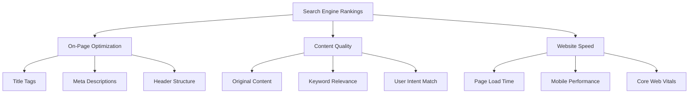
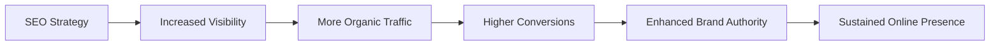
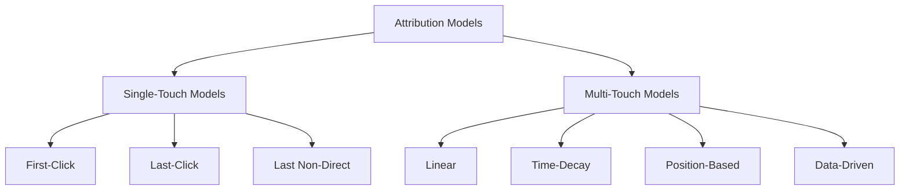
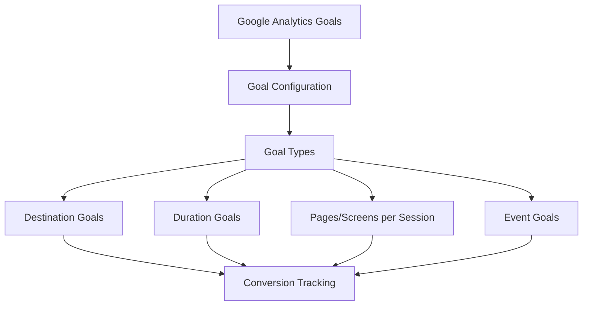
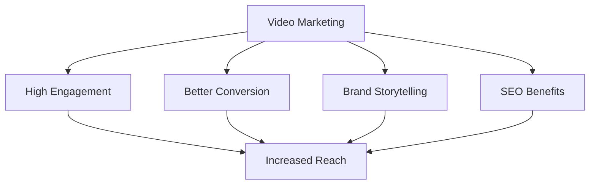
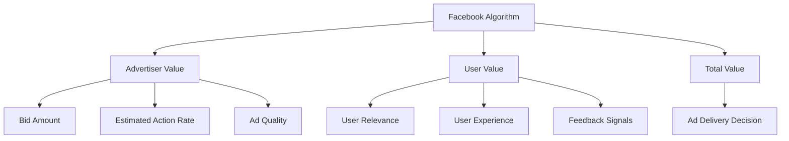
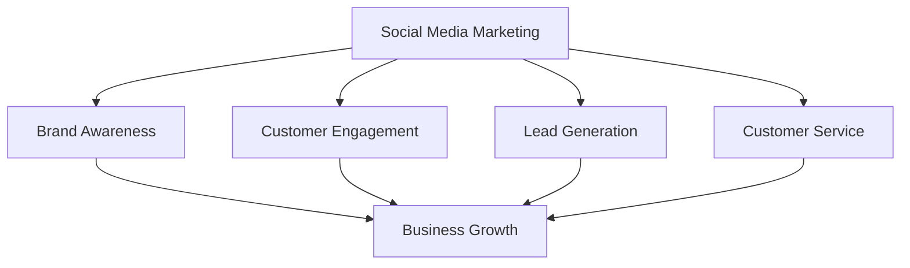
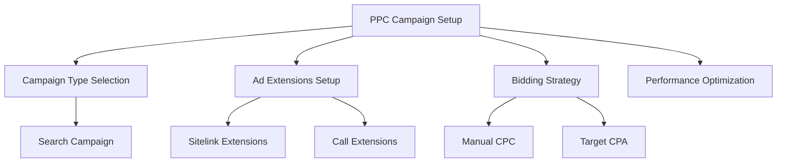
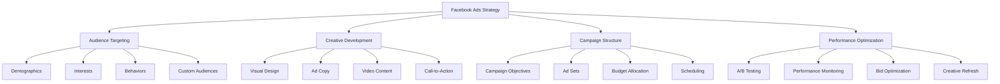

## Question 1(a) [3 marks]

**Explain SEO ranking?**

**Answer**:

SEO ranking refers to the position of a website or webpage in search engine results pages (SERPs) for specific keywords or queries.

**Key Components:**

| Factor | Description |
|--------|-------------|
| **Page Position** | Numerical position (1-10) on first page |
| **Search Visibility** | How often site appears in search results |
| **Keyword Relevance** | Match between content and search terms |

- **Higher ranking**: Better visibility and more organic traffic
- **Algorithm-based**: Google uses 200+ ranking factors
- **Dynamic nature**: Rankings change based on algorithm updates

**Mnemonic:** "SERP Success Starts with Smart SEO"

---

## Question 1(b) [4 marks]

**Describe the P.O.E.M. Framework in digital marketing**

**Answer**:

P.O.E.M. Framework is a strategic approach to categorize digital marketing channels and content distribution.

**Framework Components:**

| Channel Type | Definition | Examples |
|--------------|------------|----------|
| **Paid** | Purchased advertising space | Google Ads, Facebook Ads |
| **Owned** | Brand-controlled platforms | Website, Email lists |
| **Earned** | Third-party endorsements | Reviews, Social shares |
| **Managed** | Controlled social presence | Facebook Pages, Twitter |

- **Integrated approach**: Combines all channels for maximum reach
- **Cost optimization**: Balances paid and organic efforts
- **Brand control**: Maintains consistent messaging across channels

**Mnemonic:** "People Often Earn Money"

---

## Question 1(c) [7 marks]

**Discuss the importance of ethics and data privacy in digital marketing. How do ethical practices and a commitment to data privacy contribute to "Dignified Digital Marketing"**

**Answer**:

Ethics and data privacy form the foundation of responsible digital marketing practices in today's data-driven landscape.

**Ethical Importance:**

| Aspect | Significance |
|--------|-------------|
| **Consumer Trust** | Builds long-term relationships |
| **Legal Compliance** | Avoids GDPR/CCPA penalties |
| **Brand Reputation** | Maintains positive image |
| **Market Sustainability** | Ensures industry credibility |

**Data Privacy Practices:**

- **Transparent collection**: Clear consent mechanisms
- **Minimal data gathering**: Only necessary information
- **Secure storage**: Encrypted databases and access controls
- **User rights**: Easy opt-out and data deletion options

**Dignified Digital Marketing Benefits:**

- **Enhanced credibility**: Consumers trust ethical brands
- **Competitive advantage**: Differentiation through responsible practices
- **Regulatory compliance**: Proactive approach to privacy laws
- **Sustainable growth**: Long-term customer relationships

**Mnemonic:** "Trust Through Transparency Triumphs"

---

## Question 1(c) OR [7 marks]

**Differentiate between traditional marketing and digital marketing in terms of their reach, targeting, cost-effectiveness, and measurement of success.**

**Answer**:

**Comparison Analysis:**

| Factor | Traditional Marketing | Digital Marketing |
|--------|----------------------|-------------------|
| **Reach** | Local/Regional limitations | Global audience instantly |
| **Targeting** | Broad demographic groups | Precise behavioral targeting |
| **Cost** | High upfront investments | Flexible budget options |
| **Measurement** | Difficult to track ROI | Real-time analytics available |

**Detailed Differences:**

**Reach Capabilities:**

- **Traditional**: Geographic constraints, limited audience
- **Digital**: Worldwide accessibility, 24/7 availability

**Targeting Precision:**

- **Traditional**: Mass market approach, limited segmentation
- **Digital**: Individual-level targeting, behavioral data usage

**Cost Structure:**

- **Traditional**: Fixed costs, minimum spend requirements
- **Digital**: Pay-per-click, scalable budgets, micro-investments

**Success Measurement:**

- **Traditional**: Surveys, estimated reach calculations
- **Digital**: Click-through rates, conversion tracking, attribution models

**Mnemonic:** "Reach, Target, Cost, Measure - Digital's Better"

---

## Question 2(a) [3 marks]

**Compare White Hat SEO and Black Hat SEO**

**Answer**:

**SEO Practices Comparison:**

| Aspect | White Hat SEO | Black Hat SEO |
|--------|---------------|---------------|
| **Methods** | Ethical, guideline-compliant | Manipulative, rule-breaking |
| **Timeline** | Long-term sustainable results | Quick but temporary gains |
| **Risk** | Search engine approved | Penalty and ban risks |

- **White Hat**: Quality content, natural link building, user-focused optimization
- **Black Hat**: Keyword stuffing, hidden text, link farming
- **Consequences**: White Hat builds authority, Black Hat risks penalties

**Mnemonic:** "White is Right, Black Attacks"

---

## Question 2(b) [4 marks]

**Assume a website with outdated content and slow loading times, apply SEO tactics to improve its search engine rankings.**

**Answer**:

**SEO Improvement Strategy:**

```goat
Outdated Website Issues
         |
    +----+----+
    |         |
Content    Performance
Issues      Problems
    |         |
    v         v
Fresh      Speed
Content    Optimization
    |         |
    +----+----+
         |
   Improved Rankings
```

**Tactical Solutions:**

| Issue | SEO Tactic | Implementation |
|-------|------------|----------------|
| **Outdated Content** | Content refresh | Update with current information |
| **Slow Loading** | Performance optimization | Compress images, minimize code |
| **Poor Structure** | Technical SEO | Improve site architecture |

- **Content strategy**: Regular updates, trending topics, user-relevant information
- **Technical fixes**: CDN implementation, caching, mobile optimization
- **Monitoring**: Track page speed, user engagement metrics

**Mnemonic:** "Content Currency Creates Clicks"

---

## Question 2(c) [7 marks]

**Discuss how on-page optimization, content quality, and website speed contribute to better search engine rankings. Provide examples of specific techniques within these areas that can enhance a website's visibility**

**Answer**:

**SEO Ranking Factors:**



**On-Page Optimization Techniques:**

| Element | Best Practice | Example |
|---------|---------------|---------|
| **Title Tags** | Include primary keyword | "Best Digital Marketing Tools 2025" |
| **Meta Descriptions** | Compelling 155-160 characters | "Discover top digital marketing tools..." |
| **Header Tags** | Hierarchical structure | H1→H2→H3 logical flow |
| **Internal Linking** | Relevant page connections | Link related blog posts |

**Content Quality Factors:**

- **Originality**: Unique, valuable information
- **Depth**: Comprehensive topic coverage
- **Freshness**: Regular updates and current data
- **User engagement**: Time on page, low bounce rate

**Website Speed Optimization:**

- **Image compression**: WebP format, lazy loading
- **Code minification**: CSS, JavaScript optimization
- **Caching strategies**: Browser and server-side caching
- **CDN implementation**: Global content delivery

**Mnemonic:** "Optimize, Quality, Speed = Success"

---

## Question 2(a) OR [3 marks]

**Discuss the main steps involved in a search engine's process from crawling to ranking.**

**Answer**:

**Search Engine Process:**

| Step | Process | Description |
|------|---------|-------------|
| **1. Crawling** | Discovery | Bots find new/updated pages |
| **2. Indexing** | Storage | Content analyzed and stored |
| **3. Ranking** | Evaluation | Algorithm determines relevance |

- **Crawling**: Spider bots follow links, discover content
- **Indexing**: Content parsed, keywords identified, database storage
- **Ranking**: Algorithm evaluation, SERP position determination

**Mnemonic:** "Crawl, Index, Rank - Search Success"

---

## Question 2(b) OR [4 marks]

**Apply the concepts of on-page optimization to a website that has low search engine visibility. Suggest three specific on-page SEO tactics to improve its rankings**

**Answer**:

**On-Page SEO Improvement Plan:**

```goat
Low Visibility Website
         |
    +----+----+
    |    |    |
Title   Meta   Content
Optimization  Optimization
    |    |    |
    +----+----+
         |
   Better Rankings
```

**Three Key Tactics:**

| Tactic | Implementation | Expected Impact |
|--------|----------------|-----------------|
| **Title Tag Optimization** | Include primary keywords, brand name | Improved click-through rates |
| **Content Structure** | Add H1-H6 headers, bullet points | Better user experience |
| **Internal Linking** | Link to related pages, anchor text | Enhanced page authority |

- **Keyword placement**: Strategic positioning in titles, headers, first paragraph
- **Meta descriptions**: Compelling 155-character summaries
- **Image optimization**: Alt tags, descriptive filenames

**Mnemonic:** "Title, Structure, Link - Think Success"

---

## Question 2(c) OR [7 marks]

**Discuss the role of SEO in enhancing a website's online presence with example**

**Answer**:

SEO plays a crucial role in establishing and maintaining a strong digital footprint for businesses and organizations.

**SEO's Role in Online Presence:**



**Key Contributions:**

| Aspect | SEO Impact | Business Benefit |
|--------|------------|------------------|
| **Search Visibility** | Higher SERP rankings | More potential customers find you |
| **Credibility** | Authoritative content | Users trust top-ranked results |
| **User Experience** | Fast, mobile-friendly sites | Better engagement metrics |
| **Cost-Effective** | Organic traffic generation | Lower customer acquisition costs |

**Example: E-commerce Store:**
A local electronics store implemented SEO strategy:

- **Before**: Ranking on page 3 for "electronics store"
- **SEO actions**: Optimized product pages, local SEO, quality content
- **After**: Page 1 ranking, 300% traffic increase, 150% sales growth

**Long-term Benefits:**

- **Sustainable traffic**: Unlike paid ads, organic results persist
- **Brand building**: Consistent visibility builds recognition
- **Market expansion**: Reach customers actively searching for products

**Mnemonic:** "Search Engine Optimization = Sustainable Online Success"

---

## Question 3(a) [3 marks]

**Define Unique Visitors, Pageviews**

**Answer**:

**Web Analytics Definitions:**

| Metric | Definition | Measurement Period |
|--------|------------|-------------------|
| **Unique Visitors** | Distinct individuals visiting site | Specific time period |
| **Pageviews** | Total pages viewed | Individual page loads |

- **Unique Visitors**: Counted once per session, regardless of pages viewed
- **Pageviews**: Each page refresh or new page counts separately
- **Relationship**: One unique visitor can generate multiple pageviews

**Mnemonic:** "Unique Users, Viewed Pages"

---

## Question 3(b) [4 marks]

**How do Content Analytics Tools contribute to understanding a website's performance?**

**Answer**:

Content Analytics Tools provide insights into how users interact with website content, enabling data-driven optimization decisions.

**Contribution Areas:**

| Analysis Type | Insights Provided | Optimization Actions |
|---------------|-------------------|---------------------|
| **Content Performance** | Page popularity, engagement time | Focus on high-performing topics |
| **User Behavior** | Reading patterns, scroll depth | Improve content structure |
| **Conversion Tracking** | Content-to-conversion paths | Optimize conversion funnels |

- **Performance metrics**: Bounce rate, time on page, social shares
- **Content gaps**: Identify missing topics, user search queries
- **A/B testing**: Compare content variations for effectiveness
- **ROI measurement**: Connect content efforts to business goals

**Mnemonic:** "Content Analytics Create Actionable Insights"

---

## Question 3(c) [7 marks]

**Discuss the different attribution models used in web analytics with example.**

**Answer**:

Attribution models help marketers understand which touchpoints contribute to conversions in the customer journey.

**Attribution Model Types:**



**Model Comparison:**

| Model | Credit Distribution | Best Use Case |
|-------|-------------------|---------------|
| **First-Click** | 100% to first touchpoint | Brand awareness campaigns |
| **Last-Click** | 100% to final touchpoint | Direct response marketing |
| **Linear** | Equal credit to all touchpoints | Long sales cycles |
| **Time-Decay** | More credit to recent interactions | Short consideration periods |

**Example Customer Journey:**

1. **Facebook Ad** (Awareness) → 2. **Google Search** (Research) → 3. **Email** (Conversion)

**Attribution Results:**

- **First-Click**: Facebook Ad gets 100% credit
- **Last-Click**: Email gets 100% credit
- **Linear**: Each touchpoint gets 33.3% credit
- **Time-Decay**: Email 50%, Google 30%, Facebook 20%

**Choosing the Right Model:**

- **Business goals**: Awareness vs. conversion focus
- **Sales cycle length**: Short vs. long consideration periods
- **Marketing mix**: Single vs. multi-channel strategies

**Mnemonic:** "First, Last, Linear, Time - Attribution's Design"

---

## Question 3(a) OR [3 marks]

**Define Average Visit Duration, Bounce Rate, and New Visits.**

**Answer**:

**Web Analytics Metrics:**

| Metric | Definition | Calculation |
|--------|------------|-------------|
| **Average Visit Duration** | Time spent per session | Total time ÷ Sessions |
| **Bounce Rate** | Single-page sessions percentage | Bounces ÷ Total sessions × 100 |
| **New Visits** | First-time visitors percentage | New users ÷ Total users × 100 |

- **Visit Duration**: Indicates content engagement and user interest
- **Bounce Rate**: Shows content relevance and site usability
- **New Visits**: Measures audience growth and acquisition effectiveness

**Mnemonic:** "Duration, Bounce, New - Analytics True"

---

## Question 3(b) OR [4 marks]

**How do Customer Analytics Tools contribute to understanding a website's performance?**

**Answer**:

Customer Analytics Tools provide deep insights into user behavior, preferences, and conversion patterns.

**Key Contributions:**

| Analytics Area | Insights | Performance Impact |
|----------------|---------|-------------------|
| **User Segmentation** | Demographics, behavior patterns | Targeted content creation |
| **Journey Mapping** | Conversion paths, drop-off points | Optimized user experience |
| **Lifetime Value** | Customer worth, retention rates | ROI-focused strategies |

- **Behavioral analysis**: Click patterns, navigation preferences
- **Conversion optimization**: Identify friction points in user journey
- **Personalization**: Customized content based on user profiles
- **Retention strategies**: Understanding what keeps customers engaged

**Mnemonic:** "Customer Analytics Create Competitive Advantages"

---

## Question 3(c) OR [7 marks]

**Discuss the process of setting up goals and tracking conversion rates in Google Analytics with example.**

**Answer**:

Setting up goals and tracking conversions in Google Analytics enables measurement of website success and ROI optimization.

**Goal Setup Process:**



**Goal Types and Setup:**

| Goal Type | Description | Example Setup |
|-----------|-------------|---------------|
| **Destination** | Specific page visits | Thank you page URL |
| **Duration** | Session length | Sessions > 3 minutes |
| **Pages/Session** | Page views per visit | More than 5 pages |
| **Event** | Specific actions | Download button click |

**Example: E-commerce Conversion Setup:**

**Step-by-Step Process:**

1. **Access Goals**: Admin → View → Goals → New Goal
2. **Goal Type**: Destination (Thank you page)
3. **Goal Details**: 
   - Name: "Purchase Completion"
   - Type: Destination
   - Destination: "/thank-you"
4. **Funnel Setup**: Add checkout steps
5. **Value Assignment**: Average order value

**Conversion Rate Calculation:**

- **Formula**: (Conversions ÷ Sessions) × 100
- **Example**: 50 purchases ÷ 2,000 sessions = 2.5% conversion rate

**Tracking Benefits:**

- **Performance measurement**: Clear success metrics
- **ROI calculation**: Revenue attribution to marketing channels
- **Optimization opportunities**: Identify improvement areas
- **A/B testing**: Compare conversion rates of different versions

**Mnemonic:** "Goals Give Great Growth Guidance"

---

## Question 4(a) [3 marks]

**What are the types of Twitter Ads available for marketers?**

**Answer**:

**Twitter Advertising Options:**

| Ad Type | Purpose | Format |
|---------|---------|---------|
| **Promoted Tweets** | Increase engagement | Native tweet appearance |
| **Promoted Accounts** | Grow followers | Account suggestions |
| **Promoted Trends** | Topic visibility | Trending section placement |

- **Promoted Tweets**: Boost reach of existing tweets, drive clicks/conversions
- **Promoted Accounts**: Target users likely to follow, increase audience size
- **Promoted Trends**: Premium placement in trending topics, high visibility

**Mnemonic:** "Tweets, Accounts, Trends - Twitter Advertising Ends"

---

## Question 4(b) [4 marks]

**You have been assigned to develop a LinkedIn advertising campaign for a company's upcoming webinar. Outline the process for creating and optimizing LinkedIn Ads for this campaign. Include the types of LinkedIn ads you would choose, the content you would use, and how you would leverage LinkedIn Analytics to assess and enhance the campaign's effectiveness.**

**Answer**:

**LinkedIn Webinar Campaign Strategy:**

```goat
Webinar Campaign Planning
         |
    +----+----+
    |         |
Ad Types   Content
Selection  Strategy
    |         |
    v         v
Sponsored   Professional
Content     Messaging
    |         |
    +----+----+
         |
   Analytics &
   Optimization
```

**Campaign Development Process:**

| Phase | Action Items | Implementation |
|-------|-------------|----------------|
| **Ad Selection** | Choose Sponsored Content + Message Ads | Video content for engagement |
| **Targeting** | Professional demographics, job titles | IT professionals, decision-makers |
| **Content Creation** | Value proposition, clear CTA | "Join Expert-Led Marketing Webinar" |
| **Optimization** | A/B test headlines, monitor CTR | Adjust based on performance data |

**Recommended Ad Types:**

- **Sponsored Content**: Native feed placement, professional appearance
- **Message Ads**: Direct inbox delivery, personalized approach
- **Dynamic Ads**: Personalized creative based on profile data

**Content Strategy:**

- **Headlines**: "Master Digital Marketing: Free Expert Webinar"
- **Visuals**: Professional speaker photos, agenda highlights
- **CTA**: "Register Now - Limited Seats Available"

**LinkedIn Analytics Optimization:**

- **Track metrics**: Click-through rate, registration conversions
- **Audience insights**: Job titles, industries, company sizes responding
- **Budget allocation**: Shift spend to best-performing ad formats
- **Retargeting**: Follow up with non-converters using different messaging

**Mnemonic:** "Select, Target, Create, Optimize - LinkedIn Success"

---

## Question 4(c) [7 marks]

**Discuss the role and significance of video marketing in digital marketing strategies. How do YouTube Ads fit into a broader video marketing strategy?**

**Answer**:

Video marketing has become the cornerstone of modern digital marketing strategies, offering unparalleled engagement and conversion potential.

**Video Marketing Significance:**



**Strategic Importance:**

| Aspect | Impact | Business Value |
|--------|--------|----------------|
| **Engagement** | 10x higher than text content | Increased brand recall |
| **Conversion** | 80% more likely to purchase | Higher sales revenue |
| **SEO Value** | 53x more likely to rank first | Organic traffic growth |
| **Social Sharing** | 1200% more shares than text | Viral marketing potential |

**YouTube Ads Integration:**

**Ad Format Strategy:**

- **TrueView Ads**: Skippable format, cost-effective reach
- **Bumper Ads**: 6-second non-skippable, brand awareness
- **Discovery Ads**: Native placement in search results
- **Masthead Ads**: Premium homepage placement

**Broader Video Strategy Connection:**

- **Content funnel**: Awareness → Consideration → Conversion
- **Cross-platform distribution**: YouTube → Social media → Website
- **Retargeting opportunities**: Custom audiences from video viewers
- **Analytics integration**: Track view duration, engagement, conversions

**Implementation Framework:**

- **Content planning**: Educational, entertaining, promotional mix
- **Production quality**: Professional appearance, clear audio
- **Distribution strategy**: Organic and paid promotion balance
- **Performance measurement**: View time, click-through rates, conversions

**ROI Maximization:**

- **Audience targeting**: Demographics, interests, behaviors
- **Budget optimization**: Bid strategies, dayparting
- **Creative testing**: Multiple versions, performance comparison
- **Conversion tracking**: Link video views to business outcomes

**Mnemonic:** "Video Engages, Converts, and Scales Marketing Excellence"

---

## Question 4(a) OR [3 marks]

**Name two key features of LinkedIn's Campaign Manager.**

**Answer**:

**LinkedIn Campaign Manager Features:**

| Feature | Functionality | Benefit |
|---------|---------------|---------|
| **Audience Targeting** | Professional demographics, job functions | Precise B2B targeting |
| **Performance Analytics** | Real-time metrics, conversion tracking | Data-driven optimization |

- **Audience Targeting**: Industry, company size, job title, skills-based segmentation
- **Performance Analytics**: CTR, CPC, conversion tracking, A/B testing capabilities

**Mnemonic:** "Target Accurately, Analyze Performance"

---

## Question 4(b) OR [4 marks]

**You are tasked with creating an advertising campaign on Instagram for a new product launch. Outline the steps you would take to create and optimize Instagram Ads, including the types of content you would use.**

**Answer**:

**Instagram Product Launch Campaign:**

```goat
Product Launch Strategy
         |
    +----+----+----+
    |    |    |    |
Content Ad    Targeting Optimization
Planning Format Budget    Analytics
    |    |    |    |
    v    v    v    v
Visual Stories Interest Performance
Content Ads   Groups  Tracking
```

**Campaign Development Steps:**

| Step | Action | Implementation |
|------|--------|----------------|
| **1. Content Creation** | Visual storytelling | Product photos, lifestyle images |
| **2. Ad Format Selection** | Feed + Stories + Reels | Multi-format approach |
| **3. Targeting Setup** | Demographics + interests | Lookalike audiences |
| **4. Budget Allocation** | Daily spend limits | Performance-based optimization |

**Content Strategy:**

- **Feed Posts**: High-quality product photography, lifestyle contexts
- **Stories Ads**: Behind-the-scenes content, user-generated content
- **Reels**: Trending audio, product demonstrations, tutorials
- **Carousel Ads**: Multiple product angles, feature highlights

**Optimization Tactics:**

- **A/B testing**: Headlines, visuals, call-to-action buttons
- **Audience refinement**: Age, interests, behaviors based on performance
- **Budget reallocation**: Shift spend to best-performing ad sets
- **Creative refresh**: Regular content updates to prevent ad fatigue

**Mnemonic:** "Create, Choose, Target, Track - Instagram Impact"

---

## Question 4(c) OR [7 marks]

**Explain the importance of understanding Facebook's advertising algorithm and how it affects ad delivery.**

**Answer**:

Understanding Facebook's advertising algorithm is crucial for maximizing ad performance and achieving optimal return on investment.

**Algorithm Components:**



**Algorithm Factors:**

| Component | Weight | Impact on Delivery |
|-----------|--------|-------------------|
| **Bid Strategy** | High | Budget allocation efficiency |
| **Ad Relevance** | High | Quality score determination |
| **User Engagement** | Medium | Audience response prediction |
| **Landing Page** | Medium | Overall user experience |

**Ad Delivery Process:**

1. **Auction Entry**: Ad enters real-time bidding
2. **Value Calculation**: Algorithm scores ad relevance and quality
3. **Winner Selection**: Highest total value wins placement
4. **Performance Feedback**: Results influence future delivery

**Optimization Strategies:**

**For Better Algorithm Performance:**

- **Relevance scoring**: Create content matching audience interests
- **Engagement optimization**: Use compelling visuals and copy
- **Landing page alignment**: Ensure ad-to-page consistency
- **Feedback monitoring**: Address negative feedback promptly

**Ad Quality Factors:**

- **Visual appeal**: High-resolution images, professional design
- **Copy relevance**: Message alignment with target audience
- **Call-to-action**: Clear, compelling action prompts
- **Mobile optimization**: Responsive design for all devices

**Performance Impact:**

- **Cost efficiency**: Better algorithm scores reduce cost-per-click
- **Reach optimization**: Higher quality ads get broader distribution
- **Conversion improvement**: Relevant ads drive better results
- **Long-term sustainability**: Consistent performance builds account strength

**Measurement and Adjustment:**

- **Relevance diagnostics**: Monitor quality rankings
- **A/B testing**: Compare different creative approaches
- **Audience insights**: Understand what resonates with users
- **Performance tracking**: Correlate algorithm scores with business outcomes

**Mnemonic:** "Algorithm Awareness Achieves Advertising Advantage"

---

## Question 5(a) [3 marks]

**List and briefly describe the different types of Email Marketing.**

**Answer**:

**Email Marketing Types:**

| Type | Purpose | Content Focus |
|------|---------|---------------|
| **Newsletter** | Regular communication | Company updates, industry news |
| **Promotional** | Sales and offers | Discount codes, product launches |
| **Transactional** | Purchase confirmation | Order receipts, shipping updates |

- **Newsletter**: Brand awareness, customer retention, thought leadership
- **Promotional**: Drive sales, promote events, seasonal campaigns
- **Transactional**: Order confirmations, welcome series, account updates

**Mnemonic:** "News, Promote, Transact - Email's Impact"

---

## Question 5(b) [4 marks]

**You are planning an email marketing campaign for a new product launch. Outline the steps you would take to design and execute this campaign, including how you would use email marketing analytics to measure its success.**

**Answer**:

**Email Campaign Strategy:**

```goat
Product Launch Email Campaign
         |
    +----+----+----+
    |    |    |    |
Planning Design  Execution Analytics
Phase   Phase   Phase    Phase
    |    |    |    |
    v    v    v    v
Target  Email  Send    Measure
Audience Template Schedule Results
```

**Campaign Development Process:**

| Phase | Activities | Key Deliverables |
|-------|------------|------------------|
| **Planning** | Audience segmentation, goal setting | Target lists, KPIs |
| **Design** | Template creation, content writing | Email templates, copy |
| **Execution** | Send scheduling, A/B testing | Campaign deployment |
| **Analytics** | Performance tracking, optimization | Reports, insights |

**Implementation Steps:**

- **Audience segmentation**: Demographics, purchase history, engagement levels
- **Content strategy**: Teaser sequence, launch announcement, follow-up series
- **Design elements**: Mobile-responsive templates, compelling visuals
- **Testing approach**: Subject lines, send times, call-to-action buttons

**Analytics Measurement:**

- **Open rates**: Subject line effectiveness, sender reputation
- **Click-through rates**: Content relevance, call-to-action performance
- **Conversion rates**: Landing page effectiveness, offer appeal
- **Unsubscribe rates**: Content quality, frequency appropriateness

**Mnemonic:** "Plan, Design, Execute, Analyze - Email Success"

---

## Question 5(c) [7 marks]

**Discuss the importance of social media marketing in today's digital landscape.**

**Answer**:

Social media marketing has become an indispensable component of digital marketing strategies, fundamentally changing how brands interact with consumers.

**Strategic Importance:**



**Key Significance Areas:**

| Aspect | Impact | Business Value |
|--------|--------|----------------|
| **Global Reach** | 4.8 billion users worldwide | Massive audience potential |
| **Cost Effectiveness** | Lower than traditional media | Higher ROI opportunities |
| **Real-time Engagement** | Instant customer interaction | Improved relationships |
| **Targeted Advertising** | Precise demographic targeting | Efficient budget utilization |

**Platform-Specific Benefits:**

**Facebook:**

- **Community building**: Groups, pages, events
- **Diverse content**: Text, images, videos, live streams
- **Advanced targeting**: Detailed demographic and behavioral options
- **E-commerce integration**: Shop features, catalog advertising

**Instagram:**

- **Visual storytelling**: High-quality imagery, aesthetic appeal
- **Influencer marketing**: Partnership opportunities, authentic content
- **Shopping features**: Product tags, shoppable posts
- **Stories format**: Temporary content, behind-the-scenes access

**LinkedIn:**

- **B2B networking**: Professional relationships, industry connections
- **Thought leadership**: Industry insights, expert positioning
- **Recruitment marketing**: Talent acquisition, employer branding
- **Lead generation**: Professional targeting, decision-maker reach

**Twitter:**

- **Real-time updates**: News, trends, immediate communication
- **Customer service**: Quick response, public problem resolution
- **Hashtag marketing**: Trending topics, viral content potential
- **Thought leadership**: Industry discussions, expert opinions

**YouTube:**

- **Video marketing**: Engaging content format, high retention
- **SEO benefits**: Search visibility, Google integration
- **Educational content**: Tutorials, demonstrations, how-to guides
- **Monetization**: Ad revenue, sponsorship opportunities

**Current Digital Landscape Impact:**

**Consumer Behavior Changes:**

- **Research habits**: 71% research brands on social before purchasing
- **Trust factors**: Peer reviews and recommendations influence decisions
- **Communication preferences**: Direct messaging over email or phone
- **Content consumption**: Short-form video content dominance

**Business Transformation:**

- **Customer acquisition**: Social media as primary discovery channel
- **Brand building**: Authentic storytelling, personality development
- **Crisis management**: Real-time response capabilities
- **Market research**: Social listening for consumer insights

**Competitive Advantages:**

- **First-mover benefit**: Early platform adoption advantages
- **Community building**: Loyal follower base development
- **User-generated content**: Authentic brand advocacy
- **Viral potential**: Exponential reach through sharing

**Future Considerations:**

- **Privacy regulations**: Adaptation to data protection laws
- **Algorithm changes**: Platform policy adjustments
- **Emerging platforms**: New channel opportunities
- **Integration needs**: Omnichannel experience consistency

**Mnemonic:** "Social Media Makes Modern Marketing Meaningful"

---

## Question 5(a) OR [3 marks]

**What are the different types of Google Ads Campaigns? Provide a brief description of each.**

**Answer**:

**Google Ads Campaign Types:**

| Campaign Type | Purpose | Placement |
|---------------|---------|-----------|
| **Search** | Text ads in search results | Google Search pages |
| **Display** | Visual ads across websites | Google Display Network |
| **Video** | Video advertisements | YouTube platform |
| **Shopping** | Product showcase ads | Google Shopping, Search |
| **App** | Mobile app promotion | Cross-platform placement |

- **Search**: Keyword-targeted text ads, high intent audience
- **Display**: Banner ads, broad reach, visual appeal
- **Video**: YouTube ads, engaging content format
- **Shopping**: Product images, prices, direct purchase links
- **App**: App downloads, in-app actions, user acquisition

**Mnemonic:** "Search, Display, Video, Shopping, App - Google's Map"

---

## Question 5(b) OR [4 marks]

**Imagine you are setting up a Pay-Per-Click (PPC) campaign using Google Ads. Describe the process of creating the campaign, including selecting the type of Google Ads campaign, setting up ad extensions, and choosing bidding and ranking strategies to optimize ad performance.**

**Answer**:

**PPC Campaign Setup Process:**



**Step-by-Step Process:**

| Step | Action | Implementation Details |
|------|--------|----------------------|
| **1. Campaign Selection** | Choose Search Campaign | High-intent keyword targeting |
| **2. Ad Extensions** | Add relevant extensions | Sitelinks, callouts, structured snippets |
| **3. Bidding Setup** | Select bidding strategy | Target CPA or Maximize Conversions |
| **4. Optimization** | Monitor and adjust | Keyword performance, ad testing |

**Campaign Type Selection:**

- **Search Campaign**: Best for immediate conversions, keyword-based targeting
- **Target audience**: Users actively searching for products/services
- **Budget allocation**: Focus on high-commercial intent keywords

**Ad Extensions Configuration:**

- **Sitelink Extensions**: Additional page links (Products, Services, Contact)
- **Call Extensions**: Phone number display for mobile users
- **Location Extensions**: Business address and directions
- **Callout Extensions**: Highlight unique selling points
- **Structured Snippets**: Specific aspects (Brands, Services, Destinations)

**Bidding Strategy Options:**

- **Manual CPC**: Full control over individual keyword bids
- **Target CPA**: Automated bidding for specific cost-per-acquisition
- **Maximize Conversions**: Automated bid optimization within budget
- **Target ROAS**: Return on ad spend optimization

**Performance Optimization:**

- **Keyword research**: Negative keywords, long-tail opportunities
- **Ad copy testing**: Multiple versions, performance comparison
- **Landing page alignment**: Message consistency, conversion optimization
- **Quality Score improvement**: Relevance, click-through rate, landing page experience

**Mnemonic:** "Select, Extend, Bid, Optimize - PPC Success Route"

---

## Question 5(c) OR [7 marks]

**Describe the key components of a successful Facebook Ads strategy.**

**Answer**:

A successful Facebook Ads strategy requires careful planning, execution, and optimization across multiple interconnected components.

**Strategic Framework:**



**Key Strategy Components:**

| Component | Elements | Success Factors |
|-----------|----------|-----------------|
| **Audience Targeting** | Demographics, interests, behaviors | Precise targeting, relevant reach |
| **Creative Excellence** | Visuals, copy, video content | Engagement, brand consistency |
| **Campaign Structure** | Objectives, budgets, scheduling | Clear goals, efficient spending |
| **Optimization** | Testing, monitoring, adjustments | Data-driven decisions |

**Audience Targeting Strategy:**

**Core Audiences:**

- **Demographics**: Age, gender, location, education, income
- **Interests**: Hobbies, activities, brand preferences
- **Behaviors**: Purchase behavior, device usage, travel patterns
- **Connections**: Friends of page fans, app users, event attendees

**Custom Audiences:**

- **Website visitors**: Pixel-based retargeting
- **Customer lists**: Email subscribers, CRM data
- **App users**: Mobile app engagement tracking
- **Engagement audiences**: Video viewers, page interactions

**Lookalike Audiences:**

- **Source selection**: Best customers, high-value segments
- **Audience size**: 1-10% similarity range
- **Geographic targeting**: Country-specific expansion
- **Regular updates**: Fresh data for accuracy

**Creative Development:**

**Visual Content:**

- **High-quality images**: Professional photography, brand consistency
- **Video content**: Motion graphics, product demonstrations
- **Carousel format**: Multiple products, storytelling sequence
- **Mobile optimization**: Vertical formats, thumb-stopping visuals

**Ad Copy Strategy:**

- **Headlines**: Attention-grabbing, benefit-focused
- **Body text**: Clear value proposition, emotional appeal
- **Call-to-action**: Action-oriented, urgency creation
- **Social proof**: Testimonials, reviews, user-generated content

**Campaign Structure:**

**Objective Selection:**

- **Awareness**: Brand awareness, reach campaigns
- **Consideration**: Traffic, engagement, video views
- **Conversion**: Lead generation, sales, app installs
- **Retention**: Remarketing, customer lifetime value

**Budget Strategy:**

- **Campaign budget**: Overall spending limits
- **Ad set budgets**: Audience-specific allocation
- **Bidding strategy**: Cost control, performance optimization
- **Schedule optimization**: Peak performance timing

**Performance Optimization:**

**Testing Framework:**

- **A/B testing**: Creative variations, audience segments
- **Statistical significance**: Proper test duration, sample size
- **Performance metrics**: CTR, CPC, conversion rate, ROAS
- **Winner implementation**: Scale successful variations

**Monitoring and Adjustment:**

- **Daily monitoring**: Budget pacing, performance trends
- **Weekly optimization**: Bid adjustments, audience refinement
- **Monthly review**: Strategy assessment, campaign restructuring
- **Quarterly planning**: Long-term goal alignment, budget reallocation

**Success Measurement:**

- **Key Performance Indicators**: Align with business objectives
- **Attribution modeling**: Multi-touch conversion tracking
- **Return on Investment**: Revenue attribution, profit calculation
- **Customer Lifetime Value**: Long-term impact assessment

**Advanced Strategies:**

- **Dynamic product ads**: Automated retargeting
- **Messenger integration**: Conversational marketing
- **Instagram placement**: Cross-platform optimization
- **Facebook Shops**: E-commerce integration

**Mnemonic:** "Target Accurately, Create Compellingly, Structure Strategically, Optimize Continuously"
