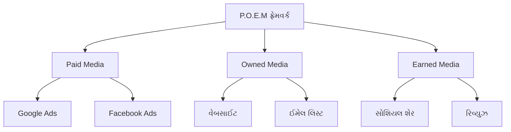
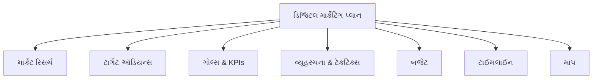
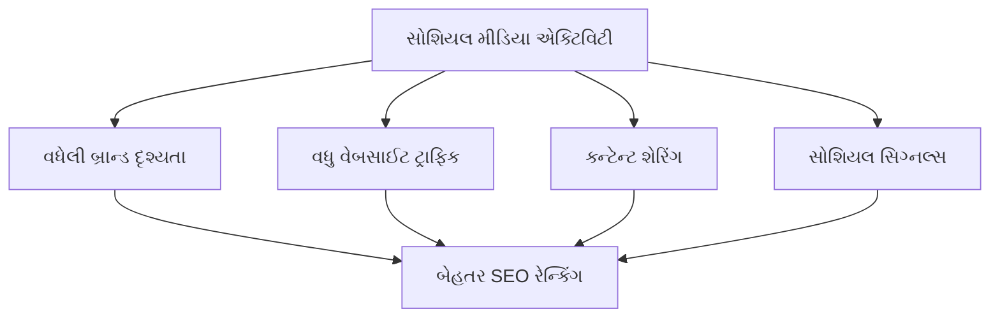
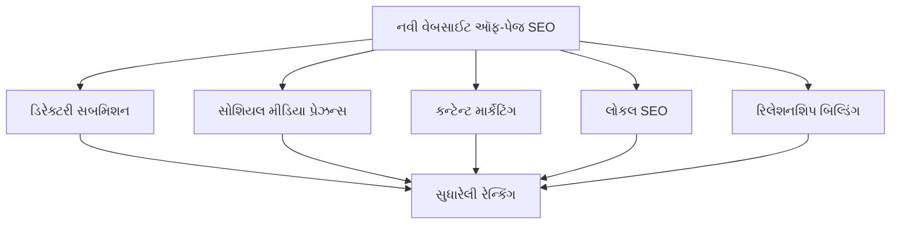
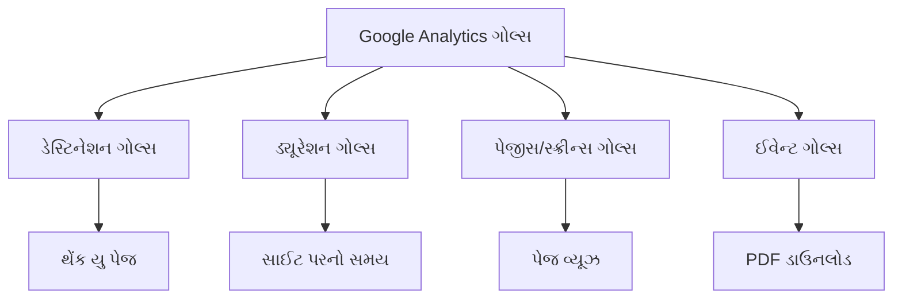
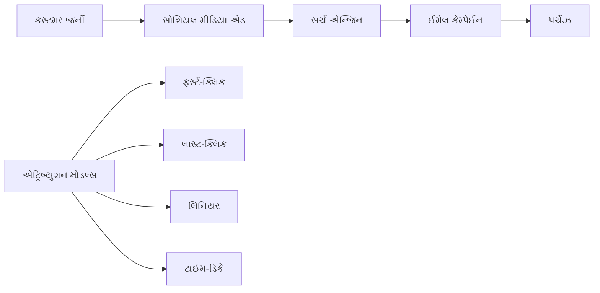
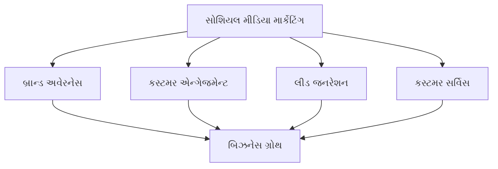
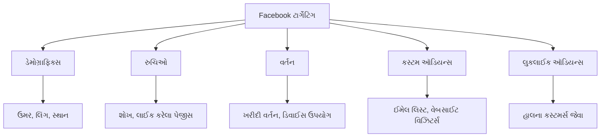
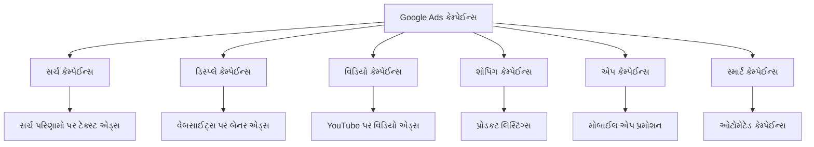
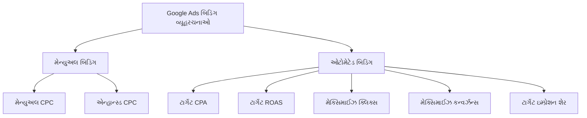

## પ્રશ્ન 1(અ) [3 ગુણ]

**ડિજિટલ માર્કેટિંગમાં SEO ની જરૂરિયાતનું વર્ણન કરો.**

**જવાબ:**

SEO એ ઓનલાઈન દૃશ્યતા અને બિઝનેસ વૃદ્ધિ માટે આવશ્યક છે.

| જરૂરિયાત | વર્ણન |
|---------|--------|
| **દૃશ્યતા** | વેબસાઈટને ટોપ સર્ચ રિઝલ્ટમાં દેખાવવામાં મદદ કરે |
| **ટ્રાફિક** | પેઈડ એડ્સ વિના ઓર્ગેનિક વિઝિટર્સ લાવે |
| **વિશ્વસનીયતા** | ઉચ્ચ રેન્કિંગ યુઝર્સ સાથે વિશ્વાસ બનાવે |
| **ખર્ચ-અસરકારક** | સતત એડ ખર્ચ વિના લાંબા સમયના પરિણામો |

- **વધારાની દૃશ્યતા**: SEO વેબસાઈટને સર્ચ એન્જિનમાં ઉચ્ચ રેન્ક કરવામાં મદદ કરે
- **ઓર્ગેનિક ટ્રાફિક**: જાહેરાતના ખર્ચ વિના ગુણવત્તાવાળા વિઝિટર્સ લાવે
- **બ્રાન્ડ વિશ્વસનીયતા**: ટોપ રેન્કિંગ બિઝનેસ ઓથોરિટી સ્થાપિત કરે

**મેમરી ટ્રીક:** "VTC - Visibility, Traffic, Credibility"

## પ્રશ્ન 1(બ) [4 ગુણ]

**ટ્રેડિશનલ માર્કેટિંગ અને ડિજિટલ માર્કેટિંગ વચ્ચે તફાવત આપો.**

**જવાબ:**

ડિજિટલ માર્કેટિંગ પરંપરાગત પદ્ધતિઓની સરખામણીમાં લક્ષિત પહોંચ અને માપી શકાય તેવા પરિણામો પ્રદાન કરે છે.

| પાસું | ટ્રેડિશનલ માર્કેટિંગ | ડિજિટલ માર્કેટિંગ |
|------|-------------------|------------------|
| **પહોંચ** | સ્થાનિક/પ્રાદેશિક | વૈશ્વિક |
| **ખર્ચ** | ઊંચો | નીચો |
| **ટાર્ગેટિંગ** | વ્યાપક પ્રેક્ષકો | ચોક્કસ ડેમોગ્રાફિક્સ |
| **માપ** | ટ્રેક કરવું મુશ્કેલ | રીઅલ-ટાઈમ એનાલિટિક્સ |
| **ઇન્ટરેક્શન** | એકતરફી વાતચીત | બે-તરફી જોડાણ |

- **ખર્ચ કાર્યક્ષમતા**: ડિજિટલ માર્કેટિંગ ઓછા રોકાણની જરૂર છે
- **રીઅલ-ટાઈમ ટ્રેકિંગ**: તાત્કાલિક પ્રદર્શન માપ ઉપલબ્ધ
- **વૈશ્વિક પહોંચ**: વિશ્વવ્યાપી દર્શકોને તાત્કાલિક પ્રવેશ

**મેમરી ટ્રીક:** "GRIM - Global, Real-time, Interactive, Measurable"

## પ્રશ્ન 1(ક) [7 ગુણ]

**P.O.E.M. ફ્રેમવર્કના કોમ્પોનેન્ટસ અને તેમનું ડિજિટલ માર્કેટિંગમાં મહત્વ સમજાવો.**

**જવાબ:**

P.O.E.M. ફ્રેમવર્ક વ્યાપક ડિજિટલ માર્કેટિંગ વ્યૂહરચના માટે મીડિયા પ્રકારોનું વર્ગીકરણ કરે છે.



| કોમ્પોનેન્ટ | વ્યાખ્યા | ઉદાહરણો | મહત્વ |
|-----------|--------|--------|-------|
| **Paid Media** | પેમેન્ટ દ્વારા પ્રમોશનલ કન્ટેન્ટ | Google Ads, Facebook Ads | તાત્કાલિક દૃશ્યતા અને ટ્રાફિક |
| **Owned Media** | બ્રાન્ડ દ્વારા કંટ્રોલ કરાતું કન્ટેન્ટ | વેબસાઈટ, ઈમેલ લિસ્ટ | લાંબા ગાળાના સંબંધો બનાવે |
| **Earned Media** | યુઝર્સ દ્વારા ઓર્ગેનિક ઉલ્લેખ | રિવ્યુઝ, સોશિયલ શેર | પ્રામાણિક વિશ્વસનીયતા |

- **Paid Media**: તાત્કાલિક પહોંચ અને માપી શકાય તેવા ROI પ્રદાન કરે
- **Owned Media**: સીધા ગ્રાહક સંબંધો અને બ્રાન્ડ કંટ્રોલ બનાવે
- **Earned Media**: યુઝર-જનરેટેડ કન્ટેન્ટ દ્વારા પ્રામાણિક વિશ્વાસ બનાવે

**મેમરી ટ્રીક:** "POE - Pay for reach, Own relationships, Earn trust"

## પ્રશ્ન 1(ક OR) [7 ગુણ]

**ડિજિટલ માર્કેટિંગ પ્લાનના મુખ્ય કોમ્પોનેન્ટસ સમજાવો.**

**જવાબ:**

ડિજિટલ માર્કેટિંગ પ્લાન ઓનલાઈન બિઝનેસ સફળતા માટે સંરચિત અભિગમ પ્રદાન કરે છે.



| કોમ્પોનેન્ટ | વર્ણન | હેતુ |
|-----------|-------|------|
| **માર્કેટ રિસર્ચ** | ઇન્ડસ્ટ્રી અને કોમ્પિટિટર એનાલિસિસ | માર્કેટ લેન્ડસ્કેપ સમજવું |
| **ટાર્ગેટ ઑડિયન્સ** | ડેમોગ્રાફિક્સ અને સાઈકોગ્રાફિક્સ | ફોકસ્ડ મેસેજિંગ |
| **ગોલ્સ & KPIs** | ચોક્કસ માપી શકાય તેવા ઉદ્દેશ્યો | પ્રદર્શન ટ્રેકિંગ |
| **વ્યૂહરચના & ટેકટિક્સ** | ચેનલ્સ અને કન્ટેન્ટ અભિગમ | અમલીકરણ રોડમેપ |
| **બજેટ એલોકેશન** | રિસોર્સ વિતરણ | ખર્ચ મેનેજમેન્ટ |
| **ટાઈમલાઈન** | કેમ્પેઈન શેડ્યુલિંગ | પ્રોજેક્ટ મેનેજમેન્ટ |
| **માપ** | એનાલિટિક્સ અને રિપોર્ટિંગ | સતત સુધારણા |

- **સ્પષ્ટ ઉદ્દેશ્યો**: SMART ગોલ્સ ફોકસ્ડ પ્રયાસો સુનિશ્ચિત કરે
- **ઑડિયન્સ ટાર્ગેટિંગ**: ચોક્કસ ડેમોગ્રાફિક્સ કન્વર્ઝન રેટ સુધારે
- **પ્રદર્શન ટ્રેકિંગ**: નિયમિત માપ ઓપ્ટિમાઈઝેશન સક્ષમ કરે

**મેમરી ટ્રીક:** "RATSBUM - Research, Audience, Tactics, Strategy, Budget, Measurement"

## પ્રશ્ન 2(અ) [3 ગુણ]

**બ્લેક હેટ અને વ્હાઈટ હેટ SEO તકનીકો વચ્ચે તફાવત આપો.**

**જવાબ:**

વ્હાઈટ હેટ SEO ગાઈડલાઈન્સ અનુસરે છે જ્યારે બ્લેક હેટ ઝડપી પરિણામો માટે પ્રતિબંધિત પદ્ધતિઓનો ઉપયોગ કરે છે.

| પાસું | વ્હાઈટ હેટ SEO | બ્લેક હેટ SEO |
|------|---------------|---------------|
| **પદ્ધતિઓ** | નૈતિક પ્રેક્ટિસ | મેનિપ્યુલેટિવ ટેકનીક |
| **પરિણામો** | ટકાઉ રેન્કિંગ | અસ્થાયી લાભ |
| **જોખમ** | પેનાલ્ટીથી સુરક્ષિત | ઉચ્ચ પેનાલ્ટી જોખમ |
| **ઉદાહરણો** | ગુણવત્તાવાળું કન્ટેન્ટ, પ્રાકૃતિક લિંક | કીવર્ડ સ્ટફિંગ, છુપાયેલું ટેક્સ્ટ |

- **વ્હાઈટ હેટ**: યુઝર એક્સપિરિયન્સ અને ગુણવત્તાવાળા કન્ટેન્ટ પર ફોકસ કરે
- **બ્લેક હેટ**: સર્ચ એન્જિન એલ્ગોરિધમને છેતરવાનો પ્રયાસ કરે
- **લાંબા ગાળાની અસર**: વ્હાઈટ હેટ ચાલુ સફળતા બનાવે

**મેમરી ટ્રીક:** "WS-BT - White Sustainable, Black Temporary"

## પ્રશ્ન 2(બ) [4 ગુણ]

**SEO રેન્કિંગને અસર કરતા પરિબળોની ચર્ચા કરો.**

**જવાબ:**

ઘણા પરિબળો સર્ચ એન્જિનો વેબસાઈટને પરિણામોમાં કેવી રીતે રેન્ક કરે છે તેને પ્રભાવિત કરે છે.

| પરિબળ કેટેગરી | ચોક્કસ પરિબળો |
|---------------|----------------|
| **કન્ટેન્ટ ગુણવત્તા** | સુસંગતતા, મૌલિકતા, કીવર્ડ ઓપ્ટિમાઈઝેશન |
| **ટેકનિકલ SEO** | પેજ સ્પીડ, મોબાઈલ-ફ્રેન્ડલીનેસ, SSL |
| **યુઝર એક્સપિરિયન્સ** | બાઉન્સ રેટ, સાઈટ પરનો સમય, નેવિગેશન |
| **ઓથોરિટી** | બેકલિંક્સ, ડોમેઈન એજ, સોશિયલ સિગ્નલ્સ |

- **કન્ટેન્ટ સુસંગતતા**: ઉચ્ચ-ગુણવત્તાવાળું, મૌલિક કન્ટેન્ટ બેહતર રેન્ક કરે
- **ટેકનિકલ ઓપ્ટિમાઈઝેશન**: ઝડપી લોડિંગ અને મોબાઈલ-ફ્રેન્ડલી સાઈટ પસંદ
- **યુઝર એન્ગેજમેન્ટ**: ઓછા બાઉન્સ રેટ મૂલ્યવાન કન્ટેન્ટ દર્શાવે
- **બાહ્ય ઓથોરિટી**: ગુણવત્તાવાળા બેકલિંક્સ વિશ્વસનીયતા વધારે

**મેમરી ટ્રીક:** "CTUA - Content, Technical, User experience, Authority"

## પ્રશ્ન 2(ક) [7 ગુણ]

**કેવી રીતે સોશિયલ મીડિયા SEO રેન્કિંગને સુધારી શકે છે? યોગ્ય ઉદાહરણ સાથે સમજાવો.**

**જવાબ:**

સોશિયલ મીડિયા વધેલી દૃશ્યતા અને એન્ગેજમેન્ટ સિગ્નલ્સ દ્વારા પરોક્ષ રીતે SEO વધારે છે.



| સોશિયલ મીડિયા અસર | SEO લાભ | ઉદાહરણ |
|-------------------|---------|---------|
| **કન્ટેન્ટ શેરિંગ** | વધેલા બેકલિંક્સ | LinkedIn પર શેર થયેલ બ્લોગ પોસ્ટ ઇન્ડસ્ટ્રી સાઈટ્સ દ્વારા લિંક થાય |
| **બ્રાન્ડ મેન્શન્સ** | ઓથોરિટી બિલ્ડિંગ | Twitter મેન્શન્સ બ્રાન્ડ સર્ચ વધારે |
| **ટ્રાફિક જનરેશન** | યુઝર એન્ગેજમેન્ટ સિગ્નલ્સ | Facebook પોસ્ટ ટ્રાફિક લાવે, બાઉન્સ રેટ ઘટાડે |
| **લોકલ પ્રેઝન્સ** | લોકલ SEO બૂસ્ટ | Google My Business પોસ્ટ લોકલ રેન્કિંગ સુધારે |

**ઉદાહરણ**: એક રેસ્ટોરન્ટ Instagram પર લોકેશન ટેગ્સ સાથે ફૂડ ફોટોઝ શેર કરે છે. આનાથી વધે છે:

- લોકલ બ્રાન્ડ સર્ચ
- સોશિયલ મીડિયાથી વેબસાઈટ વિઝિટ
- યુઝર-જનરેટેડ કન્ટેન્ટ અને રિવ્યુઝ
- એકંદર ઓનલાઈન પ્રેઝન્સ

- **સોશિયલ સિગ્નલ્સ**: સર્ચ એન્જિનો સોશિયલ એન્ગેજમેન્ટને ગુણવત્તા સૂચક માને
- **ટ્રાફિક બૂસ્ટ**: સોશિયલ મીડિયા યોગ્ય વિઝિટર્સ વેબસાઈટ પર લાવે
- **કન્ટેન્ટ એમ્પ્લિફિકેશન**: સોશિયલ શેરિંગ કન્ટેન્ટની પહોંચ અને સંભવિત બેકલિંક્સ વધારે

**મેમરી ટ્રીક:** "STAB - Signals, Traffic, Amplification, Branding"

## પ્રશ્ન 2(અ OR) [3 ગુણ]

**ઑન-પેજ SEO અને ઑફ-પેજ SEO વચ્ચે તફાવત આપો.**

**જવાબ:**

ઑન-પેજ SEO વેબસાઈટ એલિમેન્ટ્સ ઓપ્ટિમાઈઝ કરે છે જ્યારે ઑફ-પેજ બાહ્ય ઓથોરિટી બનાવે છે.

| પાસું | ઑન-પેજ SEO | ઑફ-પેજ SEO |
|------|-------------|-------------|
| **સ્થાન** | વેબસાઈટની અંદર | બાહ્ય વેબસાઈટ્સ |
| **કંટ્રોલ** | સંપૂર્ણ કંટ્રોલ | મર્યાદિત કંટ્રોલ |
| **ફોકસ** | કન્ટેન્ટ અને ટેકનિકલ | ઓથોરિટી અને ટ્રસ્ટ |
| **ઉદાહરણો** | ટાઈટલ ટેગ્સ, મેટા ડિસ્ક્રિપ્શન | બેકલિંક્સ, સોશિયલ શેર |

- **ઑન-પેજ**: કન્ટેન્ટ, HTML ટેગ્સ અને સાઈટ સ્ટ્રક્ચર ઓપ્ટિમાઈઝ કરે
- **ઑફ-પેજ**: બાહ્ય સિગ્નલ્સ અને લિંક્સ દ્વારા ઓથોરિટી બનાવે
- **સંયોજન**: વ્યાપક SEO સફળતા માટે બંનેની જરૂર

**મેમરી ટ્રીક:** "In-Out - Internal optimization, Outside authority"

## પ્રશ્ન 2(બ OR) [4 ગુણ]

**SEO રેન્કિંગને સુધારવાની વિવિધ રીતોની ચર્ચા કરો.**

**જવાબ:**

ઘણી વ્યૂહરચનાઓ સર્ચ પરિણામોમાં વેબસાઈટની દૃશ્યતા વધારી શકે છે.

| વ્યૂહરચના | અમલીકરણ |
|----------|----------|
| **કન્ટેન્ટ ઓપ્ટિમાઈઝેશન** | કીવર્ડ રિસર્ચ, ગુણવત્તાવાળું લેખન, નિયમિત અપડેટ્સ |
| **ટેકનિકલ SEO** | પેજ સ્પીડ, મોબાઈલ ઓપ્ટિમાઈઝેશન, SSL સર્ટિફિકેટ |
| **લિંક બિલ્ડિંગ** | ગેસ્ટ પોસ્ટિંગ, ડિરેક્ટરી સબમિશન, પાર્ટનરશિપ |
| **યુઝર એક્સપિરિયન્સ** | સ્પષ્ટ નેવિગેશન, ઝડપી લોડિંગ, આકર્ષક ડિઝાઈન |

- **ગુણવત્તાવાળું કન્ટેન્ટ**: ટાર્ગેટ કીવર્ડ્સ સાથે મૂલ્યવાન, મૌલિક કન્ટેન્ટ બનાવો
- **ટેકનિકલ એક્સેલન્સ**: ઝડપી, મોબાઈલ-ફ્રેન્ડલી, સિક્યોર વેબસાઈટ સુનિશ્ચિત કરો
- **ઓથોરિટી બિલ્ડિંગ**: સંબંધિત સાઈટ્સથી ઉચ્ચ-ગુણવત્તાવાળા બેકલિંક્સ મેળવો
- **યુઝર સંતોષ**: સરળ નેવિગેશન અને આકર્ષક અનુભવ પર ધ્યાન આપો

**મેમરી ટ્રીક:** "CTLU - Content, Technical, Links, User experience"

## પ્રશ્ન 2(ક OR) [7 ગુણ]

**નવી લૉન્ચ થયેલી વેબસાઈટ માટે તમે ઑફ પેજ ઓપ્ટિમાઈઝેશન કેવી રીતે કરશો?**

**જવાબ:**

નવી વેબસાઈટ્સ માટે ઑફ-પેજ ઓપ્ટિમાઈઝેશન ઓથોરિટી બિલ્ડ કરવા માટે વ્યૂહરચનાત્મક અભિગમની જરૂર છે.



| વ્યૂહરચના | એક્શન સ્ટેપ્સ | ટાઈમલાઈન |
|----------|-------------|-----------|
| **ડિરેક્ટરી સબમિશન** | સંબંધિત બિઝનેસ ડિરેક્ટરીમાં સબમિટ કરો | અઠવાડિયું 1-2 |
| **સોશિયલ મીડિયા સેટઅપ** | મુખ્ય પ્લેટફોર્મ પર પ્રોફાઈલ બનાવો | અઠવાડિયું 1 |
| **કન્ટેન્ટ ક્રિએશન** | શેર કરી શકાય તેવું બ્લોગ કન્ટેન્ટ વિકસાવો | ચાલુ |
| **લોકલ SEO** | Google My Business, લોકલ સાઈટેશન | અઠવાડિયું 2-3 |
| **ગેસ્ટ પોસ્ટિંગ** | બેકલિંક્સ સાથે ઇન્ડસ્ટ્રી બ્લોગ માટે લખો | મહિનો 2-3 |
| **ઇન્ફ્લુએન્સર આઉટરીચ** | ઇન્ડસ્ટ્રી ઇન્ફ્લુએન્સર્સ સાથે જોડાણ | મહિનો 2-4 |

**અમલીકરણ સ્ટેપ્સ:**

1. **કોમ્પિટિટર્સ રિસર્ચ**: તેમના બેકલિંક પ્રોફાઈલનું વિશ્લેષણ કરો
2. **મૂલ્યવાન કન્ટેન્ટ બનાવો**: લિંક કરવા યોગ્ય રિસોર્સ વિકસાવો
3. **સંબંધો બનાવો**: ઇન્ડસ્ટ્રી પ્રોફેશનલ્સ સાથે જોડાણ કરો
4. **પ્રગતિ મોનિટર કરો**: બેકલિંક્સ અને રેન્કિંગ સુધારણા ટ્રેક કરો

- **ધીરજની જરૂર**: ઑફ-પેજ SEO પરિણામો બતાવવા માટે 3-6 મહિના લે છે
- **ગુણવત્તા ફોકસ**: ઘણા નીચી-ગુણવત્તાવાળા કરતાં થોડા ઉચ્ચ-ગુણવત્તાવાળા લિંક્સ બેહતર
- **સુસંગતતા**: નિયમિત આઉટરીચ અને કન્ટેન્ટ ક્રિએશન આવશ્યક

**મેમરી ટ્રીક:** "DSCLIG - Directories, Social, Content, Local, Influencers, Guest posting"

## પ્રશ્ન 3(અ) [3 ગુણ]

**નીચેના કી મેટ્રિક્સને વ્યાખ્યાયિત કરો: યુનિક વિઝિટર્સ, બાઉન્સ દર, પેજવ્યૂસ.**

**જવાબ:**

આ મેટ્રિક્સ વેબસાઈટ પ્રદર્શન અને યુઝર એન્ગેજમેન્ટ અસરકારક રીતે માપે છે.

| મેટ્રિક | વ્યાખ્યા | મહત્વ |
|--------|--------|-------|
| **યુનિક વિઝિટર્સ** | સમયગાળામાં સાઈટ વિઝિટ કરતા વ્યક્તિગત યુઝર્સ | ઑડિયન્સ પહોંચ માપે |
| **બાઉન્સ દર** | એક પેજ જોયા પછી છોડી જતા લોકોની ટકાવારી | કન્ટેન્ટ સુસંગતતા દર્શાવે |
| **પેજવ્યૂસ** | વિઝિટ દરમિયાન જોવાયેલા કુલ પેજીસ | કન્ટેન્ટ વપરાશ બતાવે |

- **યુનિક વિઝિટર્સ**: ઘણી વિઝિટ્સ છતાં દરેક વ્યક્તિને એકવાર ગણે
- **બાઉન્સ દર**: ઊંચા દર ખરાબ કન્ટેન્ટ અથવા યુઝર એક્સપિરિયન્સ સૂચવે
- **પેજવ્યૂસ**: વધુ નંબર આકર્ષક, શોધી શકાય તેવું કન્ટેન્ટ દર્શાવે

**મેમરી ટ્રીક:** "UBP - Users, Bounces, Pages"

## પ્રશ્ન 3(બ) [4 ગુણ]

**વેબ એનાલિટિક્સમાં A/B પરીક્ષણ સમજાવો.**

**જવાબ:**

A/B ટેસ્ટિંગ કયું વર્ઝન બેહતર પ્રદર્શન કરે છે તે નક્કી કરવા માટે બે વર્ઝનની સરખામણી કરે છે.

```goat
    વર્ઝન A       વર્ઝન B
    +-------+     +-------+
    | લાલ   |     | વાદળી |
    | બટન   |     | બટન   |
    +-------+     +-------+
         |             |
         v             v
    50% ટ્રાફિક   50% ટ્રાફિક
         |             |
         v             v
    પરિણામ A     પરિણામ B
    +-------+     +-------+
    | 5%    |     | 8%    |
    | ક્લિક  |     | ક્લિક  |
    +-------+     +-------+
                     ^
                  વિજેતા
```

| કોમ્પોનેન્ટ | વર્ણન |
|-----------|-------|
| **હાઈપોથિસિસ** | શું પ્રદર્શન સુધારશે તેની આગાહી |
| **વેરિએબલ્સ** | ટેસ્ટ કરવામાં આવતા એલિમેન્ટ્સ (હેડલાઈન, બટન, રંગો) |
| **ટ્રાફિક સ્પ્લિટ** | વર્ઝન વચ્ચે વિઝિટર્સનું રેન્ડમ વિભાજન |
| **માપ** | કન્વર્ઝન રેટ અથવા અન્ય મેટ્રિક્સની તુલના |

- **સ્ટેટિસ્ટિકલ સિગ્નિફિકન્સ**: વિશ્વસનીય પરિણામો માટે પૂરતા ડેટાની ખાતરી કરો
- **સિંગલ વેરિએબલ**: સ્પષ્ટ આંતરદૃષ્ટિ માટે એક સમયે એક એલિમેન્ટ ટેસ્ટ કરો
- **સતત સુધારણા**: નિયમિત ટેસ્ટિંગ પ્રદર્શન ઓપ્ટિમાઈઝ કરે

**મેમરી ટ્રીક:** "HTVM - Hypothesis, Test, Variables, Measure"

## પ્રશ્ન 3(ક) [7 ગુણ]

**કેવી રીતે વ્યવસાયો Google Analytics માં લક્ષ્યો સેટ કરી શકે છે? યોગ્ય ઉદાહરણ સાથે સમજાવો.**

**જવાબ:**

Google Analytics ગોલ્સ મહત્વપૂર્ણ બિઝનેસ એક્શન્સ ટ્રેક કરે અને સફળતા માપે છે.



| ગોલ ટાઈપ | વર્ણન | બિઝનેસ ઉદાહરણ |
|----------|-------|----------------|
| **ડેસ્ટિનેશન** | ચોક્કસ પેજ પર પહોંચવું | કોન્ટેક્ટ ફોર્મ સબમિશન |
| **ડ્યૂરેશન** | સાઈટ પર વિતાવેલો સમય | એન્ગેજમેન્ટ માપ |
| **પેજીસ/સેશન** | જોવાયેલા પેજીસની સંખ્યા | કન્ટેન્ટ વપરાશ |
| **ઈવેન્ટ** | ચોક્કસ ઇન્ટરેક્શન | ફાઈલ ડાઉનલોડ, વિડિયો પ્લે |

**સેટઅપ પ્રક્રિયા:**

1. **એડમિન એક્સેસ**: એડમિન પેનલમાં ગોલ્સ સેક્શનમાં જાઓ
2. **ટેમ્પલેટ પસંદ કરો**: સંબંધિત ગોલ ટેમ્પલેટ અથવા કસ્ટમ પસંદ કરો
3. **વિગતો કોન્ફિગર કરો**: ડેસ્ટિનેશન URL અથવા ઈવેન્ટ પેરામીટર્સ સેટ કરો
4. **ગોલ વેરિફાઈ કરો**: ગોલ ફ્લો રિપોર્ટ્સ સાથે ગોલ સેટઅપ ટેસ્ટ કરો

**ઉદાહરણ - ઈ-કોમર્સ સ્ટોર:**

- **ગોલ**: પર્ચેઝ કમ્પ્લીશન ટ્રેક કરવું
- **ટાઈપ**: ડેસ્ટિનેશન ગોલ
- **સેટઅપ**: "/order-confirmation" પેજની વિઝિટ ટ્રેક કરો
- **વેલ્યુ**: કન્વર્ઝનને મનેટરી વેલ્યુ આપો
- **ફનલ**: ચેકઆઉટ પ્રક્રિયાના સ્ટેપ્સ સેટ કરો

- **કન્વર્ઝન ટ્રેકિંગ**: બિઝનેસ ઓબ્જેક્ટિવ એચીવમેન્ટ માપે
- **ROI કેલ્ક્યુલેશન**: વેબસાઈટ ઇન્ટરેક્શનને વેલ્યુ આપે
- **ઓપ્ટિમાઈઝેશન ઇનસાઈટ્સ**: સુધારણાની તકો ઓળખે

**મેમરી ટ્રીક:** "DDPE - Destination, Duration, Pages, Events"

## પ્રશ્ન 3(અ OR) [3 ગુણ]

**નીચેના કી મેટ્રિક્સને વ્યાખ્યાયિત કરો: નવી મુલાકાતો, પેજીસ/વિઝિટ, સરેરાશ મુલાકાત ડ્યૂરેશન.**

**જવાબ:**

આ મેટ્રિક્સ વિઝિટર વર્તન અને વેબસાઈટ એન્ગેજમેન્ટ પેટર્નનું વિશ્લેષણ કરે છે.

| મેટ્રિક | વ્યાખ્યા | મહત્વ |
|--------|--------|-------|
| **નવી મુલાકાતો** | પ્રથમ વખતના વિઝિટર્સની ટકાવારી | ઑડિયન્સ વૃદ્ધિ માપે |
| **પેજીસ/વિઝિટ** | પ્રતિ સેશન જોવાયેલા સરેરાશ પેજીસ | કન્ટેન્ટ એન્ગેજમેન્ટ લેવલ |
| **સરેરાશ વિઝિટ ડ્યૂરેશન** | પ્રતિ વિઝિટ વિતાવેલો સમય | યુઝર ઇન્ટરેસ્ટ ઇન્ડિકેટર |

- **નવી મુલાકાતો**: ઊંચી ટકાવારી અસરકારક માર્કેટિંગ પહોંચ બતાવે
- **પેજીસ/વિઝિટ**: વધુ નંબર આકર્ષક કન્ટેન્ટ દર્શાવે
- **વિઝિટ ડ્યૂરેશન**: લાંબો સમય મૂલ્યવાન માહિતી સૂચવે

**મેમરી ટ્રીક:** "NPA - New visitors, Pages viewed, Average duration"

## પ્રશ્ન 3(બ OR) [4 ગુણ]

**વેબસાઈટ એનાલિટિક્સમાં ડેટા એકત્ર કરવાની વિવિધ પદ્ધતિઓ શું છે?**

**જવાબ:**

વિવિધ પદ્ધતિઓ વિશ્લેષણ અને ઓપ્ટિમાઈઝેશન માટે યુઝર બિહેવિયર ડેટા કેપ્ચર કરે છે.

| પદ્ધતિ | વર્ણન | એકત્ર કરવામાં આવતો ડેટા |
|-------|-------|----------------------|
| **પેજ ટેગિંગ** | પેજીસ પર JavaScript કોડ | યુઝર ઇન્ટરેક્શન, પેજ વ્યૂઝ |
| **વેબ લોગ એનાલિસિસ** | સર્વર લોગ ફાઈલ્સની તપાસ | ટેકનિકલ ડેટા, એરર્સ |
| **પેકેટ સ્નિફિંગ** | નેટવર્ક ટ્રાફિક મોનિટરિંગ | રીઅલ-ટાઈમ યુઝર બિહેવિયર |
| **હાઈબ્રિડ અભિગમ** | પદ્ધતિઓનું સંયોજન | વ્યાપક ડેટા સેટ |

- **પેજ ટેગિંગ**: Google Analytics કોડ વાપરતી સૌથી સામાન્ય પદ્ધતિ
- **સર્વર લોગ્સ**: રિક્વેસ્ટ અને રિસ્પોન્સ વિશે ટેકનિકલ ડેટા
- **રીઅલ-ટાઈમ ટ્રેકિંગ**: તાત્કાલિક યુઝર બિહેવિયર ઇનસાઈટ્સ
- **ડેટા એક્યુરસી**: ઘણી પદ્ધતિઓ સંપૂર્ણ ચિત્ર પ્રદાન કરે

**મેમરી ટ્રીક:** "PWPH - Page tagging, Web logs, Packet sniffing, Hybrid"

## પ્રશ્ન 3(ક OR) [7 ગુણ]

**વિવિધ માર્કેટિંગ એટ્રિબ્યુશન મોડલ્સને ઉદાહરણ સાથે સમજાવો.**

**જવાબ:**

એટ્રિબ્યુશન મોડલ્સ કસ્ટમર જર્નીમાં માર્કેટિંગ ચેનલ્સને ક્રેડિટ આપે છે.



| એટ્રિબ્યુશન મોડલ | ક્રેડિટ વિતરણ | શ્રેષ્ઠ ઉપયોગ | ઉદાહરણ |
|------------------|---------------|-----------|--------|
| **ફર્સ્ટ-ક્લિક** | પ્રથમ ઇન્ટરેક્શનને 100% | બ્રાન્ડ અવેરનેસ કેમ્પેઈન | સોશિયલ મીડિયા એડને સંપૂર્ણ ક્રેડિટ |
| **લાસ્ટ-ક્લિક** | અંતિમ ઇન્ટરેક્શનને 100% | ડાયરેક્ટ રિસ્પોન્સ કેમ્પેઈન | ઈમેલ કેમ્પેઈનને સંપૂર્ણ ક્રેડિટ |
| **લિનિયર** | બધા ટચપોઈન્ટ્સને સમાન ક્રેડિટ | મલ્ટી-ચેનલ કેમ્પેઈન | દરેક ચેનલને 25% ક્રેડિટ |
| **ટાઈમ-ડિકે** | તાજેતરના ઇન્ટરેક્શનને વધુ ક્રેડિટ | સેલ્સ-ફોકસ્ડ કેમ્પેઈન | તાજેતરના ટચપોઈન્ટ્સને વધુ ક્રેડિટ |
| **પોઝિશન-બેસ્ડ** | પ્રથમ અને અંતિમને વધુ ક્રેડિટ | અવેરનેસ + કન્વર્ઝન ફોકસ | 40% પ્રથમ, 40% અંતિમ, 20% મધ્ય |

**ઉદાહરણ પરિસ્થિતિ:**
કસ્ટમર જર્ની: Facebook એડ → Google સર્ચ → ઈમેલ → પર્ચેઝ (₹100)

- **ફર્સ્ટ-ક્લિક**: Facebook એડ = ₹100 ક્રેડિટ
- **લાસ્ટ-ક્લિક**: ઈમેલ = ₹100 ક્રેડિટ
- **લિનિયર**: Facebook ₹25, Google ₹25, ઈમેલ ₹50 ક્રેડિટ
- **ટાઈમ-ડિકે**: ઈમેલ ₹60, Google ₹30, Facebook ₹10 ક્રેડિટ

- **બિઝનેસ એલાઈનમેન્ટ**: માર્કેટિંગ ઉદ્દેશ્યો સાથે મેળ ખાતું મોડલ પસંદ કરો
- **ડેટા ઇનસાઈટ્સ**: વિવિધ મોડલ્સ વિવિધ ચેનલ યોગદાન દર્શાવે
- **ઓપ્ટિમાઈઝેશન**: અસરકારક ચેનલ્સમાં બજેટ એલોકેટ કરવામાં મદદ કરે

**મેમરી ટ્રીક:** "FLLTP - First, Last, Linear, Time-decay, Position-based"

## પ્રશ્ન 4(અ) [3 ગુણ]

**વિવિધ પ્રકારની YouTube જાહેરાતો સમજાવો.**

**જવાબ:**

YouTube ઑડિયન્સને અસરકારક રીતે પહોંચવા માટે વિવિધ એડ ફોર્મેટ્સ ઓફર કરે છે.

| એડ ટાઈપ | ફોર્મેટ | અવધિ | પ્લેસમેન્ટ |
|---------|---------|------|-----------|
| **સ્કિપેબલ ઇન-સ્ટ્રીમ** | સ્કિપ ઓપ્શન સાથે વિડિયો એડ્સ | કોઈપણ લંબાઈ | વિડિયો પહેલાં/દરમિયાન |
| **નોન-સ્કિપેબલ** | ફરજિયાત જોવાશે | 15-20 સેકન્ડ | વિડિયો પહેલાં/દરમિયાન |
| **બમ્પર એડ્સ** | ટૂંકા, નોન-સ્કિપેબલ | 6 સેકન્ડ | વિડિયો પહેલાં |
| **ડિસ્કવરી એડ્સ** | ટેક્સ્ટ સાથે થમ્બનેઈલ | ચલ | સર્ચ પરિણામો, સાઈડબાર |

- **સ્કિપેબલ એડ્સ**: એન્ગેજમેન્ટ-ફોકસ્ડ કેમ્પેઈન માટે કોસ્ટ-એફેક્ટિવ
- **નોન-સ્કિપેબલ**: બ્રાન્ડ અવેરનેસ માટે ગેરંટીડ એક્સપોઝર
- **બમ્પર એડ્સ**: ઉચ્ચ પહોંચ સાથે ઝડપી બ્રાન્ડ મેસેજ

**મેમરી ટ્રીક:** "SNBD - Skippable, Non-skippable, Bumper, Discovery"

## પ્રશ્ન 4(બ) [4 ગુણ]

**ટ્વિટર માર્કેટિંગમાં હેશટેગનો ઉપયોગ કેવી રીતે કરી શકાય?**

**જવાબ:**

હેશટેગ Twitter પ્લેટફોર્મ પર કન્ટેન્ટની શોધ અને એન્ગેજમેન્ટ વધારે છે.

| ઉપયોગ કેસ | વ્યૂહરચના | ઉદાહરણ |
|----------|----------|---------|
| **ટ્રેન્ડિંગ ટોપિક્સ** | સંબંધિત વાતચીતમાં જોડાવું | વેચાણ માટે #BlackFriday |
| **બ્રાન્ડ હેશટેગ** | યુનિક બ્રાન્ડ આઈડેન્ટિફાયર બનાવવા | Nike માટે #JustDoIt |
| **ઈવેન્ટ માર્કેટિંગ** | ઈવેન્ટ અને મેળાવડાને પ્રમોટ કરવા | #TechConf2023 |
| **કન્ટેન્ટ કેટેગરાઈઝેશન** | કન્ટેન્ટ થીમ્સનું આયોજન | #MondayMotivation |

- **ટ્રેન્ડ રિસર્ચ**: વ્યાપક પહોંચ માટે ટ્રેન્ડિંગ હેશટેગનો ઉપયોગ કરો
- **બ્રાન્ડેડ ક્રિએટ કરો**: કેમ્પેઈન માટે યુનિક હેશટેગ વિકસાવો
- **પ્રદર્શન મોનિટર કરો**: હેશટેગ એન્ગેજમેન્ટ અને પહોંચ ટ્રેક કરો
- **ક્વોન્ટિટી મર્યાદિત કરો**: શ્રેષ્ઠ પરિણામો માટે પ્રતિ ટ્વીટ 1-2 હેશટેગ વાપરો

**મેમરી ટ્રીક:** "TBEC - Trending, Branded, Events, Categorization"

## પ્રશ્ન 4(ક) [7 ગુણ]

**સોશિયલ મીડિયા માર્કેટિંગ અને તેનું વર્તમાન ડિજિટલ લેન્ડસ્કેપમાં મહત્વ સમજાવો.**

**જવાબ:**

સોશિયલ મીડિયા માર્કેટિંગ સંબંધો બનાવવા અને બિઝનેસ પરિણામો લાવવા માટે પ્લેટફોર્મ્સનો લાભ ઉઠાવે છે.



| પ્લેટફોર્મ | મુખ્ય ઉપયોગ | ઑડિયન્સ | કન્ટેન્ટ ટાઈપ |
|----------|------------|--------|-------------|
| **Facebook** | કમ્યુનિટી બિલ્ડિંગ | વ્યાપક ડેમોગ્રાફિક્સ | પોસ્ટ્સ, વિડિયો, ઈવેન્ટ્સ |
| **Instagram** | વિઝ્યુઅલ સ્ટોરીટેલિંગ | યુવા ઑડિયન્સ | ફોટોઝ, સ્ટોરીઝ, રીલ્સ |
| **LinkedIn** | પ્રોફેશનલ નેટવર્કિંગ | બિઝનેસ પ્રોફેશનલ્સ | આર્ટિકલ્સ, કંપની અપડેટ્સ |
| **Twitter** | રીઅલ-ટાઈમ એન્ગેજમેન્ટ | ન્યૂઝ, ટ્રેન્ડ્સ ફોલોવર્સ | ટૂંકા મેસેજ, થ્રેડ્સ |
| **YouTube** | વિડિયો માર્કેટિંગ | વિડિયો કન્ઝ્યુમર્સ | એજ્યુકેશનલ, એન્ટરટેઈનમેન્ટ કન્ટેન્ટ |

**ડિજિટલ લેન્ડસ્કેપમાં મહત્વ:**

- **ડાયરેક્ટ કમ્યુનિકેશન**: કસ્ટમર્સ સાથે રીઅલ-ટાઈમ ઇન્ટરેક્શન
- **કોસ્ટ-એફેક્ટિવ પહોંચ**: પરંપરાગત જાહેરાતની સરખામણીમાં ઓછા ખર્ચે
- **ટાર્ગેટેડ એડવર્ટાઈઝિંગ**: ચોક્કસ ડેમોગ્રાફિક અને રુચિ ટાર્ગેટિંગ
- **વાયરલ પોટેન્શિયલ**: કન્ટેન્ટ ઓર્ગેનિક રીતે મોટા ઑડિયન્સ સુધી પહોંચી શકે
- **કસ્ટમર ઇનસાઈટ્સ**: પસંદગીઓ અને વર્તન વિશે મૂલ્યવાન ડેટા
- **બ્રાન્ડ હ્યુમનાઈઝેશન**: બિઝનેસ પાછળની વ્યક્તિત્વ દર્શાવે
- **ક્રાઈસિસ મેનેજમેન્ટ**: મુદ્દાઓ અને ફીડબેકનો ઝડપી પ્રતિસાદ

**વર્તમાન ટ્રેન્ડ્સ:**

- **વિડિયો કન્ટેન્ટ ડોમિનન્સ**: ટૂંકા-ફોર્મ વિડિયો એન્ગેજમેન્ટ લાવે
- **સોશિયલ કોમર્સ**: પ્લેટફોર્મ દ્વારા ડાયરેક્ટ ખરીદી
- **ઇન્ફ્લુએન્સર પાર્ટનરશિપ**: ક્રિએટર્સ દ્વારા પ્રામાણિક એન્ડોર્સમેન્ટ
- **AI-પાવર્ડ પર્સનલાઈઝેશન**: એલ્ગોરિધમ-ડ્રિવન કન્ટેન્ટ ડિલિવરી

- **આવશ્યક હાજરી**: વિશ્વસનીયતા માટે બિઝનેસને સોશિયલ મીડિયા જરૂરી
- **કસ્ટમર અપેક્ષાઓ**: યુઝર્સ બ્રાન્ડ્સ સોશ્યલી એક્ટિવ હોવાની અપેક્ષા રાખે
- **કોમ્પિટિટિવ એડવાન્ટેજ**: મજબૂત સોશિયલ હાજરી બ્રાન્ડ્સને અલગ પાડે

**મેમરી ટ્રીક:** "CLEAR - Communication, Low-cost, Engagement, Analytics, Reach"

## પ્રશ્ન 4(અ OR) [3 ગુણ]

**LinkedIn જાહેરાતોના વિવિધ પ્રકારો સમજાવો.**

**જવાબ:**

LinkedIn B2B માર્કેટિંગ માટે પ્રોફેશનલ-ફોકસ્ડ એડવર્ટાઈઝિંગ વિકલ્પો પ્રદાન કરે છે.

| એડ ટાઈપ | ફોર્મેટ | શ્રેષ્ઠ ઉપયોગ |
|---------|---------|------------|
| **સ્પોન્સર્ડ કન્ટેન્ટ** | ફીડમાં નેટિવ પોસ્ટ્સ | બ્રાન્ડ અવેરનેસ, એન્ગેજમેન્ટ |
| **મેસેજ એડ્સ** | યુઝર્સને ડાયરેક્ટ મેસેજ | લીડ જનરેશન, પર્સનલાઈઝ્ડ આઉટરીચ |
| **ડાયનેમિક એડ્સ** | પર્સનલાઈઝ્ડ બેનર એડ્સ | વેબસાઈટ ટ્રાફિક, ફોલોવર ગ્રોથ |
| **ટેક્સ્ટ એડ્સ** | ઈમેજ સાથે સાદું ટેક્સ્ટ | કોસ્ટ-એફેક્ટિવ અવેરનેસ કેમ્પેઈન |

- **પ્રોફેશનલ ટાર્ગેટિંગ**: જોબ ટાઈટલ, કંપની, ઇન્ડસ્ટ્રી દ્વારા યુઝર્સ સુધી પહોંચો
- **B2B ફોકસ**: બિઝનેસ-ટુ-બિઝનેસ માર્કેટિંગ કેમ્પેઈન માટે આદર્શ
- **હાઈ-ક્વોલિટી ઑડિયન્સ**: પ્રોફેશનલ માનસિકતા બેહતર એન્ગેજમેન્ટ લાવે

**મેમરી ટ્રીક:** "SMDT - Sponsored, Message, Dynamic, Text"

## પ્રશ્ન 4(બ OR) [4 ગુણ]

**Instagram પર પ્રભાવક માર્કેટિંગનો કોન્સેપ્ટ સમજાવો.**

**જવાબ:**

ઇન્ફ્લુએન્સર માર્કેટિંગ પ્રોડક્ટ્સને પ્રામાણિક રીતે પ્રમોટ કરવા માટે લોકપ્રિય યુઝર્સનો લાભ ઉઠાવે છે.

| ઇન્ફ્લુએન્સર ટાઈપ | ફોલોવર્સ | શ્રેષ્ઠ ઉપયોગ | ખર્ચ |
|------------------|----------|------------|-----|
| **નેનો-ઇન્ફ્લુએન્સર્સ** | 1K-10K | લોકલ બિઝનેસ, નિશ પ્રોડક્ટ્સ | ઓછો |
| **માઈક્રો-ઇન્ફ્લુએન્સર્સ** | 10K-100K | ટાર્ગેટેડ કેમ્પેઈન, ઉચ્ચ એન્ગેજમેન્ટ | મધ્યમ |
| **મેક્રો-ઇન્ફ્લુએન્સર્સ** | 100K-1M | બ્રાન્ડ અવેરનેસ, વ્યાપક પહોંચ | ઊંચો |
| **મેગા-ઇન્ફ્લુએન્સર્સ** | 1M+ | માસ માર્કેટ પ્રોડક્ટ્સ, સેલિબ્રિટીઝ | ખૂબ ઊંચો |

- **પ્રામાણિક કન્ટેન્ટ**: ઇન્ફ્લુએન્સર્સ અસલી પ્રોડક્ટ ભલામણો બનાવે
- **ઉચ્ચ એન્ગેજમેન્ટ**: ફોલોવર્સ ઇન્ફ્લુએન્સર મંતવ્યો અને સૂચનો પર વિશ્વાસ કરે
- **ટાર્ગેટેડ પહોંચ**: ટાર્ગેટ ઑડિયન્સ ડેમોગ્રાફિક્સ મેળ ખાતા ઇન્ફ્લુએન્સર્સ પસંદ કરો
- **માપી શકાય તેવા પરિણામો**: એન્ગેજમેન્ટ, ક્લિક્સ અને કન્વર્ઝન સરળતાથી ટ્રેક કરો

**મેમરી ટ્રીક:** "NMAM - Nano, Micro, Macro, Mega influencers"

## પ્રશ્ન 4(ક OR) [7 ગુણ]

**Facebook જાહેરાતમાં ઉપલબ્ધ લક્ષ્યીકરણ વિકલ્પોનું વર્ણન કરો.**

**જવાબ:**

Facebook ચોક્કસ ઑડિયન્સ પહોંચ માટે વ્યાપક ટાર્ગેટિંગ ક્ષમતાઓ પ્રદાન કરે છે.



| ટાર્ગેટિંગ કેટેગરી | વિકલ્પો | ઉપયોગ કેસ | ઉદાહરણ |
|-------------------|---------|----------|---------|
| **ડેમોગ્રાફિક્સ** | ઉંમર, લિંગ, સ્થાન, શિક્ષણ | મૂળભૂત ઑડિયન્સ વ્યાખ્યા | મહિલાઓ, 25-35, કોલેજ એજ્યુકેટેડ |
| **રુચિઓ** | લાઈક કરેલા પેજીસ, પ્રવૃત્તિઓ, શોખ | લાઈફસ્ટાઈલ-બેસ્ડ ટાર્ગેટિંગ | ફિટનેસ એન્થુઝિયાસ્ટ્સ, રસોઈ |
| **વર્તન** | ખરીદી હિસ્ટ્રી, ડિવાઈસ ઉપયોગ | એક્શન-બેસ્ડ ટાર્ગેટિંગ | ઓનલાઈન શોપર્સ, મોબાઈલ યુઝર્સ |
| **કસ્ટમ ઑડિયન્સ** | અપલોડ કરેલી લિસ્ટ, વેબસાઈટ વિઝિટર્સ | રીટાર્ગેટિંગ કેમ્પેઈન | ઈમેલ સબસ્ક્રાઈબર્સ, પાસ્ટ કસ્ટમર્સ |
| **લુકલાઈક ઑડિયન્સ** | હાલના કસ્ટમર્સ જેવા | ઑડિયન્સ એક્સપેન્શન | ટોપ બાયર્સ જેવા લોકો |
| **કનેક્શન્સ** | પેજ ફોલોવર્સના મિત્રો | સોશિયલ પ્રૂફ લાભ | હાલના ફેન્સના મિત્રો |

**એડવાન્સ્ડ ટાર્ગેટિંગ ફીચર્સ:**

- **ડિટેઈલ્ડ ટાર્ગેટિંગ**: ચોક્કસતા માટે ઘણા માપદંડો સંયોજિત કરો
- **ઑડિયન્સ ઓવરલેપ**: કેમ્પેઈન વચ્ચે ઑડિયન્સ કોન્ફ્લિક્ટ્સ તપાસો
- **ઑડિયન્સ ઇનસાઈટ્સ**: ડેમોગ્રાફિક્સ અને રુચિઓનું ઊંડાણપૂર્વક વિશ્લેષણ
- **ઓટોમેટિક પ્લેસમેન્ટ્સ**: AI પ્લેટફોર્મ્સ પર એડ પ્લેસમેન્ટ ઓપ્ટિમાઈઝ કરે
- **A/B ટેસ્ટિંગ**: વિવિધ ટાર્ગેટિંગ અભિગમોની સરખામણી કરો

**કેમ્પેઈન વ્યૂહરચના:**

1. **બ્રોડ શરૂઆત**: મૂળભૂત ડેમોગ્રાફિક્સ અને રુચિઓથી શરૂ કરો
2. **પ્રદર્શન વિશ્લેષણ**: શ્રેષ્ઠ પ્રદર્શન કરતા સેગમેન્ટ્સ ઓળખવા એનાલિટિક્સ વાપરો
3. **ટાર્ગેટિંગ રિફાઈન કરો**: સફળ ઑડિયન્સ આધારે ફોકસ સાંકડો કરો
4. **લુકલાઈક્સ બનાવો**: સમાન ઑડિયન્સ લાક્ષણિકતાઓ સાથે પહોંચ વિસ્તૃત કરો
5. **વિઝિટર્સ રીટાર્ગેટ કરો**: કસ્ટમ ઑડિયન્સ સાથે વેબસાઈટ વિઝિટર્સ સાથે ફરીથી જોડાણ કરો

- **પ્રિસિઝન માર્કેટિંગ**: પ્રોડક્ટ્સ માટે બરાબર યોગ્ય લોકો સુધી પહોંચો
- **કોસ્ટ એફિશિયન્સી**: ટાર્ગેટેડ એડ્સ બગાડાયેલા એડવર્ટાઈઝિંગ ખર્ચ ઘટાડે
- **પ્રદર્શન ઓપ્ટિમાઈઝેશન**: સતત રિફાઈનમેન્ટ પરિણામો સુધારે

**મેમરી ટ્રીક:** "DIBCCL - Demographics, Interests, Behaviors, Custom, Connections, Lookalike"

## પ્રશ્ન 5(અ) [3 ગુણ]

**YouTube માર્કેટિંગ ઝુંબેશની સફળતાને માપવા માટે વપરાતા મેટ્રિક્સની સૂચિ બનાવો.**

**જવાબ:**

YouTube કેમ્પેઈન પ્રદર્શનનું અસરકારક મૂલ્યાંકન કરવા માટે વ્યાપક મેટ્રિક્સ પ્રદાન કરે છે.

| મેટ્રિક કેટેગરી | ચોક્કસ મેટ્રિક્સ |
|----------------|-----------------|
| **પહોંચ મેટ્રિક્સ** | વ્યૂઝ, ઇમ્પ્રેશન્સ, યુનિક વ્યૂઅર્સ |
| **એન્ગેજમેન્ટ મેટ્રિક્સ** | લાઈક્સ, કોમેન્ટ્સ, શેર્સ, સબસ્ક્રાઈબર્સ |
| **પ્રદર્શન મેટ્રિક્સ** | ક્લિક-થ્રુ રેટ, કન્વર્ઝન રેટ |
| **રિટેન્શન મેટ્રિક્સ** | વોચ ટાઈમ, સરેરાશ વ્યૂ ડ્યૂરેશન |

- **વ્યૂઝ અને ઇમ્પ્રેશન્સ**: કન્ટેન્ટ પહોંચ અને દૃશ્યતા માપે
- **એન્ગેજમેન્ટ સિગ્નલ્સ**: ઑડિયન્સ રુચિ અને કન્ટેન્ટ ગુણવત્તા દર્શાવે
- **કન્વર્ઝન ટ્રેકિંગ**: વિડિયો પ્રદર્શનને બિઝનેસ ગોલ્સ સાથે જોડે

**મેમરી ટ્રીક:** "REPR - Reach, Engagement, Performance, Retention"

## પ્રશ્ન 5(બ) [4 ગુણ]

**PPC અને SEO વચ્ચે તફાવત આપો.**

**જવાબ:**

PPC અને SEO વિવિધ અભિગમ અને ટાઈમલાઈન સાથે પૂરક વ્યૂહરચનાઓ છે.

| પાસું | PPC (Pay-Per-Click) | SEO (Search Engine Optimization) |
|------|---------------------|----------------------------------|
| **ખર્ચ** | પ્રતિ ક્લિક તાત્કાલિક પેમેન્ટ | કન્ટેન્ટમાં લાંબા ગાળાનું રોકાણ |
| **પરિણામો** | તાત્કાલિક દૃશ્યતા | ક્રમશ: રેન્કિંગ સુધારણા |
| **કંટ્રોલ** | પોઝિશનિંગ પર સંપૂર્ણ કંટ્રોલ | રેન્કિંગ પર મર્યાદિત કંટ્રોલ |
| **ટકાઉપણું** | બજેટ સમાપ્ત થવા પર બંધ | કામ બંધ કર્યા પછી પણ ચાલુ |
| **ટાર્ગેટિંગ** | ચોક્કસ ઑડિયન્સ ટાર્ગેટિંગ | બ્રોડ કીવર્ડ ટાર્ગેટિંગ |

- **PPC ફાયદા**: તાત્કાલિક પરિણામો, ચોક્કસ ટાર્ગેટિંગ, માપી શકાય તેવા ROI
- **SEO ફાયદા**: લાંબા ગાળાની ટકાઉપણું, વિશ્વસનીયતા, કોસ્ટ-એફેક્ટિવનેસ
- **સંયુક્ત અભિગમ**: બંને વ્યૂહરચનાઓ એકસાથે વધુ સારી કામ કરે

**મેમરી ટ્રીક:** "IRCST - Immediate vs Reactive, Control vs Sustainable, Targeted"

## પ્રશ્ન 5(ક) [7 ગુણ]

**Google Ads ઝુંબેશના વિવિધ પ્રકારો સમજાવો.**

**જવાબ:**

Google Ads વિવિધ માર્કેટિંગ ઉદ્દેશ્યો માટે વિવિધ કેમ્પેઈન ટાઈપ્સ ઓફર કરે છે.



| કેમ્પેઈન ટાઈપ | ફોર્મેટ | શ્રેષ્ઠ ઉપયોગ | ઉદ્દેશ્ય |
|---------------|--------|------------|---------|
| **સર્ચ કેમ્પેઈન્સ** | સર્ચ પરિણામો પર ટેક્સ્ટ એડ્સ | હાઈ-ઇન્ટેન્ટ કીવર્ડ્સ | વેબસાઈટ ટ્રાફિક, વેચાણ |
| **ડિસ્પ્લે કેમ્પેઈન્સ** | પાર્ટનર સાઈટ્સ પર વિઝ્યુઅલ એડ્સ | બ્રાન્ડ અવેરનેસ, રીમાર્કેટિંગ | વ્યાપક ઑડિયન્સ સુધી પહોંચ |
| **વિડિયો કેમ્પેઈન્સ** | YouTube પર વિડિયો એડ્સ | એન્ગેજમેન્ટ, બ્રાન્ડ બિલ્ડિંગ | વિડિયો કન્ટેન્ટ પ્રમોશન |
| **શોપિંગ કેમ્પેઈન્સ** | ઈમેજ સાથે પ્રોડક્ટ લિસ્ટિંગ્સ | ઈ-કોમર્સ વેચાણ | પ્રોડક્ટ્સ ડાયરેક્ટ દર્શાવવા |
| **એપ કેમ્પેઈન્સ** | ઓટોમેટેડ એપ પ્રમોશન | મોબાઈલ એપ ડાઉનલોડ્સ | એપ ઇન્સ્ટોલ વધારવા |
| **સ્માર્ટ કેમ્પેઈન્સ** | Google-ઓપ્ટિમાઈઝ્ડ એડ્સ | સ્મોલ બિઝનેસ ઓટોમેશન | સરળ કેમ્પેઈન મેનેજમેન્ટ |
| **Performance Max** | મલ્ટી-ચેનલ ઓટોમેશન | મેક્સિમમ પ્રદર્શન | AI-ડ્રિવન ઓપ્ટિમાઈઝેશન |

**કેમ્પેઈન સિલેક્શન વ્યૂહરચના:**

- **સર્ચ**: સોલ્યુશન માટે સક્રિય રીતે સર્ચ કરતા યુઝર્સને ટાર્ગેટ કરો
- **ડિસ્પ્લે**: રુચિ ધરાવતા ઑડિયન્સમાં અવેરનેસ બિલ્ડ કરો
- **વિડિયો**: આકર્ષક વિઝ્યુઅલ કન્ટેન્ટ સાથે યુઝર્સને એન્ગેજ કરો
- **શોપિંગ**: સર્ચ પરિણામોમાં પ્રોડક્ટ્સ ડાયરેક્ટ દર્શાવો
- **એપ**: મોબાઈલ એપ્લિકેશન ડાઉનલોડ્સ અને એન્ગેજમેન્ટ ચલાવો

**બજેટ એલોકેશન ભલામણો:**

- **સર્ચ**: ઉચ્ચ કન્વર્ટિંગ કીવર્ડ્સ માટે બજેટના 40-50%
- **ડિસ્પ્લે**: અવેરનેસ અને રીમાર્કેટિંગ માટે 20-30%
- **વિડિયો**: એન્ગેજમેન્ટ અને બ્રાન્ડ બિલ્ડિંગ માટે 15-25%
- **શોપિંગ**: ઈ-કોમર્સ બિઝનેસ માટે 30-40%

- **મલ્ટી-કેમ્પેઈન અભિગમ**: વ્યાપક પહોંચ માટે ટાઈપ્સ સંયોજિત કરો
- **ઑડિયન્સ જર્ની**: વિવિધ કેમ્પેઈન્સ વિવિધ ખરીદી સ્ટેજ ટાર્ગેટ કરે
- **પ્રદર્શન ઓપ્ટિમાઈઝેશન**: નિયમિત મોનિટરિંગ પરિણામો સુધારે

**મેમરી ટ્રીક:** "SDVSAP - Search, Display, Video, Shopping, App, Performance Max"

## પ્રશ્ન 5(અ OR) [3 ગુણ]

**માર્કેટિંગ વ્યૂહરચનાઓની સફળતાને ટ્રેક કરવા માટે Instagram પર ઉપલબ્ધ મેટ્રિક્સની સૂચિ બનાવો.**

**જવાબ:**

Instagram Insights કેમ્પેઈન પ્રદર્શન વિશ્લેષણ માટે વ્યાપક મેટ્રિક્સ પ્રદાન કરે છે.

| મેટ્રિક કેટેગરી | ચોક્કસ મેટ્રિક્સ |
|----------------|-----------------|
| **પહોંચ મેટ્રિક્સ** | ઇમ્પ્રેશન્સ, પહોંચ, પ્રોફાઈલ વિઝિટ્સ |
| **એન્ગેજમેન્ટ મેટ્રિક્સ** | લાઈક્સ, કોમેન્ટ્સ, શેર્સ, સેવ્સ |
| **સ્ટોરી મેટ્રિક્સ** | સ્ટોરી વ્યૂઝ, ટેપ્સ ફોરવર્ડ/બેક, એક્ઝિટ્સ |
| **ઑડિયન્સ મેટ્રિક્સ** | ડેમોગ્રાફિક્સ, એક્ટિવ ટાઈમ્સ, લોકેશન્સ |

- **કન્ટેન્ટ પ્રદર્શન**: કયા પોસ્ટ્સ સૌથી વધુ એન્ગેજમેન્ટ લાવે છે તે ટ્રેક કરો
- **ઑડિયન્સ ઇનસાઈટ્સ**: ફોલોવર ડેમોગ્રાફિક્સ અને વર્તન સમજો
- **ગ્રોથ ટ્રેકિંગ**: ફોલોવર કાઉન્ટ અને એન્ગેજમેન્ટ રેટ ફેરફારો મોનિટર કરો

**મેમરી ટ્રીક:** "RESA - Reach, Engagement, Stories, Audience"

## પ્રશ્ન 5(બ OR) [4 ગુણ]

**ડિજિટલ માર્કેટિંગમાં ઈમેલ માર્કેટિંગના ફાયદાઓનું વર્ણન કરો.**

**જવાબ:**

ઈમેલ માર્કેટિંગ કસ્ટમર કમ્યુનિકેશન અને કન્વર્ઝન માટે અત્યંત અસરકારક રહે છે.

| ફાયદો | વર્ણન | અસર |
|-------|-------|-----|
| **ઊંચો ROI** | દરેક ₹1 ખર્ચ માટે ₹42 રિટર્ન | કોસ્ટ-એફેક્ટિવ માર્કેટિંગ ચેનલ |
| **ડાયરેક્ટ કમ્યુનિકેશન** | પર્સનલ ઇનબોક્સ એક્સેસ | કસ્ટમર સાથે ઘનિષ્ઠ જોડાણ |
| **સેગમેન્ટેશન** | ગ્રુપ્સ દ્વારા ટાર્ગેટેડ મેસેજિંગ | સુધારેલી સુસંગતતા અને પ્રતિસાદ |
| **ઓટોમેશન** | શેડ્યુલ્ડ અને ટ્રિગર્ડ ઈમેલ્સ | કાર્યક્ષમ કસ્ટમર નર્ચરિંગ |
| **માપી શકાય તેવા પરિણામો** | વિગતવાર એનાલિટિક્સ ઉપલબ્ધ | ડેટા-ડ્રિવન ઓપ્ટિમાઈઝેશન |

- **પરમિશન-બેસ્ડ**: સબસ્ક્રાઈબર્સે સક્રિય રીતે કમ્યુનિકેશન પ્રાપ્ત કરવાનું પસંદ કર્યું
- **પર્સનલાઈઝેશન**: યુઝર પસંદગીઓ અને વર્તન આધારે કસ્ટમાઈઝ્ડ કન્ટેન્ટ
- **સ્કેલેબિલિટી**: સિંગલ કેમ્પેઈન સાથે હજારો કસ્ટમર્સ સુધી પહોંચો
- **ઇન્ટિગ્રેશન**: અન્ય ડિજિટલ માર્કેટિંગ ચેનલ્સ સાથે સારી રીતે કામ કરે

**મેમરી ટ્રીક:** "HDSAM - High ROI, Direct, Segmented, Automated, Measurable"

## પ્રશ્ન 5(ક OR) [7 ગુણ]

**Google Ads માં ઉપલબ્ધ વિવિધ બિડિંગ વ્યૂહરચનાઓ સમજાવો.**

**જવાબ:**

Google Ads ઉદ્દેશ્યો આધારે કેમ્પેઈન પ્રદર્શન ઓપ્ટિમાઈઝ કરવા માટે ઘણી બિડિંગ વ્યૂહરચનાઓ ઓફર કરે છે.



| બિડિંગ વ્યૂહરચના | ટાઈપ | શ્રેષ્ઠ ઉપયોગ | ગોલ |
|------------------|------|------------|-----|
| **મેન્યુઅલ CPC** | મેન્યુઅલ | સંપૂર્ણ કંટ્રોલ કેમ્પેઈન્સ | વ્યક્તિગત કીવર્ડ બિડ્સ સેટ કરવા |
| **એન્હાન્સ્ડ CPC** | સેમી-ઓટોમેટેડ | કન્વર્ઝન ઓપ્ટિમાઈઝેશન | સંભવિત કન્વર્ઝન માટે બિડ્સ એડજસ્ટ કરવા |
| **ટાર્ગેટ CPA** | ઓટોમેટેડ | લીડ જનરેશન | ચોક્કસ કોસ્ટ પર એક્વિઝિશન હાંસલ કરવા |
| **ટાર્ગેટ ROAS** | ઓટોમેટેડ | ઈ-કોમર્સ વેચાણ | એડ સ્પેન્ડ ઓપ્ટિમાઈઝેશન પર રિટર્ન |
| **મેક્સિમાઈઝ ક્લિક્સ** | ઓટોમેટેડ | ટ્રાફિક જનરેશન | બજેટની અંદર સૌથી વધુ ક્લિક્સ મેળવવા |
| **મેક્સિમાઈઝ કન્વર્ઝન્સ** | ઓટોમેટેડ | કન્વર્ઝન ફોકસ | બજેટની અંદર સૌથી વધુ કન્વર્ઝન્સ મેળવવા |
| **ટાર્ગેટ ઇમ્પ્રેશન શેર** | ઓટોમેટેડ | બ્રાન્ડ અવેરનેસ | દૃશ્યતા ટકાવારી હાંસલ કરવા |

**વ્યૂહરચના સિલેક્શન ગાઈડ:**

**નવા કેમ્પેઈન્સ માટે:**

- **મેક્સિમાઈઝ ક્લિક્સ**: પ્રારંભિક ટ્રાફિક અને ડેટા બિલ્ડ કરો
- **મેન્યુઅલ CPC**: કીવર્ડ પ્રદર્શન ટેસ્ટ અને શીખો
- **એન્હાન્સ્ડ CPC**: કંટ્રોલ સાથે ઓપ્ટિમાઈઝેશનનું સંતુલન

**સ્થાપિત કેમ્પેઈન્સ માટે:**

- **ટાર્ગેટ CPA**: જ્યારે તમે સ્વીકાર્ય કોસ્ટ પર લીડ જાણો છો
- **ટાર્ગેટ ROAS**: જ્યારે રેવન્યુ અને પ્રોફિટેબિલિટી ટ્રેક કરો છો
- **મેક્સિમાઈઝ કન્વર્ઝન્સ**: જ્યારે બજેટ લવચીક ખર્ચની મંજૂરી આપે

**એડવાન્સ્ડ વિચારણાઓ:**

- **ડેટા આવશ્યકતાઓ**: ઓટોમેટેડ વ્યૂહરચનાઓને કન્વર્ઝન હિસ્ટ્રીની જરૂર
- **બજેટ લવચીકતા**: કેટલીક વ્યૂહરચનાઓ દૈનિક બજેટ વટાવી શકે
- **પ્રદર્શન મોનિટરિંગ**: નિયમિત સમીક્ષા ઓપ્ટિમલ પરિણામો સુનિશ્ચિત કરે
- **સીઝનલ એડજસ્ટમેન્ટ્સ**: પીક પીરિયડ દરમિયાન વ્યૂહરચનાઓ સુધારો

- **એલ્ગોરિધમ લર્નિંગ**: ઓટોમેટેડ બિડિંગ વધુ ડેટા સાથે સુધરે
- **પ્રદર્શન ગોલ્સ**: બિઝનેસ ઉદ્દેશ્યો મેળ ખાતી વ્યૂહરચના પસંદ કરો
- **બજેટ મેનેજમેન્ટ**: વિવિધ વ્યૂહરચનાઓ સાથે ખર્ચ પેટર્ન વિચારો

**મેમરી ટ્રીક:** "METER-MT - Manual, Enhanced, Target CPA, Target ROAS, Maximize"
