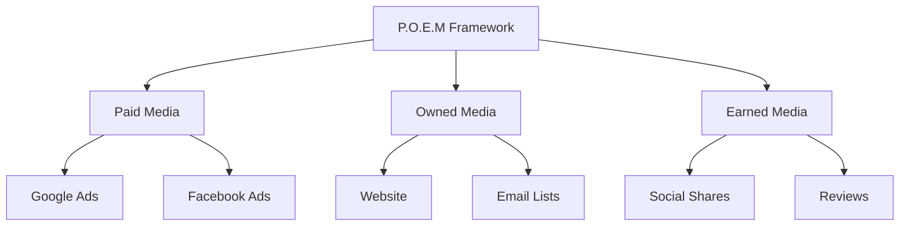
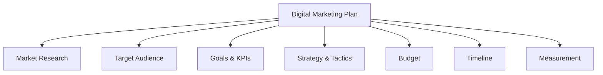
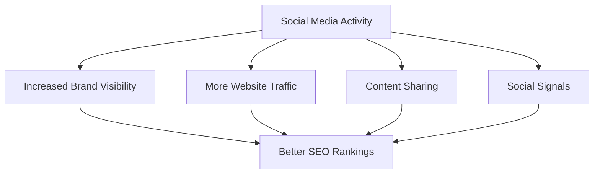
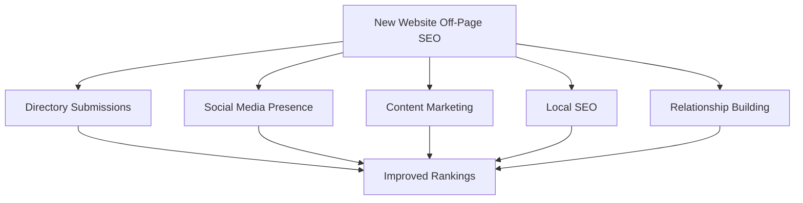
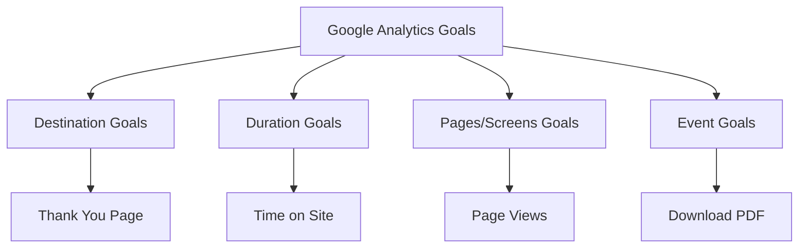
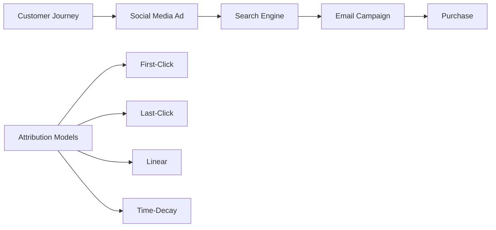
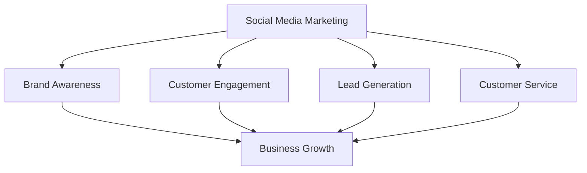
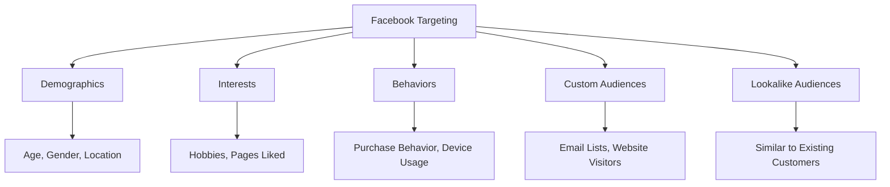
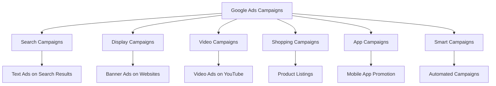
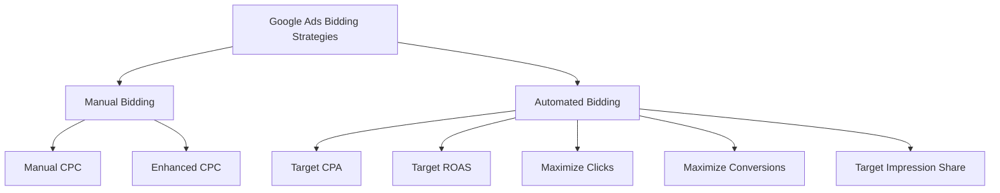

## Question 1(a) [3 marks]

**Describe the need of SEO in digital marketing.**

**Answer:**

SEO is essential in digital marketing for online visibility and business growth.

| Need | Description |
|------|-------------|
| **Visibility** | Helps websites appear in top search results |
| **Traffic** | Drives organic visitors without paid ads |
| **Credibility** | Higher rankings build trust with users |
| **Cost-effective** | Long-term results without continuous ad spending |

- **Increased visibility**: SEO helps websites rank higher on search engines
- **Organic traffic**: Brings quality visitors without advertising costs
- **Brand credibility**: Top rankings establish business authority

**Mnemonic:** "VTC - Visibility, Traffic, Credibility"

## Question 1(b) [4 marks]

**Differentiate between traditional marketing and digital marketing.**

**Answer:**

Digital marketing offers targeted reach and measurable results compared to traditional methods.

| Aspect | Traditional Marketing | Digital Marketing |
|--------|----------------------|------------------|
| **Reach** | Local/Regional | Global |
| **Cost** | High | Lower |
| **Targeting** | Broad audience | Specific demographics |
| **Measurement** | Difficult to track | Real-time analytics |
| **Interaction** | One-way communication | Two-way engagement |

- **Cost efficiency**: Digital marketing requires lower investment
- **Real-time tracking**: Immediate performance measurement available
- **Global reach**: Access to worldwide audience instantly

**Mnemonic:** "GRIM - Global, Real-time, Interactive, Measurable"

## Question 1(c) [7 marks]

**Explain the components of the P.O.E.M. framework and their importance in digital marketing.**

**Answer:**

P.O.E.M. framework categorizes media types for comprehensive digital marketing strategy.



| Component | Definition | Examples | Importance |
|-----------|------------|----------|------------|
| **Paid Media** | Promotional content through payment | Google Ads, Facebook Ads | Immediate visibility and traffic |
| **Owned Media** | Content controlled by brand | Website, Email lists | Build long-term relationships |
| **Earned Media** | Organic mentions by users | Reviews, Social shares | Authentic credibility |

- **Paid Media**: Provides immediate reach and measurable ROI
- **Owned Media**: Creates direct customer relationships and brand control
- **Earned Media**: Builds authentic trust through user-generated content

**Mnemonic:** "POE - Pay for reach, Own relationships, Earn trust"

## Question 1(c OR) [7 marks]

**Explain the key components of digital marketing plan.**

**Answer:**

A digital marketing plan provides structured approach for online business success.



| Component | Description | Purpose |
|-----------|-------------|---------|
| **Market Research** | Industry and competitor analysis | Understanding market landscape |
| **Target Audience** | Demographics and psychographics | Focused messaging |
| **Goals & KPIs** | Specific measurable objectives | Performance tracking |
| **Strategy & Tactics** | Channels and content approach | Implementation roadmap |
| **Budget Allocation** | Resource distribution | Cost management |
| **Timeline** | Campaign scheduling | Project management |
| **Measurement** | Analytics and reporting | Continuous improvement |

- **Clear objectives**: SMART goals ensure focused efforts
- **Audience targeting**: Precise demographics improve conversion rates
- **Performance tracking**: Regular measurement enables optimization

**Mnemonic:** "RATSBUM - Research, Audience, Tactics, Strategy, Budget, Measurement"

## Question 2(a) [3 marks]

**Differentiate between black hat and white hat SEO techniques.**

**Answer:**

White hat SEO follows guidelines while black hat uses prohibited methods for quick results.

| Aspect | White Hat SEO | Black Hat SEO |
|--------|---------------|---------------|
| **Methods** | Ethical practices | Manipulative techniques |
| **Results** | Sustainable rankings | Temporary gains |
| **Risk** | Safe from penalties | High penalty risk |
| **Examples** | Quality content, natural links | Keyword stuffing, hidden text |

- **White Hat**: Focuses on user experience and quality content
- **Black Hat**: Attempts to deceive search engine algorithms
- **Long-term impact**: White hat builds lasting success

**Mnemonic:** "WS-BT - White Sustainable, Black Temporary"

## Question 2(b) [4 marks]

**Discuss the factors that affect SEO rankings.**

**Answer:**

Multiple factors influence how search engines rank websites in results.

| Factor Category | Specific Factors |
|-----------------|------------------|
| **Content Quality** | Relevance, originality, keyword optimization |
| **Technical SEO** | Page speed, mobile-friendliness, SSL |
| **User Experience** | Bounce rate, time on site, navigation |
| **Authority** | Backlinks, domain age, social signals |

- **Content relevance**: High-quality, original content ranks better
- **Technical optimization**: Fast loading and mobile-friendly sites preferred
- **User engagement**: Low bounce rates indicate valuable content
- **External authority**: Quality backlinks boost credibility

**Mnemonic:** "CTUA - Content, Technical, User experience, Authority"

## Question 2(c) [7 marks]

**How social media can improve SEO rankings? Explain with a suitable example.**

**Answer:**

Social media indirectly boosts SEO through increased visibility and engagement signals.



| Social Media Impact | SEO Benefit | Example |
|--------------------|--------------|---------|
| **Content Sharing** | Increased backlinks | Blog post shared on LinkedIn gets linked by industry sites |
| **Brand Mentions** | Authority building | Twitter mentions increase brand searches |
| **Traffic Generation** | User engagement signals | Facebook posts drive traffic, reducing bounce rate |
| **Local Presence** | Local SEO boost | Google My Business posts improve local rankings |

**Example**: A restaurant shares food photos on Instagram with location tags. This increases:

- Local brand searches
- Website visits from social media
- User-generated content and reviews
- Overall online presence

- **Social signals**: Search engines consider social engagement as quality indicator
- **Traffic boost**: Social media drives qualified visitors to website
- **Content amplification**: Social sharing increases content reach and potential backlinks

**Mnemonic:** "STAB - Signals, Traffic, Amplification, Branding"

## Question 2(a OR) [3 marks]

**Differentiate between on-page SEO and off-page SEO.**

**Answer:**

On-page SEO optimizes website elements while off-page builds external authority.

| Aspect | On-Page SEO | Off-Page SEO |
|--------|-------------|--------------|
| **Location** | Within website | External websites |
| **Control** | Full control | Limited control |
| **Focus** | Content and technical | Authority and trust |
| **Examples** | Title tags, meta descriptions | Backlinks, social shares |

- **On-page**: Optimizes content, HTML tags, and site structure
- **Off-page**: Builds authority through external signals and links
- **Combination**: Both needed for comprehensive SEO success

**Mnemonic:** "In-Out - Internal optimization, Outside authority"

## Question 2(b OR) [4 marks]

**Discuss different ways to improve SEO ranking.**

**Answer:**

Multiple strategies can enhance website visibility in search results.

| Strategy | Implementation |
|----------|----------------|
| **Content Optimization** | Keyword research, quality writing, regular updates |
| **Technical SEO** | Page speed, mobile optimization, SSL certificate |
| **Link Building** | Guest posting, directory submissions, partnerships |
| **User Experience** | Clear navigation, fast loading, engaging design |

- **Quality content**: Create valuable, original content with target keywords
- **Technical excellence**: Ensure fast, mobile-friendly, secure website
- **Authority building**: Acquire high-quality backlinks from relevant sites
- **User satisfaction**: Focus on easy navigation and engaging experience

**Mnemonic:** "CTLU - Content, Technical, Links, User experience"

## Question 2(c OR) [7 marks]

**How will you do off page optimization for newly launched website?**

**Answer:**

Off-page optimization for new websites requires strategic approach to build authority.



| Strategy | Action Steps | Timeline |
|----------|--------------|----------|
| **Directory Submissions** | Submit to relevant business directories | Week 1-2 |
| **Social Media Setup** | Create profiles on major platforms | Week 1 |
| **Content Creation** | Develop shareable blog content | Ongoing |
| **Local SEO** | Google My Business, local citations | Week 2-3 |
| **Guest Posting** | Write for industry blogs with backlinks | Month 2-3 |
| **Influencer Outreach** | Connect with industry influencers | Month 2-4 |

**Implementation Steps:**

1. **Research competitors**: Analyze their backlink profiles
2. **Create valuable content**: Develop resources worth linking to
3. **Build relationships**: Engage with industry professionals
4. **Monitor progress**: Track backlinks and ranking improvements

- **Patience required**: Off-page SEO takes 3-6 months to show results
- **Quality focus**: Few high-quality links better than many low-quality ones
- **Consistency**: Regular outreach and content creation essential

**Mnemonic:** "DSCLIG - Directories, Social, Content, Local, Influencers, Guest posting"

## Question 3(a) [3 marks]

**Define the following key metrics: Unique visitors, Bounce rate, Pageviews.**

**Answer:**

These metrics measure website performance and user engagement effectively.

| Metric | Definition | Importance |
|--------|------------|------------|
| **Unique Visitors** | Individual users visiting site in time period | Measures audience reach |
| **Bounce Rate** | Percentage leaving after viewing one page | Indicates content relevance |
| **Pageviews** | Total pages viewed during visits | Shows content consumption |

- **Unique Visitors**: Counts each person once regardless of multiple visits
- **Bounce Rate**: High rates suggest poor content or user experience
- **Pageviews**: Higher numbers indicate engaging, discoverable content

**Mnemonic:** "UBP - Users, Bounces, Pages"

## Question 3(b) [4 marks]

**Explain A/B testing in web analytics.**

**Answer:**

A/B testing compares two versions to determine which performs better.

```goat
    Version A     Version B
    +-------+     +-------+
    | Red   |     | Blue  |
    | Button|     | Button|
    +-------+     +-------+
         |             |
         v             v
    50% Traffic   50% Traffic
         |             |
         v             v
    Results A     Results B
    +-------+     +-------+
    | 5%    |     | 8%    |
    | Click |     | Click |
    +-------+     +-------+
                     ^
                   Winner
```

| Component | Description |
|-----------|-------------|
| **Hypothesis** | Prediction about what will improve performance |
| **Variables** | Elements being tested (headlines, buttons, colors) |
| **Traffic Split** | Random division of visitors between versions |
| **Measurement** | Comparing conversion rates or other metrics |

- **Statistical significance**: Ensure enough data for reliable results
- **Single variable**: Test one element at a time for clear insights
- **Continuous improvement**: Regular testing optimizes performance

**Mnemonic:** "HTVM - Hypothesis, Test, Variables, Measure"

## Question 3(c) [7 marks]

**How businesses can set up goals in Google Analytics? Explain with a suitable example.**

**Answer:**

Google Analytics goals track important business actions and measure success.



| Goal Type | Description | Business Example |
|-----------|-------------|------------------|
| **Destination** | Reaching specific page | Contact form submission |
| **Duration** | Time spent on site | Engagement measurement |
| **Pages/Session** | Number of pages viewed | Content consumption |
| **Event** | Specific interactions | File downloads, video plays |

**Setup Process:**

1. **Access Admin**: Go to Goals section in Admin panel
2. **Choose Template**: Select relevant goal template or custom
3. **Configure Details**: Set destination URL or event parameters
4. **Verify Goal**: Test goal setup with Goal Flow reports

**Example - E-commerce Store:**

- **Goal**: Track purchase completions
- **Type**: Destination goal
- **Setup**: Track visits to "/order-confirmation" page
- **Value**: Assign monetary value to conversions
- **Funnel**: Set up checkout process steps

- **Conversion tracking**: Measures business objective achievement
- **ROI calculation**: Assigns value to website interactions
- **Optimization insights**: Identifies improvement opportunities

**Mnemonic:** "DDPE - Destination, Duration, Pages, Events"

## Question 3(a OR) [3 marks]

**Define the following key metrics: New Visits, Pages/visit, Average Visit Duration.**

**Answer:**

These metrics analyze visitor behavior and website engagement patterns.

| Metric | Definition | Significance |
|--------|------------|--------------|
| **New Visits** | First-time visitors percentage | Measures audience growth |
| **Pages/Visit** | Average pages viewed per session | Content engagement level |
| **Average Visit Duration** | Time spent per visit | User interest indicator |

- **New Visits**: High percentage shows effective marketing reach
- **Pages/Visit**: Higher numbers indicate compelling content
- **Visit Duration**: Longer time suggests valuable information

**Mnemonic:** "NPA - New visitors, Pages viewed, Average duration"

## Question 3(b OR) [4 marks]

**What are the different methods of data collection in website analytics?**

**Answer:**

Various methods capture user behavior data for analysis and optimization.

| Method | Description | Data Collected |
|--------|-------------|----------------|
| **Page Tagging** | JavaScript code on pages | User interactions, page views |
| **Web Log Analysis** | Server log files examination | Technical data, errors |
| **Packet Sniffing** | Network traffic monitoring | Real-time user behavior |
| **Hybrid Approach** | Combination of methods | Comprehensive data set |

- **Page Tagging**: Most common method using Google Analytics code
- **Server Logs**: Technical data about requests and responses
- **Real-time Tracking**: Immediate user behavior insights
- **Data Accuracy**: Multiple methods provide complete picture

**Mnemonic:** "PWPH - Page tagging, Web logs, Packet sniffing, Hybrid"

## Question 3(c OR) [7 marks]

**Explain different marketing attribution models with example.**

**Answer:**

Attribution models assign credit to marketing channels in customer journey.



| Attribution Model | Credit Distribution | Best For | Example |
|------------------|--------------------|-----------|---------|
| **First-Click** | 100% to first interaction | Brand awareness campaigns | Social media ad gets full credit |
| **Last-Click** | 100% to final interaction | Direct response campaigns | Email campaign gets full credit |
| **Linear** | Equal credit to all touchpoints | Multi-channel campaigns | Each channel gets 25% credit |
| **Time-Decay** | More credit to recent interactions | Sales-focused campaigns | Recent touchpoints get higher credit |
| **Position-Based** | More credit to first and last | Awareness + conversion focus | 40% first, 40% last, 20% middle |

**Example Scenario:**
Customer journey: Facebook Ad → Google Search → Email → Purchase ($100)

- **First-Click**: Facebook Ad = $100 credit
- **Last-Click**: Email = $100 credit  
- **Linear**: Facebook $25, Google $25, Email $50 credit
- **Time-Decay**: Email $60, Google $30, Facebook $10 credit

- **Business alignment**: Choose model matching marketing objectives
- **Data insights**: Different models reveal various channel contributions
- **Optimization**: Helps allocate budget to effective channels

**Mnemonic:** "FLLTP - First, Last, Linear, Time-decay, Position-based"

## Question 4(a) [3 marks]

**Explain different types of YouTube ads.**

**Answer:**

YouTube offers various ad formats to reach audiences effectively.

| Ad Type | Format | Duration | Placement |
|---------|--------|----------|-----------|
| **Skippable In-Stream** | Video ads with skip option | Any length | Before/during videos |
| **Non-Skippable** | Mandatory viewing | 15-20 seconds | Before/during videos |
| **Bumper Ads** | Short, non-skippable | 6 seconds | Before videos |
| **Discovery Ads** | Thumbnail with text | Variable | Search results, sidebar |

- **Skippable ads**: Cost-effective for engagement-focused campaigns
- **Non-skippable**: Guaranteed exposure for brand awareness
- **Bumper ads**: Quick brand messages with high reach

**Mnemonic:** "SNBD - Skippable, Non-skippable, Bumper, Discovery"

## Question 4(b) [4 marks]

**How hashtags can be used in Twitter marketing?**

**Answer:**

Hashtags increase content discoverability and engagement on Twitter platform.

| Use Case | Strategy | Example |
|----------|----------|---------|
| **Trending Topics** | Join relevant conversations | #BlackFriday for sales |
| **Brand Hashtags** | Create unique brand identifiers | #JustDoIt for Nike |
| **Event Marketing** | Promote events and gatherings | #TechConf2023 |
| **Content Categorization** | Organize content themes | #MondayMotivation |

- **Research trends**: Use trending hashtags for wider reach
- **Create branded**: Develop unique hashtags for campaigns
- **Monitor performance**: Track hashtag engagement and reach
- **Limit quantity**: Use 1-2 hashtags per tweet for best results

**Mnemonic:** "TBEC - Trending, Branded, Events, Categorization"

## Question 4(c) [7 marks]

**Explain social media marketing and its significance in the current digital landscape.**

**Answer:**

Social media marketing leverages platforms to build relationships and drive business results.



| Platform | Primary Use | Audience | Content Type |
|----------|-------------|----------|--------------|
| **Facebook** | Community building | Broad demographics | Posts, videos, events |
| **Instagram** | Visual storytelling | Younger audience | Photos, stories, reels |
| **LinkedIn** | Professional networking | Business professionals | Articles, company updates |
| **Twitter** | Real-time engagement | News, trends followers | Short messages, threads |
| **YouTube** | Video marketing | Video consumers | Educational, entertainment content |

**Significance in Digital Landscape:**

- **Direct communication**: Real-time interaction with customers
- **Cost-effective reach**: Lower costs compared to traditional advertising  
- **Targeted advertising**: Precise demographic and interest targeting
- **Viral potential**: Content can reach massive audiences organically
- **Customer insights**: Valuable data about preferences and behavior
- **Brand humanization**: Shows personality behind business
- **Crisis management**: Quick response to issues and feedback

**Current Trends:**

- **Video content dominance**: Short-form videos drive engagement
- **Social commerce**: Direct purchasing through platforms
- **Influencer partnerships**: Authentic endorsements from creators
- **AI-powered personalization**: Algorithm-driven content delivery

- **Essential presence**: Businesses need social media for credibility
- **Customer expectations**: Users expect brands to be socially active
- **Competitive advantage**: Strong social presence differentiates brands

**Mnemonic:** "CLEAR - Communication, Low-cost, Engagement, Analytics, Reach"

## Question 4(a OR) [3 marks]

**Explain different types of LinkedIn ads.**

**Answer:**

LinkedIn provides professional-focused advertising options for B2B marketing.

| Ad Type | Format | Best For |
|---------|--------|----------|
| **Sponsored Content** | Native posts in feed | Brand awareness, engagement |
| **Message Ads** | Direct messages to users | Lead generation, personalized outreach |
| **Dynamic Ads** | Personalized banner ads | Website traffic, follower growth |
| **Text Ads** | Simple text with image | Cost-effective awareness campaigns |

- **Professional targeting**: Reach users by job title, company, industry
- **B2B focus**: Ideal for business-to-business marketing campaigns
- **High-quality audience**: Professional mindset drives better engagement

**Mnemonic:** "SMDT - Sponsored, Message, Dynamic, Text"

## Question 4(b OR) [4 marks]

**Explain the concept of influencer marketing on Instagram.**

**Answer:**

Influencer marketing leverages popular users to promote products authentically.

| Influencer Type | Followers | Best For | Cost |
|----------------|-----------|----------|------|
| **Nano-Influencers** | 1K-10K | Local businesses, niche products | Low |
| **Micro-Influencers** | 10K-100K | Targeted campaigns, high engagement | Medium |
| **Macro-Influencers** | 100K-1M | Brand awareness, wider reach | High |
| **Mega-Influencers** | 1M+ | Mass market products, celebrities | Very High |

- **Authentic content**: Influencers create genuine product recommendations
- **High engagement**: Followers trust influencer opinions and suggestions
- **Targeted reach**: Choose influencers matching target audience demographics
- **Measurable results**: Track engagement, clicks, and conversions easily

**Mnemonic:** "NMAM - Nano, Micro, Macro, Mega influencers"

## Question 4(c OR) [7 marks]

**Describe the targeting options available in Facebook advertising.**

**Answer:**

Facebook provides comprehensive targeting capabilities for precise audience reach.



| Targeting Category | Options | Use Case | Example |
|-------------------|---------|----------|---------|
| **Demographics** | Age, gender, location, education | Basic audience definition | Women, 25-35, college educated |
| **Interests** | Pages liked, activities, hobbies | Lifestyle-based targeting | Fitness enthusiasts, cooking |
| **Behaviors** | Purchase history, device usage | Action-based targeting | Online shoppers, mobile users |
| **Custom Audiences** | Uploaded lists, website visitors | Retargeting campaigns | Email subscribers, past customers |
| **Lookalike Audiences** | Similar to existing customers | Audience expansion | People similar to top buyers |
| **Connections** | Friends of page followers | Social proof leverage | Friends of current fans |

**Advanced Targeting Features:**

- **Detailed Targeting**: Combine multiple criteria for precision
- **Audience Overlap**: Check for audience conflicts between campaigns
- **Audience Insights**: Analyze demographics and interests deeply
- **Automatic Placements**: AI optimizes ad placement across platforms
- **A/B Testing**: Compare different targeting approaches

**Campaign Strategy:**

1. **Start Broad**: Begin with basic demographics and interests
2. **Analyze Performance**: Use analytics to identify best-performing segments
3. **Refine Targeting**: Narrow focus based on successful audiences
4. **Create Lookalikes**: Expand reach with similar audience characteristics
5. **Retarget Visitors**: Re-engage website visitors with custom audiences

- **Precision marketing**: Reach exactly the right people for products
- **Cost efficiency**: Targeted ads reduce wasted advertising spend
- **Performance optimization**: Continuous refinement improves results

**Mnemonic:** "DIBCCL - Demographics, Interests, Behaviors, Custom, Connections, Lookalike"

## Question 5(a) [3 marks]

**List the metrics used to measure the success of YouTube marketing campaigns.**

**Answer:**

YouTube provides comprehensive metrics to evaluate campaign performance effectively.

| Metric Category | Specific Metrics |
|----------------|------------------|
| **Reach Metrics** | Views, impressions, unique viewers |
| **Engagement Metrics** | Likes, comments, shares, subscribers |
| **Performance Metrics** | Click-through rate, conversion rate |
| **Retention Metrics** | Watch time, average view duration |

- **Views and impressions**: Measure content reach and visibility
- **Engagement signals**: Indicate audience interest and content quality
- **Conversion tracking**: Links video performance to business goals

**Mnemonic:** "REPR - Reach, Engagement, Performance, Retention"

## Question 5(b) [4 marks]

**Differentiate between PPC and SEO.**

**Answer:**

PPC and SEO are complementary strategies with different approaches and timelines.

| Aspect | PPC (Pay-Per-Click) | SEO (Search Engine Optimization) |
|--------|---------------------|----------------------------------|
| **Cost** | Immediate payment per click | Long-term investment in content |
| **Results** | Instant visibility | Gradual ranking improvement |
| **Control** | Full control over positioning | Limited control over rankings |
| **Sustainability** | Stops when budget ends | Continues after work stops |
| **Targeting** | Precise audience targeting | Broad keyword targeting |

- **PPC advantages**: Immediate results, precise targeting, measurable ROI
- **SEO advantages**: Long-term sustainability, credibility, cost-effectiveness
- **Combined approach**: Both strategies work better together

**Mnemonic:** "IRCST - Immediate vs Reactive, Control vs Sustainable, Targeted"

## Question 5(c) [7 marks]

**Explain the different types of Google Ads Campaigns.**

**Answer:**

Google Ads offers various campaign types for different marketing objectives.



| Campaign Type | Format | Best For | Objective |
|---------------|--------|----------|-----------|
| **Search Campaigns** | Text ads on search results | High-intent keywords | Drive website traffic, sales |
| **Display Campaigns** | Visual ads on partner sites | Brand awareness, remarketing | Reach broad audiences |
| **Video Campaigns** | Video ads on YouTube | Engagement, brand building | Video content promotion |
| **Shopping Campaigns** | Product listings with images | E-commerce sales | Showcase products directly |
| **App Campaigns** | Automated app promotion | Mobile app downloads | Increase app installs |
| **Smart Campaigns** | Google-optimized ads | Small business automation | Simplified campaign management |
| **Performance Max** | Multi-channel automation | Maximum performance | AI-driven optimization |

**Campaign Selection Strategy:**

- **Search**: Target users actively searching for solutions
- **Display**: Build awareness among interested audiences  
- **Video**: Engage users with compelling visual content
- **Shopping**: Showcase products directly in search results
- **App**: Drive mobile application downloads and engagement

**Budget Allocation Recommendations:**

- **Search**: 40-50% of budget for high-converting keywords
- **Display**: 20-30% for awareness and remarketing
- **Video**: 15-25% for engagement and brand building
- **Shopping**: 30-40% for e-commerce businesses

- **Multi-campaign approach**: Combine types for comprehensive reach
- **Audience journey**: Different campaigns target various buying stages
- **Performance optimization**: Regular monitoring improves results

**Mnemonic:** "SDVSAP - Search, Display, Video, Shopping, App, Performance Max"

## Question 5(a OR) [3 marks]

**List the metrics available on Instagram for tracking the success of marketing strategies.**

**Answer:**

Instagram Insights provides comprehensive metrics for campaign performance analysis.

| Metric Category | Specific Metrics |
|----------------|------------------|
| **Reach Metrics** | Impressions, reach, profile visits |
| **Engagement Metrics** | Likes, comments, shares, saves |
| **Story Metrics** | Story views, taps forward/back, exits |
| **Audience Metrics** | Demographics, active times, locations |

- **Content performance**: Track which posts drive highest engagement
- **Audience insights**: Understand follower demographics and behavior
- **Growth tracking**: Monitor follower count and engagement rate changes

**Mnemonic:** "RESA - Reach, Engagement, Stories, Audience"

## Question 5(b OR) [4 marks]

**Describe the benefits of email marketing in digital marketing.**

**Answer:**

Email marketing remains highly effective for customer communication and conversion.

| Benefit | Description | Impact |
|---------|-------------|--------|
| **High ROI** | $42 return for every $1 spent | Cost-effective marketing channel |
| **Direct Communication** | Personal inbox access | Intimate customer connection |
| **Segmentation** | Targeted messaging by groups | Improved relevance and response |
| **Automation** | Scheduled and triggered emails | Efficient customer nurturing |
| **Measurable Results** | Detailed analytics available | Data-driven optimization |

- **Permission-based**: Subscribers actively chose to receive communications
- **Personalization**: Customized content based on user preferences and behavior
- **Scalability**: Reach thousands of customers with single campaign
- **Integration**: Works well with other digital marketing channels

**Mnemonic:** "HDSAM - High ROI, Direct, Segmented, Automated, Measurable"

## Question 5(c OR) [7 marks]

**Explain various bidding strategies available in Google Ads.**

**Answer:**

Google Ads offers multiple bidding strategies to optimize campaign performance based on objectives.



| Bidding Strategy | Type | Best For | Goal |
|------------------|------|----------|------|
| **Manual CPC** | Manual | Full control campaigns | Set individual keyword bids |
| **Enhanced CPC** | Semi-automated | Conversion optimization | Adjust bids for likely conversions |
| **Target CPA** | Automated | Lead generation | Achieve specific cost per acquisition |
| **Target ROAS** | Automated | E-commerce sales | Return on ad spend optimization |
| **Maximize Clicks** | Automated | Traffic generation | Get most clicks within budget |
| **Maximize Conversions** | Automated | Conversion focus | Get most conversions within budget |
| **Target Impression Share** | Automated | Brand awareness | Achieve visibility percentage |

**Strategy Selection Guide:**

**For New Campaigns:**

- **Maximize Clicks**: Build initial traffic and data
- **Manual CPC**: Test and learn keyword performance
- **Enhanced CPC**: Balance control with optimization

**For Established Campaigns:**

- **Target CPA**: When you know acceptable cost per lead
- **Target ROAS**: When tracking revenue and profitability
- **Maximize Conversions**: When budget allows flexible spending

**Advanced Considerations:**

- **Data Requirements**: Automated strategies need conversion history
- **Budget Flexibility**: Some strategies may exceed daily budgets
- **Performance Monitoring**: Regular review ensures optimal results
- **Seasonal Adjustments**: Modify strategies during peak periods

- **Algorithm Learning**: Automated bidding improves with more data
- **Performance Goals**: Choose strategy matching business objectives
- **Budget Management**: Consider spending patterns with different strategies

**Mnemonic:** "METER-MT - Manual, Enhanced, Target CPA, Target ROAS, Maximize"
