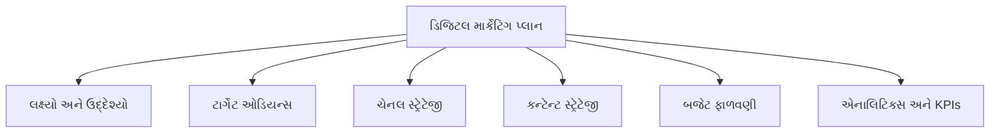
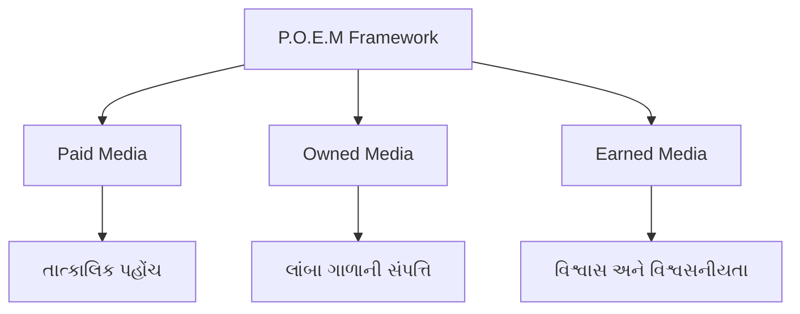
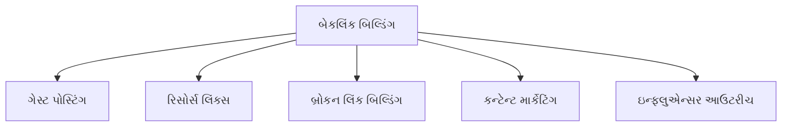
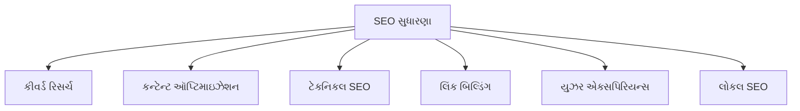
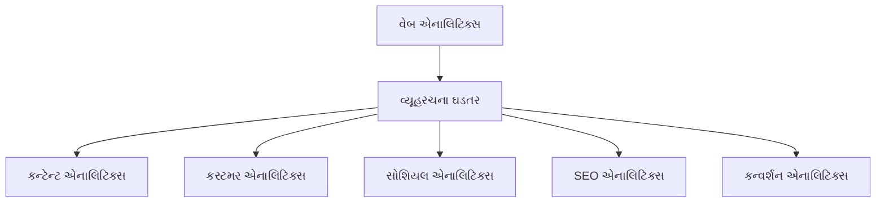
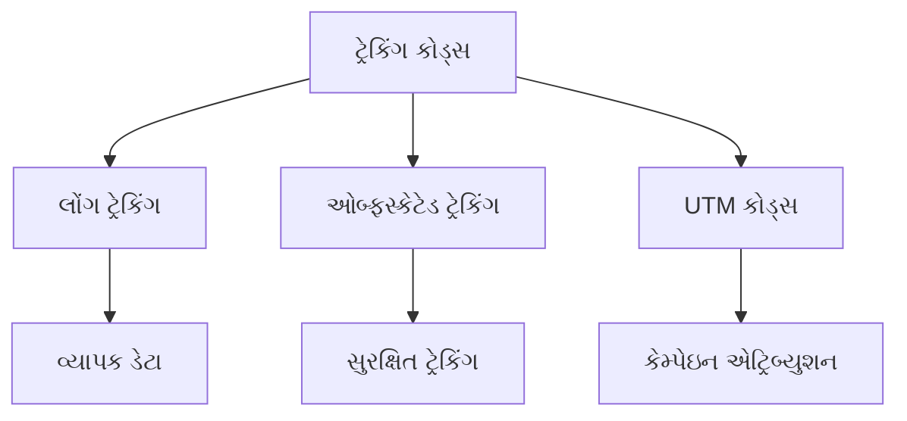
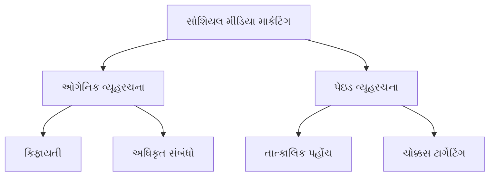
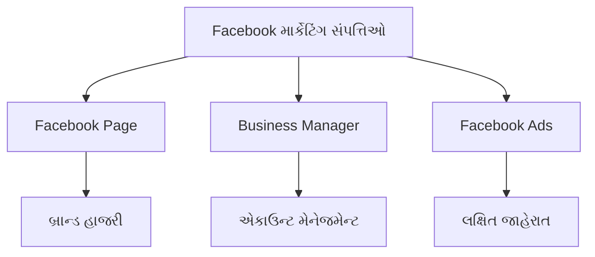
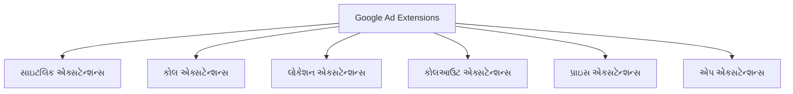
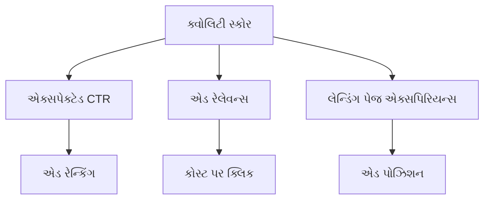

## પ્રશ્ન 1(અ) [3 ગુણ]

**વેબસાઇટના SEO રેન્કિંગને પ્રભાવિત કરતા ત્રણ મહત્વપૂર્ણ પરિબળો સમજાવો.**

**જવાબ**:

| પરિબળ | વર્ણન |
|--------|-------|
| **કન્ટેન્ટ ક્વોલિટી** | તાજું, સંબંધિત, કીવર્ડ-ઓપ્ટિમાઇઝ્ડ કન્ટેન્ટ |
| **બેકલિંક્સ** | અન્ય ગુણવત્તાવાળી વેબસાઇટ્સમાંથી લિંક્સ |
| **ટેકનિકલ SEO** | સાઇટ સ્પીડ, મોબાઇલ-ફ્રેન્ડલી, SSL સર્ટિફિકેટ |

- **કન્ટેન્ટ ક્વોલિટી**: સર્ચ એન્જિન મૂલ્યવાન કન્ટેન્ટને પ્રાથમિકતા આપે છે
- **બેકલિંક્સ**: અન્ય વેબસાઇટ્સ તરફથી વિશ્વાસની મતદાન તરીકે કામ કરે છે
- **ટેકનિકલ SEO**: સર્ચ એન્જિનને સાઇટને ક્રોલ અને ઇન્ડેક્સ કરવામાં મદદ કરે છે

**મેમરી ટ્રીક:** "CBT - Content, Backlinks, Technical"

## પ્રશ્ન 1(બ) [4 ગુણ]

**ડિજિટલ માર્કેટિંગમાં ડેટાની ગોપનીયતા અને તેનું મહત્વ વર્ણવો.**

**જવાબ**:

**ડેટા પ્રાઇવસી** એટલે ડિજિટલ માર્કેટિંગ પ્રવૃત્તિઓ દરમિયાન એકત્રિત કરાયેલી વ્યક્તિગત માહિતીનું સંરક્ષણ.

| પાસું | મહત્વ |
|------|------|
| **યુઝર ટ્રસ્ટ** | ગ્રાહકોનો વિશ્વાસ અને વફાદારી બનાવે છે |
| **કાયદાકીય પાલન** | GDPR, CCPA નિયમોથી દંડ બચાવે છે |
| **બ્રાન્ડ પ્રતિષ્ઠા** | ડેટા બ્રીચથી નકારાત્મક પ્રચારને અટકાવે છે |

- **યુઝર ટ્રસ્ટ**: જ્યારે ગ્રાહકો તમારી પ્રાઇવસી પ્રેક્ટિસ પર ભરોસો રાખે છે ત્યારે વધુ ડેટા શેર કરે છે
- **કાયદાકીય પાલન**: ડેટા પ્રોટેક્શન કાયદાઓનું ફરજિયાત પાલન
- **બ્રાન્ડ પ્રતિષ્ઠા**: ડેટા બ્રીચ બ્રાન્ડ ઇમેજને ગંભીર નુકસાન પહોંચાડી શકે છે

**મેમરી ટ્રીક:** "TLR - Trust, Legal, Reputation"

## પ્રશ્ન 1(ક) [7 ગુણ]

**ડિજિટલ માર્કેટિંગ યોજનાઓ માટેના મુખ્ય ઘટકો સમજાવો.**

**જવાબ**:

| ઘટક | વર્ણન |
|-----|------|
| **લક્ષ્યો અને ઉદ્દેશ્યો** | વ્યવસાયિક ઉદ્દેશ્યો સાથે જોડાયેલા SMART લક્ષ્યો |
| **ટાર્ગેટ ઓડિયન્સ** | ડેમોગ્રાફિક્સ, સાયકોગ્રાફિક્સ અને વર્તન વિશ્લેષણ |
| **ચેનલ સ્ટ્રેટેજી** | યોગ્ય ડિજિટલ પ્લેટફોર્મની પસંદગી |
| **કન્ટેન્ટ સ્ટ્રેટેજી** | કન્ટેન્ટના પ્રકારો, થીમ્સ અને પબ્લિશિંગ શેડ્યૂલ |
| **બજેટ ફાળવણી** | ચેનલ્સમાં સંસાધનોની વિતરણ |
| **એનાલિટિક્સ અને KPIs** | માપદંડ ફ્રેમવર્ક અને સફળતાના મેટ્રિક્સ |

- **લક્ષ્યો અને ઉદ્દેશ્યો**: વિશિષ્ટ, માપવા યોગ્ય પરિણામો વ્યાખ્યાયિત કરો
- **ટાર્ગેટ ઓડિયન્સ**: વિગતવાર બાયર પર્સોના બનાવો
- **ચેનલ સ્ટ્રેટેજી**: સોશિયલ મીડિયા, ઇમેઇલ, SEO, PPC નું સર્વોત્તમ મિશ્રણ પસંદ કરો
- **કન્ટેન્ટ સ્ટ્રેટેજી**: આકર્ષક કન્ટેન્ટ કેલેન્ડર વિકસાવો
- **બજેટ ફાળવણી**: ROI ની સંભાવના આધારે સંસાધનોનું વિતરણ કરો
- **એનાલિટિક્સ અને KPIs**: પરફોર્મન્સ ટ્રેક કરો અને સતત ઑપ્ટિમાઇઝ કરો

**મેમરી ટ્રીક:** "GT-CCBA - Goals-Target, Channels-Content-Budget-Analytics"

## પ્રશ્ન 1(ક OR) [7 ગુણ]

**P.O.E.M ફ્રેમવર્કને વ્યાખ્યાયિત કરો અને ડિજિટલ માર્કેટિંગમાં તેનું મહત્વ સમજાવો.**

**જવાબ**:

**P.O.E.M.** એટલે **Paid, Owned, Earned, Media** ફ્રેમવર્ક ડિજિટલ માર્કેટિંગ સ્ટ્રેટેજી માટે.

| મીડિયા પ્રકાર | વર્ણન | ઉદાહરણો |
|-------------|------|--------|
| **Paid** | તમે પૈસા ચૂકવો છો તે મીડિયા | Google Ads, Facebook Ads, YouTube Ads |
| **Owned** | તમે નિયંત્રિત કરો છો તે મીડિયા | વેબસાઇટ, બ્લોગ, ઇમેઇલ લિસ્ટ, મોબાઇલ એપ |
| **Earned** | વિશ્વસનીયતા દ્વારા મેળવેલ મીડિયા | સોશિયલ શેર્સ, રિવ્યૂઝ, PR મેન્શન્સ |

- **Paid Media**: તાત્કાલિક દૃશ્યતા અને લક્ષિત પહોંચ પ્રદાન કરે છે
- **Owned Media**: લાંબા ગાળાની સંપત્તિ અને બ્રાન્ડ નિયંત્રણ બનાવે છે
- **Earned Media**: વિશ્વાસ અને અધિકૃત બ્રાન્ડ એડવોકસી બનાવે છે

**મેમરી ટ્રીક:** "POE - Pay, Own, Earn"

## પ્રશ્ન 2(અ) [3 ગુણ]

**Black hat અને White hat SEO ટેકનીક વચ્ચે તફાવત વર્ણવો.**

**જવાબ**:

| પાસું | White Hat SEO | Black Hat SEO |
|------|---------------|---------------|
| **પદ્ધતિઓ** | નૈતિક, માર્ગદર્શિકા-અનુપાલન | હેરાફેરીયુક્ત, નિયમ-ભંગ |
| **પરિણામો** | ટકાઉ લાંબા ગાળાની વૃદ્ધિ | ઝડપી પરંતુ અસ્થાયી લાભ |
| **જોખમ** | દંડથી સુરક્ષિત | દંડનું ઉચ્ચ જોખમ |

- **White Hat SEO**: ટકાઉ પરિણામો માટે સર્ચ એન્જિન માર્ગદર્શિકાઓનું પાલન કરે છે
- **Black Hat SEO**: ઝડપી રેન્કિંગ લાભ માટે ભ્રામક પ્રથાઓનો ઉપયોગ કરે છે
- **જોખમ પરિબળ**: Black hat ટેકનીક્સના કારણે સંપૂર્ણ સાઇટ બેન થઈ શકે છે

**મેમરી ટ્રીક:** "WEB - White Ethical Benefits, Black Breaks-rules"

## પ્રશ્ન 2(બ) [4 ગુણ]

**સર્ચ એન્જિન અલ્ગોરિધમ કઈ રીતે કાર્ય કરે છે અને વેબસાઈટને કઈ રીતે રેંક આપે છે એ સમજાવો.**

**જવાબ**:

| પ્રક્રિયા | કાર્ય |
|---------|------|
| **ક્રોલિંગ** | બોટ્સ વેબ પેજો શોધે અને સ્કેન કરે છે |
| **ઇન્ડેક્સિંગ** | પેજો સર્ચ એન્જિન ડેટાબેસમાં સંગ્રહિત થાય છે |
| **રેન્કિંગ** | અલ્ગોરિધમ પેજની સંબંધિતતા અને અધિકાર નક્કી કરે છે |
| **પરિણામો** | યુઝર ક્વેરીઝ માટે શ્રેષ્ઠ મેચ દર્શાવવામાં આવે છે |

- **ક્રોલિંગ**: વેબ ક્રોલર્સ નવું કન્ટેન્ટ શોધવા માટે લિંક્સને ફોલો કરે છે
- **ઇન્ડેક્સિંગ**: કન્ટેન્ટનું વિશ્લેષણ કરીને મોટા ડેટાબેસમાં સંગ્રહિત કરવામાં આવે છે
- **રેન્કિંગ**: 200+ પરિબળો સર્ચ પરિણામ સ્થાનો નક્કી કરે છે
- **પરિણામો**: સૌથી સંબંધિત પેજો યુઝરોને પ્રથમ દર્શાવવામાં આવે છે

**મેમરી ટ્રીક:** "CIRR - Crawl, Index, Rank, Results"

## પ્રશ્ન 2(ક) [7 ગુણ]

**બેકલિંક્સ બનાવવા માટેની વ્યૂહરચનાઓનું વર્ણન કરો.**

**જવાબ**:

| વ્યૂહરચના | વર્ણન | અસરકારકતા |
|----------|------|-----------|
| **ગેસ્ટ પોસ્ટિંગ** | અન્ય વેબસાઇટ્સ માટે લેખો લખવા | ઉચ્ચ |
| **રિસોર્સ લિંક બિલ્ડિંગ** | ઉદ્યોગ ડાયરેક્ટરીમાં સૂચિબદ્ધ થવું | મધ્યમ |
| **બ્રોકન લિંક બિલ્ડિંગ** | તૂટેલી લિંક્સને તમારા કન્ટેન્ટ સાથે બદલવી | ઉચ્ચ |
| **કન્ટેન્ટ માર્કેટિંગ** | શેર કરવા યોગ્ય, મૂલ્યવાન કન્ટેન્ટ બનાવવું | ખૂબ ઉચ્ચ |
| **ઇન્ફ્લુએન્સર આઉટરીચ** | ઉદ્યોગ ઇન્ફ્લુએન્સર્સ સાથે ભાગીદારી | ઉચ્ચ |

- **ગેસ્ટ પોસ્ટિંગ**: તમારા નિશમાં સંબંધો અને સત્તા બનાવે છે
- **રિસોર્સ લિંક બિલ્ડિંગ**: ડાયરેક્ટરીઓ દ્વારા વિશ્વસનીયતા સ્થાપિત કરે છે
- **બ્રોકન લિંક બિલ્ડિંગ**: તૂટેલા સંસાધનો ઠીક કરીને મૂલ્য પ્રદાન કરે છે
- **કન્ટેન્ટ માર્કેટિંગ**: ગુણવત્તાયુક્ત કન્ટેન્ટ દ્વારા કુદરતી રીતે લિંક્સ આકર્ષે છે
- **ઇન્ફ્લુએન્સર આઉટરીચ**: લિંક તકો માટે સ્થાપિત પ્રેક્ષકોનો લાભ લે છે

**મેમરી ટ્રીક:** "GRBCI - Guest, Resource, Broken, Content, Influencer"

## પ્રશ્ન 2(અ OR) [3 ગુણ]

**સર્ચ એન્જિન રેન્કિંગ માટે backlinks, website speed અને performance ની અગત્યતા સમજાવો.**

**જવાબ**:

| પરિબળ | SEO પર અસર |
|--------|------------|
| **બેકલિંક્સ** | સત્તા અને વિશ્વાસના સંકેતો |
| **વેબસાઇટ સ્પીડ** | યુઝર એક્સપિરિયન્સ રેન્કિંગ પરિબળ |
| **પરફોર્મન્સ** | Core Web Vitals રેન્કિંગને અસર કરે છે |

- **બેકલિંક્સ**: અન્ય વેબસાઇટ્સ તરફથી વિશ્વાસના વોટ તરીકે કામ કરે છે
- **વેબસાઇટ સ્પીડ**: ઝડપી સાઇટ્સ ઉચ્ચ રેન્ક કરે છે અને બાઉન્સ રેટ ઘટાડે છે
- **પરફોર્મન્સ**: Google સારા Core Web Vitals વાળી સાઇટ્સને પ્રાથમિકતા આપે છે

**મેમરી ટ્રીક:** "BSP - Backlinks, Speed, Performance"

## પ્રશ્ન 2(બ OR) [4 ગુણ]

**On-page અને Off-page SEO ટેકનીક વચ્ચે તફાવત વર્ણવો અને દરેકનું એક ઉદાહરણ આપો.**

**જવાબ**:

| SEO પ્રકાર | ફોકસ | ઉદાહરણો |
|-----------|------|--------|
| **On-Page** | વેબસાઇટ ઑપ્ટિમાઇઝેશન | ટાઇટલ ટેગ્સ, મેટા વર્ણનો, કન્ટેન્ટ ઑપ્ટિમાઇઝેશન |
| **Off-Page** | બાહ્ય પરિબળો | બેકલિંક્સ, સોશિયલ સિગ્નલ્સ, બ્રાન્ડ મેન્શન્સ |

- **On-Page SEO**: તમારી વેબસાઇટની અંદરના તત્વોને નિયંત્રિત કરે છે
- **Off-Page SEO**: બાહ્ય વેલિડેશન દ્વારા સત્તા બનાવે છે
- **ઉદાહરણો**: On-page માં કીવર્ડ ઑપ્ટિમાઇઝેશન; off-page માં લિંક બિલ્ડિંગ

**મેમરી ટ્રીક:** "IO - Internal Optimization, External Elevation"

## પ્રશ્ન 2(ક OR) [7 ગુણ]

**SEO રેન્કિંગમાં સુધારો કરવાની વિવિધ રીતો સમજાવો.**

**જવાબ**:

| પદ્ધતિ | વર્ણન | અસર |
|-------|------|-----|
| **કીવર્ડ રિસર્ચ** | સંબંધિત, ઓછી સ્પર્ધાવાળા કીવર્ડ્સ લક્ષિત કરવા | ઉચ્ચ |
| **કન્ટેન્ટ ઑપ્ટિમાઇઝેશન** | મૂલ્યવાન, કીવર્ડ-સમૃદ્ધ કન્ટેન્ટ બનાવવું | ખૂબ ઉચ્ચ |
| **ટેકનિકલ SEO** | સાઇટ સ્પીડ, મોબાઇલ-ફ્રેન્ડલીનેસ સુધારવી | ઉચ્ચ |
| **લિંક બિલ્ડિંગ** | ગુણવત્તાયુક્ત બેકલિંક્સ મેળવવી | ખૂબ ઉચ્ચ |
| **યુઝર એક્સપિરિયન્સ** | સાઇટ ઉપયોગીતા અને સંલગ્નતા વધારવી | મધ્યમ |
| **લોકલ SEO** | સ્થાનિક સર્ચ પરિણામો માટે ઑપ્ટિમાઇઝ કરવું | ઉચ્ચ (સ્થાનિક વ્યવસાય માટે) |

- **કીવર્ડ રિસર્ચ**: બધા SEO પ્રયાસો માટે પાયો
- **કન્ટેન્ટ ઑપ્ટિમાઇઝેશન**: કીવર્ડ્સને લક્ષિત કરતી વખતે મૂલ્ય પ્રદાન કરે છે
- **ટેકનિકલ SEO**: સર્ચ એન્જિનો તમારી સાઇટને અસરકારક રીતે ક્રોલ કરી શકે તેની ખાતરી કરે છે
- **લિંક બિલ્ડિંગ**: ડોમેઇન ઑથોરિટી અને વિશ્વાસ બનાવે છે
- **યુઝર એક્સપિરિયન્સ**: બાઉન્સ રેટ ઘટાડે અને સંલગ્નતા વધારે છે
- **લોકલ SEO**: ભૌતિક સ્થાનો ધરાવતા વ્યવસાયો માટે મહત્વપૂર્ણ

**મેમરી ટ્રીક:** "KC-TLUL - Keywords, Content, Technical, Links, User-experience, Local"

## પ્રશ્ન 3(અ) [3 ગુણ]

**Single-touch અને multi-touch attribution મોડેલ વચ્ચેનો તફાવત વર્ણવો.**

**જવાબ**:

| મોડેલ પ્રકાર | ક્રેડિટ સોંપણી | ઉપયોગ કેસ |
|-----------|-------------|---------|
| **Single-Touch** | એક ટચપોઇન્ટને 100% ક્રેડિટ | સરળ ગ્રાહક યાત્રાઓ |
| **Multi-Touch** | ટચપોઇન્ટ્સમાં ક્રેડિટ વિતરણ | જટિલ ગ્રાહક યાત્રાઓ |

- **Single-Touch**: પ્રથમ-ક્લિક અથવા છેલ્લા-ક્લિકને સંપૂર્ણ ક્રેડિટ મળે છે
- **Multi-Touch**: લિનિયર, ટાઇમ-ડિકે, અથવા પોઝિશન-આધારિત એટ્રિબ્યુશન
- **ઉપયોગ**: Multi-touch વધુ સચોટ ગ્રાહક યાત્રા આંતરદૃષ્ટિ પ્રદાન કરે છે

**મેમરી ટ્રીક:** "SM - Single Simple, Multi Multiple"

## પ્રશ્ન 3(બ) [4 ગુણ]

**Google Analytics માં વ્યવસાયો કેવી રીતે લક્ષ્યો સેટ કરી શકે છે તે સમજાવો.**

**જવાબ**:

| પગલું | ક્રિયા |
|------|------|
| **1. ગોલ્સ એક્સેસ** | Admin → View → Goals પર જાઓ |
| **2. ટેમ્પલેટ પસંદ કરો** | ટેમ્પલેટમાંથી પસંદ કરો અથવા કસ્ટમ બનાવો |
| **3. વિગતો કન્ફિગર કરો** | ગોલ નામ, પ્રકાર અને શરતો સેટ કરો |
| **4. સેટઅપ ચકાસો** | વેરિફિકેશન ફીચર વાપરીને ગોલ ટેસ્ટ કરો |

- **ગોલ પ્રકારો**: ડેસ્ટિનેશન, અવધિ, પેજ/સેશન, ઇવેન્ટ ગોલ્સ
- **કન્ફિગરેશન**: ગોલ પૂર્ણતા માટે વિશિષ્ટ શરતો વ્યાખ્યાયિત કરો
- **વેરિફિકેશન**: અમલીકરણ પહેલાં ગોલ્સ યોગ્ય રીતે ટ્રેક કરે છે તેની ખાતરી કરો
- **મોનિટરિંગ**: ગોલ પરફોર્મન્સની નિયમિત સમીક્ષા અને ઑપ્ટિમાઇઝેશન

**મેમરી ટ્રીક:** "ACCV - Access, Choose, Configure, Verify"

## પ્રશ્ન 3(ક) [7 ગુણ]

**ડિજિટલ માર્કેટિંગની વ્યૂહરચના ઘડવામાં વેબ એનાલિટિક્સની શું ભૂમિકા છે? વિવિધ પ્રકારના વેબ એનાલિટિક્સ વિશે ચર્ચા કરો.**

**જવાબ**:

**વ્યૂહરચનામાં ભૂમિકા:**
વેબ એનાલિટિક્સ ડિજિટલ માર્કેટિંગમાં માહિતી-આધારિત નિર્ણય લેવા માટે ડેટા-આધારિત આંતરદૃષ્ટિ પ્રદાન કરે છે.

| એનાલિટિક્સ પ્રકાર | હેતુ | મુખ્ય મેટ્રિક્સ |
|------------------|-----|-------------|
| **કન્ટેન્ટ એનાલિટિક્સ** | કન્ટેન્ટ પરફોર્મન્સ ટ્રેકિંગ | પેજ વ્યૂઝ, પેજ પર સમય, બાઉન્સ રેટ |
| **કસ્ટમર એનાલિટિક્સ** | યુઝર વર્તન વિશ્લેષણ | ડેમોગ્રાફિક્સ, રુચિઓ, કન્વર્શન પાથ |
| **સોશિયલ મીડિયા એનાલિટિક્સ** | સોશિયલ એન્ગેજમેન્ટ માપદંડ | શેર્સ, લાઇક્સ, કોમેન્ટ્સ, રીચ |
| **SEO એનાલિટિક્સ** | સર્ચ પરફોર્મન્સ ટ્રેકિંગ | કીવર્ડ્સ, રેન્કિંગ્સ, ઓર્ગેનિક ટ્રાફિક |
| **કન્વર્શન એનાલિટિક્સ** | ગોલ પૂર્ણતા ટ્રેકિંગ | કન્વર્શન રેટ, રેવન્યુ, ROI |

- **વ્યૂહરચનાત્મક ભૂમિકા**: તકો ઓળખે છે, પરફોર્મન્સ માપે છે, ઑપ્ટિમાઇઝેશન માર્ગદર્શન આપે છે
- **કન્ટેન્ટ એનાલિટિક્સ**: એન્ગેજમેન્ટ આધારે કન્ટેન્ટ વ્યૂહરચના ઑપ્ટિમાઇઝ કરવામાં મદદ કરે છે
- **કસ્ટમર એનાલિટિક્સ**: વધુ સારું ઓડિયન્સ ટાર્ગેટિંગ અને વ્યક્તિગતકરણ સક્ષમ કરે છે
- **સોશિયલ મીડિયા એનાલિટિક્સ**: સોશિયલ મીડિયા ROI અને એન્ગેજમેન્ટ માપે છે
- **SEO એનાલિટિક્સ**: ઓર્ગેનિક સર્ચ પરફોર્મન્સ અને તકો ટ્રેક કરે છે
- **કન્વર્શન એનાલિટિક્સ**: માર્કેટિંગ પ્રયાસોની બોટમ-લાઇન અસર માપે છે

**મેમરી ટ્રીક:** "CCSSC - Content, Customer, Social, SEO, Conversion"

## પ્રશ્ન 3(અ OR) [3 ગુણ]

**Unique visitors, Average Visit Duration, Bounce rate ની વ્યાખ્યા આપો.**

**જવાબ**:

| મેટ્રિક | વ્યાખ્યા |
|--------|-------|
| **યુનિક વિઝિટર્સ** | વિશિષ્ટ સમયગાળામાં સાઇટની મુલાકાત લેતા વ્યક્તિગત યુઝર્સ |
| **એવરેજ વિઝિટ ડ્યુરેશન** | પ્રતિ સેશન યુઝર્સ વેબસાઇટ પર વિતાવતો સરેરાશ સમય |
| **બાઉન્સ રેટ** | એક પેજ જોયા પછી છોડી જનારા વિઝિટર્સની ટકાવારી |

- **યુનિક વિઝિટર્સ**: પુનઃ મુલાકાતોને ધ્યાનમાં લીધા વગર દરેક વ્યક્તિને એકવાર ગણે છે
- **એવરેજ વિઝિટ ડ્યુરેશન**: કન્ટેન્ટ એન્ગેજમેન્ટ અને સાઇટ સ્ટિકિનેસ દર્શાવે છે
- **બાઉન્સ રેટ**: ઉચ્ચ દર ખરાબ કન્ટેન્ટ મેચ અથવા સાઇટ સમસ્યાઓ સૂચવી શકે છે

**મેમરી ટ્રીક:** "UAB - Unique, Average, Bounce"

## પ્રશ્ન 3(બ OR) [4 ગુણ]

**વેબ એનાલિટિક્સમાં A/B testing વિશે સમજાવો.**

**જવાબ**:

**A/B Testing** એટલે કયું વધુ સારું પરફોર્મ કરે છે તે નક્કી કરવા માટે વેબપેજના બે વર્ઝનની તુલના કરવી.

| ઘટક | વર્ણન |
|-----|------|
| **વર્ઝન A** | મૂળ વેબપેજ (કંટ્રોલ) |
| **વર્ઝન B** | સુધારેલ વેબપેજ (વેરિઅન્ટ) |
| **ટ્રાફિક સ્પ્લિટ** | સામાન્ય રીતે 50/50 રેન્ડમ વિતરણ |
| **મેટ્રિક્સ** | કન્વર્શન રેટ, ક્લિક-થ્રુ રેટ, એન્ગેજમેન્ટ |

- **પ્રક્રિયા**: બે વર્ઝન વચ્ચે ટ્રાફિક વિભાજિત કરીને પરફોર્મન્સ માપો
- **અવધિ**: આંકડાકીય મહત્વ માટે પૂરતા લાંબા સમય સુધી ટેસ્ટ ચલાવો
- **વેરિએબલ્સ**: એક સમયે એક તત્વ ટેસ્ટ કરો (હેડલાઇન્સ, બટન્સ, ઇમેજો)
- **નિર્ણય**: ડેટા આધારે જીતનાર વર્ઝન અમલ કરો

**મેમરી ટ્રીક:** "ABCD - A-version, B-version, Compare, Decide"

## પ્રશ્ન 3(ક OR) [7 ગુણ]

**નીચેમુજબના ટ્રેકિંગ કોડના ફાયદા અને ગેરફાયદાઓ સમજાવો: Long tracking code, Obfuscated tracking code, UTM codes**

**જવાબ**:

| ટ્રેકિંગ પ્રકાર | વર્ણન | ફાયદા | ગેરફાયદા |
|--------------|------|-------|---------|
| **લોંગ ટ્રેકિંગ કોડ** | વ્યાપક ટ્રેકિંગ માટે વિગતવાર પેરામીટર્સ | સંપૂર્ણ ડેટા સંગ્રહ, વિગતવાર આંતરદૃષ્ટિ | ધીમી પેજ લોડ, જટિલ અમલીકરણ |
| **ઓબ્ફસ્કેટેડ ટ્રેકિંગ** | એન્ક્રિપ્ટેડ/છુપાયેલ ટ્રેકિંગ પેરામીટર્સ | ડેટા સુરક્ષા, હેરાફેરીથી અટકાવે છે | કઠિન ડિબગિંગ, જટિલ સેટઅપ |
| **UTM કોડ્સ** | કેમ્પેઇન ટ્રેકિંગ માટે URL પેરામીટર્સ | સરળ અમલીકરણ, કેમ્પેઇન એટ્રિબ્યુશન | મેન્યુઅલ ટેગિંગ જરૂરી, URL દેખાવ |

- **લોંગ ટ્રેકિંગ કોડ**: એન્ટરપ્રાઇઝ-લેવલ વિગતવાર એનાલિટિક્સ માટે શ્રેષ્ઠ
- **ઓબ્ફસ્કેટેડ ટ્રેકિંગ**: સંવેદનશીલ ડેટા સુરક્ષા આવશ્યકતાઓ માટે આદર્શ
- **UTM કોડ્સ**: કેમ્પેઇન ટ્રેકિંગ અને ટ્રાફિક સોર્સ ઓળખ માટે સંપૂર્ણ

**મેમરી ટ્રીક:** "LOU - Long comprehensive, Obfuscated secure, UTM simple"

## પ્રશ્ન 4(અ) [3 ગુણ]

**વિવિધ પ્રકારની YouTube ads સમજાવો.**

**જવાબ**:

| એડ પ્રકાર | ફોર્મેટ | પ્લેસમેન્ટ |
|---------|--------|---------|
| **સ્કિપેબલ ઇન-સ્ટ્રીમ** | 5-સેકન્ડ સ્કિપ વિકલ્પ | વિડિયો પહેલાં/દરમિયાન |
| **નોન-સ્કિપેબલ** | 15-20 સેકન્ડ, સ્કિપ નહીં | વિડિયો પહેલાં/દરમિયાન |
| **બમ્પર એડ્સ** | 6 સેકન્ડ, નોન-સ્કિપેબલ | વિડિયો પહેલાં |

- **સ્કિપેબલ ઇન-સ્ટ્રીમ**: કિફાયતી, માત્ર એન્ગેજ્ડ વ્યૂઅર્સ માટે ચૂકવણી
- **નોન-સ્કિપેબલ**: ગેરંટીડ મેસેજ ડિલિવરી, વધુ કમ્પ્લીશન રેટ
- **બમ્પર એડ્સ**: બ્રાન્ડ અવેરનેસ, ઝડપી યાદગાર મેસેજ

**મેમરી ટ્રીક:** "SNB - Skippable, Non-skippable, Bumper"

## પ્રશ્ન 4(બ) [4 ગુણ]

**LinkedIn marketing સમજાવો અને ડિજિટલ માર્કેટિંગ માં તેનું શું મહત્વ છે એના વિશે ચર્ચા કરો.**

**જવાબ**:

**LinkedIn Marketing** વ્યાવસાયિક નેટવર્કિંગ અને B2B રિલેશનશિપ બિલ્ડિંગ પર ધ્યાન કેન્દ્રિત કરે છે.

| પાસું | મહત્વ |
|------|------|
| **વ્યાવસાયિક ઓડિયન્સ** | નિર્ણય લેનારા અને ઉદ્યોગ વ્યાવસાયિકો |
| **B2B ફોકસ** | બિઝનેસ-ટુ-બિઝનેસ માર્કેટિંગ માટે આદર્શ |
| **કન્ટેન્ટ ઓથોરિટી** | વિચારધારાનું નેતૃત્વ સ્થાપિત કરે છે |
| **નેટવર્કિંગ** | મુખ્ય વ્યાવસાયિક સંપર્કોની સીધી પહોંચ |

- **વ્યાવસાયિક ઓડિયન્સ**: ઉચ્ચ આવક, શિક્ષિત ડેમોગ્રાફિક્સ
- **B2B ફોકસ**: LinkedIn માંથી 80% B2B લીડ્સ આવે છે
- **કન્ટેન્ટ ઓથોરિટી**: ઉદ્યોગ આંતરદૃષ્ટિ અને નિપુણતા શેર કરો
- **નેટવર્કિંગ**: મૂલ્યવાન વ્યાવસાયિક સંબંધો બનાવો

**મેમરી ટ્રીક:** "PBCN - Professional, B2B, Content, Networking"

## પ્રશ્ન 4(ક) [7 ગુણ]

**Organic and Paid social media marketing strategies વચ્ચે મહત્વના તફાવત વર્ણવી દરેક strategy ના બે ફાયદાઓ અને ગેરફાયદાઓ વર્ણવો.**

**જવાબ**:

| વ્યૂહરચના | વર્ણન | ફાયદાઓ | ગેરફાયદાઓ |
|----------|------|-------|----------|
| **ઓર્ગેનિક** | મફત કન્ટેન્ટ પોસ્ટિંગ અને એન્ગેજમેન્ટ | • કિફાયતી • અધિકૃત સંબંધો બનાવે છે | • મર્યાદિત પહોંચ • સમય-સઘન |
| **પેઇડ** | સ્પોન્સર્ડ કન્ટેન્ટ અને જાહેરાતો | • તાત્કાલિક પહોંચ • ચોક્કસ ટાર્ગેટિંગ | • બજેટ જરૂરી • અસ્થાયી પરિણામો |

**ઓર્ગેનિક ફાયદાઓ:**

- **કિફાયતી**: કોઈ જાહેરાત ખર્ચ જરૂરી નથી
- **અધિકૃત સંબંધો બનાવે છે**: સાચું કોમ્યુનિટી એન્ગેજમેન્ટ

**ઓર્ગેનિક ગેરફાયદાઓ:**

- **મર્યાદિત પહોંચ**: અલ્ગોરિધમ પ્રતિબંધો દૃશ્યતા ઘટાડે છે
- **સમય-સઘન**: સતત કન્ટેન્ટ નિર્માણ અને એન્ગેજમેન્ટ જરૂરી

**પેઇડ ફાયદાઓ:**

- **તાત્કાલિક પહોંચ**: લક્ષિત પ્રેક્ષકો માટે તાત્કાલિક દૃશ્યતા
- **ચોક્કસ ટાર્ગેટિંગ**: એડવાન્સ ડેમોગ્રાફિક અને રુચિ ટાર્ગેટિંગ

**પેઇડ ગેરફાયદાઓ:**

- **બજેટ જરૂરી**: ચાલુ જાહેરાત ખર્ચ
- **અસ્થાયી પરિણામો**: જાહેરાત બંધ થાય ત્યારે પરિણામો બંધ થાય છે

**મેમરી ટ્રીક:** "OPAL - Organic Patient Authentic Low-cost, Paid Quick Targeted Expensive"

## પ્રશ્ન 4(અ OR) [3 ગુણ]

**વિવિધ પ્રકારની Twitter ads કઈ કઈ છે અને કોઈપણ એક Ads નો પ્રકાર વિસ્તારપૂર્વક સમજાવો.**

**જવાબ**:

| એડ પ્રકાર | હેતુ |
|---------|-----|
| **પ્રોમોટેડ ટ્વીટ્સ** | ટ્વીટ દૃશ્યતા વધારવી |
| **પ્રોમોટેડ એકાઉન્ટ્સ** | વધુ ફોલોઅર્સ મેળવવા |
| **પ્રોમોટેડ ટ્રેન્ડ્સ** | ટ્રેન્ડિંગ ટોપિક્સને બૂસ્ટ કરવા |

**પ્રોમોટેડ ટ્વીટ્સ**: નિયમિત ટ્વીટ્સ કે જેના માટે વ્યવસાયો તેમના ફોલોઅર્સથી આગળ વ્યાપક પ્રેક્ષકોને બતાવવા પૈસા ચૂકવે છે, યુઝર્સના ટાઇમલાઇન અને સર્ચ પરિણામોમાં "Promoted" લેબલ સાથે દેખાય છે.

**મેમરી ટ્રીક:** "PAT - Promoted tweets, Accounts, Trends"

## પ્રશ્ન 4(બ OR) [4 ગુણ]

**સેમસંગ કંપનીએ નવો સ્માર્ટફોન માર્કેટમાં વેચાણ માટે મૂક્યો છે અને YouTube ads ચલાવવા માંગે છે. સોશિયલ મીડિયા માર્કેટિંગના નિષ્ણાત તરીકે તમે કઈ YouTube ads ફોર્મેટ પસંદ કરશો અને શા માટે એ સમજાવો.**

**જવાબ**:

**ભલામણ કરેલ ફોર્મેટ: સ્કિપેબલ ઇન-સ્ટ્રીમ એડ્સ**

| કારણ | ફાયદો |
|------|------|
| **કિફાયતી** | માત્ર જ્યારે યુઝર્સ 30+ સેકન્ડ જુએ ત્યારે જ ચૂકવણી |
| **પ્રોડક્ટ ડેમોન્સ્ટ્રેશન** | લાંબું ફોર્મેટ ફીચર શોકેસ કરવાની મંજૂરી આપે છે |
| **ઓડિયન્સ રુચિ** | સ્કિપ વિકલ્પ એન્ગેજ્ડ વ્યૂઅર્સની ખાતરી કરે છે |
| **બ્રાન્ડ અવેરનેસ** | સ્માર્ટફોન રુચિ સાથે વ્યાપક પ્રેક્ષકો સુધી પહોંચે છે |

- **પ્રોડક્ટ ડેમોન્સ્ટ્રેશન**: સ્માર્ટફોન્સને ફીચર્સના વિઝ્યુઅલ ડેમોન્સ્ટ્રેશનની જરૂર છે
- **ઓડિયન્સ રુચિ**: સ્કિપ વિકલ્પ સાચામાં રુચિ ધરાવતા વ્યૂઅર્સને ફિલ્ટર કરે છે
- **કિફાયતી**: માત્ર એન્ગેજ્ડ વ્યૂઅર્સ માટે જ ચૂકવણી કરો જેઓ 30 સેકન્ડથી વધુ જુએ છે
- **બ્રાન્ડ અવેરનેસ**: નવા પ્રોડક્ટ લોન્ચ માટે વ્યાપક પહોંચ

**મેમરી ટ્રીક:** "PCAB - Product demo, Cost-effective, Audience interest, Brand awareness"

## પ્રશ્ન 4(ક OR) [7 ગુણ]

**Facebook Page, Business Manager અને Facebook Ads નું મુખ્ય કાર્ય વિસ્તારપૂર્વક વર્ણવો. આ ત્રણ assets તમારા વ્યવસાયના માર્કેટિંગમાં મદદરૂપ થઇ શકે છે?**

**જવાબ**:

| સંપત્તિ | મુખ્ય કાર્યો | માર્કેટિંગ ફાયદાઓ |
|------|------------|-----------------|
| **Facebook Page** | • બ્રાન્ડ હાજરી • કન્ટેન્ટ શેરિંગ • કસ્ટમર એન્ગેજમેન્ટ | • બ્રાન્ડ અવેરનેસ બનાવે છે • સીધો કસ્ટમર કોમ્યુનિકેશન |
| **Business Manager** | • એકાઉન્ટ મેનેજમેન્ટ • ટીમ એક્સેસ કંટ્રોલ • સંપત્તિ સંગઠન | • કેન્દ્રીકૃત નિયંત્રણ • સુરક્ષિત સહયોગ |
| **Facebook Ads** | • લક્ષિત જાહેરાત • કેમ્પેઇન મેનેજમેન્ટ • પરફોર્મન્સ ટ્રેકિંગ | • ચોક્કસ પ્રેક્ષક ટાર્ગેટિંગ • માપવા યોગ્ય ROI |

**માર્કેટિંગ ફાયદાઓ:**

- **Facebook Page**: વ્યાવસાયિક બ્રાન્ડ હાજરી બનાવે છે અને ઓર્ગેનિક પહોંચ સક્ષમ કરે છે
- **Business Manager**: બહુવિધ એકાઉન્ટ્સ અને ટીમ સભ્યો માટે સુરક્ષા અને સંગઠન પ્રદાન કરે છે
- **Facebook Ads**: વિગતવાર એનાલિટિક્સ અને ROI ટ્રેકિંગ સાથે લક્ષિત કેમ્પેઇન્સ પહોંચાડે છે

**એકીકરણ ફાયદાઓ:**

- **યુનિફાઇડ વ્યૂહરચના**: ત્રણેય વ્યાપક Facebook માર્કેટિંગ માટે મળીને કામ કરે છે
- **ડેટા શેરિંગ**: પેજના પિક્સેલ ડેટા એડ ટાર્ગેટિંગ વધારે છે
- **બ્રાન્ડ સુસંગતતા**: ઓર્ગેનિક અને પેઇડ કન્ટેન્ટમાં સુસંગત મેસેજિંગ

**મેમરી ટ્રીક:** "PMA - Page presence, Manager control, Ads targeting"

## પ્રશ્ન 5(અ) [3 ગુણ]

**વિવિધ Instagram Content અને જાહેરાતોના પ્રકારોની યાદી બનાવો.**

**જવાબ**:

| કન્ટેન્ટ પ્રકારો | એડ પ્રકારો |
|---------------|-----------|
| **પોસ્ટ્સ** | Photo Ads |
| **સ્ટોરીઝ** | Video Ads |
| **રીલ્સ** | Carousel Ads |
| **IGTV** | Stories Ads |
| **લાઇવ** | Reels Ads |

- **કન્ટેન્ટ પ્રકારો**: ઓર્ગેનિક એન્ગેજમેન્ટ માટે વિવિધ ફોર્મેટ્સ
- **એડ પ્રકારો**: ટાર્ગેટિંગ ક્ષમતાઓ સાથે સ્પોન્સર્ડ વર્ઝન્સ
- **એકીકરણ**: એડ્સ ઓર્ગેનિક કન્ટેન્ટ સાથે કુદરતી રીતે ભળે છે

**મેમરી ટ્રીક:** "PSRIL - Posts, Stories, Reels, IGTV, Live"

## પ્રશ્ન 5(બ) [4 ગુણ]

**ઈ-મેઈલ માર્કેટિંગ શું છે? વિવિભન્ન ઈ-મેઈલ માર્કેટિંગના પ્રકાર કયા છે?**

**જવાબ**:

**ઇમેઇલ માર્કેટિંગ** એટલે વ્યક્તિગત ઇમેઇલ સંદેશાઓ દ્વારા ગ્રાહકો સાથે સીધો ડિજિટલ કોમ્યુનિકેશન.

| પ્રકાર | હેતુ | ઉદાહરણ |
|------|-----|--------|
| **ન્યૂઝલેટર** | નિયમિત અપડેટ્સ અને માહિતી | માસિક કંપની સમાચાર |
| **પ્રમોશનલ** | વેચાણ અને ઓફર્સ | ડિસ્કાઉન્ટ કોડ્સ, નવા પ્રોડક્ટ્સ |
| **ટ્રાન્ઝેક્શનલ** | ખરીદી પુષ્ટિકરણ | ઓર્ડર રસીદો, શિપિંગ અપડેટ્સ |
| **વેલકમ સિરીઝ** | નવા સબ્સ્ક્રાઇબર ઓનબોર્ડિંગ | બ્રાન્ડ અને પ્રોડક્ટ્સનો પરિચય |

- **ન્યૂઝલેટર**: મૂલ્યવાન કન્ટેન્ટ દ્વારા સંબંધો બનાવે છે
- **પ્રમોશનલ**: વેચાણ અને કન્વર્શન ચલાવે છે
- **ટ્રાન્ઝેક્શનલ**: આવશ્યક કસ્ટમર સર્વિસ માહિતી પ્રદાન કરે છે
- **વેલકમ સિરીઝ**: નવા સબ્સ્ક્રાઇબર્સને ગ્રાહકોમાં રૂપાંતરિત કરે છે

**મેમરી ટ્રીક:** "NPTW - Newsletter, Promotional, Transactional, Welcome"

## પ્રશ્ન 5(ક) [7 ગુણ]

**Google Ads માટે ઉપલબ્ધ વિવિધ પ્રકારના Ad extensions ઉદાહરણ સાથે સમજાવો.**

**જવાબ**:

| એક્સટેન્શન પ્રકાર | કાર્ય | ઉદાહરણ |
|-----------------|------|--------|
| **સાઇટલિંક એક્સટેન્શન્સ** | વધારાના પેજ લિંક્સ | "અમારા વિશે", "સંપર્ક", "પ્રોડક્ટ્સ" |
| **કોલ એક્સટેન્શન્સ** | ફોન નંબર ડિસ્પ્લે | "+91-800-123-4567" |
| **લોકેશન એક્સટેન્શન્સ** | વ્યવસાયિક સરનામું | "123 મુખ્ય સ્ટ્રીટ, શહેર, રાજ્ય" |
| **કોલઆઉટ એક્સટેન્શન્સ** | ફીચર્સ હાઇલાઇટ | "મફત શિપિંગ", "24/7 સહાય" |
| **પ્રાઇસ એક્સટેન્શન્સ** | પ્રોડક્ટ/સર્વિસ કિંમત | "બેસિક પ્લાન: ₹1900/મહિનો" |
| **એપ એક્સટેન્શન્સ** | મોબાઇલ એપ ડાઉનલોડ્સ | "અમારી iOS/Android એપ ડાઉનલોડ કરો" |

**ફાયદાઓ:**

- **વધારેલ CTR**: એક્સટેન્શન્સ એડ્સને વધુ આકર્ષક અને માહિતીપ્રદ બનાવે છે
- **બેહતર ક્વોલિટી સ્કોર**: સુધારેલ એડ પરફોર્મન્સ ઓછા ખર્ચ તરફ દોરી જાય છે
- **વધારેલ યુઝર એક્સપિરિયન્સ**: યુઝર્સને વધુ સંબંધિત માહિતી મળે છે
- **સ્પર્ધાત્મક લાભ**: સ્પર્ધકો કરતાં વધુ સ્ક્રીન રિયલ એસ્ટેટ

**અમલીકરણ:**

- **ઓટોમેટિક**: Google સંબંધિત એક્સટેન્શન્સ ઓટોમેટિક બતાવી શકે છે
- **મેન્યુઅલ**: જાહેરાતકર્તાઓ વિશિષ્ટ એક્સટેન્શન્સ બનાવી અને કસ્ટમાઇઝ કરી શકે છે
- **પરફોર્મન્સ**: અનુમાનિત અસર આધારે એક્સટેન્શન્સ બતાવવામાં આવે છે

**મેમરી ટ્રીક:** "SCLCPA - Sitelink, Call, Location, Callout, Price, App"

## પ્રશ્ન 5(અ OR) [3 ગુણ]

**Social media marketing નું મહત્વ અને ફાયદાઓ વર્ણવો.**

**જવાબ**:

| ફાયદો | અસર |
|-------|-----|
| **બ્રાન્ડ અવેરનેસ** | દૃશ્યતા અને ઓળખ વધારે છે |
| **કસ્ટમર એન્ગેજમેન્ટ** | સીધો ઇન્ટરેક્શન અને રિલેશનશિપ બિલ્ડિંગ |
| **કિફાયતી** | પરંપરાગત જાહેરાતની તુલનામાં ઓછા ખર્ચે |

- **બ્રાન્ડ અવેરનેસ**: શેરિંગ અને વાયરલ કન્ટેન્ટ દ્વારા ઘાતાંકીય પહોંચ
- **કસ્ટમર એન્ગેજમેન્ટ**: રીઅલ-ટાઇમ ફીડબેક અને કોમ્યુનિટી બિલ્ડિંગ
- **કિફાયતી**: લક્ષિત જાહેરાત વિકલ્પો સાથે ઉચ્ચ ROI

**મેમરી ટ્રીક:** "BEC - Brand awareness, Engagement, Cost-effective"

## પ્રશ્ન 5(બ OR) [4 ગુણ]

**PPC અને SEO વચ્ચેનો તફાવત આપો.**

**જવાબ**:

| પાસું | PPC (Pay-Per-Click) | SEO (Search Engine Optimization) |
|------|-------------------|----------------------------------|
| **ખર્ચ** | પેઇડ જાહેરાત | ઓર્ગેનિક/મફત ટ્રાફિક |
| **પરિણામો** | તાત્કાલિક દૃશ્યતા | લાંબા ગાળાના ટકાઉ પરિણામો |
| **નિયંત્રણ** | એડ્સ પર સંપૂર્ણ નિયંત્રણ | રેન્કિંગ્સ પર મર્યાદિત નિયંત્રણ |
| **અવધિ** | ચૂકવણી બંધ થાય ત્યારે પરિણામો બંધ | લાંબા ગાળાના પરિણામો |

- **PPC**: તાત્કાલિક પરિણામો પરંતુ ચાલુ રોકાણ જરૂરી
- **SEO**: બનાવવામાં સમય લાગે છે પરંતુ ટકાઉ લાંબા ગાળાની વેલ્યુ પ્રદાન કરે છે
- **એકીકરણ**: બંને વ્યૂહરચનાઓને જોડવાથી શ્રેષ્ઠ પરિણામો આવે છે
- **બજેટ**: PPC ને જાહેરાત બજેટ; SEO ને સમય રોકાણ જરૂરી

**મેમરી ટ્રીક:** "ICRD - Immediate vs Continuous, Results vs Duration"

## પ્રશ્ન 5(ક OR) [7 ગુણ]

**ગૂગલ એડવર્ડ્સમાં ક્વોલિટી સ્કોર વિશે સમજાવો અને એડ રેન્કિંગ પર એની શું અસર થઇ શકે?**

**જવાબ**:

**ક્વોલિટી સ્કોર** એટલે એડ ક્વોલિટી, કીવર્ડ્સ અને લેન્ડિંગ પેજનું Google નું રેટિંગ (1-10).

| ઘટક | વેઇટ | અસર |
|-----|------|-----|
| **એક્સપેક્ટેડ CTR** | ઉચ્ચ | યુઝર્સ ક્લિક કરશે તેની અનુમાનિત સંભાવના |
| **એડ રેલેવન્સ** | ઉચ્ચ | સર્ચ ઇન્ટેન્ટ સાથે એડ કેટલું નજીકથી મેચ કરે છે |
| **લેન્ડિંગ પેજ એક્સપિરિયન્સ** | મધ્યમ | પેજ ક્વોલિટી અને યુઝર એક્સપિરિયન્સ |

**એડ રેન્કિંગ્સ પર અસર:**

| ક્વોલિટી સ્કોર | એડ રેન્ક અસર | કોસ્ટ અસર |
|---------------|-------------|----------|
| **ઉચ્ચ (8-10)** | ઉચ્ચ પોઝિશન્સ | ઓછા CPC |
| **મધ્યમ (5-7)** | સરેરાશ પોઝિશન્સ | સરેરાશ CPC |
| **નીચા (1-4)** | ઓછા પોઝિશન્સ | વધારે CPC |

**ઉચ્ચ ક્વોલિટી સ્કોરના ફાયદાઓ:**

- **ઓછા ખર્ચ**: સ્પર્ધકો કરતાં ક્લિક દીઠ ઓછું ચૂકવો
- **બેહતર પોઝિશન્સ**: સર્ચ પરિણામોમાં ઉચ્ચ દેખાય છે
- **વધારેલ દૃશ્યતા**: વધુ એડ એક્સટેન્શન પાત્રતા
- **સુધારેલ ROI**: ઓછા ખર્ચે બેહતર પરફોર્મન્સ

**ઑપ્ટિમાઇઝેશન વ્યૂહરચનાઓ:**

- **કીવર્ડ રેલેવન્સ**: કીવર્ડ્સને એડ કોપી સાથે નજીકથી મેચ કરો
- **એડ કોપી ક્વોલિટી**: આકર્ષક, સંબંધિત એડ ટેક્સ્ટ લખો
- **લેન્ડિંગ પેજ**: ઝડપી, સંબંધિત, યુઝર-ફ્રેન્ડલી પેજની ખાતરી કરો
- **એકાઉન્ટ સ્ટ્રક્ચર**: કેમ્પેઇન્સ અને એડ ગ્રુપ્સને તાર્કિક રીતે વ્યવસ્થિત કરો

**મેમરી ટ્રીક:** "EAL-RCP - Expected CTR, Ad relevance, Landing page affect Rank, Cost, Position"
