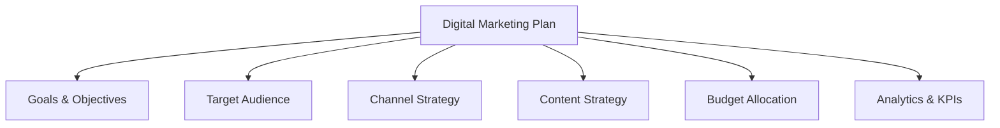
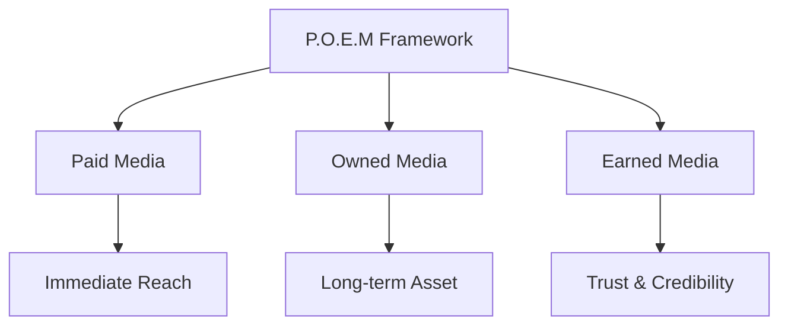
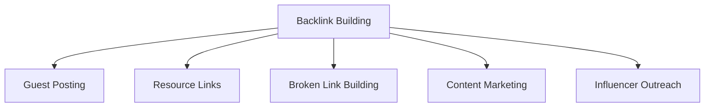
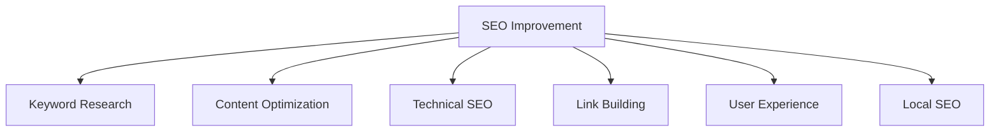
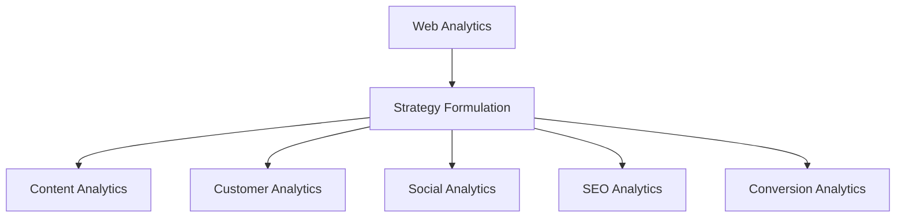
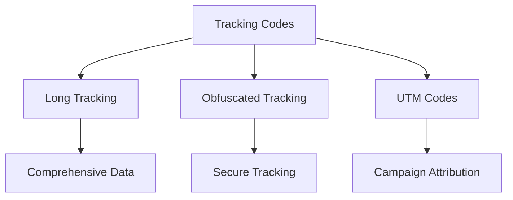
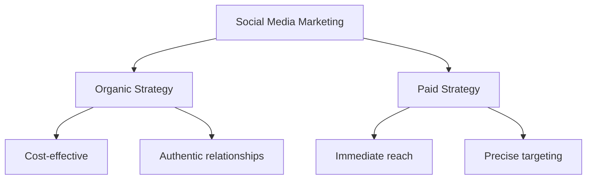
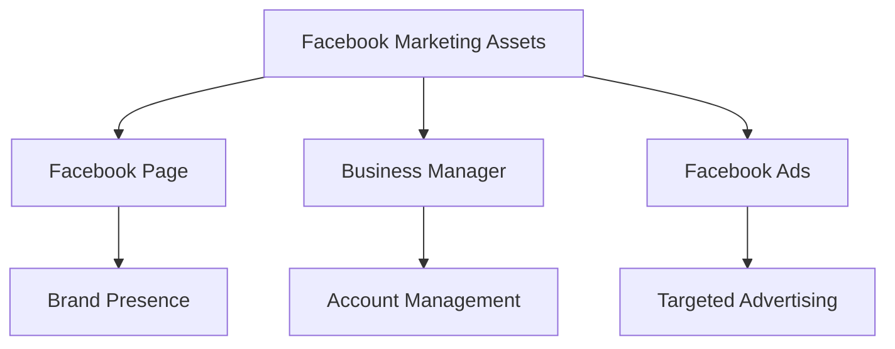
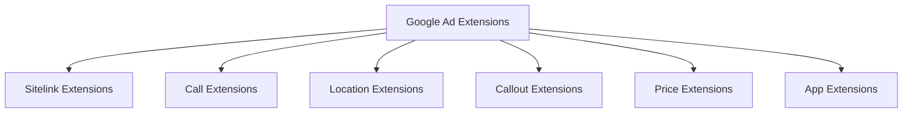
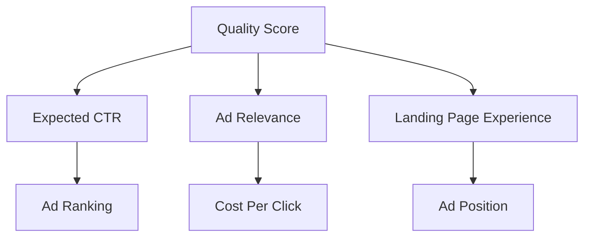

## Question 1(a) [3 marks]

**Explain three important factors that influence a website's SEO ranking.**

**Answer**:

| Factor | Description |
|--------|-------------|
| **Content Quality** | Fresh, relevant, keyword-optimized content that provides value to users |
| **Backlinks** | High-quality external websites linking to your site (domain authority) |
| **Technical SEO** | Site speed, mobile-friendliness, SSL certificate, and proper site structure |

- **Content Quality**: Search engines prioritize websites with original, valuable content
- **Backlinks**: Act as votes of confidence from other websites
- **Technical SEO**: Ensures search engines can crawl and index your site efficiently

**Mnemonic:** "CBT - Content, Backlinks, Technical"

## Question 1(b) [4 marks]

**Define data privacy and its importance in digital marketing.**

**Answer**:

**Data Privacy** is the protection of personal information collected from users during digital marketing activities.

| Aspect | Importance |
|--------|------------|
| **User Trust** | Builds customer confidence and loyalty |
| **Legal Compliance** | Avoids penalties from GDPR, CCPA regulations |
| **Brand Reputation** | Prevents negative publicity from data breaches |

- **User Trust**: Customers share more data when they trust your privacy practices
- **Legal Compliance**: Mandatory compliance with data protection laws
- **Brand Reputation**: Data breaches can severely damage brand image

**Mnemonic:** "TLR - Trust, Legal, Reputation"

## Question 1(c) [7 marks]

**Explain the key components of a digital marketing plan.**

**Answer**:

| Component | Description |
|-----------|-------------|
| **Goals & Objectives** | SMART goals aligned with business objectives |
| **Target Audience** | Demographics, psychographics, and behavior analysis |
| **Channel Strategy** | Selection of appropriate digital platforms |
| **Content Strategy** | Content types, themes, and publishing schedule |
| **Budget Allocation** | Resource distribution across channels |
| **Analytics & KPIs** | Measurement frameworks and success metrics |

- **Goals & Objectives**: Define specific, measurable outcomes
- **Target Audience**: Create detailed buyer personas
- **Channel Strategy**: Choose optimal mix of social media, email, SEO, PPC
- **Content Strategy**: Develop engaging content calendar
- **Budget Allocation**: Distribute resources based on ROI potential
- **Analytics & KPIs**: Track performance and optimize continuously

**Mnemonic:** "GT-CCBA - Goals-Target, Channels-Content-Budget-Analytics"

## Question 1(c OR) [7 marks]

**Define the P.O.E.M. Framework and explain its importance in digital marketing.**

**Answer**:

**P.O.E.M.** stands for **Paid, Owned, Earned, Media** framework for digital marketing strategy.

| Media Type | Description | Examples |
|------------|-------------|----------|
| **Paid** | Media you pay for | Google Ads, Facebook Ads, YouTube Ads |
| **Owned** | Media you control | Website, Blog, Email list, Mobile app |
| **Earned** | Media gained through credibility | Social shares, Reviews, PR mentions |

- **Paid Media**: Provides immediate visibility and targeted reach
- **Owned Media**: Creates long-term assets and brand control
- **Earned Media**: Builds trust and authentic brand advocacy

**Mnemonic:** "POE - Pay, Own, Earn"

## Question 2(a) [3 marks]

**Differentiate between black hat and white hat SEO techniques.**

**Answer**:

| Aspect | White Hat SEO | Black Hat SEO |
|--------|---------------|---------------|
| **Methods** | Ethical, guideline-compliant | Manipulative, rule-breaking |
| **Results** | Sustainable long-term growth | Quick but temporary gains |
| **Risk** | Safe from penalties | High risk of penalties |

- **White Hat SEO**: Follows search engine guidelines for sustainable results
- **Black Hat SEO**: Uses deceptive practices for quick ranking gains
- **Risk Factor**: Black hat techniques can result in complete site bans

**Mnemonic:** "WEB - White Ethical Benefits, Black Breaks-rules"

## Question 2(b) [4 marks]

**Explain how search engine algorithms work and how they rank websites.**

**Answer**:

| Process | Function |
|---------|----------|
| **Crawling** | Bots discover and scan web pages |
| **Indexing** | Pages stored in search engine database |
| **Ranking** | Algorithm determines page relevance and authority |
| **Results** | Best matches displayed for user queries |

- **Crawling**: Web crawlers follow links to find new content
- **Indexing**: Content analyzed and stored in massive databases
- **Ranking**: 200+ factors determine search result positions
- **Results**: Most relevant pages shown first to users

**Mnemonic:** "CIRR - Crawl, Index, Rank, Results"

## Question 2(c) [7 marks]

**Describe the strategies for building backlinks.**

**Answer**:

| Strategy | Description | Effectiveness |
|----------|-------------|---------------|
| **Guest Posting** | Write articles for other websites | High |
| **Resource Link Building** | Get listed in industry directories | Medium |
| **Broken Link Building** | Replace broken links with your content | High |
| **Content Marketing** | Create shareable, valuable content | Very High |
| **Influencer Outreach** | Partner with industry influencers | High |

- **Guest Posting**: Builds relationships and authority in your niche
- **Resource Link Building**: Establishes credibility through directories
- **Broken Link Building**: Provides value by fixing broken resources
- **Content Marketing**: Naturally attracts links through quality content
- **Influencer Outreach**: Leverages established audiences for link opportunities

**Mnemonic:** "GRBCI - Guest, Resource, Broken, Content, Influencer"

## Question 2(a OR) [3 marks]

**Explain the importance of backlinks, website speed and performance in search engine ranking.**

**Answer**:

| Factor | Impact on SEO |
|--------|---------------|
| **Backlinks** | Authority and trust signals |
| **Website Speed** | User experience ranking factor |
| **Performance** | Core Web Vitals affect rankings |

- **Backlinks**: Act as votes of confidence from other websites
- **Website Speed**: Faster sites rank higher and reduce bounce rates
- **Performance**: Google prioritizes sites with good Core Web Vitals

**Mnemonic:** "BSP - Backlinks, Speed, Performance"

## Question 2(b OR) [4 marks]

**Differentiate between on-page and off-page SEO, and provide examples of each.**

**Answer**:

| SEO Type | Focus | Examples |
|----------|-------|----------|
| **On-Page** | Website optimization | Title tags, meta descriptions, content optimization |
| **Off-Page** | External factors | Backlinks, social signals, brand mentions |

- **On-Page SEO**: Controls elements within your website
- **Off-Page SEO**: Builds authority through external validation
- **Examples**: On-page includes keyword optimization; off-page includes link building

**Mnemonic:** "IO - Internal Optimization, External Elevation"

## Question 2(c OR) [7 marks]

**Explain Different ways to improve SEO rankings.**

**Answer**:

| Method | Description | Impact |
|--------|-------------|--------|
| **Keyword Research** | Target relevant, low-competition keywords | High |
| **Content Optimization** | Create valuable, keyword-rich content | Very High |
| **Technical SEO** | Improve site speed, mobile-friendliness | High |
| **Link Building** | Acquire quality backlinks | Very High |
| **User Experience** | Enhance site usability and engagement | Medium |
| **Local SEO** | Optimize for local search results | High (for local business) |

- **Keyword Research**: Foundation for all SEO efforts
- **Content Optimization**: Provides value while targeting keywords
- **Technical SEO**: Ensures search engines can effectively crawl your site
- **Link Building**: Builds domain authority and trust
- **User Experience**: Reduces bounce rate and increases engagement
- **Local SEO**: Critical for businesses with physical locations

**Mnemonic:** "KC-TLUL - Keywords, Content, Technical, Links, User-experience, Local"

## Question 3(a) [3 marks]

**Differentiate between single-touch and multi-touch attribution models.**

**Answer**:

| Model Type | Credit Assignment | Use Case |
|------------|-------------------|----------|
| **Single-Touch** | 100% credit to one touchpoint | Simple customer journeys |
| **Multi-Touch** | Credit distributed across touchpoints | Complex customer journeys |

- **Single-Touch**: First-click or last-click gets full credit
- **Multi-Touch**: Linear, time-decay, or position-based attribution
- **Usage**: Multi-touch provides more accurate customer journey insights

**Mnemonic:** "SM - Single Simple, Multi Multiple"

## Question 3(b) [4 marks]

**Explain how businesses can set up goals in Google Analytics.**

**Answer**:

| Step | Action |
|------|--------|
| **1. Access Goals** | Navigate to Admin → View → Goals |
| **2. Choose Template** | Select from template or create custom |
| **3. Configure Details** | Set goal name, type, and conditions |
| **4. Verify Setup** | Test goal using verification feature |

- **Goal Types**: Destination, Duration, Pages/Session, Event goals
- **Configuration**: Define specific conditions for goal completion
- **Verification**: Ensure goals track correctly before implementation
- **Monitoring**: Regular review and optimization of goal performance

**Mnemonic:** "ACCV - Access, Choose, Configure, Verify"

## Question 3(c) [7 marks]

**What is the role of web analytics in formulation of digital marketing strategy? Discuss different types of web analytics.**

**Answer**:

**Role in Strategy:**
Web analytics provides data-driven insights for informed decision-making in digital marketing.

| Analytics Type | Purpose | Key Metrics |
|----------------|---------|-------------|
| **Content Analytics** | Content performance tracking | Page views, time on page, bounce rate |
| **Customer Analytics** | User behavior analysis | Demographics, interests, conversion paths |
| **Social Media Analytics** | Social engagement measurement | Shares, likes, comments, reach |
| **SEO Analytics** | Search performance tracking | Keywords, rankings, organic traffic |
| **Conversion Analytics** | Goal completion tracking | Conversion rate, revenue, ROI |

- **Strategic Role**: Identifies opportunities, measures performance, guides optimization
- **Content Analytics**: Helps optimize content strategy based on engagement
- **Customer Analytics**: Enables better audience targeting and personalization
- **Social Media Analytics**: Measures social media ROI and engagement
- **SEO Analytics**: Tracks organic search performance and opportunities
- **Conversion Analytics**: Measures bottom-line impact of marketing efforts

**Mnemonic:** "CCSSC - Content, Customer, Social, SEO, Conversion"

## Question 3(a OR) [3 marks]

**Define the terms: Unique visitors, Average Visit Duration, Bounce rate.**

**Answer**:

| Metric | Definition |
|--------|------------|
| **Unique Visitors** | Individual users visiting site in specific time period |
| **Average Visit Duration** | Average time users spend on website per session |
| **Bounce Rate** | Percentage of visitors leaving after viewing one page |

- **Unique Visitors**: Counts each person once, regardless of return visits
- **Average Visit Duration**: Indicates content engagement and site stickiness
- **Bounce Rate**: High rates may indicate poor content match or site issues

**Mnemonic:** "UAB - Unique, Average, Bounce"

## Question 3(b OR) [4 marks]

**Explain A/B testing in web analytics.**

**Answer**:

**A/B Testing** is comparing two versions of a webpage to determine which performs better.

| Component | Description |
|-----------|-------------|
| **Version A** | Original webpage (control) |
| **Version B** | Modified webpage (variant) |
| **Traffic Split** | Usually 50/50 random distribution |
| **Metrics** | Conversion rate, click-through rate, engagement |

- **Process**: Split traffic between two versions and measure performance
- **Duration**: Run tests long enough for statistical significance
- **Variables**: Test one element at a time (headlines, buttons, images)
- **Decision**: Implement winning version based on data

**Mnemonic:** "ABCD - A-version, B-version, Compare, Decide"

## Question 3(c OR) [7 marks]

**Explain following tracking code with their pros and cons: Long tracking code, Obfuscated tracking code, UTM codes**

**Answer**:

| Tracking Type | Description | Pros | Cons |
|---------------|-------------|------|------|
| **Long Tracking Code** | Detailed parameters for comprehensive tracking | Complete data collection, detailed insights | Slow page load, complex implementation |
| **Obfuscated Tracking** | Encrypted/hidden tracking parameters | Data security, prevents tampering | Difficult debugging, complex setup |
| **UTM Codes** | URL parameters for campaign tracking | Easy implementation, campaign attribution | Manual tagging required, URL appearance |

- **Long Tracking Code**: Best for enterprise-level detailed analytics
- **Obfuscated Tracking**: Ideal for sensitive data protection requirements
- **UTM Codes**: Perfect for campaign tracking and traffic source identification

**Mnemonic:** "LOU - Long comprehensive, Obfuscated secure, UTM simple"

## Question 4(a) [3 marks]

**Explain different types of YouTube ads.**

**Answer**:

| Ad Type | Format | Placement |
|---------|--------|-----------|
| **Skippable In-Stream** | 5-second skip option | Before/during videos |
| **Non-Skippable** | 15-20 seconds, no skip | Before/during videos |
| **Bumper Ads** | 6 seconds, non-skippable | Before videos |

- **Skippable In-Stream**: Cost-effective, pay only for engaged viewers
- **Non-Skippable**: Guaranteed message delivery, higher completion rates
- **Bumper Ads**: Brand awareness, quick memorable messages

**Mnemonic:** "SNB - Skippable, Non-skippable, Bumper"

## Question 4(b) [4 marks]

**Explain the concept of LinkedIn marketing and discuss its significance in the digital marketing landscape.**

**Answer**:

**LinkedIn Marketing** focuses on professional networking and B2B relationship building.

| Aspect | Significance |
|--------|-------------|
| **Professional Audience** | Decision-makers and industry professionals |
| **B2B Focus** | Ideal for business-to-business marketing |
| **Content Authority** | Establishes thought leadership |
| **Networking** | Direct access to key business contacts |

- **Professional Audience**: Higher income, educated demographics
- **B2B Focus**: 80% of B2B leads come from LinkedIn
- **Content Authority**: Share industry insights and expertise
- **Networking**: Build valuable business relationships

**Mnemonic:** "PBCN - Professional, B2B, Content, Networking"

## Question 4(c) [7 marks]

**Describe the key differences between organic and paid social media marketing strategies. Provide two advantages and two disadvantages for each strategy.**

**Answer**:

| Strategy | Description | Advantages | Disadvantages |
|----------|-------------|------------|---------------|
| **Organic** | Free content posting and engagement | • Cost-effective • Builds authentic relationships | • Limited reach • Time-intensive |
| **Paid** | Sponsored content and advertisements | • Immediate reach • Precise targeting | • Requires budget • Temporary results |

**Organic Advantages:**

- **Cost-effective**: No advertising spend required
- **Builds authentic relationships**: Genuine community engagement

**Organic Disadvantages:**

- **Limited reach**: Algorithm restrictions reduce visibility
- **Time-intensive**: Requires consistent content creation and engagement

**Paid Advantages:**

- **Immediate reach**: Instant visibility to target audience
- **Precise targeting**: Advanced demographic and interest targeting

**Paid Disadvantages:**

- **Requires budget**: Ongoing advertising costs
- **Temporary results**: Results stop when advertising stops

**Mnemonic:** "OPAL - Organic Patient Authentic Low-cost, Paid Quick Targeted Expensive"

## Question 4(a OR) [3 marks]

**What are the different types of Twitter ads? Explain any one type briefly.**

**Answer**:

| Ad Type | Purpose |
|---------|---------|
| **Promoted Tweets** | Increase tweet visibility |
| **Promoted Accounts** | Gain more followers |
| **Promoted Trends** | Boost trending topics |

**Promoted Tweets**: Regular tweets that businesses pay to show to wider audiences beyond their followers, appearing in users' timelines and search results with "Promoted" label.

**Mnemonic:** "PAT - Promoted tweets, Accounts, Trends"

## Question 4(b OR) [4 marks]

**Samsung launched a new smart phone in market and want to run YouTube ads. As social media marketing expert which type of YouTube ad format would you will choose and why?**

**Answer**:

**Recommended Format: Skippable In-Stream Ads**

| Reason | Benefit |
|--------|---------|
| **Cost-Effective** | Pay only when users watch 30+ seconds |
| **Product Demonstration** | Longer format allows feature showcase |
| **Audience Interest** | Skip option ensures engaged viewers |
| **Brand Awareness** | Reaches broad audience with smartphone interest |

- **Product Demonstration**: Smartphones need visual demonstration of features
- **Audience Interest**: Skip option filters for genuinely interested viewers
- **Cost-Effective**: Only pay for engaged viewers who watch beyond 30 seconds
- **Brand Awareness**: Broad reach for new product launch

**Mnemonic:** "PCAB - Product demo, Cost-effective, Audience interest, Brand awareness"

## Question 4(c OR) [7 marks]

**Describe the main functions of a Facebook Page, Business Manager, and Facebook Ads. How can these assets help businesses in their marketing efforts?**

**Answer**:

| Asset | Main Functions | Marketing Benefits |
|-------|----------------|-------------------|
| **Facebook Page** | • Brand presence • Content sharing • Customer engagement | • Builds brand awareness • Direct customer communication |
| **Business Manager** | • Account management • Team access control • Asset organization | • Centralized control • Secure collaboration |
| **Facebook Ads** | • Targeted advertising • Campaign management • Performance tracking | • Precise audience targeting • Measurable ROI |

**Marketing Benefits:**

- **Facebook Page**: Creates professional brand presence and enables organic reach
- **Business Manager**: Provides security and organization for multiple accounts and team members
- **Facebook Ads**: Delivers targeted campaigns with detailed analytics and ROI tracking

**Integration Benefits:**

- **Unified Strategy**: All three work together for comprehensive Facebook marketing
- **Data Sharing**: Pixel data from page enhances ad targeting
- **Brand Consistency**: Consistent messaging across organic and paid content

**Mnemonic:** "PMA - Page presence, Manager control, Ads targeting"

## Question 5(a) [3 marks]

**List the Types of Instagram Content and Ads.**

**Answer**:

| Content Types | Ad Types |
|---------------|----------|
| **Posts** | Photo Ads |
| **Stories** | Video Ads |
| **Reels** | Carousel Ads |
| **IGTV** | Stories Ads |
| **Live** | Reels Ads |

- **Content Types**: Various formats for organic engagement
- **Ad Types**: Sponsored versions with targeting capabilities
- **Integration**: Ads blend naturally with organic content

**Mnemonic:** "PSRIL - Posts, Stories, Reels, IGTV, Live"

## Question 5(b) [4 marks]

**What is e-mail marketing? What are different types of e-mail marketing?**

**Answer**:

**Email Marketing** is direct digital communication with customers through personalized email messages.

| Type | Purpose | Example |
|------|---------|---------|
| **Newsletter** | Regular updates and information | Monthly company news |
| **Promotional** | Sales and offers | Discount codes, new products |
| **Transactional** | Purchase confirmations | Order receipts, shipping updates |
| **Welcome Series** | New subscriber onboarding | Introduction to brand and products |

- **Newsletter**: Builds relationships through valuable content
- **Promotional**: Drives sales and conversions
- **Transactional**: Provides essential customer service information
- **Welcome Series**: Nurtures new subscribers into customers

**Mnemonic:** "NPTW - Newsletter, Promotional, Transactional, Welcome"

## Question 5(c) [7 marks]

**Explain different types of ad extensions available in Google Ads with an example of each.**

**Answer**:

| Extension Type | Function | Example |
|----------------|----------|---------|
| **Sitelink Extensions** | Additional page links | "About Us", "Contact", "Products" |
| **Call Extensions** | Phone number display | "+1-800-123-4567" |
| **Location Extensions** | Business address | "123 Main St, City, State" |
| **Callout Extensions** | Highlight features | "Free Shipping", "24/7 Support" |
| **Price Extensions** | Product/service pricing | "Basic Plan: $19/month" |
| **App Extensions** | Mobile app downloads | "Download our iOS/Android app" |

**Benefits:**

- **Increased CTR**: Extensions make ads more prominent and informative
- **Better Quality Score**: Improved ad performance leads to lower costs
- **Enhanced User Experience**: Users get more relevant information
- **Competitive Advantage**: More screen real estate than competitors

**Implementation:**

- **Automatic**: Google may show relevant extensions automatically
- **Manual**: Advertisers can create and customize specific extensions
- **Performance**: Extensions shown based on predicted impact

**Mnemonic:** "SCLCPA - Sitelink, Call, Location, Callout, Price, App"

## Question 5(a OR) [3 marks]

**Explain importance and benefits of social media marketing.**

**Answer**:

| Benefit | Impact |
|---------|--------|
| **Brand Awareness** | Increases visibility and recognition |
| **Customer Engagement** | Direct interaction and relationship building |
| **Cost-Effective** | Lower costs compared to traditional advertising |

- **Brand Awareness**: Exponential reach through sharing and viral content
- **Customer Engagement**: Real-time feedback and community building
- **Cost-Effective**: High ROI with targeted advertising options

**Mnemonic:** "BEC - Brand awareness, Engagement, Cost-effective"

## Question 5(b OR) [4 marks]

**Give the difference between PPC and SEO.**

**Answer**:

| Aspect | PPC (Pay-Per-Click) | SEO (Search Engine Optimization) |
|--------|-------------------|----------------------------------|
| **Cost** | Paid advertising | Organic/Free traffic |
| **Results** | Immediate visibility | Long-term sustainable results |
| **Control** | Full control over ads | Limited control over rankings |
| **Duration** | Results stop when payments stop | Long-lasting results |

- **PPC**: Immediate results but requires ongoing investment
- **SEO**: Takes time to build but provides sustainable long-term value
- **Integration**: Best results come from combining both strategies
- **Budget**: PPC needs advertising budget; SEO needs time investment

**Mnemonic:** "ICRD - Immediate vs Continuous, Results vs Duration"

## Question 5(c OR) [7 marks]

**Explain the concept of Quality Score in Google AdWords and its impact on ad rankings.**

**Answer**:

**Quality Score** is Google's rating (1-10) of ad quality, keywords, and landing pages.

| Component | Weight | Impact |
|-----------|--------|--------|
| **Expected CTR** | High | Predicted likelihood users will click |
| **Ad Relevance** | High | How closely ad matches search intent |
| **Landing Page Experience** | Medium | Page quality and user experience |

**Impact on Ad Rankings:**

| Quality Score | Ad Rank Impact | Cost Impact |
|---------------|----------------|-------------|
| **High (8-10)** | Higher positions | Lower CPC |
| **Medium (5-7)** | Average positions | Average CPC |
| **Low (1-4)** | Lower positions | Higher CPC |

**Benefits of High Quality Score:**

- **Lower Costs**: Pay less per click than competitors
- **Better Positions**: Appear higher in search results
- **Increased Visibility**: More ad extension eligibility
- **Improved ROI**: Better performance at lower costs

**Optimization Strategies:**

- **Keyword Relevance**: Match keywords closely to ad copy
- **Ad Copy Quality**: Write compelling, relevant ad text
- **Landing Page**: Ensure fast, relevant, user-friendly pages
- **Account Structure**: Organize campaigns and ad groups logically

**Mnemonic:** "EAL-RCP - Expected CTR, Ad relevance, Landing page affect Rank, Cost, Position"
