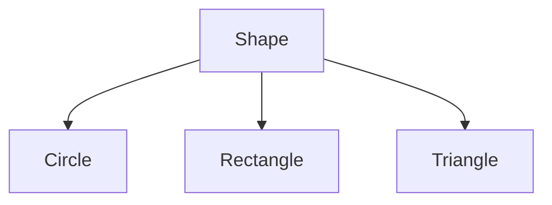
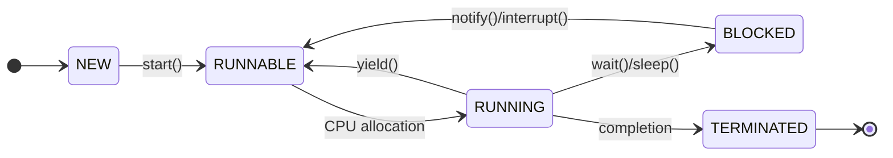
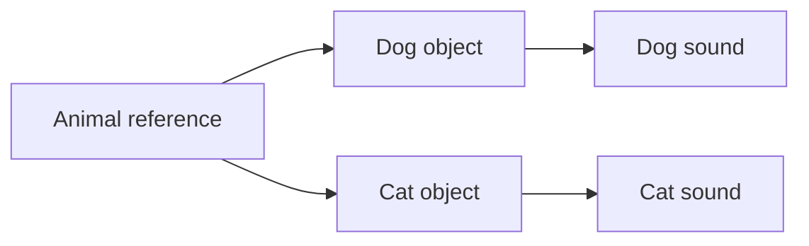

## પ્રશ્ન 1(અ) [3 ગુણ]

**પ્રોસિજર-ઓરિએન્ટેડ પ્રોગ્રામિંગ (POP) અને ઑબ્જેક્ટ-ઓરિએન્ટેડ પ્રોગ્રામિંગ (OOP) વચ્ચે તફાવત કરો.**

**જવાબ**:

**ટેબલ:**

| પાસું | POP | OOP |
|------|-----|-----|
| **ધ્યાન** | ફંક્શન્સ/પ્રોસિજર્સ | ઑબ્જેક્ટ્સ અને ક્લાસ્સિઝ |
| **ડેટા સિક્યોરિટી** | ઓછી સુરક્ષા, ગ્લોબલ ડેટા | વધુ સુરક્ષા, ડેટા encapsulation |
| **સમસ્યા ઉકેલ** | ટોપ-ડાઉન એપ્રોચ | બોટમ-અપ એપ્રોચ |
| **કોડ પુનઃઉપયોગ** | મર્યાદિત | inheritance દ્વારા વધુ |
| **ઉદાહરણો** | C, Pascal | Java, C++, Python |

- **POP**: પ્રોગ્રામ ફંક્શન્સમાં વિભાજિત, ડેટા ફંક્શન્સ વચ્ચે વહે છે
- **OOP**: પ્રોગ્રામ ઑબ્જેક્ટ્સની આસપાસ ગોઠવાયેલું જેમાં ડેટા અને મેથડ્સ બંને હોય છે

**મેમરી ટ્રીક:** "POP ફંક્શન્સ, OOP ઑબ્જેક્ટ્સ"

---

## પ્રશ્ન 1(બ) [4 ગુણ]

**યોગ્ય ઉદાહરણ સાથે inheritance માં Super કીવર્ડ સમજાવો.**

**જવાબ**:

**Super કીવર્ડ** નો ઉપયોગ child class માંથી parent class ના members ને access કરવા માટે થાય છે.

**ટેબલ: Super કીવર્ડના ઉપયોગો**

| ઉપયોગ | હેતુ | ઉદાહરણ |
|-------|-----|---------|
| **super()** | parent constructor ને કૉલ કરે | super(name, age) |
| **super.method()** | parent method ને કૉલ કરે | super.display() |
| **super.variable** | parent variable ને access કરે | super.name |

**કોડ બ્લોક:**

```java
class Animal {
    String name = "Animal";
    void eat() { System.out.println("Animal eats"); }
}

class Dog extends Animal {
    String name = "Dog";
    void eat() {
        super.eat(); // parent method ને કૉલ કરે છે
        System.out.println("Dog eats bones");
    }
    void display() {
        System.out.println(super.name); // "Animal" પ્રિન્ટ કરે છે
    }
}
```

**મેમરી ટ્રીક:** "Super Parent ને કૉલ કરે"

---

## પ્રશ્ન 1(ક) [7 ગુણ]

**વ્યાખ્યાયિત કરો: મેથડ ઓવરરાઇડિંગ. મેથડ ઓવરરાઇડિંગ માટેના નિયમોની યાદી બનાવો. એક જાવા પ્રોગ્રામ લખો જે મેથડ ઓવરરાઇડિંગને implement કરે છે.**

**જવાબ**:

**મેથડ ઓવરરાઇડિંગ**: Child class પોતાની parent class ના method નું specific implementation આપે છે સમાન signature સાથે.

**ટેબલ: મેથડ ઓવરરાઇડિંગના નિયમો**

| નિયમ | વર્ણન |
|-----|------|
| **સમાન નામ** | મેથડનું નામ સમાન હોવું જોઈએ |
| **સમાન parameters** | Parameter list બરાબર મેચ થવી જોઈએ |
| **IS-A સંબંધ** | inheritance હોવું જરૂરી |
| **Access modifier** | visibility ઘટાડી શકાતી નથી |
| **Return type** | સમાન અથવા covariant હોવું જોઈએ |

**કોડ બ્લોક:**

```java
class Shape {
    void draw() {
        System.out.println("Drawing a shape");
    }
}

class Circle extends Shape {
    @Override
    void draw() {
        System.out.println("Drawing a circle");
    }
}

class Main {
    public static void main(String[] args) {
        Shape s = new Circle();
        s.draw(); // આઉટપુટ: Drawing a circle
    }
}
```

**મેમરી ટ્રીક:** "Override સમાન Signature"

---

## પ્રશ્ન 1(ક OR) [7 ગુણ]

**વર્ણવો: ઇન્ટરફેસ. મલ્ટિપલ inheritance ને દર્શાવવા માટે interface નો ઉપયોગ કરીને જાવા પ્રોગ્રામ લખો.**

**જવાબ**:

**Interface**: blueprint જેમાં abstract methods અને constants હોય છે. Classes interfaces ને implement કરીને multiple inheritance પ્રાપ્ત કરે છે.

**ટેબલ: Interface ની વિશેષતાઓ**

| વિશેષતા | વર્ણન |
|---------|-------|
| **Abstract methods** | કોઈ implementation નથી (Java 8 પહેલાં) |
| **Constants** | બધા variables public static final છે |
| **Multiple inheritance** | Class અનેક interfaces implement કરી શકે |
| **Default methods** | Concrete methods (Java 8+) |

**કોડ બ્લોક:**

```java
interface Flyable {
    void fly();
}

interface Swimmable {
    void swim();
}

class Duck implements Flyable, Swimmable {
    public void fly() {
        System.out.println("Duck flies");
    }
    
    public void swim() {
        System.out.println("Duck swims");
    }
}

class Main {
    public static void main(String[] args) {
        Duck d = new Duck();
        d.fly();
        d.swim();
    }
}
```

**મેમરી ટ્રીક:** "Interface Multiple Implementation"

---

## પ્રશ્ન 2(અ) [3 ગુણ]

**ઉદાહરણ સાથે Java પ્રોગ્રામ સ્ટ્રક્ચર સમજાવો.**

**જવાબ**:

**Java પ્રોગ્રામ સ્ટ્રક્ચર** માં package, imports, class declaration અને main method હોય છે.

**આકૃતિ:**

```goat
+------------------+
| Package statement|
+------------------+
| Import statements|
+------------------+
| Class declaration|
| +-------------+  |
| | Variables   |  |
| +-------------+  |
| | Methods     |  |
| +-------------+  |
+------------------+
```

**કોડ બ્લોક:**

```java
package com.example;        // Package
import java.util.*;         // Import

public class HelloWorld {   // Class
    static int count = 0;   // Variable
    
    public static void main(String[] args) { // Main method
        System.out.println("Hello World");
    }
}
```

**મેમરી ટ્રીક:** "Package Import Class Main"

---

## પ્રશ્ન 2(બ) [4 ગુણ]

**યોગ્ય ઉદાહરણ સાથે static કીવર્ડ સમજાવો.**

**જવાબ**:

**Static કીવર્ડ** class નું છે instance નું નહીં. memory એક વાર allocate થાય છે.

**ટેબલ: Static ના ઉપયોગો**

| પ્રકાર | વર્ણન | ઉદાહરણ |
|------|-------|---------|
| **Static variable** | બધા objects દ્વારા shared | static int count |
| **Static method** | object વિના કૉલ થાય | static void display() |
| **Static block** | main પહેલાં execute થાય | static { } |

**કોડ બ્લોક:**

```java
class Student {
    static String college = "GTU";  // static variable
    String name;
    
    static void showCollege() {     // static method
        System.out.println(college);
    }
    
    static {                        // static block
        System.out.println("Static block executed");
    }
}

class Main {
    public static void main(String[] args) {
        Student.showCollege(); // કોઈ object ની જરૂર નથી
    }
}
```

**મેમરી ટ્રીક:** "Static Class દ્વારા Shared"

---

## પ્રશ્ન 2(ક) [7 ગુણ]

**વ્યાખ્યાયિત કરો: કન્સ્ટ્રક્ટર. તેના પ્રકારોની યાદી બનાવો. પેરામીટરાઇઝ્ડ અને કોપી કન્સ્ટ્રક્ટરને યોગ્ય ઉદાહરણ સાથે સમજાવો.**

**જવાબ**:

**કન્સ્ટ્રક્ટર**: objects ને initialize કરવા માટેની special method, class જેવું જ નામ, કોઈ return type નથી.

**ટેબલ: કન્સ્ટ્રક્ટરના પ્રકારો**

| પ્રકાર | વર્ણન | ઉદાહરણ |
|------|-------|---------|
| **Default** | કોઈ parameters નથી | Student() |
| **Parameterized** | parameters સાથે | Student(String name) |
| **Copy** | object ની copy બનાવે | Student(Student s) |

**કોડ બ્લોક:**

```java
class Student {
    String name;
    int age;
    
    // Parameterized constructor
    Student(String n, int a) {
        name = n;
        age = a;
    }
    
    // Copy constructor
    Student(Student s) {
        name = s.name;
        age = s.age;
    }
    
    void display() {
        System.out.println(name + " " + age);
    }
}

class Main {
    public static void main(String[] args) {
        Student s1 = new Student("John", 20);  // Parameterized
        Student s2 = new Student(s1);          // Copy
        s1.display();
        s2.display();
    }
}
```

**મેમરી ટ્રીક:** "Constructor Objects ને Initialize કરે"

---

## પ્રશ્ન 2(અ OR) [3 ગુણ]

**જાવામાં પ્રિમિટિવ ડેટા પ્રકારો અને યુઝર ડિફાઇન્ડ ડેટા પ્રકારો સમજાવો.**

**જવાબ**:

**પ્રિમિટિવ ડેટા ટાઇપ્સ**: Java language દ્વારા આપવામાં આવેલા built-in types.
**યુઝર ડિફાઇન્ડ ટાઇપ્સ**: programmer દ્વારા classes વાપરીને બનાવવામાં આવેલા custom types.

**ટેબલ: ડેટા ટાઇપ્સ**

| કેટેગરી | પ્રકારો | સાઇઝ | ઉદાહરણ |
|---------|-------|------|---------|
| **Primitive** | byte, short, int, long | 1,2,4,8 bytes | int x = 10; |
| **Primitive** | float, double | 4,8 bytes | double d = 3.14; |
| **Primitive** | char, boolean | 2,1 bytes | char c = 'A'; |
| **User Defined** | Class, Interface, Array | Variable | Student s; |

- **Primitive**: stack માં store થાય, ઝડપી access
- **User Defined**: heap માં store થાય, જટિલ operations

**મેમરી ટ્રીક:** "Primitive Built-in, User Custom"

---

## પ્રશ્ન 2(બ OR) [4 ગુણ]

**યોગ્ય ઉદાહરણ સાથે this કીવર્ડ સમજાવો.**

**જવાબ**:

**This કીવર્ડ** વર્તમાન object instance ને refer કરે છે, instance અને local variables વચ્ચે ભેદ પાડવા માટે વાપરાય છે.

**ટેબલ: This કીવર્ડના ઉપયોગો**

| ઉપયોગ | હેતુ | ઉદાહરણ |
|-------|-----|---------|
| **this.variable** | instance variable ને access કરે | this.name = name; |
| **this.method()** | instance method ને કૉલ કરે | this.display(); |
| **this()** | constructor ને કૉલ કરે | this(name, age); |

**કોડ બ્લોક:**

```java
class Student {
    String name;
    int age;
    
    Student(String name, int age) {
        this.name = name;    // this instance અને parameter વચ્ચે
        this.age = age;      // ભેદ પાડે છે
    }
    
    void setData(String name) {
        this.name = name;    // this વર્તમાન object ને refer કરે
    }
    
    void display() {
        System.out.println(this.name + " " + this.age);
    }
}
```

**મેમરી ટ્રીક:** "This વર્તમાન Object"

---

## પ્રશ્ન 2(ક OR) [7 ગુણ]

**ઇનહેરિટન્સ વ્યાખ્યાયિત કરો. તેના પ્રકારોની યાદી બનાવો. multilevel અને hierarchical ઇનહેરિટન્સને યોગ્ય ઉદાહરણ સાથે સમજાવો.**

**જવાબ**:

**Inheritance**: mechanism જેમાં child class parent class ના properties અને methods મેળવે છે.

**ટેબલ: Inheritance ના પ્રકારો**

| પ્રકાર | વર્ણન | સ્ટ્રક્ચર |
|------|-------|---------|
| **Single** | એક parent, એક child | A → B |
| **Multilevel** | inheritance ની chain | A → B → C |
| **Hierarchical** | એક parent, અનેક children | A → B, A → C |
| **Multiple** | અનેક parents (interfaces દ્વારા) | B,C → A |

**આકૃતિ - Multilevel:**


**કોડ બ્લોક - Multilevel:**

```java
class Animal {
    void eat() { System.out.println("Animal eats"); }
}

class Mammal extends Animal {
    void breathe() { System.out.println("Mammal breathes"); }
}

class Dog extends Mammal {
    void bark() { System.out.println("Dog barks"); }
}
```

**આકૃતિ - Hierarchical:**



**કોડ બ્લોક - Hierarchical:**

```java
class Shape {
    void draw() { System.out.println("Drawing shape"); }
}

class Circle extends Shape {
    void drawCircle() { System.out.println("Drawing circle"); }
}

class Rectangle extends Shape {
    void drawRectangle() { System.out.println("Drawing rectangle"); }
}
```

**મેમરી ટ્રીક:** "Inheritance Properties શેર કરે"

---

## પ્રશ્ન 3(અ) [3 ગુણ]

**જાવામાં ટાઇપ કન્વર્ઝન અને કાસ્ટિંગ સમજાવો.**

**જવાબ**:

**Type Conversion**: એક data type ને બીજામાં બદલવું.
**Casting**: programmer દ્વારા explicit type conversion.

**ટેબલ: Type Conversion**

| Type | Description | Example |
|------|-------------|---------|
| **Implicit (Widening)** | Automatic, smaller to larger | int to double |
| **Explicit (Narrowing)** | Manual, larger to smaller | double to int |

**કોડ બ્લોક:**

```java
// Implicit conversion
int i = 10;
double d = i;        // int થી double (automatic)

// Explicit casting
double x = 10.5;
int y = (int) x;     // double થી int (manual)

// String conversion
String s = String.valueOf(i);    // int થી String
int z = Integer.parseInt("123"); // String થી int
```

**મેમરી ટ્રીક:** "Implicit Auto, Explicit Manual"

---

## પ્રશ્ન 3(બ) [4 ગુણ]

**Java માં ઉપયોગમાં લેવાતા વિવિધ visibility controls સમજાવો.**

**જવાબ**:

**Visibility Controls (Access Modifiers)**: classes, methods અને variables ના access ને control કરે છે.

**ટેબલ: Access Modifiers**

| Modifier | Same Class | Same Package | Subclass | Different Package |
|----------|------------|--------------|----------|-------------------|
| **private** | ✓ | ✗ | ✗ | ✗ |
| **default** | ✓ | ✓ | ✗ | ✗ |
| **protected** | ✓ | ✓ | ✓ | ✗ |
| **public** | ✓ | ✓ | ✓ | ✓ |

**કોડ બ્લોક:**

```java
class Example {
    private int x = 10;      // માત્ર class અંદર
    int y = 20;              // Package level
    protected int z = 30;    // Package + subclass
    public int w = 40;       // દરેક જગ્યાએ
    
    private void method1() { }    // Private method
    public void method2() { }     // Public method
}
```

**મેમરી ટ્રીક:** "Private Package Protected Public"

---

## પ્રશ્ન 3(ક) [7 ગુણ]

**વ્યાખ્યાયિત કરો: થ્રેડ. થ્રેડ બનાવવા માટે ઉપયોગમાં લેવાતી વિવિધ પદ્ધતિઓની સૂચિ બનાવો. થ્રેડની લાઇફ સાઇકલ વિગતવાર સમજાવો.**

**જવાબ**:

**Thread**: lightweight subprocess જે program ના અનેક ભાગોને concurrent execution ની મંજૂરી આપે છે.

**ટેબલ: Thread બનાવવાની પદ્ધતિઓ**

| પદ્ધતિ | વર્ણન | ઉદાહરણ |
|-------|-------|---------|
| **Thread વિસ્તરવું** | Thread class ને inherit કરવું | class MyThread extends Thread |
| **Runnable implement કરવું** | Runnable interface implement કરવું | class MyTask implements Runnable |

**આકૃતિ: Thread Life Cycle**



**ટેબલ: Thread States**

| સ્થિતિ | વર્ણન |
|-------|-------|
| **NEW** | Thread બન્યું પણ શરૂ નથી થયું |
| **RUNNABLE** | ચાલવા તૈયાર, CPU ની રાહમાં |
| **RUNNING** | હાલમાં execute થઈ રહ્યું છે |
| **BLOCKED** | resource અથવા sleep ની રાહમાં |
| **TERMINATED** | execution પૂર્ણ થયું |

**કોડ બ્લોક:**

```java
// પદ્ધતિ 1: Thread વિસ્તરવું
class MyThread extends Thread {
    public void run() {
        System.out.println("Thread running");
    }
}

// પદ્ધતિ 2: Runnable implement કરવું
class MyTask implements Runnable {
    public void run() {
        System.out.println("Task running");
    }
}

class Main {
    public static void main(String[] args) {
        MyThread t1 = new MyThread();
        Thread t2 = new Thread(new MyTask());
        t1.start();
        t2.start();
    }
}
```

**મેમરી ટ્રીક:** "Thread Concurrent Execution"

---

## પ્રશ્ન 3(અ OR) [3 ગુણ]

**java માં JVM નો હેતુ સમજાવો.**

**જવાબ**:

**JVM (Java Virtual Machine)**: runtime environment જે Java bytecode execute કરે છે અને platform independence પ્રદાન કરે છે.

**ટેબલ: JVM Components**

| Component | હેતુ |
|-----------|-----|
| **Class Loader** | .class files ને memory માં લોડ કરે |
| **Execution Engine** | bytecode execute કરે |
| **Memory Area** | heap અને stack memory ને manage કરે |
| **Garbage Collector** | automatic memory management |

**આકૃતિ:**

```goat
+----------------+
| Java Source    |
| (.java)        |
+----------------+
        |
        v
+----------------+
| Java Compiler  |
| (javac)        |
+----------------+
        |
        v
+----------------+
| Bytecode       |
| (.class)       |
+----------------+
        |
        v
+----------------+
| JVM            |
| (Platform      |
|  Specific)     |
+----------------+
```

- **Platform Independence**: "એકવાર લખો, દરેક જગ્યાએ ચલાવો"
- **Memory Management**: automatic garbage collection
- **Security**: Bytecode verification

**મેમરી ટ્રીક:** "JVM Java Virtual Machine"

---

## પ્રશ્ન 3(બ OR) [4 ગુણ]

**વ્યાખ્યાયિત કરો: પેકેજ. યોગ્ય ઉદાહરણ સાથે પેકેજ બનાવવા માટેના પગલાંઓ લખો.**

**જવાબ**:

**Package**: સંબંધિત classes અને interfaces નો સંગ્રહ, namespace અને access control પ્રદાન કરે છે.

**ટેબલ: Package ના ફાયદા**

| ફાયદો | વર્ણન |
|-------|-------|
| **Namespace** | નામની ટકરાર ટાળે |
| **Access Control** | બહેતર encapsulation |
| **Organization** | logical grouping |
| **Reusability** | maintain કરવું સરળ |

**Package બનાવવાના પગલાં:**

1. **Package declare કરો** file ની ટોચે
2. **Directory structure બનાવો** package name મુજબ
3. **Compile કરો** package structure સાથે
4. **Import કરો** અન્ય classes માં

**કોડ બ્લોક:**

```java
// File: com/company/utilities/Calculator.java
package com.company.utilities;

public class Calculator {
    public int add(int a, int b) {
        return a + b;
    }
}

// File: Main.java
import com.company.utilities.Calculator;

class Main {
    public static void main(String[] args) {
        Calculator calc = new Calculator();
        System.out.println(calc.add(5, 3));
    }
}
```

**Directory Structure:**

```
com/
  company/
    utilities/
      Calculator.class
Main.class
```

**મેમરી ટ્રીક:** "Package Classes ને Group કરે"

---

## પ્રશ્ન 3(ક OR) [7 ગુણ]

**થ્રેડમાં Synchronization ને યોગ્ય ઉદાહરણ સાથે સમજાવો.**

**જવાબ**:

**Synchronization**: shared resources ના access ને multiple threads દ્વારા control કરવાની mechanism, data inconsistency ટાળવા માટે.

**ટેબલ: Synchronization ના પ્રકારો**

| પ્રકાર | વર્ણન | ઉપયોગ |
|------|-------|-------|
| **Synchronized method** | આખી method lock થાય | synchronized void method() |
| **Synchronized block** | ચોક્કસ code block lock થાય | synchronized(object) { } |
| **Static synchronization** | Class level locking | synchronized static void method() |

**કોડ બ્લોક:**

```java
class Counter {
    private int count = 0;
    
    // Synchronized method
    public synchronized void increment() {
        count++;
    }
    
    // Synchronized block
    public void decrement() {
        synchronized(this) {
            count--;
        }
    }
    
    public int getCount() {
        return count;
    }
}

class CounterThread extends Thread {
    Counter counter;
    
    CounterThread(Counter c) {
        counter = c;
    }
    
    public void run() {
        for(int i = 0; i < 1000; i++) {
            counter.increment();
        }
    }
}

class Main {
    public static void main(String[] args) throws InterruptedException {
        Counter c = new Counter();
        CounterThread t1 = new CounterThread(c);
        CounterThread t2 = new CounterThread(c);
        
        t1.start();
        t2.start();
        
        t1.join();
        t2.join();
        
        System.out.println("Final count: " + c.getCount());
    }
}
```

**મેમરી ટ્રીક:** "Synchronization Race Conditions અટકાવે"

---

## પ્રશ્ન 4(અ) [3 ગુણ]

**સ્ટ્રિંગ ક્લાસ અને સ્ટ્રિંગબફર ક્લાસ વચ્ચે તફાવત કરો.**

**જવાબ**:

**ટેબલ: String vs StringBuffer**

| પાસું | String | StringBuffer |
|------|--------|--------------|
| **Mutability** | Immutable (બદલાતું નથી) | Mutable (બદલાય છે) |
| **Performance** | concatenation માટે ધીમું | concatenation માટે ઝડપું |
| **Memory** | દર વખતે નવું object બનાવે | હાલનું object modify કરે |
| **Thread Safety** | Thread safe | Thread safe |
| **Methods** | concat(), substring() | append(), insert(), delete() |

**કોડ બ્લોક:**

```java
// String - Immutable
String s1 = "Hello";
s1 = s1 + " World";  // નવું String object બનાવે છે

// StringBuffer - Mutable
StringBuffer sb = new StringBuffer("Hello");
sb.append(" World");  // હાલનું object modify કરે છે
```

- **String**: જ્યારે content વારંવાર બદલાતું નથી ત્યારે વાપરો
- **StringBuffer**: જ્યારે વારંવાર modifications જરૂરી હોય ત્યારે વાપરો

**મેમરી ટ્રીક:** "String Immutable, StringBuffer Mutable"

---

## પ્રશ્ન 4(બ) [4 ગુણ]

**એરેની 10 સંખ્યાઓનો સરવાળો અને સરેરાશ મેળવવા માટે જાવા પ્રોગ્રામ લખો.**

**જવાબ**:

**કોડ બ્લોક:**

```java
class ArraySum {
    public static void main(String[] args) {
        // 10 numbers સાથે array initialize કરો
        int[] numbers = {10, 20, 30, 40, 50, 60, 70, 80, 90, 100};
        
        int sum = 0;
        
        // સરવાળો calculate કરો
        for(int i = 0; i < numbers.length; i++) {
            sum += numbers[i];
        }
        
        // સરેરાશ calculate કરો
        double average = (double) sum / numbers.length;
        
        // પરિણામો display કરો
        System.out.println("Array elements: ");
        for(int num : numbers) {
            System.out.print(num + " ");
        }
        
        System.out.println("\nSum: " + sum);
        System.out.println("Average: " + average);
    }
}
```

**આઉટપુટ:**

```
Array elements: 10 20 30 40 50 60 70 80 90 100
Sum: 550
Average: 55.0
```

**લોજિક પગલાં:**

1. **Initialize** 10 numbers સાથે array
2. **Loop** array માં સરવાળો calculate કરવા માટે
3. **Calculate** સરેરાશ = સરવાળો / length
4. **Display** પરિણામો

**મેમરી ટ્રીક:** "Loop Sum Divide Average"

---

## પ્રશ્ન 4(ક) [7 ગુણ]

**I) યોગ્ય ઉદાહરણ સાથે abstract class સમજાવો. II) યોગ્ય ઉદાહરણ સાથે final class સમજાવો.**

**જવાબ**:

**I) Abstract Class**: class જેનું instantiation થઈ શકતું નથી, abstract methods હોય છે જેનું implementation subclasses માં જરૂરી છે.

**ટેબલ: Abstract Class ની વિશેષતાઓ**

| વિશેષતા | વર્ણન |
|---------|-------|
| **Cannot instantiate** | object બનાવી શકાતું નથી |
| **Abstract methods** | implementation વિનાની methods |
| **Concrete methods** | implementation સાથેની methods |
| **Inheritance** | Subclasses માં abstract methods implement કરવા જરૂરી |

**કોડ બ્લોક - Abstract Class:**

```java
abstract class Shape {
    String color;
    
    // Abstract method
    abstract void draw();
    
    // Concrete method
    void setColor(String c) {
        color = c;
    }
}

class Circle extends Shape {
    void draw() {
        System.out.println("Drawing Circle");
    }
}

class Main {
    public static void main(String[] args) {
        // Shape s = new Shape(); // ભૂલ: Instantiate કરી શકાતું નથી
        Circle c = new Circle();
        c.draw();
    }
}
```

**II) Final Class**: class જેનું extension થઈ શકતું નથી (inheritance નથી).

**ટેબલ: Final Class ની વિશેષતાઓ**

| વિશેષતા | વર્ણન |
|---------|-------|
| **No inheritance** | extend કરી શકાતું નથી |
| **Security** | modification અટકાવે છે |
| **Performance** | બહેતર optimization |
| **ઉદાહરણો** | String, Integer, System |

**કોડ બ્લોક - Final Class:**

```java
final class FinalClass {
    void display() {
        System.out.println("This is final class");
    }
}

// class SubClass extends FinalClass { } // ભૂલ: Extend કરી શકાતું નથી

class Main {
    public static void main(String[] args) {
        FinalClass obj = new FinalClass();
        obj.display();
    }
}
```

**મેમરી ટ્રીક:** "Abstract અધૂરું, Final પૂરું"

---

## પ્રશ્ન 4(અ OR) [3 ગુણ]

**જાવામાં Garbage Collection સમજાવો.**

**જવાબ**:

**Garbage Collection**: automatic memory management process જે heap memory માંથી unused objects ને remove કરે છે.

**ટેબલ: GC ના ફાયદા**

| ફાયદો | વર્ણન |
|-------|-------|
| **Automatic** | manual memory management નથી |
| **Memory leak prevention** | unreferenced objects ને દૂર કરે |
| **Performance** | memory usage optimize કરે |
| **Safety** | memory errors અટકાવે |

**આકૃતિ:**

```goat
+------------------+
| Object created   |
| (new keyword)    |
+------------------+
        |
        v
+------------------+
| Object in use    |
| (has references) |
+------------------+
        |
        v
+------------------+
| No references    |
| (eligible for GC)|
+------------------+
        |
        v
+------------------+
| Garbage Collector|
| removes object   |
+------------------+
```

- **ક્યારે થાય**: જ્યારે heap memory ઓછી હોય અથવા System.gc() કૉલ થાય
- **Process**: Mark and Sweep algorithm
- **Guarantee કરી શકાતું નથી**: garbage collection નો exact timing

**મેમરી ટ્રીક:** "GC Automatic Memory Cleanup"

---

## પ્રશ્ન 4(બ OR) [4 ગુણ]

**'Divide by Zero' એરર માટે યુઝર ડિફાઇન્ડ એક્સેપ્શન હેન્ડલ કરવા માટે જાવા પ્રોગ્રામ લખો.**

**જવાબ**:

**કોડ બ્લોક:**

```java
// યુઝર ડિફાઇન્ડ exception class
class DivideByZeroException extends Exception {
    public DivideByZeroException(String message) {
        super(message);
    }
}

class Calculator {
    public static double divide(int a, int b) throws DivideByZeroException {
        if(b == 0) {
            throw new DivideByZeroException("શૂન્ય થી ભાગ નથી આપી શકાતો!");
        }
        return (double) a / b;
    }
}

class Main {
    public static void main(String[] args) {
        try {
            int num1 = 10;
            int num2 = 0;
            
            double result = Calculator.divide(num1, num2);
            System.out.println("પરિણામ: " + result);
            
        } catch(DivideByZeroException e) {
            System.out.println("ભૂલ: " + e.getMessage());
        }
    }
}
```

**આઉટપુટ:**

```
ભૂલ: શૂન્ય થી ભાગ નથી આપી શકાતો!
```

**પગલાં:**

1. **Custom exception class બનાવો** Exception extend કરીને
2. **Exception throw કરો** જ્યારે condition આવે
3. **Exception handle કરો** try-catch block સાથે

**મેમરી ટ્રીક:** "Custom Exception Error Handle કરે"

---

## પ્રશ્ન 4(ક OR) [7 ગુણ]

**Multiple try block અને multiple catch block exception દર્શાવવા માટે જાવા પ્રોગ્રામ લખો.**

**જવાબ**:

**કોડ બ્લોક:**

```java
class MultipleExceptionDemo {
    public static void main(String[] args) {
        // પહેલો try block
        try {
            int[] arr = {1, 2, 3};
            System.out.println("Array element: " + arr[5]); // ArrayIndexOutOfBounds
        } 
        catch(ArrayIndexOutOfBoundsException e) {
            System.out.println("Array index ભૂલ: " + e.getMessage());
        }
        catch(Exception e) {
            System.out.println("સામાન્ય exception: " + e.getMessage());
        }
        
        // બીજો try block
        try {
            String str = null;
            System.out.println("String length: " + str.length()); // NullPointer
        }
        catch(NullPointerException e) {
            System.out.println("Null pointer ભૂલ: " + e.getMessage());
        }
        
        // ત્રીજો try block multiple catch સાથે
        try {
            int a = 10;
            int b = 0;
            int result = a / b;  // ArithmeticException
            
            String s = "abc";
            int num = Integer.parseInt(s);  // NumberFormatException
        }
        catch(ArithmeticException e) {
            System.out.println("Arithmetic ભૂલ: " + e.getMessage());
        }
        catch(NumberFormatException e) {
            System.out.println("Number format ભૂલ: " + e.getMessage());
        }
        catch(Exception e) {
            System.out.println("અન્ય ભૂલ: " + e.getMessage());
        }
        finally {
            System.out.println("પ્રોગ્રામ પૂર્ણ થયું");
        }
    }
}
```

**આઉટપુટ:**

```
Array index ભૂલ: Index 5 out of bounds for length 3
Null pointer ભૂલ: null
Arithmetic ભૂલ: / by zero
પ્રોગ્રામ પૂર્ણ થયું
```

**દર્શાવેલી વિશેષતાઓ:**

- **Multiple try blocks**: દરેક અલગ operations handle કરે
- **Multiple catch blocks**: દરેક specific exception type handle કરે
- **Exception hierarchy**: સામાન્ય Exception બધાને catch કરે
- **Finally block**: હંમેશા execute થાય

**મેમરી ટ્રીક:** "Multiple Try Multiple Catch"

---

## પ્રશ્ન 5(અ) [3 ગુણ]

**ફાઇલ બનાવવા અને આ ફાઇલ પર write operation કરવા માટે જાવામાં પ્રોગ્રામ લખો.**

**જવાબ**:

**કોડ બ્લોક:**

```java
import java.io.*;

class FileWriteDemo {
    public static void main(String[] args) {
        try {
            // ફાઇલ બનાવો
            File file = new File("demo.txt");
            
            // FileWriter object બનાવો
            FileWriter writer = new FileWriter(file);
            
            // ફાઇલમાં ડેટા લખો
            writer.write("નમસ્તે દુનિયા!\n");
            writer.write("આ Java ફાઇલ લેખન ડેમો છે.\n");
            writer.write("ફાઇલ સફળતાપૂર્વક બનાવવામાં આવી.");
            
            // writer બંધ કરો
            writer.close();
            
            System.out.println("ફાઇલ બનાવવામાં અને ડેટા લખવામાં સફળતા!");
            
        } catch(IOException e) {
            System.out.println("ભૂલ: " + e.getMessage());
        }
    }
}
```

**પગલાં:**

1. **Import** java.io package
2. **File object બનાવો** filename સાથે
3. **FileWriter object બનાવો**
4. **ડેટા લખો** write() method વાપરીને
5. **Writer બંધ કરો** changes save કરવા માટે

**મેમરી ટ્રીક:** "File Writer Write Close"

---

## પ્રશ્ન 5(બ) [4 ગુણ]

**Throw અને finally ને Exception Handling માં ઉદાહરણ સાથે સમજાવો.**

**જવાબ**:

**Throw**: keyword જેનો ઉપયોગ explicitly exception throw કરવા માટે થાય.
**Finally**: block જે exception આવે કે ન આવે હંમેશા execute થાય છે.

**ટેબલ: Throw vs Finally**

| કીવર્ડ | હેતુ | ઉપયોગ |
|-------|-----|-------|
| **throw** | Explicitly exception throw કરે | throw new Exception() |
| **finally** | હંમેશા cleanup code execute કરે | finally { } |

**કોડ બ્લોક:**

```java
class ThrowFinallyDemo {
    public static void checkAge(int age) throws Exception {
        if(age < 18) {
            throw new Exception("ઉંમર 18 કે તેથી વધુ હોવી જોઈએ");
        }
        System.out.println("માન્ય ઉંમર: " + age);
    }
    
    public static void main(String[] args) {
        try {
            checkAge(15);  // Exception throw કરશે
        }
        catch(Exception e) {
            System.out.println("ભૂલ: " + e.getMessage());
        }
        finally {
            System.out.println("Finally block હંમેશા execute થાય છે");
        }
    }
}
```

**આઉટપુટ:**

```
ભૂલ: ઉંમર 18 કે તેથી વધુ હોવી જોઈએ
Finally block હંમેશા execute થાય છે
```

- **Throw**: Exception બળપૂર્વક બનાવે
- **Finally**: Cleanup code, resources બંધ કરે

**મેમરી ટ્રીક:** "Throw Exception, Finally હંમેશા"

---

## પ્રશ્ન 5(ક) [7 ગુણ]

**વર્ણવો: પોલીમોર્ફિઝમ. જાવામાં યોગ્ય ઉદાહરણ સાથે રન ટાઇમ પોલીમોર્ફિઝમ સમજાવો.**

**જવાબ**:

**Polymorphism**: એક interface, અનેક implementations. Object તેના actual type પર આધાર રાખીને અલગ રીતે વર્તે છે.

**ટેબલ: Polymorphism ના પ્રકારો**

| પ્રકાર | વર્ણન | ક્યારે નક્કી થાય |
|------|-------|----------------|
| **Compile-time** | Method overloading | Compilation વખતે |
| **Run-time** | Method overriding | Execution વખતે |

**Run-time Polymorphism**: Method call runtime પર actual object type આધારે resolve થાય.

**આકૃતિ:**



**કોડ બ્લોક:**

```java
class Animal {
    void makeSound() {
        System.out.println("પ્રાણી અવાજ કરે છે");
    }
}

class Dog extends Animal {
    @Override
    void makeSound() {
        System.out.println("કૂતરો ભસે છે");
    }
}

class Cat extends Animal {
    @Override
    void makeSound() {
        System.out.println("બિલાડી મ્યાં કરે છે");
    }
}

class Main {
    public static void main(String[] args) {
        Animal animal1 = new Dog();  // Upcasting
        Animal animal2 = new Cat();  // Upcasting
        
        animal1.makeSound();  // આઉટપુટ: કૂતરો ભસે છે
        animal2.makeSound();  // આઉટપુટ: બિલાડી મ્યાં કરે છે
        
        // Animals નો array
        Animal[] animals = {new Dog(), new Cat(), new Dog()};
        for(Animal a : animals) {
            a.makeSound();  // Dynamic method dispatch
        }
    }
}
```

**આઉટપુટ:**

```
કૂતરો ભસે છે
બિલાડી મ્યાં કરે છે
કૂતરો ભસે છે
બિલાડી મ્યાં કરે છે
કૂતરો ભસે છે
```

**વિશેષતાઓ:**

- **Dynamic Method Dispatch**: JVM runtime પર નક્કી કરે છે કઈ method કૉલ કરવી
- **Upcasting**: Child object ને parent reference દ્વારા reference કરવું
- **Flexibility**: સમાન કોડ વિવિધ object types સાથે કામ કરે

**મેમરી ટ્રીક:** "Polymorphism અનેક રૂપ Runtime"

---

## પ્રશ્ન 5(અ OR) [3 ગુણ]

**જાવામાં એક પ્રોગ્રામ લખો જે બાઇટ બાય બાઇટ ફાઇલના કન્ટેન્ટ વાંચે અને તેને બીજી ફાઇલમાં કોપી કરે.**

**જવાબ**:

**કોડ બ્લોક:**

```java
import java.io.*;

class FileCopyDemo {
    public static void main(String[] args) {
        try {
            // source file માંથી વાંચવા માટે input stream બનાવો
            FileInputStream input = new FileInputStream("source.txt");
            
            // destination file માં લખવા માટે output stream બનાવો
            FileOutputStream output = new FileOutputStream("destination.txt");
            
            int byteData;
            
            // બાઇટ બાય બાઇટ વાંચો અને કોપી કરો
            while((byteData = input.read()) != -1) {
                output.write(byteData);
            }
            
            // streams બંધ કરો
            input.close();
            output.close();
            
            System.out.println("ફાઇલ સફળતાપૂર્વક કોપી થઈ!");
            
        } catch(IOException e) {
            System.out.println("ભૂલ: " + e.getMessage());
        }
    }
}
```

**પગલાં:**

1. **FileInputStream બનાવો** વાંચવા માટે
2. **FileOutputStream બનાવો** લખવા માટે
3. **બાઇટ બાય બાઇટ વાંચો** read() વાપરીને
4. **દરેક બાઇટ લખો** write() વાપરીને
5. **બંને streams બંધ કરો**

**મેમરી ટ્રીક:** "Read Byte Write Byte"

---

## પ્રશ્ન 5(બ OR) [4 ગુણ]

**Java સાથે ઉપલબ્ધ વિવિધ I/O વર્ગો સમજાવો.**

**જવાબ**:

**ટેબલ: Java I/O Classes**

| Class Type | Class Name | હેતુ |
|------------|------------|-----|
| **Byte Stream** | FileInputStream | ફાઇલમાંથી bytes વાંચે |
| **Byte Stream** | FileOutputStream | ફાઇલમાં bytes લખે |
| **Character Stream** | FileReader | ફાઇલમાંથી characters વાંચે |
| **Character Stream** | FileWriter | ફાઇલમાં characters લખે |
| **Buffered** | BufferedReader | કાર્યક્ષમ character reading |
| **Buffered** | BufferedWriter | કાર્યક્ષમ character writing |

**આકૃતિ: I/O Class Hierarchy**

```goat
+------------------+
|    InputStream   |
+------------------+
        |
        +-- FileInputStream
        +-- BufferedInputStream
        
+------------------+
|   OutputStream   |
+------------------+
        |
        +-- FileOutputStream
        +-- BufferedOutputStream
        
+------------------+
|      Reader      |
+------------------+
        |
        +-- FileReader
        +-- BufferedReader
        
+------------------+
|      Writer      |
+------------------+
        |
        +-- FileWriter
        +-- BufferedWriter
```

**કોડ ઉદાહરણ:**

```java
// Byte streams
FileInputStream fis = new FileInputStream("file.txt");
FileOutputStream fos = new FileOutputStream("output.txt");

// Character streams
FileReader fr = new FileReader("file.txt");
FileWriter fw = new FileWriter("output.txt");

// Buffered streams
BufferedReader br = new BufferedReader(new FileReader("file.txt"));
BufferedWriter bw = new BufferedWriter(new FileWriter("output.txt"));
```

**મેમરી ટ્રીક:** "Byte Character Buffered Streams"

---

## પ્રશ્ન 5(ક OR) [7 ગુણ]

**જાવા પ્રોગ્રામ લખો જે બે થ્રેડોને એક્ઝિક્યુટ કરે છે. એક થ્રેડ દર 3 સેકન્ડે "Java Programming" દર્શાવે છે, અને બીજો દર 6 સેકન્ડે "Semester - 4th IT" દર્શાવે છે. (થ્રેડને extending the Thread class દ્વારા બનાવો)**

**જવાબ**:

**કોડ બ્લોક:**

```java
class JavaThread extends Thread {
    public void run() {
        try {
            while(true) {
                System.out.println("Java Programming");
                Thread.sleep(3000);  // 3 સેકન્ડ માટે સૂઈ જાઓ
            }
        } catch(InterruptedException e) {
            System.out.println("JavaThread અટકાવવામાં આવ્યું");
        }
    }
}

class SemesterThread extends Thread {
    public void run() {
        try {
            while(true) {
                System.out.println("Semester - 4th IT");
                Thread.sleep(6000);  // 6 સેકન્ડ માટે સૂઈ જાઓ
            }
        } catch(InterruptedException e) {
            System.out.println("SemesterThread અટકાવવામાં આવ્યું");
        }
    }
}

class Main {
    public static void main(String[] args) {
        // thread objects બનાવો
        JavaThread javaThread = new JavaThread();
        SemesterThread semesterThread = new SemesterThread();
        
        // બંને threads શરૂ કરો
        javaThread.start();
        semesterThread.start();
        
        // threads ને 20 સેકન્ડ ચલાવો પછી બંધ કરો
        try {
            Thread.sleep(20000);
            javaThread.interrupt();
            semesterThread.interrupt();
        } catch(InterruptedException e) {
            System.out.println("Main thread અટકાવવામાં આવ્યું");
        }
    }
}
```

**નમૂના આઉટપુટ:**

```
Java Programming
Semester - 4th IT
Java Programming
Java Programming
Semester - 4th IT
Java Programming
Java Programming
Semester - 4th IT
...
```

**વિશેષતાઓ:**

- **બે અલગ threads**: દરેક અલગ timing સાથે
- **Thread.sleep()**: ચોક્કસ milliseconds માટે execution પોઝ કરે
- **Concurrent execution**: બંને threads એકસાથે ચાલે છે
- **Thread class વિસ્તારવું**: run() method ને override કરવું

**Execution Pattern:**

- JavaThread: દર 3 સેકન્ડે દર્શાવે
- SemesterThread: દર 6 સેકન્ડે દર્શાવે
- બંને concurrent રીતે અલગ timing બતાવે છે

**મેમરી ટ્રીક:** "બે Threads અલગ Timing"
