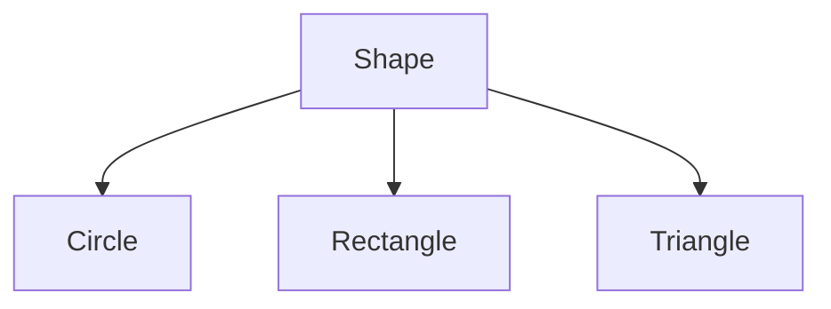
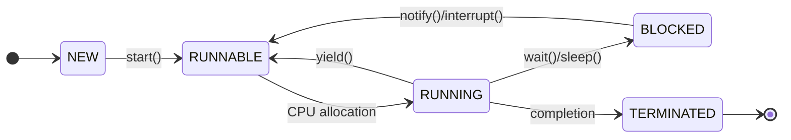
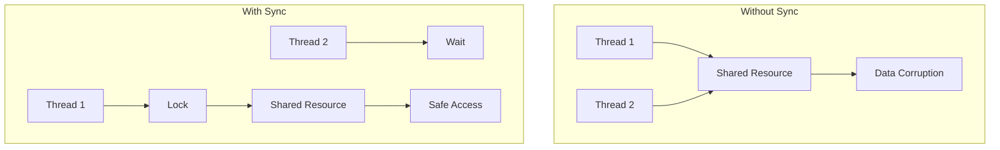
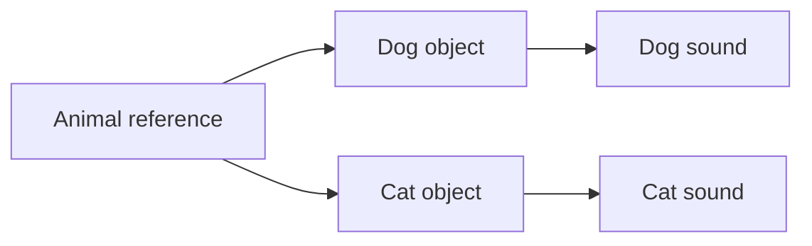

## Question 1(a) [3 marks]

**Differentiate between Procedure-Oriented Programming (POP) and Object-Oriented Programming (OOP).**

**Answer**:

**Table:**

| Aspect | POP | OOP |
|--------|-----|-----|
| **Focus** | Functions/Procedures | Objects and Classes |
| **Data Security** | Less secure, global data | More secure, data encapsulation |
| **Problem Solving** | Top-down approach | Bottom-up approach |
| **Code Reusability** | Limited | High through inheritance |
| **Examples** | C, Pascal | Java, C++, Python |

- **POP**: Program divided into functions, data flows between functions
- **OOP**: Program organized around objects that contain both data and methods

**Mnemonic:** "POP Functions, OOP Objects"

---

## Question 1(b) [4 marks]

**Explain Super keyword in inheritance with suitable example.**

**Answer**:

**Super keyword** is used to access parent class members from child class.

**Table: Super keyword uses**

| Use | Purpose | Example |
|-----|---------|---------|
| **super()** | Call parent constructor | super(name, age) |
| **super.method()** | Call parent method | super.display() |
| **super.variable** | Access parent variable | super.name |

**Code Block:**

```java
class Animal {
    String name = "Animal";
    void eat() { System.out.println("Animal eats"); }
}

class Dog extends Animal {
    String name = "Dog";
    void eat() {
        super.eat(); // calls parent method
        System.out.println("Dog eats bones");
    }
    void display() {
        System.out.println(super.name); // prints "Animal"
    }
}
```

**Mnemonic:** "Super calls Parent"

---

## Question 1(c) [7 marks]

**Define: Method Overriding. List out Rules for method overriding. Write a java program that implements method overriding.**

**Answer**:

**Method Overriding**: Child class provides specific implementation of parent class method with same signature.

**Table: Method Overriding Rules**

| Rule | Description |
|------|-------------|
| **Same name** | Method name must be identical |
| **Same parameters** | Parameter list must match exactly |
| **IS-A relationship** | Must have inheritance |
| **Access modifier** | Cannot reduce visibility |
| **Return type** | Must be same or covariant |

**Code Block:**

```java
class Shape {
    void draw() {
        System.out.println("Drawing a shape");
    }
}

class Circle extends Shape {
    @Override
    void draw() {
        System.out.println("Drawing a circle");
    }
}

class Main {
    public static void main(String[] args) {
        Shape s = new Circle();
        s.draw(); // Output: Drawing a circle
    }
}
```

**Mnemonic:** "Override Same Signature"

---

## Question 1(c OR) [7 marks]

**Describe: Interface. Write a java program using interface to demonstrate multiple inheritance.**

**Answer**:

**Interface**: Blueprint containing abstract methods and constants. Classes implement interfaces to achieve multiple inheritance.

**Table: Interface Features**

| Feature | Description |
|---------|-------------|
| **Abstract methods** | No implementation (before Java 8) |
| **Constants** | All variables are public static final |
| **Multiple inheritance** | Class can implement multiple interfaces |
| **Default methods** | Concrete methods (Java 8+) |

**Code Block:**

```java
interface Flyable {
    void fly();
}

interface Swimmable {
    void swim();
}

class Duck implements Flyable, Swimmable {
    public void fly() {
        System.out.println("Duck flies");
    }
    
    public void swim() {
        System.out.println("Duck swims");
    }
}

class Main {
    public static void main(String[] args) {
        Duck d = new Duck();
        d.fly();
        d.swim();
    }
}
```

**Mnemonic:** "Interface Multiple Implementation"

---

## Question 2(a) [3 marks]

**Explain the Java Program Structure with example.**

**Answer**:

**Java Program Structure** consists of package, imports, class declaration, and main method.

**Diagram:**

```goat
+------------------+
| Package statement|
+------------------+
| Import statements|
+------------------+
| Class declaration|
| +-------------+  |
| | Variables   |  |
| +-------------+  |
| | Methods     |  |
| +-------------+  |
+------------------+
```

**Code Block:**

```java
package com.example;        // Package
import java.util.*;         // Import

public class HelloWorld {   // Class
    static int count = 0;   // Variable
    
    public static void main(String[] args) { // Main method
        System.out.println("Hello World");
    }
}
```

**Mnemonic:** "Package Import Class Main"

---

## Question 2(b) [4 marks]

**Explain static keyword with suitable example.**

**Answer**:

**Static keyword** belongs to class rather than instance. Memory allocated once.

**Table: Static Uses**

| Type | Description | Example |
|------|-------------|---------|
| **Static variable** | Shared by all objects | static int count |
| **Static method** | Called without object | static void display() |
| **Static block** | Executes before main | static { } |

**Code Block:**

```java
class Student {
    static String college = "GTU";  // static variable
    String name;
    
    static void showCollege() {     // static method
        System.out.println(college);
    }
    
    static {                        // static block
        System.out.println("Static block executed");
    }
}

class Main {
    public static void main(String[] args) {
        Student.showCollege(); // No object needed
    }
}
```

**Mnemonic:** "Static Shared by Class"

---

## Question 2(c) [7 marks]

**Define: Constructor. List out types of it. Explain Parameterized and copy constructor with suitable example.**

**Answer**:

**Constructor**: Special method to initialize objects, same name as class, no return type.

**Table: Constructor Types**

| Type | Description | Example |
|------|-------------|---------|
| **Default** | No parameters | Student() |
| **Parameterized** | With parameters | Student(String name) |
| **Copy** | Creates copy of object | Student(Student s) |

**Code Block:**

```java
class Student {
    String name;
    int age;
    
    // Parameterized constructor
    Student(String n, int a) {
        name = n;
        age = a;
    }
    
    // Copy constructor
    Student(Student s) {
        name = s.name;
        age = s.age;
    }
    
    void display() {
        System.out.println(name + " " + age);
    }
}

class Main {
    public static void main(String[] args) {
        Student s1 = new Student("John", 20);  // Parameterized
        Student s2 = new Student(s1);          // Copy
        s1.display();
        s2.display();
    }
}
```

**Mnemonic:** "Constructor Initializes Objects"

---

## Question 2(a OR) [3 marks]

**Explain the Primitive Data Types and User Defined Data Types in java.**

**Answer**:

**Primitive Data Types**: Built-in types provided by Java language.
**User Defined Types**: Custom types created by programmer using classes.

**Table: Data Types**

| Category | Types | Size | Example |
|----------|-------|------|---------|
| **Primitive** | byte, short, int, long | 1,2,4,8 bytes | int x = 10; |
| **Primitive** | float, double | 4,8 bytes | double d = 3.14; |
| **Primitive** | char, boolean | 2,1 bytes | char c = 'A'; |
| **User Defined** | Class, Interface, Array | Variable | Student s; |

- **Primitive**: Stored in stack, faster access
- **User Defined**: Stored in heap, complex operations

**Mnemonic:** "Primitive Built-in, User Custom"

---

## Question 2(b OR) [4 marks]

**Explain this keyword with suitable example.**

**Answer**:

**This keyword** refers to current object instance, used to distinguish between instance and local variables.

**Table: This keyword uses**

| Use | Purpose | Example |
|-----|---------|---------|
| **this.variable** | Access instance variable | this.name = name; |
| **this.method()** | Call instance method | this.display(); |
| **this()** | Call constructor | this(name, age); |

**Code Block:**

```java
class Student {
    String name;
    int age;
    
    Student(String name, int age) {
        this.name = name;    // this distinguishes
        this.age = age;      // instance from parameter
    }
    
    void setData(String name) {
        this.name = name;    // this refers to current object
    }
    
    void display() {
        System.out.println(this.name + " " + this.age);
    }
}
```

**Mnemonic:** "This Current Object"

---

## Question 2(c OR) [7 marks]

**Define Inheritance. List out types of it. Explain multilevel and hierarchical inheritance with suitable example.**

**Answer**:

**Inheritance**: Mechanism where child class acquires properties and methods of parent class.

**Table: Inheritance Types**

| Type | Description | Structure |
|------|-------------|-----------|
| **Single** | One parent, one child | A → B |
| **Multilevel** | Chain of inheritance | A → B → C |
| **Hierarchical** | One parent, multiple children | A → B, A → C |
| **Multiple** | Multiple parents (via interfaces) | B,C → A |

**Diagram - Multilevel:**


**Code Block - Multilevel:**

```java
class Animal {
    void eat() { System.out.println("Animal eats"); }
}

class Mammal extends Animal {
    void breathe() { System.out.println("Mammal breathes"); }
}

class Dog extends Mammal {
    void bark() { System.out.println("Dog barks"); }
}
```

**Diagram - Hierarchical:**



**Code Block - Hierarchical:**

```java
class Shape {
    void draw() { System.out.println("Drawing shape"); }
}

class Circle extends Shape {
    void drawCircle() { System.out.println("Drawing circle"); }
}

class Rectangle extends Shape {
    void drawRectangle() { System.out.println("Drawing rectangle"); }
}
```

**Mnemonic:** "Inheritance Shares Properties"

---

## Question 3(a) [3 marks]

**Explain Type Conversion and Casting in java.**

**Answer**:

**Type Conversion**: Converting one data type to another.
**Casting**: Explicit type conversion by programmer.

**Table: Type Conversion**

| Type | Description | Example |
|------|-------------|---------|
| **Implicit (Widening)** | Automatic, smaller to larger | int to double |
| **Explicit (Narrowing)** | Manual, larger to smaller | double to int |

**Code Block:**

```java
// Implicit conversion
int i = 10;
double d = i;        // int to double (automatic)

// Explicit casting
double x = 10.5;
int y = (int) x;     // double to int (manual)

// String conversion
String s = String.valueOf(i);    // int to String
int z = Integer.parseInt("123"); // String to int
```

**Mnemonic:** "Implicit Auto, Explicit Manual"

---

## Question 3(b) [4 marks]

**Explain different visibility controls used in Java.**

**Answer**:

**Visibility Controls (Access Modifiers)**: Control access to classes, methods, and variables.

**Table: Access Modifiers**

| Modifier | Same Class | Same Package | Subclass | Different Package |
|----------|------------|--------------|----------|-------------------|
| **private** | ✓ | ✗ | ✗ | ✗ |
| **default** | ✓ | ✓ | ✗ | ✗ |
| **protected** | ✓ | ✓ | ✓ | ✗ |
| **public** | ✓ | ✓ | ✓ | ✓ |

**Code Block:**

```java
class Example {
    private int x = 10;      // Only within class
    int y = 20;              // Package level
    protected int z = 30;    // Package + subclass
    public int w = 40;       // Everywhere
    
    private void method1() { }    // Private method
    public void method2() { }     // Public method
}
```

**Mnemonic:** "Private Package Protected Public"

---

## Question 3(c) [7 marks]

**Define: Thread. List different methods used to create Thread. Explain Thread life cycle in detail.**

**Answer**:

**Thread**: Lightweight subprocess that allows concurrent execution of multiple parts of program.

**Table: Thread Creation Methods**

| Method | Description | Example |
|--------|-------------|---------|
| **Extending Thread** | Inherit Thread class | class MyThread extends Thread |
| **Implementing Runnable** | Implement Runnable interface | class MyTask implements Runnable |

**Diagram: Thread Life Cycle**



**Table: Thread States**

| State | Description |
|-------|-------------|
| **NEW** | Thread created but not started |
| **RUNNABLE** | Ready to run, waiting for CPU |
| **RUNNING** | Currently executing |
| **BLOCKED** | Waiting for resource or sleep |
| **TERMINATED** | Execution completed |

**Code Block:**

```java
// Method 1: Extending Thread
class MyThread extends Thread {
    public void run() {
        System.out.println("Thread running");
    }
}

// Method 2: Implementing Runnable
class MyTask implements Runnable {
    public void run() {
        System.out.println("Task running");
    }
}

class Main {
    public static void main(String[] args) {
        MyThread t1 = new MyThread();
        Thread t2 = new Thread(new MyTask());
        t1.start();
        t2.start();
    }
}
```

**Mnemonic:** "Thread Concurrent Execution"

---

## Question 3(a OR) [3 marks]

**Explain the purpose of JVM in java.**

**Answer**:

**JVM (Java Virtual Machine)**: Runtime environment that executes Java bytecode and provides platform independence.

**Table: JVM Components**

| Component | Purpose |
|-----------|---------|
| **Class Loader** | Loads .class files into memory |
| **Execution Engine** | Executes bytecode |
| **Memory Area** | Manages heap and stack memory |
| **Garbage Collector** | Automatic memory management |

**Diagram:**

```goat
+----------------+
| Java Source    |
| (.java)        |
+----------------+
        |
        v
+----------------+
| Java Compiler  |
| (javac)        |
+----------------+
        |
        v
+----------------+
| Bytecode       |
| (.class)       |
+----------------+
        |
        v
+----------------+
| JVM            |
| (Platform      |
|  Specific)     |
+----------------+
```

- **Platform Independence**: "Write Once, Run Anywhere"
- **Memory Management**: Automatic garbage collection
- **Security**: Bytecode verification

**Mnemonic:** "JVM Java Virtual Machine"

---

## Question 3(b OR) [4 marks]

**Define: Package. Write the steps to create a Package with suitable example.**

**Answer**:

**Package**: Collection of related classes and interfaces grouped together, providing namespace and access control.

**Table: Package Benefits**

| Benefit | Description |
|---------|-------------|
| **Namespace** | Avoid name conflicts |
| **Access Control** | Better encapsulation |
| **Organization** | Logical grouping |
| **Reusability** | Easy to maintain |

**Steps to create Package:**

1. **Declare package** at top of file
2. **Create directory** structure matching package name
3. **Compile** with package structure
4. **Import** in other classes

**Code Block:**

```java
// File: com/company/utilities/Calculator.java
package com.company.utilities;

public class Calculator {
    public int add(int a, int b) {
        return a + b;
    }
}

// File: Main.java
import com.company.utilities.Calculator;

class Main {
    public static void main(String[] args) {
        Calculator calc = new Calculator();
        System.out.println(calc.add(5, 3));
    }
}
```

**Directory Structure:**

```
com/
  company/
    utilities/
      Calculator.class
Main.class
```

**Mnemonic:** "Package Groups Classes"

---

## Question 3(c OR) [7 marks]

**Explain Synchronization in Thread with suitable example.**

**Answer**:

**Synchronization**: Mechanism to control access to shared resources by multiple threads to avoid data inconsistency.

**Table: Synchronization Types**

| Type | Description | Usage |
|------|-------------|--------|
| **Synchronized method** | Entire method locked | synchronized void method() |
| **Synchronized block** | Specific code block locked | synchronized(object) { } |
| **Static synchronization** | Class level locking | synchronized static void method() |

**Diagram: Without vs With Synchronization**



**Code Block:**

```java
class Counter {
    private int count = 0;
    
    // Synchronized method
    public synchronized void increment() {
        count++;
    }
    
    // Synchronized block
    public void decrement() {
        synchronized(this) {
            count--;
        }
    }
    
    public int getCount() {
        return count;
    }
}

class CounterThread extends Thread {
    Counter counter;
    
    CounterThread(Counter c) {
        counter = c;
    }
    
    public void run() {
        for(int i = 0; i < 1000; i++) {
            counter.increment();
        }
    }
}

class Main {
    public static void main(String[] args) throws InterruptedException {
        Counter c = new Counter();
        CounterThread t1 = new CounterThread(c);
        CounterThread t2 = new CounterThread(c);
        
        t1.start();
        t2.start();
        
        t1.join();
        t2.join();
        
        System.out.println("Final count: " + c.getCount());
    }
}
```

**Mnemonic:** "Synchronization Prevents Race Conditions"

---

## Question 4(a) [3 marks]

**Differentiate between String class and StringBuffer class.**

**Answer**:

**Table: String vs StringBuffer**

| Aspect | String | StringBuffer |
|--------|--------|--------------|
| **Mutability** | Immutable (cannot change) | Mutable (can change) |
| **Performance** | Slower for concatenation | Faster for concatenation |
| **Memory** | Creates new object each time | Modifies existing object |
| **Thread Safety** | Thread safe | Thread safe |
| **Methods** | concat(), substring() | append(), insert(), delete() |

**Code Block:**

```java
// String - Immutable
String s1 = "Hello";
s1 = s1 + " World";  // Creates new String object

// StringBuffer - Mutable
StringBuffer sb = new StringBuffer("Hello");
sb.append(" World");  // Modifies existing object
```

- **String**: Use when content doesn't change frequently
- **StringBuffer**: Use when frequent modifications needed

**Mnemonic:** "String Immutable, StringBuffer Mutable"

---

## Question 4(b) [4 marks]

**Write a Java Program to find sum and average of 10 numbers of an array.**

**Answer**:

**Code Block:**

```java
class ArraySum {
    public static void main(String[] args) {
        // Initialize array with 10 numbers
        int[] numbers = {10, 20, 30, 40, 50, 60, 70, 80, 90, 100};
        
        int sum = 0;
        
        // Calculate sum
        for(int i = 0; i < numbers.length; i++) {
            sum += numbers[i];
        }
        
        // Calculate average
        double average = (double) sum / numbers.length;
        
        // Display results
        System.out.println("Array elements: ");
        for(int num : numbers) {
            System.out.print(num + " ");
        }
        
        System.out.println("\nSum: " + sum);
        System.out.println("Average: " + average);
    }
}
```

**Output:**

```
Array elements: 10 20 30 40 50 60 70 80 90 100
Sum: 550
Average: 55.0
```

**Logic Steps:**

1. **Initialize** array with 10 numbers
2. **Loop** through array to calculate sum
3. **Calculate** average = sum / length
4. **Display** results

**Mnemonic:** "Loop Sum Divide Average"

---

## Question 4(c) [7 marks]

**I) Explain abstract class with suitable example. II) Explain final class with suitable example.**

**Answer**:

**I) Abstract Class**: Class that cannot be instantiated, contains abstract methods that must be implemented by subclasses.

**Table: Abstract Class Features**

| Feature | Description |
|---------|-------------|
| **Cannot instantiate** | No object creation |
| **Abstract methods** | Methods without implementation |
| **Concrete methods** | Methods with implementation |
| **Inheritance** | Subclasses must implement abstract methods |

**Code Block - Abstract Class:**

```java
abstract class Shape {
    String color;
    
    // Abstract method
    abstract void draw();
    
    // Concrete method
    void setColor(String c) {
        color = c;
    }
}

class Circle extends Shape {
    void draw() {
        System.out.println("Drawing Circle");
    }
}

class Main {
    public static void main(String[] args) {
        // Shape s = new Shape(); // Error: Cannot instantiate
        Circle c = new Circle();
        c.draw();
    }
}
```

**II) Final Class**: Class that cannot be extended (no inheritance allowed).

**Table: Final Class Features**

| Feature | Description |
|---------|-------------|
| **No inheritance** | Cannot be extended |
| **Security** | Prevents modification |
| **Performance** | Better optimization |
| **Examples** | String, Integer, System |

**Code Block - Final Class:**

```java
final class FinalClass {
    void display() {
        System.out.println("This is final class");
    }
}

// class SubClass extends FinalClass { } // Error: Cannot extend

class Main {
    public static void main(String[] args) {
        FinalClass obj = new FinalClass();
        obj.display();
    }
}
```

**Mnemonic:** "Abstract Incomplete, Final Complete"

---

## Question 4(a OR) [3 marks]

**Explain Garbage Collection in Java.**

**Answer**:

**Garbage Collection**: Automatic memory management process that removes unused objects from heap memory.

**Table: GC Benefits**

| Benefit | Description |
|---------|-------------|
| **Automatic** | No manual memory management |
| **Memory leak prevention** | Removes unreferenced objects |
| **Performance** | Optimizes memory usage |
| **Safety** | Prevents memory errors |

**Diagram:**

```goat
+------------------+
| Object created   |
| (new keyword)    |
+------------------+
        |
        v
+------------------+
| Object in use    |
| (has references) |
+------------------+
        |
        v
+------------------+
| No references    |
| (eligible for GC)|
+------------------+
        |
        v
+------------------+
| Garbage Collector|
| removes object   |
+------------------+
```

- **When occurs**: When heap memory is low or System.gc() called
- **Process**: Mark and Sweep algorithm
- **Cannot guarantee**: Exact timing of garbage collection

**Mnemonic:** "GC Automatic Memory Cleanup"

---

## Question 4(b OR) [4 marks]

**Write a Java program to handle user defined exception for 'Divide by Zero' error.**

**Answer**:

**Code Block:**

```java
// User defined exception class
class DivideByZeroException extends Exception {
    public DivideByZeroException(String message) {
        super(message);
    }
}

class Calculator {
    public static double divide(int a, int b) throws DivideByZeroException {
        if(b == 0) {
            throw new DivideByZeroException("Cannot divide by zero!");
        }
        return (double) a / b;
    }
}

class Main {
    public static void main(String[] args) {
        try {
            int num1 = 10;
            int num2 = 0;
            
            double result = Calculator.divide(num1, num2);
            System.out.println("Result: " + result);
            
        } catch(DivideByZeroException e) {
            System.out.println("Error: " + e.getMessage());
        }
    }
}
```

**Output:**

```
Error: Cannot divide by zero!
```

**Steps:**

1. **Create** custom exception class extending Exception
2. **Throw** exception when condition occurs
3. **Handle** exception with try-catch block

**Mnemonic:** "Custom Exception Handle Error"

---

## Question 4(c OR) [7 marks]

**Write a java program to demonstrate multiple try block and multiple catch block exception.**

**Answer**:

**Code Block:**

```java
class MultipleExceptionDemo {
    public static void main(String[] args) {
        // First try block
        try {
            int[] arr = {1, 2, 3};
            System.out.println("Array element: " + arr[5]); // ArrayIndexOutOfBounds
        } 
        catch(ArrayIndexOutOfBoundsException e) {
            System.out.println("Array index error: " + e.getMessage());
        }
        catch(Exception e) {
            System.out.println("General exception: " + e.getMessage());
        }
        
        // Second try block
        try {
            String str = null;
            System.out.println("String length: " + str.length()); // NullPointer
        }
        catch(NullPointerException e) {
            System.out.println("Null pointer error: " + e.getMessage());
        }
        
        // Third try block with multiple catch
        try {
            int a = 10;
            int b = 0;
            int result = a / b;  // ArithmeticException
            
            String s = "abc";
            int num = Integer.parseInt(s);  // NumberFormatException
        }
        catch(ArithmeticException e) {
            System.out.println("Arithmetic error: " + e.getMessage());
        }
        catch(NumberFormatException e) {
            System.out.println("Number format error: " + e.getMessage());
        }
        catch(Exception e) {
            System.out.println("Other error: " + e.getMessage());
        }
        finally {
            System.out.println("Program completed");
        }
    }
}
```

**Output:**

```
Array index error: Index 5 out of bounds for length 3
Null pointer error: null
Arithmetic error: / by zero
Program completed
```

**Features demonstrated:**

- **Multiple try blocks**: Each handles different operations
- **Multiple catch blocks**: Each handles specific exception type
- **Exception hierarchy**: General Exception catches all
- **Finally block**: Always executes

**Mnemonic:** "Multiple Try Multiple Catch"

---

## Question 5(a) [3 marks]

**Write a program in Java to create a file and perform write operation on this file.**

**Answer**:

**Code Block:**

```java
import java.io.*;

class FileWriteDemo {
    public static void main(String[] args) {
        try {
            // Create file
            File file = new File("demo.txt");
            
            // Create FileWriter object
            FileWriter writer = new FileWriter(file);
            
            // Write data to file
            writer.write("Hello World!\n");
            writer.write("This is Java file writing demo.\n");
            writer.write("File created successfully.");
            
            // Close the writer
            writer.close();
            
            System.out.println("File created and data written successfully!");
            
        } catch(IOException e) {
            System.out.println("Error: " + e.getMessage());
        }
    }
}
```

**Steps:**

1. **Import** java.io package
2. **Create** File object with filename
3. **Create** FileWriter object
4. **Write** data using write() method
5. **Close** writer to save changes

**Mnemonic:** "File Writer Write Close"

---

## Question 5(b) [4 marks]

**Explain throw and finally in Exception Handling with example.**

**Answer**:

**Throw**: Keyword used to explicitly throw an exception.
**Finally**: Block that always executes regardless of exception occurrence.

**Table: Throw vs Finally**

| Keyword | Purpose | Usage |
|---------|---------|--------|
| **throw** | Explicitly throw exception | throw new Exception() |
| **finally** | Always execute cleanup code | finally { } |

**Code Block:**

```java
class ThrowFinallyDemo {
    public static void checkAge(int age) throws Exception {
        if(age < 18) {
            throw new Exception("Age must be 18 or above");
        }
        System.out.println("Valid age: " + age);
    }
    
    public static void main(String[] args) {
        try {
            checkAge(15);  // Will throw exception
        }
        catch(Exception e) {
            System.out.println("Error: " + e.getMessage());
        }
        finally {
            System.out.println("Finally block always executes");
        }
    }
}
```

**Output:**

```
Error: Age must be 18 or above
Finally block always executes
```

- **Throw**: Forces exception to occur
- **Finally**: Cleanup code, closes resources

**Mnemonic:** "Throw Exception, Finally Always"

---

## Question 5(c) [7 marks]

**Describe: Polymorphism. Explain run time polymorphism with suitable example in java.**

**Answer**:

**Polymorphism**: One interface, multiple implementations. Object behaves differently based on its actual type.

**Table: Polymorphism Types**

| Type | Description | When Decided |
|------|-------------|--------------|
| **Compile-time** | Method overloading | At compilation |
| **Run-time** | Method overriding | At execution |

**Run-time Polymorphism**: Method call resolved at runtime based on actual object type.

**Diagram:**



**Code Block:**

```java
class Animal {
    void makeSound() {
        System.out.println("Animal makes sound");
    }
}

class Dog extends Animal {
    @Override
    void makeSound() {
        System.out.println("Dog barks");
    }
}

class Cat extends Animal {
    @Override
    void makeSound() {
        System.out.println("Cat meows");
    }
}

class Main {
    public static void main(String[] args) {
        Animal animal1 = new Dog();  // Upcasting
        Animal animal2 = new Cat();  // Upcasting
        
        animal1.makeSound();  // Output: Dog barks
        animal2.makeSound();  // Output: Cat meows
        
        // Array of animals
        Animal[] animals = {new Dog(), new Cat(), new Dog()};
        for(Animal a : animals) {
            a.makeSound();  // Dynamic method dispatch
        }
    }
}
```

**Output:**

```
Dog barks
Cat meows
Dog barks
Cat meows
Dog barks
```

**Features:**

- **Dynamic Method Dispatch**: JVM decides which method to call at runtime
- **Upcasting**: Child object referenced by parent reference
- **Flexibility**: Same code works with different object types

**Mnemonic:** "Polymorphism Many Forms Runtime"

---

## Question 5(a OR) [3 marks]

**Write a program in Java that read the content of a file byte by byte and copy it into another file.**

**Answer**:

**Code Block:**

```java
import java.io.*;

class FileCopyDemo {
    public static void main(String[] args) {
        try {
            // Create input stream to read from source file
            FileInputStream input = new FileInputStream("source.txt");
            
            // Create output stream to write to destination file
            FileOutputStream output = new FileOutputStream("destination.txt");
            
            int byteData;
            
            // Read byte by byte and copy
            while((byteData = input.read()) != -1) {
                output.write(byteData);
            }
            
            // Close streams
            input.close();
            output.close();
            
            System.out.println("File copied successfully!");
            
        } catch(IOException e) {
            System.out.println("Error: " + e.getMessage());
        }
    }
}
```

**Steps:**

1. **Create** FileInputStream for reading
2. **Create** FileOutputStream for writing
3. **Read** byte by byte using read()
4. **Write** each byte using write()
5. **Close** both streams

**Mnemonic:** "Read Byte Write Byte"

---

## Question 5(b OR) [4 marks]

**Explain the different I/O Classes available with Java.**

**Answer**:

**Table: Java I/O Classes**

| Class Type | Class Name | Purpose |
|------------|------------|---------|
| **Byte Stream** | FileInputStream | Read bytes from file |
| **Byte Stream** | FileOutputStream | Write bytes to file |
| **Character Stream** | FileReader | Read characters from file |
| **Character Stream** | FileWriter | Write characters to file |
| **Buffered** | BufferedReader | Efficient character reading |
| **Buffered** | BufferedWriter | Efficient character writing |

**Diagram: I/O Class Hierarchy**

```goat
+------------------+
|    InputStream   |
+------------------+
        |
        +-- FileInputStream
        +-- BufferedInputStream
        
+------------------+
|   OutputStream   |
+------------------+
        |
        +-- FileOutputStream
        +-- BufferedOutputStream
        
+------------------+
|      Reader      |
+------------------+
        |
        +-- FileReader
        +-- BufferedReader
        
+------------------+
|      Writer      |
+------------------+
        |
        +-- FileWriter
        +-- BufferedWriter
```

**Code Example:**

```java
// Byte streams
FileInputStream fis = new FileInputStream("file.txt");
FileOutputStream fos = new FileOutputStream("output.txt");

// Character streams
FileReader fr = new FileReader("file.txt");
FileWriter fw = new FileWriter("output.txt");

// Buffered streams
BufferedReader br = new BufferedReader(new FileReader("file.txt"));
BufferedWriter bw = new BufferedWriter(new FileWriter("output.txt"));
```

**Mnemonic:** "Byte Character Buffered Streams"

---

## Question 5(c OR) [7 marks]

**Write a java program that executes two threads. One thread displays "Java Programming" every 3 seconds, and the other displays "Semester - 4th IT" every 6 seconds.(Create the threads by extending the Thread class)**

**Answer**:

**Code Block:**

```java
class JavaThread extends Thread {
    public void run() {
        try {
            while(true) {
                System.out.println("Java Programming");
                Thread.sleep(3000);  // Sleep for 3 seconds
            }
        } catch(InterruptedException e) {
            System.out.println("JavaThread interrupted");
        }
    }
}

class SemesterThread extends Thread {
    public void run() {
        try {
            while(true) {
                System.out.println("Semester - 4th IT");
                Thread.sleep(6000);  // Sleep for 6 seconds
            }
        } catch(InterruptedException e) {
            System.out.println("SemesterThread interrupted");
        }
    }
}

class Main {
    public static void main(String[] args) {
        // Create thread objects
        JavaThread javaThread = new JavaThread();
        SemesterThread semesterThread = new SemesterThread();
        
        // Start both threads
        javaThread.start();
        semesterThread.start();
        
        // Let threads run for 20 seconds then stop
        try {
            Thread.sleep(20000);
            javaThread.interrupt();
            semesterThread.interrupt();
        } catch(InterruptedException e) {
            System.out.println("Main thread interrupted");
        }
    }
}
```

**Sample Output:**

```
Java Programming
Semester - 4th IT
Java Programming
Java Programming
Semester - 4th IT
Java Programming
Java Programming
Semester - 4th IT
...
```

**Features:**

- **Two separate threads**: Each with different timing
- **Thread.sleep()**: Pauses execution for specified milliseconds
- **Concurrent execution**: Both threads run simultaneously
- **Extending Thread class**: Override run() method

**Execution Pattern:**

- JavaThread: Displays every 3 seconds
- SemesterThread: Displays every 6 seconds
- Both run concurrently showing different timing

**Mnemonic:** "Two Threads Different Timing"
