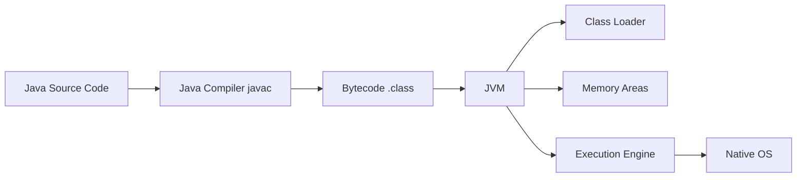
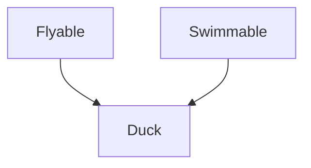
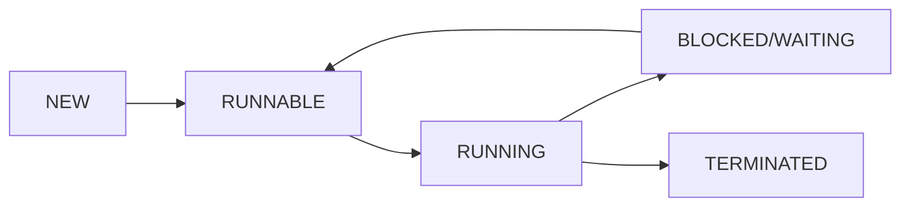
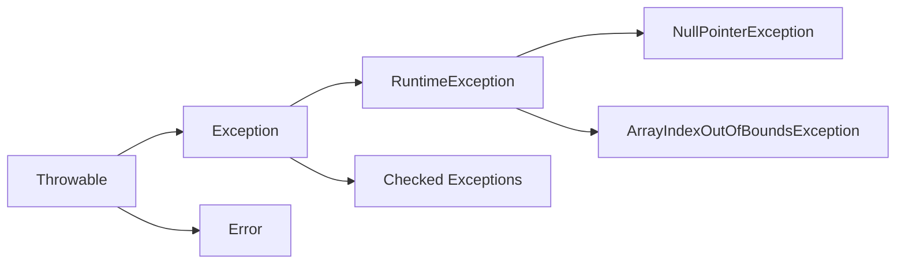
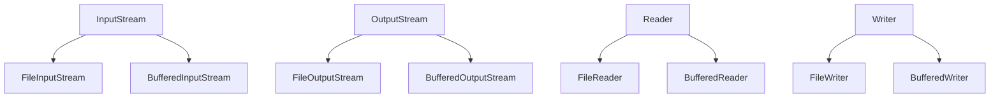

## પ્રશ્ન 1(અ) [3 ગુણ]

**Java program નો બેસિક સ્ટ્રક્ચર સમજાવો.**

**જવાબ**:

**મૂળભૂત માળખું કોષ્ટક:**

| ઘટક | વર્ણન |
|------|--------|
| **Package declaration** | વૈકલ્પિક, package સભ્યપદ દર્શાવે છે |
| **Import statements** | જરૂરી classes/packages આયાત કરે છે |
| **Class declaration** | મુખ્ય class વ્યાખ્યા |
| **Main method** | પ્રવેશ બિંદુ: public static void main(String[] args) |

**આકૃતિ:**

```goat
+-------------------------+
|    Package Declaration  |
+-------------------------+
|    Import Statements    |
+-------------------------+
|    Class Declaration    |
|  +-------------------+  |
|  |   Variables       |  |
|  +-------------------+  |
|  |   Methods         |  |
|  |  +-------------+  |  |
|  |  | main method |  |  |
|  |  +-------------+  |  |
|  +-------------------+  |
+-------------------------+
```

- **Package**: સંબંધિત classes ને જૂથબદ્ધ કરે છે
- **Import**: બાહ્ય classes ને access કરે છે
- **Class**: objects માટે blueprint
- **Main method**: પ્રોગ્રામ execution અહીંથી શરૂ થાય છે

**મેમરી ટ્રીક:** "PICM - Package, Import, Class, Main"

## પ્રશ્ન 1(બ) [4 ગુણ]

**જાવાના વિવિધ લક્ષણોની યાદી આપો. કોઈપણ બે લક્ષણો સમજાવો.**

**જવાબ**:

**Java ના લક્ષણો કોષ્ટક:**

| લક્ષણ | વર્ણન |
|-------|-------|
| **Platform Independent** | એક વાર લખો, બધે ચલાવો |
| **Object Oriented** | બધું object છે |
| **Simple** | સરળ syntax, pointers નથી |
| **Secure** | built-in સુરક્ષા લક્ષણો |
| **Robust** | મજબૂત memory management |
| **Multithreaded** | concurrent execution આધાર |

**વિગતવાર સમજાવટ:**

**Platform Independence:**

- Java કોડ bytecode માં compile થાય છે
- JVM કોઈપણ platform પર bytecode interpret કરે છે
- એ જ પ્રોગ્રામ Windows, Linux, Mac પર ચાલે છે

**Object Oriented:**

- Encapsulation: classes માં data hiding
- Inheritance: extends દ્વારા કોડ પુનઃઉપયોગ
- Polymorphism: એક જ method, અલગ વર્તન

**મેમરી ટ્રીક:** "POSRMM - Platform, Object, Simple, Robust, Multithreaded, Memory"

## પ્રશ્ન 1(ક) [7 ગુણ]

**દાખલ કરેલ નંબરના અંકોનો સરવાળો શોધવા માટે Java માં પ્રોગ્રામ લખો. (ઉદા. સંખ્યા 123 આઉટપુટ 6 છે).**

**જવાબ**:

```java
public class DigitSum {
    public static void main(String[] args) {
        int number = Integer.parseInt(args[0]);
        int sum = 0;
        int temp = Math.abs(number);
        
        while (temp > 0) {
            sum += temp % 10;
            temp /= 10;
        }
        
        System.out.println("અંકોનો સરવાળો: " + sum);
    }
}
```

**Algorithm કોષ્ટક:**

| પગલું | ક્રિયા | ઉદાહરણ (123) |
|-------|-------|-------------|
| 1 | છેલ્લો અંક કાઢો (n%10) | 123%10 = 3 |
| 2 | સરવાળામાં ઉમેરો | sum = 0+3 = 3 |
| 3 | છેલ્લો અંક હટાવો (n/10) | 123/10 = 12 |
| 4 | n=0 સુધી પુનરાવર્તન | ચાલુ રાખો |

- **Input**: Command line argument
- **Process**: modulo વાપરીને અંકો કાઢો
- **Output**: બધા અંકોનો સરવાળો

**મેમરી ટ્રીક:** "EARD - Extract, Add, Remove, Done"

## પ્રશ્ન 1(ક OR) [7 ગુણ]

**Command line arguments નો ઉપયોગ કરીને કોઈપણ દસ સંખ્યાઓ માંથી maximum શોધવા માટે Java માં પ્રોગ્રામ લખો.**

**જવાબ**:

```java
public class FindMaximum {
    public static void main(String[] args) {
        if (args.length < 10) {
            System.out.println("કૃપા કરીને 10 સંખ્યાઓ દાખલ કરો");
            return;
        }
        
        int max = Integer.parseInt(args[0]);
        
        for (int i = 1; i < 10; i++) {
            int current = Integer.parseInt(args[i]);
            if (current > max) {
                max = current;
            }
        }
        
        System.out.println("મહત્તમ સંખ્યા: " + max);
    }
}
```

**પ્રક્રિયા કોષ્ટક:**

| પગલું | ક્રિયા | વિગતો |
|-------|-------|-------|
| 1 | **args તપાસો** | 10 સંખ્યાઓ આપેલી છે કે કેમ |
| 2 | **Max initialize કરો** | પહેલી સંખ્યાને initial max બનાવો |
| 3 | **Compare loop** | બાકીની દરેક સંખ્યા તપાસો |
| 4 | **Max update કરો** | જો current > max, તો update કરો |

- **Validation**: argument count ચકાસો
- **Comparison**: સામાન્ય maximum શોધવાની પદ્ધતિ
- **Output**: સૌથી મોટી સંખ્યા દર્શાવો

**મેમરી ટ્રીક:** "VCIU - Validate, Compare, Initialize, Update"

## પ્રશ્ન 2(અ) [3 ગુણ]

**OOP ના Basic concept ની યાદી આપો. કોઈપણ એક વિગતવાર સમજાવો.**

**જવાબ**:

**OOP ની વિભાવનાઓ કોષ્ટક:**

| વિભાવના | વર્ણન |
|---------|-------|
| **Encapsulation** | ડેટા છુપાવવું અને બાંધવું |
| **Inheritance** | પિતૃ class થી કોડ પુનઃઉપયોગ |
| **Polymorphism** | એક interface, અનેક સ્વરૂપ |
| **Abstraction** | Implementation વિગતો છુપાવવી |

**Encapsulation વિગતો:**

- ડેટા અને methods ને એક unit માં જોડે છે
- ડેટા માટે private access modifiers વાપરે છે
- Public getter/setter methods પ્રદાન કરે છે
- અનધિકૃત access થી ડેટાને સુરક્ષિત કરે છે

**ફાયદાઓ:**

- **સુરક્ષા**: ડેટા સુરક્ષા
- **જાળવણી**: કોડ updates સરળ
- **લવચીકતા**: Implementation સરળતાથી બદલી શકાય

**મેમરી ટ્રીક:** "EIPA - Encapsulation, Inheritance, Polymorphism, Abstraction"

## પ્રશ્ન 2(બ) [4 ગુણ]

**JVM ને વિગતવાર સમજાવો.**

**જવાબ**:

**JVM આર્કિટેક્ચર આકૃતિ:**



**JVM ઘટકો કોષ્ટક:**

| ઘટક | કાર્ય |
|------|------|
| **Class Loader** | .class files ને memory માં લોડ કરે છે |
| **Memory Areas** | Heap, Stack, Method area |
| **Execution Engine** | Bytecode execute કરે છે |
| **JIT Compiler** | વારંવાર વપરાતા કોડને optimize કરે છે |

- **Platform Independence**: એ જ bytecode બધે ચાલે છે
- **Memory Management**: automatic garbage collection
- **સુરક્ષા**: execution પહેલાં bytecode verification

**મેમરી ટ્રીક:** "CEMJ - Class loader, Execution, Memory, JIT"

## પ્રશ્ન 2(ક) [7 ગુણ]

**Constructor overloading ઉદાહરણ સાથે સમજાવો.**

**જવાબ**:

```java
public class Student {
    private String name;
    private int age;
    private String course;
    
    // Default constructor
    public Student() {
        this.name = "અજ્ઞાત";
        this.age = 0;
        this.course = "ફાળવેલ નથી";
    }
    
    // Constructor with name
    public Student(String name) {
        this.name = name;
        this.age = 0;
        this.course = "ફાળવેલ નથી";
    }
    
    // Constructor with name and age
    public Student(String name, int age) {
        this.name = name;
        this.age = age;
        this.course = "ફાળવેલ નથી";
    }
    
    // Constructor with all parameters
    public Student(String name, int age, String course) {
        this.name = name;
        this.age = age;
        this.course = course;
    }
}
```

**Constructor પ્રકારો કોષ્ટક:**

| Constructor | Parameters | ઉપયોગ |
|-------------|------------|--------|
| **Default** | કોઈ નહિ | મૂળભૂત object બનાવટ |
| **Single param** | માત્ર નામ | આંશિક initialization |
| **Two param** | નામ, ઉંમર | વધુ નિર્દિષ્ટ ડેટા |
| **Full param** | બધા fields | સંપૂર્ણ initialization |

- **એ જ નામ**: બધા constructors ને class નામ છે
- **અલગ parameters**: સંખ્યા અથવા પ્રકાર અલગ છે
- **Compile-time**: compilation દરમિયાન નિર્ણય

**મેમરી ટ્રીક:** "SNDF - Same Name, Different Parameters, Flexible"

## પ્રશ્ન 2(અ OR) [3 ગુણ]

**Wrapper class શું છે? ઉદાહરણ સાથે સમજાવો.**

**જવાબ**:

**Wrapper Classes કોષ્ટક:**

| Primitive | Wrapper Class |
|-----------|---------------|
| **byte** | Byte |
| **int** | Integer |
| **float** | Float |
| **double** | Double |
| **char** | Character |
| **boolean** | Boolean |

**ઉદાહરણ:**

```java
// Boxing - primitive to object
int num = 10;
Integer obj = Integer.valueOf(num);

// Unboxing - object to primitive
Integer wrapper = new Integer(20);
int value = wrapper.intValue();

// Auto-boxing (Java 5+)
Integer auto = 30;
int autoValue = auto;
```

- **Boxing**: primitive ને wrapper object માં convert કરવું
- **Unboxing**: wrapper માંથી primitive કાઢવું
- **Collections**: collections માં માત્ર objects જ સ્વીકાર્ય છે

**મેમરી ટ્રીક:** "BUC - Boxing, Unboxing, Collections"

## પ્રશ્ન 2(બ OR) [4 ગુણ]

**Static કીવર્ડ ઉદાહરણ સાથે સમજાવો.**

**જવાબ**:

```java
public class Counter {
    private static int count = 0;  // Static variable
    private int id;                // Instance variable
    
    public Counter() {
        count++;                   // Static count વધારો
        this.id = count;
    }
    
    public static void showCount() {  // Static method
        System.out.println("કુલ objects: " + count);
    }
    
    public void showId() {         // Instance method
        System.out.println("Object ID: " + id);
    }
}
```

**Static લક્ષણો કોષ્ટક:**

| લક્ષણ | લાક્ષણિકતાઓ |
|-------|-------------|
| **Static Variable** | બધા instances વચ્ચે શેર થાય છે |
| **Static Method** | Object બનાવ્યા વિના કૉલ કરી શકાય |
| **Static Block** | Class લોડ થાય ત્યારે એક વાર execute થાય |
| **Memory** | Method area માં સંગ્રહિત |

- **Class level**: instance નહિ, class નું છે
- **Memory efficiency**: બધા objects માટે એક જ copy
- **Access**: class નામ વાપરીને access કરો

**મેમરી ટ્રીક:** "SCMA - Shared, Class-level, Memory, Access"

## પ્રશ્ન 2(ક OR) [7 ગુણ]

**Constructor શું છે? Copy constructor ને ઉદાહરણ સાથે સમજાવો.**

**જવાબ**:

**Constructor વ્યાખ્યા:**
Constructor એ એક વિશેષ method છે જે objects બનાવાયા ત્યારે તેમને initialize કરે છે.

```java
public class Book {
    private String title;
    private String author;
    private int pages;
    
    // Default constructor
    public Book() {
        this.title = "અજ્ઞાત";
        this.author = "અજ્ઞાત";
        this.pages = 0;
    }
    
    // Parameterized constructor
    public Book(String title, String author, int pages) {
        this.title = title;
        this.author = author;
        this.pages = pages;
    }
    
    // Copy constructor
    public Book(Book other) {
        this.title = other.title;
        this.author = other.author;
        this.pages = other.pages;
    }
    
    public void display() {
        System.out.println(title + " લેખક " + author + 
                          " (" + pages + " પાનાં)");
    }
}

// ઉપયોગ
Book original = new Book("Java ગાઇડ", "જેમ્સ", 500);
Book copy = new Book(original);  // Copy constructor
```

**Constructor પ્રકારો કોષ્ટક:**

| પ્રકાર | હેતુ | Parameters |
|-------|------|------------|
| **Default** | મૂળભૂત initialization | કોઈ નહિ |
| **Parameterized** | કસ્ટમ initialization | User-defined |
| **Copy** | હાલના object ની નકલ | Same class object |

- **એ જ નામ**: Constructor નામ = class નામ
- **કોઈ return type નહિ**: void પણ નહિ
- **Automatic કૉલ**: Object બનાવાય ત્યારે કૉલ થાય

**મેમરી ટ્રીક:** "SNAC - Same Name, Automatic Call"

## પ્રશ્ન 3(અ) [3 ગુણ]

**Java માં કોઈપણ ચાર string functions ને ઉદાહરણ સાથે સમજાવો.**

**જવાબ**:

**String Functions કોષ્ટક:**

| Function | હેતુ | ઉદાહરણ |
|----------|-----|---------|
| **length()** | String ની લંબાઈ આપે છે | "Hello".length() → 5 |
| **charAt(index)** | સ્થાને character | "Java".charAt(1) → 'a' |
| **substring(start)** | ભાગ કાઢે છે | "Program".substring(3) → "gram" |
| **toUpperCase()** | મોટા અક્ષરોમાં | "java".toUpperCase() → "JAVA" |

**કોડ ઉદાહરણ:**

```java
String str = "Java Programming";

int len = str.length();           // 16
char ch = str.charAt(0);          // 'J'
String sub = str.substring(5);    // "Programming"
String upper = str.toUpperCase(); // "JAVA PROGRAMMING"
```

- **Immutable**: String objects બદલાતા નથી
- **નવું return**: Methods નવા string objects return કરે છે
- **Zero-indexed**: સ્થાનની ગણતરી 0 થી શરૂ થાય છે

**મેમરી ટ્રીક:** "LCST - Length, Character, Substring, Transform"

## પ્રશ્ન 3(બ) [4 ગુણ]

**Inheritance ના વિવિધ પ્રકારોની યાદી આપો. Multilevel inheritance સમજાવો.**

**જવાબ**:

**Inheritance પ્રકારો કોષ્ટક:**

| પ્રકાર | વર્ણન |
|-------|-------|
| **Single** | એક parent, એક child |
| **Multilevel** | Inheritance ની શૃંખલા |
| **Hierarchical** | એક parent, અનેક children |
| **Multiple** | અનેક parents (interfaces દ્વારા) |

**Multilevel Inheritance આકૃતિ:**


**ઉદાહરણ:**

```java
class Vehicle {
    protected String brand;
    public void start() {
        System.out.println("વાહન ચાલુ થયું");
    }
}

class Car extends Vehicle {
    protected int doors;
    public void drive() {
        System.out.println("કાર ચાલી રહી છે");
    }
}

class SportsCar extends Car {
    private int maxSpeed;
    public void race() {
        System.out.println("સ્પોર્ટ્સ કાર રેસિંગ");
    }
}
```

- **Chain inheritance**: પિતામહ → પિતા → બાળક
- **લક્ષણો સંચય**: બાળકને બધા પૂર્વજોના લક્ષણો મળે છે
- **Method access**: બધા levels ના methods કૉલ કરી શકાય

**મેમરી ટ્રીક:** "SMHM - Single, Multilevel, Hierarchical, Multiple"

## પ્રશ્ન 3(ક) [7 ગુણ]

**Interface શું છે? ઉદાહરણ સાથે multiple inheritance સમજાવો.**

**જવાબ**:

**Interface વ્યાખ્યા:**
Interface એ એક કરાર છે જે define કરે છે કે class માં કયા methods હોવા જોઈએ, implementation આપ્યા વિના.

```java
interface Flyable {
    void fly();
    void land();
}

interface Swimmable {
    void swim();
    void dive();
}

// Interfaces દ્વારા multiple inheritance
class Duck implements Flyable, Swimmable {
    public void fly() {
        System.out.println("બતક ઉડી રહી છે");
    }
    
    public void land() {
        System.out.println("બતક જમીન પર ઉતરી");
    }
    
    public void swim() {
        System.out.println("બતક તરી રહી છે");
    }
    
    public void dive() {
        System.out.println("બતક પાણીમાં ડૂબી");
    }
}
```

**Interface vs Class કોષ્ટક:**

| લક્ષણ | Interface | Class |
|-------|-----------|-------|
| **Methods** | Abstract (default/static મંજૂર) | Concrete |
| **Variables** | public static final | કોઈપણ પ્રકાર |
| **Inheritance** | Multiple મંજૂર | માત્ર Single |
| **Instantiation** | Objects બનાવી શકાતા નથી | Objects બનાવી શકાય |

**Multiple Inheritance આકૃતિ:**



- **કરાર**: શું કરવું તે define કરે, કેવી રીતે નહિ
- **Multiple implementation**: એક class, ઘણા interfaces
- **Diamond problem ઉકેલ**: Interfaces multiple inheritance ની સમસ્યા હલ કરે છે

**મેમરી ટ્રીક:** "CMDS - Contract, Multiple, Diamond-solution"

## પ્રશ્ન 3(અ OR) [3 ગુણ]

**This કીવર્ડ ઉદાહરણ સાથે સમજાવો.**

**જવાબ**:

**'this' કીવર્ડ ઉપયોગો કોષ્ટક:**

| ઉપયોગ | હેતુ |
|--------|------|
| **Instance variable** | Parameter થી અલગ પાડવા |
| **Method call** | એ જ class ની બીજી method કૉલ કરવા |
| **Constructor call** | બીજા constructor ને કૉલ કરવા |
| **Return object** | વર્તમાન object reference return કરવા |

**ઉદાહરણ:**

```java
public class Person {
    private String name;
    private int age;
    
    public Person(String name, int age) {
        this.name = name;  // Parameter અને field વચ્ચે ફરક
        this.age = age;
    }
    
    public Person setName(String name) {
        this.name = name;
        return this;       // વર્તમાન object return કરો
    }
    
    public void display() {
        this.printDetails(); // એ જ class ની method કૉલ કરો
    }
    
    private void printDetails() {
        System.out.println(this.name + " ની ઉંમર " + this.age);
    }
}
```

- **વર્તમાન object**: વર્તમાન instance ને refer કરે છે
- **Parameter conflict**: નામની અસમંજસ હલ કરે છે
- **Method chaining**: fluent interface સક્ષમ કરે છે

**મેમરી ટ્રીક:** "CRPM - Current, Resolve, Parameter, Method"

## પ્રશ્ન 3(બ OR) [4 ગુણ]

**Method overriding ઉદાહરણ સાથે સમજાવો.**

**જવાબ**:

```java
class Animal {
    public void makeSound() {
        System.out.println("પ્રાણી અવાજ કરે છે");
    }
    
    public void sleep() {
        System.out.println("પ્રાણી સૂઈ જાય છે");
    }
}

class Dog extends Animal {
    @Override
    public void makeSound() {  // Method overriding
        System.out.println("કૂતરો ભસે છે: ભો ભો!");
    }
    
    // sleep() method જેમ છે તેમ inherit થાય છે
}

class Cat extends Animal {
    @Override
    public void makeSound() {  // Method overriding
        System.out.println("બિલાડી બોલે છે: મ્યાઉં!");
    }
}
```

**Overriding નિયમો કોષ્ટક:**

| નિયમ | વર્ણન |
|------|-------|
| **Same signature** | Method નામ, parameters મેળ ખાવા જોઈએ |
| **Inheritance** | Parent-child સંબંધ હોવો જોઈએ |
| **@Override** | Compiler checking માટે annotation |
| **Runtime decision** | Object type પ્રમાણે method કૉલ |

**ઉપયોગ:**

```java
Animal animal1 = new Dog();
Animal animal2 = new Cat();

animal1.makeSound(); // આઉટપુટ: "કૂતરો ભસે છે: ભો ભો!"
animal2.makeSound(); // આઉટપુટ: "બિલાડી બોલે છે: મ્યાઉં!"
```

- **Runtime polymorphism**: Execution દરમિયાન નિર્ણય
- **Same interface**: અલગ classes માટે અલગ વર્તન
- **Dynamic binding**: Runtime પર method resolution

**મેમરી ટ્રીક:** "SSRD - Same Signature, Runtime Decision"

## પ્રશ્ન 3(ક OR) [7 ગુણ]

**Package શું છે? Package બનાવવાના પગલાં લખો અને તેનું ઉદાહરણ આપો.**

**જવાબ**:

**Package વ્યાખ્યા:**
Package એ namespace છે જે સંબંધિત classes અને interfaces ને organize કરે છે, access control પ્રદાન કરે છે અને naming conflicts ટાળે છે.

**Package બનાવવાના પગલાં:**

| પગલું | ક્રિયા | Command/Code |
|-------|-------|-------------|
| 1 | **Directory બનાવો** | mkdir com/company/utils |
| 2 | **Package declaration ઉમેરો** | package com.company.utils; |
| 3 | **Class લખો** | public class MathUtils { } |
| 4 | **Compile કરો** | javac -d . MathUtils.java |
| 5 | **Import અને ઉપયોગ** | import com.company.utils.*; |

**Package Structure ઉદાહરણ:**

```
src/
  com/
    company/
      utils/
        MathUtils.java
        StringUtils.java
      models/
        Student.java
```

**MathUtils.java:**

```java
package com.company.utils;

public class MathUtils {
    public static int add(int a, int b) {
        return a + b;
    }
    
    public static int multiply(int a, int b) {
        return a * b;
    }
}
```

**Package ઉપયોગ:**

```java
import com.company.utils.MathUtils;

public class Calculator {
    public static void main(String[] args) {
        int sum = MathUtils.add(5, 3);
        int product = MathUtils.multiply(4, 6);
        
        System.out.println("સરવાળો: " + sum);
        System.out.println("ગુણાકાર: " + product);
    }
}
```

**Package ફાયદાઓ કોષ્ટક:**

| ફાયદો | વર્ણન |
|-------|-------|
| **સંગઠન** | Classes નું તાર્કિક જૂથીકરણ |
| **Namespace** | નામની અસમંજસ ટાળે છે |
| **Access control** | Package-private access |
| **જાળવણી** | કોડની સરળ management |

**મેમરી ટ્રીક:** "ONAM - Organization, Namespace, Access, Maintenance"

## પ્રશ્ન 4(અ) [3 ગુણ]

**યોગ્ય ઉદાહરણ સાથે thread ની પ્રાથમિકતાઓ સમજાવો.**

**જવાબ**:

**Thread Priority કોષ્ટક:**

| પ્રાથમિકતા સ્તર | Constant | મૂલ્ય |
|---------------|----------|------|
| **ન્યૂનતમ** | MIN_PRIORITY | 1 |
| **સામાન્ય** | NORM_PRIORITY | 5 |
| **મહત્તમ** | MAX_PRIORITY | 10 |

**ઉદાહરણ:**

```java
class PriorityDemo extends Thread {
    public PriorityDemo(String name) {
        super(name);
    }
    
    public void run() {
        for (int i = 1; i <= 5; i++) {
            System.out.println(getName() + " - ગણતરી: " + i);
        }
    }
}

public class ThreadPriorityExample {
    public static void main(String[] args) {
        PriorityDemo t1 = new PriorityDemo("ઉચ્ચ પ્રાથમિકતા");
        PriorityDemo t2 = new PriorityDemo("નીચી પ્રાથમિકતા");
        
        t1.setPriority(Thread.MAX_PRIORITY);  // પ્રાથમિકતા 10
        t2.setPriority(Thread.MIN_PRIORITY);  // પ્રાથમિકતા 1
        
        t1.start();
        t2.start();
    }
}
```

- **ઉચ્ચી પ્રાથમિકતા**: CPU સમય મળવાની વધુ શક્યતા
- **ગેરંટી નથી**: JVM ખરેખર scheduling નક્કી કરે છે
- **Default priority**: દરેક thread NORM_PRIORITY સાથે શરૂ થાય છે

**મેમરી ટ્રીક:** "HNG - Higher priority, Not Guaranteed"

## પ્રશ્ન 4(બ) [4 ગુણ]

**Thread શું છે? Thread જીવન ચક્ર સમજાવો.**

**જવાબ**:

**Thread વ્યાખ્યા:**
Thread એ lightweight sub-process છે જે પ્રોગ્રામની અંદર અનેક કાર્યોના concurrent execution ની પરવાનગી આપે છે.

**Thread Life Cycle આકૃતિ:**



**Thread સ્થિતિઓ કોષ્ટક:**

| સ્થિતિ | વર્ણન |
|-------|-------|
| **NEW** | Thread બન્યો પણ શરૂ થયો નથી |
| **RUNNABLE** | ચાલવા તૈયાર, CPU માટે રાહ જોઈ રહ્યો |
| **RUNNING** | હાલમાં execute થઈ રહ્યો |
| **BLOCKED/WAITING** | Resource/condition માટે રાહ જોઈ રહ્યો |
| **TERMINATED** | Execution પૂર્ણ થયું |

**સ્થિતિ પરિવર્તનો:**

- **NEW → RUNNABLE**: start() method કૉલ થાય
- **RUNNABLE → RUNNING**: Thread scheduler CPU આપે
- **RUNNING → BLOCKED**: I/O અથવા lock માટે રાહ
- **RUNNING → TERMINATED**: run() method પૂર્ણ થાય

- **Concurrent execution**: અનેક threads એકસાથે ચાલે છે
- **JVM managed**: Thread scheduler execution control કરે છે
- **Resource sharing**: Threads memory space શેર કરે છે

**મેમરી ટ્રીક:** "NRBT - New, Runnable, Blocked, Terminated"

## પ્રશ્ન 4(ક) [7 ગુણ]

**Java માં એક પ્રોગ્રામ લખો જે Thread Class અમલ કરીને બહુવિધ threads બનાવે છે.**

**જવાબ**:

```java
class NumberPrinter extends Thread {
    private String threadName;
    private int start;
    private int end;
    
    public NumberPrinter(String name, int start, int end) {
        this.threadName = name;
        this.start = start;
        this.end = end;
    }
    
    @Override
    public void run() {
        System.out.println(threadName + " શરૂ થયો");
        
        for (int i = start; i <= end; i++) {
            System.out.println(threadName + ": " + i);
            
            try {
                Thread.sleep(500); // 500ms માટે થોભો
            } catch (InterruptedException e) {
                System.out.println(threadName + " બંધ કરાયો");
            }
        }
        
        System.out.println(threadName + " પૂર્ણ થયો");
    }
}

public class MultipleThreadsExample {
    public static void main(String[] args) {
        // અનેક threads બનાવો
        NumberPrinter thread1 = new NumberPrinter("Thread-1", 1, 5);
        NumberPrinter thread2 = new NumberPrinter("Thread-2", 10, 15);
        NumberPrinter thread3 = new NumberPrinter("Thread-3", 20, 25);
        
        // બધા threads શરૂ કરો
        thread1.start();
        thread2.start();
        thread3.start();
        
        System.out.println("Main થી બધા threads શરૂ થયા");
    }
}
```

**Implementation પગલાં કોષ્ટક:**

| પગલું | ક્રિયા |
|-------|-------|
| 1 | **Thread class extends કરો** |
| 2 | **run() method override કરો** |
| 3 | **Thread objects બનાવો** |
| 4 | **start() method કૉલ કરો** |

- **Extends Thread**: Threading capabilities inherit કરો
- **Override run()**: Thread ની execution logic define કરો
- **start() method**: Thread execution શરૂ કરો
- **Concurrent execution**: બધા threads એકસાથે ચાલે છે

**મેમરી ટ્રીક:** "EOCS - Extend, Override, Create, Start"

## પ્રશ્ન 4(અ OR) [3 ગુણ]

**Exception Handling ની મૂળભૂત વિભાવના સમજાવો.**

**જવાબ**:

**Exception Handling વિભાવનાઓ કોષ્ટક:**

| વિભાવના | વર્ણન |
|---------|-------|
| **Exception** | Runtime error જે સામાન્ય flow ને ખલેલ પહોંચાડે |
| **try block** | કોડ જે exception ફેંકી શકે |
| **catch block** | વિશિષ્ટ exception પ્રકારો handle કરે |
| **finally block** | હંમેશા execute થાય, cleanup કોડ |

**Exception Hierarchy:**



**મૂળભૂત Syntax:**

```java
try {
    // જોખમી કોડ
} catch (ExceptionType e) {
    // Exception handle કરો
} finally {
    // Cleanup કોડ
}
```

- **Graceful handling**: Exception પછી પ્રોગ્રામ ચાલુ રહે છે
- **Error prevention**: પ્રોગ્રામ crash ટાળે છે
- **Resource cleanup**: Finally block cleanup ensure કરે છે

**મેમરી ટ્રીક:** "TRCF - Try, Runtime error, Catch, Finally"

## પ્રશ્ન 4(બ OR) [4 ગુણ]

**યોગ્ય ઉદાહરણ સાથે multiple catch સમજાવો.**

**જવાબ**:

```java
public class MultipleCatchExample {
    public static void main(String[] args) {
        try {
            int[] numbers = {10, 20, 30};
            int divisor = Integer.parseInt(args[0]);
            
            int result = numbers[5] / divisor;  // અનેક exceptions કારણ બની શકે
            System.out.println("પરિણામ: " + result);
            
        } catch (ArrayIndexOutOfBoundsException e) {
            System.out.println("Array index ભૂલ: " + e.getMessage());
            
        } catch (ArithmeticException e) {
            System.out.println("ગણિત ભૂલ: " + e.getMessage());
            
        } catch (NumberFormatException e) {
            System.out.println("Number format ભૂલ: " + e.getMessage());
            
        } catch (Exception e) {  // Generic catch
            System.out.println("સામાન્ય ભૂલ: " + e.getMessage());
            
        } finally {
            System.out.println("Cleanup પૂર્ણ થયું");
        }
    }
}
```

**Multiple Catch નિયમો કોષ્ટક:**

| નિયમ | વર્ણન |
|------|-------|
| **વિશિષ્ટ પહેલા** | સામાન્ય પહેલા વિશિષ્ટ exceptions handle કરો |
| **એક catch execute** | માત્ર પહેલો મેળ ખાતો catch ચાલે |
| **ક્રમ મહત્વપૂર્ણ** | વધુ વિશિષ્ટ થી વધુ સામાન્ય |
| **Finally હંમેશા** | Finally block હંમેશા execute થાય |

**Exception Flow:**

- **ArrayIndexOutOfBoundsException**: અમાન્ય array access
- **ArithmeticException**: શૂન્ય વડે ભાગાકાર
- **NumberFormatException**: અમાન્ય number conversion
- **Exception**: બાકીના કોઈપણ exceptions catch કરે

**મેમરી ટ્રીક:** "SOOF - Specific first, One executes, Order matters, Finally"

## પ્રશ્ન 4(ક OR) [7 ગુણ]

**Exception શું છે? Arithmetic Exception નો ઉપયોગ દર્શાવતો પ્રોગ્રામ લખો.**

**જવાબ**:

**Exception વ્યાખ્યા:**
Exception એ એક ઘટના છે જે પ્રોગ્રામ execution દરમિયાન થાય છે અને instructions ના સામાન્ય flow ને ખલેલ પહોંચાડે છે.

```java
public class ArithmeticExceptionDemo {
    
    public static double divide(int numerator, int denominator) {
        try {
            if (denominator == 0) {
                throw new ArithmeticException("શૂન્ય વડે ભાગાકાર મંજૂર નથી");
            }
            return (double) numerator / denominator;
            
        } catch (ArithmeticException e) {
            System.out.println("Arithmetic Exception પકડાયો:" + e.getMessage());
            return Double.NaN;  // Not-a-Number return કરો
        }
    }
    
    public static void calculatorDemo() {
        int[] numbers = {100, 50, 25, 0, -10};
        
        for (int i = 0; i < numbers.length; i++) {
            try {
                int result = 100 / numbers[i];
                System.out.println("100 / " + numbers[i] + " = " + result);
                
            } catch (ArithmeticException e) {
                System.out.println("100 ને " + numbers[i] + " વડે ભાગી શકાતું નથી - " + 
                                 e.getMessage());
            }
        }
    }
    
    public static void main(String[] args) {
        System.out.println("=== Arithmetic Exception ડેમો ===");
        
        // કસ્ટમ divide method ટેસ્ટ
        System.out.println("\n1. કસ્ટમ divide method:");
        System.out.println("10 / 2 = " + divide(10, 2));
        System.out.println("15 / 0 = " + divide(15, 0));
        
        // કેલક્યુલેટર ડેમો ટેસ્ટ
        System.out.println("\n2. કેલક્યુલેટર ડેમો:");
        calculatorDemo();
        
        // Try-catch-finally સાથે ટેસ્ટ
        System.out.println("\n3. Try-catch-finally ડેમો:");
        try {
            int value = 50;
            int zero = 0;
            int result = value / zero;  // આ ArithmeticException ફેંકશે
            
        } catch (ArithmeticException e) {
            System.out.println("Exception handle થયો: " + e.toString());
            
        } finally {
            System.out.println("Finally block: Cleanup પૂર્ણ થયું");
        }
        
        System.out.println("Exception handling પછી પ્રોગ્રામ સામાન્ય રીતે ચાલુ રહે છે");
    }
}
```

**Exception પ્રકારો કોષ્ટક:**

| પ્રકાર | વર્ણન | ઉદાહરણ |
|-------|-------|---------|
| **Checked** | Compile time પર handle કરવા પડે | IOException |
| **Unchecked** | Runtime exceptions | ArithmeticException |
| **Error** | સિસ્ટમ સ્તરની સમસ્યાઓ | OutOfMemoryError |

**ArithmeticException કારણો:**

- **શૂન્ય વડે ભાગાકાર**: સૌથી સામાન્ય કારણ
- **શૂન્ય વડે modulo**: બાકી કામગીરી શૂન્ય સાથે
- **અમાન્ય કામગીરીઓ**: ગાણિતિક અશક્યતાઓ

**પ્રોગ્રામ પ્રવાહ:**

1. **સામાન્ય execution**: Try block ચાલે છે
2. **Exception થાય**: ArithmeticException ફેંકાય છે
3. **Exception પકડાય**: Catch block તેને handle કરે છે
4. **Cleanup**: Finally block execute થાય છે
5. **ચાલુ રાખો**: Handling પછી પ્રોગ્રામ ચાલુ રહે છે

**મેમરી ટ્રીક:** "DZMI - Division by Zero, Mathematical Invalid"

## પ્રશ્ન 5(અ) [3 ગુણ]

**Java માં ArrayIndexOutOfBound Exception ને ઉદાહરણ સાથે સમજાવો.**

**જવાબ**:

**ArrayIndexOutOfBound Exception કોષ્ટક:**

| કારણ | વર્ણન | ઉદાહરણ |
|------|-------|---------|
| **નકારાત્મક index** | 0 થી ઓછો index | arr[-1] |
| **Index >= length** | Array size થી વધારે index | arr[5] size 3 માટે |
| **ખાલી array** | શૂન્ય-લંબાઈ array પર access | arr[0] length 0 માટે |

**ઉદાહરણ:**

```java
public class ArrayIndexDemo {
    public static void main(String[] args) {
        int[] numbers = {10, 20, 30};
        
        try {
            System.out.println(numbers[5]); // Index 5 > length 3
        } catch (ArrayIndexOutOfBoundsException e) {
            System.out.println("ભૂલ: " + e.getMessage());
        }
        
        try {
            System.out.println(numbers[-1]); // નકારાત્મક index
        } catch (ArrayIndexOutOfBoundsException e) {
            System.out.println("ભૂલ: નકારાત્મક index");
        }
    }
}
```

- **Runtime exception**: પ્રોગ્રામ execution દરમિયાન થાય છે
- **Index validation**: હંમેશા array bounds તપાસો
- **નિવારણ**: Bounds checking માટે array.length વાપરો

**મેમરી ટ્રીક:** "NIE - Negative, Index-exceed, Empty"

## પ્રશ્ન 5(બ) [4 ગુણ]

**Stream classes ની મૂળભૂત બાબતો સમજાવો.**

**જવાબ**:

**Stream Classes Hierarchy:**



**Stream પ્રકારો કોષ્ટક:**

| Stream પ્રકાર | હેતુ | Classes |
|-------------|-----|---------|
| **Byte Streams** | Binary data handle કરે છે | InputStream, OutputStream |
| **Character Streams** | Text data handle કરે છે | Reader, Writer |
| **Buffered Streams** | Performance સુધારે છે | BufferedReader, BufferedWriter |
| **File Streams** | File operations | FileInputStream, FileOutputStream |

**મૂળભૂત કામગીરીઓ:**

- **Input**: સ્ત્રોતમાંથી ડેટા વાંચવો
- **Output**: લક્ષ્ય પર ડેટા લખવો
- **Buffering**: કાર્યક્ષમતા માટે ડેટા કામચલાઉ સંગ્રહ
- **Closing**: સિસ્ટમ resources મુક્ત કરવા

**Stream ફાયદાઓ:**

- **Abstraction**: I/O માટે એકસમાન interface
- **કાર્યક્ષમતા**: Buffered operations
- **લવચીકતા**: વિવિધ ડેટા sources/destinations

**મેમરી ટ્રીક:** "BCIF - Byte, Character, Input/Output, File"

## પ્રશ્ન 5(ક) [7 ગુણ]

**ટેક્સ્ટ ફાઇલ બનાવવા માટે Java પ્રોગ્રામ લખો અને ટેક્સ્ટ ફાઇલ પર રાઇટ ઓપરેશન કરો.**

**જવાબ**:

```java
import java.io.*;

public class FileWriteDemo {
    
    public static void writeWithFileWriter() {
        try {
            FileWriter writer = new FileWriter("student_data.txt");
            
            writer.write("વિદ્યાર્થી માહિતી સિસ્ટમ\n");
            writer.write("==========================\n");
            writer.write("ID: 101\n");
            writer.write("નામ: રામ શર્મા\n");
            writer.write("કોર્સ: Java Programming\n");
            writer.write("ગ્રેડ: A+\n");
            
            writer.close();
            System.out.println("FileWriter વાપરીને ફાઇલ સફળતાપૂર્વક લખાઈ");
            
        } catch (IOException e) {
            System.out.println("ફાઇલ લખવામાં ભૂલ: " + e.getMessage());
        }
    }
    
    public static void writeWithBufferedWriter() {
        try {
            BufferedWriter buffWriter = new BufferedWriter(
                new FileWriter("course_details.txt")
            );
            
            String[] courses = {
                "Java Programming - 4341602",
                "Database Management - 4341603", 
                "Web Development - 4341604",
                "Mobile App Development - 4341605"
            };
            
            buffWriter.write("ઉપલબ્ધ કોર્સ:\n");
            buffWriter.write("==================\n");
            
            for (String course : courses) {
                buffWriter.write(course + "\n");
            }
            
            buffWriter.close();
            System.out.println("BufferedWriter વાપરીને ફાઇલ સફળતાપૂર્વક લખાઈ");
            
        } catch (IOException e) {
            System.out.println("ભૂલ: " + e.getMessage());
        }
    }
    
    public static void writeWithTryWithResources() {
        try (FileWriter writer = new FileWriter("marks_record.txt")) {
            
            writer.write("સેમેસ્ટર 4 માર્ક્સ રેકોર્ડ\n");
            writer.write("=======================\n");
            writer.write("Java Programming: 85\n");
            writer.write("Database Management: 78\n");
            writer.write("Web Development: 92\n");
            writer.write("કુલ: 255/300\n");
            writer.write("ટકાવારી: 85%\n");
            
            System.out.println("આટોમેટિક resource management સાથે ફાઇલ લખાઈ");
            
        } catch (IOException e) {
            System.out.println("ફાઇલ લખવાની ભૂલ: " + e.getMessage());
        }
    }
    
    public static void main(String[] args) {
        System.out.println("=== ફાઇલ લખવાની કામગીરીઓ ડેમો ===\n");
        
        // પદ્ધતિ 1: મૂળભૂત FileWriter
        writeWithFileWriter();
        
        // પદ્ધતિ 2: બહેતર performance માટે BufferedWriter
        writeWithBufferedWriter();
        
        // પદ્ધતિ 3: Try-with-resources (ભલામણ કરેલ)
        writeWithTryWithResources();
        
        System.out.println("\nબધી ફાઇલ લખવાની કામગીરીઓ પૂર્ણ!");
    }
}
```

**ફાઇલ લખવાની પદ્ધતિઓ કોષ્ટક:**

| પદ્ધતિ | Performance | Resource Management | ઉપયોગ |
|-------|-------------|-------------------|--------|
| **FileWriter** | મૂળભૂત | Manual close() | સરળ writes |
| **BufferedWriter** | ઉચ્ચ | Manual close() | મોટો ડેટા |
| **Try-with-resources** | ઉચ્ચ | આટોમેટિક | ભલામણ કરેલ |

**લખવાના કામગીરી પગલાં:**

1. **Writer object બનાવો**: FileWriter અથવા BufferedWriter
2. **ડેટા લખો**: write() method વાપરો
3. **Stream બંધ કરો**: Resources મુક્ત કરો
4. **Exceptions handle કરો**: IOException management

**ફાઇલ કામગીરીઓ:**

- **બનાવો**: અસ્તિત્વમાં નથી તો નવી ફાઇલ
- **ઓવરરાઇટ**: હાલની સામગ્રી બદલે છે
- **Append**: હાલની સામગ્રીમાં ઉમેરે છે (append mode વાપરો)

**મેમરી ટ્રીક:** "CWCH - Create, Write, Close, Handle"

## પ્રશ્ન 5(અ OR) [3 ગુણ]

**Java માં Divide by Zero Exception ને ઉદાહરણ સાથે સમજાવો.**

**જવાબ**:

**Divide by Zero Exception કોષ્ટક:**

| કામગીરી | પરિણામ | Exception |
|---------|-------|-----------|
| **Integer division** | અવ્યાખ્યાયિત | ArithmeticException |
| **Float division** | Infinity | કોઈ exception નહિ |
| **Modulo by zero** | અવ્યાખ્યાયિત | ArithmeticException |

**ઉદાહરણ:**

```java
public class DivideByZeroDemo {
    public static void main(String[] args) {
        // શૂન્ય વડે Integer division
        try {
            int result = 10 / 0;
        } catch (ArithmeticException e) {
            System.out.println("Integer division: " + e.getMessage());
        }
        
        // શૂન્ય વડે Float division (કોઈ exception નહિ)
        double floatResult = 10.0 / 0.0;
        System.out.println("Float division: " + floatResult); // Infinity
        
        // શૂન્ય વડે Modulo
        try {
            int remainder = 10 % 0;
        } catch (ArithmeticException e) {
            System.out.println("Modulo ભૂલ: " + e.getMessage());
        }
    }
}
```

- **Integer arithmetic**: ArithmeticException ફેંકે છે
- **Floating point**: Infinity return કરે છે (IEEE 754 standard)
- **નિવારણ**: Division પહેલાં denominator તપાસો

**મેમરી ટ્રીક:** "IFM - Integer exception, Float infinity, Modulo error"

## પ્રશ્ન 5(બ OR) [4 ગુણ]

**Try and catch block ઉદાહરણ સાથે સમજાવો.**

**જવાબ**:

**Try-Catch માળખું:**

```java
try {
    // જોખમી કોડ જે exception ફેંકી શકે
} catch (SpecificException e) {
    // વિશિષ્ટ exception handle કરો
} catch (GeneralException e) {
    // સામાન્ય exception handle કરો
} finally {
    // હંમેશા execute થાય (વૈકલ્પિક)
}
```

**ઉદાહરણ:**

```java
public class TryCatchExample {
    public static void validateAge(int age) {
        try {
            if (age < 0) {
                throw new IllegalArgumentException("ઉંમર નકારાત્મક ન હોઈ શકે");
            }
            if (age > 150) {
                throw new IllegalArgumentException("ઉંમર અવાસ્તવિક લાગે છે");
            }
            System.out.println("માન્ય ઉંમર: " + age);
            
        } catch (IllegalArgumentException e) {
            System.out.println("માન્યતા ભૂલ: " + e.getMessage());
        }
    }
    
    public static void main(String[] args) {
        validateAge(25);    // માન્ય
        validateAge(-5);    // અમાન્ય
        validateAge(200);   // અમાન્ય
    }
}
```

**Try-Catch પ્રવાહ કોષ્ટક:**

| Block | હેતુ | Execution |
|-------|-----|-----------|
| **try** | જોખમી કોડ સમાવે છે | હંમેશા પહેલા execute |
| **catch** | Exceptions handle કરે છે | માત્ર exception થાય તો |
| **finally** | Cleanup કોડ | હંમેશા execute |

- **Exception matching**: પહેલો મેળ ખાતો catch block execute
- **Control flow**: Catch block પછી પ્રોગ્રામ ચાલુ રહે
- **Multiple catches**: અલગ exception પ્રકારો handle કરે

**મેમરી ટ્રીક:** "TCF - Try risky, Catch exception, Finally cleanup"

## પ્રશ્ન 5(ક OR) [7 ગુણ]

**ટેક્સ્ટ ફાઇલના કન્ટેન્ટ ડિસ્પ્લે કરવા માટે Java માં પ્રોગ્રામ લખો અને ટેક્સ્ટ ફાઇલ પર અપેન્ડ ઓપરેશન કરો.**

**જવાબ**:

```java
import java.io.*;

public class FileReadAppendDemo {
    
    public static void createInitialFile() {
        try (FileWriter writer = new FileWriter("student_log.txt")) {
            writer.write("વિદ્યાર્થી પ્રવૃત્તિ લોગ\n");
            writer.write("===================\n");
            writer.write("2024-06-13: કોર્સ નોંધણી શરૂ\n");
            writer.write("2024-06-14: અસાઇનમેન્ટ 1 જમા કર્યું\n");
            
            System.out.println("પ્રારંભિક ફાઇલ સફળતાપૂર્વક બનાવાઈ");
            
        } catch (IOException e) {
            System.out.println("ફાઇલ બનાવવામાં ભૂલ: " + e.getMessage());
        }
    }
    
    public static void displayFileContent(String fileName) {
        System.out.println("\n=== ફાઇલ સામગ્રી ===");
        
        try (BufferedReader reader = new BufferedReader(new FileReader(fileName))) {
            String line;
            int lineNumber = 1;
            
            while ((line = reader.readLine()) != null) {
                System.out.println(lineNumber + ": " + line);
                lineNumber++;
            }
            
        } catch (FileNotFoundException e) {
            System.out.println("ફાઇલ મળી નથી: " + fileName);
        } catch (IOException e) {
            System.out.println("ફાઇલ વાંચવામાં ભૂલ: " + e.getMessage());
        }
    }
    
    public static void appendToFile(String fileName, String content) {
        try (FileWriter writer = new FileWriter(fileName, true)) { // true = append mode
            writer.write(content);
            System.out.println("સામગ્રી સફળતાપૂર્વક append થઈ");
            
        } catch (IOException e) {
            System.out.println("ફાઇલમાં append કરવામાં ભૂલ: " + e.getMessage());
        }
    }
    
    public static void appendMultipleEntries(String fileName) {
        String[] newEntries = {
            "2024-06-15: ક્વિઝ 1 પૂર્ણ કર્યું\n",
            "2024-06-16: પ્રોજેક્ટ પ્રપોઝલ જમા કર્યું\n",
            "2024-06-17: ગ્રુપ સ્ટડી સેશન\n",
            "2024-06-18: મિડ-ટર્મ પરીક્ષાની તૈયારી\n"
        };
        
        try (BufferedWriter writer = new BufferedWriter(
                new FileWriter(fileName, true))) {
            
            writer.write("\n--- તાજેતરની પ્રવૃત્તિઓ ---\n");
            
            for (String entry : newEntries) {
                writer.write(entry);
            }
            
            writer.write("--- લોગ અંત ---\n");
            System.out.println("અનેક entries સફળતાપૂર્વક append થઈ");
            
        } catch (IOException e) {
            System.out.println("Entries append કરવામાં ભૂલ: " + e.getMessage());
        }
    }
    
    public static void main(String[] args) {
        String fileName = "student_log.txt";
        
        System.out.println("=== ફાઇલ વાંચવા અને Append કરવાની કામગીરીઓ ===");
        
        // પગલું 1: પ્રારંભિક ફાઇલ બનાવો
        createInitialFile();
        
        // પગલું 2: પ્રારંભિક સામગ્રી દર્શાવો
        displayFileContent(fileName);
        
        // પગલું 3: એક entry append કરો
        appendToFile(fileName, "2024-06-19: લેબ સેશન પૂર્ણ\n");
        
        // પગલું 4: પહેલા append પછી સામગ્રી દર્શાવો
        System.out.println("\n--- પહેલા append પછી ---");
        displayFileContent(fileName);
        
        // પગલું 5: અનેક entries append કરો
        appendMultipleEntries(fileName);
        
        // પગલું 6: અંતિમ સામગ્રી દર્શાવો
        System.out.println("\n--- અંતિમ ફાઇલ સામગ્રી ---");
        displayFileContent(fileName);
        
        // પગલું 7: ફાઇલ આંકડાકીય માહિતી
        showFileStatistics(fileName);
    }
    
    public static void showFileStatistics(String fileName) {
        try (BufferedReader reader = new BufferedReader(new FileReader(fileName))) {
            int lineCount = 0;
            int charCount = 0;
            String line;
            
            while ((line = reader.readLine()) != null) {
                lineCount++;
                charCount += line.length();
            }
            
            System.out.println("\n=== ફાઇલ આંકડાકીય માહિતી ===");
            System.out.println("કુલ લાઇનો: " + lineCount);
            System.out.println("કુલ અક્ષરો: " + charCount);
            
        } catch (IOException e) {
            System.out.println("ફાઇલ આંકડાકીય માહિતી વાંચવામાં ભૂલ: " + e.getMessage());
        }
    }
}
```

**ફાઇલ કામગીરીઓ કોષ્ટક:**

| કામગીરી | Method | હેતુ |
|---------|--------|-----|
| **બનાવો** | FileWriter(filename) | નવી ફાઇલ બનાવો |
| **વાંચો** | BufferedReader.readLine() | ફાઇલ સામગ્રી વાંચો |
| **Append** | FileWriter(filename, true) | હાલની ફાઇલમાં ઉમેરો |
| **દર્શાવો** | System.out.println() | સામગ્રી બતાવો |

**ફાઇલ કામગીરીઓ પ્રવાહ:**

1. **પ્રારંભિક ફાઇલ બનાવો**: પ્રારંભિક સામગ્રી લખો
2. **સામગ્રી દર્શાવો**: વર્તમાન સામગ્રી વાંચો અને બતાવો
3. **ડેટા append કરો**: નવી માહિતી ઉમેરો
4. **અપડેટેડ દર્શાવો**: સુધારેલી સામગ્રી બતાવો
5. **આંકડાકીય માહિતી**: લાઇન અને અક્ષરોની ગણતરી

**Append vs Write:**

- **Write mode**: હાલની સામગ્રીને ઓવરરાઇટ કરે છે
- **Append mode**: હાલની સામગ્રીના અંતે ઉમેરે છે
- **Constructor parameter**: બીજો parameter true append enable કરે છે

**Resource Management:**

- **Try-with-resources**: આટોમેટિક close()
- **Exception handling**: FileNotFoundException, IOException
- **Buffered operations**: મોટી ફાઇલો માટે બહેતર performance

**મેમરી ટ્રીક:** "CDADS - Create, Display, Append, Display, Statistics"
