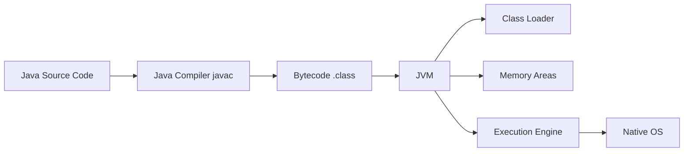
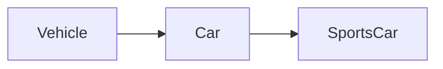
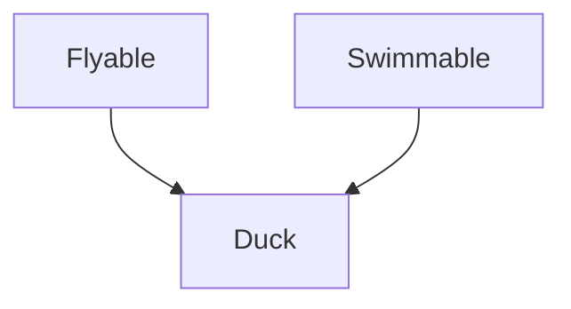
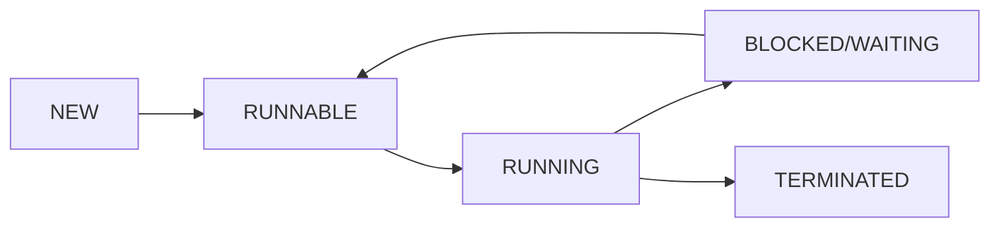
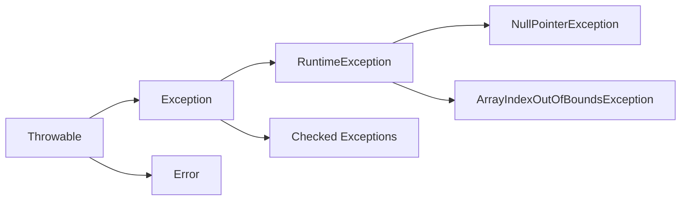
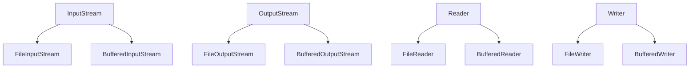

## Question 1(a) [3 marks]

**Explain the basic structure of Java program.**

**Answer**:

**Basic Structure Table:**

| Component | Description |
|-----------|-------------|
| **Package declaration** | Optional, defines package membership |
| **Import statements** | Imports required classes/packages |
| **Class declaration** | Defines the main class |
| **Main method** | Entry point: public static void main(String[] args) |

**Diagram:**

```goat
+-------------------------+
|    Package Declaration  |
+-------------------------+
|    Import Statements    |
+-------------------------+
|    Class Declaration    |
|  +-------------------+  |
|  |   Variables       |  |
|  +-------------------+  |
|  |   Methods         |  |
|  |  +-------------+  |  |
|  |  | main method |  |  |
|  |  +-------------+  |  |
|  +-------------------+  |
+-------------------------+
```

- **Package**: Groups related classes
- **Import**: Access external classes
- **Class**: Blueprint for objects
- **Main method**: Program execution starts here

**Mnemonic:** "PICM - Package, Import, Class, Main"

## Question 1(b) [4 marks]

**List out different features of java. Explain any two.**

**Answer**:

**Java Features Table:**

| Feature | Description |
|---------|-------------|
| **Platform Independent** | Write once, run anywhere |
| **Object Oriented** | Everything is an object |
| **Simple** | Easy syntax, no pointers |
| **Secure** | Built-in security features |
| **Robust** | Strong memory management |
| **Multithreaded** | Concurrent execution support |

**Detailed Explanation:**

**Platform Independence:**

- Java code compiles to bytecode
- JVM interprets bytecode on any platform
- Same program runs on Windows, Linux, Mac

**Object Oriented:**

- Encapsulation: Data hiding in classes
- Inheritance: Code reuse through extends
- Polymorphism: Same method, different behavior

**Mnemonic:** "POSRMM - Platform, Object, Simple, Robust, Multithreaded, Memory"

## Question 1(c) [7 marks]

**Write a program in java to find out sum of the digits of entered number. (Ex. Number is 123 output is 6).**

**Answer**:

```java
public class DigitSum {
    public static void main(String[] args) {
        int number = Integer.parseInt(args[0]);
        int sum = 0;
        int temp = Math.abs(number);
        
        while (temp > 0) {
            sum += temp % 10;
            temp /= 10;
        }
        
        System.out.println("Sum of digits: " + sum);
    }
}
```

**Algorithm Table:**

| Step | Operation | Example (123) |
|------|-----------|---------------|
| 1 | Extract last digit (n%10) | 123%10 = 3 |
| 2 | Add to sum | sum = 0+3 = 3 |
| 3 | Remove last digit (n/10) | 123/10 = 12 |
| 4 | Repeat until n=0 | Continue |

- **Input**: Command line argument
- **Process**: Extract digits using modulo
- **Output**: Sum of all digits

**Mnemonic:** "EARD - Extract, Add, Remove, Done"

## Question 1(c OR) [7 marks]

**Write a program in java to find out maximum from any ten numbers using command line argument.**

**Answer**:

```java
public class FindMaximum {
    public static void main(String[] args) {
        if (args.length < 10) {
            System.out.println("Please enter 10 numbers");
            return;
        }
        
        int max = Integer.parseInt(args[0]);
        
        for (int i = 1; i < 10; i++) {
            int current = Integer.parseInt(args[i]);
            if (current > max) {
                max = current;
            }
        }
        
        System.out.println("Maximum number: " + max);
    }
}
```

**Process Table:**

| Step | Action | Details |
|------|--------|---------|
| 1 | **Check args** | Ensure 10 numbers provided |
| 2 | **Initialize max** | First number as initial max |
| 3 | **Compare loop** | Check each remaining number |
| 4 | **Update max** | If current > max, update |

- **Validation**: Check argument count
- **Comparison**: Standard maximum finding
- **Output**: Display the largest number

**Mnemonic:** "VCIU - Validate, Compare, Initialize, Update"

## Question 2(a) [3 marks]

**List out different concept of oop. Explain anyone in detail.**

**Answer**:

**OOP Concepts Table:**

| Concept | Description |
|---------|-------------|
| **Encapsulation** | Data hiding and bundling |
| **Inheritance** | Code reuse from parent class |
| **Polymorphism** | One interface, many forms |
| **Abstraction** | Hiding implementation details |

**Encapsulation Details:**

- Combines data and methods in single unit
- Uses private access modifiers for data
- Provides public getter/setter methods
- Protects data from unauthorized access

**Benefits:**

- **Security**: Data protection
- **Maintenance**: Easy code updates
- **Flexibility**: Change implementation easily

**Mnemonic:** "EIPA - Encapsulation, Inheritance, Polymorphism, Abstraction"

## Question 2(b) [4 marks]

**Explain JVM in detail.**

**Answer**:

**JVM Architecture Diagram:**



**JVM Components Table:**

| Component | Function |
|-----------|----------|
| **Class Loader** | Loads .class files into memory |
| **Memory Areas** | Heap, Stack, Method area |
| **Execution Engine** | Executes bytecode |
| **JIT Compiler** | Optimizes frequently used code |

- **Platform Independence**: Same bytecode runs everywhere
- **Memory Management**: Automatic garbage collection
- **Security**: Bytecode verification before execution

**Mnemonic:** "CEMJ - Class loader, Execution, Memory, JIT"

## Question 2(c) [7 marks]

**Explain constructor overloading with example.**

**Answer**:

```java
public class Student {
    private String name;
    private int age;
    private String course;
    
    // Default constructor
    public Student() {
        this.name = "Unknown";
        this.age = 0;
        this.course = "Not Assigned";
    }
    
    // Constructor with name
    public Student(String name) {
        this.name = name;
        this.age = 0;
        this.course = "Not Assigned";
    }
    
    // Constructor with name and age
    public Student(String name, int age) {
        this.name = name;
        this.age = age;
        this.course = "Not Assigned";
    }
    
    // Constructor with all parameters
    public Student(String name, int age, String course) {
        this.name = name;
        this.age = age;
        this.course = course;
    }
}
```

**Constructor Types Table:**

| Constructor | Parameters | Use Case |
|-------------|------------|----------|
| **Default** | None | Basic object creation |
| **Single param** | Name only | Partial initialization |
| **Two param** | Name, Age | More specific data |
| **Full param** | All fields | Complete initialization |

- **Same name**: All constructors have class name
- **Different parameters**: Number or type varies
- **Compile-time**: Decision made during compilation

**Mnemonic:** "SNDF - Same Name, Different Parameters, Flexible"

## Question 2(a OR) [3 marks]

**What is wrapper class? Explain with example.**

**Answer**:

**Wrapper Classes Table:**

| Primitive | Wrapper Class |
|-----------|---------------|
| **byte** | Byte |
| **int** | Integer |
| **float** | Float |
| **double** | Double |
| **char** | Character |
| **boolean** | Boolean |

**Example:**

```java
// Boxing - primitive to object
int num = 10;
Integer obj = Integer.valueOf(num);

// Unboxing - object to primitive
Integer wrapper = new Integer(20);
int value = wrapper.intValue();

// Auto-boxing (Java 5+)
Integer auto = 30;
int autoValue = auto;
```

- **Boxing**: Convert primitive to wrapper object
- **Unboxing**: Extract primitive from wrapper
- **Collections**: Only objects allowed in collections

**Mnemonic:** "BUC - Boxing, Unboxing, Collections"

## Question 2(b OR) [4 marks]

**Explain static keyword with example.**

**Answer**:

```java
public class Counter {
    private static int count = 0;  // Static variable
    private int id;                // Instance variable
    
    public Counter() {
        count++;                   // Increment static count
        this.id = count;
    }
    
    public static void showCount() {  // Static method
        System.out.println("Total objects: " + count);
    }
    
    public void showId() {         // Instance method
        System.out.println("Object ID: " + id);
    }
}
```

**Static Features Table:**

| Feature | Characteristics |
|---------|----------------|
| **Static Variable** | Shared among all instances |
| **Static Method** | Called without object creation |
| **Static Block** | Executed once when class loads |
| **Memory** | Stored in method area |

- **Class level**: Belongs to class, not instance
- **Memory efficiency**: Single copy for all objects
- **Access**: Use class name to access

**Mnemonic:** "SCMA - Shared, Class-level, Memory, Access"

## Question 2(c OR) [7 marks]

**What is constructor? Explain copy constructor with example.**

**Answer**:

**Constructor Definition:**
Constructor is a special method that initializes objects when they are created.

```java
public class Book {
    private String title;
    private String author;
    private int pages;
    
    // Default constructor
    public Book() {
        this.title = "Unknown";
        this.author = "Unknown";
        this.pages = 0;
    }
    
    // Parameterized constructor
    public Book(String title, String author, int pages) {
        this.title = title;
        this.author = author;
        this.pages = pages;
    }
    
    // Copy constructor
    public Book(Book other) {
        this.title = other.title;
        this.author = other.author;
        this.pages = other.pages;
    }
    
    public void display() {
        System.out.println(title + " by " + author + 
                          " (" + pages + " pages)");
    }
}

// Usage
Book original = new Book("Java Guide", "James", 500);
Book copy = new Book(original);  // Copy constructor
```

**Constructor Types Table:**

| Type | Purpose | Parameters |
|------|---------|------------|
| **Default** | Basic initialization | None |
| **Parameterized** | Custom initialization | User-defined |
| **Copy** | Clone existing object | Same class object |

- **Same name**: Constructor name = class name
- **No return type**: Not even void
- **Automatic call**: Called when object created

**Mnemonic:** "SNAC - Same Name, Automatic Call"

## Question 3(a) [3 marks]

**Explain any four-string function in java with example.**

**Answer**:

**String Functions Table:**

| Function | Purpose | Example |
|----------|---------|---------|
| **length()** | Returns string length | "Hello".length() → 5 |
| **charAt(index)** | Character at position | "Java".charAt(1) → 'a' |
| **substring(start)** | Extract portion | "Program".substring(3) → "gram" |
| **toUpperCase()** | Convert to uppercase | "java".toUpperCase() → "JAVA" |

**Code Example:**

```java
String str = "Java Programming";

int len = str.length();           // 16
char ch = str.charAt(0);          // 'J'
String sub = str.substring(5);    // "Programming"
String upper = str.toUpperCase(); // "JAVA PROGRAMMING"
```

- **Immutable**: String objects cannot be changed
- **Return new**: Methods return new string objects
- **Zero-indexed**: Position counting starts from 0

**Mnemonic:** "LCST - Length, Character, Substring, Transform"

## Question 3(b) [4 marks]

**List out different types of inheritance. Explain multilevel inheritance.**

**Answer**:

**Inheritance Types Table:**

| Type | Description |
|------|-------------|
| **Single** | One parent, one child |
| **Multilevel** | Chain of inheritance |
| **Hierarchical** | One parent, multiple children |
| **Multiple** | Multiple parents (via interfaces) |

**Multilevel Inheritance Diagram:**



**Example:**

```java
class Vehicle {
    protected String brand;
    public void start() {
        System.out.println("Vehicle started");
    }
}

class Car extends Vehicle {
    protected int doors;
    public void drive() {
        System.out.println("Car is driving");
    }
}

class SportsCar extends Car {
    private int maxSpeed;
    public void race() {
        System.out.println("Sports car racing");
    }
}
```

- **Chain inheritance**: Grandparent → Parent → Child
- **Feature accumulation**: Child gets all ancestor features
- **Method access**: Can call methods from all levels

**Mnemonic:** "SMHM - Single, Multilevel, Hierarchical, Multiple"

## Question 3(c) [7 marks]

**What is interface? Explain multiple inheritance with example.**

**Answer**:

**Interface Definition:**
Interface is a contract that defines what methods a class must implement, without providing implementation.

```java
interface Flyable {
    void fly();
    void land();
}

interface Swimmable {
    void swim();
    void dive();
}

// Multiple inheritance through interfaces
class Duck implements Flyable, Swimmable {
    public void fly() {
        System.out.println("Duck is flying");
    }
    
    public void land() {
        System.out.println("Duck landed on ground");
    }
    
    public void swim() {
        System.out.println("Duck is swimming");
    }
    
    public void dive() {
        System.out.println("Duck dived underwater");
    }
}
```

**Interface vs Class Table:**

| Feature | Interface | Class |
|---------|-----------|-------|
| **Methods** | Abstract (default/static allowed) | Concrete |
| **Variables** | public static final | Any type |
| **Inheritance** | Multiple allowed | Single only |
| **Instantiation** | Cannot create objects | Can create objects |

**Multiple Inheritance Diagram:**



- **Contract**: Defines what, not how
- **Multiple implementation**: One class, many interfaces
- **Diamond problem solution**: Interfaces solve multiple inheritance issues

**Mnemonic:** "CMDS - Contract, Multiple, Diamond-solution"

## Question 3(a OR) [3 marks]

**Explain this keyword with example.**

**Answer**:

**'this' Keyword Uses Table:**

| Use Case | Purpose |
|----------|---------|
| **Instance variable** | Differentiate from parameter |
| **Method call** | Call another method of same class |
| **Constructor call** | Call another constructor |
| **Return object** | Return current object reference |

**Example:**

```java
public class Person {
    private String name;
    private int age;
    
    public Person(String name, int age) {
        this.name = name;  // Distinguish parameter from field
        this.age = age;
    }
    
    public Person setName(String name) {
        this.name = name;
        return this;       // Return current object
    }
    
    public void display() {
        this.printDetails(); // Call method of same class
    }
    
    private void printDetails() {
        System.out.println(this.name + " is " + this.age);
    }
}
```

- **Current object**: Refers to current instance
- **Parameter conflict**: Resolve naming conflicts
- **Method chaining**: Enable fluent interface

**Mnemonic:** "CRPM - Current, Resolve, Parameter, Method"

## Question 3(b OR) [4 marks]

**Explain method overriding with example.**

**Answer**:

```java
class Animal {
    public void makeSound() {
        System.out.println("Animal makes a sound");
    }
    
    public void sleep() {
        System.out.println("Animal sleeps");
    }
}

class Dog extends Animal {
    @Override
    public void makeSound() {  // Method overriding
        System.out.println("Dog barks: Woof!");
    }
    
    // sleep() method inherited as-is
}

class Cat extends Animal {
    @Override
    public void makeSound() {  // Method overriding
        System.out.println("Cat meows: Meow!");
    }
}
```

**Overriding Rules Table:**

| Rule | Description |
|------|-------------|
| **Same signature** | Method name, parameters must match |
| **Inheritance** | Must be in parent-child relationship |
| **@Override** | Annotation for compiler checking |
| **Runtime decision** | Method called based on object type |

**Usage:**

```java
Animal animal1 = new Dog();
Animal animal2 = new Cat();

animal1.makeSound(); // Output: "Dog barks: Woof!"
animal2.makeSound(); // Output: "Cat meows: Meow!"
```

- **Runtime polymorphism**: Decision made during execution
- **Same interface**: Different behavior for different classes
- **Dynamic binding**: Method resolution at runtime

**Mnemonic:** "SSRD - Same Signature, Runtime Decision"

## Question 3(c OR) [7 marks]

**What is package? Write steps to create a package and give example of it.**

**Answer**:

**Package Definition:**
Package is a namespace that organizes related classes and interfaces, providing access control and avoiding naming conflicts.

**Steps to Create Package:**

| Step | Action | Command/Code |
|------|--------|--------------|
| 1 | **Create directory** | mkdir com/company/utils |
| 2 | **Add package declaration** | package com.company.utils; |
| 3 | **Write class** | public class MathUtils { } |
| 4 | **Compile** | javac -d . MathUtils.java |
| 5 | **Import and use** | import com.company.utils.*; |

**Example Package Structure:**

```
src/
  com/
    company/
      utils/
        MathUtils.java
        StringUtils.java
      models/
        Student.java
```

**MathUtils.java:**

```java
package com.company.utils;

public class MathUtils {
    public static int add(int a, int b) {
        return a + b;
    }
    
    public static int multiply(int a, int b) {
        return a * b;
    }
}
```

**Using Package:**

```java
import com.company.utils.MathUtils;

public class Calculator {
    public static void main(String[] args) {
        int sum = MathUtils.add(5, 3);
        int product = MathUtils.multiply(4, 6);
        
        System.out.println("Sum: " + sum);
        System.out.println("Product: " + product);
    }
}
```

**Package Benefits Table:**

| Benefit | Description |
|---------|-------------|
| **Organization** | Logical grouping of classes |
| **Namespace** | Avoid naming conflicts |
| **Access control** | Package-private access |
| **Maintenance** | Easier code management |

**Mnemonic:** "ONAM - Organization, Namespace, Access, Maintenance"

## Question 4(a) [3 marks]

**Explain thread priorities with suitable example.**

**Answer**:

**Thread Priority Table:**

| Priority Level | Constant | Value |
|----------------|----------|-------|
| **Minimum** | MIN_PRIORITY | 1 |
| **Normal** | NORM_PRIORITY | 5 |
| **Maximum** | MAX_PRIORITY | 10 |

**Example:**

```java
class PriorityDemo extends Thread {
    public PriorityDemo(String name) {
        super(name);
    }
    
    public void run() {
        for (int i = 1; i <= 5; i++) {
            System.out.println(getName() + " - Count: " + i);
        }
    }
}

public class ThreadPriorityExample {
    public static void main(String[] args) {
        PriorityDemo t1 = new PriorityDemo("High Priority");
        PriorityDemo t2 = new PriorityDemo("Low Priority");
        
        t1.setPriority(Thread.MAX_PRIORITY);  // Priority 10
        t2.setPriority(Thread.MIN_PRIORITY);  // Priority 1
        
        t1.start();
        t2.start();
    }
}
```

- **Higher priority**: More likely to get CPU time
- **Not guaranteed**: JVM decides actual scheduling
- **Default priority**: Every thread starts with NORM_PRIORITY

**Mnemonic:** "HNG - Higher priority, Not Guaranteed"

## Question 4(b) [4 marks]

**What is Thread? Explain Thread life cycle.**

**Answer**:

**Thread Definition:**
Thread is a lightweight sub-process that allows concurrent execution of multiple tasks within a program.

**Thread Life Cycle Diagram:**



**Thread States Table:**

| State | Description |
|-------|-------------|
| **NEW** | Thread created but not started |
| **RUNNABLE** | Ready to run, waiting for CPU |
| **RUNNING** | Currently executing |
| **BLOCKED/WAITING** | Waiting for resource/condition |
| **TERMINATED** | Execution completed |

**State Transitions:**

- **NEW → RUNNABLE**: start() method called
- **RUNNABLE → RUNNING**: Thread scheduler assigns CPU
- **RUNNING → BLOCKED**: Waiting for I/O or lock
- **RUNNING → TERMINATED**: run() method completes

- **Concurrent execution**: Multiple threads run simultaneously
- **JVM managed**: Thread scheduler controls execution
- **Resource sharing**: Threads share memory space

**Mnemonic:** "NRBT - New, Runnable, Blocked, Terminated"

## Question 4(c) [7 marks]

**Write a program in java that create the multiple threads by implementing the Thread class.**

**Answer**:

```java
class NumberPrinter extends Thread {
    private String threadName;
    private int start;
    private int end;
    
    public NumberPrinter(String name, int start, int end) {
        this.threadName = name;
        this.start = start;
        this.end = end;
    }
    
    @Override
    public void run() {
        System.out.println(threadName + " started");
        
        for (int i = start; i <= end; i++) {
            System.out.println(threadName + ": " + i);
            
            try {
                Thread.sleep(500); // Pause for 500ms
            } catch (InterruptedException e) {
                System.out.println(threadName + " interrupted");
            }
        }
        
        System.out.println(threadName + " finished");
    }
}

public class MultipleThreadsExample {
    public static void main(String[] args) {
        // Create multiple threads
        NumberPrinter thread1 = new NumberPrinter("Thread-1", 1, 5);
        NumberPrinter thread2 = new NumberPrinter("Thread-2", 10, 15);
        NumberPrinter thread3 = new NumberPrinter("Thread-3", 20, 25);
        
        // Start all threads
        thread1.start();
        thread2.start();
        thread3.start();
        
        System.out.println("All threads started from main");
    }
}
```

**Implementation Steps Table:**

| Step | Action |
|------|--------|
| 1 | **Extend Thread class** |
| 2 | **Override run() method** |
| 3 | **Create thread objects** |
| 4 | **Call start() method** |

- **Extends Thread**: Inherit threading capabilities
- **Override run()**: Define thread's execution logic
- **start() method**: Begin thread execution
- **Concurrent execution**: All threads run simultaneously

**Mnemonic:** "EOCS - Extend, Override, Create, Start"

## Question 4(a OR) [3 marks]

**Explain basic concept of Exception Handling.**

**Answer**:

**Exception Handling Concepts Table:**

| Concept | Description |
|---------|-------------|
| **Exception** | Runtime error that disrupts normal flow |
| **try block** | Code that might throw exception |
| **catch block** | Handles specific exception types |
| **finally block** | Always executes, cleanup code |

**Exception Hierarchy:**



**Basic Syntax:**

```java
try {
    // Risky code
} catch (ExceptionType e) {
    // Handle exception
} finally {
    // Cleanup code
}
```

- **Graceful handling**: Program continues after exception
- **Error prevention**: Avoid program crash
- **Resource cleanup**: finally block ensures cleanup

**Mnemonic:** "TRCF - Try, Runtime error, Catch, Finally"

## Question 4(b OR) [4 marks]

**Explain multiple catch with suitable example.**

**Answer**:

```java
public class MultipleCatchExample {
    public static void main(String[] args) {
        try {
            int[] numbers = {10, 20, 30};
            int divisor = Integer.parseInt(args[0]);
            
            int result = numbers[5] / divisor;  // May cause multiple exceptions
            System.out.println("Result: " + result);
            
        } catch (ArrayIndexOutOfBoundsException e) {
            System.out.println("Array index error: " + e.getMessage());
            
        } catch (ArithmeticException e) {
            System.out.println("Math error: " + e.getMessage());
            
        } catch (NumberFormatException e) {
            System.out.println("Number format error: " + e.getMessage());
            
        } catch (Exception e) {  // Generic catch
            System.out.println("General error: " + e.getMessage());
            
        } finally {
            System.out.println("Cleanup completed");
        }
    }
}
```

**Multiple Catch Rules Table:**

| Rule | Description |
|------|-------------|
| **Specific first** | Handle specific exceptions before general |
| **One catch executes** | Only first matching catch runs |
| **Order matters** | More specific to more general |
| **finally always** | finally block always executes |

**Exception Flow:**

- **ArrayIndexOutOfBoundsException**: Invalid array access
- **ArithmeticException**: Division by zero
- **NumberFormatException**: Invalid number conversion
- **Exception**: Catches any remaining exceptions

**Mnemonic:** "SOOF - Specific first, One executes, Order matters, Finally"

## Question 4(c OR) [7 marks]

**What is Exception? Write a program that show the use of Arithmetic Exception.**

**Answer**:

**Exception Definition:**
Exception is an event that occurs during program execution and disrupts the normal flow of instructions.

```java
public class ArithmeticExceptionDemo {
    
    public static double divide(int numerator, int denominator) {
        try {
            if (denominator == 0) {
                throw new ArithmeticException("Division by zero is not allowed");
            }
            return (double) numerator / denominator;
            
        } catch (ArithmeticException e) {
            System.out.println("Arithmetic Exception caught: " + e.getMessage());
            return Double.NaN;  // Return Not-a-Number
        }
    }
    
    public static void calculatorDemo() {
        int[] numbers = {100, 50, 25, 0, -10};
        
        for (int i = 0; i < numbers.length; i++) {
            try {
                int result = 100 / numbers[i];
                System.out.println("100 / " + numbers[i] + " = " + result);
                
            } catch (ArithmeticException e) {
                System.out.println("Cannot divide 100 by " + numbers[i] + 
                                 " - " + e.getMessage());
            }
        }
    }
    
    public static void main(String[] args) {
        System.out.println("=== Arithmetic Exception Demo ===");
        
        // Test custom divide method
        System.out.println("\n1. Custom divide method:");
        System.out.println("10 / 2 = " + divide(10, 2));
        System.out.println("15 / 0 = " + divide(15, 0));
        
        // Test calculator demo
        System.out.println("\n2. Calculator demo:");
        calculatorDemo();
        
        // Test with try-catch-finally
        System.out.println("\n3. Try-catch-finally demo:");
        try {
            int value = 50;
            int zero = 0;
            int result = value / zero;  // This will throw ArithmeticException
            
        } catch (ArithmeticException e) {
            System.out.println("Exception handled: " + e.toString());
            
        } finally {
            System.out.println("Finally block: Cleanup completed");
        }
        
        System.out.println("Program continues normally after exception handling");
    }
}
```

**Exception Types Table:**

| Type | Description | Example |
|------|-------------|---------|
| **Checked** | Must be handled at compile time | IOException |
| **Unchecked** | Runtime exceptions | ArithmeticException |
| **Error** | System-level problems | OutOfMemoryError |

**ArithmeticException Causes:**

- **Division by zero**: Most common cause
- **Modulo by zero**: Remainder operation with zero
- **Invalid operations**: Mathematical impossibilities

**Program Flow:**

1. **Normal execution**: Try block runs
2. **Exception occurs**: ArithmeticException thrown
3. **Exception caught**: Catch block handles it
4. **Cleanup**: Finally block executes
5. **Continue**: Program continues after handling

**Mnemonic:** "DZMI - Division by Zero, Mathematical Invalid"

## Question 5(a) [3 marks]

**Explain ArrayIndexOutOfBound Exception in Java with example.**

**Answer**:

**ArrayIndexOutOfBound Exception Table:**

| Cause | Description | Example |
|-------|-------------|---------|
| **Negative index** | Index less than 0 | arr[-1] |
| **Index >= length** | Index beyond array size | arr[5] for size 3 |
| **Empty array** | Access on zero-length array | arr[0] for length 0 |

**Example:**

```java
public class ArrayIndexDemo {
    public static void main(String[] args) {
        int[] numbers = {10, 20, 30};
        
        try {
            System.out.println(numbers[5]); // Index 5 > length 3
        } catch (ArrayIndexOutOfBoundsException e) {
            System.out.println("Error: " + e.getMessage());
        }
        
        try {
            System.out.println(numbers[-1]); // Negative index
        } catch (ArrayIndexOutOfBoundsException e) {
            System.out.println("Error: Negative index");
        }
    }
}
```

- **Runtime exception**: Occurs during program execution
- **Index validation**: Always check array bounds
- **Prevention**: Use array.length for bounds checking

**Mnemonic:** "NIE - Negative, Index-exceed, Empty"

## Question 5(b) [4 marks]

**Explain basics of stream classes.**

**Answer**:

**Stream Classes Hierarchy:**



**Stream Types Table:**

| Stream Type | Purpose | Classes |
|-------------|---------|---------|
| **Byte Streams** | Handle binary data | InputStream, OutputStream |
| **Character Streams** | Handle text data | Reader, Writer |
| **Buffered Streams** | Improve performance | BufferedReader, BufferedWriter |
| **File Streams** | File operations | FileInputStream, FileOutputStream |

**Basic Operations:**

- **Input**: Read data from source
- **Output**: Write data to destination
- **Buffering**: Store data temporarily for efficiency
- **Closing**: Release system resources

**Stream Benefits:**

- **Abstraction**: Uniform interface for I/O
- **Efficiency**: Buffered operations
- **Flexibility**: Various data sources/destinations

**Mnemonic:** "BCIF - Byte, Character, Input/Output, File"

## Question 5(c) [7 marks]

**Write a java program to create a text file and perform write operation on the text file.**

**Answer**:

```java
import java.io.*;

public class FileWriteDemo {
    
    public static void writeWithFileWriter() {
        try {
            FileWriter writer = new FileWriter("student_data.txt");
            
            writer.write("Student Information System\n");
            writer.write("==========================\n");
            writer.write("ID: 101\n");
            writer.write("Name: John Doe\n");
            writer.write("Course: Java Programming\n");
            writer.write("Grade: A+\n");
            
            writer.close();
            System.out.println("File written successfully using FileWriter");
            
        } catch (IOException e) {
            System.out.println("Error writing file: " + e.getMessage());
        }
    }
    
    public static void writeWithBufferedWriter() {
        try {
            BufferedWriter buffWriter = new BufferedWriter(
                new FileWriter("course_details.txt")
            );
            
            String[] courses = {
                "Java Programming - 4341602",
                "Database Management - 4341603", 
                "Web Development - 4341604",
                "Mobile App Development - 4341605"
            };
            
            buffWriter.write("Available Courses:\n");
            buffWriter.write("==================\n");
            
            for (String course : courses) {
                buffWriter.write(course + "\n");
            }
            
            buffWriter.close();
            System.out.println("File written successfully using BufferedWriter");
            
        } catch (IOException e) {
            System.out.println("Error: " + e.getMessage());
        }
    }
    
    public static void writeWithTryWithResources() {
        try (FileWriter writer = new FileWriter("marks_record.txt")) {
            
            writer.write("Semester 4 Marks Record\n");
            writer.write("=======================\n");
            writer.write("Java Programming: 85\n");
            writer.write("Database Management: 78\n");
            writer.write("Web Development: 92\n");
            writer.write("Total: 255/300\n");
            writer.write("Percentage: 85%\n");
            
            System.out.println("File written with automatic resource management");
            
        } catch (IOException e) {
            System.out.println("File write error: " + e.getMessage());
        }
    }
    
    public static void main(String[] args) {
        System.out.println("=== File Write Operations Demo ===\n");
        
        // Method 1: Basic FileWriter
        writeWithFileWriter();
        
        // Method 2: BufferedWriter for better performance
        writeWithBufferedWriter();
        
        // Method 3: Try-with-resources (recommended)
        writeWithTryWithResources();
        
        System.out.println("\nAll file write operations completed!");
    }
}
```

**File Write Methods Table:**

| Method | Performance | Resource Management | Use Case |
|--------|-------------|-------------------|----------|
| **FileWriter** | Basic | Manual close() | Simple writes |
| **BufferedWriter** | High | Manual close() | Large data |
| **Try-with-resources** | High | Automatic | Recommended |

**Write Operation Steps:**

1. **Create writer object**: FileWriter or BufferedWriter
2. **Write data**: Use write() method
3. **Close stream**: Release resources
4. **Handle exceptions**: IOException management

**File Operations:**

- **Create**: New file if doesn't exist
- **Overwrite**: Replaces existing content
- **Append**: Add to existing content (use append mode)

**Mnemonic:** "CWCH - Create, Write, Close, Handle"

## Question 5(a OR) [3 marks]

**Explain Divide by Zero Exception in Java with example.**

**Answer**:

**Divide by Zero Exception Table:**

| Operation | Result | Exception |
|-----------|--------|-----------|
| **Integer division** | Undefined | ArithmeticException |
| **Float division** | Infinity | No exception |
| **Modulo by zero** | Undefined | ArithmeticException |

**Example:**

```java
public class DivideByZeroDemo {
    public static void main(String[] args) {
        // Integer division by zero
        try {
            int result = 10 / 0;
        } catch (ArithmeticException e) {
            System.out.println("Integer division: " + e.getMessage());
        }
        
        // Float division by zero (no exception)
        double floatResult = 10.0 / 0.0;
        System.out.println("Float division: " + floatResult); // Infinity
        
        // Modulo by zero
        try {
            int remainder = 10 % 0;
        } catch (ArithmeticException e) {
            System.out.println("Modulo error: " + e.getMessage());
        }
    }
}
```

- **Integer arithmetic**: Throws ArithmeticException
- **Floating point**: Returns Infinity (IEEE 754 standard)
- **Prevention**: Check denominator before division

**Mnemonic:** "IFM - Integer exception, Float infinity, Modulo error"

## Question 5(b OR) [4 marks]

**Explain try and catch block with example.**

**Answer**:

**Try-Catch Structure:**

```java
try {
    // Risky code that might throw exception
} catch (SpecificException e) {
    // Handle specific exception
} catch (GeneralException e) {
    // Handle general exception
} finally {
    // Always executes (optional)
}
```

**Example:**

```java
public class TryCatchExample {
    public static void validateAge(int age) {
        try {
            if (age < 0) {
                throw new IllegalArgumentException("Age cannot be negative");
            }
            if (age > 150) {
                throw new IllegalArgumentException("Age seems unrealistic");
            }
            System.out.println("Valid age: " + age);
            
        } catch (IllegalArgumentException e) {
            System.out.println("Validation error: " + e.getMessage());
        }
    }
    
    public static void main(String[] args) {
        validateAge(25);    // Valid
        validateAge(-5);    // Invalid
        validateAge(200);   // Invalid
    }
}
```

**Try-Catch Flow Table:**

| Block | Purpose | Execution |
|-------|---------|-----------|
| **try** | Contains risky code | Always executed first |
| **catch** | Handles exceptions | Only if exception occurs |
| **finally** | Cleanup code | Always executed |

- **Exception matching**: First matching catch block executes
- **Control flow**: Program continues after catch block
- **Multiple catches**: Handle different exception types

**Mnemonic:** "TCF - Try risky, Catch exception, Finally cleanup"

## Question 5(c OR) [7 marks]

**Write a java program to display the content of a text file and perform append operation on the text file.**

**Answer**:

```java
import java.io.*;

public class FileReadAppendDemo {
    
    public static void createInitialFile() {
        try (FileWriter writer = new FileWriter("student_log.txt")) {
            writer.write("Student Activity Log\n");
            writer.write("===================\n");
            writer.write("2024-06-13: Course registration started\n");
            writer.write("2024-06-14: Assignment 1 submitted\n");
            
            System.out.println("Initial file created successfully");
            
        } catch (IOException e) {
            System.out.println("Error creating file: " + e.getMessage());
        }
    }
    
    public static void displayFileContent(String fileName) {
        System.out.println("\n=== File Content ===");
        
        try (BufferedReader reader = new BufferedReader(new FileReader(fileName))) {
            String line;
            int lineNumber = 1;
            
            while ((line = reader.readLine()) != null) {
                System.out.println(lineNumber + ": " + line);
                lineNumber++;
            }
            
        } catch (FileNotFoundException e) {
            System.out.println("File not found: " + fileName);
        } catch (IOException e) {
            System.out.println("Error reading file: " + e.getMessage());
        }
    }
    
    public static void appendToFile(String fileName, String content) {
        try (FileWriter writer = new FileWriter(fileName, true)) { // true = append mode
            writer.write(content);
            System.out.println("Content appended successfully");
            
        } catch (IOException e) {
            System.out.println("Error appending to file: " + e.getMessage());
        }
    }
    
    public static void appendMultipleEntries(String fileName) {
        String[] newEntries = {
            "2024-06-15: Quiz 1 completed\n",
            "2024-06-16: Project proposal submitted\n",
            "2024-06-17: Group study session\n",
            "2024-06-18: Mid-term exam preparation\n"
        };
        
        try (BufferedWriter writer = new BufferedWriter(
                new FileWriter(fileName, true))) {
            
            writer.write("\n--- Recent Activities ---\n");
            
            for (String entry : newEntries) {
                writer.write(entry);
            }
            
            writer.write("--- End of Log ---\n");
            System.out.println("Multiple entries appended successfully");
            
        } catch (IOException e) {
            System.out.println("Error appending entries: " + e.getMessage());
        }
    }
    
    public static void main(String[] args) {
        String fileName = "student_log.txt";
        
        System.out.println("=== File Read and Append Operations ===");
        
        // Step 1: Create initial file
        createInitialFile();
        
        // Step 2: Display initial content
        displayFileContent(fileName);
        
        // Step 3: Append single entry
        appendToFile(fileName, "2024-06-19: Lab session completed\n");
        
        // Step 4: Display content after first append
        System.out.println("\n--- After first append ---");
        displayFileContent(fileName);
        
        // Step 5: Append multiple entries
        appendMultipleEntries(fileName);
        
        // Step 6: Display final content
        System.out.println("\n--- Final file content ---");
        displayFileContent(fileName);
        
        // Step 7: File statistics
        showFileStatistics(fileName);
    }
    
    public static void showFileStatistics(String fileName) {
        try (BufferedReader reader = new BufferedReader(new FileReader(fileName))) {
            int lineCount = 0;
            int charCount = 0;
            String line;
            
            while ((line = reader.readLine()) != null) {
                lineCount++;
                charCount += line.length();
            }
            
            System.out.println("\n=== File Statistics ===");
            System.out.println("Total lines: " + lineCount);
            System.out.println("Total characters: " + charCount);
            
        } catch (IOException e) {
            System.out.println("Error reading file statistics: " + e.getMessage());
        }
    }
}
```

**File Operations Table:**

| Operation | Method | Purpose |
|-----------|--------|---------|
| **Create** | FileWriter(filename) | Create new file |
| **Read** | BufferedReader.readLine() | Read file content |
| **Append** | FileWriter(filename, true) | Add to existing file |
| **Display** | System.out.println() | Show content |

**File Operations Flow:**

1. **Create initial file**: Write initial content
2. **Display content**: Read and show current content
3. **Append data**: Add new information
4. **Display updated**: Show modified content
5. **Statistics**: Count lines and characters

**Append vs Write:**

- **Write mode**: Overwrites existing content
- **Append mode**: Adds to end of existing content
- **Constructor parameter**: Second parameter true enables append

**Resource Management:**

- **Try-with-resources**: Automatic close()
- **Exception handling**: FileNotFoundException, IOException
- **Buffered operations**: Better performance for large files

**Mnemonic:** "CDADS - Create, Display, Append, Display, Statistics"
