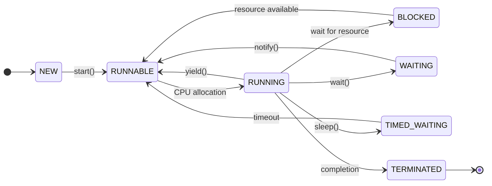

## પ્રશ્ન 1(અ) [3 ગુણ]

**પ્રોસિજર ઓરિએન્ટેડ પ્રોગ્રામિંગ (POP) અને ઓબ્જેક્ટ-ઓરિએન્ટેડ પ્રોગ્રામિંગ (OOP) વચ્ચે તફાવત કરો.**

**જવાબ**:

**ટેબલ:**

| પાસાં | POP | OOP |
|-------|-----|-----|
| **અભિગમ** | ટોપ-ડાઉન અભિગમ | બોટમ-અપ અભિગમ |
| **ફોકસ** | ફંક્શન્સ અને પ્રોસિજર્સ | ઓબ્જેક્ટ્સ અને ક્લાસેસ |
| **ડેટા સિક્યોરિટી** | ઓછી સુરક્ષિત, ગ્લોબલ ડેટા | વધુ સુરક્ષિત, ડેટા encapsulation |
| **સમસ્યા ઉકેલ** | ફંક્શન્સમાં વિભાજન | ઓબ્જેક્ટ્સમાં વિભાજન |

**મુખ્ય મુદ્દા:**

- **POP**: ફંક્શન્સ પ્રાથમિક બિલ્ડિંગ બ્લોક્સ છે
- **OOP**: ઓબ્જેક્ટ્સમાં ડેટા અને મેથડ્સ બંને સામેલ છે
- **પુનઃઉપયોગ**: OOP વધુ સારી કોડ પુનઃઉપયોગિતા પ્રદાન કરે છે

**મેમરી ટ્રીક:** "POP ફંક્શન્સ, OOP ઓબ્જેક્ટ્સ"

## પ્રશ્ન 1(બ) [4 ગુણ]

**OOP ના મૂળભૂત ખ્યાલોની નોંધણી કરો અને સમજાવો.**

**જવાબ**:

**OOP ના મૂળભૂત ખ્યાલો:**

- **Encapsulation**: ક્લાસમાં ડેટા અને મેથડ્સને એકસાથે બાંધવું
- **Inheritance**: હાલની ક્લાસેસમાંથી નવી ક્લાસેસ બનાવવી
- **Polymorphism**: સમાન મેથડ નામ સાથે વિવિધ implementations
- **Abstraction**: યુઝરથી implementation વિગતો છુપાવવી

**ફાયદા:**

- **કોડ પુનઃઉપયોગ**: inheritance અને polymorphism દ્વારા
- **ડેટા સિક્યોરિટી**: encapsulation દ્વારા
- **સરળ maintenance**: મોડ્યુલર અભિગમ

**મેમરી ટ્રીક:** "દરેક હુશિયાર વ્યક્તિ અમૂર્ત વિચાર કરે છે"

## પ્રશ્ન 1(ક) [7 ગુણ]

**Constructor વ્યાખ્યાયિત કરો. વિવિધ પ્રકારના Constructors ની નોંધણી કરો અને તેમાંથી કોઈપણ 2 ને યોગ્ય ઉદાહરણ સાથે સમજાવો.**

**જવાબ**:

**Constructor વ્યાખ્યા:**
Constructor એ વિશેષ મેથડ છે જે ઓબ્જેક્ટ બનાવવામાં આવે ત્યારે તેને initialize કરે છે. તેનું નામ ક્લાસ જેવું જ હોય છે અને કોઈ return type નથી.

**Constructor ના પ્રકારો:**

- **Default Constructor**: કોઈ પેરામીટર નથી
- **Parameterized Constructor**: પેરામીટર લે છે
- **Copy Constructor**: અન્ય ઓબ્જેક્ટમાંથી ઓબ્જેક્ટ બનાવે છે
- **Private Constructor**: ઓબ્જેક્ટ બનાવવાને મર્યાદિત કરે છે

**કોડ ઉદાહરણ:**

```java
class Student {
    String name;
    int age;
    
    // Default Constructor
    public Student() {
        name = "Unknown";
        age = 0;
    }
    
    // Parameterized Constructor
    public Student(String n, int a) {
        name = n;
        age = a;
    }
}

class Main {
    public static void main(String[] args) {
        Student s1 = new Student();        // Default
        Student s2 = new Student("John", 20); // Parameterized
    }
}
```

**મુખ્ય લક્ષણો:**

- **આપોઆપ કૉલ**: ઓબ્જેક્ટ બનાવવા દરમિયાન આપોઆપ કૉલ થાય છે
- **કોઈ Return Type નથી**: Constructor નો કોઈ return type નથી

**મેમરી ટ્રીક:** "Constructor ઓબ્જેક્ટ બનાવે છે"

## પ્રશ્ન 1(ક OR) [7 ગુણ]

**String class સમજાવો. String class ની વિવિધ methods ની યાદી બનાવો અને તેમાંથી કોઈપણ 3 ને યોગ્ય ઉદાહરણ સાથે સમજાવો.**

**જવાબ**:

**String Class:**
Java માં String class immutable character sequences ને રિપ્રેઝેન્ટ કરે છે. એકવાર બનાવ્યા પછી, String ઓબ્જેક્ટ્સ બદલી શકાતા નથી.

**String Methods:**

| Method | હેતુ |
|--------|------|
| length() | string ની લંબાઈ પરત કરે છે |
| charAt(index) | આપેલ index પર character પરત કરે છે |
| substring(start, end) | substring કાઢે છે |
| indexOf(char) | character ની પોઝિશન શોધે છે |
| toUpperCase() | uppercase માં કન્વર્ટ કરે છે |

**કોડ ઉદાહરણ:**

```java
public class StringDemo {
    public static void main(String[] args) {
        String str = "Hello World";
        
        // length() method
        System.out.println("Length: " + str.length()); // 11
        
        // charAt() method
        System.out.println("Char at 0: " + str.charAt(0)); // H
        
        // substring() method
        System.out.println("Substring: " + str.substring(0, 5)); // Hello
    }
}
```

**મુખ્ય મુદ્દા:**

- **Immutable**: String ઓબ્જેક્ટ્સ બદલી શકાતા નથી
- **Memory Efficient**: Storage માટે string pool

**મેમરી ટ્રીક:** "Strings ટેક્સ્ટ સ્ટોર કરે છે"

## પ્રશ્ન 2(અ) [3 ગુણ]

**Garbage Collection વ્યાખ્યાયિત કરો. JAVA પ્રોગ્રામિંગમાં Garbage Collection નું મહત્વ જણાવો.**

**જવાબ**:

**Garbage Collection વ્યાખ્યા:**
આપોઆપ મેમરી મેનેજમેન્ટ પ્રક્રિયા જે એવા ઓબ્જેક્ટ્સ દ્વારા કબજે કરાયેલી મેમરી પાછી મેળવે છે જેનો હવે કોઈ reference નથી.

**મહત્વ:**

- **આપોઆપ મેમરી મેનેજમેન્ટ**: મેન્યુઅલ મેમરી deallocation ની જરૂર નથી
- **Memory Leaks ટાળે છે**: આપોઆપ unused મેમરી મુક્ત કરે છે
- **Application Performance**: મેમરી ઉપયોગને optimize કરે છે

**ફાયદા:**

- **Programmer Productivity**: મેમરી મેનેજમેન્ટ પર નહીં, logic પર ધ્યાન
- **Reliability**: મેમરી issues ને લીધે crashes ઘટાડે છે

**મેમરી ટ્રીક:** "Garbage Collector મેમરી સાફ કરે છે"

## પ્રશ્ન 2(બ) [4 ગુણ]

**Object ને Garbage collection માટે eligible બનાવવાની ચાર રીતોની યાદી બનાવો.**

**જવાબ**:

**GC Eligibility ની ચાર રીતો:**

| રીત | વર્ણન |
|----|------|
| **Reference ને Null કરવું** | Object reference ને null સેટ કરવું |
| **Reference ફરીથી Assign કરવું** | Reference ને બીજા object પર point કરવું |
| **Anonymous Objects** | Reference વિના objects બનાવવા |
| **Island of Isolation** | Objects માત્ર એકબીજાને refer કરે |

**ઉદાહરણો:**

- **Nullifying**: `obj = null;`
- **Reassigning**: `obj1 = obj2;`
- **Anonymous**: `new Student();`
- **Island**: બાહ્ય access વિના circular references

**મેમરી ટ્રીક:** "Null References Islands ને આકર્ષે છે"

## પ્રશ્ન 2(ક) [7 ગુણ]

**Static block દર્શાવવા માટે JAVA પ્રોગ્રામ લખો જે main પહેલા execute થાય છે. તેનું મહત્વ સમજાવો.**

**જવાબ**:

**કોડ ઉદાહરણ:**

```java
public class StaticBlockDemo {
    static int count;
    
    // Static block
    static {
        System.out.println("Static block executed first");
        count = 10;
        System.out.println("Count initialized to: " + count);
    }
    
    public static void main(String[] args) {
        System.out.println("Main method started");
        System.out.println("Count value: " + count);
    }
}
```

**આઉટપુટ:**

```
Static block executed first
Count initialized to: 10
Main method started
Count value: 10
```

**મહત્વ:**

- **પ્રારંભિક Initialization**: main method પહેલા execute થાય છે
- **Class Loading**: ક્લાસ પ્રથમ વખત લોડ થાય ત્યારે ચાલે છે
- **એક વખત Execute**: ક્લાસ દીઠ માત્ર એક વખત execute થાય છે

**ઉપયોગ:**

- **Static Variable Initialization**: static variables ને initialize કરવા
- **Resource Loading**: configuration files લોડ કરવા

**મેમરી ટ્રીક:** "Static Blocks Main પહેલા શરૂ થાય છે"

## પ્રશ્ન 2(અ OR) [3 ગુણ]

**JAVA માં Minor/Incremental અને Major/Full Garbage collection નું વર્ણન કરો.**

**જવાબ**:

**Garbage Collection ના પ્રકારો:**

| પ્રકાર | વર્ણન | આવર્તન |
|------|-------|--------|
| **Minor GC** | Young generation સાફ કરે છે | વારંવાર |
| **Major GC** | Old generation સાફ કરે છે | ઓછું વારંવાર |

**Minor GC:**

- **લક્ષ્ય**: Young generation objects
- **ઝડપ**: ઝડપી execution
- **પ્રભાવ**: ઓછું application pause

**Major GC:**

- **લક્ષ્ય**: Old generation objects
- **ઝડપ**: ધીમું execution
- **પ્રભાવ**: વધારે application pause

**મેમરી ટ્રીક:** "Minor વારંવાર, Major ધીમું"

## પ્રશ્ન 2(બ OR) [4 ગુણ]

**JAVA માં finalize() method ને તેના ફાયદાઓ સાથે સમજાવો.**

**જવાબ**:

**finalize() Method:**
Garbage collector દ્વારા object destruction પહેલા cleanup operations માટે કૉલ કરાતી વિશેષ method.

**Syntax:**

```java
protected void finalize() throws Throwable {
    // Cleanup code
}
```

**ફાયદા:**

- **Resource Cleanup**: Files, database connections બંધ કરવા
- **Memory Management**: Native resources મુક્ત કરવા
- **Safety Net**: Cleanup માટે છેલ્લી તક

**ઉદાહરણ:**

```java
class FileHandler {
    protected void finalize() throws Throwable {
        System.out.println("Cleanup before destruction");
        super.finalize();
    }
}
```

**મેમરી ટ્રીક:** "Finalize Resources મુક્ત કરે છે"

## પ્રશ્ન 2(ક OR) [7 ગુણ]

**public static void main(String[] args) ની syntax સમજાવો. Command line argument તરીકે લેવાયેલ input ને છાપવા માટે JAVA પ્રોગ્રામ લખો.**

**જવાબ**:

**Main Method Syntax:**

```java
public static void main(String[] args)
```

**સમજૂતી:**

- **public**: ગમે ત્યાંથી accessible
- **static**: Object બનાવ્યા વિના કૉલ કરી શકાય
- **void**: કોઈ return value નથી
- **main**: JVM દ્વારા ઓળખાતું method નામ
- **String[] args**: Command line arguments array

**કોડ ઉદાહરણ:**

```java
public class CommandLineDemo {
    public static void main(String[] args) {
        System.out.println("Arguments ની સંખ્યા: " + args.length);
        
        if(args.length > 0) {
            System.out.println("Command line arguments:");
            for(int i = 0; i < args.length; i++) {
                System.out.println("Arg " + i + ": " + args[i]);
            }
        } else {
            System.out.println("કોઈ arguments પ્રદાન કરાયા નથી");
        }
    }
}
```

**Execution:**

```bash
java CommandLineDemo Hello World 123
```

**આઉટપુટ:**

```
Arguments ની સંખ્યા: 3
Command line arguments:
Arg 0: Hello
Arg 1: World
Arg 2: 123
```

**મેમરી ટ્રીક:** "Public Static Void Main Args"

## પ્રશ્ન 3(અ) [3 ગુણ]

**વિવિધ Java access modifiers ની યાદી બનાવો અને સમજાવો.**

**જવાબ**:

**Java Access Modifiers:**

| Modifier | Class | Package | Subclass | World |
|----------|-------|---------|----------|-------|
| **public** | ✓ | ✓ | ✓ | ✓ |
| **protected** | ✓ | ✓ | ✓ | ✗ |
| **default** | ✓ | ✓ | ✗ | ✗ |
| **private** | ✓ | ✗ | ✗ | ✗ |

**ઉપયોગ:**

- **public**: બધે accessible
- **protected**: Package અને subclasses માં accessible
- **default**: માત્ર package-level access
- **private**: માત્ર class-level access

**મેમરી ટ્રીક:** "Public Protected Default Private"

## પ્રશ્ન 3(બ) [4 ગુણ]

**JAVA માં interface નું વર્ણન કરો. Executable ઉદાહરણ સાથે interface નો inheritance દર્શાવો.**

**જવાબ**:

**Java માં Interface:**
એક contract જે implementation વિના method signatures વ્યાખ્યાયિત કરે છે. Classes interface ને implement કરીને method definitions પ્રદાન કરે છે.

**Interface Inheritance ઉદાહરણ:**

```java
// Parent interface
interface Animal {
    void sound();
}

// Child interface Animal થી inherit કરે છે
interface Mammal extends Animal {
    void walk();
}

// Child interface ને implement કરતી class
class Dog implements Mammal {
    public void sound() {
        System.out.println("કૂતરો ભસે છે");
    }
    
    public void walk() {
        System.out.println("કૂતરો ચાર પગ પર ચાલે છે");
    }
}

class Main {
    public static void main(String[] args) {
        Dog d = new Dog();
        d.sound();
        d.walk();
    }
}
```

**મુખ્ય લક્ષણો:**

- **Multiple Inheritance**: Interface multiple inheritance support કરે છે
- **Contract**: Class શું implement કરવું જોઈએ તે વ્યાખ્યાયિત કરે છે

**મેમરી ટ્રીક:** "Interfaces Contracts Inherit કરે છે"

## પ્રશ્ન 3(ક) [7 ગુણ]

**super keyword વ્યાખ્યાયિત કરો અને executable JAVA પ્રોગ્રામ સાથે super keyword નો ઉપયોગ દર્શાવો**

**જવાબ**:

**super Keyword:**
Immediate parent class object ને reference કરે છે. Parent class ના methods, variables, અને constructors ને access કરવા માટે વપરાય છે.

**કોડ ઉદાહરણ:**

```java
class Animal {
    String name = "પ્રાણી";
    
    Animal(String type) {
        System.out.println("Animal constructor: " + type);
    }
    
    void sound() {
        System.out.println("પ્રાણી અવાજ કરે છે");
    }
}

class Dog extends Animal {
    String name = "કૂતરો";
    
    Dog() {
        super("સસ્તન");  // Parent constructor કૉલ કરે છે
        System.out.println("Dog constructor");
    }
    
    void sound() {
        super.sound();    // Parent method કૉલ કરે છે
        System.out.println("કૂતરો ભસે છે");
    }
    
    void display() {
        System.out.println("Parent name: " + super.name);
        System.out.println("Child name: " + this.name);
    }
}

class Main {
    public static void main(String[] args) {
        Dog d = new Dog();
        d.sound();
        d.display();
    }
}
```

**super ના ઉપયોગો:**

- **Constructor Call**: `super(parameters)`
- **Method Call**: `super.methodName()`
- **Variable Access**: `super.variableName`

**મેમરી ટ્રીક:** "Super Parent ને કૉલ કરે છે"

## પ્રશ્ન 3(અ OR) [3 ગુણ]

**JAVA માં package ને વ્યવહારુ ઉદાહરણ સાથે સમજાવો.**

**જવાબ**:

**Java માં Package:**
સંબંધિત classes અને interfaces ને એકસાથે organize કરતું namespace. Access control અને namespace management પ્રદાન કરે છે.

**Package Structure:**

```
com.company.project
├── model
│   └── Student.java
├── service
│   └── StudentService.java
└── Main.java
```

**ઉદાહરણ:**

```java
// File: com/company/model/Student.java
package com.company.model;

public class Student {
    private String name;
    public String getName() { return name; }
    public void setName(String name) { this.name = name; }
}

// File: Main.java
import com.company.model.Student;

public class Main {
    public static void main(String[] args) {
        Student s = new Student();
        s.setName("જોહ્ન");
    }
}
```

**ફાયદા:**

- **Organization**: સંબંધિત classes ને group કરે છે
- **Access Control**: Package-level access

**મેમરી ટ્રીક:** "Packages Classes ને Organize કરે છે"

## પ્રશ્ન 3(બ OR) [4 ગુણ]

**વ્યવહારુ ઉદાહરણ સાથે abstract અને final keywords સમજાવો.**

**જવાબ**:

**Keywords સમજૂતી:**

| Keyword | હેતુ | ઉપયોગ |
|---------|-----|-------|
| **abstract** | અધૂરી implementation | Classes અને methods |
| **final** | Modification અટકાવવું | Classes, methods, variables |

**કોડ ઉદાહરણ:**

```java
// Abstract class
abstract class Shape {
    final double PI = 3.14;  // final variable
    
    abstract void draw();    // abstract method
    
    final void display() {   // final method
        System.out.println("આકાર દર્શાવી રહ્યા છીએ");
    }
}

// Final class
final class Circle extends Shape {
    void draw() {
        System.out.println("વર્તુળ દોરી રહ્યા છીએ");
    }
}

// Final ને લીધે Circle class ને extend કરી શકાતું નથી
// class Oval extends Circle { } // Error!
```

**મુખ્ય મુદ્દા:**

- **abstract**: Subclass માં override કરવું જોઈએ
- **final**: Override અથવા extend કરી શકાતું નથી

**મેમરી ટ્રીક:** "Abstract મંજૂરી આપે છે, Final મનાઈ કરે છે"

## પ્રશ્ન 3(ક OR) [7 ગુણ]

**Java Programming language context માં Dynamic Method Dispatch વ્યાખ્યાયિત કરો. Dynamic Method Dispatch દર્શાવતો executable પ્રોગ્રામ બનાવો.**

**જવાબ**:

**Dynamic Method Dispatch:**
Runtime polymorphism જ્યાં method call execution દરમિયાન actual object type આધારે resolve થાય છે, reference type આધારે નહીં.

**કોડ ઉદાહરણ:**

```java
// Base class
class Animal {
    void sound() {
        System.out.println("પ્રાણી અવાજ કરે છે");
    }
}

// Derived classes
class Dog extends Animal {
    void sound() {
        System.out.println("કૂતરો ભસે છે");
    }
}

class Cat extends Animal {
    void sound() {
        System.out.println("બિલાડી મ્યાવ કરે છે");
    }
}

class DynamicDispatchDemo {
    public static void main(String[] args) {
        Animal ref;  // Reference variable
        
        // Runtime method resolution
        ref = new Dog();
        ref.sound();  // Dog નો sound() કૉલ થાય છે
        
        ref = new Cat();
        ref.sound();  // Cat નો sound() કૉલ થાય છે
        
        ref = new Animal();
        ref.sound();  // Animal નો sound() કૉલ થાય છે
    }
}
```

**આઉટપુટ:**

```
કૂતરો ભસે છે
બિલાડી મ્યાવ કરે છે
પ્રાણી અવાજ કરે છે
```

**મુખ્ય લક્ષણો:**

- **Runtime Resolution**: Runtime પર method નક્કી થાય છે
- **Polymorphism**: સમાન interface, વિવિધ behavior
- **Virtual Method Table**: JVM method lookup માટે vtable વાપરે છે

**મેમરી ટ્રીક:** "Dynamic Dispatch Runtime નક્કી કરે છે"

## પ્રશ્ન 4(અ) [3 ગુણ]

**Exception Handling માં throw અને finally keywords સમજાવો.**

**જવાબ**:

**Exception Handling Keywords:**

| Keyword | હેતુ | ઉપયોગ |
|---------|-----|-------|
| **throw** | મેન્યુઅલી exception throw કરવું | `throw new Exception();` |
| **finally** | હંમેશા execute થતો block | try-catch પછી |

**ઉદાહરણો:**

```java
// throw ઉદાહરણ
if(age < 0) {
    throw new IllegalArgumentException("અયોગ્ય વય");
}

// finally ઉદાહરણ
try {
    // જોખમી કોડ
} catch(Exception e) {
    // exception handle કરો
} finally {
    // cleanup કોડ - હંમેશા execute થાય છે
}
```

**મુખ્ય મુદ્દા:**

- **throw**: સ્પષ્ટપણે exception બનાવે છે અને throw કરે છે
- **finally**: Exception આવે કે ન આવે તે ને ધ્યાને લીધા વિના execute થાય છે

**મેમરી ટ્રીક:** "Throw બનાવે છે, Finally સાફ કરે છે"

## પ્રશ્ન 4(બ) [4 ગુણ]

**JAVA માં try…catch block દર્શાવતો પ્રોગ્રામ લખો**

**જવાબ**:

**કોડ ઉદાહરણ:**

```java
public class TryCatchDemo {
    public static void main(String[] args) {
        try {
            int[] arr = {1, 2, 3};
            System.out.println("Array element: " + arr[5]); // Index out of bounds
            
            int result = 10 / 0; // Division by zero
            
        } catch(ArrayIndexOutOfBoundsException e) {
            System.out.println("Array index error: " + e.getMessage());
            
        } catch(ArithmeticException e) {
            System.out.println("ગણિત error: " + e.getMessage());
            
        } catch(Exception e) {
            System.out.println("સામાન્ય error: " + e.getMessage());
        }
        
        System.out.println("પ્રોગ્રામ ચાલુ રહે છે...");
    }
}
```

**આઉટપુટ:**

```
Array index error: Index 5 out of bounds for length 3
પ્રોગ્રામ ચાલુ રહે છે...
```

**ફાયદા:**

- **Exception Handling**: સુંદર error management
- **Program Continuity**: પ્રોગ્રામ crash નથી થતો

**મેમરી ટ્રીક:** "Try કોડ, Catch Errors"

## પ્રશ્ન 4(ક) [7 ગુણ]

**ArrayIndexOutOfBoundsException Exception વ્યાખ્યાયિત કરો. તેને પ્રદર્શિત કરતો એક કાર્યક્ષમ JAVA પ્રોગ્રામ લખો. Input(ઓ) નો પણ ઉલ્લેખ કરો જે આ Exception ને વધારશે.**

**જવાબ**:

**ArrayIndexOutOfBoundsException:**
Runtime exception જે અયોગ્ય index (નકારાત્મક અથવા >= array length) સાથે array element ને access કરવાનો પ્રયાસ કરતી વખતે thrown થાય છે.

**કોડ ઉદાહરણ:**

```java
public class ArrayExceptionDemo {
    public static void main(String[] args) {
        int[] numbers = {10, 20, 30, 40, 50}; // Array size: 5
        
        try {
            System.out.println("Array લંબાઈ: " + numbers.length);
            
            // Valid access
            System.out.println("Index 2 પર element: " + numbers[2]);
            
            // Invalid access - exception throw કરશે
            System.out.println("Index 10 પર element: " + numbers[10]);
            
        } catch(ArrayIndexOutOfBoundsException e) {
            System.out.println("Exception પકડાયું: " + e.getMessage());
            System.out.println("અયોગ્ય index access કર્યું!");
        }
        
        System.out.println("પ્રોગ્રામ સફળતાપૂર્વક પૂર્ણ થયો");
    }
}
```

**Exception raise કરતા inputs:**

- **નકારાત્મક Index**: `arr[-1]`
- **Index >= Length**: size 5 ના array માટે `arr[5]`
- **Empty Array Access**: ખાલી array માટે `arr[0]`

**બચાવ:**

- **Bounds Checking**: Access પહેલા index verify કરો
- **Array Length**: `array.length` property વાપરો

**મેમરી ટ્રીક:** "Array Bounds Programs તોડે છે"

## પ્રશ્ન 4(અ OR) [3 ગુણ]

**JAVA માં Thread ના life cycle ને ઉદાહરણ સાથે દોરો અને સમજાવો.**

**જવાબ**:

**Thread Life Cycle:**



**States:**

- **NEW**: Thread બનાવ્યો પણ શરૂ કર્યો નથી
- **RUNNABLE**: Run કરવા માટે તૈયાર અથવા running
- **BLOCKED**: Resource માટે waiting
- **WAITING**: અનિશ્ચિત સમય માટે waiting
- **TIMED_WAITING**: નિર્દિષ્ટ સમય માટે waiting
- **TERMINATED**: Thread execution પૂર્ણ

**મેમરી ટ્રીક:** "New Runs, Blocks Wait, Terminates"

## પ્રશ્ન 4(બ OR) [4 ગુણ]

**JAVA Optional class સમજાવો. Optional class ની OfNullable() પદ્ધતિનું વર્ણન કરો.**

**જવાબ**:

**Optional Class:**
Container object જે value હોઈ શકે કે ન પણ હોઈ શકે. NullPointerException ટાળવામાં મદદ કરે છે અને કોડને વધુ readable બનાવે છે.

**ofNullable() Method:**
Value non-null હોય તો તે સાથેનું Optional પરત કરે છે, અન્યથા empty Optional પરત કરે છે.

**કોડ ઉદાહરણ:**

```java
import java.util.Optional;

public class OptionalDemo {
    public static void main(String[] args) {
        String name1 = "જોહ્ન";
        String name2 = null;
        
        // ofNullable() ઉદાહરણો
        Optional<String> opt1 = Optional.ofNullable(name1);
        Optional<String> opt2 = Optional.ofNullable(name2);
        
        System.out.println("opt1 હાજર: " + opt1.isPresent()); // true
        System.out.println("opt2 હાજર: " + opt2.isPresent()); // false
        
        // Safe value retrieval
        System.out.println("Name1: " + opt1.orElse("અજ્ઞાત"));
        System.out.println("Name2: " + opt2.orElse("અજ્ઞાત"));
    }
}
```

**ફાયદા:**

- **Null Safety**: NullPointerException અટકાવે છે
- **Readable Code**: Optional values નું સ્પષ્ટ indication

**મેમરી ટ્રીક:** "Optional Null Safety ઓફર કરે છે"

## પ્રશ્ન 4(ક OR) [7 ગુણ]

**નેસ્ટેડ try…catch block દર્શાવતો કાર્યક્ષમ JAVA પ્રોગ્રામ લખો.**

**જવાબ**:

**કોડ ઉદાહરણ:**

```java
public class NestedTryCatchDemo {
    public static void main(String[] args) {
        try {
            System.out.println("બાહ્ય try block શરૂ થયો");
            
            int[] numbers = {10, 20, 30};
            
            try {
                System.out.println("આંતરિક try block શરૂ થયો");
                
                // આ ArrayIndexOutOfBoundsException આપશે
                System.out.println("Index 5 access કરવું: " + numbers[5]);
                
                // આ લાઇન execute નહીં થાય
                int result = 100 / 0;
                
            } catch(ArrayIndexOutOfBoundsException e) {
                System.out.println("આંતરિક catch: Array index error - " + e.getMessage());
                
                // આંતરિક catch માંથી નવું exception throw કરવું
                throw new RuntimeException("આંતરિક block માં error");
            }
            
            System.out.println("આંતરિક try-catch પછી");
            
        } catch(RuntimeException e) {
            System.out.println("બાહ્ય catch: Runtime error - " + e.getMessage());
            
        } catch(Exception e) {
            System.out.println("બાહ્ય catch: સામાન્ય error - " + e.getMessage());
            
        } finally {
            System.out.println("બાહ્ય finally: Cleanup operations");
        }
        
        System.out.println("પ્રોગ્રામ execution પૂર્ણ થયું");
    }
}
```

**આઉટપુટ:**

```
બાહ્ય try block શરૂ થયો
આંતરિક try block શરૂ થયો
આંતરિક catch: Array index error - Index 5 out of bounds for length 3
બાહ્ય catch: Runtime error - આંતરિક block માં error
બાહ્ય finally: Cleanup operations
પ્રોગ્રામ execution પૂર્ણ થયું
```

**મુખ્ય લક્ષણો:**

- **બહુવિધ સ્તરો**: આંતરિક અને બાહ્ય exception handling
- **Exception Propagation**: આંતરિક exceptions બાહ્ય blocks દ્વારા પકડાઈ શકે છે
- **વિશિષ્ટ Handling**: વિવિધ સ્તરો પર વિવિધ exceptions

**મેમરી ટ્રીક:** "Nested Try સ્તરો Catches કરે છે"

## પ્રશ્ન 5(અ) [3 ગુણ]

**JAVA માં executable કોડ સાથે thread synchronization સમજાવો.**

**જવાબ**:

**Thread Synchronization:**
Data inconsistency અને race conditions અટકાવવા માટે બહુવિધ threads દ્વારા shared resources ના access ને control કરવાની પદ્ધતિ.

**કોડ ઉદાહરણ:**

```java
class Counter {
    private int count = 0;
    
    // Synchronized method
    public synchronized void increment() {
        count++;
    }
    
    public int getCount() {
        return count;
    }
}

class SyncDemo extends Thread {
    Counter counter;
    
    SyncDemo(Counter c) {
        counter = c;
    }
    
    public void run() {
        for(int i = 0; i < 1000; i++) {
            counter.increment();
        }
    }
}
```

**ફાયદા:**

- **Data Consistency**: Race conditions અટકાવે છે
- **Thread Safety**: Shared resources ને safe access

**મેમરી ટ્રીક:** "Synchronize Shared Data ને સુરક્ષિત કરે છે"

## પ્રશ્ન 5(બ) [4 ગુણ]

**JAVA માં વિવિધ stream classes ની નોંધણી કરો. Executable ઉદાહરણ સાથે કોઈપણ એકને સમજાવો.**

**જવાબ**:

**Stream Classes:**

| Class | હેતુ | પ્રકાર |
|-------|-----|-------|
| **FileInputStream** | File માંથી bytes વાંચવા | Input |
| **FileOutputStream** | File માં bytes લખવા | Output |
| **BufferedReader** | Buffered character reading | Input |
| **PrintWriter** | Formatted text output | Output |

**FileInputStream ઉદાહરણ:**

```java
import java.io.*;

public class StreamDemo {
    public static void main(String[] args) {
        try {
            // File બનાવો અને data લખો
            FileOutputStream fos = new FileOutputStream("test.txt");
            String data = "નમસ્તે વિશ્વ";
            fos.write(data.getBytes());
            fos.close();
            
            // FileInputStream વાપરીને file વાંચો
            FileInputStream fis = new FileInputStream("test.txt");
            int ch;
            while((ch = fis.read()) != -1) {
                System.out.print((char)ch);
            }
            fis.close();
            
        } catch(IOException e) {
            e.printStackTrace();
        }
    }
}
```

**Stream લક્ષણો:**

- **Byte-oriented**: Binary data handle કરે છે
- **Character-oriented**: Text data handle કરે છે

**મેમરી ટ્રીક:** "Streams Data મોકલે છે"

## પ્રશ્ન 5(ક) [7 ગુણ]

**Thread નો ઉપયોગ કરીને આપેલ બે પૂર્ણાંક સંખ્યાઓ વચ્ચે વિષમ સંખ્યાઓ દર્શાવવા માટે Thread class ને વિસ્તારતો JAVA પ્રોગ્રામ લખો.**

**જવાબ**:

**કોડ ઉદાહરણ:**

```java
class OddNumberThread extends Thread {
    private int start;
    private int end;
    
    public OddNumberThread(int start, int end) {
        this.start = start;
        this.end = end;
    }
    
    @Override
    public void run() {
        System.out.println("Thread શરૂ થયો: " + Thread.currentThread().getName());
        System.out.println(start + " અને " + end + " વચ્ચે વિષમ સંખ્યાઓ શોધી રહ્યા છીએ");
        
        for(int i = start; i <= end; i++) {
            if(i % 2 != 0) {  // સંખ્યા વિષમ છે કે તે ચકાસો
                System.out.println("વિષમ સંખ્યા: " + i);
                try {
                    Thread.sleep(500);  // 500ms માટે pause
                } catch(InterruptedException e) {
                    System.out.println("Thread interrupted");
                }
            }
        }
        
        System.out.println("Thread પૂર્ણ થયો: " + Thread.currentThread().getName());
    }
}

public class OddNumberDemo {
    public static void main(String[] args) {
        // Thread objects બનાવો
        OddNumberThread thread1 = new OddNumberThread(1, 10);
        OddNumberThread thread2 = new OddNumberThread(11, 20);
        
        // Thread names સેટ કરો
        thread1.setName("OddThread-1");
        thread2.setName("OddThread-2");
        
        // Threads શરૂ કરો
        thread1.start();
        thread2.start();
        
        try {
            // Threads પૂર્ણ થવાની રાહ જુઓ
            thread1.join();
            thread2.join();
        } catch(InterruptedException e) {
            e.printStackTrace();
        }
        
        System.out.println("બધા threads પૂર્ણ થયા!");
    }
}
```

**આઉટપુટ:**

```
Thread શરૂ થયો: OddThread-1
1 અને 10 વચ્ચે વિષમ સંખ્યાઓ શોધી રહ્યા છીએ
Thread શરૂ થયો: OddThread-2
11 અને 20 વચ્ચે વિષમ સંખ્યાઓ શોધી રહ્યા છીએ
વિષમ સંખ્યા: 1
વિષમ સંખ્યા: 11
વિષમ સંખ્યા: 3
વિષમ સંખ્યા: 13
...
```

**Thread લક્ષણો:**

- **Concurrent Execution**: બહુવિધ threads એકસાથે ચાલે છે
- **Thread Extension**: Custom behavior માટે Thread class extend કરે છે

**મેમરી ટ્રીક:** "Threads વારા લે છે"

## પ્રશ્ન 5(અ OR) [3 ગુણ]

**JAVA માં Thread class ની join() અને alive() પદ્ધતિઓ સમજાવો.**

**જવાબ**:

**Thread Methods:**

| Method | હેતુ | Return Type |
|--------|-----|-------------|
| **join()** | Thread completion માટે રાહ જોવું | void |
| **isAlive()** | Thread running છે કે તે ચકાસવું | boolean |

**Method સમજૂતી:**

- **join()**: Current thread આપેલ thread complete થાય ત્યાં સુધી રાહ જુએ છે
- **isAlive()**: Thread હજુ running છે તો true, complete થયો હોય તો false પરત કરે છે

**કોડ ઉદાહરણ:**

```java
class TestThread extends Thread {
    public void run() {
        for(int i = 1; i <= 3; i++) {
            System.out.println("ચાલી રહ્યું: " + i);
            try { sleep(1000); } catch(InterruptedException e) {}
        }
    }
}

public class Main {
    public static void main(String[] args) throws InterruptedException {
        TestThread t = new TestThread();
        System.out.println("Start પહેલા: " + t.isAlive()); // false
        
        t.start();
        System.out.println("Start પછી: " + t.isAlive()); // true
        
        t.join(); // Completion માટે રાહ જુઓ
        System.out.println("Join પછી: " + t.isAlive()); // false
    }
}
```

**મેમરી ટ્રીક:** "Join રાહ જુએ છે, Alive ચકાસે છે"

## પ્રશ્ન 5(બ OR) [4 ગુણ]

**JAVA માં user-defined exceptions ને વ્યાખ્યાયિત કરો. User-defined exceptions બતાવવા માટે પ્રોગ્રામ લખો**

**જવાબ**:

**User-defined Exceptions:**
Exception class અથવા તેની subclasses ને extend કરીને વિશિષ્ટ application errors handle કરવા માટે બનાવાતી custom exception classes.

**કોડ ઉદાહરણ:**

```java
// Custom exception class
class AgeValidationException extends Exception {
    public AgeValidationException(String message) {
        super(message);
    }
}

class Person {
    private int age;
    
    public void setAge(int age) throws AgeValidationException {
        if(age < 0) {
            throw new AgeValidationException("વય નકારાત્મક હોઈ શકે નહીં: " + age);
        }
        if(age > 150) {
            throw new AgeValidationException("વય 150 કરતાં વધારે હોઈ શકે નહીં: " + age);
        }
        this.age = age;
        System.out.println("માન્ય વય સેટ કર્યો: " + age);
    }
    
    public int getAge() {
        return age;
    }
}

public class UserDefinedExceptionDemo {
    public static void main(String[] args) {
        Person person = new Person();
        
        try {
            person.setAge(25);    // માન્ય વય
            person.setAge(-5);    // અમાન્ય વય - exception throw કરશે
            
        } catch(AgeValidationException e) {
            System.out.println("Custom Exception: " + e.getMessage());
        }
        
        try {
            person.setAge(200);   // અમાન્ય વય - exception throw કરશે
        } catch(AgeValidationException e) {
            System.out.println("Custom Exception: " + e.getMessage());
        }
    }
}
```

**આઉટપુટ:**

```
માન્ય વય સેટ કર્યો: 25
Custom Exception: વય નકારાત્મક હોઈ શકે નહીં: -5
Custom Exception: વય 150 કરતાં વધારે હોઈ શકે નહીં: 200
```

**ફાયદા:**

- **વિશિષ્ટ Error Handling**: Application-specific errors handle કરે છે
- **બહેતર Code Organization**: Exception logic અલગ રાખે છે

**મેમરી ટ્રીક:** "Custom Exceptions વિશિષ્ટ Errors પકડે છે"

## પ્રશ્ન 5(ક OR) [7 ગુણ]

**ફાઇલ a.txt ની સામગ્રીને b.txt પર કોપી કરવા માટે JAVA પ્રોગ્રામ લખો.**

**જવાબ**:

**કોડ ઉદાહરણ:**

```java
import java.io.*;

public class FileCopyDemo {
    public static void main(String[] args) {
        String sourceFile = "a.txt";
        String targetFile = "b.txt";
        
        // Method 1: FileInputStream અને FileOutputStream વાપરીને
        copyUsingStream(sourceFile, targetFile);
        
        // Method 2: BufferedReader અને PrintWriter વાપરીને
        copyUsingBuffered(sourceFile, targetFile);
    }
    
    // Method 1: Byte-by-byte copy
    public static void copyUsingStream(String source, String target) {
        try {
            // Sample data સાથે source file બનાવો
            FileOutputStream createFile = new FileOutputStream(source);
            String data = "નમસ્તે વિશ્વ!\nઆ sample text છે.\nJava File Operations.";
            createFile.write(data.getBytes());
            createFile.close();
            System.out.println("Sample data સાથે source file બનાવી");
            
            // File copy કરો
            FileInputStream fis = new FileInputStream(source);
            FileOutputStream fos = new FileOutputStream(target);
            
            int ch;
            while((ch = fis.read()) != -1) {
                fos.write(ch);
            }
            
            fis.close();
            fos.close();
            System.out.println("Stream વાપરીને file સફળતાપૂર્વક copy કરી");
            
        } catch(IOException e) {
            System.out.println("File copy દરમિયાન error: " + e.getMessage());
        }
    }
    
    // Method 2: Buffering સાથે line-by-line copy
    public static void copyUsingBuffered(String source, String target) {
        try {
            BufferedReader reader = new BufferedReader(new FileReader(source));
            PrintWriter writer = new PrintWriter(new FileWriter("buffered_" + target));
            
            String line;
            while((line = reader.readLine()) != null) {
                writer.println(line);
            }
            
            reader.close();
            writer.close();
            System.out.println("BufferedReader વાપરીને file સફળતાપૂર્વક copy કરી");
            
            // Copy કરેલ content દર્શાવો
            displayFileContent("buffered_" + target);
            
        } catch(IOException e) {
            System.out.println("Buffered copy દરમિયાન error: " + e.getMessage());
        }
    }
    
    // File content દર્શાવવા માટે helper method
    public static void displayFileContent(String filename) {
        try {
            System.out.println("\n" + filename + " ની સામગ્રી:");
            BufferedReader reader = new BufferedReader(new FileReader(filename));
            String line;
            while((line = reader.readLine()) != null) {
                System.out.println(line);
            }
            reader.close();
            
        } catch(IOException e) {
            System.out.println("File વાંચતી વખતે error: " + e.getMessage());
        }
    }
}
```

**આઉટપુટ:**

```
Sample data સાથે source file બનાવી
Stream વાપરીને file સફળતાપૂર્વક copy કરી
BufferedReader વાપરીને file સફળતાપૂર્વક copy કરી

buffered_b.txt ની સામગ્રી:
નમસ્તે વિશ્વ!
આ sample text છે.
Java File Operations.
```

**File Operations:**

- **FileInputStream/FileOutputStream**: Byte-level operations
- **BufferedReader/PrintWriter**: Buffering સાથે line-level operations
- **Exception Handling**: યોગ્ય error management

**મુખ્ય લક્ષણો:**

- **બહુવિધ Methods**: File copying માટે વિવિધ approaches
- **Error Handling**: IOException માટે try-catch blocks
- **Resource Management**: File streams નું યોગ્ય closing

**શ્રેષ્ઠ પ્રથાઓ:**

- **Streams બંધ કરો**: ઉપયોગ પછી હંમેશા file streams બંધ કરો
- **Exception Handling**: IOException ને યોગ્ય રીતે handle કરો
- **Buffer Usage**: બહેતર performance માટે buffered streams વાપરો

**મેમરી ટ્રીક:** "Files Source થી Target તરફ Flow કરે છે"
