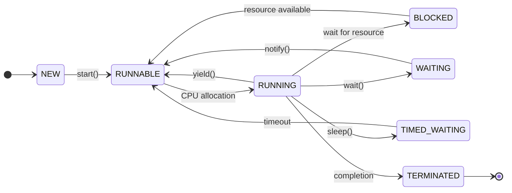

## Question 1(a) [3 marks]

**Differentiate between Procedure Oriented Programming (POP) and object-oriented programming (OOP).**

**Answer**:

**Table:**

| Aspect | POP | OOP |
|--------|-----|-----|
| **Approach** | Top-down approach | Bottom-up approach |
| **Focus** | Functions and procedures | Objects and classes |
| **Data Security** | Less secure, global data | More secure, data encapsulation |
| **Problem Solving** | Divides into functions | Divides into objects |

**Key Points:**

- **POP**: Functions are primary building blocks
- **OOP**: Objects contain both data and methods
- **Reusability**: OOP provides better code reusability

**Mnemonic:** "POP Functions, OOP Objects"

## Question 1(b) [4 marks]

**Enlist and explain the basic concepts of OOP.**

**Answer**:

**Basic OOP Concepts:**

- **Encapsulation**: Binding data and methods together in a class
- **Inheritance**: Creating new classes from existing classes
- **Polymorphism**: Same method name with different implementations
- **Abstraction**: Hiding implementation details from user

**Benefits:**

- **Code Reusability**: Through inheritance and polymorphism
- **Data Security**: Through encapsulation
- **Easy Maintenance**: Modular approach

**Mnemonic:** "Every Intelligent Person Abstracts"

## Question 1(c) [7 marks]

**Define Constructor. Enlist different types of Constructors and explain any 2 of them with a proper example.**

**Answer**:

**Constructor Definition:**
A constructor is a special method that initializes objects when they are created. It has the same name as the class and no return type.

**Types of Constructors:**

- **Default Constructor**: No parameters
- **Parameterized Constructor**: Takes parameters
- **Copy Constructor**: Creates object from another object
- **Private Constructor**: Restricts object creation

**Code Example:**

```java
class Student {
    String name;
    int age;
    
    // Default Constructor
    public Student() {
        name = "Unknown";
        age = 0;
    }
    
    // Parameterized Constructor
    public Student(String n, int a) {
        name = n;
        age = a;
    }
}

class Main {
    public static void main(String[] args) {
        Student s1 = new Student();        // Default
        Student s2 = new Student("John", 20); // Parameterized
    }
}
```

**Key Features:**

- **Automatic Invocation**: Called automatically during object creation
- **No Return Type**: Constructors don't have return type

**Mnemonic:** "Constructors Create Objects"

## Question 1(c OR) [7 marks]

**Explain String class. Enlist different methods of String class and explain any 3 of them with a proper example.**

**Answer**:

**String Class:**
String class in Java represents immutable character sequences. Once created, String objects cannot be modified.

**String Methods:**

| Method | Purpose |
|--------|---------|
| length() | Returns string length |
| charAt(index) | Returns character at index |
| substring(start, end) | Extracts substring |
| indexOf(char) | Finds character position |
| toUpperCase() | Converts to uppercase |

**Code Example:**

```java
public class StringDemo {
    public static void main(String[] args) {
        String str = "Hello World";
        
        // length() method
        System.out.println("Length: " + str.length()); // 11
        
        // charAt() method
        System.out.println("Char at 0: " + str.charAt(0)); // H
        
        // substring() method
        System.out.println("Substring: " + str.substring(0, 5)); // Hello
    }
}
```

**Key Points:**

- **Immutable**: String objects cannot be changed
- **Memory Efficient**: String pool for storage

**Mnemonic:** "Strings Store Text"

## Question 2(a) [3 marks]

**Define Garbage collection. Describe the importance of Garbage collection in JAVA Programming.**

**Answer**:

**Garbage Collection Definition:**
Automatic memory management process that reclaims memory occupied by objects that are no longer referenced.

**Importance:**

- **Automatic Memory Management**: No manual memory deallocation needed
- **Prevents Memory Leaks**: Automatically frees unused memory
- **Application Performance**: Optimizes memory usage

**Benefits:**

- **Programmer Productivity**: Focus on logic, not memory management
- **Reliability**: Reduces crashes due to memory issues

**Mnemonic:** "Garbage Collector Cleans Memory"

## Question 2(b) [4 marks]

**List down the four ways to make an object eligible for garbage collection.**

**Answer**:

**Four Ways for GC Eligibility:**

| Method | Description |
|--------|-------------|
| **Nullifying Reference** | Set object reference to null |
| **Reassigning Reference** | Point reference to another object |
| **Anonymous Objects** | Create objects without reference |
| **Island of Isolation** | Objects refer only to each other |

**Examples:**

- **Nullifying**: `obj = null;`
- **Reassigning**: `obj1 = obj2;`
- **Anonymous**: `new Student();`
- **Island**: Circular references with no external access

**Mnemonic:** "Null References Attract Islands"

## Question 2(c) [7 marks]

**Write a Java Program to demonstrate a static block that gets executed before main. Explain its significance.**

**Answer**:

**Code Example:**

```java
public class StaticBlockDemo {
    static int count;
    
    // Static block
    static {
        System.out.println("Static block executed first");
        count = 10;
        System.out.println("Count initialized to: " + count);
    }
    
    public static void main(String[] args) {
        System.out.println("Main method started");
        System.out.println("Count value: " + count);
    }
}
```

**Output:**

```
Static block executed first
Count initialized to: 10
Main method started
Count value: 10
```

**Significance:**

- **Early Initialization**: Executes before main method
- **Class Loading**: Runs when class is first loaded
- **One-time Execution**: Executes only once per class

**Uses:**

- **Static Variable Initialization**: Initialize static variables
- **Resource Loading**: Load configuration files

**Mnemonic:** "Static Blocks Start Before Main"

## Question 2(a OR) [3 marks]

**Describe Minor/Incremental and Major/Full Garbage collection in JAVA.**

**Answer**:

**Types of Garbage Collection:**

| Type | Description | Frequency |
|------|-------------|-----------|
| **Minor GC** | Cleans young generation | Frequent |
| **Major GC** | Cleans old generation | Less frequent |

**Minor GC:**

- **Target**: Young generation objects
- **Speed**: Fast execution
- **Impact**: Low application pause

**Major GC:**

- **Target**: Old generation objects
- **Speed**: Slower execution
- **Impact**: Higher application pause

**Mnemonic:** "Minor Frequent, Major Slow"

## Question 2(b OR) [4 marks]

**Explicate the finalize() method in java with its advantages.**

**Answer**:

**finalize() Method:**
Special method called by garbage collector before object destruction for cleanup operations.

**Syntax:**

```java
protected void finalize() throws Throwable {
    // Cleanup code
}
```

**Advantages:**

- **Resource Cleanup**: Close files, database connections
- **Memory Management**: Free native resources
- **Safety Net**: Last chance for cleanup

**Example:**

```java
class FileHandler {
    protected void finalize() throws Throwable {
        System.out.println("Cleanup before destruction");
        super.finalize();
    }
}
```

**Mnemonic:** "Finalize Frees Resources"

## Question 2(c OR) [7 marks]

**Explain the syntax of public static void main (String[] args). Write a Java Program to print input taken as command line argument.**

**Answer**:

**Main Method Syntax:**

```java
public static void main(String[] args)
```

**Explanation:**

- **public**: Accessible from anywhere
- **static**: Can be called without object creation
- **void**: No return value
- **main**: Method name recognized by JVM
- **String[] args**: Command line arguments array

**Code Example:**

```java
public class CommandLineDemo {
    public static void main(String[] args) {
        System.out.println("Number of arguments: " + args.length);
        
        if(args.length > 0) {
            System.out.println("Command line arguments:");
            for(int i = 0; i < args.length; i++) {
                System.out.println("Arg " + i + ": " + args[i]);
            }
        } else {
            System.out.println("No arguments provided");
        }
    }
}
```

**Execution:**

```bash
java CommandLineDemo Hello World 123
```

**Output:**

```
Number of arguments: 3
Command line arguments:
Arg 0: Hello
Arg 1: World
Arg 2: 123
```

**Mnemonic:** "Public Static Void Main Args"

## Question 3(a) [3 marks]

**Enlist and Explain various Java access modifier(s).**

**Answer**:

**Java Access Modifiers:**

| Modifier | Class | Package | Subclass | World |
|----------|-------|---------|----------|-------|
| **public** | ✓ | ✓ | ✓ | ✓ |
| **protected** | ✓ | ✓ | ✓ | ✗ |
| **default** | ✓ | ✓ | ✗ | ✗ |
| **private** | ✓ | ✗ | ✗ | ✗ |

**Usage:**

- **public**: Accessible everywhere
- **protected**: Accessible in package and subclasses
- **default**: Package-level access only
- **private**: Class-level access only

**Mnemonic:** "Public Protected Default Private"

## Question 3(b) [4 marks]

**Describe interface in JAVA. Demonstrate inheritance of an interface with an executable example.**

**Answer**:

**Interface in Java:**
A contract that defines method signatures without implementation. Classes implement interfaces to provide method definitions.

**Interface Inheritance Example:**

```java
// Parent interface
interface Animal {
    void sound();
}

// Child interface inheriting from Animal
interface Mammal extends Animal {
    void walk();
}

// Class implementing the child interface
class Dog implements Mammal {
    public void sound() {
        System.out.println("Dog barks");
    }
    
    public void walk() {
        System.out.println("Dog walks on four legs");
    }
}

class Main {
    public static void main(String[] args) {
        Dog d = new Dog();
        d.sound();
        d.walk();
    }
}
```

**Key Features:**

- **Multiple Inheritance**: Interface supports multiple inheritance
- **Contract**: Defines what class must implement

**Mnemonic:** "Interfaces Inherit Contracts"

## Question 3(c) [7 marks]

**Define super keyword and demonstrate the use of super keyword with an executable Java Program**

**Answer**:

**super Keyword:**
References immediate parent class object. Used to access parent class methods, variables, and constructors.

**Code Example:**

```java
class Animal {
    String name = "Animal";
    
    Animal(String type) {
        System.out.println("Animal constructor: " + type);
    }
    
    void sound() {
        System.out.println("Animal makes sound");
    }
}

class Dog extends Animal {
    String name = "Dog";
    
    Dog() {
        super("Mammal");  // Call parent constructor
        System.out.println("Dog constructor");
    }
    
    void sound() {
        super.sound();    // Call parent method
        System.out.println("Dog barks");
    }
    
    void display() {
        System.out.println("Parent name: " + super.name);
        System.out.println("Child name: " + this.name);
    }
}

class Main {
    public static void main(String[] args) {
        Dog d = new Dog();
        d.sound();
        d.display();
    }
}
```

**Uses of super:**

- **Constructor Call**: `super(parameters)`
- **Method Call**: `super.methodName()`
- **Variable Access**: `super.variableName`

**Mnemonic:** "Super Calls Parent"

## Question 3(a OR) [3 marks]

**Explain package in JAVA with workable illustration.**

**Answer**:

**Package in Java:**
A namespace that organizes related classes and interfaces together. Provides access control and namespace management.

**Package Structure:**

```
com.company.project
├── model
│   └── Student.java
├── service
│   └── StudentService.java
└── Main.java
```

**Example:**

```java
// File: com/company/model/Student.java
package com.company.model;

public class Student {
    private String name;
    public String getName() { return name; }
    public void setName(String name) { this.name = name; }
}

// File: Main.java
import com.company.model.Student;

public class Main {
    public static void main(String[] args) {
        Student s = new Student();
        s.setName("John");
    }
}
```

**Benefits:**

- **Organization**: Groups related classes
- **Access Control**: Package-level access

**Mnemonic:** "Packages Organize Classes"

## Question 3(b OR) [4 marks]

**Explain abstract and final keywords with a viable illustration.**

**Answer**:

**Keywords Explanation:**

| Keyword | Purpose | Usage |
|---------|---------|-------|
| **abstract** | Incomplete implementation | Classes and methods |
| **final** | Prevent modification | Classes, methods, variables |

**Code Example:**

```java
// Abstract class
abstract class Shape {
    final double PI = 3.14;  // final variable
    
    abstract void draw();    // abstract method
    
    final void display() {   // final method
        System.out.println("Displaying shape");
    }
}

// Final class
final class Circle extends Shape {
    void draw() {
        System.out.println("Drawing circle");
    }
}

// Cannot extend Circle class due to final
// class Oval extends Circle { } // Error!
```

**Key Points:**

- **abstract**: Must be overridden in subclass
- **final**: Cannot be overridden or extended

**Mnemonic:** "Abstract Allows, Final Forbids"

## Question 3(c OR) [7 marks]

**State Dynamic Method Dispatch in Java Programming language context. Construct an executable program demonstrating Dynamic Method Dispatch.**

**Answer**:

**Dynamic Method Dispatch:**
Runtime polymorphism where method call is resolved during execution based on actual object type, not reference type.

**Code Example:**

```java
// Base class
class Animal {
    void sound() {
        System.out.println("Animal makes sound");
    }
}

// Derived classes
class Dog extends Animal {
    void sound() {
        System.out.println("Dog barks");
    }
}

class Cat extends Animal {
    void sound() {
        System.out.println("Cat meows");
    }
}

class DynamicDispatchDemo {
    public static void main(String[] args) {
        Animal ref;  // Reference variable
        
        // Runtime method resolution
        ref = new Dog();
        ref.sound();  // Calls Dog's sound()
        
        ref = new Cat();
        ref.sound();  // Calls Cat's sound()
        
        ref = new Animal();
        ref.sound();  // Calls Animal's sound()
    }
}
```

**Output:**

```
Dog barks
Cat meows
Animal makes sound
```

**Key Features:**

- **Runtime Resolution**: Method determined at runtime
- **Polymorphism**: Same interface, different behavior
- **Virtual Method Table**: JVM uses vtable for method lookup

**Mnemonic:** "Dynamic Dispatch Decides Runtime"

## Question 4(a) [3 marks]

**Explain throw and finally keywords in Exception Handling.**

**Answer**:

**Exception Handling Keywords:**

| Keyword | Purpose | Usage |
|---------|---------|-------|
| **throw** | Manually throw exception | `throw new Exception();` |
| **finally** | Always executed block | After try-catch |

**Examples:**

```java
// throw example
if(age < 0) {
    throw new IllegalArgumentException("Invalid age");
}

// finally example
try {
    // risky code
} catch(Exception e) {
    // handle exception
} finally {
    // cleanup code - always executes
}
```

**Key Points:**

- **throw**: Creates and throws exception explicitly
- **finally**: Executes regardless of exception occurrence

**Mnemonic:** "Throw Creates, Finally Cleans"

## Question 4(b) [4 marks]

**Write a program demonstrating try…catch block in JAVA**

**Answer**:

**Code Example:**

```java
public class TryCatchDemo {
    public static void main(String[] args) {
        try {
            int[] arr = {1, 2, 3};
            System.out.println("Array element: " + arr[5]); // Index out of bounds
            
            int result = 10 / 0; // Division by zero
            
        } catch(ArrayIndexOutOfBoundsException e) {
            System.out.println("Array index error: " + e.getMessage());
            
        } catch(ArithmeticException e) {
            System.out.println("Math error: " + e.getMessage());
            
        } catch(Exception e) {
            System.out.println("General error: " + e.getMessage());
        }
        
        System.out.println("Program continues...");
    }
}
```

**Output:**

```
Array index error: Index 5 out of bounds for length 3
Program continues...
```

**Benefits:**

- **Exception Handling**: Graceful error management
- **Program Continuity**: Program doesn't crash

**Mnemonic:** "Try Code, Catch Errors"

## Question 4(c) [7 marks]

**Define ArrayIndexOutOfBoundsException Exception. Write a workable JAVA program exhibiting it. Also mention input(s) which will raise this Exception.**

**Answer**:

**ArrayIndexOutOfBoundsException:**
Runtime exception thrown when trying to access array element with invalid index (negative or >= array length).

**Code Example:**

```java
public class ArrayExceptionDemo {
    public static void main(String[] args) {
        int[] numbers = {10, 20, 30, 40, 50}; // Array size: 5
        
        try {
            System.out.println("Array length: " + numbers.length);
            
            // Valid access
            System.out.println("Element at index 2: " + numbers[2]);
            
            // Invalid access - will throw exception
            System.out.println("Element at index 10: " + numbers[10]);
            
        } catch(ArrayIndexOutOfBoundsException e) {
            System.out.println("Exception caught: " + e.getMessage());
            System.out.println("Invalid index accessed!");
        }
        
        System.out.println("Program completed successfully");
    }
}
```

**Inputs that raise exception:**

- **Negative Index**: `arr[-1]`
- **Index >= Length**: `arr[5]` for array of size 5
- **Empty Array Access**: `arr[0]` for empty array

**Prevention:**

- **Bounds Checking**: Verify index before access
- **Array Length**: Use `array.length` property

**Mnemonic:** "Array Bounds Break Programs"

## Question 4(a OR) [3 marks]

**Draw and explain the life cycle of Thread in JAVA with example.**

**Answer**:

**Thread Life Cycle:**



**States:**

- **NEW**: Thread created but not started
- **RUNNABLE**: Ready to run or running
- **BLOCKED**: Waiting for resource
- **WAITING**: Waiting indefinitely
- **TIMED_WAITING**: Waiting for specific time
- **TERMINATED**: Thread execution completed

**Mnemonic:** "New Runs, Blocks Wait, Terminates"

## Question 4(b OR) [4 marks]

**Explain JAVA Optional class. Describe the OfNullable() method of Optional class.**

**Answer**:

**Optional Class:**
Container object that may or may not contain a value. Helps avoid NullPointerException and makes code more readable.

**ofNullable() Method:**
Returns Optional containing value if non-null, otherwise returns empty Optional.

**Code Example:**

```java
import java.util.Optional;

public class OptionalDemo {
    public static void main(String[] args) {
        String name1 = "John";
        String name2 = null;
        
        // ofNullable() examples
        Optional<String> opt1 = Optional.ofNullable(name1);
        Optional<String> opt2 = Optional.ofNullable(name2);
        
        System.out.println("opt1 present: " + opt1.isPresent()); // true
        System.out.println("opt2 present: " + opt2.isPresent()); // false
        
        // Safe value retrieval
        System.out.println("Name1: " + opt1.orElse("Unknown"));
        System.out.println("Name2: " + opt2.orElse("Unknown"));
    }
}
```

**Benefits:**

- **Null Safety**: Prevents NullPointerException
- **Readable Code**: Clear indication of optional values

**Mnemonic:** "Optional Offers Null Safety"

## Question 4(c OR) [7 marks]

**Write a workable JAVA program showcasing nested try…catch block.**

**Answer**:

**Code Example:**

```java
public class NestedTryCatchDemo {
    public static void main(String[] args) {
        try {
            System.out.println("Outer try block started");
            
            int[] numbers = {10, 20, 30};
            
            try {
                System.out.println("Inner try block started");
                
                // This will cause ArrayIndexOutOfBoundsException
                System.out.println("Accessing index 5: " + numbers[5]);
                
                // This line won't execute
                int result = 100 / 0;
                
            } catch(ArrayIndexOutOfBoundsException e) {
                System.out.println("Inner catch: Array index error - " + e.getMessage());
                
                // Throwing new exception from inner catch
                throw new RuntimeException("Error in inner block");
            }
            
            System.out.println("After inner try-catch");
            
        } catch(RuntimeException e) {
            System.out.println("Outer catch: Runtime error - " + e.getMessage());
            
        } catch(Exception e) {
            System.out.println("Outer catch: General error - " + e.getMessage());
            
        } finally {
            System.out.println("Outer finally: Cleanup operations");
        }
        
        System.out.println("Program execution completed");
    }
}
```

**Output:**

```
Outer try block started
Inner try block started
Inner catch: Array index error - Index 5 out of bounds for length 3
Outer catch: Runtime error - Error in inner block
Outer finally: Cleanup operations
Program execution completed
```

**Key Features:**

- **Multiple Levels**: Inner and outer exception handling
- **Exception Propagation**: Inner exceptions can be caught by outer blocks
- **Specific Handling**: Different exceptions at different levels

**Mnemonic:** "Nested Try Catches Layers"

## Question 5(a) [3 marks]

**Explain thread synchronization with an executable code in JAVA.**

**Answer**:

**Thread Synchronization:**
Mechanism to control access to shared resources by multiple threads to prevent data inconsistency and race conditions.

**Code Example:**

```java
class Counter {
    private int count = 0;
    
    // Synchronized method
    public synchronized void increment() {
        count++;
    }
    
    public int getCount() {
        return count;
    }
}

class SyncDemo extends Thread {
    Counter counter;
    
    SyncDemo(Counter c) {
        counter = c;
    }
    
    public void run() {
        for(int i = 0; i < 1000; i++) {
            counter.increment();
        }
    }
}
```

**Benefits:**

- **Data Consistency**: Prevents race conditions
- **Thread Safety**: Safe access to shared resources

**Mnemonic:** "Synchronize Secures Shared Data"

## Question 5(b) [4 marks]

**Enlist various stream classes in JAVA. Explain anyone with an executable example.**

**Answer**:

**Stream Classes:**

| Class | Purpose | Type |
|-------|---------|------|
| **FileInputStream** | Read bytes from file | Input |
| **FileOutputStream** | Write bytes to file | Output |
| **BufferedReader** | Buffered character reading | Input |
| **PrintWriter** | Formatted text output | Output |

**FileInputStream Example:**

```java
import java.io.*;

public class StreamDemo {
    public static void main(String[] args) {
        try {
            // Create file and write data
            FileOutputStream fos = new FileOutputStream("test.txt");
            String data = "Hello World";
            fos.write(data.getBytes());
            fos.close();
            
            // Read file using FileInputStream
            FileInputStream fis = new FileInputStream("test.txt");
            int ch;
            while((ch = fis.read()) != -1) {
                System.out.print((char)ch);
            }
            fis.close();
            
        } catch(IOException e) {
            e.printStackTrace();
        }
    }
}
```

**Stream Features:**

- **Byte-oriented**: Handles binary data
- **Character-oriented**: Handles text data

**Mnemonic:** "Streams Send Data"

## Question 5(c) [7 marks]

**Write a JAVA program extending Thread class to display odd numbers between given two integer numbers using thread.**

**Answer**:

**Code Example:**

```java
class OddNumberThread extends Thread {
    private int start;
    private int end;
    
    public OddNumberThread(int start, int end) {
        this.start = start;
        this.end = end;
    }
    
    @Override
    public void run() {
        System.out.println("Thread started: " + Thread.currentThread().getName());
        System.out.println("Finding odd numbers between " + start + " and " + end);
        
        for(int i = start; i <= end; i++) {
            if(i % 2 != 0) {  // Check if number is odd
                System.out.println("Odd number: " + i);
                try {
                    Thread.sleep(500);  // Pause for 500ms
                } catch(InterruptedException e) {
                    System.out.println("Thread interrupted");
                }
            }
        }
        
        System.out.println("Thread completed: " + Thread.currentThread().getName());
    }
}

public class OddNumberDemo {
    public static void main(String[] args) {
        // Create thread objects
        OddNumberThread thread1 = new OddNumberThread(1, 10);
        OddNumberThread thread2 = new OddNumberThread(11, 20);
        
        // Set thread names
        thread1.setName("OddThread-1");
        thread2.setName("OddThread-2");
        
        // Start threads
        thread1.start();
        thread2.start();
        
        try {
            // Wait for threads to complete
            thread1.join();
            thread2.join();
        } catch(InterruptedException e) {
            e.printStackTrace();
        }
        
        System.out.println("All threads completed!");
    }
}
```

**Output:**

```
Thread started: OddThread-1
Finding odd numbers between 1 and 10
Thread started: OddThread-2
Finding odd numbers between 11 and 20
Odd number: 1
Odd number: 11
Odd number: 3
Odd number: 13
...
```

**Thread Features:**

- **Concurrent Execution**: Multiple threads run simultaneously
- **Thread Extension**: Extends Thread class for custom behavior

**Mnemonic:** "Threads Take Turns"

## Question 5(a OR) [3 marks]

**Explain join() and alive() methods of Thread class in JAVA.**

**Answer**:

**Thread Methods:**

| Method | Purpose | Return Type |
|--------|---------|-------------|
| **join()** | Wait for thread completion | void |
| **isAlive()** | Check if thread is running | boolean |

**Method Explanations:**

- **join()**: Current thread waits until the specified thread completes execution
- **isAlive()**: Returns true if thread is still running, false if completed

**Code Example:**

```java
class TestThread extends Thread {
    public void run() {
        for(int i = 1; i <= 3; i++) {
            System.out.println("Running: " + i);
            try { sleep(1000); } catch(InterruptedException e) {}
        }
    }
}

public class Main {
    public static void main(String[] args) throws InterruptedException {
        TestThread t = new TestThread();
        System.out.println("Before start: " + t.isAlive()); // false
        
        t.start();
        System.out.println("After start: " + t.isAlive()); // true
        
        t.join(); // Wait for completion
        System.out.println("After join: " + t.isAlive()); // false
    }
}
```

**Mnemonic:** "Join Waits, Alive Checks"

## Question 5(b OR) [4 marks]

**Define user-defined exceptions in JAVA. Write a program to show user defined exception.**

**Answer**:

**User-defined Exceptions:**
Custom exception classes created by extending Exception class or its subclasses to handle specific application errors.

**Code Example:**

```java
// Custom exception class
class AgeValidationException extends Exception {
    public AgeValidationException(String message) {
        super(message);
    }
}

class Person {
    private int age;
    
    public void setAge(int age) throws AgeValidationException {
        if(age < 0) {
            throw new AgeValidationException("Age cannot be negative: " + age);
        }
        if(age > 150) {
            throw new AgeValidationException("Age cannot exceed 150: " + age);
        }
        this.age = age;
        System.out.println("Valid age set: " + age);
    }
    
    public int getAge() {
        return age;
    }
}

public class UserDefinedExceptionDemo {
    public static void main(String[] args) {
        Person person = new Person();
        
        try {
            person.setAge(25);    // Valid age
            person.setAge(-5);    // Invalid age - throws exception
            
        } catch(AgeValidationException e) {
            System.out.println("Custom Exception: " + e.getMessage());
        }
        
        try {
            person.setAge(200);   // Invalid age - throws exception
        } catch(AgeValidationException e) {
            System.out.println("Custom Exception: " + e.getMessage());
        }
    }
}
```

**Output:**

```
Valid age set: 25
Custom Exception: Age cannot be negative: -5
Custom Exception: Age cannot exceed 150: 200
```

**Benefits:**

- **Specific Error Handling**: Handle application-specific errors
- **Better Code Organization**: Separate exception logic

**Mnemonic:** "Custom Exceptions Catch Specific Errors"

## Question 5(c OR) [7 marks]

**Write a JAVA program to copy content of file a.txt to b.txt.**

**Answer**:

**Code Example:**

```java
import java.io.*;

public class FileCopyDemo {
    public static void main(String[] args) {
        String sourceFile = "a.txt";
        String targetFile = "b.txt";
        
        // Method 1: Using FileInputStream and FileOutputStream
        copyUsingStream(sourceFile, targetFile);
        
        // Method 2: Using BufferedReader and PrintWriter
        copyUsingBuffered(sourceFile, targetFile);
    }
    
    // Method 1: Byte-by-byte copy
    public static void copyUsingStream(String source, String target) {
        try {
            // Create source file with sample data
            FileOutputStream createFile = new FileOutputStream(source);
            String data = "Hello World!\nThis is sample text.\nJava File Operations.";
            createFile.write(data.getBytes());
            createFile.close();
            System.out.println("Source file created with sample data");
            
            // Copy file
            FileInputStream fis = new FileInputStream(source);
            FileOutputStream fos = new FileOutputStream(target);
            
            int ch;
            while((ch = fis.read()) != -1) {
                fos.write(ch);
            }
            
            fis.close();
            fos.close();
            System.out.println("File copied successfully using Stream");
            
        } catch(IOException e) {
            System.out.println("Error during file copy: " + e.getMessage());
        }
    }
    
    // Method 2: Line-by-line copy with buffering
    public static void copyUsingBuffered(String source, String target) {
        try {
            BufferedReader reader = new BufferedReader(new FileReader(source));
            PrintWriter writer = new PrintWriter(new FileWriter("buffered_" + target));
            
            String line;
            while((line = reader.readLine()) != null) {
                writer.println(line);
            }
            
            reader.close();
            writer.close();
            System.out.println("File copied successfully using BufferedReader");
            
            // Display copied content
            displayFileContent("buffered_" + target);
            
        } catch(IOException e) {
            System.out.println("Error during buffered copy: " + e.getMessage());
        }
    }
    
    // Helper method to display file content
    public static void displayFileContent(String filename) {
        try {
            System.out.println("\nContent of " + filename + ":");
            BufferedReader reader = new BufferedReader(new FileReader(filename));
            String line;
            while((line = reader.readLine()) != null) {
                System.out.println(line);
            }
            reader.close();
            
        } catch(IOException e) {
            System.out.println("Error reading file: " + e.getMessage());
        }
    }
}
```

**Output:**

```
Source file created with sample data
File copied successfully using Stream
File copied successfully using BufferedReader

Content of buffered_b.txt:
Hello World!
This is sample text.
Java File Operations.
```

**File Operations:**

- **FileInputStream/FileOutputStream**: Byte-level operations
- **BufferedReader/PrintWriter**: Line-level operations with buffering
- **Exception Handling**: Proper error management

**Key Features:**

- **Multiple Methods**: Different approaches for file copying
- **Error Handling**: Try-catch blocks for IOException
- **Resource Management**: Proper closing of file streams

**Best Practices:**

- **Close Streams**: Always close file streams after use
- **Exception Handling**: Handle IOException properly
- **Buffer Usage**: Use buffered streams for better performance

**Mnemonic:** "Files Flow From Source To Target"
