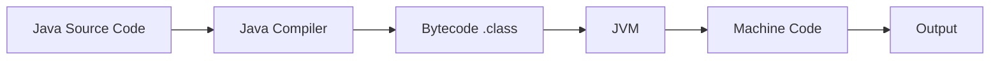
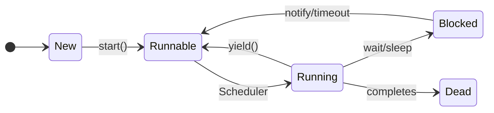
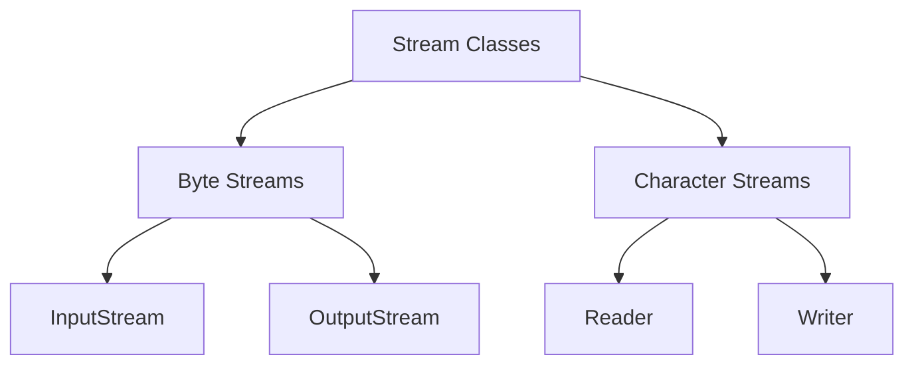

## પ્રશ્ન 1(અ) [3 ગુણ]

**OOP ના બેસિક કન્સેપ્ટની યાદી આપો. કોઈપણ એક વિગતવાર સમજાવો.**

**જવાબ**:

| મૂળભૂત OOP કન્સેપ્ટ્સ | વર્ણન |
|-------------------|-------------|
| **Class** | ઓબ્જેક્ટ માટે બ્લુપ્રિન્ટ |
| **Object** | ક્લાસનું ઇન્સ્ટન્સ |
| **Encapsulation** | ડેટા છુપાવવાની પદ્ધતિ |
| **Inheritance** | પેરેન્ટ થી પ્રોપર્ટીઝ મેળવવી |
| **Polymorphism** | એક ઇન્ટરફેસ, વિવિધ સ્વરૂપો |
| **Abstraction** | ઇમ્પ્લિમેન્ટેશન વિગતો છુપાવવા |

**Encapsulation** એ ડેટા અને મેથડ્સને એક સાથે ક્લાસમાં બાંધવાની અને બાહ્ય વિશ્વથી આંતરિક ઇમ્પ્લિમેન્ટેશન છુપાવવાની પ્રક્રિયા છે. તે વેરિયેબલ્સને private બનાવીને અને public મેથડ્સ દ્વારા એક્સેસ કરીને ડેટા સિક્યોરિટી પ્રદાન કરે છે.

**મેમરી ટ્રીક:** "CEO-IPA" (Class, Encapsulation, Object, Inheritance, Polymorphism, Abstraction)

## પ્રશ્ન 1(બ) [4 ગુણ]

**JVM ને વિગતવાર સમજાવો.**

**જવાબ**:



**JVM (Java Virtual Machine)** એક રનટાઇમ એન્વાયરનમેન્ટ છે જે Java bytecode ને એક્ઝિક્યુટ કરે છે. તે bytecode ને મશીન-સ્પેસિફિક કોડમાં કન્વર્ટ કરીને પ્લેટફોર્મ ઇન્ડિપેન્ડન્સ પ્રદાન કરે છે.

- **Class Loader**: ક્લાસ ફાઇલ્સને મેમરીમાં લોડ કરે છે
- **Memory Management**: heap અને stack મેમરી હેન્ડલ કરે છે
- **Execution Engine**: bytecode instructions ને એક્ઝિક્યુટ કરે છે
- **Garbage Collector**: ઓટોમેટિકલી મેમરી મેનેજ કરે છે

**મેમરી ટ્રીક:** "CMEG" (Class loader, Memory, Execution, Garbage collection)

## પ્રશ્ન 1(ક) [7 ગુણ]

**Fibonacci series પ્રિન્ટ કરવા માટે n ટર્મ્સ માટે Java માં પ્રોગ્રામ લખો.**

**જવાબ**:

```java
public class Fibonacci {
    public static void main(String[] args) {
        int n = 10, first = 0, second = 1;
        System.out.print("Fibonacci Series: " + first + " " + second);
        
        for(int i = 2; i < n; i++) {
            int next = first + second;
            System.out.print(" " + next);
            first = second;
            second = next;
        }
    }
}
```

- **લોજિક**: 0,1 થી શરૂ કરીને પાછલા બે નંબર્સ ઉમેરો
- **લૂપ**: n ટર્મ્સ માટે ચાલુ રહે છે
- **વેરિયેબલ્સ**: first, second, next કેલ્ક્યુલેશન માટે

**મેમરી ટ્રીક:** "FSN" (First, Second, Next)

## પ્રશ્ન 1(ક OR) [7 ગુણ]

**કમાન્ડ લાઇન arguments નો ઉપયોગ કરીને કોઈપણ દસ સંખ્યાઓ માંથી ન્યૂનતમ શોધવા માટે Java માં પ્રોગ્રામ લખો.**

**જવાબ**:

```java
public class FindMinimum {
    public static void main(String[] args) {
        if(args.length != 10) {
            System.out.println("Please enter exactly 10 numbers");
            return;
        }
        
        int min = Integer.parseInt(args[0]);
        for(int i = 1; i < args.length; i++) {
            int num = Integer.parseInt(args[i]);
            if(num < min) {
                min = num;
            }
        }
        System.out.println("Minimum number: " + min);
    }
}
```

- **કમાન્ડ લાઇન**: java FindMinimum 5 3 8 1 9 2 7 4 6 0
- **લોજિક**: દરેક નંબરને કરન્ટ મિનિમમ સાથે કમ્પેર કરો
- **મેથડ**: Integer.parseInt() સ્ટ્રિંગને integer માં કન્વર્ટ કરે છે

**મેમરી ટ્રીક:** "CIM" (Check, Integer.parseInt, Minimum)

## પ્રશ્ન 2(અ) [3 ગુણ]

**Wrapper ક્લાસ શું છે? ઉદાહરણ સાથે સમજાવો.**

**જવાબ**:

| Primitive | Wrapper Class |
|-----------|---------------|
| int | Integer |
| char | Character |
| boolean | Boolean |
| double | Double |

**Wrapper classes** primitive ડેટા ટાઇપ્સને ઓબ્જેક્ટ્સમાં કન્વર્ટ કરે છે. તેઓ utility મેથડ્સ પ્રદાન કરે છે અને primitives ને collections માં ઉપયોગ કરવા માટે સક્ષમ બનાવે છે.

**ઉદાહરણ**: `Integer obj = new Integer(25);` અથવા `Integer obj = 25;` (autoboxing)

**મેમરી ટ્રીક:** "POC" (Primitive to Object Conversion)

## પ્રશ્ન 2(બ) [4 ગુણ]

**Java ના વિવિધ લક્ષણોની યાદી આપો. કોઈપણ બે સમજાવો.**

**જવાબ**:

| Java ના લક્ષણો | વર્ણન |
|---------------|-------------|
| **Platform Independent** | એકવાર લખો, ગમે ત્યાં ચલાવો |
| **Object Oriented** | બધું ઓબ્જેક્ટ છે |
| **Simple** | સરળ સિન્ટેક્સ, પોઇન્ટર્સ નથી |
| **Secure** | Bytecode વેરિફિકેશન |
| **Robust** | મજબૂત મેમરી મેનેજમેન્ટ |
| **Multithreaded** | સમાંતર એક્ઝિક્યુશન |

**Platform Independence**: Java સોર્સ કોડ bytecode માં કમ્પાઇલ થાય છે જે JVM ઇન્સ્ટોલ કરેલા કોઈપણ પ્લેટફોર્મ પર ચાલે છે.

**Object Oriented**: Java બહેતર કોડ સંગઠન માટે encapsulation, inheritance, અને polymorphism જેવા OOP સિદ્ધાંતોને અનુસરે છે.

**મેમરી ટ્રીક:** "POSSMR" (Platform, Object, Simple, Secure, Multithreaded, Robust)

## પ્રશ્ન 2(ક) [7 ગુણ]

**Method overload શું છે? ઉદાહરણ સાથે સમજાવો.**

**જવાબ**:

**Method Overloading** એ જ ક્લાસમાં સમાન નામ પરંતુ અલગ પેરામીટર્સ સાથે બહુવિધ મેથડ્સની મંજૂરી આપે છે.

```java
class Calculator {
    public int add(int a, int b) {
        return a + b;
    }
    
    public double add(double a, double b) {
        return a + b;
    }
    
    public int add(int a, int b, int c) {
        return a + b + c;
    }
}
```

- **નિયમો**: અલગ પેરામીટર ટાઇપ્સ અથવા પેરામીટર્સની સંખ્યા
- **Compile Time**: કમ્પાઇલેશન દરમિયાન નિર્ણય લેવાય છે
- **Return Type**: માત્ર તફાવત હોઈ શકતો નથી

**મેમરી ટ્રીક:** "SNRT" (Same Name, different paRameters, compile Time)

## પ્રશ્ન 2(અ OR) [3 ગુણ]

**Java માં Garbage collection સમજાવો.**

**જવાબ**:

```goat
Memory Areas:
┌─────────────┐
│    Heap     │ ← Objects stored here
├─────────────┤
│   Stack     │ ← Method calls
├─────────────┤
│   Method    │ ← Class definitions
│    Area     │
└─────────────┘
```

**Garbage Collection** અનરેફરન્સ્ડ ઓબ્જેક્ટ્સની મેમરી ઓટોમેટિકલી deallocate કરે છે. JVM પીરિયોડિકલી garbage collector ચલાવીને heap મેમરી મુક્ત કરે છે.

- **ઓટોમેટિક**: મેન્યુઅલ મેમરી મેનેજમેન્ટની જરૂર નથી
- **Mark and Sweep**: અનરેફરન્સ્ડ ઓબ્જેક્ટ્સને માર્ક કરે છે, પછી દૂર કરે છે

**મેમરી ટ્રીક:** "ARMS" (Automatic Reference Management System)

## પ્રશ્ન 2(બ OR) [4 ગુણ]

**final કીવર્ડ ઉદાહરણ સાથે સમજાવો.**

**જવાબ**:

| ઉપયોગ | વર્ણન | ઉદાહરણ |
|-------|-------------|---------|
| **final variable** | બદલી શકાતું નથી | `final int x = 10;` |
| **final method** | ઓવરરાઇડ થઈ શકતું નથી | `final void display()` |
| **final class** | inherit થઈ શકતું નથી | `final class MyClass` |

**ઉદાહરણ**:

```java
final class FinalClass {
    final int value = 100;
    final void show() {
        System.out.println("Final method");
    }
}
```

**મેમરી ટ્રીક:** "VCM" (Variable constant, Class not inherited, Method not overridden)

## પ્રશ્ન 2(ક OR) [7 ગુણ]

**કન્સ્ટ્રક્ટર શું છે? parameterized કન્સ્ટ્રક્ટરને ઉદાહરણ સાથે સમજાવો.**

**જવાબ**:

**Constructor** એક વિશેષ મેથડ છે જે ઓબ્જેક્ટ્સ બનાવવામાં આવે ત્યારે initialize કરે છે. તેનું નામ ક્લાસ જેવું જ હોય છે અને કોઈ return type નથી.

```java
class Student {
    String name;
    int age;
    
    // Parameterized Constructor
    public Student(String n, int a) {
        name = n;
        age = a;
    }
    
    public void display() {
        System.out.println("Name: " + name + ", Age: " + age);
    }
}

class Main {
    public static void main(String[] args) {
        Student s1 = new Student("John", 20);
        s1.display();
    }
}
```

- **હેતુ**: ઓબ્જેક્ટને સ્પેસિફિક વેલ્યુઝ સાથે initialize કરવો
- **પેરામીટર્સ**: initial state સેટ કરવા માટે arguments સ્વીકારે છે
- **ઓટોમેટિક**: ઓબ્જેક્ટ બનાવવામાં આવે ત્યારે ઓટોમેટિકલી કોલ થાય છે

**મેમરી ટ્રીક:** "SPA" (Same name, Parameters, Automatic call)

## પ્રશ્ન 3(અ) [3 ગુણ]

**super કીવર્ડ ઉદાહરણ સાથે સમજાવો.**

**જવાબ**:

**super કીવર્ડ** પેરેન્ટ ક્લાસના મેમ્બર્સ અને કન્સ્ટ્રક્ટરનો સંદર્ભ આપે છે. તે પેરેન્ટ અને ચાઇલ્ડ ક્લાસ વચ્ચેના naming conflicts ને ઉકેલે છે.

```java
class Parent {
    int x = 10;
}
class Child extends Parent {
    int x = 20;
    void display() {
        System.out.println(super.x); // 10
        System.out.println(x);       // 20
    }
}
```

- **super.variable**: પેરેન્ટ ક્લાસ variable ને એક્સેસ કરે છે
- **super.method()**: પેરેન્ટ ક્લાસ method ને કોલ કરે છે
- **super()**: પેરેન્ટ ક્લાસ constructor ને કોલ કરે છે

**મેમરી ટ્રીક:** "VMC" (Variable, Method, Constructor)

## પ્રશ્ન 3(બ) [4 ગુણ]

**inheritance ના વિવિધ પ્રકારોની યાદી આપો. multilevel inheritance સમજાવો.**

**જવાબ**:

| Inheritance ના પ્રકારો | વર્ણન |
|------------------|-------------|
| **Single** | એક પેરેન્ટ, એક ચાઇલ્ડ |
| **Multilevel** | inheritance ની ચેઇન |
| **Hierarchical** | એક પેરેન્ટ, બહુવિધ બાળકો |
| **Multiple** | બહુવિધ પેરેન્ટ્સ (interfaces દ્વારા) |


**Multilevel Inheritance**: ક્લાસ બીજી ક્લાસથી inherit કરે છે જે પોતે બીજી ક્લાસથી inherit કરે છે, ચેઇન બનાવે છે.

```java
class Animal {
    void eat() { System.out.println("Eating"); }
}
class Mammal extends Animal {
    void walk() { System.out.println("Walking"); }
}
class Dog extends Mammal {
    void bark() { System.out.println("Barking"); }
}
```

**મેમરી ટ્રીક:** "SMHM" (Single, Multilevel, Hierarchical, Multiple)

## પ્રશ્ન 3(ક) [7 ગુણ]

**Interface શું છે? ઉદાહરણ સાથે multiple inheritance સમજાવો.**

**જવાબ**:

**Interface** એક કોન્ટ્રાક્ટ છે જે વ્યાખ્યાયિત કરે છે કે ક્લાસે કયા મેથડ્સ implement કરવા જોઈએ. તેમાં માત્ર abstract methods અને constants હોય છે.

```java
interface Flyable {
    void fly();
}

interface Swimmable {
    void swim();
}

class Duck implements Flyable, Swimmable {
    public void fly() {
        System.out.println("Duck is flying");
    }
    
    public void swim() {
        System.out.println("Duck is swimming");
    }
}
```

**Multiple Inheritance**: ક્લાસ બહુવિધ interfaces implement કરી શકે છે, behavior નું multiple inheritance પ્રાપ્ત કરે છે.

- **Abstract Methods**: બધા મેથડ્સ ડિફોલ્ટ રીતે abstract હોય છે
- **Constants**: બધા variables public, static, final હોય છે
- **implements**: interface implement કરવા માટેનો કીવર્ડ

**મેમરી ટ્રીક:** "ACI" (Abstract methods, Constants, implements keyword)

## પ્રશ્ન 3(અ OR) [3 ગુણ]

**static કીવર્ડ ઉદાહરણ સાથે સમજાવો.**

**જવાબ**:

**static કીવર્ડ** ક્લાસ-લેવલ મેમ્બર્સ બનાવે છે જે instances ને બદલે ક્લાસના હોય છે. ક્લાસ લોડ થાય ત્યારે એકવાર મેમરી allocate થાય છે.

```java
class Counter {
    static int count = 0;
    static void increment() {
        count++;
    }
}
```

- **static variable**: બધા ઓબ્જેક્ટ્સ વચ્ચે શેર થાય છે
- **static method**: ઓબ્જેક્ટ બનાવ્યા વિના કોલ કરી શકાય છે
- **મેમરી**: method area માં allocate થાય છે

**મેમરી ટ્રીક:** "SOM" (Shared, Object not needed, Method area)

## પ્રશ્ન 3(બ OR) [4 ગુણ]

**Java માં વિવિધ એક્સેસ કંટ્રોલ સમજાવો.**

**જવાબ**:

| Access Modifier | Same Class | Same Package | Subclass | Different Package |
|----------------|------------|--------------|----------|-------------------|
| **private** | ✓ | ✗ | ✗ | ✗ |
| **default** | ✓ | ✓ | ✗ | ✗ |
| **protected** | ✓ | ✓ | ✓ | ✗ |
| **public** | ✓ | ✓ | ✓ | ✓ |

**Access Control** ક્લાસિસ, મેથડ્સ અને variables ની visibility અને accessibility નક્કી કરે છે.

**મેમરી ટ્રીક:** "PriDef ProPub" (Private, Default, Protected, Public)

## પ્રશ્ન 3(ક OR) [7 ગુણ]

**પેકેજ શું છે? પેકેજ બનાવવાના પગલાં લખો અને તેનું ઉદાહરણ આપો.**

**જવાબ**:

**Package** એક namespace છે જે સંબંધિત ક્લાસિસ અને interfaces ને ગોઠવે છે. તે access protection અને namespace management પ્રદાન કરે છે.

**પેકેજ બનાવવાના પગલાં**:

1. ફાઇલની ટોચે `package` statement નો ઉપયોગ કરો
2. પેકેજ નામને મેચ કરતી directory structure બનાવો
3. `-d` ઓપ્શન સાથે કમ્પાઇલ કરો
4. અન્ય ફાઇલ્સમાં પેકેજ import કરો

```java
// File: com/mycompany/MyClass.java
package com.mycompany;

public class MyClass {
    public void display() {
        System.out.println("Package example");
    }
}

// પેકેજનો ઉપયોગ
import com.mycompany.MyClass;

class Main {
    public static void main(String[] args) {
        MyClass obj = new MyClass();
        obj.display();
    }
}
```

**કમ્પાઇલેશન**: `javac -d . MyClass.java`

**મેમરી ટ્રીક:** "PDCI" (Package statement, Directory, Compile, Import)

## પ્રશ્ન 4(અ) [3 ગુણ]

**યોગ્ય ઉદાહરણ સાથે thread ની પ્રાથમિકતાઓ સમજાવો.**

**જવાબ**:

**Thread Priority** threads ના execution order નક્કી કરે છે. Java 1 (સૌથી નીચું) થી 10 (સૌથી ઊંચું) સુધી 10 priority levels પ્રદાન કરે છે.

```java
class MyThread extends Thread {
    public void run() {
        System.out.println(getName() + " Priority: " + getPriority());
    }
}

class Main {
    public static void main(String[] args) {
        MyThread t1 = new MyThread();
        MyThread t2 = new MyThread();
        
        t1.setPriority(Thread.MIN_PRIORITY); // 1
        t2.setPriority(Thread.MAX_PRIORITY); // 10
        
        t1.start();
        t2.start();
    }
}
```

**Priority Constants**: MIN_PRIORITY (1), NORM_PRIORITY (5), MAX_PRIORITY (10)

**મેમરી ટ્રીક:** "MNM" (MIN, NORM, MAX)

## પ્રશ્ન 4(બ) [4 ગુણ]

**Thread શું છે? Thread લાઇફ સાઇકલ સમજાવો.**

**જવાબ**:



**Thread** એક lightweight subprocess છે જે પ્રોગ્રામની અંદર concurrent execution ને સક્ષમ બનાવે છે.

**Thread Life Cycle States**:

- **New**: Thread બનાવ્યો પરંતુ શરૂ નથી કર્યો
- **Runnable**: ચલાવવા માટે તૈયાર, CPU ની રાહ જોઈ રહ્યો
- **Running**: હાલમાં execute થઈ રહ્યો
- **Blocked**: resource અથવા I/O ની રાહ જોઈ રહ્યો
- **Dead**: Thread execution પૂર્ણ થયું

**મેમરી ટ્રીક:** "NRRBD" (New, Runnable, Running, Blocked, Dead)

## પ્રશ્ન 4(ક) [7 ગુણ]

**Java માં એક પ્રોગ્રામ લખો જે Thread ક્લાસ implement કરીને બહુવિધ threads બનાવે છે.**

**જવાબ**:

```java
class MyThread extends Thread {
    private String threadName;
    
    public MyThread(String name) {
        threadName = name;
        setName(threadName);
    }
    
    public void run() {
        for(int i = 1; i <= 5; i++) {
            System.out.println(threadName + " - Count: " + i);
            try {
                Thread.sleep(1000);
            } catch(InterruptedException e) {
                System.out.println(threadName + " interrupted");
            }
        }
        System.out.println(threadName + " completed");
    }
}

class Main {
    public static void main(String[] args) {
        MyThread thread1 = new MyThread("Thread-1");
        MyThread thread2 = new MyThread("Thread-2");
        MyThread thread3 = new MyThread("Thread-3");
        
        thread1.start();
        thread2.start();
        thread3.start();
    }
}
```

- **extends Thread**: Thread ક્લાસની કાર્યક્ષમતા inherit કરે છે
- **Override run()**: Thread execution લોજિક વ્યાખ્યાયિત કરે છે
- **start()**: Thread execution શરૂ કરે છે

**મેમરી ટ્રીક:** "EOS" (Extends, Override run, Start method)

## પ્રશ્ન 4(અ OR) [3 ગુણ]

**ચાર અલગ-અલગ ઇનબિલ્ટ exception ની યાદી આપો. કોઈપણ એક ઇનબિલ્ટ exception સમજાવો.**

**જવાબ**:

| Inbuilt Exceptions | વર્ણન |
|-------------------|-------------|
| **NullPointerException** | Null reference access |
| **ArrayIndexOutOfBoundsException** | Invalid array index |
| **NumberFormatException** | Invalid number format |
| **ClassCastException** | Invalid type casting |

**NullPointerException** ત્યારે થાય છે જ્યારે null reference ના methods અથવા variables ને access કરવાનો પ્રયાસ કરવામાં આવે છે.

```java
String str = null;
int length = str.length(); // Throws NullPointerException
```

**મેમરી ટ્રીક:** "NANC" (NullPointer, ArrayIndex, NumberFormat, ClassCast)

## પ્રશ્ન 4(બ OR) [4 ગુણ]

**યોગ્ય ઉદાહરણ સાથે multiple catch સમજાવો.**

**જવાબ**:

**Multiple catch** blocks try block માં થઈ શકતા વિવિધ પ્રકારના exceptions ને handle કરે છે. દરેક catch સ્પેસિફિક exception type ને handle કરે છે.

```java
class MultipleCatch {
    public static void main(String[] args) {
        try {
            int[] arr = {1, 2, 3};
            System.out.println(arr[5]); // ArrayIndexOutOfBoundsException
            int result = 10/0;          // ArithmeticException
        }
        catch(ArrayIndexOutOfBoundsException e) {
            System.out.println("Array index error: " + e.getMessage());
        }
        catch(ArithmeticException e) {
            System.out.println("Arithmetic error: " + e.getMessage());
        }
        catch(Exception e) {
            System.out.println("General error: " + e.getMessage());
        }
    }
}
```

**ક્રમ**: પહેલા સ્પેસિફિક exceptions, છેલ્લે જનરલ exceptions

**મેમરી ટ્રીક:** "SGO" (Specific first, General last, Ordered)

## પ્રશ્ન 4(ક OR) [7 ગુણ]

**Exception શું છે? Arithmetic Exception નો ઉપયોગ દર્શાવતો પ્રોગ્રામ લખો.**

**જવાબ**:

**Exception** એક અસામાન્ય સ્થિતિ છે જે સામાન્ય પ્રોગ્રામ flow ને વિક્ષેપિત કરે છે. તે error condition ને દર્શાવતો ઓબ્જેક્ટ છે.

```java
class ArithmeticExceptionDemo {
    public static void main(String[] args) {
        int numerator = 100;
        int[] denominators = {5, 0, 2, 0, 10};
        
        for(int i = 0; i < denominators.length; i++) {
            try {
                int result = numerator / denominators[i];
                System.out.println(numerator + " / " + denominators[i] + " = " + result);
            }
            catch(ArithmeticException e) {
                System.out.println("Error: Cannot divide by zero!");
                System.out.println("Exception message: " + e.getMessage());
            }
        }
        
        System.out.println("Program continues after exception handling");
    }
}
```

**ArithmeticException** ત્યારે throw થાય છે જ્યારે ગાણિતિક ભૂલ થાય છે જેમ કે શૂન્ય વડે ભાગાકાર.

**Exception Hierarchy**: Object → Throwable → Exception → RuntimeException → ArithmeticException

**મેમરી ટ્રીક:** "OTERRA" (Object, Throwable, Exception, RuntimeException, ArithmeticException)

## પ્રશ્ન 5(અ) [3 ગુણ]

**Java માં ArrayIndexOutOfBound Exception ને ઉદાહરણ સાથે સમજાવો.**

**જવાબ**:

**ArrayIndexOutOfBoundsException** ત્યારે થાય છે જ્યારે અમાન્ય index (નકારાત્મક અથવા >= array length) સાથે array element ને access કરવામાં આવે છે.

```java
class ArrayException {
    public static void main(String[] args) {
        int[] numbers = {10, 20, 30};
        
        try {
            System.out.println(numbers[5]); // Invalid index
        }
        catch(ArrayIndexOutOfBoundsException e) {
            System.out.println("Invalid array index: " + e.getMessage());
        }
    }
}
```

- **માન્ય રેન્જ**: 0 થી (length-1)
- **Runtime Exception**: Unchecked exception
- **સામાન્ય કારણ**: લૂપ condition ની ભૂલો

**મેમરી ટ્રીક:** "VRC" (Valid range, Runtime exception, Common in loops)

## પ્રશ્ન 5(બ) [4 ગુણ]

**Stream classes ની મૂળભૂત બાબતો સમજાવો.**

**જવાબ**:



**Stream Classes** ડેટા રીડ અને રાઇટ કરવા માટે input/output operations પ્રદાન કરે છે.

| Stream Type | હેતુ | બેસ ક્લાસિસ |
|-------------|---------|--------------|
| **Byte Streams** | બાઇનરી ડેટા | InputStream, OutputStream |
| **Character Streams** | ટેક્સ્ટ ડેટા | Reader, Writer |

- **Input Streams**: સોર્સથી ડેટા રીડ કરે છે
- **Output Streams**: ડેસ્ટિનેશનમાં ડેટા રાઇટ કરે છે
- **Buffered Streams**: બફરિંગ સાથે પરફોર્મન્સ સુધારે છે

**મેમરી ટ્રીક:** "BIOC" (Byte, Input/Output, Character streams)

## પ્રશ્ન 5(ક) [7 ગુણ]

**ટેક્સ્ટ ફાઇલ બનાવવા માટે Java પ્રોગ્રામ લખો અને ટેક્સ્ટ ફાઇલ પર રીડ ઓપરેશન કરો.**

**જવાબ**:

```java
import java.io.*;

class FileOperations {
    public static void main(String[] args) {
        // ફાઇલ બનાવો અને લખો
        try {
            FileWriter writer = new FileWriter("sample.txt");
            writer.write("Hello World!\n");
            writer.write("This is Java file handling example.\n");
            writer.write("Learning Input/Output operations.");
            writer.close();
            System.out.println("File created and written successfully.");
        }
        catch(IOException e) {
            System.out.println("Error creating file: " + e.getMessage());
        }
        
        // ફાઇલમાંથી રીડ કરો
        try {
            FileReader reader = new FileReader("sample.txt");
            BufferedReader bufferedReader = new BufferedReader(reader);
            String line;
            
            System.out.println("\nFile contents:");
            while((line = bufferedReader.readLine()) != null) {
                System.out.println(line);
            }
            
            bufferedReader.close();
            reader.close();
        }
        catch(IOException e) {
            System.out.println("Error reading file: " + e.getMessage());
        }
    }
}
```

- **FileWriter**: ટેક્સ્ટ ફાઇલ બનાવે અને લખે છે
- **FileReader**: ટેક્સ્ટ ફાઇલમાંથી રીડ કરે છે
- **BufferedReader**: કાર્યક્ષમ line-by-line રીડિંગ

**મેમરી ટ્રીક:** "WRB" (Writer creates, Reader reads, Buffered for efficiency)

## પ્રશ્ન 5(અ OR) [3 ગુણ]

**Java માં Divide by Zero Exception ને ઉદાહરણ સાથે સમજાવો.**

**જવાબ**:

**ArithmeticException (Divide by Zero)** ત્યારે થાય છે જ્યારે integer ને શૂન્ય વડે ભાગવામાં આવે છે. Floating-point division by zero Infinity પરત કરે છે.

```java
class DivideByZeroExample {
    public static void main(String[] args) {
        try {
            int result = 10 / 0; // Throws ArithmeticException
            System.out.println("Result: " + result);
        }
        catch(ArithmeticException e) {
            System.out.println("Cannot divide by zero!");
        }
        
        // Floating point division
        double floatResult = 10.0 / 0.0; // Returns Infinity
        System.out.println("Float result: " + floatResult);
    }
}
```

- **Integer Division**: ArithmeticException throw કરે છે
- **Float Division**: Infinity અથવા NaN પરત કરે છે

**મેમરી ટ્રીક:** "IFI" (Integer throws exception, Float returns Infinity)

## પ્રશ્ન 5(બ OR) [4 ગુણ]

**Java I/O પ્રક્રિયા સમજાવો.**

**જવાબ**:

```goat
Java I/O Process:
┌─────────────┐    ┌─────────────┐    ┌─────────────┐
│   Source    │───▶│   Stream    │───▶│ Destination │
│  (File,     │    │  (Reader/   │    │ (File,      │
│  Keyboard,  │    │   Writer,   │    │  Screen,    │
│  Network)   │    │ Input/Output│    │  Network)   │
└─────────────┘    │   Stream)   │    └─────────────┘
                   └─────────────┘
```

**Java I/O Process** streams નો ઉપયોગ કરીને પ્રોગ્રામ અને બાહ્ય સોર્સિસ વચ્ચે ડેટા ટ્રાન્સફર handle કરે છે.

| ઘટક | હેતુ |
|-----------|---------|
| **Source** | ડેટા મૂળ (ફાઇલ, કીબોર્ડ, નેટવર્ક) |
| **Stream** | ડેટા પથ (byte/character streams) |
| **Destination** | ડેટા લક્ષ્ય (ફાઇલ, સ્ક્રીન, નેટવર્ક) |

**પ્રક્રિયાના પગલાં**:

1. **Open Stream**: સોર્સ/ડેસ્ટિનેશન સાથે કનેક્શન બનાવો
2. **Process Data**: રીડ/રાઇટ ઓપરેશન્સ
3. **Close Stream**: રિસોર્સિસ મુક્ત કરો

**મેમરી ટ્રીક:** "OPC" (Open, Process, Close)

## પ્રશ્ન 5(ક OR) [7 ગુણ]

**ટેક્સ્ટ ફાઇલના કન્ટેન્ટ ડિસ્પ્લે કરવા માટે Java પ્રોગ્રામ લખો અને ટેક્સ્ટ ફાઇલ પર append ઓપરેશન કરો.**

**જવાબ**:

```java
import java.io.*;

class FileAppendExample {
    public static void main(String[] args) {
        String fileName = "data.txt";
        
        // પ્રારંભિક ફાઇલ કન્ટેન્ટ બનાવો
        try {
            FileWriter writer = new FileWriter(fileName);
            writer.write("Initial content line 1\n");
            writer.write("Initial content line 2\n");
            writer.close();
            System.out.println("Initial file created.");
        }
        catch(IOException e) {
            System.out.println("Error creating file: " + e.getMessage());
        }
        
        // ફાઇલ કન્ટેન્ટ ડિસ્પ્લે કરો
        displayFileContent(fileName);
        
        // ફાઇલમાં append કરો
        try {
            FileWriter appendWriter = new FileWriter(fileName, true); // true for append
            appendWriter.write("Appended line 1\n");
            appendWriter.write("Appended line 2\n");
            appendWriter.close();
            System.out.println("\nContent appended successfully.");
        }
        catch(IOException e) {
            System.out.println("Error appending to file: " + e.getMessage());
        }
        
        // અપડેટેડ કન્ટેન્ટ ડિસ્પ્લે કરો
        System.out.println("\nFile content after append:");
        displayFileContent(fileName);
    }
    
    static void displayFileContent(String fileName) {
        try {
            BufferedReader reader = new BufferedReader(new FileReader(fileName));
            String line;
            System.out.println("\nFile contents:");
            while((line = reader.readLine()) != null) {
                System.out.println(line);
            }
            reader.close();
        }
        catch(IOException e) {
            System.out.println("Error reading file: " + e.getMessage());
        }
    }
}
```

- **FileWriter(filename, true)**: Append mode સક્ષમ
- **displayFileContent()**: રીડિંગ માટે પુનઃઉપયોગ કરી શકાય તેવી મેથડ
- **BufferedReader**: કાર્યક્ષમ line રીડિંગ

**મેમરી ટ્રીક:** "ARB" (Append mode, Reusable method, Buffered reading)
