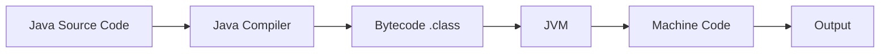
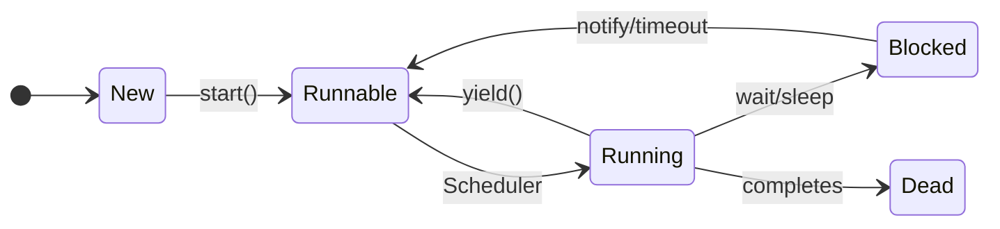
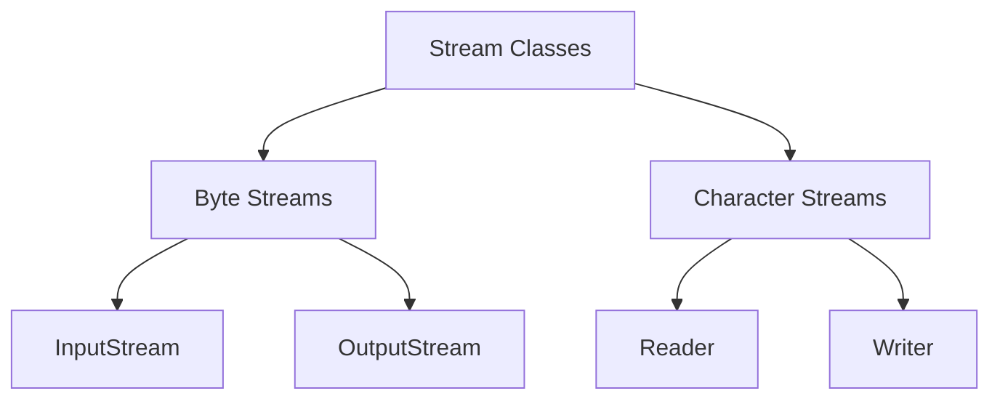

## Question 1(a) [3 marks]

**List out basic concepts of oop. Explain any one in detail.**

**Answer**:

| Basic OOP Concepts | Description |
|-------------------|-------------|
| **Class** | Blueprint for objects |
| **Object** | Instance of a class |
| **Encapsulation** | Data hiding mechanism |
| **Inheritance** | Acquiring properties from parent |
| **Polymorphism** | One interface, multiple forms |
| **Abstraction** | Hiding implementation details |

**Encapsulation** is the process of binding data and methods together within a class and hiding internal implementation from outside world. It provides data security by making variables private and accessing them through public methods.

**Mnemonic:** "CEO-IPA" (Class, Encapsulation, Object, Inheritance, Polymorphism, Abstraction)

## Question 1(b) [4 marks]

**Explain JVM in detail.**

**Answer**:



**JVM (Java Virtual Machine)** is a runtime environment that executes Java bytecode. It provides platform independence by converting bytecode to machine-specific code.

- **Class Loader**: Loads class files into memory
- **Memory Management**: Handles heap and stack memory
- **Execution Engine**: Executes bytecode instructions
- **Garbage Collector**: Automatically manages memory

**Mnemonic:** "CMEG" (Class loader, Memory, Execution, Garbage collection)

## Question 1(c) [7 marks]

**Write a program in java to print Fibonacci series for n terms.**

**Answer**:

```java
public class Fibonacci {
    public static void main(String[] args) {
        int n = 10, first = 0, second = 1;
        System.out.print("Fibonacci Series: " + first + " " + second);
        
        for(int i = 2; i < n; i++) {
            int next = first + second;
            System.out.print(" " + next);
            first = second;
            second = next;
        }
    }
}
```

- **Logic**: Start with 0,1 and add previous two numbers
- **Loop**: Continues for n terms
- **Variables**: first, second, next for calculation

**Mnemonic:** "FSN" (First, Second, Next)

## Question 1(c OR) [7 marks]

**Write a program in java to find out minimum from any ten numbers using command line argument.**

**Answer**:

```java
public class FindMinimum {
    public static void main(String[] args) {
        if(args.length != 10) {
            System.out.println("Please enter exactly 10 numbers");
            return;
        }
        
        int min = Integer.parseInt(args[0]);
        for(int i = 1; i < args.length; i++) {
            int num = Integer.parseInt(args[i]);
            if(num < min) {
                min = num;
            }
        }
        System.out.println("Minimum number: " + min);
    }
}
```

- **Command Line**: java FindMinimum 5 3 8 1 9 2 7 4 6 0
- **Logic**: Compare each number with current minimum
- **Method**: Integer.parseInt() converts string to integer

**Mnemonic:** "CIM" (Check, Integer.parseInt, Minimum)

## Question 2(a) [3 marks]

**What is wrapper class? Explain with example.**

**Answer**:

| Primitive | Wrapper Class |
|-----------|---------------|
| int | Integer |
| char | Character |
| boolean | Boolean |
| double | Double |

**Wrapper classes** convert primitive data types into objects. They provide utility methods and enable primitives to be used in collections.

**Example**: `Integer obj = new Integer(25);` or `Integer obj = 25;` (autoboxing)

**Mnemonic:** "POC" (Primitive to Object Conversion)

## Question 2(b) [4 marks]

**List out different features of java. Explain any two.**

**Answer**:

| Java Features | Description |
|---------------|-------------|
| **Platform Independent** | Write once, run anywhere |
| **Object Oriented** | Everything is an object |
| **Simple** | Easy syntax, no pointers |
| **Secure** | Bytecode verification |
| **Robust** | Strong memory management |
| **Multithreaded** | Concurrent execution |

**Platform Independence**: Java source code compiles to bytecode which runs on any platform with JVM installed.

**Object Oriented**: Java follows OOP principles like encapsulation, inheritance, and polymorphism for better code organization.

**Mnemonic:** "POSSMR" (Platform, Object, Simple, Secure, Multithreaded, Robust)

## Question 2(c) [7 marks]

**What is method overload? Explain with example.**

**Answer**:

**Method Overloading** allows multiple methods with same name but different parameters in the same class.

```java
class Calculator {
    public int add(int a, int b) {
        return a + b;
    }
    
    public double add(double a, double b) {
        return a + b;
    }
    
    public int add(int a, int b, int c) {
        return a + b + c;
    }
}
```

- **Rules**: Different parameter types or number of parameters
- **Compile Time**: Decision made during compilation
- **Return Type**: Cannot be only difference

**Mnemonic:** "SNRT" (Same Name, different paRameters, compile Time)

## Question 2(a OR) [3 marks]

**Explain Garbage collection in java.**

**Answer**:

```goat
Memory Areas:
┌─────────────┐
│    Heap     │ ← Objects stored here
├─────────────┤
│   Stack     │ ← Method calls
├─────────────┤
│   Method    │ ← Class definitions
│    Area     │
└─────────────┘
```

**Garbage Collection** automatically deallocates memory of unreferenced objects. JVM runs garbage collector periodically to free up heap memory.

- **Automatic**: No manual memory management needed
- **Mark and Sweep**: Marks unreferenced objects, then removes them

**Mnemonic:** "ARMS" (Automatic Reference Management System)

## Question 2(b OR) [4 marks]

**Explain final keyword with example.**

**Answer**:

| Usage | Description | Example |
|-------|-------------|---------|
| **final variable** | Cannot be changed | `final int x = 10;` |
| **final method** | Cannot be overridden | `final void display()` |
| **final class** | Cannot be inherited | `final class MyClass` |

**Example**:

```java
final class FinalClass {
    final int value = 100;
    final void show() {
        System.out.println("Final method");
    }
}
```

**Mnemonic:** "VCM" (Variable constant, Class not inherited, Method not overridden)

## Question 2(c OR) [7 marks]

**What is constructor? Explain parameterized constructor with example.**

**Answer**:

**Constructor** is a special method that initializes objects when created. It has same name as class and no return type.

```java
class Student {
    String name;
    int age;
    
    // Parameterized Constructor
    public Student(String n, int a) {
        name = n;
        age = a;
    }
    
    public void display() {
        System.out.println("Name: " + name + ", Age: " + age);
    }
}

class Main {
    public static void main(String[] args) {
        Student s1 = new Student("John", 20);
        s1.display();
    }
}
```

- **Purpose**: Initialize object with specific values
- **Parameters**: Accepts arguments to set initial state
- **Automatic**: Called automatically when object is created

**Mnemonic:** "SPA" (Same name, Parameters, Automatic call)

## Question 3(a) [3 marks]

**Explain super keyword with example.**

**Answer**:

**super keyword** refers to parent class members and constructor. It resolves naming conflicts between parent and child classes.

```java
class Parent {
    int x = 10;
}
class Child extends Parent {
    int x = 20;
    void display() {
        System.out.println(super.x); // 10
        System.out.println(x);       // 20
    }
}
```

- **super.variable**: Access parent class variable
- **super.method()**: Call parent class method
- **super()**: Call parent class constructor

**Mnemonic:** "VMC" (Variable, Method, Constructor)

## Question 3(b) [4 marks]

**List out different types of inheritance. Explain multilevel inheritance.**

**Answer**:

| Inheritance Types | Description |
|------------------|-------------|
| **Single** | One parent, one child |
| **Multilevel** | Chain of inheritance |
| **Hierarchical** | One parent, multiple children |
| **Multiple** | Multiple parents (via interfaces) |


**Multilevel Inheritance**: Class inherits from another class which itself inherits from another class, forming a chain.

```java
class Animal {
    void eat() { System.out.println("Eating"); }
}
class Mammal extends Animal {
    void walk() { System.out.println("Walking"); }
}
class Dog extends Mammal {
    void bark() { System.out.println("Barking"); }
}
```

**Mnemonic:** "SMHM" (Single, Multilevel, Hierarchical, Multiple)

## Question 3(c) [7 marks]

**What is interface? Explain multiple inheritance with example.**

**Answer**:

**Interface** is a contract that defines what methods a class must implement. It contains only abstract methods and constants.

```java
interface Flyable {
    void fly();
}

interface Swimmable {
    void swim();
}

class Duck implements Flyable, Swimmable {
    public void fly() {
        System.out.println("Duck is flying");
    }
    
    public void swim() {
        System.out.println("Duck is swimming");
    }
}
```

**Multiple Inheritance**: A class can implement multiple interfaces, achieving multiple inheritance of behavior.

- **Abstract Methods**: All methods are abstract by default
- **Constants**: All variables are public, static, final
- **implements**: Keyword to implement interface

**Mnemonic:** "ACI" (Abstract methods, Constants, implements keyword)

## Question 3(a OR) [3 marks]

**Explain static keyword with example.**

**Answer**:

**static keyword** creates class-level members that belong to class rather than instances. Memory allocated once when class loads.

```java
class Counter {
    static int count = 0;
    static void increment() {
        count++;
    }
}
```

- **static variable**: Shared among all objects
- **static method**: Called without object creation
- **Memory**: Allocated in method area

**Mnemonic:** "SOM" (Shared, Object not needed, Method area)

## Question 3(b OR) [4 marks]

**Explain different access controls in Java.**

**Answer**:

| Access Modifier | Same Class | Same Package | Subclass | Different Package |
|----------------|------------|--------------|----------|-------------------|
| **private** | ✓ | ✗ | ✗ | ✗ |
| **default** | ✓ | ✓ | ✗ | ✗ |
| **protected** | ✓ | ✓ | ✓ | ✗ |
| **public** | ✓ | ✓ | ✓ | ✓ |

**Access Control** determines visibility and accessibility of classes, methods, and variables.

**Mnemonic:** "PriDef ProPub" (Private, Default, Protected, Public)

## Question 3(c OR) [7 marks]

**What is package? Write steps to create a package and give example of it.**

**Answer**:

**Package** is a namespace that organizes related classes and interfaces. It provides access protection and namespace management.

**Steps to create package**:

1. Use `package` statement at top of file
2. Create directory structure matching package name
3. Compile with `-d` option
4. Import package in other files

```java
// File: com/mycompany/MyClass.java
package com.mycompany;

public class MyClass {
    public void display() {
        System.out.println("Package example");
    }
}

// Using the package
import com.mycompany.MyClass;

class Main {
    public static void main(String[] args) {
        MyClass obj = new MyClass();
        obj.display();
    }
}
```

**Compilation**: `javac -d . MyClass.java`

**Mnemonic:** "PDCI" (Package statement, Directory, Compile, Import)

## Question 4(a) [3 marks]

**Explain thread priorities with suitable example.**

**Answer**:

**Thread Priority** determines execution order of threads. Java provides 10 priority levels from 1 (lowest) to 10 (highest).

```java
class MyThread extends Thread {
    public void run() {
        System.out.println(getName() + " Priority: " + getPriority());
    }
}

class Main {
    public static void main(String[] args) {
        MyThread t1 = new MyThread();
        MyThread t2 = new MyThread();
        
        t1.setPriority(Thread.MIN_PRIORITY); // 1
        t2.setPriority(Thread.MAX_PRIORITY); // 10
        
        t1.start();
        t2.start();
    }
}
```

**Priority Constants**: MIN_PRIORITY (1), NORM_PRIORITY (5), MAX_PRIORITY (10)

**Mnemonic:** "MNM" (MIN, NORM, MAX)

## Question 4(b) [4 marks]

**What is Thread? Explain Thread life cycle.**

**Answer**:



**Thread** is a lightweight subprocess that enables concurrent execution within a program.

**Thread Life Cycle States**:

- **New**: Thread created but not started
- **Runnable**: Ready to run, waiting for CPU
- **Running**: Currently executing
- **Blocked**: Waiting for resource or I/O
- **Dead**: Thread execution completed

**Mnemonic:** "NRRBD" (New, Runnable, Running, Blocked, Dead)

## Question 4(c) [7 marks]

**Write a program in java that create the multiple threads by implementing the Thread class.**

**Answer**:

```java
class MyThread extends Thread {
    private String threadName;
    
    public MyThread(String name) {
        threadName = name;
        setName(threadName);
    }
    
    public void run() {
        for(int i = 1; i <= 5; i++) {
            System.out.println(threadName + " - Count: " + i);
            try {
                Thread.sleep(1000);
            } catch(InterruptedException e) {
                System.out.println(threadName + " interrupted");
            }
        }
        System.out.println(threadName + " completed");
    }
}

class Main {
    public static void main(String[] args) {
        MyThread thread1 = new MyThread("Thread-1");
        MyThread thread2 = new MyThread("Thread-2");
        MyThread thread3 = new MyThread("Thread-3");
        
        thread1.start();
        thread2.start();
        thread3.start();
    }
}
```

- **extends Thread**: Inherit Thread class functionality
- **Override run()**: Define thread execution logic
- **start()**: Begin thread execution

**Mnemonic:** "EOS" (Extends, Override run, Start method)

## Question 4(a OR) [3 marks]

**List four different inbuilt exceptions. Explain any one inbuilt exception.**

**Answer**:

| Inbuilt Exceptions | Description |
|-------------------|-------------|
| **NullPointerException** | Null reference access |
| **ArrayIndexOutOfBoundsException** | Invalid array index |
| **NumberFormatException** | Invalid number format |
| **ClassCastException** | Invalid type casting |

**NullPointerException** occurs when trying to access methods or variables of a null reference.

```java
String str = null;
int length = str.length(); // Throws NullPointerException
```

**Mnemonic:** "NANC" (NullPointer, ArrayIndex, NumberFormat, ClassCast)

## Question 4(b OR) [4 marks]

**Explain multiple catch with suitable example.**

**Answer**:

**Multiple catch** blocks handle different types of exceptions that might occur in try block. Each catch handles specific exception type.

```java
class MultipleCatch {
    public static void main(String[] args) {
        try {
            int[] arr = {1, 2, 3};
            System.out.println(arr[5]); // ArrayIndexOutOfBoundsException
            int result = 10/0;          // ArithmeticException
        }
        catch(ArrayIndexOutOfBoundsException e) {
            System.out.println("Array index error: " + e.getMessage());
        }
        catch(ArithmeticException e) {
            System.out.println("Arithmetic error: " + e.getMessage());
        }
        catch(Exception e) {
            System.out.println("General error: " + e.getMessage());
        }
    }
}
```

**Order**: Specific exceptions first, general exceptions last

**Mnemonic:** "SGO" (Specific first, General last, Ordered)

## Question 4(c OR) [7 marks]

**What is Exception? Write a program that show the use of Arithmetic Exception.**

**Answer**:

**Exception** is an abnormal condition that disrupts normal program flow. It's an object representing an error condition.

```java
class ArithmeticExceptionDemo {
    public static void main(String[] args) {
        int numerator = 100;
        int[] denominators = {5, 0, 2, 0, 10};
        
        for(int i = 0; i < denominators.length; i++) {
            try {
                int result = numerator / denominators[i];
                System.out.println(numerator + " / " + denominators[i] + " = " + result);
            }
            catch(ArithmeticException e) {
                System.out.println("Error: Cannot divide by zero!");
                System.out.println("Exception message: " + e.getMessage());
            }
        }
        
        System.out.println("Program continues after exception handling");
    }
}
```

**ArithmeticException** thrown when mathematical error occurs like division by zero.

**Exception Hierarchy**: Object → Throwable → Exception → RuntimeException → ArithmeticException

**Mnemonic:** "OTERRA" (Object, Throwable, Exception, RuntimeException, ArithmeticException)

## Question 5(a) [3 marks]

**Explain ArrayIndexOutOfBound Exception in Java with example.**

**Answer**:

**ArrayIndexOutOfBoundsException** occurs when accessing array element with invalid index (negative or >= array length).

```java
class ArrayException {
    public static void main(String[] args) {
        int[] numbers = {10, 20, 30};
        
        try {
            System.out.println(numbers[5]); // Invalid index
        }
        catch(ArrayIndexOutOfBoundsException e) {
            System.out.println("Invalid array index: " + e.getMessage());
        }
    }
}
```

- **Valid Range**: 0 to (length-1)
- **Runtime Exception**: Unchecked exception
- **Common Cause**: Loop condition errors

**Mnemonic:** "VRC" (Valid range, Runtime exception, Common in loops)

## Question 5(b) [4 marks]

**Explain basics of stream classes.**

**Answer**:



**Stream Classes** provide input/output operations for reading and writing data.

| Stream Type | Purpose | Base Classes |
|-------------|---------|--------------|
| **Byte Streams** | Binary data | InputStream, OutputStream |
| **Character Streams** | Text data | Reader, Writer |

- **Input Streams**: Read data from source
- **Output Streams**: Write data to destination
- **Buffered Streams**: Improve performance with buffering

**Mnemonic:** "BIOC" (Byte, Input/Output, Character streams)

## Question 5(c) [7 marks]

**Write a java program to create a text file and perform read operation on the text file.**

**Answer**:

```java
import java.io.*;

class FileOperations {
    public static void main(String[] args) {
        // Create and write to file
        try {
            FileWriter writer = new FileWriter("sample.txt");
            writer.write("Hello World!\n");
            writer.write("This is Java file handling example.\n");
            writer.write("Learning Input/Output operations.");
            writer.close();
            System.out.println("File created and written successfully.");
        }
        catch(IOException e) {
            System.out.println("Error creating file: " + e.getMessage());
        }
        
        // Read from file
        try {
            FileReader reader = new FileReader("sample.txt");
            BufferedReader bufferedReader = new BufferedReader(reader);
            String line;
            
            System.out.println("\nFile contents:");
            while((line = bufferedReader.readLine()) != null) {
                System.out.println(line);
            }
            
            bufferedReader.close();
            reader.close();
        }
        catch(IOException e) {
            System.out.println("Error reading file: " + e.getMessage());
        }
    }
}
```

- **FileWriter**: Creates and writes to text file
- **FileReader**: Reads from text file
- **BufferedReader**: Efficient line-by-line reading

**Mnemonic:** "WRB" (Writer creates, Reader reads, Buffered for efficiency)

## Question 5(a OR) [3 marks]

**Explain Divide by Zero Exception in Java with example.**

**Answer**:

**ArithmeticException (Divide by Zero)** occurs when integer is divided by zero. Floating-point division by zero returns Infinity.

```java
class DivideByZeroExample {
    public static void main(String[] args) {
        try {
            int result = 10 / 0; // Throws ArithmeticException
            System.out.println("Result: " + result);
        }
        catch(ArithmeticException e) {
            System.out.println("Cannot divide by zero!");
        }
        
        // Floating point division
        double floatResult = 10.0 / 0.0; // Returns Infinity
        System.out.println("Float result: " + floatResult);
    }
}
```

- **Integer Division**: Throws ArithmeticException
- **Float Division**: Returns Infinity or NaN

**Mnemonic:** "IFI" (Integer throws exception, Float returns Infinity)

## Question 5(b OR) [4 marks]

**Explain java I/O process.**

**Answer**:

```goat
Java I/O Process:
┌─────────────┐    ┌─────────────┐    ┌─────────────┐
│   Source    │───▶│   Stream    │───▶│ Destination │
│  (File,     │    │  (Reader/   │    │ (File,      │
│  Keyboard,  │    │   Writer,   │    │  Screen,    │
│  Network)   │    │ Input/Output│    │  Network)   │
└─────────────┘    │   Stream)   │    └─────────────┘
                   └─────────────┘
```

**Java I/O Process** handles data transfer between program and external sources using streams.

| Component | Purpose |
|-----------|---------|
| **Source** | Data origin (file, keyboard, network) |
| **Stream** | Data pathway (byte/character streams) |
| **Destination** | Data target (file, screen, network) |

**Process Steps**:

1. **Open Stream**: Create connection to source/destination
2. **Process Data**: Read/write operations
3. **Close Stream**: Release resources

**Mnemonic:** "OPC" (Open, Process, Close)

## Question 5(c OR) [7 marks]

**Write a java program to display the content of a text file and perform append operation on the text file.**

**Answer**:

```java
import java.io.*;

class FileAppendExample {
    public static void main(String[] args) {
        String fileName = "data.txt";
        
        // Create initial file content
        try {
            FileWriter writer = new FileWriter(fileName);
            writer.write("Initial content line 1\n");
            writer.write("Initial content line 2\n");
            writer.close();
            System.out.println("Initial file created.");
        }
        catch(IOException e) {
            System.out.println("Error creating file: " + e.getMessage());
        }
        
        // Display file content
        displayFileContent(fileName);
        
        // Append to file
        try {
            FileWriter appendWriter = new FileWriter(fileName, true); // true for append
            appendWriter.write("Appended line 1\n");
            appendWriter.write("Appended line 2\n");
            appendWriter.close();
            System.out.println("\nContent appended successfully.");
        }
        catch(IOException e) {
            System.out.println("Error appending to file: " + e.getMessage());
        }
        
        // Display updated content
        System.out.println("\nFile content after append:");
        displayFileContent(fileName);
    }
    
    static void displayFileContent(String fileName) {
        try {
            BufferedReader reader = new BufferedReader(new FileReader(fileName));
            String line;
            System.out.println("\nFile contents:");
            while((line = reader.readLine()) != null) {
                System.out.println(line);
            }
            reader.close();
        }
        catch(IOException e) {
            System.out.println("Error reading file: " + e.getMessage());
        }
    }
}
```

- **FileWriter(filename, true)**: Append mode enabled
- **displayFileContent()**: Reusable method for reading
- **BufferedReader**: Efficient line reading

**Mnemonic:** "ARB" (Append mode, Reusable method, Buffered reading)
