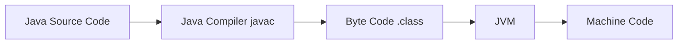
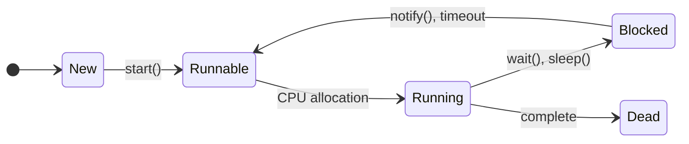
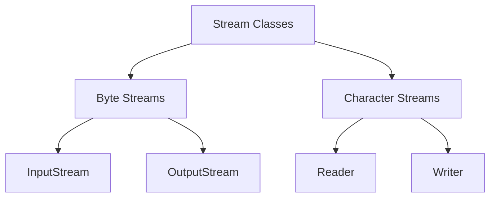
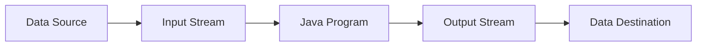

## પ્રશ્ન 1(અ) [3 ગુણ]

**OOP અને POP વચ્ચેનો તફાવત લખો.**

**જવાબ**:

| **પાસાં** | **OOP** | **POP** |
|-----------|---------|---------|
| **અભિગમ** | બોટમ-અપ અભિગમ | ટોપ-ડાઉન અભિગમ |
| **ફોકસ** | ઓબ્જેક્ટ અને ક્લાસ | ફંક્શન અને પ્રોસીજર |
| **ડેટા સિક્યોરિટી** | એન્કેપ્સુલેશન દ્વારા ડેટા હાઇડિંગ | ડેટા હાઇડિંગ નથી |
| **પ્રોબ્લેમ સોલ્વિંગ** | સમસ્યાને ઓબ્જેક્ટમાં વિભાજિત કરો | સમસ્યાને ફંક્શનમાં વિભાજિત કરો |

**મેમરી ટ્રીક:** "ઓબ્જેક્ટ બોટમ, પ્રોસીજર ટોપ"

## પ્રશ્ન 1(બ) [4 ગુણ]

**બાઇટ કોડ શું છે? JVM ને વિગતવાર સમજાવો.**

**જવાબ**:

**બાઇટ કોડ**: Java compiler દ્વારા સોર્સ કોડમાંથી જનરેટ થતો પ્લેટફોર્મ-ઇન્ડિપેન્ડન્ટ ઇન્ટરમીડિયેટ કોડ.



**JVM કોમ્પોનન્ટ્સ**:

- **Class Loader**: .class ફાઇલોને મેમરીમાં લોડ કરે છે
- **Memory Area**: Heap, stack, method area સ્ટોરેજ
- **Execution Engine**: બાઇટકોડને ઇન્ટરપ્રેટ અને એક્ઝિક્યુટ કરે છે
- **Garbage Collector**: ઓટોમેટિક મેમરી મેનેજમેન્ટ

**મેમરી ટ્રીક:** "બાઇટ કોડ દરેક જગ્યાએ ચાલે છે"

## પ્રશ્ન 1(ક) [7 ગુણ]

**એરેના એલિમેન્ટ્સને ચડતા ક્રમમાં સૉર્ટ કરવા માટે જાવામાં પ્રોગ્રામ લખો**

**જવાબ**:

```java
import java.util.Arrays;

public class ArraySort {
    public static void main(String[] args) {
        int[] arr = {64, 34, 25, 12, 22, 11, 90};
        
        // Bubble Sort
        for(int i = 0; i < arr.length-1; i++) {
            for(int j = 0; j < arr.length-i-1; j++) {
                if(arr[j] > arr[j+1]) {
                    int temp = arr[j];
                    arr[j] = arr[j+1];
                    arr[j+1] = temp;
                }
            }
        }
        
        System.out.println("Sorted array: " + Arrays.toString(arr));
    }
}
```

**મુખ્ય મુદ્દાઓ**:

- **Bubble Sort**: બાજુના એલિમેન્ટ્સની તુલના કરે છે
- **Time Complexity**: O(n²)
- **Space Complexity**: O(1)

**મેમરી ટ્રીક:** "બબલ અપ ધ સ્મોલેસ્ટ"

## પ્રશ્ન 1(ક OR) [7 ગુણ]

**કમાન્ડ લાઇન આર્ગ્યુમેન્ટ્સનો ઉપયોગ કરીને કોઈપણ દસ સંખ્યાઓમાંથી મહત્તમ શોધવા માટે જાવામાં પ્રોગ્રામ લખો.**

**જવાબ**:

```java
public class FindMaximum {
    public static void main(String[] args) {
        if(args.length != 10) {
            System.out.println("કૃપા કરીને બરાબર 10 સંખ્યાઓ દાખલ કરો");
            return;
        }
        
        int max = Integer.parseInt(args[0]);
        
        for(int i = 1; i < args.length; i++) {
            int num = Integer.parseInt(args[i]);
            if(num > max) {
                max = num;
            }
        }
        
        System.out.println("મહત્તમ સંખ્યા: " + max);
    }
}
```

**મુખ્ય મુદ્દાઓ**:

- **Command Line**: args[] array આર્ગ્યુમેન્ટ્સ સ્ટોર કરે છે
- **parseInt()**: સ્ટ્રિંગને ઇન્ટિજરમાં કન્વર્ટ કરે છે
- **Validation**: Array length ચેક કરો

**મેમરી ટ્રીક:** "આર્ગ્યુમેન્ટ્સ મેક્સિમમ સર્ચ"

## પ્રશ્ન 2(અ) [3 ગુણ]

**Wrapper ક્લાસ શું છે? ઉદાહરણ સાથે સમજાવો.**

**જવાબ**:

**Wrapper Class**: પ્રિમિટિવ ડેટા ટાઇપ્સને ઓબ્જેક્ટમાં કન્વર્ટ કરે છે.

| **Primitive** | **Wrapper Class** |
|---------------|-------------------|
| int | Integer |
| char | Character |
| boolean | Boolean |
| double | Double |

```java
// Boxing
Integer obj = Integer.valueOf(10);
// Unboxing  
int value = obj.intValue();
```

**મેમરી ટ્રીક:** "પ્રિમિટિવ્સને ઓબ્જેક્ટમાં લપેટો"

## પ્રશ્ન 2(બ) [4 ગુણ]

**જાવાના વિવિધ લક્ષણોની યાદી આપો. કોઈપણ બે સમજાવો.**

**જવાબ**:

**Java Features**:

- **Simple**: સરળ syntax, pointers નથી
- **Platform Independent**: એકવાર લખો, દરેક જગ્યાએ ચલાવો  
- **Object Oriented**: ઓબ્જેક્ટ અને ક્લાસ પર આધારિત
- **Secure**: explicit pointers નથી, bytecode verification

**વિગતવાર સમજૂતી**:

- **Platform Independence**: Java bytecode JVM વાળા કોઈપણ પ્લેટફોર્મ પર ચાલે છે
- **Object Oriented**: inheritance, encapsulation, polymorphism, abstraction સપોર્ટ કરે છે

**મેમરી ટ્રીક:** "સિમ્પલ પ્લેટફોર્મ ઓબ્જેક્ટ સિક્યોરિટી"

## પ્રશ્ન 2(ક) [7 ગુણ]

**ઓવરરાઇડિંગ પદ્ધતિ શું છે? ઉદાહરણ સાથે સમજાવો.**

**જવાબ**:

**Method Overriding**: ચાઇલ્ડ ક્લાસ પેરન્ટ ક્લાસની મેથડનું વિશિષ્ટ implementation પ્રદાન કરે છે.

```java
class Animal {
    public void sound() {
        System.out.println("પ્રાણી અવાજ કરે છે");
    }
}

class Dog extends Animal {
    @Override
    public void sound() {
        System.out.println("કૂતરો ભસે છે");
    }
}

public class Test {
    public static void main(String[] args) {
        Animal a = new Dog();
        a.sound(); // આઉટપુટ: કૂતરો ભસે છે
    }
}
```

**મુખ્ય મુદ્દાઓ**:

- **Runtime Polymorphism**: ઓબ્જેક્ટ ટાઇપના આધારે મેથડ કોલ થાય છે
- **@Override**: મેથડ ઓવરરાઇડિંગ માટે annotation
- **Dynamic Binding**: રનટાઇમ પર મેથડ રિઝોલ્યુશન

**મેમરી ટ્રીક:** "ચાઇલ્ડ પેરન્ટ મેથડ બદલે છે"

## પ્રશ્ન 2(અ OR) [3 ગુણ]

**જાવામાં Garbage collection સમજાવો.**

**જવાબ**:

**Garbage Collection**: ઓટોમેટિક મેમરી મેનેજમેન્ટ જે અનુપયોગી ઓબ્જેક્ટ્સને દૂર કરે છે.


**મુખ્ય મુદ્દાઓ**:

- **Automatic**: મેન્યુઅલ મેમરી deallocation નથી
- **Mark and Sweep**: અનુપયોગી ઓબ્જેક્ટ્સને ઓળખે અને દૂર કરે છે
- **Heap Memory**: heap memory area પર કામ કરે છે

**મેમરી ટ્રીક:** "ઓટો ક્લીન અનયુઝ્ડ ઓબ્જેક્ટ્સ"

## પ્રશ્ન 2(બ OR) [4 ગુણ]

**static કીવર્ડ ઉદાહરણ સાથે સમજાવો.**

**જવાબ**:

**Static Keyword**: ઇન્સ્ટન્સને બદલે ક્લાસનું છે.

```java
class Student {
    static String college = "GTU";  // Static variable
    String name;
    
    static void showCollege() {     // Static method
        System.out.println("કૉલેજ: " + college);
    }
}
```

**Static Features**:

- **Memory**: ક્લાસ લોડિંગ ટાઇમે લોડ થાય છે
- **Access**: ઓબ્જેક્ટ વિના એક્સેસ કરી શકાય છે
- **Sharing**: બધા instances વચ્ચે શેર થાય છે

**મેમરી ટ્રીક:** "ક્લાસ લેવલ મેમરી શેરિંગ"

## પ્રશ્ન 2(ક OR) [7 ગુણ]

**કન્સ્ટ્રક્ટર શું છે? કોપી કન્સ્ટ્રક્ટરને ઉદાહરણ સાથે સમજાવો.**

**જવાબ**:

**Constructor**: ઓબ્જેક્ટ્સને initialize કરવા માટેની વિશેષ મેથડ.

```java
class Person {
    String name;
    int age;
    
    // Default constructor
    Person() {
        name = "અજ્ઞાત";
        age = 0;
    }
    
    // Parameterized constructor
    Person(String n, int a) {
        name = n;
        age = a;
    }
    
    // Copy constructor
    Person(Person p) {
        name = p.name;
        age = p.age;
    }
}
```

**Constructor Types**:

- **Default**: કોઈ પેરામીટર નથી
- **Parameterized**: પેરામીટર લે છે
- **Copy**: અસ્તિત્વમાં રહેલા ઓબ્જેક્ટમાંથી ઓબ્જેક્ટ બનાવે છે

**મેમરી ટ્રીક:** "ડિફોલ્ટ પેરામીટર કોપી"

## પ્રશ્ન 3(અ) [3 ગુણ]

**super કીવર્ડ ઉદાહરણ સાથે સમજાવો.**

**જવાબ**:

**Super Keyword**: પેરન્ટ ક્લાસના સભ્યોનો સંદર્ભ આપે છે.

```java
class Vehicle {
    String brand = "જેનેરિક";
}

class Car extends Vehicle {
    String brand = "ટોયોટા";
    
    void display() {
        System.out.println("ચાઇલ્ડ: " + brand);
        System.out.println("પેરન્ટ: " + super.brand);
    }
}
```

**Super Uses**:

- **Variables**: પેરન્ટ ક્લાસના variables એક્સેસ કરો
- **Methods**: પેરન્ટ ક્લાસની methods કૉલ કરો  
- **Constructor**: પેરન્ટ ક્લાસના constructor કૉલ કરો

**મેમરી ટ્રીક:** "સુપર પેરન્ટને કૉલ કરે છે"

## પ્રશ્ન 3(બ) [4 ગુણ]

**inheritance ના વિવિધ પ્રકારોની યાદી આપો. multilevel inheritance સમજાવો.**

**જવાબ**:

**Inheritance Types**:

| **Type** | **વર્ણન** |
|----------|-----------|
| Single | એક પેરન્ટ, એક ચાઇલ્ડ |
| Multilevel | inheritance ની ચેઇન |
| Hierarchical | એક પેરન્ટ, બહુવિધ ચિલ્ડ્રન |
| Multiple | બહુવિધ પેરન્ટ્સ (interfaces દ્વારા) |

**Multilevel Inheritance**:

```java
class Animal {
    void eat() { System.out.println("ખાવું"); }
}

class Mammal extends Animal {
    void breathe() { System.out.println("શ્વાસ લેવો"); }
}

class Dog extends Mammal {
    void bark() { System.out.println("ભસવું"); }
}
```

**મેમરી ટ્રીક:** "સિંગલ મલ્ટી હાયરાર્કિકલ મલ્ટિપલ"

## પ્રશ્ન 3(ક) [7 ગુણ]

**ઇન્ટરફેસ શું છે? ઉદાહરણ સાથે multiple inheritance સમજાવો.**

**જવાબ**:

**Interface**: કોન્ટ્રાક્ટ જે ક્લાસે શું કરવું જોઈએ તે વ્યાખ્યાયિત કરે છે, કેવી રીતે નહીં.

```java
interface Flyable {
    void fly();
}

interface Swimmable {
    void swim();
}

class Duck implements Flyable, Swimmable {
    public void fly() {
        System.out.println("બતક ઉડી રહી છે");
    }
    
    public void swim() {
        System.out.println("બતક તરી રહી છે");
    }
}
```

**Interface Features**:

- **Multiple Inheritance**: ક્લાસ બહુવિધ interfaces implement કરી શકે છે
- **Abstract Methods**: બધી methods ડિફોલ્ટ રૂપે abstract છે
- **Constants**: બધા variables public, static, final છે

**મેમરી ટ્રીક:** "મલ્ટિપલ એબ્સ્ટ્રાક્ટ કોન્સ્ટન્ટ્સ"

## પ્રશ્ન 3(અ OR) [3 ગુણ]

**final કીવર્ડ ઉદાહરણ સાથે સમજાવો.**

**જવાબ**:

**Final Keyword**: modification, inheritance, અથવા overriding પ્રતિબંધિત કરે છે.

```java
final class Math {           // inherit કરી શકાતું નથી
    final int PI = 3.14;     // modify કરી શકાતું નથી
    
    final void calculate() { // override કરી શકાતું નથી
        System.out.println("ગણતરી કરી રહ્યું છું");
    }
}
```

**Final Uses**:

- **Class**: extend કરી શકાતું નથી
- **Method**: override કરી શકાતું નથી
- **Variable**: reassign કરી શકાતું નથી

**મેમરી ટ્રીક:** "ફાઇનલ ફેરફાર અટકાવે છે"

## પ્રશ્ન 3(બ OR) [4 ગુણ]

**જાવામાં વિવિધ એક્સેસ કંટ્રોલ સમજાવો.**

**જવાબ**:

**Access Modifiers**:

| **Modifier** | **સેમ ક્લાસ** | **સેમ પેકેજ** | **સબક્લાસ** | **ડિફરન્ટ પેકેજ** |
|--------------|---------------|---------------|-------------|-------------------|
| public | ✓ | ✓ | ✓ | ✓ |
| protected | ✓ | ✓ | ✓ | ✗ |
| default | ✓ | ✓ | ✗ | ✗ |
| private | ✓ | ✗ | ✗ | ✗ |

**મેમરી ટ્રીક:** "પબ્લિક પ્રોટેક્ટેડ ડિફોલ્ટ પ્રાઇવેટ"

## પ્રશ્ન 3(ક OR) [7 ગુણ]

**પેકેજ શું છે? પેકેજ બનાવવાના પગલાં લખો અને તેનું ઉદાહરણ આપો.**

**જવાબ**:

**Package**: સંબંધિત ક્લાસ અને interfaces નું જૂથ.

**પેકેજ બનાવવાના પગલાં**:

1. **Declare**: ટોપ પર package statement વાપરો
2. **Compile**: javac -d . ClassName.java  
3. **Run**: java packagename.ClassName

```java
// File: mypack/Calculator.java
package mypack;

public class Calculator {
    public int add(int a, int b) {
        return a + b;
    }
}

// File: Test.java
import mypack.Calculator;

public class Test {
    public static void main(String[] args) {
        Calculator calc = new Calculator();
        System.out.println(calc.add(5, 3));
    }
}
```

**Package Benefits**:

- **Organization**: સંબંધિત ક્લાસોને જૂથ કરે છે
- **Access Control**: પેકેજ-લેવલ પ્રોટેક્શન
- **Namespace**: નામિંગ કન્ફ્લિક્ટ ટાળે છે

**મેમરી ટ્રીક:** "ડિક્લેર કમ્પાઇલ રન"

## પ્રશ્ન 4(અ) [3 ગુણ]

**યોગ્ય ઉદાહરણ સાથે thread ની પ્રાથમિકતાઓ સમજાવો.**

**જવાબ**:

**Thread Priority**: thread execution order નક્કી કરે છે (1-10 સ્કેલ).

```java
class MyThread extends Thread {
    public void run() {
        System.out.println(getName() + " પ્રાથમિકતા: " + getPriority());
    }
}

public class ThreadPriorityExample {
    public static void main(String[] args) {
        MyThread t1 = new MyThread();
        MyThread t2 = new MyThread();
        
        t1.setPriority(Thread.MIN_PRIORITY);  // 1
        t2.setPriority(Thread.MAX_PRIORITY);  // 10
        
        t1.start();
        t2.start();
    }
}
```

**Priority Constants**:

- **MIN_PRIORITY**: 1
- **NORM_PRIORITY**: 5  
- **MAX_PRIORITY**: 10

**મેમરી ટ્રીક:** "મિન નોર્મલ મેક્સ"

## પ્રશ્ન 4(બ) [4 ગુણ]

**થ્રેડ શું છે? થ્રેડ જીવન ચક્ર સમજાવો.**

**જવાબ**:

**Thread**: concurrent execution માટે lightweight process.



**Thread States**:

- **New**: Thread બનાવ્યું પણ શરૂ થયું નથી
- **Runnable**: ચાલવા માટે તૈયાર
- **Running**: હાલમાં execute થઈ રહ્યું છે
- **Blocked**: resource માટે રાહ જોઈ રહ્યું છે
- **Dead**: execution પૂર્ણ થયું

**મેમરી ટ્રીક:** "ન્યૂ રનેબલ રનિંગ બ્લોક્ડ ડેડ"

## પ્રશ્ન 4(ક) [7 ગુણ]

**જાવામાં એક પ્રોગ્રામ લખો જે રનેબલ ઇન્ટરફેસનો અમલ કરીને બહુવિધ થ્રેડો બનાવે છે.**

**જવાબ**:

```java
class MyRunnable implements Runnable {
    private String threadName;
    
    MyRunnable(String name) {
        threadName = name;
    }
    
    public void run() {
        for(int i = 1; i <= 5; i++) {
            System.out.println(threadName + " - ગણતરી: " + i);
            try {
                Thread.sleep(1000);
            } catch(InterruptedException e) {
                e.printStackTrace();
            }
        }
    }
}

public class MultipleThreads {
    public static void main(String[] args) {
        Thread t1 = new Thread(new MyRunnable("થ્રેડ-1"));
        Thread t2 = new Thread(new MyRunnable("થ્રેડ-2"));
        Thread t3 = new Thread(new MyRunnable("થ્રેડ-3"));
        
        t1.start();
        t2.start(); 
        t3.start();
    }
}
```

**મુખ્ય મુદ્દાઓ**:

- **Runnable Interface**: Thread ક્લાસ extend કરવા કરતાં સારું છે
- **Thread.sleep()**: thread execution pause કરે છે
- **Multiple Threads**: એકસાથે concurrent ચાલે છે

**મેમરી ટ્રીક:** "ઇમ્પ્લિમેન્ટ રનેબલ સ્ટાર્ટ મલ્ટિપલ"

## પ્રશ્ન 4(અ OR) [3 ગુણ]

**ચાર અલગ-અલગ ઇનબિલ્ટ exception ની યાદી આપો. કોઈપણ એક ઇનબિલ્ટ exception સમજાવો.**

**જવાબ**:

**Inbuilt Exceptions**:

- **NullPointerException**: null object એક્સેસ કરવું
- **ArrayIndexOutOfBoundsException**: અમાન્ય array index
- **ArithmeticException**: શૂન્યથી ભાગાકાર
- **NumberFormatException**: અમાન્ય સંખ્યા ફોર્મેટ

**ArithmeticException**: arithmetic operation નિષ્ફળ થાય ત્યારે throw થાય છે.

```java
int result = 10 / 0; // ArithmeticException throw કરે છે
```

**મેમરી ટ્રીક:** "નલ એરે એરિથમેટિક નંબર"

## પ્રશ્ન 4(બ OR) [4 ગુણ]

**યોગ્ય ઉદાહરણ સાથે ટ્રાય અને કેચ સમજાવો.**

**જવાબ**:

**Try-Catch**: Exception handling મેકેનિઝમ.

```java
public class TryCatchExample {
    public static void main(String[] args) {
        try {
            int[] arr = {1, 2, 3};
            System.out.println(arr[5]); // Index out of bounds
        }
        catch(ArrayIndexOutOfBoundsException e) {
            System.out.println("Array index એરર: " + e.getMessage());
        }
        finally {
            System.out.println("હંમેશા execute થાય છે");
        }
    }
}
```

**Exception Handling Flow**:

- **Try**: કોડ જે exception throw કરી શકે છે
- **Catch**: વિશિષ્ટ exceptions handle કરે છે  
- **Finally**: હંમેશા execute થાય છે

**મેમરી ટ્રીક:** "ટ્રાય કેચ ફાઇનલી"

## પ્રશ્ન 4(ક OR) [7 ગુણ]

**Exception શું છે? Arithmetic Exception નો ઉપયોગ દશાવતો પ્રોગ્રામ લખો.**

**જવાબ**:

**Exception**: runtime error જે સામાન્ય પ્રોગ્રામ flow ને વિક્ષેપ કરે છે.

```java
import java.util.Scanner;

public class ArithmeticExceptionExample {
    public static void main(String[] args) {
        Scanner sc = new Scanner(System.in);
        
        try {
            System.out.print("પ્રથમ સંખ્યા દાખલ કરો: ");
            int num1 = sc.nextInt();
            
            System.out.print("બીજી સંખ્યા દાખલ કરો: ");
            int num2 = sc.nextInt();
            
            int result = num1 / num2;
            System.out.println("પરિણામ: " + result);
        }
        catch(ArithmeticException e) {
            System.out.println("એરર: શૂન્યથી ભાગાકાર કરી શકાતો નથી!");
        }
        catch(Exception e) {
            System.out.println("સામાન્ય એરર: " + e.getMessage());
        }
        finally {
            sc.close();
        }
    }
}
```

**Exception Types**:

- **Checked**: કમ્પાઇલ-ટાઇમ exceptions
- **Unchecked**: રનટાઇમ exceptions
- **Error**: સિસ્ટમ-લેવલ પ્રોબ્લેમ્સ

**મેમરી ટ્રીક:** "રનટાઇમ એરર ફ્લો ડિસરપ્ટ કરે છે"

## પ્રશ્ન 5(અ) [3 ગુણ]

**JavaમાંArrayIndexOutOfBound અપવાદને ઉદાહરણ સાથે સમજાવો.**

**જવાબ**:

**ArrayIndexOutOfBoundsException**: અમાન્ય array index એક્સેસ કરતી વખતે throw થાય છે.

```java
public class ArrayIndexExample {
    public static void main(String[] args) {
        int[] numbers = {10, 20, 30};
        
        try {
            System.out.println(numbers[5]); // અમાન્ય index
        }
        catch(ArrayIndexOutOfBoundsException e) {
            System.out.println("અમાન્ય array index: " + e.getMessage());
        }
    }
}
```

**મુખ્ય મુદ્દાઓ**:

- **Valid Range**: 0 થી array.length-1
- **Negative Index**: નકારાત્મક index પણ exception throw કરે છે
- **Runtime Exception**: unchecked exception

**મેમરી ટ્રીક:** "એરે ઇન્ડેક્સ રેન્જ ચેક"

## પ્રશ્ન 5(બ) [4 ગુણ]

**stream classes ની મૂળભૂત બાબતો સમજાવો.**

**જવાબ**:

**Stream Classes**: input/output operations handle કરે છે.

| **Stream Type** | **Classes** |
|-----------------|-------------|
| Byte Streams | InputStream, OutputStream |
| Character Streams | Reader, Writer |
| File Streams | FileInputStream, FileOutputStream |
| Buffered Streams | BufferedReader, BufferedWriter |



**Stream Features**:

- **Sequential**: ડેટા sequence માં flow કરે છે
- **One Direction**: કાં તો input કાં output
- **Automatic**: નીચલા સ્તરની વિગતો handle કરે છે

**મેમરી ટ્રીક:** "બાઇટ કેરેક્ટર ફાઇલ બફર્ડ"

## પ્રશ્ન 5(ક) [7 ગુણ]

**ટેક્સ્ટ ફાઇલ બનાવવા માટે જાવા પ્રોગ્રામ લખો અને ટેક્સ્ટ ફાઇલ પર રીડ ઑપરેશન કરો.**

**જવાબ**:

```java
import java.io.*;

public class FileReadExample {
    public static void main(String[] args) {
        // ફાઇલ બનાવો અને લખો
        try {
            FileWriter writer = new FileWriter("sample.txt");
            writer.write("હેલો વર્લ્ડ!\n");
            writer.write("જાવા ફાઇલ હેન્ડલિંગ\n");
            writer.write("GTU પરીક્ષા 2024");
            writer.close();
            System.out.println("ફાઇલ સફળતાપૂર્વક બનાવાઈ");
        }
        catch(IOException e) {
            System.out.println("ફાઇલ બનાવવામાં એરર: " + e.getMessage());
        }
        
        // ફાઇલમાંથી વાંચો
        try {
            BufferedReader reader = new BufferedReader(new FileReader("sample.txt"));
            String line;
            
            System.out.println("\nફાઇલની વિગતો:");
            while((line = reader.readLine()) != null) {
                System.out.println(line);
            }
            reader.close();
        }
        catch(IOException e) {
            System.out.println("ફાઇલ વાંચવામાં એરર: " + e.getMessage());
        }
    }
}
```

**મુખ્ય મુદ્દાઓ**:

- **FileWriter**: ફાઇલ બનાવે અને લખે છે
- **BufferedReader**: કાર્યક્ષમ વાંચન
- **Exception Handling**: IOException handle કરો

**મેમરી ટ્રીક:** "બનાવો લખો વાંચો બંધ કરો"

## પ્રશ્ન 5(અ OR) [3 ગુણ]

**Java માં Divide by Zero Exception ને ઉદાહરણ સાથે સમજાવો.**

**જવાબ**:

**ArithmeticException**: શૂન્યથી ભાગાકાર ઑપરેશન દરમિયાન throw થાય છે.

```java
public class DivideByZeroExample {
    public static void main(String[] args) {
        try {
            int a = 10;
            int b = 0;
            int result = a / b;  // ArithmeticException throw કરે છે
            System.out.println("પરિણામ: " + result);
        }
        catch(ArithmeticException e) {
            System.out.println("શૂન્યથી ભાગાકાર કરી શકાતો નથી: " + e.getMessage());
        }
    }
}
```

**મુખ્ય મુદ્દાઓ**:

- **Integer Division**: માત્ર integer division by zero exception throw કરે છે
- **Floating Point**: floating point division માટે Infinity return કરે છે
- **Runtime Exception**: unchecked exception

**મેમરી ટ્રીક:** "શૂન્ય ભાગાકાર એરિથમેટિક એરર"

## પ્રશ્ન 5(બ OR) [4 ગુણ]

**java I/O પ્રક્રિયા સમજાવો.**

**જવાબ**:

**Java I/O Process**: ડેટા વાંચવા અને લખવાની પદ્ધતિ.



**I/O Components**:

- **Stream**: ડેટાનો ક્રમ
- **Buffer**: કાર્યક્ષમતા માટે અસ્થાયી સ્ટોરેજ
- **File**: સ્થાયી સ્ટોરેજ
- **Network**: દૂરસ્થ ડેટા ટ્રાન્સફર

**I/O Types**:

- **Byte-oriented**: કાચો ડેટા (images, videos)
- **Character-oriented**: ટેક્સ્ટ ડેટા
- **Synchronous**: blocking operations
- **Asynchronous**: non-blocking operations

**મેમરી ટ્રીક:** "સ્ટ્રીમ બફર ફાઇલ નેટવર્ક"

## પ્રશ્ન 5(ક OR) [7 ગુણ]

**ટેક્સ્ટ ફાઇલ બનાવવા માટે જાવા પ્રોગ્રામ લખો અને ટેક્સ્ટ ફાઇલ પર રાઇટ ઑપરેશન કરો.**

**જવાબ**:

```java
import java.io.*;
import java.util.Scanner;

public class FileWriteExample {
    public static void main(String[] args) {
        Scanner sc = new Scanner(System.in);
        
        try {
            // FileWriter સાથે ફાઇલ બનાવો
            FileWriter writer = new FileWriter("student.txt");
            
            System.out.println("વિદ્યાર્થીની વિગતો દાખલ કરો:");
            System.out.print("નામ: ");
            String name = sc.nextLine();
            
            System.out.print("રોલ નંબર: ");
            String rollNo = sc.nextLine();
            
            System.out.print("શાખા: ");
            String branch = sc.nextLine();
            
            // ફાઇલમાં ડેટા લખો
            writer.write("વિદ્યાર્થીની માહિતી\n");
            writer.write("==================\n");
            writer.write("નામ: " + name + "\n");
            writer.write("રોલ નંબર: " + rollNo + "\n");
            writer.write("શાખા: " + branch + "\n");
            writer.write("તારીખ: " + new java.util.Date() + "\n");
            
            writer.close();
            System.out.println("\nડેટા સફળતાપૂર્વક ફાઇલમાં લખાયો!");
            
        }
        catch(IOException e) {
            System.out.println("ફાઇલમાં લખવામાં એરર: " + e.getMessage());
        }
        finally {
            sc.close();
        }
    }
}
```

**મુખ્ય મુદ્દાઓ**:

- **FileWriter**: ફાઇલમાં character data લખે છે
- **BufferedWriter**: મોટા ડેટા માટે વધુ કાર્યક્ષમ
- **Auto-close**: automatic closing માટે try-with-resources વાપરો

**મેમરી ટ્રીક:** "બનાવો લખો બંધ કરો હેન્ડલ કરો"
