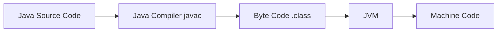
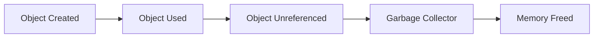
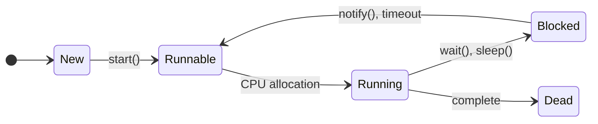
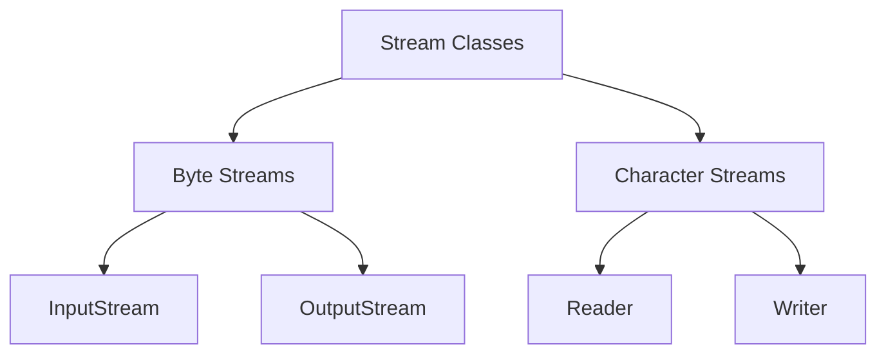
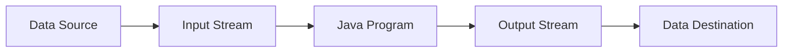

## Question 1(a) [3 marks]

**Write down the difference between oop and pop.**

**Answer**:

| **Aspect** | **OOP** | **POP** |
|------------|---------|---------|
| **Approach** | Bottom-up approach | Top-down approach |
| **Focus** | Objects and classes | Functions and procedures |
| **Data Security** | Data hiding through encapsulation | No data hiding |
| **Problem Solving** | Divide problem into objects | Divide problem into functions |

**Mnemonic:** "Objects Bottom, Procedures Top"

## Question 1(b) [4 marks]

**What is byte code? Explain JVM in detail.**

**Answer**:

**Byte Code**: Platform-independent intermediate code generated by Java compiler from source code.



**JVM Components**:

- **Class Loader**: Loads .class files into memory
- **Memory Area**: Heap, stack, method area storage
- **Execution Engine**: Interprets and executes bytecode
- **Garbage Collector**: Automatic memory management

**Mnemonic:** "Byte Code Runs Everywhere"

## Question 1(c) [7 marks]

**Write a program in Java to sort the elements of an array in ascending order**

**Answer**:

```java
import java.util.Arrays;

public class ArraySort {
    public static void main(String[] args) {
        int[] arr = {64, 34, 25, 12, 22, 11, 90};
        
        // Bubble Sort
        for(int i = 0; i < arr.length-1; i++) {
            for(int j = 0; j < arr.length-i-1; j++) {
                if(arr[j] > arr[j+1]) {
                    int temp = arr[j];
                    arr[j] = arr[j+1];
                    arr[j+1] = temp;
                }
            }
        }
        
        System.out.println("Sorted array: " + Arrays.toString(arr));
    }
}
```

**Key Points**:

- **Bubble Sort**: Compares adjacent elements
- **Time Complexity**: O(n²)
- **Space Complexity**: O(1)

**Mnemonic:** "Bubble Up The Smallest"

## Question 1(c OR) [7 marks]

**Write a program in java to find out maximum from any ten numbers using command line argument.**

**Answer**:

```java
public class FindMaximum {
    public static void main(String[] args) {
        if(args.length != 10) {
            System.out.println("Please enter exactly 10 numbers");
            return;
        }
        
        int max = Integer.parseInt(args[0]);
        
        for(int i = 1; i < args.length; i++) {
            int num = Integer.parseInt(args[i]);
            if(num > max) {
                max = num;
            }
        }
        
        System.out.println("Maximum number: " + max);
    }
}
```

**Key Points**:

- **Command Line**: args[] array stores arguments
- **parseInt()**: Converts string to integer
- **Validation**: Check array length

**Mnemonic:** "Arguments Maximum Search"

## Question 2(a) [3 marks]

**What is wrapper class? Explain with example.**

**Answer**:

**Wrapper Class**: Converts primitive data types into objects.

| **Primitive** | **Wrapper Class** |
|---------------|-------------------|
| int | Integer |
| char | Character |
| boolean | Boolean |
| double | Double |

```java
// Boxing
Integer obj = Integer.valueOf(10);
// Unboxing  
int value = obj.intValue();
```

**Mnemonic:** "Wrap Primitives Into Objects"

## Question 2(b) [4 marks]

**List out different features of java. Explain any two.**

**Answer**:

**Java Features**:

- **Simple**: Easy syntax, no pointers
- **Platform Independent**: Write once, run anywhere  
- **Object Oriented**: Based on objects and classes
- **Secure**: No explicit pointers, bytecode verification

**Detailed Explanation**:

- **Platform Independence**: Java bytecode runs on any platform with JVM
- **Object Oriented**: Supports inheritance, encapsulation, polymorphism, abstraction

**Mnemonic:** "Simple Platform Object Security"

## Question 2(c) [7 marks]

**What is method overriding? Explain with example.**

**Answer**:

**Method Overriding**: Child class provides specific implementation of parent class method.

```java
class Animal {
    public void sound() {
        System.out.println("Animal makes sound");
    }
}

class Dog extends Animal {
    @Override
    public void sound() {
        System.out.println("Dog barks");
    }
}

public class Test {
    public static void main(String[] args) {
        Animal a = new Dog();
        a.sound(); // Output: Dog barks
    }
}
```

**Key Points**:

- **Runtime Polymorphism**: Method called based on object type
- **@Override**: Annotation for method overriding
- **Dynamic Binding**: Method resolution at runtime

**Mnemonic:** "Child Changes Parent Method"

## Question 2(a OR) [3 marks]

**Explain Garbage collection in java.**

**Answer**:

**Garbage Collection**: Automatic memory management that removes unused objects.



**Key Points**:

- **Automatic**: No manual memory deallocation
- **Mark and Sweep**: Identifies and removes unused objects
- **Heap Memory**: Works on heap memory area

**Mnemonic:** "Auto Clean Unused Objects"

## Question 2(b OR) [4 marks]

**Explain static keyword with example.**

**Answer**:

**Static Keyword**: Belongs to class rather than instance.

```java
class Student {
    static String college = "GTU";  // Static variable
    String name;
    
    static void showCollege() {     // Static method
        System.out.println("College: " + college);
    }
}
```

**Static Features**:

- **Memory**: Loaded at class loading time
- **Access**: Can be accessed without object
- **Sharing**: Shared among all instances

**Mnemonic:** "Class Level Memory Sharing"

## Question 2(c OR) [7 marks]

**What is constructor? Explain copy constructor with example.**

**Answer**:

**Constructor**: Special method to initialize objects.

```java
class Person {
    String name;
    int age;
    
    // Default constructor
    Person() {
        name = "Unknown";
        age = 0;
    }
    
    // Parameterized constructor
    Person(String n, int a) {
        name = n;
        age = a;
    }
    
    // Copy constructor
    Person(Person p) {
        name = p.name;
        age = p.age;
    }
}
```

**Constructor Types**:

- **Default**: No parameters
- **Parameterized**: Takes parameters
- **Copy**: Creates object from existing object

**Mnemonic:** "Default Parameter Copy"

## Question 3(a) [3 marks]

**Explain super keyword with example.**

**Answer**:

**Super Keyword**: References parent class members.

```java
class Vehicle {
    String brand = "Generic";
}

class Car extends Vehicle {
    String brand = "Toyota";
    
    void display() {
        System.out.println("Child: " + brand);
        System.out.println("Parent: " + super.brand);
    }
}
```

**Super Uses**:

- **Variables**: Access parent class variables
- **Methods**: Call parent class methods  
- **Constructor**: Call parent class constructor

**Mnemonic:** "Super Calls Parent"

## Question 3(b) [4 marks]

**List out different types of inheritance. Explain multilevel inheritance.**

**Answer**:

**Inheritance Types**:

| **Type** | **Description** |
|----------|-----------------|
| Single | One parent, one child |
| Multilevel | Chain of inheritance |
| Hierarchical | One parent, multiple children |
| Multiple | Multiple parents (via interfaces) |

**Multilevel Inheritance**:

```java
class Animal {
    void eat() { System.out.println("Eating"); }
}

class Mammal extends Animal {
    void breathe() { System.out.println("Breathing"); }
}

class Dog extends Mammal {
    void bark() { System.out.println("Barking"); }
}
```

**Mnemonic:** "Single Multi Hierarchical Multiple"

## Question 3(c) [7 marks]

**What is interface? Explain multiple inheritance with example.**

**Answer**:

**Interface**: Contract that defines what class must do, not how.

```java
interface Flyable {
    void fly();
}

interface Swimmable {
    void swim();
}

class Duck implements Flyable, Swimmable {
    public void fly() {
        System.out.println("Duck is flying");
    }
    
    public void swim() {
        System.out.println("Duck is swimming");
    }
}
```

**Interface Features**:

- **Multiple Inheritance**: Class can implement multiple interfaces
- **Abstract Methods**: All methods are abstract by default
- **Constants**: All variables are public, static, final

**Mnemonic:** "Multiple Abstract Constants"

## Question 3(a OR) [3 marks]

**Explain final keyword with example.**

**Answer**:

**Final Keyword**: Restricts modification, inheritance, or overriding.

```java
final class Math {           // Cannot be inherited
    final int PI = 3.14;     // Cannot be modified
    
    final void calculate() { // Cannot be overridden
        System.out.println("Calculating");
    }
}
```

**Final Uses**:

- **Class**: Cannot be extended
- **Method**: Cannot be overridden
- **Variable**: Cannot be reassigned

**Mnemonic:** "Final Stops Changes"

## Question 3(b OR) [4 marks]

**Explain different access controls in Java.**

**Answer**:

**Access Modifiers**:

| **Modifier** | **Same Class** | **Same Package** | **Subclass** | **Different Package** |
|--------------|----------------|------------------|--------------|----------------------|
| public | ✓ | ✓ | ✓ | ✓ |
| protected | ✓ | ✓ | ✓ | ✗ |
| default | ✓ | ✓ | ✗ | ✗ |
| private | ✓ | ✗ | ✗ | ✗ |

**Mnemonic:** "Public Protected Default Private"

## Question 3(c OR) [7 marks]

**What is package? Write steps to create a package and give example of it.**

**Answer**:

**Package**: Group of related classes and interfaces.

**Steps to Create Package**:

1. **Declare**: Use package statement at top
2. **Compile**: javac -d . ClassName.java  
3. **Run**: java packagename.ClassName

```java
// File: mypack/Calculator.java
package mypack;

public class Calculator {
    public int add(int a, int b) {
        return a + b;
    }
}

// File: Test.java
import mypack.Calculator;

public class Test {
    public static void main(String[] args) {
        Calculator calc = new Calculator();
        System.out.println(calc.add(5, 3));
    }
}
```

**Package Benefits**:

- **Organization**: Groups related classes
- **Access Control**: Package-level protection
- **Namespace**: Avoids naming conflicts

**Mnemonic:** "Declare Compile Run"

## Question 4(a) [3 marks]

**Explain thread priorities with suitable example.**

**Answer**:

**Thread Priority**: Determines thread execution order (1-10 scale).

```java
class MyThread extends Thread {
    public void run() {
        System.out.println(getName() + " Priority: " + getPriority());
    }
}

public class ThreadPriorityExample {
    public static void main(String[] args) {
        MyThread t1 = new MyThread();
        MyThread t2 = new MyThread();
        
        t1.setPriority(Thread.MIN_PRIORITY);  // 1
        t2.setPriority(Thread.MAX_PRIORITY);  // 10
        
        t1.start();
        t2.start();
    }
}
```

**Priority Constants**:

- **MIN_PRIORITY**: 1
- **NORM_PRIORITY**: 5  
- **MAX_PRIORITY**: 10

**Mnemonic:** "Min Normal Max"

## Question 4(b) [4 marks]

**What is Thread? Explain Thread life cycle.**

**Answer**:

**Thread**: Lightweight process for concurrent execution.



**Thread States**:

- **New**: Thread created but not started
- **Runnable**: Ready to run
- **Running**: Currently executing
- **Blocked**: Waiting for resource
- **Dead**: Execution completed

**Mnemonic:** "New Runnable Running Blocked Dead"

## Question 4(c) [7 marks]

**Write a program in java that create the multiple threads by implementing the Runnable interface.**

**Answer**:

```java
class MyRunnable implements Runnable {
    private String threadName;
    
    MyRunnable(String name) {
        threadName = name;
    }
    
    public void run() {
        for(int i = 1; i <= 5; i++) {
            System.out.println(threadName + " - Count: " + i);
            try {
                Thread.sleep(1000);
            } catch(InterruptedException e) {
                e.printStackTrace();
            }
        }
    }
}

public class MultipleThreads {
    public static void main(String[] args) {
        Thread t1 = new Thread(new MyRunnable("Thread-1"));
        Thread t2 = new Thread(new MyRunnable("Thread-2"));
        Thread t3 = new Thread(new MyRunnable("Thread-3"));
        
        t1.start();
        t2.start(); 
        t3.start();
    }
}
```

**Key Points**:

- **Runnable Interface**: Better than extending Thread class
- **Thread.sleep()**: Pauses thread execution
- **Multiple Threads**: Run concurrently

**Mnemonic:** "Implement Runnable Start Multiple"

## Question 4(a OR) [3 marks]

**List four different inbuilt exceptions. Explain any one inbuilt exception.**

**Answer**:

**Inbuilt Exceptions**:

- **NullPointerException**: Accessing null object
- **ArrayIndexOutOfBoundsException**: Invalid array index
- **ArithmeticException**: Division by zero
- **NumberFormatException**: Invalid number format

**ArithmeticException**: Thrown when arithmetic operation fails.

```java
int result = 10 / 0; // Throws ArithmeticException
```

**Mnemonic:** "Null Array Arithmetic Number"

## Question 4(b OR) [4 marks]

**Explain Try and Catch with suitable example.**

**Answer**:

**Try-Catch**: Exception handling mechanism.

```java
public class TryCatchExample {
    public static void main(String[] args) {
        try {
            int[] arr = {1, 2, 3};
            System.out.println(arr[5]); // Index out of bounds
        }
        catch(ArrayIndexOutOfBoundsException e) {
            System.out.println("Array index error: " + e.getMessage());
        }
        finally {
            System.out.println("Always executed");
        }
    }
}
```

**Exception Handling Flow**:

- **Try**: Code that may throw exception
- **Catch**: Handles specific exceptions  
- **Finally**: Always executes

**Mnemonic:** "Try Catch Finally"

## Question 4(c OR) [7 marks]

**What is Exception? Write a program that show the use of Arithmetic Exception.**

**Answer**:

**Exception**: Runtime error that disrupts normal program flow.

```java
public class ArithmeticExceptionExample {
    public static void main(String[] args) {
        Scanner sc = new Scanner(System.in);
        
        try {
            System.out.print("Enter first number: ");
            int num1 = sc.nextInt();
            
            System.out.print("Enter second number: ");
            int num2 = sc.nextInt();
            
            int result = num1 / num2;
            System.out.println("Result: " + result);
        }
        catch(ArithmeticException e) {
            System.out.println("Error: Cannot divide by zero!");
        }
        catch(Exception e) {
            System.out.println("General error: " + e.getMessage());
        }
        finally {
            sc.close();
        }
    }
}
```

**Exception Types**:

- **Checked**: Compile-time exceptions
- **Unchecked**: Runtime exceptions
- **Error**: System-level problems

**Mnemonic:** "Runtime Error Disrupts Flow"

## Question 5(a) [3 marks]

**Explain ArrayIndexOutOfBound Exception in Java with example.**

**Answer**:

**ArrayIndexOutOfBoundsException**: Thrown when accessing invalid array index.

```java
public class ArrayIndexExample {
    public static void main(String[] args) {
        int[] numbers = {10, 20, 30};
        
        try {
            System.out.println(numbers[5]); // Invalid index
        }
        catch(ArrayIndexOutOfBoundsException e) {
            System.out.println("Invalid array index: " + e.getMessage());
        }
    }
}
```

**Key Points**:

- **Valid Range**: 0 to array.length-1
- **Negative Index**: Also throws exception
- **Runtime Exception**: Unchecked exception

**Mnemonic:** "Array Index Range Check"

## Question 5(b) [4 marks]

**Explain basics of stream classes.**

**Answer**:

**Stream Classes**: Handle input/output operations.

| **Stream Type** | **Classes** |
|-----------------|-------------|
| Byte Streams | InputStream, OutputStream |
| Character Streams | Reader, Writer |
| File Streams | FileInputStream, FileOutputStream |
| Buffered Streams | BufferedReader, BufferedWriter |



**Stream Features**:

- **Sequential**: Data flows in sequence
- **One Direction**: Either input or output
- **Automatic**: Handles low-level details

**Mnemonic:** "Byte Character File Buffered"

## Question 5(c) [7 marks]

**Write a java program to create a text file and perform read operation on the text file.**

**Answer**:

```java
import java.io.*;

public class FileReadExample {
    public static void main(String[] args) {
        // Create and write to file
        try {
            FileWriter writer = new FileWriter("sample.txt");
            writer.write("Hello World!\n");
            writer.write("Java File Handling\n");
            writer.write("GTU Exam 2024");
            writer.close();
            System.out.println("File created successfully");
        }
        catch(IOException e) {
            System.out.println("Error creating file: " + e.getMessage());
        }
        
        // Read from file
        try {
            BufferedReader reader = new BufferedReader(new FileReader("sample.txt"));
            String line;
            
            System.out.println("\nFile contents:");
            while((line = reader.readLine()) != null) {
                System.out.println(line);
            }
            reader.close();
        }
        catch(IOException e) {
            System.out.println("Error reading file: " + e.getMessage());
        }
    }
}
```

**Key Points**:

- **FileWriter**: Creates and writes to file
- **BufferedReader**: Efficient reading
- **Exception Handling**: Handle IOException

**Mnemonic:** "Create Write Read Close"

## Question 5(a OR) [3 marks]

**Explain Divide by Zero Exception in Java with example.**

**Answer**:

**ArithmeticException**: Thrown during divide by zero operation.

```java
public class DivideByZeroExample {
    public static void main(String[] args) {
        try {
            int a = 10;
            int b = 0;
            int result = a / b;  // Throws ArithmeticException
            System.out.println("Result: " + result);
        }
        catch(ArithmeticException e) {
            System.out.println("Cannot divide by zero: " + e.getMessage());
        }
    }
}
```

**Key Points**:

- **Integer Division**: Only integer division by zero throws exception
- **Floating Point**: Returns Infinity for floating point division
- **Runtime Exception**: Unchecked exception

**Mnemonic:** "Zero Division Arithmetic Error"

## Question 5(b OR) [4 marks]

**Explain java I/O process.**

**Answer**:

**Java I/O Process**: Mechanism for reading and writing data.



**I/O Components**:

- **Stream**: Sequence of data
- **Buffer**: Temporary storage for efficiency
- **File**: Persistent storage
- **Network**: Remote data transfer

**I/O Types**:

- **Byte-oriented**: Raw data (images, videos)
- **Character-oriented**: Text data
- **Synchronous**: Blocking operations
- **Asynchronous**: Non-blocking operations

**Mnemonic:** "Stream Buffer File Network"

## Question 5(c OR) [7 marks]

**Write a java program to create a text file and perform write operation on the text file.**

**Answer**:

```java
import java.io.*;
import java.util.Scanner;

public class FileWriteExample {
    public static void main(String[] args) {
        Scanner sc = new Scanner(System.in);
        
        try {
            // Create file with FileWriter
            FileWriter writer = new FileWriter("student.txt");
            
            System.out.println("Enter student details:");
            System.out.print("Name: ");
            String name = sc.nextLine();
            
            System.out.print("Roll Number: ");
            String rollNo = sc.nextLine();
            
            System.out.print("Branch: ");
            String branch = sc.nextLine();
            
            // Write data to file
            writer.write("Student Information\n");
            writer.write("==================\n");
            writer.write("Name: " + name + "\n");
            writer.write("Roll Number: " + rollNo + "\n");
            writer.write("Branch: " + branch + "\n");
            writer.write("Date: " + new java.util.Date() + "\n");
            
            writer.close();
            System.out.println("\nData written to file successfully!");
            
        }
        catch(IOException e) {
            System.out.println("Error writing to file: " + e.getMessage());
        }
        finally {
            sc.close();
        }
    }
}
```

**Key Points**:

- **FileWriter**: Writes character data to file
- **BufferedWriter**: More efficient for large data
- **Auto-close**: Use try-with-resources for automatic closing

**Mnemonic:** "Create Write Close Handle"
