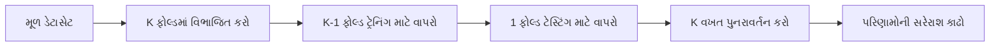
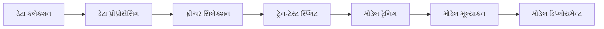
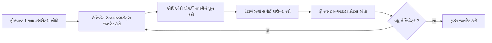

## પ્રશ્ન 1(અ) [3 માર્ક્સ]

**હ્યુમન લર્નિંગને વ્યાખ્યાયિત કરો. હ્યુમન લર્નિંગના પ્રકારોની યાદી બનાવો.**

**જવાબ**:

હ્યુમન લર્નિંગ એ પ્રક્રિયા છે જેના દ્વારા માનવીઓ અનુભવ, અભ્યાસ અથવા સૂચનાઓ દ્વારા નવા જ્ઞાન, કૌશલ્યો, વર્તન મેળવે છે અથવા હાલનાઓમાં ફેરફાર કરે છે.

**હ્યુમન લર્નિંગના પ્રકારો:**

| પ્રકાર | વર્ણન |
|------|-------------|
| **સુપરવાઇઝ્ડ લર્નિંગ** | શિક્ષક/માર્ગદર્શકની મદદથી શીખવું |
| **અનસુપરવાઇઝ્ડ લર્નિંગ** | બાહ્ય માર્ગદર્શન વિના સ્વ-નિર્દેશિત શીખવું |
| **રિઇનફોર્સમેન્ટ લર્નિંગ** | ફીડબેક સાથે પ્રયાસ અને ભૂલ દ્વારા શીખવું |

**મેમરી ટ્રીક:** "SUR - Supervised, Unsupervised, Reinforcement"

## પ્રશ્ન 1(બ) [4 માર્ક્સ]

**ક્વાલિટેટિવ ડેટા અને ક્વોન્ટિટેટિવ ડેટા વચ્ચે તફાવત આપો.**

**જવાબ**:

**ટેબલ: ક્વાલિટેટિવ vs ક્વોન્ટિટેટિવ ડેટા**

| લક્ષણ | ક્વાલિટેટિવ ડેટા | ક્વોન્ટિટેટિવ ડેટા |
|---------|-----------------|-------------------|
| **પ્રકૃતિ** | વર્ણનાત્મક, કેટેગોરિકલ | સંખ્યાત્મક, માપી શકાય તેવું |
| **વિશ્લેષણ** | વ્યક્તિગત અર્થઘટન | આંકડાકીય વિશ્લેષણ |
| **ઉદાહરણો** | રંગો, નામો, લિંગ | ઊંચાઈ, વજન, ઉંમર |
| **પ્રતિનિધિત્વ** | શબ્દો, કેટેગરીઓ | સંખ્યાઓ, ગ્રાફ્સ |

**મેમરી ટ્રીક:** "QUAN-Numbers, QUAL-Words"

## પ્રશ્ન 1(ક) [7 માર્ક્સ]

**મશીન લર્નિંગના વિવિધ પ્રકારોની સરખામણી કરો.**

**જવાબ**:

**ટેબલ: મશીન લર્નિંગના પ્રકારોની સરખામણી**

| પ્રકાર | ટ્રેનિંગ ડેટા | ધ્યેય | ઉદાહરણો |
|------|---------------|------|----------|
| **સુપરવાઇઝ્ડ** | લેબલ્ડ ડેટા | પરિણામોની આગાહી | ક્લાસિફિકેશન, રિગ્રેશન |
| **અનસુપરવાઇઝ્ડ** | અનલેબલ્ડ ડેટા | પેટર્ન શોધવા | ક્લસ્ટરિંગ, એસોસિએશન |
| **રિઇનફોર્સમેન્ટ** | રિવોર્ડ/પેનલ્ટી | રિવોર્ડ મેક્સિમાઇઝ કરવા | ગેમિંગ, રોબોટિક્સ |

**મુખ્ય તફાવતો:**

- **સુપરવાઇઝ્ડ**: ટ્રેનિંગ માટે ઇનપુટ-આઉટપુટ જોડીનો ઉપયોગ કરે છે
- **અનસુપરવાઇઝ્ડ**: ડેટામાં છુપાયેલા પેટર્ન શોધે છે
- **રિઇનફોર્સમેન્ટ**: પર્યાવરણ સાથે ક્રિયાપ્રતિક્રિયા દ્વારા શીખે છે

**મેમરી ટ્રીક:** "SUR-LAP: Supervised-Labeled, Unsupervised-Reveal, Reinforcement-Action"

## પ્રશ્ન 1(ક OR) [7 માર્ક્સ]

**મશીન લર્નિંગ વ્યાખ્યાયિત કરો. મશીન લર્નિંગની કોઈપણ ચાર એપ્લિકેશનને ટૂંકમાં સમજાવો.**

**જવાબ**:

મશીન લર્નિંગ આર્ટિફિશિયલ ઇન્ટેલિજન્સનો ઉપવિભાગ છે જે કમ્પ્યુટરોને સ્પષ્ટ પ્રોગ્રામિંગ વિના ડેટામાંથી શીખવા અને નિર્ણયો લેવા સક્ષમ બનાવે છે.

**ચાર એપ્લિકેશનો:**

| એપ્લિકેશન | વર્ણન |
|-------------|-------------|
| **ઈમેઇલ સ્પામ ડિટેક્શન** | ઈમેઇલને સ્પામ અથવા વૈધ તરીકે વર્ગીકૃત કરે છે |
| **ઇમેજ રેકગ્નિશન** | ફોટોમાં ઓબ્જેક્ટ્સ ઓળખે છે |
| **રેકમેન્ડેશન સિસ્ટમ** | યુઝર્સને પ્રોડક્ટ્સ/કન્ટેન્ટ સૂચવે છે |
| **મેડિકલ ડાયગ્નોસિસ** | રોગોની શોધમાં ડૉક્ટરોની મદદ કરે છે |

**મેમરી ટ્રીક:** "SIRM - Spam, Image, Recommendation, Medical"

## પ્રશ્ન 2(અ) [3 માર્ક્સ]

**નીચેના ઉદાહરણોનો યોગ્ય ડેટા પ્રકાર જણાવો.**

**જવાબ**:

**ડેટા પ્રકાર વર્ગીકરણ:**

| ઉદાહરણ | ડેટા પ્રકાર |
|---------|-----------|
| **વિદ્યાર્થીઓની રાષ્ટ્રીયતા** | કેટેગોરિકલ (નોમિનલ) |
| **વિદ્યાર્થીઓની શિક્ષણ સ્થિતિ** | કેટેગોરિકલ (ઓર્ડિનલ) |
| **વિદ્યાર્થીઓની ઊંચાઈ** | ન્યુમેરિકલ (કન્ટિન્યુઅસ) |

**મેમરી ટ્રીક:** "NCN - Nominal, Categorical, Numerical"

## પ્રશ્ન 2(બ) [4 માર્ક્સ]

**ડેટા પ્રી-પ્રોસેસિંગ ટૂંકમાં સમજાવો.**

**જવાબ**:

ડેટા પ્રી-પ્રોસેસિંગ એ મશીન લર્નિંગ અલ્ગોરિધમ માટે કાચા ડેટાને તૈયાર કરવાની તકનીક છે.

**મુખ્ય સ્ટેપ્સ:**

| સ્ટેપ | હેતુ |
|------|---------|
| **ડેટા ક્લીનિંગ** | ભૂલો અને અસંગતતાઓ દૂર કરવી |
| **ડેટા ઇન્ટીગ્રેશન** | બહુવિધ સ્ત્રોતોમાંથી ડેટાને જોડવો |
| **ડેટા ટ્રાન્સફોર્મેશન** | ડેટાને યોગ્ય ફોર્મેટમાં બદલવો |
| **ડેટા રિડક્શન** | માહિતી જાળવીને ડેટાનું કદ ઘટાડવું |

**મેમરી ટ્રીક:** "CITR - Clean, Integrate, Transform, Reduce"

## પ્રશ્ન 2(ક) [7 માર્ક્સ]

**K-ફોલ્ડ ક્રોસ વેલિડેશન વિગતવાર સમજાવો.**

**જવાબ**:

K-ફોલ્ડ ક્રોસ વેલિડેશન એ ડેટાને K સમાન ભાગોમાં વિભાજિત કરીને મોડેલ પરફોર્મન્સ મૂલ્યાંકનની તકનીક છે.

**પ્રક્રિયા:**



**સ્ટેપ્સ:**

- **વિભાજન**: ડેટાસેટને K સમાન ભાગોમાં વહેંચો
- **ટ્રેનિંગ**: K-1 ફોલ્ડનો ઉપયોગ ટ્રેનિંગ માટે કરો
- **ટેસ્ટ**: બાકીના ફોલ્ડનો ઉપયોગ વેલિડેશન માટે કરો
- **પુનરાવર્તન**: K વખત પ્રક્રિયા કરો
- **સરેરાશ**: સરેરાશ પરફોર્મન્સ કાઢો

**ફાયદા:**

- ઓવરફિટિંગ ઘટાડે છે
- મર્યાદિત ડેટાનો બહેતર ઉપયોગ
- વધુ વિશ્વસનીય પરફોર્મન્સ અંદાજ

**મેમરી ટ્રીક:** "DTRA - Divide, Train, Repeat, Average"

## પ્રશ્ન 2(અ OR) [3 માર્ક્સ]

**નીચેના શબ્દો વ્યાખ્યાયિત કરો: i) Mean, ii) Outliers, iii) Interquartile range**

**જવાબ**:

**આંકડાકીય શબ્દો:**

| શબ્દ | વ્યાખ્યા |
|------|------------|
| **Mean** | ડેટાસેટમાં બધી વેલ્યુઝની સરેરાશ |
| **Outliers** | અન્ય ડેટા પોઇન્ટ્સથી નોંધપાત્ર રીતે અલગ ડેટા પોઇન્ટ્સ |
| **Interquartile Range** | 75મા અને 25મા પર્સેન્ટાઇલ વચ્ચેનો તફાવત |

**મેમરી ટ્રીક:** "MOI - Mean, Outliers, Interquartile"

## પ્રશ્ન 2(બ OR) [4 માર્ક્સ]

**કન્ફ્યુશન મેટ્રિક્સની રચના સમજાવો.**

**જવાબ**:

**કન્ફ્યુશન મેટ્રિક્સ સ્ટ્રક્ચર:**

| | આગાહી |  |
|---|---|---|
| **વાસ્તવિક** | **પોઝિટિવ** | **નેગેટિવ** |
| **પોઝિટિવ** | True Positive (TP) | False Negative (FN) |
| **નેગેટિવ** | False Positive (FP) | True Negative (TN) |

**ઘટકો:**

- **TP**: સાચી રીતે આગાહી કરેલા પોઝિટિવ કેસો
- **TN**: સાચી રીતે આગાહી કરેલા નેગેટિવ કેસો
- **FP**: ખોટી રીતે પોઝિટિવ તરીકે આગાહી કરેલા
- **FN**: ખોટી રીતે નેગેટિવ તરીકે આગાહી કરેલા

**મેમરી ટ્રીક:** "TTFF - True True, False False"

## પ્રશ્ન 2(ક OR) [7 માર્ક્સ]

**ફીચર સબસેટની પસંદગી પર ટૂંકી નોંધ લખો.**

**જવાબ**:

ફીચર સબસેટ સિલેક્શન એ મૂળ ફીચર સેટમાંથી સંબંધિત ફીચર્સ પસંદ કરવાની પ્રક્રિયા છે.

**મેથડ્સ:**

| મેથડ | વર્ણન |
|--------|-------------|
| **ફિલ્ટર મેથડ્સ** | ફીચર્સ રેન્ક કરવા આંકડાકીય માપદંડોનો ઉપયોગ |
| **રેપર મેથડ્સ** | ફીચર સબસેટ્સ મૂલ્યાંકન માટે ML અલ્ગોરિધમનો ઉપયોગ |
| **એમ્બેડેડ મેથડ્સ** | મોડેલ ટ્રેનિંગ દરમિયાન ફીચર સિલેક્શન |

**ફાયદા:**

- **ઘટાડેલી જટિલતા**: ઓછા ફીચર્સ, સરળ મોડેલ્સ
- **સુધારેલ પરફોર્મન્સ**: નોઇઝ અને અપ્રસ્તુત ફીચર્સ દૂર કરે છે
- **ઝડપી ટ્રેનિંગ**: ઓછો કમ્પ્યુટેશનલ ઓવરહેડ

**લોકપ્રિય તકનીકો:**

- Chi-square ટેસ્ટ
- Recursive Feature Elimination
- LASSO રેગ્યુલરાઇઝેશન

**મેમરી ટ્રીક:** "FWE - Filter, Wrapper, Embedded"

## પ્રશ્ન 3(અ) [3 માર્ક્સ]

**પ્રેડિક્ટિવ મોડેલ અને ડીસ્ક્રિપ્ટિવ મોડેલ વચ્ચેનો તફાવત આપો.**

**જવાબ**:

**મોડેલ પ્રકાર સરખામણી:**

| લક્ષણ | પ્રેડિક્ટિવ મોડેલ | ડીસ્ક્રિપ્ટિવ મોડેલ |
|---------|------------------|-------------------|
| **હેતુ** | ભાવિ પરિણામોની આગાહી | વર્તમાન પેટર્ન સમજવા |
| **આઉટપુટ** | આગાહીઓ/વર્ગીકરણ | અંતર્દૃષ્ટિ/સારાંશ |
| **ઉદાહરણો** | રિગ્રેશન, ક્લાસિફિકેશન | ક્લસ્ટરિંગ, એસોસિએશન રૂલ્સ |

**મેમરી ટ્રીક:** "PF-DC: Predictive-Future, Descriptive-Current"

## પ્રશ્ન 3(બ) [4 માર્ક્સ]

**ક્લાસિફિકેશન અને રિગ્રેશન વચ્ચેના તફાવતની ચર્ચા કરો.**

**જવાબ**:

**ક્લાસિફિકેશન vs રિગ્રેશન:**

| પાસું | ક્લાસિફિકેશન | રિગ્રેશન |
|--------|----------------|------------|
| **આઉટપુટ** | ડિસ્ક્રીટ કેટેગરીઓ | કન્ટિન્યુઅસ વેલ્યુઝ |
| **ધ્યેય** | ક્લાસ લેબલ્સની આગાહી | ન્યુમેરિકલ વેલ્યુઝની આગાહી |
| **ઉદાહરણો** | સ્પામ ડિટેક્શન, ઇમેજ રેકગ્નિશન | કિંમત આગાહી, તાપમાન |
| **મૂલ્યાંકન** | Accuracy, precision, recall | MSE, RMSE, R-squared |

**મેમરી ટ્રીક:** "CCNM - Classification-Categories, Regression-Numbers"

## પ્રશ્ન 3(ક) [7 માર્ક્સ]

**ક્લાસિફિકેશનને વ્યાખ્યાયિત કરો. ક્લાસિફિકેશન લર્નિંગના સ્ટેપને વિગતોમાં સમજાવો.**

**જવાબ**:

ક્લાસિફિકેશન એ સુપરવાઇઝ્ડ લર્નિંગ તકનીક છે જે ઇનપુટ ડેટા માટે ડિસ્ક્રીટ ક્લાસ લેબલ્સની આગાહી કરે છે.

**ક્લાસિફિકેશન લર્નિંગ સ્ટેપ્સ:**



**વિગતવાર સ્ટેપ્સ:**

- **ડેટા કલેક્શન**: લેબલ્ડ ટ્રેનિંગ ડેટા એકત્ર કરવો
- **પ્રીપ્રોસેસિંગ**: ડેટાને સાફ કરવો અને તૈયાર કરવો
- **ફીચર સિલેક્શન**: સંબંધિત લક્ષણો પસંદ કરવા
- **ડેટા સ્પ્લિટ**: ટ્રેનિંગ અને ટેસ્ટિંગ સેટમાં વિભાજન
- **ટ્રેનિંગ**: ટ્રેનિંગ ડેટાનો ઉપયોગ કરીને મોડેલ બનાવવું
- **મૂલ્યાંકન**: મોડેલ પરફોર્મન્સ ચકાસવી
- **ડિપ્લોયમેન્ટ**: આગાહીઓ માટે મોડેલનો ઉપયોગ

**મેમરી ટ્રીક:** "DCFSTED - Data, Clean, Features, Split, Train, Evaluate, Deploy"

## પ્રશ્ન 3(અ OR) [3 માર્ક્સ]

**બેગિંગ અને બૂસ્ટિંગ વચ્ચેનો તફાવત આપો.**

**જવાબ**:

**બેગિંગ vs બૂસ્ટિંગ:**

| લક્ષણ | બેગિંગ | બૂસ્ટિંગ |
|---------|---------|----------|
| **સેમ્પલિંગ** | બૂટસ્ટ્રેપ સેમ્પલિંગ | ક્રમાનુગત વેઇટેડ સેમ્પલિંગ |
| **ટ્રેનિંગ** | પેરેલલ ટ્રેનિંગ | ક્રમાનુગત ટ્રેનિંગ |
| **ફોકસ** | વેરિયન્સ ઘટાડવું | બાયસ ઘટાડવું |

**મેમરી ટ્રીક:** "BPV-BSB: Bagging-Parallel-Variance, Boosting-Sequential-Bias"

## પ્રશ્ન 3(બ OR) [4 માર્ક્સ]

**લોજિસ્ટિક રિગ્રેશનના વિવિધ પ્રકારો સંક્ષિપ્તમાં સમજાવો.**

**જવાબ**:

**લોજિસ્ટિક રિગ્રેશનના પ્રકારો:**

| પ્રકાર | ક્લાસો | ઉપયોગ |
|------|---------|----------|
| **બાઇનરી** | 2 ક્લાસો | હા/ના, પાસ/ફેઇલ |
| **મલ્ટિનોમિયલ** | 3+ ક્લાસો (અવ્યવસ્થિત) | રંગ વર્ગીકરણ |
| **ઓર્ડિનલ** | 3+ ક્લાસો (ક્રમાંકિત) | રેટિંગ સ્કેલ |

**મેમરી ટ્રીક:** "BMO - Binary, Multinomial, Ordinal"

## પ્રશ્ન 3(ક OR) [7 માર્ક્સ]

**k-NN અલ્ગોરિધમ લખો અને તેના ઉપયોગ બતાવો.**

**જવાબ**:

K-નિયરેસ્ટ નેઇબર્સ (k-NN) એ લેઝી લર્નિંગ અલ્ગોરિધમ છે જે k નજીકના પડોશીઓના બહુમતી ક્લાસના આધારે ડેટા પોઇન્ટ્સને વર્ગીકૃત કરે છે.

**અલ્ગોરિધમ:**

```goat
1. k ની વેલ્યુ પસંદ કરો
2. બધા ટ્રેનિંગ પોઇન્ટ્સ સાથે અંતર કાઢો
3. k નજીકના પડોશીઓ પસંદ કરો
4. ક્લાસિફિકેશન માટે: બહુમતી મત
   રિગ્રેશન માટે: k પડોશીઓની સરેરાશ
5. ટેસ્ટ પોઇન્ટને ક્લાસ/વેલ્યુ અસાઇન કરો
```

**અંતર ગણતરી:**

- **યુક્લિડિયન ડિસ્ટન્સ**: √[(x₁-x₂)² + (y₁-y₂)²]

**એપ્લિકેશનો:**

- **રેકમેન્ડેશન સિસ્ટમ્સ**: સમાન યુઝર પ્રાધાન્યો
- **ઇમેજ રેકગ્નિશન**: પેટર્ન મેચિંગ
- **મેડિકલ ડાયગ્નોસિસ**: લક્ષણોની સમાનતા

**ફાયદા:**

- અમલમાં મૂકવામાં સરળ
- ટ્રેનિંગની જરૂર નથી
- નાના ડેટાસેટ સાથે સારું કામ કરે છે

**મેમરી ટ્રીક:** "CDSA - Choose, Distance, Select, Assign"

## પ્રશ્ન 4(અ) [3 માર્ક્સ]

**સપોર્ટ વેક્ટર મશીનની એપ્લિકેશનોની યાદી બનાવો.**

**જવાબ**:

**SVM એપ્લિકેશનો:**

| એપ્લિકેશન | ડોમેન |
|-------------|--------|
| **ટેક્સ્ટ ક્લાસિફિકેશન** | ડોક્યુમેન્ટ કેટેગોરાઇઝેશન |
| **ઇમેજ રેકગ્નિશન** | ફેસ ડિટેક્શન |
| **બાયોઇન્ફોર્મેટિક્સ** | જીન ક્લાસિફિકેશન |

**મેમરી ટ્રીક:** "TIB - Text, Image, Bio"

## પ્રશ્ન 4(બ) [4 માર્ક્સ]

**k-means અલ્ગોરિધમ માટે સ્યુડો કોડ બનાવો.**

**જવાબ**:

**K-means સ્યુડો કોડ:**

```
BEGIN K-means
1. k ક્લસ્ટર સેન્ટ્રોઇડ્સને રેન્ડમલી ઇનિશિયલાઇઝ કરો
2. REPEAT
   a. દરેક પોઇન્ટને નજીકના સેન્ટ્રોઇડને અસાઇન કરો
   b. અસાઇન કરેલા પોઇન્ટ્સના મીન તરીકે સેન્ટ્રોઇડ્સ અપડેટ કરો
   c. ટોટલ વિથિન-ક્લસ્ટર સમ ઓફ સ્ક્વેર્સ કાઢો
3. UNTIL કન્વર્જન્સ અથવા મેક્સ આવર્તન
4. RETURN ફાઇનલ ક્લસ્ટર્સ અને સેન્ટ્રોઇડ્સ
END
```

**મેમરી ટ્રીક:** "IAUC - Initialize, Assign, Update, Check"

## પ્રશ્ન 4(ક) [7 માર્ક્સ]

**અનસુપરવાઇઝ્ડ લર્નિંગની એપ્લિકેશનો લખો અને સમજાવો.**

**જવાબ**:

અનસુપરવાઇઝ્ડ લર્નિંગ લેબલ્ડ ઉદાહરણો વિના ડેટામાં છુપાયેલા પેટર્ન શોધે છે.

**મુખ્ય એપ્લિકેશનો:**

| એપ્લિકેશન | વર્ણન | ઉદાહરણ |
|-------------|-------------|---------|
| **કસ્ટમર સેગ્મેન્ટેશન** | વર્તન પ્રમાણે ગ્રાહકોનું ગ્રુપિંગ | માર્કેટ રિસર્ચ |
| **એનોમેલી ડિટેક્શન** | અસામાન્ય પેટર્ન ઓળખવા | ફ્રોડ ડિટેક્શન |
| **ડેટા કમ્પ્રેશન** | ડાયમેન્શનાલિટી ઘટાડવી | ઇમેજ કમ્પ્રેશન |
| **એસોસિએશન રૂલ્સ** | આઇટમ સંબંધો શોધવા | માર્કેટ બાસ્કેટ વિશ્લેષણ |

**ક્લસ્ટરિંગ એપ્લિકેશનો:**

- **માર્કેટ રિસર્ચ**: કસ્ટમર ગ્રુપિંગ
- **સોશિયલ નેટવર્ક વિશ્લેષણ**: કમ્યુનિટી ડિટેક્શન
- **જીન સીક્વેન્સિંગ**: બાયોલોજિકલ ક્લાસિફિકેશન

**ડાયમેન્શનાલિટી રિડક્શન:**

- **વિઝ્યુઅલાઇઝેશન**: હાઇ-ડાયમેન્શનલ ડેટા પ્લોટિંગ
- **ફીચર એક્સ્ટ્રેક્શન**: નોઇઝ રિડક્શન

**મેમરી ટ્રીક:** "CADA - Customer, Anomaly, Data, Association"

## પ્રશ્ન 4(અ OR) [3 માર્ક્સ]

**રિગ્રેશનની એપ્લિકેશનોની યાદી બનાવો.**

**જવાબ**:

**રિગ્રેશન એપ્લિકેશનો:**

| એપ્લિકેશન | હેતુ |
|-------------|---------|
| **સ્ટોક પ્રાઇસ પ્રેડિક્શન** | ફાઇનાન્શિયલ ફોરકાસ્ટિંગ |
| **સેલ્સ ફોરકાસ્ટિંગ** | બિઝનેસ પ્લાનિંગ |
| **મેડિકલ ડાયગ્નોસિસ** | રિસ્ક એસેસમેન્ટ |

**મેમરી ટ્રીક:** "SSM - Stock, Sales, Medical"

## પ્રશ્ન 4(બ OR) [4 માર્ક્સ]

**નીચેના શબ્દો વ્યાખ્યાયિત કરો: i) Support ii) Confidence**

**જવાબ**:

**એસોસિએશન રૂલ શબ્દો:**

| શબ્દ | વ્યાખ્યા | ફોર્મ્યુલા |
|------|------------|---------|
| **Support** | ડેટાબેઝમાં આઇટમસેટની આવર્તન | Support(A) = \|A\| / \|D\| |
| **Confidence** | રૂલની શરતી સંભાવના | Confidence(A→B) = Support(A∪B) / Support(A) |

**ઉદાહરણ:**

- જો 30% ટ્રાન્ઝેક્શનમાં બ્રેડ અને દૂધ હોય: Support = 0.3
- જો 80% બ્રેડ ખરીદનારાઓ દૂધ પણ ખરીદે: Confidence = 0.8

**મેમરી ટ્રીક:** "SF-CP: Support-Frequency, Confidence-Probability"

## પ્રશ્ન 4(ક OR) [7 માર્ક્સ]

**apriori algorithm ને વિગતવાર સમજાવો.**

**જવાબ**:

Apriori અલ્ગોરિધમ એપ્રિઓરી પ્રોપર્ટીનો ઉપયોગ કરીને ટ્રાન્ઝેક્શનલ ડેટામાં ફ્રીક્વન્ટ આઇટમસેટ્સ શોધે છે.

**અલ્ગોરિધમ સ્ટેપ્સ:**



**એપ્રિઓરી પ્રોપર્ટી:**

- જો આઇટમસેટ ફ્રીક્વન્ટ છે, તો તેના બધા સબસેટ્સ ફ્રીક્વન્ટ છે
- જો આઇટમસેટ ઇનફ્રીક્વન્ટ છે, તો તેના બધા સુપરસેટ્સ ઇનફ્રીક્વન્ટ છે

**સ્ટેપ્સ:**

1. **ડેટાબેઝ સ્કેન**: 1-આઇટમ સપોર્ટ કાઉન્ટ કરો
2. **કેન્ડિડેટ્સ જનરેટ**: ફ્રીક્વન્ટ k-આઇટમસેટ્સમાંથી k+1 આઇટમસેટ્સ બનાવો
3. **પ્રૂન**: ઇનફ્રીક્વન્ટ સબસેટ્સ સાથેના કેન્ડિડેટ્સ દૂર કરો
4. **સપોર્ટ કાઉન્ટ**: કેન્ડિડેટ ફ્રીક્વન્સી માટે ડેટાબેઝ સ્કેન કરો
5. **પુનરાવર્તન**: નવા ફ્રીક્વન્ટ આઇટમસેટ્સ ન મળે ત્યાં સુધી

**એપ્લિકેશનો:**

- માર્કેટ બાસ્કેટ વિશ્લેષણ
- વેબ યુઝેજ પેટર્ન
- પ્રોટીન સીક્વન્સ

**મેમરી ટ્રીક:** "SGPCR - Scan, Generate, Prune, Count, Repeat"

## પ્રશ્ન 5(અ) [3 માર્ક્સ]

**matplotlib ના મુખ્ય ફીચર્સની યાદી બનાવો.**

**જવાબ**:

**Matplotlib ફીચર્સ:**

| ફીચર | વર્ણન |
|---------|-------------|
| **મલ્ટિપલ પ્લોટ ટાઇપ્સ** | લાઇન, બાર, સ્કેટર, હિસ્ટોગ્રામ |
| **કસ્ટમાઇઝેશન** | કલર્સ, સ્ટાઇલ્સ, લેબલ્સ |
| **એક્સપોર્ટ ઓપ્શન્સ** | PNG, PDF, SVG ફોર્મેટ્સ |

**મેમરી ટ્રીક:** "MCE - Multiple, Customization, Export"

## પ્રશ્ન 5(બ) [4 માર્ક્સ]

**Numpy ના પ્રોગ્રામમાં iris ડેટાસેટ કેવી રીતે લોડ કરવો? સમજાવો.**

**જવાબ**:

**NumPy માં Iris ડેટાસેટ લોડ કરવું:**

```python
import numpy as np
from sklearn.datasets import load_iris

# iris ડેટાસેટ લોડ કરો
iris = load_iris()
data = iris.data    # ફીચર્સ
target = iris.target # લેબલ્સ
```

**સ્ટેપ્સ:**

- **Import**: જરૂરી લાઇબ્રેરીઓ import કરો
- **Load**: sklearn ના load_iris() ફંક્શનનો ઉપયોગ કરો
- **Extract**: ફીચર્સ અને ટાર્ગેટ એરે મેળવો
- **Access**: .data અને .target એટ્રિબ્યુટ્સનો ઉપયોગ કરો

**મેમરી ટ્રીક:** "ILEA - Import, Load, Extract, Access"

## પ્રશ્ન 5(ક) [7 માર્ક્સ]

**Pandas ની વિશેષતાઓ અને એપ્લિકેશનો સમજાવો.**

**જવાબ**:

Pandas એ Python માટે શક્તિશાળી ડેટા મેનિપ્યુલેશન અને વિશ્લેષણ લાઇબ્રેરી છે.

**મુખ્ય ફીચર્સ:**

| ફીચર | વર્ણન |
|---------|-------------|
| **DataFrame** | 2D લેબલ્ડ ડેટા સ્ટ્રક્ચર |
| **Series** | 1D લેબલ્ડ એરે |
| **Data I/O** | વિવિધ ફાઇલ ફોર્મેટ્સ વાંચવા/લખવા |
| **Data Cleaning** | મિસિંગ વેલ્યુઝ હેન્ડલ કરવા |
| **Grouping** | ગ્રુપ અને એગ્રીગેટ ઓપરેશન્સ |

**એપ્લિકેશનો:**

| એપ્લિકેશન | ઉપયોગ |
|-------------|----------|
| **ડેટા એનાલિસિસ** | આંકડાકીય વિશ્લેષણ |
| **ડેટા ક્લીનિંગ** | ML માટે પ્રીપ્રોસેસિંગ |
| **ફાઇનાન્શિયલ એનાલિસિસ** | સ્ટોક માર્કેટ ડેટા |
| **વેબ સ્ક્રેપિંગ** | HTML ટેબલ્સ પાર્સ કરવા |

**સામાન્ય ઓપરેશન્સ:**

- **ડેટા વાંચવો**: pd.read_csv(), pd.read_excel()
- **ફિલ્ટરિંગ**: df[df['column'] > value]
- **ગ્રુપિંગ**: df.groupby('column').mean()

**મેમરી ટ્રીક:** "DSDCG - DataFrame, Series, Data I/O, Cleaning, Grouping"

## પ્રશ્ન 5(અ OR) [3 માર્ક્સ]

**matplotlib ની એપ્લિકેશનોની યાદી બનાવો.**

**જવાબ**:

**Matplotlib એપ્લિકેશનો:**

| એપ્લિકેશન | હેતુ |
|-------------|---------|
| **સાયન્ટિફિક વિઝ્યુઅલાઇઝેશન** | રિસર્ચ ડેટા પ્લોટિંગ |
| **બિઝનેસ એનાલિટિક્સ** | ડેશબોર્ડ બનાવવું |
| **એજ્યુકેશનલ કન્ટેન્ટ** | શિક્ષણ સામગ્રી |

**મેમરી ટ્રીક:** "SBE - Scientific, Business, Educational"

## પ્રશ્ન 5(બ OR) [4 માર્ક્સ]

**Pandas માં csv ફાઇલ ઇમ્પોર્ટ કરવાના સ્ટેપ્સ લખો અને સમજાવો.**

**જવાબ**:

**Pandas માં CSV ઇમ્પોર્ટ કરવાના સ્ટેપ્સ:**

```python
import pandas as pd

# સ્ટેપ 1: pandas લાઇબ્રેરી import કરો
# સ્ટેપ 2: read_csv() ફંક્શનનો ઉપયોગ કરો
df = pd.read_csv('filename.csv')

# વૈકલ્પિક પેરામીટર્સ
df = pd.read_csv('file.csv', 
                 header=0,     # પ્રથમ પંક્તિ હેડર તરીકે
                 sep=',',      # કોમા સેપરેટર
                 index_col=0)  # પ્રથમ કૉલમ ઇન્ડેક્સ તરીકે
```

**પ્રક્રિયા:**

- **Import**: pandas લાઇબ્રેરી import કરો
- **Read**: pd.read_csv() ફંક્શનનો ઉપયોગ કરો
- **Specify**: ફાઇલ પાથ અને પેરામીટર્સ ઉમેરો
- **Store**: DataFrame વેરિએબલમાં અસાઇન કરો

**મેમરી ટ્રીક:** "IRSS - Import, Read, Specify, Store"

## પ્રશ્ન 5(ક OR) [7 માર્ક્સ]

**Scikit-Learn ની વિશેષતાઓ અને એપ્લિકેશનો સમજાવો.**

**જવાબ**:

Scikit-Learn એ Python માટે વ્યાપક મશીન લર્નિંગ લાઇબ્રેરી છે.

**મુખ્ય ફીચર્સ:**

| ફીચર | વર્ણન |
|---------|-------------|
| **અલ્ગોરિધમ્સ** | ક્લાસિફિકેશન, રિગ્રેશન, ક્લસ્ટરિંગ |
| **પ્રીપ્રોસેસિંગ** | ડેટા સ્કેલિંગ અને ટ્રાન્સફોર્મેશન |
| **મોડેલ સિલેક્શન** | ક્રોસ-વેલિડેશન અને ગ્રિડ સર્ચ |
| **મેટ્રિક્સ** | પરફોર્મન્સ મૂલ્યાંકન ટૂલ્સ |

**એપ્લિકેશનો:**

| ડોમેન | ઉપયોગ |
|--------|----------|
| **હેલ્થકેર** | રોગ આગાહી |
| **ફાઇનાન્સ** | ક્રેડિટ સ્કોરિંગ |
| **માર્કેટિંગ** | કસ્ટમર સેગ્મેન્ટેશન |
| **ટેકનોલોજી** | રેકમેન્ડેશન સિસ્ટમ્સ |

**અલ્ગોરિધમ કેટેગરીઓ:**

- **સુપરવાઇઝ્ડ**: SVM, Random Forest, Linear Regression
- **અનસુપરવાઇઝ્ડ**: K-means, DBSCAN, PCA
- **એન્સેમ્બલ**: Bagging, Boosting

**વર્કફ્લો:**

1. **ડેટા તૈયારી**: પ્રીપ્રોસેસિંગ
2. **મોડેલ સિલેક્શન**: અલ્ગોરિધમ પસંદ કરો
3. **ટ્રેનિંગ**: ડેટા પર મોડેલ ફિટ કરો
4. **મૂલ્યાંકન**: પરફોર્મન્સ આકારો
5. **આગાહી**: ફોરકાસ્ટ બનાવો

**મેમરી ટ્રીક:** "APME - Algorithms, Preprocessing, Metrics, Evaluation"
