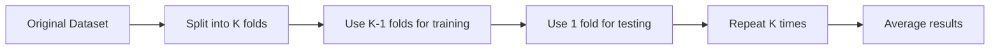
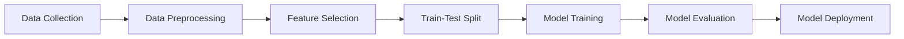
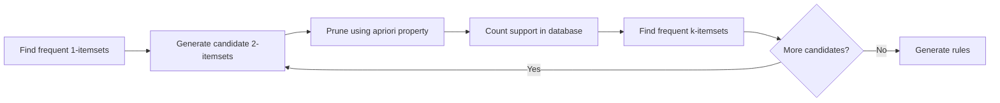

## Question 1(a) [3 marks]

**Define human learning. List out types of human learning.**

**Answer**:

Human learning is the process by which humans acquire new knowledge, skills, behaviors, or modify existing ones through experience, study, or instruction.

**Types of Human Learning:**

| Type | Description |
|------|-------------|
| **Supervised Learning** | Learning with guidance from teacher/mentor |
| **Unsupervised Learning** | Self-directed learning without external guidance |
| **Reinforcement Learning** | Learning through trial and error with feedback |

**Mnemonic:** "SUR - Supervised, Unsupervised, Reinforcement"

## Question 1(b) [4 marks]

**Differentiate between qualitative data and quantitative data.**

**Answer**:

**Table: Qualitative vs Quantitative Data**

| Feature | Qualitative Data | Quantitative Data |
|---------|-----------------|-------------------|
| **Nature** | Descriptive, categorical | Numerical, measurable |
| **Analysis** | Subjective interpretation | Statistical analysis |
| **Examples** | Colors, names, gender | Height, weight, age |
| **Representation** | Words, categories | Numbers, graphs |

**Mnemonic:** "QUAN-Numbers, QUAL-Words"

## Question 1(c) [7 marks]

**Compare the different types of machine learning.**

**Answer**:

**Table: Types of Machine Learning Comparison**

| Type | Training Data | Goal | Examples |
|------|---------------|------|----------|
| **Supervised** | Labeled data | Predict outcomes | Classification, Regression |
| **Unsupervised** | Unlabeled data | Find patterns | Clustering, Association |
| **Reinforcement** | Reward/penalty | Maximize rewards | Gaming, Robotics |

**Key Differences:**

- **Supervised**: Uses input-output pairs for training
- **Unsupervised**: Discovers hidden patterns in data
- **Reinforcement**: Learns through interaction with environment

**Mnemonic:** "SUR-LAP: Supervised-Labeled, Unsupervised-Reveal, Reinforcement-Action"

## Question 1(c OR) [7 marks]

**Define machine learning. Explain any four applications of machine learning in brief.**

**Answer**:

Machine learning is a subset of artificial intelligence that enables computers to learn and make decisions from data without being explicitly programmed.

**Four Applications:**

| Application | Description |
|-------------|-------------|
| **Email Spam Detection** | Classifies emails as spam or legitimate |
| **Image Recognition** | Identifies objects in photos |
| **Recommendation Systems** | Suggests products/content to users |
| **Medical Diagnosis** | Assists doctors in disease detection |

**Mnemonic:** "SIRM - Spam, Image, Recommendation, Medical"

## Question 2(a) [3 marks]

**Relate the appropriate data type of following examples.**

**Answer**:

**Data Type Classification:**

| Example | Data Type |
|---------|-----------|
| **Nationality of students** | Categorical (Nominal) |
| **Education status of students** | Categorical (Ordinal) |
| **Height of students** | Numerical (Continuous) |

**Mnemonic:** "NCN - Nominal, Categorical, Numerical"

## Question 2(b) [4 marks]

**Explain data pre-processing in brief.**

**Answer**:

Data pre-processing is the technique of preparing raw data for machine learning algorithms.

**Key Steps:**

| Step | Purpose |
|------|---------|
| **Data Cleaning** | Remove errors and inconsistencies |
| **Data Integration** | Combine data from multiple sources |
| **Data Transformation** | Convert data to suitable format |
| **Data Reduction** | Reduce data size while preserving information |

**Mnemonic:** "CITR - Clean, Integrate, Transform, Reduce"

## Question 2(c) [7 marks]

**Show K-fold cross validation in detail.**

**Answer**:

K-fold cross validation is a technique to evaluate model performance by dividing data into K equal parts.

**Process:**



**Steps:**

- **Divide**: Split dataset into K equal parts
- **Train**: Use K-1 folds for training
- **Test**: Use remaining fold for validation
- **Repeat**: Perform K iterations
- **Average**: Calculate mean performance

**Advantages:**

- Reduces overfitting
- Better use of limited data
- More reliable performance estimate

**Mnemonic:** "DTRA - Divide, Train, Repeat, Average"

## Question 2(a OR) [3 marks]

**Define following terms: i) Mean, ii) Outliers, iii) Interquartile range**

**Answer**:

**Statistical Terms:**

| Term | Definition |
|------|------------|
| **Mean** | Average of all values in dataset |
| **Outliers** | Data points significantly different from others |
| **Interquartile Range** | Difference between 75th and 25th percentiles |

**Mnemonic:** "MOI - Mean, Outliers, Interquartile"

## Question 2(b OR) [4 marks]

**Explain structure of confusion matrix.**

**Answer**:

**Confusion Matrix Structure:**

| | Predicted |  |
|---|---|---|
| **Actual** | **Positive** | **Negative** |
| **Positive** | True Positive (TP) | False Negative (FN) |
| **Negative** | False Positive (FP) | True Negative (TN) |

**Components:**

- **TP**: Correctly predicted positive cases
- **TN**: Correctly predicted negative cases
- **FP**: Incorrectly predicted as positive
- **FN**: Incorrectly predicted as negative

**Mnemonic:** "TTFF - True True, False False"

## Question 2(c OR) [7 marks]

**Prepare short note on feature subset selection.**

**Answer**:

Feature subset selection is the process of selecting relevant features from the original feature set.

**Methods:**

| Method | Description |
|--------|-------------|
| **Filter Methods** | Use statistical measures to rank features |
| **Wrapper Methods** | Use ML algorithms to evaluate feature subsets |
| **Embedded Methods** | Feature selection during model training |

**Benefits:**

- **Reduced complexity**: Fewer features, simpler models
- **Improved performance**: Eliminates noise and irrelevant features
- **Faster training**: Less computational overhead

**Popular Techniques:**

- Chi-square test
- Recursive Feature Elimination
- LASSO regularization

**Mnemonic:** "FWE - Filter, Wrapper, Embedded"

## Question 3(a) [3 marks]

**Give the difference between predictive model and descriptive model.**

**Answer**:

**Model Type Comparison:**

| Feature | Predictive Model | Descriptive Model |
|---------|------------------|-------------------|
| **Purpose** | Forecast future outcomes | Understand current patterns |
| **Output** | Predictions/classifications | Insights/summaries |
| **Examples** | Regression, classification | Clustering, association rules |

**Mnemonic:** "PF-DC: Predictive-Future, Descriptive-Current"

## Question 3(b) [4 marks]

**Discuss the difference between classification and regression.**

**Answer**:

**Classification vs Regression:**

| Aspect | Classification | Regression |
|--------|----------------|------------|
| **Output** | Discrete categories | Continuous values |
| **Goal** | Predict class labels | Predict numerical values |
| **Examples** | Spam detection, image recognition | Price prediction, temperature |
| **Evaluation** | Accuracy, precision, recall | MSE, RMSE, R-squared |

**Mnemonic:** "CCNM - Classification-Categories, Regression-Numbers"

## Question 3(c) [7 marks]

**Define classification. Illustrate classification learning steps in details.**

**Answer**:

Classification is a supervised learning technique that predicts discrete class labels for input data.

**Classification Learning Steps:**



**Detailed Steps:**

- **Data Collection**: Gather labeled training data
- **Preprocessing**: Clean and prepare data
- **Feature Selection**: Choose relevant attributes
- **Split Data**: Divide into training and testing sets
- **Training**: Build model using training data
- **Evaluation**: Test model performance
- **Deployment**: Use model for predictions

**Mnemonic:** "DCFSTED - Data, Clean, Features, Split, Train, Evaluate, Deploy"

## Question 3(a OR) [3 marks]

**Give the difference between bagging and boosting.**

**Answer**:

**Bagging vs Boosting:**

| Feature | Bagging | Boosting |
|---------|---------|----------|
| **Sampling** | Bootstrap sampling | Sequential weighted sampling |
| **Training** | Parallel training | Sequential training |
| **Focus** | Reduce variance | Reduce bias |

**Mnemonic:** "BPV-BSB: Bagging-Parallel-Variance, Boosting-Sequential-Bias"

## Question 3(b OR) [4 marks]

**Explain different types of logistic regression in brief.**

**Answer**:

**Types of Logistic Regression:**

| Type | Classes | Use Case |
|------|---------|----------|
| **Binary** | 2 classes | Yes/No, Pass/Fail |
| **Multinomial** | 3+ classes (unordered) | Color classification |
| **Ordinal** | 3+ classes (ordered) | Rating scales |

**Mnemonic:** "BMO - Binary, Multinomial, Ordinal"

## Question 3(c OR) [7 marks]

**Write and show the use of k-NN algorithms.**

**Answer**:

K-Nearest Neighbors (k-NN) is a lazy learning algorithm that classifies data points based on the majority class of k nearest neighbors.

**Algorithm:**

```goat
1. Choose value of k
2. Calculate distance to all training points
3. Select k nearest neighbors
4. For classification: majority vote
   For regression: average of k neighbors
5. Assign class/value to test point
```

**Distance Calculation:**

- **Euclidean Distance**: √[(x₁-x₂)² + (y₁-y₂)²]

**Applications:**

- **Recommendation systems**: Similar user preferences
- **Image recognition**: Pattern matching
- **Medical diagnosis**: Symptom similarity

**Advantages:**

- Simple to implement
- No training required
- Works well with small datasets

**Mnemonic:** "CDSA - Choose, Distance, Select, Assign"

## Question 4(a) [3 marks]

**List out applications of support vector machine.**

**Answer**:

**SVM Applications:**

| Application | Domain |
|-------------|--------|
| **Text Classification** | Document categorization |
| **Image Recognition** | Face detection |
| **Bioinformatics** | Gene classification |

**Mnemonic:** "TIB - Text, Image, Bio"

## Question 4(b) [4 marks]

**Create pseudo code for k-means algorithm.**

**Answer**:

**K-means Pseudo Code:**

```
BEGIN K-means
1. Initialize k cluster centroids randomly
2. REPEAT
   a. Assign each point to nearest centroid
   b. Update centroids as mean of assigned points
   c. Calculate total within-cluster sum of squares
3. UNTIL convergence or max iterations
4. RETURN final clusters and centroids
END
```

**Mnemonic:** "IAUC - Initialize, Assign, Update, Check"

## Question 4(c) [7 marks]

**Write and explain applications of unsupervised learning.**

**Answer**:

Unsupervised learning discovers hidden patterns in data without labeled examples.

**Major Applications:**

| Application | Description | Example |
|-------------|-------------|---------|
| **Customer Segmentation** | Group customers by behavior | Market research |
| **Anomaly Detection** | Identify unusual patterns | Fraud detection |
| **Data Compression** | Reduce dimensionality | Image compression |
| **Association Rules** | Find item relationships | Market basket analysis |

**Clustering Applications:**

- **Market research**: Customer grouping
- **Social network analysis**: Community detection
- **Gene sequencing**: Biological classification

**Dimensionality Reduction:**

- **Visualization**: High-dimensional data plotting
- **Feature extraction**: Noise reduction

**Mnemonic:** "CADA - Customer, Anomaly, Data, Association"

## Question 4(a OR) [3 marks]

**List out applications of regression.**

**Answer**:

**Regression Applications:**

| Application | Purpose |
|-------------|---------|
| **Stock Price Prediction** | Financial forecasting |
| **Sales Forecasting** | Business planning |
| **Medical Diagnosis** | Risk assessment |

**Mnemonic:** "SSM - Stock, Sales, Medical"

## Question 4(b OR) [4 marks]

**Define following terms: i) Support ii) Confidence**

**Answer**:

**Association Rule Terms:**

| Term | Definition | Formula |
|------|------------|---------|
| **Support** | Frequency of itemset in database | Support(A) = |A| / |D| |
| **Confidence** | Conditional probability of rule | Confidence(A→B) = Support(A∪B) / Support(A) |

**Example:**

- If 30% transactions contain bread and milk: Support = 0.3
- If 80% of bread buyers also buy milk: Confidence = 0.8

**Mnemonic:** "SF-CP: Support-Frequency, Confidence-Probability"

## Question 4(c OR) [7 marks]

**Explain apriori algorithm in detail.**

**Answer**:

Apriori algorithm finds frequent itemsets in transactional data using the apriori property.

**Algorithm Steps:**



**Apriori Property:**

- If an itemset is frequent, all its subsets are frequent
- If an itemset is infrequent, all its supersets are infrequent

**Steps:**

1. **Scan database**: Count 1-item support
2. **Generate candidates**: Create k+1 itemsets from frequent k-itemsets
3. **Prune**: Remove candidates with infrequent subsets
4. **Count support**: Scan database for candidate frequencies
5. **Repeat**: Until no new frequent itemsets found

**Applications:**

- Market basket analysis
- Web usage patterns
- Protein sequences

**Mnemonic:** "SGPCR - Scan, Generate, Prune, Count, Repeat"

## Question 5(a) [3 marks]

**List out the major features of matplotlib.**

**Answer**:

**Matplotlib Features:**

| Feature | Description |
|---------|-------------|
| **Multiple Plot Types** | Line, bar, scatter, histogram |
| **Customization** | Colors, styles, labels |
| **Export Options** | PNG, PDF, SVG formats |

**Mnemonic:** "MCE - Multiple, Customization, Export"

## Question 5(b) [4 marks]

**How to load iris dataset in Numpy program? Explain.**

**Answer**:

**Loading Iris Dataset in NumPy:**

```python
import numpy as np
from sklearn.datasets import load_iris

# Load iris dataset
iris = load_iris()
data = iris.data    # Features
target = iris.target # Labels
```

**Steps:**

- **Import**: Import required libraries
- **Load**: Use sklearn's load_iris() function
- **Extract**: Get features and target arrays
- **Access**: Use .data and .target attributes

**Mnemonic:** "ILEA - Import, Load, Extract, Access"

## Question 5(c) [7 marks]

**Explain features and applications of Pandas.**

**Answer**:

Pandas is a powerful data manipulation and analysis library for Python.

**Key Features:**

| Feature | Description |
|---------|-------------|
| **DataFrame** | 2D labeled data structure |
| **Series** | 1D labeled array |
| **Data I/O** | Read/write various file formats |
| **Data Cleaning** | Handle missing values |
| **Grouping** | Group and aggregate operations |

**Applications:**

| Application | Use Case |
|-------------|----------|
| **Data Analysis** | Statistical analysis |
| **Data Cleaning** | Preprocessing for ML |
| **Financial Analysis** | Stock market data |
| **Web Scraping** | Parse HTML tables |

**Common Operations:**

- **Reading data**: pd.read_csv(), pd.read_excel()
- **Filtering**: df[df['column'] > value]
- **Grouping**: df.groupby('column').mean()

**Mnemonic:** "DSDCG - DataFrame, Series, Data I/O, Cleaning, Grouping"

## Question 5(a OR) [3 marks]

**List out the applications of matplotlib.**

**Answer**:

**Matplotlib Applications:**

| Application | Purpose |
|-------------|---------|
| **Scientific Visualization** | Research data plotting |
| **Business Analytics** | Dashboard creation |
| **Educational Content** | Teaching materials |

**Mnemonic:** "SBE - Scientific, Business, Educational"

## Question 5(b OR) [4 marks]

**Develop and explain the steps to import csv file in Pandas.**

**Answer**:

**Steps to Import CSV in Pandas:**

```python
import pandas as pd

# Step 1: Import pandas library
# Step 2: Use read_csv() function
df = pd.read_csv('filename.csv')

# Optional parameters
df = pd.read_csv('file.csv', 
                 header=0,     # First row as header
                 sep=',',      # Comma separator
                 index_col=0)  # First column as index
```

**Process:**

- **Import**: Import pandas library
- **Read**: Use pd.read_csv() function
- **Specify**: Add file path and parameters
- **Store**: Assign to DataFrame variable

**Mnemonic:** "IRSS - Import, Read, Specify, Store"

## Question 5(c OR) [7 marks]

**Explain features and applications of Scikit-Learn.**

**Answer**:

Scikit-Learn is a comprehensive machine learning library for Python.

**Key Features:**

| Feature | Description |
|---------|-------------|
| **Algorithms** | Classification, regression, clustering |
| **Preprocessing** | Data scaling and transformation |
| **Model Selection** | Cross-validation and grid search |
| **Metrics** | Performance evaluation tools |

**Applications:**

| Domain | Use Case |
|--------|----------|
| **Healthcare** | Disease prediction |
| **Finance** | Credit scoring |
| **Marketing** | Customer segmentation |
| **Technology** | Recommendation systems |

**Algorithm Categories:**

- **Supervised**: SVM, Random Forest, Linear Regression
- **Unsupervised**: K-means, DBSCAN, PCA
- **Ensemble**: Bagging, Boosting

**Workflow:**

1. **Data preparation**: Preprocessing
2. **Model selection**: Choose algorithm
3. **Training**: Fit model to data
4. **Evaluation**: Assess performance
5. **Prediction**: Make forecasts

**Mnemonic:** "APME - Algorithms, Preprocessing, Metrics, Evaluation"
