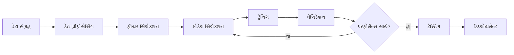
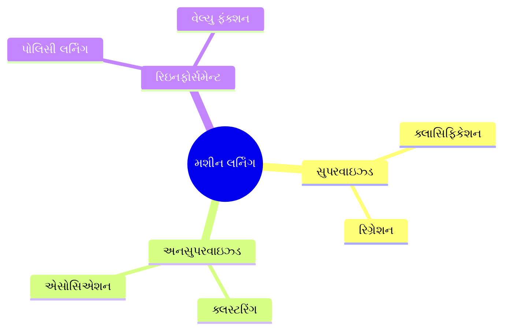
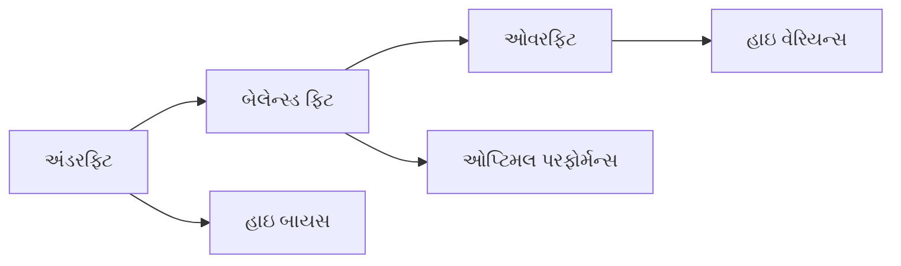

## પ્રશ્ન 1(અ) [3 ગુણ]

**યોગ્ય ઉદાહરણનો ઉપયોગ કરીને મશીન લર્નિંગને વ્યાખ્યાયિત કરો**

**જવાબ**:

મશીન લર્નિંગ આર્ટિફિશિયલ ઇન્ટેલિજન્સનો એક ભાગ છે જે કમ્પ્યુટર્સને ડેટામાંથી શીખવા અને દરેક કાર્ય માટે સ્પષ્ટ રીતે પ્રોગ્રામ કર્યા વિના નિર્ણયો લેવા માટે સક્ષમ બનાવે છે.

**ટેબલ: મશીન લર્નિંગના મુખ્ય ઘટકો**

| ઘટક | વર્ણન |
|-----|------|
| **ડેટા** | ટ્રેનિંગ માટે ઉપયોગમાં લેવાતી ઇનપુટ માહિતી |
| **અલ્ગોરિધમ** | પેટર્ન શીખતા ગાણિતિક મોડેલ |
| **ટ્રેનિંગ** | અલ્ગોરિધમને શીખવવાની પ્રક્રિયા |
| **પ્રિડિક્શન** | શીખેલા પેટર્ન આધારિત આઉટપુટ |

**ઉદાહરણ**: ઇમેઇલ સ્પામ ડિટેક્શન સિસ્ટમ હજારો ઇમેઇલોમાંથી "સ્પામ" અથવા "નોટ સ્પામ" તરીકે લેબલ કરેલા ઇમેઇલોમાંથી શીખે છે અને નવા ઇમેઇલોને આપોઆપ વર્ગીકૃત કરે છે.

**મેમરી ટ્રીક:** "ડેટા ડ્રાઇવ્સ ડિસિઝન્સ" - ડેટા અલ્ગોરિધમને બુદ્ધિશાળી નિર્ણયો લેવા માટે પ્રશિક્ષિત કરે છે

## પ્રશ્ન 1(બ) [4 ગુણ]

**સ્કેમેટિક રેખાકૃતિના ઉપયોગ કરીને મશીન લર્નિંગની પ્રક્રિયા સમજાવો**

**જવાબ**:

મશીન લર્નિંગ પ્રક્રિયામાં ડેટા સંગ્રહથી લઈને મોડેલ ડિપ્લોયમેન્ટ સુધીના વ્યવસ્થિત પગલાંઓનો સમાવેશ થાય છે.



**પ્રક્રિયાના પગલાં:**

- **ડેટા સંગ્રહ**: સંબંધિત ડેટાસેટ એકત્રિત કરવું
- **પ્રીપ્રોસેસિંગ**: ડેટાને સાફ અને તૈયાર કરવું
- **ટ્રેનિંગ**: ટ્રેનિંગ ડેટાનો ઉપયોગ કરીને અલ્ગોરિધમને શીખવવું
- **વેલિડેશન**: મોડેલની કામગીરીને ચકાસવી
- **ડિપ્લોયમેન્ટ**: વાસ્તવિક પ્રિડિક્શન માટે મોડેલનો ઉપયોગ

**મેમરી ટ્રીક:** "કમ્પ્યુટર્સ કેન ટ્રુલી થિંક" - કલેક્ટ, ક્લીન, ટ્રેન, ટેસ્ટ

## પ્રશ્ન 1(ક) [7 ગુણ]

**યોગ્ય એપ્લિકેશન સાથે વિવિધ પ્રકારના મશીન લર્નિંગ સમજાવો**

**જવાબ**:

મશીન લર્નિંગ અલ્ગોરિધમ્સને લર્નિંગ એપ્રોચ અને ઉપલબ્ધ ડેટાના આધારે વર્ગીકૃત કરવામાં આવે છે.

**ટેબલ: મશીન લર્નિંગના પ્રકારો**

| પ્રકાર | લર્નિંગ મેથડ | ડેટા આવશ્યકતા | ઉદાહરણ એપ્લિકેશન |
|------|-------------|--------------|-----------------|
| **સુપરવાઇઝ્ડ** | લેબલ્ડ ડેટાનો ઉપયોગ | ઇનપુટ-આઉટપુટ જોડીઓ | ઇમેઇલ ક્લાસિફિકેશન |
| **અનસુપરવાઇઝ્ડ** | છુપાયેલા પેટર્ન શોધે | માત્ર ઇનપુટ ડેટા | કસ્ટમર સેગમેન્ટેશન |
| **રિઇનફોર્સમેન્ટ** | રિવોર્ડ્સ દ્વારા શીખે | એન્વાયર્નમેન્ટ ફીડબેક | ગેમ પ્લેઇંગ AI |

**એપ્લિકેશન્સ:**

- **સુપરવાઇઝ્ડ લર્નિંગ**: મેડિકલ ડાયગ્નોસિસ, ઇમેજ રેકોગ્નિશન, ફ્રોડ ડિટેક્શન
- **અનસુપરવાઇઝ્ડ લર્નિંગ**: માર્કેટ રિસર્ચ, એનોમેલી ડિટેક્શન, રેકમેન્ડેશન સિસ્ટમ્સ
- **રિઇનફોર્સમેન્ટ લર્નિંગ**: ઓટોનોમસ વેહિકલ્સ, રોબોટિક્સ, સ્ટ્રેટેજિક ગેમ્સ

**ડાયાગ્રામ: લર્નિંગ ટાઇપ્સ**



**મેમરી ટ્રીક:** "સ્ટુડન્ટ્સ યુઝ્યુઅલી રીમેમ્બર" - સુપરવાઇઝ્ડ, અનસુપરવાઇઝ્ડ, રિઇનફોર્સમેન્ટ

## પ્રશ્ન 1(ક) OR [7 ગુણ]

**મશીન લર્નિંગમાં વિવિધ સમસ્યાઓ શું છે? ત્રણ સમસ્યાઓ કે જે મશીન લર્નિંગનો ઉપયોગ કરીને ઉકેલી શકાતી નથી.**

**જવાબ**:

**ટેબલ: મશીન લર્નિંગની સમસ્યાઓ**

| સમસ્યા કેટેગરી | વર્ણન | અસર |
|--------------|------|-----|
| **ડેટા ક્વોલિટી** | અધૂરો, નોઇઝી, પક્ષપાતી ડેટા | નબળું મોડેલ પરફોર્મન્સ |
| **ઓવરફિટિંગ** | મોડેલ ટ્રેનિંગ ડેટાને યાદ રાખે છે | નબળું જનરલાઇઝેશન |
| **કમ્પ્યુટેશનલ** | ઉચ્ચ પ્રોસેસિંગ આવશ્યકતાઓ | રિસોર્સ મર્યાદાઓ |
| **ઇન્ટરપ્રિટેબિલિટી** | બ્લેક બોક્સ મોડેલ્સ | પારદર્શિતાનો અભાવ |

**ML માટે અનુપયુક્ત સમસ્યાઓ:**

1. **સિમ્પલ રૂલ-બેસ્ડ ટાસ્ક** - મૂળભૂત ગણતરીઓ, સિમ્પલ if-then લોજિક
2. **નૈતિક નિર્ણયો** - માનવીય મૂલ્યોની આવશ્યકતા ધરાવતા નૈતિક जजમેન્ટ્સ
3. **ક્રિએટિવ એક્સપ્રેશન** - માનવીય લાગણીની આવશ્યકતા ધરાવતી મૂળ કલાત્મક સર્જના

**અન્ય સમસ્યાઓ:**

- **પ્રાઇવસી ચિંતાઓ**: સંવેદનશીલ ડેટા હેન્ડલિંગ
- **બાયસ પ્રોપેગેશન**: અન્યાયકારક અલ્ગોરિધમિક નિર્ણયો
- **ફીચર સિલેક્શન**: સંબંધિત ઇનપુટ વેરિએબલ્સ પસંદ કરવા

**મેમરી ટ્રીક:** "ડેટા ડ્રાઇવ્સ ક્વોલિટી" - ડેટા ક્વોલિટી સીધી રીતે મોડેલ ક્વોલિટીને અસર કરે છે

## પ્રશ્ન 2(અ) [3 ગુણ]

**સામાન્ય મશીન લર્નિંગ સમસ્યામાં વિવિધ પ્રકારના ડેટાનો સારાંશ આપો**

**જવાબ**:

**ટેબલ: મશીન લર્નિંગમાં ડેટા પ્રકારો**

| ડેટા પ્રકાર | વર્ણન | ઉદાહરણ |
|-----------|------|--------|
| **ન્યુમેરિકલ** | માત્રાત્મક મૂલ્યો | ઉંમર: 25, ઊંચાઈ: 170cm |
| **કેટેગોરિકલ** | અસ્પષ્ટ કેટેગરીઓ | રંગ: લાલ, વાદળી, લીલો |
| **ઓર્ડિનલ** | ક્રમબદ્ધ કેટેગરીઓ | રેટિંગ: નબળું, સારું, ઉત્તમ |
| **બાઇનરી** | બે શક્ય મૂલ્યો | લિંગ: પુરુષ/સ્ત્રી |

**લક્ષણો:**

- **સ્ટ્રક્ચર્ડ**: ટેબલોમાં વ્યવસ્થિત (ડેટાબેસેસ, સ્પ્રેડશીટ્સ)
- **અનસ્ટ્રક્ચર્ડ**: ઇમેજ, ટેક્સ્ટ, ઓડિયો ફાઇલો
- **ટાઇમ-સીરીઝ**: સમય પર ડેટા પોઇન્ટ્સ

**મેમરી ટ્રીક:** "નંબર્સ કાઉન્ટ બેટર દેન વર્ડ્સ" - ન્યુમેરિકલ, કેટેગોરિકલ, બાઇનરી, ટેક્સ્ટ

## પ્રશ્ન 2(બ) [4 ગુણ]

**બંને એટ્રિબ્યુટ માટે વેરિયન્સ ગણતરી કરો. નક્કી કરો કે કઈ એટ્રિબ્યુટ મીનની આસપાસ સ્પ્રેડ આઉટ છે**

**જવાબ**:

**આપેલ ડેટા:**

- એટ્રિબ્યુટ 1: 32, 37, 47, 50, 59
- એટ્રિબ્યુટ 2: 48, 40, 41, 47, 49

**ગણતરીઓ:**

**એટ્રિબ્યુટ 1:**

- મીન = (32+37+47+50+59)/5 = 225/5 = 45
- વેરિયન્સ = [(32-45)² + (37-45)² + (47-45)² + (50-45)² + (59-45)²]/5
- વેરિયન્સ = [169 + 64 + 4 + 25 + 196]/5 = 458/5 = 91.6

**એટ્રિબ્યુટ 2:**

- મીન = (48+40+41+47+49)/5 = 225/5 = 45
- વેરિયન્સ = [(48-45)² + (40-45)² + (41-45)² + (47-45)² + (49-45)²]/5
- વેરિયન્સ = [9 + 25 + 16 + 4 + 16]/5 = 70/5 = 14

**પરિણામ**: એટ્રિબ્યુટ 1 (વેરિયન્સ = 91.6) એટ્રિબ્યુટ 2 (વેરિયન્સ = 14) કરતાં વધુ સ્પ્રેડ આઉટ છે.

**મેમરી ટ્રીક:** "હાયર વેરિયન્સ શોઝ સ્પ્રેડ" - વધુ વેરિયન્સ વધુ વિખેરાઈને દર્શાવે છે

## પ્રશ્ન 2(ક) [7 ગુણ]

**ડેટા ગુણવત્તા સમસ્યા તરફ દોરી જતા ફેક્ટર્સની યાદી બનાવો. આઉટલાયર્સ અને મિસિંગ વેલ્યુ કેવી રીતે હેન્ડલ કરવું**

**જવાબ**:

**ટેબલ: ડેટા ગુણવત્તા સમસ્યાઓ**

| ફેક્ટર | કારણ | સોલ્યુશન |
|--------|------|---------|
| **અપૂર્ણતા** | મિસિંગ ડેટા કલેક્શન | ઇમ્પ્યુટેશન ટેકનિક્સ |
| **અસંગતતા** | વિવિધ ડેટા ફોર્મેટ્સ | સ્ટેન્ડર્ડાઇઝેશન |
| **અચોક્કસતા** | હ્યુમન/સેન્સર એરર્સ | વેલિડેશન રૂલ્સ |
| **નોઇઝ** | રેન્ડમ વેરિએશન્સ | ફિલ્ટરિંગ મેથડ્સ |

**આઉટલાયર્સ હેન્ડલ કરવું:**

- **ડિટેક્શન**: સ્ટેટિસ્ટિકલ મેથડ્સ (Z-score, IQR)
- **ટ્રીટમેન્ટ**: એક્સ્ટ્રીમ વેલ્યુઝને રીમૂવ, ટ્રાન્સફોર્મ, અથવા કેપ કરવી
- **વિઝ્યુઅલાઇઝેશન**: બોક્સ પ્લોટ્સ, સ્કેટર પ્લોટ્સ

**મિસિંગ વેલ્યુઝ હેન્ડલ કરવું:**

- **ડિલીશન**: અપૂર્ણ રેકોર્ડ્સ રીમૂવ કરવા
- **ઇમ્પ્યુટેશન**: મીન, મીડિયન, અથવા મોડ સાથે ભરવું
- **પ્રિડિક્શન**: મિસિંગ વેલ્યુઝની આગાહી કરવા માટે ML નો ઉપયોગ

**કોડ ઉદાહરણ:**

```python
# મિસિંગ વેલ્યુઝ હેન્ડલ કરવું
df.fillna(df.mean())  # મીન ઇમ્પ્યુટેશન
df.dropna()          # મિસિંગ રોઝ રીમૂવ કરવા
```

**મેમરી ટ્રીક:** "ક્લીન ડેટા મેક્સ મોડેલ્સ" - સાફ ડેટા બેહતર મોડેલ્સ બનાવે છે

## પ્રશ્ન 2(અ) OR [3 ગુણ]

**વિવિધ મશીન લર્નિંગ પ્રવૃત્તિઓ આપો**

**જવાબ**:

**ટેબલ: મશીન લર્નિંગ પ્રવૃત્તિઓ**

| પ્રવૃત્તિ | હેતુ | ઉદાહરણ |
|--------|------|--------|
| **ડેટા કલેક્શન** | સંબંધિત માહિતી એકત્રિત કરવી | સર્વે, સેન્સર્સ, ડેટાબેસેસ |
| **ડેટા પ્રીપ્રોસેસિંગ** | ડેટાને સાફ અને તૈયાર કરવું | નોઇઝ રીમૂવ કરવું, મિસિંગ વેલ્યુઝ હેન્ડલ કરવું |
| **ફીચર એન્જિનિયરિંગ** | અર્થપૂર્ણ વેરિએબલ્સ બનાવવા | રો ડેટામાંથી ફીચર્સ એક્સ્ટ્રેક્ટ કરવા |
| **મોડેલ ટ્રેનિંગ** | અલ્ગોરિધમને પેટર્ન શીખવવા | ટ્રેનિંગ ડેટાસેટનો ઉપયોગ |
| **મોડેલ ઇવેલ્યુએશન** | પરફોર્મન્સ આકારણી | ટેસ્ટ એક્યુરસી, પ્રિસિઝન, રિકોલ |
| **મોડેલ ડિપ્લોયમેન્ટ** | મોડેલને પ્રોડક્શનમાં મૂકવું | વેબ સર્વિસેસ, મોબાઇલ એપ્સ |

**મુખ્ય પ્રવૃત્તિઓ:**

- **એક્સ્પ્લોરેટરી ડેટા એનાલિસિસ**: ડેટા પેટર્ન સમજવા
- **હાયપરપેરામીટર ટ્યુનિંગ**: મોડેલ સેટિંગ્સ ઓપ્ટિમાઇઝ કરવા
- **ક્રોસ-વેલિડેશન**: મજબૂત પરફોર્મન્સ આકારણી

**મેમરી ટ્રીક:** "ડેટા મોડેલ્સ પર્ફોર્મ એક્સેલન્ટલી" - ડેટા તૈયારી, મોડેલ બિલ્ડિંગ, પરફોર્મન્સ ઇવેલ્યુએશન, એક્ઝિક્યુશન

## પ્રશ્ન 2(બ) OR [4 ગુણ]

**નીચેની સંખ્યાઓના મીન અને મીડિયન ની ગણતરી કરો: 12,15,18,20,22,24,28,30**

**જવાબ**:

**આપેલ સંખ્યાઓ:** 12, 15, 18, 20, 22, 24, 28, 30

**મીન ગણતરી:**
મીન = (12+15+18+20+22+24+28+30)/8 = 169/8 = 21.125

**મીડિયન ગણતરી:**

- સંખ્યાઓ પહેલેથી સૉર્ટ કરેલી છે: 12, 15, 18, 20, 22, 24, 28, 30
- સમ કાઉન્ટ (8 સંખ્યાઓ)
- મીડિયન = (4મી સંખ્યા + 5મી સંખ્યા)/2 = (20 + 22)/2 = 21

**ટેબલ: સ્ટેટિસ્ટિકલ સમરી**

| માપદંડ | મૂલ્ય | વર્ણન |
|-------|------|------|
| **મીન** | 21.125 | સરેરાશ મૂલ્ય |
| **મીડિયન** | 21 | મધ્યમ મૂલ્ય |
| **કાઉન્ટ** | 8 | કુલ સંખ્યાઓ |

**મેમરી ટ્રીક:** "મિડલ મેક્સ મીડિયન" - મધ્યમ મૂલ્ય મીડિયન આપે છે

## પ્રશ્ન 2(ક) OR [7 ગુણ]

**ડેટા પ્રીપ્રોસેસિંગના સંદર્ભમાં ડાયમેન્શનાલિટી રિડક્શન અને ફીચર સબસેટ સિલેક્શન પર ટૂંકી નોંધ લખો**

**જવાબ**:

**ડાયમેન્શનાલિટી રિડક્શન** અપ્રસ્તુત ફીચર્સને દૂર કરે છે અને કોમ્પ્યુટેશનલ જટિલતા ઘટાડે છે જ્યારે મહત્વપૂર્ણ માહિતી જાળવી રાખે છે.

**ટેબલ: ડાયમેન્શનાલિટી રિડક્શન ટેકનિક્સ**

| ટેકનિક | મેથડ | વપરાશ |
|---------|------|-------|
| **PCA** | પ્રિન્સિપલ કમ્પોનન્ટ એનાલિસિસ | લીનિયર રિડક્શન |
| **LDA** | લીનિયર ડિસ્ક્રિમિનન્ટ એનાલિસિસ | ક્લાસિફિકેશન ટાસ્ક્સ |
| **t-SNE** | નોન-લીનિયર એમ્બેડિંગ | વિઝ્યુઅલાઇઝેશન |
| **ફીચર સિલેક્શન** | મહત્વપૂર્ણ ફીચર્સ પસંદ કરવા | ઓવરફિટિંગ ઘટાડવું |

**ફીચર સબસેટ સિલેક્શન મેથડ્સ:**

- **ફિલ્ટર મેથડ્સ**: સ્ટેટિસ્ટિકલ ટેસ્ટ્સ, કોરિલેશન એનાલિસિસ
- **રેપર મેથડ્સ**: ફોરવર્ડ/બેકવર્ડ સિલેક્શન
- **એમ્બેડેડ મેથડ્સ**: LASSO, રિજ રિગ્રેશન

**ફાયદાઓ:**

- **કોમ્પ્યુટેશનલ કાર્યક્ષમતા**: ઝડપી ટ્રેનિંગ અને પ્રિડિક્શન
- **સ્ટોરેજ રિડક્શન**: ઓછી મેમરી આવશ્યકતાઓ
- **નોઇઝ રિડક્શન**: અપ્રસ્તુત ફીચર્સ દૂર કરવા
- **વિઝ્યુઅલાઇઝેશન**: 2D/3D પ્લોટિંગ સક્ષમ કરવું

**કોડ ઉદાહરણ:**

```python
from sklearn.decomposition import PCA
pca = PCA(n_components=2)
reduced_data = pca.fit_transform(data)
```

**મેમરી ટ્રીક:** "રિડ્યુસ ફીચર્સ, ઇમ્પ્રૂવ પર્ફોર્મન્સ" - ઓછા ફીચર્સ ઘણીવાર બેહતર મોડેલ્સ તરફ દોરી જાય છે

## પ્રશ્ન 3(અ) [3 ગુણ]

**શું બાયસ ML મોડેલના પરફોર્મન્સને અસર કરે છે? ટૂંકમાં સમજાવો**

**જવાબ**:

હા, બાયસ પ્રિડિક્શન્સમાં સિસ્ટેમેટિક એરર્સ બનાવીને ML મોડેલના પરફોર્મન્સને નોંધપાત્ર રીતે અસર કરે છે.

**ટેબલ: બાયસના પ્રકારો**

| બાયસ પ્રકાર | વર્ણન | અસર |
|-----------|------|-----|
| **સિલેક્શન બાયસ** | બિન-પ્રતિનિધિત્વકારી ડેટા | નબળું જનરલાઇઝેશન |
| **કન્ફર્મેશન બાયસ** | અપેક્ષિત પરિણામોની તરફેણ | ત્રાંસા નિષ્કર્ષો |
| **અલ્ગોરિધમિક બાયસ** | મોડેલ ધારણાઓ | અન્યાયકારક પ્રિડિક્શન્સ |

**પરફોર્મન્સ પર અસરો:**

- **અંડરફિટિંગ**: ઉચ્ચ બાયસ અતિ સરળ મોડેલ્સ તરફ દોરી જાય છે
- **નબળી ચોકસાઈ**: સિસ્ટેમેટિક એરર્સ એકંદર પરફોર્મન્સ ઘટાડે છે
- **અન્યાયકારક નિર્ણયો**: પક્ષપાતી મોડેલ્સ જૂથો સામે ભેદભાવ કરે છે

**ઘટાડવાની વ્યૂહરચનાઓ:**

- વિવિધ ટ્રેનિંગ ડેટા
- ક્રોસ-વેલિડેશન ટેકનિક્સ
- બાયસ ડિટેક્શન અલ્ગોરિધમ્સ

**મેમરી ટ્રીક:** "બાયસ બ્રેક્સ બેટર પર્ફોર્મન્સ" - બાયસ મોડેલની અસરકારકતા ઘટાડે છે

## પ્રશ્ન 3(બ) [4 ગુણ]

**ક્રોસ-વેલિડેશન અને બૂટસ્ટ્રેપ સેમ્પલિંગની સરખામણી કરો**

**જવાબ**:

**ટેબલ: ક્રોસ-વેલિડેશન vs બૂટસ્ટ્રેપ સેમ્પલિંગ**

| પાસું | ક્રોસ-વેલિડેશન | બૂટસ્ટ્રેપ સેમ્પલિંગ |
|------|---------------|-------------------|
| **મેથડ** | ડેટાને ફોલ્ડ્સમાં વિભાજિત કરવું | રિપ્લેસમેન્ટ સાથે સેમ્પલ કરવું |
| **ડેટા ઉપયોગ** | બધો ડેટા વાપરે છે | મલ્ટિપલ સેમ્પલ્સ બનાવે છે |
| **હેતુ** | મોડેલ ઇવેલ્યુએશન | અનિશ્ચિતતાનો અંદાજ |
| **ઓવરલેપ** | સેટ્સ વચ્ચે કોઈ ઓવરલેપ નથી | ડુપ્લિકેટ સેમ્પલ્સની મંજૂરી |

**ક્રોસ-વેલિડેશન:**

- ડેટાને k સમાન ભાગોમાં વહેંચે છે
- k-1 ભાગોમાં ટ્રેન કરે છે, 1 ભાગમાં ટેસ્ટ કરે છે
- મજબૂત ઇવેલ્યુએશન માટે k વખત પુનરાવર્તન કરે છે

**બૂટસ્ટ્રેપ સેમ્પલિંગ:**

- રિપ્લેસમેન્ટ સાથે રેન્ડમ સેમ્પલ્સ બનાવે છે
- સમાન સાઇઝના મલ્ટિપલ ડેટાસેટ્સ જનરેટ કરે છે
- કોન્ફિડન્સ ઇન્ટરવલ્સનો અંદાજ કાઢે છે

**એપ્લિકેશન્સ:**

- **ક્રોસ-વેલિડેશન**: મોડેલ સિલેક્શન, હાયપરપેરામીટર ટ્યુનિંગ
- **બૂટસ્ટ્રેપ**: સ્ટેટિસ્ટિકલ ઇન્ફરન્સ, કોન્ફિડન્સ એસ્ટિમેશન

**મેમરી ટ્રીક:** "ક્રોસ ચેક્સ, બૂટસ્ટ્રેપ બિલ્ડ્સ" - ક્રોસ-વેલિડેશન પરફોર્મન્સ ચેક કરે છે, બૂટસ્ટ્રેપ કોન્ફિડન્સ બિલ્ડ કરે છે

## પ્રશ્ન 3(ક) [7 ગુણ]

**કન્ફ્યુઝન મેટ્રિક્સ ગણતરી અને મેટ્રિક્સ**

**જવાબ**:

**આપેલ માહિતી:**

- True Positive (TP): 83 (પ્રિડિક્ટેડ ખરીદશે, વાસ્તવમાં ખરીદ્યું)
- False Positive (FP): 7 (પ્રિડિક્ટેડ ખરીદશે, નથી ખરીદ્યું)
- False Negative (FN): 5 (પ્રિડિક્ટેડ નહીં ખરીદે, વાસ્તવમાં ખરીદ્યું)
- True Negative (TN): 5 (પ્રિડિક્ટેડ નહીં ખરીદે, નથી ખરીદ્યું)

**કન્ફ્યુઝન મેટ્રિક્સ:**

|  | પ્રિડિક્ટેડ ખરીદશે | પ્રિડિક્ટેડ નહીં ખરીદે |
|--|------------------|-------------------|
| **વાસ્તવમાં ખરીદે** | 83 (TP) | 5 (FN) |
| **વાસ્તવમાં નહીં ખરીદે** | 7 (FP) | 5 (TN) |

**ગણતરીઓ:**

**અ) એરર રેટ:**
એરર રેટ = (FP + FN) / કુલ = (7 + 5) / 100 = 0.12 = 12%

**બ) પ્રિસિઝન:**
પ્રિસિઝન = TP / (TP + FP) = 83 / (83 + 7) = 83/90 = 0.922 = 92.2%

**ક) રિકોલ:**
રિકોલ = TP / (TP + FN) = 83 / (83 + 5) = 83/88 = 0.943 = 94.3%

**ડ) F-મેઝર:**
F-મેઝર = 2 × (પ્રિસિઝન × રિકોલ) / (પ્રિસિઝન + રિકોલ)
F-મેઝર = 2 × (0.922 × 0.943) / (0.922 + 0.943) = 0.932 = 93.2%

**ટેબલ: પરફોર્મન્સ મેટ્રિક્સ**

| મેટ્રિક | મૂલ્ય | અર્થઘટન |
|--------|------|---------|
| **એરર રેટ** | 12% | મોડેલ 12% ખોટી આગાહીઓ કરે છે |
| **પ્રિસિઝન** | 92.2% | પ્રિડિક્ટેડ ખરીદદારોમાંથી 92.2% ખરેખર ખરીદે છે |
| **રિકોલ** | 94.3% | મોડેલ 94.3% વાસ્તવિક ખરીદદારોને ઓળખે છે |
| **F-મેઝર** | 93.2% | સંતુલિત પરફોર્મન્સ માપદંડ |

**મેમરી ટ્રીક:** "પર્ફેક્ટ રિકોલ ફાઇન્ડ્સ એવરીવન" - પ્રિસિઝન ચોકસાઈ માપે છે, રિકોલ બધા પોઝિટિવ શોધે છે

## પ્રશ્ન 3(અ) OR [3 ગુણ]

**સંક્ષિપ્તમાં વ્યાખ્યાયિત કરો: અ) ટાર્ગેટ ફંક્શન બ) કોસ્ટ ફંક્શન ક) લોસ ફંક્શન**

**જવાબ**:

**ટેબલ: ફંક્શન વ્યાખ્યાઓ**

| ફંક્શન | વ્યાખ્યા | હેતુ |
|--------|---------|-----|
| **ટાર્ગેટ ફંક્શન** | ઇનપુટથી આઉટપુટ સુધીની આદર્શ મેપિંગ | આપણે શું શીખવા માગીએ છીએ |
| **કોસ્ટ ફંક્શન** | એકંદર મોડેલ એરરને માપે છે | કુલ પરફોર્મન્સનું મૂલ્યાંકન |
| **લોસ ફંક્શન** | એક પ્રિડિક્શન માટે એરર માપે છે | વ્યક્તિગત પ્રિડિક્શન એરર |

**વિગતવાર સમજૂતી:**

- **ટાર્ગેટ ફંક્શન**: f(x) = y, સાચો સંબંધ જેનો આપણે અંદાજ કાઢવા માગીએ છીએ
- **કોસ્ટ ફંક્શન**: તમામ લોસ ફંક્શન્સની સરેરાશ, J = (1/n)Σloss(yi, ŷi)
- **લોસ ફંક્શન**: એક સેમ્પલ માટે એરર, દા.ત., (yi - ŷi)²

**સંબંધ**: કોસ્ટ ફંક્શન સામાન્ય રીતે તમામ ટ્રેનિંગ ઉદાહરણોમાં લોસ ફંક્શન્સની સરેરાશ હોય છે.

**મેમરી ટ્રીક:** "ટાર્ગેટ કોસ્ટ્સ લેસ" - ટાર્ગેટ ફંક્શન આદર્શ છે, કોસ્ટ ફંક્શન એકંદર એરર માપે છે, લોસ ફંક્શન વ્યક્તિગત એરર માપે છે

## પ્રશ્ન 3(બ) OR [4 ગુણ]

**બેલેન્સ્ડ ફિટ, અંડરફિટ અને ઓવરફિટ સમજાવો**

**જવાબ**:

**ટેબલ: મોડેલ ફિટિંગ પ્રકારો**

| ફિટ પ્રકાર | ટ્રેનિંગ એરર | વેલિડેશન એરર | લક્ષણો |
|----------|-------------|-------------|--------|
| **અંડરફિટ** | ઊંચો | ઊંચો | ખૂબ સાદું મોડેલ |
| **બેલેન્સ્ડ ફિટ** | નીચો | નીચો | આદર્શ જટિલતા |
| **ઓવરફિટ** | ખૂબ નીચો | ઊંચો | ખૂબ જટિલ મોડેલ |

**વિઝ્યુઅલાઇઝેશન:**



**લક્ષણો:**

- **અંડરફિટ**: મોડેલ ખૂબ સાદું, પેટર્ન કેપ્ચર કરી શકતું નથી
- **બેલેન્સ્ડ ફિટ**: યોગ્ય જટિલતા, સારું જનરલાઇઝેશન
- **ઓવરફિટ**: મોડેલ ખૂબ જટિલ, ટ્રેનિંગ ડેટાને યાદ રાખે છે

**સોલ્યુશન્સ:**

- **અંડરફિટ**: મોડેલ જટિલતા વધારવી, ફીચર્સ ઉમેરવા
- **ઓવરફિટ**: રેગ્યુલરાઇઝેશન, ક્રોસ-વેલિડેશન, વધુ ડેટા

**મેમરી ટ્રીક:** "બેલેન્સ બ્રિંગ્સ બેસ્ટ રિઝલ્ટ્સ" - સંતુલિત મોડેલ્સ નવા ડેટા પર શ્રેષ્ઠ પરફોર્મ કરે છે

## પ્રશ્ન 4(અ) [3 ગુણ]

**ક્લાસિફિકેશન લર્નિંગ સ્ટેપ્સ આપો**

**જવાબ**:

**ટેબલ: ક્લાસિફિકેશન લર્નિંગ સ્ટેપ્સ**

| સ્ટેપ | વર્ણન | હેતુ |
|------|------|-----|
| **ડેટા કલેક્શન** | લેબલ્ડ ઉદાહરણો એકત્રિત કરવા | ટ્રેનિંગ મટેરિયલ પ્રદાન કરવું |
| **પ્રીપ્રોસેસિંગ** | ડેટાને સાફ અને તૈયાર કરવું | ડેટા ગુણવત્તા સુધારવી |
| **ફીચર સિલેક્શન** | સંબંધિત એટ્રિબ્યુટ્સ પસંદ કરવા | જટિલતા ઘટાડવી |
| **મોડેલ ટ્રેનિંગ** | ટ્રેનિંગ ડેટામાંથી શીખવું | ક્લાસિફાયર બનાવવું |
| **ઇવેલ્યુએશન** | મોડેલ પરફોર્મન્સ ટેસ્ટ કરવું | ચોકસાઈ આકારવી |
| **ડિપ્લોયમેન્ટ** | નવી આગાહીઓ માટે ઉપયોગ | પ્રેક્ટિકલ એપ્લિકેશન |

**વિગતવાર પ્રક્રિયા:**

1. **ડેટાસેટ તૈયાર કરવું** ઇનપુટ ફીચર્સ અને ક્લાસ લેબલ્સ સાથે
2. **ડેટા સ્પ્લિટ કરવું** ટ્રેનિંગ અને ટેસ્ટિંગ સેટ્સમાં
3. **ક્લાસિફાયર ટ્રેન કરવું** ટ્રેનિંગ ડેટાનો ઉપયોગ કરીને
4. **મોડેલ વેલિડેટ કરવું** ટેસ્ટ ડેટાનો ઉપયોગ કરીને
5. **પેરામીટર્સ ફાઇન-ટ્યુન કરવા** આદર્શ પરફોર્મન્સ માટે

**મેમરી ટ્રીક:** "ડેટા પ્રેપેરેશન ફેસિલિટેટ્સ મોડેલ એક્સેલન્સ" - ડેટા પ્રેપ, ફીચર સિલેક્શન, મોડેલ ટ્રેનિંગ, ઇવેલ્યુએશન

## પ્રશ્ન 4(બ) [4 ગુણ]

**લીનિયર રિલેશનશિપ ગણતરી**

**જવાબ**:

**આપેલ ડેટા:**

| કલાકો (X) | પરીક્ષા સ્કોર (Y) |
|----------|----------------|
| 2 | 85 |
| 3 | 80 |
| 4 | 75 |
| 5 | 70 |
| 6 | 60 |

**લીનિયર રિગ્રેશન ગણતરી:**

**સ્ટેપ 1: મીન્સ કેલ્ક્યુલેટ કરવા**

- X̄ = (2+3+4+5+6)/5 = 4
- Ȳ = (85+80+75+70+60)/5 = 74

**સ્ટેપ 2: સ્લોપ (b) કેલ્ક્યુલેટ કરવું**

- ન્યુમેરેટર = Σ(X-X̄)(Y-Ȳ) = (2-4)(85-74) + (3-4)(80-74) + (4-4)(75-74) + (5-4)(70-74) + (6-4)(60-74)
- = (-2)(11) + (-1)(6) + (0)(1) + (1)(-4) + (2)(-14) = -22 - 6 + 0 - 4 - 28 = -60
- ડિનોમિનેટર = Σ(X-X̄)² = (-2)² + (-1)² + (0)² + (1)² + (2)² = 4 + 1 + 0 + 1 + 4 = 10
- b = -60/10 = -6

**સ્ટેપ 3: ઇન્ટરસેપ્ટ (a) કેલ્ક્યુલેટ કરવું**

- a = Ȳ - b×X̄ = 74 - (-6)×4 = 74 + 24 = 98

**લીનિયર ઇક્વેશન: Y = 98 - 6X**

**અર્થઘટન**: સ્માર્ટફોન ઉપયોગના દરેક વધારાના કલાક માટે, પરીક્ષા સ્કોર 6 પોઇન્ટ ઘટે છે.

**મેમરી ટ્રીક:** "મોર ફોન, લેસ સ્કોર" - ફોનના ઉપયોગ અને ગ્રેડ્સ વચ્ચે નેગેટિવ કોરિલેશન

## પ્રશ્ન 4(ક) [7 ગુણ]

**વર્ગીકરણના પગલાંને વિગતવાર સમજાવો**

**જવાબ**:

ક્લાસિફિકેશન એ સુપરવાઇઝ્ડ લર્નિંગ પ્રક્રિયા છે જે ઇનપુટ ડેટાને પૂર્વનિર્ધારિત કેટેગરીઓ અથવા ક્લાસોમાં સોંપે છે.

**વિગતવાર ક્લાસિફિકેશન સ્ટેપ્સ:**

**1. સમસ્યા વ્યાખ્યા**

- ક્લાસો અને ઉદ્દેશ્યો વ્યાખ્યાયિત કરવા
- ઇનપુટ ફીચર્સ અને ટાર્ગેટ વેરિએબલ ઓળખવા
- સફળતાના માપદંડો નક્કી કરવા

**2. ડેટા કલેક્શન અને તૈયારી**


**3. ફીચર એન્જિનિયરિંગ**

- **ફીચર સિલેક્શન**: સંબંધિત એટ્રિબ્યુટ્સ પસંદ કરવા
- **ફીચર એક્સ્ટ્રેક્શન**: નવા અર્થપૂર્ણ ફીચર્સ બનાવવા
- **નોર્મલાઇઝેશન**: ફીચર્સને સમાન રેન્જમાં સ્કેલ કરવા

**4. મોડેલ સિલેક્શન અને ટ્રેનિંગ**

**ટેબલ: સામાન્ય ક્લાસિફિકેશન અલ્ગોરિધમ્સ**

| અલ્ગોરિધમ | શ્રેષ્ઠ માટે | ફાયદાઓ |
|-----------|-----------|---------|
| **ડિસિઝન ટ્રી** | ઇન્ટરપ્રિટેબલ રૂલ્સ | સમજવામાં સરળ |
| **SVM** | હાઇ-ડાયમેન્શનલ ડેટા | સારું જનરલાઇઝેશન |
| **ન્યુરલ નેટવર્ક્સ** | જટિલ પેટર્ન્સ | ઉચ્ચ ચોકસાઈ |
| **નાઇવ બેઝ** | ટેક્સ્ટ ક્લાસિફિકેશન | ઝડપી ટ્રેનિંગ |

**5. મોડેલ ઇવેલ્યુએશન**

- **કન્ફ્યુઝન મેટ્રિક્સ**: વિગતવાર પરફોર્મન્સ એનાલિસિસ
- **ક્રોસ-વેલિડેશન**: મજબૂત પરફોર્મન્સ અંદાજ
- **મેટ્રિક્સ**: એક્યુરસી, પ્રિસિઝન, રિકોલ, F1-સ્કોર

**6. હાયપરપેરામીટર ટ્યુનિંગ**

- આદર્શ પેરામીટર્સ માટે ગ્રિડ સર્ચ
- પેરામીટર સિલેક્શન માટે વેલિડેશન સેટ

**7. અંતિમ ઇવેલ્યુએશન અને ડિપ્લોયમેન્ટ**

- અદ્રશ્ય ડેટા પર ટેસ્ટ કરવું
- પ્રોડક્શન ઉપયોગ માટે મોડેલ ડિપ્લોય કરવું
- સમય જતાં પરફોર્મન્સ મોનિટર કરવું

**મેમરી ટ્રીક:** "પ્રોપર ડેટા મોડેલિંગ ઇવેલ્યુએટ્સ પર્ફોર્મન્સ થોરોલી" - પ્રોબ્લેમ ડેફિનિશન, ડેટા પ્રેપ, મોડેલિંગ, ઇવેલ્યુએશન, પર્ફોર્મન્સ ટેસ્ટિંગ, ટ્યુનિંગ

## પ્રશ્ન 4(અ) OR [3 ગુણ]

**શું k વેલ્યુની પસંદગી KNN અલ્ગોરિધમના પરફોર્મન્સને પ્રભાવિત કરે છે? ટૂંકમાં સમજાવો**

**જવાબ**:

હા, k વેલ્યુ ડિસિઝન બાઉન્ડરી અને મોડેલ જટિલતાને અસર કરીને KNN અલ્ગોરિધમના પરફોર્મન્સને નોંધપાત્ર રીતે પ્રભાવિત કરે છે.

**ટેબલ: K વેલ્યુની અસર**

| K વેલ્યુ | અસર | પરફોર્મન્સ |
|---------|-----|-----------|
| **નાનું K (k=1)** | નોઇઝ પ્રત્યે સંવેદનશીલ | હાઇ વેરિયન્સ, લો બાયસ |
| **મધ્યમ K** | સંતુલિત નિર્ણયો | આદર્શ પરફોર્મન્સ |
| **મોટું K** | સ્મૂથ બાઉન્ડરીઝ | લો વેરિયન્સ, હાઇ બાયસ |

**અસર એનાલિસિસ:**

- **k=1**: ટ્રેનિંગ ડેટા પર ઓવરફિટ થઈ શકે, આઉટલાયર્સ પ્રત્યે સંવેદનશીલ
- **આદર્શ k**: સામાન્ય રીતે વિષમ સંખ્યા, બાયસ-વેરિયન્સ ટ્રેડઓફને સંતુલિત કરે
- **મોટું k**: અંડરફિટ થઈ શકે, સ્થાનિક પેટર્ન્સ ગુમાવે

**સિલેક્શન વ્યૂહરચના:**

- આદર્શ k શોધવા માટે ક્રોસ-વેલિડેશનનો ઉપયોગ
- શરૂઆતના બિંદુ તરીકે k = √n ટ્રાય કરો
- કોમ્પ્યુટેશનલ કોસ્ટ vs ચોકસાઈનો વિચાર કરો

**મેમરી ટ્રીક:** "સ્મોલ K વેરીઝ, લાર્જ K સ્મૂથ્સ" - નાનું k વેરિયન્સ બનાવે, મોટું k સ્મૂથ બાઉન્ડરીઝ બનાવે

## પ્રશ્ન 4(બ) OR [4 ગુણ]

**SVM મોડેલમાં સપોર્ટ વેક્ટર્સને વ્યાખ્યાયિત કરો**

**જવાબ**:

સપોર્ટ વેક્ટર્સ એ મહત્વપૂર્ણ ડેટા પોઇન્ટ્સ છે જે સપોર્ટ વેક્ટર મશીન અલ્ગોરિધમમાં ડિસિઝન બાઉન્ડરી (હાયપરપ્લેન)ની સૌથી નજીક આવેલા હોય છે.

**ટેબલ: સપોર્ટ વેક્ટર લક્ષણો**

| પાસું | વર્ણન | મહત્વ |
|------|------|-------|
| **સ્થાન** | હાયપરપ્લેનની સૌથી નજીકના પોઇન્ટ્સ | ડિસિઝન બાઉન્ડરી વ્યાખ્યાયિત કરે |
| **અંતર** | બાઉન્ડરીથી સમાન અંતર | મેક્સિમમ માર્જિન |
| **ભૂમિકા** | હાયપરપ્લેનને સપોર્ટ કરે | આદર્શ વિભાજન નક્કી કરે |
| **સંવેદનશીલતા** | તેમને રીમૂવ કરવાથી મોડેલ બદલાય | મોડેલ સ્ટ્રક્ચર માટે મહત્વપૂર્ણ |

**મુખ્ય ગુણધર્મો:**

- **માર્જિન ડેફિનિશન**: સપોર્ટ વેક્ટર્સ ક્લાસો વચ્ચે મેક્સિમમ માર્જિન નક્કી કરે છે
- **મોડેલ ડિપેન્ડન્સી**: માત્ર સપોર્ટ વેક્ટર્સ જ અંતિમ મોડેલને અસર કરે છે
- **બાઉન્ડરી ફોર્મેશન**: આદર્શ વિભાજક હાયપરપ્લેન બનાવે છે

**ડાયાગ્રામ:**

```goat
      ક્લાસ A  |     |  ક્લાસ B
         o     |     |     x
           o   |     |   x
         o   O |     | X   x
           o   |     |   x  
         o     |     |     x
              
         સપોર્ટ વેક્ટર્સ: O અને X
         હાયપરપ્લેન: ---|---
```

**ગાણિતિક મહત્વ**: સપોર્ટ વેક્ટર્સ yi(w·xi + b) = 1 કન્સ્ટ્રેઇન્ટને સંતુષ્ટ કરે છે, જ્યાં તેઓ માર્જિન બાઉન્ડરી પર બરાબર સ્થિત હોય છે.

**મેમરી ટ્રીક:** "સપોર્ટ વેક્ટર્સ સપોર્ટ ડિસિઝન્સ" - આ વેક્ટર્સ ડિસિઝન બાઉન્ડરીને સપોર્ટ કરે છે

## પ્રશ્ન 4(ક) OR [7 ગુણ]

**લોજિસ્ટિક રિગ્રેશનને વિગતવાર સમજાવો**

**જવાબ**:

લોજિસ્ટિક રિગ્રેશન એ બાઇનરી ક્લાસિફિકેશન માટે વપરાતી સ્ટેટિસ્ટિકલ મેથડ છે જે લોજિસ્ટિક ફંક્શનનો ઉપયોગ કરીને ક્લાસ મેમ્બરશિપની સંભાવનાને મોડેલ કરે છે.

**ગાણિતિક આધાર:**

**સિગ્મોઇડ ફંક્શન:**
σ(z) = 1 / (1 + e^(-z))
જ્યાં z = β₀ + β₁x₁ + β₂x₂ + ... + βₙxₙ

**ટેબલ: લીનિયર vs લોજિસ્ટિક રિગ્રેશન**

| પાસું | લીનિયર રિગ્રેશન | લોજિસ્ટિક રિગ્રેશન |
|------|-----------------|-------------------|
| **આઉટપુટ** | સતત મૂલ્યો | સંભાવનાઓ (0-1) |
| **ફંક્શન** | લીનિયર | સિગ્મોઇડ (S-કર્વ) |
| **હેતુ** | આગાહી | ક્લાસિફિકેશન |
| **એરર ફંક્શન** | મીન સ્ક્વેર્ડ એરર | લોગ-લાઇકલીહુડ |

**મુખ્ય ઘટકો:**

**1. લોજિસ્ટિક ફંક્શન ગુણધર્મો:**

- **S-આકારનો કર્વ**: 0 અને 1 વચ્ચે સ્મૂથ ટ્રાન્ઝિશન
- **એસિમ્પ્ટોટ્સ**: 0 અને 1ની નજીક પહોંચે પણ ક્યારેય પહોંચતું નથી
- **મોનોટોનિક**: હંમેશા વધતું ફંક્શન

**2. મોડેલ ટ્રેનિંગ:**

- **મેક્સિમમ લાઇકલીહુડ એસ્ટિમેશન**: જોયેલા ડેટાની સંભાવના વધારતા પેરામીટર્સ શોધવા
- **ગ્રેડિયન્ટ ડિસેન્ટ**: પુનરાવર્તક ઓપ્ટિમાઇઝેશન અલ્ગોરિધમ
- **કોસ્ટ ફંક્શન**: લોગ-લોસ અથવા ક્રોસ-એન્ટ્રોપી

**3. નિર્ણય લેવું:**

- **થ્રેશોલ્ડ**: બાઇનરી ક્લાસિફિકેશન માટે સામાન્ય રીતે 0.5
- **પ્રોબેબિલિટી આઉટપુટ**: P(y=1|x) ક્લાસ સંભાવના આપે છે
- **ડિસિઝન રૂલ**: P(y=1|x) > 0.5 હોય તો પોઝિટિવ તરીકે ક્લાસિફાય કરવું

**ફાયદાઓ:**

- **પ્રોબેબિલિસ્ટિક આઉટપુટ**: આગાહીઓમાં વિશ્વાસ પ્રદાન કરે છે
- **કોઈ ધારણાઓ નથી**: ઇન્ડિપેન્ડન્ટ વેરિએબલ્સના વિતરણ વિશે
- **ઓછું ઓવરફિટિંગ**: જટિલ મોડેલ્સની તુલનામાં
- **ઝડપી ટ્રેનિંગ**: કાર્યક્ષમ કોમ્પ્યુટેશન

**એપ્લિકેશન્સ:**

- મેડિકલ ડાયગ્નોસિસ
- માર્કેટિંગ રિસ્પોન્સ આગાહી
- ક્રેડિટ એપ્રૂવલ નિર્ણયો
- ઇમેઇલ સ્પામ ડિટેક્શન

**કોડ ઉદાહરણ:**

```python
from sklearn.linear_model import LogisticRegression
model = LogisticRegression()
model.fit(X_train, y_train)
predictions = model.predict(X_test)
probabilities = model.predict_proba(X_test)
```

**મેમરી ટ્રીક:** "સિગ્મોઇડ સ્ક્વેશેસ ઇન્ફિનિટ ઇનપુટ" - સિગ્મોઇડ ફંક્શન કોઈપણ વાસ્તવિક સંખ્યાને સંભાવનામાં કન્વર્ટ કરે છે

## પ્રશ્ન 5(અ) [3 ગુણ]

**Matplotlib python library પર ટૂંકી નોંધ લખો**

**જવાબ**:

Matplotlib એ ડેટા સાયન્સ અને મશીન લર્નિંગમાં સ્ટેટિક, એનિમેટેડ અને ઇન્ટરેક્ટિવ વિઝ્યુઅલાઇઝેશન બનાવવા માટેની વ્યાપક Python લાઇબ્રેરી છે.

**ટેબલ: Matplotlib મુખ્ય ફીચર્સ**

| ફીચર | હેતુ | ઉદાહરણ |
|-------|-----|--------|
| **Pyplot** | MATLAB-જેવું પ્લોટિંગ ઇન્ટરફેસ | લાઇન પ્લોટ્સ, સ્કેટર પ્લોટ્સ |
| **Object-oriented** | એડવાન્સ્ડ કસ્ટમાઇઝેશન | ફિગર અને એક્સેસ ઓબ્જેક્ટ્સ |
| **મલ્ટિપલ ફોર્મેટ્સ** | વિવિધ ફોર્મેટમાં સેવ કરવું | PNG, PDF, SVG, EPS |
| **સબપ્લોટ્સ** | એક ફિગરમાં મલ્ટિપલ પ્લોટ્સ | ગ્રિડ એરેન્જમેન્ટ્સ |

**સામાન્ય પ્લોટ પ્રકારો:**

- **લાઇન પ્લોટ**: સમય પર વલણો
- **સ્કેટર પ્લોટ**: વેરિએબલ્સ વચ્ચે સંબંધ
- **હિસ્ટોગ્રામ**: ડેટા વિતરણ
- **બાર ચાર્ટ**: કેટેગોરિકલ કમ્પેરિઝન્સ
- **બોક્સ પ્લોટ**: સ્ટેટિસ્ટિકલ સમરીઝ

**મૂળભૂત ઉપયોગ:**

```python
import matplotlib.pyplot as plt
plt.plot(x, y)
plt.xlabel('X લેબલ')
plt.ylabel('Y લેબલ')
plt.title('પ્લોટ ટાઇટલ')
plt.show()
```

**એપ્લિકેશન્સ**: ડેટા એક્સ્પ્લોરેશન, મોડેલ પરફોર્મન્સ વિઝ્યુઅલાઇઝેશન, પ્રેઝન્ટેશન ગ્રાફિક્સ

**મેમરી ટ્રીક:** "Matplotlib મેક્સ પ્રિટી પ્લોટ્સ" - ડેટા વિઝ્યુઅલાઇઝેશન માટે આવશ્યક ટૂલ

## પ્રશ્ન 5(બ) [4 ગુણ]

**દ્વિ-પરિમાણીય ડેટા માટે K-means ક્લસ્ટરિંગ**

**જવાબ**:

**આપેલ પોઇન્ટ્સ:**
{(2,3),(3,3),(4,3),(5,3),(6,3),(7,3),(8,3),(25,20),(26,20),(27,20),(28,20),(29,20),(30,20)}

**K-means અલ્ગોરિધમ સ્ટેપ્સ:**

**સ્ટેપ 1: સેન્ટ્રોઇડ્સ ઇનિશિયલાઇઝ કરવા**

- ક્લસ્ટર 1: (4, 3) - ડાબા જૂથમાંથી પસંદ કરેલું
- ક્લસ્ટર 2: (27, 20) - જમણા જૂથમાંથી પસંદ કરેલું

**સ્ટેપ 2: નજીકના સેન્ટ્રોઇડને પોઇન્ટ્સ સોંપવા**

**ટેબલ: પોઇન્ટ એસાઇનમેન્ટ્સ**

| પોઇન્ટ | C1નું અંતર | C2નું અંતર | સોંપેલ ક્લસ્ટર |
|-------|-----------|-----------|-------------|
| (2,3) | 2.0 | 25.8 | ક્લસ્ટર 1 |
| (3,3) | 1.0 | 24.8 | ક્લસ્ટર 1 |
| (4,3) | 0.0 | 23.8 | ક્લસ્ટર 1 |
| (5,3) | 1.0 | 22.8 | ક્લસ્ટર 1 |
| (6,3) | 2.0 | 21.8 | ક્લસ્ટર 1 |
| (7,3) | 3.0 | 20.8 | ક્લસ્ટર 1 |
| (8,3) | 4.0 | 19.8 | ક્લસ્ટર 1 |
| (25,20) | 23.8 | 2.0 | ક્લસ્ટર 2 |
| (26,20) | 24.8 | 1.0 | ક્લસ્ટર 2 |
| (27,20) | 25.8 | 0.0 | ક્લસ્ટર 2 |
| (28,20) | 26.8 | 1.0 | ક્લસ્ટર 2 |
| (29,20) | 27.8 | 2.0 | ક્લસ્ટર 2 |
| (30,20) | 28.8 | 3.0 | ક્લસ્ટર 2 |

**સ્ટેપ 3: સેન્ટ્રોઇડ્સ અપડેટ કરવા**

- નવું C1 = ((2+3+4+5+6+7+8)/7, (3+3+3+3+3+3+3)/7) = (5, 3)
- નવું C2 = ((25+26+27+28+29+30)/6, (20+20+20+20+20+20)/6) = (27.5, 20)

**અંતિમ ક્લસ્ટર્સ:**

- **ક્લસ્ટર 1**: {(2,3),(3,3),(4,3),(5,3),(6,3),(7,3),(8,3)}
- **ક્લસ્ટર 2**: {(25,20),(26,20),(27,20),(28,20),(29,20),(30,20)}

**મેમરી ટ્રીક:** "સેન્ટ્રોઇડ્સ એટ્રેક્ટ નિયરેસ્ટ નેબર્સ" - પોઇન્ટ્સ નજીકના સેન્ટ્રોઇડમાં જોડાય છે

## પ્રશ્ન 5(ક) [7 ગુણ]

**Scikit-learn ના ફંક્શન્સ અને તેનો ઉપયોગ આપો: a. ડેટા પ્રીપ્રોસેસિંગ b. મોડેલ સિલેક્શન c. મોડેલ ઇવેલ્યુએશન અને મેટ્રિક્સ**

**જવાબ**:

Scikit-learn ડેટા પ્રીપ્રોસેસિંગથી લઈને મોડેલ ઇવેલ્યુએશન સુધીના મશીન લર્નિંગ વર્કફ્લો માટે વ્યાપક સાધનો પ્રદાન કરે છે.

**a) ડેટા પ્રીપ્રોસેસિંગ ફંક્શન્સ:**

**ટેબલ: પ્રીપ્રોસેસિંગ ફંક્શન્સ**

| ફંક્શન | હેતુ | ઉદાહરણ ઉપયોગ |
|--------|-----|-------------|
| `StandardScaler()` | ફીચર્સને નોર્મલાઇઝ કરવા | મીન દૂર કરવું, યુનિટ વેરિયન્સ |
| `MinMaxScaler()` | [0,1] રેન્જમાં સ્કેલ કરવું | ફીચર સ્કેલિંગ |
| `LabelEncoder()` | કેટેગોરિકલ લેબલ્સ એન્કોડ કરવા | ટેક્સ્ટને નંબરમાં કન્વર્ટ કરવું |
| `OneHotEncoder()` | ડમી વેરિએબલ્સ બનાવવા | કેટેગોરિકલ ફીચર્સ હેન્ડલ કરવા |
| `train_test_split()` | ડેટાસેટ સ્પ્લિટ કરવું | ટ્રેનિંગ/ટેસ્ટિંગ વિભાજન |

**કોડ ઉદાહરણ:**

```python
from sklearn.preprocessing import StandardScaler
scaler = StandardScaler()
X_scaled = scaler.fit_transform(X)
```

**b) મોડેલ સિલેક્શન ફંક્શન્સ:**

**ટેબલ: મોડેલ સિલેક્શન ટૂલ્સ**

| ફંક્શન | હેતુ | એપ્લિકેશન |
|--------|-----|------------|
| `GridSearchCV()` | હાયપરપેરામીટર ટ્યુનિંગ | આદર્શ પેરામીટર્સ શોધવા |
| `RandomizedSearchCV()` | રેન્ડમ પેરામીટર સર્ચ | ઝડપી પેરામીટર ઓપ્ટિમાઇઝેશન |
| `cross_val_score()` | ક્રોસ-વેલિડેશન | મોડેલ પરફોર્મન્સ ઇવેલ્યુએશન |
| `StratifiedKFold()` | સ્ટ્રેટિફાઇડ સેમ્પલિંગ | સંતુલિત ક્રોસ-વેલિડેશન |
| `Pipeline()` | પ્રીપ્રોસેસિંગ અને મોડેલિંગ ભેગું કરવું | સ્ટ્રીમલાઇન્ડ વર્કફ્લો |

**કોડ ઉદાહરણ:**

```python
from sklearn.model_selection import GridSearchCV
param_grid = {'C': [0.1, 1, 10]}
grid_search = GridSearchCV(SVM(), param_grid, cv=5)
grid_search.fit(X_train, y_train)
```

**c) મોડેલ ઇવેલ્યુએશન અને મેટ્રિક્સ ફંક્શન્સ:**

**ટેબલ: ઇવેલ્યુએશન મેટ્રિક્સ**

| ફંક્શન | હેતુ | વપરાશ કેસ |
|--------|-----|----------|
| `accuracy_score()` | એકંદર ચોકસાઈ | સામાન્ય ક્લાસિફિકેશન |
| `precision_score()` | પોઝિટિવ પ્રિડિક્શન ચોકસાઈ | ફોલ્સ પોઝિટિવ્સ ઘટાડવા |
| `recall_score()` | ટ્રુ પોઝિટિવ રેટ | ફોલ્સ નેગેટિવ્સ ઘટાડવા |
| `f1_score()` | પ્રિસિઝન/રિકોલનું હાર્મોનિક મીન | સંતુલિત મેટ્રિક |
| `confusion_matrix()` | વિગતવાર એરર એનાલિસિસ | ભૂલો સમજવી |
| `classification_report()` | વ્યાપક મેટ્રિક્સ | સંપૂર્ણ મૂલ્યાંકન |
| `roc_auc_score()` | ROC કર્વ હેઠળનો વિસ્તાર | બાઇનરી ક્લાસિફિકેશન |

**કોડ ઉદાહરણ:**

```python
from sklearn.metrics import classification_report
print(classification_report(y_true, y_pred))
```

**વર્કફ્લો ઇન્ટિગ્રેશન:**

- **પ્રીપ્રોસેસિંગ**: ડેટાને સાફ અને તૈયાર કરવું
- **મોડેલ સિલેક્શન**: અલ્ગોરિધમ્સ પસંદ કરવા અને ટ્યુન કરવા
- **ઇવેલ્યુએશન**: પરફોર્મન્સનું વ્યાપક આકારણી

**મેમરી ટ્રીક:** "પ્રીપ્રોસેસ, સિલેક્ટ, ઇવેલ્યુએટ" - Scikit-learn માં સંપૂર્ણ ML વર્કફ્લો

## પ્રશ્ન 5(અ) OR [3 ગુણ]

**NumPy ના મુખ્ય ફીચર્સની યાદી બનાવો**

**જવાબ**:

NumPy (Numerical Python) Python માં વૈજ્ઞાનિક કોમ્પ્યુટિંગ માટેનું મૂળભૂત પેકેજ છે, જે શક્તિશાળી એરે ઓપરેશન્સ અને ગાણિતિક ફંક્શન્સ પ્રદાન કરે છે.

**ટેબલ: NumPy ના મુખ્ય ફીચર્સ**

| ફીચર | વર્ણન | ફાયદો |
|-------|------|------|
| **N-dimensional Arrays** | કાર્યક્ષમ એરે ઓબ્જેક્ટ્સ | ઝડપી ગાણિતિક ઓપરેશન્સ |
| **Broadcasting** | વિવિધ સાઇઝના એરે પર ઓપરેશન્સ | લવચીક કોમ્પ્યુટેશન્સ |
| **Linear Algebra** | મેટ્રિક્સ ઓપરેશન્સ, ડીકમ્પોઝિશન્સ | વૈજ્ઞાનિક કોમ્પ્યુટિંગ |
| **Random Numbers** | રેન્ડમ સેમ્પલિંગ અને ડિસ્ટ્રિબ્યુશન્સ | સ્ટેટિસ્ટિકલ સિમ્યુલેશન્સ |
| **Integration** | C/C++/Fortran સાથે કામ કરે છે | ઉચ્ચ પરફોર્મન્સ |

**મુખ્ય ક્ષમતાઓ:**

- **ગાણિતિક ફંક્શન્સ**: ત્રિકોણમિતિ, લોગેરિધમિક, એક્સપોનેન્શિયલ
- **એરે મેનિપ્યુલેશન**: રિશેપિંગ, સ્પ્લિટિંગ, જોઇનિંગ એરેઝ
- **ઇન્ડેક્સિંગ**: એડવાન્સ્ડ સ્લાઇસિંગ અને બૂલિયન ઇન્ડેક્સિંગ
- **મેમરી કાર્યક્ષમતા**: ઓપ્ટિમાઇઝ્ડ ડેટા સ્ટોરેજ

**એપ્લિકેશન્સ**: ડેટા એનાલિસિસ, મશીન લર્નિંગ, ઇમેજ પ્રોસેસિંગ, વૈજ્ઞાનિક સંશોધન

**મેમરી ટ્રીક:** "નંબર્સ નીડ NumPy's પાવર" - ન્યુમેરિકલ કોમ્પ્યુટેશન્સ માટે આવશ્યક

## પ્રશ્ન 5(બ) OR [4 ગુણ]

**એક-પરિમાણીય ડેટા માટે K-means ક્લસ્ટરિંગ**

**જવાબ**:

**આપેલ ડેટાસેટ:** {1,2,4,5,7,8,10,11,12,14,15,17}

**3 ક્લસ્ટર્સ માટે K-means અલ્ગોરિધમ:**

**સ્ટેપ 1: સેન્ટ્રોઇડ્સ ઇનિશિયલાઇઝ કરવા**

- C1 = 3 (પ્રારંભિક મૂલ્યોની આસપાસ)
- C2 = 9 (મધ્યમ મૂલ્યોની આસપાસ)
- C3 = 15 (પછીના મૂલ્યોની આસપાસ)

**સ્ટેપ 2: નજીકના સેન્ટ્રોઇડને પોઇન્ટ્સ સોંપવા**

**ટેબલ: પોઇન્ટ એસાઇનમેન્ટ્સ (ઇટરેશન 1)**

| પોઇન્ટ | C1નું અંતર | C2નું અંતર | C3નું અંતર | સોંપેલ ક્લસ્ટર |
|-------|-----------|-----------|-----------|-------------|
| 1 | 2 | 8 | 14 | ક્લસ્ટર 1 |
| 2 | 1 | 7 | 13 | ક્લસ્ટર 1 |
| 4 | 1 | 5 | 11 | ક્લસ્ટર 1 |
| 5 | 2 | 4 | 10 | ક્લસ્ટર 1 |
| 7 | 4 | 2 | 8 | ક્લસ્ટર 2 |
| 8 | 5 | 1 | 7 | ક્લસ્ટર 2 |
| 10 | 7 | 1 | 5 | ક્લસ્ટર 2 |
| 11 | 8 | 2 | 4 | ક્લસ્ટર 2 |
| 12 | 9 | 3 | 3 | ક્લસ્ટર 2 |
| 14 | 11 | 5 | 1 | ક્લસ્ટર 3 |
| 15 | 12 | 6 | 0 | ક્લસ્ટર 3 |
| 17 | 14 | 8 | 2 | ક્લસ્ટર 3 |

**સ્ટેપ 3: સેન્ટ્રોઇડ્સ અપડેટ કરવા**

- નવું C1 = (1+2+4+5)/4 = 3
- નવું C2 = (7+8+10+11+12)/5 = 9.6
- નવું C3 = (14+15+17)/3 = 15.33

**અંતિમ ક્લસ્ટર્સ:**

- **ક્લસ્ટર 1**: {1, 2, 4, 5}
- **ક્લસ્ટર 2**: {7, 8, 10, 11, 12}
- **ક્લસ્ટર 3**: {14, 15, 17}

**મેમરી ટ્રીક:** "ગ્રુપ્સ ગેદર બાય ડિસ્ટન્સ" - સમાન પોઇન્ટ્સ પ્રાકૃતિક ક્લસ્ટર્સ બનાવે છે

## પ્રશ્ન 5(ક) OR [7 ગુણ]

**Pandas library ના ફંક્શન્સ અને તેનો ઉપયોગ આપો: a. ડેટા પ્રીપ્રોસેસિંગ b. ડેટા ઇન્સ્પેક્શન c. ડેટા ક્લીનિંગ અને ટ્રાન્સફોર્મેશન**

**જવાબ**:

Pandas ડેટા મેનિપ્યુલેશન અને એનાલિસિસ માટેની શક્તિશાળી Python લાઇબ્રેરી છે, જે ઉચ્ચ-સ્તરના ડેટા સ્ટ્રક્ચર્સ અને ઓપરેશન્સ પ્રદાન કરે છે.

**a) ડેટા પ્રીપ્રોસેસિંગ ફંક્શન્સ:**

**ટેબલ: પ્રીપ્રોસેસિંગ ફંક્શન્સ**

| ફંક્શન | હેતુ | ઉદાહરણ |
|--------|-----|--------|
| `read_csv()` | CSV ફાઇલો લોડ કરવા | `pd.read_csv('data.csv')` |
| `head()` | પ્રથમ n રોઝ જોવા | `df.head(10)` |
| `tail()` | છેલ્લા n રોઝ જોવા | `df.tail(5)` |
| `sample()` | રેન્ડમ સેમ્પલિંગ | `df.sample(100)` |
| `set_index()` | કોલમને ઇન્ડેક્સ તરીકે સેટ કરવું | `df.set_index('id')` |

**b) ડેટા ઇન્સ્પેક્શન ફંક્શન્સ:**

**ટેબલ: ઇન્સ્પેક્શન ફંક્શન્સ**

| ફંક્શન | હેતુ | પ્રદાન કરેલી માહિતી |
|--------|-----|------------------|
| `info()` | ડેટાસેટ ઓવરવ્યુ | ડેટા ટાઇપ્સ, મેમરી વપરાશ |
| `describe()` | સ્ટેટિસ્ટિકલ સમરી | મીન, std, min, max |
| `shape` | ડેટાસેટ ડાયમેન્શન્સ | (રોઝ, કોલમ્સ) |
| `dtypes` | ડેટા ટાઇપ્સ | કોલમ ડેટા ટાઇપ્સ |
| `isnull()` | મિસિંગ વેલ્યુઝ | નલ્સ માટે બૂલિયન માસ્ક |
| `value_counts()` | યુનિક વેલ્યુઝ કાઉન્ટ કરવા | ફ્રીક્વન્સી ડિસ્ટ્રિબ્યુશન |
| `corr()` | કોરિલેશન મેટ્રિક્સ | ફીચર રિલેશનશિપ્સ |

**કોડ ઉદાહરણ:**

```python
# ડેટા ઇન્સ્પેક્શન
print(df.info())
print(df.describe())
print(df.isnull().sum())
```

**c) ડેટા ક્લીનિંગ અને ટ્રાન્સફોર્મેશન ફંક્શન્સ:**

**ટેબલ: ક્લીનિંગ ફંક્શન્સ**

| ફંક્શન | હેતુ | વપરાશ |
|--------|-----|-------|
| `dropna()` | મિસિંગ વેલ્યુઝ રીમૂવ કરવા | `df.dropna()` |
| `fillna()` | મિસિંગ વેલ્યુઝ ભરવા | `df.fillna(0)` |
| `drop_duplicates()` | ડુપ્લિકેટ રોઝ રીમૂવ કરવા | `df.drop_duplicates()` |
| `replace()` | વેલ્યુઝ રિપ્લેસ કરવા | `df.replace('old', 'new')` |
| `astype()` | ડેટા ટાઇપ્સ બદલવા | `df['col'].astype('int')` |
| `apply()` | ડેટા પર ફંક્શન એપ્લાય કરવું | `df.apply(lambda x: x*2)` |
| `groupby()` | ડેટા ગ્રુપ કરવું | `df.groupby('category')` |
| `merge()` | ડેટાસેટ્સ જોઇન કરવા | `pd.merge(df1, df2)` |
| `pivot()` | ડેટા રિશેપ કરવું | `df.pivot(columns='col')` |

**એડવાન્સ્ડ ઓપરેશન્સ:**

- **સ્ટ્રિંગ ઓપરેશન્સ**: `str.contains()`, `str.replace()`
- **તારીખ ઓપરેશન્સ**: `to_datetime()`, `dt.year`
- **કેટેગોરિકલ ડેટા**: `pd.Categorical()`

**વર્કફ્લો ઉદાહરણ:**

```python
# સંપૂર્ણ પ્રીપ્રોસેસિંગ પાઇપલાઇન
df = pd.read_csv('data.csv')
df = df.dropna()
df['category'] = df['category'].astype('category')
df_grouped = df.groupby('type').mean()
```

**ફાયદાઓ:**

- **સહજ સિન્ટેક્સ**: શીખવા અને વાપરવામાં સરળ
- **પરફોર્મન્સ**: મોટા ડેટાસેટ્સ માટે ઓપ્ટિમાઇઝ્ડ
- **ઇન્ટિગ્રેશન**: NumPy, Matplotlib સાથે સારી રીતે કામ કરે છે
- **લવચીકતા**: વિવિધ ડેટા ફોર્મેટ્સ હેન્ડલ કરે છે

**મેમરી ટ્રીક:** "Pandas પ્રોસેસેસ ડેટા પર્ફેક્ટલી" - વ્યાપક ડેટા મેનિપ્યુલેશન ટૂલ
