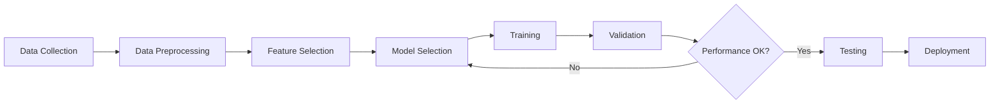
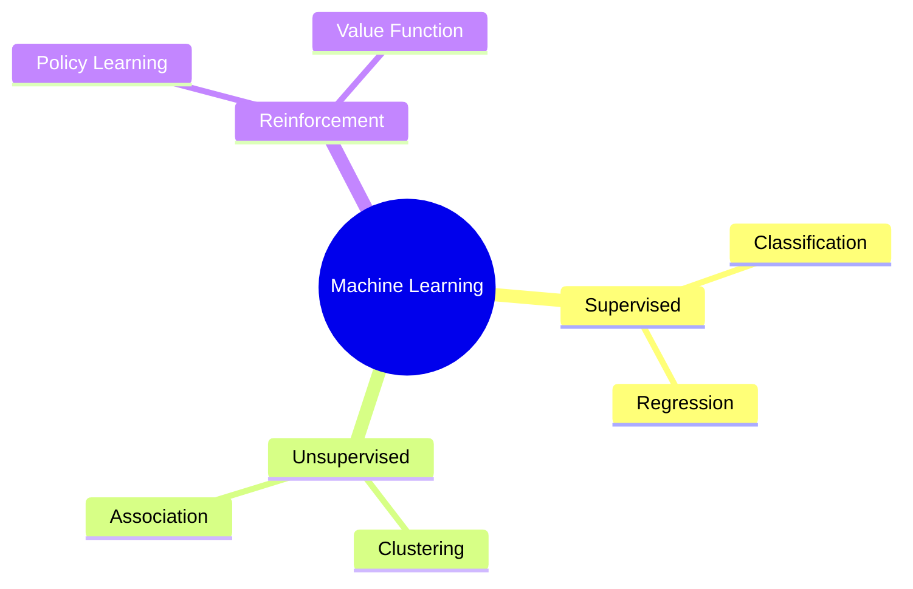
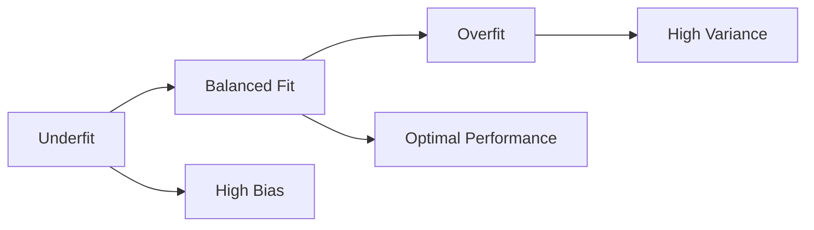
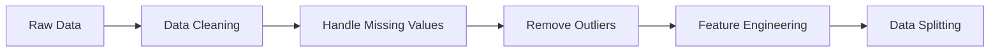

## Question 1(a) [3 marks]

**Define Machine Learning using suitable example?**

**Answer**:

Machine Learning is a subset of artificial intelligence that enables computers to learn and make decisions from data without being explicitly programmed for every task.

**Table: Key Components of Machine Learning**

| Component | Description |
|-----------|-------------|
| **Data** | Input information used for training |
| **Algorithm** | Mathematical model that learns patterns |
| **Training** | Process of teaching the algorithm |
| **Prediction** | Output based on learned patterns |

**Example**: Email spam detection system learns from thousands of emails labeled as "spam" or "not spam" to automatically classify new emails.

**Mnemonic:** "Data Drives Decisions" - Data trains algorithms to make intelligent decisions

## Question 1(b) [4 marks]

**Explain the process of machine learning with the help of schematic representation**

**Answer**:

The machine learning process involves systematic steps from data collection to model deployment.



**Process Steps:**

- **Data Collection**: Gathering relevant dataset
- **Preprocessing**: Cleaning and preparing data
- **Training**: Teaching algorithm using training data
- **Validation**: Testing model performance
- **Deployment**: Using model for real predictions

**Mnemonic:** "Computers Can Truly Think" - Collect, Clean, Train, Test

## Question 1(c) [7 marks]

**Explain different types of machine learning with suitable application.**

**Answer**:

Machine learning algorithms are categorized based on learning approach and available data.

**Table: Types of Machine Learning**

| Type | Learning Method | Data Requirement | Example Application |
|------|----------------|------------------|-------------------|
| **Supervised** | Uses labeled data | Input-output pairs | Email classification |
| **Unsupervised** | Finds hidden patterns | Only input data | Customer segmentation |
| **Reinforcement** | Learns through rewards | Environment feedback | Game playing AI |

**Applications:**

- **Supervised Learning**: Medical diagnosis, image recognition, fraud detection
- **Unsupervised Learning**: Market research, anomaly detection, recommendation systems  
- **Reinforcement Learning**: Autonomous vehicles, robotics, strategic games

**Diagram: Learning Types**



**Mnemonic:** "Students Usually Remember" - Supervised, Unsupervised, Reinforcement

## Question 1(c) OR [7 marks]

**What are various issues with machine learning? List three problems that are not to be solved using machine learning.**

**Answer**:

**Table: Machine Learning Issues**

| Issue Category | Description | Impact |
|---------------|-------------|--------|
| **Data Quality** | Incomplete, noisy, biased data | Poor model performance |
| **Overfitting** | Model memorizes training data | Poor generalization |
| **Computational** | High processing requirements | Resource constraints |
| **Interpretability** | Black box models | Lack of transparency |

**Problems NOT suitable for ML:**

1. **Simple rule-based tasks** - Basic calculations, simple if-then logic
2. **Ethical decisions** - Moral judgments requiring human values
3. **Creative expression** - Original artistic creation requiring human emotion

**Other Issues:**

- **Privacy concerns**: Sensitive data handling
- **Bias propagation**: Unfair algorithmic decisions
- **Feature selection**: Choosing relevant input variables

**Mnemonic:** "Data Drives Quality" - Data quality directly affects model quality

## Question 2(a) [3 marks]

**Give a summarized view of different types of data in a typical machine learning problem.**

**Answer**:

**Table: Data Types in Machine Learning**

| Data Type | Description | Example |
|-----------|-------------|---------|
| **Numerical** | Quantitative values | Age: 25, Height: 170cm |
| **Categorical** | Discrete categories | Color: Red, Blue, Green |
| **Ordinal** | Ordered categories | Rating: Poor, Good, Excellent |
| **Binary** | Two possible values | Gender: Male/Female |

**Characteristics:**

- **Structured**: Organized in tables (databases, spreadsheets)
- **Unstructured**: Images, text, audio files
- **Time-series**: Data points over time

**Mnemonic:** "Numbers Count Better Than Words" - Numerical, Categorical, Binary, Text

## Question 2(b) [4 marks]

**Calculate variance for both attributes. Determine which attribute is spread out around mean.**

**Answer**:

**Given Data:**

- Attribute 1: 32, 37, 47, 50, 59
- Attribute 2: 48, 40, 41, 47, 49

**Calculations:**

**Attribute 1:**

- Mean = (32+37+47+50+59)/5 = 225/5 = 45
- Variance = [(32-45)² + (37-45)² + (47-45)² + (50-45)² + (59-45)²]/5
- Variance = [169 + 64 + 4 + 25 + 196]/5 = 458/5 = 91.6

**Attribute 2:**

- Mean = (48+40+41+47+49)/5 = 225/5 = 45  
- Variance = [(48-45)² + (40-45)² + (41-45)² + (47-45)² + (49-45)²]/5
- Variance = [9 + 25 + 16 + 4 + 16]/5 = 70/5 = 14

**Result**: Attribute 1 (variance = 91.6) is more spread out than Attribute 2 (variance = 14).

**Mnemonic:** "Higher Variance Shows Spread" - Greater variance indicates more dispersion

## Question 2(c) [7 marks]

**List Factors that lead to data quality issue. How to handle outliers and missing values.**

**Answer**:

**Table: Data Quality Issues**

| Factor | Cause | Solution |
|--------|-------|----------|
| **Incompleteness** | Missing data collection | Imputation techniques |
| **Inconsistency** | Different data formats | Standardization |
| **Inaccuracy** | Human/sensor errors | Validation rules |
| **Noise** | Random variations | Filtering methods |

**Handling Outliers:**

- **Detection**: Statistical methods (Z-score, IQR)
- **Treatment**: Remove, transform, or cap extreme values
- **Visualization**: Box plots, scatter plots

**Handling Missing Values:**

- **Deletion**: Remove incomplete records
- **Imputation**: Fill with mean, median, or mode
- **Prediction**: Use ML to predict missing values

**Code Example:**

```python
# Handle missing values
df.fillna(df.mean())  # Mean imputation
df.dropna()          # Remove missing rows
```

**Mnemonic:** "Clean Data Makes Models" - Clean data produces better models

## Question 2(a) OR [3 marks]

**Give different machine learning activities.**

**Answer**:

**Table: Machine Learning Activities**

| Activity | Purpose | Example |
|----------|---------|---------|
| **Data Collection** | Gather relevant information | Surveys, sensors, databases |
| **Data Preprocessing** | Clean and prepare data | Remove noise, handle missing values |
| **Feature Engineering** | Create meaningful variables | Extract features from raw data |
| **Model Training** | Teach algorithm patterns | Use training dataset |
| **Model Evaluation** | Assess performance | Test accuracy, precision, recall |
| **Model Deployment** | Put model into production | Web services, mobile apps |

**Key Activities:**

- **Exploratory Data Analysis**: Understanding data patterns
- **Hyperparameter Tuning**: Optimizing model settings
- **Cross-validation**: Robust performance assessment

**Mnemonic:** "Data Models Perform Excellently" - Data preparation, Model building, Performance evaluation, Execution

## Question 2(b) OR [4 marks]

**Calculate mean and median of the following numbers: 12,15,18,20,22,24,28,30**

**Answer**:

**Given numbers:** 12, 15, 18, 20, 22, 24, 28, 30

**Mean Calculation:**
Mean = (12+15+18+20+22+24+28+30)/8 = 169/8 = 21.125

**Median Calculation:**

- Numbers are already sorted: 12, 15, 18, 20, 22, 24, 28, 30
- Even count (8 numbers)
- Median = (4th number + 5th number)/2 = (20 + 22)/2 = 21

**Table: Statistical Summary**

| Measure | Value | Description |
|---------|-------|-------------|
| **Mean** | 21.125 | Average value |
| **Median** | 21 | Middle value |
| **Count** | 8 | Total numbers |

**Mnemonic:** "Middle Makes Median" - Middle value gives median

## Question 2(c) OR [7 marks]

**Write a short note on dimensionality reduction and feature subset selection in context with data preprocessing.**

**Answer**:

**Dimensionality Reduction** removes irrelevant features and reduces computational complexity while preserving important information.

**Table: Dimensionality Reduction Techniques**

| Technique | Method | Use Case |
|-----------|--------|----------|
| **PCA** | Principal Component Analysis | Linear reduction |
| **LDA** | Linear Discriminant Analysis | Classification tasks |
| **t-SNE** | Non-linear embedding | Visualization |
| **Feature Selection** | Select important features | Reduce overfitting |

**Feature Subset Selection Methods:**

- **Filter Methods**: Statistical tests, correlation analysis
- **Wrapper Methods**: Forward/backward selection
- **Embedded Methods**: LASSO, Ridge regression

**Benefits:**

- **Computational Efficiency**: Faster training and prediction
- **Storage Reduction**: Less memory requirements
- **Noise Reduction**: Remove irrelevant features
- **Visualization**: Enable 2D/3D plotting

**Code Example:**

```python
from sklearn.decomposition import PCA
pca = PCA(n_components=2)
reduced_data = pca.fit_transform(data)
```

**Mnemonic:** "Reduce Features, Improve Performance" - Fewer features often lead to better models

## Question 3(a) [3 marks]

**Does bias affect the performance of the ML model? Explain briefly.**

**Answer**:

Yes, bias significantly affects ML model performance by creating systematic errors in predictions.

**Table: Types of Bias**

| Bias Type | Description | Impact |
|-----------|-------------|--------|
| **Selection Bias** | Non-representative data | Poor generalization |
| **Confirmation Bias** | Favoring expected results | Skewed conclusions |
| **Algorithmic Bias** | Model assumptions | Unfair predictions |

**Effects on Performance:**

- **Underfitting**: High bias leads to oversimplified models
- **Poor Accuracy**: Systematic errors reduce overall performance
- **Unfair Decisions**: Biased models discriminate against groups

**Mitigation Strategies:**

- Diverse training data
- Cross-validation techniques
- Bias detection algorithms

**Mnemonic:** "Bias Breaks Better Performance" - Bias reduces model effectiveness

## Question 3(b) [4 marks]

**Compare cross-validation and bootstrap sampling**

**Answer**:

**Table: Cross-validation vs Bootstrap Sampling**

| Aspect | Cross-validation | Bootstrap Sampling |
|--------|------------------|-------------------|
| **Method** | Split data into folds | Sample with replacement |
| **Data Usage** | Uses all data | Creates multiple samples |
| **Purpose** | Model evaluation | Estimate uncertainty |
| **Overlap** | No overlap between sets | Allows duplicate samples |

**Cross-validation:**

- Divides data into k equal parts
- Trains on k-1 parts, tests on 1 part
- Repeats k times for robust evaluation

**Bootstrap Sampling:**

- Creates random samples with replacement
- Generates multiple datasets of same size
- Estimates confidence intervals

**Applications:**

- **Cross-validation**: Model selection, hyperparameter tuning
- **Bootstrap**: Statistical inference, confidence estimation

**Mnemonic:** "Cross Checks, Bootstrap Builds" - Cross-validation checks performance, Bootstrap builds confidence

## Question 3(c) [7 marks]

**Confusion Matrix Calculation and Metrics**

**Answer**:

**Given Information:**

- True Positive (TP): 83 (predicted buy, actually bought)
- False Positive (FP): 7 (predicted buy, didn't buy)
- False Negative (FN): 5 (predicted no buy, actually bought)
- True Negative (TN): 5 (predicted no buy, didn't buy)

**Confusion Matrix:**

|  | Predicted Buy | Predicted No Buy |
|--|---------------|-----------------|
| **Actually Buy** | 83 (TP) | 5 (FN) |
| **Actually No Buy** | 7 (FP) | 5 (TN) |

**Calculations:**

**a) Error Rate:**
Error Rate = (FP + FN) / Total = (7 + 5) / 100 = 0.12 = 12%

**b) Precision:**
Precision = TP / (TP + FP) = 83 / (83 + 7) = 83/90 = 0.922 = 92.2%

**c) Recall:**
Recall = TP / (TP + FN) = 83 / (83 + 5) = 83/88 = 0.943 = 94.3%

**d) F-measure:**
F-measure = 2 × (Precision × Recall) / (Precision + Recall)
F-measure = 2 × (0.922 × 0.943) / (0.922 + 0.943) = 0.932 = 93.2%

**Table: Performance Metrics**

| Metric | Value | Interpretation |
|--------|-------|---------------|
| **Error Rate** | 12% | Model makes 12% wrong predictions |
| **Precision** | 92.2% | 92.2% of predicted buyers actually buy |
| **Recall** | 94.3% | Model identifies 94.3% of actual buyers |
| **F-measure** | 93.2% | Balanced performance measure |

**Mnemonic:** "Perfect Recall Finds Everyone" - Precision measures accuracy, Recall finds all positives

## Question 3(a) OR [3 marks]

**Define in brief: a) Target function b) Cost function c) Loss Function**

**Answer**:

**Table: Function Definitions**

| Function | Definition | Purpose |
|----------|------------|---------|
| **Target Function** | Ideal mapping from input to output | What we want to learn |
| **Cost Function** | Measures overall model error | Evaluate total performance |
| **Loss Function** | Measures error for single prediction | Individual prediction error |

**Detailed Explanation:**

- **Target Function**: f(x) = y, the true relationship we want to approximate
- **Cost Function**: Average of all loss functions, J = (1/n)Σloss(yi, ŷi)
- **Loss Function**: Error for one sample, e.g., (yi - ŷi)²

**Relationship**: Cost function is typically the average of loss functions across all training examples.

**Mnemonic:** "Target Costs Less" - Target function is ideal, Cost function measures overall error, Loss function measures individual error

## Question 3(b) OR [4 marks]

**Explain balanced fit, underfit and overfit**

**Answer**:

**Table: Model Fitting Types**

| Fit Type | Training Error | Validation Error | Characteristics |
|----------|---------------|------------------|----------------|
| **Underfit** | High | High | Too simple model |
| **Balanced Fit** | Low | Low | Optimal complexity |
| **Overfit** | Very Low | High | Too complex model |

**Visualization:**



**Characteristics:**

- **Underfit**: Model too simple, cannot capture patterns
- **Balanced Fit**: Right complexity, generalizes well
- **Overfit**: Model too complex, memorizes training data

**Solutions:**

- **Underfit**: Increase model complexity, add features
- **Overfit**: Regularization, cross-validation, more data

**Mnemonic:** "Balance Brings Best Results" - Balanced models perform best on new data

## Question 4(a) [3 marks]

**Give classification learning steps.**

**Answer**:

**Table: Classification Learning Steps**

| Step | Description | Purpose |
|------|-------------|---------|
| **Data Collection** | Gather labeled examples | Provide training material |
| **Preprocessing** | Clean and prepare data | Improve data quality |
| **Feature Selection** | Choose relevant attributes | Reduce complexity |
| **Model Training** | Learn from training data | Build classifier |
| **Evaluation** | Test model performance | Assess accuracy |
| **Deployment** | Use for new predictions | Practical application |

**Detailed Process:**

1. **Prepare dataset** with input features and class labels
2. **Split data** into training and testing sets
3. **Train classifier** using training data
4. **Validate model** using test data
5. **Fine-tune parameters** for optimal performance

**Mnemonic:** "Data Preparation Facilitates Model Excellence" - Data prep, Feature selection, Model training, Evaluation

## Question 4(b) [4 marks]

**Linear Relationship Calculation**

**Answer**:

**Given Data:**

| Hours (X) | Exam Score (Y) |
|-----------|---------------|
| 2 | 85 |
| 3 | 80 |
| 4 | 75 |
| 5 | 70 |
| 6 | 60 |

**Linear Regression Calculation:**

**Step 1: Calculate means**

- X̄ = (2+3+4+5+6)/5 = 4
- Ȳ = (85+80+75+70+60)/5 = 74

**Step 2: Calculate slope (b)**

- Numerator = Σ(X-X̄)(Y-Ȳ) = (2-4)(85-74) + (3-4)(80-74) + (4-4)(75-74) + (5-4)(70-74) + (6-4)(60-74)
- = (-2)(11) + (-1)(6) + (0)(1) + (1)(-4) + (2)(-14) = -22 - 6 + 0 - 4 - 28 = -60
- Denominator = Σ(X-X̄)² = (-2)² + (-1)² + (0)² + (1)² + (2)² = 4 + 1 + 0 + 1 + 4 = 10
- b = -60/10 = -6

**Step 3: Calculate intercept (a)**

- a = Ȳ - b×X̄ = 74 - (-6)×4 = 74 + 24 = 98

**Linear Equation: Y = 98 - 6X**

**Interpretation**: For every additional hour of smartphone use, exam score decreases by 6 points.

**Mnemonic:** "More Phone, Less Score" - Negative correlation between phone use and grades

## Question 4(c) [7 marks]

**Explain classification steps in detail**

**Answer**:

Classification is a supervised learning process that assigns input data to predefined categories or classes.

**Detailed Classification Steps:**

**1. Problem Definition**

- Define classes and objectives
- Identify input features and target variable
- Determine success criteria

**2. Data Collection and Preparation**



**3. Feature Engineering**

- **Feature Selection**: Choose relevant attributes
- **Feature Extraction**: Create new meaningful features
- **Normalization**: Scale features to similar ranges

**4. Model Selection and Training**

**Table: Common Classification Algorithms**

| Algorithm | Best For | Advantages |
|-----------|----------|------------|
| **Decision Tree** | Interpretable rules | Easy to understand |
| **SVM** | High-dimensional data | Good generalization |
| **Neural Networks** | Complex patterns | High accuracy |
| **Naive Bayes** | Text classification | Fast training |

**5. Model Evaluation**

- **Confusion Matrix**: Detailed performance analysis
- **Cross-validation**: Robust performance estimation
- **Metrics**: Accuracy, Precision, Recall, F1-score

**6. Hyperparameter Tuning**

- Grid search for optimal parameters
- Validation set for parameter selection

**7. Final Evaluation and Deployment**

- Test on unseen data
- Deploy model for production use
- Monitor performance over time

**Mnemonic:** "Proper Data Modeling Evaluates Performance Thoroughly" - Problem definition, Data prep, Modeling, Evaluation, Performance testing, Tuning

## Question 4(a) OR [3 marks]

**Does the choice of the k value influence the performance of the KNN algorithm? Explain briefly**

**Answer**:

Yes, the k value significantly influences KNN algorithm performance by affecting the decision boundary and model complexity.

**Table: K Value Impact**

| K Value | Effect | Performance |
|---------|--------|-------------|
| **Small K (k=1)** | Sensitive to noise | High variance, low bias |
| **Medium K** | Balanced decisions | Optimal performance |
| **Large K** | Smooth boundaries | Low variance, high bias |

**Impact Analysis:**

- **k=1**: May overfit to training data, sensitive to outliers
- **Optimal k**: Usually odd number, balances bias-variance tradeoff
- **Large k**: May underfit, loses local patterns

**Selection Strategy:**

- Use cross-validation to find optimal k
- Try k = √n as starting point
- Consider computational cost vs accuracy

**Mnemonic:** "Small K Varies, Large K Smooths" - Small k creates variance, large k creates smooth boundaries

## Question 4(b) OR [4 marks]

**Define Support Vectors in the SVM model.**

**Answer**:

Support Vectors are the critical data points that lie closest to the decision boundary (hyperplane) in Support Vector Machine algorithm.

**Table: Support Vector Characteristics**

| Aspect | Description | Importance |
|--------|-------------|------------|
| **Location** | Closest points to hyperplane | Define decision boundary |
| **Distance** | Equal distance from boundary | Maximize margin |
| **Role** | Support the hyperplane | Determine optimal separation |
| **Sensitivity** | Removing them changes model | Critical for model structure |

**Key Properties:**

- **Margin Definition**: Support vectors determine the maximum margin between classes
- **Model Dependency**: Only support vectors affect the final model
- **Boundary Formation**: Create the optimal separating hyperplane

**Diagram:**

```goat
      Class A  |     |  Class B
         o     |     |     x
           o   |     |   x
         o   O |     | X   x
           o   |     |   x  
         o     |     |     x
              
         Support Vectors: O and X
         Hyperplane: ---|---
```

**Mathematical Significance**: Support vectors satisfy the constraint yi(w·xi + b) = 1, where they lie exactly on the margin boundary.

**Mnemonic:** "Support Vectors Support Decisions" - These vectors support the decision boundary

## Question 4(c) OR [7 marks]

**Explain logistic regression in detail.**

**Answer**:

Logistic Regression is a statistical method used for binary classification that models the probability of class membership using the logistic function.

**Mathematical Foundation:**

**Sigmoid Function:**
σ(z) = 1 / (1 + e^(-z))
where z = β₀ + β₁x₁ + β₂x₂ + ... + βₙxₙ

**Table: Linear vs Logistic Regression**

| Aspect | Linear Regression | Logistic Regression |
|--------|------------------|-------------------|
| **Output** | Continuous values | Probabilities (0-1) |
| **Function** | Linear | Sigmoid (S-curve) |
| **Purpose** | Prediction | Classification |
| **Error Function** | Mean Squared Error | Log-likelihood |

**Key Components:**

**1. Logistic Function Properties:**

- **S-shaped curve**: Smooth transition between 0 and 1
- **Asymptotes**: Approaches 0 and 1 but never reaches them
- **Monotonic**: Always increasing function

**2. Model Training:**

- **Maximum Likelihood Estimation**: Find parameters that maximize probability of observed data
- **Gradient Descent**: Iterative optimization algorithm
- **Cost Function**: Log-loss or cross-entropy

**3. Decision Making:**

- **Threshold**: Typically 0.5 for binary classification
- **Probability Output**: P(y=1|x) gives class probability
- **Decision Rule**: Classify as positive if P(y=1|x) > 0.5

**Advantages:**

- **Probabilistic Output**: Provides confidence in predictions
- **No Assumptions**: About distribution of independent variables
- **Less Overfitting**: Compared to complex models
- **Fast Training**: Efficient computation

**Applications:**

- Medical diagnosis
- Marketing response prediction
- Credit approval decisions
- Email spam detection

**Code Example:**

```python
from sklearn.linear_model import LogisticRegression
model = LogisticRegression()
model.fit(X_train, y_train)
predictions = model.predict(X_test)
probabilities = model.predict_proba(X_test)
```

**Mnemonic:** "Sigmoid Squashes Infinite Input" - Sigmoid function converts any real number to probability

## Question 5(a) [3 marks]

**Write a short note on Matplotlib python library.**

**Answer**:

Matplotlib is a comprehensive Python library for creating static, animated, and interactive visualizations in data science and machine learning.

**Table: Matplotlib Key Features**

| Feature | Purpose | Example |
|---------|---------|---------|
| **Pyplot** | MATLAB-like plotting interface | Line plots, scatter plots |
| **Object-oriented** | Advanced customization | Figure and axes objects |
| **Multiple formats** | Save in various formats | PNG, PDF, SVG, EPS |
| **Subplots** | Multiple plots in one figure | Grid arrangements |

**Common Plot Types:**

- **Line Plot**: Trends over time
- **Scatter Plot**: Relationship between variables  
- **Histogram**: Data distribution
- **Bar Chart**: Categorical comparisons
- **Box Plot**: Statistical summaries

**Basic Usage:**

```python
import matplotlib.pyplot as plt
plt.plot(x, y)
plt.xlabel('X Label')
plt.ylabel('Y Label')
plt.title('Plot Title')
plt.show()
```

**Applications**: Data exploration, model performance visualization, presentation graphics

**Mnemonic:** "Matplotlib Makes Pretty Plots" - Essential tool for data visualization

## Question 5(b) [4 marks]

**K-means clustering for two-dimensional data**

**Answer**:

**Given Points:**
{(2,3),(3,3),(4,3),(5,3),(6,3),(7,3),(8,3),(25,20),(26,20),(27,20),(28,20),(29,20),(30,20)}

**K-means Algorithm Steps:**

**Step 1: Initialize centroids**

- Cluster 1: (4, 3) - chosen from left group
- Cluster 2: (27, 20) - chosen from right group

**Step 2: Assign points to nearest centroid**

**Table: Point Assignments**

| Point | Distance to C1 | Distance to C2 | Assigned Cluster |
|-------|---------------|----------------|-----------------|
| (2,3) | 2.0 | 25.8 | Cluster 1 |
| (3,3) | 1.0 | 24.8 | Cluster 1 |
| (4,3) | 0.0 | 23.8 | Cluster 1 |
| (5,3) | 1.0 | 22.8 | Cluster 1 |
| (6,3) | 2.0 | 21.8 | Cluster 1 |
| (7,3) | 3.0 | 20.8 | Cluster 1 |
| (8,3) | 4.0 | 19.8 | Cluster 1 |
| (25,20) | 23.8 | 2.0 | Cluster 2 |
| (26,20) | 24.8 | 1.0 | Cluster 2 |
| (27,20) | 25.8 | 0.0 | Cluster 2 |
| (28,20) | 26.8 | 1.0 | Cluster 2 |
| (29,20) | 27.8 | 2.0 | Cluster 2 |
| (30,20) | 28.8 | 3.0 | Cluster 2 |

**Step 3: Update centroids**

- New C1 = ((2+3+4+5+6+7+8)/7, (3+3+3+3+3+3+3)/7) = (5, 3)
- New C2 = ((25+26+27+28+29+30)/6, (20+20+20+20+20+20)/6) = (27.5, 20)

**Final Clusters:**

- **Cluster 1**: {(2,3),(3,3),(4,3),(5,3),(6,3),(7,3),(8,3)}
- **Cluster 2**: {(25,20),(26,20),(27,20),(28,20),(29,20),(30,20)}

**Mnemonic:** "Centroids Attract Nearest Neighbors" - Points join closest centroid

## Question 5(c) [7 marks]

**Give functions and its use of Scikit-learn for: a. Data Preprocessing b. Model Selection c. Model Evaluation and Metrics**

**Answer**:

Scikit-learn provides comprehensive tools for machine learning workflow from data preprocessing to model evaluation.

**a) Data Preprocessing Functions:**

**Table: Preprocessing Functions**

| Function | Purpose | Example Usage |
|----------|---------|--------------|
| `StandardScaler()` | Normalize features | Remove mean, unit variance |
| `MinMaxScaler()` | Scale to range [0,1] | Feature scaling |
| `LabelEncoder()` | Encode categorical labels | Convert text to numbers |
| `OneHotEncoder()` | Create dummy variables | Handle categorical features |
| `train_test_split()` | Split dataset | Training/testing division |

**Code Example:**

```python
from sklearn.preprocessing import StandardScaler
scaler = StandardScaler()
X_scaled = scaler.fit_transform(X)
```

**b) Model Selection Functions:**

**Table: Model Selection Tools**

| Function | Purpose | Application |
|----------|---------|-------------|
| `GridSearchCV()` | Hyperparameter tuning | Find optimal parameters |
| `RandomizedSearchCV()` | Random parameter search | Faster parameter optimization |
| `cross_val_score()` | Cross-validation | Model performance evaluation |
| `StratifiedKFold()` | Stratified sampling | Balanced cross-validation |
| `Pipeline()` | Combine preprocessing and modeling | Streamlined workflow |

**Code Example:**

```python
from sklearn.model_selection import GridSearchCV
param_grid = {'C': [0.1, 1, 10]}
grid_search = GridSearchCV(SVM(), param_grid, cv=5)
grid_search.fit(X_train, y_train)
```

**c) Model Evaluation and Metrics Functions:**

**Table: Evaluation Metrics**

| Function | Purpose | Use Case |
|----------|---------|----------|
| `accuracy_score()` | Overall accuracy | General classification |
| `precision_score()` | Positive prediction accuracy | Minimize false positives |
| `recall_score()` | True positive rate | Minimize false negatives |
| `f1_score()` | Harmonic mean of precision/recall | Balanced metric |
| `confusion_matrix()` | Detailed error analysis | Understanding mistakes |
| `classification_report()` | Comprehensive metrics | Complete evaluation |
| `roc_auc_score()` | Area under ROC curve | Binary classification |

**Code Example:**

```python
from sklearn.metrics import classification_report
print(classification_report(y_true, y_pred))
```

**Workflow Integration:**

- **Preprocessing**: Clean and prepare data
- **Model Selection**: Choose and tune algorithms
- **Evaluation**: Assess performance comprehensively

**Mnemonic:** "Preprocess, Select, Evaluate" - Complete ML workflow in Scikit-learn

## Question 5(a) OR [3 marks]

**List out the major features of Numpy.**

**Answer**:

NumPy (Numerical Python) is the fundamental package for scientific computing in Python, providing powerful array operations and mathematical functions.

**Table: Major NumPy Features**

| Feature | Description | Benefit |
|---------|-------------|---------|
| **N-dimensional Arrays** | Efficient array objects | Fast mathematical operations |
| **Broadcasting** | Operations on different sized arrays | Flexible computations |
| **Linear Algebra** | Matrix operations, decompositions | Scientific computing |
| **Random Numbers** | Random sampling and distributions | Statistical simulations |
| **Integration** | Works with C/C++/Fortran | High performance |

**Key Capabilities:**

- **Mathematical Functions**: Trigonometric, logarithmic, exponential
- **Array Manipulation**: Reshaping, splitting, joining arrays
- **Indexing**: Advanced slicing and boolean indexing
- **Memory Efficiency**: Optimized data storage

**Applications**: Data analysis, machine learning, image processing, scientific research

**Mnemonic:** "Numbers Need Numpy's Power" - Essential for numerical computations

## Question 5(b) OR [4 marks]

**K-means clustering for one-dimensional data**

**Answer**:

**Given Dataset:** {1,2,4,5,7,8,10,11,12,14,15,17}

**K-means Algorithm for 3 clusters:**

**Step 1: Initialize centroids**

- C1 = 3 (around early values)
- C2 = 9 (around middle values)  
- C3 = 15 (around later values)

**Step 2: Assign points to nearest centroid**

**Table: Point Assignments (Iteration 1)**

| Point | Distance to C1 | Distance to C2 | Distance to C3 | Assigned Cluster |
|-------|---------------|----------------|----------------|-----------------|
| 1 | 2 | 8 | 14 | Cluster 1 |
| 2 | 1 | 7 | 13 | Cluster 1 |
| 4 | 1 | 5 | 11 | Cluster 1 |
| 5 | 2 | 4 | 10 | Cluster 1 |
| 7 | 4 | 2 | 8 | Cluster 2 |
| 8 | 5 | 1 | 7 | Cluster 2 |
| 10 | 7 | 1 | 5 | Cluster 2 |
| 11 | 8 | 2 | 4 | Cluster 2 |
| 12 | 9 | 3 | 3 | Cluster 2 |
| 14 | 11 | 5 | 1 | Cluster 3 |
| 15 | 12 | 6 | 0 | Cluster 3 |
| 17 | 14 | 8 | 2 | Cluster 3 |

**Step 3: Update centroids**

- New C1 = (1+2+4+5)/4 = 3
- New C2 = (7+8+10+11+12)/5 = 9.6
- New C3 = (14+15+17)/3 = 15.33

**Final Clusters:**

- **Cluster 1**: {1, 2, 4, 5}
- **Cluster 2**: {7, 8, 10, 11, 12}
- **Cluster 3**: {14, 15, 17}

**Mnemonic:** "Groups Gather by Distance" - Similar points form natural clusters

## Question 5(c) OR [7 marks]

**Give function and its use of Pandas library for: a. Data Preprocessing b. Data Inspection c. Data Cleaning and Transformation**

**Answer**:

Pandas is a powerful Python library for data manipulation and analysis, providing high-level data structures and operations.

**a) Data Preprocessing Functions:**

**Table: Preprocessing Functions**

| Function | Purpose | Example |
|----------|---------|---------|
| `read_csv()` | Load CSV files | `pd.read_csv('data.csv')` |
| `head()` | View first n rows | `df.head(10)` |
| `tail()` | View last n rows | `df.tail(5)` |
| `sample()` | Random sampling | `df.sample(100)` |
| `set_index()` | Set column as index | `df.set_index('id')` |

**b) Data Inspection Functions:**

**Table: Inspection Functions**

| Function | Purpose | Information Provided |
|----------|---------|-------------------|
| `info()` | Dataset overview | Data types, memory usage |
| `describe()` | Statistical summary | Mean, std, min, max |
| `shape` | Dataset dimensions | (rows, columns) |
| `dtypes` | Data types | Column data types |
| `isnull()` | Missing values | Boolean mask for nulls |
| `value_counts()` | Count unique values | Frequency distribution |
| `corr()` | Correlation matrix | Feature relationships |

**Code Example:**

```python
# Data inspection
print(df.info())
print(df.describe())
print(df.isnull().sum())
```

**c) Data Cleaning and Transformation Functions:**

**Table: Cleaning Functions**

| Function | Purpose | Usage |
|----------|---------|-------|
| `dropna()` | Remove missing values | `df.dropna()` |
| `fillna()` | Fill missing values | `df.fillna(0)` |
| `drop_duplicates()` | Remove duplicate rows | `df.drop_duplicates()` |
| `replace()` | Replace values | `df.replace('old', 'new')` |
| `astype()` | Change data types | `df['col'].astype('int')` |
| `apply()` | Apply function to data | `df.apply(lambda x: x*2)` |
| `groupby()` | Group data | `df.groupby('category')` |
| `merge()` | Join datasets | `pd.merge(df1, df2)` |
| `pivot()` | Reshape data | `df.pivot(columns='col')` |

**Advanced Operations:**

- **String Operations**: `str.contains()`, `str.replace()`
- **Date Operations**: `to_datetime()`, `dt.year`
- **Categorical Data**: `pd.Categorical()`

**Workflow Example:**

```python
# Complete preprocessing pipeline
df = pd.read_csv('data.csv')
df = df.dropna()
df['category'] = df['category'].astype('category')
df_grouped = df.groupby('type').mean()
```

**Benefits:**

- **Intuitive Syntax**: Easy to learn and use
- **Performance**: Optimized for large datasets
- **Integration**: Works well with NumPy, Matplotlib
- **Flexibility**: Handles various data formats

**Mnemonic:** "Pandas Processes Data Perfectly" - Comprehensive data manipulation tool
