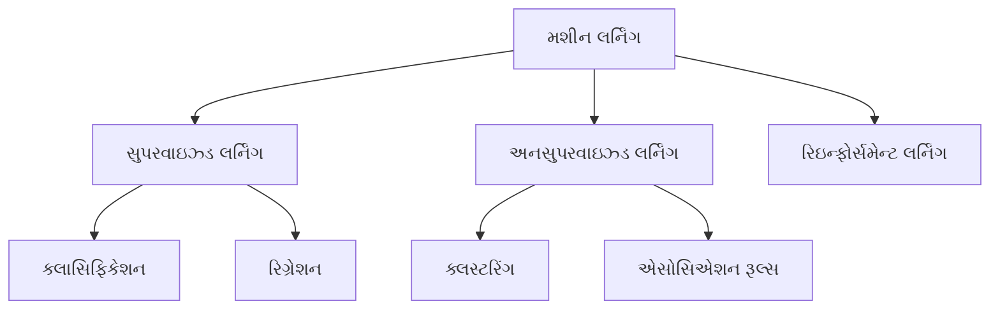
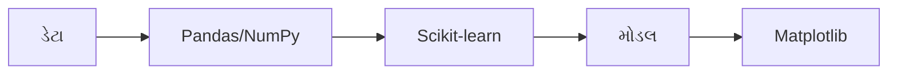
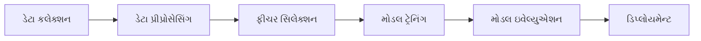
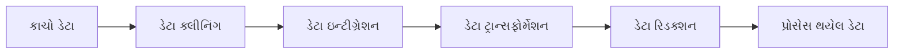
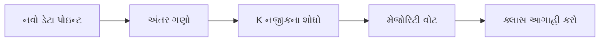
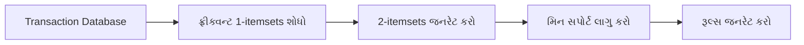
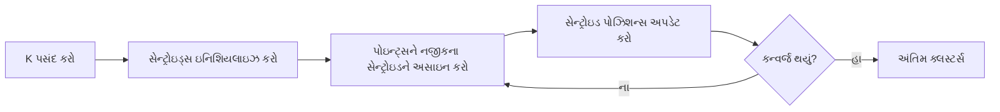
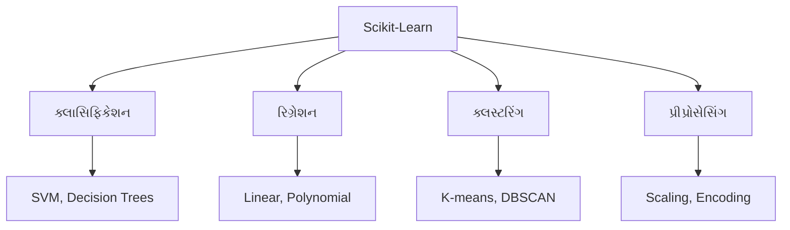
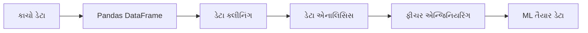

## પ્રશ્ન 1(અ) [3 ગુણ]

**મશીન લર્નિંગની વ્યાખ્યા આપો. મશીન લર્નિંગની કોઈપણ બે ઉપયોગીતાઓ આપો.**

**જવાબ**:

મશીન લર્નિંગ એ આર્ટિફિશિયલ ઇન્ટેલિજન્સનો એક ભાગ છે જે કમ્પ્યુટરને ડેટામાંથી શીખવા અને દરેક કાર્ય માટે સ્પષ્ટ પ્રોગ્રામિંગ વિના નિર્ણયો લેવાની ક્ષમતા આપે છે.

**ઉપયોગીતાઓ:**

- **ઈમેઇલ સ્પામ ડિટેક્શન**: આપોઆપ સ્પામ ઈમેઇલ ઓળખે અને ફિલ્ટર કરે છે
- **સુઝાવ સિસ્ટમ**: Amazon જેવી ઈ-કોમર્સ સાઇટ્સ પર પ્રોડક્ટ સુઝાવે છે

**ટેબલ: ML વિ ટ્રેડિશનલ પ્રોગ્રામિંગ**

| પરંપરાગત પ્રોગ્રામિંગ | મશીન લર્નિંગ |
|------------------------|------------------|
| ઇનપુટ ડેટા + પ્રોગ્રામ → આઉટપુટ | ઇનપુટ ડેટા + આઉટપુટ → પ્રોગ્રામ |
| નિયમો સ્પષ્ટપણે કોડ કરવામાં આવે છે | નિયમો ડેટામાંથી શીખવામાં આવે છે |

**મેમરી ટ્રીક:** "ML = ડેટામાંથી શીખવું બનાવો"

## પ્રશ્ન 1(બ) [4 ગુણ]

**વ્યાખ્યા આપો: અંડર ફિટિંગ અને ઓવર ફિટિંગ.**

**જવાબ**:

**અંડરફિટિંગ** ત્યારે થાય છે જ્યારે મોડલ ડેટામાં છુપાયેલા પેટર્ન કેપ્ચર કરવા માટે ખૂબ સાદું હોય છે, જેના પરિણામે ટ્રેનિંગ અને ટેસ્ટ બંને ડેટા પર નબળી કામગીરી થાય છે.

**ઓવરફિટિંગ** ત્યારે થાય છે જ્યારે મોડલ ટ્રેનિંગ ડેટાને અવાજ સહિત ખૂબ સારી રીતે શીખે છે, જેના કારણે નવા અદ્રશ્ય ડેટા પર નબળી કામગીરી થાય છે.

**ટેબલ: સરખામણી**

| પાસું | અંડરફિટિંગ | ઓવરફિટિંગ |
|--------|-------------|-------------|
| **ટ્રેનિંગ એક્યુરેસી** | ઓછી | વધારે |
| **ટેસ્ટ એક્યુરેસી** | ઓછી | ઓછી |
| **મોડલ કોમ્પ્લેક્સિટી** | ખૂબ સાદું | ખૂબ જટિલ |
| **સોલ્યુશન** | કોમ્પ્લેક્સિટી વધારો | કોમ્પ્લેક્સિટી ઘટાડો |

**મેમરી ટ્રીક:** "અંડર = ઓછું કામ, ઓવર = વધુ પડતું શીખવું"

## પ્રશ્ન 1(ક) [7 ગુણ]

**મશીન લર્નિંગના વિવિધ પ્રકારો યોગ્ય ઉદાહરણની મદદથી વર્ણવો.**

**જવાબ**:

**ટેબલ: મશીન લર્નિંગના પ્રકારો**

| પ્રકાર | વર્ણન | ઉદાહરણ |
|------|-------------|---------|
| **સુપરવાઇઝ્ડ** | લેબલ કરેલ ટ્રેનિંગ ડેટા વાપરે છે | ઈમેઇલ વર્ગીકરણ |
| **અનસુપરવાઇઝ્ડ** | લેબલ કરેલ ડેટા નથી, પેટર્ન શોધે છે | કસ્ટમર સેગમેન્ટેશન |
| **રિઇન્ફોર્સમેન્ટ** | પુરસ્કાર/દંડ દ્વારા શીખે છે | ગેમ રમતું AI |

**સુપરવાઇઝ્ડ લર્નિંગ** ઇનપુટ-આઉટપુટ જોડીઓ વાપરીને મોડલ ટ્રેન કરે છે. અલ્ગોરિધમ ઉદાહરણોમાંથી શીખીને નવા ડેટા માટે પરિણામોની આગાહી કરે છે.

**અનસુપરવાઇઝ્ડ લર્નિંગ** ટાર્ગેટ લેબલ વિના ડેટામાં છુપાયેલા પેટર્ન શોધે છે. તે સમાન ડેટા પોઇન્ટ્સને એકસાથે જૂથબદ્ધ કરે છે.

**રિઇન્ફોર્સમેન્ટ લર્નિંગ** સારા કાર્યો માટે પુરસ્કાર અને ખરાબ કાર્યો માટે દંડ આપીને એજન્ટને નિર્ણય લેવાનું શીખવે છે.

**ડાયાગ્રામ:**



**મેમરી ટ્રીક:** "સુપર અન-સુપરવાઇઝ્ડ રિઇન્ફોર્સ શીખવું"

## પ્રશ્ન 1(ક) અથવા [7 ગુણ]

**મશીન લર્નિંગમાં ઉપયોગ થતી વિવિધ ટૂલ્સ અને ટેકનોલોજી વર્ણવો.**

**જવાબ**:

**ટેબલ: ML ટૂલ્સ અને ટેકનોલોજીઓ**

| કેટેગરી | ટૂલ્સ | હેતુ |
|----------|-------|---------|
| **પ્રોગ્રામિંગ** | Python, R | મુખ્ય ડેવલપમેન્ટ |
| **લાઇબ્રેરીઓ** | Scikit-learn, TensorFlow | મોડલ બિલ્ડિંગ |
| **ડેટા પ્રોસેસિંગ** | Pandas, NumPy | ડેટા મેનિપ્યુલેશન |
| **વિઝ્યુલાઇઝેશન** | Matplotlib, Seaborn | ડેટા પ્લોટિંગ |

**Python** તેની સરળતા અને વ્યાપક લાઇબ્રેરીઓને કારણે સૌથી લોકપ્રિય ભાષા છે.

**Scikit-learn** ડેટા માઇનિંગ અને વિશ્લેષણ માટે સરળ ટૂલ્સ પ્રદાન કરે છે, જે શરૂઆતીઓ માટે પરફેક્ટ છે.

**TensorFlow** અને **PyTorch** ડીપ લર્નિંગ એપ્લિકેશન માટે એડવાન્સ ફ્રેમવર્ક છે.

**Jupyter Notebook** પ્રયોગ માટે ઇન્ટરેક્ટિવ ડેવલપમેન્ટ એન્વાયર્નમેન્ટ ઓફર કરે છે.

**ડાયાગ્રામ:**



**મેમરી ટ્રીક:** "Python Pandas Scikit Tensor Jupyter"

## પ્રશ્ન 2(અ) [3 ગુણ]

**Qualitative ડેટા અને Quantitative ડેટા વચ્ચેનો તફાવત આપો.**

**જવાબ**:

**ટેબલ: Qualitative વિ Quantitative ડેટા**

| Qualitative ડેટા | Quantitative ડેટા |
|------------------|-------------------|
| **બિન-સંખ્યાત્મક** કેટેગરીઓ | **સંખ્યાત્મક** મૂલ્યો |
| રંગો, નામો, ગ્રેડ્સ | ઊંચાઈ, વજન, કિંમત |
| માપી શકાતું નથી | માપી શકાય છે |

**Qualitative ડેટા** એવા ગુણો અથવા લક્ષણોનું વર્ણન કરે છે જે સંખ્યાત્મક રીતે માપી શકાતા નથી.

**Quantitative ડેટા** સંખ્યાઓ તરીકે વ્યક્ત કરેલા માપી શકાય તેવા જથ્થાઓનું પ્રતિનિધિત્વ કરે છે.

**મેમરી ટ્રીક:** "Quality = કેટેગરીઓ, Quantity = સંખ્યાઓ"

## પ્રશ્ન 2(બ) [4 ગુણ]

**નીચે આપેલા ડેટાનું mean અને median શોધો: 3,4,5,5,7,8,9,11,12,14.**

**જવાબ**:

**આપેલ ડેટા:** 3, 4, 5, 5, 7, 8, 9, 11, 12, 14

**Mean ગણતરી:**

- સરવાળો = 3+4+5+5+7+8+9+11+12+14 = 78
- સંખ્યાઓની ગિનતી = 10
- **Mean = 78/10 = 7.8**

**Median ગણતરી:**

- ડેટા પહેલેથી જ સોર્ટ થયેલ છે
- 10 સંખ્યાઓ માટે: Median = (5મી + 6ઠી મૂલ્ય)/2
- **Median = (7+8)/2 = 7.5**

**ટેબલ: પરિણામો**

| માપદંડ | મૂલ્ય |
|---------|-------|
| **Mean** | 7.8 |
| **Median** | 7.5 |

**મેમરી ટ્રીક:** "Mean = સરેરાશ, Median = મધ્યક"

## પ્રશ્ન 2(ક) [7 ગુણ]

**મશીન લર્નિંગની એક્ટિવિટી વિગતવાર વર્ણવો.**

**જવાબ**:

**ટેબલ: મશીન લર્નિંગ એક્ટિવિટીઓ**

| એક્ટિવિટી | વર્ણન | ઉદાહરણ |
|----------|-------------|---------|
| **ડેટા કલેક્શન** | સંબંધિત ડેટા એકત્રિત કરવું | સર્વે પ્રતિભાવો |
| **ડેટા પ્રીપ્રોસેસિંગ** | ડેટા સાફ અને તૈયાર કરવું | ડુપ્લિકેટ્સ દૂર કરવા |
| **ફીચર સિલેક્શન** | મહત્વપૂર્ણ વેરિયેબલ્સ પસંદ કરવા | લોન માટે ઉંમર, આવક |
| **મોડલ ટ્રેનિંગ** | અલ્ગોરિધમને પેટર્ન શીખવવું | ટ્રેનિંગ ડેટા ખવડાવવો |
| **મોડલ ઇવેલ્યુએશન** | મોડલની કામગીરી પરીક્ષણ | એક્યુરેસી મેઝરમેન્ટ |

**ડેટા કલેક્શન** ડેટાબેસ, સેન્સર્સ અથવા સર્વે જેવા વિવિધ સ્રોતોમાંથી માહિતી એકત્રિત કરવાનો સમાવેશ કરે છે.

**ડેટા પ્રીપ્રોસેસિંગ** વિશ્લેષણ માટે કાચા ડેટાને સાફ, રૂપાંતર અને ગોઠવવાનો સમાવેશ કરે છે.

**ફીચર સિલેક્શન** આગાહીઓમાં યોગદાન આપતા સૌથી સંબંધિત વેરિયેબલ્સ ઓળખે છે.

**મોડલ ટ્રેનિંગ** તૈયાર કરેલા ટ્રેનિંગ ડેટામાંથી પેટર્ન શીખવા માટે અલ્ગોરિધમ્સનો ઉપયોગ કરે છે.

**મોડલ ઇવેલ્યુએશન** ટ્રેન કરેલ મોડલ નવા, અદ્રશ્ય ડેટા પર કેટલી સારી કામગીરી કરે છે તેનું પરીક્ષણ કરે છે.

**ડાયાગ્રામ:**



**મેમરી ટ્રીક:** "કલેક્ટ પ્રોસેસ ફીચર ટ્રેન ઇવેલ્યુએટ ડિપ્લોય"

## પ્રશ્ન 2(અ) અથવા [3 ગુણ]

**Predictive મોડલ અને Descriptive મોડલ વચ્ચેનો તફાવત આપો.**

**જવાબ**:

**ટેબલ: Predictive વિ Descriptive મોડલ્સ**

| Predictive મોડલ | Descriptive મોડલ |
|------------------|-------------------|
| **ભવિષ્યના** પરિણામોની આગાહી કરે છે | **વર્તમાન** પેટર્નનું સમજૂતી આપે છે |
| સુપરવાઇઝ્ડ લર્નિંગ વાપરે છે | અનસુપરવાઇઝ્ડ લર્નિંગ વાપરે છે |
| સ્ટોક પ્રાઇસ પ્રિડિક્શન | કસ્ટમર સેગમેન્ટેશન |

**Predictive મોડલ્સ** ભવિષ્યની ઘટનાઓ અથવા અજાણ્યા પરિણામોની આગાહી કરવા માટે ઐતિહાસિક ડેટાનો ઉપયોગ કરે છે.

**Descriptive મોડલ્સ** વર્તમાન પેટર્ન અને સંબંધોને સમજવા માટે હાલના ડેટાનું વિશ્લેષણ કરે છે.

**મેમરી ટ્રીક:** "Predict = ભવિષ્ય, Describe = વર્તમાન"

## પ્રશ્ન 2(બ) અથવા [4 ગુણ]

**નીચે આપેલા ડેટાને યોગ્ય ડેટા ટાઇપની મદદથી classify કરો: hair color, gender, blood group type, time of day.**

**જવાબ**:

**ટેબલ: ડેટા ટાઇપ ક્લાસિફિકેશન**

| ડેટા | પ્રકાર | કારણ |
|------|------|--------|
| **Hair color** | Nominal | કોઈ ક્રમ વિના કેટેગરીઓ |
| **Gender** | Nominal | કોઈ ક્રમ વિના કેટેગરીઓ |
| **Blood group** | Nominal | કોઈ ક્રમ વિના કેટેગરીઓ |
| **Time of day** | Continuous | માપી શકાય તેવી માત્રા |

**Nominal ડેટા** કોઈ કુદરતી ક્રમ વિના કેટેગરીઓનું પ્રતિનિધિત્વ કરે છે.

**Continuous ડેટા** શ્રેણીમાં કોઈપણ મૂલ્ય લઈ શકે છે અને માપી શકાય છે.

**મેમરી ટ્રીક:** "નામો = Nominal, સંખ્યાઓ = Numerical"

## પ્રશ્ન 2(ક) અથવા [7 ગુણ]

**ડેટા પ્રી-પ્રોસેસિંગમાં ઉપયોગ થતી વિવિધ મેથડ્સ વર્ણવો.**

**જવાબ**:

**ટેબલ: ડેટા પ્રીપ્રોસેસિંગ મેથડ્સ**

| મેથડ | હેતુ | ઉદાહરણ |
|--------|---------|---------|
| **ડેટા ક્લીનિંગ** | ભૂલો અને અસંગતતાઓ દૂર કરવી | ટાઇપોઝ ઠીક કરવા, ડુપ્લિકેટ્સ દૂર કરવા |
| **ડેટા ઇન્ટીગ્રેશન** | બહુવિધ સ્રોતો એકસાથે જોડવા | કસ્ટમર ડેટાબેસ મર્જ કરવા |
| **ડેટા ટ્રાન્સફોર્મેશન** | યોગ્ય ફોર્મેટમાં કન્વર્ટ કરવું | 0-1 મૂલ્યો નોર્મલાઇઝ કરવા |
| **ડેટા રિડક્શન** | ડેટાસેટનું કદ ઘટાડવું | મહત્વપૂર્ણ ફીચર્સ પસંદ કરવા |

**ડેટા ક્લીનિંગ** ભૂલભરેલ, અધૂરા અથવા અપ્રસ્તુત ડેટાને દૂર કરે છે અથવા સુધારે છે.

**ડેટા ઇન્ટીગ્રેશન** બહુવિધ સ્રોતોમાંથી ડેટાને એકીકૃત ડેટાસેટમાં જોડે છે.

**ડેટા ટ્રાન્સફોર્મેશન** વિશ્લેષણ માટે ડેટાને યોગ્ય ફોર્મેટમાં કન્વર્ટ કરે છે.

**ડેટા રિડક્શન** માહિતીની ગુણવત્તા જાળવીને ડેટાસેટનું કદ ઘટાડે છે.

**ડાયાગ્રામ:**



**મેમરી ટ્રીક:** "ક્લીન ઇન્ટીગ્રેટ ટ્રાન્સફોર્મ રિડ્યુસ"

## પ્રશ્ન 3(અ) [3 ગુણ]

**Classification અને Regression વચ્ચેનો તફાવત આપો.**

**જવાબ**:

**ટેબલ: Classification વિ Regression**

| Classification | Regression |
|----------------|------------|
| **ડિસ્ક્રીટ** આઉટપુટ | **કન્ટિન્યુઅસ** આઉટપુટ |
| કેટેગરીઓની આગાહી કરે છે | સંખ્યાત્મક મૂલ્યોની આગાહી કરે છે |
| ઈમેઇલ: સ્પામ/બિન-સ્પામ | ઘરની કિંમત આગાહી |

**Classification** ઇનપુટ ડેટામાંથી ડિસ્ક્રીટ કેટેગરીઓ અથવા ક્લાસની આગાહી કરે છે.

**Regression** ઇનપુટ ડેટામાંથી કન્ટિન્યુઅસ સંખ્યાત્મક મૂલ્યોની આગાહી કરે છે.

**મેમરી ટ્રીક:** "Class = કેટેગરીઓ, Regress = વાસ્તવિક સંખ્યાઓ"

## પ્રશ્ન 3(બ) [4 ગુણ]

**યોગ્ય ઉદાહરણ લઈને confusion matrix લખો. તેના માટે accuracy અને error rate ગણો.**

**જવાબ**:

**ઉદાહરણ: ઈમેઇલ ક્લાસિફિકેશન**

**ટેબલ: Confusion Matrix**

|  | પ્રિડિક્ટેડ સ્પામ | પ્રિડિક્ટેડ નોટ સ્પામ |
|--|---------------|-------------------|
| **વાસ્તવિક સ્પામ** | 85 (TP) | 15 (FN) |
| **વાસ્તવિક નોટ સ્પામ** | 10 (FP) | 90 (TN) |

**ગણતરીઓ:**

- **Accuracy = (TP+TN)/(TP+TN+FP+FN) = (85+90)/200 = 87.5%**
- **Error Rate = (FP+FN)/(TP+TN+FP+FN) = (10+15)/200 = 12.5%**

**મુખ્ય શબ્દો:**

- **TP**: True Positive - યોગ્ય રીતે સ્પામ આગાહી
- **TN**: True Negative - યોગ્ય રીતે નોટ સ્પામ આગાહી

**મેમરી ટ્રીક:** "True Positive True Negative = યોગ્ય આગાહીઓ"

## પ્રશ્ન 3(ક) [7 ગુણ]

**KNN અલ્ગોરિધમ વિગતવાર વર્ણવો.**

**જવાબ**:

**K-Nearest Neighbors (KNN)** એક સરળ ક્લાસિફિકેશન અલ્ગોરિધમ છે જે તેમના K નજીકના પડોશીઓના મેજોરિટી ક્લાસના આધારે ડેટા પોઇન્ટ્સને ક્લાસિફાઇ કરે છે.

**ટેબલ: KNN અલ્ગોરિધમ સ્ટેપ્સ**

| સ્ટેપ | વર્ણન | ઉદાહરણ |
|------|-------------|---------|
| **K પસંદ કરો** | પડોશીઓની સંખ્યા પસંદ કરો | K=3 |
| **અંતર ગણો** | બધા પોઇન્ટ્સનો અંતર શોધો | Euclidean અંતર |
| **પડોશીઓ શોધો** | K સૌથી નજીકના પોઇન્ટ્સ ઓળખો | 3 નજીકના પોઇન્ટ્સ |
| **વોટ કરો** | મેજોરિટી ક્લાસ જીતે છે | 2 બિલાડી, 1 કૂતરો → બિલાડી |

**કામગીરી પ્રક્રિયા:**

1. **અંતર ગણો** ટેસ્ટ પોઇન્ટ અને બધા ટ્રેનિંગ પોઇન્ટ્સ વચ્ચે
2. **અંતર સોર્ટ કરો** અને K નજીકના પડોશીઓ પસંદ કરો
3. **વોટ ગણો** પડોશીઓ વચ્ચે દરેક ક્લાસમાંથી
4. **ક્લાસ અસાઇન કરો** મેજોરિટી વોટ સાથે

**ડાયાગ્રામ:**



**ફાયદાઓ:**

- **લાગુ કરવામાં સરળ** અને સમજવામાં આસાન
- **ટ્રેનિંગની જરૂર નથી** - આળસુ લર્નિંગ અલ્ગોરિધમ

**મેમરી ટ્રીક:** "K નજીકના પડોશીઓ ક્લાસિફિકેશન માટે વોટ કરે છે"

## પ્રશ્ન 3(અ) અથવા [3 ગુણ]

**Multiple linear regression ની કોઈપણ ત્રણ ઉપયોગીતાઓ આપો.**

**જવાબ**:

**Multiple Linear Regression ની ઉપયોગીતાઓ:**

**ટેબલ: ઉપયોગીતાઓ**

| ઉપયોગીતા | વેરિયેબલ્સ | હેતુ |
|-------------|-----------|---------|
| **ઘરની કિંમત આગાહી** | કદ, સ્થાન, ઉંમર | પ્રોપર્ટીની કિંમત અંદાજ |
| **સેલ્સ ફોરકાસ્ટિંગ** | જાહેરાત, સીઝન, કિંમત | આવકની આગાહી કરવી |
| **મેડિકલ ડાયગ્નોસિસ** | લક્ષણો, ઉંમર, ઇતિહાસ | જોખમ આકારણી |

**Multiple Linear Regression** એક કન્ટિન્યુઅસ આઉટપુટ વેરિયેબલની આગાહી કરવા માટે બહુવિધ ઇનપુટ વેરિયેબલ્સનો ઉપયોગ કરે છે.

**મેમરી ટ્રીક:** "બહુવિધ ઇનપુટ્સ, એક આઉટપુટ"

## પ્રશ્ન 3(બ) અથવા [4 ગુણ]

**Bagging, boosting અને stacking વિગતવાર વર્ણવો.**

**જવાબ**:

**ટેબલ: Ensemble મેથડ્સ**

| મેથડ | અભિગમ | ઉદાહરણ |
|--------|----------|---------|
| **Bagging** | પેરેલલ ટ્રેનિંગ, સરેરાશ પરિણામો | Random Forest |
| **Boosting** | સિક્વેન્શિયલ ટ્રેનિંગ, ભૂલોમાંથી શીખે | AdaBoost |
| **Stacking** | મેટા-લર્નર મોડલ્સ કન્બાઇન કરે | Neural network combiner |

**Bagging** વિવિધ ડેટા સબસેટ્સ પર બહુવિધ મોડલ્સને ટ્રેન કરે છે અને આગાહીઓની સરેરાશ કાઢે છે.

**Boosting** મોડલ્સને ક્રમિક રીતે ટ્રેન કરે છે, દરેક અગાઉના મોડલની ભૂલોમાંથી શીખે છે.

**Stacking** બેઝ મોડલ્સની આગાહીઓને કેવી રીતે કન્બાઇન કરવી તે શીખવા માટે મેટા-મોડલનો ઉપયોગ કરે છે.

**મેમરી ટ્રીક:** "Bag પેરેલલ, Boost સિક્વેન્શિયલ, Stack મેટા"

## પ્રશ્ન 3(ક) અથવા [7 ગુણ]

**Single linear regression તેની ઉપયોગીતાઓ સાથે વર્ણવો.**

**જવાબ**:

**Single Linear Regression** એક ઇનપુટ વેરિયેબલ (X) અને એક આઉટપુટ વેરિયેબલ (Y) વચ્ચે શ્રેષ્ઠ સીધો રેખા સંબંધ શોધે છે.

**ફોર્મ્યુલા: Y = a + bX**

- **a**: Y-intercept
- **b**: લાઇનનો Slope

**ટેબલ: ઉપયોગ ઉદાહરણ - ઘરની કિંમત વિ કદ**

| ઘરનું કદ (sq ft) | કિંમત (લાખ) |
|-------------------|---------------|
| 1000 | 50 |
| 1500 | 75 |
| 2000 | 100 |

**કામકાજની પ્રક્રિયા:**

1. **ડેટા એકત્રિત કરો** ઇનપુટ-આઉટપુટ જોડીઓ સાથે
2. **પોઇન્ટ્સ પ્લોટ કરો** સ્કેટર ગ્રાફ પર
3. **શ્રેષ્ઠ લાઇન શોધો** જે ભૂલ ન્યૂનતમ કરે
4. **આગાહીઓ કરો** લાઇન સમીકરણ વાપરીને

**ડાયાગ્રામ:**

```goat
    કિંમત |
          |    *
       75 |      *
          |        *
       50 |  *
          |________________
             1000  1500  કદ
```

**ઉપયોગીતાઓ:**

- **સેલ્સ વિ જાહેરાત**: વધુ જાહેરાત → વધુ સેલ્સ
- **તાપમાન વિ આઇસક્રીમ સેલ્સ**: ગરમ હવામાન → વધુ સેલ્સ

**મેમરી ટ્રીક:** "એક X એક Y ની લાઇન સાથે આગાહી કરે છે"

## પ્રશ્ન 4(અ) [3 ગુણ]

**વ્યાખ્યા આપો: (1)support (2)confidence.**

**જવાબ**:

**Support** માપે છે કે આઇટમસેટ ડેટાસેટમાં કેટલી વાર દેખાય છે.

**Confidence** માપે છે કે જ્યારે antecedent હાજર હોય ત્યારે consequent માં આઇટમ્સ કેટલી વાર દેખાય છે.

**ટેબલ: વ્યાખ્યાઓ**

| માપદંડ | ફોર્મ્યુલા | ઉદાહરણ |
|---------|---------|---------|
| **Support** | Count(itemset)/કુલ transactions | બ્રેડ 60% transactions માં દેખાય છે |
| **Confidence** | Support(A∪B)/Support(A) | બ્રેડ ખરીદનારા 80% લોકો બટર પણ ખરીદે છે |

**Support = આવૃત્તિની આવર્તન**
**Confidence = નિયમની વિશ્વસનીયતા**

**મેમરી ટ્રીક:** "Support = કેટલી વાર, Confidence = કેટલું વિશ્વસનીય"

## પ્રશ્ન 4(બ) [4 ગુણ]

**Unsupervised learning ની ઉપયોગીતાઓ વર્ણવો.**

**જવાબ**:

**ટેબલ: Unsupervised Learning ઉપયોગીતાઓ**

| ઉપયોગીતા | હેતુ | ઉદાહરણ |
|-------------|---------|---------|
| **કસ્ટમર સેગમેન્ટેશન** | સમાન કસ્ટમર્સને જૂથબદ્ધ કરવા | માર્કેટિંગ કેમ્પેઇન્સ |
| **ડેટા કમ્પ્રેશન** | ડેટાનું કદ ઘટાડવું | ઇમેજ કમ્પ્રેશન |
| **અનોમલી ડિટેક્શન** | અસામાન્ય પેટર્ન શોધવા | ફ્રોડ ડિટેક્શન |
| **રેકમેન્ડેશન સિસ્ટમ્સ** | સમાન આઇટમ્સ સુઝાવવા | મ્યુઝિક રેકમેન્ડેશન્સ |

**કસ્ટમર સેગમેન્ટેશન** લક્ષિત માર્કેટિંગ માટે સમાન ખરીદી વર્તણૂક ધરાવતા કસ્ટમર્સને જૂથબદ્ધ કરે છે.

**ડેટા કમ્પ્રેશન** પેટર્ન શોધીને અને રિડન્ડન્સી દૂર કરીને સ્ટોરેજ સ્પેસ ઘટાડે છે.

**અનોમલી ડિટેક્શન** અસામાન્ય પેટર્ન ઓળખે છે જે ફ્રોડ અથવા ભૂલો સૂચવી શકે છે.

**મેમરી ટ્રીક:** "સેગમેન્ટ કમ્પ્રેસ ડિટેક્ટ રેકમેન્ડ"

## પ્રશ્ન 4(ક) [7 ગુણ]

**Apriori અલ્ગોરિધમ યોગ્ય ઉદાહરણ સાથે વર્ણવો.**

**જવાબ**:

**Apriori Algorithm** માર્કેટ બાસ્કેટ એનાલિસિસ માટે ફ્રીક્વન્ટ આઇટમસેટ્સ શોધે છે અને એસોસિએશન રૂલ્સ જનરેટ કરે છે.

**ટેબલ: અલ્ગોરિધમ સ્ટેપ્સ**

| સ્ટેપ | વર્ણન | ઉદાહરણ |
|------|-------------|---------|
| **ફ્રીક્વન્ટ 1-itemsets શોધો** | વ્યક્તિગત આઇટમ્સ ગણો | {બ્રેડ}:4, {દૂધ}:3 |
| **2-itemsets જનરેટ કરો** | ફ્રીક્વન્ટ આઇટમ્સ કન્બાઇન કરો | {બ્રેડ,દૂધ}:2 |
| **મિનિમમ સપોર્ટ લાગુ કરો** | ઇન્ફ્રીક્વન્ટ સેટ્સ ફિલ્ટર કરો | support ≥ 50% જો રાખો |
| **રૂલ્સ જનરેટ કરો** | if-then રૂલ્સ બનાવો | બ્રેડ → દૂધ |

**ઉદાહરણ ડેટાસેટ:**

- Transaction 1: {બ્રેડ, દૂધ, ઈંડા}
- Transaction 2: {બ્રેડ, દૂધ}
- Transaction 3: {બ્રેડ, ઈંડા}
- Transaction 4: {દૂધ, ઈંડા}

**કામકાજની પ્રક્રિયા:**

1. **ડેટાબેઝ સ્કેન કરો** આઇટમ ફ્રીક્વન્સીઝ ગણવા માટે
2. **કેન્ડિડેટ આઇટમસેટ્સ જનરેટ કરો** વધતા કદની
3. **ઇન્ફ્રીક્વન્ટ આઇટમસેટ્સ પ્રૂન કરો** મિનિમમ સપોર્ટથી નીચે
4. **એસોસિએશન રૂલ્સ જનરેટ કરો** ફ્રીક્વન્ટ આઇટમસેટ્સમાંથી

**ડાયાગ્રામ:**



**મેમરી ટ્રીક:** "A-priori જ્ઞાન ફ્રીક્વન્ટ પેટર્ન શોધવામાં મદદ કરે છે"

## પ્રશ્ન 4(અ) અથવા [3 ગુણ]

**Clustering અને Classification ના તફાવતની યાદી આપો.**

**જવાબ**:

**ટેબલ: Clustering વિ Classification**

| Clustering | Classification |
|------------|----------------|
| **અનસુપરવાઇઝ્ડ** લર્નિંગ | **સુપરવાઇઝ્ડ** લર્નિંગ |
| લેબલ કરેલ ડેટા નથી | લેબલ કરેલ ટ્રેનિંગ ડેટા વાપરે છે |
| સમાન ડેટાને જૂથબદ્ધ કરે છે | પૂર્વનિર્ધારિત લેબલ્સ અસાઇન કરે છે |

**Clustering** અનલેબલ ડેટામાં છુપાયેલા જૂથો શોધે છે.

**Classification** ટ્રેન કરેલા મોડલ્સ વાપરીને નવા ડેટાને જાણીતી કેટેગરીઓમાં અસાઇન કરે છે.

**મેમરી ટ્રીક:** "Cluster = અજાણ્યા જૂથો, Classify = જાણીતા લેબલ્સ"

## પ્રશ્ન 4(બ) અથવા [4 ગુણ]

**Clustering ની પ્રોસેસ વિગતવાર વર્ણવો.**

**જવાબ**:

**ટેબલ: Clustering પ્રોસેસ સ્ટેપ્સ**

| સ્ટેપ | વર્ણન | હેતુ |
|------|-------------|---------|
| **ડેટા પ્રિપેરેશન** | ડેટા સાફ અને નોર્મલાઇઝ કરો | ગુણવત્તાપૂર્ણ ઇનપુટ સુનિશ્ચિત કરવું |
| **ડિસ્ટન્સ મેટ્રિક** | સમાનતાનું માપ પસંદ કરો | Euclidean, Manhattan |
| **અલ્ગોરિધમ સિલેક્શન** | ક્લસ્ટરિંગ મેથડ પસંદ કરો | K-means, Hierarchical |
| **ક્લસ્ટર વેલિડેશન** | ક્લસ્ટર ગુણવત્તાનું મૂલ્યાંકન કરો | Silhouette score |

**Clustering પ્રોસેસ** તેમની લાક્ષણિકતાઓના આધારે સમાન ડેટા પોઇન્ટ્સને એકસાથે જૂથબદ્ધ કરે છે.

**મુખ્ય નિર્ણયોમાં ક્લસ્ટર્સની સંખ્યા અને યોગ્ય ડિસ્ટન્સ મેટ્રિક્સ પસંદ કરવાનો સમાવેશ થાય છે.**

**વેલિડેશન સુનિશ્ચિત કરે છે કે ક્લસ્ટર્સ અર્થપૂર્ણ અને સારી રીતે અલગ છે.**

**મેમરી ટ્રીક:** "પ્રિપેર ડિસ્ટન્સ અલ્ગોરિધમ વેલિડેટ"

## પ્રશ્ન 4(ક) અથવા [7 ગુણ]

**K-means clustering અલ્ગોરિધમ યોગ્ય ઉદાહરણ સાથે વર્ણવો.**

**જવાબ**:

**K-means** વિથિન-ક્લસ્ટર સમ ઓફ સ્ક્વેર્સ ન્યૂનતમ કરીને ડેટાને K ક્લસ્ટર્સમાં વિભાજિત કરે છે.

**ટેબલ: અલ્ગોરિધમ સ્ટેપ્સ**

| સ્ટેપ | વર્ણન | ઉદાહરણ |
|------|-------------|---------|
| **સેન્ટ્રોઇડ્સ ઇનિશિયલાઇઝ કરો** | રેન્ડમ K સેન્ટર પોઇન્ટ્સ | C1(2,3), C2(8,7) |
| **પોઇન્ટ્સ અસાઇન કરો** | દરેક પોઇન્ટ નજીકના સેન્ટ્રોઇડને | Point(1,2) → C1 |
| **સેન્ટ્રોઇડ્સ અપડેટ કરો** | અસાઇન થયેલા પોઇન્ટ્સનો મીન | નવું C1(1.5, 2.5) |
| **રિપીટ કરો** | સેન્ટ્રોઇડ્સ હલનચલન બંધ ન થાય ત્યાં સુધી | કન્વર્જન્સ |

**ઉદાહરણ: કસ્ટમર આવક વિ ઉંમર**

- કસ્ટમર 1: (આવક=30k, ઉંમર=25)
- કસ્ટમર 2: (આવક=35k, ઉંમર=30)
- કસ્ટમર 3: (આવક=70k, ઉંમર=45)
- કસ્ટમર 4: (આવક=75k, ઉંમર=50)

**કામકાજની પ્રક્રિયા:**

1. **K=2 પસંદ કરો** યુવા/વૃદ્ધ કસ્ટમર્સ માટે ક્લસ્ટર્સ
2. **સેન્ટ્રોઇડ્સ ઇનિશિયલાઇઝ કરો** રેન્ડમ રીતે
3. **અંતર ગણો** દરેક કસ્ટમરથી સેન્ટ્રોઇડ્સ સુધી
4. **કસ્ટમર્સ અસાઇન કરો** નજીકના સેન્ટ્રોઇડને
5. **સેન્ટ્રોઇડ પોઝિશન્સ અપડેટ કરો** અસાઇન થયેલા કસ્ટમર્સના કેન્દ્રમાં
6. **સ્થિર ન થાય ત્યાં સુધી રિપીટ કરો**

**ડાયાગ્રામ:**



**ફાયદાઓ:**

- **સરળ અને ઝડપી** મોટા ડેટાસેટ્સ માટે
- **ગોળાકાર ક્લસ્ટર્સ સાથે સારું કામ કરે છે**

**મેમરી ટ્રીક:** "K સેન્ટ્રોઇડ્સ તેમના અસાઇન થયેલા પોઇન્ટ્સનો મીન કરે છે"

## પ્રશ્ન 5(અ) [3 ગુણ]

**Matplotlib ની ઉપયોગીતાઓની યાદી આપો.**

**જવાબ**:

**ટેબલ: Matplotlib ઉપયોગીતાઓ**

| ઉપયોગીતા | હેતુ | ઉદાહરણ |
|-------------|---------|---------|
| **ડેટા વિઝ્યુલાઇઝેશન** | ચાર્ટ્સ અને ગ્રાફ્સ બનાવવા | બાર ચાર્ટ્સ, હિસ્ટોગ્રામ્સ |
| **સાયન્ટિફિક પ્લોટિંગ** | સંશોધન પ્રેઝન્ટેશન્સ | ગાણિતિક ફંક્શન્સ |
| **ડેશબોર્ડ ક્રિએશન** | ઇન્ટરેક્ટિવ ડિસ્પ્લે | બિઝનેસ મેટ્રિક્સ |

**Matplotlib** સ્ટેટિક, એનિમેટેડ અને ઇન્ટરેક્ટિવ વિઝ્યુલાઇઝેશન્સ બનાવવા માટે Python ની પ્રાથમિક પ્લોટિંગ લાઇબ્રેરી છે.

**મુખ્ય ફીચર્સમાં બહુવિધ પ્લોટ ટાઇપ્સ માટેનું સપોર્ટ અને કસ્ટમાઇઝેબલ સ્ટાઇલિંગનો સમાવેશ થાય છે.**

**મેમરી ટ્રીક:** "Mat-plot-lib = ગાણિત પ્લોટિંગ લાઇબ્રેરી"

## પ્રશ્ન 5(બ) [4 ગુણ]

**હોરિઝોન્ટલ અને વર્ટિકલ લાઇન પ્લોટ કરવાનો કોડ matplotlib ની મદદથી લખો.**

**જવાબ**:

**કોડ બ્લોક:**

```python
import matplotlib.pyplot as plt

# ફિગર બનાવો
plt.figure(figsize=(8, 6))

# x=3 પર વર્ટિકલ લાઇન પ્લોટ કરો
plt.axvline(x=3, color='red', linestyle='--', label='વર્ટિકલ લાઇન')

# y=2 પર હોરિઝોન્ટલ લાઇન પ્લોટ કરો
plt.axhline(y=2, color='blue', linestyle='-', label='હોરિઝોન્ટલ લાઇન')

# લેબલ્સ અને ટાઇટલ ઉમેરો
plt.xlabel('X-અક્ષ')
plt.ylabel('Y-અક્ષ')
plt.title('વર્ટિકલ અને હોરિઝોન્ટલ લાઇન્સ')
plt.legend()
plt.grid(True)
plt.show()
```

**મુખ્ય ફંક્શન્સ:**

- **axvline()**: વર્ટિકલ લાઇન બનાવે છે
- **axhline()**: હોરિઝોન્ટલ લાઇન બનાવે છે

**મેમરી ટ્રીક:** "axvline = વર્ટિકલ, axhline = હોરિઝોન્ટલ"

## પ્રશ્ન 5(ક) [7 ગુણ]

**Scikit-Learn ની વિશેષતાઓ અને ઉપયોગીતાઓ સમજાવો.**

**જવાબ**:

**ટેબલ: Scikit-Learn વિશેષતાઓ**

| વિશેષતા | વર્ણન | ઉદાહરણ |
|---------|-------------|---------|
| **સરળ API** | ઉપયોગમાં સરળ ઇન્ટરફેસ | fit(), predict() |
| **બહુવિધ અલ્ગોરિધમ્સ** | વિવિધ ML મેથડ્સ | SVM, Random Forest |
| **ડેટા પ્રીપ્રોસેસિંગ** | બિલ્ટ-ઇન ડેટા ટૂલ્સ | StandardScaler |
| **મોડલ ઇવેલ્યુએશન** | પરફોર્મન્સ મેટ્રિક્સ | accuracy_score |

**Scikit-Learn** ડેટા એનાલિસિસ માટે સરળ ટૂલ્સ પ્રદાન કરતી Python ની સૌથી લોકપ્રિય મશીન લર્નિંગ લાઇબ્રેરી છે.

**મુખ્ય શક્તિઓ:**

- **સુસંગત ઇન્ટરફેસ** બધા અલ્ગોરિધમ્સમાં
- **ઉત્કૃષ્ટ દસ્તાવેજીકરણ** ઉદાહરણો સાથે
- **સક્રિય કમ્યુનિટી** સપોર્ટ અને ડેવલપમેન્ટ

**ઉપયોગીતાઓ:**

- **ક્લાસિફિકેશન**: ઈમેઇલ સ્પામ ડિટેક્શન
- **રિગ્રેશન**: ઘરની કિંમત આગાહી
- **ક્લસ્ટરિંગ**: કસ્ટમર સેગમેન્ટેશન
- **ડાયમેન્શનાલિટી રિડક્શન**: ડેટા વિઝ્યુલાઇઝેશન

**ડાયાગ્રામ:**



**મેમરી ટ્રીક:** "Scikit = મશીન લર્નિંગ માટે સાયન્સ કિટ"

## પ્રશ્ન 5(અ) અથવા [3 ગુણ]

**NumPy નો મશીન લર્નિંગના સંદર્ભમાં ઉપયોગ આપો.**

**જવાબ**:

**ટેબલ: ML માં NumPy નો હેતુ**

| હેતુ | વર્ણન | ફાયદો |
|---------|-------------|---------|
| **ન્યુમેરિકલ કમ્પ્યુટિંગ** | ઝડપી array ઓપરેશન્સ | કાર્યક્ષમ ગણતરીઓ |
| **ફાઉન્ડેશન લાઇબ્રેરી** | અન્ય લાઇબ્રેરીઓ માટે આધાર | Pandas, Scikit-learn તેનો ઉપયોગ કરે છે |
| **ગાણિતિક ફંક્શન્સ** | બિલ્ટ-ઇન મેથ ઓપરેશન્સ | સ્ટેટિસ્ટિક્સ, લિનિયર આલ્જીબ્રા |

**NumPy** Python મશીન લર્નિંગ એપ્લિકેશન્સમાં ન્યુમેરિકલ કમ્પ્યુટિંગ માટે પાયો પ્રદાન કરે છે.

**મોટા ડેટાસેટ્સ હેન્ડલ કરવા અને ગાણિતિક ઓપરેશન્સ કાર્યક્ષમ રીતે કરવા માટે જરૂરી છે.**

**મેમરી ટ્રીક:** "Num-Py = ન્યુમેરિકલ Python"

## પ્રશ્ન 5(બ) અથવા [4 ગુણ]

**csv ફાઈલને pandas માં ઇમ્પોર્ટ કરવાના સ્ટેપ લખો.**

**જવાબ**:

**કોડ બ્લોક:**

```python
import pandas as pd

# સ્ટેપ 1: pandas લાઇબ્રેરી ઇમ્પોર્ટ કરો
# સ્ટેપ 2: read_csv() ફંક્શન વાપરો
data = pd.read_csv('filename.csv')

# સ્ટેપ 3: પ્રથમ કેટલીક પંક્તિઓ ડિસ્પ્લે કરો
print(data.head())

# વૈકલ્પિક: પેરામીટર્સ સ્પેસિફાઇ કરો
data = pd.read_csv('file.csv', 
                   delimiter=',',
                   header=0,
                   index_col=0)
```

**સ્ટેપ્સ:**

1. **pandas ઇમ્પોર્ટ કરો** લાઇબ્રેરી
2. **read_csv() વાપરો** ફાઇલનેમ સાથે
3. **ડેટા વેરિફાઇ કરો** head() મેથડ સાથે

**મેમરી ટ્રીક:** "ઇમ્પોર્ટ રીડ વેરિફાઇ"

## પ્રશ્ન 5(ક) અથવા [7 ગુણ]

**Pandas ની વિશેષતાઓ અને ઉપયોગીતાઓ સમજાવો.**

**જવાબ**:

**ટેબલ: Pandas વિશેષતાઓ**

| વિશેષતા | વર્ણન | ઉદાહરણ |
|---------|-------------|---------|
| **ડેટા સ્ટ્રક્ચર્સ** | DataFrame અને Series | ટેબ્યુલર ડેટા હેન્ડલિંગ |
| **ડેટા I/O** | બહુવિધ ફોર્મેટ્સ રીડ/રાઇટ | CSV, Excel, JSON |
| **ડેટા ક્લીનિંગ** | મિસિંગ વેલ્યુઝ હેન્ડલ કરવા | dropna(), fillna() |
| **ડેટા એનાલિસિસ** | સ્ટેટિસ્ટિકલ ઓપરેશન્સ | groupby(), describe() |

**Pandas** મશીન લર્નિંગ પ્રોજેક્ટ્સમાં Python માં પ્રાથમિક ડેટા મેનિપ્યુલેશન લાઇબ્રેરી છે.

**મુખ્ય ક્ષમતાઓ:**

- **ડેટા લોડિંગ** વિવિધ ફાઇલ ફોર્મેટ્સમાંથી
- **ડેટા ક્લીનિંગ** અને પ્રીપ્રોસેસિંગ ઓપરેશન્સ
- **ડેટા ટ્રાન્સફોર્મેશન** અને રીશેપિંગ
- **સ્ટેટિસ્ટિકલ એનાલિસિસ** અને એગ્રિગેશન

**ઉપયોગીતાઓ:**

- **ડેટા પ્રીપ્રોસેસિંગ**: ML પહેલાં ડેટાસેટ્સ સાફ કરવા
- **એક્સ્પ્લોરેટરી એનાલિસિસ**: ડેટા પેટર્ન સમજવા
- **ફીચર એન્જિનિયરિંગ**: નવા વેરિયેબલ્સ બનાવવા
- **ડેટા ઇન્ટીગ્રેશન**: બહુવિધ ડેટા સ્રોતો મર્જ કરવા

**ડાયાગ્રામ:**



**ફાયદાઓ:**

- **સાહજિક સિન્ટેક્સ** ડેટા ઓપરેશન્સ માટે
- **હાઇ પરફોર્મન્સ** ઓપ્ટિમાઇઝ્ડ ઓપરેશન્સ સાથે
- **ઇન્ટીગ્રેશન** અન્ય ML લાઇબ્રેરીઓ સાથે

**મેમરી ટ્રીક:** "Pandas = એનાલિસિસ માટે પેનલ ડેટા"
