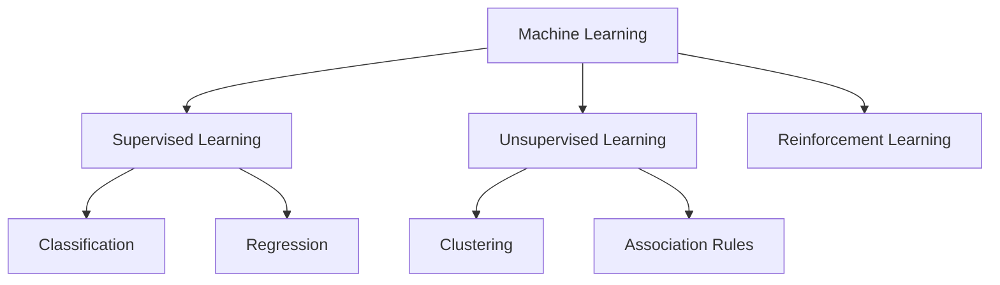
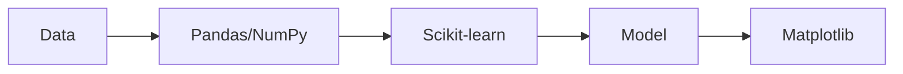
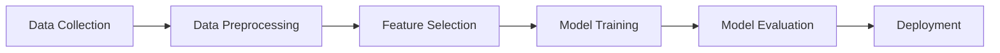
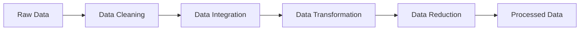
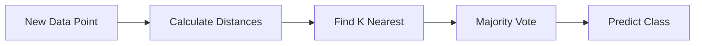
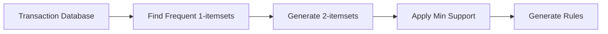
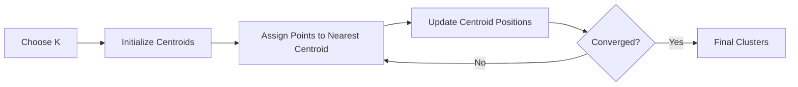
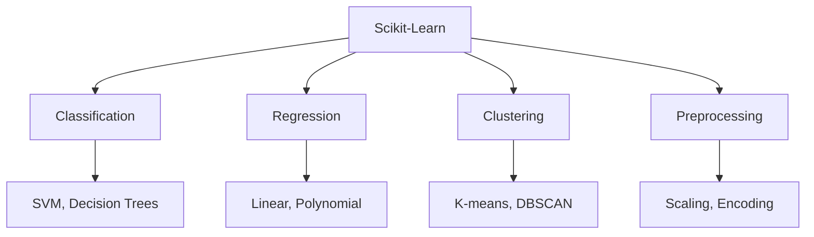
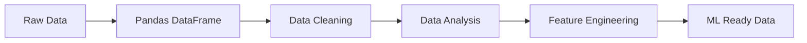

## Question 1(a) [3 marks]

**Define machine Learning. Give any two applications of machine learning.**

**Answer**:

Machine Learning is a subset of artificial intelligence that enables computers to learn and make decisions from data without being explicitly programmed for every task.

**Applications:**

- **Email spam detection**: Automatically identifies and filters spam emails
- **Recommendation systems**: Suggests products on e-commerce sites like Amazon

**Table: ML vs Traditional Programming**

| Traditional Programming | Machine Learning |
|------------------------|------------------|
| Input data + Program → Output | Input data + Output → Program |
| Rules are explicitly coded | Rules are learned from data |

**Mnemonic:** "ML = Make Learning from data"

## Question 1(b) [4 marks]

**Define: Under fitting and overfitting.**

**Answer**:

**Underfitting** occurs when a model is too simple to capture underlying patterns in data, resulting in poor performance on both training and test data.

**Overfitting** occurs when a model learns training data too well, including noise, causing poor performance on new unseen data.

**Table: Comparison**

| Aspect | Underfitting | Overfitting |
|--------|-------------|-------------|
| **Training accuracy** | Low | High |
| **Test accuracy** | Low | Low |
| **Model complexity** | Too simple | Too complex |
| **Solution** | Increase complexity | Reduce complexity |

**Mnemonic:** "Under = Under-performs, Over = Over-learns"

## Question 1(c) [7 marks]

**Describe different types of machine learning with suitable example.**

**Answer**:

**Table: Types of Machine Learning**

| Type | Description | Example |
|------|-------------|---------|
| **Supervised** | Uses labeled training data | Email classification |
| **Unsupervised** | No labeled data, finds patterns | Customer segmentation |
| **Reinforcement** | Learns through rewards/penalties | Game playing AI |

**Supervised Learning** uses input-output pairs to train models. The algorithm learns from examples to predict outcomes for new data.

**Unsupervised Learning** discovers hidden patterns in data without target labels. It groups similar data points together.

**Reinforcement Learning** trains agents to make decisions by rewarding good actions and penalizing bad ones.

**Diagram:**



**Mnemonic:** "Super Un-supervised Reinforces learning"

## Question 1(c) OR [7 marks]

**Describe different tools and technology used in the field machine learning.**

**Answer**:

**Table: ML Tools and Technologies**

| Category | Tools | Purpose |
|----------|-------|---------|
| **Programming** | Python, R | Core development |
| **Libraries** | Scikit-learn, TensorFlow | Model building |
| **Data Processing** | Pandas, NumPy | Data manipulation |
| **Visualization** | Matplotlib, Seaborn | Data plotting |

**Python** is the most popular language due to its simplicity and extensive libraries.

**Scikit-learn** provides simple tools for data mining and analysis, perfect for beginners.

**TensorFlow** and **PyTorch** are advanced frameworks for deep learning applications.

**Jupyter Notebook** offers interactive development environment for experimentation.

**Diagram:**



**Mnemonic:** "Python Pandas Scikit Tensor Jupyter"

## Question 2(a) [3 marks]

**Give the difference between Qualitative data and Quantitative data.**

**Answer**:

**Table: Qualitative vs Quantitative Data**

| Qualitative Data | Quantitative Data |
|------------------|-------------------|
| **Non-numerical** categories | **Numerical** values |
| Colors, names, grades | Height, weight, price |
| Cannot be measured | Can be measured |

**Qualitative data** describes qualities or characteristics that cannot be measured numerically.

**Quantitative data** represents measurable quantities expressed as numbers.

**Mnemonic:** "Quality = Categories, Quantity = Numbers"

## Question 2(b) [4 marks]

**Find the mean and median for the following data: 3,4,5,5,7,8,9,11,12,14.**

**Answer**:

**Given data:** 3, 4, 5, 5, 7, 8, 9, 11, 12, 14

**Mean calculation:**

- Sum = 3+4+5+5+7+8+9+11+12+14 = 78
- Count = 10 numbers
- **Mean = 78/10 = 7.8**

**Median calculation:**

- Data is already sorted
- For 10 numbers: Median = (5th + 6th value)/2
- **Median = (7+8)/2 = 7.5**

**Table: Results**

| Measure | Value |
|---------|-------|
| **Mean** | 7.8 |
| **Median** | 7.5 |

**Mnemonic:** "Mean = Average, Median = Middle"

## Question 2(c) [7 marks]

**Describe machine learning activities in detail.**

**Answer**:

**Table: Machine Learning Activities**

| Activity | Description | Example |
|----------|-------------|---------|
| **Data Collection** | Gathering relevant data | Survey responses |
| **Data Preprocessing** | Cleaning and preparing data | Removing duplicates |
| **Feature Selection** | Choosing important variables | Age, income for loans |
| **Model Training** | Teaching algorithm patterns | Feeding training data |
| **Model Evaluation** | Testing model performance | Accuracy measurement |

**Data Collection** involves gathering information from various sources like databases, sensors, or surveys.

**Data Preprocessing** includes cleaning, transforming, and organizing raw data for analysis.

**Feature Selection** identifies the most relevant variables that contribute to predictions.

**Model Training** uses algorithms to learn patterns from prepared training data.

**Model Evaluation** tests how well the trained model performs on new, unseen data.

**Diagram:**



**Mnemonic:** "Collect Process Feature Train Evaluate Deploy"

## Question 2(a) OR [3 marks]

**Give the difference between predicative model and descriptive model.**

**Answer**:

**Table: Predictive vs Descriptive Models**

| Predictive Model | Descriptive Model |
|------------------|-------------------|
| **Forecasts** future outcomes | **Explains** current patterns |
| Uses supervised learning | Uses unsupervised learning |
| Stock price prediction | Customer segmentation |

**Predictive models** use historical data to make predictions about future events or unknown outcomes.

**Descriptive models** analyze existing data to understand current patterns and relationships.

**Mnemonic:** "Predict = Future, Describe = Present"

## Question 2(b) OR [4 marks]

**Classify the following using appropriate data type: hair color, gender, blood group type, time of day.**

**Answer**:

**Table: Data Type Classification**

| Data | Type | Reason |
|------|------|--------|
| **Hair color** | Nominal | Categories with no order |
| **Gender** | Nominal | Categories with no order |
| **Blood group** | Nominal | Categories with no order |
| **Time of day** | Continuous | Measurable quantity |

**Nominal data** represents categories without any natural ordering.

**Continuous data** can take any value within a range and is measurable.

**Mnemonic:** "Names = Nominal, Numbers = Numerical"

## Question 2(c) OR [7 marks]

**Explain various methods used in data pre-processing.**

**Answer**:

**Table: Data Preprocessing Methods**

| Method | Purpose | Example |
|--------|---------|---------|
| **Data Cleaning** | Remove errors and inconsistencies | Fix typos, remove duplicates |
| **Data Integration** | Combine multiple sources | Merge customer databases |
| **Data Transformation** | Convert to suitable format | Normalize values 0-1 |
| **Data Reduction** | Reduce dataset size | Select important features |

**Data Cleaning** removes or corrects erroneous, incomplete, or irrelevant data.

**Data Integration** combines data from multiple sources into a unified dataset.

**Data Transformation** converts data into appropriate formats for analysis.

**Data Reduction** decreases dataset size while maintaining information quality.

**Diagram:**



**Mnemonic:** "Clean Integrate Transform Reduce"

## Question 3(a) [3 marks]

**Give difference between classification and regression.**

**Answer**:

**Table: Classification vs Regression**

| Classification | Regression |
|----------------|------------|
| **Discrete** output | **Continuous** output |
| Predicts categories | Predicts numerical values |
| Email: spam/not spam | House price prediction |

**Classification** predicts discrete categories or classes from input data.

**Regression** predicts continuous numerical values from input data.

**Mnemonic:** "Class = Categories, Regress = Real numbers"

## Question 3(b) [4 marks]

**Write confusion matrix using appropriate example. Calculate accuracy and error rate for it.**

**Answer**:

**Example: Email Classification**

**Table: Confusion Matrix**

|  | Predicted Spam | Predicted Not Spam |
|--|---------------|-------------------|
| **Actual Spam** | 85 (TP) | 15 (FN) |
| **Actual Not Spam** | 10 (FP) | 90 (TN) |

**Calculations:**

- **Accuracy = (TP+TN)/(TP+TN+FP+FN) = (85+90)/200 = 87.5%**
- **Error Rate = (FP+FN)/(TP+TN+FP+FN) = (10+15)/200 = 12.5%**

**Key Terms:**

- **TP**: True Positive - Correctly predicted spam
- **TN**: True Negative - Correctly predicted not spam

**Mnemonic:** "True Positive True Negative = Correct predictions"

## Question 3(c) [7 marks]

**Explain KNN algorithm in detail.**

**Answer**:

**K-Nearest Neighbors (KNN)** is a simple classification algorithm that classifies data points based on the majority class of their K nearest neighbors.

**Table: KNN Algorithm Steps**

| Step | Description | Example |
|------|-------------|---------|
| **Choose K** | Select number of neighbors | K=3 |
| **Calculate Distance** | Find distance to all points | Euclidean distance |
| **Find Neighbors** | Identify K closest points | 3 nearest points |
| **Vote** | Majority class wins | 2 cats, 1 dog → cat |

**Working Process:**

1. **Calculate distances** between test point and all training points
2. **Sort distances** and select K nearest neighbors
3. **Count votes** from each class among neighbors
4. **Assign class** with majority votes

**Diagram:**



**Advantages:**

- **Simple to implement** and understand
- **No training required** - lazy learning algorithm

**Mnemonic:** "K Nearest Neighbors Vote for classification"

## Question 3(a) OR [3 marks]

**Give any three applications of multiple linear regression.**

**Answer**:

**Applications of Multiple Linear Regression:**

**Table: Applications**

| Application | Variables | Purpose |
|-------------|-----------|---------|
| **House Price Prediction** | Size, location, age | Estimate property value |
| **Sales Forecasting** | Advertising, season, price | Predict revenue |
| **Medical Diagnosis** | Symptoms, age, history | Risk assessment |

**Multiple Linear Regression** uses multiple input variables to predict a continuous output variable.

**Mnemonic:** "Multiple inputs, One output"

## Question 3(b) OR [4 marks]

**Explain bagging, boosting and stacking in detail.**

**Answer**:

**Table: Ensemble Methods**

| Method | Approach | Example |
|--------|----------|---------|
| **Bagging** | Parallel training, average results | Random Forest |
| **Boosting** | Sequential training, learn from errors | AdaBoost |
| **Stacking** | Meta-learner combines models | Neural network combiner |

**Bagging** trains multiple models on different data subsets and averages predictions.

**Boosting** trains models sequentially, each learning from previous model's mistakes.

**Stacking** uses a meta-model to learn how to combine predictions from base models.

**Mnemonic:** "Bag parallel, Boost sequential, Stack meta"

## Question 3(c) OR [7 marks]

**Explain single linear regression with its application.**

**Answer**:

**Single Linear Regression** finds the best straight line relationship between one input variable (X) and one output variable (Y).

**Formula: Y = a + bX**

- **a**: Y-intercept
- **b**: Slope of line

**Table: Application Example - House Price vs Size**

| House Size (sq ft) | Price (lakhs) |
|-------------------|---------------|
| 1000 | 50 |
| 1500 | 75 |
| 2000 | 100 |

**Working Process:**

1. **Collect data** with input-output pairs
2. **Plot points** on scatter graph
3. **Find best line** that minimizes error
4. **Make predictions** using line equation

**Diagram:**

```goat
    Price |
          |    *
       75 |      *
          |        *
       50 |  *
          |________________
             1000  1500  Size
```

**Applications:**

- **Sales vs Advertising**: More ads → More sales
- **Temperature vs Ice cream sales**: Hot weather → More sales

**Mnemonic:** "One X predicts One Y with a line"

## Question 4(a) [3 marks]

**Define the following: (1)support (2) confidence.**

**Answer**:

**Support** measures how frequently an itemset appears in the dataset.

**Confidence** measures how often items in consequent appear when antecedent is present.

**Table: Definitions**

| Measure | Formula | Example |
|---------|---------|---------|
| **Support** | Count(itemset)/Total transactions | Bread appears in 60% transactions |
| **Confidence** | Support(A∪B)/Support(A) | 80% who buy bread also buy butter |

**Support = Frequency of occurrence**
**Confidence = Reliability of rule**

**Mnemonic:** "Support = How often, Confidence = How reliable"

## Question 4(b) [4 marks]

**Explain applications of unsupervised learning.**

**Answer**:

**Table: Unsupervised Learning Applications**

| Application | Purpose | Example |
|-------------|---------|---------|
| **Customer Segmentation** | Group similar customers | Marketing campaigns |
| **Data Compression** | Reduce data size | Image compression |
| **Anomaly Detection** | Find unusual patterns | Fraud detection |
| **Recommendation Systems** | Suggest similar items | Music recommendations |

**Customer Segmentation** groups customers with similar buying behavior for targeted marketing.

**Data Compression** reduces storage space by finding patterns and removing redundancy.

**Anomaly Detection** identifies unusual patterns that may indicate fraud or errors.

**Mnemonic:** "Segment Compress Detect Recommend"

## Question 4(c) [7 marks]

**Write and explain apriori algorithm with suitable example.**

**Answer**:

**Apriori Algorithm** finds frequent itemsets and generates association rules for market basket analysis.

**Table: Algorithm Steps**

| Step | Description | Example |
|------|-------------|---------|
| **Find frequent 1-itemsets** | Count individual items | {Bread}:4, {Milk}:3 |
| **Generate 2-itemsets** | Combine frequent items | {Bread,Milk}:2 |
| **Apply minimum support** | Filter infrequent sets | Keep if support ≥ 50% |
| **Generate rules** | Create if-then rules | Bread → Milk |

**Example Dataset:**

- Transaction 1: {Bread, Milk, Eggs}
- Transaction 2: {Bread, Milk}
- Transaction 3: {Bread, Eggs}
- Transaction 4: {Milk, Eggs}

**Working Process:**

1. **Scan database** to count item frequencies
2. **Generate candidate itemsets** of increasing size
3. **Prune infrequent itemsets** below minimum support
4. **Generate association rules** from frequent itemsets

**Diagram:**



**Mnemonic:** "A-priori knowledge helps find frequent patterns"

## Question 4(a) OR [3 marks]

**List out the difference between clustering and classification.**

**Answer**:

**Table: Clustering vs Classification**

| Clustering | Classification |
|------------|----------------|
| **Unsupervised** learning | **Supervised** learning |
| No labeled data | Uses labeled training data |
| Groups similar data | Assigns predefined labels |

**Clustering** discovers hidden groups in unlabeled data.

**Classification** assigns new data to known categories using trained models.

**Mnemonic:** "Cluster = Groups unknown, Classify = Labels known"

## Question 4(b) OR [4 marks]

**Explain the clustering process in detail.**

**Answer**:

**Table: Clustering Process Steps**

| Step | Description | Purpose |
|------|-------------|---------|
| **Data Preparation** | Clean and normalize data | Ensure quality input |
| **Distance Metric** | Choose similarity measure | Euclidean, Manhattan |
| **Algorithm Selection** | Pick clustering method | K-means, Hierarchical |
| **Cluster Validation** | Evaluate cluster quality | Silhouette score |

**Clustering Process** groups similar data points together based on their characteristics.

**Key decisions include choosing the number of clusters and appropriate distance metrics.**

**Validation ensures clusters are meaningful and well-separated.**

**Mnemonic:** "Prepare Distance Algorithm Validate"

## Question 4(c) OR [7 marks]

**Write and explain K-means clustering algorithm with suitable example.**

**Answer**:

**K-means** partitions data into K clusters by minimizing within-cluster sum of squares.

**Table: Algorithm Steps**

| Step | Description | Example |
|------|-------------|---------|
| **Initialize centroids** | Random K center points | C1(2,3), C2(8,7) |
| **Assign points** | Each point to nearest centroid | Point(1,2) → C1 |
| **Update centroids** | Mean of assigned points | New C1(1.5, 2.5) |
| **Repeat** | Until centroids stop moving | Convergence |

**Example: Customer Income vs Age**

- Customer 1: (Income=30k, Age=25)
- Customer 2: (Income=35k, Age=30)
- Customer 3: (Income=70k, Age=45)
- Customer 4: (Income=75k, Age=50)

**Working Process:**

1. **Choose K=2** clusters for young/old customers
2. **Initialize centroids** randomly
3. **Calculate distances** from each customer to centroids
4. **Assign customers** to nearest centroid
5. **Update centroid positions** to center of assigned customers
6. **Repeat until stable**

**Diagram:**



**Advantages:**

- **Simple and fast** for large datasets
- **Works well** with spherical clusters

**Mnemonic:** "K centroids Mean their assigned points"

## Question 5(a) [3 marks]

**List the applications of matplotlib.**

**Answer**:

**Table: Matplotlib Applications**

| Application | Purpose | Example |
|-------------|---------|---------|
| **Data Visualization** | Create charts and graphs | Bar charts, histograms |
| **Scientific Plotting** | Research presentations | Mathematical functions |
| **Dashboard Creation** | Interactive displays | Business metrics |

**Matplotlib** is Python's primary plotting library for creating static, animated, and interactive visualizations.

**Key features include support for multiple plot types and customizable styling.**

**Mnemonic:** "Mat-plot-lib = Math Plotting Library"

## Question 5(b) [4 marks]

**Write down code to plot a vertical line and horizontal line using matplotlib.**

**Answer**:

**Code Block:**

```python
import matplotlib.pyplot as plt

# Create figure
plt.figure(figsize=(8, 6))

# Plot vertical line at x=3
plt.axvline(x=3, color='red', linestyle='--', label='Vertical Line')

# Plot horizontal line at y=2
plt.axhline(y=2, color='blue', linestyle='-', label='Horizontal Line')

# Add labels and title
plt.xlabel('X-axis')
plt.ylabel('Y-axis')
plt.title('Vertical and Horizontal Lines')
plt.legend()
plt.grid(True)
plt.show()
```

**Key Functions:**

- **axvline()**: Creates vertical line
- **axhline()**: Creates horizontal line

**Mnemonic:** "axvline = Vertical, axhline = Horizontal"

## Question 5(c) [7 marks]

**Explain features and applications of Scikit-Learn.**

**Answer**:

**Table: Scikit-Learn Features**

| Feature | Description | Example |
|---------|-------------|---------|
| **Simple API** | Easy to use interface | fit(), predict() |
| **Multiple Algorithms** | Various ML methods | SVM, Random Forest |
| **Data Preprocessing** | Built-in data tools | StandardScaler |
| **Model Evaluation** | Performance metrics | accuracy_score |

**Scikit-Learn** is Python's most popular machine learning library providing simple tools for data analysis.

**Key Strengths:**

- **Consistent interface** across all algorithms
- **Excellent documentation** with examples
- **Active community** support and development

**Applications:**

- **Classification**: Email spam detection
- **Regression**: House price prediction
- **Clustering**: Customer segmentation
- **Dimensionality Reduction**: Data visualization

**Diagram:**



**Mnemonic:** "Scikit = Science Kit for machine learning"

## Question 5(a) OR [3 marks]

**Give the purpose of NumPy in machine learning.**

**Answer**:

**Table: NumPy Purpose in ML**

| Purpose | Description | Benefit |
|---------|-------------|---------|
| **Numerical Computing** | Fast array operations | Efficient calculations |
| **Foundation Library** | Base for other libraries | Pandas, Scikit-learn use it |
| **Mathematical Functions** | Built-in math operations | Statistics, linear algebra |

**NumPy** provides the foundation for numerical computing in Python machine learning applications.

**Essential for handling large datasets and performing mathematical operations efficiently.**

**Mnemonic:** "Num-Py = Numerical Python"

## Question 5(b) OR [4 marks]

**Write down steps to import csv file in pandas.**

**Answer**:

**Code Block:**

```python
import pandas as pd

# Step 1: Import pandas library
# Step 2: Use read_csv() function
data = pd.read_csv('filename.csv')

# Step 3: Display first few rows
print(data.head())

# Optional: Specify parameters
data = pd.read_csv('file.csv', 
                   delimiter=',',
                   header=0,
                   index_col=0)
```

**Steps:**

1. **Import pandas** library
2. **Use read_csv()** function with filename
3. **Verify data** with head() method

**Mnemonic:** "Import Read Verify"

## Question 5(c) OR [7 marks]

**Explain features and applications of Pandas.**

**Answer**:

**Table: Pandas Features**

| Feature | Description | Example |
|---------|-------------|---------|
| **Data Structures** | DataFrame and Series | Tabular data handling |
| **Data I/O** | Read/write multiple formats | CSV, Excel, JSON |
| **Data Cleaning** | Handle missing values | dropna(), fillna() |
| **Data Analysis** | Statistical operations | groupby(), describe() |

**Pandas** is the primary data manipulation library in Python for machine learning projects.

**Key Capabilities:**

- **Data Loading** from various file formats
- **Data Cleaning** and preprocessing operations
- **Data Transformation** and reshaping
- **Statistical Analysis** and aggregation

**Applications:**

- **Data Preprocessing**: Clean datasets before ML
- **Exploratory Analysis**: Understand data patterns
- **Feature Engineering**: Create new variables
- **Data Integration**: Merge multiple data sources

**Diagram:**



**Advantages:**

- **Intuitive syntax** for data operations
- **High performance** with optimized operations
- **Integration** with other ML libraries

**Mnemonic:** "Pandas = Panel Data for analysis"
