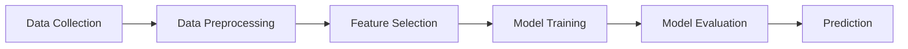
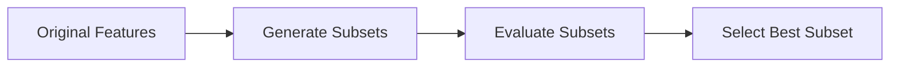
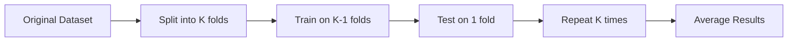
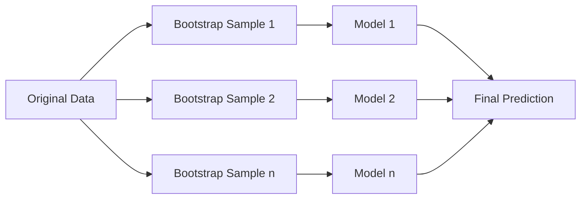
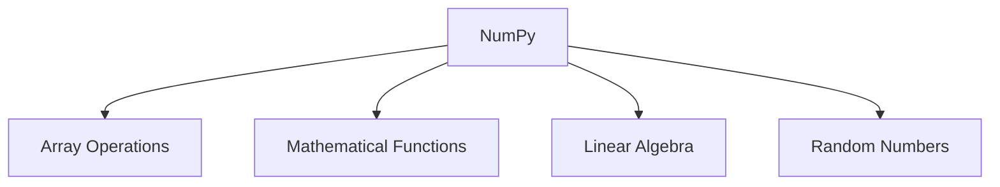
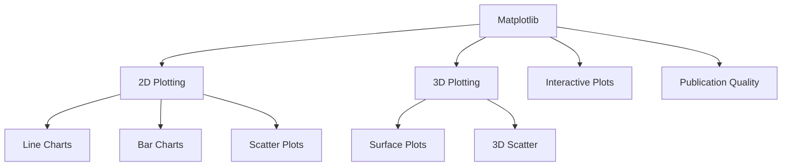
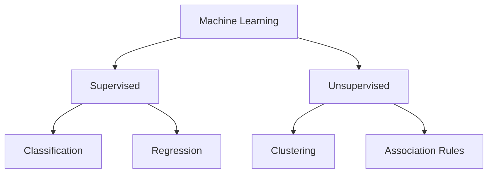
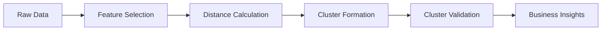

## પ્રશ્ન 1(અ) [3 ગુણ]

**Human learning વ્યાખ્યાયિત કરો અને સમજાવો કે machine learning human learning થી કેવી રીતે અલગ છે?**

**જવાબ**:

**Human Learning વિ Machine Learning કોષ્ટક:**

| પાસાં | Human Learning | Machine Learning |
|--------|----------------|------------------|
| **પદ્ધતિ** | અનુભવ, પ્રયાસ અને ભૂલ | ડેટા અને અલ્ગોરિધમ |
| **ઝડપ** | ધીમી, ક્રમશઃ | ઝડપી પ્રોસેસિંગ |
| **ડેટા જરૂરિયાત** | મર્યાદિત ઉદાહરણો જોઈએ | મોટા ડેટાસેટ જરૂરી |

- **Human Learning**: અનુભવ, અવલોકન અને તર્ક દ્વારા જ્ઞાન મેળવવાની પ્રક્રિયા
- **Machine Learning**: ડેટામાં પેટર્ન ઓળખવા માટે અલ્ગોરિધમનો ઉપયોગ કરીને આપોઆપ શીખવાની પ્રક્રિયા

**મેમરી ટ્રીક:** "Humans Experience, Machines Analyze Data" (HEMAD)

---

## પ્રશ્ન 1(બ) [4 ગુણ]

**ફાઇનાન્સ અને બેંકિંગમાં મશીન લર્નિંગના ઉપયોગનું વર્ણન કરો.**

**જવાબ**:

**ફાઇનાન્સ અને બેંકિંગમાં ઉપયોગો:**

| ઉપયોગ | હેતુ | ફાયદો |
|-------------|---------|---------|
| **Fraud Detection** | શંકાસ્પદ ટ્રાન્ઝેક્શન ઓળખવા | નાણાકીય નુકસાન ઘટાડવું |
| **Credit Scoring** | લોન ડિફોલ્ટ રિસ્ક આંકવી | વધુ સારા લેન્ડિંગ નિર્ણયો |
| **Algorithmic Trading** | આપોઆપ ટ્રેડિંગ નિર્ણયો | ઝડપી માર્કેટ રિસ્પોન્સ |

- **Risk Assessment**: ગ્રાહકની ક્રેડિટવર્થીનેસની આગાહી માટે ML ડેટાનું વિશ્લેષણ કરે છે
- **Customer Service**: NLP નો ઉપયોગ કરીને ચેટબોટ્સ 24/7 સપોર્ટ આપે છે
- **Regulatory Compliance**: શંકાસ્પદ પ્રવૃત્તિઓ માટે આપોઆપ મોનિટરિંગ

**મેમરી ટ્રીક:** "Finance Needs Smart Analysis" (FNSA)

---

## પ્રશ્ન 1(ક) [7 ગુણ]

**સુપરવાઇઝ્ડ લર્નિંગ, અનસુપરવાઇઝ્ડ લર્નિંગ અને રિઇન્ફોર્સમેન્ટ લર્નિંગ વચ્ચે તફાવત આપો.**

**જવાબ**:

**તુલનાત્મક કોષ્ટક:**

| લક્ષણ | Supervised Learning | Unsupervised Learning | Reinforcement Learning |
|---------|-------------------|---------------------|---------------------|
| **ડેટા પ્રકાર** | લેબલ્ડ ડેટા | અનલેબલ્ડ ડેટા | પર્યાવરણ ઇન્ટરેક્શન |
| **લક્ષ્ય** | આઉટપુટની આગાહી | પેટર્નો શોધવા | રિવોર્ડ વધારવા |
| **ઉદાહરણો** | Classification, Regression | Clustering, Association | Game playing, Robotics |
| **Feedback** | તાત્કાલિક | કંઈ નહીં | વિલંબિત પુરસ્કારો |

**મુખ્ય લાક્ષણિકતાઓ:**

- **Supervised Learning**: સાચા જવાબો સાથે શિક્ષક દ્વારા માર્ગદર્શિત શીખવું
- **Unsupervised Learning**: ડેટામાં છુપાયેલા પેટર્નોની સ્વ-શોધ
- **Reinforcement Learning**: પુરસ્કાર/દંડ સાથે ટ્રાયલ અને એરર દ્વારા શીખવું

**મેમરી ટ્રીક:** "Supervised Teachers, Unsupervised Explores, Reinforcement Rewards" (STUER)

---

## પ્રશ્ન 1(ક OR) [7 ગુણ]

**મશીન લર્નિંગમાં વપરાતા વિવિધ TOOLS અને ટેકનોલોજી સમજાવો.**

**જવાબ**:

**ML Tools અને Technologies:**

| કેટેગરી | Tools | હેતુ |
|----------|-------|---------|
| **Programming** | Python, R, Java | અલ્ગોરિધમ ઇમ્પ્લિમેન્ટેશન |
| **Libraries** | Scikit-learn, TensorFlow | તૈયાર અલ્ગોરિધમ |
| **Visualization** | Matplotlib, Seaborn | ડેટા વિઝ્યુઅલાઇઝેશન |
| **Data Processing** | Pandas, NumPy | ડેટા મેનિપ્યુલેશન |

**મુખ્ય ટેકનોલોજીઓ:**

- **Cloud Platforms**: AWS, Google Cloud સ્કેલેબલ કમ્પ્યુટિંગ માટે
- **Development Environments**: Jupyter Notebook, Google Colab
- **Big Data Tools**: મોટા ડેટાસેટ માટે Spark, Hadoop

**મેમરી ટ્રીક:** "Python Libraries Visualize Data Effectively" (PLVDE)

---

## પ્રશ્ન 2(અ) [3 ગુણ]

**એક ઉદાહરણ સાથે outliers ને વ્યાખ્યાયિત કરો.**

**જવાબ**:

**વ્યાખ્યા**: Outliers એવા ડેટા પોઇન્ટ્સ છે જે ડેટાસેટમાં અન્ય અવલોકનોથી નોંધપાત્ર રીતે અલગ હોય છે.

**ઉદાહરણ કોષ્ટક:**

| વિદ્યાર્થીઓની ઊંચાઈ (cm) | વર્ગીકરણ |
|---------------------|----------------|
| 165, 170, 168, 172 | સામાન્ય મૂલ્યો |
| 195 | Outlier (ખૂબ ઊંચું) |
| 140 | Outlier (ખૂબ નીચું) |

- **શોધ**: Quartiles થી 1.5 × IQR થી વધુ મૂલ્યો
- **અસર**: આંકડાકીય વિશ્લેષણ અને મોડલ પર્ફોર્મન્સને અસર કરી શકે

**મેમરી ટ્રીક:** "Outliers Stand Apart" (OSA)

---

## પ્રશ્ન 2(બ) [4 ગુણ]

**રીગ્રેશન સ્ટેપ્સ વિગતવાર સમજાવો.**

**જવાબ**:

**રીગ્રેશન પ્રોસેસ સ્ટેપ્સ:**



**વિગતવાર સ્ટેપ્સ:**

- **Data Collection**: ઇનપુટ-આઉટપુટ જોડી સાથે સંબંધિત ડેટાસેટ એકત્રિત કરવું
- **Preprocessing**: ડેટા સાફ કરવું, ખોવાયેલા મૂલ્યો સંભાળવા, features ને normalize કરવા
- **Feature Selection**: લક્ષ્યને અસર કરતા સંબંધિત variables પસંદ કરવા
- **Model Training**: આગાહીની ભૂલો ન્યૂનતમ કરવા માટે રીગ્રેશન લાઇન ફિટ કરવી

**મેમરી ટ્રીક:** "Data Preprocessing Features Train Evaluation Predicts" (DPFTEP)

---

## પ્રશ્ન 2(ક) [7 ગુણ]

**ચોકસાઈ વ્યાખ્યાયિત કરો અને નીચેના binary classifier ની confusion matrix માટે વિવિધ માપન પરિમાણો શોધો જેમ કે 1. Accuracy 2. Precision.**

**જવાબ**:

**Confusion Matrix વિશ્લેષણ:**

| | અનુમાનિત ના | અનુમાનિત હા |
|---------|-------------|--------------|
| **વાસ્તવિક ના** | 10 (TN) | 3 (FP) |
| **વાસ્તવિક હા** | 2 (FN) | 15 (TP) |

**ગણતરીઓ:**

| મેટ્રિક | ફોર્મ્યુલા | ગણતરી | પરિણામ |
|--------|---------|-------------|--------|
| **Accuracy** | (TP+TN)/(TP+TN+FP+FN) | (15+10)/(15+10+3+2) | 83.33% |
| **Precision** | TP/(TP+FP) | 15/(15+3) | 83.33% |

**વ્યાખ્યાઓ:**

- **Accuracy**: કુલ આગાહીઓમાંથી સાચી આગાહીઓનું પ્રમાણ
- **Precision**: બધી positive આગાહીઓમાંથી true positive આગાહીઓનું પ્રમાણ

**મેમરી ટ્રીક:** "Accuracy Counts All, Precision Picks Positives" (ACAPP)

---

## પ્રશ્ન 2(અ OR) [3 ગુણ]

**Feature સબસેટ પસંદગીના મૂળભૂત પગલાઓને ઓળખો.**

**જવાબ**:

**Feature Subset Selection સ્ટેપ્સ:**



**મૂળભૂત પગલાઓ:**

- **Generation**: Features ના વિવિધ સંયોજનો બનાવવા
- **Evaluation**: પ્રત્યેક સબસેટને પર્ફોર્મન્સ મેટ્રિક્સ વાપરીને ટેસ્ટ કરવા
- **Selection**: માપદંડોના આધારે શ્રેષ્ઠ સબસેટ પસંદ કરવા

**મેમરી ટ્રીક:** "Generate, Evaluate, Select" (GES)

---

## પ્રશ્ન 2(બ OR) [4 ગુણ]

**KNN અલ્ગોરિધમની તાકાત અને નબળાઈની ચર્ચા કરો.**

**જવાબ**:

**KNN અલ્ગોરિધમ વિશ્લેષણ:**

| તાકાતો | નબળાઈઓ |
|-----------|------------|
| સમજવામાં સરળ | કમ્પ્યુટેશનલી મોંઘું |
| Training ની જરૂર નથી | અપ્રસ્તુત features ને સંવેદનશીલ |
| Non-linear ડેટા સાથે કામ કરે | High dimensions સાથે performance ઘટે |
| નાના ડેટાસેટ માટે અસરકારક | શ્રેષ્ઠ K value પસંદગી જરૂરી |

**મુખ્ય મુદ્દાઓ:**

- **Lazy Learning**: સ્પષ્ટ training phase ની જરૂર નથી
- **Distance-Based**: પડોશીની નજીકતા આધારિત વર્ગીકરણ
- **Memory-Intensive**: સંપૂર્ણ training ડેટાસેટ સ્ટોર કરે છે

**મેમરી ટ્રીક:** "Simple but Slow, Effective but Expensive" (SBSEBE)

---

## પ્રશ્ન 2(ક OR) [7 ગુણ]

**ભૂલ-દર વ્યાખ્યાયિત કરો અને નીચેના binary classifier ની confusion matrix માટે વિવિધ માપન પરિમાણો શોધો જેમ કે 1. Error value 2. Recall.**

**જવાબ**:

**Confusion Matrix વિશ્લેષણ:**

| | અનુમાનિત ના | અનુમાનિત હા |
|---------|-------------|--------------|
| **વાસ્તવિક ના** | 20 (TN) | 3 (FP) |
| **વાસ્તવિક હા** | 2 (FN) | 15 (TP) |

**ગણતરીઓ:**

| મેટ્રિક | ફોર્મ્યુલા | ગણતરી | પરિણામ |
|--------|---------|-------------|--------|
| **Error Rate** | (FP+FN)/(TP+TN+FP+FN) | (3+2)/(15+20+3+2) | 12.5% |
| **Recall** | TP/(TP+FN) | 15/(15+2) | 88.24% |

**વ્યાખ્યાઓ:**

- **Error Rate**: કુલ આગાહીઓમાંથી ખોટી આગાહીઓનું પ્રમાણ
- **Recall**: વાસ્તવિક positives માંથી સાચી રીતે ઓળખાયેલાનું પ્રમાણ

**મેમરી ટ્રીક:** "Error Excludes, Recall Retrieves" (EERR)

---

## પ્રશ્ન 3(અ) [3 ગુણ]

**Unsupervised learning ના કોઈ પણ ત્રણ ઉદાહરણો આપો.**

**જવાબ**:

**Unsupervised Learning ઉદાહરણો:**

| ઉદાહરણ | વર્ણન | ઉપયોગ |
|---------|-------------|-------------|
| **Customer Segmentation** | વર્તન દ્વારા ગ્રાહકોને જૂથબદ્ધ કરવા | માર્કેટિંગ વ્યૂહરચના |
| **Document Classification** | વિષયો દ્વારા દસ્તાવેજો ગોઠવવા | માહિતી પુનઃપ્રાપ્તિ |
| **Gene Sequencing** | સમાન DNA પેટર્ન જૂથબદ્ધ કરવા | તબીબી સંશોધન |

- **Market Basket Analysis**: ઉત્પાદન ખરીદીના પેટર્ન શોધવા
- **Social Network Analysis**: સમુદાયની રચનાઓ ઓળખવી
- **Anomaly Detection**: ડેટામાં અસામાન્ય પેટર્ન શોધવા

**મેમરી ટ્રીક:** "Customers, Documents, Genes Group Automatically" (CDGGA)

---

## પ્રશ્ન 3(બ) [4 ગુણ]

**નીચેના ડેટા માટે સરેરાશ અને મધ્યક શોધો: 4,6,7,8,9,12,14,15,20**

**જવાબ**:

**આંકડાકીય ગણતરીઓ:**

| આંકડા | ગણતરી | પરિણામ |
|-----------|-------------|--------|
| **સરેરાશ (Mean)** | (4+6+7+8+9+12+14+15+20)/9 | 10.56 |
| **મધ્યક (Median)** | મધ્ય મૂલ્ય (5મી સ્થિતિ) | 9 |

**પગલું-દર-પગલું:**

- **ડેટા**: પહેલેથી જ સૉર્ટ થયેલ: 4,6,7,8,9,12,14,15,20
- **સરેરાશ**: બધા મૂલ્યોનો સરવાળો ÷ ગણતરી = 95 ÷ 9 = 10.56
- **મધ્યક**: સૉર્ટ કરેલ યાદીમાં મધ્ય મૂલ્ય = 9 (5મી સ્થિતિ)

**મેમરી ટ્રીક:** "Mean Averages All, Median Middle Value" (MAAMV)

---

## પ્રશ્ન 3(ક) [7 ગુણ]

**k-ફોલ્ડ ક્રોસ વેલિડેશન પદ્ધતિનું વિગતવાર વર્ણન કરો.**

**જવાબ**:

**K-Fold Cross Validation પ્રોસેસ:**



**પ્રોસેસ સ્ટેપ્સ:**

| પગલું | વર્ણન | હેતુ |
|------|-------------|---------|
| **1. ડેટા વિભાજન** | ડેટાને K સમાન ભાગોમાં વહેંચવું | સંતુલિત પરીક્ષણ સુનિશ્ચિત કરવું |
| **2. પુનરાવર્તિત Training** | Training માટે K-1 folds નો ઉપયોગ | મહત્તમ ડેટા ઉપયોગ |
| **3. Validation** | બાકીના fold પર ટેસ્ટ કરવું | નિષ્પક્ષ મૂલ્યાંકન |
| **4. સરેરાશ** | સરેરાશ performance ગણવું | મજબૂત performance અંદાજ |

**ફાયદાઓ:**

- **નિષ્પક્ષ અંદાજ**: દરેક ડેટા પોઇન્ટ training અને testing બંને માટે વાપરાય
- **Overfitting ઘટાડવું**: અનેક validation રાઉન્ડ વિશ્વસનીયતા વધારે
- **કાર્યક્ષમ ડેટા ઉપયોગ**: બધો ડેટા training અને validation બંને માટે ઉપયોગ

**મેમરી ટ્રીક:** "K-fold Keeps Keen Knowledge" (KKKK)

---

## પ્રશ્ન 3(અ OR) [3 ગુણ]

**Multiple linear રીગ્રેશનની કોઈ પણ ત્રણ એપ્લિકેશન આપો.**

**જવાબ**:

**Multiple Linear Regression એપ્લિકેશન:**

| એપ્લિકેશન | Variables | હેતુ |
|-------------|-----------|---------|
| **House Price Prediction** | Size, location, age | રિયલ એસ્ટેટ વેલ્યુએશન |
| **Sales Forecasting** | Marketing spend, season, economy | બિઝનેસ પ્લાનિંગ |
| **Medical Diagnosis** | Symptoms, age, history | રોગની આગાહી |

- **Stock Market Analysis**: અનેક આર્થિક સૂચકાંકો શેર કિંમતોની આગાહી કરે
- **Academic Performance**: અભ્યાસના કલાકો, હાજરી, અગાઉના ગ્રેડ સ્કોરની આગાહી
- **Marketing ROI**: વિવિધ માર્કેટિંગ ચેનલો વેચાણ આવક પર અસર કરે

**મેમરી ટ્રીક:** "Houses, Sales, Medicine Predict Multiple Variables" (HSMPV)

---

## પ્રશ્ન 3(બ OR) [4 ગુણ]

**નીચેના ડેટા માટે માનક વિચલન શોધો: 4,15,20,28,35,45**

**જવાબ**:

**માનક વિચલન ગણતરી:**

| પગલું | ગણતરી | મૂલ્ય |
|------|-------------|-------|
| **સરેરાશ** | (4+15+20+28+35+45)/6 | 24.5 |
| **Variance** | Σ(xi-mean)²/n | 178.92 |
| **Std Dev** | √Variance | 13.38 |

**વિગતવાર ગણતરી:**

- **સરેરાશથી વિચલન**: (-20.5)², (-9.5)², (-4.5)², (3.5)², (10.5)², (20.5)²
- **વર્ગ વિચલન**: 420.25, 90.25, 20.25, 12.25, 110.25, 420.25
- **સરવાળો**: 1073.5
- **Variance**: 1073.5/6 = 178.92
- **માનક વિચલન**: √178.92 = 13.38

**મેમરી ટ્રીક:** "Deviation Measures Data Spread" (DMDS)

---

## પ્રશ્ન 3(ક OR) [7 ગુણ]

**બેગિંગ અને બૂસ્ટિંગને વિગતવાર સમજાવો.**

**જવાબ**:

**Ensemble Methods તુલના:**

| પાસું | Bagging | Boosting |
|--------|---------|----------|
| **વ્યૂહરચના** | સમાંતર training | ક્રમિક training |
| **ડેટા સેમ્પલિંગ** | રેન્ડમ with replacement | વેઇટેડ સેમ્પલિંગ |
| **સંયોજન** | સરળ સરેરાશ/voting | વેઇટેડ સંયોજન |
| **Bias-Variance** | Variance ઘટાડે | Bias ઘટાડે |

**Bagging (Bootstrap Aggregating):**



**Boosting પ્રોસેસ:**

- **ક્રમિક શીખવું**: દરેક મોડલ અગાઉના મોડલની ભૂલોમાંથી શીખે છે
- **વેઇટ એડજસ્ટમેન્ટ**: ખોટા વર્ગીકૃત ઉદાહરણોનું વેઇટ વધારવું
- **અંતિમ આગાહી**: બધા મોડલ્સનું વેઇટેડ સંયોજન

**મુખ્ય તફાવતો:**

- **Bagging**: સ્વતંત્ર મોડલ્સ સમાંતરમાં trained, overfitting ઘટાડે
- **Boosting**: આશ્રિત મોડલ્સ ક્રમિક trained, accuracy સુધારે

**મેમરી ટ્રીક:** "Bagging Builds Parallel, Boosting Builds Sequential" (BBPBS)

---

## પ્રશ્ન 4(અ) [3 ગુણ]

**વ્યાખ્યાયિત કરો: Support, Confidence.**

**જવાબ**:

**Association Rule મેટ્રિક્સ:**

| મેટ્રિક | વ્યાખ્યા | ફોર્મ્યુલા |
|--------|------------|---------|
| **Support** | ટ્રાન્ઝેક્શનમાં itemset ની આવર્તન | Support(A) = Count(A)/કુલ ટ્રાન્ઝેક્શન |
| **Confidence** | નિયમની શરતી સંભાવના | Confidence(A→B) = Support(A∪B)/Support(A) |

**ઉદાહરણ:**

- **Support(Bread)** = 0.6 (60% ટ્રાન્ઝેક્શનમાં બ્રેડ છે)
- **Confidence(Bread→Butter)** = 0.8 (80% બ્રેડ ખરીદનારા બટર પણ ખરીદે છે)

**ઉપયોગો:**

- **Market Basket Analysis**: ઉત્પાદન સંબંધો શોધવા
- **Recommendation Systems**: સંબંધિત વસ્તુઓ સૂચવવી

**મેમરી ટ્રીક:** "Support Shows Frequency, Confidence Shows Connection" (SSFC)

---

## પ્રશ્ન 4(બ) [4 ગુણ]

**લોજિસ્ટિક રીગ્રેશનની કોઈ પણ બે એપ્લિકેશનને સમજાવો.**

**જવાબ**:

**Logistic Regression એપ્લિકેશન:**

| એપ્લિકેશન | Input Variables | Output | ઉપયોગનો કેસ |
|-------------|----------------|--------|----------|
| **Email Spam Detection** | શબ્દ આવર્તન, sender, subject | Spam/Not Spam | Email filtering |
| **Medical Diagnosis** | લક્ષણો, ઉંમર, ટેસ્ટ પરિણામો | રોગ/કોઈ રોગ નથી | આરોગ્યસેવા |

**મુખ્ય લાક્ષણિકતાઓ:**

- **Binary Classification**: 0 અને 1 વચ્ચે સંભાવના આગાહી કરે છે
- **S-shaped Curve**: સંભાવના અંદાજ માટે sigmoid function વાપરે છે
- **Linear Decision Boundary**: linear boundary સાથે વર્ગો અલગ કરે છે

**વાસ્તવિક જીવનના ઉદાહરણો:**

- **Marketing**: demographics આધારે ગ્રાહક ખરીદીની સંભાવના
- **Finance**: ક્રેડિટ હિસ્ટ્રી અને આવક આધારે ક્રેડિટ મંજૂરી

**મેમરી ટ્રીક:** "Logistic Limits Linear Logic" (LLLL)

---

## પ્રશ્ન 4(ક) [7 ગુણ]

**Machine learning માં Numpy અને Pandas ના મુખ્ય હેતુની ચર્ચા કરો.**

**જવાબ**:

**ML માં NumPy અને Pandas:**

| Library | હેતુ | મુખ્ય લાક્ષણિકતાઓ |
|---------|---------|--------------|
| **NumPy** | Numerical computing | Arrays, mathematical functions |
| **Pandas** | Data manipulation | DataFrames, data cleaning |

**NumPy Functions:**



**Pandas ક્ષમતાઓ:**

- **Data Import/Export**: CSV, Excel, JSON ફાઇલો વાંચવી
- **Data Cleaning**: ખોવાયેલા મૂલ્યો, duplicates સંભાળવા
- **Data Transformation**: Group, merge, pivot operations
- **Statistical Analysis**: વર્ણનાત્મક આંકડા, correlation

**ML સાથે Integration:**

- **Data Preprocessing**: અલ્ગોરિધમ માટે ડેટા સાફ અને તૈયાર કરવો
- **Feature Engineering**: હાલના ડેટામાંથી નવા features બનાવવા
- **Model Input**: ML અલ્ગોરિધમ દ્વારા જરૂરી ફોર્મેટમાં ડેટા કન્વર્ટ કરવો

**મુખ્ય ફાયદાઓ:**

- **Performance**: ઝડપ માટે C/C++ backend optimized
- **Memory Efficiency**: કાર્યક્ષમ ડેટા સ્ટોરેજ અને manipulation
- **Ecosystem Integration**: scikit-learn, matplotlib સાથે seamlessly કામ કરે

**મેમરી ટ્રીક:** "NumPy Numbers, Pandas Processes Data" (NNPD)

---

## પ્રશ્ન 4(અ OR) [3 ગુણ]

**સુપરવાઇઝ્ડ લર્નિંગના કોઈ પણ ત્રણ ઉદાહરણો આપો.**

**જવાબ**:

**Supervised Learning ઉદાહરણો:**

| ઉદાહરણ | પ્રકાર | Input → Output |
|---------|------|----------------|
| **Email Classification** | Classification | Email features → Spam/Not Spam |
| **House Price Prediction** | Regression | House features → કિંમત |
| **Image Recognition** | Classification | Pixel values → Object class |

- **Medical Diagnosis**: દર્દીના લક્ષણો → રોગ વર્ગીકરણ
- **Stock Price Prediction**: માર્કેટ સૂચકાંકો → ભાવિ કિંમત
- **Speech Recognition**: Audio signals → Text transcription

**મેમરી ટ્રીક:** "Emails, Houses, Images Learn Supervised" (EHILS)

---

## પ્રશ્ન 4(બ OR) [4 ગુણ]

**એપ્રિઓરી અલ્ગોરિધમના કોઈ પણ બે એપ્લિકેશનો સમજાવો.**

**જવાબ**:

**Apriori Algorithm એપ્લિકેશન:**

| એપ્લિકેશન | વર્ણન | બિઝનેસ વેલ્યુ |
|-------------|-------------|----------------|
| **Market Basket Analysis** | એકસાથે ખરીદાતા ઉત્પાદનો શોધવા | Cross-selling વ્યૂહરચના |
| **Web Usage Mining** | વેબસાઇટ navigation પેટર્ન શોધવા | વપરાશકર્તા અનુભવ સુધારવો |

**Market Basket Analysis:**

- **ઉદાહરણ**: "બ્રેડ અને મિલ્ક ખરીદનારા ગ્રાહકો ઈંડા પણ ખરીદે છે"
- **બિઝનેસ અસર**: ઉત્પાદન પ્લેસમેન્ટ, પ્રમોશનલ ઓફર
- **Implementation**: frequent itemsets શોધવા માટે transaction ડેટાનું વિશ્લેષણ

**Web Usage Mining:**

- **ઉદાહરણ**: "પેજ A visit કરનારા users ઘણીવાર આગળ પેજ B visit કરે છે"
- **વેબસાઇટ Optimization**: navigation સુધારવી, content recommend કરવું
- **User Experience**: વ્યક્તિગત વેબસાઇટ layouts

**Algorithm પ્રોસેસ:**

- **Generate Candidates**: frequent itemsets બનાવવા
- **Prune**: infrequent items દૂર કરવા
- **Generate Rules**: confidence સાથે association rules બનાવવા

**મેમરી ટ્રીક:** "Apriori Analyzes Associations Automatically" (AAAA)

---

## પ્રશ્ન 4(ક OR) [7 ગુણ]

**Matplotlib ની વિશેષતાઓ અને એપ્લિકેશનો સમજાવો.**

**જવાબ**:

**Matplotlib Features અને Applications:**

| Feature કેટેગરી | ક્ષમતાઓ | એપ્લિકેશન |
|------------------|-------------|--------------|
| **Plot Types** | Line, bar, scatter, histogram | ડેટા exploration |
| **Customization** | રંગો, labels, styles | વ્યવસાયિક presentations |
| **Subplots** | એક figure માં અનેક plots | તુલનાત્મક વિશ્લેષણ |
| **3D Plotting** | ત્રિ-પરિમાણીય visualizations | વૈજ્ઞાનિક modeling |

**મુખ્ય Features:**



**Machine Learning માં Applications:**

- **Data Exploration**: ડેટા વિતરણ અને પેટર્ન visualize કરવા
- **Model Performance**: training દરમિયાન accuracy, loss curves plot કરવા
- **Result Presentation**: predictions vs actual values દેખાડવા
- **Feature Analysis**: Correlation matrices, feature importance plots

**અદ્યતન ક્ષમતાઓ:**

- **Animation**: time-series ડેટા માટે animated plots બનાવવા
- **Interactive Widgets**: વપરાશકર્તા interaction માટે sliders, buttons ઉમેરવા
- **Integration**: Jupyter notebooks, web applications સાથે કામ કરે છે

**ફાયદાઓ:**

- **Flexibility**: અત્યંત customizable plotting options
- **Community**: વ્યાપક documentation સાથે મોટો વપરાશકર્તા આધાર
- **Compatibility**: NumPy, Pandas સાથે seamlessly integrate થાય છે

**મેમરી ટ્રીક:** "Matplotlib Makes Meaningful Visual Displays" (MMVD)

---

## પ્રશ્ન 5(અ) [3 ગુણ]

**Numpy ના મુખ્ય features ની યાદી બનાવો.**

**જવાબ**:

**NumPy મુખ્ય Features:**

| Feature | વર્ણન | ફાયદો |
|---------|-------------|---------|
| **N-dimensional Arrays** | કાર્યક્ષમ array operations | ઝડપી mathematical computations |
| **Broadcasting** | વિવિધ size ના arrays પર operations | લવચીક array manipulation |
| **Linear Algebra** | Matrix operations, decompositions | વૈજ્ઞાનિક computing support |

- **Universal Functions**: arrays પર element-wise operations
- **Memory Efficiency**: ઝડપ માટે contiguous memory layout
- **C/C++ Integration**: compiled languages સાથે interface

**મેમરી ટ્રીક:** "NumPy Numbers Need Neat Operations" (NNNNO)

---

## પ્રશ્ન 5(બ) [4 ગુણ]

**પ્રોગ્રામમાં iris ડેટાસેટ Pandas Dataframe કેવી રીતે લોડ કરવો? ઉદાહરણ સાથે સમજાવો.**

**જવાબ**:

**Iris ડેટાસેટ લોડ કરવું:**

```python
import pandas as pd

# પદ્ધતિ 1: ફાઇલમાંથી લોડ કરવું
df = pd.read_csv('iris.csv')

# પદ્ધતિ 2: sklearn માંથી લોડ કરવું
from sklearn.datasets import load_iris
iris = load_iris()
df = pd.DataFrame(iris.data, columns=iris.feature_names)
df['target'] = iris.target

# મૂળભૂત માહિતી દેખાડવી
print(df.head())
print(df.info())
print(df.describe())
```

**કોડ સમજાવટ:**

- **pd.read_csv()**: CSV ફાઇલને DataFrame માં વાંચે છે
- **columns parameter**: column નામો assign કરે છે
- **head()**: પ્રથમ 5 rows બતાવે છે
- **info()**: data types અને memory usage બતાવે છે

**મેમરી ટ્રીક:** "Pandas Reads CSV Files Easily" (PRCFE)

---

## પ્રશ્ન 5(ક) [7 ગુણ]

**સુપરવાઇઝ્ડ લર્નિંગ અને અનસુપરવાઇઝ્ડ લર્નિંગની સરખામણી કરો અને કોન્ટ્રાસ્ટ કરો.**

**જવાબ**:

**વ્યાપક તુલના:**

| પાસું | Supervised Learning | Unsupervised Learning |
|--------|-------------------|---------------------|
| **ડેટા પ્રકાર** | Labeled (input-output જોડી) | Unlabeled (માત્ર input) |
| **શીખવાનું લક્ષ્ય** | Target variable ની આગાહી કરવી | છુપાયેલા પેટર્ન શોધવા |
| **મૂલ્યાંકન** | Accuracy, precision, recall | Silhouette score, inertia |
| **જટિલતા** | મૂલ્યાંકન માટે ઓછું જટિલ | validate કરવું વધુ જટિલ |
| **એપ્લિકેશન** | Classification, regression | Clustering, dimensionality reduction |

**વિગતવાર તુલના:**



**Supervised Learning લાક્ષણિકતાઓ:**

- **Training પ્રોસેસ**: જાણીતા સાચા જવાબો સાથેના ઉદાહરણોમાંથી શીખવું
- **Performance Measurement**: વાસ્તવિક પરિણામો સાથે સીધી તુલના
- **સામાન્ય Algorithms**: Decision trees, SVM, neural networks
- **બિઝનેસ એપ્લિકેશન**: Fraud detection, medical diagnosis, price prediction

**Unsupervised Learning લાક્ષણિકતાઓ:**

- **Exploration**: માર્ગદર્શન વિના અજાણ્યા પેટર્ન શોધવા
- **Validation Challenges**: સીધી તુલના માટે ground truth નથી
- **સામાન્ય Algorithms**: K-means, hierarchical clustering, PCA
- **બિઝનેસ એપ્લિકેશન**: Customer segmentation, market research, anomaly detection

**મુખ્ય કોન્ટ્રાસ્ટ:**

- **Feedback**: Supervised માં તાત્કાલિક feedback, unsupervised domain expertise પર આધાર રાખે
- **ડેટા જરૂરિયાતો**: Supervised ને મોંઘા labeled ડેટાની જરૂર, unsupervised સહેલાઈથી ઉપલબ્ધ unlabeled ડેટા વાપરે
- **સમસ્યાના પ્રકારો**: Supervised prediction સમસ્યાઓ હલ કરે, unsupervised discovery સમસ્યાઓ હલ કરે

**મેમરી ટ્રીક:** "Supervised Seeks Specific Solutions, Unsupervised Uncovers Unknown" (SSSUU)

---

## પ્રશ્ન 5(અ OR) [3 ગુણ]

**Pandas ની એપ્લિકેશન્સની યાદી બનાવો.**

**જવાબ**:

**Pandas એપ્લિકેશન:**

| એપ્લિકેશન | વર્ણન | ઇન્ડસ્ટ્રી |
|-------------|-------------|----------|
| **Data Cleaning** | ખોવાયેલા મૂલ્યો, duplicates સંભાળવા | બધા industries |
| **Financial Analysis** | Stock market, trading ડેટા | ફાઇનાન્સ |
| **Business Intelligence** | Sales reports, KPI analysis | બિઝનેસ |

- **Scientific Research**: પ્રાયોગિક ડેટા વિશ્લેષણ
- **Web Analytics**: વેબસાઇટ ટ્રાફિક, વપરાશકર્તા વર્તન વિશ્લેષણ
- **Healthcare**: દર્દીના રેકોર્ડ, clinical trial ડેટા

**મેમરી ટ્રીક:** "Pandas Processes Data Perfectly" (PPDP)

---

## પ્રશ્ન 5(બ OR) [4 ગુણ]

**Matplotlib લાઇબ્રેરીનો ઉપયોગ કરીને આકૃતિ કેવી રીતે બનાવવી? ઉદાહરણ સાથે સમજાવો.**

**જવાબ**:

**Matplotlib Line Plotting:**

```python
import matplotlib.pyplot as plt
import numpy as np

# સેમ્પલ ડેટા બનાવવું
x = np.linspace(0, 10, 100)
y = np.sin(x)

# મુખ્ય curve plot કરવું
plt.plot(x, y, label='sin(x)')

# x = 5 પર વર્ટિકલ લાઇન
plt.axvline(x=5, color='red', linestyle='--', label='Vertical Line')

# y = 0.5 પર હોરિઝોન્ટલ લાઇન
plt.axhline(y=0.5, color='green', linestyle=':', label='Horizontal Line')

# ફોર્મેટિંગ
plt.xlabel('X-axis')
plt.ylabel('Y-axis')
plt.legend()
plt.title('Vertical અને Horizontal Lines')
plt.grid(True)
plt.show()
```

**મુખ્ય Functions:**

- **axvline()**: નિર્દિષ્ટ x-coordinate પર vertical line બનાવે
- **axhline()**: નિર્દિષ્ટ y-coordinate પર horizontal line બનાવે
- **Parameters**: color, linestyle, linewidth, alpha

**મેમરી ટ્રીક:** "Matplotlib Makes Lines Easily" (MMLE)

---

## પ્રશ્ન 5(ક OR) [7 ગુણ]

**યોગ્ય વાસ્તવિક વિશ્વ ઉદાહરણોનો ઉપયોગ કરીને clustering ના concept નું વર્ણન કરો.**

**જવાબ**:

**Clustering Concept અને Applications:**

| Clustering પ્રકાર | વાસ્તવિક જીવનનું ઉદાહરણ | બિઝનેસ અસર |
|----------------|-------------------|-----------------|
| **Customer Segmentation** | ખરીદી વર્તન દ્વારા ગ્રાહકોને જૂથબદ્ધ કરવા | Targeted marketing campaigns |
| **Image Segmentation** | ગાંઠ શોધવા માટે medical imaging | સુધારેલ નિદાન accuracy |
| **Gene Analysis** | સમાન expression સાથે genes ને જૂથબદ્ધ કરવા | દવા શોધ અને સારવાર |

**Clustering પ્રોસેસ:**



**વિગતવાર ઉદાહરણો:**

**1. Customer Segmentation:**

- **ડેટા**: ખરીદીનો ઇતિહાસ, demographics, વેબસાઇટ વર્તન
- **Clusters**: ઉચ્ચ-મૂલ્યના ગ્રાહકો, કિંમત-સંવેદનશીલ ખરીદદારો, પ્રસંગોપાત દુકાનદારો
- **બિઝનેસ વેલ્યુ**: કસ્ટમાઇઝ્ડ માર્કેટિંગ, ઉત્પાદન સિફારિશો, retention વ્યૂહરચના

**2. Social Media Analysis:**

- **ડેટા**: વપરાશકર્તા interactions, post topics, engagement પેટર્ન
- **Clusters**: Influencers, casual users, brand advocates
- **એપ્લિકેશન**: Viral marketing, content વ્યૂહરચના, community management

**3. Market Research:**

- **ડેટા**: Survey responses, ઉત્પાદન પસંદગીઓ, demographics
- **Clusters**: સમાન જરૂરિયાતો સાથેના માર્કેટ segments
- **Insights**: ઉત્પાદન વિકાસ, કિંમત વ્યૂહરચના, માર્કેટ positioning

**Clustering Algorithms:**

- **K-Means**: ડેટાને k clusters માં વિભાજિત કરે છે
- **Hierarchical**: વૃક્ષ-જેવું cluster structure બનાવે છે
- **DBSCAN**: વિવિધ ઘનતાના clusters શોધે છે

**Validation પદ્ધતિઓ:**

- **Silhouette Score**: cluster ગુણવત્તા માપે છે
- **Elbow Method**: optimal clusters ની સંખ્યા નક્કી કરે છે
- **Domain Expertise**: બિઝનેસ જ્ઞાન validation

**ફાયદાઓ:**

- **Pattern Discovery**: છુપાયેલ ડેટા structures જાહેર કરે છે
- **Decision Support**: બિઝનેસ નિર્ણયો માટે insights પ્રદાન કરે છે
- **Automation**: manual ડેટા વિશ્લેષણનો પ્રયાસ ઘટાડે છે

**મેમરી ટ્રીક:** "Clustering Creates Clear Categories" (CCCC)
