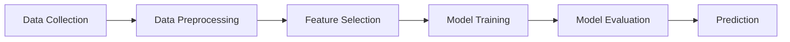
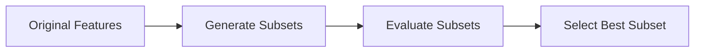
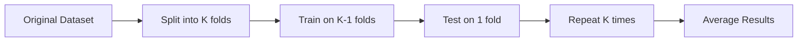
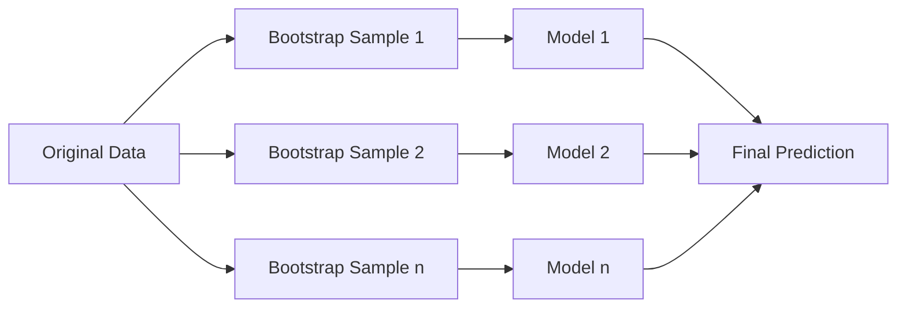
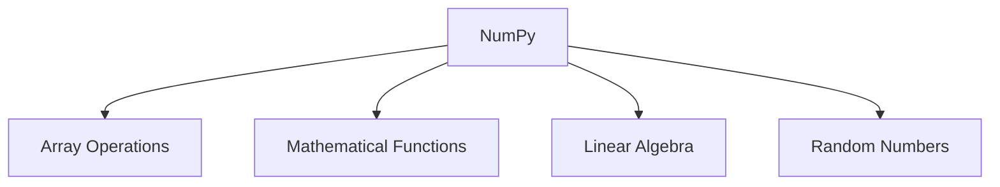
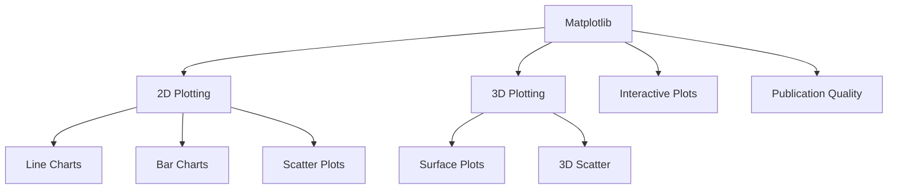
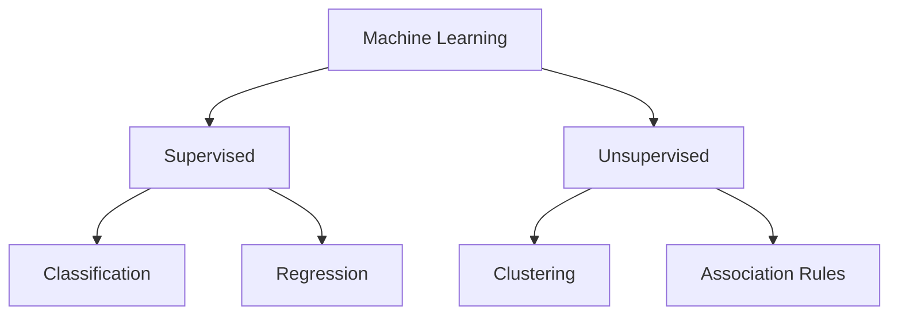
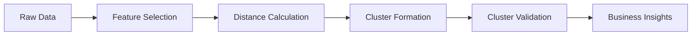

## Question 1(a) [3 marks]

**Define human learning and explain how machine learning is different from human learning?**

**Answer**:

**Table: Human Learning vs Machine Learning**

| Aspect | Human Learning | Machine Learning |
|--------|----------------|------------------|
| **Method** | Experience, trial and error | Data and algorithms |
| **Speed** | Slow, gradual | Fast processing |
| **Data Requirement** | Limited examples needed | Large datasets required |

- **Human Learning**: Process of acquiring knowledge through experience, observation, and reasoning
- **Machine Learning**: Automated learning from data using algorithms to identify patterns

**Mnemonic:** "Humans Experience, Machines Analyze Data" (HEMAD)

---

## Question 1(b) [4 marks]

**Describe the use of machine learning in finance and banking.**

**Answer**:

**Applications in Finance and Banking:**

| Application | Purpose | Benefit |
|-------------|---------|---------|
| **Fraud Detection** | Identify suspicious transactions | Reduce financial losses |
| **Credit Scoring** | Assess loan default risk | Better lending decisions |
| **Algorithmic Trading** | Automated trading decisions | Faster market responses |

- **Risk Assessment**: ML analyzes customer data to predict creditworthiness
- **Customer Service**: Chatbots provide 24/7 support using NLP
- **Regulatory Compliance**: Automated monitoring for suspicious activities

**Mnemonic:** "Finance Needs Smart Analysis" (FNSA)

---

## Question 1(c) [7 marks]

**Give difference between Supervised Learning, Unsupervised Learning and Reinforcement Learning.**

**Answer**:

**Comparison Table:**

| Feature | Supervised Learning | Unsupervised Learning | Reinforcement Learning |
|---------|-------------------|---------------------|---------------------|
| **Data Type** | Labeled data | Unlabeled data | Environment interaction |
| **Goal** | Predict output | Find patterns | Maximize rewards |
| **Examples** | Classification, Regression | Clustering, Association | Game playing, Robotics |
| **Feedback** | Immediate | None | Delayed rewards |

**Key Characteristics:**

- **Supervised Learning**: Teacher-guided learning with correct answers provided
- **Unsupervised Learning**: Self-discovery of hidden patterns in data
- **Reinforcement Learning**: Learning through trial and error with rewards/penalties

**Mnemonic:** "Supervised Teachers, Unsupervised Explores, Reinforcement Rewards" (STUER)

---

## Question 1(c OR) [7 marks]

**Explain different tools and technology used in machine learning.**

**Answer**:

**ML Tools and Technologies:**

| Category | Tools | Purpose |
|----------|-------|---------|
| **Programming** | Python, R, Java | Algorithm implementation |
| **Libraries** | Scikit-learn, TensorFlow | Ready-made algorithms |
| **Visualization** | Matplotlib, Seaborn | Data visualization |
| **Data Processing** | Pandas, NumPy | Data manipulation |

**Key Technologies:**

- **Cloud Platforms**: AWS, Google Cloud for scalable computing
- **Development Environments**: Jupyter Notebook, Google Colab
- **Big Data Tools**: Spark, Hadoop for large datasets

**Mnemonic:** "Python Libraries Visualize Data Effectively" (PLVDE)

---

## Question 2(a) [3 marks]

**Define outliers with one example.**

**Answer**:

**Definition**: Outliers are data points that significantly differ from other observations in a dataset.

**Example Table:**

| Student Heights (cm) | Classification |
|---------------------|----------------|
| 165, 170, 168, 172 | Normal values |
| 195 | Outlier (too tall) |
| 140 | Outlier (too short) |

- **Detection**: Values beyond 1.5 × IQR from quartiles
- **Impact**: Can skew statistical analysis and model performance

**Mnemonic:** "Outliers Stand Apart" (OSA)

---

## Question 2(b) [4 marks]

**Explain regression steps in detail.**

**Answer**:

**Regression Process Steps:**



**Detailed Steps:**

- **Data Collection**: Gather relevant dataset with input-output pairs
- **Preprocessing**: Clean data, handle missing values, normalize features
- **Feature Selection**: Choose relevant variables that affect target
- **Model Training**: Fit regression line to minimize prediction errors

**Mnemonic:** "Data Preprocessing Features Train Evaluation Predicts" (DPFTEP)

---

## Question 2(c) [7 marks]

**Define Accuracy and for the following binary classifier's confusion matrix, find the various measurement parameters like 1. Accuracy 2. Precision.**

**Answer**:

**Confusion Matrix Analysis:**

| | Predicted No | Predicted Yes |
|---------|-------------|--------------|
| **Actual No** | 10 (TN) | 3 (FP) |
| **Actual Yes** | 2 (FN) | 15 (TP) |

**Calculations:**

| Metric | Formula | Calculation | Result |
|--------|---------|-------------|--------|
| **Accuracy** | (TP+TN)/(TP+TN+FP+FN) | (15+10)/(15+10+3+2) | 83.33% |
| **Precision** | TP/(TP+FP) | 15/(15+3) | 83.33% |

**Definitions:**

- **Accuracy**: Proportion of correct predictions out of total predictions
- **Precision**: Proportion of true positive predictions out of all positive predictions

**Mnemonic:** "Accuracy Counts All, Precision Picks Positives" (ACAPP)

---

## Question 2(a OR) [3 marks]

**Identify basic steps of feature subset selection.**

**Answer**:

**Feature Subset Selection Steps:**



**Basic Steps:**

- **Generation**: Create different combinations of features
- **Evaluation**: Test each subset using performance metrics
- **Selection**: Choose optimal subset based on criteria

**Mnemonic:** "Generate, Evaluate, Select" (GES)

---

## Question 2(b OR) [4 marks]

**Discuss the strength and weakness of the KNN algorithm.**

**Answer**:

**KNN Algorithm Analysis:**

| Strengths | Weaknesses |
|-----------|------------|
| Simple to understand | Computationally expensive |
| No training required | Sensitive to irrelevant features |
| Works with non-linear data | Performance degrades with high dimensions |
| Effective for small datasets | Requires optimal K value selection |

**Key Points:**

- **Lazy Learning**: No explicit training phase required
- **Distance-Based**: Classification based on neighbor proximity
- **Memory-Intensive**: Stores entire training dataset

**Mnemonic:** "Simple but Slow, Effective but Expensive" (SBSEBE)

---

## Question 2(c OR) [7 marks]

**Define Error-rate and for the following binary classifier's confusion matrix, find the various measurement parameters like 1. Error value 2. Recall.**

**Answer**:

**Confusion Matrix Analysis:**

| | Predicted No | Predicted Yes |
|---------|-------------|--------------|
| **Actual No** | 20 (TN) | 3 (FP) |
| **Actual Yes** | 2 (FN) | 15 (TP) |

**Calculations:**

| Metric | Formula | Calculation | Result |
|--------|---------|-------------|--------|
| **Error Rate** | (FP+FN)/(TP+TN+FP+FN) | (3+2)/(15+20+3+2) | 12.5% |
| **Recall** | TP/(TP+FN) | 15/(15+2) | 88.24% |

**Definitions:**

- **Error Rate**: Proportion of incorrect predictions out of total predictions
- **Recall**: Proportion of actual positives correctly identified

**Mnemonic:** "Error Excludes, Recall Retrieves" (EERR)

---

## Question 3(a) [3 marks]

**Give any three examples of unsupervised learning.**

**Answer**:

**Unsupervised Learning Examples:**

| Example | Description | Application |
|---------|-------------|-------------|
| **Customer Segmentation** | Group customers by behavior | Marketing strategies |
| **Document Classification** | Organize documents by topics | Information retrieval |
| **Gene Sequencing** | Group similar DNA patterns | Medical research |

- **Market Basket Analysis**: Finding product purchase patterns
- **Social Network Analysis**: Identifying community structures
- **Anomaly Detection**: Detecting unusual patterns in data

**Mnemonic:** "Customers, Documents, Genes Group Automatically" (CDGGA)

---

## Question 3(b) [4 marks]

**Find Mean and Median for the following data: 4,6,7,8,9,12,14,15,20**

**Answer**:

**Statistical Calculations:**

| Statistic | Calculation | Result |
|-----------|-------------|--------|
| **Mean** | (4+6+7+8+9+12+14+15+20)/9 | 10.56 |
| **Median** | Middle value (5th position) | 9 |

**Step-by-step:**

- **Data**: Already sorted: 4,6,7,8,9,12,14,15,20
- **Mean**: Sum all values ÷ count = 95 ÷ 9 = 10.56
- **Median**: Middle value in sorted list = 9 (5th position)

**Mnemonic:** "Mean Averages All, Median Middle Value" (MAAMV)

---

## Question 3(c) [7 marks]

**Describe k-fold cross validation method in detail.**

**Answer**:

**K-Fold Cross Validation Process:**



**Process Steps:**

| Step | Description | Purpose |
|------|-------------|---------|
| **1. Data Division** | Split data into K equal parts | Ensure balanced testing |
| **2. Iterative Training** | Use K-1 folds for training | Maximum data utilization |
| **3. Validation** | Test on remaining fold | Unbiased evaluation |
| **4. Averaging** | Calculate mean performance | Robust performance estimate |

**Advantages:**

- **Unbiased Estimation**: Each data point used for both training and testing
- **Reduced Overfitting**: Multiple validation rounds increase reliability
- **Efficient Data Use**: All data utilized for both training and validation

**Mnemonic:** "K-fold Keeps Keen Knowledge" (KKKK)

---

## Question 3(a OR) [3 marks]

**Give any three applications of multiple linear regression.**

**Answer**:

**Multiple Linear Regression Applications:**

| Application | Variables | Purpose |
|-------------|-----------|---------|
| **House Price Prediction** | Size, location, age | Real estate valuation |
| **Sales Forecasting** | Marketing spend, season, economy | Business planning |
| **Medical Diagnosis** | Symptoms, age, history | Disease prediction |

- **Stock Market Analysis**: Multiple economic indicators predict stock prices
- **Academic Performance**: Study hours, attendance, previous grades predict scores
- **Marketing ROI**: Various marketing channels impact sales revenue

**Mnemonic:** "Houses, Sales, Medicine Predict Multiple Variables" (HSMPV)

---

## Question 3(b OR) [4 marks]

**Find Standard Deviation for the following data: 4,15,20,28,35,45**

**Answer**:

**Standard Deviation Calculation:**

| Step | Calculation | Value |
|------|-------------|-------|
| **Mean** | (4+15+20+28+35+45)/6 | 24.5 |
| **Variance** | Σ(xi-mean)²/n | 236.92 |
| **Std Dev** | √Variance | 15.39 |

**Detailed Calculation:**

- **Deviations from mean**: (-20.5)², (-9.5)², (-4.5)², (3.5)², (10.5)², (20.5)²
- **Squared deviations**: 420.25, 90.25, 20.25, 12.25, 110.25, 420.25
- **Sum**: 1073.5
- **Variance**: 1073.5/6 = 178.92
- **Standard Deviation**: √178.92 = 13.38

**Mnemonic:** "Deviation Measures Data Spread" (DMDS)

---

## Question 3(c OR) [7 marks]

**Explain Bagging, Boosting in detail.**

**Answer**:

**Ensemble Methods Comparison:**

| Aspect | Bagging | Boosting |
|--------|---------|----------|
| **Strategy** | Parallel training | Sequential training |
| **Data Sampling** | Random with replacement | Weighted sampling |
| **Combination** | Simple averaging/voting | Weighted combination |
| **Bias-Variance** | Reduces variance | Reduces bias |

**Bagging (Bootstrap Aggregating):**



**Boosting Process:**

- **Sequential Learning**: Each model learns from previous model's mistakes
- **Weight Adjustment**: Increase weight of misclassified examples
- **Final Prediction**: Weighted combination of all models

**Key Differences:**

- **Bagging**: Independent models trained in parallel, reduces overfitting
- **Boosting**: Dependent models trained sequentially, improves accuracy

**Mnemonic:** "Bagging Builds Parallel, Boosting Builds Sequential" (BBPBS)

---

## Question 4(a) [3 marks]

**Define: Support, Confidence.**

**Answer**:

**Association Rule Metrics:**

| Metric | Definition | Formula |
|--------|------------|---------|
| **Support** | Frequency of itemset in transactions | Support(A) = Count(A)/Total transactions |
| **Confidence** | Conditional probability of rule | Confidence(A→B) = Support(A∪B)/Support(A) |

**Example:**

- **Support(Bread)** = 0.6 (60% transactions contain bread)
- **Confidence(Bread→Butter)** = 0.8 (80% of bread buyers also buy butter)

**Applications:**

- **Market Basket Analysis**: Finding product associations
- **Recommendation Systems**: Suggesting related items

**Mnemonic:** "Support Shows Frequency, Confidence Shows Connection" (SSFC)

---

## Question 4(b) [4 marks]

**Illustrate any two applications of logistic regression.**

**Answer**:

**Logistic Regression Applications:**

| Application | Input Variables | Output | Use Case |
|-------------|----------------|--------|----------|
| **Email Spam Detection** | Word frequency, sender, subject | Spam/Not Spam | Email filtering |
| **Medical Diagnosis** | Symptoms, age, test results | Disease/No Disease | Healthcare |

**Key Features:**

- **Binary Classification**: Predicts probability between 0 and 1
- **S-shaped Curve**: Uses sigmoid function for probability estimation
- **Linear Decision Boundary**: Separates classes with linear boundary

**Real-world Examples:**

- **Marketing**: Customer purchase probability based on demographics
- **Finance**: Credit approval based on credit history and income

**Mnemonic:** "Logistic Limits Linear Logic" (LLLL)

---

## Question 4(c) [7 marks]

**Discuss the main purpose of Numpy and Pandas in machine learning.**

**Answer**:

**NumPy and Pandas in ML:**

| Library | Purpose | Key Features |
|---------|---------|--------------|
| **NumPy** | Numerical computing | Arrays, mathematical functions |
| **Pandas** | Data manipulation | DataFrames, data cleaning |

**NumPy Functions:**



**Pandas Capabilities:**

- **Data Import/Export**: Read CSV, Excel, JSON files
- **Data Cleaning**: Handle missing values, duplicates
- **Data Transformation**: Group, merge, pivot operations
- **Statistical Analysis**: Descriptive statistics, correlation

**Integration with ML:**

- **Data Preprocessing**: Clean and prepare data for algorithms
- **Feature Engineering**: Create new features from existing data
- **Model Input**: Convert data to format required by ML algorithms

**Key Benefits:**

- **Performance**: Optimized C/C++ backend for speed
- **Memory Efficiency**: Efficient data storage and manipulation
- **Ecosystem Integration**: Works seamlessly with scikit-learn, matplotlib

**Mnemonic:** "NumPy Numbers, Pandas Processes Data" (NNPD)

---

## Question 4(a OR) [3 marks]

**Give any three examples of Supervised Learning.**

**Answer**:

**Supervised Learning Examples:**

| Example | Type | Input → Output |
|---------|------|----------------|
| **Email Classification** | Classification | Email features → Spam/Not Spam |
| **House Price Prediction** | Regression | House features → Price |
| **Image Recognition** | Classification | Pixel values → Object class |

- **Medical Diagnosis**: Patient symptoms → Disease classification
- **Stock Price Prediction**: Market indicators → Future price
- **Speech Recognition**: Audio signals → Text transcription

**Mnemonic:** "Emails, Houses, Images Learn Supervised" (EHILS)

---

## Question 4(b OR) [4 marks]

**Explain any two applications of the apriori algorithm.**

**Answer**:

**Apriori Algorithm Applications:**

| Application | Description | Business Value |
|-------------|-------------|----------------|
| **Market Basket Analysis** | Find products bought together | Cross-selling strategies |
| **Web Usage Mining** | Discover website navigation patterns | Improve user experience |

**Market Basket Analysis:**

- **Example**: "Customers who buy bread and milk also buy eggs"
- **Business Impact**: Product placement, promotional offers
- **Implementation**: Analyze transaction data to find frequent itemsets

**Web Usage Mining:**

- **Example**: "Users visiting page A often visit page B next"
- **Website Optimization**: Improve navigation, recommend content
- **User Experience**: Personalized website layouts

**Algorithm Process:**

- **Generate Candidates**: Create frequent itemsets
- **Prune**: Remove infrequent items
- **Generate Rules**: Create association rules with confidence

**Mnemonic:** "Apriori Analyzes Associations Automatically" (AAAA)

---

## Question 4(c OR) [7 marks]

**Explain the features and applications of Matplotlib.**

**Answer**:

**Matplotlib Features and Applications:**

| Feature Category | Capabilities | Applications |
|------------------|-------------|--------------|
| **Plot Types** | Line, bar, scatter, histogram | Data exploration |
| **Customization** | Colors, labels, styles | Professional presentations |
| **Subplots** | Multiple plots in one figure | Comparative analysis |
| **3D Plotting** | Three-dimensional visualizations | Scientific modeling |

**Key Features:**



**Applications in Machine Learning:**

- **Data Exploration**: Visualize data distribution and patterns
- **Model Performance**: Plot accuracy, loss curves during training
- **Result Presentation**: Display predictions vs actual values
- **Feature Analysis**: Correlation matrices, feature importance plots

**Advanced Capabilities:**

- **Animation**: Create animated plots for time-series data
- **Interactive Widgets**: Add sliders, buttons for user interaction
- **Integration**: Works with Jupyter notebooks, web applications

**Benefits:**

- **Flexibility**: Highly customizable plotting options
- **Community**: Large user base with extensive documentation
- **Compatibility**: Integrates with NumPy, Pandas seamlessly

**Mnemonic:** "Matplotlib Makes Meaningful Visual Displays" (MMVD)

---

## Question 5(a) [3 marks]

**List out the major features of Numpy.**

**Answer**:

**NumPy Major Features:**

| Feature | Description | Benefit |
|---------|-------------|---------|
| **N-dimensional Arrays** | Efficient array operations | Fast mathematical computations |
| **Broadcasting** | Operations on different sized arrays | Flexible array manipulation |
| **Linear Algebra** | Matrix operations, decompositions | Scientific computing support |

- **Universal Functions**: Element-wise operations on arrays
- **Memory Efficiency**: Contiguous memory layout for speed
- **C/C++ Integration**: Interface with compiled languages

**Mnemonic:** "NumPy Numbers Need Neat Operations" (NNNNO)

---

## Question 5(b) [4 marks]

**How to load an iris dataset csv file in a Pandas Dataframe program? Explain with example.**

**Answer**:

**Loading Iris Dataset:**

```python
import pandas as pd

# Method 1: Load from file
df = pd.read_csv('iris.csv')

# Method 2: Load from sklearn
from sklearn.datasets import load_iris
iris = load_iris()
df = pd.DataFrame(iris.data, columns=iris.feature_names)
df['target'] = iris.target

# Display basic information
print(df.head())
print(df.info())
print(df.describe())
```

**Code Explanation:**

- **pd.read_csv()**: Reads CSV file into DataFrame
- **columns parameter**: Assigns column names
- **head()**: Shows first 5 rows
- **info()**: Displays data types and memory usage

**Mnemonic:** "Pandas Reads CSV Files Easily" (PRCFE)

---

## Question 5(c) [7 marks]

**Compare and Contrast Supervised Learning and Unsupervised Learning.**

**Answer**:

**Comprehensive Comparison:**

| Aspect | Supervised Learning | Unsupervised Learning |
|--------|-------------------|---------------------|
| **Data Type** | Labeled (input-output pairs) | Unlabeled (input only) |
| **Learning Goal** | Predict target variable | Discover hidden patterns |
| **Evaluation** | Accuracy, precision, recall | Silhouette score, inertia |
| **Complexity** | Less complex to evaluate | More complex to validate |
| **Applications** | Classification, regression | Clustering, dimensionality reduction |

**Detailed Comparison:**



**Supervised Learning Characteristics:**

- **Training Process**: Learn from examples with known correct answers
- **Performance Measurement**: Direct comparison with actual outcomes
- **Common Algorithms**: Decision trees, SVM, neural networks
- **Business Applications**: Fraud detection, medical diagnosis, price prediction

**Unsupervised Learning Characteristics:**

- **Exploration**: Find unknown patterns without guidance
- **Validation Challenges**: No ground truth for direct comparison
- **Common Algorithms**: K-means, hierarchical clustering, PCA
- **Business Applications**: Customer segmentation, market research, anomaly detection

**Key Contrasts:**

- **Feedback**: Supervised has immediate feedback, unsupervised relies on domain expertise
- **Data Requirements**: Supervised needs expensive labeled data, unsupervised uses readily available unlabeled data
- **Problem Types**: Supervised solves prediction problems, unsupervised solves discovery problems

**Mnemonic:** "Supervised Seeks Specific Solutions, Unsupervised Uncovers Unknown" (SSSUU)

---

## Question 5(a OR) [3 marks]

**List out the applications of Pandas.**

**Answer**:

**Pandas Applications:**

| Application | Description | Industry |
|-------------|-------------|----------|
| **Data Cleaning** | Handle missing values, duplicates | All industries |
| **Financial Analysis** | Stock market, trading data | Finance |
| **Business Intelligence** | Sales reports, KPI analysis | Business |

- **Scientific Research**: Experimental data analysis
- **Web Analytics**: Website traffic, user behavior analysis
- **Healthcare**: Patient records, clinical trial data

**Mnemonic:** "Pandas Processes Data Perfectly" (PPDP)

---

## Question 5(b OR) [4 marks]

**How to plot a vertical line and horizontal line in matplotlib? Explain with examples.**

**Answer**:

**Matplotlib Line Plotting:**

```python
import matplotlib.pyplot as plt
import numpy as np

# Create sample data
x = np.linspace(0, 10, 100)
y = np.sin(x)

# Plot the main curve
plt.plot(x, y, label='sin(x)')

# Vertical line at x = 5
plt.axvline(x=5, color='red', linestyle='--', label='Vertical Line')

# Horizontal line at y = 0.5
plt.axhline(y=0.5, color='green', linestyle=':', label='Horizontal Line')

# Formatting
plt.xlabel('X-axis')
plt.ylabel('Y-axis')
plt.legend()
plt.title('Vertical and Horizontal Lines')
plt.grid(True)
plt.show()
```

**Key Functions:**

- **axvline()**: Creates vertical line at specified x-coordinate
- **axhline()**: Creates horizontal line at specified y-coordinate
- **Parameters**: color, linestyle, linewidth, alpha

**Mnemonic:** "Matplotlib Makes Lines Easily" (MMLE)

---

## Question 5(c OR) [7 marks]

**Describe the concept of clustering using appropriate real-world examples.**

**Answer**:

**Clustering Concept and Applications:**

| Clustering Type | Real-World Example | Business Impact |
|----------------|-------------------|-----------------|
| **Customer Segmentation** | Group customers by purchase behavior | Targeted marketing campaigns |
| **Image Segmentation** | Medical imaging for tumor detection | Improved diagnosis accuracy |
| **Gene Analysis** | Group genes with similar expression | Drug discovery and treatment |

**Clustering Process:**



**Detailed Examples:**

**1. Customer Segmentation:**

- **Data**: Purchase history, demographics, website behavior
- **Clusters**: High-value customers, price-sensitive buyers, occasional shoppers
- **Business Value**: Customized marketing, product recommendations, retention strategies

**2. Social Media Analysis:**

- **Data**: User interactions, post topics, engagement patterns
- **Clusters**: Influencers, casual users, brand advocates
- **Applications**: Viral marketing, content strategy, community management

**3. Market Research:**

- **Data**: Survey responses, product preferences, demographics
- **Clusters**: Market segments with similar needs
- **Insights**: Product development, pricing strategy, market positioning

**Clustering Algorithms:**

- **K-Means**: Partitions data into k clusters
- **Hierarchical**: Creates tree-like cluster structure
- **DBSCAN**: Finds clusters of varying density

**Validation Methods:**

- **Silhouette Score**: Measures cluster quality
- **Elbow Method**: Determines optimal number of clusters
- **Domain Expertise**: Business knowledge validation

**Benefits:**

- **Pattern Discovery**: Reveals hidden data structures
- **Decision Support**: Provides insights for business decisions
- **Automation**: Reduces manual data analysis effort

**Mnemonic:** "Clustering Creates Clear Categories" (CCCC)
