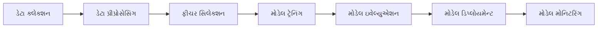
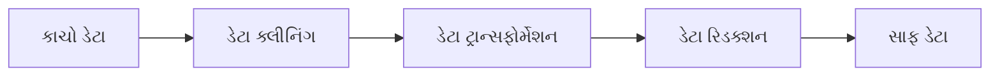
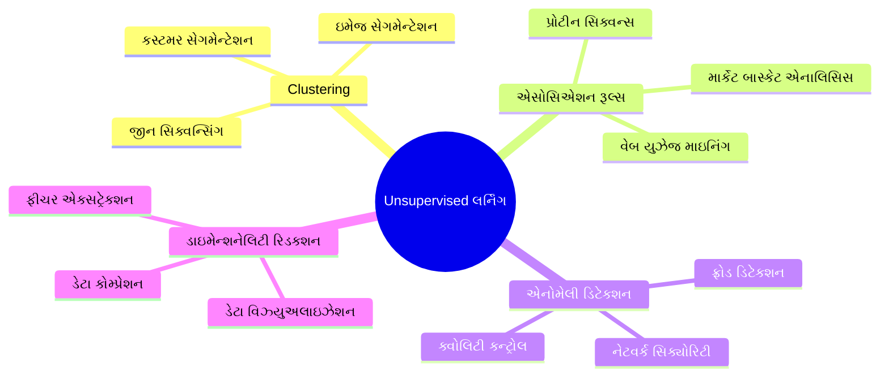
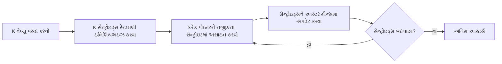
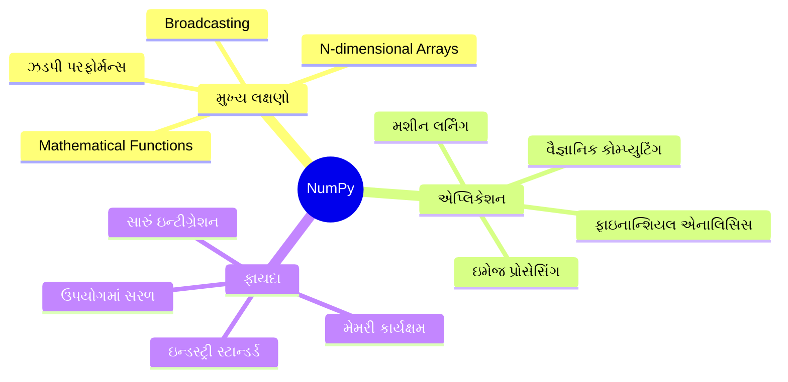
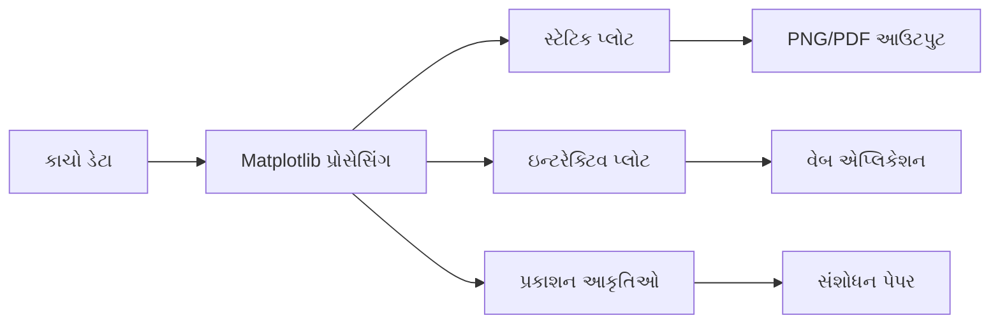

## પ્રશ્ન 1(અ) [3 ગુણ]

**હ્યુમન લર્નિંગનું સંક્ષિપ્ત વર્ણન કરો.**

**જવાબ**:

હ્યુમન લર્નિંગ એ પ્રક્રિયા છે જેના દ્વારા માનવ અનુભવ, પ્રેક્ટિસ અને શિક્ષણ દ્વારા જ્ઞાન, કૌશલ્ય અને વર્તણૂક પ્રાપ્ત કરે છે.

**કોષ્ટક: હ્યુમન લર્નિંગ પ્રક્રિયા**

| પાસું | વર્ણન |
|-------|--------|
| **અવલોકન** | પર્યાવરણમાંથી માહિતી એકત્રિત કરવી |
| **અનુભવ** | ટ્રાયલ અને એરર દ્વારા શીખવું |
| **અભ્યાસ** | કૌશલ્ય સુધારવા માટે પુનરાવર્તન |
| **સ્મૃતિ** | માહિતી સંગ્રહ અને પુનઃપ્રાપ્તિ |

- **લર્નિંગ પ્રકારો**: દ્રશ્ય, શ્રાવ્ય, ગતિશીલ લર્નિંગ શૈલીઓ
- **ફીડબેક લૂપ**: ભૂલો અને સફળતાઓમાંથી શીખવું
- **અનુકૂલન**: નવી પરિસ્થિતિઓમાં જ્ઞાન લાગુ કરવાની ક્ષમતા

**મેમરી ટ્રીક:** "AAPS" - અવલોકન, અનુભવ, અભ્યાસ, સ્મૃતિ

## પ્રશ્ન 1(બ) [4 ગુણ]

**તફાવત કરો: Supervised લર્નિંગ v/s Unsupervised લર્નિંગ**

**જવાબ**:

**તુલનાત્મક કોષ્ટક: Supervised vs Unsupervised લર્નિંગ**

| પેરામીટર | Supervised લર્નિંગ | Unsupervised લર્નિંગ |
|-----------|---------------------|----------------------|
| **ટ્રેનિંગ ડેટા** | લેબલ થયેલ ડેટા (ઇનપુટ-આઉટપુટ જોડી) | લેબલ વિનાનો ડેટા (માત્ર ઇનપુટ) |
| **ધ્યેય** | નવા ઇનપુટ માટે આઉટપુટ આગાહી કરવી | છુપાયેલ પેટર્ન શોધવું |
| **ઉદાહરણ** | Classification, Regression | Clustering, Association |
| **ફીડબેક** | સીધો ફીડબેક ઉપલબ્ધ | કોઈ સીધો ફીડબેક નથી |

- **Supervised**: શિક્ષક સાચા જવાબો સાથે લર્નિંગ માર્ગદર્શન કરે છે
- **Unsupervised**: માર્ગદર્શન વિના પેટર્નની સ્વ-શોધ

**મેમરી ટ્રીક:** "SL-લેબલ્સ, UL-અજાણ્યા" પેટર્ન

## પ્રશ્ન 1(ક) [7 ગુણ]

**મશીન લર્નિંગ એક્ટિવિટીની સૂચિ બનાવો. દરેકને વિગતવાર સમજાવો.**

**જવાબ**:

**કોષ્ટક: મશીન લર્નિંગ એક્ટિવિટીઓ**

| એક્ટિવિટી | હેતુ | વર્ણન |
|-----------|------|-------|
| **ડેટા કલેક્શન** | કાચો ડેટા એકત્રિત કરવો | વિવિધ સ્રોતોમાંથી સંબંધિત ડેટા એકત્રિત કરવો |
| **ડેટા પ્રીપ્રોસેસિંગ** | ડેટા સાફ અને તૈયાર કરવો | ખોવાયેલી વેલ્યૂઝ સંભાળવી, સામાન્યીકરણ |
| **ફીચર સિલેક્શન** | મહત્વપૂર્ણ લક્ષણો પસંદ કરવા | લર્નિંગ માટે સંબંધિત એટ્રિબ્યુટ્સ પસંદ કરવા |
| **મોડેલ ટ્રેનિંગ** | લર્નિંગ મોડેલ બનાવવું | તૈયાર ડેટાસેટ પર અલગોરિધમ ટ્રેનિંગ |
| **મોડેલ ઇવેલ્યુએશન** | પરફોર્મન્સ મૂલ્યાંકન | મોડેલની ચોકસાઈ અને અસરકારકતા ચકાસવી |
| **મોડેલ ડિપ્લોયમેન્ટ** | મોડેલને ઉપયોગમાં લેવું | વાસ્તવિક દુનિયાની એપ્લિકેશનમાં મોડેલ અમલીકરણ |

- **પુનરાવર્તિત પ્રક્રિયા**: મોડેલ સુધારણા માટે એક્ટિવિટીઓ પુનરાવર્તિત થાય છે
- **ગુણવત્તા નિયંત્રણ**: દરેક પગલું બહેતર મોડેલ પરફોર્મન્સ સુનિશ્ચિત કરે છે

**મેમરી ટ્રીક:** "કપફટઇડમ" - કલેક્શન, પ્રીપ્રોસેસિંગ, ફીચર, ટ્રેનિંગ, ઇવેલ્યુએશન, ડિપ્લોયમેન્ટ, મોનિટરિંગ

## પ્રશ્ન 1(ક OR) [7 ગુણ]

**નીચેના ડેટા માટે મીન, મીડિયન અને મોડ શોધો: 1, 1, 1, 2, 4, 5, 5, 6, 6, 7, 7, 7, 7, 8, 9, 10, 11**

**જવાબ**:

**ડેટા વિશ્લેષણ કોષ્ટક**

| આંકડાકીય માપ | સૂત્ર | ગણતરી | પરિણામ |
|--------------|-------|---------|--------|
| **મીન** | સરવાળો/ગણતરી | (1+1+1+2+4+5+5+6+6+7+7+7+7+8+9+10+11)/17 | 5.88 |
| **મીડિયન** | મધ્ય વેલ્યુ | ક્રમબદ્ધ ડેટામાં 7મી પોઝિશન | 6 |
| **મોડ** | સૌથી વધુ આવર્તન | 4 વખત દેખાતી વેલ્યુ | 7 |

**પગલું-દર-પગલું ગણતરી:**

- **કુલ ગણતરી**: 17 વેલ્યુઝ
- **સરવાળો**: 100
- **મીન**: 100/17 = 5.88
- **મીડિયન**: મધ્ય પોઝિશન (9મી) = 6
- **મોડ**: 7 સૌથી વધુ 4 વખત દેખાય છે

**મેમરી ટ્રીક:** "મમમ" - મીન=સરેરાશ, મીડિયન=મધ્ય, મોડ=સૌથી વધુ આવર્તન

## પ્રશ્ન 2(અ) [3 ગુણ]

**મોડેલ ટ્રેનિંગ માટે હોલ્ડ આઉટ પદ્ધતિનો ઉપયોગ કરવાના પગલાં લખો.**

**જવાબ**:

**હોલ્ડ આઉટ મેથડ પગલાં**

| પગલું | ક્રિયા | હેતુ |
|-------|-------|------|
| **1** | ડેટાસેટ વિભાજન (70-80% ટ્રેનિંગ, 20-30% ટેસ્ટિંગ) | ટ્રેનિંગ અને મૂલ્યાંકન માટે ડેટા અલગ કરવો |
| **2** | ટ્રેનિંગ સેટ પર મોડેલ ટ્રેન કરવું | લર્નિંગ અલગોરિધમ બનાવવું |
| **3** | ટેસ્ટિંગ સેટ પર મોડેલ ટેસ્ટ કરવું | મોડેલ પરફોર્મન્સ મૂલ્યાંકન કરવું |

- **રેન્ડમ સ્પ્લિટ**: બંને સેટમાં પ્રતિનિધિ વિતરણ સુનિશ્ચિત કરવું
- **કોઈ ઓવરલેપ નહીં**: ટેસ્ટિંગ ડેટા ક્યારેય ટ્રેનિંગમાં ઉપયોગ થતો નથી
- **સિંગલ સ્પ્લિટ**: ડેટાનું એક વખતનું વિભાજન

**મેમરી ટ્રીક:** "વટટ" - વિભાજન, ટ્રેન, ટેસ્ટ

## પ્રશ્ન 2(બ) [4 ગુણ]

**કન્ફ્યુઝન મેટ્રિક્સની રચના સમજાવો.**

**જવાબ**:

**કન્ફ્યુઝન મેટ્રિક્સ રચના**

|  | આગાહી પોઝિટિવ | આગાહી નેગેટિવ |
|--|-----------------|----------------|
| **વાસ્તવિક પોઝિટિવ** | ટ્રુ પોઝિટિવ (TP) | ફોલ્સ નેગેટિવ (FN) |
| **વાસ્તવિક નેગેટિવ** | ફોલ્સ પોઝિટિવ (FP) | ટ્રુ નેગેટિવ (TN) |

**ઘટકોની સમજૂતી:**

- **TP**: સાચી રીતે આગાહી કરેલા પોઝિટિવ કેસ
- **TN**: સાચી રીતે આગાહી કરેલા નેગેટિવ કેસ
- **FP**: ખોટી રીતે પોઝિટિવ તરીકે આગાહી (ટાઈપ I એરર)
- **FN**: ખોટી રીતે નેગેટિવ તરીકે આગાહી (ટાઈપ II એરર)

**પરફોર્મન્સ મેટ્રિક્સ:**

- **એક્યુરેસી** = (TP+TN)/(TP+TN+FP+FN)
- **પ્રિસિઝન** = TP/(TP+FP)

**મેમરી ટ્રીક:** "TPFN-FPTN" મેટ્રિક્સ પોઝિશન માટે

## પ્રશ્ન 2(ક) [7 ગુણ]

**ડેટા પ્રી-પ્રોસેસિંગ વ્યાખ્યાયિત કરો. ડેટા પ્રી-પ્રોસેસિંગમાં વપરાતી વિવિધ પદ્ધતિઓ સમજાવો.**

**જવાબ**:

ડેટા પ્રી-પ્રોસેસિંગ એ કાચા ડેટાને સાફ, રૂપાંતરિત અને મશીન લર્નિંગ અલગોરિધમ માટે તૈયાર કરવાની તકનીક છે.

**ડેટા પ્રી-પ્રોસેસિંગ પદ્ધતિઓ કોષ્ટક**

| પદ્ધતિ | હેતુ | તકનીકો |
|--------|------|---------|
| **ડેટા ક્લીનિંગ** | નોઈઝ અને અસંગતતા દૂર કરવી | ખોવાયેલી વેલ્યૂઝ સંભાળવી, ડુપ્લિકેટ દૂર કરવા |
| **ડેટા ટ્રાન્સફોર્મેશન** | ડેટા ફોર્મેટ કન્વર્ટ કરવું | નોર્મલાઈઝેશન, સ્ટાન્ડર્ડાઈઝેશન |
| **ડેટા રિડક્શન** | ડેટાસેટ સાઈઝ ઘટાડવું | ફીચર સિલેક્શન, ડાઈમેન્શનાલિટી રિડક્શન |
| **ડેટા ઈન્ટીગ્રેશન** | અનેક સ્રોતો જોડવા | ડેટાસેટ મર્જ કરવા, કોન્ફ્લિક્ટ હલ કરવા |

- **ખોવાયેલી વેલ્યૂઝ**: ઈમ્પ્યુટેશન માટે મીન, મીડિયન, અથવા મોડનો ઉપયોગ
- **આઉટલાયર્સ**: અત્યંત વેલ્યૂઝ શોધવી અને સંભાળવી
- **ફીચર સ્કેલિંગ**: ડેટાને સમાન સ્કેલ પર નોર્મલાઈઝ કરવું

**મેમરી ટ્રીક:** "કતરઈ" - ક્લીન, ટ્રાન્સફોર્મ, રિડ્યુસ, ઈન્ટીગ્રેટ

## પ્રશ્ન 2(અ OR) [3 ગુણ]

**યોગ્ય ઉદાહરણ સાથે હિસ્ટોગ્રામ સમજાવો.**

**જવાબ**:

હિસ્ટોગ્રામ એ અંકશાસ્ત્રીય ડેટાના ફ્રીક્વન્સી ડિસ્ટ્રિબ્યુશનનું ગ્રાફિકલ પ્રતિનિધિત્વ છે જે ડેટાને bins માં વિભાજિત કરે છે.

**હિસ્ટોગ્રામ ઘટકો કોષ્ટક**

| ઘટક | વર્ણન |
|------|--------|
| **X-axis** | ડેટા રેન્જ (bins) |
| **Y-axis** | આવર્તન |
| **બાર્સ** | ઊંચાઈ આવર્તન દર્શાવે છે |

**ઉદાહરણ**: વિદ્યાર્થીઓના ગુણ વિતરણ:

- Bins: 0-20, 21-40, 41-60, 61-80, 81-100
- ઊંચાઈ દરેક રેન્જમાં વિદ્યાર્થીઓની સંખ્યા દર્શાવે છે

**મેમરી ટ્રીક:** "બએર" - Bins, Axes, રેન્જ

## પ્રશ્ન 2(બ OR) [4 ગુણ]

**નીચેના ઉદાહરણોનો યોગ્ય ડેટા પ્રકાર જણાવો:**
**i) વ્યક્તિનું લિંગ ii) વિદ્યાર્થીઓનો ક્રમ iii) ઘરની કિંમત iv) ફૂલનો રંગ**

**જવાબ**:

**ડેટા પ્રકાર વર્ગીકરણ કોષ્ટક**

| ઉદાહરણ | ડેટા પ્રકાર | લક્ષણો |
|---------|-------------|---------|
| **વ્યક્તિનું લિંગ** | Nominal Categorical | કોઈ પ્રાકૃતિક ક્રમ નથી (પુરુષ/સ્ત્રી) |
| **વિદ્યાર્થીઓનો ક્રમ** | Ordinal Categorical | અર્થપૂર્ણ ક્રમ છે (1લો, 2જો, 3જો) |
| **ઘરની કિંમત** | Continuous Numerical | રેન્જમાં કોઈપણ વેલ્યુ લઈ શકે છે |
| **ફૂલનો રંગ** | Nominal Categorical | કોઈ પ્રાકૃતિક ક્રમ નથી (લાલ, વાદળી, પીળો) |

- **કેટેગોરિકલ ડેટા**: વિશિષ્ટ શ્રેણીઓનો મર્યાદિત સેટ
- **ન્યુમેરિકલ ડેટા**: ગાણિતિક ઓપરેશન શક્ય છે
- **ઓર્ડિનલ**: અર્થપૂર્ણ અનુક્રમ સાથેની શ્રેણીઓ

**મેમરી ટ્રીક:** "નોકો" - Nominal, Ordinal, કન્ટિન્યુઅસ

## પ્રશ્ન 2(ક OR) [7 ગુણ]

**K-fold ક્રોસ વેલિડેશનનું વિગતવાર વર્ણન કરો.**

**જવાબ**:

K-fold ક્રોસ વેલિડેશન એ મોડેલ મૂલ્યાંકન તકનીક છે જે મજબૂત પરફોર્મન્સ આકલન માટે ડેટાસેટને K સમાન ભાગોમાં વિભાજિત કરે છે.

**K-fold પ્રક્રિયા કોષ્ટક**

| પગલું | ક્રિયા | હેતુ |
|-------|-------|------|
| **1** | ડેટાને K સમાન folds માં વિભાજિત કરવો | K સબસેટ્સ બનાવવા |
| **2** | K-1 folds નો ટ્રેનિંગ માટે ઉપયોગ | મોડેલ ટ્રેન કરવું |
| **3** | 1 fold નો ટેસ્ટિંગ માટે ઉપયોગ | પરફોર્મન્સ મૂલ્યાંકન |
| **4** | K વખત પુનરાવર્તન | દરેક fold એક વખત ટેસ્ટ સેટ તરીકે સેવા આપે |
| **5** | બધા પરિણામોની સરેરાશ | અંતિમ પરફોર્મન્સ મેટ્રિક મેળવવું |

**ફાયદા:**

- **મજબૂત મૂલ્યાંકન**: દરેક ડેટા પોઇન્ટ ટ્રેનિંગ અને ટેસ્ટિંગ બંને માટે ઉપયોગ થાય છે
- **ઓવરફિટિંગ ઘટાડવું**: બહુવિધ વેલિડેશન રાઉન્ડ
- **બહેતર જનરલાઈઝેશન**: વધુ વિશ્વસનીય પરફોર્મન્સ અંદાજ

**સામાન્ય વેલ્યૂઝ**: સામાન્ય રીતે K=5 અથવા K=10 વપરાય છે

**મેમરી ટ્રીક:** "વઉપસટ" - વિભાજન, ઉપયોગ, પુનરાવર્તન, સરેરાશ, ટેસ્ટ

## પ્રશ્ન 3(અ) [3 ગુણ]

**રીગ્રેશનની એપ્લિકેશનની યાદી બનાવો.**

**જવાબ**:

**રીગ્રેશન એપ્લિકેશન કોષ્ટક**

| ડોમેન | એપ્લિકેશન | હેતુ |
|-------|-------------|------|
| **નાણાં** | શેર કિંમત આગાહી | બજાર ટ્રેન્ડ્સ આગાહી કરવી |
| **હેલ્થકેર** | દવાની માત્રા ગણતરી | શ્રેષ્ઠ સારવાર નક્કી કરવી |
| **માર્કેટિંગ** | વેચાણ આગાહી | આવક આગાહી કરવી |
| **રિયલ એસ્ટેટ** | પ્રોપર્ટી વેલ્યુએશન | ઘરની કિંમત અંદાજ કરવો |

- **પ્રિડિક્ટિવ મોડલિંગ**: કન્ટિન્યુઅસ વેલ્યૂઝ આગાહી કરવી
- **ટ્રેન્ડ એનાલિસિસ**: વેરિએબલ્સ વચ્ચેના સંબંધોને સમજવા
- **રિસ્ક એસેસમેન્ટ**: ભાવિ પરિણામોનું મૂલ્યાંકન

**મેમરી ટ્રીક:** "નહમર" - નાણાં, હેલ્થકેર, માર્કેટિંગ, રિયલ એસ્ટેટ

## પ્રશ્ન 3(બ) [4 ગુણ]

**સિંગલ લિનિયર રીગ્રેશન પર ટૂંકી નોંધ લખો.**

**જવાબ**:

સિંગલ લિનિયર રીગ્રેશન એક સ્વતંત્ર વેરિએબલ (X) અને એક આશ્રિત વેરિએબલ (Y) વચ્ચેના સંબંધને સીધી રેખાનો ઉપયોગ કરીને મોડેલ કરે છે.

**લિનિયર રીગ્રેશન ઘટકો**

| ઘટક | સૂત્ર | વર્ણન |
|------|-------|--------|
| **સમીકરણ** | Y = a + bX | રેખીય સંબંધ |
| **સ્લોપ (b)** | Y માં ફેરફાર / X માં ફેરફાર | ફેરફારની દર |
| **ઇન્ટરસેપ્ટ (a)** | X=0 વખતે Y-વેલ્યુ | શરુઆતી બિંદુ |
| **એરર** | વાસ્તવિક - આગાહી | રેખામાંથી તફાવત |

- **ધ્યેય**: એરર ઘટાડતી બેસ્ટ-ફિટ લાઇન શોધવી
- **પદ્ધતિ**: લીસ્ટ સ્ક્વેર ઓપ્ટિમાઇઝેશન
- **ધારણા**: વેરિએબલ્સ વચ્ચે રેખીય સંબંધ અસ્તિત્વમાં છે

**મેમરી ટ્રીક:** "YABX" - Y બરાબર a પ્લસ b ગુણા X

## પ્રશ્ન 3(ક) [7 ગુણ]

**K-NN અલગોરિધમ લખો અને ચર્ચા કરો.**

**જવાબ**:

K-નીયરેસ્ટ નેઇબર્સ (K-NN) એ લેઝી લર્નિંગ અલગોરિધમ છે જે ડેટા પોઇન્ટ્સને તેમના K નજીકના પડોશીઓના મેજોરિટી ક્લાસના આધારે વર્ગીકૃત કરે છે.

**K-NN અલગોરિધમ પગલાં**

| પગલું | ક્રિયા | વર્ણન |
|-------|-------|--------|
| **1** | K વેલ્યુ પસંદ કરવી | પડોશીઓની સંખ્યા પસંદ કરવી |
| **2** | અંતર ગણતરી કરવી | બધા ટ્રેનિંગ પોઇન્ટ્સનું અંતર શોધવું |
| **3** | અંતર ક્રમાંકિત કરવા | ચડતા ક્રમમાં ગોઠવવા |
| **4** | K નજીકના પસંદ કરવા | K સૌથી નજીકના પોઇન્ટ્સ પસંદ કરવા |
| **5** | મેજોરિટી વોટિંગ | સૌથી સામાન્ય ક્લાસ અસાઇન કરવો |

**અંતર મેટ્રિક્સ:**

- **યુક્લિડિયન**: સૌથી સામાન્ય અંતર માપ
- **મેનહેટન**: નિરપેક્ષ તફાવતોનો સરવાળો
- **મિન્કોવસ્કી**: સામાન્યીકૃત અંતર મેટ્રિક

**ફાયદા:**

- **સરળ**: સમજવા અને અમલીકરણ માટે સરળ
- **કોઈ ટ્રેનિંગ નહીં**: બધો ડેટા સ્ટોર કરે છે, કોઈ મોડેલ બિલ્ડિંગ નથી

**ગેરફાયદા:**

- **કોમ્પ્યુટેશનલી મહેંગું**: બધા પોઇન્ટ્સ ચેક કરવા પડે છે
- **K પ્રત્યે સંવેદનશીલ**: પરફોર્મન્સ K વેલ્યુ પર આધાર રાખે છે

**મેમરી ટ્રીક:** "પગકમ" - પસંદ, ગણતરી, ક્રમાંકન, મેજોરિટી વોટ

## પ્રશ્ન 3(અ OR) [3 ગુણ]

**હેલ્થકેર ક્ષેત્રમાં supervised learning ના કોઈપણ ત્રણ ઉદાહરણો લખો**

**જવાબ**:

**હેલ્થકેર Supervised લર્નિંગ ઉદાહરણો**

| એપ્લિકેશન | ઇનપુટ | આઉટપુટ | હેતુ |
|-------------|-------|--------|------|
| **રોગ નિદાન** | લક્ષણો, ટેસ્ટ પરિણામો | રોગનો પ્રકાર | તબીબી સ્થિતિઓ ઓળખવી |
| **દવાની રિસ્પોન્સ આગાહી** | દર્દીનો ડેટા, આનુવંશિકતા | દવાની અસરકારકતા | વ્યક્તિગત દવા |
| **મેડિકલ ઇમેજ એનાલિસિસ** | X-rays, MRI સ્કેન | ટ્યુમર શોધ | પ્રારંભિક રોગ શોધ |

- **પેટર્ન રેકગ્નિશન**: લેબલ કરેલા તબીબી ડેટામાંથી શીખવું
- **ક્લિનિકલ ડિસિઝન સપોર્ટ**: ડોકટરોને નિદાનમાં મદદ કરવી
- **પ્રિડિક્ટિવ મેડિસિન**: આરોગ્ય પરિણામો આગાહી કરવા

**મેમરી ટ્રીક:** "રદમ" - રોગ નિદાન, દવાની રિસ્પોન્સ, મેડિકલ ઇમેજિંગ

## પ્રશ્ન 3(બ OR) [4 ગુણ]

**તફાવત કરો: Classification v/s Regression.**

**જવાબ**:

**Classification vs Regression તુલના**

| પાસું | Classification | Regression |
|-------|---------------|------------|
| **આઉટપુટ પ્રકાર** | વિશિષ્ટ શ્રેણીઓ/ક્લાસ | કન્ટિન્યુઅસ ન્યુમેરિકલ વેલ્યૂઝ |
| **ધ્યેય** | ક્લાસ લેબલ આગાહી કરવા | ન્યુમેરિકલ વેલ્યૂઝ આગાહી કરવી |
| **ઉદાહરણ** | ઇમેઇલ સ્પામ/ન સ્પામ | ઘરની કિંમત આગાહી |
| **મૂલ્યાંકન** | એક્યુરેસી, પ્રિસિઝન, રિકોલ | MAE, MSE, R-squared |

- **Classification**: શ્રેણીઓ આગાહી કરે છે (હા/ના, લાલ/વાદળી/લીલો)
- **Regression**: માત્રાઓ આગાહી કરે છે (કિંમત, તાપમાન, વજન)
- **અલગોરિધમ**: કેટલાક બંને માટે કામ કરે છે, અન્ય વિશેષીકૃત છે

**મેમરી ટ્રીક:** "CLASS-શ્રેણીઓ, REG-વાસ્તવિક સંખ્યાઓ"

## પ્રશ્ન 3(ક OR) [7 ગુણ]

**ક્લાસિફિકેશન લર્નિંગના સ્ટેપ્સને વિગતમાં સમજાવો.**

**જવાબ**:

ક્લાસિફિકેશન લર્નિંગમાં ઇનપુટ ડેટાને પૂર્વનિર્ધારિત શ્રેણીઓ અથવા ક્લાસમાં અસાઇન કરવા માટે મોડેલ ટ્રેનિંગ શામેલ છે.

**ક્લાસિફિકેશન લર્નિંગ પગલાં**

| પગલું | પ્રક્રિયા | વર્ણન |
|-------|---------|--------|
| **1** | ડેટા કલેક્શન | લેબલ કરેલા ટ્રેનિંગ ઉદાહરણો એકત્રિત કરવા |
| **2** | ડેટા પ્રીપ્રોસેસિંગ | ડેટા સાફ અને તૈયાર કરવો |
| **3** | ફીચર સિલેક્શન | સંબંધિત એટ્રિબ્યુટ્સ પસંદ કરવા |
| **4** | મોડેલ સિલેક્શન | ક્લાસિફિકેશન અલગોરિધમ પસંદ કરવું |
| **5** | ટ્રેનિંગ | લેબલ કરેલા ડેટામાંથી શીખવું |
| **6** | મૂલ્યાંકન | મોડેલ પરફોર્મન્સ ટેસ્ટ કરવું |
| **7** | ડિપ્લોયમેન્ટ | આગાહી માટે મોડેલનો ઉપયોગ કરવો |

**મુખ્ય કન્સેપ્ટ્સ:**

- **Supervised લર્નિંગ**: લેબલ કરેલા ટ્રેનિંગ ડેટાની જરૂર છે
- **ફીચર એન્જિનિયરિંગ**: કાચા ડેટાને ઉપયોગી ફીચર્સમાં રૂપાંતરિત કરવું
- **ક્રોસ-વેલિડેશન**: મોડેલ સારી રીતે જનરલાઇઝ કરે છે તે સુનિશ્ચિત કરવું
- **પરફોર્મન્સ મેટ્રિક્સ**: એક્યુરેસી, પ્રિસિઝન, રિકોલ, F1-સ્કોર

**સામાન્ય અલગોરિધમ:**

- **ડિસિઝન ટ્રી**: વ્યાખ્યા કરવા સરળ નિયમો
- **SVM**: હાઇ-ડાઇમેન્શનલ ડેટા માટે અસરકારક
- **ન્યુરલ નેટવર્ક**: જટિલ પેટર્ન સંભાળે છે

**મેમરી ટ્રીક:** "ડપફમટમડ" - ડેટા, પ્રીપ્રોસેસ, ફીચર, મોડેલ, ટ્રેન, મૂલ્યાંકન, ડિપ્લોય

## પ્રશ્ન 4(અ) [3 ગુણ]

**તફાવત કરો: Clustering v/s Classification.**

**જવાબ**:

**Clustering vs Classification તુલના**

| પાસું | Clustering | Classification |
|-------|------------|----------------|
| **લર્નિંગ પ્રકાર** | Unsupervised | Supervised |
| **ટ્રેનિંગ ડેટા** | લેબલ વિનાનો ડેટા | લેબલ કરેલો ડેટા |
| **ધ્યેય** | છુપાયેલા જૂથો શોધવા | જાણીતા ક્લાસ આગાહી કરવા |
| **આઉટપુટ** | જૂથ અસાઇનમેન્ટ | ક્લાસ આગાહીઓ |

- **Clustering**: ડેટામાં અજાણ્યા પેટર્ન શોધે છે
- **Classification**: નવા ઉદાહરણો આગાહી કરવા માટે જાણીતા ઉદાહરણોમાંથી શીખે છે
- **મૂલ્યાંકન**: Clustering નું મૂલ્યાંકન classification કરતાં મુશ્કેલ છે

**મેમરી ટ્રીક:** "CL-અજાણ્યા જૂથો, CLASS-જાણીતી શ્રેણીઓ"

## પ્રશ્ન 4(બ) [4 ગુણ]

**Apriori અલગોરિધમના ફાયદા અને ગેરફાયદાની યાદી બનાવો.**

**જવાબ**:

**Apriori અલગોરિધમના ફાયદા અને ગેરફાયદા**

| ફાયદા | ગેરફાયદા |
|-------|-----------|
| **સમજવામાં સરળ** | **કોમ્પ્યુટેશનલી મહેંગું** |
| **બધા ફ્રીક્વન્ટ આઇટમસેટ્સ શોધે છે** | **બહુવિધ ડેટાબેસ સ્કેન** |
| **સ્થાપિત અલગોરિધમ** | **મોટી મેમરી જરૂરિયાતો** |
| **એસોસિએશન રૂલ્સ જનરેટ કરે છે** | **નબળી સ્કેલેબિલિટી** |

**ફાયદાની વિગતો:**

- **સરળતા**: સીધું તર્ક અને અમલીકરણ
- **સંપૂર્ણતા**: બધા ફ્રીક્વન્ટ પેટર્ન શોધે છે
- **રૂલ જનરેશન**: અર્થપૂર્ણ એસોસિએશન રૂલ્સ બનાવે છે

**ગેરફાયદાની વિગતો:**

- **પરફોર્મન્સ**: મોટા ડેટાસેટ પર ધીમું
- **મેમરી**: ઘણા કેન્ડિડેટ આઇટમસેટ્સ સ્ટોર કરે છે
- **સ્કેલેબિલિટી**: ડેટાના કદ સાથે પરફોર્મન્સ ઘટે છે

**મેમરી ટ્રીક:** "સરળ-ધીમું" - ઉપયોગમાં સરળ પણ ધીમી પરફોર્મન્સ

## પ્રશ્ન 4(ક) [7 ગુણ]

**unsupervised લર્નિંગની એપ્લિકેશનો લખો અને સમજાવો**

**જવાબ**:

Unsupervised લર્નિંગ લેબલ કરેલા ઉદાહરણો વિના ડેટામાં છુપાયેલા પેટર્ન શોધે છે.

**Unsupervised લર્નિંગ એપ્લિકેશન**

| ડોમેન | એપ્લિકેશન | તકનીક | હેતુ |
|-------|-------------|--------|------|
| **માર્કેટિંગ** | કસ્ટમર સેગમેન્ટેશન | Clustering | સમાન કસ્ટમર્સને જૂથ બનાવવા |
| **રિટેઇલ** | માર્કેટ બાસ્કેટ એનાલિસિસ | એસોસિએશન રૂલ્સ | ખરીદીના પેટર્ન શોધવા |
| **એનોમેલી ડિટેક્શન** | ફ્રોડ ડિટેક્શન | આઉટલાયર ડિટેક્શન | અસામાન્ય વર્તન ઓળખવું |
| **ડેટા કોમ્પ્રેશન** | ડાઇમેન્શનેલિટી રિડક્શન | PCA | ડેટાનું કદ ઘટાડવું |
| **રેકમેન્ડેશન** | કન્ટેન્ટ ફિલ્ટરિંગ | Clustering | સમાન આઇટમ્સ સૂચવવા |

**મુખ્ય ફાયદા:**

- **પેટર્ન ડિસ્કવરી**: છુપાયેલી સ્ટ્રક્ચર્સ બહાર કાઢે છે
- **લેબલ્સની જરૂર નથી**: કાચા ડેટા સાથે કામ કરે છે
- **એક્સપ્લોરેટરી એનાલિસિસ**: ડેટાની લાક્ષણિકતાઓ સમજવી

**સામાન્ય તકનીકો:**

- **K-means**: ડેટાને ક્લસ્ટરમાં વિભાજિત કરે છે
- **હાયરાર્કિકલ ક્લસ્ટરિંગ**: ક્લસ્ટર હાયરાર્કી બનાવે છે
- **Apriori**: એસોસિએશન રૂલ્સ શોધે છે

**મેમરી ટ્રીક:** "મરએડ" - માર્કેટિંગ, રિટેઇલ, એનોમેલી, ડાઇમેન્શનેલિટી

## પ્રશ્ન 4(અ OR) [3 ગુણ]

**Apriori અલગોરિધમની એપ્લિકેશનની યાદી બનાવો.**

**જવાબ**:

**Apriori અલગોરિધમ એપ્લિકેશન**

| ડોમેન | એપ્લિકેશન | હેતુ |
|-------|-------------|------|
| **રિટેઇલ** | માર્કેટ બાસ્કેટ એનાલિસિસ | એકસાથે ખરીદાતા આઇટમ્સ શોધવા |
| **વેબ માઇનિંગ** | વેબસાઇટ ઉપયોગ પેટર્ન | પેજ વિઝિટ સિક્વન્સ શોધવા |
| **બાયોઇન્ફોર્મેટિક્સ** | જીન પેટર્ન એનાલિસિસ | જીન એસોસિએશન ઓળખવા |

- **એસોસિએશન રૂલ્સ**: "જો A તો B" સંબંધો
- **ફ્રીક્વન્ટ પેટર્ન**: વારંવાર એકસાથે દેખાતા આઇટમ્સ
- **ક્રોસ-સેલિંગ**: સંબંધિત પ્રોડક્ટ્સ રેકમેન્ડ કરવા

**મેમરી ટ્રીક:** "રવબ" - રિટેઇલ, વેબ, બાયોઇન્ફોર્મેટિક્સ

## પ્રશ્ન 4(બ OR) [4 ગુણ]

**વ્યાખ્યાયિત કરો: Support and Confidence.**

**જવાબ**:

**એસોસિએશન રૂલ મેટ્રિક્સ**

| મેટ્રિક | સૂત્ર | વર્ણન | રેન્જ |
|---------|-------|--------|-------|
| **Support** | Support(A) = Count(A) / કુલ ટ્રાન્ઝેક્શન | આઇટમસેટ કેટલી વાર દેખાય છે | 0 થી 1 |
| **Confidence** | Confidence(A→B) = Support(A∪B) / Support(A) | રૂલ કેટલી વાર સાચું છે | 0 થી 1 |

**Support ઉદાહરણ:**

- જો આઇટમસેટ {બ્રેડ, દૂધ} 10 માંથી 3 ટ્રાન્ઝેક્શનમાં દેખાય છે
- Support = 3/10 = 0.3 (30%)

**Confidence ઉદાહરણ:**

- રૂલ: "બ્રેડ → દૂધ"
- જો {બ્રેડ, દૂધ} 3 વખત દેખાય છે, બ્રેડ એકલું 5 વખત દેખાય છે
- Confidence = 3/5 = 0.6 (60%)

**મેમરી ટ્રીક:** "SUP-કેટલી વાર, CONF-કેટલું વિશ્વસનીય

## પ્રશ્ન 4(ક OR) [7 ગુણ]

**K-means ક્લસ્ટરિંગ અપ્રોચ વિગતવાર લખો અને સમજાવો.**

**જવાબ**:

K-means ક્લસ્ટરિંગ વિધિન-ક્લસ્ટર સમ ઓફ સ્ક્વેર્સને ન્યૂનતમ કરીને ડેટાને K ક્લસ્ટરમાં વિભાજિત કરે છે.

**K-means અલગોરિધમ પગલાં**

| પગલું | ક્રિયા | વર્ણન |
|-------|-------|--------|
| **1** | K પસંદ કરવું | ક્લસ્ટરની સંખ્યા પસંદ કરવી |
| **2** | સેન્ટ્રોઇડ્સ ઇનિશિયલાઇઝ કરવા | K પોઇન્ટ્સ રેન્ડમલી મૂકવા |
| **3** | પોઇન્ટ્સ અસાઇન કરવા | દરેક પોઇન્ટ નજીકના સેન્ટ્રોઇડમાં |
| **4** | સેન્ટ્રોઇડ્સ અપડેટ કરવા | અસાઇન કરેલા પોઇન્ટ્સનો મીન ગણતરી કરવો |
| **5** | 3-4 પુનરાવર્તન | કન્વર્જન્સ સુધી |

**અલગોરિધમ વિગતો:**

- **ડિસ્ટન્સ મેટ્રિક**: સામાન્ય રીતે યુક્લિડિયન ડિસ્ટન્સ
- **કન્વર્જન્સ**: જ્યારે સેન્ટ્રોઇડ્સ નોંધપાત્ર રીતે હલવા બંધ કરે છે
- **ઉદ્દેશ્ય**: વિધિન-ક્લસ્ટર સમ ઓફ સ્ક્વેર્સ (WCSS) ન્યૂનતમ કરવું

**ફાયદા:**

- **સરળ**: સમજવા અને અમલીકરણ માટે સરળ
- **કાર્યક્ષમ**: લિનિયર ટાઈમ કોમ્પ્લેક્સિટી
- **સ્કેલેબલ**: મોટા ડેટાસેટ સાથે સારી રીતે કામ કરે છે

**ગેરફાયદા:**

- **K સિલેક્શન**: પહેલેથી K પસંદ કરવું પડે છે
- **ઇનિશિયલાઇઝેશન પ્રત્યે સંવેદનશીલ**: વિવિધ શરૂઆતી પોઇન્ટ્સ વિવિધ પરિણામો આપે છે
- **ગોળાકાર ક્લસ્ટર્સ ધારે છે**: અનિયમિત આકાર સાથે કામ ન કરી શકે

**K પસંદ કરવું:**

- **એલ્બો મેથડ**: WCSS vs K પ્લોટ કરવું, "એલ્બો" શોધવું
- **સિલ્હુએટ એનાલિસિસ**: ક્લસ્ટર ગુણવત્તા માપવી

**મેમરી ટ્રીક:** "પસઅપ" - પસંદ K, સેન્ટ્રોઇડ ઇનિશિયલાઇઝ, અસાઇન, અપડેટ, પુનરાવર્તન

## પ્રશ્ન 5(અ) [3 ગુણ]

**પ્રિડિક્ટિવ મોડેલ અને ડિસ્ક્રિપ્ટિવ મોડેલ વચ્ચેનો તફાવત આપો.**

**જવાબ**:

**પ્રિડિક્ટિવ vs ડિસ્ક્રિપ્ટિવ મોડેલ્સ**

| પાસું | પ્રિડિક્ટિવ મોડેલ | ડિસ્ક્રિપ્ટિવ મોડેલ |
|-------|-------------------|-------------------|
| **હેતુ** | ભવિષ્યના પરિણામો આગાહી કરવા | વર્તમાન પેટર્ન સમજાવવા |
| **આઉટપુટ** | આગાહીઓ/વર્ગીકરણ | આંતરદૃષ્ટિ/સારાંશ |
| **ઉદાહરણ** | વેચાણ આગાહી, સ્પામ ડિટેક્શન | કસ્ટમર સેગમેન્ટેશન, ટ્રેન્ડ એનાલિસિસ |

- **પ્રિડિક્ટિવ**: ભવિષ્યની આગાહી કરવા માટે ઐતિહાસિક ડેટાનો ઉપયોગ કરે છે
- **ડિસ્ક્રિપ્ટિવ**: પેટર્ન સમજવા માટે વર્તમાન ડેટાનું વિશ્લેષણ કરે છે
- **ધ્યેય**: આગાહી vs સમજ

**મેમરી ટ્રીક:** "PRED-ભવિષ્ય, DESC-વર્તમાન"

## પ્રશ્ન 5(બ) [4 ગુણ]

**scikit-learn ની એપ્લિકેશનની સૂચિ બનાવો.**

**જવાબ**:

**Scikit-learn એપ્લિકેશન**

| શ્રેણી | એપ્લિકેશન | અલગોરિધમ |
|--------|-------------|------------|
| **Classification** | ઇમેઇલ ફિલ્ટરિંગ, ઇમેજ રેકગ્નિશન | SVM, Random Forest, Naive Bayes |
| **Regression** | કિંમત આગાહી, રિસ્ક એસેસમેન્ટ | Linear Regression, Decision Trees |
| **Clustering** | કસ્ટમર સેગમેન્ટેશન, ડેટા એક્સપ્લોરેશન | K-means, DBSCAN |
| **Preprocessing** | ડેટા ક્લીનિંગ, ફીચર સ્કેલિંગ | StandardScaler, LabelEncoder |

- **મશીન લર્નિંગ લાઇબ્રેરી**: વ્યાપક Python ટૂલકિટ
- **સરળ ઇન્ટીગ્રેશન**: NumPy, Pandas સાથે કામ કરે છે
- **સારી ડોક્યુમેન્ટેશન**: વ્યાપક ઉદાહરણો અને ટ્યુટોરિયલ

**મેમરી ટ્રીક:** "કરકપ" - Classification, Regression, Clustering, Preprocessing

## પ્રશ્ન 5(ક) [7 ગુણ]

**Numpy ના લક્ષણો અને એપ્લિકેશનો સમજાવો.**

**જવાબ**:

NumPy (Numerical Python) એ Python માં વૈજ્ઞાનિક કોમ્પ્યુટિંગ માટેની મૂળભૂત લાઇબ્રેરી છે, જે મોટા બહુ-પરિમાણીય એરે અને ગાણિતિક ફંક્શન્સ માટે સપોર્ટ પ્રદાન કરે છે.

**NumPy લક્ષણો કોષ્ટક**

| લક્ષણ | વર્ણન | ફાયદો |
|-------|--------|-------|
| **N-dimensional Arrays** | શક્તિશાળી એરે ઓબ્જેક્ટ્સ | કાર્યક્ષમ ડેટા સ્ટોરેજ |
| **Broadcasting** | વિવિધ આકારના એરે પર ઓપરેશન | લવચીક ગણતરી |
| **Mathematical Functions** | ત્રિકોણમિતિ, લઘુગણક, આંકડાકીય | સંપૂર્ણ ગણિત ટૂલકિટ |
| **Performance** | C/Fortran માં અમલીકરણ | ઝડપી એક્ઝીક્યુશન |
| **Memory Efficiency** | સતત મેમરી લેઆઉટ | મેમરી વપરાશ ઘટાડવું |

**NumPy એપ્લિકેશન**

| ડોમેન | એપ્લિકેશન | હેતુ |
|-------|-------------|------|
| **મશીન લર્નિંગ** | ડેટા પ્રીપ્રોસેસિંગ, ફીચર એન્જિનિયરિંગ | ન્યુમેરિકલ ડેટા સંભાળવો |
| **ઇમેજ પ્રોસેસિંગ** | ઇમેજ મેનિપ્યુલેશન, ફિલ્ટરિંગ | પિક્સેલ એરે પ્રોસેસ કરવા |
| **વૈજ્ઞાનિક કોમ્પ્યુટિંગ** | ન્યુમેરિકલ સિમ્યુલેશન, મોડેલિંગ | ગાણિતિક ગણતરીઓ |
| **ફાઇનાન્શિયલ એનાલિસિસ** | પોર્ટફોલિયો ઓપ્ટિમાઇઝેશન, રિસ્ક મોડેલિંગ | માત્રાત્મક વિશ્લેષણ |

**મુખ્ય ક્ષમતાઓ:**

- **એરે ઓપરેશન્સ**: એલિમેન્ટ-વાઇઝ ઓપરેશન્સ, સ્લાઇસિંગ, ઇન્ડેક્સિંગ
- **લિનિયર અલજેબ્રા**: મેટ્રિક્સ ઓપરેશન્સ, eigenvalues, decompositions
- **રેન્ડમ નંબર જનરેશન**: આંકડાકીય વિતરણ, સેમ્પલિંગ
- **ફૂરિયર ટ્રાન્સફોર્મ**: સિગ્નલ પ્રોસેસિંગ, ફ્રીક્વન્સી એનાલિસિસ

**ઇન્ટીગ્રેશન:**

- **Pandas**: DataFrames NumPy એરે પર બનેલા છે
- **Matplotlib**: NumPy એરે પ્લોટ કરવા
- **Scikit-learn**: ML અલગોરિધમ NumPy એરે વાપરે છે

**મેમરી ટ્રીક:** "NઝEગવ" - N-dimensional, ઝડપી, એરે, ગણિત, વૈજ્ઞાનિક

## પ્રશ્ન 5(અ OR) [3 ગુણ]

**બેગિંગ પર ટૂંકી નોંધ લખો**

**જવાબ**:

બેગિંગ (Bootstrap Aggregating) એ ensemble પદ્ધતિ છે જે ડેટાના વિવિધ સબસેટ પર બહુવિધ મોડેલ ટ્રેનિંગ કરીને મોડેલ પરફોર્મન્સ સુધારે છે.

**બેગિંગ પ્રક્રિયા કોષ્ટક**

| પગલું | પ્રક્રિયા | હેતુ |
|-------|---------|------|
| **Bootstrap Sampling** | બહુવિધ ટ્રેનિંગ સેટ બનાવવા | વિવિધ ડેટાસેટ જનરેટ કરવા |
| **Train Models** | દરેક સબસેટ પર મોડેલ બનાવવું | બહુવિધ આગાહીકર્તા બનાવવા |
| **Aggregate Results** | આગાહીઓ જોડવી (વોટિંગ/એવરેજિંગ) | ઓવરફિટિંગ ઘટાડવું |

- **વેરિયન્સ રિડક્શન**: એવરેજિંગ દ્વારા મોડેલ વેરિયન્સ ઘટાડે છે
- **પેરેલલ ટ્રેનિંગ**: મોડેલ્સ સ્વતંત્ર રીતે ટ્રેન થાય છે
- **ઉદાહરણ**: Random Forest ડિસિઝન ટ્રી સાથે બેગિંગ વાપરે છે

**મેમરી ટ્રીક:** "બટએ" - Bootstrap, Train, Aggregate

## પ્રશ્ન 5(બ OR) [4 ગુણ]

**Pandas લક્ષણોની યાદી આપો.**

**જવાબ**:

**Pandas લક્ષણો**

| લક્ષણ | વર્ણન | ફાયદો |
|-------|--------|-------|
| **DataFrame/Series** | સ્ટ્રક્ચર્ડ ડેટા કન્ટેનર | સરળ ડેટા મેનિપ્યુલેશન |
| **File I/O** | CSV, Excel, JSON રીડ/રાઇટ | વિવિધ ફોર્મેટ સંભાળવા |
| **Data Cleaning** | ખોવાયેલી વેલ્યૂઝ, ડુપ્લિકેટ સંભાળવા | સાફ ડેટા તૈયાર કરવો |
| **Grouping/Aggregation** | ગ્રુપ બાય ઓપરેશન્સ, આંકડાકીય | ડેટા પેટર્ન એનાલિઝ કરવા |

**ડેટા ઓપરેશન્સ:**

- **ઇન્ડેક્સિંગ**: લવચીક ડેટા સિલેક્શન અને ફિલ્ટરિંગ
- **મર્જિંગ**: joins સાથે ડેટાસેટ જોડવા
- **રીશેપિંગ**: પિવોટ ટેબલ અને ડેટા ટ્રાન્સફોર્મેશન

**મેમરી ટ્રીક:** "ડફઇગ" - DataFrame, ફાઇલ I/O, ઇન્ડેક્સિંગ, ગ્રુપિંગ

## પ્રશ્ન 5(ક OR) [7 ગુણ]

**Matplotlib ની વિશેષતાઓ અને એપ્લિકેશનો સમજાવો.**

**જવાબ**:

Matplotlib એ Python માટેની એક વ્યાપક 2D પ્લોટિંગ લાઇબ્રેરી છે જે વિવિધ ફોર્મેટ અને ઇન્ટરેક્ટિવ વાતાવરણમાં પ્રકાશન-ગુણવત્તાવાળા આકૃતિઓ બનાવે છે.

**Matplotlib લક્ષણો**

| લક્ષણ | વર્ણન | ક્ષમતા |
|-------|--------|--------|
| **Plot Types** | Line, bar, scatter, histogram, pie | વિવિધ વિઝ્યુઅલાઇઝેશન વિકલ્પો |
| **Customization** | રંગો, ફોન્ટ્સ, સ્ટાઇલ, લેઆઉટ | વ્યાવસાયિક દેખાવ |
| **Interactive Features** | Zoom, pan, widgets | ગતિશીલ એક્સપ્લોરેશન |
| **Multiple Backends** | GUI, વેબ, ફાઇલ આઉટપુટ | લવચીક ડિપ્લોયમેન્ટ |
| **3D Plotting** | Surface, wireframe, scatter plots | ત્રિ-પરિમાણીય વિઝ્યુઅલાઇઝેશન |

**Matplotlib એપ્લિકેશન**

| ડોમેન | એપ્લિકેશન | વિઝ્યુઅલાઇઝેશન પ્રકાર |
|-------|-------------|----------------------|
| **ડેટા સાયન્સ** | એક્સપ્લોરેટરી ડેટા એનાલિસિસ | હિસ્ટોગ્રામ, સ્કેટર પ્લોટ |
| **વૈજ્ઞાનિક સંશોધન** | પ્રકાશન આકૃતિઓ | લાઇન પ્લોટ, એરર બાર |
| **બિઝનેસ ઇન્ટેલિજન્સ** | ડેશબોર્ડ બનાવવું | બાર ચાર્ટ, ટ્રેન્ડ લાઇન |
| **મશીન લર્નિંગ** | મોડેલ પરફોર્મન્સ વિઝ્યુઅલાઇઝેશન | કન્ફ્યુઝન મેટ્રિક્સ, ROC કર્વ |
| **એન્જિનિયરિંગ** | સિગ્નલ એનાલિસિસ | ટાઇમ સિરિઝ, ફ્રીક્વન્સી પ્લોટ |

**મુખ્ય ઘટકો:**

- **Figure**: બધા પ્લોટ એલિમેન્ટ્સ માટે ટોપ-લેવલ કન્ટેનર
- **Axes**: આકૃતિની અંદર વ્યક્તિગત પ્લોટ
- **Artist**: આકૃતિ પર દોરવામાં આવતું બધું (રેખાઓ, ટેક્સ્ટ, વગેરે)
- **Backend**: વિવિધ આઉટપુટ માટે રેન્ડરિંગ સંભાળે છે

**પ્લોટ કસ્ટમાઇઝેશન:**

- **રંગો/સ્ટાઇલ**: વિઝ્યુઅલ વિકલ્પોની વિશાળ શ્રેણી
- **એનોટેશન**: ટેક્સ્ટ લેબલ, એરો, લેજેન્ડ
- **સબપ્લોટ**: સિંગલ આકૃતિમાં બહુવિધ પ્લોટ
- **લેઆઉટ**: ગ્રિડ ગોઠવણી, સ્પેસિંગ કન્ટ્રોલ

**ઇન્ટીગ્રેશન ફાયદા:**

- **NumPy એરે**: ન્યુમેરિકલ ડેટાનું સીધું પ્લોટિંગ
- **Pandas**: બિલ્ટ-ઇન પ્લોટિંગ મેથડ્સ
- **Jupyter Notebooks**: ઇનલાઇન પ્લોટ ડિસ્પ્લે
- **વેબ ફ્રેમવર્ક**: એપ્લિકેશનમાં પ્લોટ એમ્બેડ કરવા

**આઉટપુટ ફોર્મેટ:**

- **રેસ્ટર**: વેબ ઉપયોગ માટે PNG, JPEG
- **વેક્ટર**: પ્રકાશન માટે PDF, SVG
- **ઇન્ટરેક્ટિવ**: વેબ ડિપ્લોયમેન્ટ માટે HTML

**મેમરી ટ્રીક:** "બવઇકવ" - બહુવિધ પ્લોટ, વિઝ્યુઅલાઇઝેશન, ઇન્ટરેક્ટિવ, કસ્ટમાઇઝેબલ, વૈજ્ઞાનિક
