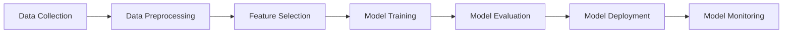
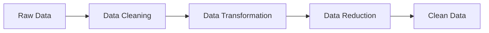
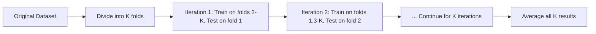
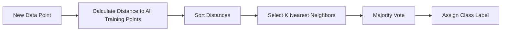
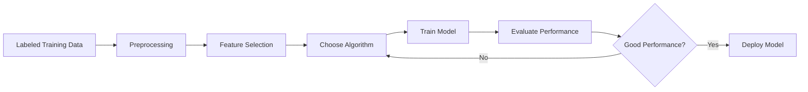
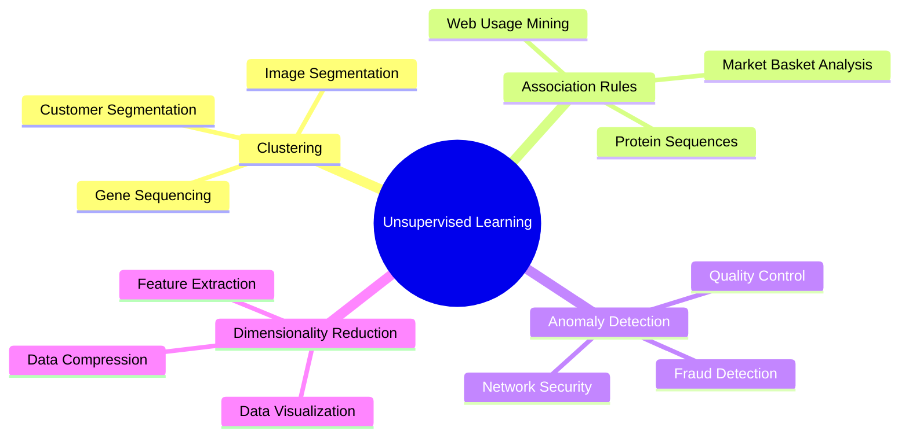
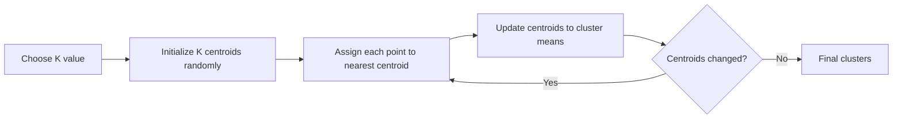
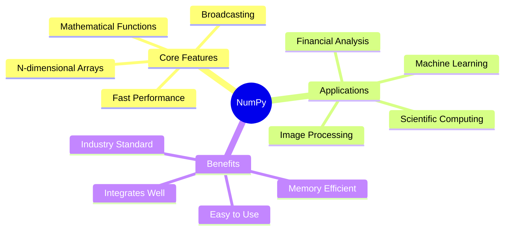
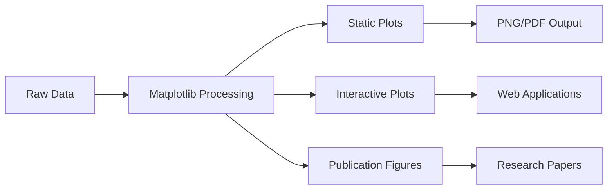

## Question 1(a) [3 marks]

**Describe human learning in brief.**

**Answer**:

Human learning is the process by which humans acquire knowledge, skills, and behaviors through experience, practice, and instruction.

**Table: Human Learning Process**

| Aspect | Description |
|--------|-------------|
| **Observation** | Gathering information from environment |
| **Experience** | Learning through trial and error |
| **Practice** | Repetition to improve skills |
| **Memory** | Storing and retrieving information |

- **Learning Types**: Visual, auditory, kinesthetic learning styles
- **Feedback Loop**: Humans learn from mistakes and successes
- **Adaptation**: Ability to apply knowledge to new situations

**Mnemonic**: "OEPMA" - Observe, Experience, Practice, Memory, Adapt

## Question 1(b) [4 marks]

**Differentiate: Supervised Learning v/s Unsupervised Learning**

**Answer**:

**Comparison Table: Supervised vs Unsupervised Learning**

| Parameter | Supervised Learning | Unsupervised Learning |
|-----------|--------------------|--------------------|
| **Training Data** | Labeled data (input-output pairs) | Unlabeled data (only inputs) |
| **Goal** | Predict output for new inputs | Find hidden patterns |
| **Examples** | Classification, Regression | Clustering, Association |
| **Feedback** | Direct feedback available | No direct feedback |

- **Supervised**: Teacher guides learning with correct answers
- **Unsupervised**: Self-discovery of patterns without guidance

**Mnemonic**: "SL-Labels, UL-Unknown" patterns

## Question 1(c) [7 marks]

**List out machine learning activities. Explain each in detail.**

**Answer**:

**Table: Machine Learning Activities**

| Activity | Purpose | Description |
|----------|---------|-------------|
| **Data Collection** | Gather raw data | Collecting relevant data from various sources |
| **Data Preprocessing** | Clean and prepare data | Handling missing values, normalization |
| **Feature Selection** | Choose important features | Selecting relevant attributes for learning |
| **Model Training** | Build learning model | Training algorithm on prepared dataset |
| **Model Evaluation** | Assess performance | Testing model accuracy and effectiveness |
| **Model Deployment** | Put model to use | Implementing model in real-world applications |

- **Iterative Process**: Activities repeat for model improvement
- **Quality Control**: Each step ensures better model performance

**Mnemonic**: "CPFTEDM" - Collect, Preprocess, Feature, Train, Evaluate, Deploy, Monitor

## Question 1(c OR) [7 marks]

**Find mean, median, and mode for the following data: 1, 1, 1, 2, 4, 5, 5, 6, 6, 7, 7, 7, 7, 8, 9, 10, 11**

**Answer**:

**Data Analysis Table**

| Statistic | Formula | Calculation | Result |
|-----------|---------|-------------|--------|
| **Mean** | Sum/Count | (1+1+1+2+4+5+5+6+6+7+7+7+7+8+9+10+11)/17 | 5.88 |
| **Median** | Middle value | 7th position in sorted data | 6 |
| **Mode** | Most frequent | Value appearing 4 times | 7 |

**Step-by-step calculation:**

- **Count**: 17 values
- **Sum**: 100
- **Mean**: 100/17 = 5.88
- **Median**: Middle position (9th) = 6
- **Mode**: 7 appears 4 times (highest frequency)

**Mnemonic**: "MMM" - Mean=Average, Median=Middle, Mode=Most frequent

## Question 2(a) [3 marks]

**Write down steps to use hold out method for model training.**

**Answer**:

**Hold Out Method Steps**

| Step | Action | Purpose |
|------|--------|---------|
| **1** | Split dataset (70-80% training, 20-30% testing) | Separate data for training and evaluation |
| **2** | Train model on training set | Build learning algorithm |
| **3** | Test model on testing set | Evaluate model performance |

- **Random Split**: Ensure representative distribution in both sets
- **No Overlap**: Testing data never used in training
- **Single Split**: One-time division of data

**Mnemonic**: "STT" - Split, Train, Test

## Question 2(b) [4 marks]

**Explain structure of confusion matrix.**

**Answer**:

**Confusion Matrix Structure**

|  | Predicted Positive | Predicted Negative |
|--|-------------------|-------------------|
| **Actual Positive** | True Positive (TP) | False Negative (FN) |
| **Actual Negative** | False Positive (FP) | True Negative (TN) |

**Components Explanation:**

- **TP**: Correctly predicted positive cases
- **TN**: Correctly predicted negative cases  
- **FP**: Incorrectly predicted as positive (Type I error)
- **FN**: Incorrectly predicted as negative (Type II error)

**Performance Metrics:**

- **Accuracy** = (TP+TN)/(TP+TN+FP+FN)
- **Precision** = TP/(TP+FP)

**Mnemonic**: "TPFN-FPTN" for matrix positions

## Question 2(c) [7 marks]

**Define data pre-processing. Explain various methods used in data pre-processing.**

**Answer**:

Data pre-processing is the technique of preparing raw data by cleaning, transforming, and organizing it for machine learning algorithms.

**Data Pre-processing Methods Table**

| Method | Purpose | Techniques |
|--------|---------|------------|
| **Data Cleaning** | Remove noise and inconsistencies | Handle missing values, remove duplicates |
| **Data Transformation** | Convert data format | Normalization, standardization |
| **Data Reduction** | Reduce dataset size | Feature selection, dimensionality reduction |
| **Data Integration** | Combine multiple sources | Merge datasets, resolve conflicts |

- **Missing Values**: Use mean, median, or mode for imputation
- **Outliers**: Detect and handle extreme values
- **Feature Scaling**: Normalize data to same scale

**Mnemonic**: "CTRI" - Clean, Transform, Reduce, Integrate

## Question 2(a OR) [3 marks]

**Explain histogram with suitable example.**

**Answer**:

A histogram is a graphical representation showing the frequency distribution of numerical data by dividing it into bins.

**Histogram Components Table**

| Component | Description |
|-----------|-------------|
| **X-axis** | Data ranges (bins) |
| **Y-axis** | Frequency of occurrence |
| **Bars** | Height represents frequency |

**Example**: Student marks distribution:

- Bins: 0-20, 21-40, 41-60, 61-80, 81-100
- Heights show number of students in each range

**Mnemonic**: "BAR" - Bins, Axes, Range

## Question 2(b OR) [4 marks]

**Relate the appropriate data type of following examples:**
**i) Gender of a person ii) Rank of students iii) Price of a home iv) Color of a flower**

**Answer**:

**Data Types Classification Table**

| Example | Data Type | Characteristics |
|---------|-----------|-----------------|
| **Gender of person** | Nominal Categorical | No natural order (Male/Female) |
| **Rank of students** | Ordinal Categorical | Has meaningful order (1st, 2nd, 3rd) |
| **Price of home** | Continuous Numerical | Can take any value within range |
| **Color of flower** | Nominal Categorical | No natural order (Red, Blue, Yellow) |

- **Categorical Data**: Limited set of distinct categories
- **Numerical Data**: Mathematical operations possible
- **Ordinal**: Categories with meaningful sequence

**Mnemonic**: "NOCO" - Nominal, Ordinal, Continuous

## Question 2(c OR) [7 marks]

**Describe K-fold cross validation in details.**

**Answer**:

K-fold cross validation is a model evaluation technique that divides dataset into K equal parts for robust performance assessment.

**K-fold Process Table**

| Step | Action | Purpose |
|------|--------|---------|
| **1** | Divide data into K equal folds | Create K subsets |
| **2** | Use K-1 folds for training | Train model |
| **3** | Use 1 fold for testing | Evaluate performance |
| **4** | Repeat K times | Each fold serves as test set once |
| **5** | Average all results | Get final performance metric |

**Advantages:**

- **Robust Evaluation**: Every data point used for both training and testing
- **Reduced Overfitting**: Multiple validation rounds
- **Better Generalization**: More reliable performance estimate

**Common Values**: K=5 or K=10 typically used

**Mnemonic**: "DURAT" - Divide, Use, Repeat, Average, Test

## Question 3(a) [3 marks]

**List out applications of regression.**

**Answer**:

**Regression Applications Table**

| Domain | Application | Purpose |
|--------|-------------|---------|
| **Finance** | Stock price prediction | Forecast market trends |
| **Healthcare** | Drug dosage calculation | Determine optimal treatment |
| **Marketing** | Sales forecasting | Predict revenue |
| **Real Estate** | Property valuation | Estimate house prices |

- **Predictive Modeling**: Forecasting continuous values
- **Trend Analysis**: Understanding relationships between variables
- **Risk Assessment**: Evaluating future outcomes

**Mnemonic**: "FHMR" - Finance, Healthcare, Marketing, Real estate

## Question 3(b) [4 marks]

**Write a short note on single linear regression.**

**Answer**:

Single linear regression models the relationship between one independent variable (X) and one dependent variable (Y) using a straight line.

**Linear Regression Components**

| Component | Formula | Description |
|-----------|---------|-------------|
| **Equation** | Y = a + bX | Linear relationship |
| **Slope (b)** | Change in Y / Change in X | Rate of change |
| **Intercept (a)** | Y-value when X=0 | Starting point |
| **Error** | Actual - Predicted | Difference from line |

- **Goal**: Find best-fit line minimizing errors
- **Method**: Least squares optimization
- **Assumption**: Linear relationship exists between variables

**Mnemonic**: "YABX" - Y equals a plus b times X

## Question 3(c) [7 marks]

**Write and discuss K-NN algorithm.**

**Answer**:

K-Nearest Neighbors (K-NN) is a lazy learning algorithm that classifies data points based on the majority class of their K nearest neighbors.

**K-NN Algorithm Steps**

| Step | Action | Description |
|------|--------|-------------|
| **1** | Choose K value | Select number of neighbors |
| **2** | Calculate distances | Find distance to all training points |
| **3** | Sort distances | Arrange in ascending order |
| **4** | Select K nearest | Choose K closest points |
| **5** | Majority voting | Assign most common class |

**Distance Metrics:**

- **Euclidean**: Most common distance measure
- **Manhattan**: Sum of absolute differences
- **Minkowski**: Generalized distance metric

**Advantages:**

- **Simple**: Easy to understand and implement
- **No Training**: Stores all data, no model building

**Disadvantages:**

- **Computationally Expensive**: Must check all points
- **Sensitive to K**: Performance depends on K value

**Mnemonic**: "CCSM" - Choose, Calculate, Sort, Majority vote

## Question 3(a OR) [3 marks]

**Write any three examples of supervised learning in the field of healthcare**

**Answer**:

**Healthcare Supervised Learning Examples**

| Application | Input | Output | Purpose |
|-------------|-------|--------|---------|
| **Disease Diagnosis** | Symptoms, test results | Disease type | Identify medical conditions |
| **Drug Response Prediction** | Patient data, genetics | Drug effectiveness | Personalized medicine |
| **Medical Image Analysis** | X-rays, MRI scans | Tumor detection | Early disease detection |

- **Pattern Recognition**: Learning from labeled medical data
- **Clinical Decision Support**: Assisting doctors in diagnosis
- **Predictive Medicine**: Forecasting health outcomes

**Mnemonic**: "DDM" - Diagnosis, Drug response, Medical imaging

## Question 3(b OR) [4 marks]

**Differentiate: Classification v/s Regression.**

**Answer**:

**Classification vs Regression Comparison**

| Aspect | Classification | Regression |
|--------|---------------|------------|
| **Output Type** | Discrete categories/classes | Continuous numerical values |
| **Goal** | Predict class labels | Predict numerical values |
| **Examples** | Email spam/not spam | House price prediction |
| **Evaluation** | Accuracy, Precision, Recall | MAE, MSE, R-squared |

- **Classification**: Predicts categories (Yes/No, Red/Blue/Green)
- **Regression**: Predicts quantities (Price, Temperature, Weight)
- **Algorithms**: Some work for both, others specialized

**Mnemonic**: "CLASS-Categories, REG-Real numbers"

## Question 3(c OR) [7 marks]

**Explain classification learning steps in details.**

**Answer**:

Classification learning involves training a model to assign input data to predefined categories or classes.

**Classification Learning Steps**

| Step | Process | Description |
|------|---------|-------------|
| **1** | Data Collection | Gather labeled training examples |
| **2** | Data Preprocessing | Clean and prepare data |
| **3** | Feature Selection | Choose relevant attributes |
| **4** | Model Selection** | Choose classification algorithm |
| **5** | Training | Learn from labeled data |
| **6** | Evaluation | Test model performance |
| **7** | Deployment | Use model for predictions |

**Key Concepts:**

- **Supervised Learning**: Requires labeled training data
- **Feature Engineering**: Transform raw data into useful features
- **Cross-validation**: Ensure model generalizes well
- **Performance Metrics**: Accuracy, precision, recall, F1-score

**Common Algorithms:**

- **Decision Trees**: Easy to interpret rules
- **SVM**: Effective for high-dimensional data
- **Neural Networks**: Handle complex patterns

**Mnemonic**: "DCFMTED" - Data, Clean, Features, Model, Train, Evaluate, Deploy

## Question 4(a) [3 marks]

**Differentiate: Clustering v/s Classification.**

**Answer**:

**Clustering vs Classification Comparison**

| Aspect | Clustering | Classification |
|--------|------------|----------------|
| **Learning Type** | Unsupervised | Supervised |
| **Training Data** | Unlabeled data | Labeled data |
| **Goal** | Find hidden groups | Predict known classes |
| **Output** | Group assignments | Class predictions |

- **Clustering**: Discovers unknown patterns in data
- **Classification**: Learns from known examples to predict new ones
- **Evaluation**: Clustering harder to evaluate than classification

**Mnemonic**: "CL-Unknown groups, CLASS-Known categories"

## Question 4(b) [4 marks]

**List out advantages and disadvantages of apriori algorithm.**

**Answer**:

**Apriori Algorithm Pros and Cons**

| Advantages | Disadvantages |
|------------|---------------|
| **Easy to understand** | **Computationally expensive** |
| **Finds all frequent itemsets** | **Multiple database scans** |
| **Well-established algorithm** | **Large memory requirements** |
| **Generates association rules** | **Poor scalability** |

**Advantages Details:**

- **Simplicity**: Straightforward logic and implementation
- **Completeness**: Finds all frequent patterns
- **Rule Generation**: Creates meaningful association rules

**Disadvantages Details:**

- **Performance**: Slow on large datasets
- **Memory**: Stores many candidate itemsets
- **Scalability**: Performance degrades with data size

**Mnemonic**: "EASY-SLOW" - Easy to use but slow performance

## Question 4(c) [7 marks]

**Write and explain applications of unsupervised learning.**

**Answer**:

Unsupervised learning discovers hidden patterns in data without labeled examples.

**Unsupervised Learning Applications**

| Domain | Application | Technique | Purpose |
|--------|-------------|-----------|---------|
| **Marketing** | Customer segmentation | Clustering | Group similar customers |
| **Retail** | Market basket analysis | Association rules | Find buying patterns |
| **Anomaly Detection** | Fraud detection | Outlier detection | Identify unusual behavior |
| **Data Compression** | Dimensionality reduction | PCA | Reduce data size |
| **Recommendation** | Content filtering | Clustering | Suggest similar items |

**Key Benefits:**

- **Pattern Discovery**: Reveals hidden structures
- **No Labels Required**: Works with raw data
- **Exploratory Analysis**: Understand data characteristics

**Common Techniques:**

- **K-means**: Partition data into clusters
- **Hierarchical Clustering**: Create cluster hierarchies
- **Apriori**: Find association rules

**Mnemonic**: "MRAD" - Marketing, Retail, Anomaly, Dimensionality

## Question 4(a OR) [3 marks]

**List out applications of apriori algorithm.**

**Answer**:

**Apriori Algorithm Applications**

| Domain | Application | Purpose |
|--------|-------------|---------|
| **Retail** | Market basket analysis | Find items bought together |
| **Web Mining** | Website usage patterns | Discover page visit sequences |
| **Bioinformatics** | Gene pattern analysis | Identify gene associations |

- **Association Rules**: "If A then B" relationships
- **Frequent Patterns**: Items appearing together often
- **Cross-selling**: Recommend related products

**Mnemonic**: "RWB" - Retail, Web, Bioinformatics

## Question 4(b OR) [4 marks]

**Define: Support and Confidence.**

**Answer**:

**Association Rule Metrics**

| Metric | Formula | Description | Range |
|--------|---------|-------------|-------|
| **Support** | Support(A) = Count(A) / Total transactions | How often itemset appears | 0 to 1 |
| **Confidence** | Confidence(A→B) = Support(A∪B) / Support(A) | How often rule is true | 0 to 1 |

**Support Example:**

- If itemset {Bread, Milk} appears in 3 out of 10 transactions
- Support = 3/10 = 0.3 (30%)

**Confidence Example:**

- Rule: "Bread → Milk"
- If {Bread, Milk} appears 3 times, Bread alone appears 5 times
- Confidence = 3/5 = 0.6 (60%)

**Mnemonic**: "SUP-How often, CONF-How reliable"

## Question 4(c OR) [7 marks]

**Write and explain K-means clustering approach in detail.**

**Answer**:

K-means clustering partitions data into K clusters by minimizing within-cluster sum of squares.

**K-means Algorithm Steps**

| Step | Action | Description |
|------|--------|-------------|
| **1** | Choose K | Select number of clusters |
| **2** | Initialize centroids | Place K points randomly |
| **3** | Assign points | Each point to nearest centroid |
| **4** | Update centroids | Calculate mean of assigned points |
| **5** | Repeat 3-4 | Until convergence |

**Algorithm Details:**

- **Distance Metric**: Usually Euclidean distance
- **Convergence**: When centroids stop moving significantly
- **Objective**: Minimize within-cluster sum of squares (WCSS)

**Advantages:**

- **Simple**: Easy to understand and implement
- **Efficient**: Linear time complexity
- **Scalable**: Works well with large datasets

**Disadvantages:**

- **K Selection**: Must choose K beforehand
- **Sensitive to Initialization**: Different starting points give different results
- **Assumes Spherical Clusters**: May not work with irregular shapes

**Choosing K:**

- **Elbow Method**: Plot WCSS vs K, look for "elbow"
- **Silhouette Analysis**: Measure cluster quality

**Mnemonic**: "CIAUR" - Choose K, Initialize, Assign, Update, Repeat

## Question 5(a) [3 marks]

**Give the difference between predictive model and descriptive model.**

**Answer**:

**Predictive vs Descriptive Models**

| Aspect | Predictive Model | Descriptive Model |
|--------|------------------|-------------------|
| **Purpose** | Forecast future outcomes | Explain current patterns |
| **Output** | Predictions/classifications | Insights/summaries |
| **Examples** | Sales forecasting, spam detection | Customer segmentation, trend analysis |

- **Predictive**: Uses historical data to predict future
- **Descriptive**: Analyzes existing data to understand patterns
- **Goal**: Prediction vs Understanding

**Mnemonic**: "PRED-Future, DESC-Present"

## Question 5(b) [4 marks]

**List out application of scikit-learn.**

**Answer**:

**Scikit-learn Applications**

| Category | Applications | Algorithms |
|----------|-------------|------------|
| **Classification** | Email filtering, image recognition | SVM, Random Forest, Naive Bayes |
| **Regression** | Price prediction, risk assessment | Linear Regression, Decision Trees |
| **Clustering** | Customer segmentation, data exploration | K-means, DBSCAN |
| **Preprocessing** | Data cleaning, feature scaling | StandardScaler, LabelEncoder |

- **Machine Learning Library**: Comprehensive Python toolkit
- **Easy Integration**: Works with NumPy, Pandas
- **Well-documented**: Extensive examples and tutorials

**Mnemonic**: "CRCP" - Classification, Regression, Clustering, Preprocessing

## Question 5(c) [7 marks]

**Explain features and applications of Numpy.**

**Answer**:

NumPy (Numerical Python) is the fundamental library for scientific computing in Python, providing support for large multi-dimensional arrays and mathematical functions.

**NumPy Features Table**

| Feature | Description | Benefit |
|---------|-------------|---------|
| **N-dimensional Arrays** | Powerful array objects | Efficient data storage |
| **Broadcasting** | Operations on different shaped arrays | Flexible computations |
| **Mathematical Functions** | Trigonometric, logarithmic, statistical | Complete math toolkit |
| **Performance** | Implemented in C/Fortran | Fast execution |
| **Memory Efficiency** | Contiguous memory layout | Reduced memory usage |

**NumPy Applications**

| Domain | Application | Purpose |
|--------|-------------|---------|
| **Machine Learning** | Data preprocessing, feature engineering | Handle numerical data |
| **Image Processing** | Image manipulation, filtering | Process pixel arrays |
| **Scientific Computing** | Numerical simulations, modeling | Mathematical computations |
| **Financial Analysis** | Portfolio optimization, risk modeling | Quantitative analysis |

**Key Capabilities:**

- **Array Operations**: Element-wise operations, slicing, indexing
- **Linear Algebra**: Matrix operations, eigenvalues, decompositions
- **Random Number Generation**: Statistical distributions, sampling
- **Fourier Transforms**: Signal processing, frequency analysis

**Integration:**

- **Pandas**: DataFrames built on NumPy arrays
- **Matplotlib**: Plotting NumPy arrays
- **Scikit-learn**: ML algorithms use NumPy arrays

**Mnemonic**: "NFAMS" - N-dimensional, Fast, Arrays, Math, Scientific

## Question 5(a OR) [3 marks]

**Write a short note on bagging**

**Answer**:

Bagging (Bootstrap Aggregating) is an ensemble method that improves model performance by training multiple models on different subsets of data.

**Bagging Process Table**

| Step | Process | Purpose |
|------|---------|---------|
| **Bootstrap Sampling** | Create multiple training sets | Generate diverse datasets |
| **Train Models** | Build model on each subset | Create multiple predictors |
| **Aggregate Results** | Combine predictions (voting/averaging) | Reduce overfitting |

- **Variance Reduction**: Reduces model variance through averaging
- **Parallel Training**: Models trained independently
- **Example**: Random Forest uses bagging with decision trees

**Mnemonic**: "BTA" - Bootstrap, Train, Aggregate

## Question 5(b OR) [4 marks]

**List out features of Pandas.**

**Answer**:

**Pandas Features**

| Feature | Description | Benefit |
|---------|-------------|---------|
| **DataFrame/Series** | Structured data containers | Easy data manipulation |
| **File I/O** | Read/write CSV, Excel, JSON | Handle various formats |
| **Data Cleaning** | Handle missing values, duplicates | Prepare clean data |
| **Grouping/Aggregation** | Group by operations, statistics | Analyze data patterns |

**Data Operations:**

- **Indexing**: Flexible data selection and filtering
- **Merging**: Combine datasets with joins
- **Reshaping**: Pivot tables and data transformation

**Mnemonic**: "DFIG" - DataFrame, File I/O, Indexing, Grouping

## Question 5(c OR) [7 marks]

**Explain features and applications of Matplotlib.**

**Answer**:

Matplotlib is a comprehensive 2D plotting library for Python that produces publication-quality figures in various formats and interactive environments.

**Matplotlib Features**

| Feature | Description | Capability |
|---------|-------------|------------|
| **Plot Types** | Line, bar, scatter, histogram, pie | Diverse visualization options |
| **Customization** | Colors, fonts, styles, layouts | Professional appearance |
| **Interactive Features** | Zoom, pan, widgets | Dynamic exploration |
| **Multiple Backends** | GUI, web, file output | Flexible deployment |
| **3D Plotting** | Surface, wireframe, scatter plots | Three-dimensional visualization |

**Matplotlib Applications**

| Domain | Application | Visualization Type |
|--------|-------------|-------------------|
| **Data Science** | Exploratory data analysis | Histograms, scatter plots |
| **Scientific Research** | Publication figures | Line plots, error bars |
| **Business Intelligence** | Dashboard creation | Bar charts, trend lines |
| **Machine Learning** | Model performance visualization | Confusion matrices, ROC curves |
| **Engineering** | Signal analysis | Time series, frequency plots |

**Key Components:**

- **Figure**: Top-level container for all plot elements
- **Axes**: Individual plots within a figure
- **Artist**: Everything drawn on figure (lines, text, etc.)
- **Backend**: Handles rendering to different outputs

**Plot Customization:**

- **Colors/Styles**: Wide range of visual options
- **Annotations**: Text labels, arrows, legends
- **Subplots**: Multiple plots in single figure
- **Layouts**: Grid arrangements, spacing control

**Integration Benefits:**

- **NumPy Arrays**: Direct plotting of numerical data
- **Pandas**: Built-in plotting methods
- **Jupyter Notebooks**: Inline plot display
- **Web Frameworks**: Embed plots in applications

**Output Formats:**

- **Raster**: PNG, JPEG for web use
- **Vector**: PDF, SVG for publications
- **Interactive**: HTML for web deployment

**Mnemonic**: "MVICS" - Multiple plots, Visualization, Interactive, Customizable, Scientific
