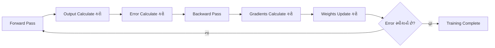
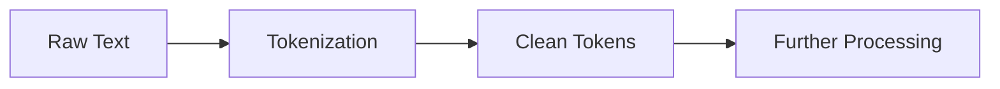
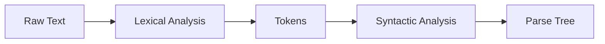
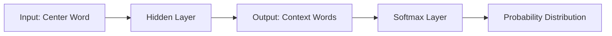
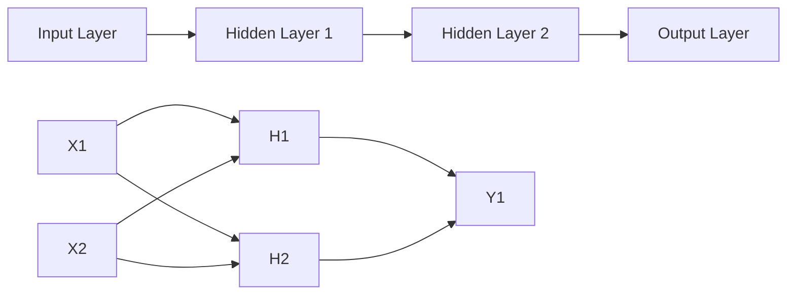
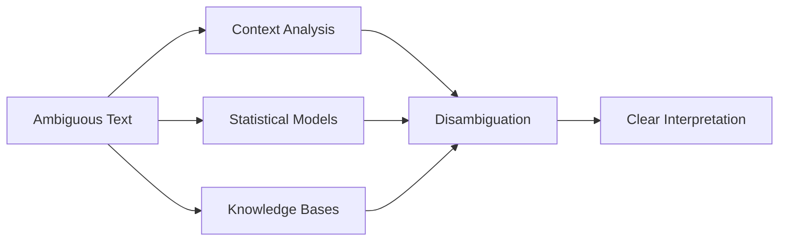
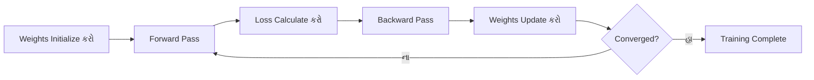
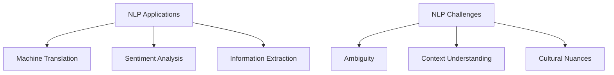

## પ્રશ્ન 1(અ) [3 ગુણ]

**Narrow AI અથવા Weak AI નો અર્થ શું છે?**

**જવાબ:**

**Narrow AI** અથવા **Weak AI** એ specific અને limited કાર્યો માટે બનાવેલ artificial intelligence systems છે.

**ટેબલ: Narrow AI ની લાક્ષણિકતાઓ**

| પાસું | વર્ણન |
|------|-------|
| **વ્યાપ્તિ** | ફક્ત specific કાર્યો માટે |
| **બુદ્ધિમત્તા** | કાર્ય-વિશિષ્ટ કુશળતા |
| **ઉદાહરણો** | Siri, chess programs, recommendation systems |
| **શીખવાની પ્રક્રિયા** | Domain માં pattern recognition |

**મેમરી ટ્રીક:** "Narrow = ફક્ત વિશિષ્ટ કાર્યો"

---

## પ્રશ્ન 1(બ) [4 ગુણ]

**વ્યાખ્યાયિત કરો: વર્ગીકરણ, રીગ્રેસન, ક્લસ્ટરિંગ, એસોસિએશન વિશ્લેષણ.**

**જવાબ:**

**ટેબલ: Machine Learning ની તકનીકો**

| તકનીક | વ્યાખ્યા | પ્રકાર | ઉદાહરણ |
|---------|---------|-------|---------|
| **વર્ગીકરણ (Classification)** | Discrete categories/classes predict કરે છે | Supervised | Email spam detection |
| **રીગ્રેસન (Regression)** | Continuous numerical values predict કરે છે | Supervised | House price prediction |
| **ક્લસ્ટરિંગ (Clustering)** | Similar data points ને group કરે છે | Unsupervised | Customer segmentation |
| **એસોસિએશન વિશ્લેષણ** | Variables વચ્ચે relationships શોધે છે | Unsupervised | Market basket analysis |

**મેમરી ટ્રીક:** "CRCA - Categories, Real numbers, Clusters, Associations"

---

## પ્રશ્ન 1(ક) [7 ગુણ]

**ન્યુરોનના ત્રણ મુખ્ય ઘટકોને પ્રકાશિત કરો.**

**જવાબ:**

Biological neuron ના ત્રણ મુખ્ય ઘટકો જે artificial neural networks ને inspire કરે છે:

**ડાયાગ્રામ:**

```goat
    Dendrites     Cell Body      Axon
        |            |           |
        v            v           v
    [Inputs] --> [Processing] --> [Output]
        |            |           |
    Receives     Integrates    Transmits
    signals      signals       signals
```

**ટેબલ: ન્યુરોન ઘટકો**

| ઘટક | કાર્ય | AI માં સમકક્ષ |
|-----|------|-------------|
| **Dendrites** | અન્ય neurons થી input signals receive કરે છે | Input layer/weights |
| **Cell Body (Soma)** | Signals ને process અને integrate કરે છે | Activation function |
| **Axon** | અન્ય neurons ને output signals transmit કરે છે | Output connections |

**મુખ્ય મુદ્દાઓ:**

- **Dendrites**: વિવિધ connection strengths સાથે input receivers તરીકે કામ કરે છે
- **Cell Body**: Inputs ને sum કરે છે અને threshold function apply કરે છે
- **Axon**: Processed signal ને આગળના neurons સુધી પહોંચાડે છે

**મેમરી ટ્રીક:** "DCA - Dendrites Collect, Cell-body Calculates, Axon Announces"

---

## પ્રશ્ન 1(ક) OR [7 ગુણ]

**Artificial Neural Network માં back propagation પદ્ધતિ સમજાવો.**

**જવાબ:**

**Back Propagation** એ supervised learning algorithm છે જે gradient descent દ્વારા error minimize કરીને multi-layer neural networks ને train કરે છે.

**ફ્લોચાર્ટ:**



**ટેબલ: Back Propagation Steps**

| સ્ટેપ | પ્રક્રિયા | ફોર્મ્યુલા |
|------|---------|----------|
| **Forward Pass** | Layer દ્વારા layer outputs calculate કરો | y = f(Σ(wi*xi + b)) |
| **Error Calculation** | Loss function compute કરો | E = ½(target - output)² |
| **Backward Pass** | Error gradients calculate કરો | δ = ∂E/∂w |
| **Weight Update** | Learning rate વાપરીને weights adjust કરો | w_new = w_old - η*δ |

**મુખ્ય લાક્ષણિકતાઓ:**

- **Gradient Descent**: Minimum error શોધવા માટે calculus વાપરે છે
- **Chain Rule**: Layers દ્વારા error ને backward propagate કરે છે
- **Learning Rate**: Weight updates ની speed control કરે છે

**મેમરી ટ્રીક:** "FEBU - Forward, Error, Backward, Update"

---

## પ્રશ્ન 2(અ) [3 ગુણ]

**Machine Learning માં ઉપયોગમાં લેવાતા કોઈપણ પાંચ લોકપ્રિય algorithms ની સૂચિ બનાવો.**

**જવાબ:**

**ટેબલ: લોકપ્રિય ML Algorithms**

| Algorithm | પ્રકાર | Application |
|-----------|--------|------------|
| **Linear Regression** | Supervised | Continuous values નું prediction |
| **Decision Tree** | Supervised | Classification અને regression |
| **K-Means Clustering** | Unsupervised | Data grouping |
| **Support Vector Machine** | Supervised | Margins સાથે classification |
| **Random Forest** | Supervised | Ensemble learning |

**મેમરી ટ્રીક:** "LDKSR - Learn Data, Keep Samples, Run"

---

## પ્રશ્ન 2(બ) [4 ગુણ]

**નિષ્ણાત સિસ્ટમ શું છે? તેની મર્યાદાઓ અને applications ની યાદી બનાવો.**

**જવાબ:**

**Expert System** એ AI program છે જે specific domains માં complex problems solve કરવા માટે human expert knowledge ને mimic કરે છે.

**ટેબલ: Expert System Overview**

| પાસું | વિગતો |
|------|--------|
| **વ્યાખ્યા** | Domain-specific expertise સાથે AI system |
| **ઘટકો** | Knowledge base, inference engine, user interface |

**Applications:**

- **Medical Diagnosis**: રોગ identification systems
- **Financial Planning**: Investment advisory systems
- **Fault Diagnosis**: Equipment troubleshooting

**મર્યાદાઓ:**

- **Limited Domain**: ફક્ત specific areas માં કામ કરે છે
- **Knowledge Acquisition**: Expert knowledge extract કરવું મુશ્કેલ
- **Maintenance**: Rules update અને modify કરવા મુશ્કેલ

**મેમરી ટ્રીક:** "EXPERT - Explains Problems, Executes Rules, Tests"

---

## પ્રશ્ન 2(ક) [7 ગુણ]

**ટોકનાઇઝેશન શું છે? યોગ્ય ઉદાહરણ સાથે સમજાવો.**

**જવાબ:**

**Tokenization** એ text ને smaller units (tokens) માં break down કરવાની process છે NLP processing માટે.

**ટેબલ: Tokenization ના પ્રકારો**

| પ્રકાર | વર્ણન | ઉદાહરણ |
|------|-------|---------|
| **Word Tokenization** | Words દ્વારા split કરે છે | "Hello world" → ["Hello", "world"] |
| **Sentence Tokenization** | Sentences દ્વારા split કરે છે | "Hi. How are you?" → ["Hi.", "How are you?"] |
| **Subword Tokenization** | Subwords માં split કરે છે | "unhappy" → ["un", "happy"] |

**Code ઉદાહરણ:**

```python
import nltk
text = "Natural Language Processing is amazing!"
tokens = nltk.word_tokenize(text)
# Output: ['Natural', 'Language', 'Processing', 'is', 'amazing', '!']
```

**Process Flow:**



**મુખ્ય ફાયદા:**

- **Standardization**: Text ને uniform format માં convert કરે છે
- **Analysis Ready**: ML algorithms માટે text prepare કરે છે
- **Feature Extraction**: Statistical analysis enable કરે છે

**મેમરી ટ્રીક:** "TOKEN - Text Operations Keep Everything Normalized"

---

## પ્રશ્ન 2(અ) OR [3 ગુણ]

**સુપરવાઇઝ્ડ અને અનસુપરવાઇઝ્ડ લર્નિંગની સરખામણી કરો.**

**જવાબ:**

**ટેબલ: Supervised vs Unsupervised Learning**

| પાસું | Supervised Learning | Unsupervised Learning |
|------|-------------------|---------------------|
| **Training Data** | Target outputs સાથે labeled data | Targets વિના unlabeled data |
| **લક્ષ્ય** | Specific outcomes predict કરવા | Hidden patterns discover કરવા |
| **ઉદાહરણો** | Classification, Regression | Clustering, Association rules |
| **મૂલ્યાંકન** | Accuracy, precision, recall | Silhouette score, elbow method |
| **Applications** | Email spam, price prediction | Customer segmentation, anomaly detection |

**મેમરી ટ્રીક:** "SU - Supervised Uses labels, Unsupervised Uncovers patterns"

---

## પ્રશ્ન 2(બ) OR [4 ગુણ]

**હેલ્થકેર, ફાઇનાન્સ અને મેન્યુફેક્ચરિંગમાં AI applications વિશે બધું સમજાવો.**

**જવાબ:**

**ટેબલ: Industry પ્રમાણે AI Applications**

| Industry | Applications | ફાયદા |
|----------|-------------|-------|
| **Healthcare** | Medical imaging, drug discovery, diagnosis | Improved accuracy, faster treatment |
| **Finance** | Fraud detection, algorithmic trading, credit scoring | Risk reduction, automated decisions |
| **Manufacturing** | Quality control, predictive maintenance, robotics | Efficiency, cost reduction |

**Healthcare ઉદાહરણો:**

- **Medical Imaging**: X-rays અને MRIs માં AI cancer detect કરે છે
- **Drug Discovery**: AI નવી medicine development ને accelerate કરે છે

**Finance ઉદાહરણો:**

- **Fraud Detection**: Real-time transaction monitoring
- **Robo-advisors**: Automated investment management

**Manufacturing ઉદાહરણો:**

- **Quality Control**: Automated defect detection
- **Predictive Maintenance**: Equipment failure prediction

**મેમરી ટ્રીક:** "HFM - Health, Finance, Manufacturing benefit from AI"

---

## પ્રશ્ન 2(ક) OR [7 ગુણ]

**સિન્ટેક્ટિક વિશ્લેષણ શું છે અને તે લેક્સિકલ વિશ્લેષણથી કેવી રીતે અલગ છે?**

**જવાબ:**

**Syntactic Analysis** sentences ના grammatical structure ને examine કરે છે, જ્યારે **Lexical Analysis** text ને meaningful tokens માં break કરે છે.

**ટેબલ: Lexical vs Syntactic Analysis**

| પાસું | Lexical Analysis | Syntactic Analysis |
|------|-----------------|-------------------|
| **હેતુ** | Text ને words માં tokenize કરવા | Grammatical structure parse કરવા |
| **Input** | Raw text | Lexical analysis થી tokens |
| **Output** | Tokens, part-of-speech tags | Parse trees, grammar rules |
| **ધ્યાન** | Individual words | Sentence structure |
| **ઉદાહરણ** | "The cat runs" → [The, cat, runs] | Noun-verb relationship દર્શાવતું parse tree બનાવે છે |

**Process Flow:**



**ઉદાહરણ:**

- **Lexical**: "She reads books" → ["She", "reads", "books"]
- **Syntactic**: "She" ને subject, "reads" ને verb, "books" ને object તરીકે identify કરે છે

**મુખ્ય તફાવતો:**

- **Scope**: Lexical words પર કામ કરે છે, Syntactic sentence structure પર
- **જટિલતા**: Syntactic analysis lexical કરતાં વધુ complex છે
- **Dependencies**: Syntactic analysis lexical analysis પર depend કરે છે

**મેમરી ટ્રીક:** "LEX-SYN: LEXical extracts, SYNtactic structures"

---

## પ્રશ્ન 3(અ) [3 ગુણ]

**પ્રતિક્રિયાશીલ મશીનોની વિવિધ લાક્ષણિકતાઓની યાદી બનાવો.**

**જવાબ:**

**ટેબલ: Reactive Machines ની લાક્ષણિકતાઓ**

| લાક્ષણિકતા | વર્ણન |
|------------|-------|
| **કોઈ મેમરી નથી** | Past experiences store કરી શકતા નથી |
| **વર્તમાન-કેન્દ્રિત** | ફક્ત current input ને respond કરે છે |
| **નિર્ધારિત** | Same input માટે same output આપે છે |
| **કાર્ય-વિશિષ્ટ** | Particular functions માટે design કરેલ |
| **કોઈ શીખવું નથી** | Experience થી improve કરી શકતા નથી |

**ઉદાહરણો:**

- **Deep Blue**: IBM નું chess computer
- **Game AI**: Tic-tac-toe programs

**મેમરી ટ્રીક:** "REACT - Responds Exactly, Always Consistent Tasks"

---

## પ્રશ્ન 3(બ) [4 ગુણ]

**તફાવત કરો: હકારાત્મક મજબૂતીકરણ v/s નકારાત્મક મજબૂતીકરણ**

**જવાબ:**

**ટેબલ: Positive vs Negative Reinforcement**

| પાસું | Positive Reinforcement | Negative Reinforcement |
|------|----------------------|----------------------|
| **વ્યાખ્યા** | Good behavior માટે reward add કરવું | Good behavior માટે penalty remove કરવું |
| **Action** | કંઈક desirable આપવું | કંઈક undesirable દૂર કરવું |
| **લક્ષ્ય** | Desired behavior increase કરવું | Desired behavior increase કરવું |
| **ઉદાહરણ** | Correct answer માટે treat આપવું | Good performance માટે extra work દૂર કરવું |

**ડાયાગ્રામ:**

```goat
Positive Reinforcement:     Negative Reinforcement:
Good Behavior               Good Behavior
     +                           +
Add Reward                 Remove Penalty
     =                           =
Behavior Increases         Behavior Increases
```

**મુખ્ય મુદ્દાઓ:**

- **બંને behavior increase કરે છે** પરંતુ વિવિધ mechanisms દ્વારા
- **Positive કંઈક pleasant add કરે છે**
- **Negative કંઈક unpleasant remove કરે છે**

**મેમરી ટ્રીક:** "PN - Positive adds Nice things, Negative removes Nasty things"

---

## પ્રશ્ન 3(ક) [7 ગુણ]

**ટર્મ-ફ્રીક્વન્સી-ઇનવર્સ ડોક્યુમેન્ટ ફ્રીક્વન્સી (TF-IDF) word embedding technique વિશે બધું સમજાવો.**

**જવાબ:**

**TF-IDF** એ numerical statistic છે જે documents ના collection માં કોઈ document માટે word કેટલું important છે તે reflect કરે છે.

**ફોર્મ્યુલા:**

```
TF-IDF = TF(t,d) × IDF(t)
જ્યાં:
TF(t,d) = (Document d માં term t કેટલી વાર આવે છે) / (Document d માં total terms)
IDF(t) = log((Total documents) / (Term t ધરાવતા documents))
```

**ટેબલ: TF-IDF ઘટકો**

| ઘટક | ફોર્મ્યુલા | હેતુ |
|-----|-----------|-----|
| **Term Frequency (TF)** | tf(t,d) = count(t,d) / |d| | Document માં word frequency measure કરે છે |
| **Inverse Document Frequency (IDF)** | idf(t) = log(N / df(t)) | Corpus માં word importance measure કરે છે |
| **TF-IDF Score** | tf-idf(t,d) = tf(t,d) × idf(t) | Final word importance score |

**ઉદાહરણ Calculation:**

- Document: "cat sat on mat"
- Term: "cat"
- TF = 1/4 = 0.25
- જો "cat" 10 માંથી 2 documents માં આવે છે: IDF = log(10/2) = 0.699
- TF-IDF = 0.25 × 0.699 = 0.175

**Applications:**

- **Information Retrieval**: Search engines
- **Text Mining**: Document similarity
- **Feature Extraction**: ML preprocessing

**ફાયદા:**

- **Common words ને low scores મળે છે** (the, and, is)
- **Rare પરંતુ important words ને high scores મળે છે**
- **સરળ અને અસરકારક** text analysis માટે

**મેમરી ટ્રીક:** "TF-IDF - Term Frequency × Inverse Document Frequency"

---

## પ્રશ્ન 3(અ) OR [3 ગુણ]

**ફઝી લોજિક સિસ્ટમ્સ વ્યાખ્યાયિત કરો. તેના મુખ્ય ઘટકોની ચર્ચા કરો.**

**જવાબ:**

**Fuzzy Logic Systems** uncertainty અને partial truth handle કરે છે, completely true અને completely false વચ્ચે values allow કરે છે.

**ટેબલ: Fuzzy Logic ઘટકો**

| ઘટક | કાર્ય | ઉદાહરણ |
|-----|------|---------|
| **Fuzzifier** | Crisp inputs ને fuzzy sets માં convert કરે છે | Temperature 75°F → "Warm" (0.7) |
| **Rule Base** | If-then fuzzy rules ધરાવે છે | IF temp is warm THEN fan is medium |
| **Inference Engine** | Inputs પર fuzzy rules apply કરે છે | Multiple rules combine કરે છે |
| **Defuzzifier** | Fuzzy output ને crisp value માં convert કરે છે | "Medium speed" → 60% fan speed |

**મુખ્ય લાક્ષણિકતાઓ:**

- **Membership Functions**: Belonging ની degree (0 થી 1)
- **Linguistic Variables**: Human-like terms (hot, cold, warm)
- **Fuzzy Rules**: Fuzzy conditions સાથે IF-THEN statements

**મેમરી ટ્રીક:** "FRID - Fuzzifier, Rules, Inference, Defuzzifier"

---

## પ્રશ્ન 3(બ) OR [4 ગુણ]

**મજબૂતીકરણ શિક્ષણના ઘટકો સમજાવો: નીતિ, પુરસ્કાર સંકેત, મૂલ્ય કાર્ય, મોડેલ**

**જવાબ:**

**ટેબલ: Reinforcement Learning ઘટકો**

| ઘટક | વ્યાખ્યા | હેતુ |
|-----|---------|-----|
| **Policy (નીતિ)** | Actions select કરવાની strategy | Agent ના behavior ને define કરે છે |
| **Reward Signal (પુરસ્કાર સંકેત)** | Environment તરફથી feedback | Good/bad actions indicate કરે છે |
| **Value Function (મૂલ્ય કાર્ય)** | Expected future rewards | Long-term benefit estimate કરે છે |
| **Model (મોડેલ)** | Environment નું agent representation | Next state અને reward predict કરે છે |

**વિગતવાર સમજૂતી:**

**Policy (π):**

- **Deterministic**: π(s) = a (એક state માટે એક action)
- **Stochastic**: π(a|s) = state s માં action a ની probability

**Reward Signal (R):**

- Environment તરફથી **immediate feedback**
- Good actions માટે **positive**, bad actions માટે **negative**

**Value Function (V):**

- **State Value**: V(s) = state s થી expected return
- **Action Value**: Q(s,a) = state s માં action a થી expected return

**Model:**

- **Transition Model**: P(s'|s,a) = next state ની probability
- **Reward Model**: R(s,a,s') = expected reward

**મેમરી ટ્રીક:** "PRVM - Policy chooses, Reward judges, Value estimates, Model predicts"

---

## પ્રશ્ન 3(ક) OR [7 ગુણ]

**તફાવત કરો: આવૃત્તિ-આધારિત v/s આગાહી-આધારિત word embedding તકનીકો.**

**જવાબ:**

**ટેબલ: Frequency-based vs Prediction-based Word Embeddings**

| પાસું | Frequency-based | Prediction-based |
|------|----------------|------------------|
| **Approach** | Count-based statistics | Neural network prediction |
| **ઉદાહરણો** | TF-IDF, Co-occurrence Matrix | Word2Vec, GloVe |
| **Computation** | Matrix factorization | Gradient descent |
| **Context** | Global statistics | Local context windows |
| **Scalability** | Matrix size દ્વારા limited | Vocabulary સાથે scales |
| **Quality** | Basic semantic relationships | Rich semantic relationships |

**Frequency-based Methods:**

- **TF-IDF**: Term frequency × Inverse document frequency
- **Co-occurrence Matrix**: Word pair frequency counts
- **LSA**: SVD વાપરીને Latent Semantic Analysis

**Prediction-based Methods:**

- **Word2Vec**: Skip-gram અને CBOW models
- **GloVe**: Global Vectors for Word Representation
- **FastText**: Subword information inclusion

**Code Comparison:**

```python
# Frequency-based (TF-IDF)
from sklearn.feature_extraction.text import TfidfVectorizer
vectorizer = TfidfVectorizer()
tfidf_matrix = vectorizer.fit_transform(documents)

# Prediction-based (Word2Vec)
from gensim.models import Word2Vec
model = Word2Vec(sentences, vector_size=100, window=5)
```

**ફાયદા:**

**Frequency-based:**

- **સરળ** અને interpretable
- Small datasets માટે **ઝડપી** computation
- Basic similarity tasks માટે **સારું**

**Prediction-based:**

- **Dense** vector representations
- **બહેતર** semantic relationships
- Large vocabularies માટે **scalable**

**મેમરી ટ્રીક:** "FP - Frequency counts, Prediction learns"

---

## પ્રશ્ન 4(અ) [3 ગુણ]

**પ્રતિક્રિયાશીલ મશીનની મુખ્ય લાક્ષણિકતાઓની યાદી બનાવો.**

**જવાબ:**

**ટેબલ: Reactive Machine મુખ્ય લાક્ષણિકતાઓ**

| લાક્ષણિકતા | વર્ણન |
|------------|-------|
| **Stateless** | Past interactions ની કોઈ memory નથી |
| **Reactive** | ફક્ત current inputs ને respond કરે છે |
| **Deterministic** | Same inputs માટે consistent outputs |
| **Specialized** | Specific tasks માટે designed |
| **Real-time** | Stimuli ને immediate response |

**ઉદાહરણો:**

- **Deep Blue**: Chess-playing computer
- **Google AlphaGo**: Go-playing system (early version)

**મેમરી ટ્રીક:** "SRDSR - Stateless, Reactive, Deterministic, Specialized, Real-time"

---

## પ્રશ્ન 4(બ) [4 ગુણ]

**વિવિધ પૂર્વ-પ્રોસેસિંગ તકનીકોની સૂચિ બનાવો. તેમાંથી કોઈપણ એકને python code વડે સમજાવો.**

**જવાબ:**

**ટેબલ: Text Pre-processing તકનીકો**

| તકનીક | હેતુ | ઉદાહરણ |
|---------|-----|---------|
| **Tokenization** | Text ને words માં split કરવું | "Hello world" → ["Hello", "world"] |
| **Stop Word Removal** | Common words remove કરવા | "the", "and", "is" remove કરવા |
| **Stemming** | Words ને root form માં reduce કરવા | "running" → "run" |
| **Lemmatization** | Dictionary form માં convert કરવા | "better" → "good" |

**Stemming સમજૂતી:**
Stemming suffixes remove કરીને words ને root form માં reduce કરે છે.

**Stemming માટે Python Code:**

```python
import nltk
from nltk.stem import PorterStemmer

# Stemmer initialize કરો
stemmer = PorterStemmer()

# Example words
words = ["running", "flies", "dogs", "churches", "studying"]

# Stemming apply કરો
stemmed_words = [stemmer.stem(word) for word in words]
print(stemmed_words)
# Output: ['run', 'fli', 'dog', 'church', 'studi']
```

**Stemming ના ફાયદા:**

- ML models માટે **vocabulary size reduce કરે છે**
- Related words ને **together group કરે છે**
- Text analysis efficiency **improve કરે છે**

**મેમરી ટ્રીક:** "TSSL - Tokenize, Stop-words, Stem, Lemmatize"

---

## પ્રશ્ન 4(ક) [7 ગુણ]

**Word2vec તકનીકને વિગતવાર પ્રકાશિત કરો.**

**જવાબ:**

**Word2Vec** એ neural network-based તકનીક છે જે context predict કરીને words ના dense vector representations શીખે છે.

**ટેબલ: Word2Vec Architectures**

| Architecture | Approach | Input | Output |
|-------------|----------|-------|--------|
| **Skip-gram** | Center word થી context predict કરે છે | Center word | Context words |
| **CBOW** | Context થી center word predict કરે છે | Context words | Center word |

**Skip-gram Model:**



**Training Process:**

1. **Sliding Window**: Text પર window move કરો
2. **Word Pairs**: (center, context) pairs બનાવો
3. **Neural Network**: Context predict કરવા માટે train કરો
4. **Weight Matrix**: Word vectors extract કરો

**મુખ્ય લાક્ષણિકતાઓ:**

- **Vector Size**: સામાન્ય રીતે 100-300 dimensions
- **Window Size**: Context range (સામાન્ય રીતે 5-10 words)
- **Negative Sampling**: Efficient training method
- **Hierarchical Softmax**: Softmax નો alternative

**Mathematical Concept:**

```
Objective = max Σ log P(context|center)
જ્યાં P(context|center) = exp(v_context · v_center) / Σ exp(v_w · v_center)
```

**Applications:**

- **Similarity**: Similar words શોધવા
- **Analogies**: King - Man + Woman = Queen
- **Clustering**: Semantic categories group કરવા
- **Feature Engineering**: ML input features

**ફાયદા:**

- **Dense Representations**: Rich semantic information
- **Semantic Relationships**: Word meanings capture કરે છે
- **Arithmetic Properties**: Vector operations make sense

**મેમરી ટ્રીક:** "W2V - Words to Vectors via neural networks"

---

## પ્રશ્ન 4(અ) OR [3 ગુણ]

**નેચરલ લેંગ્વેજ પ્રોસેસિંગની કોઈપણ ચાર applications ની યાદી બનાવો. સ્પામ શોધને વિગતવાર સમજાવો.**

**જવાબ:**

**ટેબલ: NLP Applications**

| Application | વર્ણન |
|-------------|-------|
| **Spam Detection** | Unwanted emails identify કરવા |
| **Sentiment Analysis** | Emotional tone determine કરવા |
| **Machine Translation** | Languages વચ્ચે translate કરવા |
| **Chatbots** | Automated conversation systems |

**Spam Detection વિગતો:**

**Process:**

1. **Feature Extraction**: Email text ને numerical features માં convert કરો
2. **Classification**: ML algorithms વાપરીને classify કરો
3. **Decision**: Spam અથવા legitimate તરીકે mark કરો

**વપરાયેલા Features:**

- **Word Frequency**: Spam keywords count
- **Email Headers**: Sender information
- **URL Analysis**: Suspicious links
- **Text Patterns**: ALL CAPS, excessive punctuation

**Machine Learning Approach:**

```python
# Simplified spam detection
from sklearn.feature_extraction.text import TfidfVectorizer
from sklearn.naive_bayes import MultinomialNB

# Emails ને features માં convert કરો
vectorizer = TfidfVectorizer()
X = vectorizer.fit_transform(email_texts)

# Classifier train કરો
classifier = MultinomialNB()
classifier.fit(X, labels)  # labels: 0=legitimate, 1=spam
```

**મેમરી ટ્રીક:** "SMTP - Spam, Machine Translation, Sentiment, Phishing detection"

---

## પ્રશ્ન 4(બ) OR [4 ગુણ]

**પ્રવચન સંકલન અને વ્યવહારિક વિશ્લેષણ વિશે સમજાવો.**

**જવાબ:**

**ટેબલ: Discourse Integration vs Pragmatic Analysis**

| પાસું | Discourse Integration | Pragmatic Analysis |
|------|---------------------|-------------------|
| **ધ્યાન** | Text coherence અને structure | Context અને intention |
| **વ્યાપ્તિ** | Multiple sentences/paragraphs | Speaker નો intended meaning |
| **ઘટકો** | Anaphora, cataphora, connectives | Implicature, speech acts |
| **લક્ષ્ય** | Text flow understand કરવું | Real meaning understand કરવું |

**Discourse Integration:**

- **Anaphora Resolution**: "John went to store. He bought milk." (He = John)
- **Cataphora**: "Before he left, John locked the door."
- **Coherence**: Sentences વચ્ચે logical flow
- **Cohesion**: Grammatical connections

**Pragmatic Analysis:**

- **Speech Acts**: Commands, requests, promises
- **Implicature**: Literal કરતાં implied meanings
- **Context Dependency**: Same words, different meanings
- **Intention Recognition**: Speaker ખરેખર શું mean કરે છે

**ઉદાહરણો:**

**Discourse Integration:**

```
Text: "Mary owns a car. The vehicle is red."
Resolution: "vehicle" refers to "car"
```

**Pragmatic Analysis:**

```
Statement: "Can you pass the salt?"
Literal: Ability વિશે question
Pragmatic: Salt pass કરવાની request
```

**મેમરી ટ્રીક:** "DP - Discourse connects, Pragmatics interprets context"

---

## પ્રશ્ન 4(ક) OR [7 ગુણ]

**બેગ ઓફ વર્ડ્સ word embedding technique વિશે વિગતવાર ચર્ચા કરો.**

**જવાબ:**

**Bag of Words (BoW)** એ simple text representation method છે જે documents ને unordered collections of words તરીકે treat કરે છે.

**ટેબલ: BoW Process**

| સ્ટેપ | વર્ણન | ઉદાહરણ |
|------|-------|---------|
| **Vocabulary Creation** | બધા unique words collect કરો | ["cat", "sat", "mat", "dog"] |
| **Vector Creation** | Word occurrences count કરો | [1, 1, 1, 0] for "cat sat mat" |
| **Document Representation** | દરેક document vector બને છે | Multiple documents → Matrix |

**ઉદાહરણ:**

```
Documents:
1. "The cat sat on the mat"
2. "The dog ran in the park"

Vocabulary: [the, cat, sat, on, mat, dog, ran, in, park]

Document Vectors:
Doc1: [2, 1, 1, 1, 1, 0, 0, 0, 0]
Doc2: [2, 0, 0, 0, 0, 1, 1, 1, 1]
```

**Python Implementation:**

```python
from sklearn.feature_extraction.text import CountVectorizer

documents = [
    "The cat sat on the mat",
    "The dog ran in the park"
]

vectorizer = CountVectorizer()
bow_matrix = vectorizer.fit_transform(documents)
vocab = vectorizer.get_feature_names_out()

print("Vocabulary:", vocab)
print("BoW Matrix:", bow_matrix.toarray())
```

**ફાયદા:**

- **સરળતા**: Understand અને implement કરવા માટે સરળ
- **Interpretability**: Clear word-count relationship
- **અસરકારકતા**: ઘણા tasks માટે સારું કામ કરે છે

**ગેરફાયદા:**

- **કોઈ Word Order નથી**: "cat sat mat" = "mat sat cat"
- **Sparse Vectors**: Large vocabularies માં ઘણા zeros
- **કોઈ Semantics નથી**: Word meanings ની કોઈ understanding નથી
- **High Dimensionality**: Vocabulary size સાથે scales

**વિવિધતાઓ:**

- **Binary BoW**: Word present હોય તો 1, absent હોય તો 0
- **TF-IDF BoW**: Term frequency × Inverse document frequency
- **N-gram BoW**: Word sequences consider કરે છે

**Applications:**

- **Document Classification**: Spam detection
- **Information Retrieval**: Search engines
- **Text Clustering**: Similar documents group કરવા
- **Feature Engineering**: ML models માટે input

**મેમરી ટ્રીક:** "BOW - Bag Of Words counts occurrences"

---

## પ્રશ્ન 5(અ) [3 ગુણ]

**ન્યુરલ નેટવર્કમાં સક્રિયકરણ કાર્યોની ભૂમિકા શું છે?**

**જવાબ:**

**ટેબલ: Activation Function ભૂમિકાઓ**

| ભૂમિકા | વર્ણન |
|-------|-------|
| **બિન-રેખીયતા (Non-linearity)** | Complex patterns શીખવાને enable કરે છે |
| **આઉટપુટ નિયંત્રણ** | Neuron firing threshold determine કરે છે |
| **Gradient Flow** | Backpropagation efficiency ને affect કરે છે |
| **રેન્જ મર્યાદા** | Output values ને bounds કરે છે |

**મુખ્ય કાર્યો:**

- **Decision Making**: Neuron activate થવો જોઈએ કે નહીં
- **Pattern Recognition**: Complex decision boundaries enable કરે છે
- **Signal Processing**: Weighted inputs ને transform કરે છે

**સામાન્ય Activation Functions:**

- **ReLU**: f(x) = max(0, x) - સરળ અને efficient
- **Sigmoid**: f(x) = 1/(1 + e^-x) - Smooth probability output
- **Tanh**: f(x) = (e^x - e^-x)/(e^x + e^-x) - Zero-centered

**મેમરી ટ્રીક:** "NOGL - Non-linearity, Output control, Gradient flow, Limiting range"

---

## પ્રશ્ન 5(બ) [4 ગુણ]

**ન્યુરલ નેટવર્કના આર્કિટેક્ચરનું વિગતવાર વર્ણન કરો.**

**જવાબ:**

**ટેબલ: Neural Network Architecture ઘટકો**

| ઘટક | કાર્ય | ઉદાહરણ |
|-----|------|---------|
| **Input Layer** | Input data receive કરે છે | Features/pixels |
| **Hidden Layers** | Information process કરે છે | Pattern recognition |
| **Output Layer** | Final result produce કરે છે | Classification/prediction |
| **Connections** | Layers વચ્ચે neurons ને link કરે છે | Weighted edges |

**Architecture ડાયાગ્રામ:**



**Layer વિગતો:**

- **Input Layer**: Neurons ની સંખ્યા = features ની સંખ્યા
- **Hidden Layers**: Variable neurons, complexity માટે multiple layers
- **Output Layer**: Neurons ની સંખ્યા = classes/outputs ની સંખ્યા

**Information Flow:**

1. **Forward Pass**: Input → Hidden → Output
2. **Weighted Sum**: Σ(wi × xi + bias)
3. **Activation**: Activation function apply કરો
4. **Output**: Final prediction/classification

**મેમરી ટ્રીક:** "IHOC - Input, Hidden, Output, Connections"

---

## પ્રશ્ન 5(ક) [7 ગુણ]

**નેચરલ લેંગ્વેજ પ્રોસેસિંગમાં અસ્પષ્ટતાના પ્રકારોની યાદી બનાવો અને સમજાવો.**

**જવાબ:**

**Ambiguity** NLP માં ત્યારે થાય છે જ્યારે text ના multiple possible interpretations હોય છે, જે automatic understanding ને challenging બનાવે છે.

**ટેબલ: NLP Ambiguities ના પ્રકારો**

| પ્રકાર | વ્યાખ્યા | ઉદાહરણ | ઉકેલ |
|------|---------|---------|------|
| **Lexical** | Word ના multiple meanings | "Bank" (river/financial) | Context analysis |
| **Syntactic** | Multiple parse structures | "I saw her duck" | Grammar rules |
| **Semantic** | Multiple sentence meanings | "Visiting relatives can be boring" | Semantic analysis |
| **Pragmatic** | Context-dependent meaning | "Can you pass salt?" | Intent recognition |
| **Referential** | Unclear pronoun reference | "John told Bill he was late" | Anaphora resolution |

**વિગતવાર સમજૂતીઓ:**

**Lexical Ambiguity:**

- **Homonyms**: Same spelling, different meanings
- ઉદાહરણ: "I went to the bank" (financial institution vs. river bank)
- **ઉકેલ**: Context વાપરીને word sense disambiguation

**Syntactic Ambiguity:**

- **Multiple Parse Trees**: Same sentence, different structures
- ઉદાહરણ: "I saw the man with the telescope"
  - મેં telescope વાપરીને man જોયો
  - મેં telescope વાળા man ને જોયો
- **ઉકેલ**: Statistical parsing, grammar preferences

**Semantic Ambiguity:**

- **Multiple Interpretations**: Same structure, different meanings
- ઉદાહરણ: "Visiting relatives can be boring"
  - Relatives ને visit કરવા જવું boring છે
  - Visit કરવા આવતા relatives boring છે
- **ઉકેલ**: Semantic role labeling

**Pragmatic Ambiguity:**

- **Context-dependent**: Situation પર meaning depend કરે છે
- ઉદાહરણ: "It's cold here" (statement vs. window બંધ કરવાની request)
- **ઉકેલ**: Dialogue systems, context modeling

**Referential Ambiguity:**

- **Unclear References**: Multiple possible antecedents સાથે pronouns
- ઉદાહરણ: "John told Bill that he was promoted" (કોને promotion મળ્યો?)
- **ઉકેલ**: Coreference resolution algorithms

**Resolution Strategies:**



**NLP Systems પર Impact:**

- **Machine Translation**: ખોટા word choices
- **Information Retrieval**: Irrelevant results
- **Question Answering**: Incorrect responses
- **Chatbots**: Misunderstood queries

**મેમરી ટ્રીક:** "LSSPR - Lexical, Syntactic, Semantic, Pragmatic, Referential"

---

## પ્રશ્ન 5(અ) OR [3 ગુણ]

**ન્યુરલ નેટવર્કમાં ઉપયોગમાં લેવાતા કેટલાક લોકપ્રિય સક્રિયકરણ કાર્યોના નામોની સૂચિ બનાવો.**

**જવાબ:**

**ટેબલ: લોકપ્રિય Activation Functions**

| Function | ફોર્મ્યુલા | Range | વપરાશ |
|----------|------------|-------|-------|
| **ReLU** | f(x) = max(0, x) | [0, ∞) | Hidden layers |
| **Sigmoid** | f(x) = 1/(1 + e^-x) | (0, 1) | Binary classification |
| **Tanh** | f(x) = (e^x - e^-x)/(e^x + e^-x) | (-1, 1) | Hidden layers |
| **Softmax** | f(xi) = e^xi / Σe^xj | (0, 1) | Multi-class output |
| **Leaky ReLU** | f(x) = max(0.01x, x) | (-∞, ∞) | Dead neurons solve કરવા |

**લોકપ્રિય Functions:**

- **ReLU**: Hidden layers માં સૌથી વધુ વપરાતું
- **Sigmoid**: Binary problems માટે traditional choice
- **Tanh**: Sigmoid નો zero-centered alternative
- **Softmax**: Multi-class classification માટે standard

**મેમરી ટ્રીક:** "RSTSL - ReLU, Sigmoid, Tanh, Softmax, Leaky ReLU"

---

## પ્રશ્ન 5(બ) OR [4 ગુણ]

**કૃત્રિમ ન્યુરલ નેટવર્કમાં શીખવાની પ્રક્રિયા સમજાવો.**

**જવાબ:**

**Learning Process** neural networks માં iterative training દ્વારા error minimize કરવા માટે weights અને biases ને adjust કરવાનો સમાવેશ કરે છે.

**ટેબલ: Learning Process Steps**

| સ્ટેપ | પ્રક્રિયા | વર્ણન |
|------|---------|-------|
| **Initialize** | Random weights | Small random values સાથે start કરો |
| **Forward Pass** | Output calculate કરો | Network દ્વારા input propagate કરો |
| **Calculate Error** | Target સાથે compare કરો | Loss function વાપરો |
| **Backward Pass** | Gradients calculate કરો | Backpropagation વાપરો |
| **Update Weights** | Parameters adjust કરો | Gradient descent apply કરો |
| **Repeat** | Process iterate કરો | Convergence સુધી |

**Learning Algorithm Flow:**



**Mathematical Foundation:**

- **Loss Function**: L = ½(target - output)²
- **Gradient**: ∂L/∂w = error × input
- **Weight Update**: w_new = w_old - η × gradient
- **Learning Rate**: η update step size control કરે છે

**Learning ના પ્રકારો:**

- **Supervised**: Labeled examples થી શીખવું
- **Batch Learning**: બધા samples પછી update
- **Online Learning**: દરેક sample પછી update
- **Mini-batch**: Small batches પછી update

**મુખ્ય વિભાવનાઓ:**

- **Epoch**: Training data દ્વારા એક complete pass
- **Convergence**: જ્યારે error ઘટવાનું બંધ થાય
- **Overfitting**: Training data memorize કરવું
- **Regularization**: Overfitting prevent કરવાની techniques

**મેમરી ટ્રીક:** "IFCBU - Initialize, Forward, Calculate, Backward, Update"

---

## પ્રશ્ન 5(ક) OR [7 ગુણ]

**નેચરલ લેંગ્વેજ પ્રોસેસિંગના વિવિધ ફાયદા અને ગેરફાયદાની યાદી બનાવો.**

**જવાબ:**

**ટેબલ: NLP ફાયદા અને ગેરફાયદા**

| ફાયદા | ગેરફાયદા |
|-------|---------|
| **સ્વચાલિત ટેક્સ્ટ વિશ્લેષણ** | **અસ્પષ્ટતા હેન્ડલિંગ** |
| **ભાષા અનુવાદ** | **સંદર્ભ સમજ** |
| **માનવ-કમ્પ્યુટર ક્રિયાપ્રતિક્રિયા** | **સાંસ્કૃતિક સૂત્રધારતા** |
| **માહિતી નિષ્કર્ષણ** | **કોમ્પ્યુટેશનલ જટિલતા** |
| **ભાવના વિશ્લેષણ** | **ડેટા આવશ્યકતાઓ** |

**વિગતવાર ફાયદા:**

**બિઝનેસ ફાયદા:**

- **કસ્ટમર સેવા**: Automated chatbots અને support
- **કન્ટેન્ટ વિશ્લેષણ**: Social media monitoring
- **ડોક્યુમેન્ટ પ્રોસેસિંગ**: Automated summarization
- **સર્ચ એન્હાન્સમેન્ટ**: બહેતર information retrieval

**તકનીકી ફાયદા:**

- **Scalability**: મોટા text volumes process કરી શકે છે
- **સુસંગતતા**: Documents પર uniform analysis
- **ઝડપ**: Human text processing કરતાં વધુ ઝડપી
- **Integration**: Existing systems સાથે કામ કરે છે

**વિગતવાર ગેરફાયદા:**

**તકનીકી પડકારો:**

- **અસ્પષ્ટતા**: Text ના multiple interpretations
- **Context Dependency**: Situation સાથે meaning બદલાય છે
- **Sarcasm/Irony**: Automatically detect કરવું મુશ્કેલ
- **Domain Specificity**: નવા domains માટે models ને retraining જરૂરી

**રિસોર્સ આવશ્યકતાઓ:**

- **મોટા Datasets**: લાખો text samples જરૂરી
- **કોમ્પ્યુટેશનલ પાવર**: Complex models ને GPUs જરૂરી
- **એક્સપર્ટ નોલેજ**: Linguistics અને ML expertise જરૂરી
- **Maintenance**: Models ને નિયમિત updates જરૂરી

**ગુણવત્તાની સમસ્યાઓ:**

- **ચોકસાઈ મર્યાદાઓ**: 100% accurate નથી
- **Bias સમસ્યાઓ**: Training data biases reflect કરે છે
- **ભાષા અવરોધો**: કેટલીક languages માટે વધુ સારું કામ કરે છે
- **Error Propagation**: Pipelines માં mistakes compound થાય છે

**Applications vs Challenges:**



**ભવિષ્યના સુધારાઓ:**

- **બહેતર Context Models**: Transformer architectures
- **Multilingual Support**: Cross-language understanding
- **Few-shot Learning**: ઓછા data requirements
- **Explainable AI**: Model decisions ની understanding

**મેમરી ટ્રીક:** "ALICE vs ACHDR - Automated, Language, Interaction, Content, Extraction vs Ambiguity, Context, Human-nuances, Data, Resources"
