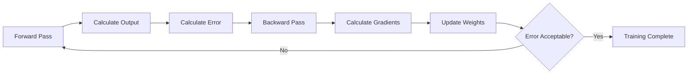
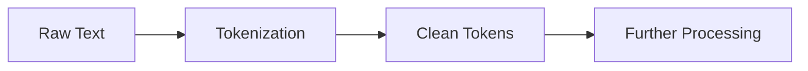
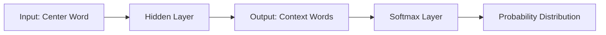
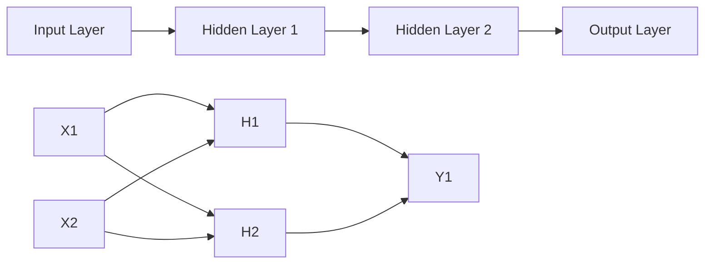
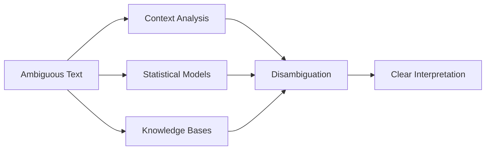
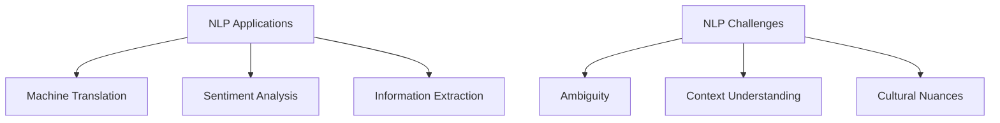

## Question 1(a) [3 marks]

**What do you mean by Narrow AI or Weak AI?**

**Answer:**

**Narrow AI** or **Weak AI** refers to artificial intelligence systems designed to perform specific, limited tasks within a narrow domain.

**Table: Narrow AI Characteristics**

| Aspect | Description |
|--------|-------------|
| **Scope** | Limited to specific tasks |
| **Intelligence** | Task-specific expertise |
| **Examples** | Siri, chess programs, recommendation systems |
| **Learning** | Pattern recognition within domain |

**Mnemonic:** "Narrow = Specific Tasks Only"

---

## Question 1(b) [4 marks]

**Define: Classification, Regression, Clustering, Association Analysis.**

**Answer:**

**Table: Machine Learning Techniques**

| Technique | Definition | Type | Example |
|-----------|------------|------|---------|
| **Classification** | Predicts discrete categories/classes | Supervised | Email spam detection |
| **Regression** | Predicts continuous numerical values | Supervised | House price prediction |
| **Clustering** | Groups similar data points | Unsupervised | Customer segmentation |
| **Association Analysis** | Finds relationships between variables | Unsupervised | Market basket analysis |

**Mnemonic:** "CRCA - Categories, Real-numbers, Clusters, Associations"

---

## Question 1(c) [7 marks]

**Illuminate the three main components of neuron.**

**Answer:**

The three main components of a biological neuron that inspire artificial neural networks are:

**Diagram:**

```goat
    Dendrites     Cell Body      Axon
        |            |           |
        v            v           v
    [Inputs] --> [Processing] --> [Output]
        |            |           |
    Receives     Integrates    Transmits
    signals      signals       signals
```

**Table: Neuron Components**

| Component | Function | AI Equivalent |
|-----------|----------|---------------|
| **Dendrites** | Receive input signals from other neurons | Input layer/weights |
| **Cell Body (Soma)** | Processes and integrates signals | Activation function |
| **Axon** | Transmits output signals to other neurons | Output connections |

**Key Points:**

- **Dendrites**: Act as input receivers with varying connection strengths
- **Cell Body**: Sums inputs and applies threshold function
- **Axon**: Carries processed signal to next neurons

**Mnemonic:** "DCA - Dendrites Collect, Cell-body Calculates, Axon Announces"

---

## Question 1(c) OR [7 marks]

**Explicate back propagation method in Artificial Neural Network.**

**Answer:**

**Back Propagation** is a supervised learning algorithm used to train multi-layer neural networks by minimizing error through gradient descent.

**Flowchart:**



**Table: Back Propagation Steps**

| Step | Process | Formula |
|------|---------|---------|
| **Forward Pass** | Calculate outputs layer by layer | y = f(Σ(wi*xi + b)) |
| **Error Calculation** | Compute loss function | E = ½(target - output)² |
| **Backward Pass** | Calculate error gradients | δ = ∂E/∂w |
| **Weight Update** | Adjust weights using learning rate | w_new = w_old - η*δ |

**Key Features:**

- **Gradient Descent**: Uses calculus to find minimum error
- **Chain Rule**: Propagates error backward through layers
- **Learning Rate**: Controls speed of weight updates

**Mnemonic:** "FEBU - Forward, Error, Backward, Update"

---

## Question 2(a) [3 marks]

**List out any five popular algorithms used in Machine Learning.**

**Answer:**

**Table: Popular ML Algorithms**

| Algorithm | Type | Application |
|-----------|------|-------------|
| **Linear Regression** | Supervised | Prediction of continuous values |
| **Decision Tree** | Supervised | Classification and regression |
| **K-Means Clustering** | Unsupervised | Data grouping |
| **Support Vector Machine** | Supervised | Classification with margins |
| **Random Forest** | Supervised | Ensemble learning |

**Mnemonic:** "LDKSR - Learn Data, Keep Samples, Run"

---

## Question 2(b) [4 marks]

**What is Expert System? List out its limitations and applications.**

**Answer:**

**Expert System** is an AI program that mimics human expert knowledge to solve complex problems in specific domains.

**Table: Expert System Overview**

| Aspect | Details |
|--------|---------|
| **Definition** | AI system with domain-specific expertise |
| **Components** | Knowledge base, inference engine, user interface |

**Applications:**

- **Medical Diagnosis**: Disease identification systems
- **Financial Planning**: Investment advisory systems
- **Fault Diagnosis**: Equipment troubleshooting

**Limitations:**

- **Limited Domain**: Works only in specific areas
- **Knowledge Acquisition**: Difficult to extract expert knowledge
- **Maintenance**: Hard to update and modify rules

**Mnemonic:** "EXPERT - Explains Problems, Executes Rules, Tests"

---

## Question 2(c) [7 marks]

**What is tokenization? Explain with suitable example.**

**Answer:**

**Tokenization** is the process of breaking down text into smaller units called tokens (words, phrases, symbols) for NLP processing.

**Table: Tokenization Types**

| Type | Description | Example |
|------|-------------|---------|
| **Word Tokenization** | Split by words | "Hello world" → ["Hello", "world"] |
| **Sentence Tokenization** | Split by sentences | "Hi. How are you?" → ["Hi.", "How are you?"] |
| **Subword Tokenization** | Split into subwords | "unhappy" → ["un", "happy"] |

**Code Example:**

```python
import nltk
text = "Natural Language Processing is amazing!"
tokens = nltk.word_tokenize(text)
# Output: ['Natural', 'Language', 'Processing', 'is', 'amazing', '!']
```

**Process Flow:**



**Key Benefits:**

- **Standardization**: Converts text to uniform format
- **Analysis Ready**: Prepares text for ML algorithms
- **Feature Extraction**: Enables statistical analysis

**Mnemonic:** "TOKEN - Text Operations Keep Everything Normalized"

---

## Question 2(a) OR [3 marks]

**Compare Supervised and Unsupervised Learning.**

**Answer:**

**Table: Supervised vs Unsupervised Learning**

| Aspect | Supervised Learning | Unsupervised Learning |
|--------|-------------------|---------------------|
| **Training Data** | Labeled data with target outputs | Unlabeled data without targets |
| **Goal** | Predict specific outcomes | Discover hidden patterns |
| **Examples** | Classification, Regression | Clustering, Association rules |
| **Evaluation** | Accuracy, precision, recall | Silhouette score, elbow method |
| **Applications** | Email spam, price prediction | Customer segmentation, anomaly detection |

**Mnemonic:** "SU - Supervised Uses labels, Unsupervised Uncovers patterns"

---

## Question 2(b) OR [4 marks]

**Explain all about AI applications in Healthcare, Finance and Manufacturing.**

**Answer:**

**Table: AI Applications by Industry**

| Industry | Applications | Benefits |
|----------|-------------|----------|
| **Healthcare** | Medical imaging, drug discovery, diagnosis | Improved accuracy, faster treatment |
| **Finance** | Fraud detection, algorithmic trading, credit scoring | Risk reduction, automated decisions |
| **Manufacturing** | Quality control, predictive maintenance, robotics | Efficiency, cost reduction |

**Healthcare Examples:**

- **Medical Imaging**: AI detects cancer in X-rays and MRIs
- **Drug Discovery**: AI accelerates new medicine development

**Finance Examples:**

- **Fraud Detection**: Real-time transaction monitoring
- **Robo-advisors**: Automated investment management

**Manufacturing Examples:**

- **Quality Control**: Automated defect detection
- **Predictive Maintenance**: Equipment failure prediction

**Mnemonic:** "HFM - Health, Finance, Manufacturing benefit from AI"

---

## Question 2(c) OR [7 marks]

**What is syntactic analysis and how it is differ from lexical analysis?**

**Answer:**

**Syntactic Analysis** examines the grammatical structure of sentences, while **Lexical Analysis** breaks text into meaningful tokens.

**Table: Lexical vs Syntactic Analysis**

| Aspect | Lexical Analysis | Syntactic Analysis |
|--------|-----------------|-------------------|
| **Purpose** | Tokenize text into words | Parse grammatical structure |
| **Input** | Raw text | Tokens from lexical analysis |
| **Output** | Tokens, part-of-speech tags | Parse trees, grammar rules |
| **Focus** | Individual words | Sentence structure |
| **Example** | "The cat runs" → [The, cat, runs] | Creates parse tree showing noun-verb relationship |

**Process Flow:**


**Example:**

- **Lexical**: "She reads books" → ["She", "reads", "books"]
- **Syntactic**: Identifies "She" as subject, "reads" as verb, "books" as object

**Key Differences:**

- **Scope**: Lexical works on words, Syntactic on sentence structure
- **Complexity**: Syntactic analysis is more complex than lexical
- **Dependencies**: Syntactic analysis depends on lexical analysis

**Mnemonic:** "LEX-SYN: LEXical extracts, SYNtactic structures"

---

## Question 3(a) [3 marks]

**List out various characteristics of Reactive machines.**

**Answer:**

**Table: Reactive Machines Characteristics**

| Characteristic | Description |
|---------------|-------------|
| **No Memory** | Cannot store past experiences |
| **Present-focused** | Responds only to current input |
| **Deterministic** | Same input produces same output |
| **Task-specific** | Designed for particular functions |
| **No Learning** | Cannot improve from experience |

**Examples:**

- **Deep Blue**: IBM's chess computer
- **Game AI**: Tic-tac-toe programs

**Mnemonic:** "REACT - Responds Exactly, Always Consistent Tasks"

---

## Question 3(b) [4 marks]

**Differentiate: Positive Reinforcement v/s Negative Reinforcement.**

**Answer:**

**Table: Positive vs Negative Reinforcement**

| Aspect | Positive Reinforcement | Negative Reinforcement |
|--------|----------------------|----------------------|
| **Definition** | Adding reward for good behavior | Removing penalty for good behavior |
| **Action** | Give something desirable | Take away something undesirable |
| **Goal** | Increase desired behavior | Increase desired behavior |
| **Example** | Give treat for correct answer | Remove extra work for good performance |

**Diagram:**

```goat
Positive Reinforcement:     Negative Reinforcement:
Good Behavior               Good Behavior
     +                           +
Add Reward                 Remove Penalty
     =                           =
Behavior Increases         Behavior Increases
```

**Key Points:**

- **Both increase behavior** but through different mechanisms
- **Positive adds** something pleasant
- **Negative removes** something unpleasant

**Mnemonic:** "PN - Positive adds Nice things, Negative removes Nasty things"

---

## Question 3(c) [7 marks]

**Explain all about Term-Frequency-Inverse Document Frequency(TF-IDF) word embedding technique.**

**Answer:**

**TF-IDF** is a numerical statistic that reflects how important a word is to a document in a collection of documents.

**Formula:**

```
TF-IDF = TF(t,d) × IDF(t)
Where:
TF(t,d) = (Number of times term t appears in document d) / (Total terms in document d)
IDF(t) = log((Total documents) / (Documents containing term t))
```

**Table: TF-IDF Components**

| Component | Formula | Purpose |
|-----------|---------|---------|
| **Term Frequency (TF)** | tf(t,d) = count(t,d) / |d| | Measures word frequency in document |
| **Inverse Document Frequency (IDF)** | idf(t) = log(N / df(t)) | Measures word importance across corpus |
| **TF-IDF Score** | tf-idf(t,d) = tf(t,d) × idf(t) | Final word importance score |

**Example Calculation:**

- Document: "cat sat on mat"
- Term: "cat"
- TF = 1/4 = 0.25
- If "cat" appears in 2 out of 10 documents: IDF = log(10/2) = 0.699
- TF-IDF = 0.25 × 0.699 = 0.175

**Applications:**

- **Information Retrieval**: Search engines
- **Text Mining**: Document similarity
- **Feature Extraction**: ML preprocessing

**Advantages:**

- **Common words get low scores** (the, and, is)
- **Rare but important words get high scores**
- **Simple and effective** for text analysis

**Mnemonic:** "TF-IDF - Term Frequency × Inverse Document Frequency"

---

## Question 3(a) OR [3 marks]

**Define Fuzzy Logic Systems. Discuss its key components.**

**Answer:**

**Fuzzy Logic Systems** handle uncertainty and partial truth, allowing values between completely true and completely false.

**Table: Fuzzy Logic Components**

| Component | Function | Example |
|-----------|----------|---------|
| **Fuzzifier** | Converts crisp inputs to fuzzy sets | Temperature 75°F → "Warm" (0.7) |
| **Rule Base** | Contains if-then fuzzy rules | IF temp is warm THEN fan is medium |
| **Inference Engine** | Applies fuzzy rules to inputs | Combines multiple rules |
| **Defuzzifier** | Converts fuzzy output to crisp value | "Medium speed" → 60% fan speed |

**Key Features:**

- **Membership Functions**: Degree of belonging (0 to 1)
- **Linguistic Variables**: Human-like terms (hot, cold, warm)
- **Fuzzy Rules**: IF-THEN statements with fuzzy conditions

**Mnemonic:** "FRID - Fuzzifier, Rules, Inference, Defuzzifier"

---

## Question 3(b) OR [4 marks]

**Explain elements of reinforcement learning: Policy, Reward Signal, Value Function, Model**

**Answer:**

**Table: Reinforcement Learning Elements**

| Element | Definition | Purpose |
|---------|------------|---------|
| **Policy** | Strategy for selecting actions | Defines agent's behavior |
| **Reward Signal** | Feedback from environment | Indicates good/bad actions |
| **Value Function** | Expected future rewards | Estimates long-term benefit |
| **Model** | Agent's representation of environment | Predicts next state and reward |

**Detailed Explanation:**

**Policy (π):**

- **Deterministic**: π(s) = a (one action per state)
- **Stochastic**: π(a|s) = probability of action a in state s

**Reward Signal (R):**

- **Immediate feedback** from environment
- **Positive** for good actions, **negative** for bad actions

**Value Function (V):**

- **State Value**: V(s) = expected return from state s
- **Action Value**: Q(s,a) = expected return from action a in state s

**Model:**

- **Transition Model**: P(s'|s,a) = probability of next state
- **Reward Model**: R(s,a,s') = expected reward

**Mnemonic:** "PRVM - Policy chooses, Reward judges, Value estimates, Model predicts"

---

## Question 3(c) OR [7 marks]

**Differentiate: frequency-based v/s prediction-based word embedding techniques.**

**Answer:**

**Table: Frequency-based vs Prediction-based Word Embeddings**

| Aspect | Frequency-based | Prediction-based |
|--------|----------------|------------------|
| **Approach** | Count-based statistics | Neural network prediction |
| **Examples** | TF-IDF, Co-occurrence Matrix | Word2Vec, GloVe |
| **Computation** | Matrix factorization | Gradient descent |
| **Context** | Global statistics | Local context windows |
| **Scalability** | Limited by matrix size | Scales with vocabulary |
| **Quality** | Basic semantic relationships | Rich semantic relationships |

**Frequency-based Methods:**

- **TF-IDF**: Term frequency × Inverse document frequency
- **Co-occurrence Matrix**: Word pair frequency counts
- **LSA**: Latent Semantic Analysis using SVD

**Prediction-based Methods:**

- **Word2Vec**: Skip-gram and CBOW models
- **GloVe**: Global Vectors for Word Representation
- **FastText**: Subword information inclusion

**Code Comparison:**

```python
# Frequency-based (TF-IDF)
from sklearn.feature_extraction.text import TfidfVectorizer
vectorizer = TfidfVectorizer()
tfidf_matrix = vectorizer.fit_transform(documents)

# Prediction-based (Word2Vec)
from gensim.models import Word2Vec
model = Word2Vec(sentences, vector_size=100, window=5)
```

**Advantages:**

**Frequency-based:**

- **Simple** and interpretable
- **Fast** computation for small datasets
- **Good** for basic similarity tasks

**Prediction-based:**

- **Dense** vector representations
- **Better** semantic relationships
- **Scalable** to large vocabularies

**Mnemonic:** "FP - Frequency counts, Prediction learns"

---

## Question 4(a) [3 marks]

**List out the key characteristics of reactive machine.**

**Answer:**

**Table: Reactive Machine Key Characteristics**

| Characteristic | Description |
|---------------|-------------|
| **Stateless** | No memory of past interactions |
| **Reactive** | Responds only to current inputs |
| **Deterministic** | Consistent outputs for same inputs |
| **Specialized** | Designed for specific tasks |
| **Real-time** | Immediate response to stimuli |

**Examples:**

- **Deep Blue**: Chess-playing computer
- **Google AlphaGo**: Go-playing system (early version)

**Mnemonic:** "SRDSR - Stateless, Reactive, Deterministic, Specialized, Real-time"

---

## Question 4(b) [4 marks]

**List out various pre-processing techniques. Explain any one of them with python code.**

**Answer:**

**Table: Text Pre-processing Techniques**

| Technique | Purpose | Example |
|-----------|---------|---------|
| **Tokenization** | Split text into words | "Hello world" → ["Hello", "world"] |
| **Stop Word Removal** | Remove common words | Remove "the", "and", "is" |
| **Stemming** | Reduce words to root form | "running" → "run" |
| **Lemmatization** | Convert to dictionary form | "better" → "good" |

**Stemming Explanation:**
Stemming reduces words to their root form by removing suffixes.

**Python Code for Stemming:**

```python
import nltk
from nltk.stem import PorterStemmer

# Initialize stemmer
stemmer = PorterStemmer()

# Example words
words = ["running", "flies", "dogs", "churches", "studying"]

# Apply stemming
stemmed_words = [stemmer.stem(word) for word in words]
print(stemmed_words)
# Output: ['run', 'fli', 'dog', 'church', 'studi']
```

**Benefits of Stemming:**

- **Reduces vocabulary size** for ML models  
- **Groups related words** together
- **Improves** text analysis efficiency

**Mnemonic:** "TSSL - Tokenize, Stop-words, Stem, Lemmatize"

---

## Question 4(c) [7 marks]

**Illuminate the Word2vec technique in detail.**

**Answer:**

**Word2Vec** is a neural network-based technique that learns dense vector representations of words by predicting context.

**Table: Word2Vec Architectures**

| Architecture | Approach | Input | Output |
|-------------|----------|-------|--------|
| **Skip-gram** | Predict context from center word | Center word | Context words |
| **CBOW** | Predict center word from context | Context words | Center word |

**Skip-gram Model:**



**Training Process:**

1. **Sliding Window**: Move window across text
2. **Word Pairs**: Create (center, context) pairs  
3. **Neural Network**: Train to predict context
4. **Weight Matrix**: Extract word vectors

**Key Features:**

- **Vector Size**: Typically 100-300 dimensions
- **Window Size**: Context range (usually 5-10 words)
- **Negative Sampling**: Efficient training method
- **Hierarchical Softmax**: Alternative to softmax

**Mathematical Concept:**

```
Objective = max Σ log P(context|center)
Where P(context|center) = exp(v_context · v_center) / Σ exp(v_w · v_center)
```

**Applications:**

- **Similarity**: Find similar words
- **Analogies**: King - Man + Woman = Queen
- **Clustering**: Group semantic categories
- **Feature Engineering**: ML input features

**Advantages:**

- **Dense Representations**: Rich semantic information
- **Semantic Relationships**: Captures word meanings
- **Arithmetic Properties**: Vector operations make sense

**Mnemonic:** "W2V - Words to Vectors via neural networks"

---

## Question 4(a) OR [3 marks]

**List out any four applications of Natural Language Processing. Explain spam detection in detail.**

**Answer:**

**Table: NLP Applications**

| Application | Description |
|-------------|-------------|
| **Spam Detection** | Identify unwanted emails |
| **Sentiment Analysis** | Determine emotional tone |
| **Machine Translation** | Translate between languages |
| **Chatbots** | Automated conversation systems |

**Spam Detection Details:**

**Process:**

1. **Feature Extraction**: Convert email text to numerical features
2. **Classification**: Use ML algorithms to classify
3. **Decision**: Mark as spam or legitimate

**Features Used:**

- **Word Frequency**: Spam keywords count
- **Email Headers**: Sender information
- **URL Analysis**: Suspicious links
- **Text Patterns**: ALL CAPS, excessive punctuation

**Machine Learning Approach:**

```python
# Simplified spam detection
from sklearn.feature_extraction.text import TfidfVectorizer
from sklearn.naive_bayes import MultinomialNB

# Convert emails to features
vectorizer = TfidfVectorizer()
X = vectorizer.fit_transform(email_texts)

# Train classifier
classifier = MultinomialNB()
classifier.fit(X, labels)  # labels: 0=legitimate, 1=spam
```

**Mnemonic:** "SMTP - Spam, Machine Translation, Sentiment, Phishing detection"

---

## Question 4(b) OR [4 marks]

**Explain about discourse integration and pragmatic analysis.**

**Answer:**

**Table: Discourse Integration vs Pragmatic Analysis**

| Aspect | Discourse Integration | Pragmatic Analysis |
|--------|---------------------|-------------------|
| **Focus** | Text coherence and structure | Context and intention |
| **Scope** | Multiple sentences/paragraphs | Speaker's intended meaning |
| **Elements** | Anaphora, cataphora, connectives | Implicature, speech acts |
| **Goal** | Understand text flow | Understand real meaning |

**Discourse Integration:**

- **Anaphora Resolution**: "John went to store. He bought milk." (He = John)
- **Cataphora**: "Before he left, John locked the door."
- **Coherence**: Logical flow between sentences
- **Cohesion**: Grammatical connections

**Pragmatic Analysis:**

- **Speech Acts**: Commands, requests, promises
- **Implicature**: Implied meanings beyond literal
- **Context Dependency**: Same words, different meanings
- **Intention Recognition**: What speaker really means

**Examples:**

**Discourse Integration:**

```
Text: "Mary owns a car. The vehicle is red."
Resolution: "vehicle" refers to "car"
```

**Pragmatic Analysis:**

```
Statement: "Can you pass the salt?"
Literal: Question about ability
Pragmatic: Request to pass salt
```

**Mnemonic:** "DP - Discourse connects, Pragmatics interprets context"

---

## Question 4(c) OR [7 marks]

**Discuss about the Bag of Words word embedding technique in detail.**

**Answer:**

**Bag of Words (BoW)** is a simple text representation method that treats documents as unordered collections of words.

**Table: BoW Process**

| Step | Description | Example |
|------|-------------|---------|
| **Vocabulary Creation** | Collect all unique words | ["cat", "sat", "mat", "dog"] |
| **Vector Creation** | Count word occurrences | [1, 1, 1, 0] for "cat sat mat" |
| **Document Representation** | Each document becomes a vector | Multiple documents → Matrix |

**Example:**

```
Documents:
1. "The cat sat on the mat"
2. "The dog ran in the park"

Vocabulary: [the, cat, sat, on, mat, dog, ran, in, park]

Document Vectors:
Doc1: [2, 1, 1, 1, 1, 0, 0, 0, 0]
Doc2: [2, 0, 0, 0, 0, 1, 1, 1, 1]
```

**Python Implementation:**

```python
from sklearn.feature_extraction.text import CountVectorizer

documents = [
    "The cat sat on the mat",
    "The dog ran in the park"
]

vectorizer = CountVectorizer()
bow_matrix = vectorizer.fit_transform(documents)
vocab = vectorizer.get_feature_names_out()

print("Vocabulary:", vocab)
print("BoW Matrix:", bow_matrix.toarray())
```

**Advantages:**

- **Simplicity**: Easy to understand and implement
- **Interpretability**: Clear word-count relationship
- **Effectiveness**: Works well for many tasks

**Disadvantages:**

- **No Word Order**: "cat sat mat" = "mat sat cat"
- **Sparse Vectors**: Many zeros in large vocabularies
- **No Semantics**: No understanding of word meanings
- **High Dimensionality**: Scales with vocabulary size

**Variations:**

- **Binary BoW**: 1 if word present, 0 if absent
- **TF-IDF BoW**: Term frequency × Inverse document frequency
- **N-gram BoW**: Consider word sequences

**Applications:**

- **Document Classification**: Spam detection
- **Information Retrieval**: Search engines
- **Text Clustering**: Group similar documents
- **Feature Engineering**: Input for ML models

**Mnemonic:** "BOW - Bag Of Words counts occurrences"

---

## Question 5(a) [3 marks]

**What is the role of activation functions in Neural Network?**

**Answer:**

**Table: Activation Function Roles**

| Role | Description |
|------|-------------|
| **Non-linearity** | Enables learning complex patterns |
| **Output Control** | Determines neuron firing threshold |
| **Gradient Flow** | Affects backpropagation efficiency |
| **Range Limiting** | Bounds output values |

**Key Functions:**

- **Decision Making**: Whether neuron should activate
- **Pattern Recognition**: Enables complex decision boundaries  
- **Signal Processing**: Transforms weighted inputs

**Common Activation Functions:**

- **ReLU**: f(x) = max(0, x) - Simple and efficient
- **Sigmoid**: f(x) = 1/(1 + e^-x) - Smooth probability output
- **Tanh**: f(x) = (e^x - e^-x)/(e^x + e^-x) - Zero-centered

**Mnemonic:** "NOGL - Non-linearity, Output control, Gradient flow, Limiting range"

---

## Question 5(b) [4 marks]

**Describe architecture of Neural Network in detail.**

**Answer:**

**Table: Neural Network Architecture Components**

| Component | Function | Example |
|-----------|----------|---------|
| **Input Layer** | Receives input data | Features/pixels |
| **Hidden Layers** | Process information | Pattern recognition |
| **Output Layer** | Produces final result | Classification/prediction |
| **Connections** | Link neurons between layers | Weighted edges |

**Architecture Diagram:**



**Layer Details:**

- **Input Layer**: Number of neurons = number of features
- **Hidden Layers**: Variable neurons, multiple layers for complexity
- **Output Layer**: Number of neurons = number of classes/outputs

**Information Flow:**

1. **Forward Pass**: Input → Hidden → Output
2. **Weighted Sum**: Σ(wi × xi + bias)  
3. **Activation**: Apply activation function
4. **Output**: Final prediction/classification

**Mnemonic:** "IHOC - Input, Hidden, Output, Connections"

---

## Question 5(c) [7 marks]

**List out and explain types of ambiguities in Natural Language Processing.**

**Answer:**

**Ambiguity** in NLP occurs when text has multiple possible interpretations, making automatic understanding challenging.

**Table: Types of NLP Ambiguities**

| Type | Definition | Example | Resolution |
|------|------------|---------|-----------|
| **Lexical** | Word has multiple meanings | "Bank" (river/financial) | Context analysis |
| **Syntactic** | Multiple parse structures | "I saw her duck" | Grammar rules |
| **Semantic** | Multiple sentence meanings | "Visiting relatives can be boring" | Semantic analysis |
| **Pragmatic** | Context-dependent meaning | "Can you pass salt?" | Intent recognition |
| **Referential** | Unclear pronoun reference | "John told Bill he was late" | Anaphora resolution |

**Detailed Explanations:**

**Lexical Ambiguity:**

- **Homonyms**: Same spelling, different meanings
- Example: "I went to the bank" (financial institution vs. river bank)
- **Solution**: Word sense disambiguation using context

**Syntactic Ambiguity:**

- **Multiple Parse Trees**: Same sentence, different structures
- Example: "I saw the man with the telescope"
  - I used telescope to see man
  - I saw man who had telescope
- **Solution**: Statistical parsing, grammar preferences

**Semantic Ambiguity:**

- **Multiple Interpretations**: Same structure, different meanings
- Example: "Visiting relatives can be boring"
  - Going to visit relatives is boring
  - Relatives who visit are boring
- **Solution**: Semantic role labeling

**Pragmatic Ambiguity:**

- **Context-dependent**: Meaning depends on situation
- Example: "It's cold here" (statement vs. request to close window)
- **Solution**: Dialogue systems, context modeling

**Referential Ambiguity:**

- **Unclear References**: Pronouns with multiple possible antecedents
- Example: "John told Bill that he was promoted" (who got promoted?)
- **Solution**: Coreference resolution algorithms

**Resolution Strategies:**



**Impact on NLP Systems:**

- **Machine Translation**: Wrong word choices
- **Information Retrieval**: Irrelevant results
- **Question Answering**: Incorrect responses
- **Chatbots**: Misunderstood queries

**Mnemonic:** "LSSPR - Lexical, Syntactic, Semantic, Pragmatic, Referential"

---

## Question 5(a) OR [3 marks]

**List down the names of some popular activation functions used in Neural Network.**

**Answer:**

**Table: Popular Activation Functions**

| Function | Formula | Range | Usage |
|----------|---------|-------|-------|
| **ReLU** | f(x) = max(0, x) | [0, ∞) | Hidden layers |
| **Sigmoid** | f(x) = 1/(1 + e^-x) | (0, 1) | Binary classification |
| **Tanh** | f(x) = (e^x - e^-x)/(e^x + e^-x) | (-1, 1) | Hidden layers |
| **Softmax** | f(xi) = e^xi / Σe^xj | (0, 1) | Multi-class output |
| **Leaky ReLU** | f(x) = max(0.01x, x) | (-∞, ∞) | Solving dead neurons |

**Popular Functions:**

- **ReLU**: Most commonly used in hidden layers
- **Sigmoid**: Traditional choice for binary problems
- **Tanh**: Zero-centered alternative to sigmoid
- **Softmax**: Standard for multi-class classification

**Mnemonic:** "RSTSL - ReLU, Sigmoid, Tanh, Softmax, Leaky ReLU"

---

## Question 5(b) OR [4 marks]

**Explain Learning process in artificial Neural Network.**

**Answer:**

**Learning Process** in neural networks involves adjusting weights and biases to minimize error through iterative training.

**Table: Learning Process Steps**

| Step | Process | Description |
|------|---------|-------------|
| **Initialize** | Random weights | Start with small random values |
| **Forward Pass** | Calculate output | Propagate input through network |
| **Calculate Error** | Compare with target | Use loss function |
| **Backward Pass** | Calculate gradients | Use backpropagation |
| **Update Weights** | Adjust parameters | Apply gradient descent |
| **Repeat** | Iterate process | Until convergence |

**Learning Algorithm Flow:**


**Mathematical Foundation:**

- **Loss Function**: L = ½(target - output)²
- **Gradient**: ∂L/∂w = error × input
- **Weight Update**: w_new = w_old - η × gradient
- **Learning Rate**: η controls update step size

**Types of Learning:**

- **Supervised**: Learn from labeled examples
- **Batch Learning**: Update after all samples
- **Online Learning**: Update after each sample
- **Mini-batch**: Update after small batches

**Key Concepts:**

- **Epoch**: One complete pass through training data
- **Convergence**: When error stops decreasing
- **Overfitting**: Memorizing training data
- **Regularization**: Techniques to prevent overfitting

**Mnemonic:** "IFCBU - Initialize, Forward, Calculate, Backward, Update"

---

## Question 5(c) OR [7 marks]

**List out various advantages and disadvantages of Natural Language Processing.**

**Answer:**

**Table: NLP Advantages and Disadvantages**

| Advantages | Disadvantages |
|------------|---------------|
| **Automated Text Analysis** | **Ambiguity Handling** |
| **Language Translation** | **Context Understanding** |
| **Human-Computer Interaction** | **Cultural Nuances** |
| **Information Extraction** | **Computational Complexity** |
| **Sentiment Analysis** | **Data Requirements** |

**Detailed Advantages:**

**Business Benefits:**

- **Customer Service**: Automated chatbots and support
- **Content Analysis**: Social media monitoring
- **Document Processing**: Automated summarization
- **Search Enhancement**: Better information retrieval

**Technical Advantages:**

- **Scalability**: Process large text volumes
- **Consistency**: Uniform analysis across documents
- **Speed**: Faster than human text processing
- **Integration**: Works with existing systems

**Detailed Disadvantages:**

**Technical Challenges:**

- **Ambiguity**: Multiple interpretations of text
- **Context Dependency**: Meaning changes with situation
- **Sarcasm/Irony**: Difficult to detect automatically
- **Domain Specificity**: Models need retraining for new domains

**Resource Requirements:**

- **Large Datasets**: Need millions of text samples
- **Computational Power**: Complex models require GPUs
- **Expert Knowledge**: Requires linguistics and ML expertise
- **Maintenance**: Models need regular updates

**Quality Issues:**

- **Accuracy Limitations**: Not 100% accurate
- **Bias Problems**: Reflects training data biases
- **Language Barriers**: Works better for some languages
- **Error Propagation**: Mistakes compound in pipelines

**Applications vs Challenges:**



**Future Improvements:**

- **Better Context Models**: Transformer architectures
- **Multilingual Support**: Cross-language understanding
- **Few-shot Learning**: Less data requirements
- **Explainable AI**: Understanding model decisions

**Mnemonic:** "ALICE vs ACHDR - Automated, Language, Interaction, Content, Extraction vs Ambiguity, Context, Human-nuances, Data, Resources"
