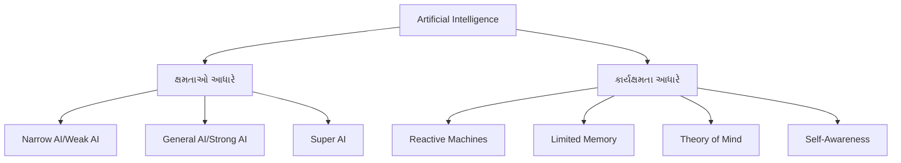
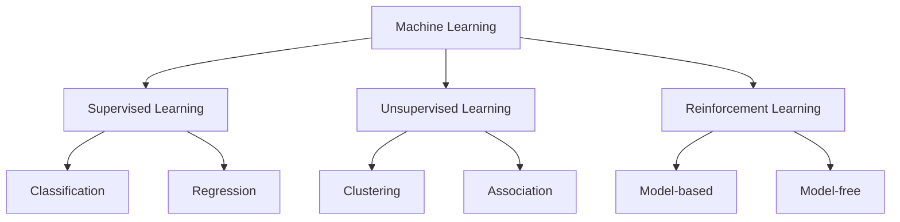
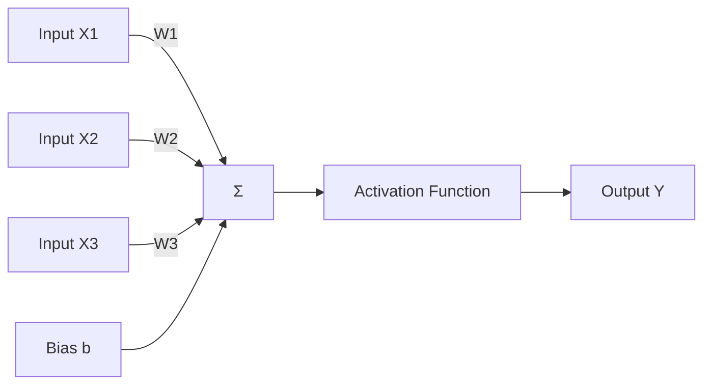
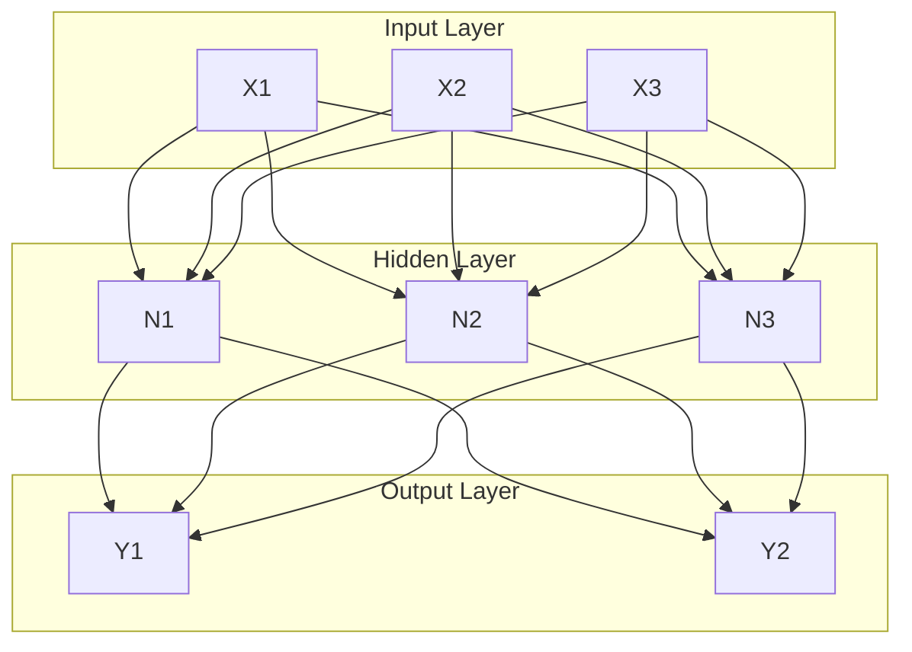
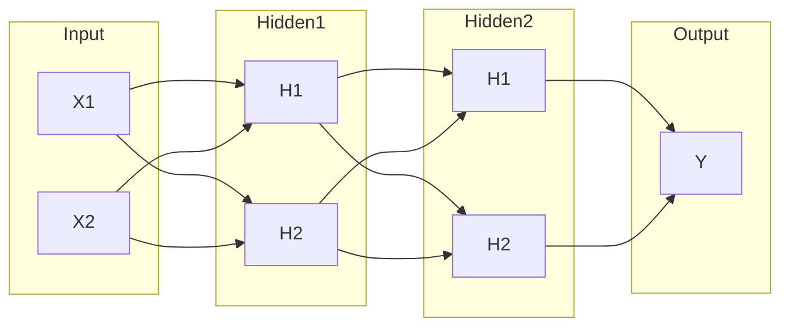
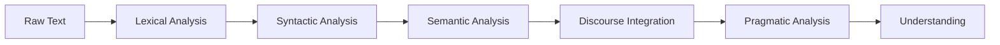

## પ્રશ્ન 1(અ) [3 ગુણ]

**વર્ડ એમ્બેડિંગ ટેકનિક શું છે? વિવિધ વર્ડ એમ્બેડિંગ તકનીકોની સૂચિ બનાવો.**

**જવાબ**:

**વર્ડ એમ્બેડિંગ** એ એવી તકનીક છે જે શબ્દોને આંકડાકીય vectors માં રૂપાંતરિત કરે છે અને શબ્દો વચ્ચેના semantic સંબંધોને જાળવી રાખે છે. આ શબ્દોને high-dimensional space માં dense vectors તરીકે દર્શાવે છે.

**ટેબલ: વિવિધ વર્ડ એમ્બેડિંગ તકનીકો**

| તકનીક | વર્ણન | મુખ્ય લક્ષણ |
|--------|--------|-------------|
| **TF-IDF** | Term Frequency-Inverse Document Frequency | આંકડાકીય માપદંડ |
| **Bag of Words (BoW)** | આવર્તન-આધારિત રજૂઆત | સરળ ગણતરી પદ્ધતિ |
| **Word2Vec** | Neural network-આધારિત embedding | Semantic સંબંધો કેપ્ચર કરે |
| **GloVe** | Global Vectors for word representation | Global અને local આંકડા સંયોજન |

**મુખ્ય પોઈન્ટ્સ:**

- **TF-IDF**: દસ્તાવેજોમાં શબ્દની મહત્ત્વતા માપે છે
- **BoW**: Vocabulary-આધારિત vectors બનાવે છે
- **Word2Vec**: CBOW અને Skip-gram models વાપરે છે
- **GloVe**: Global context સાથે pre-trained embeddings

**મેમરી ટ્રીક:** "TB-WG" (TF-IDF, BoW, Word2Vec, GloVe)

## પ્રશ્ન 1(બ) [4 ગુણ]

**આર્ટિફિશિયલ ઇન્ટેલિજન્સના વિવિધ પ્રકારોનું વર્ગીકરણ કરો અને તેને ડાયાગ્રામ વડે દર્શાવો.**

**જવાબ**:

AI ને **ક્ષમતાઓ** અને **કાર્યક્ષમતા** આધારે વર્ગીકૃત કરી શકાય છે.

**ડાયાગ્રામ:**



**ટેબલ: AI પ્રકારોની તુલના**

| વર્ગ | પ્રકાર | વર્ણન | ઉદાહરણ |
|------|------|--------|---------|
| **ક્ષમતાઓ** | Narrow AI | કાર્ય-વિશિષ્ટ બુદ્ધિ | Siri, Chess programs |
| | General AI | માનવ-સ્તરની બુદ્ધિ | હજુ પ્રાપ્ત નથી |
| | Super AI | માનવ બુદ્ધિથી વધુ | સૈદ્ધાંતિક ખ્યાલ |
| **કાર્યક્ષમતા** | Reactive | કોઈ યાદદાશ્ત નથી | Deep Blue |
| | Limited Memory | ભૂતકાળના ડેટાનો ઉપયોગ | Self-driving cars |

**મેમરી ટ્રીક:** "NGS-RLT" (Narrow-General-Super, Reactive-Limited-Theory)

## પ્રશ્ન 1(ક) [7 ગુણ]

**તફાવત આપીને NLU અને NLG સમજાવો.**

**જવાબ**:

**Natural Language Understanding (NLU)** અને **Natural Language Generation (NLG)** Natural Language Processing ના બે મુખ્ય ઘટકો છે.

**ટેબલ: NLU vs NLG તુલના**

| પાસું | NLU | NLG |
|------|-----|-----|
| **હેતુ** | માનવી ભાષાને સમજવું | માનવી ભાષા જનરેટ કરવું |
| **દિશા** | Input processing | Output generation |
| **કાર્ય** | અર્થનું અર્થઘટન | ટેક્સ્ટ રચના |
| **પ્રક્રિયા** | વિશ્લેષણ અને સમજ | સંશ્લેષણ અને સર્જન |
| **ઉદાહરણો** | Intent recognition, sentiment analysis | Chatbot responses, report generation |
| **પડકારો** | અસ્પષ્ટતા નિવારણ | Natural text generation |

**વિગતવાર સમજાવટ:**

**NLU (Natural Language Understanding):**

- Unstructured text ને structured data માં કન્વર્ટ કરે છે
- Semantic analysis અને intent extraction કરે છે
- અસ્પષ્ટતા અને context ની સમજ હેન્ડલ કરે છે

**NLG (Natural Language Generation):**

- Structured data ને natural language માં કન્વર્ટ કરે છે
- સુસંગત અને contextually યોગ્ય ટેક્સ્ટ બનાવે છે
- વ્યાકરણની ચુસ્તતા અને પ્રવાહિતા સુનિશ્ચિત કરે છે

**મેમરી ટ્રીક:** "UI-OG" (Understanding Input, Output Generation)

## પ્રશ્ન 1(ક) OR [7 ગુણ]

**આર્ટિફિશિયલ ઈન્ટેલિજન્સનો ઉપયોગ થાય છે તેવા વિવિધ ઉદ્યોગોની યાદી બનાવો અને કોઈપણ બેને સમજાવો.**

**જવાબ**:

**ટેબલ: ઉદ્યોગોમાં AI એપ્લિકેશન**

| ઉદ્યોગ | AI એપ્લિકેશન | લાભો |
|--------|-------------|-------|
| **આરોગ્ય** | નિદાન, દવા શોધ | ચુસ્તતામાં સુધારો |
| **ફાઇનાન્સ** | છેતરપિંડી શોધ, ટ્રેડિંગ | જોખમ વ્યવસ્થાપન |
| **ઉત્પાદન** | ગુણવત્તા નિયંત્રણ | કાર્યક્ષમતા |
| **પરિવહન** | સ્વાયત્ત વાહનો | સુરક્ષા |
| **રિટેલ** | સુલેખન સિસ્ટમ | વ્યક્તિગતકરણ |
| **શિક્ષણ** | વ્યક્તિગત શિક્ષણ | અનુકૂલન શિક્ષણ |

**બે ઉદ્યોગોની વિગતવાર સમજાવટ:**

**1. આરોગ્ય ઉદ્યોગ:**

- **તબીબી નિદાન**: AI તબીબી છબીઓ અને દર્દીના ડેટાનું વિશ્લેષણ કરે છે
- **દવા શોધ**: સંભવિત દવાઓની ઝડપી ઓળખ
- **વ્યક્તિગત સારવાર**: દર્દીના genetics આધારે ઉપચાર
- **લાભો**: ઝડપી નિદાન, ભૂલો ઘટાડવી, પરિણામોમાં સુધારો

**2. ફાઇનાન્સ ઉદ્યોગ:**

- **છેતરપિંડી શોધ**: Real-time માં શંકાસ્પદ વ્યવહારો ઓળખવા
- **Algorithmic Trading**: બજારના patterns આધારે automated trading
- **Credit Scoring**: લોન ડિફોલ્ટ જોખમનું ચોક્કસ મૂલ્યાંકન
- **લાભો**: વર્ધેલી સુરક્ષા, ઝડપી પ્રક્રિયા, વધુ સારું જોખમ વ્યવસ્થાપન

**મેમરી ટ્રીક:** "HF-MR-TE" (Healthcare-Finance, Manufacturing-Retail-Transportation-Education)

## પ્રશ્ન 2(અ) [3 ગુણ]

**મશીન લર્નિંગ શબ્દને વ્યાખ્યાયિત કરો. મશીન લર્નિંગનું વર્ગીકરણ રેખાકૃતિ દોરો.**

**જવાબ**:

**મશીન લર્નિંગ** AI નો ઉપવિભાગ છે જે કોમ્પ્યુટરોને સ્પષ્ટ રીતે પ્રોગ્રામ કર્યા વિના અનુભવથી શીખવા અને સુધારવા સક્ષમ બનાવે છે. આ ડેટાનું વિશ્લેષણ કરવા, patterns ઓળખવા અને predictions કરવા algorithms નો ઉપયોગ કરે છે.

**ડાયાગ્રામ:**



**મુખ્ય પોઈન્ટ્સ:**

- **Supervised**: Labeled training data વાપરે છે
- **Unsupervised**: Unlabeled data માં patterns શોધે છે
- **Reinforcement**: Rewards અને penalties દ્વારા શીખે છે

**મેમરી ટ્રીક:** "SUR" (Supervised-Unsupervised-Reinforcement)

## પ્રશ્ન 2(બ) [4 ગુણ]

**Positive reinforcement અને Negative reinforcement નો તફાવત દર્શાવો.**

**જવાબ**:

**ટેબલ: Positive vs Negative Reinforcement**

| પાસું | Positive Reinforcement | Negative Reinforcement |
|------|----------------------|----------------------|
| **વ્યાખ્યા** | સારા વર્તન માટે રિવોર્ડ ઉમેરવું | અપ્રિય stimulus દૂર કરવું |
| **ક્રિયા** | કંઈક આનંદદાયક આપવું | કંઈક અપ્રિય દૂર કરવું |
| **હેતુ** | ઇચ્છિત વર્તન વધારવું | ઇચ્છિત વર્તન વધારવું |
| **ઉદાહરણ** | સારા પ્રદર્શન માટે બોનસ | જાગ્યા પછી alarm બંધ કરવું |
| **અસર** | Rewards દ્વારા પ્રેરણા | રાહત દ્વારા પ્રેરણા |
| **Agent પ્રતિસાદ** | ક્રિયા પુનરાવર્તન કરવી | નકારાત્મક પરિણામો ટાળવા |

**મુખ્ય પોઈન્ટ્સ:**

- **Positive Reinforcement**: Positive stimulus ઉમેરીને વર્તન મજબૂત બનાવે છે
- **Negative Reinforcement**: Negative stimulus દૂર કરીને વર્તન મજબૂત બનાવે છે
- **બંને પ્રકાર**: ઇચ્છિત વર્તનની સંભાવના વધારવાનું લક્ષ્ય છે
- **તફાવત**: પ્રોત્સાહનની પદ્ધતિ (ઉમેરવું vs દૂર કરવું)

**મેમરી ટ્રીક:** "AR-RN" (Add Reward, Remove Negative)

## પ્રશ્ન 2(ક) [7 ગુણ]

**Supervised અને Unsupervised learning ની તુલના કરો.**

**જવાબ**:

**ટેબલ: Supervised vs Unsupervised Learning**

| પેરામીટર | Supervised Learning | Unsupervised Learning |
|----------|-------------------|---------------------|
| **ડેટા પ્રકાર** | Labeled data (input-output pairs) | Unlabeled data (માત્ર inputs) |
| **શીખવાનું લક્ષ્ય** | પરિણામોની આગાહ | છુપા patterns શોધવા |
| **Feedback** | સાચા જવાબો છે | સાચા જવાબો નથી |
| **Algorithms** | SVM, Decision Trees, Neural Networks | K-means, Hierarchical clustering |
| **એપ્લિકેશન** | Classification, Regression | Clustering, Association rules |
| **ચોકસાઈ** | માપી શકાય છે | માપવી મુશ્કેલ |
| **જટિલતા** | ઓછી જટિલ | વધુ જટિલ |
| **ઉદાહરણો** | Email spam detection, કિંમત આગાહ | Customer segmentation, Market basket analysis |

**વિગતવાર તુલના:**

**Supervised Learning:**

- જાણીતા પરિણામો સાથે training data ની જરૂર
- પ્રદર્શનનું મૂલ્યાંકન સરળતાથી કરી શકાય છે
- આગાહીના કાર્યો માટે વપરાય છે

**Unsupervised Learning:**

- પૂર્વ-નિર્ધારિત labels વિના ડેટા સાથે કામ કરે છે
- ડેટામાં છુપાયેલા structures શોધે છે
- અન્વેષણાત્મક ડેટા વિશ્લેષણ માટે વપરાય છે

**મેમરી ટ્રીક:** "LP-PF" (Labeled Prediction, Pattern Finding)

## પ્રશ્ન 2(અ) OR [3 ગુણ]

**વ્યાખ્યાયિત કરો: Classification, Regression અને clustering.**

**જવાબ**:

**ટેબલ: ML કાર્યોની વ્યાખ્યાઓ**

| કાર્ય | વ્યાખ્યા | આઉટપુટ પ્રકાર | ઉદાહરણ |
|------|----------|---------------|---------|
| **Classification** | Discrete categories/classes ની આગાહ | Categorical | Email: Spam/Not Spam |
| **Regression** | સતત આંકડાકીય મૂલ્યોની આગાહ | આંકડાકીય | ઘરની કિંમત આગાહ |
| **Clustering** | સમાન ડેટા points ને જૂથ બનાવવા | જૂથો/Clusters | Customer segmentation |

**વિગતવાર વ્યાખ્યાઓ:**

- **Classification**: શીખેલા patterns આધારે input data ને પૂર્વ-નિર્ધારિત વર્ગોમાં સોંપે છે
- **Regression**: સતત મૂલ્યોની આગાહ કરવા variables વચ્ચેના સંબંધોનો અંદાજ કાઢે છે
- **Clustering**: જૂથોની પૂર્વ જાણકારી વિના ડેટામાં કુદરતી જૂથો શોધે છે

**મેમરી ટ્રીક:** "CRC" (Categories, Real numbers, Clusters)

## પ્રશ્ન 2(બ) OR [4 ગુણ]

**Artificial Neural Network અને Biological Neural Network ની તુલના કરો.**

**જવાબ**:

**ટેબલ: ANN vs Biological Neural Network**

| પાસું | Artificial Neural Network | Biological Neural Network |
|------|--------------------------|---------------------------|
| **પ્રોસેસિંગ** | Digital/Binary | Analog |
| **ઝડપ** | ઝડપી પ્રોસેસિંગ | ધીમી પ્રોસેસિંગ |
| **શીખવું** | Backpropagation algorithm | Synaptic plasticity |
| **મેમરી** | અલગ સ્ટોરેજ | કનેક્શનમાં વિતરિત |
| **સ્ટ્રક્ચર** | સ્તરવાર આર્કિટેક્ચર | જટિલ 3D structure |
| **ખોટ સહન** | ઓછું | વધુ |
| **ઊર્જા** | વધુ પાવર consumption | ઓછો ઊર્જા વપરાશ |
| **સમાંતર પ્રક્રિયા** | મર્યાદિત parallel processing | વિશાળ parallel processing |

**મુખ્ય તફાવતો:**

- **ANN**: મગજથી પ્રેરિત ગાણિતિક મોડલ
- **Biological**: વાસ્તવિક મગજના neural networks
- **હેતુ**: ANN computation માટે, Biological cognition માટે
- **અનુકૂલનક્ષમતા**: Biological networks વધુ flexible

**મેમરી ટ્રીક:** "DSML-CFEP" (Digital-Speed-Memory-Layer vs Complex-Fault-Energy-Parallel)

## પ્રશ્ન 2(ક) OR [7 ગુણ]

**Supervised, unsupervised અને reinforcement learning ની વિવિધ applications ની સૂચિ બનાવો.**

**જવાબ**:

**ટેબલ: વિવિધ Learning પ્રકારોની Applications**

| Learning પ્રકાર | Applications | વાસ્તવિક જગતના ઉદાહરણો |
|-----------------|-------------|------------------------|
| **Supervised** | Email classification, તબીબી નિદાન, Stock prediction, Credit scoring | Gmail spam filter, X-ray analysis, Trading algorithms |
| **Unsupervised** | Customer segmentation, Anomaly detection, Data compression | Market research, Fraud detection, Image compression |
| **Reinforcement** | Game playing, Robotics, Autonomous vehicles, Resource allocation | AlphaGo, Robot navigation, Self-driving cars |

**વિગતવાર Applications:**

**Supervised Learning:**

- **Classification**: Spam detection, sentiment analysis, image recognition
- **Regression**: કિંમત આગાહ, હવામાન આગાહ, વેચાણ અંદાજ

**Unsupervised Learning:**

- **Clustering**: Market segmentation, gene sequencing, recommendation systems
- **Association**: Market basket analysis, web usage patterns

**Reinforcement Learning:**

- **Control Systems**: Robot control, traffic management
- **Optimization**: Resource scheduling, portfolio management

**મેમરી ટ્રીક:** "SCR-CRO" (Supervised-Classification-Regression, Unsupervised-Clustering-Association, Reinforcement-Control-Optimization)

## પ્રશ્ન 3(અ) [3 ગુણ]

**સિંગલ લેયર ફોરવર્ડ નેટવર્કને યોગ્ય ડાયાગ્રામ સાથે સમજાવો.**

**જવાબ**:

**સિંગલ લેયર ફોરવર્ડ નેટવર્ક** (Perceptron) એ સૌથી સરળ neural network છે જેમાં input અને output વચ્ચે weights નો એક સ્તર હોય છે.

**ડાયાગ્રામ:**



**ઘટકો:**

- **Inputs**: X1, X2, X3 (feature values)
- **Weights**: W1, W2, W3 (connection strengths)
- **Bias**: Threshold adjustment માટે વધારાનું parameter
- **Summation**: Inputs નો weighted sum
- **Activation**: Output બનાવવા માટેનું function

**ગાણિતિક સૂત્ર:**
Y = f(Σ(Wi × Xi) + b)

**મેમરી ટ્રીક:** "IWSA" (Input-Weight-Sum-Activation)

## પ્રશ્ન 3(બ) [4 ગુણ]

**Backpropagation પર ટૂંકી નોંધ લખો.**

**જવાબ**:

**Backpropagation** એ supervised learning algorithm છે જે error calculation આધારે weights adjust કરીને neural networks ને train કરવા માટે વપરાય છે.

**ટેબલ: Backpropagation પ્રક્રિયા**

| તબક્કો | વર્ણન | ક્રિયા |
|--------|-------|--------|
| **Forward Pass** | Input network દ્વારા આગળ વધે છે | Output ની ગણતરી |
| **Error Calculation** | Output ને target સાથે compare કરવું | Error/loss શોધવો |
| **Backward Pass** | Error પાછળની દિશામાં વધે છે | Weights update કરવા |
| **Weight Update** | Gradient વાપરીને weights adjust કરવા | Error ઘટાડવો |

**મુખ્ય લક્ષણો:**

- **Gradient Descent**: Optimal weights શોધવા માટે calculus વાપરે છે
- **Chain Rule**: દરેક weight ના error contribution ની ગણતરી
- **Iterative Process**: Convergence સુધી પુનરાવર્તન
- **Learning Rate**: Weight updates ની ઝડપ નિયંત્રિત કરે છે

**પગલાં:**

1. Random weights initialize કરવા
2. Output મેળવવા forward propagation
3. Actual અને predicted વચ્ચે error ની ગણતરી
4. Weights update કરવા backward propagation

**મેમરી ટ્રીક:** "FCBU" (Forward-Calculate-Backward-Update)

## પ્રશ્ન 3(ક) [7 ગુણ]

**ફીડ ફોરવર્ડ ન્યુરોન નેટવર્કના આર્કિટેક્ચરના components સમજાવો.**

**જવાબ**:

**ફીડ ફોરવર્ડ ન્યુરલ નેટવર્ક** અનેક સ્તરો ધરાવે છે જ્યાં માહિતી input થી output સુધી એક દિશામાં વહે છે.

**ડાયાગ્રામ:**



**ઘટકો:**

**1. Input Layer:**

- Raw data મેળવે છે
- કોઈ processing નથી, માત્ર વિતરણ
- Neurons ની સંખ્યા = features ની સંખ્યા

**2. Hidden Layer(s):**

- Computation અને transformation કરે છે
- Activation functions ધરાવે છે
- અનેક hidden layers હોઈ શકે છે

**3. Output Layer:**

- અંતિમ પરિણામો ઉત્પન્ન કરે છે
- Neurons ની સંખ્યા = outputs ની સંખ્યા
- Task પ્રકાર માટે યોગ્ય activation વાપરે છે

**4. Weights અને Biases:**

- **Weights**: Neurons વચ્ચેની connection strengths
- **Biases**: Threshold adjustment parameters

**5. Activation Functions:**

- Non-linearity દાખલ કરે છે
- સામાન્ય પ્રકારો: ReLU, Sigmoid, Tanh

**મેમરી ટ્રીક:** "IHO-WA" (Input-Hidden-Output, Weights-Activation)

## પ્રશ્ન 3(અ) OR [3 ગુણ]

**મલ્ટિલેયર ફીડ ફોરવર્ડ ANN ને ડાયાગ્રામ સાથે સમજાવો.**

**જવાબ**:

**મલ્ટિલેયર ફીડ ફોરવર્ડ ANN** માં input અને output layers વચ્ચે અનેક hidden layers હોય છે, જે જટિલ pattern recognition સક્ષમ બનાવે છે.

**ડાયાગ્રામ:**



**લક્ષણો:**

- **Deep Architecture**: અનેક hidden layers
- **જટિલ Patterns**: Non-linear relationships શીખી શકે છે
- **Universal Approximator**: કોઈપણ સતત function નો અંદાજ લગાવી શકે છે

**મેમરી ટ્રીક:** "MDC" (Multiple layers, Deep learning, Complex patterns)

## પ્રશ્ન 3(બ) OR [4 ગુણ]

**સમજાવો 'ReLU એ સૌથી વધુ ઉપયોગમાં લેવાતું Activation function છે.'**

**જવાબ**:

**ReLU (Rectified Linear Unit)** તેની સરળતા અને deep networks માં અસરકારકતાને કારણે વ્યાપક રીતે વપરાય છે.

**ટેબલ: ReLU કેમ લોકપ્રિય છે**

| ફાયદો | વર્ણન | લાભ |
|--------|-------|-----|
| **Computational Efficiency** | સરળ max(0,x) operation | ઝડપી processing |
| **Gradient Flow** | Positive values માટે vanishing gradient નથી | વધુ સારું learning |
| **Sparsity** | Negative inputs માટે zero output | કાર્યક્ષમ representation |
| **Non-linearity** | Non-linear વર્તન દાખલ કરે છે | જટિલ pattern learning |

**ગાણિતિક વ્યાખ્યા:**
f(x) = max(0, x)

**અન્ય Functions સાથે તુલના:**

- **vs Sigmoid**: Saturation સમસ્યા નથી, ઝડપી computation
- **vs Tanh**: સરળ ગણતરી, વધુ સારો gradient flow
- **મર્યાદાઓ**: Negative inputs માટે dead neurons સમસ્યા

**સૌથી સામાન્ય કેમ:**

- Vanishing gradient સમસ્યા હલ કરે છે
- Computationally કાર્યક્ષમ
- વ્યવહારમાં સારું કામ કરે છે
- Hidden layers માટે default પસંદગી

**મેમરી ટ્રીક:** "CGSN" (Computational, Gradient, Sparsity, Non-linear)

## પ્રશ્ન 3(ક) OR [7 ગુણ]

**Artificial Neural Network ની સ્ટેપ બાય સ્ટેપ લર્નિંગ પ્રક્રિયા સમજાવો.**

**જવાબ**:

**ANN Learning Process** માં prediction error ઘટાડવા માટે iterative weight adjustment સામેલ છે.

**ટેબલ: સ્ટેપ-બાય-સ્ટેપ લર્નિંગ પ્રક્રિયા**

| સ્ટેપ | પ્રક્રિયા | વર્ણન |
|------|---------|-------|
| **1. Initialization** | Random weights સેટ કરવા | નાના random values |
| **2. Forward Propagation** | Output ની ગણતરી | Input → Hidden → Output |
| **3. Error Calculation** | Target સાથે સરખામણી | Loss function computation |
| **4. Backward Propagation** | Gradients ની ગણતરી | Error → Hidden ← Input |
| **5. Weight Update** | Parameters adjust કરવા | Gradient descent |
| **6. Iteration** | પ્રક્રિયા પુનરાવર્તન | Convergence સુધી |

**વિગતવાર સ્ટેપ્સ:**

**સ્ટેપ 1: Weights Initialize કરવા**

- બધા weights અને biases ને નાના random values સોંપવા
- Symmetry breaking સમસ્યા અટકાવે છે

**સ્ટેપ 2: Forward Propagation**

- Input data network layers દ્વારા આગળ વહે છે
- દરેક neuron weighted sum + activation ની ગણતરી કરે છે

**સ્ટેપ 3: Error ની ગણતરી**

- Network output ને desired output સાથે compare કરવું
- MSE અથવા Cross-entropy જેવા loss functions વાપરવા

**સ્ટેપ 4: Backward Propagation**

- દરેક weight માટે error gradient ની ગણતરી
- Error પાછળની દિશામાં propagate કરવા chain rule વાપરવું

**સ્ટેપ 5: Weights Update કરવા**

- Gradient descent વાપરીને weights adjust કરવા
- New_weight = Old_weight - (learning_rate × gradient)

**સ્ટેપ 6: પ્રક્રિયા પુનરાવર્તન**

- Error converge થાય અથવા maximum epochs સુધી ચાલુ રાખવું
- Overfitting ટાળવા validation performance monitor કરવું

**મેમરી ટ્રીક:** "IFEBWI" (Initialize-Forward-Error-Backward-Weight-Iterate)

## પ્રશ્ન 4(અ) [3 ગુણ]

**નેચરલ લેંગ્વેજ પ્રોસેસિંગના વિવિધ ફાયદા અને ગેરફાયદાની યાદી બનાવો.**

**જવાબ**:

**ટેબલ: NLP ફાયદા અને ગેરફાયદા**

| ફાયદા | ગેરફાયદા |
|--------|----------|
| **Automation** of text processing | **અસ્પષ્ટતા** in human language |
| **24/7 ઉપલબ્ધતા** customer service માટે | **Context Understanding** પડકારો |
| **બહુભાષીય સપોર્ટ** ક્ષમતાઓ | **સાંસ્કૃતિક સૂક્ષ્મતાઓ** મુશ્કેલી |
| **સ્કેલેબિલિટી** મોટા datasets માટે | **ઉચ્ચ Computational** જરૂરિયાતો |
| **સુસંગતતા** responses માં | **ડેટા ગોપનીયતા** ચિંતાઓ |
| **લાગત ઘટાડવી** operations માં | **મર્યાદિત સર્જનાત્મકતા** responses માં |

**મુખ્ય પોઈન્ટ્સ:**

- **ફાયદા**: કાર્યક્ષમતા, સુલભતા, સુસંગતતા
- **ગેરફાયદા**: જટિલતા, resource જરૂરિયાતો, મર્યાદાઓ
- **સંતુલન**: ઘણી applications માં ફાયદા પડકારો કરતાં વધુ છે

**મેમરી ટ્રીક:** "AMS-ACC" (Automation-Multilingual-Scalability vs Ambiguity-Context-Computational)

## પ્રશ્ન 4(બ) [4 ગુણ]

**NLP માં પ્રી-પ્રોસેસિંગ તકનીકોની સૂચિ બનાવો અને પાયથોન પ્રોગ્રામ વડે કોઈપણ એકને demonstrate કરો.**

**જવાબ**:

**ટેબલ: NLP પ્રીપ્રોસેસિંગ તકનીકો**

| તકનીક | હેતુ | ઉદાહરણ |
|--------|-----|---------|
| **Tokenization** | ટેક્સ્ટને words/sentences માં વિભાજન | "Hello world" → ["Hello", "world"] |
| **Stop Words Removal** | સામાન્ય શબ્દો દૂર કરવા | "the", "is", "and" દૂર કરવા |
| **Stemming** | શબ્દોને root form માં ઘટાડવા | "running" → "run" |
| **Lemmatization** | Dictionary form માં કન્વર્ટ કરવું | "better" → "good" |
| **POS Tagging** | Parts of speech ઓળખવા | "run" → verb |
| **Named Entity Recognition** | Entities ઓળખવા | "Apple" → Organization |

**Python પ્રોગ્રામ - Tokenization:**

```python
import nltk
from nltk.tokenize import word_tokenize, sent_tokenize

# Sample text
text = "Natural Language Processing અદ્ભુત છે. તે કોમ્પ્યુટરોને માનવી ભાષા સમજવામાં મદદ કરે છે."

# Word tokenization
words = word_tokenize(text)
print("Words:", words)

# Sentence tokenization  
sentences = sent_tokenize(text)
print("Sentences:", sentences)
```

**મેમરી ટ્રીક:** "TSSL-PN" (Tokenization-Stop-Stemming-Lemmatization, POS-NER)

## પ્રશ્ન 4(ક) [7 ગુણ]

**NLP ના phases સમજાવો.**

**જવાબ**:

**NLP Phases** natural language ને process અને સમજવા માટેના વ્યવસ્થિત અભિગમને દર્શાવે છે.

**ટેબલ: NLP Phases**

| તબક્કો | વર્ણન | પ્રક્રિયા | ઉદાહરણ |
|--------|-------|---------|---------|
| **Lexical Analysis** | Tokenization અને word identification | ટેક્સ્ટને tokens માં વિભાજન | "હું ખુશ છું" → ["હું", "ખુશ", "છું"] |
| **Syntactic Analysis** | વ્યાકરણ અને વાક્ય structure | Parse trees, POS tagging | Noun, verb, adjective ઓળખવા |
| **Semantic Analysis** | અર્થ extraction | Word sense disambiguation | "બેંક" → financial vs નદીનો કિનારો |
| **Discourse Integration** | વાક્યો પારના context | Pronouns, references resolve કરવા | "તે" refers to "જોન" |
| **Pragmatic Analysis** | Intent અને context understanding | Situation/culture consider કરવું | વ્યંગ, idioms interpretation |

**વિગતવાર સમજાવટ:**

**1. Lexical Analysis:**

- NLP pipeline નો પ્રથમ તબક્કો
- Character stream ને tokens માં કન્વર્ટ કરે છે
- Punctuation અને special characters દૂર કરે છે

**2. Syntactic Analysis:**

- વ્યાકરણનું structure વિશ્લેષણ કરે છે
- Parse trees બનાવે છે
- વાક્યના ઘટકો ઓળખે છે

**3. Semantic Analysis:**

- ટેક્સ્ટમાંથી અર્થ extract કરે છે
- શબ્દની અસ્પષ્ટતા handle કરે છે
- શબ્દોને concepts સાથે map કરે છે

**4. Discourse Integration:**

- વાક્ય સ્તર પાર ટેક્સ્ટનું વિશ્લેષણ કરે છે
- વાક્યો પાર context જાળવે છે
- References અને connections resolve કરે છે

**5. Pragmatic Analysis:**

- વાસ્તવિક જગતનો context consider કરે છે
- Speaker નો intent સમજે છે
- રૂપક ભાષા handle કરે છે

**મેર્મેઈડ ડાયાગ્રામ:**



**મેમરી ટ્રીક:** "LSSDP" (Lexical-Syntactic-Semantic-Discourse-Pragmatic)

## પ્રશ્ન 4(અ) OR [3 ગુણ]

**નેચરલ લેંગ્વેજ પ્રોસેસિંગ શું છે? તેની applications ની યાદી બનાવો.**

**જવાબ**:

**નેચરલ લેંગ્વેજ પ્રોસેસિંગ (NLP)** AI ની એક શાખા છે જે કોમ્પ્યુટરોને માનવી ભાષાને અર્થપૂર્ણ રીતે સમજવા, અર્થઘટન કરવા અને generate કરવા સક્ષમ બનાવે છે.

**ટેબલ: NLP Applications**

| વર્ગ | Applications | ઉદાહરણો |
|------|-------------|----------|
| **કોમ્યુનિકેશન** | Chatbots, Virtual assistants | Siri, Alexa, ChatGPT |
| **અનુવાદ** | ભાષા અનુવાદ | Google Translate |
| **વિશ્લેષણ** | Sentiment analysis, Text mining | Social media monitoring |
| **શોધ** | માહિતી પુનઃપ્રાપ્તિ | Search engines |
| **લેખન** | વ્યાકરણ તપાસ, Auto-complete | Grammarly, predictive text |
| **બિઝનેસ** | દસ્તાવેજ processing, Spam detection | Email filtering |

**મુખ્ય Applications:**

- **મશીન અનુવાદ**: ભાષાઓ વચ્ચે ટેક્સ્ટ કન્વર્ટ કરવું
- **સ્પીચ રેકગ્નિશન**: વાણીને ટેક્સ્ટમાં કન્વર્ટ કરવું
- **ટેક્સ્ટ સમરાઈઝેશન**: સંક્ષિપ્ત સારાંશ બનાવવા
- **પ્રશ્ન જવાબ**: પ્રશ્નોના જવાબો આપવા

**મેમરી ટ્રીક:** "CTAS-WB" (Communication-Translation-Analysis-Search, Writing-Business)

## પ્રશ્ન 4(બ) OR [4 ગુણ]

**NLTK માં WordNet સાથે કરવામાં આવતા કાર્યોની સૂચિ બનાવો અને python code વડે કોઈપણ એકને demonstrate કરો.**

**જવાબ**:

**ટેબલ: NLTK માં WordNet કાર્યો**

| કાર્ય | વર્ણન | હેતુ |
|------|-------|-----|
| **Synsets** | સમાનાર્થી શબ્દો શોધવા | શબ્દ સમાનતા |
| **Definitions** | શબ્દના અર્થો મેળવવા | Context સમજવા |
| **Examples** | ઉપયોગના ઉદાહરણો | વ્યવહારિક application |
| **Hyponyms** | Specific terms શોધવા | વંશવેલો સંબંધો |
| **Hypernyms** | સામાન્ય terms શોધવા | Category identification |
| **Antonyms** | વિરોધી શબ્દો શોધવા | Contrast analysis |

**Python કોડ - Synsets અને Definitions:**

```python
from nltk.corpus import wordnet

# 'સારું' શબ્દ માટે synsets મેળવવા
synsets = wordnet.synsets('good')
print("Synsets:", synsets)

# વ્યાખ્યા મેળવવી
definition = synsets[0].definition()
print("Definition:", definition)

# ઉદાહરણો મેળવવા
examples = synsets[0].examples()
print("Examples:", examples)
```

**મેમરી ટ્રીક:** "SDEHA" (Synsets-Definitions-Examples-Hyponyms-Antonyms)

## પ્રશ્ન 4(ક) OR [7 ગુણ]

**NLP માં ambiguities ના પ્રકારો સમજાવો.**

**જવાબ**:

**NLP Ambiguities** ત્યારે થાય છે જ્યારે ટેક્સ્ટનું અનેક રીતે અર્થઘટન થઈ શકે છે, જે automated understanding માટે પડકારો બનાવે છે.

**ટેબલ: Ambiguities ના પ્રકારો**

| પ્રકાર | વર્ણન | ઉદાહરણ | નિવારણ |
|------|-------|---------|---------|
| **Lexical** | એક શબ્દના અનેક અર્થ | "બેંક" (financial/નદીનો કિનારો) | Context analysis |
| **Syntactic** | અનેક વ્યાકરણ અર્થઘટન | "ઉડતા વિમાનો ખતરનાક હોઈ શકે છે" | Parse trees |
| **Semantic** | વાક્ય સ્તરે અનેક અર્થ | "સમય તીરની જેમ ઉડે છે" | Semantic analysis |
| **Pragmatic** | Context-આધારિત અર્થઘટન | "શું તમે મીઠું આપી શકશો?" | Situational context |
| **Referential** | અસ્પષ્ટ pronoun references | "જોને બોબને કહ્યું તે ખોટો હતો" | Discourse analysis |

**વિગતવાર સમજાવટ:**

**1. Lexical Ambiguity:**

- એક જ શબ્દ, વિવિધ અર્થો
- Homonyms અને polysemes
- ઉદાહરણ: "બેટ" (પ્રાણી/રમત સાધન)

**2. Syntactic Ambiguity:**

- અનેક વ્યાકરણ structures
- વિવિધ parse trees શક્ય
- ઉદાહરણ: "મેં દૂરબીન સાથે એક માણસને જોયો"

**3. Semantic Ambiguity:**

- વાક્ય-સ્તરે અર્થની ગૂંચવણ
- અનેક અર્થઘટન શક્ય
- ઉદાહરણ: "સંબંધીઓની મુલાકાત કંટાળાજનક હોઈ શકે છે"

**4. Pragmatic Ambiguity:**

- Context અને intent આધારિત
- સાંસ્કૃતિક અને પરિસ્થિતિગત પરિબળો
- ઉદાહરણ: વ્યંગ અને indirect requests

**5. Referential Ambiguity:**

- Entities ના અસ્પષ્ટ references
- Pronoun resolution પડકારો
- ઉદાહરણ: અનેક શક્ય antecedents

**નિવારણ વ્યૂહરચનાઓ:**

- Context analysis અને machine learning
- આંકડાકીય disambiguation પદ્ધતિઓ
- Knowledge bases અને ontologies

**મેમરી ટ્રીક:** "LSSPR" (Lexical-Syntactic-Semantic-Pragmatic-Referential)

## પ્રશ્ન 5(અ) [3 ગુણ]

**બેગ ઓફ વર્ડ્સને ઉદાહરણ સાથે સમજાવો.**

**જવાબ**:

**બેગ ઓફ વર્ડ્સ (BoW)** એ ટેક્સ્ટ પ્રતિનિધિત્વ પદ્ધતિ છે જે શબ્દની આવર્તન આધારે ટેક્સ્ટને આંકડાકીય vectors માં કન્વર્ટ કરે છે, વ્યાકરણ અને શબ્દ ક્રમને અવગણીને.

**ટેબલ: BoW પ્રક્રિયા**

| સ્ટેપ | પ્રક્રિયા | વર્ણન |
|------|---------|-------|
| **1. Tokenization** | ટેક્સ્ટને શબ્દોમાં વિભાજન | Vocabulary બનાવવી |
| **2. Vocabulary Creation** | અનન્ય શબ્દોનો સંગ્રહ | Terms નો શબ્દકોશ |
| **3. Vector Creation** | શબ્દ આવર્તન ગણવી | આંકડાકીય પ્રતિનિધિત્વ |

**ઉદાહરણ:**

દસ્તાવેજો:

- Doc1: "હું મશીન લર્નિંગ પસંદ કરું છું"
- Doc2: "મશીન લર્નિંગ અદ્ભુત છે"

**Vocabulary:** [હું, પસંદ, મશીન, લર્નિંગ, અદ્ભુત, છે, કરું, છું]

**BoW Vectors:**

- Doc1: [1, 1, 1, 1, 0, 0, 1, 1]
- Doc2: [0, 0, 1, 1, 1, 1, 0, 0]

**લક્ષણો:**

- **ક્રમ સ્વતંત્ર**: શબ્દ ક્રમ અવગણવામાં આવે છે
- **આવર્તન આધારિત**: શબ્દ occurrences ગણે છે
- **Sparse Representation**: ઘણા શૂન્ય મૂલ્યો

**મેમરી ટ્રીક:** "TVC" (Tokenize-Vocabulary-Count)

## પ્રશ્ન 5(બ) [4 ગુણ]

**Word2Vec શું છે? તેના steps સમજાવો.**

**જવાબ**:

**Word2Vec** એ neural network-આધારિત તકનીક છે જે મોટા text corpora માં તેમના context થી શીખીને શબ્દોના dense vector representations બનાવે છે.

**ટેબલ: Word2Vec Models**

| મોડલ | અભિગમ | આગાહી |
|------|--------|--------|
| **CBOW** | Continuous Bag of Words | સંદર્ભ → લક્ષ્ય શબ્દ |
| **Skip-gram** | Skip-gram with Negative Sampling | લક્ષ્ય શબ્દ → સંદર્ભ |

**Word2Vec ના સ્ટેપ્સ:**

**1. ડેટા તૈયારી:**

- મોટો text corpus એકત્ર કરવો
- ટેક્સ્ટ સાફ કરવું અને preprocess કરવું
- Training pairs બનાવવા

**2. મોડલ આર્કિટેક્ચર:**

- Input layer (one-hot encoded words)
- Hidden layer (embedding layer)
- Output layer (prediction માટે softmax)

**3. Training પ્રક્રિયા:**

- **CBOW**: context થી target word ની આગાહ
- **Skip-gram**: target word થી context ની આગાહ
- Weights update કરવા backpropagation વાપરવું

**4. Vector Extraction:**

- Hidden layer થી weight matrix extract કરવું
- દરેક row word embedding દર્શાવે છે
- સામાન્યતઃ 100-300 dimensions

**લાભો:**

- Semantic relationships કેપ્ચર કરે છે
- સમાન શબ્દોના સમાન vectors હોય છે
- Arithmetic operations સપોર્ટ કરે છે (રાજા - પુરુષ + સ્ત્રી = રાણી)

**મેમરી ટ્રીક:** "DMAT" (Data-Model-Architecture-Training)

## પ્રશ્ન 5(ક) [7 ગુણ]

**NLP ની applications ની યાદી બનાવો અને કોઈપણ એકને વિગતવાર સમજાવો.**

**જવાબ**:

**ટેબલ: NLP Applications**

| Application | વર્ણન | ઉદ્યોગ ઉપયોગ |
|-------------|-------|-------------|
| **મશીન અનુવાદ** | ભાષા રૂપાંતરણ | વૈશ્વિક કોમ્યુનિકેશન |
| **Sentiment Analysis** | મત ખનન | Social media monitoring |
| **Chatbots** | વાતચીત AI | Customer service |
| **ટેક્સ્ટ સારાંશ** | સામગ્રી સંકુચન | સમાચાર, સંશોધન |
| **સ્પીચ રેકગ્નિશન** | અવાજ થી ટેક્સ્ટ | Virtual assistants |
| **માહિતી નિષ્કર્ષણ** | ટેક્સ્ટમાંથી ડેટા માઇનિંગ | Business intelligence |
| **પ્રશ્ન જવાબ** | સ્વચાલિત પ્રતિસાદો | Search engines |
| **સ્પામ શોધ** | Email filtering | Cybersecurity |

**વિગતવાર સમજાવટ: Sentiment Analysis**

**Sentiment Analysis** એ ટેક્સ્ટ ડેટામાં વ્યક્ત કરાયેલ ભાવનાત્મક tone અને મંતવ્યો નક્કી કરવાની પ્રક્રિયા છે.

**ઘટકો:**

- **ટેક્સ્ટ પ્રીપ્રોસેસિંગ**: સફાઈ અને tokenization
- **Feature Extraction**: TF-IDF, word embeddings
- **વર્ગીકરણ**: સકારાત્મક, નકારાત્મક, તટસ્થ
- **વિશ્વાસ સ્કોરિંગ**: Sentiment ની મજબૂતાઈ

**પ્રક્રિયા સ્ટેપ્સ:**

1. **ડેટા સંગ્રહ**: Reviews, social media થી ટેક્સ્ટ એકત્ર કરવું
2. **પ્રીપ્રોસેસિંગ**: Noise દૂર કરવો, ટેક્સ્ટ normalize કરવું
3. **Feature Engineering**: ટેક્સ્ટને આંકડાકીય features માં કન્વર્ટ કરવું
4. **મોડલ ટ્રેનિંગ**: વર્ગીકરણ માટે ML algorithms વાપરવા
5. **આગાહી**: નવા ટેક્સ્ટના sentiment ની વર્ગીકરણ
6. **મૂલ્યાંકન**: ચોકસાઈ અને કામગીરી માપવી

**Applications:**

- **બ્રાન્ડ મોનિટરિંગ**: ગ્રાહક મંતવ્યોને ટ્રેક કરવા
- **પ્રોડક્ટ રિવ્યૂ**: ગ્રાહક પ્રતિસાદનું વિશ્લેષણ
- **સોશિયલ મીડિયા**: જાહેર sentiment ને monitor કરવું
- **બજાર સંશોધન**: ગ્રાહક પસંદગીઓ સમજવી

**મેમરી ટ્રીક:** "MSCTSIQ-S" (Machine-Sentiment-Chatbot-Text-Speech-Information-Question-Spam)

## પ્રશ્ન 5(અ) OR [3 ગુણ]

**ઉદાહરણ સાથે TFIDF સમજાવો.**

**જવાબ**:

**TF-IDF (Term Frequency-Inverse Document Frequency)** દસ્તાવેજોના સંગ્રહ સાપેક્ષે દસ્તાવેજમાં શબ્દની મહત્ત્વતા માપે છે.

**સૂત્ર:**
TF-IDF = TF(t,d) × IDF(t)

જ્યાં:

- TF(t,d) = (દસ્તાવેજ d માં term t કેટલી વખત આવે છે) / (દસ્તાવેજ d માં કુલ terms)
- IDF(t) = log(કુલ દસ્તાવેજો / term t ધરાવતા દસ્તાવેજો)

**ઉદાહરણ:**

દસ્તાવેજો:

- Doc1: "મશીન લર્નિંગ સારું છે"
- Doc2: "લર્નિંગ algorithms સારા છે"
- Doc3: "મશીન algorithms સારું કામ કરે છે"

**ટેબલ: "મશીન" માટે TF-IDF ગણતરી**

| દસ્તાવેજ | TF | IDF | TF-IDF |
|---------|----|----|--------|
| Doc1 | 1/4 = 0.25 | log(3/2) = 0.18 | 0.25 × 0.18 = 0.045 |
| Doc2 | 0/4 = 0 | log(3/2) = 0.18 | 0 × 0.18 = 0 |
| Doc3 | 1/4 = 0.25 | log(3/2) = 0.18 | 0.25 × 0.18 = 0.045 |

**મુખ્ય પોઈન્ટ્સ:**

- **ઉચ્ચ TF-IDF**: વિશિષ્ટ દસ્તાવેજમાં મહત્વપૂર્ણ શબ્દ
- **નીચો TF-IDF**: દસ્તાવેજો પાર સામાન્ય શબ્દ
- **Applications**: માહિતી પુનઃપ્રાપ્તિ, text mining

**મેમરી ટ્રીક:** "TI-FD" (Term frequency, Inverse Document frequency)

## પ્રશ્ન 5(બ) OR [4 ગુણ]

**TFIDF અને BOW સાથેના challenges વિશે સમજાવો.**

**જવાબ**:

**ટેબલ: TF-IDF અને BOW સાથેના પડકારો**

| પડકાર | TF-IDF | BOW | અસર |
|-------|--------|-----|-----|
| **Semantic Understanding** | અર્થ કેપ્ચર કરી શકતું નથી | શબ્દ સંબંધો અવગણે છે | Context ની ખરાબ સમજ |
| **શબ્દ ક્રમ** | સ્થિતિ અવગણે છે | ક્રમ ખોવાઈ જાય છે | વ્યાકરણ અર્થ ખોવાઈ જાય છે |
| **Sparsity** | ઉચ્ચ-dimensional vectors | ઘણા શૂન્ય મૂલ્યો | મેમરી અકાર્યક્ષમ |
| **Vocabulary માપ** | મોટો feature space | Corpus સાથે વધે છે | Computational જટિલતા |
| **Out-of-Vocabulary** | અજાણ્યા શબ્દો અવગણે છે | નવા શબ્દો handle કરતું નથી | મર્યાદિત સામાન્યીકરણ |
| **Polysemy** | અનેક અર્થો | વિવિધ senses માટે સમાન વર્તન | અસ્પષ્ટતા સમસ્યાઓ |

**વિગતવાર પડકારો:**

**1. Semantic Understanding નો અભાવ:**

- શબ્દો સ્વતંત્ર features તરીકે ગણાય છે
- Synonyms અથવા સંબંધિત concepts સમજી શકતા નથી
- "સારું" અને "ઉત્તમ" અલગ રીતે ગણાય છે

**2. શબ્દ ક્રમ ખોવાઈ જવો:**

- "કુતરો માણસને કરડે છે" vs "માણસ કુતરાને કરડે છે" સમાન representation
- Context અને વ્યાકરણની માહિતી ખોવાઈ જાય છે
- વાક્ય structure અવગણવામાં આવે છે

**3. ઉચ્ચ Dimensionality:**

- Vector size vocabulary size ની બરાબર
- મોટાભાગે શૂન્યો સાથે sparse matrices
- Storage અને computation સમસ્યાઓ

**4. Context Insensitivity:**

- એક જ શબ્દ વિવિધ contexts માં સમાન ગણાય છે
- "Apple" કંપની vs ફળ સમાન representation
- Polysemy અને homonymy સમસ્યાઓ

**ઉકેલો:**

- **Word Embeddings**: Word2Vec, GloVe
- **Contextual Models**: BERT, GPT
- **N-grams**: કેટલાક શબ્દ ક્રમ કેપ્ચર કરવા
- **Dimensionality Reduction**: PCA, SVD

**મેમરી ટ્રીક:** "SSVO-CP" (Semantic-Sequence-Vocabulary-OOV, Context-Polysemy)

## પ્રશ્ન 5(ક) OR [7 ગુણ]

**GloVe ની કામગીરી સમજાવો.**

**જવાબ**:

**GloVe (Global Vectors for Word Representation)** word embeddings બનાવવા માટે global આંકડાકીય માહિતીને local context windows સાથે જોડે છે.

**ટેબલ: GloVe vs અન્ય પદ્ધતિઓ**

| પાસું | GloVe | Word2Vec | પરંપરાગત પદ્ધતિઓ |
|------|-------|----------|-------------------|
| **અભિગમ** | Global + Local statistics | Local context windows | આવર્તન-આધારિત |
| **Training** | Matrix factorization | Neural networks | ગણતરી પદ્ધતિઓ |
| **કાર્યક્ષમતા** | ઝડપી training | ધીમી training | ખૂબ ઝડપી |
| **પ્રદર્શન** | ઉચ્ચ ચોકસાઈ | સારી ચોકસાઈ | મર્યાદિત પ્રદર્શન |

**કામગીરી પ્રક્રિયા:**

**1. Co-occurrence Matrix Construction:**

- Context windows માં શબ્દ co-occurrences ગણવા
- Global statistics matrix બનાવવો
- Xij = word j, word i ના context માં કેટલી વખત આવે છે

**2. Ratio ગણતરી:**

- સંભાવના ratios ની ગણતરી
- P(k|i) = Xik / Xi (word i આપવામાં આવે તો word k ની સંભાવના)
- સંભાવનાઓ વચ્ચેના અર્થપૂર્ણ ratios પર ધ્યાન

**3. Objective Function:**

- Weighted least squares objective minimize કરવું
- J = Σ f(Xij)(wi^T wj + bi + bj - log Xij)²
- જ્યાં f(x) weighting function છે

**4. Vector Learning:**

- Objective optimize કરવા gradient descent વાપરવું
- Word vectors wi અને context vectors wj શીખવા
- અંતિમ representation બંને vectors combine કરે છે

**મુખ્ય લક્ષણો:**

**Global Statistics:**

- સમગ્ર corpus માહિતી વાપરે છે
- Global word relationships કેપ્ચર કરે છે
- Local પદ્ધતિઓ કરતાં વધુ સ્થિર

**કાર્યક્ષમતા:**

- Co-occurrence statistics પર train કરે છે
- Neural network પદ્ધતિઓ કરતાં ઝડપી
- મોટા corpora માટે scalable

**પ્રદર્શન:**

- Analogy tasks પર સારું પ્રદર્શન
- Semantic અને syntactic બંને સંબંધો કેપ્ચર કરે છે
- Similarity tasks પર સારી કામગીરી

**ગાણિતિક આધાર:**

```
J = Σ(i,j=1 to V) f(Xij)(wi^T wj + bi + bj - log Xij)²
```

જ્યાં:

- V = vocabulary size
- Xij = co-occurrence count
- wi, wj = word vectors
- bi, bj = bias terms
- f(x) = weighting function

**ફાયદા:**

- **લાભો સંયોજન**: Global statistics + local context
- **સમજી શકાય તેવું**: સ્પષ્ટ ગાણિતિક આધાર
- **કાર્યક્ષમ**: Word2Vec કરતાં ઝડપી training
- **અસરકારક**: વિવિધ tasks પર સારી કામગીરી

**Applications:**

- **શબ્દ સમાનતા**: સંબંધિત શબ્દો શોધવા
- **Analogy Tasks**: રાજા - પુરુષ + સ્ત્રી = રાણી
- **ટેક્સ્ટ વર્ગીકરણ**: Feature representation
- **મશીન અનુવાદ**: Cross-lingual mappings

**મેમરી ટ્રીક:** "CROF-PGAE" (Co-occurrence-Ratio-Objective-Function, Performance-Global-Advantage-Efficiency)
