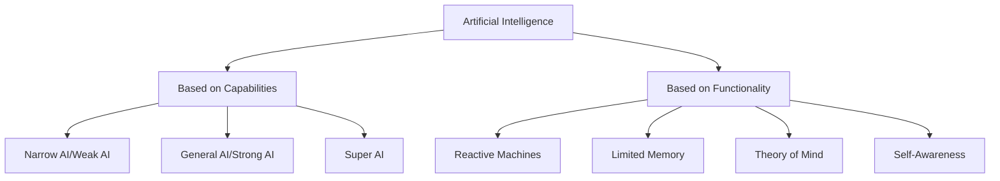
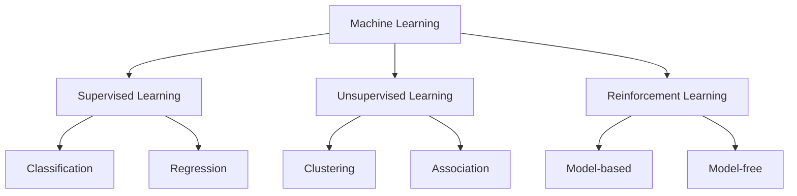
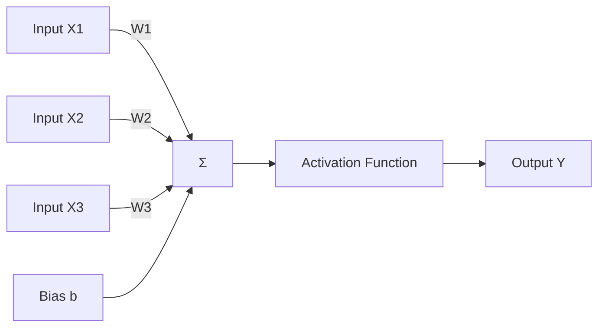
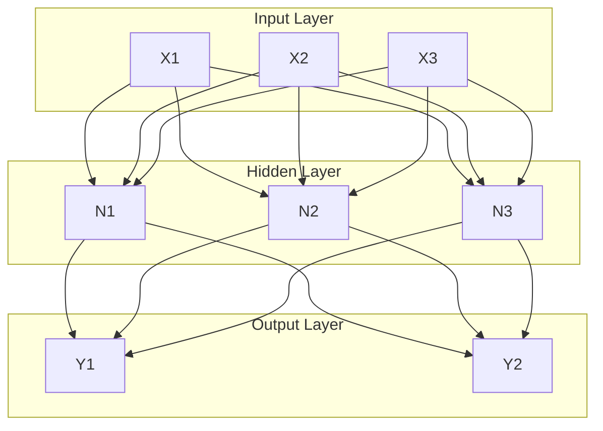
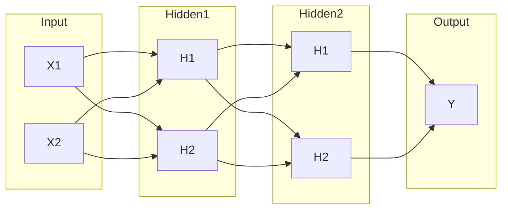

## Question 1(a) [3 marks]

**What is Word Embedding technique? List out different word embedding techniques.**

**Answer**:

**Word Embedding** is a technique that converts words into numerical vectors while preserving semantic relationships between words. It represents words as dense vectors in a high-dimensional space where similar words are closer together.

**Table: Different Word Embedding Techniques**

| Technique | Description | Key Feature |
|-----------|-------------|-------------|
| **TF-IDF** | Term Frequency-Inverse Document Frequency | Statistical measure |
| **Bag of Words (BoW)** | Frequency-based representation | Simple counting method |
| **Word2Vec** | Neural network-based embedding | Captures semantic relationships |
| **GloVe** | Global Vectors for word representation | Combines global and local statistics |

- **TF-IDF**: Measures word importance in documents
- **BoW**: Creates vocabulary-based vectors
- **Word2Vec**: Uses CBOW and Skip-gram models
- **GloVe**: Pre-trained embeddings with global context

**Mnemonic:** "TB-WG" (TF-IDF, BoW, Word2Vec, GloVe)

## Question 1(b) [4 marks]

**Categorize the different types of Artificial Intelligence and demonstrate it with a diagram.**

**Answer**:

AI can be categorized based on **capabilities** and **functionality**.

**Diagram:**



**Table: AI Types Comparison**

| Category | Type | Description | Example |
|----------|------|-------------|---------|
| **Capabilities** | Narrow AI | Task-specific intelligence | Siri, Chess programs |
| | General AI | Human-level intelligence | Not yet achieved |
| | Super AI | Beyond human intelligence | Theoretical concept |
| **Functionality** | Reactive | No memory, responds to stimuli | Deep Blue |
| | Limited Memory | Uses past data | Self-driving cars |

**Mnemonic:** "NGS-RLT" (Narrow-General-Super, Reactive-Limited-Theory)

## Question 1(c) [7 marks]

**Explain NLU and NLG by giving difference.**

**Answer**:

**Natural Language Understanding (NLU)** and **Natural Language Generation (NLG)** are two key components of Natural Language Processing.

**Table: NLU vs NLG Comparison**

| Aspect | NLU | NLG |
|--------|-----|-----|
| **Purpose** | Understands human language | Generates human language |
| **Direction** | Input processing | Output generation |
| **Function** | Interprets meaning | Creates text |
| **Process** | Analysis and comprehension | Synthesis and creation |
| **Examples** | Intent recognition, sentiment analysis | Chatbot responses, report generation |
| **Challenges** | Ambiguity resolution | Natural text generation |

**Detailed Explanation:**

- **NLU (Natural Language Understanding)**:
  - Converts unstructured text into structured data
  - Performs semantic analysis and intent extraction
  - Handles ambiguity and context understanding

- **NLG (Natural Language Generation)**:
  - Converts structured data into natural language
  - Creates coherent and contextually appropriate text
  - Ensures grammatical correctness and fluency

**Mnemonic:** "UI-OG" (Understanding Input, Output Generation)

## Question 1(c) OR [7 marks]

**List out various Industries where Artificial Intelligence is used and explain any two.**

**Answer**:

**Table: AI Applications in Industries**

| Industry | AI Applications | Benefits |
|----------|----------------|----------|
| **Healthcare** | Diagnosis, drug discovery | Improved accuracy |
| **Finance** | Fraud detection, trading | Risk management |
| **Manufacturing** | Quality control, predictive maintenance | Efficiency |
| **Transportation** | Autonomous vehicles, route optimization | Safety |
| **Retail** | Recommendation systems, inventory | Personalization |
| **Education** | Personalized learning, assessment | Adaptive teaching |

**Detailed Explanation of Two Industries:**

**1. Healthcare Industry:**

- **Medical Diagnosis**: AI analyzes medical images and patient data
- **Drug Discovery**: Accelerates identification of potential medicines
- **Personalized Treatment**: Tailors therapy based on patient genetics
- **Benefits**: Faster diagnosis, reduced errors, improved outcomes

**2. Finance Industry:**

- **Fraud Detection**: Identifies suspicious transactions in real-time
- **Algorithmic Trading**: Automated trading based on market patterns
- **Credit Scoring**: Assesses loan default risk accurately
- **Benefits**: Enhanced security, faster processing, better risk management

**Mnemonic:** "HF-MR-TE" (Healthcare-Finance, Manufacturing-Retail-Transportation-Education)

## Question 2(a) [3 marks]

**Define the term Machine Learning. Draw the classification diagram of Machine Learning.**

**Answer**:

**Machine Learning** is a subset of AI that enables computers to learn and improve from experience without being explicitly programmed. It uses algorithms to analyze data, identify patterns, and make predictions.

**Diagram:**



- **Supervised**: Uses labeled training data
- **Unsupervised**: Finds patterns in unlabeled data
- **Reinforcement**: Learns through rewards and penalties

**Mnemonic:** "SUR" (Supervised-Unsupervised-Reinforcement)

## Question 2(b) [4 marks]

**Differentiate Positive reinforcement and Negative reinforcement.**

**Answer**:

**Table: Positive vs Negative Reinforcement**

| Aspect | Positive Reinforcement | Negative Reinforcement |
|--------|----------------------|----------------------|
| **Definition** | Adding reward for good behavior | Removing unpleasant stimulus |
| **Action** | Gives something pleasant | Takes away something unpleasant |
| **Purpose** | Increase desired behavior | Increase desired behavior |
| **Example** | Bonus for good performance | Removing alarm after waking up |
| **Effect** | Motivation through rewards | Motivation through relief |
| **Agent Response** | Seeks to repeat action | Avoids negative consequences |

**Key Points:**

- **Positive Reinforcement**: Strengthens behavior by adding positive stimulus
- **Negative Reinforcement**: Strengthens behavior by removing negative stimulus
- **Both types**: Aim to increase the likelihood of desired behavior
- **Difference**: Method of encouragement (add vs remove)

**Mnemonic:** "AR-RN" (Add Reward, Remove Negative)

## Question 2(c) [7 marks]

**Compare Supervised and Unsupervised learning.**

**Answer**:

**Table: Supervised vs Unsupervised Learning**

| Parameter | Supervised Learning | Unsupervised Learning |
|-----------|-------------------|---------------------|
| **Data Type** | Labeled data (input-output pairs) | Unlabeled data (only inputs) |
| **Learning Goal** | Predict outcomes | Find hidden patterns |
| **Feedback** | Has correct answers | No correct answers |
| **Algorithms** | SVM, Decision Trees, Neural Networks | K-means, Hierarchical clustering |
| **Applications** | Classification, Regression | Clustering, Association rules |
| **Accuracy** | Can be measured | Difficult to measure |
| **Complexity** | Less complex | More complex |
| **Examples** | Email spam detection, Price prediction | Customer segmentation, Market basket analysis |

**Detailed Comparison:**

- **Supervised Learning**:
  - Requires training data with known outcomes
  - Performance can be easily evaluated
  - Used for prediction tasks

- **Unsupervised Learning**:
  - Works with data without predefined labels
  - Discovers hidden structures in data
  - Used for exploratory data analysis

**Mnemonic:** "LP-PF" (Labeled Prediction, Pattern Finding)

## Question 2(a) OR [3 marks]

**Define: Classification, Regression, and clustering.**

**Answer**:

**Table: ML Task Definitions**

| Task | Definition | Output Type | Example |
|------|------------|-------------|---------|
| **Classification** | Predicts discrete categories/classes | Categorical | Email: Spam/Not Spam |
| **Regression** | Predicts continuous numerical values | Numerical | House price prediction |
| **Clustering** | Groups similar data points | Groups/Clusters | Customer segmentation |

**Detailed Definitions:**

- **Classification**: Assigns input data to predefined categories based on learned patterns
- **Regression**: Estimates relationships between variables to predict continuous values
- **Clustering**: Discovers natural groupings in data without prior knowledge of groups

**Mnemonic:** "CRC" (Categories, Real numbers, Clusters)

## Question 2(b) OR [4 marks]

**Compare Artificial Neural Network and Biological Neural Network.**

**Answer**:

**Table: ANN vs Biological Neural Network**

| Aspect | Artificial Neural Network | Biological Neural Network |
|--------|--------------------------|---------------------------|
| **Processing** | Digital/Binary | Analog |
| **Speed** | Fast processing | Slower processing |
| **Learning** | Backpropagation algorithm | Synaptic plasticity |
| **Memory** | Separate storage | Distributed in connections |
| **Structure** | Layered architecture | Complex 3D structure |
| **Fault Tolerance** | Low | High |
| **Energy** | High power consumption | Low energy consumption |
| **Parallelism** | Limited parallel processing | Massive parallel processing |

**Key Differences:**

- **ANN**: Mathematical model inspired by brain
- **Biological**: Actual brain neural networks
- **Purpose**: ANN for computation, Biological for cognition
- **Adaptability**: Biological networks more flexible

**Mnemonic:** "DSML-CFEP" (Digital-Speed-Memory-Layer vs Complex-Fault-Energy-Parallel)

## Question 2(c) OR [7 marks]

**List out various applications of supervised, unsupervised and reinforcement learning.**

**Answer**:

**Table: Applications of Different Learning Types**

| Learning Type | Applications | Real-world Examples |
|---------------|-------------|-------------------|
| **Supervised** | Email classification, Medical diagnosis, Stock prediction, Credit scoring | Gmail spam filter, X-ray analysis, Trading algorithms |
| **Unsupervised** | Customer segmentation, Anomaly detection, Data compression | Market research, Fraud detection, Image compression |
| **Reinforcement** | Game playing, Robotics, Autonomous vehicles, Resource allocation | AlphaGo, Robot navigation, Self-driving cars |

**Detailed Applications:**

**Supervised Learning:**

- **Classification**: Spam detection, sentiment analysis, image recognition
- **Regression**: Price forecasting, weather prediction, sales estimation

**Unsupervised Learning:**

- **Clustering**: Market segmentation, gene sequencing, recommendation systems
- **Association**: Market basket analysis, web usage patterns

**Reinforcement Learning:**

- **Control Systems**: Robot control, traffic management
- **Optimization**: Resource scheduling, portfolio management

**Mnemonic:** "SCR-CRO" (Supervised-Classification-Regression, Unsupervised-Clustering-Association, Reinforcement-Control-Optimization)

## Question 3(a) [3 marks]

**Explain Single Layer Forward Network with proper diagram.**

**Answer**:

A **Single Layer Forward Network** (Perceptron) is the simplest neural network with one layer of weights between input and output.

**Diagram:**



**Components:**

- **Inputs**: X1, X2, X3 (feature values)
- **Weights**: W1, W2, W3 (connection strengths)
- **Bias**: Additional parameter for threshold adjustment
- **Summation**: Weighted sum of inputs
- **Activation**: Function to produce output

**Mathematical Formula:**
Y = f(Σ(Wi × Xi) + b)

**Mnemonic:** "IWSA" (Input-Weight-Sum-Activation)

## Question 3(b) [4 marks]

**Write a short note on Backpropagation.**

**Answer**:

**Backpropagation** is a supervised learning algorithm used to train neural networks by adjusting weights based on error calculation.

**Table: Backpropagation Process**

| Phase | Description | Action |
|-------|-------------|--------|
| **Forward Pass** | Input propagates through network | Calculate output |
| **Error Calculation** | Compare output with target | Find error/loss |
| **Backward Pass** | Error propagates backward | Update weights |
| **Weight Update** | Adjust weights using gradient | Minimize error |

**Key Features:**

- **Gradient Descent**: Uses calculus to find optimal weights
- **Chain Rule**: Calculates error contribution of each weight
- **Iterative Process**: Repeats until convergence
- **Learning Rate**: Controls speed of weight updates

**Steps:**

1. Initialize random weights
2. Forward propagation to get output
3. Calculate error between actual and predicted
4. Backward propagation to update weights

**Mnemonic:** "FCBU" (Forward-Calculate-Backward-Update)

## Question 3(c) [7 marks]

**Explain the components of architecture of Feed Forward Neuron Network.**

**Answer**:

**Feed Forward Neural Network** consists of multiple layers where information flows in one direction from input to output.

**Diagram:**



**Components:**

**1. Input Layer:**

- Receives raw data
- No processing, just distribution
- Number of neurons = number of features

**2. Hidden Layer(s):**

- Performs computation and transformation
- Contains activation functions
- Can have multiple hidden layers

**3. Output Layer:**

- Produces final results
- Number of neurons = number of outputs
- Uses appropriate activation for task type

**4. Weights and Biases:**

- **Weights**: Connection strengths between neurons
- **Biases**: Threshold adjustment parameters

**5. Activation Functions:**

- Introduce non-linearity
- Common types: ReLU, Sigmoid, Tanh

**Mnemonic:** "IHO-WA" (Input-Hidden-Output, Weights-Activation)

## Question 3(a) OR [3 marks]

**Explain Multilayer Feed Forward ANN with diagram.**

**Answer**:

**Multilayer Feed Forward ANN** contains multiple hidden layers between input and output layers, enabling complex pattern recognition.

**Diagram:**



**Characteristics:**

- **Deep Architecture**: Multiple hidden layers
- **Complex Patterns**: Can learn non-linear relationships  
- **Universal Approximator**: Can approximate any continuous function

**Mnemonic:** "MDC" (Multiple layers, Deep learning, Complex patterns)

## Question 3(b) OR [4 marks]

**Explain 'ReLU is the most commonly used Activation function.'**

**Answer**:

**ReLU (Rectified Linear Unit)** is widely used due to its simplicity and effectiveness in deep networks.

**Table: Why ReLU is Popular**

| Advantage | Description | Benefit |
|-----------|-------------|---------|
| **Computational Efficiency** | Simple max(0,x) operation | Fast processing |
| **Gradient Flow** | No vanishing gradient for positive values | Better learning |
| **Sparsity** | Outputs zero for negative inputs | Efficient representation |
| **Non-linearity** | Introduces non-linear behavior | Complex pattern learning |

**Mathematical Definition:**
f(x) = max(0, x)

**Comparison with Other Functions:**

- **vs Sigmoid**: No saturation problem, faster computation
- **vs Tanh**: Simpler calculation, better gradient flow
- **Limitations**: Dead neurons problem for negative inputs

**Why Most Common:**

- Solves vanishing gradient problem
- Computationally efficient
- Works well in practice
- Default choice for hidden layers

**Mnemonic:** "CGSN" (Computational, Gradient, Sparsity, Non-linear)

## Question 3(c) OR [7 marks]

**Explain step by step learning process of Artificial Neural Network.**

**Answer**:

**ANN Learning Process** involves iterative weight adjustment to minimize prediction error.

**Table: Step-by-Step Learning Process**

| Step | Process | Description |
|------|---------|-------------|
| **1. Initialization** | Set random weights | Small random values |
| **2. Forward Propagation** | Calculate output | Input → Hidden → Output |
| **3. Error Calculation** | Compare with target | Loss function computation |
| **4. Backward Propagation** | Calculate gradients | Error → Hidden ← Input |
| **5. Weight Update** | Adjust parameters | Gradient descent |
| **6. Iteration** | Repeat process | Until convergence |

**Detailed Steps:**

**Step 1: Initialize Weights**

- Assign small random values to all weights and biases
- Prevents symmetry breaking problem

**Step 2: Forward Propagation**

- Input data flows through network layers
- Each neuron computes weighted sum + activation

**Step 3: Calculate Error**

- Compare network output with desired output
- Use loss functions like MSE or Cross-entropy

**Step 4: Backward Propagation**

- Calculate error gradient for each weight
- Use chain rule to propagate error backward

**Step 5: Update Weights**

- Adjust weights using gradient descent
- New_weight = Old_weight - (learning_rate × gradient)

**Step 6: Repeat Process**

- Continue until error converges or maximum epochs reached
- Monitor validation performance to avoid overfitting

**Mnemonic:** "IFEBWI" (Initialize-Forward-Error-Backward-Weight-Iterate)

## Question 4(a) [3 marks]

**List out various advantages and disadvantages of Natural Language Processing.**

**Answer**:

**Table: NLP Advantages and Disadvantages**

| Advantages | Disadvantages |
|------------|---------------|
| **Automation** of text processing | **Ambiguity** in human language |
| **24/7 Availability** for customer service | **Context Understanding** challenges |
| **Multilingual Support** capabilities | **Cultural Nuances** difficulty |
| **Scalability** for large datasets | **High Computational** requirements |
| **Consistency** in responses | **Data Privacy** concerns |
| **Cost Reduction** in operations | **Limited Creativity** in responses |

**Key Points:**

- **Advantages**: Efficiency, accessibility, consistency
- **Disadvantages**: Complexity, resource requirements, limitations
- **Balance**: Benefits outweigh challenges in many applications

**Mnemonic:** "AMS-ACC" (Automation-Multilingual-Scalability vs Ambiguity-Context-Computational)

## Question 4(b) [4 marks]

**List out preprocessing techniques in NLP and demonstrate any one with a python program.**

**Answer**:

**Table: NLP Preprocessing Techniques**

| Technique | Purpose | Example |
|-----------|---------|---------|
| **Tokenization** | Split text into words/sentences | "Hello world" → ["Hello", "world"] |
| **Stop Words Removal** | Remove common words | Remove "the", "is", "and" |
| **Stemming** | Reduce words to root form | "running" → "run" |
| **Lemmatization** | Convert to dictionary form | "better" → "good" |
| **POS Tagging** | Identify parts of speech | "run" → verb |
| **Named Entity Recognition** | Identify entities | "Apple" → Organization |

**Python Program - Tokenization:**

```python
import nltk
from nltk.tokenize import word_tokenize, sent_tokenize

# Sample text
text = "Natural Language Processing is amazing. It helps computers understand human language."

# Word tokenization
words = word_tokenize(text)
print("Words:", words)

# Sentence tokenization  
sentences = sent_tokenize(text)
print("Sentences:", sentences)
```

**Mnemonic:** "TSSL-PN" (Tokenization-Stop-Stemming-Lemmatization, POS-NER)

## Question 4(c) [7 marks]

**Explain the phases of NLP.**

**Answer**:

**NLP Phases** represent the systematic approach to process and understand natural language.

**Table: NLP Phases**

| Phase | Description | Process | Example |
|-------|-------------|---------|---------|
| **Lexical Analysis** | Tokenization and word identification | Break text into tokens | "I am happy" → ["I", "am", "happy"] |
| **Syntactic Analysis** | Grammar and sentence structure | Parse trees, POS tagging | Identify noun, verb, adjective |
| **Semantic Analysis** | Meaning extraction | Word sense disambiguation | "Bank" → financial vs river |
| **Discourse Integration** | Context across sentences | Resolve pronouns, references | "He" refers to "John" |
| **Pragmatic Analysis** | Intent and context understanding | Consider situation/culture | Sarcasm, idioms interpretation |

**Detailed Explanation:**

**1. Lexical Analysis:**

- First phase of NLP pipeline
- Converts character stream into tokens
- Removes punctuation and special characters

**2. Syntactic Analysis:**

- Analyzes grammatical structure
- Creates parse trees
- Identifies sentence components

**3. Semantic Analysis:**

- Extracts meaning from text
- Handles word ambiguity
- Maps words to concepts

**4. Discourse Integration:**

- Analyzes text beyond sentence level
- Maintains context across sentences
- Resolves references and connections

**5. Pragmatic Analysis:**

- Considers real-world context
- Understands speaker's intent
- Handles figurative language

**Mnemaid Diagram:**


**Mnemonic:** "LSSDP" (Lexical-Syntactic-Semantic-Discourse-Pragmatic)

## Question 4(a) OR [3 marks]

**What is Natural Language Processing? List out its applications.**

**Answer**:

**Natural Language Processing (NLP)** is a branch of AI that enables computers to understand, interpret, and generate human language in a meaningful way.

**Table: NLP Applications**

| Category | Applications | Examples |
|----------|-------------|----------|
| **Communication** | Chatbots, Virtual assistants | Siri, Alexa, ChatGPT |
| **Translation** | Language translation | Google Translate |
| **Analysis** | Sentiment analysis, Text mining | Social media monitoring |
| **Search** | Information retrieval | Search engines |
| **Writing** | Grammar checking, Auto-complete | Grammarly, predictive text |
| **Business** | Document processing, Spam detection | Email filtering |

**Key Applications:**

- **Machine Translation**: Converting text between languages
- **Speech Recognition**: Converting speech to text
- **Text Summarization**: Creating concise summaries
- **Question Answering**: Providing answers to queries

**Mnemonic:** "CTAS-WB" (Communication-Translation-Analysis-Search, Writing-Business)

## Question 4(b) OR [4 marks]

**List out the tasks performed with WordNet in NLTK and demonstrate anyone with a python code.**

**Answer**:

**Table: WordNet Tasks in NLTK**

| Task | Description | Purpose |
|------|-------------|---------|
| **Synsets** | Find synonymous words | Word similarity |
| **Definitions** | Get word meanings | Understanding context |
| **Examples** | Usage examples | Practical application |
| **Hyponyms** | Find specific terms | Hierarchical relationships |
| **Hypernyms** | Find general terms | Category identification |
| **Antonyms** | Find opposite words | Contrast analysis |

**Python Code - Synsets and Definitions:**

```python
from nltk.corpus import wordnet

# Get synsets for word 'good'
synsets = wordnet.synsets('good')
print("Synsets:", synsets)

# Get definition
definition = synsets[0].definition()
print("Definition:", definition)

# Get examples
examples = synsets[0].examples()
print("Examples:", examples)
```

**Mnemonic:** "SDEHA" (Synsets-Definitions-Examples-Hyponyms-Antonyms)

## Question 4(c) OR [7 marks]

**Explain the types of ambiguities in NLP.**

**Answer**:

**NLP Ambiguities** occur when text can be interpreted in multiple ways, creating challenges for automated understanding.

**Table: Types of Ambiguities**

| Type | Description | Example | Resolution |
|------|-------------|---------|-----------|
| **Lexical** | Multiple meanings of single word | "Bank" (financial/river) | Context analysis |
| **Syntactic** | Multiple grammatical interpretations | "Flying planes can be dangerous" | Parse trees |
| **Semantic** | Multiple meanings at sentence level | "Time flies like an arrow" | Semantic analysis |
| **Pragmatic** | Context-dependent interpretation | "Can you pass the salt?" | Situational context |
| **Referential** | Unclear pronoun references | "John told Bob he was wrong" | Discourse analysis |

**Detailed Explanation:**

**1. Lexical Ambiguity:**

- Same word, different meanings
- Homonyms and polysemes
- Example: "Bat" (animal/sports equipment)

**2. Syntactic Ambiguity:**

- Multiple grammatical structures
- Different parse trees possible
- Example: "I saw a man with a telescope"

**3. Semantic Ambiguity:**

- Sentence-level meaning confusion
- Multiple interpretations possible
- Example: "Visiting relatives can be boring"

**4. Pragmatic Ambiguity:**

- Context and intent dependent
- Cultural and situational factors
- Example: Sarcasm and indirect requests

**5. Referential Ambiguity:**

- Unclear references to entities
- Pronoun resolution challenges
- Example: Multiple possible antecedents

**Resolution Strategies:**

- Context analysis and machine learning
- Statistical disambiguation methods
- Knowledge bases and ontologies

**Mnemonic:** "LSSPR" (Lexical-Syntactic-Semantic-Pragmatic-Referential)

## Question 5(a) [3 marks]

**Explain Bag of Words with example.**

**Answer**:

**Bag of Words (BoW)** is a text representation method that converts text into numerical vectors based on word frequency, ignoring grammar and word order.

**Table: BoW Process**

| Step | Process | Description |
|------|---------|-------------|
| **1. Tokenization** | Split text into words | Create vocabulary |
| **2. Vocabulary Creation** | Unique words collection | Dictionary of terms |
| **3. Vector Creation** | Count word frequencies | Numerical representation |

**Example:**

Documents:

- Doc1: "I love machine learning"
- Doc2: "Machine learning is amazing"

**Vocabulary:** [I, love, machine, learning, is, amazing]

**BoW Vectors:**

- Doc1: [1, 1, 1, 1, 0, 0]
- Doc2: [0, 0, 1, 1, 1, 1]

**Characteristics:**

- **Order Independent**: Word sequence ignored
- **Frequency Based**: Counts word occurrences
- **Sparse Representation**: Many zero values

**Mnemonic:** "TVC" (Tokenize-Vocabulary-Count)

## Question 5(b) [4 marks]

**What is Word2Vec? Explain its steps.**

**Answer**:

**Word2Vec** is a neural network-based technique that creates dense vector representations of words by learning from their context in large text corpora.

**Table: Word2Vec Models**

| Model | Approach | Prediction |
|-------|----------|------------|
| **CBOW** | Continuous Bag of Words | Context → Target word |
| **Skip-gram** | Skip-gram with Negative Sampling | Target word → Context |

**Steps of Word2Vec:**

**1. Data Preparation:**

- Collect large text corpus
- Clean and preprocess text
- Create training pairs

**2. Model Architecture:**

- Input layer (one-hot encoded words)
- Hidden layer (embedding layer)
- Output layer (softmax for prediction)

**3. Training Process:**

- **CBOW**: Predict target word from context
- **Skip-gram**: Predict context from target word
- Use backpropagation to update weights

**4. Vector Extraction:**

- Extract weight matrix from hidden layer
- Each row represents word embedding
- Typically 100-300 dimensions

**Benefits:**

- Captures semantic relationships
- Similar words have similar vectors
- Supports arithmetic operations (King - Man + Woman = Queen)

**Mnemonic:** "DMAT" (Data-Model-Architecture-Training)

## Question 5(c) [7 marks]

**List out applications of NLP and explain any one in detail.**

**Answer**:

**Table: NLP Applications**

| Application | Description | Industry Use |
|-------------|-------------|--------------|
| **Machine Translation** | Language conversion | Global communication |
| **Sentiment Analysis** | Opinion mining | Social media monitoring |
| **Chatbots** | Conversational AI | Customer service |
| **Text Summarization** | Content condensation | News, research |
| **Speech Recognition** | Voice to text | Virtual assistants |
| **Information Extraction** | Data mining from text | Business intelligence |
| **Question Answering** | Automated responses | Search engines |
| **Spam Detection** | Email filtering | Cybersecurity |

**Detailed Explanation: Sentiment Analysis**

**Sentiment Analysis** is the process of determining emotional tone and opinions expressed in text data.

**Components:**

- **Text Preprocessing**: Cleaning and tokenization
- **Feature Extraction**: TF-IDF, word embeddings
- **Classification**: Positive, negative, neutral
- **Confidence Scoring**: Strength of sentiment

**Process Steps:**

1. **Data Collection**: Gather text from reviews, social media
2. **Preprocessing**: Remove noise, normalize text
3. **Feature Engineering**: Convert text to numerical features
4. **Model Training**: Use ML algorithms for classification
5. **Prediction**: Classify new text sentiment
6. **Evaluation**: Measure accuracy and performance

**Applications:**

- **Brand Monitoring**: Track customer opinions
- **Product Reviews**: Analyze customer feedback
- **Social Media**: Monitor public sentiment
- **Market Research**: Understand consumer preferences

**Mnemonic:** "MSCTSIQ-S" (Machine-Sentiment-Chatbot-Text-Speech-Information-Question-Spam)

## Question 5(a) OR [3 marks]

**Explain TFIDF with example.**

**Answer**:

**TF-IDF (Term Frequency-Inverse Document Frequency)** measures word importance in a document relative to a collection of documents.

**Formula:**
TF-IDF = TF(t,d) × IDF(t)

Where:

- TF(t,d) = (Number of times term t appears in document d) / (Total terms in document d)
- IDF(t) = log(Total documents / Documents containing term t)

**Example:**

Documents:

- Doc1: "machine learning is good"
- Doc2: "learning algorithms are good"
- Doc3: "machine algorithms work well"

**Table: TF-IDF Calculation for "machine"**

| Document | TF | IDF | TF-IDF |
|----------|----|----|--------|
| Doc1 | 1/4 = 0.25 | log(3/2) = 0.18 | 0.25 × 0.18 = 0.045 |
| Doc2 | 0/4 = 0 | log(3/2) = 0.18 | 0 × 0.18 = 0 |
| Doc3 | 1/4 = 0.25 | log(3/2) = 0.18 | 0.25 × 0.18 = 0.045 |

**Key Points:**

- **High TF-IDF**: Important word in specific document
- **Low TF-IDF**: Common word across documents
- **Applications**: Information retrieval, text mining

**Mnemonic:** "TI-FD" (Term frequency, Inverse Document frequency)

## Question 5(b) OR [4 marks]

**Explain about challenges with TFIDF and BOW.**

**Answer**:

**Table: Challenges with TF-IDF and BOW**

| Challenge | TF-IDF | BOW | Impact |
|-----------|--------|-----|--------|
| **Semantic Understanding** | Cannot capture meaning | Ignores word relationships | Poor context understanding |
| **Word Order** | Position ignored | Sequence lost | Grammar meaning lost |
| **Sparsity** | High-dimensional vectors | Many zero values | Memory inefficient |
| **Vocabulary Size** | Large feature space | Grows with corpus | Computational complexity |
| **Out-of-Vocabulary** | Unknown words ignored | New words not handled | Limited generalization |
| **Polysemy** | Multiple meanings | Same treatment for different senses | Ambiguity issues |

**Detailed Challenges:**

**1. Lack of Semantic Understanding:**

- Words treated as independent features
- Cannot understand synonyms or related concepts
- "Good" and "excellent" treated differently

**2. Loss of Word Order:**

- "Dog bites man" vs "Man bites dog" same representation
- Context and grammar information lost
- Sentence structure ignored

**3. High Dimensionality:**

- Vector size equals vocabulary size
- Sparse matrices with mostly zeros
- Storage and computation problems

**4. Context Insensitivity:**

- Same word different contexts treated equally
- "Apple" company vs fruit same representation
- Polysemy and homonymy issues

**Solutions:**

- **Word Embeddings**: Word2Vec, GloVe
- **Contextual Models**: BERT, GPT
- **N-grams**: Capture some word order
- **Dimensionality Reduction**: PCA, SVD

**Mnemonic:** "SSVO-CP" (Semantic-Sequence-Vocabulary-OOV, Context-Polysemy)

## Question 5(c) OR [7 marks]

**Explain the working of GloVe.**

**Answer**:

**GloVe (Global Vectors for Word Representation)** combines global statistical information with local context windows to create word embeddings.

**Table: GloVe vs Other Methods**

| Aspect | GloVe | Word2Vec | Traditional Methods |
|--------|-------|----------|-------------------|
| **Approach** | Global + Local statistics | Local context windows | Frequency-based |
| **Training** | Matrix factorization | Neural networks | Counting methods |
| **Efficiency** | Fast training | Slower training | Very fast |
| **Performance** | High accuracy | Good accuracy | Limited performance |

**Working Process:**

**1. Co-occurrence Matrix Construction:**

- Count word co-occurrences in context windows
- Create global statistics matrix
- Xij = number of times word j appears in context of word i

**2. Ratio Calculation:**

- Calculate probability ratios
- P(k|i) = Xik / Xi (probability of word k given word i)
- Focus on meaningful ratios between probabilities

**3. Objective Function:**

- Minimize weighted least squares objective
- J = Σ f(Xij)(wi^T wj + bi + bj - log Xij)²
- Where f(x) is weighting function

**4. Vector Learning:**

- Use gradient descent to optimize objective
- Learn word vectors wi and context vectors wj
- Final representation combines both vectors

**Key Features:**

**Global Statistics:**

- Uses entire corpus information
- Captures global word relationships
- More stable than local methods

**Efficiency:**

- Trains on co-occurrence statistics
- Faster than neural network methods
- Scalable to large corpora

**Performance:**

- Performs well on analogy tasks
- Captures both semantic and syntactic relationships
- Good performance on similarity tasks

**Mathematical Foundation:**

```
J = Σ(i,j=1 to V) f(Xij)(wi^T wj + bi + bj - log Xij)²
```

Where:

- V = vocabulary size
- Xij = co-occurrence count
- wi, wj = word vectors
- bi, bj = bias terms
- f(x) = weighting function

**Advantages:**

- **Combines Benefits**: Global statistics + local context
- **Interpretable**: Clear mathematical foundation
- **Efficient**: Faster training than Word2Vec
- **Effective**: Good performance on various tasks

**Applications:**

- **Word Similarity**: Find related words
- **Analogy Tasks**: King - Man + Woman = Queen
- **Text Classification**: Feature representation
- **Machine Translation**: Cross-lingual mappings

**Mnemonic:** "CROF-PGAE" (Co-occurrence-Ratio-Objective-Function, Performance-Global-Advantage-Efficiency)
