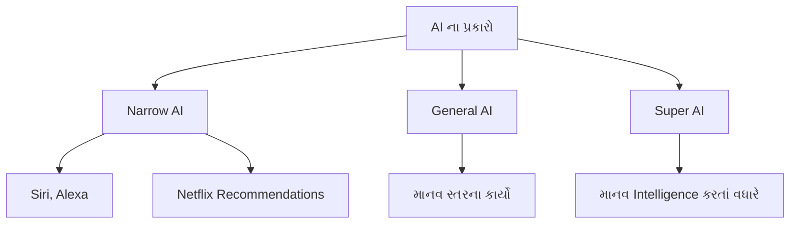
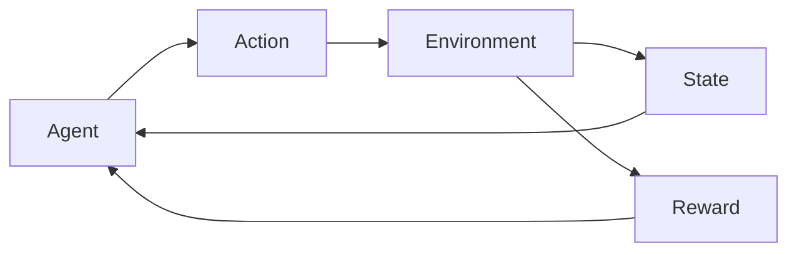
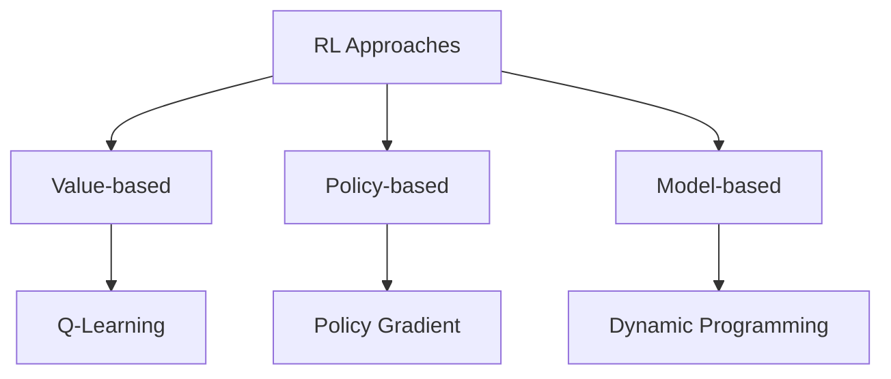
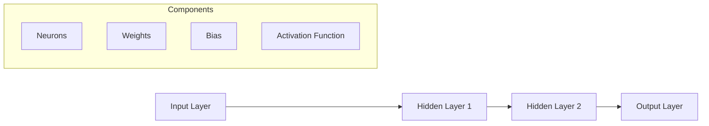
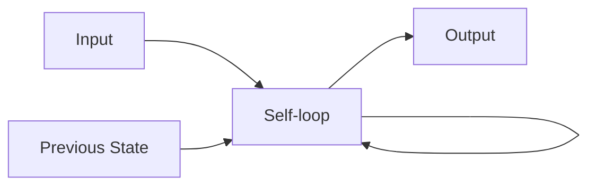
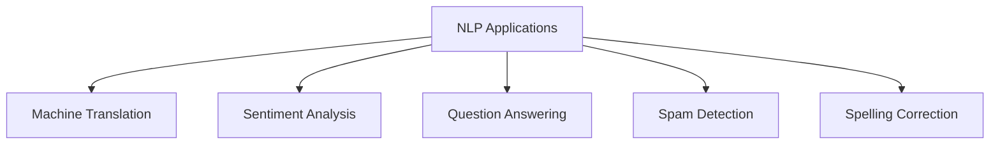

## પ્રશ્ન 1(અ) [3 ગુણ]

**નીચેની terms ની વ્યાખ્યા આપો: (1) Artificial Intelligence (2) Expert System.**

**જવાબ**:

| Term | વ્યાખ્યા |
|------|---------|
| **Artificial Intelligence** | AI એ computer science ની એક શાખા છે જે એવા machines બનાવે છે જે સામાન્ય રીતે માનવ બુદ્ધિની જરૂર પડતા કાર્યો કરી શકે છે, જેમ કે learning, reasoning અને problem-solving. |
| **Expert System** | Expert system એ એક computer program છે જે knowledge અને inference rules નો ઉપયોગ કરીને એવી problems solve કરે છે જેમાં સામાન્ય રીતે ચોક્કસ ક્ષેત્રમાં માનવ expertise ની જરૂર પડે છે. |

- **AI ની વિશેષતાઓ**: Learning, reasoning, perception
- **Expert system ના ભાગો**: Knowledge base, inference engine

**મેમરી ટ્રીક:** "AI શીખે છે, Expert સલાહ આપે છે"

## પ્રશ્ન 1(બ) [4 ગુણ]

**Biological Neural Network અને Artificial Neural Network ની સરખામણી કરો.**

**જવાબ**:

| પાસું | Biological Neural Network | Artificial Neural Network |
|------|---------------------------|---------------------------|
| **Processing** | Parallel processing | Sequential/parallel processing |
| **ઝડપ** | ધીમી (milliseconds) | ઝડપી (nanoseconds) |
| **શીખવું** | સતત શીખવું | Batch/online learning |
| **Storage** | વિતરિત storage | કેન્દ્રિય storage |

- **Biological**: જટિલ, fault-tolerant, સ્વ-સુધારણા કરે છે
- **Artificial**: સરળ, ચોક્કસ, programmable

**મેમરી ટ્રીક:** "Bio જટિલ છે, AI સરળ છે"

## પ્રશ્ન 1(ક) [7 ગુણ]

**AI ના પ્રકારો તેની applications સાથે સમજાવો.**

**જવાબ**:

| AI નો પ્રકાર | વર્ણન | Applications |
|-------------|--------|-------------|
| **Narrow AI** | ચોક્કસ કાર્યો માટે design કરેલ AI | Voice assistants, recommendation systems |
| **General AI** | માનવ સ્તરની intelligence વાળી AI | હજુ સુધી પ્રાપ્ત નથી |
| **Super AI** | માનવ intelligence કરતાં વધારે AI | સૈદ્ધાંતિક વિભાવના |



- **હાલનું focus**: Narrow AI આજના applications પર પ્રભુત્વ ધરાવે છે
- **ભવિષ્યનું લક્ષ્ય**: General AI ને સુરક્ષિત રીતે પ્રાપ્ત કરવું

**મેમરી ટ્રીક:** "હવે Narrow, લક્ષ્ય General, Super ડરામણી"

## પ્રશ્ન 1(ક) અથવા [7 ગુણ]

**AI ethics અને limitations સમજાવો.**

**જવાબ**:

| Ethics નું પાસું | વર્ણન |
|----------------|--------|
| **Privacy** | વ્યક્તિગત data અને user information ની સુરક્ષા |
| **Bias** | વિવિધ જૂથોમાં નિષ્પક્ષતા સુનિશ્ચિત કરવી |
| **Transparency** | AI નિર્ણયોને સમજાવી શકાય તેવા બનાવવા |
| **Accountability** | AI actions માટે જવાબદારી નક્કી કરવી |

**મર્યાદાઓ:**

- **Data dependency**: મોટા, ગુણવત્તાવાળા datasets ની જરૂર
- **Computational power**: નોંધપાત્ર processing resources ની જરૂર
- **Creativity નો અભાવ**: ખરેખર મૌલિક concepts બનાવી શકતી નથી

**મેમરી ટ્રીક:** "Privacy, Bias, Transparency, Accountability"

## પ્રશ્ન 2(અ) [3 ગુણ]

**નીચેની terms ની વ્યાખ્યા આપો: (1) Well posed Learning Problem (2) Machine Learning.**

**જવાબ**:

| Term | વ્યાખ્યા |
|------|---------|
| **Well posed Learning Problem** | એક learning problem જેમાં સ્પષ્ટ રીતે વ્યાખ્યાયિત task (T), performance measure (P), અને experience (E) હોય જ્યાં experience સાથે performance સુધરે છે. |
| **Machine Learning** | AI નો એક ભાગ જે computers ને experience થી આપોઆપ શીખવા અને સુધારવા માટે સક્ષમ બનાવે છે, સ્પષ્ટ રીતે program કર્યા વગર. |

- **Well posed formula**: T + P + E = Learning
- **ML નો ફાયદો**: Data થી આપોઆપ સુધારો

**મેમરી ટ્રીક:** "Task, Performance, Experience"

## પ્રશ્ન 2(બ) [4 ગુણ]

**Reinforcement Learning તેમાં ઉપયોગ થતાં terms સાથે સમજાવો.**

**જવાબ**:

| Term | વર્ણન |
|------|-------|
| **Agent** | શીખનાર અથવા નિર્ણય લેનાર |
| **Environment** | જે દુનિયામાં agent કામ કરે છે |
| **Action** | દરેક state માં agent શું કરી શકે છે |
| **State** | Agent ની હાલની સ્થિતિ |
| **Reward** | Environment તરફથી feedback |



- **શીખવાની પ્રક્રિયા**: Trial and error approach
- **લક્ષ્ય**: કુલ reward વધારવું

**મેમરી ટ્રીક:** "Agent કરે છે, Environment State અને Reward આપે છે"

## પ્રશ્ન 2(ક) [7 ગુણ]

**Supervised, Unsupervised અને Reinforcement Learning ની સરખામણી કરો.**

**જવાબ**:

| પાસું | Supervised | Unsupervised | Reinforcement |
|------|------------|--------------|---------------|
| **Data** | Labeled data | Unlabeled data | Interactive data |
| **લક્ષ્ય** | Output predict કરવું | Patterns શોધવા | Reward વધારવું |
| **Feedback** | તુરંત | કોઈ નહીં | વિલંબિત |
| **ઉદાહરણો** | Classification | Clustering | Game playing |

- **Supervised**: શિક્ષક-માર્ગદર્શિત learning
- **Unsupervised**: સ્વ-શોધ learning
- **Reinforcement**: Trial-and-error learning

**મેમરી ટ્રીક:** "Supervised પાસે શિક્ષક, Unsupervised શોધે છે, Reinforcement પ્રયત્ન કરે છે"

## પ્રશ્ન 2(અ) અથવા [3 ગુણ]

**Reinforcement Learning ના key features લખો.**

**જવાબ**:

| Feature | વર્ણન |
|---------|--------|
| **Trial and Error** | પ્રયોગ દ્વારા શીખવું |
| **Delayed Reward** | Actions પછી feedback મળે છે |
| **Sequential Decision** | Actions ભવિષ્યના states ને અસર કરે છે |

- **કોઈ supervisor નથી**: Agent સ્વતંત્ર રીતે શીખે છે
- **Exploration vs Exploitation**: નવા actions અજમાવવા અને જાણીતા સારા actions વાપરવા વચ્ચે સંતુલન

**મેમરી ટ્રીક:** "પ્રયત્ન, વિલંબ, ક્રમ"

## પ્રશ્ન 2(બ) અથવા [4 ગુણ]

**Reinforcement Learning ના પ્રકારો સમજાવો.**

**જવાબ**:

| પ્રકાર | વર્ણન |
|------|--------|
| **Positive RL** | વર્તણૂક વધારવા માટે positive stimulus ઉમેરવું |
| **Negative RL** | વર્તણૂક વધારવા માટે negative stimulus દૂર કરવું |

**Learning આધારિત:**

- **Model-based**: Agent environment model શીખે છે
- **Model-free**: Agent સીધો experience થી શીખે છે

**મેમરી ટ્રીક:** "Positive ઉમેરે, Negative દૂર કરે"

## પ્રશ્ન 2(ક) અથવા [7 ગુણ]

**Reinforcement Learning implement કરવા માટેના approaches સમજાવો.**

**જવાબ**:

| Approach | વર્ણન | ઉદાહરણ |
|----------|--------|---------|
| **Value-based** | States/actions ના value શીખવા | Q-Learning |
| **Policy-based** | Policy સીધી શીખવી | Policy Gradient |
| **Model-based** | Environment model શીખવું | Dynamic Programming |



- **Value-based**: Value functions estimate કરે છે
- **Policy-based**: Policy parameters optimize કરે છે
- **Model-based**: Environment model વાપરે છે

**મેમરી ટ્રીક:** "Value, Policy, Model"

## પ્રશ્ન 3(અ) [3 ગુણ]

**Activation functions ReLU અને sigmoid વર્ણવો.**

**જવાબ**:

| Function | Formula | Range |
|----------|---------|-------|
| **ReLU** | f(x) = max(0, x) | [0, ∞) |
| **Sigmoid** | f(x) = 1/(1 + e^(-x)) | (0, 1) |

- **ReLU નો ફાયદો**: Vanishing gradient problem નથી
- **Sigmoid નો ફાયદો**: Smooth gradient, probabilistic output

**મેમરી ટ્રીક:** "ReLU સુધારે છે, Sigmoid દબાવે છે"

## પ્રશ્ન 3(બ) [4 ગુણ]

**Multi-layer feed forward ANN સમજાવો.**

**જવાબ**:

| Component | વર્ણન |
|-----------|--------|
| **Input Layer** | Input data receive કરે છે |
| **Hidden Layers** | Information process કરે છે (multiple layers) |
| **Output Layer** | Final result બનાવે છે |
| **Connections** | ફક્ત forward direction માં |

- **Information flow**: Input થી output સુધી એક દિશામાં
- **કોઈ cycles નથી**: કોઈ feedback connections નથી

**મેમરી ટ્રીક:** "Input → Hidden → Output (ફક્ત આગળ)"

## પ્રશ્ન 3(ક) [7 ગુણ]

**ANN નું structure દોરો અને તેના દરેક components ની functionality સમજાવો.**

**જવાબ**:



| Component | Functionality |
|-----------|---------------|
| **Neurons** | Processing units જે inputs receive કરે છે અને outputs બનાવે છે |
| **Weights** | Neurons વચ્ચેની connection strengths |
| **Bias** | Activation function ને shift કરવા માટે વધારાનું parameter |
| **Activation Function** | Network માં non-linearity લાવે છે |

- **Input layer**: Input data receive કરે છે અને વિતરિત કરે છે
- **Hidden layers**: Features અને patterns extract કરે છે
- **Output layer**: Final classification અથવા prediction બનાવે છે
- **Connections**: Neurons વચ્ચેની weighted links

**મેમરી ટ્રીક:** "Neurons સાથે Weights, Bias, અને Activation"

## પ્રશ્ન 3(અ) અથવા [3 ગુણ]

**Backpropagation પર ટૂંક નોંધ લખો.**

**જવાબ**:

| પાસું | વર્ણન |
|------|--------|
| **હેતુ** | Neural networks માટે training algorithm |
| **પદ્ધતિ** | Chain rule સાથે gradient descent |
| **દિશા** | પાછળની તરફ error propagation |

- **પ્રક્રિયા**: Network દ્વારા પાછળની તરફ error gradients calculate કરવા
- **Update**: Error ઘટાડવા માટે weights adjust કરવા

**મેમરી ટ્રીક:** "પાછળની તરફ Error Propagation"

## પ્રશ્ન 3(બ) અથવા [4 ગુણ]

**Single-layer feed forward network સમજાવો.**

**જવાબ**:

| Feature | વર્ણન |
|---------|--------|
| **Structure** | Input layer સીધી output layer સાથે connected |
| **Layers** | ફક્ત input અને output layers |
| **મર્યાદાઓ** | ફક્ત linearly separable problems solve કરી શકે |
| **ઉદાહરણ** | Perceptron |

- **ક્ષમતા**: Linear decision boundaries સુધી મર્યાદિત
- **Applications**: સરળ classification tasks

**મેમરી ટ્રીક:** "Single Layer, Linear મર્યાદાઓ"

## પ્રશ્ન 3(ક) અથવા [7 ગુણ]

**Recurrent neural network નું architecture દોરો અને સમજાવો.**

**જવાબ**:



| Component | Function |
|-----------|----------|
| **Hidden State** | પાછલા inputs ની memory રાખે છે |
| **Recurrent Connection** | Hidden state થી તે જ તરફ feedback |
| **Sequence Processing** | Sequential data handle કરે છે |

- **Memory**: પાછલા time steps ની information રાખે છે
- **Applications**: Language modeling, speech recognition
- **ફાયદો**: Variable-length sequences process કરી શકે છે

**મેમરી ટ્રીક:** "Recurrent યાદ રાખે છે, પાછળ Loop કરે છે"

## પ્રશ્ન 4(અ) [3 ગુણ]

**NLP ની વ્યાખ્યા આપો અને તેના advantages લખો.**

**જવાબ**:

| Term | વ્યાખ્યા |
|------|---------|
| **NLP** | Natural Language Processing - computers ને માનવ ભાષા સમજવા, interpret કરવા અને generate કરવા માટે સક્ષમ બનાવે છે |

**Advantages:**

- **Human-computer interaction**: કુદરતી communication
- **Automation**: આપોઆપ text processing અને analysis
- **Accessibility**: વિકલાંગ વપરાશકર્તાઓ માટે voice interfaces

**મેમરી ટ્રીક:** "કુદરતી ભાષા, કુદરતી Interaction"

## પ્રશ્ન 4(બ) [4 ગુણ]

**NLU અને NLG ની સરખામણી કરો.**

**જવાબ**:

| પાસું | NLU (Understanding) | NLG (Generation) |
|------|---------------------|------------------|
| **હેતુ** | માનવ ભાષા interpret કરવી | માનવ ભાષા generate કરવી |
| **Input** | Text/Speech | Structured data |
| **Output** | Structured data | Text/Speech |
| **ઉદાહરણો** | Sentiment analysis | Text summarization |

- **NLU**: Unstructured text ને structured data માં convert કરે છે
- **NLG**: Structured data ને natural text માં convert કરે છે

**મેમરી ટ્રીક:** "NLU સમજે છે, NLG બનાવે છે"

## પ્રશ્ન 4(ક) [7 ગુણ]

**Word tokenization અને frequency distribution of words યોગ્ય ઉદાહરણ સાથે સમજાવો.**

**જવાબ**:

| પ્રક્રિયા | વર્ણન | ઉદાહરણ |
|----------|--------|---------|
| **Tokenization** | Text ને individual words/tokens માં તોડવું | "Hello world" → ["Hello", "world"] |
| **Frequency Distribution** | દરેક token ની occurrence count કરવી | {"Hello": 1, "world": 1} |

**ઉદાહરણ:**

```
Text: "The cat sat on the mat"
Tokens: ["The", "cat", "sat", "on", "the", "mat"]
Frequency: {"The": 1, "cat": 1, "sat": 1, "on": 1, "the": 1, "mat": 1}
```

- **Case sensitivity**: "The" અને "the" અલગ અલગ count થાય છે
- **Applications**: Text analysis, search engines
- **Preprocessing**: NLP tasks માટે આવશ્યક step

**મેમરી ટ્રીક:** "Tokenize પછી Count"

## પ્રશ્ન 4(અ) અથવા [3 ગુણ]

**NLP ના disadvantages ની યાદી આપો.**

**જવાબ**:

| Disadvantage | વર્ણન |
|--------------|--------|
| **Ambiguity** | Words/sentences ના multiple meanings |
| **Context dependency** | Context સાથે meaning બદલાય છે |
| **Language complexity** | Grammar rules અને exceptions |

- **સાંસ્કૃતિક variations**: અલગ ભાષાઓ, dialects
- **Computational cost**: Resource-intensive processing

**મેમરી ટ્રીક:** "અસ્પષ્ટ, Contextual, જટિલ"

## પ્રશ્ન 4(બ) અથવા [4 ગુણ]

**NLP માં ambiguities ના પ્રકારો સમજાવો.**

**જવાબ**:

| પ્રકાર | વર્ણન | ઉદાહરણ |
|------|--------|---------|
| **Lexical** | Word ના multiple meanings | "Bank" (financial/river) |
| **Syntactic** | Multiple parse trees possible | "I saw a man with a telescope" |
| **Semantic** | Multiple interpretations | "Flying planes can be dangerous" |

- **Resolution**: Context analysis, statistical models
- **Challenge**: NLP systems માં મુખ્ય અવરોધ

**મેમરી ટ્રીક:** "Lexical words, Syntactic structure, Semantic meaning"

## પ્રશ્ન 4(ક) અથવા [7 ગુણ]

**Stemming words અને parts of speech(POS) tagging યોગ્ય ઉદાહરણ સાથે સમજાવો.**

**જવાબ**:

| પ્રક્રિયા | વર્ણન | ઉદાહરણ |
|----------|--------|---------|
| **Stemming** | Words ને root/stem form માં ઘટાડવા | "running" → "run", "flies" → "fli" |
| **POS Tagging** | Grammatical categories assign કરવા | "The/DT cat/NN runs/VB fast/RB" |

**Stemming ઉદાહરણ:**

```
Original: ["running", "runs", "runner"]
Stemmed: ["run", "run", "runner"]
```

**POS Tagging ઉદાહરણ:**

```
Sentence: "The quick brown fox jumps"
Tagged: "The/DT quick/JJ brown/JJ fox/NN jumps/VB"
```

- **Stemming નો હેતુ**: Vocabulary size ઘટાડવું, સંબંધિત words ને group કરવા
- **POS નો હેતુ**: Grammatical structure સમજવું
- **Applications**: Information retrieval, grammar checking

**મેમરી ટ્રીક:** "Root સુધી Stem, Grammar પ્રમાણે Tag"

## પ્રશ્ન 5(અ) [3 ગુણ]

**Word embedding વ્યાખ્યા આપો અને word embedding ની various techniques ની યાદી આપો.**

**જવાબ**:

| Term | વ્યાખ્યા |
|------|---------|
| **Word Embedding** | Words ના dense vector representations જે semantic relationships capture કરે છે |

**Techniques:**

- **TF-IDF**: Term Frequency-Inverse Document Frequency
- **Bag of Words (BoW)**: સરળ word occurrence counting
- **Word2Vec**: Neural network-based embeddings

**મેમરી ટ્રીક:** "TF-IDF counts, BoW bags, Word2Vec vectorizes"

## પ્રશ્ન 5(બ) [4 ગુણ]

**TF-IDF and BoW માટે Challenges સમજાવો.**

**જવાબ**:

| પદ્ધતિ | Challenges |
|--------|------------|
| **TF-IDF** | Sparse vectors, કોઈ semantic similarity નથી, high dimensionality |
| **BoW** | Order ignore થાય છે, context ખોવાય છે, sparse representation |

**સામાન્ય સમસ્યાઓ:**

- **Sparsity**: મોટાભાગના vector elements zero છે
- **કોઈ semantics નથી**: સમાન words ના અલગ vectors
- **High dimensions**: Memory અને computation intensive

**મેમરી ટ્રીક:** "Sparse, કોઈ Semantics નથી, High Dimensions"

## પ્રશ્ન 5(ક) [7 ગુણ]

**NLP ની ઉપયોગીતાઓ યોગ્ય ઉદાહરણ સાથે સમજાવો.**

**જવાબ**:

| Application | વર્ણન | ઉદાહરણ |
|-------------|--------|---------|
| **Machine Translation** | ભાષાઓ વચ્ચે translate કરવું | Google Translate |
| **Sentiment Analysis** | Emotional tone નક્કી કરવું | Product review analysis |
| **Question Answering** | Text માંથી પ્રશ્નોના જવાબ આપવા | Chatbots, virtual assistants |
| **Spam Detection** | અનિચ્છિત emails identify કરવા | Email filters |
| **Spelling Correction** | Spelling errors ઠીક કરવા | Text editors માં auto-correct |



- **Real-world impact**: Human-computer interaction સુધારે છે
- **Business value**: Text processing tasks automate કરે છે
- **વધતું ક્ષેત્ર**: નવા applications સતત આવતા રહે છે

**મેમરી ટ્રીક:** "Translate, Sentiment, Question, Spam, Spell"

## પ્રશ્ન 5(અ) અથવા [3 ગુણ]

**Glove(Global Vector for word representation) ને વર્ણવો.**

**જવાબ**:

| પાસું | વર્ણન |
|------|--------|
| **હેતુ** | Global corpus statistics વાપરીને word vectors બનાવવા |
| **પદ્ધતિ** | Global matrix factorization અને local context combine કરે છે |
| **ફાયદો** | Global અને local બંને statistical information capture કરે છે |

- **Global statistics**: Word co-occurrence information વાપરે છે
- **Pre-trained**: સામાન્ય ઉપયોગ માટે trained vectors ઉપલબ્ધ છે

**મેમરી ટ્રીક:** "Global Vectors, Local Context"

## પ્રશ્ન 5(બ) અથવા [4 ગુણ]

**Inverse Document Frequency (IDF) સમજાવો.**

**જવાબ**:

| Component | Formula | હેતુ |
|-----------|---------|------|
| **IDF** | log(N/df) | Documents માં word importance measure કરવું |
| **N** | Total documents | Corpus size |
| **df** | Document frequency | Term containing documents |

- **High IDF**: દુર્લભ words (વધુ informative)
- **Low IDF**: સામાન્ય words (ઓછા informative)
- **Application**: TF-IDF weighting scheme નો ભાગ

**મેમરી ટ્રીક:** "Inverse Document, દુર્લભ મહત્વપૂર્ણ છે"

## પ્રશ્ન 5(ક) અથવા [7 ગુણ]

**Document માટે TF(Term Frequency) ગણવાનું યોગ્ય ઉદાહરણ સાથે સમજાવો.**

**જવાબ**:

| પદ્ધતિ | Formula | વર્ણન |
|--------|---------|--------|
| **Raw TF** | f(t,d) | Document માં term ની સરળ count |
| **Normalized TF** | f(t,d)/max(f(w,d)) | Maximum frequency દ્વારા normalized |
| **Log TF** | 1 + log(f(t,d)) | Logarithmic scaling |

**ઉદાહરણ Document:** "The cat sat on the mat. The mat was soft."

| Term | Count | Raw TF | Normalized TF | Log TF |
|------|-------|--------|---------------|--------|
| "the" | 3 | 3 | 1.0 | 1.48 |
| "cat" | 1 | 1 | 0.33 | 1.0 |
| "mat" | 2 | 2 | 0.67 | 1.30 |

**ગણતરીના પગલાં:**

1. દરેક term ની occurrence count કરો
2. પસંદ કરેલું TF formula લાગુ કરો
3. TF-IDF calculation માં વાપરો

- **Raw TF**: સીધી counting, સરળ પરંતુ મર્યાદિત
- **Normalized TF**: Document length ના લીધે bias ઘટાડે છે
- **Log TF**: Frequency differences ને સમાન કરે છે

**મેમરી ટ્રીક:** "Count, Normalize, Log"
