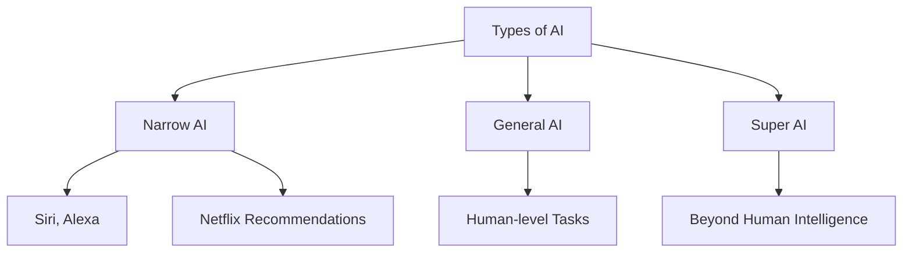
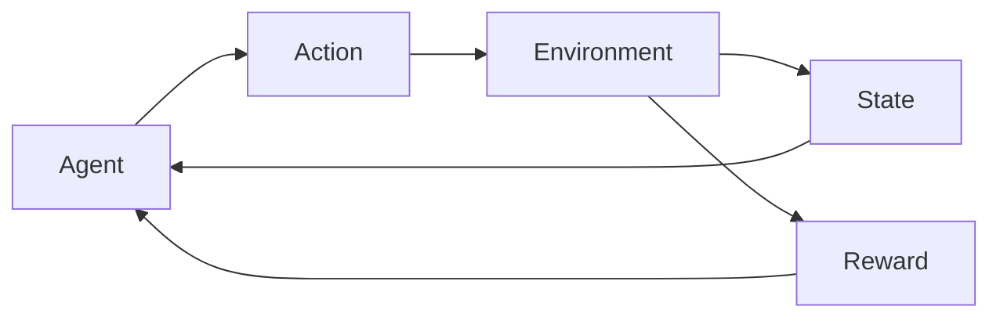
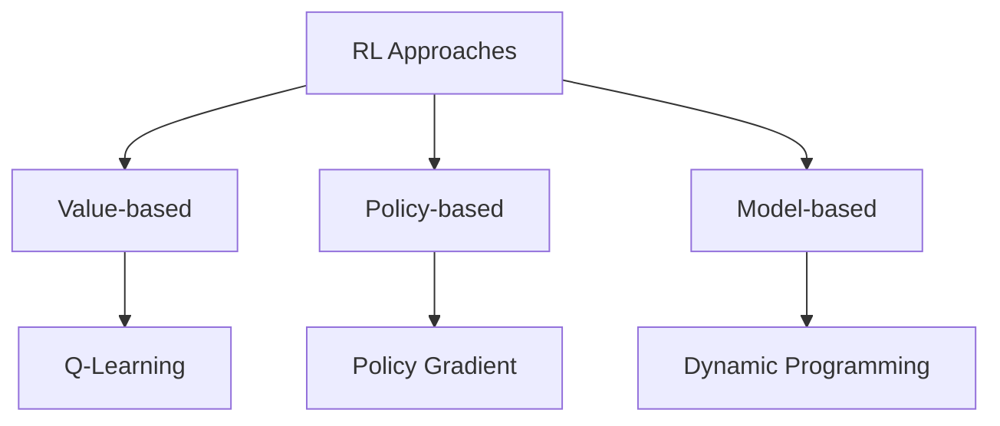
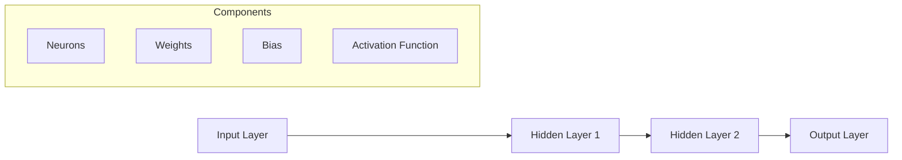
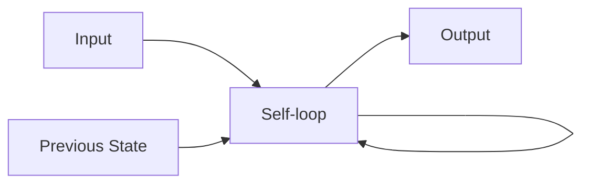
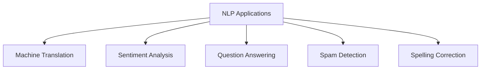

## Question 1(a) [3 marks]

**Define the following terms: (1) Artificial Intelligence (2) Expert System.**

**Answer**:

| Term | Definition |
|------|------------|
| **Artificial Intelligence** | AI is a branch of computer science that creates machines capable of performing tasks that typically require human intelligence, such as learning, reasoning, and problem-solving. |
| **Expert System** | An expert system is a computer program that uses knowledge and inference rules to solve problems that normally require human expertise in a specific domain. |

- **AI characteristics**: Learning, reasoning, perception
- **Expert system components**: Knowledge base, inference engine

**Mnemonic:** "AI Learns, Expert Advises"

## Question 1(b) [4 marks]

**Compare Biological Neural Network and Artificial Neural Network.**

**Answer**:

| Aspect | Biological Neural Network | Artificial Neural Network |
|--------|---------------------------|---------------------------|
| **Processing** | Parallel processing | Sequential/parallel processing |
| **Speed** | Slow (milliseconds) | Fast (nanoseconds) |
| **Learning** | Continuous learning | Batch/online learning |
| **Storage** | Distributed storage | Centralized storage |

- **Biological**: Complex, fault-tolerant, self-repairing
- **Artificial**: Simple, precise, programmable

**Mnemonic:** "Bio is Complex, AI is Simple"

## Question 1(c) [7 marks]

**Explain types of AI with its applications.**

**Answer**:

| Type of AI | Description | Applications |
|------------|-------------|--------------|
| **Narrow AI** | AI designed for specific tasks | Voice assistants, recommendation systems |
| **General AI** | AI with human-level intelligence | Not yet achieved |
| **Super AI** | AI exceeding human intelligence | Theoretical concept |



- **Current focus**: Narrow AI dominates today's applications
- **Future goal**: Achieving General AI safely

**Mnemonic:** "Narrow Now, General Goal, Super Scary"

## Question 1(c) OR [7 marks]

**Explain AI ethics and limitations.**

**Answer**:

| Ethics Aspect | Description |
|---------------|-------------|
| **Privacy** | Protecting personal data and user information |
| **Bias** | Ensuring fairness across different groups |
| **Transparency** | Making AI decisions explainable |
| **Accountability** | Determining responsibility for AI actions |

**Limitations:**

- **Data dependency**: Requires large, quality datasets
- **Computational power**: Needs significant processing resources
- **Lack of creativity**: Cannot truly create original concepts

**Mnemonic:** "Privacy, Bias, Transparency, Accountability"

## Question 2(a) [3 marks]

**Define the following terms: (1) Well posed Learning Problem (2) Machine Learning.**

**Answer**:

| Term | Definition |
|------|------------|
| **Well posed Learning Problem** | A learning problem with clearly defined task (T), performance measure (P), and experience (E) where performance improves with experience. |
| **Machine Learning** | A subset of AI that enables computers to learn and improve automatically from experience without being explicitly programmed. |

- **Well posed formula**: T + P + E = Learning
- **ML advantage**: Automatic improvement from data

**Mnemonic:** "Task, Performance, Experience"

## Question 2(b) [4 marks]

**Explain Reinforcement Learning along with terms used in it.**

**Answer**:

| Term | Description |
|------|-------------|
| **Agent** | The learner or decision maker |
| **Environment** | The world in which agent operates |
| **Action** | What agent can do in each state |
| **State** | Current situation of the agent |
| **Reward** | Feedback from environment |



- **Learning process**: Trial and error approach
- **Goal**: Maximize cumulative reward

**Mnemonic:** "Agent Acts, Environment States and Rewards"

## Question 2(c) [7 marks]

**Compare Supervised, Unsupervised and Reinforcement Learning.**

**Answer**:

| Aspect | Supervised | Unsupervised | Reinforcement |
|--------|------------|--------------|---------------|
| **Data** | Labeled data | Unlabeled data | Interactive data |
| **Goal** | Predict output | Find patterns | Maximize reward |
| **Feedback** | Immediate | None | Delayed |
| **Examples** | Classification | Clustering | Game playing |

- **Supervised**: Teacher-guided learning
- **Unsupervised**: Self-discovery learning  
- **Reinforcement**: Trial-and-error learning

**Mnemonic:** "Supervised has Teacher, Unsupervised Discovers, Reinforcement Tries"

## Question 2(a) OR [3 marks]

**Write Key features of Reinforcement Learning.**

**Answer**:

| Feature | Description |
|---------|-------------|
| **Trial and Error** | Learning through experimentation |
| **Delayed Reward** | Feedback comes after actions |
| **Sequential Decision** | Actions affect future states |

- **No supervisor**: Agent learns independently
- **Exploration vs Exploitation**: Balance between trying new actions and using known good actions

**Mnemonic:** "Try, Delay, Sequence"

## Question 2(b) OR [4 marks]

**Explain Types of Reinforcement learning.**

**Answer**:

| Type | Description |
|------|-------------|
| **Positive RL** | Adding positive stimulus to increase behavior |
| **Negative RL** | Removing negative stimulus to increase behavior |

**Based on Learning:**

- **Model-based**: Agent learns environment model
- **Model-free**: Agent learns directly from experience

**Mnemonic:** "Positive Adds, Negative Removes"

## Question 2(c) OR [7 marks]

**Explain approaches to implement Reinforcement Learning.**

**Answer**:

| Approach | Description | Example |
|----------|-------------|---------|
| **Value-based** | Learn value of states/actions | Q-Learning |
| **Policy-based** | Learn policy directly | Policy Gradient |
| **Model-based** | Learn environment model | Dynamic Programming |



- **Value-based**: Estimates value functions
- **Policy-based**: Optimizes policy parameters
- **Model-based**: Uses environment model

**Mnemonic:** "Value, Policy, Model"

## Question 3(a) [3 marks]

**Describe the activation functions ReLU and sigmoid.**

**Answer**:

| Function | Formula | Range |
|----------|---------|-------|
| **ReLU** | f(x) = max(0, x) | [0, ∞) |
| **Sigmoid** | f(x) = 1/(1 + e^(-x)) | (0, 1) |

- **ReLU advantage**: No vanishing gradient problem
- **Sigmoid advantage**: Smooth gradient, probabilistic output

**Mnemonic:** "ReLU Rectifies, Sigmoid Squashes"

## Question 3(b) [4 marks]

**Explain Multi-layer feed forward ANN.**

**Answer**:

| Component | Description |
|-----------|-------------|
| **Input Layer** | Receives input data |
| **Hidden Layers** | Process information (multiple layers) |
| **Output Layer** | Produces final result |
| **Connections** | Forward direction only |

- **Information flow**: Unidirectional from input to output
- **No cycles**: No feedback connections

**Mnemonic:** "Input → Hidden → Output (Forward Only)"

## Question 3(c) [7 marks]

**Draw the structure of ANN and explain functionality of each of its components.**

**Answer**:



| Component | Functionality |
|-----------|---------------|
| **Neurons** | Processing units that receive inputs and produce outputs |
| **Weights** | Connection strengths between neurons |
| **Bias** | Additional parameter to shift activation function |
| **Activation Function** | Introduces non-linearity to the network |

- **Input layer**: Receives and distributes input data
- **Hidden layers**: Extract features and patterns
- **Output layer**: Produces final classification or prediction
- **Connections**: Weighted links between neurons

**Mnemonic:** "Neurons with Weights, Bias, and Activation"

## Question 3(a) OR [3 marks]

**Write a short note on Backpropagation.**

**Answer**:

| Aspect | Description |
|--------|-------------|
| **Purpose** | Training algorithm for neural networks |
| **Method** | Gradient descent with chain rule |
| **Direction** | Backward error propagation |

- **Process**: Calculate error gradients backwards through network
- **Update**: Adjust weights to minimize error

**Mnemonic:** "Back-ward Error Propagation"

## Question 3(b) OR [4 marks]

**Explain Single-layer feed forward network.**

**Answer**:

| Feature | Description |
|---------|-------------|
| **Structure** | Input layer directly connected to output layer |
| **Layers** | Only input and output layers |
| **Limitations** | Can only solve linearly separable problems |
| **Example** | Perceptron |

- **Capability**: Limited to linear decision boundaries
- **Applications**: Simple classification tasks

**Mnemonic:** "Single Layer, Linear Limits"

## Question 3(c) OR [7 marks]

**Draw and explain the architecture of Recurrent neural network.**

**Answer**:



| Component | Function |
|-----------|----------|
| **Hidden State** | Maintains memory of previous inputs |
| **Recurrent Connection** | Feedback from hidden state to itself |
| **Sequence Processing** | Handles sequential data |

- **Memory**: Retains information from previous time steps
- **Applications**: Language modeling, speech recognition
- **Advantage**: Can process variable-length sequences

**Mnemonic:** "Recurrent Remembers, Loops Back"

## Question 4(a) [3 marks]

**Define NLP and write down advantages of it.**

**Answer**:

| Term | Definition |
|------|------------|
| **NLP** | Natural Language Processing - enables computers to understand, interpret, and generate human language |

**Advantages:**

- **Human-computer interaction**: Natural communication
- **Automation**: Automated text processing and analysis
- **Accessibility**: Voice interfaces for disabled users

**Mnemonic:** "Natural Language, Natural Interaction"

## Question 4(b) [4 marks]

**Compare NLU and NLG.**

**Answer**:

| Aspect | NLU (Understanding) | NLG (Generation) |
|--------|---------------------|------------------|
| **Purpose** | Interpret human language | Generate human language |
| **Input** | Text/Speech | Structured data |
| **Output** | Structured data | Text/Speech |
| **Examples** | Sentiment analysis | Text summarization |

- **NLU**: Converts unstructured text to structured data
- **NLG**: Converts structured data to natural text

**Mnemonic:** "NLU Understands, NLG Generates"

## Question 4(c) [7 marks]

**Explain word tokenization and frequency distribution of words with suitable example.**

**Answer**:

| Process | Description | Example |
|---------|-------------|---------|
| **Tokenization** | Breaking text into individual words/tokens | "Hello world" → ["Hello", "world"] |
| **Frequency Distribution** | Counting occurrence of each token | {"Hello": 1, "world": 1} |

**Example:**

```
Text: "The cat sat on the mat"
Tokens: ["The", "cat", "sat", "on", "the", "mat"]
Frequency: {"The": 1, "cat": 1, "sat": 1, "on": 1, "the": 1, "mat": 1}
```

- **Case sensitivity**: "The" and "the" counted separately
- **Applications**: Text analysis, search engines
- **Preprocessing**: Essential step for NLP tasks

**Mnemonic:** "Tokenize then Count"

## Question 4(a) OR [3 marks]

**List disadvantages of NLP.**

**Answer**:

| Disadvantage | Description |
|--------------|-------------|
| **Ambiguity** | Multiple meanings of words/sentences |
| **Context dependency** | Meaning changes with context |
| **Language complexity** | Grammar rules and exceptions |

- **Cultural variations**: Different languages, dialects
- **Computational cost**: Resource-intensive processing

**Mnemonic:** "Ambiguous, Contextual, Complex"

## Question 4(b) OR [4 marks]

**Explain types of ambiguities in NLP.**

**Answer**:

| Type | Description | Example |
|------|-------------|---------|
| **Lexical** | Word has multiple meanings | "Bank" (financial/river) |
| **Syntactic** | Multiple parse trees possible | "I saw a man with a telescope" |
| **Semantic** | Multiple interpretations | "Flying planes can be dangerous" |

- **Resolution**: Context analysis, statistical models
- **Challenge**: Major hurdle in NLP systems

**Mnemonic:** "Lexical words, Syntactic structure, Semantic meaning"

## Question 4(c) OR [7 marks]

**Explain stemming words and parts of speech(POS) tagging with suitable example.**

**Answer**:

| Process | Description | Example |
|---------|-------------|---------|
| **Stemming** | Reducing words to root/stem form | "running" → "run", "flies" → "fli" |
| **POS Tagging** | Assigning grammatical categories | "The/DT cat/NN runs/VB fast/RB" |

**Stemming Example:**

```
Original: ["running", "runs", "runner"]
Stemmed: ["run", "run", "runner"]
```

**POS Tagging Example:**

```
Sentence: "The quick brown fox jumps"
Tagged: "The/DT quick/JJ brown/JJ fox/NN jumps/VB"
```

- **Stemming purpose**: Reduce vocabulary size, group related words
- **POS purpose**: Understand grammatical structure
- **Applications**: Information retrieval, grammar checking

**Mnemonic:** "Stem to Root, Tag by Grammar"

## Question 5(a) [3 marks]

**Define the term word embedding and list various word embedding techniques.**

**Answer**:

| Term | Definition |
|------|------------|
| **Word Embedding** | Dense vector representations of words that capture semantic relationships |

**Techniques:**

- **TF-IDF**: Term Frequency-Inverse Document Frequency
- **Bag of Words (BoW)**: Simple word occurrence counting
- **Word2Vec**: Neural network-based embeddings

**Mnemonic:** "TF-IDF counts, BoW bags, Word2Vec vectorizes"

## Question 5(b) [4 marks]

**Explain about Challenges with TF-IDF and BoW.**

**Answer**:

| Method | Challenges |
|--------|------------|
| **TF-IDF** | Sparse vectors, no semantic similarity, high dimensionality |
| **BoW** | Order ignored, context lost, sparse representation |

**Common Issues:**

- **Sparsity**: Most vector elements are zero
- **No semantics**: Similar words have different vectors
- **High dimensions**: Memory and computation intensive

**Mnemonic:** "Sparse, No Semantics, High Dimensions"

## Question 5(c) [7 marks]

**Explain applications of NLP with suitable examples.**

**Answer**:

| Application | Description | Example |
|-------------|-------------|---------|
| **Machine Translation** | Translate between languages | Google Translate |
| **Sentiment Analysis** | Determine emotional tone | Product review analysis |
| **Question Answering** | Answer questions from text | Chatbots, virtual assistants |
| **Spam Detection** | Identify unwanted emails | Email filters |
| **Spelling Correction** | Fix spelling errors | Auto-correct in text editors |



- **Real-world impact**: Improves human-computer interaction
- **Business value**: Automates text processing tasks
- **Growing field**: New applications emerging constantly

**Mnemonic:** "Translate, Sentiment, Question, Spam, Spell"

## Question 5(a) OR [3 marks]

**Describe the Glove(Global Vector for word representation).**

**Answer**:

| Aspect | Description |
|--------|-------------|
| **Purpose** | Create word vectors using global corpus statistics |
| **Method** | Combines global matrix factorization and local context |
| **Advantage** | Captures both global and local statistical information |

- **Global statistics**: Uses word co-occurrence information
- **Pre-trained**: Available trained vectors for common use

**Mnemonic:** "Global Vectors, Local Context"

## Question 5(b) OR [4 marks]

**Explain the Inverse Document Frequency (IDF).**

**Answer**:

| Component | Formula | Purpose |
|-----------|---------|---------|
| **IDF** | log(N/df) | Measure word importance across documents |
| **N** | Total documents | Corpus size |
| **df** | Document frequency | Documents containing the term |

- **High IDF**: Rare words (more informative)
- **Low IDF**: Common words (less informative)
- **Application**: Part of TF-IDF weighting scheme

**Mnemonic:** "Inverse Document, Rare is Important"

## Question 5(c) OR [7 marks]

**Explain calculation of TF(Term Frequency) for a document with suitable example.**

**Answer**:

| Method | Formula | Description |
|--------|---------|-------------|
| **Raw TF** | f(t,d) | Simple count of term in document |
| **Normalized TF** | f(t,d)/max(f(w,d)) | Normalized by maximum frequency |
| **Log TF** | 1 + log(f(t,d)) | Logarithmic scaling |

**Example Document:** "The cat sat on the mat. The mat was soft."

| Term | Count | Raw TF | Normalized TF | Log TF |
|------|-------|--------|---------------|--------|
| "the" | 3 | 3 | 1.0 | 1.48 |
| "cat" | 1 | 1 | 0.33 | 1.0 |
| "mat" | 2 | 2 | 0.67 | 1.30 |

**Calculation Steps:**

1. Count each term occurrence
2. Apply chosen TF formula
3. Use in TF-IDF calculation

**Mnemonic:** "Count, Normalize, Log"
