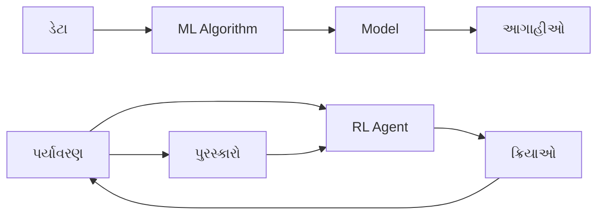
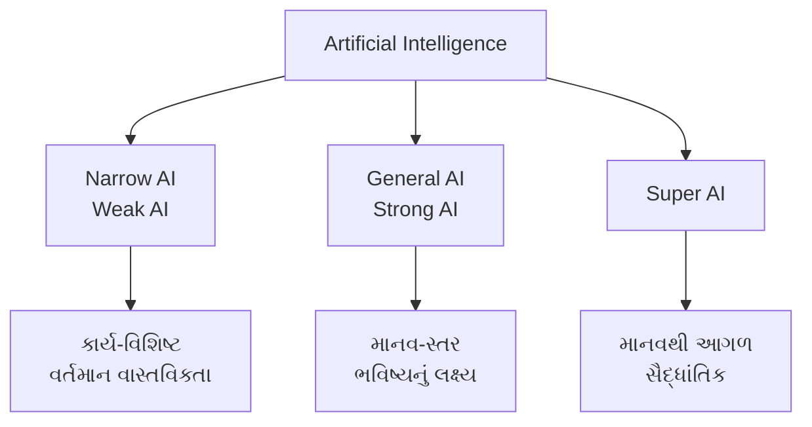
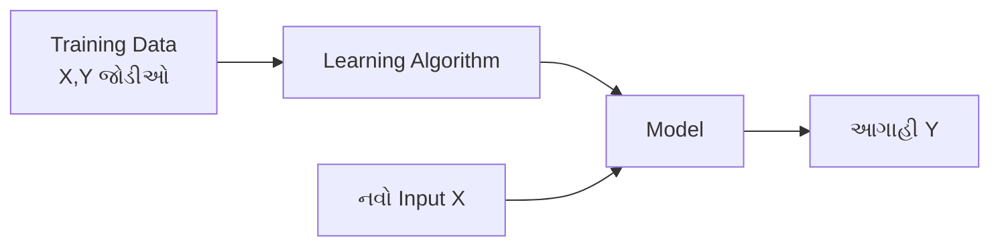
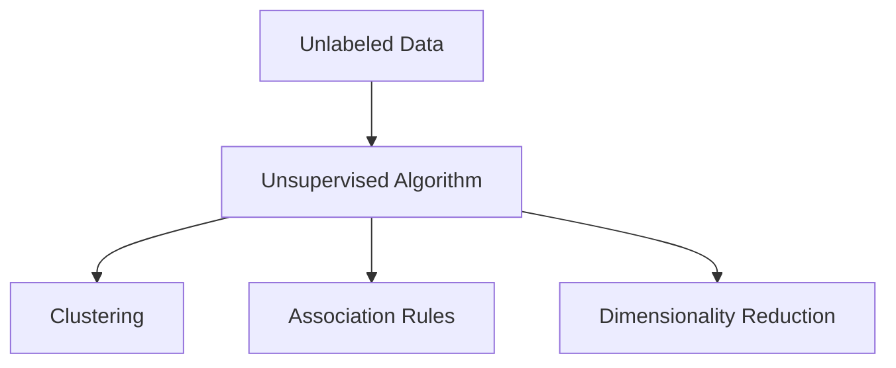
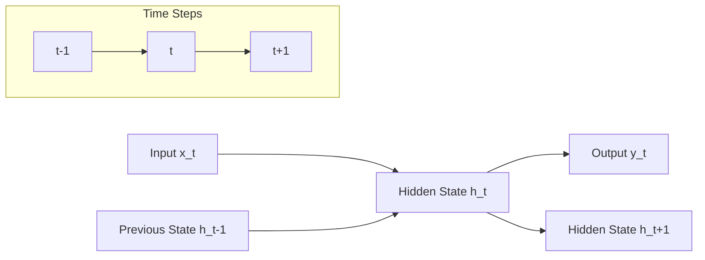
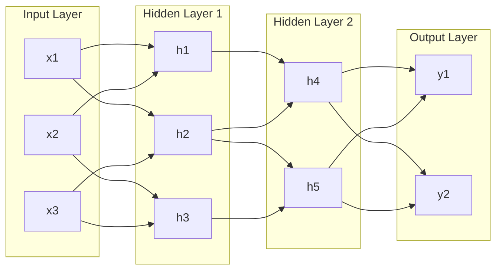
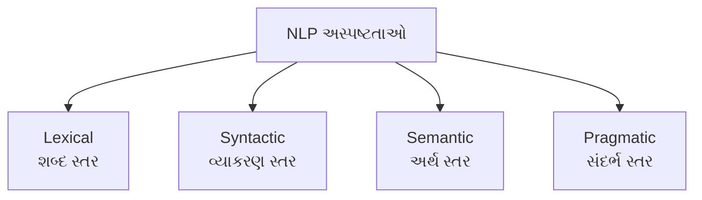
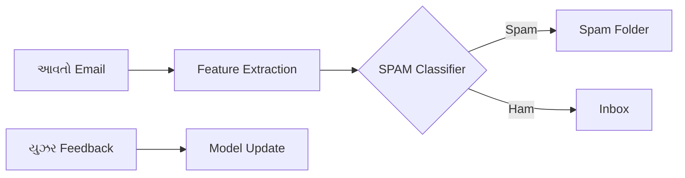

## પ્રશ્ન 1(અ) [3 ગુણ]

**નીચેના પदોને વ્યાખ્યાયિત કરો: 1) Fuzzy Logic. 2) Expert System.**

**જવાબ**:

| પદ | વ્યાખ્યા |
|-----|-------|
| **Fuzzy Logic** | અસ્પષ્ટ તર્કશાસ્ત્ર જે 0 અને 1 વચ્ચે સત્યતાની ડિગ્રી સાથે અંદાજિત તર્ક કરે છે |
| **Expert System** | કુશળ માનવીના નિર્ણયોની નકલ કરતી AI પ્રોગ્રામ જે knowledge base અને inference engine વાપરે છે |

- **મુખ્ય લક્ષણો**: બંને અનિશ્ચિતતા અને અધૂરી માહિતી સંભાળે છે
- **ઉપયોગો**: મેડિકલ નિદાન, ઔદ્યોગિક નિયંત્રણ સિસ્ટમ

**મેમરી ટ્રીક:** "અસ્પષ્ટ કુશળતા અનિશ્ચિત નિર્ણયો લે છે"

---

## પ્રશ્ન 1(બ) [4 ગુણ]

**નીચેના પદોને વ્યાખ્યાયિત કરો: 1) Machine Learning. 2) Reinforcement Learning.**

**જવાબ**:

| પદ | વ્યાખ્યા | મુખ્ય લાક્ષણિકતા |
|-----|-------|----------------|
| **Machine Learning** | અલ્ગોરિધમ જે અનુભવ દ્વારા આપોઆપ પ્રદર્શન સુધારે છે સ્પષ્ટ programming વિના | ડેટા પેટર્નમાંથી શીખવું |
| **Reinforcement Learning** | Agent પુરસ્કાર/દંડ વાપરીને પર્યાવરણ સાથે trial-and-error દ્વારા શ્રેષ્ઠ ક્રિયાઓ શીખે છે | feedback દ્વારા શીખવું |

**આકૃતિ:**



**મેમરી ટ્રીક:** "ML ડેટામાંથી શીખે, RL પુરસ્કારોમાંથી શીખે"

---

## પ્રશ્ન 1(ક) [7 ગુણ]

**Artificial Intelligence ના પ્રકારો વિશે વિગતવાર સમજૂતી યોગ્ય રેખાકૃતિ સાથે આપો.**

**જવાબ**:

**AI પ્રકારોનું ટેબલ:**

| પ્રકાર | વર્ણન | ક્ષમતા | ઉદાહરણો |
|------|------|-------|---------|
| **Narrow AI** | વિશિષ્ટ કાર્યો માટે રચાયેલ | મર્યાદિત ડોમેન કુશળતા | Siri, Chess programs |
| **General AI** | બધા ક્ષેત્રોમાં માનવ સ્તરની બુદ્ધિ | બહુ-ડોમેન તર્ક | હાલમાં સૈદ્ધાંતિક |
| **Super AI** | માનવ બુદ્ધિ કરતાં વધુ | માનવ ક્ષમતાથી આગળ | ભવિષ્યની કલ્પના |

**આકૃતિ:**



- **વર્તમાન સ્થિતિ**: આપણે Narrow AI યુગમાં છીએ
- **વિકાસ માર્ગ**: Narrow → General → Super AI
- **સમયમર્યાદા**: General AI 20-30 વર્ષમાં અપેક્ષિત

**મેમરી ટ્રીક:** "સાંકડું હવે, સામાન્ય લક્ષ્ય, સુપર શીઘ્ર"

---

## પ્રશ્ન 1(ક) OR [7 ગુણ]

**AI system design કરતા સમયે ethics સાથે સંબંધિત વિવિધ પાસાની સમજૂતી આપો. ઉપરાંત, AI System ની મર્યાદાઓની પણ વિગતવાર સમજૂતી આપો.**

**જવાબ**:

**AI નીતિશાસ્ત્ર ટેબલ:**

| નૈતિક પાસું | વર્ણન | અમલીકરણ |
|-------------|-------|----------|
| **Fairness** | પક્ષપાત અને ભેદભાવ ટાળવું | વિવિધ training data |
| **Transparency** | સમજાવી શકાય તેવા AI નિર્ણયો | સ્પષ્ટ algorithms |
| **Privacy** | યુઝર ડેટાનું રક્ષણ | ડેટા encryption |
| **Accountability** | AI ક્રિયાઓ માટે જવાબદારી | માનવ દેખરેખ |

**AI મર્યાદાઓ:**

- **ડેટા પરાધીનતા**: મોટા, ગુણવત્તાયુક્ત datasets જોઈએ
- **સામાન્ય બુદ્ધિનો અભાવ**: માનવોની જેમ સંદર્ભ સમજી શકતું નથી
- **નાજુકતા**: અનપેક્ષિત પરિસ્થિતિઓમાં નિષ્ફળ જાય છે
- **Black Box સમસ્યા**: નિર્ણયો સમજાવવા મુશ્કેલ

**મેમરી ટ્રીક:** "ન્યાયી, પારદર્શક, ખાનગી, જવાબદાર AI ને ડેટા, સામાન્ય બુદ્ધિ, નાજુકતા, કાળા બોક્સની સમસ્યાઓ છે"

---

## પ્રશ્ન 2(અ) [3 ગુણ]

**Reinforcement learning ની લાક્ષણિકતાની યાદી આપો.**

**જવાબ**:

| લાક્ષણિકતા | વર્ણન |
|------------|-------|
| **Trial-and-Error** | Agent પ્રયોગ દ્વારા શીખે છે |
| **Reward-Based** | પુરસ્કાર/દંડ દ્વારા feedback |
| **Sequential Decision Making** | ક્રિયાઓ ભવિષ્યની અવસ્થાઓને અસર કરે છે |
| **Exploration vs Exploitation** | નવી ક્રિયાઓ અજમાવવા અને જાણીતી સારી ક્રિયાઓ વાપરવા વચ્ચેનું સંતુલન |

**મેમરી ટ્રીક:** "પ્રયોગ પુરસ્કાર ક્રમિક શોધ"

---

## પ્રશ્ન 2(બ) [4 ગુણ]

**Positive reinforcement અને Negative reinforcement સમજાવો.**

**જવાબ**:

**તુલનાત્મક ટેબલ:**

| પ્રકાર | વ્યાખ્યા | અસર | ઉદાહરણ |
|------|-------|-----|--------|
| **Positive Reinforcement** | વર્તન વધારવા માટે આનંદદાયક stimulus ઉમેરવું | ઇચ્છિત વર્તન વધારે છે | સારા પ્રદર્શન માટે ઇનામ આપવું |
| **Negative Reinforcement** | વર્તન વધારવા માટે અપ્રિય stimulus દૂર કરવું | ઇચ્છિત વર્તન વધારે છે | કાર્ય પૂર્ણ થયા પછી alarm બંધ કરવું |

**મુખ્ય તફાવત**: બંને વર્તન વધારે છે, પરંતુ positive પુરસ્કાર ઉમેરે છે જ્યારે negative સજા દૂર કરે છે.

**મેમરી ટ્રીક:** "હકારાત્મક આનંદ ઉમેરે, નકારાત્મક દુખ દૂર કરે"

---

## પ્રશ્ન 2(ક) [7 ગુણ]

**Supervised learning વિશે વિગતવાર સમજાવો.**

**જવાબ**:

**વ્યાખ્યા**: શીખવાની પદ્ધતિ જે labeled training data માંથી શીખીને નવા ડેટા પર આગાહીઓ કરે છે.

**પ્રક્રિયા ટેબલ:**

| પગલું | વર્ણન | ઉદાહરણ |
|------|-------|---------|
| **Training** | Input-output જોડીઓથી algorithm શીખે છે | Email → Spam/Not Spam |
| **Validation** | અદ્રશ્ય ડેટા પર model ચકાસવું | accuracy તપાસવી |
| **Prediction** | નવા inputs માટે outputs બનાવવું | નવા emails ને classify કરવું |

**પ્રકારો:**

- **Classification**: કેટેગરીઓની આગાહી (spam detection)
- **Regression**: સતત મૂલ્યોની આગાહી (ઘરના ભાવ)

**આકૃતિ:**



**મેમરી ટ્રીક:** "દેખરેખ = શિક્ષક સાચા જવાબો આપે છે"

---

## પ્રશ્ન 2(અ) OR [3 ગુણ]

**Human learning માં સામેલ key components ની યાદી આપો.**

**જવાબ**:

| ઘટક | કાર્ય |
|-----|-----|
| **Observation** | પર્યાવરણમાંથી માહિતી એકત્રિત કરવી |
| **Memory** | અનુભવો સંગ્રહિત અને પુનઃપ્રાપ્ત કરવા |
| **Practice** | કુશળતા સુધારવા માટે પુનરાવર્તન |
| **Feedback** | પ્રદર્શન વિશેની માહિતી |

**મેમરી ટ્રીક:** "નિરીક્ષણ, યાદદાશ્ત, પ્રેક્ટિસ, પ્રતિસાદ"

---

## પ્રશ્ન 2(બ) OR [4 ગુણ]

**Well-posed learning problem વિશે વિગતવાર સમજાવો.**

**જવાબ**:

**વ્યાખ્યા**: સ્પષ્ટ રીતે વ્યાખ્યાયિત કાર્ય, પ્રદર્શન માપદંડ અને અનુભવ સાથેની શીખવાની સમસ્યા.

**ઘટકો ટેબલ:**

| ઘટક | વર્ણન | ઉદાહરણ |
|-----|-------|---------|
| **Task (T)** | સિસ્ટમે શું શીખવું જોઈએ | શતરંજ રમવું |
| **Performance (P)** | સફળતા કેવી રીતે માપવી | જીતવાની ટકાવારી |
| **Experience (E)** | Training data અથવા પ્રેક્ટિસ | અગાઉના રમતો |

**સૂત્ર**: શીખવું = E દ્વારા T પર P સુધારવું

**માપદંડો**: સમસ્યા માપી શકાય તેવી, હાંસલ કરી શકાય તેવી અને ઉપલબ્ધ ડેટા હોવું જોઈએ.

**મેમરી ટ્રીક:** "કાર્ય પ્રદર્શન અનુભવ = શીખવા માટે TPE"

---

## પ્રશ્ન 2(ક) OR [7 ગુણ]

**Unsupervised learning વિશે વિગતવાર સમજાવો.**

**જવાબ**:

**વ્યાખ્યા**: Labeled ઉદાહરણો અથવા target outputs વિના ડેટામાંથી પેટર્ન શીખવું.

**પ્રકારો ટેબલ:**

| પ્રકાર | ઉદ્દેશ્ય | Algorithm | ઉદાહરણ |
|------|--------|-----------|---------|
| **Clustering** | સમાન ડેટાને જૂથમાં રાખવું | K-means | ગ્રાહક વિભાજન |
| **Association** | સંબંધો શોધવા | Apriori | બજાર બાસ્કેટ વિશ્લેષણ |
| **Dimensionality Reduction** | લક્ષણો ઘટાડવા | PCA | ડેટા દૃશ્યીકરણ |

**આકૃતિ:**



- **કોઈ શિક્ષક નથી**: Algorithm સ્વતંત્ર રીતે છુપાયેલા patterns શોધે છે
- **શોધખોળ**: ડેટામાં અજાણ્યા માળખાઓ શોધે છે

**મેમરી ટ્રીક:** "બિનદેખરેખ = કોઈ શિક્ષક નથી, જાતે patterns શોધો"

---

## પ્રશ્ન 3(અ) [3 ગુણ]

**SIGMOID function સમજાવો. ઉપરાંત, તેનો graph દોરો અને SIGMOID function નું ઉદાહરણ આપો.**

**જવાબ**:

**વ્યાખ્યા**: Activation function જે કોઈપણ વાસ્તવિક સંખ્યાને 0 અને 1 વચ્ચેના મૂલ્યમાં map કરે છે.

**સૂત્ર**: σ(x) = 1/(1 + e^(-x))

**Graph (ASCII):**

```goat
    1 |     ._-'
      |   .-'
    0.5|.-'
      |'
    0 +----------
     -5  0   5
```

**ઉદાહરણ**: x = 0 માટે, σ(0) = 1/(1 + e^0) = 1/2 = 0.5

**ગુણધર્મો**: S-આકારનો વળાંક, સરળ gradient, binary classification માં વપરાય છે

**મેમરી ટ્રીક:** "Sigmoid મૂલ્યોને 0 અને 1 વચ્ચે દબાવે છે"

---

## પ્રશ્ન 3(બ) [4 ગુણ]

**નીચેના પદને વ્યાખ્યાયિત કરો: 1) Activation function. 2) Artificial neural network.**

**જવાબ**:

| પદ | વ્યાખ્યા | ઉદ્દેશ્ય |
|-----|-------|--------|
| **Activation Function** | ગાણિતિક function જે weighted inputs આધારે neuron output નક્કી કરે છે | Neural networks માં non-linearity લાવે છે |
| **Artificial Neural Network** | Biological neural networks થી પ્રેરિત computing system જેમાં interconnected nodes હોય છે | Pattern recognition અને machine learning |

**મુખ્ય લક્ષણો:**

- **Non-linear processing** જટિલ pattern learning સક્ષમ બનાવે છે
- **Layered architecture** માહિતીને hierarchical રીતે process કરે છે

**મેમરી ટ્રીક:** "Activation કૃત્રિમ રીતે મગજના neurons ની નકલ કરે છે"

---

## પ્રશ્ન 3(ક) [7 ગુણ]

**Recurrent network ના architecture ને આકૃતિ સાથે વિગતવાર સમજાવો.**

**જવાબ**:

**વ્યાખ્યા**: Neural network જેમાં connections loops બનાવે છે, જે માહિતીને સ્થાયી રાખવાની મંજૂરી આપે છે.

**Architecture આકૃતિ:**



**ઘટકો ટેબલ:**

| ઘટક | કાર્ય | સૂત્ર |
|-----|-----|------|
| **Hidden State** | અગાઉના inputs ની યાદદાશ્ત | h_t = f(W_h *h_t-1 + W_x* x_t) |
| **Input Layer** | વર્તમાન time step input | x_t |
| **Output Layer** | સમય t પર આગાહી | y_t = W_y * h_t |

**ઉપયોગો**: વાણી ઓળખ, ભાષા અનુવાદ, time series આગાહી

**ફાયદો**: ભૂતકાળની માહિતીની યાદદાશ્ત સાથે sequential data handle કરે છે

**મેમરી ટ્રીક:** "પુનરાવર્તિત = પાછલી અવસ્થાઓ યાદ રાખે છે"

---

## પ્રશ્ન 3(અ) OR [3 ગુણ]

**TANH function સમજાવો. ઉપરાંત, તેનો graph દોરો અને TANH function નું ઉદાહરણ આપો.**

**જવાબ**:

**વ્યાખ્યા**: Hyperbolic tangent activation function જે મૂલ્યોને -1 અને 1 વચ્ચે map કરે છે.

**સૂત્ર**: tanh(x) = (e^x - e^(-x))/(e^x + e^(-x))

**Graph (ASCII):**

```goat
    1 |      ._-'
      |    .-'
    0 +.--'------
      |.-'
   -1 |'
      +----------
     -3  0   3
```

**ઉદાહરણ**: x = 0 માટે, tanh(0) = (1-1)/(1+1) = 0

**ગુણધર્મો**: શૂન્ય-કેન્દ્રિત, S-આકારનું, sigmoid કરતાં મજબૂત gradients

**મેમરી ટ્રીક:** "TANH = બે-તરફી sigmoid (-1 થી +1)"

---

## પ્રશ્ન 3(બ) OR [4 ગુણ]

**નીચેના પદને વ્યાખ્યાયિત કરો: 1) Biological neural network. 2) Loss calculation.**

**જવાબ**:

| પદ | વ્યાખ્યા | મુખ્ય પાસાઓ |
|-----|-------|-------------|
| **Biological Neural Network** | જીવંત જીવોમાં interconnected neurons નું નેટવર્ક જે માહિતી process કરે છે | Dendrites, cell body, axon, synapses |
| **Loss calculation** | આગાહી કરેલા અને વાસ્તવિક outputs વચ્ચેના તફાવતનું ગાણિતિક માપ | Backpropagation દ્વારા શીખવાને માર્ગદર્શન આપે છે |

**જૈવિક માળખું**: Neurons → Synapses → Neural Networks → મગજ
**Loss પ્રકારો**: Mean Squared Error, Cross-entropy, Absolute Error

**મેમરી ટ્રીક:** "જીવવિજ્ઞાન AI ને પ્રેરણા આપે છે, Loss શીખવાની પ્રગતિ માપે છે"

---

## પ્રશ્ન 3(ક) OR [7 ગુણ]

**Multi-layer feed-forward network ના architecture ને આકૃતિ સાથે વિગતવાર વર્ણવો.**

**જવાબ**:

**વ્યાખ્યા**: બહુવિધ layers સાથેનું neural network જ્યાં માહિતી input થી output તરફ આગળ વહે છે.

**Architecture આકૃતિ:**



**Layer કાર્યો ટેબલ:**

| Layer | કાર્ય | Processing |
|-------|------|------------|
| **Input** | ડેટા પ્રાપ્ત કરે છે | કોઈ processing નથી, ફક્ત વિતરણ |
| **Hidden** | Feature extraction | Weighted sum + activation function |
| **Output** | અંતિમ આગાહી | Classification અથવા regression output |

**માહિતી પ્રવાહ**: Input → Hidden Layer(s) → Output (એકદિશીય)
**શીખવું**: Backpropagation error આધારે weights adjust કરે છે

**મેમરી ટ્રીક:** "બહુ-સ્તર = જટિલ શીખવા માટે બહુવિધ hidden layers"

---

## પ્રશ્ન 4(અ) [3 ગુણ]

**NLP ના ફાયદાઓની યાદી વિગતવાર આપો.**

**જવાબ**:

| ફાયદો | વર્ણન |
|-------|-------|
| **Automation** | માનવી પ્રયાસ જોઈતા text processing કાર્યોને આપોઆપ કરે છે |
| **Language Understanding** | બહુવિધ ભાષાઓ અને બોલીઓ અસરકારક રીતે process કરે છે |
| **24/7 Availability** | માનવી હસ્તક્ષેપ વિના સતત કામ કરે છે |
| **Scalability** | મોટા પ્રમાણમાં text data કાર્યક્ષમ રીતે handle કરે છે |

**ઉપયોગો**: Chatbots, અનુવાદ, sentiment analysis, document processing

**મેમરી ટ્રીક:** "NLP = ભાષા સમજણને 24/7 પાયે આપોઆપ કરે છે"

---

## પ્રશ્ન 4(બ) [4 ગુણ]

**Natural Language Generation વિગતવાર સમજાવો.**

**જવાબ**:

**વ્યાખ્યા**: AI પ્રક્રિયા જે structured data ને કુદરતી માનવી ભાષાના text માં convert કરે છે.

**પ્રક્રિયા ટેબલ:**

| પગલું | વર્ણન | કાર્ય |
|------|-------|-----|
| **Content Planning** | કઈ માહિતી સામેલ કરવી તે નક્કી કરવું | ડેટા પસંદગી |
| **Sentence Planning** | વાક્યો અને ફકરાઓની રચના કરવી | ટેક્સ્ટ વ્યવસ્થા |
| **Surface Realization** | વ્યાકરણ સાથે વાસ્તવિક ટેક્સ્ટ બનાવવું | અંતિમ આઉટપુટ |

**ઉપયોગો**: રિપોર્ટ જનરેશન, chatbots, આપોઆપ પત્રકારત્વ, વ્યક્તિગત સામગ્રી

**ઉદાહરણ**: વેચાણ ડેટા → "ઇલેક્ટ્રોનિક્સમાં મજબૂત પ્રદર્શનને કારણે આ ક્વાર્ટરમાં વેચાણ 15% વધ્યું."

**મેમરી ટ્રીક:** "NLG = સંખ્યાઓને કથામાં ફેરવે છે"

---

## પ્રશ્ન 4(ક) [7 ગુણ]

**NLP માં રહેલી અસ્પષ્ટતા સમજાવો. ઉપરાંત, દરેક અસ્પષ્ટતાનું ઉદાહરણ આપો.**

**જવાબ**:

**અસ્પષ્ટતા પ્રકારો ટેબલ:**

| પ્રકાર | વર્ણન | ઉદાહરણ | ઉકેલ |
|------|-------|---------|------|
| **Lexical** | શબ્દના અનેક અર્થો હોય છે | "Bank" (નદી/નાણાકીય) | સંદર્ભ વિશ્લેષણ |
| **Syntactic** | વાક્ય રચના અસ્પષ્ટ હોય છે | "મેં telescope સાથે માણસને જોયો" | Parse trees |
| **Semantic** | અર્થ અસ્પષ્ટ હોય છે | "રંગહીન લીલા વિચારો" | Semantic rules |
| **Pragmatic** | સંદર્ભ-આધારિત અર્થ | "શું તમે મીઠું આપી શકો છો?" (વિનંતી/પ્રશ્ન) | પરિસ્થિતિનો સંદર્ભ |

**આકૃતિ:**



**ઉકેલ વ્યૂહરચના**: સંદર્ભ વિશ્લેષણ, આંકડાકીય મોડેલ્સ, knowledge bases

**મેમરી ટ્રીક:** "શાબ્દિક વ્યાકરણિક અર્થપૂર્ણ વ્યાવહારિક = SVAV અસ્પષ્ટતાઓ"

---

## પ્રશ્ન 4(અ) OR [3 ગુણ]

**NLP ના ગેરફાયદાઓની યાદી વિગતવાર આપો.**

**જવાબ**:

| ગેરફાયદો | વર્ણન |
|----------|-------|
| **Context Limitations** | વ્યંગ, હાસ્ય, સાંસ્કૃતિક સંદર્ભો સાથે મુશ્કેલી |
| **Language Complexity** | વાક્યપ્રયોગો, સ્લેંગ, પ્રાદેશિક બોલીઓ સાથે મુશ્કેલી |
| **Data Requirements** | મોટા પ્રમાણમાં training data જરૂરી |
| **Computational Cost** | નોંધપાત્ર processing power અને memory જરૂરી |

**પડકારો**: અસ્પષ્ટતા, બહુભાષીય સપોર્ટ, real-time processing

**મેમરી ટ્રીક:** "NLP પડકારો = સંદર્ભ, ભાષા, ડેટા, ગણતરી"

---

## પ્રશ્ન 4(બ) OR [4 ગુણ]

**Natural Language Understanding વિગતવાર સમજાવો.**

**જવાબ**:

**વ્યાખ્યા**: માનવી ભાષાના અર્થ અને હેતુને સમજવા અને અર્થઘટન કરવાની AI ક્ષમતા.

**ઘટકો ટેબલ:**

| ઘટક | કાર્ય | ઉદાહરણ |
|-----|-----|---------|
| **Tokenization** | ટેક્સ્ટને શબ્દો/વાક્યાંશોમાં વિભાજીત કરવું | "Hello world" → ["Hello", "world"] |
| **Parsing** | વ્યાકરણિક માળખાનું વિશ્લેષણ | કર્તા, ક્રિયા, કર્મ ઓળખવું |
| **Semantic Analysis** | અર્થ કાઢવો | શબ્દો વચ્ચેના સંબંધો સમજવા |
| **Intent Recognition** | યુઝરનો હેતુ ઓળખવો | "ફ્લાઇટ બુક કરો" → ટ્રાવેલ બુકિંગ intent |

**પ્રક્રિયા પ્રવાહ**: Text Input → Tokenization → Parsing → Semantic Analysis → Intent Understanding

**ઉપયોગો**: Virtual assistants, chatbots, voice commands

**મેમરી ટ્રીક:** "NLU = કુદરતી રીતે ભાષા સમજે છે"

---

## પ્રશ્ન 4(ક) OR [7 ગુણ]

**Stemming અને Lemmatization વિગતવાર સમજાવો. ઉપરાંત દરેકના બે ઉદાહરણ આપો.**

**જવાબ**:

**વ્યાખ્યાઓ:**

| પ્રક્રિયા | વર્ણન | પદ્ધતિ | આઉટપુટ |
|---------|-------|--------|---------|
| **Stemming** | Suffixes દૂર કરીને શબ્દોને મૂળ સ્વરૂપમાં ઘટાડવું | Rule-based કાપવું | Word stem |
| **Lemmatization** | શબ્દોને શબ્દકોશના આધાર સ્વરૂપમાં ઘટાડવું | Dictionary lookup | માન્ય શબ્દ |

**Stemming ઉદાહરણો:**

1. "running", "runs", "ran" → "run"
2. "fishing", "fished", "fisher" → "fish"

**Lemmatization ઉદાહરણો:**

1. "better" → "good" (comparative to base)
2. "children" → "child" (બહુવચનથી એકવચન)

**તુલના ટેબલ:**

| પાસું | Stemming | Lemmatization |
|------|----------|---------------|
| **ઝડપ** | વધુ ઝડપી | ધીમું |
| **સચોટતા** | ઓછી | વધુ |
| **આઉટપુટ** | કદાચ માન્ય શબ્દ ન હોય | હંમેશા માન્ય શબ્દ |

**મેમરી ટ્રીક:** "Stemming = ઝડપ, Lemmatization = ભાષાની સચોટતા"

---

## પ્રશ્ન 5(અ) [3 ગુણ]

**વ્યાખ્યા આપો: 1) Word embeddings. 2) Machine Translation.**

**જવાબ**:

| પદ | વ્યાખ્યા | ઉદ્દેશ્ય |
|-----|-------|--------|
| **Word Embeddings** | શબ્દોના ઘન વેક્ટર પ્રતિનિધિત્વ જે semantic સંબંધો capture કરે છે | ટેક્સ્ટને ML માટે સંખ્યાત્મક સ્વરૂપમાં convert કરવું |
| **Machine Translation** | એક ભાષામાંથી બીજી ભાષામાં ટેક્સ્ટનું આપોઆપ રૂપાંતરણ | ભાષાઓ વચ્ચે સંવાદ સક્ષમ બનાવવું |

**મુખ્ય લક્ષણો**:

- **Word embeddings** વેક્ટર સ્પેસમાં શબ્દ સંબંધો જાળવે છે
- **Machine translation** ભાષાઓ વચ્ચે અર્થ જાળવે છે

**મેમરી ટ્રીક:** "શબ્દો વેક્ટર્સ બને છે, ભાષાઓ અનુવાદ બને છે"

---

## પ્રશ્ન 5(બ) [4 ગુણ]

**Word2Vec વિશે વિગતવાર સમજાવો.**

**જવાબ**:

**વ્યાખ્યા**: Neural network તકનીક જે મોટા text corpus માંથી શબ્દ સંબંધો શીખીને word embeddings બનાવે છે.

**Architecture પ્રકારો:**

| મોડેલ | વર્ણન | આગાહી |
|------|-------|--------|
| **CBOW (Continuous Bag of Words)** | સંદર્ભમાંથી target શબ્દની આગાહી કરે છે | સંદર્ભ → લક્ષ્ય |
| **Skip-gram** | Target શબ્દમાંથી સંદર્ભ શબ્દોની આગાહી કરે છે | લક્ષ્ય → સંદર્ભ |

**પ્રક્રિયા**:

1. **Training**: Neural network શબ્દ સંબંધો શીખે છે
2. **Vector Creation**: દરેક શબ્દને અનન્ય વેક્ટર પ્રતિનિધિત્વ મળે છે
3. **Similarity**: સમાન શબ્દોના સમાન વેક્ટર્સ હોય છે

**ઉદાહરણ**: vector("king") - vector("man") + vector("woman") ≈ vector("queen")

**મેમરી ટ્રીક:** "Word2Vec = સંદર્ભ દ્વારા શબ્દોથી વેક્ટર્સ"

---

## પ્રશ્ન 5(ક) [7 ગુણ]

**ઉત્પાદનના ઉત્પાદકે ગ્રાહક પાસેથી feedback એકત્રિત કર્યો છે અને હવે તેના પર sentiment analysis કરવા ઈચ્છે છે. તેના માટે કયા પગલાઓ અનુસરવા જોઈએ? વિગતવાર સમજાવો.**

**જવાબ**:

**Sentiment Analysis Pipeline:**

| પગલું | વર્ણન | Tools/Methods |
|------|-------|---------------|
| **Data Collection** | ગ્રાહક feedback એકત્રિત કરવું | સર્વે, સમીક્ષાઓ, સોશિયલ મીડિયા |
| **Data Preprocessing** | ટેક્સ્ટ સાફ અને તૈયાર કરવું | Noise દૂર કરવું, tokenization |
| **Feature Extraction** | ટેક્સ્ટને સંખ્યાત્મક સ્વરૂપમાં બદલવું | TF-IDF, Word embeddings |
| **Model Training** | Sentiment classifier તાલીમ આપવી | Naive Bayes, SVM, Neural networks |
| **Prediction** | Sentiment વર્ગીકરણ કરવું | હકારાત્મક/નકારાત્મક/તટસ્થ |
| **Analysis** | પરિણામોનું અર્થઘટન | Insights અને રિપોર્ટ્સ બનાવવા |

**અમલીકરણ પ્રવાહ:**


**Preprocessing પગલાં:**

- **વિશેષ અક્ષરો** અને URLs દૂર કરવા
- **Lowercase માં convert** કરવા સુસંગતતા માટે
- **Stop words દૂર કરવા** (the, and, or)
- **Negations handle કરવા** (not good → negative sentiment)

**Model મૂલ્યાંકન**: accuracy, precision, recall, F1-score જેવા metrics વાપરવા

**વ્યાપારિક મૂલ્ય**: ગ્રાહક સંતુષ્ટિ સમજવી, ઉત્પાદનો સુધારવા, સમસ્યાઓ ઓળખવી

**મેમરી ટ્રીક:** "એકત્રિત કરો, સાફ કરો, કાઢો, તાલીમ આપો, આગાહી કરો, વિશ્લેષણ કરો = ESTAVA"

---

## પ્રશ્ન 5(અ) OR [3 ગુણ]

**GloVe ના ફાયદાઓ NLP ના સંદર્ભમાં સમજાવો.**

**જવાબ**:

| ફાયદો | વર્ણન |
|-------|-------|
| **Global Context** | સ્થાનિક સંદર્ભ જ નહીં પરંતુ સમગ્ર corpus આંકડા ધ્યાનમાં રાખે છે |
| **Linear Relationships** | વેક્ટર અંકગણિત દ્વારા semantic સંબંધો capture કરે છે |
| **Efficiency** | મોટા datasets પર Word2Vec કરતાં ઝડપી training |
| **Stability** | બહુવિધ training runs માં સુસંગત પરિણામો |

**મુખ્ય લાભો**: Word analogy કાર્યોમાં સારું પ્રદર્શન, સ્થાનિક અને વૈશ્વિક બંને આંકડા capture કરે છે

**મેમરી ટ્રીક:** "GloVe = વૈશ્વિક વેક્ટર શ્રેષ્ઠતા"

---

## પ્રશ્ન 5(બ) OR [4 ગુણ]

**TFIDF અને BoW સાથેના પડકારો વિશે સમજાવો.**

**જવાબ**:

**પડકારો ટેબલ:**

| પદ્ધતિ | પડકારો | અસર |
|--------|---------|-----|
| **TF-IDF** | 1. શબ્દ ક્રમ અવગણે છે<br/>2. Sparse vectors<br/>3. Semantic similarity નથી | મર્યાદિત સંદર્ભ સમજ |
| **BoW** | 1. Sequence માહિતી ગુમાવે છે<br/>2. ઉચ્ચ dimensionality<br/>3. શબ્દ સંબંધો નથી | નબળું semantic પ્રતિનિધિત્વ |

**સામાન્ય સમસ્યાઓ:**

- **Vocabulary size**: ખૂબ મોટા, sparse matrices બનાવે છે
- **Out-of-vocabulary**: નવા શબ્દો handle કરી શકતું નથી
- **Semantic gap**: "સારું" અને "ઉત્તમ" ને અલગ ગણે છે

**ઉકેલ**: Word embeddings (Word2Vec, GloVe) વાપરો dense, semantic રજૂઆત માટે

**મેમરી ટ્રીક:** "TF-IDF અને BoW = Sparse, કોઈ ક્રમ નથી, કોઈ semantics નથી"

---

## પ્રશ્ન 5(ક) OR [7 ગુણ]

**E-mail સેવા પ્રદાતા SPAM detection તકનીક લાગુ કરવા ઈચ્છે છે. SPAM E-mail શોધવા માટે કયા પગલાઓ અનુસરવા જોઈએ? વિગતવાર સમજાવો.**

**જવાબ**:

**SPAM Detection Pipeline:**

| પગલું | વર્ણન | તકનીકો |
|------|-------|---------|
| **Data Collection** | Labeled spam/ham emails એકત્રિત કરવા | Email datasets, યુઝર રિપોર્ટ્સ |
| **Feature Engineering** | સંબંધિત features કાઢવા | Subject વિશ્લેષણ, sender patterns |
| **Text Preprocessing** | Email content સાફ કરવું | HTML દૂર કરવું, text normalize કરવું |
| **Feature Extraction** | સંખ્યાત્મક સ્વરૂપમાં convert કરવું | TF-IDF, N-grams, metadata |
| **Model Training** | Classifier તાલીમ આપવી | Naive Bayes, SVM, Random Forest |
| **Validation** | Model પ્રદર્શન ચકાસવું | Cross-validation, test set |
| **Deployment** | Email system સાથે એકીકરણ | Real-time classification |

**Feature પ્રકારો:**

| Feature Category | ઉદાહરણો | ઉદ્દેશ્ય |
|------------------|----------|--------|
| **Content-based** | Keywords, phrases, HTML tags | Email body વિશ્લેષણ |
| **Header-based** | Sender, subject, timestamps | Metadata તપાસવું |
| **Behavioral** | Sending patterns, frequency | શંકાશીલ વર્તન ઓળખવું |

**અમલીકરણ આકૃતિ:**



**Model મૂલ્યાંકન Metrics:**

- **Precision**: False positives ટાળવા (કાયદેસર emails spam તરીકે mark ન થાય)
- **Recall**: વાસ્તવિક spam emails પકડવા
- **F1-Score**: Precision અને recall વચ્ચે સંતુલન

**સતત શીખવું**: નવા spam patterns અને યુઝર feedback સાથે model update કરવું

**મેમરી ટ્રીક:** "એકત્રિત કરો, ઇજનેર કરો, પ્રોસેસ કરો, કાઢો, તાલીમ આપો, માન્ય કરો, જમાવો = EIPKTMJ"
