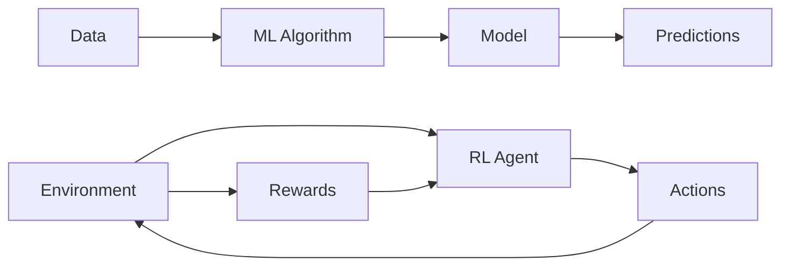
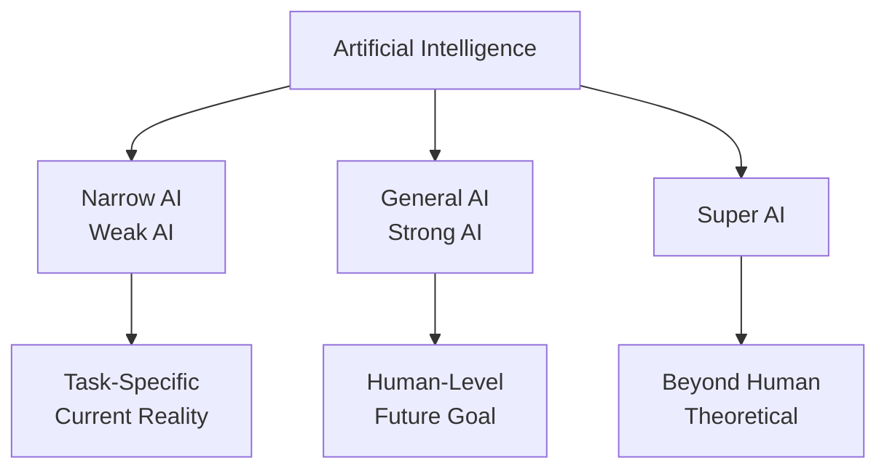
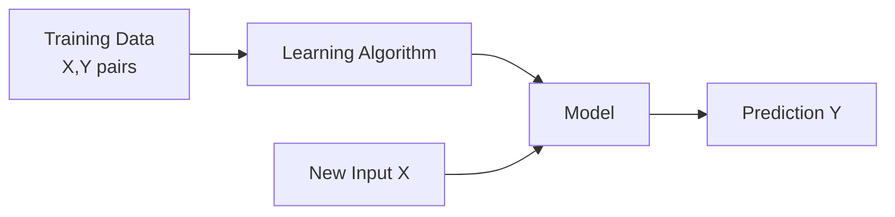
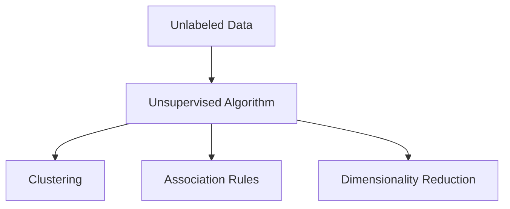
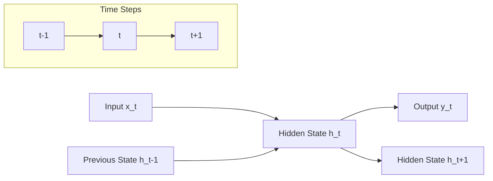
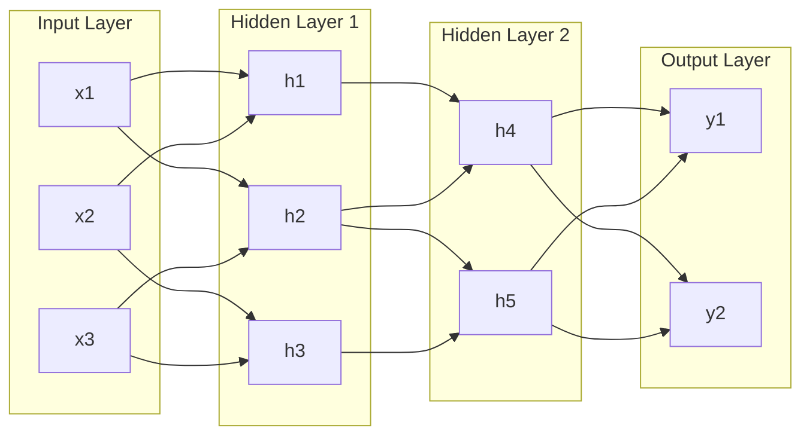
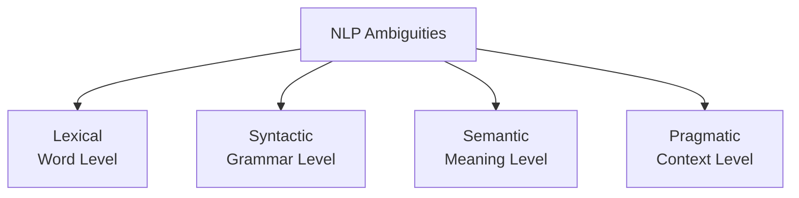
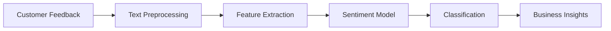
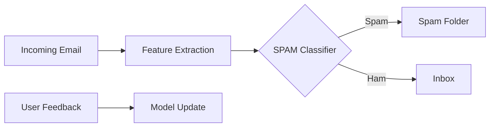

## Question 1(a) [3 marks]

**Define following terms: 1) Fuzzy Logic. 2) Expert System.**

**Answer**:

| Term | Definition |
|------|------------|
| **Fuzzy Logic** | Computing approach that deals with approximate rather than fixed and exact reasoning, allowing degrees of truth between 0 and 1 |
| **Expert System** | AI program that mimics human expert decision-making by using knowledge base and inference engine to solve specific problems |

- **Key Features**: Both handle uncertainty and incomplete information
- **Applications**: Medical diagnosis, industrial control systems

**Mnemonic:** "Fuzzy Experts handle uncertain decisions"

---

## Question 1(b) [4 marks]

**Define following terms: 1) Machine Learning. 2) Reinforcement Learning.**

**Answer**:

| Term | Definition | Key Characteristic |
|------|------------|-------------------|
| **Machine Learning** | Algorithm that automatically improves performance through experience without explicit programming | Learning from data patterns |
| **Reinforcement Learning** | Agent learns optimal actions through trial-and-error interactions with environment using rewards/penalties | Learning through feedback |

**Diagram:**



**Mnemonic:** "ML learns from Data, RL learns from Rewards"

---

## Question 1(c) [7 marks]

**Explain types of Artificial Intelligence in detail with suitable diagram.**

**Answer**:

**Table: Types of AI**

| Type | Description | Capability | Examples |
|------|-------------|------------|----------|
| **Narrow AI** | Designed for specific tasks | Limited domain expertise | Siri, Chess programs |
| **General AI** | Human-level intelligence across domains | Multi-domain reasoning | Currently theoretical |
| **Super AI** | Exceeds human intelligence | Beyond human capabilities | Future concept |

**Diagram:**



- **Current Status**: We are in Narrow AI era
- **Development Path**: Narrow → General → Super AI
- **Timeline**: General AI expected in 20-30 years

**Mnemonic:** "Narrow Now, General Goal, Super Soon"

---

## Question 1(c) OR [7 marks]

**Explain various aspects related to ethics while designing an AI system. Also, explain limitations of AI system in detail.**

**Answer**:

**AI Ethics Table:**

| Ethical Aspect | Description | Implementation |
|----------------|-------------|----------------|
| **Fairness** | Avoid bias and discrimination | Diverse training data |
| **Transparency** | Explainable AI decisions | Clear algorithms |
| **Privacy** | Protect user data | Data encryption |
| **Accountability** | Responsibility for AI actions | Human oversight |

**AI Limitations:**

- **Data Dependency**: Requires large, quality datasets
- **Lack of Common Sense**: Cannot understand context like humans
- **Brittleness**: Fails in unexpected situations
- **Black Box Problem**: Difficult to explain decisions

**Mnemonic:** "Fair, Transparent, Private, Accountable AI has Data, Common sense, Brittleness, Black box issues"

---

## Question 2(a) [3 marks]

**List characteristics of reinforcement learning.**

**Answer**:

| Characteristic | Description |
|----------------|-------------|
| **Trial-and-Error** | Agent learns through experimentation |
| **Reward-Based** | Feedback through rewards/penalties |
| **Sequential Decision Making** | Actions affect future states |
| **Exploration vs Exploitation** | Balance between trying new actions and using known good actions |

**Mnemonic:** "Trial Rewards Sequential Exploration"

---

## Question 2(b) [4 marks]

**Explain positive reinforcement and negative reinforcement.**

**Answer**:

**Comparison Table:**

| Type | Definition | Effect | Example |
|------|------------|--------|---------|
| **Positive Reinforcement** | Adding pleasant stimulus to increase behavior | Increases desired behavior | Giving treat for good performance |
| **Negative Reinforcement** | Removing unpleasant stimulus to increase behavior | Increases desired behavior | Stopping alarm when task completed |

**Key Difference**: Both increase behavior, but positive adds reward while negative removes punishment.

**Mnemonic:** "Positive Adds pleasure, Negative Removes pain"

---

## Question 2(c) [7 marks]

**Explain Supervised learning in detail.**

**Answer**:

**Definition**: Learning algorithm that learns from labeled training data to make predictions on new data.

**Process Table:**

| Step | Description | Example |
|------|-------------|---------|
| **Training** | Algorithm learns from input-output pairs | Email → Spam/Not Spam |
| **Validation** | Test model on unseen data | Check accuracy |
| **Prediction** | Make outputs for new inputs | Classify new emails |

**Types:**

- **Classification**: Predicts categories (spam detection)
- **Regression**: Predicts continuous values (house prices)

**Diagram:**



**Mnemonic:** "Supervised = Teacher provides correct answers"

---

## Question 2(a) OR [3 marks]

**List key components involved in human learning.**

**Answer**:

| Component | Function |
|-----------|----------|
| **Observation** | Gathering information from environment |
| **Memory** | Storing and retrieving experiences |
| **Practice** | Repetition to improve skills |
| **Feedback** | Information about performance |

**Mnemonic:** "Observe, Memorize, Practice, Feedback"

---

## Question 2(b) OR [4 marks]

**Explain about well-posed learning problem in detail.**

**Answer**:

**Definition**: A learning problem with clearly defined task, performance measure, and experience.

**Components Table:**

| Component | Description | Example |
|-----------|-------------|---------|
| **Task (T)** | What the system should learn to do | Play chess |
| **Performance (P)** | How to measure success | Win percentage |
| **Experience (E)** | Training data or practice | Previous games |

**Formula**: Learning = Improving P on T through E

**Criteria**: Problem must be measurable, achievable, and have available data.

**Mnemonic:** "Task Performance Experience = TPE for learning"

---

## Question 2(c) OR [7 marks]

**Explain Unsupervised learning in detail.**

**Answer**:

**Definition**: Learning patterns from data without labeled examples or target outputs.

**Types Table:**

| Type | Purpose | Algorithm | Example |
|------|---------|-----------|---------|
| **Clustering** | Group similar data | K-means | Customer segmentation |
| **Association** | Find relationships | Apriori | Market basket analysis |
| **Dimensionality Reduction** | Reduce features | PCA | Data visualization |

**Diagram:**



- **No Teacher**: Algorithm finds hidden patterns independently
- **Exploratory**: Discovers unknown structures in data

**Mnemonic:** "Unsupervised = No teacher, find patterns yourself"

---

## Question 3(a) [3 marks]

**Explain SIGMOID function. Also, draw its graph and provide an example of SIGMOID function.**

**Answer**:

**Definition**: Activation function that maps any real number to value between 0 and 1.

**Formula**: σ(x) = 1/(1 + e^(-x))

**Graph (ASCII):**

```goat
    1 |     ._-'
      |   .-'
    0.5|.-'
      |'
    0 +----------
     -5  0   5
```

**Example**: For x = 0, σ(0) = 1/(1 + e^0) = 1/2 = 0.5

**Properties**: S-shaped curve, smooth gradient, used in binary classification

**Mnemonic:** "Sigmoid Squashes values between 0 and 1"

---

## Question 3(b) [4 marks]

**Define following term: 1) Activation function. 2) Artificial neural network.**

**Answer**:

| Term | Definition | Purpose |
|------|------------|---------|
| **Activation Function** | Mathematical function that determines neuron output based on weighted inputs | Introduces non-linearity to neural networks |
| **Artificial Neural Network** | Computing system inspired by biological neural networks with interconnected nodes | Pattern recognition and machine learning |

**Key Features:**

- **Non-linear processing** enables complex pattern learning
- **Layered architecture** processes information hierarchically

**Mnemonic:** "Activation Artificially mimics brain neurons"

---

## Question 3(c) [7 marks]

**Draw and explain architecture of Recurrent network in detail.**

**Answer**:

**Definition**: Neural network with connections that create loops, allowing information persistence.

**Architecture Diagram:**



**Components Table:**

| Component | Function | Formula |
|-----------|----------|---------|
| **Hidden State** | Memory of previous inputs | h_t = f(W_h *h_t-1 + W_x* x_t) |
| **Input Layer** | Current time step input | x_t |
| **Output Layer** | Prediction at time t | y_t = W_y * h_t |

**Applications**: Speech recognition, language translation, time series prediction

**Advantage**: Handles sequential data with memory of past information

**Mnemonic:** "Recurrent = Remembers previous states"

---

## Question 3(a) OR [3 marks]

**Explain TANH function. Also, draw its graph and provide an example of TANH function.**

**Answer**:

**Definition**: Hyperbolic tangent activation function that maps values between -1 and 1.

**Formula**: tanh(x) = (e^x - e^(-x))/(e^x + e^(-x))

**Graph (ASCII):**

```goat
    1 |      ._-'
      |    .-'
    0 +.--'------
      |.-'
   -1 |'
      +----------
     -3  0   3
```

**Example**: For x = 0, tanh(0) = (1-1)/(1+1) = 0

**Properties**: Zero-centered, S-shaped, stronger gradients than sigmoid

**Mnemonic:** "TANH = Two-sided sigmoid (-1 to +1)"

---

## Question 3(b) OR [4 marks]

**Define following term: 1) Biological neural network. 2) Loss calculation.**

**Answer**:

| Term | Definition | Key Aspects |
|------|------------|-------------|
| **Biological Neural Network** | Network of interconnected neurons in living organisms that process information | Dendrites, cell body, axon, synapses |
| **Loss calculation** | Mathematical measure of difference between predicted and actual outputs | Guides learning through backpropagation |

**Biological Structure**: Neurons → Synapses → Neural Networks → Brain
**Loss Types**: Mean Squared Error, Cross-entropy, Absolute Error

**Mnemonic:** "Biology inspires AI, Loss measures learning progress"

---

## Question 3(c) OR [7 marks]

**Draw and explain architecture of multi-layer feed-forward network in detail.**

**Answer**:

**Definition**: Neural network with multiple layers where information flows forward from input to output.

**Architecture Diagram:**



**Layer Functions Table:**

| Layer | Function | Processing |
|-------|----------|------------|
| **Input** | Receives data | No processing, just distribution |
| **Hidden** | Feature extraction | Weighted sum + activation function |
| **Output** | Final prediction | Classification or regression output |

**Information Flow**: Input → Hidden Layer(s) → Output (unidirectional)
**Learning**: Backpropagation adjusts weights based on error

**Mnemonic:** "Multi-layer = Multiple hidden layers for complex learning"

---

## Question 4(a) [3 marks]

**List advantages of NLP in detail.**

**Answer**:

| Advantage | Description |
|-----------|-------------|
| **Automation** | Automates text processing tasks that require human effort |
| **Language Understanding** | Processes multiple languages and dialects effectively |
| **24/7 Availability** | Works continuously without human intervention |
| **Scalability** | Handles large volumes of text data efficiently |

**Applications**: Chatbots, translation, sentiment analysis, document processing

**Mnemonic:** "NLP = Automates Language Understanding 24/7 at Scale"

---

## Question 4(b) [4 marks]

**Explain Natural Language Generation in detail.**

**Answer**:

**Definition**: AI process that converts structured data into natural human language text.

**Process Table:**

| Step | Description | Function |
|------|-------------|----------|
| **Content Planning** | Decide what information to include | Data selection |
| **Sentence Planning** | Structure sentences and paragraphs | Text organization |
| **Surface Realization** | Generate actual text with grammar | Final output |

**Applications**: Report generation, chatbots, automated journalism, personalized content

**Example**: Converting sales data → "Sales increased 15% this quarter due to strong performance in electronics."

**Mnemonic:** "NLG = Numbers to Narrative"

---

## Question 4(c) [7 marks]

**Explain types of ambiguities in NLP. Also, provide examples of each ambiguity.**

**Answer**:

**Ambiguity Types Table:**

| Type | Description | Example | Resolution |
|------|-------------|---------|-----------|
| **Lexical** | Word has multiple meanings | "Bank" (river/financial) | Context analysis |
| **Syntactic** | Sentence structure unclear | "I saw man with telescope" | Parse trees |
| **Semantic** | Meaning unclear | "Colorless green ideas" | Semantic rules |
| **Pragmatic** | Context-dependent meaning | "Can you pass salt?" (request/question) | Situational context |

**Diagram:**



**Resolution Strategies**: Context analysis, statistical models, knowledge bases

**Mnemonic:** "Lexical Syntactic Semantic Pragmatic = LSSP ambiguities"

---

## Question 4(a) OR [3 marks]

**List disadvantages of NLP in detail.**

**Answer**:

| Disadvantage | Description |
|--------------|-------------|
| **Context Limitations** | Struggles with sarcasm, humor, cultural references |
| **Language Complexity** | Difficulty with idioms, slang, regional dialects |
| **Data Requirements** | Needs large amounts of training data |
| **Computational Cost** | Requires significant processing power and memory |

**Challenges**: Ambiguity, multilingual support, real-time processing

**Mnemonic:** "NLP Challenges = Context, Language, Data, Computation"

---

## Question 4(b) OR [4 marks]

**Explain Natural Language Understanding in detail.**

**Answer**:

**Definition**: AI capability to comprehend and interpret human language meaning and intent.

**Components Table:**

| Component | Function | Example |
|-----------|----------|---------|
| **Tokenization** | Break text into words/phrases | "Hello world" → ["Hello", "world"] |
| **Parsing** | Analyze grammatical structure | Identify subject, verb, object |
| **Semantic Analysis** | Extract meaning | Understand relationships between words |
| **Intent Recognition** | Identify user purpose | "Book flight" → travel booking intent |

**Process Flow**: Text Input → Tokenization → Parsing → Semantic Analysis → Intent Understanding

**Applications**: Virtual assistants, chatbots, voice commands

**Mnemonic:** "NLU = Naturally Understands Language"

---

## Question 4(c) OR [7 marks]

**Explain stemming and lemmatization in detail. Also provide two examples of each.**

**Answer**:

**Definitions:**

| Process | Description | Method | Output |
|---------|-------------|---------|---------|
| **Stemming** | Reduces words to root form by removing suffixes | Rule-based chopping | Word stem |
| **Lemmatization** | Reduces words to dictionary base form | Dictionary lookup | Valid word |

**Stemming Examples:**

1. "running", "runs", "ran" → "run"
2. "fishing", "fished", "fisher" → "fish"

**Lemmatization Examples:**

1. "better" → "good" (comparative to base)
2. "children" → "child" (plural to singular)

**Comparison Table:**

| Aspect | Stemming | Lemmatization |
|--------|----------|---------------|
| **Speed** | Faster | Slower |
| **Accuracy** | Lower | Higher |
| **Output** | May not be valid word | Always valid word |

**Mnemonic:** "Stemming = Speed, Lemmatization = Language accuracy"

---

## Question 5(a) [3 marks]

**Define: 1) Word embeddings. 2) Machine Translation.**

**Answer**:

| Term | Definition | Purpose |
|------|------------|---------|
| **Word Embeddings** | Dense vector representations of words that capture semantic relationships | Convert text to numerical form for ML |
| **Machine Translation** | Automated conversion of text from one language to another | Enable cross-language communication |

**Key Features**:

- **Word embeddings** preserve word relationships in vector space
- **Machine translation** maintains meaning across languages

**Mnemonic:** "Words become Vectors, Languages become Translations"

---

## Question 5(b) [4 marks]

**Explain Word2Vec in detail.**

**Answer**:

**Definition**: Neural network technique that creates word embeddings by learning word associations from large text corpus.

**Architecture Types:**

| Model | Description | Prediction |
|-------|-------------|------------|
| **CBOW (Continuous Bag of Words)** | Predicts target word from context | Context → Target |
| **Skip-gram** | Predicts context words from target | Target → Context |

**Process**:

1. **Training**: Neural network learns word relationships
2. **Vector Creation**: Each word gets unique vector representation
3. **Similarity**: Similar words have similar vectors

**Example**: vector("king") - vector("man") + vector("woman") ≈ vector("queen")

**Mnemonic:** "Word2Vec = Words to Vectors through Context"

---

## Question 5(c) [7 marks]

**Consider that a manufacturer of a product has collected feedback from the customer and is now willing to apply sentiment analysis on it. What are the steps to be followed for the same? Explain in detail.**

**Answer**:

**Sentiment Analysis Pipeline:**

| Step | Description | Tools/Methods |
|------|-------------|---------------|
| **Data Collection** | Gather customer feedback | Surveys, reviews, social media |
| **Data Preprocessing** | Clean and prepare text | Remove noise, tokenization |
| **Feature Extraction** | Convert text to numerical | TF-IDF, Word embeddings |
| **Model Training** | Train sentiment classifier | Naive Bayes, SVM, Neural networks |
| **Prediction** | Classify sentiment | Positive/Negative/Neutral |
| **Analysis** | Interpret results | Generate insights and reports |

**Implementation Flow:**



**Preprocessing Steps:**

- **Remove special characters** and URLs
- **Convert to lowercase** for consistency
- **Remove stop words** (the, and, or)
- **Handle negations** (not good → negative sentiment)

**Model Evaluation**: Use metrics like accuracy, precision, recall, F1-score

**Business Value**: Understand customer satisfaction, improve products, identify issues

**Mnemonic:** "Collect, Clean, Extract, Train, Predict, Analyze = Ccetpa"

---

## Question 5(a) OR [3 marks]

**List out advantages of GloVe with respect to NLP.**

**Answer**:

| Advantage | Description |
|-----------|-------------|
| **Global Context** | Considers entire corpus statistics, not just local context |
| **Linear Relationships** | Captures semantic relationships through vector arithmetic |
| **Efficiency** | Faster training compared to Word2Vec on large datasets |
| **Stability** | Consistent results across multiple training runs |

**Key Benefits**: Better performance on word analogy tasks, captures both local and global statistics

**Mnemonic:** "GloVe = Global Vector Excellence"

---

## Question 5(b) OR [4 marks]

**Explain challenges with TFIDF and BoW.**

**Answer**:

**Challenges Table:**

| Method | Challenges | Impact |
|--------|------------|---------|
| **TF-IDF** | 1. Ignores word order<br/>2. Sparse vectors<br/>3. No semantic similarity | Limited context understanding |
| **BoW** | 1. Loses sequence information<br/>2. High dimensionality<br/>3. No word relationships | Poor semantic representation |

**Common Issues:**

- **Vocabulary size**: Creates very large, sparse matrices
- **Out-of-vocabulary**: Cannot handle new words
- **Semantic gap**: "Good" and "excellent" treated as different

**Solutions**: Use word embeddings (Word2Vec, GloVe) for dense, semantic representations

**Mnemonic:** "TF-IDF and BoW = Sparse, No order, No semantics"

---

## Question 5(c) OR [7 marks]

**Consider that an e-mail service provider is willing to apply a SPAM detection technique. What are the steps to be followed to detect a SPAM e-mail? Explain in detail.**

**Answer**:

**SPAM Detection Pipeline:**

| Step | Description | Techniques |
|------|-------------|------------|
| **Data Collection** | Gather labeled spam/ham emails | Email datasets, user reports |
| **Feature Engineering** | Extract relevant features | Subject analysis, sender patterns |
| **Text Preprocessing** | Clean email content | Remove HTML, normalize text |
| **Feature Extraction** | Convert to numerical form | TF-IDF, N-grams, metadata |
| **Model Training** | Train classifier | Naive Bayes, SVM, Random Forest |
| **Validation** | Test model performance | Cross-validation, test set |
| **Deployment** | Integrate with email system | Real-time classification |

**Feature Types:**

| Feature Category | Examples | Purpose |
|------------------|----------|---------|
| **Content-based** | Keywords, phrases, HTML tags | Analyze email body |
| **Header-based** | Sender, subject, timestamps | Check metadata |
| **Behavioral** | Sending patterns, frequency | Identify suspicious behavior |

**Implementation Diagram:**



**Model Evaluation Metrics:**

- **Precision**: Avoid false positives (legitimate emails marked as spam)
- **Recall**: Catch actual spam emails
- **F1-Score**: Balance between precision and recall

**Continuous Learning**: Update model with new spam patterns and user feedback

**Mnemonic:** "Collect, Engineer, Process, Extract, Train, Validate, Deploy = CEPTVD"
