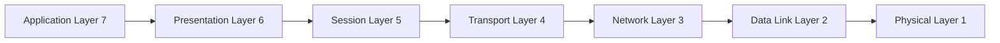
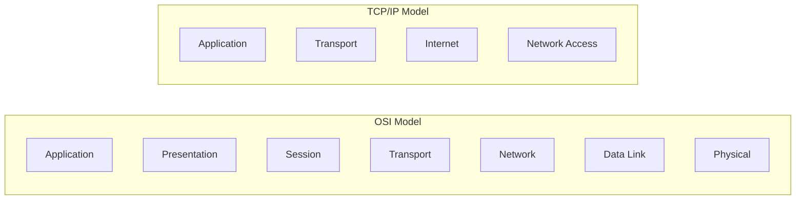
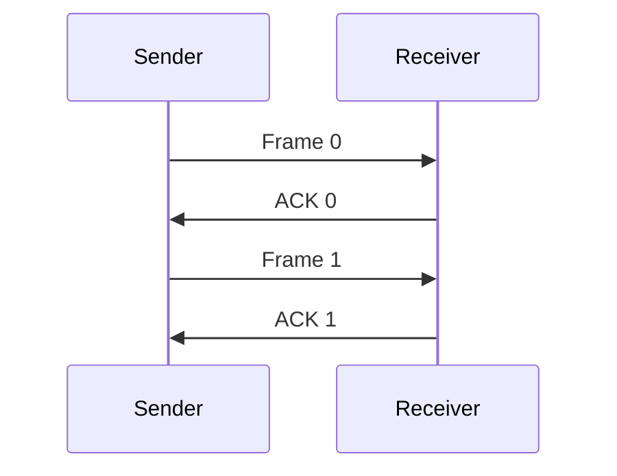
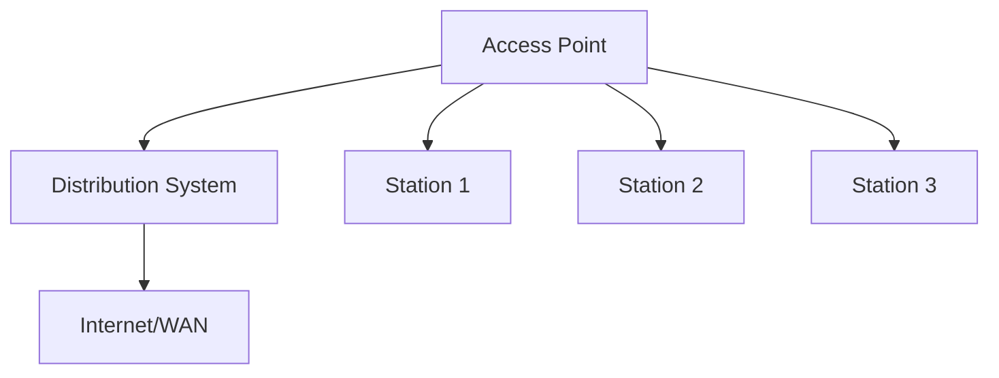

## પ્રશ્ન 1(અ) [3 ગુણ]

**વ્યાખ્યાયિત કરો : Peer to Peer network**

**જવાબ**:
Peer-to-Peer (P2P) નેટવર્ક એ વિતરિત નેટવર્ક આર્કિટેક્ચર છે જ્યાં દરેક નોડ (peer) ક્લાયન્ટ અને સર્વર બંને તરીકે કામ કરે છે અને કેન્દ્રીય નિયંત્રણ વિના સીધા સંસાધનો શેર કરે છે.

**ટેબલ:**

| પાસાં | વર્ણન |
|--------|-------------|
| **સ્ટ્રક્ચર** | વિકેન્દ્રીકૃત નેટવર્ક |
| **રોલ** | દરેક peer ક્લાયન્ટ અને સર્વર |
| **કંટ્રોલ** | કોઈ કેન્દ્રીય સત્તા નથી |
| **ઉદાહરણ** | BitTorrent, Skype |

**મેમરી ટ્રીક:** "Peers Share Equally"

---

## પ્રશ્ન 1(બ) [4 ગુણ]

**તુલના કરો : SMTP, POP અને IMAP**

**જવાબ**:
ઈમેઈલ પ્રોટોકોલ્સ ઈમેઈલ કમ્યુનિકેશન સિસ્ટમમાં અલગ અલગ હેતુઓ પૂરા કરે છે.

**ટેબલ:**

| ફીચર | SMTP | POP3 | IMAP |
|---------|------|------|------|
| **હેતુ** | ઈમેઈલ મોકલવા | ઈમેઈલ ડાઉનલોડ કરવા | ઈમેઈલ એક્સેસ કરવા |
| **પોર્ટ** | 25, 587 | 110, 995 | 143, 993 |
| **સ્ટોરેજ** | સર્વર ફોરવર્ડ કરે | લોકલ સ્ટોરેજ | સર્વર સ્ટોરેજ |
| **એક્સેસ** | એક દિશામાં મોકલવું | સિંગલ ડિવાઇસ | મલ્ટિપલ ડિવાઇસ |

**મેમરી ટ્રીક:** "Send-Pop-Internet Mail Access"

---

## પ્રશ્ન 1(ક) [7 ગુણ]

**દરેક સ્તરની જવાબદારી સાથે OSI model સમજાવો**

**જવાબ**:
OSI (Open Systems Interconnection) મોડેલમાં સાત સ્તરો છે, દરેકની નેટવર્ક કમ્યુનિકેશન માટે ચોક્કસ જવાબદારીઓ છે.

**ડાયાગ્રામ:**



**ટેબલ:**

| સ્તર | નામ | જવાબદારીઓ |
|-------|------|------------------|
| **7** | Application | યુઝર ઇન્ટરફેસ, નેટવર્ક સેવાઓ |
| **6** | Presentation | ડેટા એન્ક્રિપ્શન, કમ્પ્રેશન |
| **5** | Session | સેશન મેનેજમેન્ટ, ડાયલોગ કંટ્રોલ |
| **4** | Transport | End-to-end ડિલિવરી, એરર કંટ્રોલ |
| **3** | Network | રૂટિંગ, લોજિકલ એડ્રેસિંગ |
| **2** | Data Link | ફ્રેમ ફોર્મેટિંગ, એરર ડિટેક્શન |
| **1** | Physical | બિટ ટ્રાન્સમિશન, હાર્ડવેર |

**મુખ્ય મુદ્દાઓ:**

- **Application Layer**: એપ્લિકેશનોને નેટવર્ક સેવાઓ પ્રદાન કરે
- **Transport Layer**: વિશ્વસનીય ડેટા ડિલિવરી સુનિશ્ચિત કરે
- **Network Layer**: નેટવર્ક્સ વચ્ચે રૂટિંગ હેન્ડલ કરે

**મેમરી ટ્રીક:** "All People Seem To Need Data Processing"

---

## પ્રશ્ન 1(ક OR) [7 ગુણ]

**TCP/IP model ની OSI model સાથે તુલના કરો**

**જવાબ**:
TCP/IP અને OSI મોડેલ્સ અલગ અલગ લેયર સ્ટ્રક્ચર સાથે નેટવર્ક આર્કિટેક્ચર ફ્રેમવર્ક છે.

**ડાયાગ્રામ:**



**ટેબલ:**

| પાસાં | OSI Model | TCP/IP Model |
|--------|-----------|--------------|
| **લેયર્સ** | 7 લેયર્સ | 4 લેયર્સ |
| **ડેવલપમેન્ટ** | થિયોરેટિકલ | પ્રેક્ટિકલ |
| **ઉપયોગ** | રેફરન્સ મોડેલ | ઇન્ટરનેટ સ્ટાન્ડર્ડ |
| **જટિલતા** | વધુ વિગતવાર | સરળીકૃત |

**મુખ્ય મુદ્દાઓ:**

- **OSI**: વિગતવાર અલગીકરણ સાથે થિયોરેટિકલ ફ્રેમવર્ક
- **TCP/IP**: ઇન્ટરનેટ માટે પ્રેક્ટિકલ ઇમ્પ્લિમેન્ટેશન
- **મેપિંગ**: OSI ના ટોપ 3 લેયર્સ = TCP/IP માં Application layer

**મેમરી ટ્રીક:** "OSI Seven, TCP Four"

---

## પ્રશ્ન 2(અ) [3 ગુણ]

**સમજાવો : Network Address Translation (NAT)**

**જવાબ**:
NAT પ્રાઇવેટ IP એડ્રેસને પબ્લિક IP એડ્રેસમાં ટ્રાન્સલેટ કરે છે, જે મલ્ટિપલ ડિવાઇસને સિંગલ પબ્લિક IP શેર કરવા સક્ષમ બનાવે છે.

**ડાયાગ્રામ:**

```goat
Private Network    NAT Router    Internet
192.168.1.10  -->  203.0.113.1  -->  Server
192.168.1.20  -->  203.0.113.1  -->  Server
192.168.1.30  -->  203.0.113.1  -->  Server
```

**મુખ્ય મુદ્દાઓ:**

- **હેતુ**: નેટવર્ક્સ વચ્ચે IP એડ્રેસ ટ્રાન્સલેશન
- **ફાયદો**: પબ્લિક IP એડ્રેસની બચત
- **સિક્યોરિટી**: આંતરિક નેટવર્ક સ્ટ્રક્ચર છુપાવે છે

**મેમરી ટ્રીક:** "Network Address Translation"

---

## પ્રશ્ન 2(બ) [4 ગુણ]

**વ્યાખ્યાયિત કરો : Subnetting and Supernetting**

**જવાબ**:
Subnetting અને Supernetting કાર્યક્ષમ નેટવર્ક મેનેજમેન્ટ માટે IP એડ્રેસિંગ તકનીકો છે.

**ટેબલ:**

| તકનીક | વ્યાખ્યા | હેતુ |
|-----------|------------|---------|
| **Subnetting** | નેટવર્કને નાના સબનેટ્સમાં વિભાજન | બહેતર સંગઠન |
| **Supernetting** | મલ્ટિપલ નેટવર્ક્સનું સંયોજન | રૂટ એગ્રિગેશન |

**મુખ્ય મુદ્દાઓ:**

- **Subnetting**: નેટવર્ક બિટ્સ વધારે, હોસ્ટ બિટ્સ ઓછા કરે
- **Supernetting**: નેટવર્ક બિટ્સ ઓછા કરે, રૂટિંગ કાર્યક્ષમતા વધારે
- **CIDR**: Classless Inter-Domain Routing બંનેને સક્ષમ બનાવે

**મેમરી ટ્રીક:** "Sub-divides, Super-combines"

---

## પ્રશ્ન 2(ક) [7 ગુણ]

**સમજાવો : IPv4 ની Classful અને Classless notation addressing scheme**

**જવાબ**:
IPv4 એડ્રેસિંગ નેટવર્ક ઓળખ માટે classful અને classless સ્કીમનો ઉપયોગ કરે છે.

**ટેબલ - Classful Addressing:**

| Class | Range | Default Mask | Networks | Hosts |
|-------|-------|--------------|----------|--------|
| **A** | 1-126 | /8 (255.0.0.0) | 126 | 16M |
| **B** | 128-191 | /16 (255.255.0.0) | 16K | 65K |
| **C** | 192-223 | /24 (255.255.255.0) | 2M | 254 |

**Classless (CIDR) ઉદાહરણો:**

- **192.168.1.0/25**: 128 hosts
- **10.0.0.0/16**: 65,536 hosts
- **172.16.0.0/20**: 4,096 hosts

**મુખ્ય મુદ્દાઓ:**

- **Classful**: ફિક્સ્ડ નેટવર્ક/હોસ્ટ બાઉન્ડરીઝ
- **Classless**: Variable Length Subnet Mask (VLSM)
- **CIDR**: વધુ કાર્યક્ષમ એડ્રેસ એલોકેશન

**મેમરી ટ્રીક:** "Class-Fixed, CIDR-Flexible"

---

## પ્રશ્ન 2(અ OR) [3 ગુણ]

**મોબાઇલ IP ના ધ્યેયોની ચર્ચા કરો**

**જવાબ**:
મોબાઇલ IP મોબાઇલ ડિવાઇસ માટે વિવિધ નેટવર્ક્સમાં સીમલેસ કનેક્ટિવિટી સક્ષમ કરે છે.

**મુખ્ય મુદ્દાઓ:**

- **પારદર્શિતા**: એપ્લિકેશનોને મોબિલિટીની જાણ નથી
- **સુસંગતતા**: હાલના પ્રોટોકોલ્સ સાથે કામ કરે
- **કાર્યક્ષમતા**: ન્યૂનતમ રૂટિંગ ઓવરહેડ

**મેમરી ટ્રીક:** "Transparent Compatible Efficient"

---

## પ્રશ્ન 2(બ OR) [4 ગુણ]

**વ્યાખ્યાયિત કરો : ARP and RARP**

**જવાબ**:
ARP અને RARP વિવિધ એડ્રેસ પ્રકારો વચ્ચે મેપિંગ માટે એડ્રેસ રિઝોલ્યુશન પ્રોટોકોલ્સ છે.

**ટેબલ:**

| પ્રોટોકોલ | પૂરું નામ | હેતુ | દિશા |
|----------|-----------|---------|-----------|
| **ARP** | Address Resolution Protocol | IP to MAC મેપિંગ | લોજિકલ થી ફિઝિકલ |
| **RARP** | Reverse ARP | MAC to IP મેપિંગ | ફિઝિકલ થી લોજિકલ |

**મેમરી ટ્રીક:** "ARP-asks, RARP-reverses"

---

## પ્રશ્ન 2(ક OR) [7 ગુણ]

**સમજાવો : Stop and Wait, Stop and Wait ARQ data link layer protocols**

**જવાબ**:
આ પ્રોટોકોલ્સ ડેટા લિંક લેયર પર વિશ્વસનીય ડેટા ટ્રાન્સમિશન સુનિશ્ચિત કરે છે.

**ડાયાગ્રામ - Stop and Wait:**



**ટેબલ:**

| પ્રોટોકોલ | એરર ડિટેક્શન | કાર્યક્ષમતા | જટિલતા |
|----------|----------------|------------|-------------|
| **Stop and Wait** | બેસિક | ઓછી | સરળ |
| **Stop and Wait ARQ** | એડવાન્સ્ડ | મધ્યમ | મોડરેટ |

**મુખ્ય મુદ્દાઓ:**

- **Stop and Wait**: ફ્રેમ મોકલો, acknowledgment ની રાહ જુઓ
- **ARQ**: એરર પર Automatic Repeat reQuest
- **Timeout**: કોઈ acknowledgment ન મળે તો ફરીથી મોકલો

**મેમરી ટ્રીક:** "Stop-Wait-Acknowledge"

---

## પ્રશ્ન 3(અ) [3 ગુણ]

**Wireless networks સમજાવો**

**જવાબ**:
વાયરલેસ નેટવર્ક્સ ફિઝિકલ કનેક્શન વિના કમ્યુનિકેશન માટે રેડિયો તરંગોનો ઉપયોગ કરે છે.

**મુખ્ય મુદ્દાઓ:**

- **ટેકનોલોજી**: રેડિયો ફ્રીક્વન્સી ટ્રાન્સમિશન
- **પ્રકારો**: WiFi, Bluetooth, સેલ્યુલર
- **ફાયદાઓ**: મોબિલિટી, સરળ ઇન્સ્ટોલેશન

**મેમરી ટ્રીક:** "Wireless-Radio-Mobile"

---

## પ્રશ્ન 3(બ) [4 ગુણ]

**વ્યાખ્યાયિત કરો : Communication Middleware in mobile computing**

**જવાબ**:
કમ્યુનિકેશન મિડલવેર મોબાઇલ એપ્લિકેશન કમ્યુનિકેશન માટે અમૂર્તીકરણ લેયર પ્રદાન કરે છે.

**ટેબલ:**

| પાસાં | વર્ણન |
|--------|-------------|
| **હેતુ** | કમ્યુનિકેશન સરળ બનાવવું |
| **સ્થાન** | એપ અને નેટવર્ક વચ્ચે |
| **ફીચર્સ** | પ્રોટોકોલ હેન્ડલિંગ, ડેટા કન્વર્ઝન |
| **ઉદાહરણો** | CORBA, RMI |

**મેમરી ટ્રીક:** "Middle-Communication-Layer"

---

## પ્રશ્ન 3(ક) [7 ગુણ]

**મોબાઈલ કમ્પ્યુટિંગના આર્કિટેક્ચરની ચર્ચા કરો**

**જવાબ**:
મોબાઇલ કમ્પ્યુટિંગ આર્કિટેક્ચર મોબાઇલ એપ્લિકેશનોને સપોર્ટ કરતા મલ્ટિપલ પરસ્પર જોડાયેલા ઘટકોનો સમાવેશ કરે છે.

**ડાયાગ્રામ:**


**ટેબલ:**

| ઘટક | કાર્ય |
|-----------|----------|
| **Mobile Device** | યુઝર ઇન્ટરફેસ, લોકલ પ્રોસેસિંગ |
| **Wireless Network** | રેડિયો કમ્યુનિકેશન |
| **Base Station** | નેટવર્ક એક્સેસ પોઇન્ટ |
| **MSS** | મોબિલિટી મેનેજમેન્ટ |
| **Fixed Network** | બેકબોન ઇન્ફ્રાસ્ટ્રક્ચર |

**મુખ્ય મુદ્દાઓ:**

- **ત્રણ-સ્તરીય**: મોબાઇલ ડિવાઇસ, વાયરલેસ નેટવર્ક, ફિક્સ્ડ નેટવર્ક
- **મોબિલિટી સપોર્ટ**: હેન્ડઓફ મેનેજમેન્ટ
- **ડેટા મેનેજમેન્ટ**: કેશિંગ અને સિંક્રોનાઇઝેશન

**મેમરી ટ્રીક:** "Mobile-Wireless-Fixed"

---

## પ્રશ્ન 3(અ OR) [3 ગુણ]

**ad-hoc networks સમજાવો**

**જવાબ**:
Ad-hoc નેટવર્ક્સ ફિક્સ્ડ ઇન્ફ્રાસ્ટ્રક્ચર વિના સેલ્ફ-ઓર્ગેનાઇઝિંગ વાયરલેસ નેટવર્ક્સ છે.

**મુખ્ય મુદ્દાઓ:**

- **સ્ટ્રક્ચર**: Peer-to-peer ટોપોલોજી
- **રૂટિંગ**: ડાયનેમિક રૂટ ડિસ્કવરી
- **એપ્લિકેશનો**: ઇમર્જન્સી, મિલિટરી

**મેમરી ટ્રીક:** "Ad-hoc-Self-Organizing"

---

## પ્રશ્ન 3(બ OR) [4 ગુણ]

**વ્યાખ્યાયિત કરો : Transaction Processing Middleware in mobile computing**

**જવાબ**:
ટ્રાન્ઝેક્શન પ્રોસેસિંગ મિડલવેર મોબાઇલ ડેટાબેસ ટ્રાન્ઝેક્શનોમાં ACID પ્રાપર્ટીઓ સુનિશ્ચિત કરે છે.

**ટેબલ:**

| પ્રાપર્ટી | વર્ણન |
|----------|-------------|
| **Atomicity** | સર્વ અથવા કંઈ નહીં એક્ઝિક્યુશન |
| **Consistency** | ડેટાબેસ અખંડિતતા જાળવાય |
| **Isolation** | સમાંતર ટ્રાન્ઝેક્શન અલગીકરણ |
| **Durability** | કાયમી ટ્રાન્ઝેક્શન અસરો |

**મેમરી ટ્રીક:** "ACID-Properties"

---

## પ્રશ્ન 3(ક OR) [7 ગુણ]

**મોબાઇલ કમ્પ્યુટિંગની એપ્લિકેશન અને સેવાઓની ચર્ચા કરો**

**જવાબ**:
મોબાઇલ કમ્પ્યુટિંગ મલ્ટિપલ ડોમેન્સમાં વિવિધ એપ્લિકેશનોને સક્ષમ બનાવે છે.

**ટેબલ:**

| ડોમેન | એપ્લિકેશનો | સેવાઓ |
|--------|-------------|----------|
| **બિઝનેસ** | CRM, ERP | ડેટા સિંક્રોનાઇઝેશન |
| **હેલ્થકેર** | પેશન્ટ મોનિટરિંગ | રિમોટ ડાયગ્નોસિસ |
| **એજ્યુકેશન** | E-learning | કન્ટેન્ટ ડિલિવરી |
| **એન્ટરટેઈનમેન્ટ** | ગેમિંગ, સ્ટ્રીમિંગ | મીડિયા સેવાઓ |
| **નેવિગેશન** | GPS, મેપ્સ | લોકેશન સેવાઓ |

**મુખ્ય મુદ્દાઓ:**

- **લોકેશન-આધારિત**: GPS નેવિગેશન, જિયો-ફેન્સિંગ
- **કમ્યુનિકેશન**: ઇમેઇલ, મેસેજિંગ, વિડિયો કોલ્સ
- **કોમર્સ**: મોબાઇલ બેંકિંગ, શોપિંગ

**મેમરી ટ્રીક:** "Business-Health-Education-Entertainment"

---

## પ્રશ્ન 4(અ) [3 ગુણ]

**વર્ણન કરો : Indirect TCP in mobile computing**

**જવાબ**:
Indirect TCP મોબાઇલ હોસ્ટ મોબિલિટી કાર્યક્ષમ રીતે હેન્ડલ કરવા માટે TCP કનેક્શન સ્પ્લિટ કરે છે.

**ડાયાગ્રામ:**

```goat
Fixed Host --> Base Station --> Mobile Host
    TCP1          TCP2
```

**મુખ્ય મુદ્દાઓ:**

- **સ્પ્લિટ કનેક્શન**: બે અલગ TCP કનેક્શનો
- **બેસ સ્ટેશન**: પ્રોક્સી તરીકે કામ કરે
- **ફાયદો**: ઝડપી હેન્ડઓફ

**મેમરી ટ્રીક:** "Indirect-Split-Proxy"

---

## પ્રશ્ન 4(બ) [4 ગુણ]

**મોબાઈલ આઈપીમાં પેકેટ ડિલિવરીના સ્ટેપ્સ સમજાવો**

**જવાબ**:
મોબાઇલ IP પેકેટ ડિલિવરીમાં રજિસ્ટ્રેશન, ટનલિંગ અને ડિલિવરી સ્ટેપ્સ સામેલ છે.

**સ્ટેપ્સ:**

1. **રજિસ્ટ્રેશન**: મોબાઇલ નોડ હોમ એજન્ટ સાથે રજિસ્ટર કરે
2. **ટનલિંગ**: હોમ એજન્ટ ફોરેન એજન્ટ માટે ટનલ બનાવે
3. **એન્કેપ્સુલેશન**: મૂળ પેકેટ નવા હેડરમાં લપેટાય
4. **ડિલિવરી**: ફોરેન એજન્ટ મોબાઇલ નોડને ડિલિવર કરે

**મેમરી ટ્રીક:** "Register-Tunnel-Encapsulate-Deliver"

---

## પ્રશ્ન 4(ક) [7 ગુણ]

**મોબાઇલ આઈપી ની નીચેની ત્રણ પ્રક્રિયાઓ લખો: (1) Registration (2) Tunneling (3) Encapsulation**

**જવાબ**:

**1. Registration પ્રક્રિયા:**

- મોબાઇલ નોડ ફોરેન એજન્ટ શોધે
- હોમ એજન્ટ સાથે care-of address રજિસ્ટર કરે
- ઓથેન્ટિકેશન અને બાઇન્ડિંગ અપડેટ

**2. Tunneling પ્રક્રિયા:**

- હોમ એજન્ટ વર્ચ્યુઅલ ટનલ બનાવે
- ટનલ દ્વારા પેકેટ્સ ફોરવર્ડ કરાય
- End-to-end કનેક્ટિવિટી જાળવે

**3. Encapsulation પ્રક્રિયા:**

- મૂળ પેકેટ પેલોડ બને
- Care-of address સાથે નવો IP હેડર ઉમેરાય
- પેકેટ ફોરેન નેટવર્કમાં ડિલિવર થાય

**ડાયાગ્રામ:**


**મુખ્ય મુદ્દાઓ:**

- **Registration**: લોકેશન અપડેટ મેકેનિઝમ
- **Tunneling**: વર્ચ્યુઅલ કનેક્શન સ્થાપના
- **Encapsulation**: પેકેટ રેપિંગ તકનીક

**મેમરી ટ્રીક:** "Register-Tunnel-Encapsulate"

---

## પ્રશ્ન 4(અ OR) [3 ગુણ]

**વર્ણન કરો : Snooping TCP in mobile computing**

**જવાબ**:
Snooping TCP બેસ સ્ટેશન પર TCP સેગમેન્ટ્સ કેશ અને મોનિટર કરીને પર્ફોર્મન્સ સુધારે છે.

**મુખ્ય મુદ્દાઓ:**

- **લોકલ રિટ્રાન્સમિશન**: બેસ સ્ટેશન લોસેસ હેન્ડલ કરે
- **બફર મેનેજમેન્ટ**: અનએકનોલેજ્ડ સેગમેન્ટ્સ કેશ કરે
- **પારદર્શિતા**: End-to-end TCP જાળવાય

**મેમરી ટ્રીક:** "Snoop-Cache-Retransmit"

---

## પ્રશ્ન 4(બ OR) [4 ગુણ]

**મોબાઈલ આઈપીમાં હેન્ડઓવર મેનેજમેન્ટ સમજાવો**

**જવાબ**:
હેન્ડઓવર મેનેજમેન્ટ જ્યારે મોબાઇલ નોડ નેટવર્ક બદલે છે ત્યારે કનેક્ટિવિટી જાળવે છે.

**ટેબલ:**

| તબક્કો | પ્રક્રિયા |
|-------|---------|
| **ડિસ્કવરી** | નવો ફોરેન એજન્ટ શોધો |
| **રજિસ્ટ્રેશન** | Care-of address અપડેટ કરો |
| **ડેટા ફોરવર્ડિંગ** | પેકેટ્સ રીડાયરેક્ટ કરો |
| **ક્લીનઅપ** | જૂના રિસોર્સ રિલીઝ કરો |

**મેમરી ટ્રીક:** "Discover-Register-Forward-Cleanup"

---

## પ્રશ્ન 4(ક OR) [7 ગુણ]

**મોબાઇલ આઈપી માટે લક્ષ્યો અને જરૂરિયાતો લખો**

**જવાબ**:

**લક્ષ્યો:**

- **પારદર્શિતા**: એપ્લિકેશનો માટે સીમલેસ મોબિલિટી
- **સુસંગતતા**: હાલના ઇન્ટરનેટ પ્રોટોકોલ્સ સાથે કામ
- **સ્કેલેબિલિટી**: મોટી સંખ્યામાં મોબાઇલ નોડ્સ સપોર્ટ
- **સિક્યોરિટી**: મોબાઇલ નોડ્સ ઓથેન્ટિકેટ અને ડેટા પ્રોટેક્ટ

**જરૂરિયાતો:**

- **હોમ એજન્ટ**: મોબાઇલ નોડ લોકેશન જાળવે
- **ફોરેન એજન્ટ**: લોકલ સેવાઓ પ્રદાન કરે
- **Care-of Address**: ફોરેન નેટવર્કમાં ટેમ્પરરી એડ્રેસ
- **ટનલિંગ**: પેકેટ ફોરવર્ડિંગ મેકેનિઝમ

**ટેબલ:**

| પાસાં | લક્ષ્યો | જરૂરિયાતો |
|--------|-------|--------------|
| **મોબિલિટી** | સીમલેસ મૂવમેન્ટ | Care-of address |
| **કનેક્ટિવિટી** | સેશન જાળવો | ટનલિંગ |
| **પર્ફોર્મન્સ** | ન્યૂનતમ ઓવરહેડ | કાર્યક્ષમ રૂટિંગ |
| **સિક્યોરિટી** | ઓથેન્ટિકેશન | સિક્યોર પ્રોટોકોલ્સ |

**મેમરી ટ્રીક:** "Transparent-Compatible-Scalable-Secure"

---

## પ્રશ્ન 5(અ) [3 ગુણ]

**મોબાઇલ નેટવર્કમાં 6G ની વિશેષતાઓ લખો**

**જવાબ**:
6G એડવાન્સ્ડ ક્ષમતાઓ સાથે મોબાઇલ નેટવર્ક્સની આવતી પેઢીનું પ્રતિનિધિત્વ કરે છે.

**મુખ્ય મુદ્દાઓ:**

- **સ્પીડ**: 1 Tbps થિયોરેટિકલ સ્પીડ
- **લેટેન્સી**: સબ-મિલિસેકન્ડ લેટેન્સી
- **AI ઇન્ટિગ્રેશન**: નેટિવ આર્ટિફિશિયલ ઇન્ટેલિજન્સ

**મેમરી ટ્રીક:** "Tera-Speed-AI-Integration"

---

## પ્રશ્ન 5(બ) [4 ગુણ]

**વર્ણન કરો : Dynamic Host Configuration Protocol (DHCP)**

**જવાબ**:
DHCP ડિવાઇસને IP એડ્રેસ અને નેટવર્ક કન્ફિગરેશન આપોઆપ એસાઇન કરે છે.

**ટેબલ:**

| પ્રક્રિયા | વર્ણન |
|---------|-------------|
| **Discover** | ક્લાયન્ટ બ્રોડકાસ્ટ રિક્વેસ્ટ |
| **Offer** | સર્વર IP એડ્રેસ ઓફર કરે |
| **Request** | ક્લાયન્ટ ચોક્કસ IP રિક્વેસ્ટ કરે |
| **Acknowledge** | સર્વર એસાઇનમેન્ટ કન્ફર્મ કરે |

**મેમરી ટ્રીક:** "Discover-Offer-Request-Acknowledge"

---

## પ્રશ્ન 5(ક) [7 ગુણ]

**વર્ણન કરો : architecture of Wireless Personal Area Network (WLAN)**

**જવાબ**:
WLAN આર્કિટેક્ચર IEEE 802.11 સ્ટાન્ડર્ડ્સનો ઉપયોગ કરીને લોકલ એરિયાની અંદર વાયરલેસ કનેક્ટિવિટી પ્રદાન કરે છે.

**ડાયાગ્રામ:**



**ટેબલ:**

| ઘટક | કાર્ય |
|-----------|----------|
| **Access Point** | કેન્દ્રીય વાયરલેસ હબ |
| **Station** | વાયરલેસ ક્લાયન્ટ ડિવાઇસ |
| **Distribution System** | બેકબોન નેટવર્ક |
| **BSS** | બેસિક સર્વિસ સેટ |
| **ESS** | એક્સટેન્ડેડ સર્વિસ સેટ |

**મુખ્ય મુદ્દાઓ:**

- **ઇન્ફ્રાસ્ટ્રક્ચર મોડ**: એક્સેસ પોઇન્ટ્સનો ઉપયોગ
- **Ad-hoc મોડ**: સીધા ડિવાઇસ કમ્યુનિકેશન
- **સ્ટાન્ડર્ડ્સ**: 802.11a/b/g/n/ac/ax પ્રોટોકોલ્સ

**મેમરી ટ્રીક:** "Access-Station-Distribution"

---

## પ્રશ્ન 5(અ OR) [3 ગુણ]

**મોબાઇલ નેટવર્કમાં 5G ની વિશેષતાઓ લખો**

**જવાબ**:
5G અલ્ટ્રા-લો લેટેન્સી સાથે એન્હાન્સ્ડ મોબાઇલ બ્રોડબેન્ડ પ્રદાન કરે છે.

**મુખ્ય મુદ્દાઓ:**

- **સ્પીડ**: 10 Gbps સુધી ડાઉનલોડ
- **લેટેન્સી**: 1ms અલ્ટ્રા-લો લેટેન્સી
- **ડેન્સિટી**: પ્રતિ km² 1 મિલિયન ડિવાઇસ

**મેમરી ટ્રીક:** "10G-1ms-1Million"

---

## પ્રશ્ન 5(બ OR) [4 ગુણ]

**WWW અને HTTP સમજાવો**

**જવાબ**:
વર્લ્ડ વાઇડ વેબ વેબ પેજ કમ્યુનિકેશન માટે HTTP પ્રોટોકોલનો ઉપયોગ કરે છે.

**ટેબલ:**

| પાસાં | WWW | HTTP |
|--------|-----|------|
| **હેતુ** | માહિતી શેરિંગ | કમ્યુનિકેશન પ્રોટોકોલ |
| **ઘટકો** | વેબ પેજીસ, બ્રાઉઝર્સ | Request/response |
| **ફોર્મેટ** | HTML ડોક્યુમેન્ટ્સ | ટેક્સ્ટ-આધારિત પ્રોટોકોલ |
| **પોર્ટ** | વિવિધ | 80, 443 |

**મેમરી ટ્રીક:** "Web-Hypertext-Transfer"

---

## પ્રશ્ન 5(ક OR) [7 ગુણ]

**બ્લૂટૂથના આર્કિટેક્ચરનું વર્ણન કરો**

**જવાબ**:
બ્લૂટૂથ આર્કિટેક્ચર પ્રોટોકોલ સ્ટેકનો ઉપયોગ કરીને શોર્ટ-રેન્જ વાયરલેસ કમ્યુનિકેશન પ્રદાન કરે છે.

**ડાયાગ્રામ:**


**ટેબલ:**

| લેયર | કાર્ય |
|-------|----------|
| **Radio** | ફિઝિકલ ટ્રાન્સમિશન |
| **Baseband** | ટાઇમિંગ અને ફ્રીક્વન્સી હોપિંગ |
| **Link Manager** | કનેક્શન મેનેજમેન્ટ |
| **HCI** | હોસ્ટ કંટ્રોલર ઇન્ટરફેસ |
| **L2CAP** | લોજિકલ લિંક કંટ્રોલ |
| **Applications** | યુઝર સેવાઓ |

**મુખ્ય મુદ્દાઓ:**

- **Piconet**: માસ્ટર-સ્લેવ નેટવર્ક ટોપોલોજી
- **Frequency Hopping**: 79 ફ્રીક્વન્સી ચેનલ્સ
- **Power Classes**: વિવિધ ટ્રાન્સમિશન રેન્જીસ

**મેમરી ટ્રીક:** "Radio-Baseband-Link-Host-Logic"
