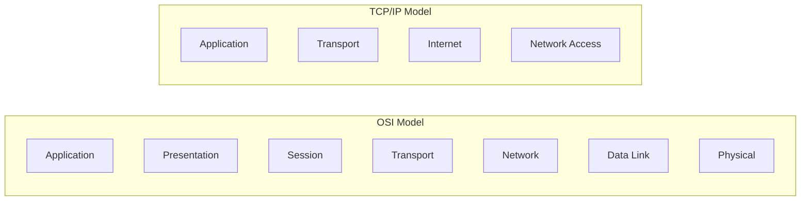
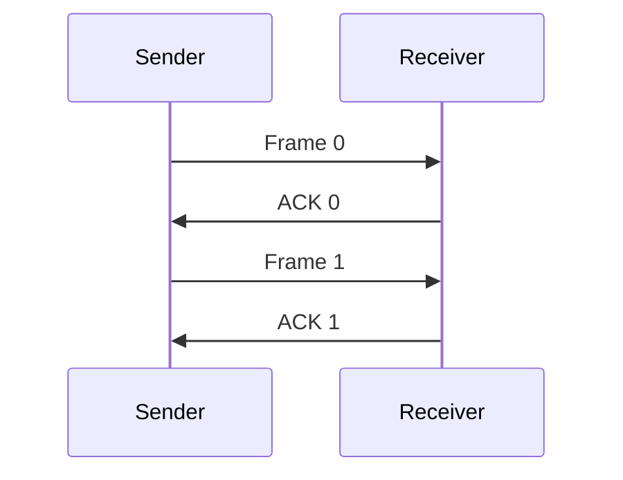
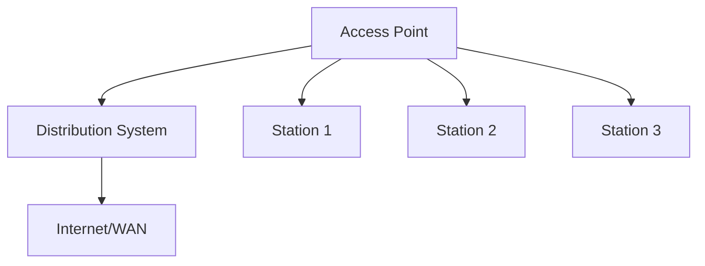

## Question 1(a) [3 marks]

**Define Peer to Peer network**

**Answer**:
A Peer-to-Peer (P2P) network is a distributed network architecture where each node (peer) acts as both client and server, sharing resources directly without centralized control.

**Table:**

| Aspect | Description |
|--------|-------------|
| **Structure** | Decentralized network |
| **Role** | Each peer is client and server |
| **Control** | No central authority |
| **Examples** | BitTorrent, Skype |

**Mnemonic:** "Peers Share Equally"

---

## Question 1(b) [4 marks]

**Compare SMTP, POP and IMAP**

**Answer**:
Email protocols serve different purposes in email communication system.

**Table:**

| Feature | SMTP | POP3 | IMAP |
|---------|------|------|------|
| **Purpose** | Send emails | Download emails | Access emails |
| **Port** | 25, 587 | 110, 995 | 143, 993 |
| **Storage** | Server forwards | Local storage | Server storage |
| **Access** | One-way sending | Single device | Multiple devices |

**Mnemonic:** "Send-Pop-Internet Mail Access"

---

## Question 1(c) [7 marks]

**Illustrate OSI model with responsibilities of each layer**

**Answer**:
The OSI (Open Systems Interconnection) model has seven layers, each with specific responsibilities for network communication.

**Diagram:**


**Table:**

| Layer | Name | Responsibilities |
|-------|------|------------------|
| **7** | Application | User interface, network services |
| **6** | Presentation | Data encryption, compression |
| **5** | Session | Session management, dialogue control |
| **4** | Transport | End-to-end delivery, error control |
| **3** | Network | Routing, logical addressing |
| **2** | Data Link | Frame formatting, error detection |
| **1** | Physical | Bit transmission, hardware |

**Key Points:**

- **Application Layer**: Provides network services to applications
- **Transport Layer**: Ensures reliable data delivery
- **Network Layer**: Handles routing between networks

**Mnemonic:** "All People Seem To Need Data Processing"

---

## Question 1(c OR) [7 marks]

**Compare the TCP/IP model with OSI model**

**Answer**:
TCP/IP and OSI models are network architecture frameworks with different layer structures.

**Diagram:**



**Table:**

| Aspect | OSI Model | TCP/IP Model |
|--------|-----------|--------------|
| **Layers** | 7 layers | 4 layers |
| **Development** | Theoretical | Practical |
| **Usage** | Reference model | Internet standard |
| **Complexity** | More detailed | Simplified |

**Key Points:**

- **OSI**: Theoretical framework with detailed separation
- **TCP/IP**: Practical implementation for internet
- **Mapping**: Top 3 OSI layers = Application layer in TCP/IP

**Mnemonic:** "OSI Seven, TCP Four"

---

## Question 2(a) [3 marks]

**Explain Network Address Translation (NAT)**

**Answer**:
NAT translates private IP addresses to public IP addresses, enabling multiple devices to share a single public IP.

**Diagram:**

```goat
Private Network    NAT Router    Internet
192.168.1.10  -->  203.0.113.1  -->  Server
192.168.1.20  -->  203.0.113.1  -->  Server
192.168.1.30  -->  203.0.113.1  -->  Server
```

**Key Points:**

- **Purpose**: IP address translation between networks
- **Benefit**: Conserves public IP addresses
- **Security**: Hides internal network structure

**Mnemonic:** "Network Address Translation"

---

## Question 2(b) [4 marks]

**Define Subnetting and Supernetting**

**Answer**:
Subnetting and Supernetting are IP addressing techniques for efficient network management.

**Table:**

| Technique | Definition | Purpose |
|-----------|------------|---------|
| **Subnetting** | Dividing network into smaller subnets | Better organization |
| **Supernetting** | Combining multiple networks | Route aggregation |

**Key Points:**

- **Subnetting**: Increases network bits, reduces host bits
- **Supernetting**: Decreases network bits, increases routing efficiency
- **CIDR**: Classless Inter-Domain Routing enables both

**Mnemonic:** "Sub-divides, Super-combines"

---

## Question 2(c) [7 marks]

**Demonstrate Classful and Classless notation addressing scheme of IPv4**

**Answer**:
IPv4 addressing uses classful and classless schemes for network identification.

**Table - Classful Addressing:**

| Class | Range | Default Mask | Networks | Hosts |
|-------|-------|--------------|----------|--------|
| **A** | 1-126 | /8 (255.0.0.0) | 126 | 16M |
| **B** | 128-191 | /16 (255.255.0.0) | 16K | 65K |
| **C** | 192-223 | /24 (255.255.255.0) | 2M | 254 |

**Classless (CIDR) Examples:**

- **192.168.1.0/25**: 128 hosts
- **10.0.0.0/16**: 65,536 hosts
- **172.16.0.0/20**: 4,096 hosts

**Key Points:**

- **Classful**: Fixed network/host boundaries
- **Classless**: Variable Length Subnet Mask (VLSM)
- **CIDR**: More efficient address allocation

**Mnemonic:** "Class-Fixed, CIDR-Flexible"

---

## Question 2(a OR) [3 marks]

**Discuss goals of mobile IP**

**Answer**:
Mobile IP enables seamless connectivity for mobile devices across different networks.

**Key Points:**

- **Transparency**: Applications unaware of mobility
- **Compatibility**: Works with existing protocols
- **Efficiency**: Minimal routing overhead

**Mnemonic:** "Transparent Compatible Efficient"

---

## Question 2(b OR) [4 marks]

**Define ARP and RARP**

**Answer**:
ARP and RARP are address resolution protocols for mapping between different address types.

**Table:**

| Protocol | Full Name | Purpose | Direction |
|----------|-----------|---------|-----------|
| **ARP** | Address Resolution Protocol | IP to MAC mapping | Logical to Physical |
| **RARP** | Reverse ARP | MAC to IP mapping | Physical to Logical |

**Mnemonic:** "ARP-asks, RARP-reverses"

---

## Question 2(c OR) [7 marks]

**Demonstrate Stop and Wait, Stop and Wait ARQ data link layer protocols**

**Answer**:
These protocols ensure reliable data transmission at the data link layer.

**Diagram - Stop and Wait:**



**Table:**

| Protocol | Error Detection | Efficiency | Complexity |
|----------|----------------|------------|-------------|
| **Stop and Wait** | Basic | Low | Simple |
| **Stop and Wait ARQ** | Advanced | Medium | Moderate |

**Key Points:**

- **Stop and Wait**: Send frame, wait for acknowledgment
- **ARQ**: Automatic Repeat reQuest on errors
- **Timeout**: Resend if no acknowledgment received

**Mnemonic:** "Stop-Wait-Acknowledge"

---

## Question 3(a) [3 marks]

**Demonstrate Wireless networks**

**Answer**:
Wireless networks use radio waves for communication without physical connections.

**Key Points:**

- **Technology**: Radio frequency transmission
- **Types**: WiFi, Bluetooth, Cellular
- **Benefits**: Mobility, easy installation

**Mnemonic:** "Wireless-Radio-Mobile"

---

## Question 3(b) [4 marks]

**Define Communication Middleware in mobile computing**

**Answer**:
Communication middleware provides abstraction layer for mobile application communication.

**Table:**

| Aspect | Description |
|--------|-------------|
| **Purpose** | Simplify communication |
| **Location** | Between app and network |
| **Features** | Protocol handling, data conversion |
| **Examples** | CORBA, RMI |

**Mnemonic:** "Middle-Communication-Layer"

---

## Question 3(c) [7 marks]

**Discuss the architecture of Mobile Computing**

**Answer**:
Mobile computing architecture consists of multiple interconnected components supporting mobile applications.

**Diagram:**


**Table:**

| Component | Function |
|-----------|----------|
| **Mobile Device** | User interface, local processing |
| **Wireless Network** | Radio communication |
| **Base Station** | Network access point |
| **MSS** | Mobility management |
| **Fixed Network** | Backbone infrastructure |

**Key Points:**

- **Three-tier**: Mobile device, wireless network, fixed network
- **Mobility Support**: Handoff management
- **Data Management**: Caching and synchronization

**Mnemonic:** "Mobile-Wireless-Fixed"

---

## Question 3(a OR) [3 marks]

**Demonstrate ad-hoc networks**

**Answer**:
Ad-hoc networks are self-organizing wireless networks without fixed infrastructure.

**Key Points:**

- **Structure**: Peer-to-peer topology
- **Routing**: Dynamic route discovery
- **Applications**: Emergency, military

**Mnemonic:** "Ad-hoc-Self-Organizing"

---

## Question 3(b OR) [4 marks]

**Define Transaction Processing Middleware in mobile computing**

**Answer**:
Transaction processing middleware ensures ACID properties in mobile database transactions.

**Table:**

| Property | Description |
|----------|-------------|
| **Atomicity** | All or nothing execution |
| **Consistency** | Database integrity maintained |
| **Isolation** | Concurrent transaction separation |
| **Durability** | Permanent transaction effects |

**Mnemonic:** "ACID-Properties"

---

## Question 3(c OR) [7 marks]

**Discuss the applications and services of mobile computing**

**Answer**:
Mobile computing enables diverse applications across multiple domains.

**Table:**

| Domain | Applications | Services |
|--------|-------------|----------|
| **Business** | CRM, ERP | Data synchronization |
| **Healthcare** | Patient monitoring | Remote diagnosis |
| **Education** | E-learning | Content delivery |
| **Entertainment** | Gaming, streaming | Media services |
| **Navigation** | GPS, maps | Location services |

**Key Points:**

- **Location-based**: GPS navigation, geo-fencing
- **Communication**: Email, messaging, video calls
- **Commerce**: Mobile banking, shopping

**Mnemonic:** "Business-Health-Education-Entertainment"

---

## Question 4(a) [3 marks]

**Describe Indirect TCP in mobile computing**

**Answer**:
Indirect TCP splits TCP connection to handle mobile host mobility efficiently.

**Diagram:**

```goat
Fixed Host --> Base Station --> Mobile Host
    TCP1          TCP2
```

**Key Points:**

- **Split Connection**: Two separate TCP connections
- **Base Station**: Acts as proxy
- **Advantage**: Faster handoff

**Mnemonic:** "Indirect-Split-Proxy"

---

## Question 4(b) [4 marks]

**Explain the steps of the packet delivery in Mobile IP**

**Answer**:
Mobile IP packet delivery involves registration, tunneling, and delivery steps.

**Steps:**

1. **Registration**: Mobile node registers with home agent
2. **Tunneling**: Home agent creates tunnel to foreign agent  
3. **Encapsulation**: Original packet wrapped in new header
4. **Delivery**: Foreign agent delivers to mobile node

**Mnemonic:** "Register-Tunnel-Encapsulate-Deliver"

---

## Question 4(c) [7 marks]

**Write following three processes of mobile IP: (1) Registration (2) Tunneling (3) Encapsulation**

**Answer**:

**1. Registration Process:**

- Mobile node discovers foreign agent
- Registers care-of address with home agent
- Authentication and binding update

**2. Tunneling Process:**

- Home agent creates virtual tunnel
- Packets forwarded through tunnel
- Maintains end-to-end connectivity

**3. Encapsulation Process:**

- Original packet becomes payload
- New IP header added with care-of address
- Packet delivered to foreign network

**Diagram:**


**Key Points:**

- **Registration**: Location update mechanism
- **Tunneling**: Virtual connection establishment  
- **Encapsulation**: Packet wrapping technique

**Mnemonic:** "Register-Tunnel-Encapsulate"

---

## Question 4(a OR) [3 marks]

**Describe Snooping TCP in mobile computing**

**Answer**:
Snooping TCP improves performance by caching and monitoring TCP segments at base station.

**Key Points:**

- **Local Retransmission**: Base station handles losses
- **Buffer Management**: Caches unacknowledged segments
- **Transparency**: End-to-end TCP maintained

**Mnemonic:** "Snoop-Cache-Retransmit"

---

## Question 4(b OR) [4 marks]

**Explain the Handover Management in mobile IP**

**Answer**:
Handover management maintains connectivity when mobile node changes networks.

**Table:**

| Phase | Process |
|-------|---------|
| **Discovery** | Find new foreign agent |
| **Registration** | Update care-of address |
| **Data Forwarding** | Redirect packets |
| **Cleanup** | Release old resources |

**Mnemonic:** "Discover-Register-Forward-Cleanup"

---

## Question 4(c OR) [7 marks]

**Write the goals and the requirements for the Mobile IP**

**Answer**:

**Goals:**

- **Transparency**: Seamless mobility for applications
- **Compatibility**: Work with existing internet protocols  
- **Scalability**: Support large number of mobile nodes
- **Security**: Authenticate mobile nodes and protect data

**Requirements:**

- **Home Agent**: Maintains mobile node location
- **Foreign Agent**: Provides local services
- **Care-of Address**: Temporary address in foreign network
- **Tunneling**: Packet forwarding mechanism

**Table:**

| Aspect | Goals | Requirements |
|--------|-------|--------------|
| **Mobility** | Seamless movement | Care-of address |
| **Connectivity** | Maintain sessions | Tunneling |
| **Performance** | Minimal overhead | Efficient routing |
| **Security** | Authentication | Secure protocols |

**Mnemonic:** "Transparent-Compatible-Scalable-Secure"

---

## Question 5(a) [3 marks]

**Write the features of 6G in mobile networks**

**Answer**:
6G represents the next generation of mobile networks with advanced capabilities.

**Key Points:**

- **Speed**: 1 Tbps theoretical speed
- **Latency**: Sub-millisecond latency
- **AI Integration**: Native artificial intelligence

**Mnemonic:** "Tera-Speed-AI-Integration"

---

## Question 5(b) [4 marks]

**Describe Dynamic Host Configuration Protocol (DHCP)**

**Answer**:
DHCP automatically assigns IP addresses and network configuration to devices.

**Table:**

| Process | Description |
|---------|-------------|
| **Discover** | Client broadcasts request |
| **Offer** | Server offers IP address |
| **Request** | Client requests specific IP |
| **Acknowledge** | Server confirms assignment |

**Mnemonic:** "Discover-Offer-Request-Acknowledge"

---

## Question 5(c) [7 marks]

**Describe the architecture of Wireless Personal Area Network (WLAN)**

**Answer**:
WLAN architecture provides wireless connectivity within local area using IEEE 802.11 standards.

**Diagram:**



**Table:**

| Component | Function |
|-----------|----------|
| **Access Point** | Central wireless hub |
| **Station** | Wireless client device |
| **Distribution System** | Backbone network |
| **BSS** | Basic Service Set |
| **ESS** | Extended Service Set |

**Key Points:**

- **Infrastructure Mode**: Uses access points
- **Ad-hoc Mode**: Direct device communication
- **Standards**: 802.11a/b/g/n/ac/ax protocols

**Mnemonic:** "Access-Station-Distribution"

---

## Question 5(a OR) [3 marks]

**Write the features of 5G in mobile networks**

**Answer**:
5G provides enhanced mobile broadband with ultra-low latency.

**Key Points:**

- **Speed**: Up to 10 Gbps download
- **Latency**: 1ms ultra-low latency
- **Density**: 1 million devices per km²

**Mnemonic:** "10G-1ms-1Million"

---

## Question 5(b OR) [4 marks]

**Explain WWW and HTTP**

**Answer**:
World Wide Web uses HTTP protocol for web page communication.

**Table:**

| Aspect | WWW | HTTP |
|--------|-----|------|
| **Purpose** | Information sharing | Communication protocol |
| **Components** | Web pages, browsers | Request/response |
| **Format** | HTML documents | Text-based protocol |
| **Port** | Various | 80, 443 |

**Mnemonic:** "Web-Hypertext-Transfer"

---

## Question 5(c OR) [7 marks]

**Describe the architecture of Bluetooth**

**Answer**:
Bluetooth architecture provides short-range wireless communication using protocol stack.

**Diagram:**


**Table:**

| Layer | Function |
|-------|----------|
| **Radio** | Physical transmission |
| **Baseband** | Timing and frequency hopping |
| **Link Manager** | Connection management |
| **HCI** | Host Controller Interface |
| **L2CAP** | Logical Link Control |
| **Applications** | User services |

**Key Points:**

- **Piconet**: Master-slave network topology
- **Frequency Hopping**: 79 frequency channels
- **Power Classes**: Different transmission ranges

**Mnemonic:** "Radio-Baseband-Link-Host-Logic"
