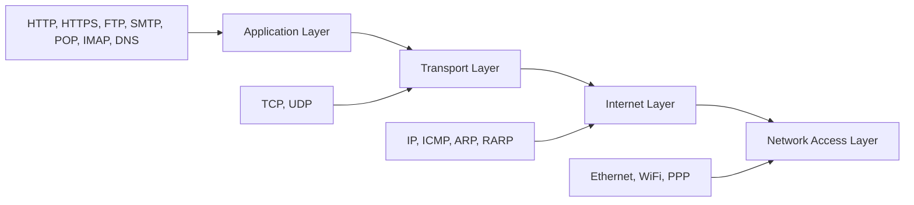
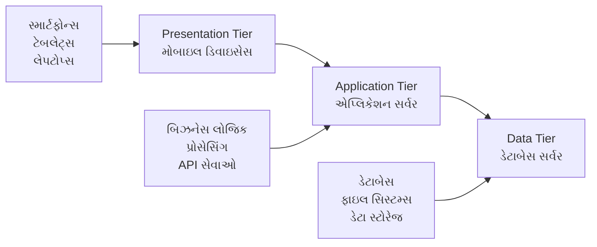
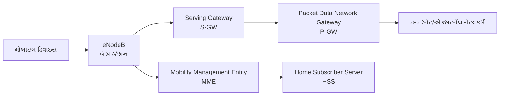
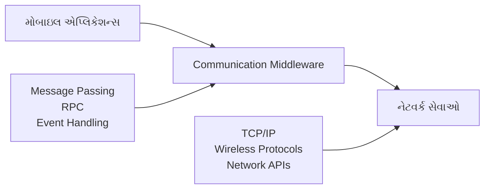
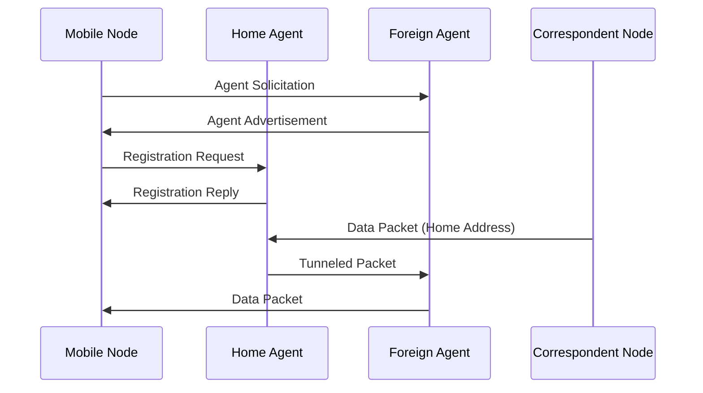
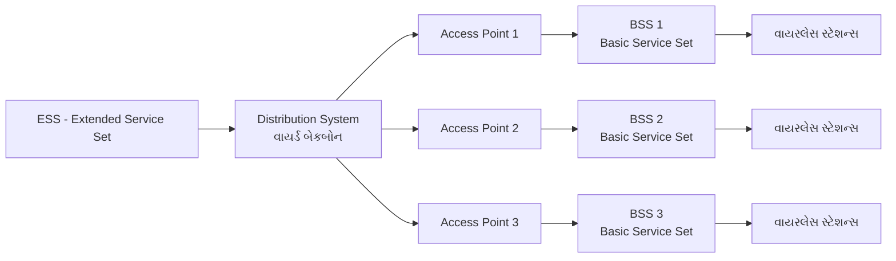
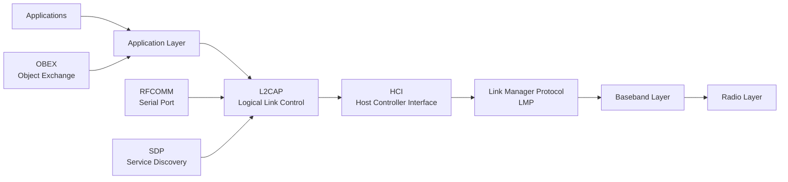

## પ્રશ્ન 1(અ) [3 ગુણ]

**POP પ્રોટોકોલની કામગીરી સમજાવો.**

**જવાબ**:

POP (Post Office Protocol) એ ઈમેલ પુનઃપ્રાપ્તિ પ્રોટોકોલ છે જે સર્વરથી ક્લાયન્ટ ડિવાઇસ પર ઈમેલ્સ ડાઉનલોડ કરે છે.

**કામગીરીની પ્રક્રિયા:**

| પગલું | ક્રિયા | વર્ણન |
|------|--------|-------------|
| 1 | કનેક્શન | ક્લાયન્ટ POP સર્વર સાથે પોર્ટ 110 પર જોડાય છે |
| 2 | ઓથેન્ટિકેશન | વપરાશકર્તા યુઝરનેમ અને પાસવર્ડ આપે છે |
| 3 | ડાઉનલોડ | ઈમેલ્સ લોકલ ડિવાઇસ પર ડાઉનલોડ થાય છે |
| 4 | ડિલીશન | ડાઉનલોડ પછી સર્વરથી ઈમેલ્સ ડિલીટ થાય છે |

- **ડાઉનલોડ-આધારિત**: ઈમેલ્સ ક્લાયન્ટ ડિવાઇસ પર સ્થાનિક રીતે સંગ્રહિત થાય છે
- **ઓફલાઇન એક્સેસ**: ઈન્ટરનેટ કનેક્શન વગર ઈમેલ્સ વાંચી શકાય છે
- **સિંગલ ડિવાઇસ**: એક જ ડિવાઇસ એક્સેસ માટે શ્રેષ્ઠ

**મેમરી ટ્રીક:** "POP ડાઉનલોડ કરે અને કાયમ માટે"

---

## પ્રશ્ન 1(બ) [4 ગુણ]

**OSI મોડલની TCP/IP મોડલ સાથે સરખામણી કરો.**

**જવાબ**:

OSI અને TCP/IP નેટવર્કિંગ મોડલ્સ વચ્ચેની સરખામણી:

| પાસું | OSI મોડલ | TCP/IP મોડલ |
|--------|-----------|--------------|
| **લેયર્સ** | 7 લેયર્સ | 4 લેયર્સ |
| **અભિગમ** | સૈદ્ધાંતિક મોડલ | વ્યવહારિક અમલીકરણ |
| **વિકાસ** | ISO સ્ટાન્ડર્ડ | DARPA પ્રોજેક્ટ |
| **જટિલતા** | વધુ જટિલ | સરળ બંધારણ |

**મુખ્ય તફાવતો:**

- **લેયર કાઉન્ટ**: OSI માં 7 લેયર્સ છે જ્યારે TCP/IP માં 4 લેયર્સ છે
- **વાસ્તવિક વપરાશ**: TCP/IP વ્યાપકપણે અમલમાં છે, OSI મોટે ભાગે સૈદ્ધાંતિક
- **પ્રોટોકોલ સ્વતંત્રતા**: OSI પ્રોટોકોલ-સ્વતંત્ર છે, TCP/IP પ્રોટોકોલ-વિશિષ્ટ છે
- **હેડર ઓવરહેડ**: વધારાની લેયર્સને કારણે OSI માં વધુ ઓવરહેડ છે

**મેમરી ટ્રીક:** "OSI સાત સૈદ્ધાંતિક, TCP ચાર વ્યવહારિક"

---

## પ્રશ્ન 1(ક) [7 ગુણ]

**TCP/IP મોડલના દરેક લેયરના પ્રોટોકોલ્સની કામગીરી સમજાવો.**

**જવાબ**:

TCP/IP મોડલમાં 4 લેયર્સ છે જેમાં દરેક લેયર પર વિશિષ્ટ પ્રોટોકોલ્સ છે:



**લેયર મુજબ પ્રોટોકોલ કાર્યો:**

| લેયર | પ્રોટોકોલ્સ | કાર્ય |
|-------|-----------|----------|
| **Application** | HTTP, FTP, SMTP, DNS | વપરાશકર્તા ઈન્ટરફેસ અને સેવાઓ |
| **Transport** | TCP, UDP | અંત-થી-અંત સંદેશાવ્યવહાર |
| **Internet** | IP, ICMP, ARP | રાઉટિંગ અને એડ્રેસિંગ |
| **Network Access** | Ethernet, WiFi | ભૌતિક ટ્રાન્સમિશન |

**પ્રોટોકોલ વિગતો:**

- **HTTP/HTTPS**: વેબ કમ્યુનિકેશન અને સુરક્ષિત વેબ કમ્યુનિકેશન
- **TCP**: વિશ્વસનીય, કનેક્શન-ઓરિએન્ટેડ ડેટા ટ્રાન્સફર
- **UDP**: ઝડપી, કનેક્શન-રહિત ડેટા ટ્રાન્સફર
- **IP**: પેકેટ રાઉટિંગ અને એડ્રેસિંગ
- **ARP**: IP એડ્રેસને MAC એડ્રેસ સાથે મેપ કરે છે

**મેમરી ટ્રીક:** "એપ્લિકેશન ટ્રાન્સપોર્ટ ઈન્ટરનેટ નેટવર્ક હંમેશા"

---

## પ્રશ્ન 1(ક અથવા) [7 ગુણ]

**OSI મોડલ તેની દરેક લેયર અને દરેક લેયરની કામગીરી સાથે સંક્ષિપ્તમાં સમજાવો.**

**જવાબ**:

OSI (Open Systems Interconnection) મોડલમાં નેટવર્ક કમ્યુનિકેશન માટે 7 લેયર્સ છે:


**લેયર કાર્યો:**

| લેયર | નામ | કાર્ય | પ્રોટોકોલ્સ |
|-------|------|----------|-----------|
| **7** | Application | વપરાશકર્તા ઈન્ટરફેસ | HTTP, FTP, SMTP |
| **6** | Presentation | ડેટા ફોર્મેટિંગ, એન્ક્રિપ્શન | SSL, JPEG, MPEG |
| **5** | Session | સેશન મેનેજમેન્ટ | NetBIOS, RPC |
| **4** | Transport | અંત-થી-અંત ડિલિવરી | TCP, UDP |
| **3** | Network | રાઉટિંગ | IP, ICMP |
| **2** | Data Link | ફ્રેમ ટ્રાન્સમિશન | Ethernet, PPP |
| **1** | Physical | બિટ ટ્રાન્સમિશન | કેબલ્સ, રેડિયો તરંગો |

**મુખ્ય લક્ષણો:**

- **મોડ્યુલર ડિઝાઇન**: દરેક લેયરની વિશિષ્ટ જવાબદારીઓ છે
- **પ્રોટોકોલ સ્વતંત્રતા**: લેયર્સ વિવિધ પ્રોટોકોલ્સ વાપરી શકે છે
- **માનકીકરણ**: સાર્વત્રિક નેટવર્કિંગ સંદર્ભ મોડલ

**મેમરી ટ્રીક:** "બધા લોકો સેશન ટ્રાન્સપોર્ટ નેટવર્ક ડેટા પ્રોસેસિંગ કરે"

---

## પ્રશ્ન 2(અ) [3 ગુણ]

**ARP અને RARP પ્રોટોકોલ્સ વચ્ચેનો તફાવત લખો.**

**જવાબ**:

ARP અને RARP વિપરીત કાર્યો સાથે એડ્રેસ રિઝોલ્યુશન પ્રોટોકોલ્સ છે:

| પાસું | ARP | RARP |
|--------|-----|------|
| **પૂરું નામ** | Address Resolution Protocol | Reverse Address Resolution Protocol |
| **હેતુ** | IP થી MAC એડ્રેસ મેપિંગ | MAC થી IP એડ્રેસ મેપિંગ |
| **દિશા** | લોજિકલ થી ફિઝિકલ | ફિઝિકલ થી લોજિકલ |
| **વપરાશ** | સામાન્ય નેટવર્ક કમ્યુનિકેશન | ડિસ્ક-રહિત વર્કસ્ટેશન્સ |

**કામગીરીની પ્રક્રિયા:**

- **ARP**: "મને IP એડ્રેસ ખબર છે, MAC એડ્રેસની જરૂર છે"
- **RARP**: "મને MAC એડ્રેસ ખબર છે, IP એડ્રેસની જરૂર છે"
- **કેશ**: બંને કાર્યક્ષમતા માટે એડ્રેસ ટેબલ મેઇન્ટેઇન કરે છે

**મેમરી ટ્રીક:** "ARP પૂછે ફિઝિકલ, RARP રિક્વેસ્ટ કરે IP"

---

## પ્રશ્ન 2(બ) [4 ગુણ]

**IMAP પ્રોટોકોલની કામગીરી સમજાવો.**

**જવાબ**:

IMAP (Internet Message Access Protocol) મલ્ટિપલ ડિવાઇસ એક્સેસ માટે સર્વર પર ઈમેલ્સનું મેનેજમેન્ટ કરે છે.

**કામગીરીની પ્રક્રિયા:**

| પગલું | ક્રિયા | વર્ણન |
|------|--------|-------------|
| 1 | કનેક્શન | ક્લાયન્ટ IMAP સર્વર સાથે જોડાય છે (પોર્ટ 143/993) |
| 2 | ઓથેન્ટિકેશન | ક્રેડેન્શિયલ્સ સાથે લોગિન |
| 3 | ફોલ્ડર એક્સેસ | સર્વર પર ઈમેલ ફોલ્ડર્સ બ્રાઉઝ કરો |
| 4 | સિંક્રોનાઇઝેશન | બધા ડિવાઇસેસ પર બદલાવો સિંક થાય છે |

**મુખ્ય લક્ષણો:**

- **સર્વર-આધારિત**: ઈમેલ્સ સર્વર પર રહે છે
- **મલ્ટિ-ડિવાઇસ**: અનેક ડિવાઇસેસથી એક્સેસ
- **સિંક્રોનાઇઝેશન**: બદલાવો બધે પ્રતિબિંબિત થાય છે
- **સિલેક્ટિવ ડાઉનલોડ**: માત્ર જરૂરી ઈમેલ્સ ડાઉનલોડ કરો

**ફાયદાઓ:**

- **સ્ટોરેજ કાર્યક્ષમતા**: સર્વર સ્ટોરેજનું મેનેજમેન્ટ કરે છે
- **એક્સેસિબિલિટી**: ગમે ત્યાંથી એક્સેસ કરો
- **બેકઅપ**: સર્વર આપોઆપ બેકઅપ પ્રદાન કરે છે

**મેમરી ટ્રીક:** "IMAP ઈન્ટરનેટ મેસેજેસ હંમેશા હાજર"

---

## પ્રશ્ન 2(ક) [7 ગુણ]

**Mobile computing નું Three-tier આર્કિટેક્ચર યોગ્ય ડાયગ્રામ સાથે સમજાવો.**

**જવાબ**:

Three-tier આર્કિટેક્ચર મોબાઇલ કમ્પ્યુટિંગને અલગ લેયર્સમાં વિભાજિત કરે છે:



**ટાયર વિગતો:**

| ટાયર | ઘટકો | જવાબદારીઓ |
|------|------------|------------------|
| **Presentation** | મોબાઇલ ડિવાઇસેસ, UI | વપરાશકર્તા ઈન્ટરફેસ અને ઇન્ટરેક્શન |
| **Application** | એપ્લિકેશન સર્વર્સ, મિડલવેર | બિઝનેસ લોજિક અને પ્રોસેસિંગ |
| **Data** | ડેટાબેસેસ, સ્ટોરેજ | ડેટા મેનેજમેન્ટ અને સ્ટોરેજ |

**આર્કિટેક્ચરના ફાયદાઓ:**

- **સ્કેલેબિલિટી**: દરેક ટાયર સ્વતંત્ર રીતે સ્કેલ કરી શકાય છે
- **મેઇન્ટેનેબિલિટી**: સરળ અપડેટ્સ માટે અલગ કાયદાઓ
- **સિક્યોરિટી**: ટાયર સેપરેશન દ્વારા ડેટા પ્રોટેક્શન
- **પરફોર્મન્સ**: વિતરિત પ્રોસેસિંગ લોડ ઘટાડે છે

**કમ્યુનિકેશન ફ્લો:**

- **વપરાશકર્તા રિક્વેસ્ટ**: Presentation → Application → Data
- **રેસ્પોન્સ**: Data → Application → Presentation
- **પ્રોસેસિંગ**: એપ્લિકેશન ટાયર બિઝનેસ લોજિક હેન્ડલ કરે છે

**મેમરી ટ્રીક:** "પ્રેઝન્ટેશન એપ્લાય કરે ડેટા પ્રોસેસિંગ"

---

## પ્રશ્ન 2(અ અથવા) [3 ગુણ]

**Stop-and-wait data link લેયર પ્રોટોકોલની મર્યાદાઓ સમજાવો.**

**જવાબ**:

Stop-and-wait પ્રોટોકોલમાં કેટલીક પરફોર્મન્સ મર્યાદાઓ છે:

**મુખ્ય મર્યાદાઓ:**

| મર્યાદા | વર્ણન | પ્રભાવ |
|------------|-------------|--------|
| **નીચી કાર્યક્ષમતા** | આગલા ફ્રેમ પહેલાં ACK ની રાહ જુએ છે | ખરાબ બેન્ડવિડ્થ ઉપયોગ |
| **વધુ વિલંબ** | દરેક ફ્રેમ માટે રાઉન્ડ-ટ્રિપ વિલંબ | ધીમું ડેટા ટ્રાન્સમિશન |
| **એરર સેન્સિટિવિટી** | એક જ એરર ટ્રાન્સમિશન અટકાવે છે | ઘટતી વિશ્વસનીયતા |

**પરફોર્મન્સ સમસ્યાઓ:**

- **બેન્ડવિડ્થ વેસ્ટ**: રાહ જોવાના સમય દરમિયાન લિંક નિષ્ક્રિય રહે છે
- **ટાઇમઆઉટ પ્રોબ્લેમ્સ**: ખોવાયેલ ACK બિનજરૂરી પુન:ટ્રાન્સમિશન લાવે છે
- **સિક્વેન્શિયલ પ્રોસેસિંગ**: એકસાથે મલ્ટિપલ ફ્રેમ્સ મોકલી શકાતા નથી

**મેમરી ટ્રીક:** "સ્ટોપ રાહ જુએ, બેન્ડવિડ્થ વેસ્ટ કરે"

---

## પ્રશ્ન 2(બ અથવા) [4 ગુણ]

**જૂની IPV4 એડ્રેસિંગ સ્કીમ પર IPV6 ના ફાયદાઓ સમજાવો.**

**જવાબ**:

IPv6 એ IPv4 પર નોંધપાત્ર સુધારાઓ પ્રદાન કરે છે:

**મુખ્ય ફાયદાઓ:**

| લક્ષણ | IPv4 | IPv6 |
|---------|------|------|
| **એડ્રેસ સ્પેસ** | 32-bit (4.3 બિલિયન) | 128-bit (340 અનડેસિલિયન) |
| **હેડર** | વેરિયેબલ લેન્થ | ફિક્સ્ડ 40 બાઇટ્સ |
| **સિક્યોરિટી** | વૈકલ્પિક IPSec | બિલ્ટ-ઇન IPSec |
| **કોન્ફિગરેશન** | મેન્યુઅલ/DHCP | ઓટો-કોન્ફિગરેશન |

**મુખ્ય ફાયદાઓ:**

- **અનલિમિટેડ એડ્રેસેસ**: એડ્રેસ એક્ઝોસ્ચન પ્રોબ્લેમ ઉકેલે છે
- **બેહતર પરફોર્મન્સ**: સરળ હેડર પ્રોસેસિંગ
- **એન્હાન્સ્ડ સિક્યોરિટી**: ફરજિયાત એન્ક્રિપ્શન સપોર્ટ
- **મોબિલિટી સપોર્ટ**: બેહતર મોબાઇલ ડિવાઇસ કનેક્ટિવિટી

**વધારાની લક્ષણો:**

- **ક્વોલિટી ઓફ સર્વિસ**: બિલ્ટ-ઇન QoS સપોર્ટ
- **મલ્ટિકાસ્ટ**: સુધારેલ મલ્ટિકાસ્ટ ક્ષમતાઓ
- **નો ફ્રેગમેન્ટેશન**: રાઉટર્સ પેકેટ્સને ફ્રેગમેન્ટ કરતા નથી

**મેમરી ટ્રીક:** "IPv6 સુધારે પરફોર્મન્સ, સિક્યોરિટી, એડ્રેસેસ"

---

## પ્રશ્ન 2(ક અથવા) [7 ગુણ]

**Mobile computing માં ઉપલબ્ધ નેટવર્કના નામ આપો. તેમાંથી કોઈપણ એકને વિસ્તારથી સમજાવો.**

**જવાબ**:

**મોબાઇલ નેટવર્કના પ્રકારો:**

| જનરેશન | ટેક્નોલોજી | સ્પીડ | લક્ષણો |
|------------|------------|-------|----------|
| **2G** | GSM, CDMA | 64 Kbps | વૉઇસ + SMS |
| **3G** | UMTS, CDMA2000 | 2 Mbps | ડેટા સેવાઓ |
| **4G** | LTE, WiMAX | 100 Mbps | હાઇ-સ્પીડ ઇન્ટરનેટ |
| **5G** | New Radio (NR) | 10 Gbps | અલ્ટ્રા-લો લેટન્સી |

**વિગતવાર: 4G LTE નેટવર્ક**



**4G LTE લક્ષણો:**

- **હાઇ સ્પીડ**: 100 Mbps ડાઉનલોડ, 50 Mbps અપલોડ સુધી
- **લો લેટન્સી**: રિયલ-ટાઇમ એપ્લિકેશન્સ માટે 10ms કરતાં ઓછું
- **ઓલ-IP નેટવર્ક**: પેકેટ-સ્વિચ્ડ આર્કિટેક્ચર
- **એડવાન્સ્ડ એન્ટેના**: બેહતર કવરેજ માટે MIMO ટેક્નોલોજી

**આર્કિટેક્ચર ઘટકો:**

- **eNodeB**: એડવાન્સ્ડ લક્ષણો સાથે એન્હાન્સ્ડ બેસ સ્ટેશન
- **MME**: મોબિલિટી અને ઓથેન્ટિકેશન મેનેજ કરે છે
- **ગેટવેઝ**: ડેટા રાઉટિંગ અને એક્સટર્નલ કનેક્ટિવિટી હેન્ડલ કરે છે

**એપ્લિકેશન્સ**: વિડિયો સ્ટ્રીમિંગ, ઓનલાઇન ગેમિંગ, IoT કનેક્ટિવિટી

**મેમરી ટ્રીક:** "4G LTE: લોંગ ટર્મ એવોલ્યુશન"

---

## પ્રશ્ન 3(અ) [3 ગુણ]

**Routing ના પ્રકાર સમજાવો.**

**જવાબ**:

રાઉટિંગ નેટવર્ક્સ પર ડેટા પેકેટ્સ માટે પાથ નિર્ધારિત કરે છે:

**રાઉટિંગના પ્રકારો:**

| પ્રકાર | વર્ણન | ઉદાહરણ |
|------|-------------|---------|
| **Static** | મેન્યુઅલ રાઉટ કોન્ફિગરેશન | એડમિનિસ્ટ્રેટિવ સેટઅપ |
| **Dynamic** | ઓટોમેટિક રાઉટ ડિસ્કવરી | RIP, OSPF પ્રોટોકોલ્સ |
| **Default** | અજાણ્યા ડેસ્ટિનેશન્સ માટે ફોલબેક રાઉટ | ગેટવે ઓફ લાસ્ટ રિસોર્ટ |

**રાઉટિંગ કેટેગરીઝ:**

- **Distance Vector**: હોપ કાઉન્ટ વાપરે છે (RIP)
- **Link State**: નેટવર્ક ટોપોલોજી વાપરે છે (OSPF)
- **Hybrid**: બંને અભિગમો જોડે છે (EIGRP)

**સિલેક્શન ક્રાઇટેરિયા:**

- **Shortest path**: મિનિમમ હોપ્સ અથવા ડિસ્ટન્સ
- **Load balancing**: ટ્રાફિક સમાન રીતે વિતરિત કરો
- **Fault tolerance**: નિષ્ફળતાઓ માટે વૈકલ્પિક રાઉટ્સ

**મેમરી ટ્રીક:** "સ્ટેટિક ડાયનેમિક ડિફોલ્ટ રાઉટ્સ"

---

## પ્રશ્ન 3(બ) [4 ગુણ]

**Subnetting અને supernetting શું છે?**

**જવાબ**:

સબનેટિંગ અને સુપરનેટિંગ IP એડ્રેસ એલોકેશનને કાર્યક્ષમ રીતે મેનેજ કરે છે:

**સરખામણી:**

| પાસું | સબનેટિંગ | સુપરનેટિંગ |
|--------|------------|--------------|
| **હેતુ** | મોટા નેટવર્કને વિભાજિત કરો | નાના નેટવર્ક્સને જોડો |
| **દિશા** | ટોપ-ડાઉન અભિગમ | બોટમ-અપ અભિગમ |
| **માસ્ક** | લાંબો સબનેટ માસ્ક | ટૂંકો સબનેટ માસ્ક |
| **પરિણામ** | અનેક નાના સબનેટ્સ | એક જ મોટું નેટવર્ક |

**સબનેટિંગ પ્રક્રિયા:**

- **બિટ્સ ઉધાર લેવા**: હોસ્ટ ભાગમાંથી બિટ્સ લો
- **સબનેટ્સ બનાવો**: અનેક નેટવર્ક સેગમેન્ટ્સ
- **બ્રોડકાસ્ટ ઘટાડો**: નાના બ્રોડકાસ્ટ ડોમેન્સ

**સુપરનેટિંગ પ્રક્રિયા:**

- **નેટવર્ક્સ જોડો**: આડીને આવેલા નેટવર્ક્સને મર્જ કરો
- **રાઉટ એગ્રિગેશન**: સિંગલ રાઉટિંગ એન્ટ્રી
- **રાઉટિંગ ટેબલ ઘટાડો**: ઓછી રાઉટિંગ એન્ટ્રીઝ

**ફાયદાઓ:**

- **સબનેટિંગ**: બેહતર નેટવર્ક મેનેજમેન્ટ, સિક્યોરિટી
- **સુપરનેટિંગ**: સરળ રાઉટિંગ, ઘટેલ ઓવરહેડ

**મેમરી ટ્રીક:** "સબનેટિંગ સ્પ્લિટ્સ, સુપરનેટિંગ સમ્સ"

---

## પ્રશ્ન 3(ક) [7 ગુણ]

**IPV6 એડ્રેસિંગ સમજાવો. IPV6 સ્થળાંતરની જરૂરિયાત કેમ છે?**

**જવાબ**:

IPv6 એડ્રેસિંગ IPv4 મર્યાદાઓ ઉકેલવા માટે 128-bit એડ્રેસેસ વાપરે છે:

**IPv6 એડ્રેસ સ્ટ્રક્ચર:**

```goat
+---+---+---+---+---+---+---+---+---+---+---+---+---+---+---+---+
| Global Routing Prefix |Subnet |      Interface Identifier     |
|      (48 bits)        |(16)   |         (64 bits)             |
+---+---+---+---+---+---+---+---+---+---+---+---+---+---+---+---+
```

**એડ્રેસ ફોર્મેટ:**

| ઘટક | સાઇઝ | હેતુ |
|-----------|------|---------|
| **Global Prefix** | 48 bits | ISP એલોકેશન |
| **Subnet ID** | 16 bits | સંસ્થાના સબનેટ્સ |
| **Interface ID** | 64 bits | ડિવાઇસ આઇડેન્ટિફિકેશન |

**એડ્રેસના પ્રકારો:**

- **Unicast**: એક-થી-એક કમ્યુનિકેશન
- **Multicast**: એક-થી-અનેક કમ્યુનિકેશન
- **Anycast**: એક-થી-નજીકના કમ્યુનિકેશન

**IPv6 સ્થળાંતરની જરૂરિયાત:**

**ગંભીર સમસ્યાઓ:**

| સમસ્યા | IPv4 | IPv6 સોલ્યુશન |
|---------|------|---------------|
| **એડ્રેસ એક્ઝોસ્ચન** | 4.3 બિલિયન એડ્રેસેસ | 340 અનડેસિલિયન એડ્રેસેસ |
| **NAT જટિલતા** | કનેક્ટિવિટી માટે જરૂરી | એન્ડ-ટુ-એન્ડ કનેક્ટિવિટી |
| **સિક્યોરિટી** | એડ-ઓન લક્ષણ | બિલ્ટ-ઇન IPSec |
| **મોબાઇલ સપોર્ટ** | મર્યાદિત | નેટિવ મોબિલિટી |

**સ્થળાંતરના ફાયદાઓ:**

- **અનલિમિટેડ ગ્રોથ**: IoT વિસ્તરણને સપોર્ટ કરે છે
- **સરળ કોન્ફિગરેશન**: ઓટો-કોન્ફિગરેશન લક્ષણો
- **બેહતર પરફોર્મન્સ**: ઓપ્ટિમાઇઝ્ડ હેડર સ્ટ્રક્ચર
- **એન્હાન્સ્ડ સિક્યોરિટી**: ફરજિયાત એન્ક્રિપ્શન

**સ્થળાંતરના પડકારો:**

- **ડ્યુઅલ-સ્ટેક**: IPv4 અને IPv6 બંને ચલાવવું
- **ટ્રાન્સલેશન**: IPv4-IPv6 ઇન્ટરઓપેરેબિલિટી
- **ટ્રેનિંગ**: સ્ટાફ શિક્ષણની જરૂરિયાતો

**મેમરી ટ્રીક:** "IPv6 અનંત શક્યતાઓ, એન્હાન્સ્ડ સિક્યોરિટી"

---

## પ્રશ્ન 3(અ અથવા) [3 ગુણ]

**નીચેનામાંથી માન્ય IPv4 એડ્રેસ શોધો. જો તે માન્ય IPv4 એડ્રેસ હોય તો તેના class, Network ID અને Host ID શોધો. જો તે માન્ય IPv4 એડ્રેસ ન હોય તો તેનું કારણ આપો.**

**અ. 192.108.102.101**
**બ. 80.54.256.14**

**જવાબ**:

**વિશ્લેષણ:**

| એડ્રેસ | માન્યતા | ક્લાસ | Network ID | Host ID | કારણ |
|---------|----------|-------|------------|---------|---------|
| **192.108.102.101** | માન્ય | ક્લાસ C | 192.108.102.0 | 0.0.0.101 | બધા ઓક્ટેટ્સ ≤ 255 |
| **80.54.256.14** | અમાન્ય | - | - | - | ત્રીજો ઓક્ટેટ = 256 > 255 |

**એડ્રેસ અ: 192.108.102.101**

- **માન્ય**: બધા ઓક્ટેટ્સ રેન્જમાં છે (0-255)
- **ક્લાસ C**: પ્રથમ ઓક્ટેટ 192 (192-223 રેન્જ)
- **ડિફોલ્ટ માસ્ક**: 255.255.255.0 (/24)

**એડ્રેસ બ: 80.54.256.14**

- **અમાન્ય**: ત્રીજો ઓક્ટેટ 256 છે
- **નિયમ ઉલ્લંઘન**: દરેક ઓક્ટેટ 0-255 હોવો જોઈએ
- **સુધારો**: 256 ને માન્ય વેલ્યુ (0-255) સાથે બદલો

**મેમરી ટ્રીક:** "દરેક ઓક્ટેટ મહત્તમ 255"

---

## પ્રશ્ન 3(બ અથવા) [4 ગુણ]

**Network Address Translation પર ટૂંક નોંધ લખો.**

**જવાબ**:

NAT ઇન્ટરનેટ એક્સેસ માટે પ્રાઇવેટ IP એડ્રેસેસને પબ્લિક IP એડ્રેસેસમાં ટ્રાન્સલેટ કરે છે:

**NAT પ્રક્રિયા:**

| પગલું | દિશા | ટ્રાન્સલેશન |
|------|-----------|-------------|
| **આઉટબાઉન્ડ** | પ્રાઇવેટ → પબ્લિક | ઇન્ટર્નલ IP પબ્લિક IP સાથે મેપ થાય છે |
| **ઇનબાઉન્ડ** | પબ્લિક → પ્રાઇવેટ | પબ્લિક IP ઇન્ટર્નલ IP સાથે મેપ થાય છે |

**NAT પ્રકારો:**

```goat
NAT Types
├── Static NAT (1:1 mapping)
├── Dynamic NAT (Pool mapping)
└── PAT/NAPT (Port translation)
```

**ફાયદાઓ:**

- **IP બચત**: અનેક ડિવાઇસેસ એક પબ્લિક IP શેર કરે છે
- **સિક્યોરિટી**: ઇન્ટર્નલ નેટવર્ક સ્ટ્રક્ચર છુપાવે છે
- **કોસ્ટ રિડક્શન**: ઓછા પબ્લિક IP એડ્રેસેસની જરૂર
- **લવચીકતા**: સરળ ઇન્ટર્નલ નેટવર્ક બદલાવ

**મર્યાદાઓ:**

- **એન્ડ-ટુ-એન્ડ કનેક્ટિવિટી**: ડાયરેક્ટ કમ્યુનિકેશન તોડે છે
- **પ્રોટોકોલ સમસ્યાઓ**: કેટલાક પ્રોટોકોલ્સ NAT મારફતે કામ કરતા નથી
- **પરફોર્મન્સ**: અતિરિક્ત પ્રોસેસિંગ ઓવરહેડ

**મેમરી ટ્રીક:** "NAT નેટવર્ક્સ એડ્રેસ ટ્રાન્સલેશન"

---

## પ્રશ્ન 3(ક અથવા) [7 ગુણ]

**IPV4 Datagram Header વિસ્તારથી સમજાવો.**

**જવાબ**:

IPv4 હેડરમાં પેકેટ રાઉટિંગ માટે જરૂરી માહિતી છે:

```goat
 0                   1                   2                   3
 0 1 2 3 4 5 6 7 8 9 0 1 2 3 4 5 6 7 8 9 0 1 2 3 4 5 6 7 8 9 0 1
+-+-+-+-+-+-+-+-+-+-+-+-+-+-+-+-+-+-+-+-+-+-+-+-+-+-+-+-+-+-+-+-+
|Version|  IHL  |Type of Service|          Total Length         |
+-+-+-+-+-+-+-+-+-+-+-+-+-+-+-+-+-+-+-+-+-+-+-+-+-+-+-+-+-+-+-+-+
|         Identification        |Flags|      Fragment Offset    |
+-+-+-+-+-+-+-+-+-+-+-+-+-+-+-+-+-+-+-+-+-+-+-+-+-+-+-+-+-+-+-+-+
|  Time to Live |    Protocol   |         Header Checksum       |
+-+-+-+-+-+-+-+-+-+-+-+-+-+-+-+-+-+-+-+-+-+-+-+-+-+-+-+-+-+-+-+-+
|                       Source Address                          |
+-+-+-+-+-+-+-+-+-+-+-+-+-+-+-+-+-+-+-+-+-+-+-+-+-+-+-+-+-+-+-+-+
|                    Destination Address                        |
+-+-+-+-+-+-+-+-+-+-+-+-+-+-+-+-+-+-+-+-+-+-+-+-+-+-+-+-+-+-+-+-+
|                    Options                    |    Padding    |
+-+-+-+-+-+-+-+-+-+-+-+-+-+-+-+-+-+-+-+-+-+-+-+-+-+-+-+-+-+-+-+-+
```

**હેડર ફીલ્ડ્સ:**

| ફીલ્ડ | સાઇઝ | હેતુ |
|-------|------|---------|
| **Version** | 4 bits | IP વર્ઝન (IPv4 માટે 4) |
| **IHL** | 4 bits | 32-bit શબ્દોમાં હેડર લેન્થ |
| **Type of Service** | 8 bits | સેવાની ગુણવત્તા |
| **Total Length** | 16 bits | કુલ પેકેટ સાઇઝ |
| **Identification** | 16 bits | ફ્રેગમેન્ટ આઇડેન્ટિફિકેશન |
| **Flags** | 3 bits | ફ્રેગમેન્ટેશન કંટ્રોલ |
| **Fragment Offset** | 13 bits | ફ્રેગમેન્ટ પોઝિશન |
| **TTL** | 8 bits | ડિસ્કાર્ડ પહેલાં મહત્તમ હોપ્સ |
| **Protocol** | 8 bits | આગલી લેયર પ્રોટોકોલ |
| **Checksum** | 16 bits | હેડર એરર ડિટેક્શન |
| **Source Address** | 32 bits | મોકલનારનું IP એડ્રેસ |
| **Destination** | 32 bits | મેળવનારનું IP એડ્રેસ |

**મુખ્ય કાર્યો:**

- **રાઉટિંગ**: સોર્સ અને ડેસ્ટિનેશન એડ્રેસેસ
- **ફ્રેગમેન્ટેશન**: મોટા પેકેટ્સ હેન્ડલ કરવા
- **એરર ડિટેક્શન**: હેડર ચેકસમ
- **ક્વોલિટી કંટ્રોલ**: ટાઇપ ઓફ સર્વિસ ફીલ્ડ

**મહત્વપૂર્ણ વેલ્યુઝ:**

- **Protocol**: TCP=6, UDP=17, ICMP=1
- **Flags**: Don't Fragment, More Fragments
- **TTL**: અનંત લૂપ્સ અટકાવે છે

**મેમરી ટ્રીક:** "વર્ઝન IHL સર્વિસ લેન્થ આઇડેન્ટિફાઇ ફ્રેગમેન્ટ TTL પ્રોટોકોલ ચેક સોર્સ ડેસ્ટિનેશન"

---

## પ્રશ્ન 4(અ) [3 ગુણ]

**Indirect TCP ની કામગીરી સમજાવો.**

**જવાબ**:

Indirect TCP મોબાઇલ નેટવર્ક પડકારોને હેન્ડલ કરવા માટે TCP કનેક્શનને વિભાજિત કરે છે:

**આર્કિટેક્ચર:**

| ઘટક | ભૂમિકા | સ્થાન |
|-----------|------|----------|
| **Mobile Host** | TCP ક્લાયન્ટ | મોબાઇલ નેટવર્ક |
| **Base Station** | TCP પ્રોક્સી | ફિક્સ્ડ નેટવર્ક |
| **Fixed Host** | TCP સર્વર | વાયર્ડ નેટવર્ક |

**કનેક્શન સ્પ્લિટ:**

- **કનેક્શન 1**: Mobile Host ↔ Base Station
- **કનેક્શન 2**: Base Station ↔ Fixed Host
- **પ્રોક્સી ફંક્શન**: બેસ સ્ટેશન TCP પ્રોક્સી તરીકે કામ કરે છે

**કામગીરીની પ્રક્રિયા:**

- **ડેટા ફ્લો**: Mobile → Base Station → Fixed Host
- **ACK હેન્ડલિંગ**: બેસ સ્ટેશન એકનોલેજમેન્ટ્સ મેનેજ કરે છે
- **હેન્ડઓવર**: હલનચલન દરમિયાન કનેક્શન જાળવાય છે

**ફાયદાઓ:**

- **વાયરલેસ ઓપ્ટિમાઇઝેશન**: વાયરલેસ લિંક સમસ્યાઓ હેન્ડલ કરે છે
- **મોબિલિટી સપોર્ટ**: સીમલેસ હેન્ડઓવર ક્ષમતા
- **એરર રિકવરી**: વાયરલેસ એરર્સનું બેહતર હેન્ડલિંગ

**મેમરી ટ્રીક:** "Indirect TCP પ્રોક્સી મારફતે"

---

## પ્રશ્ન 4(બ) [4 ગુણ]

**Stop and Wait ARQ પ્રોટોકોલ પર ટૂંક નોંધ લખો.**

**જવાબ**:

Stop and Wait ARQ એરર ડિટેક્શન અને કરેક્શન સાથે વિશ્વસનીય ડેટા ટ્રાન્સમિશન સુનિશ્ચિત કરે છે:

**પ્રોટોકોલ ઓપરેશન:**

| પગલું | ક્રિયા | હેતુ |
|------|--------|---------|
| **Send** | સિક્વન્સ નંબર સાથે ફ્રેમ ટ્રાન્સમિટ કરો | ડેટા ડિલિવરી |
| **Wait** | એકનોલેજમેન્ટની રાહ જુઓ | રસીદની પુષ્ટિ |
| **Timeout** | કોઈ ACK ન મળે તો પુન:ટ્રાન્સમિટ | ખોવાયેલા ફ્રેમ્સ હેન્ડલ કરો |
| **ACK** | પ્રાપ્ત ફ્રેમ માટે એકનોલેજમેન્ટ મોકલો | ડિલિવરીની પુષ્ટિ |

**એરર હેન્ડલિંગ:**

```goat
Sender                    Receiver
  |                         |
  |----> Frame 0 ---------->|
  |                         |----> ACK 0
  |<---- ACK 0 <------------|
  |                         |
  |----> Frame 1 ---------->| (Lost)
  |                         |
  |-- Timeout, Retransmit --|
  |----> Frame 1 ---------->|
  |                         |----> ACK 1
  |<---- ACK 1 <------------|
```

**લક્ષણો:**

- **સિક્વન્સ નંબર્સ**: 0 અને 1 નું અલ્ટરનેશન
- **ટાઇમઆઉટ મેકેનિઝમ**: ખોવાયેલા ફ્રેમ્સ/ACKs હેન્ડલ કરે છે
- **ડુપ્લિકેટ ડિટેક્શન**: ડુપ્લિકેટ સ્વીકારવું અટકાવે છે
- **ફ્લો કંટ્રોલ**: રિસીવર ટ્રાન્સમિશન રેટ કંટ્રોલ કરે છે

**મર્યાદાઓ:**

- **નીચી કાર્યક્ષમતા**: ટ્રાન્ઝિટમાં માત્ર એક જ ફ્રેમ
- **બેન્ડવિડ્થ વેસ્ટ**: રાહ જોવા દરમિયાન નિષ્ક્રિય સમય

**મેમરી ટ્રીક:** "સ્ટોપ સેન્ડ, વેઇટ ACK, રિપીટ"

---

## પ્રશ્ન 4(ક) [7 ગુણ]

**Communication Middleware વિસ્તારથી સમજાવો.**

**જવાબ**:

Communication middleware એપ્લિકેશન્સ અને નેટવર્ક સેવાઓ વચ્ચે એબ્સ્ટ્રેક્શન લેયર પ્રદાન કરે છે:



**મિડલવેર પ્રકારો:**

| પ્રકાર | કાર્ય | ઉદાહરણ |
|------|----------|---------|
| **Message-Oriented** | એસિંક્રોનસ મેસેજિંગ | Message queues |
| **RPC-based** | રિમોટ પ્રોસીજર કોલ્સ | CORBA, RMI |
| **Event-driven** | ઇવેન્ટ નોટિફિકેશન્સ | Publish-subscribe |
| **Stream-oriented** | સતત ડેટા ફ્લો | મલ્ટીમીડિયા સ્ટ્રીમ્સ |

**કોર સેવાઓ:**

**કમ્યુનિકેશન સેવાઓ:**

- **Message routing**: કાર્યક્ષમ મેસેજ ડિલિવરી
- **Protocol conversion**: વિવિધ પ્રોટોકોલ હેન્ડલિંગ
- **Buffering**: અસ્થાયી મેસેજ સ્ટોરેજ
- **Synchronization**: સંકલિત સંદેશાવ્યવહાર

**વિશ્વસનીયતા સેવાઓ:**

- **Error detection**: મેસેજ અખંડતા ચકાસણી
- **Retransmission**: નિષ્ફળ મેસેજ રિકવરી
- **Duplicate elimination**: મેસેજ ડુપ્લિકેશન અટકાવો
- **Ordering**: મેસેજ સિક્વન્સ જાળવો

**મોબાઇલ-સ્પેસિફિક લક્ષણો:**

- **Location transparency**: એપ્લિકેશન્સથી મોબિલિટી છુપાવો
- **Disconnection handling**: નેટવર્ક વિક્ષેપો મેનેજ કરો
- **Bandwidth adaptation**: નેટવર્ક પરિસ્થિતિઓ પ્રમાણે એડજસ્ટ કરો
- **Power management**: બેટરી વપરાશ ઓપ્ટિમાઇઝ કરો

**આર્કિટેક્ચરના ફાયદાઓ:**

- **Abstraction**: નેટવર્ક જટિલતા છુપાવો
- **Portability**: નેટવર્કથી એપ્લિકેશન સ્વતંત્રતા
- **Scalability**: વધતા ડિવાઇસેસને સપોર્ટ કરો
- **Interoperability**: વિવિધ સિસ્ટમ કમ્યુનિકેશન

**ઉદાહરણો:**

- **CORBA**: વિતરિત ઓબ્જેક્ટ કમ્યુનિકેશન
- **Message Queues**: એસિંક્રોનસ મેસેજિંગ
- **Web Services**: HTTP-આધારિત કમ્યુનિકેશન

**મેમરી ટ્રીક:** "મિડલવેર મેનેજે મોબાઇલ કમ્યુનિકેશન"

---

## પ્રશ્ન 4(અ અથવા) [3 ગુણ]

**Mobile IP માં Handover management સમજાવો.**

**જવાબ**:

Handover management મોબાઇલ ડિવાઇસ નેટવર્ક્સ વચ્ચે ફરે ત્યારે કનેક્ટિવિટી જાળવે છે:

**હેન્ડઓવર પ્રક્રિયા:**

| તબક્કો | ક્રિયા | હેતુ |
|-------|--------|---------|
| **Detection** | સિગ્નલ સ્ટ્રેન્થ મોનિટર કરો | હેન્ડઓવરની જરૂરિયાત ઓળખો |
| **Decision** | ટાર્ગેટ નેટવર્ક પસંદ કરો | શ્રેષ્ઠ નેટવર્ક પસંદ કરો |
| **Execution** | નવા નેટવર્ક પર સ્વિચ કરો | હેન્ડઓવર પૂર્ણ કરો |

**હેન્ડઓવરના પ્રકારો:**

- **Horizontal**: સમાન ટેક્નોલોજી નેટવર્ક્સ
- **Vertical**: વિવિધ ટેક્નોલોજી નેટવર્ક્સ
- **Hard**: Break-before-make
- **Soft**: Make-before-break

**મેનેજમેન્ટ ઘટકો:**

- **Signal monitoring**: સતત સિગ્નલ મૂલ્યાંકન
- **Network discovery**: ઉપલબ્ધ નેટવર્ક ઓળખ
- **Decision algorithm**: શ્રેષ્ઠ નેટવર્ક પસંદગી

**પરફોર્મન્સ મેટ્રિક્સ:**

- **Handover delay**: સ્વિચ પૂર્ણ કરવાનો સમય
- **Packet loss**: હેન્ડઓવર દરમિયાન ખોવાયેલ ડેટા
- **Signaling overhead**: કંટ્રોલ મેસેજ કોસ્ટ

**મેમરી ટ્રીક:** "હેન્ડઓવર હેલ્પ મેઇન્ટેઇન મોબિલિટી"

---

## પ્રશ્ન 4(બ અથવા) [4 ગુણ]

**Communication Gateways ના મુખ્ય કાર્યો સમજાવો.**

**જવાબ**:

Communication gateways વિવિધ નેટવર્ક સિસ્ટમ્સ વચ્ચે ઇન્ટરઓપેરેબિલિટી સક્ષમ કરે છે:

**મુખ્ય કાર્યો:**

| કાર્ય | વર્ણન | ફાયદો |
|----------|-------------|---------|
| **Protocol Translation** | પ્રોટોકોલ્સ વચ્ચે રૂપાંતર | ઇન્ટરઓપેરેબિલિટી |
| **Data Format Conversion** | ડેટા ફોર્મેટ્સ રૂપાંતરિત કરો | સુસંગતતા |
| **Security Enforcement** | સિક્યોરિટી પોલિસીઓ લાગુ કરો | સુરક્ષા |
| **Load Balancing** | ટ્રાફિક વિતરિત કરો | પરફોર્મન્સ |

**ગેટવે સેવાઓ:**

**પ્રોટોકોલ સેવાઓ:**

- **Multi-protocol support**: વિવિધ પ્રોટોકોલ્સ હેન્ડલ કરે છે
- **Translation efficiency**: ઝડપી પ્રોટોકોલ રૂપાંતર
- **Standards compliance**: પ્રોટોકોલ સ્પેસિફિકેશન્સ અનુસરે છે

**સિક્યોરિટી સેવાઓ:**

- **Authentication**: વપરાશકર્તા ઓળખ ચકાસો
- **Authorization**: એક્સેસ પરમિશન્સ નિયંત્રિત કરો
- **Encryption**: ડેટા ટ્રાન્સમિશન સુરક્ષિત કરો
- **Firewall**: દુષ્ટ ટ્રાફિક ફિલ્ટર કરો

**પરફોર્મન્સ સેવાઓ:**

- **Caching**: વારંવાર એક્સેસ થતા ડેટાને સ્ટોર કરો
- **Compression**: ડેટા સાઇઝ ઘટાડો
- **Traffic shaping**: બેન્ડવિડ્થ વપરાશ મેનેજ કરો
- **Quality of Service**: જટિલ ટ્રાફિકને પ્રાથમિકતા આપો

**મેનેજમેન્ટ લક્ષણો:**

- **Monitoring**: ગેટવે પરફોર્મન્સ ટ્રેક કરો
- **Configuration**: લવચીક સેટઅપ વિકલ્પો
- **Logging**: પ્રવૃત્તિ અને એરર્સ રેકોર્ડ કરો

**મેમરી ટ્રીક:** "ગેટવેઝ ગ્રાન્ટ પ્રોટોકોલ ઇન્ટરઓપેરેબિલિટી"

---

## પ્રશ્ન 4(ક અથવા) [7 ગુણ]

**Mobile IP ની સમગ્ર પ્રક્રિયા સમજાવો.**

**જવાબ**:

Mobile IP IP કનેક્ટિવિટી જાળવી રાખીને ડિવાઇસ મોબિલિટી સક્ષમ કરે છે:



**Mobile IP ઘટકો:**

| ઘટક | ભૂમિકા | કાર્ય |
|-----------|------|----------|
| **Mobile Node** | ચલિત ડિવાઇસ | કનેક્ટિવિટી જાળવે છે |
| **Home Agent** | હોમ નેટવર્ક રાઉટર | પેકેટ્સ ફોરવર્ડ કરે છે |
| **Foreign Agent** | મુલાકાતી નેટવર્ક રાઉટર | સ્થાનિક ડિલિવરી |
| **Care-of Address** | અસ્થાયી એડ્રેસ | વર્તમાન સ્થાન |

**રેજિસ્ટ્રેશન પ્રક્રિયા:**

**તબક્કો 1: એજન્ટ ડિસ્કવરી**

- **Advertisement**: એજન્ટ્સ ઉપલબ્ધતા બ્રોડકાસ્ટ કરે છે
- **Solicitation**: મોબાઇલ નોડ એજન્ટ માહિતી માંગે છે
- **Selection**: યોગ્ય ફોરેન એજન્ટ પસંદ કરો

**તબક્કો 2: રેજિસ્ટ્રેશન**

- **Request**: મોબાઇલ નોડ હોમ એજન્ટ સાથે રેજિસ્ટર થાય છે
- **Authentication**: મોબાઇલ નોડ ઓળખ ચકાસો
- **Binding**: care-of address બાઇન્ડિંગ બનાવો
- **Confirmation**: રેજિસ્ટ્રેશન પુષ્ટિ

**તબક્કો 3: પેકેટ ડિલિવરી**

- **Interception**: હોમ એજન્ટ પેકેટ્સ ઇન્ટરસેપ્ટ કરે છે
- **Tunneling**: પેકેટ્સ એન્કેપ્સુલેટ અને ફોરવર્ડ કરે છે
- **Decapsulation**: ફોરેન એજન્ટ પેકેટ્સ એક્સટ્રેક્ટ કરે છે
- **Local delivery**: મોબાઇલ નોડને ફોરવર્ડ કરો

**ટનલિંગ મેકેનિઝમ:**

```goat
Original Packet: [IP Header|Data]
                 Dest: Home Address

Tunneled Packet: [New IP Header|Original Packet]
                 Dest: Care-of Address
```

**મુખ્ય લક્ષણો:**

- **Transparency**: એપ્લિકેશન્સ મોબિલિટીથી અજાણ
- **Triangle routing**: પરોક્ષ પેકેટ ડિલિવરી
- **Location privacy**: વાસ્તવિક સ્થાન છુપાવો
- **Seamless handover**: કનેક્શન્સ જાળવો

**પડકારો:**

- **Triangle routing**: બિનકાર્યક્ષમ પેકેટ પાથ
- **Ingress filtering**: ફાયરવોલ સુસંગતતા
- **Security**: ઓથેન્ટિકેશન અને એન્ક્રિપ્શન

**મેમરી ટ્રીક:** "Mobile IP: ડિસ્કવર રેજિસ્ટર ટનલ ડિલિવર"

---

## પ્રશ્ન 5(અ) [3 ગુણ]

**WPANs ના ફાયદાઓની યાદી બનાવો.**

**જવાબ**:

WPAN (Wireless Personal Area Network) ટૂંકા-અંતરની કનેક્ટિવિટીના ફાયદાઓ પ્રદાન કરે છે:

**મુખ્ય ફાયદાઓ:**

| ફાયદો | વર્ણન | ફાયદો |
|-----------|-------------|---------|
| **લો પાવર** | ન્યૂનતમ બેટરી વપરાશ | લંબાવેલ ડિવાઇસ જીવન |
| **લો કોસ્ટ** | સસ્તું અમલીકરણ | કિફાયતી ડિપ્લોયમેન્ટ |
| **ઈઝી સેટઅપ** | સરળ કોન્ફિગરેશન | વપરાશકર્તા-મૈત્રીપૂર્ણ |

**ટેકનિકલ ફાયદાઓ:**

- **શોર્ટ રેન્જ**: 10-30 ફૂટ કવરેજ હસ્તક્ષેપ ઘટાડે છે
- **Ad-hoc networking**: ઈન્ફ્રાસ્ટ્રક્ચરની જરૂર નથી
- **ડિવાઇસ મોબિલિટી**: રેન્જમાં મુક્તપણે ફરો
- **ઓટોમેટિક ડિસ્કવરી**: ડિવાઇસેસ એકબીજાને આપોઆપ શોધે છે

**એપ્લિકેશન ફાયદાઓ:**

- **પર્સનલ ડિવાઇસેસ**: ફોન્સ, ટેબલેટ્સ, હેડફોન્સ કનેક્ટ કરો
- **IoT ઇન્ટિગ્રેશન**: સ્માર્ટ હોમ ડિવાઇસ કનેક્ટિવિટી
- **ફાઇલ શેરિંગ**: ડિવાઇસેસ વચ્ચે ઝડપી ડેટા ટ્રાન્સફર
- **પેરિફેરલ કનેક્શન**: વાયરલેસ કીબોર્ડ્સ, માઉસ

**સિક્યોરિટી ફાયદાઓ:**

- **લિમિટેડ રેન્જ**: ઈવસ્ડ્રોપિંગ રિસ્ક ઘટાડવું
- **એન્ક્રિપ્શન**: બિલ્ટ-ઇન સિક્યોરિટી પ્રોટોકોલ્સ
- **પેરિંગ**: ઓથેન્ટિકેટેડ ડિવાઇસ કનેક્શન્સ

**મેમરી ટ્રીક:** "WPANs: વાયરલેસ પર્સનલ એરિયા નેટવર્ક્સ"

---

## પ્રશ્ન 5(બ) [4 ગુણ]

**Mobile IP માં packet delivery ના steps સમજાવો.**

**જવાબ**:

Mobile IP માં પેકેટ ડિલિવરીમાં મોબાઇલ ડિવાઇસેસ સુધી પહોંચવા માટે અનેક પગલાં સામેલ છે:

**પેકેટ ડિલિવરીના પગલાં:**

| પગલું | પ્રક્રિયા | સ્થાન |
|------|---------|----------|
| **1. ટ્રાન્સમિશન** | હોમ એડ્રેસ પર પેકેટ મોકલો | Correspondent Node |
| **2. ઇન્ટરસેપ્શન** | મોબાઇલ નોડ માટે પેકેટ કેપ્ચર કરો | Home Agent |
| **3. ટનલિંગ** | એન્કેપ્સુલેટ અને ફોરવર્ડ કરો | Home to Foreign Agent |
| **4. ડિલિવરી** | પેકેટ એક્સટ્રેક્ટ અને ડિલિવર કરો | Foreign Agent to Mobile |

**વિગતવાર પ્રક્રિયા:**

```goat
CN -----> HA -----> FA -----> MN
   (1)     (2,3)    (4)
   
Step 1: હોમ નેટવર્ક પર સામાન્ય IP રાઉટિંગ
Step 2: Home Agent પેકેટ ઇન્ટરસેપ્ટ કરે છે
Step 3: care-of address પર પેકેટ ટનલ કરે છે
Step 4: Foreign Agent મોબાઇલ નોડને ડિલિવર કરે છે
```

**ટનલિંગ મેકેનિઝમ:**

- **એન્કેપ્સુલેશન**: care-of address સાથે નવો IP હેડર ઉમેરો
- **ફોરવર્ડિંગ**: ઇન્ટરનેટ મારફતે ફોરેન નેટવર્ક પર રાઉટ કરો
- **ડીકેપ્સુલેશન**: ફોરેન એજન્ટ પર ટનલ હેડર હટાવો
- **લોકલ ડિલિવરી**: મોબાઇલ નોડને સ્ટાન્ડર્ડ ડિલિવરી

**મેમરી ટ્રીક:** "કોરેસ્પોન્ડન્ટ હોમ ફોરેન મોબાઇલ"

---

## પ્રશ્ન 5(ક) [7 ગુણ]

**WLAN નું આર્કિટેક્ચર આકૃતિ સાથે સમજાવો.**

**જવાબ**:

WLAN (Wireless Local Area Network) આર્કિટેક્ચર સ્થાનિક વિસ્તારમાં વાયરલેસ કનેક્ટિવિટી પ્રદાન કરે છે:



**WLAN ઘટકો:**

| ઘટક | કાર્ય | કવરેજ |
|-----------|----------|----------|
| **Station (STA)** | વાયરલેસ ડિવાઇસ | વ્યક્તિગત ડિવાઇસ |
| **Access Point (AP)** | વાયરલેસ હબ | Basic Service Set |
| **Basic Service Set (BSS)** | સિંગલ AP કવરેજ | સ્થાનિક વિસ્તાર |
| **Extended Service Set (ESS)** | મલ્ટિપલ BSS | મોટો વિસ્તાર |

**આર્કિટેક્ચરના પ્રકારો:**

**Ad-hoc મોડ:**

- **Independent BSS**: એક્સેસ પોઈન્ટની જરૂર નથી
- **Peer-to-peer**: ડાયરેક્ટ સ્ટેશન કમ્યુનિકેશન
- **લિમિટેડ રેન્જ**: સિંગલ હોપ કમ્યુનિકેશન
- **ટેમ્પરરી નેટવર્ક્સ**: કોન્ફરન્સ, મીટિંગ રૂમ્સ

**Infrastructure મોડ:**

- **Access Point**: કેન્દ્રીય સંકલન
- **Distribution System**: અનેક APs કનેક્ટ કરે છે
- **રોમિંગ સપોર્ટ**: BSS વિસ્તારો વચ્ચે ફરવું
- **ઇન્ટરનેટ કનેક્ટિવિટી**: બાહ્ય નેટવર્ક્સ માટે ગેટવે

**મુખ્ય લક્ષણો:**

- **મોબિલિટી**: કવરેજ વિસ્તારમાં ફરવું
- **સ્કેલેબિલિટી**: વધુ એક્સેસ પોઈન્ટ્સ ઉમેરો
- **ઇન્ટરઓપેરેબિલિટી**: IEEE 802.11 સ્ટાન્ડર્ડ્સ
- **સિક્યોરિટી**: WPA/WPA2 એન્ક્રિપ્શન

**પ્રદાન કરવામાં આવતી સેવાઓ:**

- **Association**: એક્સેસ પોઈન્ટ સાથે કનેક્ટ થવું
- **Authentication**: વપરાશકર્તા ક્રેડેન્શિયલ્સ ચકાસવા
- **Data delivery**: વિશ્વસનીય ફ્રેમ ટ્રાન્સમિશન
- **Power management**: બેટરી ઓપ્ટિમાઇઝેશન

**સ્ટાન્ડર્ડ્સ:**

- **802.11a**: 5 GHz, 54 Mbps
- **802.11b**: 2.4 GHz, 11 Mbps
- **802.11g**: 2.4 GHz, 54 Mbps
- **802.11n**: MIMO, 600 Mbps
- **802.11ac**: 5 GHz, 1 Gbps+

**મેમરી ટ્રીક:** "WLAN: વાયરલેસ લોકલ એરિયા નેટવર્ક"

---

## પ્રશ્ન 5(અ અથવા) [3 ગુણ]

**5G mobile network ની વિશેષતાઓ લખો.**

**જવાબ**:

5G ક્રાંતિકારી મોબાઇલ નેટવર્ક ક્ષમતાઓ પ્રદાન કરે છે:

**મુખ્ય લક્ષણો:**

| લક્ષણ | સ્પેસિફિકેશન | ફાયદો |
|---------|---------------|---------|
| **સ્પીડ** | 10 Gbps સુધી | અલ્ટ્રા-ફાસ્ટ ડાઉનલોડ્સ |
| **લેટન્સી** | 1ms કરતાં ઓછું | રિયલ-ટાઇમ એપ્લિકેશન્સ |
| **ડેન્સિટી** | 1M devices/km² | મેસિવ IoT સપોર્ટ |

**ટેકનિકલ ક્ષમતાઓ:**

- **Enhanced Mobile Broadband**: હાઇ-સ્પીડ ઇન્ટરનેટ એક્સેસ
- **Ultra-Reliable Low Latency**: જટિલ એપ્લિકેશન્સ
- **Massive Machine Communication**: IoT ડિવાઇસ કનેક્ટિવિટી

**એડવાન્સ્ડ ટેક્નોલોજીઝ:**

- **Millimeter waves**: ઉચ્ચ ફ્રીક્વન્સી બેન્ડ્સ
- **MIMO**: મલ્ટિપલ એન્ટેના સિસ્ટમ્સ
- **Network slicing**: વર્ચ્યુઅલ નેટવર્ક પાર્ટીશન્સ
- **Edge computing**: વિતરિત પ્રોસેસિંગ

**એપ્લિકેશન્સ:**

- **ઓટોનોમસ વાહનો**: રિયલ-ટાઇમ કંટ્રોલ
- **સ્માર્ટ સિટીઝ**: કનેક્ટેડ ઇન્ફ્રાસ્ટ્રક્ચર
- **ઇન્ડસ્ટ્રિયલ IoT**: ફેક્ટરી ઓટોમેશન

**મેમરી ટ્રીક:** "5G: ફિફ્થ જનરેશન ગ્રેટ સ્પીડ"

---

## પ્રશ્ન 5(બ અથવા) [4 ગુણ]

**Mobile network ના સંદર્ભમાં DHCP કેવી રીતે કામ કરે છે તે સમજાવો.**

**જવાબ**:

DHCP (Dynamic Host Configuration Protocol) મોબાઇલ નેટવર્ક્સમાં આપોઆપ IP એડ્રેસેસ સોંપે છે:

**મોબાઇલ નેટવર્ક્સમાં DHCP પ્રક્રિયા:**

| પગલું | મેસેજ | હેતુ | દિશા |
|------|---------|---------|-----------|
| **1** | DHCP Discover | DHCP સર્વર શોધો | Client → Broadcast |
| **2** | DHCP Offer | IP એડ્રેસ ઓફર કરો | Server → Client |
| **3** | DHCP Request | વિશિષ્ટ IP રિક્વેસ્ટ કરો | Client → Server |
| **4** | DHCP ACK | એસાઇનમેન્ટ કન્ફર્મ કરો | Server → Client |

**મોબાઇલ નેટવર્ક પડકારો:**

```goat
Mobile DHCP Process:

ડિવાઇસ હલે છે: Network A → Network B

Network A          Network B
DHCP Server        DHCP Server
    |                  |
    |←-- Release       |
    |                  |
    |              Discover →|
    |              ← Offer --|
    |              Request →|
    |              ← ACK ----|
```

**મોબાઇલ-સ્પેસિફિક લક્ષણો:**

- **ફાસ્ટ હેન્ડઓવર**: હલનચલન દરમિયાન ઝડપી IP એસાઇનમેન્ટ
- **લીઝ રિન્યૂઅલ**: IP એડ્રેસ માન્યતા લંબાવવી
- **કોન્ફ્લિક્ટ રિઝોલ્યુશન**: ડુપ્લિકેટ એડ્રેસેસ હેન્ડલ કરવા
- **લોકેશન અપડેટ**: ડિવાઇસ લોકેશનની નેટવર્કને જાણ કરવી

**કોન્ફિગરેશન માહિતી:**

- **IP એડ્રેસ**: અનન્ય નેટવર્ક આઇડેન્ટિફાયર
- **સબનેટ માસ્ક**: નેટવર્ક બાઉન્ડરી ડેફિનિશન
- **ડિફોલ્ટ ગેટવે**: બાહ્ય કમ્યુનિકેશન માટે રાઉટર
- **DNS સર્વર્સ**: ડોમેન નેમ રિઝોલ્યુશન

**મોબાઇલ કોન્ટેક્સ્ટમાં ફાયદાઓ:**

- **ઓટોમેટિક કોન્ફિગરેશન**: મેન્યુઅલ સેટઅપની જરૂર નથી
- **એડ્રેસ કન્ઝર્વેશન**: એડ્રેસેસનો કાર્યક્ષમ પુનઃઉપયોગ
- **મોબિલિટી સપોર્ટ**: સીમલેસ નેટવર્ક ટ્રાન્ઝિશન

**મેમરી ટ્રીક:** "DHCP: ડિસ્કવર ઓફર રિક્વેસ્ટ ACK"

---

## પ્રશ્ન 5(ક અથવા) [7 ગુણ]

**Bluetooth technology તેના protocol stack ની સ્વચ્છ આકૃતિ સાથે સમજાવો.**

**જવાબ**:

Bluetooth પર્સનલ ડિવાઇસેસ માટે ટૂંકા-અંતરની વાયરલેસ કમ્યુનિકેશન પ્રદાન કરે છે:



**પ્રોટોકોલ સ્ટેક લેયર્સ:**

| લેયર | કાર્ય | હેતુ |
|-------|----------|---------|
| **Radio** | ભૌતિક ટ્રાન્સમિશન | 2.4 GHz ISM બેન્ડ |
| **Baseband** | મીડિયા એક્સેસ કંટ્રોલ | ટાઇમ ડિવિઝન ડુપ્લેક્સ |
| **LMP** | લિંક મેનેજમેન્ટ | કનેક્શન સ્થાપના |
| **HCI** | હોસ્ટ-કંટ્રોલર ઇન્ટરફેસ | હાર્ડવેર એબ્સ્ટ્રેક્શન |
| **L2CAP** | લોજિકલ લિંક કંટ્રોલ | પેકેટ સેગમેન્ટેશન |
| **Applications** | વપરાશકર્તા સેવાઓ | ફાઇલ ટ્રાન્સફર, ઓડિયો |

**તકનીકી સ્પેસિફિકેશન્સ:**

**ફિઝિકલ લેયર:**

- **ફ્રીક્વન્સી**: 2.4 GHz ISM બેન્ડ
- **હોપિંગ**: 79 ફ્રીક્વન્સી ચેનલ્સ
- **મોડ્યુલેશન**: ફ્રીક્વન્સી શિફ્ટ કીઇંગ
- **પાવર ક્લાસેસ**: 1mW થી 100mW

**નેટવર્ક ટોપોલોજી:**

```goat
Bluetooth Piconet:

    [Slave 1]
         |
[Slave 2]---[Master]---[Slave 3]
         |
    [Slave 4]

પિકોનેટ દીઠ મહત્તમ 8 ડિવાઇસેસ
માસ્ટર કમ્યુનિકેશન કંટ્રોલ કરે છે
```

**કનેક્શનના પ્રકારો:**

- **SCO**: સિંક્રોનસ કનેક્શન-ઓરિએન્ટેડ (વૉઇસ)
- **ACL**: એસિંક્રોનસ કનેક્શન-લેસ (ડેટા)
- **eSCO**: એન્હાન્સ્ડ SCO (સુધારેલ વૉઇસ)

**સિક્યોરિટી લક્ષણો:**

- **Authentication**: ડિવાઇસ ઓળખ ચકાસણી
- **Authorization**: સર્વિસ એક્સેસ કંટ્રોલ
- **Encryption**: ડેટા પ્રોટેક્શન (E0 આલ્ગોરિધમ)
- **Key management**: સિક્યોરિટી કી એક્સચેન્જ

**Bluetooth વર્ઝન્સ:**

| વર્ઝન | સ્પીડ | રેન્જ | લક્ષણો |
|---------|-------|-------|----------|
| **1.x** | 1 Mbps | 10m | બેસિક કનેક્ટિવિટી |
| **2.x** | 3 Mbps | 10m | એન્હાન્સ્ડ ડેટા રેટ |
| **3.x** | 24 Mbps | 10m | હાઇ-સ્પીડ ઓપ્શન |
| **4.x** | 1 Mbps | 50m | લો એનર્જી (BLE) |
| **5.x** | 2 Mbps | 240m | સુધારેલ રેન્જ/સ્પીડ |

**એપ્લિકેશન્સ:**

- **ઓડિયો સ્ટ્રીમિંગ**: હેડફોન્સ, સ્પીકર્સ
- **ફાઇલ ટ્રાન્સફર**: ડોક્યુમેન્ટ્સ, ફોટોઝ
- **ઇનપુટ ડિવાઇસેસ**: કીબોર્ડ્સ, માઉસ
- **હેલ્થ મોનિટરિંગ**: ફિટનેસ ટ્રેકર્સ

**ફાયદાઓ:**

- **લો પાવર**: બેટરી-ફ્રેન્ડલી ઓપરેશન
- **ઈઝી પેરિંગ**: સરળ ડિવાઇસ કનેક્શન
- **ઇન્ટરઓપેરેબિલિટી**: યુનિવર્સલ સ્ટાન્ડર્ડ
- **કોસ્ટ-ઇફેક્ટિવ**: સસ્તું અમલીકરણ

**મેમરી ટ્રીક:** "Bluetooth: રેડિયો બેસબેન્ડ LMP HCI L2CAP એપ્લિકેશન્સ"
