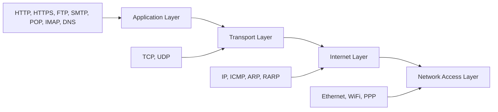
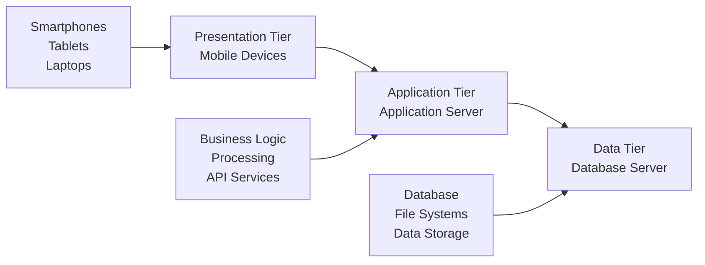
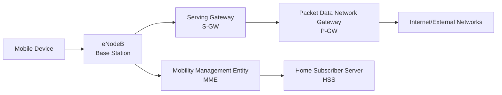
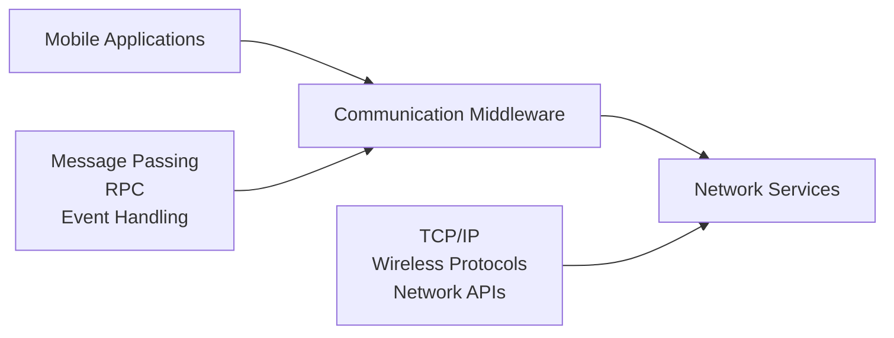
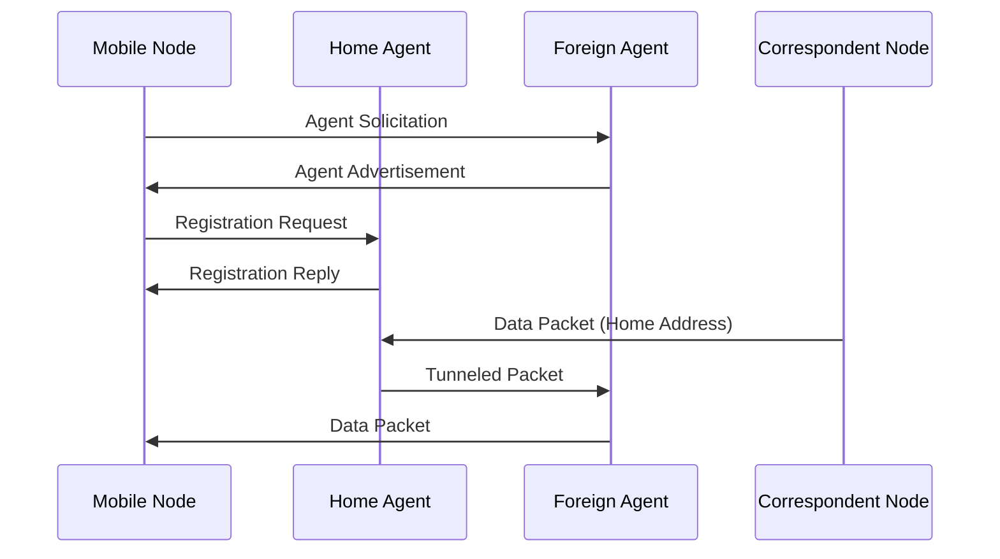
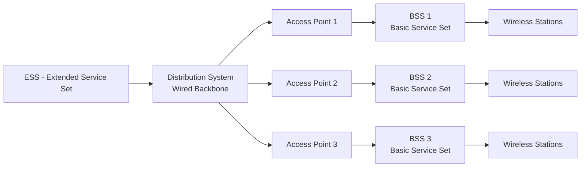
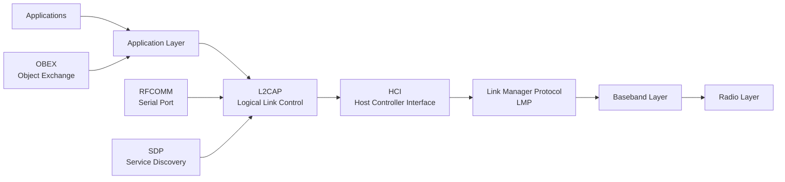

## Question 1(a) [3 marks]

**Explain working of POP protocol.**

**Answer**:

POP (Post Office Protocol) is an email retrieval protocol that downloads emails from server to client device.

**Working Process:**

| Step | Action | Description |
|------|--------|-------------|
| 1 | Connection | Client connects to POP server on port 110 |
| 2 | Authentication | User provides username and password |
| 3 | Download | Emails downloaded to local device |
| 4 | Deletion | Emails deleted from server after download |

- **Download-based**: Emails stored locally on client device
- **Offline access**: Can read emails without internet connection
- **Single device**: Best suited for single device access

**Mnemonic**: "POP Downloads Once Permanently"

---

## Question 1(b) [4 marks]

**Compare OSI model with TCP/IP model.**

**Answer**:

Comparison between OSI and TCP/IP networking models:

| Aspect | OSI Model | TCP/IP Model |
|--------|-----------|--------------|
| **Layers** | 7 layers | 4 layers |
| **Approach** | Theoretical model | Practical implementation |
| **Development** | ISO standard | DARPA project |
| **Complexity** | More complex | Simpler structure |

**Key Differences:**

- **Layer count**: OSI has 7 layers vs TCP/IP's 4 layers
- **Real-world usage**: TCP/IP widely implemented, OSI mostly theoretical
- **Protocol independence**: OSI is protocol-independent, TCP/IP is protocol-specific
- **Header overhead**: OSI has more overhead due to additional layers

**Mnemonic**: "OSI Seven Theoretical, TCP Four Practical"

---

## Question 1(c) [7 marks]

**Explain protocols working at each layer in TCP/IP models.**

**Answer**:

TCP/IP model consists of 4 layers with specific protocols at each layer:



**Layer-wise Protocol Functions:**

| Layer | Protocols | Function |
|-------|-----------|----------|
| **Application** | HTTP, FTP, SMTP, DNS | User interface and services |
| **Transport** | TCP, UDP | End-to-end communication |
| **Internet** | IP, ICMP, ARP | Routing and addressing |
| **Network Access** | Ethernet, WiFi | Physical transmission |

**Protocol Details:**

- **HTTP/HTTPS**: Web communication and secure web communication
- **TCP**: Reliable, connection-oriented data transfer
- **UDP**: Fast, connectionless data transfer
- **IP**: Packet routing and addressing
- **ARP**: Maps IP addresses to MAC addresses

**Mnemonic**: "Applications Transport Internet Networks Always"

---

## Question 1(c OR) [7 marks]

**Briefly explain OSI model with all its layers and functionality of each layer**

**Answer**:

OSI (Open Systems Interconnection) model has 7 layers for network communication:


**Layer Functions:**

| Layer | Name | Function | Protocols |
|-------|------|----------|-----------|
| **7** | Application | User interface | HTTP, FTP, SMTP |
| **6** | Presentation | Data formatting, encryption | SSL, JPEG, MPEG |
| **5** | Session | Session management | NetBIOS, RPC |
| **4** | Transport | End-to-end delivery | TCP, UDP |
| **3** | Network | Routing | IP, ICMP |
| **2** | Data Link | Frame transmission | Ethernet, PPP |
| **1** | Physical | Bit transmission | Cables, Radio waves |

**Key Features:**

- **Modular design**: Each layer has specific responsibilities
- **Protocol independence**: Layers can use different protocols
- **Standardization**: Universal networking reference model

**Mnemonic**: "All People Seem To Need Data Processing"

---

## Question 2(a) [3 marks]

**Give the difference between ARP and RARP protocols.**

**Answer**:

ARP and RARP are address resolution protocols with opposite functions:

| Aspect | ARP | RARP |
|--------|-----|------|
| **Full Form** | Address Resolution Protocol | Reverse Address Resolution Protocol |
| **Purpose** | IP to MAC address mapping | MAC to IP address mapping |
| **Direction** | Logical to Physical | Physical to Logical |
| **Usage** | Normal network communication | Diskless workstations |

**Working Process:**

- **ARP**: "I know IP address, need MAC address"
- **RARP**: "I know MAC address, need IP address"
- **Cache**: Both maintain address tables for efficiency

**Mnemonic**: "ARP Asks Physical, RARP Requests IP"

---

## Question 2(b) [4 marks]

**Explain working of IMAP protocol.**

**Answer**:

IMAP (Internet Message Access Protocol) manages emails on server for multiple device access.

**Working Process:**

| Step | Action | Description |
|------|--------|-------------|
| 1 | Connection | Client connects to IMAP server (port 143/993) |
| 2 | Authentication | Login with credentials |
| 3 | Folder Access | Browse email folders on server |
| 4 | Synchronization | Changes sync across all devices |

**Key Features:**

- **Server-based**: Emails remain on server
- **Multi-device**: Access from multiple devices
- **Synchronization**: Changes reflected everywhere
- **Selective download**: Download only needed emails

**Advantages:**

- **Storage efficiency**: Server manages storage
- **Accessibility**: Access from anywhere
- **Backup**: Server provides automatic backup

**Mnemonic**: "IMAP Internet Messages Always Present"

---

## Question 2(c) [7 marks]

**Explain Three-tier architecture of mobile computing with appropriate diagram.**

**Answer**:

Three-tier architecture separates mobile computing into distinct layers:



**Tier Details:**

| Tier | Components | Responsibilities |
|------|------------|------------------|
| **Presentation** | Mobile devices, UI | User interface and interaction |
| **Application** | App servers, middleware | Business logic and processing |
| **Data** | Databases, storage | Data management and storage |

**Architecture Benefits:**

- **Scalability**: Each tier can scale independently
- **Maintainability**: Separate concerns for easier updates
- **Security**: Data protection through tier separation
- **Performance**: Distributed processing reduces load

**Communication Flow:**

- **User request**: Presentation → Application → Data
- **Response**: Data → Application → Presentation
- **Processing**: Application tier handles business logic

**Mnemonic**: "Presentation Applies Data Processing"

---

## Question 2(a OR) [3 marks]

**Explain the limitation of Stop-and-wait data link layer protocol.**

**Answer**:

Stop-and-wait protocol has several performance limitations:

**Major Limitations:**

| Limitation | Description | Impact |
|------------|-------------|--------|
| **Low Efficiency** | Waits for ACK before next frame | Poor bandwidth utilization |
| **High Delay** | Round-trip delay for each frame | Slow data transmission |
| **Error Sensitivity** | Single error stops transmission | Reduced reliability |

**Performance Issues:**

- **Bandwidth waste**: Link remains idle during wait time
- **Timeout problems**: Lost ACK causes unnecessary retransmission
- **Sequential processing**: Cannot send multiple frames simultaneously

**Mnemonic**: "Stop Waits, Bandwidth Wastes"

---

## Question 2(b OR) [4 marks]

**Explain Advantages of IPV6 over the older IPV4 addressing scheme.**

**Answer**:

IPv6 provides significant improvements over IPv4:

**Key Advantages:**

| Feature | IPv4 | IPv6 |
|---------|------|------|
| **Address Space** | 32-bit (4.3 billion) | 128-bit (340 undecillion) |
| **Header** | Variable length | Fixed 40 bytes |
| **Security** | Optional IPSec | Built-in IPSec |
| **Configuration** | Manual/DHCP | Auto-configuration |

**Major Benefits:**

- **Unlimited addresses**: Solves address exhaustion problem
- **Better performance**: Simplified header processing
- **Enhanced security**: Mandatory encryption support
- **Mobility support**: Better mobile device connectivity

**Additional Features:**

- **Quality of Service**: Built-in QoS support
- **Multicast**: Improved multicast capabilities
- **No fragmentation**: Routers don't fragment packets

**Mnemonic**: "IPv6 Improves Performance, Security, Addresses"

---

## Question 2(c OR) [7 marks]

**Enlist types of networks available in mobile computing. Explain one of them in detail.**

**Answer**:

**Types of Mobile Networks:**

| Generation | Technology | Speed | Features |
|------------|------------|-------|----------|
| **2G** | GSM, CDMA | 64 Kbps | Voice + SMS |
| **3G** | UMTS, CDMA2000 | 2 Mbps | Data services |
| **4G** | LTE, WiMAX | 100 Mbps | High-speed internet |
| **5G** | New Radio (NR) | 10 Gbps | Ultra-low latency |

**Detailed: 4G LTE Network**



**4G LTE Features:**

- **High Speed**: Up to 100 Mbps download, 50 Mbps upload
- **Low Latency**: Less than 10ms for real-time applications
- **All-IP Network**: Packet-switched architecture
- **Advanced Antenna**: MIMO technology for better coverage

**Architecture Components:**

- **eNodeB**: Enhanced base station with advanced features
- **MME**: Manages mobility and authentication
- **Gateways**: Handle data routing and external connectivity

**Applications**: Video streaming, online gaming, IoT connectivity

**Mnemonic**: "4G LTE: Long Term Evolution"

---

## Question 3(a) [3 marks]

**Explain types of Routing.**

**Answer**:

Routing determines path for data packets across networks:

**Types of Routing:**

| Type | Description | Example |
|------|-------------|---------|
| **Static** | Manual route configuration | Administrative setup |
| **Dynamic** | Automatic route discovery | RIP, OSPF protocols |
| **Default** | Fallback route for unknown destinations | Gateway of last resort |

**Routing Categories:**

- **Distance Vector**: Uses hop count (RIP)
- **Link State**: Uses network topology (OSPF)
- **Hybrid**: Combines both approaches (EIGRP)

**Selection Criteria:**

- **Shortest path**: Minimum hops or distance
- **Load balancing**: Distribute traffic evenly
- **Fault tolerance**: Alternative routes for failures

**Mnemonic**: "Static Dynamic Default Routes"

---

## Question 3(b) [4 marks]

**What is Subnetting and supernetting?**

**Answer**:

Subnetting and supernetting manage IP address allocation efficiently:

**Comparison:**

| Aspect | Subnetting | Supernetting |
|--------|------------|--------------|
| **Purpose** | Divide large network | Combine small networks |
| **Direction** | Top-down approach | Bottom-up approach |
| **Mask** | Longer subnet mask | Shorter subnet mask |
| **Result** | Multiple smaller subnets | Single larger network |

**Subnetting Process:**

- **Borrowing bits**: Take bits from host portion
- **Create subnets**: Multiple network segments
- **Reduce broadcast**: Smaller broadcast domains

**Supernetting Process:**

- **Combine networks**: Merge adjacent networks
- **Route aggregation**: Single routing entry
- **Reduce routing table**: Fewer routing entries

**Benefits:**

- **Subnetting**: Better network management, security
- **Supernetting**: Simplified routing, reduced overhead

**Mnemonic**: "Subnetting Splits, Supernetting Sums"

---

## Question 3(c) [7 marks]

**Explain IPV6 Addressing. Why need of IPV6 migration?**

**Answer**:

IPv6 addressing uses 128-bit addresses to solve IPv4 limitations:

**IPv6 Address Structure:**

```goat
+---+---+---+---+---+---+---+---+---+---+---+---+---+---+---+---+
| Global Routing Prefix |Subnet |      Interface Identifier     |
|      (48 bits)        |(16)   |         (64 bits)             |
+---+---+---+---+---+---+---+---+---+---+---+---+---+---+---+---+
```

**Address Format:**

| Component | Size | Purpose |
|-----------|------|---------|
| **Global Prefix** | 48 bits | ISP allocation |
| **Subnet ID** | 16 bits | Organization subnets |
| **Interface ID** | 64 bits | Device identification |

**Address Types:**

- **Unicast**: One-to-one communication
- **Multicast**: One-to-many communication
- **Anycast**: One-to-nearest communication

**Need for IPv6 Migration:**

**Critical Issues:**

| Problem | IPv4 | IPv6 Solution |
|---------|------|---------------|
| **Address Exhaustion** | 4.3 billion addresses | 340 undecillion addresses |
| **NAT Complexity** | Required for connectivity | End-to-end connectivity |
| **Security** | Add-on feature | Built-in IPSec |
| **Mobile Support** | Limited | Native mobility |

**Migration Benefits:**

- **Unlimited growth**: Supports IoT expansion
- **Simplified configuration**: Auto-configuration features
- **Better performance**: Optimized header structure
- **Enhanced security**: Mandatory encryption

**Migration Challenges:**

- **Dual-stack**: Running both IPv4 and IPv6
- **Translation**: IPv4-IPv6 interoperability
- **Training**: Staff education requirements

**Mnemonic**: "IPv6 Infinite Possibilities, Enhanced Security"

---

## Question 3(a OR) [3 marks]

**Determine valid IPv4 address from below. If it is a valid IPv4 address then find its class, Network ID and Host ID. If it's an invalid IPv4 address, then give a reason.**

**a. 192.108.102.101**
**b. 80.54.256.14**

**Answer**:

**Analysis:**

| Address | Validity | Class | Network ID | Host ID | Reason |
|---------|----------|-------|------------|---------|---------|
| **192.108.102.101** | Valid | Class C | 192.108.102.0 | 0.0.0.101 | All octets ≤ 255 |
| **80.54.256.14** | Invalid | - | - | - | Third octet = 256 > 255 |

**Address a: 192.108.102.101**

- **Valid**: All octets within range (0-255)
- **Class C**: First octet 192 (192-223 range)
- **Default mask**: 255.255.255.0 (/24)

**Address b: 80.54.256.14**

- **Invalid**: Third octet is 256
- **Rule violation**: Each octet must be 0-255
- **Correction**: Replace 256 with valid value (0-255)

**Mnemonic**: "Each Octet Maximum 255"

---

## Question 3(b OR) [4 marks]

**Write Short note on Network Address Translation.**

**Answer**:

NAT translates private IP addresses to public IP addresses for internet access:

**NAT Process:**

| Step | Direction | Translation |
|------|-----------|-------------|
| **Outbound** | Private → Public | Internal IP mapped to public IP |
| **Inbound** | Public → Private | Public IP mapped back to internal IP |

**NAT Types:**

```goat
NAT Types
├── Static NAT (1:1 mapping)
├── Dynamic NAT (Pool mapping)
└── PAT/NAPT (Port translation)
```

**Benefits:**

- **IP conservation**: Multiple devices share one public IP
- **Security**: Hides internal network structure
- **Cost reduction**: Fewer public IP addresses needed
- **Flexibility**: Easy internal network changes

**Limitations:**

- **End-to-end connectivity**: Breaks direct communication
- **Protocol issues**: Some protocols don't work through NAT
- **Performance**: Additional processing overhead

**Mnemonic**: "NAT Networks Address Translation"

---

## Question 3(c OR) [7 marks]

**Explain IPV4 Datagram Header in detail.**

**Answer**:

IPv4 header contains essential information for packet routing:

```goat
 0                   1                   2                   3
 0 1 2 3 4 5 6 7 8 9 0 1 2 3 4 5 6 7 8 9 0 1 2 3 4 5 6 7 8 9 0 1
+-+-+-+-+-+-+-+-+-+-+-+-+-+-+-+-+-+-+-+-+-+-+-+-+-+-+-+-+-+-+-+-+
|Version|  IHL  |Type of Service|          Total Length         |
+-+-+-+-+-+-+-+-+-+-+-+-+-+-+-+-+-+-+-+-+-+-+-+-+-+-+-+-+-+-+-+-+
|         Identification        |Flags|      Fragment Offset    |
+-+-+-+-+-+-+-+-+-+-+-+-+-+-+-+-+-+-+-+-+-+-+-+-+-+-+-+-+-+-+-+-+
|  Time to Live |    Protocol   |         Header Checksum       |
+-+-+-+-+-+-+-+-+-+-+-+-+-+-+-+-+-+-+-+-+-+-+-+-+-+-+-+-+-+-+-+-+
|                       Source Address                          |
+-+-+-+-+-+-+-+-+-+-+-+-+-+-+-+-+-+-+-+-+-+-+-+-+-+-+-+-+-+-+-+-+
|                    Destination Address                        |
+-+-+-+-+-+-+-+-+-+-+-+-+-+-+-+-+-+-+-+-+-+-+-+-+-+-+-+-+-+-+-+-+
|                    Options                    |    Padding    |
+-+-+-+-+-+-+-+-+-+-+-+-+-+-+-+-+-+-+-+-+-+-+-+-+-+-+-+-+-+-+-+-+
```

**Header Fields:**

| Field | Size | Purpose |
|-------|------|---------|
| **Version** | 4 bits | IP version (4 for IPv4) |
| **IHL** | 4 bits | Header length in 32-bit words |
| **Type of Service** | 8 bits | Quality of service |
| **Total Length** | 16 bits | Total packet size |
| **Identification** | 16 bits | Fragment identification |
| **Flags** | 3 bits | Fragmentation control |
| **Fragment Offset** | 13 bits | Fragment position |
| **TTL** | 8 bits | Maximum hops before discard |
| **Protocol** | 8 bits | Next layer protocol |
| **Checksum** | 16 bits | Header error detection |
| **Source Address** | 32 bits | Sender IP address |
| **Destination** | 32 bits | Receiver IP address |

**Key Functions:**

- **Routing**: Source and destination addresses
- **Fragmentation**: Handle large packets
- **Error detection**: Header checksum
- **Quality control**: Type of service field

**Important Values:**

- **Protocol**: TCP=6, UDP=17, ICMP=1
- **Flags**: Don't Fragment, More Fragments
- **TTL**: Prevents infinite loops

**Mnemonic**: "Version IHL Service Length Identify Fragment TTL Protocol Check Source Destination"

---

## Question 4(a) [3 marks]

**Explain working of Indirect TCP.**

**Answer**:

Indirect TCP splits TCP connection to handle mobile network challenges:

**Architecture:**

| Component | Role | Location |
|-----------|------|----------|
| **Mobile Host** | TCP client | Mobile network |
| **Base Station** | TCP proxy | Fixed network |
| **Fixed Host** | TCP server | Wired network |

**Connection Split:**

- **Connection 1**: Mobile Host ↔ Base Station
- **Connection 2**: Base Station ↔ Fixed Host
- **Proxy function**: Base station acts as TCP proxy

**Working Process:**

- **Data flow**: Mobile → Base Station → Fixed Host
- **ACK handling**: Base station manages acknowledgments
- **Handover**: Connection maintained during movement

**Advantages:**

- **Wireless optimization**: Handles wireless link issues
- **Mobility support**: Seamless handover capability
- **Error recovery**: Better handling of wireless errors

**Mnemonic**: "Indirect TCP Through Proxy"

---

## Question 4(b) [4 marks]

**Write Short note on Stop and Wait ARQ Protocol.**

**Answer**:

Stop and Wait ARQ ensures reliable data transmission with error detection and correction:

**Protocol Operation:**

| Step | Action | Purpose |
|------|--------|---------|
| **Send** | Transmit frame with sequence number | Data delivery |
| **Wait** | Wait for acknowledgment | Confirm receipt |
| **Timeout** | Retransmit if no ACK | Handle lost frames |
| **ACK** | Send acknowledgment for received frame | Confirm delivery |

**Error Handling:**

```goat
Sender                    Receiver
  |                         |
  |----> Frame 0 ---------->|
  |                         |----> ACK 0
  |<---- ACK 0 <------------|
  |                         |
  |----> Frame 1 ---------->| (Lost)
  |                         |
  |-- Timeout, Retransmit --|
  |----> Frame 1 ---------->|
  |                         |----> ACK 1
  |<---- ACK 1 <------------|
```

**Features:**

- **Sequence numbers**: 0 and 1 alternation
- **Timeout mechanism**: Handles lost frames/ACKs
- **Duplicate detection**: Prevents duplicate acceptance
- **Flow control**: Receiver controls transmission rate

**Limitations:**

- **Low efficiency**: Only one frame in transit
- **Bandwidth waste**: Idle time during waiting

**Mnemonic**: "Stop Send, Wait ACK, Repeat"

---

## Question 4(c) [7 marks]

**Explain Communication Middleware in detail.**

**Answer**:

Communication middleware provides abstraction layer between applications and network services:



**Middleware Types:**

| Type | Function | Example |
|------|----------|---------|
| **Message-Oriented** | Asynchronous messaging | Message queues |
| **RPC-based** | Remote procedure calls | CORBA, RMI |
| **Event-driven** | Event notifications | Publish-subscribe |
| **Stream-oriented** | Continuous data flow | Multimedia streams |

**Core Services:**

**Communication Services:**

- **Message routing**: Efficient message delivery
- **Protocol conversion**: Different protocol handling
- **Buffering**: Temporary message storage
- **Synchronization**: Coordinated communication

**Reliability Services:**

- **Error detection**: Message integrity checking
- **Retransmission**: Failed message recovery
- **Duplicate elimination**: Prevent message duplication
- **Ordering**: Maintain message sequence

**Mobile-Specific Features:**

- **Location transparency**: Hide mobility from applications
- **Disconnection handling**: Manage network interruptions
- **Bandwidth adaptation**: Adjust to network conditions
- **Power management**: Optimize battery usage

**Architecture Benefits:**

- **Abstraction**: Hide network complexity
- **Portability**: Application independence from network
- **Scalability**: Support growing number of devices
- **Interoperability**: Different system communication

**Examples:**

- **CORBA**: Distributed object communication
- **Message Queues**: Asynchronous messaging
- **Web Services**: HTTP-based communication

**Mnemonic**: "Middleware Manages Mobile Communication"

---

## Question 4(a OR) [3 marks]

**Explain Handover management in mobile IP.**

**Answer**:

Handover management maintains connectivity when mobile device moves between networks:

**Handover Process:**

| Phase | Action | Purpose |
|-------|--------|---------|
| **Detection** | Monitor signal strength | Identify need for handover |
| **Decision** | Select target network | Choose best network |
| **Execution** | Switch to new network | Complete handover |

**Types of Handover:**

- **Horizontal**: Same technology networks
- **Vertical**: Different technology networks
- **Hard**: Break-before-make
- **Soft**: Make-before-break

**Management Components:**

- **Signal monitoring**: Continuous signal assessment
- **Network discovery**: Available network identification
- **Decision algorithm**: Optimal network selection

**Performance Metrics:**

- **Handover delay**: Time to complete switch
- **Packet loss**: Data lost during handover
- **Signaling overhead**: Control message cost

**Mnemonic**: "Handover Helps Maintain Mobility"

---

## Question 4(b OR) [4 marks]

**Explain key functions of Communication Gateways.**

**Answer**:

Communication gateways enable interoperability between different network systems:

**Key Functions:**

| Function | Description | Benefit |
|----------|-------------|---------|
| **Protocol Translation** | Convert between protocols | Interoperability |
| **Data Format Conversion** | Transform data formats | Compatibility |
| **Security Enforcement** | Apply security policies | Protection |
| **Load Balancing** | Distribute traffic | Performance |

**Gateway Services:**

**Protocol Services:**

- **Multi-protocol support**: Handle various protocols
- **Translation efficiency**: Fast protocol conversion
- **Standards compliance**: Follow protocol specifications

**Security Services:**

- **Authentication**: Verify user identity
- **Authorization**: Control access permissions
- **Encryption**: Protect data transmission
- **Firewall**: Filter malicious traffic

**Performance Services:**

- **Caching**: Store frequently accessed data
- **Compression**: Reduce data size
- **Traffic shaping**: Manage bandwidth usage
- **Quality of Service**: Prioritize critical traffic

**Management Features:**

- **Monitoring**: Track gateway performance
- **Configuration**: Flexible setup options
- **Logging**: Record activity and errors

**Mnemonic**: "Gateways Grant Protocol Interoperability"

---

## Question 4(c OR) [7 marks]

**Explain Process of mobile IP.**

**Answer**:

Mobile IP enables device mobility while maintaining IP connectivity:



**Mobile IP Components:**

| Component | Role | Function |
|-----------|------|----------|
| **Mobile Node** | Moving device | Maintains connectivity |
| **Home Agent** | Home network router | Forwards packets |
| **Foreign Agent** | Visited network router | Local delivery |
| **Care-of Address** | Temporary address | Current location |

**Registration Process:**

**Phase 1: Agent Discovery**

- **Advertisement**: Agents broadcast availability
- **Solicitation**: Mobile node requests agent info
- **Selection**: Choose appropriate foreign agent

**Phase 2: Registration**

- **Request**: Mobile node registers with home agent
- **Authentication**: Verify mobile node identity
- **Binding**: Create care-of address binding
- **Confirmation**: Registration acknowledgment

**Phase 3: Packet Delivery**

- **Interception**: Home agent intercepts packets
- **Tunneling**: Encapsulate and forward packets
- **Decapsulation**: Foreign agent extracts packets
- **Local delivery**: Forward to mobile node

**Tunneling Mechanism:**

```goat
Original Packet: [IP Header|Data]
                 Dest: Home Address

Tunneled Packet: [New IP Header|Original Packet]
                 Dest: Care-of Address
```

**Key Features:**

- **Transparency**: Applications unaware of mobility
- **Triangle routing**: Indirect packet delivery
- **Location privacy**: Hide actual location
- **Seamless handover**: Maintain connections

**Challenges:**

- **Triangle routing**: Inefficient packet path
- **Ingress filtering**: Firewall compatibility
- **Security**: Authentication and encryption

**Mnemonic**: "Mobile IP: Discover Register Tunnel Deliver"

---

## Question 5(a) [3 marks]

**List advantages of WPANs.**

**Answer**:

WPAN (Wireless Personal Area Network) provides short-range connectivity benefits:

**Key Advantages:**

| Advantage | Description | Benefit |
|-----------|-------------|---------|
| **Low Power** | Minimal battery consumption | Extended device life |
| **Low Cost** | Inexpensive implementation | Affordable deployment |
| **Easy Setup** | Simple configuration | User-friendly |

**Technical Benefits:**

- **Short range**: 10-30 feet coverage reduces interference
- **Ad-hoc networking**: No infrastructure required
- **Device mobility**: Move freely within range
- **Automatic discovery**: Devices find each other automatically

**Application Advantages:**

- **Personal devices**: Connect phones, tablets, headphones
- **IoT integration**: Smart home device connectivity
- **File sharing**: Quick data transfer between devices
- **Peripheral connection**: Wireless keyboards, mice

**Security Benefits:**

- **Limited range**: Reduced eavesdropping risk
- **Encryption**: Built-in security protocols
- **Pairing**: Authenticated device connections

**Mnemonic**: "WPANs: Wireless Personal Area Networks"

---

## Question 5(b) [4 marks]

**Explain steps of packet delivery in mobile IP.**

**Answer**:

Mobile IP packet delivery involves multiple steps to reach mobile devices:

**Packet Delivery Steps:**

| Step | Process | Location |
|------|---------|----------|
| **1. Transmission** | Send packet to home address | Correspondent Node |
| **2. Interception** | Capture packet for mobile node | Home Agent |
| **3. Tunneling** | Encapsulate and forward | Home to Foreign Agent |
| **4. Delivery** | Extract and deliver packet | Foreign Agent to Mobile |

**Detailed Process:**

```goat
CN -----> HA -----> FA -----> MN
   (1)     (2,3)    (4)
   
Step 1: Normal IP routing to home network
Step 2: Home Agent intercepts packet
Step 3: Tunnel packet to care-of address  
Step 4: Foreign Agent delivers to mobile node
```

**Tunneling Mechanism:**

- **Encapsulation**: Add new IP header with care-of address
- **Forwarding**: Route through internet to foreign network
- **Decapsulation**: Remove tunnel header at foreign agent
- **Local delivery**: Standard delivery to mobile node

**Mnemonic**: "Correspondent Home Foreign Mobile"

---

## Question 5(c) [7 marks]

**Briefly Explain architecture of WLAN with diagram.**

**Answer**:

WLAN (Wireless Local Area Network) architecture provides wireless connectivity within local area:



**WLAN Components:**

| Component | Function | Coverage |
|-----------|----------|----------|
| **Station (STA)** | Wireless device | Individual device |
| **Access Point (AP)** | Wireless hub | Basic Service Set |
| **Basic Service Set (BSS)** | Single AP coverage | Local area |
| **Extended Service Set (ESS)** | Multiple BSS | Large area |

**Architecture Types:**

**Ad-hoc Mode:**

- **Independent BSS**: No access point required
- **Peer-to-peer**: Direct station communication
- **Limited range**: Single hop communication
- **Temporary networks**: Conference, meeting rooms

**Infrastructure Mode:**

- **Access Point**: Central coordination
- **Distribution System**: Connect multiple APs
- **Roaming support**: Move between BSS areas
- **Internet connectivity**: Gateway to external networks

**Key Features:**

- **Mobility**: Move within coverage area
- **Scalability**: Add more access points
- **Interoperability**: IEEE 802.11 standards
- **Security**: WPA/WPA2 encryption

**Services Provided:**

- **Association**: Connect to access point
- **Authentication**: Verify user credentials
- **Data delivery**: Reliable frame transmission
- **Power management**: Battery optimization

**Standards:**

- **802.11a**: 5 GHz, 54 Mbps
- **802.11b**: 2.4 GHz, 11 Mbps
- **802.11g**: 2.4 GHz, 54 Mbps
- **802.11n**: MIMO, 600 Mbps
- **802.11ac**: 5 GHz, 1 Gbps+

**Mnemonic**: "WLAN: Wireless Local Area Network"

---

## Question 5(a OR) [3 marks]

**Explain 5G mobile network features in detail.**

**Answer**:

5G provides revolutionary mobile network capabilities:

**Key Features:**

| Feature | Specification | Benefit |
|---------|---------------|---------|
| **Speed** | Up to 10 Gbps | Ultra-fast downloads |
| **Latency** | Less than 1ms | Real-time applications |
| **Density** | 1M devices/km² | Massive IoT support |

**Technical Capabilities:**

- **Enhanced Mobile Broadband**: High-speed internet access
- **Ultra-Reliable Low Latency**: Critical applications
- **Massive Machine Communication**: IoT device connectivity

**Advanced Technologies:**

- **Millimeter waves**: Higher frequency bands
- **MIMO**: Multiple antenna systems
- **Network slicing**: Virtual network partitions
- **Edge computing**: Distributed processing

**Applications:**

- **Autonomous vehicles**: Real-time control
- **Smart cities**: Connected infrastructure
- **Industrial IoT**: Factory automation

**Mnemonic**: "5G: Fifth Generation Great Speed"

---

## Question 5(b OR) [4 marks]

**Explain how DHCP works in a mobile network context.**

**Answer**:

DHCP (Dynamic Host Configuration Protocol) automatically assigns IP addresses in mobile networks:

**DHCP Process in Mobile Networks:**

| Step | Message | Purpose | Direction |
|------|---------|---------|-----------|
| **1** | DHCP Discover | Find DHCP server | Client → Broadcast |
| **2** | DHCP Offer | Offer IP address | Server → Client |
| **3** | DHCP Request | Request specific IP | Client → Server |
| **4** | DHCP ACK | Confirm assignment | Server → Client |

**Mobile Network Challenges:**

```goat
Mobile DHCP Process:

Device moves: Network A → Network B

Network A          Network B
DHCP Server        DHCP Server
    |                  |
    |←-- Release       |
    |                  |
    |              Discover →|
    |              ← Offer --|
    |              Request →|
    |              ← ACK ----|
```

**Mobile-Specific Features:**

- **Fast handover**: Quick IP assignment during movement
- **Lease renewal**: Extend IP address validity
- **Conflict resolution**: Handle duplicate addresses
- **Location update**: Notify network of device location

**Configuration Information:**

- **IP address**: Unique network identifier
- **Subnet mask**: Network boundary definition
- **Default gateway**: Router for external communication
- **DNS servers**: Domain name resolution

**Advantages in Mobile Context:**

- **Automatic configuration**: No manual setup required
- **Address conservation**: Reuse addresses efficiently
- **Mobility support**: Seamless network transitions

**Mnemonic**: "DHCP: Discover Offer Request ACK"

---

## Question 5(c OR) [7 marks]

**Explain Bluetooth technology with a neat figure of its protocol stack.**

**Answer**:

Bluetooth provides short-range wireless communication for personal devices:



**Protocol Stack Layers:**

| Layer | Function | Purpose |
|-------|----------|---------|
| **Radio** | Physical transmission | 2.4 GHz ISM band |
| **Baseband** | Media access control | Time division duplex |
| **LMP** | Link management | Connection establishment |
| **HCI** | Host-controller interface | Hardware abstraction |
| **L2CAP** | Logical link control | Packet segmentation |
| **Applications** | User services | File transfer, audio |

**Technical Specifications:**

**Physical Layer:**

- **Frequency**: 2.4 GHz ISM band
- **Hopping**: 79 frequency channels
- **Modulation**: Frequency shift keying
- **Power classes**: 1mW to 100mW

**Network Topology:**

```goat
Bluetooth Piconet:

    [Slave 1]
         |
[Slave 2]---[Master]---[Slave 3]
         |
    [Slave 4]

Max 8 devices per piconet
Master controls communication
```

**Connection Types:**

- **SCO**: Synchronous Connection-Oriented (voice)
- **ACL**: Asynchronous Connection-Less (data)
- **eSCO**: Enhanced SCO (improved voice)

**Security Features:**

- **Authentication**: Device identity verification
- **Authorization**: Service access control
- **Encryption**: Data protection (E0 algorithm)
- **Key management**: Security key exchange

**Bluetooth Versions:**

| Version | Speed | Range | Features |
|---------|-------|-------|----------|
| **1.x** | 1 Mbps | 10m | Basic connectivity |
| **2.x** | 3 Mbps | 10m | Enhanced data rate |
| **3.x** | 24 Mbps | 10m | High-speed option |
| **4.x** | 1 Mbps | 50m | Low energy (BLE) |
| **5.x** | 2 Mbps | 240m | Improved range/speed |

**Applications:**

- **Audio streaming**: Headphones, speakers
- **File transfer**: Documents, photos
- **Input devices**: Keyboards, mice
- **Health monitoring**: Fitness trackers

**Advantages:**

- **Low power**: Battery-friendly operation
- **Easy pairing**: Simple device connection
- **Interoperability**: Universal standard
- **Cost-effective**: Inexpensive implementation

**Mnemonic**: "Bluetooth: Radio Baseband LMP HCI L2CAP Applications"
