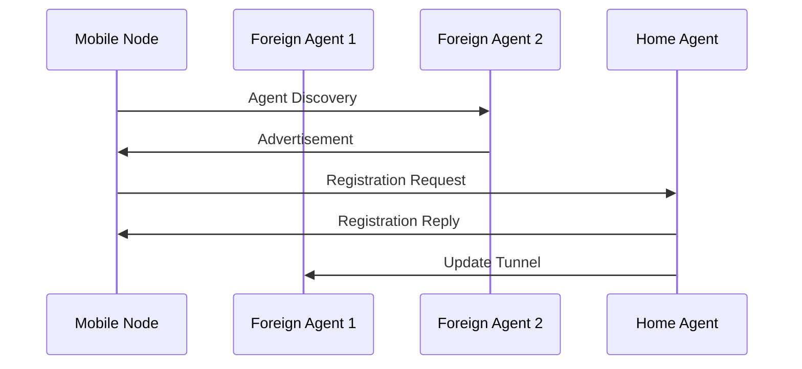
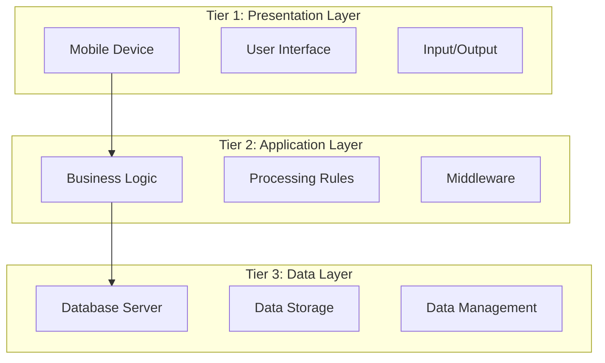
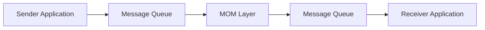
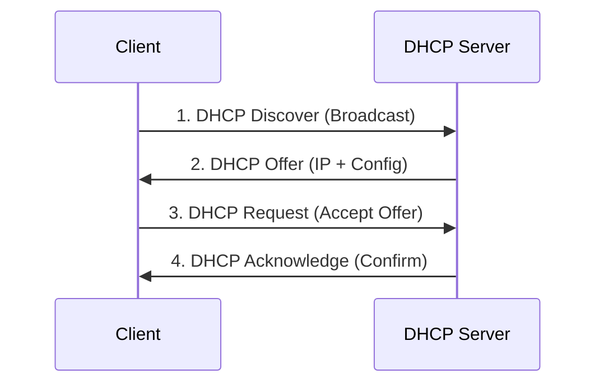
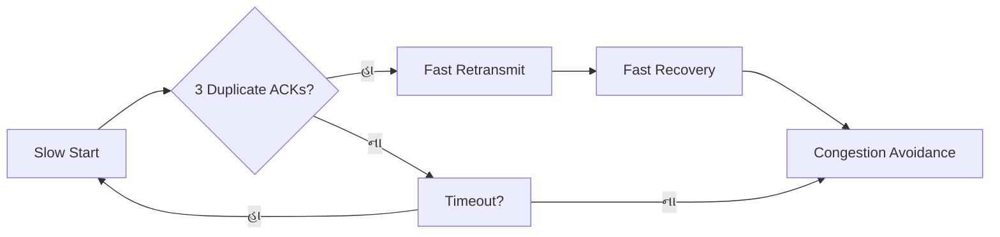
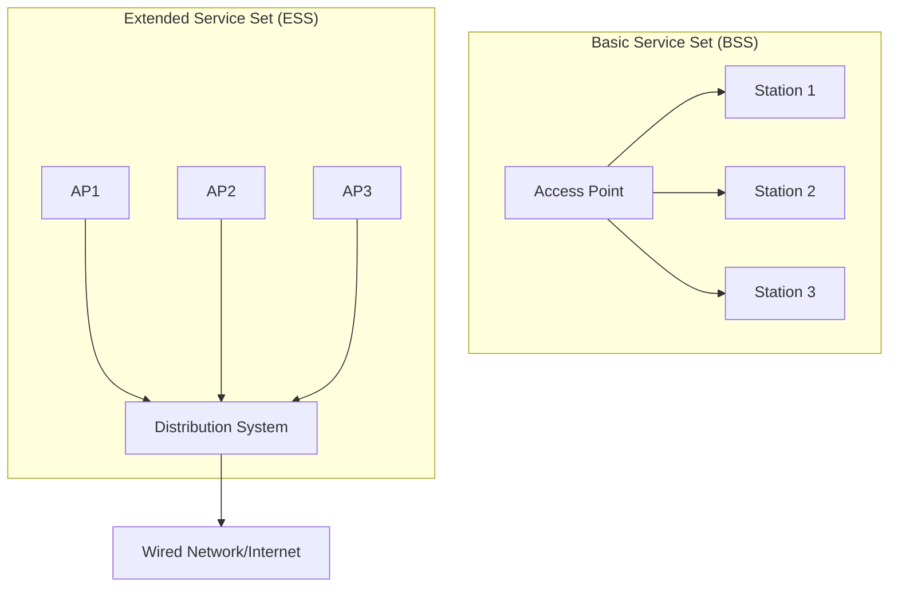
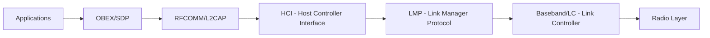
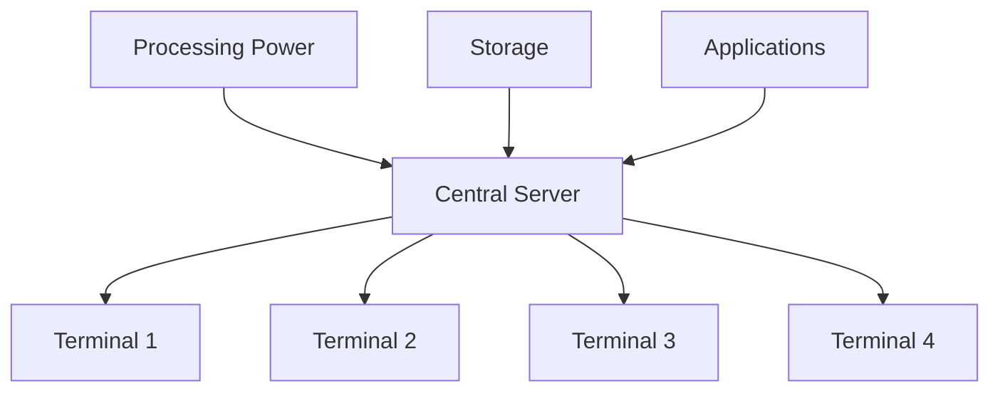
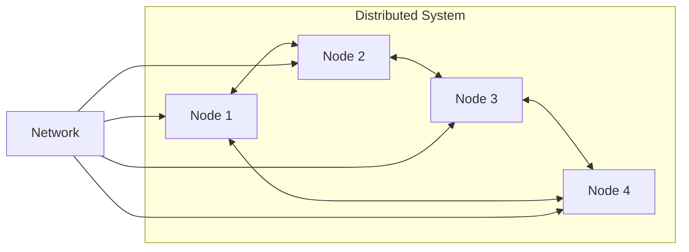
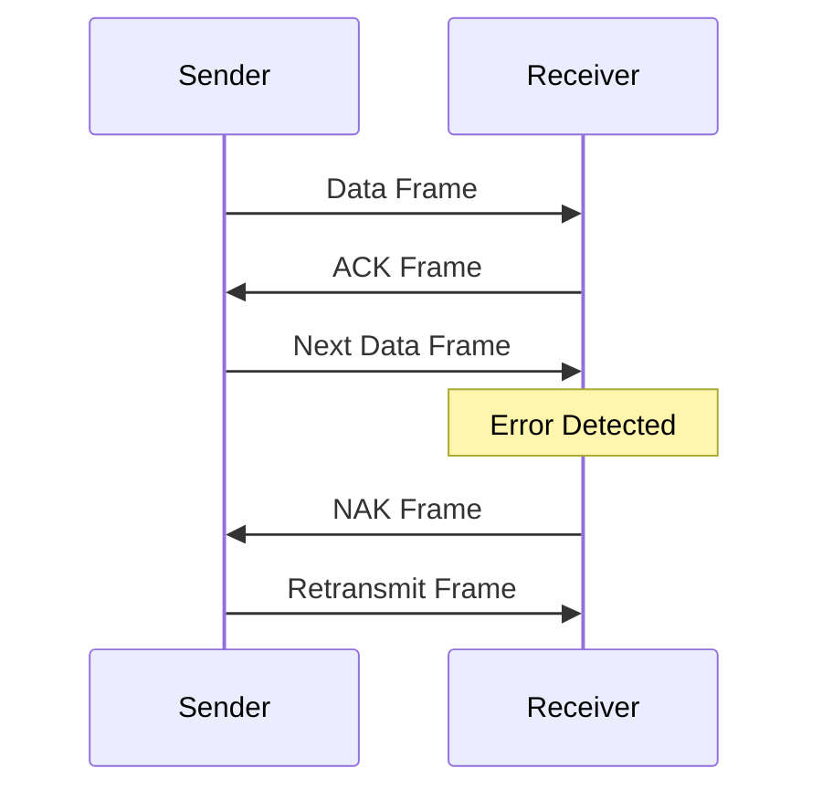

## પ્રશ્ન 1(અ) [03 ગુણ]

**કલાઇન્ટ સર્વર અને પીઅર ટૂ પીઅર નેટવર્કનો તફાવત લખો.**

**જવાબ**:

| પેરામીટર | Client-Server Network | Peer-to-Peer Network |
|-----------|----------------------|---------------------|
| **આર્કિટેક્ચર** | કેન્દ્રિય સર્વર સાથે | વિકેન્દ્રિત, બધા નોડ્સ સમાન |
| **ખર્ચ** | સર્વર હાર્ડવેરને કારણે વધુ | ઓછો, હાલના કમ્પ્યુટર્સનો ઉપયોગ |
| **સિક્યોરિટી** | વધુ, કેન્દ્રિય નિયંત્રણ | ઓછી, વિતરિત નિયંત્રણ |
| **સ્કેલેબિલિટી** | સર્વરની ક્ષમતાથી મર્યાદિત | વધુ સારી, નોડ્સ સાથે સંસાધનો વધે |

**મેમરી ટ્રીક:** "CSS-P: Client-Server = કેન્દ્રિય સિક્યોરિટી, P2P = પીઅર પાવર"

## પ્રશ્ન 1(બ) [04 ગુણ]

**ARP પ્રોટોકોલ તેની વર્કિંગ સાથે સમજાવો.**

**જવાબ**:

**ARP (Address Resolution Protocol)** લોકલ નેટવર્કમાં IP એડ્રેસને MAC એડ્રેસ સાથે જોડે છે.

**વર્કિંગ પ્રોસેસ:**

- **બ્રોડકાસ્ટ રિક્વેસ્ટ**: હોસ્ટ ટાર્ગેટ IP સાથે ARP રિક્વેસ્ટ બ્રોડકાસ્ટ કરે
- **કેશ ચેક**: રિસીવિંગ હોસ્ટ્સ તપાસે કે IP મેચ થાય છે કે નહીં
- **રિપ્લાય જનરેશન**: ટાર્ગેટ હોસ્ટ MAC એડ્રેસ સાથે ARP રિપ્લાય મોકલે
- **કેશ અપડેટ**: રિક્વેસ્ટિંગ હોસ્ટ ARP ટેબલ અપડેટ કરે

**ARP ટેબલ ઉદાહરણ:**

```
IP Address      MAC Address         TTL
192.168.1.1     00:1A:2B:3C:4D:5E   300s
```

**મેમરી ટ્રીક:** "BCRU: બ્રોડકાસ્ટ, કેશ, રિપ્લાય, અપડેટ"

## પ્રશ્ન 1(ક) [07 ગુણ]

**OSI મોડેલ આકૃતિ સાથે સમજાવો.**

**જવાબ**:

**OSI (Open Systems Interconnection)** મોડેલમાં નેટવર્ક કમ્યુનિકેશન માટે 7 લેયર્સ છે.


**લેયર ફંક્શન્સ:**

- **Physical**: ફિઝિકલ મીડિયમ પર બિટ ટ્રાન્સમિશન
- **Data Link**: ફ્રેમ ટ્રાન્સમિશન, એરર ડિટેક્શન
- **Network**: રાઉટિંગ, IP એડ્રેસિંગ
- **Transport**: એન્ડ-ટુ-એન્ડ ડિલિવરી, TCP/UDP
- **Session**: કનેક્શન મેનેજમેન્ટ
- **Presentation**: ડેટા એન્ક્રિપ્શન, કોમ્પ્રેશન
- **Application**: યુઝર ઇન્ટરફેસ, ઇમેઇલ, વેબ

**મેમરી ટ્રીક:** "All People Seem To Need Data Processing"

## પ્રશ્ન 1(ક OR) [07 ગુણ]

**કન્જેશન શું છે? કન્જેશન કંટ્રોલ સમજાવો.**

**જવાબ**:

**કન્જેશન** ત્યારે થાય છે જ્યારે નેટવર્ક ટ્રાફિક ઉપલબ્ધ બેન્ડવિડ્થ કરતાં વધી જાય, જેથી પેકેટ ડિલે અને લોસ થાય.

**કન્જેશન કંટ્રોલના પ્રકારો:**

| પ્રકાર | મેથડ | વર્ણન |
|------|--------|-------------|
| **Open-Loop** | પ્રિવેન્શન | કન્જેશન પહેલાં ટ્રાફિક શેપિંગ |
| **Closed-Loop** | રિએક્શન | ફીડબેક આધારિત એડજસ્ટમેન્ટ |

**કન્જેશન કંટ્રોલ ટેકનિક્સ:**

- **ટ્રાફિક શેપિંગ**: ડેટા ટ્રાન્સમિશન રેટ નિયંત્રિત કરો
- **એડમિશન કંટ્રોલ**: કન્જેશન દરમિયાન નવા કનેક્શન્સ મર્યાદિત કરો
- **લોડ શેડિંગ**: બફર્સ ભરાઈ જાય ત્યારે પેકેટ્સ ડ્રોપ કરો
- **બેકપ્રેશર**: અપસ્ટ્રીમ કન્જેશન સિગ્નલ્સ મોકલો

**મેમરી ટ્રીક:** "TALB: ટ્રાફિક, એડમિશન, લોડ, બેકપ્રેશર"

## પ્રશ્ન 2(અ) [03 ગુણ]

**એડહોક નેટવર્ક શું છે? તે સમજાવો.**

**જવાબ**:

**એડહોક નેટવર્ક** એક વાયરલેસ નેટવર્ક છે જેમાં કોઈ નિશ્ચિત ઇન્ફ્રાસ્ટ્રક્ચર વગર નોડ્સ સીધો કમ્યુનિકેટ કરે છે.

**લક્ષણો:**

- **સ્વ-આયોજિત**: ઓટોમેટિક નેટવર્ક ફોર્મેશન
- **ડાયનેમિક ટોપોલોજી**: નોડ્સ મુક્તપણે જોડાઈ/છૂટી શકે
- **મલ્ટિ-હોપ રાઉટિંગ**: મેસેજ્સ મધ્યવર્તી નોડ્સ દ્વારા રિલે થાય
- **વિતરિત નિયંત્રણ**: કોઈ કેન્દ્રિય સત્તા નહીં

**એપ્લિકેશન્સ:**

- ઇમર્જન્સી રિસ્પોન્સ, મિલિટરી ઓપરેશન્સ, સેન્સર નેટવર્ક્સ

**મેમરી ટ્રીક:** "SDMD: સ્વ-આયોજિત, ડાયનેમિક, મલ્ટિ-હોપ, વિતરિત"

## પ્રશ્ન 2(બ) [04 ગુણ]

**મોબાઈલ IP માં હેન્ડઓવર મેનેજમેન્ટ સમજાવો.**

**જવાબ**:

**હેન્ડઓવર** એ પ્રક્રિયા છે જ્યારે મોબાઈલ નોડ નેટવર્ક્સ વચ્ચે ખસે ત્યારે કનેક્ટિવિટી જાળવી રાખવાની.

**હેન્ડઓવર પ્રક્રિયા:**



**પ્રકારો:**

- **હાર્ડ હેન્ડઓવર**: બ્રેક-બિફોર-મેક કનેક્શન
- **સોફ્ટ હેન્ડઓવર**: મેક-બિફોર-બ્રેક કનેક્શન

**મેમરી ટ્રીક:** "DARU: ડિસ્કવરી, એડવર્ટાઇઝમેન્ટ, રજિસ્ટ્રેશન, અપડેટ"

## પ્રશ્ન 2(ક) [07 ગુણ]

**મોબાઈલ કમ્પ્યુટિંગનું થ્રી ટાયર આર્કિટેક્ચર આકૃતિ સાથે સમજાવો.**

**જવાબ**:

**થ્રી-ટાયર આર્કિટેક્ચર** મોબાઈલ એપ્લિકેશન્સને પ્રેઝન્ટેશન, એપ્લિકેશન લોજિક અને ડેટા લેયર્સમાં વિભાજિત કરે છે.



**લેયર ફંક્શન્સ:**

- **પ્રેઝન્ટેશન**: યુઝર ઇન્ટરફેસ, મોબાઈલ એપ્સ
- **એપ્લિકેશન**: બિઝનેસ લોજિક, મિડલવેર સર્વિસેસ
- **ડેટા**: ડેટાબેસ મેનેજમેન્ટ, સ્ટોરેજ સિસ્ટમ્સ

**ફાયદા:**

- **સ્કેલેબિલિટી**: સ્વતંત્ર લેયર સ્કેલિંગ
- **મેન્ટેનેબિલિટી**: અલગ ચિંતાવાળા વિષયો
- **લવચીકતા**: ટેકનોલોજી સ્વતંત્રતા

**મેમરી ટ્રીક:** "PAD: પ્રેઝન્ટેશન, એપ્લિકેશન, ડેટા"

## પ્રશ્ન 2(અ OR) [03 ગુણ]

**વાયરલેસ નેટવર્કની જરૂરિયાત સમજાવો.**

**જવાબ**:

**વાયરલેસ નેટવર્ક્સ** ફિઝિકલ કેબલ્સ વગર કનેક્ટિવિટી પ્રદાન કરે છે.

**જરૂરિયાતો:**

- **મોબિલિટી**: યુઝર્સ કનેક્ટેડ રહીને મુક્તપણે ફરી શકે
- **લવચીકતા**: સરળ નેટવર્ક વિસ્તરણ અને પુનઃ રૂપરેખાંકન
- **ખર્ચ-અસરકારક**: કેબલિંગ ઇન્ફ્રાસ્ટ્રક્ચર ખર્ચ ઘટાડો
- **પહોંચ**: દૂરના વિસ્તારોમાં ઇન્ટરનેટ એક્સેસ

**એપ્લિકેશન્સ:**

- મોબાઈલ કમ્યુનિકેશન્સ, WiFi હોટસ્પોટ્સ, IoT ડિવાઇસ

**મેમરી ટ્રીક:** "MFCA: મોબિલિટી, લવચીકતા, ખર્ચ, પહોંચ"

## પ્રશ્ન 2(બ OR) [04 ગુણ]

**મોબાઈલ IP માં રજિસ્ટ્રેશન, ટનલિંગ અને ઇન્કેપ્સુલેશન સમજાવો.**

**જવાબ**:

**મોબાઈલ IP કોમ્પોનન્ટ્સ:**

| પ્રક્રિયા | વર્ણન | હેતુ |
|---------|-------------|---------|
| **રજિસ્ટ્રેશન** | મોબાઈલ નોડ હોમ એજન્ટ સાથે રજિસ્ટર થાય | લોકેશન અપડેટ |
| **ટનલિંગ** | એજન્ટ્સ વચ્ચે વર્ચ્યુઅલ પાથ બનાવે | પેકેટ્સ રૂટ કરવા |
| **ઇન્કેપ્સુલેશન** | મૂળ પેકેટને નવા હેડરમાં લપેટે | એડ્રેસ ટ્રાન્સલેશન |

**પ્રક્રિયા ફ્લો:**

```
મૂળ પેકેટ → ઇન્કેપ્સુલેશન → ટનલ → ડીકેપ્સુલેશન → ડેસ્ટિનેશન
```

**રજિસ્ટ્રેશન સ્તરો:**

- મોબાઈલ નોડ ફોરેન એજન્ટ શોધે
- હોમ એજન્ટને રજિસ્ટ્રેશન રિક્વેસ્ટ મોકલે
- હોમ એજન્ટ લોકેશન બાઇન્ડિંગ અપડેટ કરે

**મેમરી ટ્રીક:** "RTE: રજિસ્ટ્રેશન, ટનલિંગ, ઇન્કેપ્સુલેશન"

## પ્રશ્ન 2(ક OR) [07 ગુણ]

**મિડલવેર શું છે? મિડલવેરના ઉદાહરણો લખો અને તેમાંથી કોઈ પણ એકને વિગતે સમજાવો.**

**જવાબ**:

**મિડલવેર** એ સોફ્ટવેર છે જે વિતરિત સિસ્ટમ્સમાં વિવિધ એપ્લિકેશન્સ અને સેવાઓને જોડે છે.

**મિડલવેરના ઉદાહરણો:**

- **Message-Oriented Middleware (MOM)**
- **Remote Procedure Call (RPC)**
- **Object Request Broker (ORB)**
- **ડેટાબેસ મિડલવેર**
- **વેબ સર્વિસ**

**Message-Oriented Middleware (MOM) - વિગતવાર:**

**આર્કિટેક્ચર:**



**લક્ષણો:**

- **અસિંક્રોનસ કમ્યુનિકેશન**: નોન-બ્લોકિંગ મેસેજ એક્સચેન્જ
- **વિશ્વસનીયતા**: મેસેજ પર્સિસ્ટન્સ અને ડિલિવરી ગેરંટી
- **સ્કેલેબિલિટી**: મલ્ટિપલ કોન્કરન્ટ કનેક્શન્સ હેન્ડલ કરે
- **પ્લેટફોર્મ સ્વતંત્રતા**: ક્રોસ-પ્લેટફોર્મ કમ્યુનિકેશન

**ફાયદા:**

- એપ્લિકેશન્સ વચ્ચે લૂઝ કપલિંગ
- સિસ્ટમ વિશ્વસનીયતામાં સુધારો
- વધુ સારી ફોલ્ટ ટોલરન્સ

**મેમરી ટ્રીક:** "ARSP: અસિંક્રોનસ, વિશ્વસનીય, સ્કેલેબલ, પ્લેટફોર્મ-સ્વતંત્ર"

## પ્રશ્ન 3(અ) [03 ગુણ]

**'www' નું ફુલ ફોર્મ આપો અને તે સમજાવો.**

**જવાબ**:

**WWW = World Wide Web**

**સમજાવટ:**

- **ગ્લોબલ ઇન્ફોર્મેશન સિસ્ટમ**: ડોક્યુમેન્ટ્સનો પરસ્પર જોડાયેલો જાળો
- **HTTP પ્રોટોકોલ**: HyperText Transfer Protocol નો ઉપયોગ કરે
- **URL એડ્રેસિંગ**: યુનિક રિસોર્સ લોકેટર્સ
- **હાયપરલિંક્સ**: વેબ પેજો વચ્ચે નેવિગેટ કરવા

**કોમ્પોનન્ટ્સ:**

- વેબ સર્વર્સ, બ્રાઉઝર્સ, HTML ડોક્યુમેન્ટ્સ, URL

**મેમરી ટ્રીક:** "GHUH: ગ્લોબલ, HTTP, URL, હાયપરલિંક્સ"

## પ્રશ્ન 3(બ) [04 ગુણ]

**મોબાઈલ કમ્પ્યુટિંગની ઉપયોગિતા સમજાવો.**

**જવાબ**:

**મોબાઈલ કમ્પ્યુટિંગ એપ્લિકેશન્સ:**

| કેટેગરી | એપ્લિકેશન્સ | ફાયદા |
|----------|-------------|----------|
| **બિઝનેસ** | ઇમેઇલ, CRM, સેલ્સ | પ્રોડક્ટિવિટી, રિયલ-ટાઇમ એક્સેસ |
| **હેલ્થકેર** | પેશન્ટ મોનિટરિંગ, ટેલિમેડિસિન | રિમોટ કેર, ઇમર્જન્સી રિસ્પોન્સ |
| **એજ્યુકેશન** | ઇ-લર્નિંગ, ડિજિટલ લાઇબ્રેરી | લવચીક લર્નિંગ, રિસોર્સ એક્સેસ |
| **મનોરંજન** | ગેમિંગ, સ્ટ્રીમિંગ, સોશિયલ મીડિયા | ઓન-ડિમાન્ડ કન્ટેન્ટ, કનેક્ટિવિટી |

**મુખ્ય લક્ષણો:**

- **લોકેશન-બેઝ્ડ સર્વિસ**: GPS નેવિગેશન, લોકલ સર્ચ
- **મોબાઈલ પેમેન્ટ્સ**: ડિજિટલ વોલેટ, કોન્ટેક્ટલેસ ટ્રાન્ઝેક્શન્સ
- **IoT ઇન્ટીગ્રેશન**: સ્માર્ટ હોમ, વેરેબલ ડિવાઇસેસ

**મેમરી ટ્રીક:** "BHEE: બિઝનેસ, હેલ્થકેર, એજ્યુકેશન, મનોરંજન"

## પ્રશ્ન 3(ક) [07 ગુણ]

**DHCP નું વર્કિંગ આકૃતિ સાથે સમજાવો અને તેના ફાયદા સમજાવો.**

**જવાબ**:

**DHCP (Dynamic Host Configuration Protocol)** નેટવર્ક ડિવાઇસેસને ઓટોમેટિક IP એડ્રેસ આપે છે.

**DHCP પ્રક્રિયા (DORA):**



**પ્રદાન કરેલી કોન્ફિગરેશન માહિતી:**

- IP એડ્રેસ અને સબનેટ માસ્ક
- ડિફોલ્ટ ગેટવે એડ્રેસ
- DNS સર્વર એડ્રેસેસ
- લીઝ અવધિ

**ફાયદા:**

- **ઓટોમેટિક કોન્ફિગરેશન**: મેન્યુઅલ IP અસાઇનમેન્ટ નહીં
- **કેન્દ્રિત મેનેજમેન્ટ**: એક જ નિયંત્રણ બિંદુ
- **કાર્યક્ષમ IP ઉપયોગ**: ડાયનેમિક એલોકેશન બગાડ અટકાવે
- **ભૂલો ઘટાડો**: મેન્યુઅલ કોન્ફિગરેશન ભૂલો દૂર કરે
- **સરળ મેન્ટેનન્સ**: સરળ નેટવર્ક ફેરફારો

**DHCP મેસેજ પ્રકારો:**

- DISCOVER, OFFER, REQUEST, ACK, NAK, RELEASE, RENEW

**મેમરી ટ્રીક:** "DORA: ડિસ્કવર, ઓફર, રિક્વેસ્ટ, એકનોલેજ"

## પ્રશ્ન 3(અ OR) [03 ગુણ]

**HTTPS નું મહત્વ લખો.**

**જવાબ**:

**HTTPS (HyperText Transfer Protocol Secure)** સુરક્ષિત વેબ કમ્યુનિકેશન પ્રદાન કરે છે.

**HTTPS નું મહત્વ:**

- **ડેટા એન્ક્રિપ્શન**: SSL/TLS નો ઉપયોગ કરીને ટ્રાન્ઝિટમાં ડેટાને સુરક્ષિત કરે
- **ઓથેન્ટિકેશન**: સર્ટિફિકેટ્સ સાથે સર્વર આઇડેન્ટિટી વેરિફાઇ કરે
- **ડેટા ઇન્ટેગ્રિટી**: ટ્રાન્સમિશન દરમિયાન ડેટા ટેમ્પરિંગ અટકાવે
- **વિશ્વાસ નિર્માણ**: વેબસાઇટ્સમાં યુઝર કોન્ફિડન્સ વધારે

**સિક્યોરિટી લાભો:**

- ઇવ્સડ્રોપિંગ અને મેન-ઇન-ધ-મિડલ એટેક સામે રક્ષણ

**મેમરી ટ્રીક:** "EADT: એન્ક્રિપ્શન, ઓથેન્ટિકેશન, ઇન્ટેગ્રિટી, વિશ્વાસ"

## પ્રશ્ન 3(બ OR) [04 ગુણ]

**બેરર નેટવર્ક શું છે? તે વિગતે સમજાવો.**

**જવાબ**:

**બેરર નેટવર્ક** એ અંતર્ગત નેટવર્ક ઇન્ફ્રાસ્ટ્રક્ચર છે જે એન્ડપોઇન્ટ્સ વચ્ચે ડેટા ટ્રાફિક વહન કરે છે.

**બેરર નેટવર્ક્સના પ્રકારો:**

| પ્રકાર | ટેકનોલોજી | લક્ષણો |
|------|------------|----------------|
| **Circuit-Switched** | પરંપરાગત ટેલિફોની | સમર્પિત પાથ, ગેરંટીડ બેન્ડવિડ્થ |
| **Packet-Switched** | ઇન્ટરનેટ, IP networks | શેર્ડ રિસોર્સ, વેરિએબલ બેન્ડવિડ્થ |
| **વાયરલેસ** | સેલ્યુલર, WiFi | મોબાઇલ કનેક્ટિવિટી, એર ઇન્ટરફેસ |

**ફંક્શન્સ:**

- **ડેટા ટ્રાન્સપોર્ટ**: યુઝર ડેટા અને સિગ્નલિંગ વહન કરે
- **Quality of Service**: બેન્ડવિડ્થ અને લેટન્સી મેનેજ કરે
- **રાઉટિંગ**: નેટવર્ક્સ વચ્ચે ટ્રાફિક ડાયરેક્ટ કરે
- **નેટવર્ક મેનેજમેન્ટ**: ટ્રાફિક મોનિટર અને કંટ્રોલ કરે

**ઉદાહરણો:**

- PSTN, ઇન્ટરનેટ બેકબોન, 4G/5G સેલ્યુલર નેટવર્ક્સ

**મેમરી ટ્રીક:** "DQRN: ડેટા ટ્રાન્સપોર્ટ, QoS, રાઉટિંગ, નેટવર્ક મેનેજમેન્ટ"

## પ્રશ્ન 3(ક OR) [07 ગુણ]

**TCP ના પ્રકાર લિસ્ટ કરો અને તેમાંથી કોઈ પણ એક સમજાવો.**

**જવાબ**:

**TCP ના પ્રકારો:**

- **સ્ટાન્ડાર્ડ TCP (TCP Tahoe)**
- **TCP Reno**
- **TCP New Reno**  
- **TCP Vegas**
- **TCP SACK (Selective Acknowledgment)**
- **TCP Cubic**

**TCP Reno - વિગતવાર સમજાવટ:**

**લક્ષણો:**

- **ફાસ્ટ રિટ્રાન્સમિટ**: ખોવાયેલા પેકેટ્સ ઝડપથી ફરીથી મોકલે
- **ફાસ્ટ રિકવરી**: ફાસ્ટ રિટ્રાન્સમિટ પછી સ્લો સ્ટાર્ટ ટાળે
- **કન્જેશન એવોઇડન્સ**: કન્જેશન વિન્ડોમાં લિનિયર વધારો
- **ડુપ્લિકેટ ACK ડિટેક્શન**: પેકેટ લોસ ઓળખે

**કન્જેશન કંટ્રોલ અલ્ગોરિધમ:**



**ફાયદા:**

- **વધુ સારી પર્ફોર્મન્સ**: પેકેટ લોસથી ઝડપી રિકવરી
- **કાર્યક્ષમતા**: ઉચ્ચ થ્રુપુટ જાળવે
- **ન્યાયીપણું**: સમાન બેન્ડવિડ્થ વહેંચણી

**વિન્ડો મેનેજમેન્ટ:**

- સ્લો સ્ટાર્ટમાં એક્સપોનેન્શિયલ વૃદ્ધિ
- કન્જેશન એવોઇડન્સમાં લિનિયર વૃદ્ધિ

**મેમરી ટ્રીક:** "FFCE: ફાસ્ટ રિટ્રાન્સમિટ, ફાસ્ટ રિકવરી, કન્જેશન એવોઇડન્સ, કાર્યક્ષમતા"

## પ્રશ્ન 4(અ) [03 ગુણ]

**WLAN વ્યાખ્યાયિત કરો. WLAN ના પ્રકારો લિસ્ટ કરો.**

**જવાબ**:

**WLAN (Wireless Local Area Network)** મર્યાદિત વિસ્તારમાં વાયરલેસ કનેક્ટિવિટી પ્રદાન કરે છે.

**WLAN ના પ્રકારો:**

- **ઇન્ફ્રાસ્ટ્રક્ચર મોડ**: કનેક્ટિવિટી માટે એક્સેસ પોઇન્ટ્સનો ઉપયોગ
- **એડ-હોક મોડ**: સીધો ડિવાઇસ-ટુ-ડિવાઇસ કમ્યુનિકેશન
- **મેશ નેટવર્ક્સ**: મલ્ટિ-હોપ વાયરલેસ કનેક્ટિવિટી
- **હાઇબ્રિડ નેટવર્ક્સ**: ઇન્ફ્રાસ્ટ્રક્ચર અને એડ-હોકનું કોમ્બિનેશન

**સ્ટાન્ડાર્ડ્સ:**

- IEEE 802.11a/b/g/n/ac/ax (WiFi 6)

**મેમરી ટ્રીક:** "IAMH: ઇન્ફ્રાસ્ટ્રક્ચર, એડ-હોક, મેશ, હાઇબ્રિડ"

## પ્રશ્ન 4(બ) [04 ગુણ]

**રાઉટિંગ શું છે? રાઉટિંગના પ્રકાર સમજાવો.**

**જવાબ**:

**રાઉટિંગ** એ નેટવર્ક્સ પર ડેટા પેકેટ્સ માટે પાથ સિલેક્ટ કરવાની પ્રક્રિયા છે.

**રાઉટિંગના પ્રકારો:**

| પ્રકાર | મેથડ | લક્ષણો |
|------|--------|----------------|
| **સ્ટેટિક રાઉટિંગ** | મેન્યુઅલ કોન્ફિગરેશન | નિયત પાથ, કોઈ ઓટોમેટિક અપડેટ્સ નહીં |
| **ડાયનેમિક રાઉટિંગ** | ઓટોમેટિક અપડેટ્સ | અનુકૂલનશીલ પાથ, રિયલ-ટાઇમ ફેરફારો |
| **ડિફોલ્ટ રાઉટિંગ** | કેચ-ઓલ રૂટ | જ્યારે કોઈ સ્પેસિફિક રૂટ અસ્તિત્વમાં ન હોય |
| **ડિસ્ટન્સ વેક્ટર** | હોપ કાઉન્ટ આધારિત | RIP પ્રોટોકોલ, સરળ અમલીકરણ |
| **લિંક સ્ટેટ** | નેટવર્ક ટોપોલોજી | OSPF પ્રોટોકોલ, ઝડપી કન્વર્જન્સ |

**ડાયનેમિક રાઉટિંગના ફાયદા:**

- **ઓટોમેટિક અનુકૂલન** નેટવર્ક ફેરફારો માટે
- **લોડ બેલેન્સિંગ** મલ્ટિપલ પાથ પર
- **ફોલ્ટ ટોલરન્સ** વૈકલ્પિક રૂટ્સ સાથે

**મેમરી ટ્રીક:** "SDDL: સ્ટેટિક, ડાયનેમિક, ડિફોલ્ટ, લિંક-સ્ટેટ"

## પ્રશ્ન 4(ક) [07 ગુણ]

**WLAN નું આર્કિટેક્ચર સમજાવો.**

**જવાબ**:

**WLAN આર્કિટેક્ચર કોમ્પોનન્ટ્સ:**



**આર્કિટેક્ચર એલિમન્ટ્સ:**

- **સ્ટેશન (STA)**: વાયરલેસ ક્લાયન્ટ ડિવાઇસેસ
- **એક્સેસ પોઇન્ટ (AP)**: કેન્દ્રિય વાયરલેસ હબ
- **બેસિક સર્વિસ સેટ (BSS)**: સિંગલ AP કવરેજ એરિયા
- **એક્સટેન્ડેડ સર્વિસ સેટ (ESS)**: મલ્ટિપલ ઇન્ટરકનેક્ટેડ AP
- **ડિસ્ટ્રિબ્યુશન સિસ્ટમ (DS)**: AP ને જોડતું બેકએન્ડ નેટવર્ક

**WLAN ટોપોલોજીઝ:**

- **ઇન્ફ્રાસ્ટ્રક્ચર મોડ**: AP દ્વારા કેન્દ્રિત
- **એડ-હોક મોડ**: સીધો પીઅર-ટુ-પીઅર કમ્યુનિકેશન
- **મેશ ટોપોલોજી**: મલ્ટિ-હોપ વાયરલેસ કનેક્શન્સ

**પ્રદાન કરેલી સેવાઓ:**

- **એસોસિએશન**: AP સાથે ડિવાઇસ કનેક્શન
- **ઓથેન્ટિકેશન**: સિક્યોરિટી વેરિફિકેશન
- **ડેટા ડિલિવરી**: પેકેટ ટ્રાન્સમિશન
- **રોમિંગ**: AP વચ્ચે સીમલેસ મૂવમેન્ટ

**ફ્રીક્વન્સી બેન્ડ્સ:**

- 2.4 GHz (802.11b/g/n)
- 5 GHz (802.11a/n/ac/ax)

**મેમરી ટ્રીક:** "SABED: સ્ટેશન, એક્સેસ પોઇન્ટ, BSS, ESS, ડિસ્ટ્રિબ્યુશન સિસ્ટમ"

## પ્રશ્ન 4(અ OR) [03 ગુણ]

**WPAN વ્યાખ્યાયિત કરો. WPAN ની ઉપયોગિતા લિસ્ટ કરો.**

**જવાબ**:

**WPAN (Wireless Personal Area Network)** વ્યક્તિગત જગ્યામાં ડિવાઇસેસ જોડે છે (સામાન્ય રીતે 10 મીટર).

**WPAN ની ઉપયોગિતા:**

- **ડિવાઇસ સિંક્રોનાઇઝેશન**: ફોનથી કમ્પ્યુટર ડેટા ટ્રાન્સફર
- **ઓડિયો સ્ટ્રીમિંગ**: વાયરલેસ હેડફોન્સ, સ્પીકર્સ
- **ઇનપુટ ડિવાઇસેસ**: વાયરલેસ કીબોર્ડ, માઉસ
- **હેલ્થકેર**: મેડિકલ સેન્સર્સ, ફિટનેસ ટ્રેકર્સ
- **સ્માર્ટ હોમ**: IoT ડિવાઇસ કંટ્રોલ

**ટેકનોલોજીઝ:**

- Bluetooth, Zigbee, NFC, infrared

**મેમરી ટ્રીક:** "DSAHS: ડિવાઇસ સિંક, સ્ટ્રીમિંગ, ઓડિયો, હેલ્થકેર, સ્માર્ટ હોમ"

## પ્રશ્ન 4(બ OR) [04 ગુણ]

**IMAP પ્રોટોકોલનું વર્કિંગ સમજાવો.**

**જવાબ**:

**IMAP (Internet Message Access Protocol)** મેઇલ સર્વર પર ઇમેઇલ મેનેજ કરે છે.

**IMAP વર્કિંગ પ્રોસેસ:**

| સ્તર | ક્રિયા | વર્ણન |
|------|--------|-------------|
| **કનેક્શન** | ક્લાયન્ટ સર્વર સાથે કનેક્ટ થાય | પોર્ટ 143/993 પર TCP કનેક્શન સ્થાપિત કરે |
| **ઓથેન્ટિકેશન** | લોગિન ક્રેડેન્શિયલ્સ | યુઝરનેમ/પાસવર્ડ વેરિફિકેશન |
| **મેઇલબોક્સ સિલેક્શન** | ફોલ્ડર પસંદ કરો | INBOX અથવા અન્ય ફોલ્ડર્સ સિલેક્ટ કરો |
| **મેસેજ ઓપરેશન્સ** | વાંચો/ડિલીટ/ફ્લેગ | સર્વર પર મેસેજ્સ મેનિપ્યુલેટ કરો |

**IMAP vs POP3:**

- **સર્વર સ્ટોરેજ**: મેસેજ્સ સર્વર પર રહે છે
- **મલ્ટિ-ડિવાઇસ એક્સેસ**: ડિવાઇસેસ પર સિંક
- **ફોલ્ડર મેનેજમેન્ટ**: સર્વર-સાઇડ ફોલ્ડર સ્ટ્રક્ચર
- **પાર્શિયલ ડાઉનલોડ**: પહેલા હેડર્સ, માંગ પર બોડી

**IMAP કમાન્ડ્સ:**

```
LOGIN user password
SELECT INBOX
FETCH 1 BODY[]
STORE 1 +FLAGS (\Deleted)
```

**મેમરી ટ્રીક:** "CAMS: કનેક્શન, ઓથેન્ટિકેશન, મેઇલબોક્સ, સ્ટોરેજ"

## પ્રશ્ન 4(ક OR) [07 ગુણ]

**બ્લૂટૂથ ટેકનોલોજી તેના પ્રોટોકોલ સ્ટેક સાથે સમજાવો.**

**જવાબ**:

**બ્લૂટૂથ** એ પર્સનલ એરિયા નેટવર્ક્સ માટે શોર્ટ-રેન્જ વાયરલેસ કમ્યુનિકેશન ટેકનોલોજી છે.

**બ્લૂટૂથ પ્રોટોકોલ સ્ટેક:**



**લેયર ફંક્શન્સ:**

- **રેડિયો લેયર**: 2.4 GHz ISM બેન્ડ, ફ્રીક્વન્સી હોપિંગ
- **બેસબેન્ડ**: ટાઇમિંગ, એક્સેસ કંટ્રોલ, પેકેટ ફોર્મેટ્સ
- **LMP**: લિંક સ્થાપના, સિક્યોરિટી, પાવર મેનેજમેન્ટ
- **L2CAP**: પેકેટ સેગમેન્ટેશન, પ્રોટોકોલ મલ્ટિપ્લેક્સિંગ
- **RFCOMM**: વાયરલેસ પર સીરિયલ પોર્ટ એમ્યુલેશન
- **SDP**: સર્વિસ ડિસ્કવરી પ્રોટોકોલ
- **એપ્લિકેશન્સ**: ફાઇલ ટ્રાન્સફર, ઓડિયો સ્ટ્રીમિંગ, HID

**બ્લૂટૂથ લક્ષણો:**

- **રેન્જ**: 10 મીટર (Class 2 ડિવાઇસેસ)
- **ડેટા રેટ**: 1-3 Mbps (વર્ઝન આધારે)
- **ટોપોલોજી**: સ્ટાર નેટવર્ક (piconet)
- **સિક્યોરિટી**: ઓથેન્ટિકેશન, ઓથરાઇઝેશન, એન્ક્રિપ્શન

**બ્લૂટૂથ વર્ઝન્સ:**

- ક્લાસિક બ્લૂટૂથ (BR/EDR)
- બ્લૂટૂથ લો એનર્જી (BLE/LE)
- બ્લૂટૂથ 5.0+ (એન્હાન્સ્ડ રેન્જ/સ્પીડ)

**એપ્લિકેશન્સ:**

- ઓડિયો ડિવાઇસેસ, કીબોર્ડ્સ, ફાઇલ ટ્રાન્સફર, IoT સેન્સર્સ

**મેમરી ટ્રીક:** "RBLSRA: રેડિયો, બેસબેન્ડ, LMP, SDP, RFCOMM, એપ્લિકેશન્સ"

## પ્રશ્ન 5(અ) [03 ગુણ]

**4G શું છે? 4G ના ફીચર્સ લિસ્ટ કરો.**

**જવાબ**:

**4G (Fourth Generation)** એ હાઇ-સ્પીડ વાયરલેસ ઇન્ટરનેટ પ્રદાન કરતો મોબાઇલ કમ્યુનિકેશન સ્ટાન્ડાર્ડ છે.

**4G ના ફીચર્સ:**

- **હાઇ ડેટા સ્પીડ**: મોબાઇલ પર 100 Mbps, સ્ટેશનરી પર 1 Gbps સુધી
- **ઓલ-IP નેટવર્ક**: પેકેટ-સ્વિચ્ડ આર્કિટેક્ચર
- **લો લેટન્સી**: રિયલ-ટાઇમ એપ્લિકેશન્સ માટે ઓછો વિલંબ
- **Quality of Service**: ગેરંટીડ સર્વિસ લેવલ્સ
- **ગ્લોબલ રોમિંગ**: વિશ્વવ્યાપી સુસંગતતા

**ટેકનોલોજીઝ:**

- LTE (Long Term Evolution), WiMAX

**મેમરી ટ્રીક:** "HALQG: હાઇ-સ્પીડ, ઓલ-IP, લો લેટન્સી, QoS, ગ્લોબલ રોમિંગ"

## પ્રશ્ન 5(બ) [04 ગુણ]

**સેન્ટ્રલાઇઝ્ડ કમ્પ્યુટિંગ સમજાવો.**

**જવાબ**:

**સેન્ટ્રલાઇઝ્ડ કમ્પ્યુટિંગ** કેન્દ્રિય સર્વર પર બધા ડેટા અને એપ્લિકેશન્સ પ્રોસેસ કરે છે.

**આર્કિટેક્ચર:**



**લક્ષણો:**

- **સિંગલ પોઇન્ટ ઓફ કંટ્રોલ**: કેન્દ્રિય સ્થાને બધી પ્રોસેસિંગ
- **થિન ક્લાયન્ટ્સ**: ન્યૂનતમ લોકલ પ્રોસેસિંગ ક્ષમતા
- **શેર્ડ રિસોર્સ**: CPU, મેમરી, સ્ટોરેજ કેન્દ્રિય રીતે મેનેજ
- **નેટવર્ક ડિપેન્ડન્ટ**: વિશ્વસનીય નેટવર્ક કનેક્ટિવિટી જરૂરી

**ફાયદા:**

- **સિક્યોરિટી**: કેન્દ્રિત ડેટા પ્રોટેક્શન
- **મેનેજમેન્ટ**: સરળ સિસ્ટમ એડમિનિસ્ટ્રેશન
- **ખર્ચ**: ક્લાયન્ટ-સાઇડ હાર્ડવેર ખર્ચ ઓછો

**નુકસાનો:**

- **સિંગલ પોઇન્ટ ઓફ ફેઇલ્યર**: સર્વર ડાઉનટાઇમ બધા યુઝર્સને અસર કરે
- **નેટવર્ક બોટલનેક**: નેટવર્ક પર્ફોર્મન્સ પર ભારે નિર્ભરતા

**મેમરી ટ્રીક:** "SSNG: સિંગલ કંટ્રોલ, શેર્ડ રિસોર્સ, નેટવર્ક ડિપેન્ડન્ટ, વધુ સિક્યોરિટી"

## પ્રશ્ન 5(ક) [07 ગુણ]

**IPv4 શું છે? IPv4 નું વર્કિંગ ડાયાગ્રામ સાથે સમજાવો.**

**જવાબ**:

**IPv4 (Internet Protocol version 4)** નેટવર્ક ઓળખ માટે 32-બિટ એડ્રેસનો ઉપયોગ કરે છે.

**IPv4 એડ્રેસ સ્ટ્રક્ચર:**

```goat
 0                   1                   2                   3
 0 1 2 3 4 5 6 7 8 9 0 1 2 3 4 5 6 7 8 9 0 1 2 3 4 5 6 7 8 9 0 1
+-+-+-+-+-+-+-+-+-+-+-+-+-+-+-+-+-+-+-+-+-+-+-+-+-+-+-+-+-+-+-+-+
|                        Network Address                        |
+-+-+-+-+-+-+-+-+-+-+-+-+-+-+-+-+-+-+-+-+-+-+-+-+-+-+-+-+-+-+-+-+
|                         Host Address                          |
+-+-+-+-+-+-+-+-+-+-+-+-+-+-+-+-+-+-+-+-+-+-+-+-+-+-+-+-+-+-+-+-+
```

**IPv4 એડ્રેસ ક્લાસેસ:**

| ક્લાસ | રેન્જ | નેટવર્ક બિટ્સ | હોસ્ટ બિટ્સ | ડિફોલ્ટ સબનેટ માસ્ક |
|-------|-------|--------------|-----------|---------------------|
| **A** | 1-126 | 8 | 24 | 255.0.0.0 |
| **B** | 128-191 | 16 | 16 | 255.255.0.0 |
| **C** | 192-223 | 24 | 8 | 255.255.255.0 |
| **D** | 224-239 | મલ્ટિકાસ્ટ | - | - |
| **E** | 240-255 | પ્રયોગાત્મક | - | - |

**IPv4 પેકેટ હેડર:**

```goat
 0                   1                   2                   3
 0 1 2 3 4 5 6 7 8 9 0 1 2 3 4 5 6 7 8 9 0 1 2 3 4 5 6 7 8 9 0 1
+-+-+-+-+-+-+-+-+-+-+-+-+-+-+-+-+-+-+-+-+-+-+-+-+-+-+-+-+-+-+-+-+
|Version|  IHL  |Type of Service|          Total Length         |
+-+-+-+-+-+-+-+-+-+-+-+-+-+-+-+-+-+-+-+-+-+-+-+-+-+-+-+-+-+-+-+-+
|         Identification        |Flags|      Fragment Offset    |
+-+-+-+-+-+-+-+-+-+-+-+-+-+-+-+-+-+-+-+-+-+-+-+-+-+-+-+-+-+-+-+-+
|  Time to Live |    Protocol   |         Header Checksum       |
+-+-+-+-+-+-+-+-+-+-+-+-+-+-+-+-+-+-+-+-+-+-+-+-+-+-+-+-+-+-+-+-+
|                       Source Address                          |
+-+-+-+-+-+-+-+-+-+-+-+-+-+-+-+-+-+-+-+-+-+-+-+-+-+-+-+-+-+-+-+-+
|                    Destination Address                        |
+-+-+-+-+-+-+-+-+-+-+-+-+-+-+-+-+-+-+-+-+-+-+-+-+-+-+-+-+-+-+-+-+
|                    Options                    |    Padding    |
+-+-+-+-+-+-+-+-+-+-+-+-+-+-+-+-+-+-+-+-+-+-+-+-+-+-+-+-+-+-+-+-+
```

**વર્કિંગ પ્રક્રિયા:**

- **એડ્રેસ અસાઇનમેન્ટ**: નેટવર્ક એડમિનિસ્ટ્રેટર IP એડ્રેસ આપે
- **રાઉટિંગ ડિસિઝન**: રાઉટર ડેસ્ટિનેશન IP તપાસે
- **સબનેટ ડિટર્મિનેશન**: નેટવર્ક શોધવા સબનેટ માસ્ક લાગુ કરે
- **પેકેટ ફોરવાર્ડિંગ**: યોગ્ય નેટવર્ક ઇન્ટરફેસ પર રૂટ કરે

**સ્પેશિયલ એડ્રેસેસ:**

- **લૂપબેક**: 127.0.0.1 (localhost)
- **પ્રાઇવેટ**: 10.x.x.x, 172.16-31.x.x, 192.168.x.x
- **બ્રોડકાસ્ટ**: 255.255.255.255

**મર્યાદાઓ:**

- **એડ્રેસ એક્ઝોશન**: માત્ર 4.3 બિલિયન એડ્રેસ
- **બિનકાર્યક્ષમ ફાળવણી**: ક્લાસ-આધારિત બગાડ

**મેમરી ટ્રીક:** "ABCDE: એડ્રેસ ક્લાસ A, B, C, D મલ્ટિકાસ્ટ, E પ્રયોગાત્મક"

## પ્રશ્ન 5(અ OR) [03 ગુણ]

**5G શું છે? 5G ના ફીચર્સ લિસ્ટ કરો.**

**જવાબ**:

**5G (Fifth Generation)** એ વધારેલી ક્ષમતાઓ સાથે નવીનતમ મોબાઇલ કમ્યુનિકેશન સ્ટાન્ડાર્ડ છે.

**5G ના ફીચર્સ:**

- **અલ્ટ્રા-હાઇ સ્પીડ**: 10 Gbps સુધીના ડેટા રેટ્સ
- **અલ્ટ્રા-લો લેટન્સી**: 1ms કરતાં ઓછો રિસ્પોન્સ ટાઇમ
- **મેસિવ કનેક્ટિવિટી**: પ્રતિ km² 1 મિલિયન ડિવાઇસેસ
- **નેટવર્ક સ્લાઇસિંગ**: વર્ચ્યુઅલ ડેડિકેટેડ નેટવર્ક્સ
- **એન્હાન્સ્ડ મોબાઇલ બ્રોડબેન્ડ**: સુધારેલ યુઝર એક્સપિરિયન્સ

**મુખ્ય ટેકનોલોજીઝ:**

- મિલિમીટર વેવ, મેસિવ MIMO, બીમફોર્મિંગ

**મેમરી ટ્રીક:** "UUMNE: અલ્ટ્રા-સ્પીડ, અલ્ટ્રા-લો લેટન્સી, મેસિવ કનેક્ટિવિટી, નેટવર્ક સ્લાઇસિંગ, એન્હાન્સ્ડ બ્રોડબેન્ડ"

## પ્રશ્ન 5(બ OR) [04 ગુણ]

**ડિસ્ટ્રિબ્યુટેડ કમ્પ્યુટિંગ સમજાવો.**

**જવાબ**:

**ડિસ્ટ્રિબ્યુટેડ કમ્પ્યુટિંગ** મલ્ટિપલ ઇન્ટરકનેક્ટેડ કમ્પ્યુટર્સ પર પ્રોસેસિંગ વિતરિત કરે છે.

**આર્કિટેક્ચર:**



**લક્ષણો:**

- **રિસોર્સ શેરિંગ**: વિતરિત પ્રોસેસિંગ અને સ્ટોરેજ
- **સ્કેલેબિલિટી**: ક્ષમતા વધારવા વધુ નોડ્સ ઉમેરો
- **ફોલ્ટ ટોલરન્સ**: કેટલાક નોડ્સ ફેઇલ થાય તો સિસ્ટમ ચાલુ રહે
- **લોકેશન ટ્રાન્સપેરન્સી**: યુઝર્સને રિસોર્સ લોકેશનની જાણ નથી

**ફાયદા:**

- **વિશ્વસનીયતા**: કોઈ સિંગલ પોઇન્ટ ઓફ ફેઇલ્યર નથી
- **પર્ફોર્મન્સ**: પેરેલલ પ્રોસેસિંગ ક્ષમતાઓ
- **ખર્ચ-અસરકારકતા**: કોમોડિટી હાર્ડવેરનો ઉપયોગ

**ઉદાહરણો:**

- ક્લાઉડ કમ્પ્યુટિંગ, પીઅર-ટુ-પીઅર નેટવર્ક્સ, ગ્રિડ કમ્પ્યુટિંગ

**મેમરી ટ્રીક:** "RSFL: રિસોર્સ શેરિંગ, સ્કેલેબિલિટી, ફોલ્ટ ટોલરન્સ, લોકેશન ટ્રાન્સપેરન્સી"

## પ્રશ્ન 5(ક OR) [07 ગુણ]

**ડેટા લિંક લેયર પ્રોટોકોલ સમજાવો.**

**જવાબ**:

**ડેટા લિંક લેયર** અડીને આવેલા નેટવર્ક નોડ્સ વચ્ચે વિશ્વસનીય ડેટા ટ્રાન્સફર પ્રદાન કરે છે.

**ફંક્શન્સ:**

- **ફ્રેમિંગ**: બિટ્સને ફ્રેમ્સમાં ગોઠવો
- **એરર ડિટેક્શન**: ટ્રાન્સમિશન એરર્સ ઓળખો
- **એરર કરેક્શન**: શોધાયેલી એરર્સ સુધારો
- **ફ્લો કંટ્રોલ**: ડેટા ટ્રાન્સમિશન રેટ મેનેજ કરો
- **એક્સેસ કંટ્રોલ**: શેર્ડ મીડિયા એક્સેસ કોઓર્ડિનેટ કરો

**ફ્રેમ સ્ટ્રક્ચર:**

```goat
+----------+----------+----------+----------+----------+
| Start    | Address  | Control  | Data     | FCS      |
| Delimiter| Field    | Field    | Field    | (CRC)    |
+----------+----------+----------+----------+----------+
```

**એરર ડિટેક્શન મેથડ્સ:**

| મેથડ | વર્ણન | ક્ષમતા |
|--------|-------------|------------|
| **પેરિટી ચેક** | સિંગલ બિટ ઉમેરો | સિંગલ-બિટ એરર્સ શોધો |
| **ચેકસમ** | અંકગણિત સરવાળો | મલ્ટિપલ એરર્સ શોધો |
| **CRC** | પોલિનોમિયલ ડિવિઝન | બર્સ્ટ એરર્સ શોધો |

**ફ્લો કંટ્રોલ પ્રોટોકોલ્સ:**

- **સ્ટોપ-એન્ડ-વેઇટ**: એક ફ્રેમ મોકલો, ACK ની રાહ જુઓ
- **સ્લાઇડિંગ વિન્ડો**: ટ્રાન્ઝિટમાં મલ્ટિપલ ફ્રેમ્સ
- **સ્ટોપ-એન્ડ-વેઇટ ARQ**: એરર રિકવરી ઉમેરો
- **ગો-બેક-N ARQ**: એરર પોઇન્ટથી રિટ્રાન્સમિટ
- **સિલેક્ટિવ રિપીટ**: માત્ર એરર ફ્રેમ્સ રિટ્રાન્સમિટ

**એક્સેસ કંટ્રોલ મેથડ્સ:**

- **CSMA/CD**: કેરિયર સેન્સ મલ્ટિપલ એક્સેસ વિથ કોલિઝન ડિટેક્શન
- **CSMA/CA**: કોલિઝન એવોઇડન્સ
- **ટોકન પાસિંગ**: ટોકનનો ઉપયોગ કરીને નિયંત્રિત એક્સેસ

**પ્રોટોકોલ ઉદાહરણો:**

- Ethernet, PPP, HDLC, LLC

**વર્કિંગ પ્રક્રિયા:**



**મેમરી ટ્રીક:** "FECFA: ફ્રેમિંગ, એરર ડિટેક્શન, કરેક્શન, ફ્લો કંટ્રોલ, એક્સેસ કંટ્રોલ"
