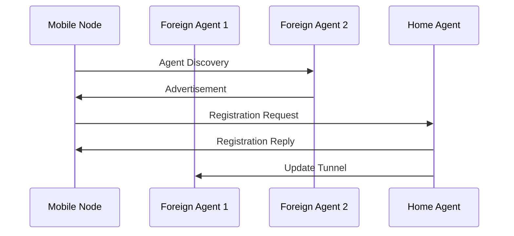
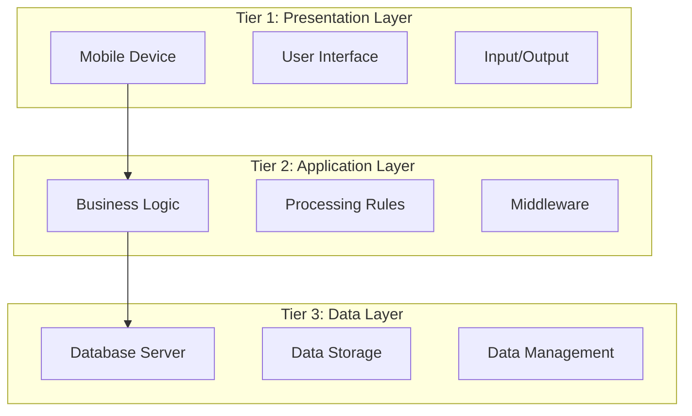
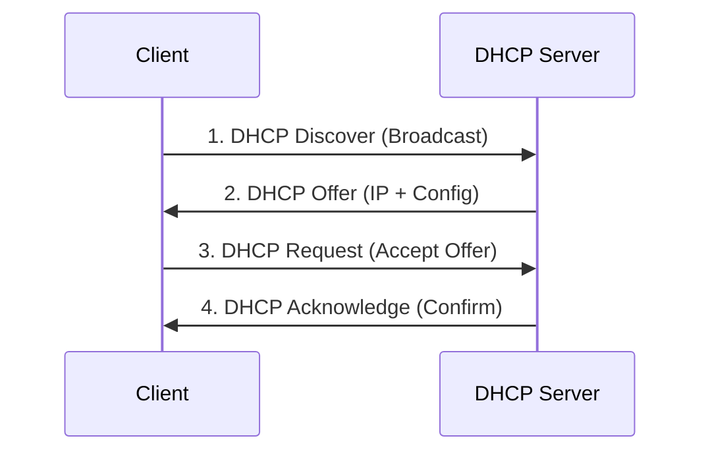
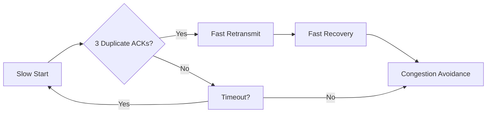
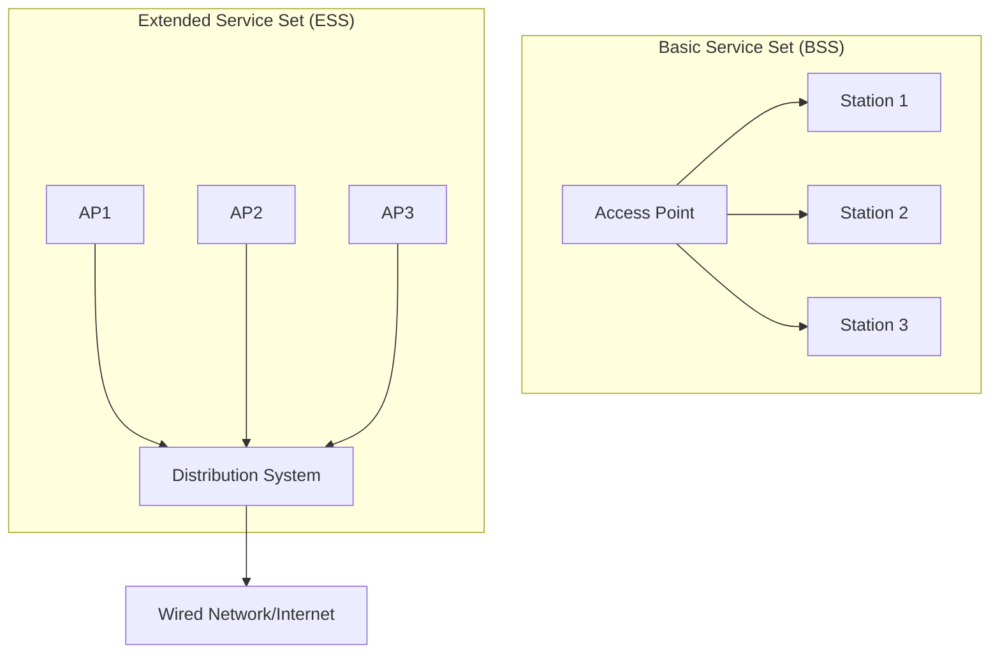
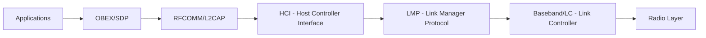
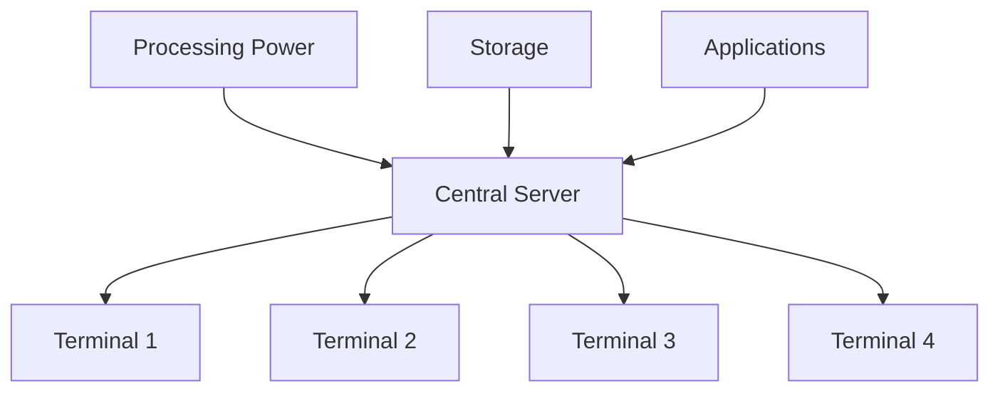
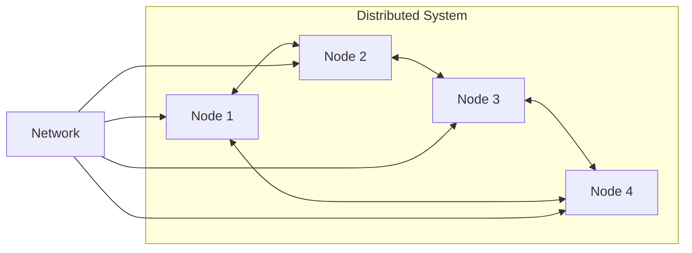
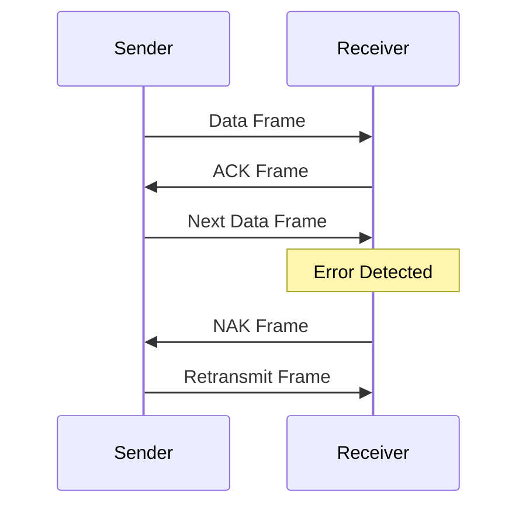

## Question 1(a) [03 marks]

**Differentiate between client server and peer to peer network.**

**Answer**:

| Parameter | Client-Server Network | Peer-to-Peer Network |
|-----------|----------------------|---------------------|
| **Architecture** | Centralized with dedicated server | Decentralized, all nodes equal |
| **Cost** | Higher due to server hardware | Lower, uses existing computers |
| **Security** | High, centralized control | Lower, distributed control |
| **Scalability** | Limited by server capacity | Better, resources increase with nodes |

**Mnemonic:** "CSS-P: Client-Server = Centralized Security, P2P = Peer Power"

## Question 1(b) [04 marks]

**Explain ARP Protocol with its working.**

**Answer**:

**ARP (Address Resolution Protocol)** maps IP addresses to MAC addresses in local networks.

**Working Process:**

- **Broadcast Request**: Host broadcasts ARP request with target IP
- **Cache Check**: Receiving hosts check if IP matches theirs
- **Reply Generation**: Target host sends ARP reply with MAC address
- **Cache Update**: Requesting host updates ARP table

**ARP Table Example:**

```
IP Address      MAC Address         TTL
192.168.1.1     00:1A:2B:3C:4D:5E   300s
```

**Mnemonic:** "BCRU: Broadcast, Cache, Reply, Update"

## Question 1(c) [07 marks]

**Explain OSI model with diagram.**

**Answer**:

The **OSI (Open Systems Interconnection)** model has 7 layers for network communication.


**Layer Functions:**

- **Physical**: Bit transmission over physical medium
- **Data Link**: Frame transmission, error detection
- **Network**: Routing, IP addressing
- **Transport**: End-to-end delivery, TCP/UDP
- **Session**: Connection management
- **Presentation**: Data encryption, compression
- **Application**: User interfaces, email, web

**Mnemonic:** "All People Seem To Need Data Processing"

## Question 1(c OR) [07 marks]

**What is Congestion? Explain Congestion Control.**

**Answer**:

**Congestion** occurs when network traffic exceeds available bandwidth, causing packet delays and losses.

**Types of Congestion Control:**

| Type | Method | Description |
|------|--------|-------------|
| **Open-Loop** | Prevention | Traffic shaping before congestion |
| **Closed-Loop** | Reaction | Feedback-based adjustment |

**Congestion Control Techniques:**

- **Traffic Shaping**: Regulate data transmission rate
- **Admission Control**: Limit new connections during congestion
- **Load Shedding**: Drop packets when buffers full
- **Backpressure**: Send congestion signals upstream

**Mnemonic:** "TALB: Traffic, Admission, Load, Backpressure"

## Question 2(a) [03 marks]

**What is Ad-hoc Network? Explain it.**

**Answer**:

**Ad-hoc Network** is a wireless network without fixed infrastructure where nodes communicate directly.

**Characteristics:**

- **Self-organizing**: Automatic network formation
- **Dynamic topology**: Nodes can join/leave freely  
- **Multi-hop routing**: Messages relay through intermediate nodes
- **Distributed control**: No central authority

**Applications:**

- Emergency response, military operations, sensor networks

**Mnemonic:** "SDMD: Self-organizing, Dynamic, Multi-hop, Distributed"

## Question 2(b) [04 marks]

**Explain Handover Management in Mobile IP.**

**Answer**:

**Handover** is the process of maintaining connectivity when a mobile node moves between networks.

**Handover Process:**



**Types:**

- **Hard Handover**: Break-before-make connection
- **Soft Handover**: Make-before-break connection

**Mnemonic:** "DARU: Discovery, Advertisement, Registration, Update"

## Question 2(c) [07 marks]

**Explain Three tier architecture of mobile computing with diagram.**

**Answer**:

**Three-tier architecture** separates mobile applications into presentation, application logic, and data layers.



**Layer Functions:**

- **Presentation**: User interface, mobile apps
- **Application**: Business logic, middleware services
- **Data**: Database management, storage systems

**Benefits:**

- **Scalability**: Independent layer scaling
- **Maintainability**: Separate concerns
- **Flexibility**: Technology independence

**Mnemonic:** "PAD: Presentation, Application, Data"

## Question 2(a OR) [03 marks]

**Explain Need of Wireless Network.**

**Answer**:

**Wireless Networks** provide connectivity without physical cables.

**Needs:**

- **Mobility**: Users can move freely while connected
- **Flexibility**: Easy network expansion and reconfiguration
- **Cost-effective**: Reduced cabling infrastructure costs
- **Accessibility**: Internet access in remote areas

**Applications:**

- Mobile communications, WiFi hotspots, IoT devices

**Mnemonic:** "MFCA: Mobility, Flexibility, Cost, Accessibility"

## Question 2(b OR) [04 marks]

**Explain Registration, tunneling and encapsulation in mobile ip.**

**Answer**:

**Mobile IP Components:**

| Process | Description | Purpose |
|---------|-------------|---------|
| **Registration** | Mobile node registers with home agent | Location update |
| **Tunneling** | Creates virtual path between agents | Route packets |
| **Encapsulation** | Wraps original packet in new header | Address translation |

**Process Flow:**

```
Original Packet → Encapsulation → Tunnel → Decapsulation → Destination
```

**Registration Steps:**

- Mobile node discovers foreign agent
- Sends registration request to home agent
- Home agent updates location binding

**Mnemonic:** "RTE: Registration, Tunneling, Encapsulation"

## Question 2(c OR) [07 marks]

**What is Middleware? Write down examples of middleware and explain any one of them in detail.**

**Answer**:

**Middleware** is software that connects different applications and services in distributed systems.

**Examples of Middleware:**

- **Message-Oriented Middleware (MOM)**
- **Remote Procedure Call (RPC)**
- **Object Request Broker (ORB)**
- **Database Middleware**
- **Web Services**

**Message-Oriented Middleware (MOM) - Detailed:**

**Architecture:**


**Features:**

- **Asynchronous Communication**: Non-blocking message exchange
- **Reliability**: Message persistence and delivery guarantees
- **Scalability**: Handle multiple concurrent connections
- **Platform Independence**: Cross-platform communication

**Benefits:**

- Loose coupling between applications
- Improved system reliability
- Better fault tolerance

**Mnemonic:** "ARSP: Asynchronous, Reliable, Scalable, Platform-independent"

## Question 3(a) [03 marks]

**Give Full form for 'www'. Explain it.**

**Answer**:

**WWW = World Wide Web**

**Explanation:**

- **Global Information System**: Interconnected web of documents
- **HTTP Protocol**: Uses HyperText Transfer Protocol
- **URL Addressing**: Unique resource locators
- **Hyperlinks**: Navigate between web pages

**Components:**

- Web servers, browsers, HTML documents, URLs

**Mnemonic:** "GHUH: Global, HTTP, URL, Hyperlinks"

## Question 3(b) [04 marks]

**Explain applications of Mobile Computing.**

**Answer**:

**Mobile Computing Applications:**

| Category | Applications | Benefits |
|----------|-------------|----------|
| **Business** | Email, CRM, Sales | Productivity, Real-time access |
| **Healthcare** | Patient monitoring, Telemedicine | Remote care, Emergency response |
| **Education** | E-learning, Digital libraries | Flexible learning, Resource access |
| **Entertainment** | Gaming, Streaming, Social media | On-demand content, Connectivity |

**Key Features:**

- **Location-based services**: GPS navigation, local search
- **Mobile payments**: Digital wallets, contactless transactions
- **IoT integration**: Smart home, wearable devices

**Mnemonic:** "BHEE: Business, Healthcare, Education, Entertainment"

## Question 3(c) [07 marks]

**Explain working of DHCP with the help of diagram and explain its advantages.**

**Answer**:

**DHCP (Dynamic Host Configuration Protocol)** automatically assigns IP addresses to network devices.

**DHCP Process (DORA):**



**Configuration Information Provided:**

- IP address and subnet mask
- Default gateway address
- DNS server addresses
- Lease duration

**Advantages:**

- **Automatic Configuration**: No manual IP assignment
- **Centralized Management**: Single point of control
- **Efficient IP Usage**: Dynamic allocation prevents waste
- **Reduced Errors**: Eliminates manual configuration mistakes
- **Easy Maintenance**: Simple network changes

**DHCP Message Types:**

- DISCOVER, OFFER, REQUEST, ACK, NAK, RELEASE, RENEW

**Mnemonic:** "DORA: Discover, Offer, Request, Acknowledge"

## Question 3(a OR) [03 marks]

**Write down: Importance of HTTPS.**

**Answer**:

**HTTPS (HyperText Transfer Protocol Secure)** provides secure web communication.

**Importance:**

- **Data Encryption**: Protects data in transit using SSL/TLS
- **Authentication**: Verifies server identity with certificates
- **Data Integrity**: Prevents data tampering during transmission
- **Trust Building**: Increases user confidence in websites

**Security Benefits:**

- Protection against eavesdropping and man-in-the-middle attacks

**Mnemonic:** "EADT: Encryption, Authentication, Integrity, Trust"

## Question 3(b OR) [04 marks]

**What is Bearer Network? Explain in Detail.**

**Answer**:

**Bearer Network** is the underlying network infrastructure that carries data traffic between endpoints.

**Types of Bearer Networks:**

| Type | Technology | Characteristics |
|------|------------|----------------|
| **Circuit-Switched** | Traditional telephony | Dedicated path, Guaranteed bandwidth |
| **Packet-Switched** | Internet, IP networks | Shared resources, Variable bandwidth |
| **Wireless** | Cellular, WiFi | Mobile connectivity, Air interface |

**Functions:**

- **Data Transport**: Carry user data and signaling
- **Quality of Service**: Manage bandwidth and latency
- **Routing**: Direct traffic between networks
- **Network Management**: Monitor and control traffic

**Examples:**

- PSTN, Internet backbone, 4G/5G cellular networks

**Mnemonic:** "DQRN: Data transport, QoS, Routing, Network management"

## Question 3(c OR) [07 marks]

**List out types of TCP and explain any one in detail.**

**Answer**:

**Types of TCP:**

- **Standard TCP (TCP Tahoe)**
- **TCP Reno**
- **TCP New Reno**  
- **TCP Vegas**
- **TCP SACK (Selective Acknowledgment)**
- **TCP Cubic**

**TCP Reno - Detailed Explanation:**

**Features:**

- **Fast Retransmit**: Retransmit lost packets quickly
- **Fast Recovery**: Avoid slow start after fast retransmit
- **Congestion Avoidance**: Linear increase in congestion window
- **Duplicate ACK Detection**: Identify packet loss

**Congestion Control Algorithm:**



**Advantages:**

- **Better Performance**: Faster recovery from packet loss
- **Efficiency**: Maintains higher throughput
- **Fairness**: Equitable bandwidth sharing

**Window Management:**

- Exponential growth in slow start
- Linear growth in congestion avoidance

**Mnemonic:** "FFCE: Fast retransmit, Fast recovery, Congestion avoidance, Efficiency"

## Question 4(a) [03 marks]

**Define WLAN. List out types of WLAN.**

**Answer**:

**WLAN (Wireless Local Area Network)** provides wireless connectivity within a limited area.

**Types of WLAN:**

- **Infrastructure Mode**: Uses access points for connectivity
- **Ad-hoc Mode**: Direct device-to-device communication
- **Mesh Networks**: Multi-hop wireless connectivity
- **Hybrid Networks**: Combination of infrastructure and ad-hoc

**Standards:**

- IEEE 802.11a/b/g/n/ac/ax (WiFi 6)

**Mnemonic:** "IAMH: Infrastructure, Ad-hoc, Mesh, Hybrid"

## Question 4(b) [04 marks]

**What is Routing? Explain types of Routing.**

**Answer**:

**Routing** is the process of selecting paths for data packets across networks.

**Types of Routing:**

| Type | Method | Characteristics |
|------|--------|----------------|
| **Static Routing** | Manual configuration | Fixed paths, No automatic updates |
| **Dynamic Routing** | Automatic updates | Adaptive paths, Real-time changes |
| **Default Routing** | Catch-all route | Used when no specific route exists |
| **Distance Vector** | Hop count based | RIP protocol, Simple implementation |
| **Link State** | Network topology | OSPF protocol, Faster convergence |

**Dynamic Routing Advantages:**

- **Automatic adaptation** to network changes
- **Load balancing** across multiple paths
- **Fault tolerance** with alternate routes

**Mnemonic:** "SDDL: Static, Dynamic, Default, Link-state"

## Question 4(c) [07 marks]

**Explain architecture of WLAN.**

**Answer**:

**WLAN Architecture Components:**



**Architecture Elements:**

- **Station (STA)**: Wireless client devices
- **Access Point (AP)**: Central wireless hub
- **Basic Service Set (BSS)**: Single AP coverage area
- **Extended Service Set (ESS)**: Multiple interconnected APs
- **Distribution System (DS)**: Backend network connecting APs

**WLAN Topologies:**

- **Infrastructure Mode**: Centralized through AP
- **Ad-hoc Mode**: Direct peer-to-peer communication
- **Mesh Topology**: Multi-hop wireless connections

**Services Provided:**

- **Association**: Device connection to AP
- **Authentication**: Security verification
- **Data Delivery**: Packet transmission
- **Roaming**: Seamless movement between APs

**Frequency Bands:**

- 2.4 GHz (802.11b/g/n)
- 5 GHz (802.11a/n/ac/ax)

**Mnemonic:** "SABED: Station, Access Point, BSS, ESS, Distribution System"

## Question 4(a OR) [03 marks]

**Define WPAN. List out applications of WPAN.**

**Answer**:

**WPAN (Wireless Personal Area Network)** connects devices within personal space (typically 10 meters).

**Applications of WPAN:**

- **Device Synchronization**: Phone to computer data transfer
- **Audio Streaming**: Wireless headphones, speakers
- **Input Devices**: Wireless keyboard, mouse
- **Healthcare**: Medical sensors, fitness trackers
- **Smart Home**: IoT device control

**Technologies:**

- Bluetooth, Zigbee, NFC, infrared

**Mnemonic:** "DSAHS: Device sync, Streaming, Audio, Healthcare, Smart home"

## Question 4(b OR) [04 marks]

**Explain working of IMAP Protocol.**

**Answer**:

**IMAP (Internet Message Access Protocol)** manages email on mail servers.

**IMAP Working Process:**

| Step | Action | Description |
|------|--------|-------------|
| **Connection** | Client connects to server | Establish TCP connection on port 143/993 |
| **Authentication** | Login credentials | Username/password verification |
| **Mailbox Selection** | Choose folder | Select INBOX or other folders |
| **Message Operations** | Read/Delete/Flag | Manipulate messages on server |

**IMAP vs POP3:**

- **Server Storage**: Messages remain on server
- **Multi-device Access**: Sync across devices
- **Folder Management**: Server-side folder structure
- **Partial Download**: Headers first, body on demand

**IMAP Commands:**

```
LOGIN user password
SELECT INBOX
FETCH 1 BODY[]
STORE 1 +FLAGS (\Deleted)
```

**Mnemonic:** "CAMS: Connection, Authentication, Mailbox, Storage"

## Question 4(c OR) [07 marks]

**Explain Bluetooth technology with a figure of its protocol stack.**

**Answer**:

**Bluetooth** is a short-range wireless communication technology for personal area networks.

**Bluetooth Protocol Stack:**



**Layer Functions:**

- **Radio Layer**: 2.4 GHz ISM band, frequency hopping
- **Baseband**: Timing, access control, packet formats
- **LMP**: Link establishment, security, power management
- **L2CAP**: Packet segmentation, protocol multiplexing
- **RFCOMM**: Serial port emulation over wireless
- **SDP**: Service discovery protocol
- **Applications**: File transfer, audio streaming, HID

**Bluetooth Characteristics:**

- **Range**: 10 meters (Class 2 devices)
- **Data Rate**: 1-3 Mbps (depending on version)
- **Topology**: Star network (piconet)
- **Security**: Authentication, authorization, encryption

**Bluetooth Versions:**

- Classic Bluetooth (BR/EDR)
- Bluetooth Low Energy (BLE/LE)
- Bluetooth 5.0+ (Enhanced range/speed)

**Applications:**

- Audio devices, keyboards, file transfer, IoT sensors

**Mnemonic:** "RBLSRA: Radio, Baseband, LMP, SDP, RFCOMM, Applications"

## Question 5(a) [03 marks]

**What is 4G? List out Features of 4G.**

**Answer**:

**4G (Fourth Generation)** is a mobile communication standard providing high-speed wireless internet.

**Features of 4G:**

- **High Data Speed**: Up to 100 Mbps mobile, 1 Gbps stationary
- **All-IP Network**: Packet-switched architecture
- **Low Latency**: Reduced delay for real-time applications
- **Quality of Service**: Guaranteed service levels
- **Global Roaming**: Worldwide compatibility

**Technologies:**

- LTE (Long Term Evolution), WiMAX

**Mnemonic:** "HALQG: High-speed, All-IP, Low latency, QoS, Global roaming"

## Question 5(b) [04 marks]

**Explain Centralized Computing.**

**Answer**:

**Centralized Computing** processes all data and applications on a central server.

**Architecture:**



**Characteristics:**

- **Single Point of Control**: All processing at central location
- **Thin Clients**: Minimal local processing capability
- **Shared Resources**: CPU, memory, storage centrally managed
- **Network Dependent**: Requires reliable network connectivity

**Advantages:**

- **Security**: Centralized data protection
- **Management**: Easier system administration
- **Cost**: Lower client-side hardware costs

**Disadvantages:**

- **Single Point of Failure**: Server downtime affects all users
- **Network Bottleneck**: Heavy reliance on network performance

**Mnemonic:** "SSNG: Single control, Shared resources, Network dependent, Greater security"

## Question 5(c) [07 marks]

**What is ipv4 addressing scheme? Explain with a neat and clean diagram with its working.**

**Answer**:

**IPv4 (Internet Protocol version 4)** uses 32-bit addresses for network identification.

**IPv4 Address Structure:**

```goat
 0                   1                   2                   3
 0 1 2 3 4 5 6 7 8 9 0 1 2 3 4 5 6 7 8 9 0 1 2 3 4 5 6 7 8 9 0 1
+-+-+-+-+-+-+-+-+-+-+-+-+-+-+-+-+-+-+-+-+-+-+-+-+-+-+-+-+-+-+-+-+
|                        Network Address                        |
+-+-+-+-+-+-+-+-+-+-+-+-+-+-+-+-+-+-+-+-+-+-+-+-+-+-+-+-+-+-+-+-+
|                         Host Address                          |
+-+-+-+-+-+-+-+-+-+-+-+-+-+-+-+-+-+-+-+-+-+-+-+-+-+-+-+-+-+-+-+-+
```

**IPv4 Address Classes:**

| Class | Range | Network Bits | Host Bits | Default Subnet Mask |
|-------|-------|--------------|-----------|---------------------|
| **A** | 1-126 | 8 | 24 | 255.0.0.0 |
| **B** | 128-191 | 16 | 16 | 255.255.0.0 |
| **C** | 192-223 | 24 | 8 | 255.255.255.0 |
| **D** | 224-239 | Multicast | - | - |
| **E** | 240-255 | Experimental | - | - |

**IPv4 Packet Header:**

```goat
 0                   1                   2                   3
 0 1 2 3 4 5 6 7 8 9 0 1 2 3 4 5 6 7 8 9 0 1 2 3 4 5 6 7 8 9 0 1
+-+-+-+-+-+-+-+-+-+-+-+-+-+-+-+-+-+-+-+-+-+-+-+-+-+-+-+-+-+-+-+-+
|Version|  IHL  |Type of Service|          Total Length         |
+-+-+-+-+-+-+-+-+-+-+-+-+-+-+-+-+-+-+-+-+-+-+-+-+-+-+-+-+-+-+-+-+
|         Identification        |Flags|      Fragment Offset    |
+-+-+-+-+-+-+-+-+-+-+-+-+-+-+-+-+-+-+-+-+-+-+-+-+-+-+-+-+-+-+-+-+
|  Time to Live |    Protocol   |         Header Checksum       |
+-+-+-+-+-+-+-+-+-+-+-+-+-+-+-+-+-+-+-+-+-+-+-+-+-+-+-+-+-+-+-+-+
|                       Source Address                          |
+-+-+-+-+-+-+-+-+-+-+-+-+-+-+-+-+-+-+-+-+-+-+-+-+-+-+-+-+-+-+-+-+
|                    Destination Address                        |
+-+-+-+-+-+-+-+-+-+-+-+-+-+-+-+-+-+-+-+-+-+-+-+-+-+-+-+-+-+-+-+-+
|                    Options                    |    Padding    |
+-+-+-+-+-+-+-+-+-+-+-+-+-+-+-+-+-+-+-+-+-+-+-+-+-+-+-+-+-+-+-+-+
```

**Working Process:**

- **Address Assignment**: Network administrator assigns IP addresses
- **Routing Decision**: Router examines destination IP
- **Subnet Determination**: Apply subnet mask to find network
- **Packet Forwarding**: Route to appropriate network interface

**Special Addresses:**

- **Loopback**: 127.0.0.1 (localhost)
- **Private**: 10.x.x.x, 172.16-31.x.x, 192.168.x.x
- **Broadcast**: 255.255.255.255

**Limitations:**

- **Address Exhaustion**: Only 4.3 billion addresses
- **Inefficient Allocation**: Class-based wastage

**Mnemonic:** "ABCDE: Address classes A, B, C, D multicast, E experimental"

## Question 5(a OR) [03 marks]

**What is 5G? List out Features of 5G.**

**Answer**:

**5G (Fifth Generation)** is the latest mobile communication standard with enhanced capabilities.

**Features of 5G:**

- **Ultra-High Speed**: Up to 10 Gbps data rates
- **Ultra-Low Latency**: Less than 1ms response time
- **Massive Connectivity**: 1 million devices per km²
- **Network Slicing**: Virtual dedicated networks
- **Enhanced Mobile Broadband**: Improved user experience

**Key Technologies:**

- Millimeter wave, Massive MIMO, Beamforming

**Mnemonic:** "UUMNE: Ultra-speed, Ultra-low latency, Massive connectivity, Network slicing, Enhanced broadband"

## Question 5(b OR) [04 marks]

**Explain Distributed Computing**

**Answer**:

**Distributed Computing** spreads processing across multiple interconnected computers.

**Architecture:**



**Characteristics:**

- **Resource Sharing**: Distributed processing and storage
- **Scalability**: Add more nodes to increase capacity
- **Fault Tolerance**: System continues if some nodes fail
- **Location Transparency**: Users unaware of resource locations

**Advantages:**

- **Reliability**: No single point of failure
- **Performance**: Parallel processing capabilities
- **Cost-effectiveness**: Use commodity hardware

**Examples:**

- Cloud computing, peer-to-peer networks, grid computing

**Mnemonic:** "RSFL: Resource sharing, Scalability, Fault tolerance, Location transparency"

## Question 5(c OR) [07 marks]

**Explain Data Link Layer Protocol.**

**Answer**:

**Data Link Layer** provides reliable data transfer between adjacent network nodes.

**Functions:**

- **Framing**: Organize bits into frames
- **Error Detection**: Identify transmission errors
- **Error Correction**: Fix detected errors
- **Flow Control**: Manage data transmission rate
- **Access Control**: Coordinate shared media access

**Frame Structure:**

```goat
+----------+----------+----------+----------+----------+
| Start    | Address  | Control  | Data     | FCS      |
| Delimiter| Field    | Field    | Field    | (CRC)    |
+----------+----------+----------+----------+----------+
```

**Error Detection Methods:**

| Method | Description | Capability |
|--------|-------------|------------|
| **Parity Check** | Single bit addition | Detect single-bit errors |
| **Checksum** | Arithmetic sum | Detect multiple errors |
| **CRC** | Polynomial division | Detect burst errors |

**Flow Control Protocols:**

- **Stop-and-Wait**: Send one frame, wait for ACK
- **Sliding Window**: Multiple frames in transit
- **Stop-and-Wait ARQ**: Add error recovery
- **Go-Back-N ARQ**: Retransmit from error point
- **Selective Repeat**: Retransmit only error frames

**Access Control Methods:**

- **CSMA/CD**: Carrier Sense Multiple Access with Collision Detection
- **CSMA/CA**: Collision Avoidance
- **Token Passing**: Controlled access using token

**Protocol Examples:**

- Ethernet, PPP, HDLC, LLC

**Working Process:**



**Mnemonic:** "FECFA: Framing, Error detection, Correction, Flow control, Access control"
