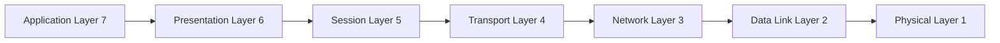
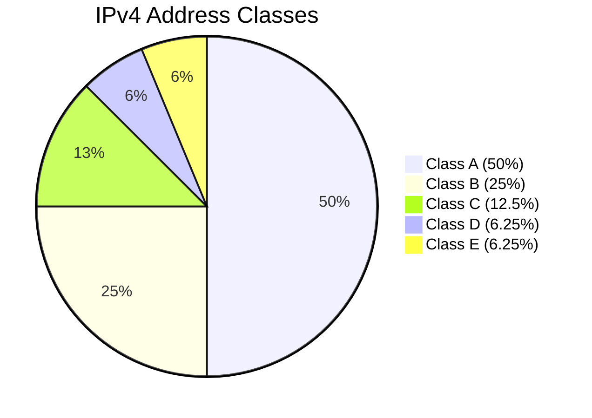
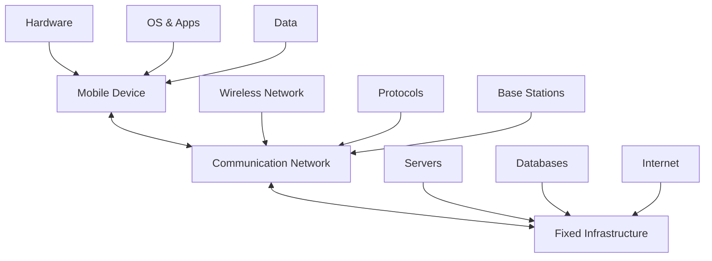
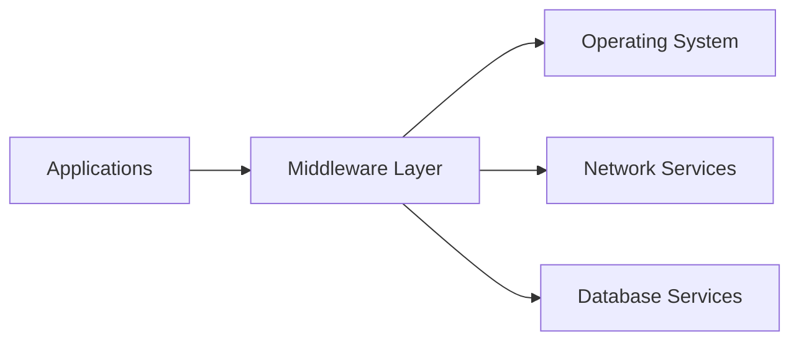
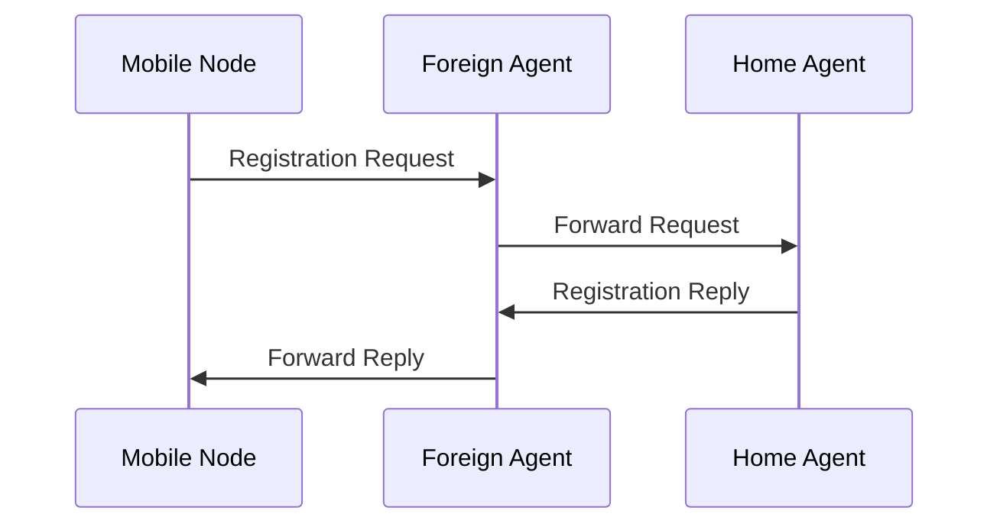
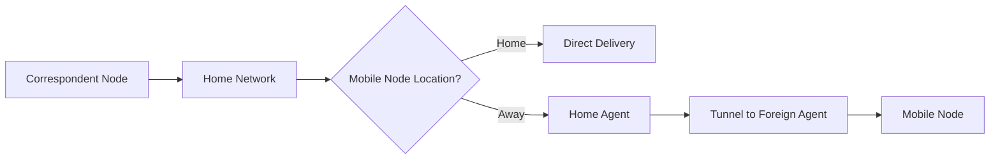
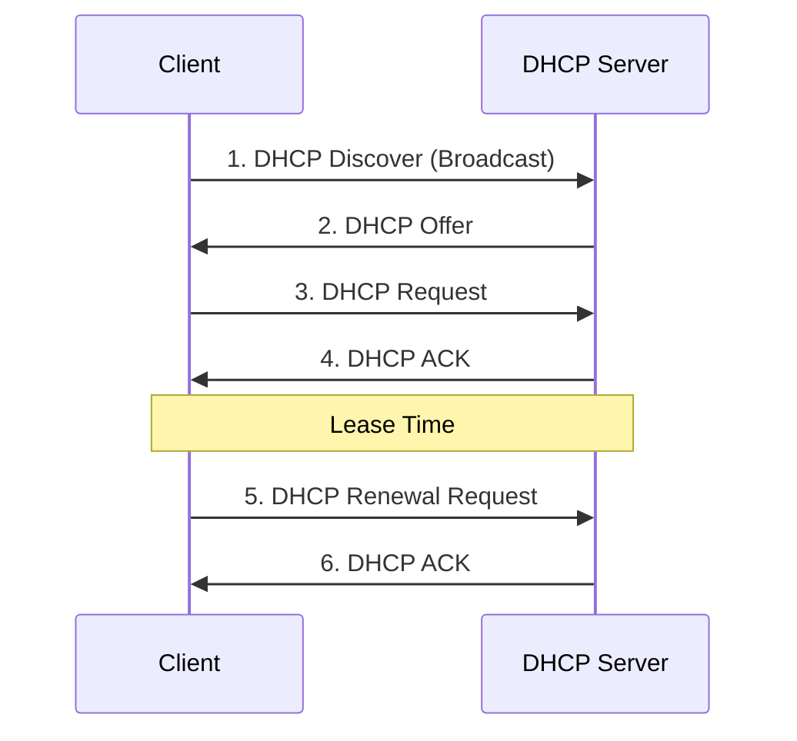
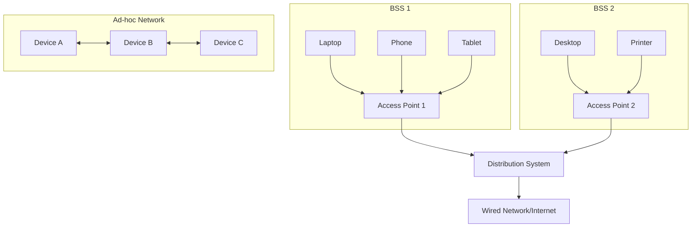
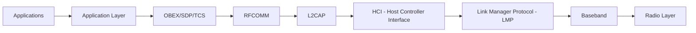

## પ્રશ્ન 1(અ) [3 ગુણ]

**congestion control ના પ્રકારો જણાવો અને કોઈપણ એક સમજાવો**

**જવાબ**:

| પ્રકાર | વર્ણન |
|------|-------|
| **Open-Loop** | congestion થાય તે પહેલાં અટકાવે |
| **Closed-Loop** | congestion detect થયા પછી વ્યવસ્થાપન |

**Open-Loop Congestion Control સમજાવટ:**

- **અટકાવવાનો અભિગમ**: congestion થાય તે પહેલાં action લે
- **Traffic shaping**: sender પર data rate control કરે
- **Admission control**: વધુ traffic દરમિયાન નવા connections limit કરે
- **Load shedding**: buffer full થાય ત્યારે packets drop કરે

**મેમરી ટ્રીક:** "Open Prevents Traffic Admission Load"

---

## પ્રશ્ન 1(બ) [4 ગુણ]

**Address Resolution Protocol વિસ્તારપૂર્વક સમજાવો**

**જવાબ**:

**ARP (Address Resolution Protocol)** local networks માં IP addresses ને MAC addresses સાથે map કરે છે.

**કાર્ય પ્રક્રિયા:**

- **ARP Request**: "કોની પાસે IP X છે?" broadcast message
- **ARP Reply**: target device પોતાનું MAC address આપે
- **ARP Cache**: ભવિષ્ય માટે IP-MAC mappings store કરે
- **Dynamic mapping**: entries automatically update કરે

**Table: ARP Message Types**

| Type | Purpose | Broadcast |
|------|---------|-----------|
| ARP Request | MAC address શોધવા માટે | Yes |
| ARP Reply | MAC address આપવા માટે | No |

**મેમરી ટ્રીક:** "ARP Requests Broadcast, Replies Cache Dynamic"

---

## પ્રશ્ન 1(ક) [7 ગુણ]

**TCP/IP મોડેલના દરેક layers ને તેમની કાર્યક્ષમતા સાથે સમજાવો**

**જવાબ**:

**TCP/IP Model** internet communication માટે four-layer network protocol stack છે.


**Layer Functions:**

| Layer | Function | Protocols |
|-------|----------|-----------|
| **Application** | User interface, network services | HTTP, FTP, SMTP |
| **Transport** | End-to-end communication | TCP, UDP |
| **Internet** | Routing, addressing | IP, ICMP |
| **Network Access** | Physical transmission | Ethernet, WiFi |

- **Application Layer**: applications ને network services provide કરે
- **Transport Layer**: error control સાથે reliable data delivery ensure કરે
- **Internet Layer**: IP addressing વાપરીને networks વચ્ચે packets route કરે
- **Network Access Layer**: physical data transmission handle કરે

**મેમરી ટ્રીક:** "All Transport Internet Network"

---

## પ્રશ્ન 1(ક OR) [7 ગુણ]

**OSI model ને તેના દરેક લેયરની કાર્યક્ષમતા સાથે સમજાવો**

**જવાબ**:

**OSI Model** network communication માટે seven-layer reference model છે.



**Layer Functionalities:**

| Layer | Function | Examples |
|-------|----------|----------|
| **Physical (1)** | Bit transmission | Cables, signals |
| **Data Link (2)** | Frame delivery | Ethernet, switches |
| **Network (3)** | Routing packets | IP, routers |
| **Transport (4)** | End-to-end delivery | TCP, UDP |
| **Session (5)** | Dialog management | NetBIOS |
| **Presentation (6)** | Data formatting | SSL, compression |
| **Application (7)** | User interface | HTTP, email |

**મેમરી ટ્રીક:** "Physical Data Network Transport Session Presentation Application"

---

## પ્રશ્ન 2(અ) [3 ગુણ]

**Subnetting ને ટૂંકમાં સમજાવો**

**જવાબ**:

**Subnetting** મોટા network ને better management માટે નાના sub-networks માં વહેંચે છે.

**મુખ્ય સિદ્ધાંતો:**

- **Subnet mask**: network અને host portions define કરે
- **Network efficiency**: broadcast traffic ઘટાડે
- **Address conservation**: વધુ સારો IP utilization
- **Security**: network segments ને isolate કરે

**Example:**
Network: 192.168.1.0/24 → Subnets: 192.168.1.0/26, 192.168.1.64/26

**મેમરી ટ્રીક:** "Subnet Network Efficiency Address Security"

---

## પ્રશ્ન 2(બ) [4 ગુણ]

**ડેટા લીક લેયરના Stop and wait ARQ પ્રોટોકોલને ઉદાહરણ આપી સમજાવો**

**જવાબ**:

**Stop and Wait ARQ** reliable data transmission ensure કરવા માટેનો flow control protocol છે.

**કાર્ય પ્રક્રિયા:**

- **Send frame**: Transmitter એક frame મોકલે
- **Wait for ACK**: Sender acknowledgment માટે રાહ જુએ
- **Timeout**: ACK ન મળે તો retransmit કરે
- **Next frame**: ACK મળ્યા પછી next frame મોકલે

```goat
Sender          Receiver
  |     Frame 1   |
  |-------------->|
  |               |
  |      ACK      |
  |<--------------|
  |     Frame 2   |
  |-------------->|
```

**Example:** File transfer માં દરેક packet confirmation માટે રાહ જુએ before sending next.

**મેમરી ટ્રીક:** "Send Wait Timeout Next"

---

## પ્રશ્ન 2(ક) [7 ગુણ]

**IPv4 datagram Header ની આકૃતિ દોરો અને સમજાવો**

**જવાબ**:

**IPv4 Header** packet routing અને delivery માટે control information ધરાવે છે.

```goat
 0                   1                   2                   3
 0 1 2 3 4 5 6 7 8 9 0 1 2 3 4 5 6 7 8 9 0 1 2 3 4 5 6 7 8 9 0 1
+-+-+-+-+-+-+-+-+-+-+-+-+-+-+-+-+-+-+-+-+-+-+-+-+-+-+-+-+-+-+-+-+
|Version|  IHL  |Type of Service|          Total Length         |
+-+-+-+-+-+-+-+-+-+-+-+-+-+-+-+-+-+-+-+-+-+-+-+-+-+-+-+-+-+-+-+-+
|         Identification        |Flags|      Fragment Offset    |
+-+-+-+-+-+-+-+-+-+-+-+-+-+-+-+-+-+-+-+-+-+-+-+-+-+-+-+-+-+-+-+-+
|  Time to Live |    Protocol   |         Header Checksum       |
+-+-+-+-+-+-+-+-+-+-+-+-+-+-+-+-+-+-+-+-+-+-+-+-+-+-+-+-+-+-+-+-+
|                       Source Address                          |
+-+-+-+-+-+-+-+-+-+-+-+-+-+-+-+-+-+-+-+-+-+-+-+-+-+-+-+-+-+-+-+-+
|                    Destination Address                        |
+-+-+-+-+-+-+-+-+-+-+-+-+-+-+-+-+-+-+-+-+-+-+-+-+-+-+-+-+-+-+-+-+
```

**Field સમજાવટ:**

| Field | Size | Function |
|-------|------|----------|
| **Version** | 4 bits | IP version (IPv4 માટે 4) |
| **IHL** | 4 bits | Header length |
| **Type of Service** | 8 bits | Quality of service |
| **Total Length** | 16 bits | Packet size |
| **TTL** | 8 bits | Hop limit |
| **Protocol** | 8 bits | Next layer protocol |
| **Source/Dest Address** | 32 bits દરેક | IP addresses |

**મેમરી ટ્રીક:** "Version IHL Service Total TTL Protocol Source Destination"

---

## પ્રશ્ન 2(અ OR) [3 ગુણ]

**HTTPS શું છે? HTTPSની મહત્વની વિશેષતાઓની યાદી લખો**

**જવાબ**:

**HTTPS (HTTP Secure)** secure web communication માટે SSL/TLS વાપરીને encrypted HTTP છે.

**મુખ્ય વિશેષતાઓ:**

- **Encryption**: Data transit માં encrypted રહે
- **Authentication**: Server identity verify કરે
- **Data integrity**: Data tampering અટકાવે
- **Trust**: SSL certificates validation provide કરે

**Security Benefits:**

- Sensitive information protect કરે
- Man-in-the-middle attacks prevent કરે
- Search engine ranking boost આપે

**મેમરી ટ્રીક:** "HTTPS Encrypts Authentication Data Trust"

---

## પ્રશ્ન 2(બ OR) [4 ગુણ]

**કોઈપણ બેના જવાબ આપો:**

**જવાબ**:

**1) Class B અને C દ્વારા કેટલા bits HOST ID નો ઉપયોગ થાય છે?**

- **Class B**: HOST ID માટે 16 bits (65,534 hosts)
- **Class C**: HOST ID માટે 8 bits (254 hosts)

**2) Class A અને D ની IP રેન્જ કેટલી છે?**

- **Class A**: 1.0.0.0 to 126.255.255.255
- **Class D**: 224.0.0.0 to 239.255.255.255 (Multicast)

| Class | Range | Host Bits |
|-------|-------|-----------|
| B | 128.0.0.0 - 191.255.255.255 | 16 bits |
| C | 192.0.0.0 - 223.255.255.255 | 8 bits |
| A | 1.0.0.0 - 126.255.255.255 | 24 bits |
| D | 224.0.0.0 - 239.255.255.255 | Multicast |

**મેમરી ટ્રીક:** "B=16, C=8, A=1-126, D=224-239"

---

## પ્રશ્ન 2(ક OR) [7 ગુણ]

**Classful IPv4 એડ્રેસ સ્કીમ સમજાવો**

**જવાબ**:

**Classful IPv4 Addressing** first octets આધારે IP address space ને પાંચ classes માં વહેંચે છે.

**Address Classes:**

| Class | Range | Network Bits | Host Bits | Usage |
|-------|-------|--------------|-----------|-------|
| **A** | 1-126 | 8 | 24 | Large networks |
| **B** | 128-191 | 16 | 16 | Medium networks |
| **C** | 192-223 | 24 | 8 | Small networks |
| **D** | 224-239 | - | - | Multicast |
| **E** | 240-255 | - | - | Experimental |



**લાક્ષણિકતાઓ:**

- **Class A**: network દીઠ 16.7 million hosts
- **Class B**: network દીઠ 65,534 hosts
- **Class C**: network દીઠ 254 hosts
- **મર્યાદાઓ**: Address wastage, inflexible allocation

**મેમરી ટ્રીક:** "A-Large, B-Medium, C-Small, D-Multicast, E-Experimental"

---

## પ્રશ્ન 3(અ) [3 ગુણ]

**મોબાઇલ કમ્પ્યુટિંગનો ઉપયોગ કરતી એપ્લિકેશનોના પ્રકારોની યાદી બનાવો**

**જવાબ**:

**Mobile Computing Applications:**

| પ્રકાર | Examples |
|------|----------|
| **Communication** | WhatsApp, Email, Video calls |
| **Navigation** | GPS, Google Maps |
| **E-commerce** | Shopping apps, Mobile banking |
| **Entertainment** | Games, Streaming, Social media |
| **Business** | CRM, Sales tracking |
| **Healthcare** | Health monitoring, Telemedicine |

- **Location-based services**: GPS navigation, location sharing
- **Mobile payments**: Digital wallets, UPI transactions
- **Social networking**: Facebook, Instagram, Twitter

**મેમરી ટ્રીક:** "Communication Navigation E-commerce Entertainment Business Healthcare"

---

## પ્રશ્ન 3(બ) [4 ગુણ]

**Gateways નો ઉપયોગ સમજાવો અને Gateways ના પ્રકારોની યાદી આપો**

**જવાબ**:

**Gateway** અલગ અલગ protocols અને architectures વાળા networks ને connect કરે છે.

**Gateways ના ઉપયોગ:**

- **Protocol conversion**: વિવિધ protocols વચ્ચે translate કરે
- **Network bridging**: અસમાન networks ને connect કરે
- **Security**: Firewall અને access control
- **Data filtering**: Traffic flow manage કરે

**Gateways ના પ્રકારો:**

| Type | Function |
|------|----------|
| **Network Gateway** | Networks વચ્ચે route કરે |
| **Internet Gateway** | Internet સાથે connect કરે |
| **Protocol Gateway** | Protocol translation |
| **Application Gateway** | Application-level filtering |

**મેમરી ટ્રીક:** "Gateways Convert Bridge Secure Filter"

---

## પ્રશ્ન 3(ક) [7 ગુણ]

**Mobile Computing નું આર્કિટેક્ચર દોરો અને સમજાવો**

**જવાબ**:

**Mobile Computing Architecture** એકસાથે કામ કરતા ત્રણ મુખ્ય components ધરાવે છે.



**Architecture Components:**

| Component | Elements | Function |
|-----------|----------|----------|
| **Mobile Unit** | Devices, OS, Apps | User interface, processing |
| **Communication Network** | Wireless links, protocols | Data transmission |
| **Fixed Infrastructure** | Servers, databases | Backend services |

**મુખ્ય લાક્ષણિકતાઓ:**

- **Mobility**: Users connectivity maintain કરીને move કરી શકે
- **Wireless communication**: Data transmission માટે radio waves
- **Distributed computing**: Multiple devices પર processing
- **Location independence**: કોઈપણ જગ્યાએથી services access

**પડકારો:**

- **Limited bandwidth**: Wireless networks માં capacity constraints
- **Battery life**: Mobile devices માં power limitations
- **Security**: Wireless transmission attacks માટે vulnerable

**મેમરી ટ્રીક:** "Mobile Communication Fixed - Mobility Wireless Distributed Location"

---

## પ્રશ્ન 3(અ OR) [3 ગુણ]

**મોબાઇલ કમ્પ્યુટિંગમાં સુરક્ષા ધોરણોની યાદી બનાવો**

**જવાબ**:

**Mobile Computing Security Standards:**

| Standard | Purpose |
|----------|---------|
| **WPA3** | WiFi security protocol |
| **SSL/TLS** | Secure data transmission |
| **IPSec** | IP layer security |
| **EAP** | Authentication framework |
| **802.11i** | Wireless LAN security |
| **FIPS 140-2** | Cryptographic module standards |

- **Authentication protocols**: User identity verify કરે
- **Encryption standards**: Data confidentiality protect કરે
- **Access control**: Resource permissions manage કરે

**મેમરી ટ્રીક:** "WPA SSL IPSec EAP 802.11i FIPS"

---

## પ્રશ્ન 3(બ OR) [4 ગુણ]

**કોમ્યુનિકેશન Gateway ના મુખ્ય કાર્યો સમજાવો**

**જવાબ**:

**Communication Gateway** વિવિધ network systems વચ્ચે data exchange manage કરે છે.

**મુખ્ય કાર્યો:**

| Function | Description |
|----------|-------------|
| **Protocol Translation** | Protocols વચ્ચે convert કરે |
| **Data Format Conversion** | Data formats change કરે |
| **Routing** | Messages ને destinations પર direct કરે |
| **Security** | Access control અને filtering |

**વિગતવાર કાર્યો:**

- **Message routing**: Data માટે optimal path determine કરે
- **Error handling**: Transmission errors અને recovery manage કરે
- **Traffic management**: Data flow અને congestion control કરે
- **Authentication**: Sender અને receiver identity verify કરે

**ફાયદાઓ:**

- વિવિધ systems વચ્ચે interoperability enable કરે
- Network management centralize કરે
- Security checkpoint provide કરે

**મેમરી ટ્રીક:** "Protocol Data Routing Security - Message Error Traffic Authentication"

---

## પ્રશ્ન 3(ક OR) [7 ગુણ]

**મિડલવેરનો ઉપયોગ અને મિડલવેરના લિસ્ટ પ્રકારો સમજાવો**

**જવાબ**:

**Middleware** distributed computing માટે applications અને operating system વચ્ચે software layer provide કરે છે.

**Middleware ના ઉપયોગ:**

- **Connectivity**: Distributed applications ને link કરે
- **Interoperability**: વિવિધ systems ને એકસાથે કામ કરવા enable કરે
- **Abstraction**: Underlying systems ની complexity hide કરે
- **Scalability**: System growth અને expansion support કરે



**Middleware ના પ્રકારો:**

| Type | Function | Examples |
|------|----------|----------|
| **Message-Oriented** | Asynchronous communication | IBM MQ, RabbitMQ |
| **Remote Procedure Call** | Synchronous communication | gRPC, XML-RPC |
| **Object Request Broker** | Object communication | CORBA |
| **Database Middleware** | Database connectivity | ODBC, JDBC |
| **Transaction Processing** | Transaction management | Tuxedo |
| **Web Middleware** | Web services | Apache, IIS |

**ફાયદાઓ:**

- **Reduced complexity**: Application development simplify કરે
- **Reusability**: Multiple applications માટે common services
- **Maintainability**: Services ના centralized management
- **Platform independence**: વિવિધ systems પર કામ કરે

**વિગતવાર સમજાવટ:**

**Message-Oriented Middleware:**

- Asynchronous communication enable કરે
- Message queues દ્વારા data exchange
- Reliability અને fault tolerance provide કરે

**RPC Middleware:**

- Remote functions ને local calls જેવા લાગે
- Synchronous communication support કરે
- Network transparency provide કરે

**Database Middleware:**

- Multiple databases સાથે connectivity
- Data access layer abstraction
- Query optimization અને caching

**Transaction Processing Middleware:**

- ACID properties ensure કરે
- Distributed transactions manage કરે
- Concurrency control provide કરે

**Web Middleware:**

- HTTP requests handle કરે
- Load balancing અને caching
- Security features provide કરે

**Challenges:**

- **Performance overhead**: Additional layer adds latency
- **Complexity**: System architecture વધુ complex બને
- **Vendor dependency**: Specific middleware vendors પર dependency

**Applications:**

- **Enterprise systems**: Large-scale business applications
- **E-commerce**: Online shopping platforms
- **Banking systems**: Financial transaction processing
- **Telecommunication**: Network service management

**મેમરી ટ્રીક:** "Message RPC Object Database Transaction Web - Connectivity Interoperability Abstraction Scalability"

## પ્રશ્ન 4(અ) [3 ગુણ]

**મોબાઇલ IP ના કાર્યકારી તબક્કાઓ સમજાવો**

**જવાબ**:

**Mobile IP Working Phases** networks પર seamless mobility enable કરે છે.

**ત્રણ મુખ્ય તબક્કાઓ:**

| Phase | Function |
|-------|----------|
| **Agent Discovery** | Home/foreign agents શોધવા |
| **Registration** | Foreign agent સાથે register |
| **Tunneling** | Mobile node પર packets forward |

**Phase વિગતો:**

- **Agent Discovery**: Mobile node advertisements દ્વારા available agents detect કરે
- **Registration**: Mobile node current location home agent સાથે register કરે
- **Tunneling**: Home agent packets encapsulate કરીને foreign agent પર forward કરે

**મેમરી ટ્રીક:** "Agent Registration Tunneling"

---

## પ્રશ્ન 4(બ) [4 ગુણ]

**Mobile IP માટે હેન્ડઓવર મેનેજમેન્ટ સમજાવો**

**જવાબ**:

**Handover Management** mobile node networks વચ્ચે move કરે ત્યારે connectivity maintain કરે છે.

**Handover Process:**

- **Movement detection**: Network attachment માં ફેરફાર identify કરે
- **New agent discovery**: નવા foreign agent શોધે
- **Registration update**: Home agent સાથે location update કરે
- **Data forwarding**: Traffic ને નવા location પર redirect કરે

**Handover ના પ્રકારો:**

| Type | Description |
|------|-------------|
| **Hard Handover** | Break-before-make |
| **Soft Handover** | Make-before-break |
| **Horizontal** | Same technology |
| **Vertical** | Different technology |

**પડકારો:**

- **Packet loss**: Handover transition દરમિયાન
- **Delay**: Registration અને tunneling setup time
- **Resource management**: Network resources નો efficient use

**મેમરી ટ્રીક:** "Movement Discovery Registration Forwarding"

---

## પ્રશ્ન 4(ક) [7 ગુણ]

**Mobile IP માં Registration અને Tunneling સમજાવો**

**જવાબ**:

**Registration અને Tunneling** Mobile IP functionality enable કરવાના core mechanisms છે.

**Registration Process:**



**Registration Steps:**

- **Request**: Mobile node foreign agent ને registration request મોકલે
- **Forward**: Foreign agent request ને home agent પર forward કરે
- **Authentication**: Home agent mobile node identity verify કરે
- **Reply**: Home agent registration confirm કરતો reply મોકલે

**Tunneling Mechanism:**

| Component | Function |
|-----------|----------|
| **Encapsulation** | Original packet ને wrap કરે |
| **Tunnel Endpoint** | Home અને foreign agents |
| **Decapsulation** | Destination પર packet unwrap કરે |
| **Routing** | Tunnel દ્વારા traffic direct કરે |

**Tunneling Process:**

- **Packet arrival**: Mobile node માટે data home agent પર આવે
- **Encapsulation**: Home agent packet ને foreign agent address સાથે wrap કરે
- **Tunnel transmission**: Packet tunnel દ્વારા foreign agent પર જાય
- **Decapsulation**: Foreign agent unwrap કરીને mobile node ને deliver કરે

**ફાયદાઓ:**

- **Transparency**: Applications ને mobility ની જાણ નથી
- **Connectivity**: Movement દરમિયાન communication maintain કરે
- **Scalability**: Multiple mobile nodes support કરે

**મેમરી ટ્રીક:** "Registration Request Forward Authentication - Tunneling Encapsulation Transmission Decapsulation"

---

## પ્રશ્ન 4(અ OR) [3 ગુણ]

**Snooping TCP સમજાવો**

**જવાબ**:

**Snooping TCP** wireless networks પર wireless link errors handle કરીને TCP performance improve કરે છે.

**કાર્ય પ્રક્રિયા:**

- **Base station monitoring**: TCP packets observe કરે
- **Local retransmission**: Wireless link errors locally handle કરે
- **Cache management**: Transmitted packets ની copies store કરે
- **Error recovery**: Sender involve કર્યા વિના lost packets retransmit કરે

**મુખ્ય લાક્ષણિકતાઓ:**

| Feature | Benefit |
|---------|---------|
| **Transparent** | TCP endpoints માં કોઈ changes નથી |
| **Local recovery** | Faster error correction |
| **Reduced timeouts** | Unnecessary retransmissions prevent કરે |

**મેમરી ટ્રીક:** "Snooping Monitors Local Cache Recovery"

---

## પ્રશ્ન 4(બ OR) [4 ગુણ]

**Mobile IP મા પેકેટ ડિલિવરી સમજાવો**

**જવાબ**:

**Mobile IP માં Packet Delivery** location ને ધ્યાન આપ્યા વિના mobile nodes પર data પહોંચાડે છે.

**Delivery Process:**



**Delivery Scenarios:**

| Scenario | Path | Method |
|----------|------|--------|
| **At Home** | Direct | Normal IP routing |
| **Away** | Via HA/FA | Tunneling |
| **Roaming** | Triangle routing | Indirect path |

**Packet Flow Steps:**

- **Address resolution**: Mobile node location determine કરે
- **Route selection**: Direct અથવા tunneled delivery choose કરે
- **Encapsulation**: Tunneling જરૂરી હોય તો packet wrap કરે
- **Forwarding**: Appropriate destination પર send કરે
- **Decapsulation**: Foreign agent પર packet unwrap કરે
- **Final delivery**: Mobile node ને deliver કરે

**મેમરી ટ્રીક:** "Address Route Encapsulation Forward Decapsulation Delivery"

---

## પ્રશ્ન 4(ક OR) [7 ગુણ]

**DHCP કેવી રીતે કાર્ય કરે છે એ આકૃતિ દોરી સમજાવો**

**જવાબ**:

**DHCP (Dynamic Host Configuration Protocol)** devices ને automatically IP addresses અને network configuration assign કરે છે.

**DHCP Working Process:**



**ચાર-પગલાની પ્રક્રિયા:**

| Step | Message | Function |
|------|---------|----------|
| **1** | DISCOVER | Client IP માટે broadcast request કરે |
| **2** | OFFER | Server available IP address offer કરે |
| **3** | REQUEST | Client specific IP address request કરે |
| **4** | ACK | Server IP assignment confirm કરે |

**DHCP Components:**

- **DHCP Server**: IP address pool અને assignments manage કરે
- **DHCP Client**: Assigned configuration request કરે અને વાપરે
- **DHCP Relay**: Subnets પર DHCP messages forward કરે
- **Address Pool**: Available IP addresses નો range

**Configuration Information Provided:**

- **IP Address**: Unique network identifier
- **Subnet Mask**: Network boundary definition
- **Default Gateway**: Other networks નો route
- **DNS Servers**: Domain name resolution
- **Lease Time**: IP assignment નો duration

**ફાયદાઓ:**

- **Automatic configuration**: Manual IP assignment ની જરૂર નથી
- **Centralized management**: Network configuration માટે single point
- **Efficient utilization**: Dynamic allocation waste prevent કરે
- **Reduced errors**: Manual configuration mistakes eliminate કરે

**મેમરી ટ્રીક:** "Discover Offer Request ACK - Server Client Relay Pool"

---

## પ્રશ્ન 5(અ) [3 ગુણ]

**WLAN ના પ્રકાર જણાવો અને કોઈપણ એક સમજાવો**

**જવાબ**:

**WLAN પ્રકારો:**

| Type | Standard | Frequency |
|------|----------|-----------|
| **Infrastructure** | 802.11 | 2.4/5 GHz |
| **Ad-hoc** | IBSS | 2.4/5 GHz |
| **Mesh** | 802.11s | Multiple |

**Infrastructure WLAN સમજાવટ:**

- **Access Point (AP)**: બધા communications માટે central coordinator
- **BSS (Basic Service Set)**: Single AP નો network coverage area
- **ESS (Extended Service Set)**: Multiple interconnected BSSs
- **Distribution System**: Multiple APs ને connect કરતું backbone

**લાક્ષણિકતાઓ:**

- બધા communication access point દ્વારા જાય છે
- Centralized network management
- વધુ સારું security અને performance control

**મેમરી ટ્રીક:** "Infrastructure Ad-hoc Mesh - AP BSS ESS Distribution"

---

## પ્રશ્ન 5(બ) [4 ગુણ]

**નીચેના પ્રશ્નોના જવાબ આપો:**

**જવાબ**:

**1) Ad hoc Network ના ઉપયોગોની યાદી આપો:**

| Use Case | Application |
|----------|-------------|
| **Emergency** | Disaster recovery, rescue operations |
| **Military** | Battlefield communications |
| **Conferences** | Temporary meeting networks |
| **Home** | Device-to-device communication |
| **Vehicular** | Car-to-car networks |

**2) મોબાઇલ કમ્પ્યુટિંગની Entities અને Terminology ની યાદી લખો:**

**Entities:**

- **Mobile Node (MN)**: Moving device
- **Home Agent (HA)**: Permanent network representative
- **Foreign Agent (FA)**: Temporary network coordinator
- **Correspondent Node (CN)**: Communication partner

**Terminology:**

- **Handover**: Network switching process
- **Roaming**: Moving between networks
- **Care-of Address**: Temporary IP address

**મેમરી ટ્રીક:** "Emergency Military Conference Home Vehicular - MN HA FA CN"

---

## પ્રશ્ન 5(ક) [7 ગુણ]

**સ્વચ્છ આકૃતિ સાથે WLAN ના આર્કિટેક્ચરને સમજાવો**

**જવાબ**:

**WLAN Architecture** access points દ્વારા communicate કરતા wireless stations ધરાવે છે.



**Architecture Components:**

| Component | Function | Coverage |
|-----------|----------|----------|
| **STA (Station)** | Wireless device | Point |
| **AP (Access Point)** | Network coordinator | BSS area |
| **BSS (Basic Service Set)** | Single AP coverage | ~100m radius |
| **ESS (Extended Service Set)** | Multiple connected BSS | Large area |
| **DS (Distribution System)** | AP interconnection | Building/campus |

**WLAN Architecture ના પ્રકારો:**

**1. Infrastructure Mode:**

- **Centralized**: બધા traffic access points દ્વારા
- **Managed**: Network administration અને security
- **Scalable**: Coverage area expand કરવામાં easy

**2. Ad-hoc Mode (IBSS):**

- **Peer-to-peer**: Direct device communication
- **Decentralized**: કોઈ central coordinator નથી
- **Temporary**: Specific needs માટે quick setup

**મુખ્ય લાક્ષણિકતાઓ:**

- **Mobility**: Users coverage area માં move કરી શકે
- **Wireless medium**: Communication માટે radio waves
- **Shared bandwidth**: Multiple users channel capacity share કરે
- **Security**: Protection માટે WPA/WPA2/WPA3 protocols

**Standards અને Frequencies:**

- **802.11a**: 5 GHz, up to 54 Mbps
- **802.11b**: 2.4 GHz, up to 11 Mbps
- **802.11g**: 2.4 GHz, up to 54 Mbps
- **802.11n**: 2.4/5 GHz, up to 600 Mbps
- **802.11ac**: 5 GHz, up to 6.93 Gbps

**મેમરી ટ્રીક:** "STA AP BSS ESS DS - Infrastructure Ad-hoc"

---

## પ્રશ્ન 5(અ OR) [3 ગુણ]

**5G ની લાક્ષણિકતાઓ લખો**

**જવાબ**:

**5G મુખ્ય લાક્ષણિકતાઓ:**

| Feature | Specification |
|---------|---------------|
| **Speed** | Up to 10 Gbps સુધી |
| **Latency** | < 1 millisecond |
| **Connectivity** | 1 million devices/km² |
| **Reliability** | 99.999% availability |
| **Bandwidth** | 100x વધારો |
| **Energy** | 90% ઘટાડો |

**Advanced Capabilities:**

- **Enhanced Mobile Broadband (eMBB)**: Ultra-fast data speeds
- **Ultra-Reliable Low Latency (URLLC)**: Mission-critical applications
- **Massive Machine Type Communication (mMTC)**: IoT connectivity

**મેમરી ટ્રીક:** "Speed Latency Connectivity Reliability Bandwidth Energy"

---

## પ્રશ્ન 5(બ OR) [4 ગુણ]

**નીચેના પ્રશ્નોના જવાબ આપો:**

**જવાબ**:

**1) communication middleware ની પ્રકારોની યાદી લખો:**

| Type | Function |
|------|----------|
| **Message-Oriented** | Asynchronous messaging |
| **RPC-based** | Remote procedure calls |
| **Object-Oriented** | Distributed objects |
| **Service-Oriented** | Web services |
| **Database** | Data access layer |

**2) Mobile IP ના સંદર્ભમાં "Home Agent" ની વ્યાખ્યા આપો:**

**Home Agent (HA)** mobile node ના home network પરનો router છે જે:

- **Registration maintain કરે**: Mobile node નું current location track કરે
- **Packets tunnel કરે**: Mobile node ના foreign location પર data forward કરે
- **Address management**: Mobile node નું permanent IP address manage કરે
- **Authentication**: Registration દરમિયાન mobile node identity verify કરે

**Functions:**

- Mobile node home થી દૂર હોય ત્યારે proxy તરીકે કામ કરે
- Mobile node માટે destined packets intercept કરે
- Foreign agents સાથે tunnels create કરે

**મેમરી ટ્રીક:** "Message RPC Object Service Database - HA Maintains Tunnels Address Authentication"

---

## પ્રશ્ન 5(ક OR) [7 ગુણ]

**Bluetooth protocol stack આકૃતિ સાથે સમજાવો**

**જવાબ**:

**Bluetooth Protocol Stack** short-range wireless communication માટે layered architecture provide કરે છે.



**Protocol Stack Layers:**

| Layer | Function | Protocols |
|-------|----------|-----------|
| **Application** | User applications | Audio, File transfer |
| **Middleware** | Services | OBEX, SDP, TCS |
| **Transport** | Data delivery | RFCOMM |
| **Network** | Packet management | L2CAP |
| **Interface** | Host-Controller | HCI |
| **Management** | Link control | LMP |
| **Data Link** | Channel access | Baseband |
| **Physical** | Radio transmission | 2.4 GHz ISM |

**Layer વિગતો:**

**Upper Layers:**

- **OBEX**: File transfers માટે Object Exchange Protocol
- **SDP**: Available services શોધવા માટે Service Discovery Protocol
- **TCS**: Voice calls માટે Telephony Control Specification
- **RFCOMM**: Bluetooth પર serial port emulation

**Lower Layers:**

- **L2CAP**: Multiple connections manage કરે છે Logical Link Control
- **HCI**: Communication standardize કરે છે Host Controller Interface
- **LMP**: Connection setup handle કરે છે Link Manager Protocol
- **Baseband**: Time slots અને frequency hopping manage કરે

**મુખ્ય લાક્ષણિકતાઓ:**

- **Frequency Hopping**: 79 channels પર 1600 hops/second
- **Piconet**: 8 devices સુધીનું network
- **Scatternet**: Multiple overlapping piconets
- **Power Classes**: Class 1 (100m), Class 2 (10m), Class 3 (1m)

**ફાયદાઓ:**

- **Low power consumption**: Battery devices માટે suitable
- **Automatic pairing**: Easy device connection
- **Interference resistance**: Frequency hopping spread spectrum
- **Cost effective**: Low implementation cost

**Applications:**

- **Audio streaming**: Headphones, speakers
- **Data transfer**: Devices વચ્ચે file sharing
- **Input devices**: Keyboards, mice
- **IoT devices**: Sensors, smart home devices

**મેમરી ટ્રીક:** "Application Middleware Transport Network Interface Management DataLink Physical"
