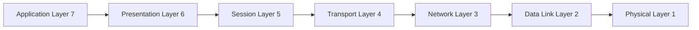
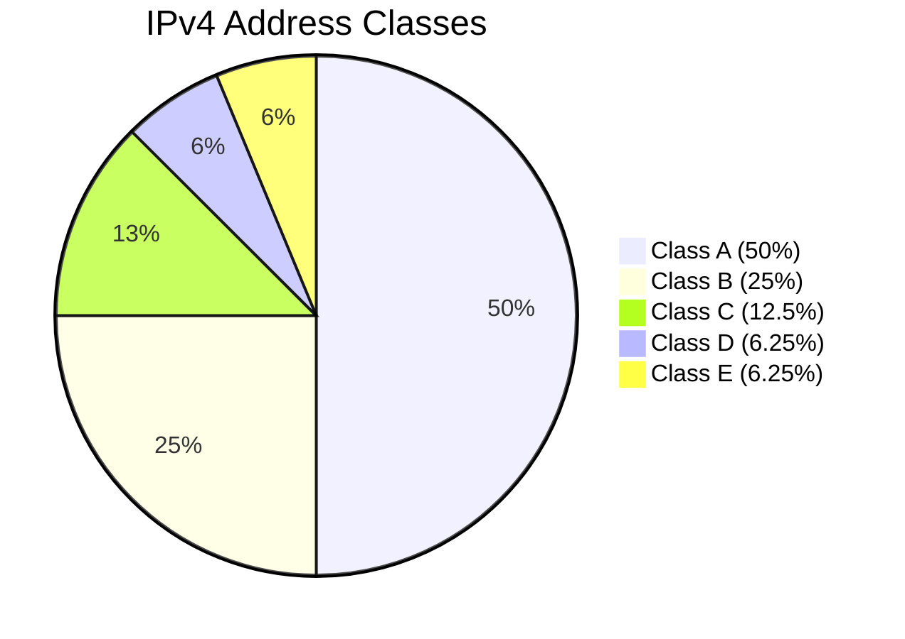
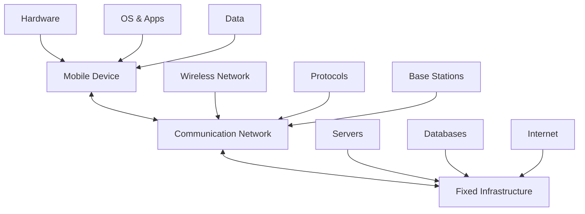
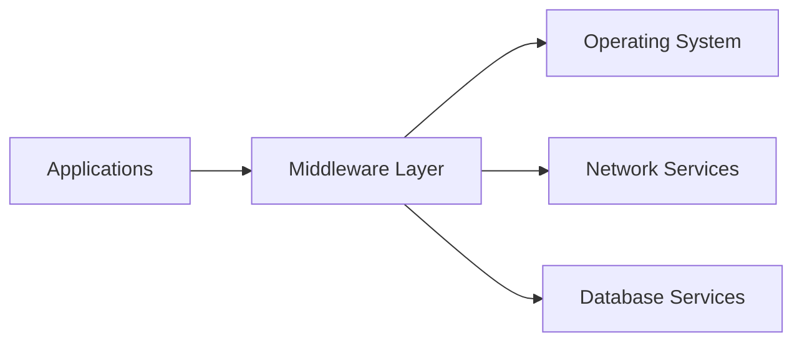
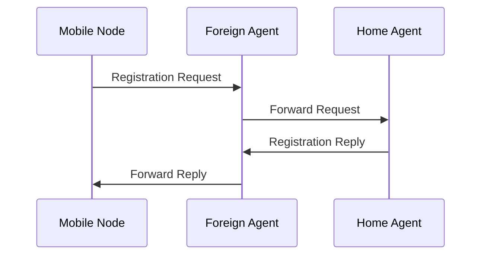
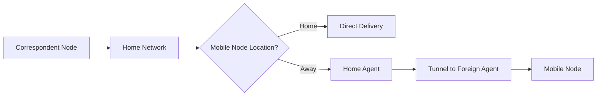
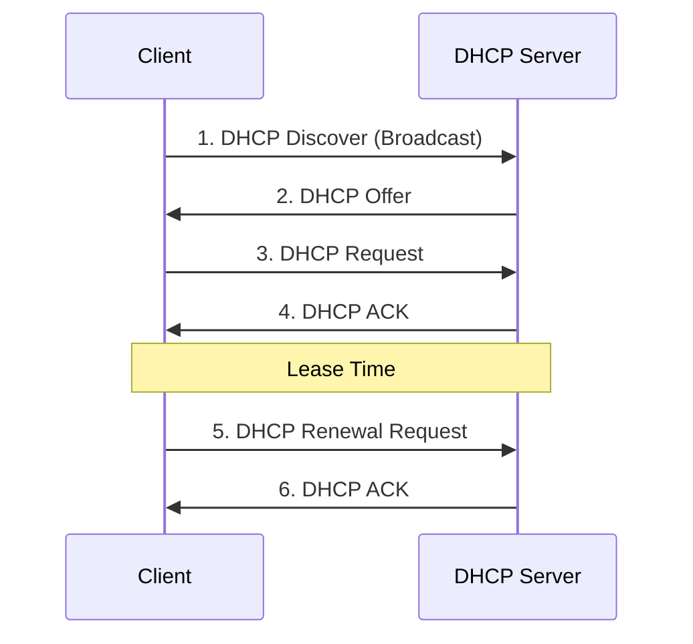
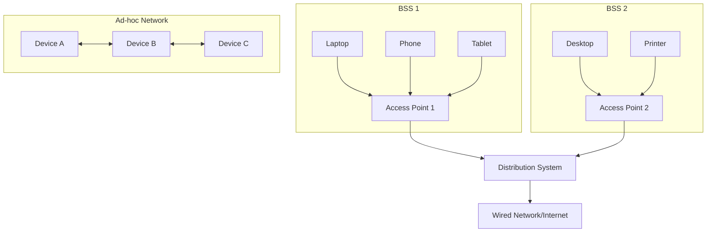
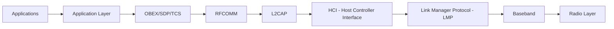

## Question 1(a) [3 marks]

**List out types of congestion control and explain any one**

**Answer**:

| Type | Description |
|------|-------------|
| **Open-Loop** | Prevents congestion before it occurs |
| **Closed-Loop** | Manages congestion after detection |

**Open-Loop Congestion Control Explanation:**

- **Prevention approach**: Takes action before congestion occurs
- **Traffic shaping**: Controls data rate at sender
- **Admission control**: Limits new connections during high traffic
- **Load shedding**: Drops packets when buffer full

**Mnemonic:** "Open Prevents Traffic Admission Load"

---

## Question 1(b) [4 marks]

**Explain Address Resolution Protocol briefly**

**Answer**:

**ARP (Address Resolution Protocol)** maps IP addresses to MAC addresses in local networks.

**Working Process:**

- **ARP Request**: Broadcast message asking "Who has IP X?"
- **ARP Reply**: Target device responds with its MAC address
- **ARP Cache**: Stores IP-MAC mappings for future use
- **Dynamic mapping**: Updates entries automatically

**Table: ARP Message Types**

| Type | Purpose | Broadcast |
|------|---------|-----------|
| ARP Request | Find MAC address | Yes |
| ARP Reply | Provide MAC address | No |

**Mnemonic:** "ARP Requests Broadcast, Replies Cache Dynamic"

---

## Question 1(c) [7 marks]

**Explain TCP/IP model with all layers and functionalities of each layer**

**Answer**:

**TCP/IP Model** is a four-layer network protocol stack for internet communication.


**Layer Functions:**

| Layer | Function | Protocols |
|-------|----------|-----------|
| **Application** | User interface, network services | HTTP, FTP, SMTP |
| **Transport** | End-to-end communication | TCP, UDP |
| **Internet** | Routing, addressing | IP, ICMP |
| **Network Access** | Physical transmission | Ethernet, WiFi |

- **Application Layer**: Provides network services to applications
- **Transport Layer**: Ensures reliable data delivery with error control
- **Internet Layer**: Routes packets across networks using IP addressing  
- **Network Access Layer**: Handles physical data transmission

**Mnemonic:** "All Transport Internet Network"

---

## Question 1(c OR) [7 marks]

**Explain OSI model with each layer functionality**

**Answer**:

**OSI Model** is a seven-layer reference model for network communication.



**Layer Functionalities:**

| Layer | Function | Examples |
|-------|----------|----------|
| **Physical (1)** | Bit transmission | Cables, signals |
| **Data Link (2)** | Frame delivery | Ethernet, switches |
| **Network (3)** | Routing packets | IP, routers |
| **Transport (4)** | End-to-end delivery | TCP, UDP |
| **Session (5)** | Dialog management | NetBIOS |
| **Presentation (6)** | Data formatting | SSL, compression |
| **Application (7)** | User interface | HTTP, email |

**Mnemonic:** "Physical Data Network Transport Session Presentation Application"

---

## Question 2(a) [3 marks]

**Explain subnetting in short**

**Answer**:

**Subnetting** divides a large network into smaller sub-networks for better management.

**Key Concepts:**

- **Subnet mask**: Defines network and host portions
- **Network efficiency**: Reduces broadcast traffic
- **Address conservation**: Better IP utilization
- **Security**: Isolates network segments

**Example:**
Network: 192.168.1.0/24 → Subnets: 192.168.1.0/26, 192.168.1.64/26

**Mnemonic:** "Subnet Network Efficiency Address Security"

---

## Question 2(b) [4 marks]

**Explain stop and wait ARQ protocol of data link layer with example**

**Answer**:

**Stop and Wait ARQ** is a flow control protocol ensuring reliable data transmission.

**Working Process:**

- **Send frame**: Transmitter sends one frame
- **Wait for ACK**: Sender waits for acknowledgment
- **Timeout**: Retransmits if no ACK received
- **Next frame**: Sends next frame after ACK

```goat
Sender          Receiver
  |     Frame 1   |
  |-------------->|
  |               |
  |      ACK      |
  |<--------------|
  |     Frame 2   |
  |-------------->|
```

**Example:** File transfer where each packet waits for confirmation before sending next.

**Mnemonic:** "Send Wait Timeout Next"

---

## Question 2(c) [7 marks]

**Draw diagram of IPv4 datagram Header and explain it**

**Answer**:

**IPv4 Header** contains control information for packet routing and delivery.

```goat
 0                   1                   2                   3
 0 1 2 3 4 5 6 7 8 9 0 1 2 3 4 5 6 7 8 9 0 1 2 3 4 5 6 7 8 9 0 1
+-+-+-+-+-+-+-+-+-+-+-+-+-+-+-+-+-+-+-+-+-+-+-+-+-+-+-+-+-+-+-+-+
|Version|  IHL  |Type of Service|          Total Length         |
+-+-+-+-+-+-+-+-+-+-+-+-+-+-+-+-+-+-+-+-+-+-+-+-+-+-+-+-+-+-+-+-+
|         Identification        |Flags|      Fragment Offset    |
+-+-+-+-+-+-+-+-+-+-+-+-+-+-+-+-+-+-+-+-+-+-+-+-+-+-+-+-+-+-+-+-+
|  Time to Live |    Protocol   |         Header Checksum       |
+-+-+-+-+-+-+-+-+-+-+-+-+-+-+-+-+-+-+-+-+-+-+-+-+-+-+-+-+-+-+-+-+
|                       Source Address                          |
+-+-+-+-+-+-+-+-+-+-+-+-+-+-+-+-+-+-+-+-+-+-+-+-+-+-+-+-+-+-+-+-+
|                    Destination Address                        |
+-+-+-+-+-+-+-+-+-+-+-+-+-+-+-+-+-+-+-+-+-+-+-+-+-+-+-+-+-+-+-+-+
```

**Field Explanations:**

| Field | Size | Function |
|-------|------|----------|
| **Version** | 4 bits | IP version (4 for IPv4) |
| **IHL** | 4 bits | Header length |
| **Type of Service** | 8 bits | Quality of service |
| **Total Length** | 16 bits | Packet size |
| **TTL** | 8 bits | Hop limit |
| **Protocol** | 8 bits | Next layer protocol |
| **Source/Dest Address** | 32 bits each | IP addresses |

**Mnemonic:** "Version IHL Service Total TTL Protocol Source Destination"

---

## Question 2(a OR) [3 marks]

**What is HTTPS? List important key features of HTTPS**

**Answer**:

**HTTPS (HTTP Secure)** is encrypted HTTP using SSL/TLS for secure web communication.

**Key Features:**

- **Encryption**: Data encrypted in transit
- **Authentication**: Verifies server identity
- **Data integrity**: Prevents data tampering
- **Trust**: SSL certificates provide validation

**Security Benefits:**

- Protects sensitive information
- Prevents man-in-the-middle attacks
- Search engine ranking boost

**Mnemonic:** "HTTPS Encrypts Authentication Data Trust"

---

## Question 2(b OR) [4 marks]

**Give Answer of any two:**

**Answer**:

**1) How many bits HOST ID use by class B and C?**

- **Class B**: 16 bits for Host ID (65,534 hosts)
- **Class C**: 8 bits for Host ID (254 hosts)

**2) What is IP range for Class A and D?**

- **Class A**: 1.0.0.0 to 126.255.255.255
- **Class D**: 224.0.0.0 to 239.255.255.255 (Multicast)

| Class | Range | Host Bits |
|-------|-------|-----------|
| B | 128.0.0.0 - 191.255.255.255 | 16 bits |
| C | 192.0.0.0 - 223.255.255.255 | 8 bits |
| A | 1.0.0.0 - 126.255.255.255 | 24 bits |
| D | 224.0.0.0 - 239.255.255.255 | Multicast |

**Mnemonic:** "B=16, C=8, A=1-126, D=224-239"

---

## Question 2(c OR) [7 marks]

**Explain classful IPv4 addresses scheme**

**Answer**:

**Classful IPv4 Addressing** divides IP address space into five classes based on first octets.

**Address Classes:**

| Class | Range | Network Bits | Host Bits | Usage |
|-------|-------|--------------|-----------|-------|
| **A** | 1-126 | 8 | 24 | Large networks |
| **B** | 128-191 | 16 | 16 | Medium networks |
| **C** | 192-223 | 24 | 8 | Small networks |
| **D** | 224-239 | - | - | Multicast |
| **E** | 240-255 | - | - | Experimental |



**Characteristics:**

- **Class A**: 16.7 million hosts per network
- **Class B**: 65,534 hosts per network  
- **Class C**: 254 hosts per network
- **Limitations**: Address wastage, inflexible allocation

**Mnemonic:** "A-Large, B-Medium, C-Small, D-Multicast, E-Experimental"

---

## Question 3(a) [3 marks]

**List out types of applications uses mobile computing**

**Answer**:

**Mobile Computing Applications:**

| Type | Examples |
|------|----------|
| **Communication** | WhatsApp, Email, Video calls |
| **Navigation** | GPS, Google Maps |
| **E-commerce** | Shopping apps, Mobile banking |
| **Entertainment** | Games, Streaming, Social media |
| **Business** | CRM, Sales tracking |
| **Healthcare** | Health monitoring, Telemedicine |

- **Location-based services**: GPS navigation, location sharing
- **Mobile payments**: Digital wallets, UPI transactions
- **Social networking**: Facebook, Instagram, Twitter

**Mnemonic:** "Communication Navigation E-commerce Entertainment Business Healthcare"

---

## Question 3(b) [4 marks]

**Explain use of Gateways and list types of Gateways**

**Answer**:

**Gateway** connects networks with different protocols and architectures.

**Uses of Gateways:**

- **Protocol conversion**: Translates between different protocols
- **Network bridging**: Connects dissimilar networks
- **Security**: Firewall and access control
- **Data filtering**: Manages traffic flow

**Types of Gateways:**

| Type | Function |
|------|----------|
| **Network Gateway** | Routes between networks |
| **Internet Gateway** | Connects to internet |
| **Protocol Gateway** | Protocol translation |
| **Application Gateway** | Application-level filtering |

**Mnemonic:** "Gateways Convert Bridge Secure Filter"

---

## Question 3(c) [7 marks]

**Draw and explain architecture of mobile computing**

**Answer**:

**Mobile Computing Architecture** consists of three main components working together.



**Architecture Components:**

| Component | Elements | Function |
|-----------|----------|----------|
| **Mobile Unit** | Devices, OS, Apps | User interface, processing |
| **Communication Network** | Wireless links, protocols | Data transmission |
| **Fixed Infrastructure** | Servers, databases | Backend services |

**Key Features:**

- **Mobility**: Users can move while maintaining connectivity
- **Wireless communication**: Radio waves for data transmission
- **Distributed computing**: Processing across multiple devices
- **Location independence**: Access services from anywhere

**Challenges:**

- **Limited bandwidth**: Wireless networks have capacity constraints
- **Battery life**: Mobile devices have power limitations
- **Security**: Wireless transmission vulnerable to attacks

**Mnemonic:** "Mobile Communication Fixed - Mobility Wireless Distributed Location"

---

## Question 3(a OR) [3 marks]

**List security standards in mobile computing**

**Answer**:

**Mobile Computing Security Standards:**

| Standard | Purpose |
|----------|---------|
| **WPA3** | WiFi security protocol |
| **SSL/TLS** | Secure data transmission |
| **IPSec** | IP layer security |
| **EAP** | Authentication framework |
| **802.11i** | Wireless LAN security |
| **FIPS 140-2** | Cryptographic module standards |

- **Authentication protocols**: Verify user identity
- **Encryption standards**: Protect data confidentiality
- **Access control**: Manage resource permissions

**Mnemonic:** "WPA SSL IPSec EAP 802.11i FIPS"

---

## Question 3(b OR) [4 marks]

**Explain key functions of communication gateway**

**Answer**:

**Communication Gateway** manages data exchange between different network systems.

**Key Functions:**

| Function | Description |
|----------|-------------|
| **Protocol Translation** | Converts between protocols |
| **Data Format Conversion** | Changes data formats |
| **Routing** | Directs messages to destinations |
| **Security** | Access control and filtering |

**Detailed Functions:**

- **Message routing**: Determines optimal path for data
- **Error handling**: Manages transmission errors and recovery
- **Traffic management**: Controls data flow and congestion
- **Authentication**: Verifies sender and receiver identity

**Benefits:**

- Enables interoperability between different systems
- Centralizes network management
- Provides security checkpoint

**Mnemonic:** "Protocol Data Routing Security - Message Error Traffic Authentication"

---

## Question 3(c OR) [7 marks]

**Explain use of middleware and list types of middleware**

**Answer**:

**Middleware** provides software layer between applications and operating system for distributed computing.

**Uses of Middleware:**

- **Connectivity**: Links distributed applications
- **Interoperability**: Enables different systems to work together
- **Abstraction**: Hides complexity of underlying systems
- **Scalability**: Supports system growth and expansion



**Types of Middleware:**

| Type | Function | Examples |
|------|----------|----------|
| **Message-Oriented** | Asynchronous communication | IBM MQ, RabbitMQ |
| **Remote Procedure Call** | Synchronous communication | gRPC, XML-RPC |
| **Object Request Broker** | Object communication | CORBA |
| **Database Middleware** | Database connectivity | ODBC, JDBC |
| **Transaction Processing** | Transaction management | Tuxedo |
| **Web Middleware** | Web services | Apache, IIS |

**Benefits:**

- **Reduced complexity**: Simplifies application development
- **Reusability**: Common services for multiple applications
- **Maintainability**: Centralized management of services
- **Platform independence**: Works across different systems

**Mnemonic:** "Message RPC Object Database Transaction Web"

---

## Question 4(a) [3 marks]

**Explain working phases of Mobile IP**

**Answer**:

**Mobile IP Working Phases** enable seamless mobility for mobile devices across networks.

**Three Main Phases:**

| Phase | Function |
|-------|----------|
| **Agent Discovery** | Find home/foreign agents |
| **Registration** | Register with foreign agent |
| **Tunneling** | Forward packets to mobile node |

**Phase Details:**

- **Agent Discovery**: Mobile node detects available agents through advertisements
- **Registration**: Mobile node registers current location with home agent
- **Tunneling**: Home agent encapsulates and forwards packets to foreign agent

**Mnemonic:** "Agent Registration Tunneling"

---

## Question 4(b) [4 marks]

**Explain Handover management in Mobile IP**

**Answer**:

**Handover Management** maintains connectivity when mobile node moves between networks.

**Handover Process:**

- **Movement detection**: Identifies change in network attachment
- **New agent discovery**: Finds new foreign agent
- **Registration update**: Updates location with home agent
- **Data forwarding**: Redirects traffic to new location

**Types of Handover:**

| Type | Description |
|------|-------------|
| **Hard Handover** | Break-before-make |
| **Soft Handover** | Make-before-break |
| **Horizontal** | Same technology |
| **Vertical** | Different technology |

**Challenges:**

- **Packet loss**: During handover transition
- **Delay**: Registration and tunneling setup time
- **Resource management**: Efficient use of network resources

**Mnemonic:** "Movement Discovery Registration Forwarding"

---

## Question 4(c) [7 marks]

**Explain Registration and Tunneling in Mobile IP**

**Answer**:

**Registration and Tunneling** are core mechanisms enabling Mobile IP functionality.

**Registration Process:**



**Registration Steps:**

- **Request**: Mobile node sends registration request to foreign agent
- **Forward**: Foreign agent forwards request to home agent
- **Authentication**: Home agent verifies mobile node identity
- **Reply**: Home agent sends registration reply confirming registration

**Tunneling Mechanism:**

| Component | Function |
|-----------|----------|
| **Encapsulation** | Wraps original packet |
| **Tunnel Endpoint** | Home and foreign agents |
| **Decapsulation** | Unwraps packet at destination |
| **Routing** | Directs traffic through tunnel |

**Tunneling Process:**

- **Packet arrival**: Data arrives at home agent for mobile node
- **Encapsulation**: Home agent wraps packet with foreign agent address
- **Tunnel transmission**: Packet travels through tunnel to foreign agent
- **Decapsulation**: Foreign agent unwraps and delivers to mobile node

**Benefits:**

- **Transparency**: Applications unaware of mobility
- **Connectivity**: Maintains communication during movement
- **Scalability**: Supports multiple mobile nodes

**Security Considerations:**

- **Authentication**: Prevents unauthorized registration
- **Encryption**: Protects data in tunnels

**Mnemonic:** "Registration Request Forward Authentication - Tunneling Encapsulation Transmission Decapsulation"

---

## Question 4(a OR) [3 marks]

**Explain snooping TCP**

**Answer**:

**Snooping TCP** improves TCP performance over wireless networks by handling wireless link errors.

**Working Mechanism:**

- **Base station monitoring**: Observes TCP packets
- **Local retransmission**: Handles wireless link errors locally
- **Cache management**: Stores copies of transmitted packets
- **Error recovery**: Retransmits lost packets without involving sender

**Key Features:**

| Feature | Benefit |
|---------|---------|
| **Transparent** | No changes to TCP endpoints |
| **Local recovery** | Faster error correction |
| **Reduced timeouts** | Prevents unnecessary retransmissions |

**Mnemonic:** "Snooping Monitors Local Cache Recovery"

---

## Question 4(b OR) [4 marks]

**Explain Packet delivery in Mobile IP**

**Answer**:

**Packet Delivery in Mobile IP** ensures data reaches mobile nodes regardless of location.

**Delivery Process:**



**Delivery Scenarios:**

| Scenario | Path | Method |
|----------|------|--------|
| **At Home** | Direct | Normal IP routing |
| **Away** | Via HA/FA | Tunneling |
| **Roaming** | Triangle routing | Indirect path |

**Packet Flow Steps:**

- **Address resolution**: Determine mobile node location
- **Route selection**: Choose direct or tunneled delivery
- **Encapsulation**: Wrap packet if tunneling required
- **Forwarding**: Send to appropriate destination
- **Decapsulation**: Unwrap packet at foreign agent
- **Final delivery**: Deliver to mobile node

**Optimization Techniques:**

- **Route optimization**: Direct communication when possible
- **Binding cache**: Store location information
- **Smooth handover**: Minimize packet loss during movement

**Mnemonic:** "Address Route Encapsulation Forward Decapsulation Delivery"

---

## Question 4(c OR) [7 marks]

**Describe how DHCP working with diagram**

**Answer**:

**DHCP (Dynamic Host Configuration Protocol)** automatically assigns IP addresses and network configuration to devices.

**DHCP Working Process:**



**Four-Step Process:**

| Step | Message | Function |
|------|---------|----------|
| **1** | DISCOVER | Client broadcasts request for IP |
| **2** | OFFER | Server offers available IP address |
| **3** | REQUEST | Client requests specific IP address |
| **4** | ACK | Server confirms IP assignment |

**DHCP Components:**

- **DHCP Server**: Manages IP address pool and assignments
- **DHCP Client**: Requests and uses assigned configuration
- **DHCP Relay**: Forwards DHCP messages across subnets
- **Address Pool**: Range of available IP addresses

**Configuration Information Provided:**

- **IP Address**: Unique network identifier
- **Subnet Mask**: Network boundary definition
- **Default Gateway**: Route to other networks
- **DNS Servers**: Domain name resolution
- **Lease Time**: Duration of IP assignment

**Benefits:**

- **Automatic configuration**: No manual IP assignment needed
- **Centralized management**: Single point for network configuration
- **Efficient utilization**: Dynamic allocation prevents waste
- **Reduced errors**: Eliminates manual configuration mistakes

**DHCP Message Types:**

- **DISCOVER**: Locate available DHCP servers
- **OFFER**: Response with configuration offer
- **REQUEST**: Accept specific server offer
- **ACK**: Confirm configuration assignment
- **NAK**: Reject configuration request
- **RELEASE**: Return IP address to pool
- **RENEW**: Extend current lease

**Mnemonic:** "Discover Offer Request ACK - Server Client Relay Pool"

---

## Question 5(a) [3 marks]

**Give types of WLAN and explain any one**

**Answer**:

**WLAN Types:**

| Type | Standard | Frequency |
|------|----------|-----------|
| **Infrastructure** | 802.11 | 2.4/5 GHz |
| **Ad-hoc** | IBSS | 2.4/5 GHz |
| **Mesh** | 802.11s | Multiple |

**Infrastructure WLAN Explanation:**

- **Access Point (AP)**: Central coordinator for all communications
- **BSS (Basic Service Set)**: Network coverage area of single AP
- **ESS (Extended Service Set)**: Multiple interconnected BSSs
- **Distribution System**: Backbone connecting multiple APs

**Characteristics:**

- All communication goes through access point
- Centralized network management
- Better security and performance control

**Mnemonic:** "Infrastructure Ad-hoc Mesh - AP BSS ESS Distribution"

---

## Question 5(b) [4 marks]

**Answer the following questions:**

**Answer**:

**1) List Uses of Ad hoc Network:**

| Use Case | Application |
|----------|-------------|
| **Emergency** | Disaster recovery, rescue operations |
| **Military** | Battlefield communications |
| **Conferences** | Temporary meeting networks |
| **Home** | Device-to-device communication |
| **Vehicular** | Car-to-car networks |

**2) Enlist entities and terminology of mobile computing:**

**Entities:**

- **Mobile Node (MN)**: Moving device
- **Home Agent (HA)**: Permanent network representative  
- **Foreign Agent (FA)**: Temporary network coordinator
- **Correspondent Node (CN)**: Communication partner

**Terminology:**

- **Handover**: Network switching process
- **Roaming**: Moving between networks
- **Care-of Address**: Temporary IP address

**Mnemonic:** "Emergency Military Conference Home Vehicular - MN HA FA CN"

---

## Question 5(c) [7 marks]

**Explain architecture of WLAN with neat diagram**

**Answer**:

**WLAN Architecture** consists of wireless stations communicating through access points.



**Architecture Components:**

| Component | Function | Coverage |
|-----------|----------|----------|
| **STA (Station)** | Wireless device | Point |
| **AP (Access Point)** | Network coordinator | BSS area |
| **BSS (Basic Service Set)** | Single AP coverage | ~100m radius |
| **ESS (Extended Service Set)** | Multiple connected BSS | Large area |
| **DS (Distribution System)** | AP interconnection | Building/campus |

**Types of WLAN Architecture:**

**1. Infrastructure Mode:**

- **Centralized**: All traffic through access points
- **Managed**: Network administration and security
- **Scalable**: Easy to expand coverage area

**2. Ad-hoc Mode (IBSS):**

- **Peer-to-peer**: Direct device communication
- **Decentralized**: No central coordinator
- **Temporary**: Quick setup for specific needs

**Key Features:**

- **Mobility**: Users can move within coverage area
- **Wireless medium**: Radio waves for communication
- **Shared bandwidth**: Multiple users share channel capacity
- **Security**: WPA/WPA2/WPA3 protocols for protection

**Standards and Frequencies:**

- **802.11a**: 5 GHz, up to 54 Mbps
- **802.11b**: 2.4 GHz, up to 11 Mbps  
- **802.11g**: 2.4 GHz, up to 54 Mbps
- **802.11n**: 2.4/5 GHz, up to 600 Mbps
- **802.11ac**: 5 GHz, up to 6.93 Gbps

**Mnemonic:** "STA AP BSS ESS DS - Infrastructure Ad-hoc"

---

## Question 5(a OR) [3 marks]

**Write features of 5G**

**Answer**:

**5G Key Features:**

| Feature | Specification |
|---------|---------------|
| **Speed** | Up to 10 Gbps |
| **Latency** | < 1 millisecond |
| **Connectivity** | 1 million devices/km² |
| **Reliability** | 99.999% availability |
| **Bandwidth** | 100x increase |
| **Energy** | 90% reduction |

**Advanced Capabilities:**

- **Enhanced Mobile Broadband (eMBB)**: Ultra-fast data speeds
- **Ultra-Reliable Low Latency (URLLC)**: Mission-critical applications
- **Massive Machine Type Communication (mMTC)**: IoT connectivity

**Mnemonic:** "Speed Latency Connectivity Reliability Bandwidth Energy"

---

## Question 5(b OR) [4 marks]

**Answer the following questions:**

**Answer**:

**1) List Type of communication middleware:**

| Type | Function |
|------|----------|
| **Message-Oriented** | Asynchronous messaging |
| **RPC-based** | Remote procedure calls |
| **Object-Oriented** | Distributed objects |
| **Service-Oriented** | Web services |
| **Database** | Data access layer |

**2) Define the term "Home Agent" in the context of Mobile IP:**

**Home Agent (HA)** is a router on mobile node's home network that:

- **Maintains registration**: Tracks mobile node's current location
- **Tunnels packets**: Forwards data to mobile node's foreign location  
- **Address management**: Manages mobile node's permanent IP address
- **Authentication**: Verifies mobile node identity during registration

**Functions:**

- Acts as proxy for mobile node when away from home
- Intercepts packets destined for mobile node
- Creates tunnels to foreign agents

**Mnemonic:** "Message RPC Object Service Database - HA Maintains Tunnels Address Authentication"

---

## Question 5(c OR) [7 marks]

**Explain Bluetooth protocol stack with diagram**

**Answer**:

**Bluetooth Protocol Stack** provides layered architecture for short-range wireless communication.



**Protocol Stack Layers:**

| Layer | Function | Protocols |
|-------|----------|-----------|
| **Application** | User applications | Audio, File transfer |
| **Middleware** | Services | OBEX, SDP, TCS |
| **Transport** | Data delivery | RFCOMM |
| **Network** | Packet management | L2CAP |
| **Interface** | Host-Controller | HCI |
| **Management** | Link control | LMP |
| **Data Link** | Channel access | Baseband |
| **Physical** | Radio transmission | 2.4 GHz ISM |

**Layer Details:**

**Upper Layers:**

- **OBEX**: Object Exchange Protocol for file transfers
- **SDP**: Service Discovery Protocol finds available services
- **TCS**: Telephony Control Specification for voice calls
- **RFCOMM**: Serial port emulation over Bluetooth

**Lower Layers:**

- **L2CAP**: Logical Link Control manages multiple connections
- **HCI**: Host Controller Interface standardizes communication
- **LMP**: Link Manager Protocol handles connection setup
- **Baseband**: Manages time slots and frequency hopping

**Key Features:**

- **Frequency Hopping**: 1600 hops/second across 79 channels
- **Piconet**: Network of up to 8 devices
- **Scatternet**: Multiple overlapping piconets
- **Power Classes**: Class 1 (100m), Class 2 (10m), Class 3 (1m)

**Advantages:**

- **Low power consumption**: Suitable for battery devices
- **Automatic pairing**: Easy device connection
- **Interference resistance**: Frequency hopping spread spectrum
- **Cost effective**: Low implementation cost

**Applications:**

- **Audio streaming**: Headphones, speakers
- **Data transfer**: File sharing between devices
- **Input devices**: Keyboards, mice
- **IoT devices**: Sensors, smart home devices

**Mnemonic:** "Application Middleware Transport Network Interface Management DataLink Physical"
