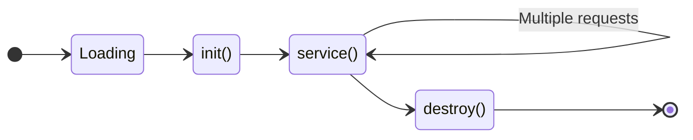
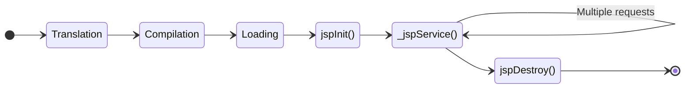
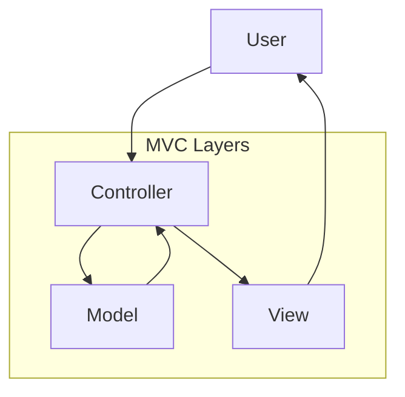

## પ્રશ્ન 1(અ) [3 ગુણ]

**AWT અને Swing વચ્ચેનો તફાવત સમજાવો.**

**જવાબ**:

| લક્ષણ | AWT | Swing |
|-------|-----|-------|
| **Platform** | Platform dependent | Platform independent |
| **Components** | Heavy weight | Light weight |
| **Look & Feel** | Native OS look | Pluggable look & feel |
| **Performance** | ઝડપી | AWT કરતાં ધીમું |

**મુખ્ય મુદ્દાઓ:**

- **Heavy vs Light**: AWT native OS components વાપરે છે, Swing pure Java વાપરે છે
- **દેખાવ**: AWT OS style અનુસરે છે, Swing બધા platforms પર સમાન look આપે છે
- **સુવિધાઓ**: Swing વધુ advanced components જેમ કે JTable, JTree પ્રદાન કરે છે

**મેમરી ટ્રીક:** "Swing Provides Lightweight Components"

---

## પ્રશ્ન 1(બ) [4 ગુણ]

**Mouse Motion Listener ને ઉદાહરણ સાથે સમજાવો.**

**જવાબ**:

MouseMotionListener interface Java Swing applications માં mouse movement events ને handle કરે છે.

**કોષ્ટક: Mouse Motion Events**

| Method | હેતુ |
|--------|------|
| **mouseDragged()** | જ્યારે mouse drag થાય ત્યારે call થાય |
| **mouseMoved()** | જ્યારે mouse ખસે ત્યારે call થાય |

**કોડ ઉદાહરણ:**

```java
import javax.swing.*;
import java.awt.event.*;

class MouseMotionExample extends JFrame implements MouseMotionListener {
    JLabel label;
    
    MouseMotionExample() {
        label = new JLabel("અહીં mouse ખસાડો");
        add(label);
        addMouseMotionListener(this);
        setSize(400, 300);
        setVisible(true);
    }
    
    public void mouseMoved(MouseEvent e) {
        label.setText("Mouse આ સ્થાને: " + e.getX() + ", " + e.getY());
    }
    
    public void mouseDragged(MouseEvent e) {
        label.setText("Dragging આ સ્થાને: " + e.getX() + ", " + e.getY());
    }
}
```

**મેમરી ટ્રીક:** "Mouse Motion Makes Dynamic"

---

## પ્રશ્ન 1(ક) [7 ગુણ]

**યુનિવર્સિટી સાથે જોડાયેલા વિવિધ અભ્યાસક્રમો માટે checkboxes બનાવવા માટે એક પ્રોગ્રામ ડેવલપ કરો જેથી પસંદ કરેલ કોર્સ પ્રદર્શિત થાય.**

**જવાબ**:

```java
import javax.swing.*;
import java.awt.*;
import java.awt.event.*;

public class CourseSelection extends JFrame implements ItemListener {
    JCheckBox java, python, cpp, web;
    JTextArea display;
    
    public CourseSelection() {
        setTitle("યુનિવર્સિટી કોર્સ પસંદગી");
        setLayout(new FlowLayout());
        
        // checkboxes બનાવો
        java = new JCheckBox("Java Programming");
        python = new JCheckBox("Python Programming");
        cpp = new JCheckBox("C++ Programming");
        web = new JCheckBox("Web Development");
        
        // listeners ઉમેરો
        java.addItemListener(this);
        python.addItemListener(this);
        cpp.addItemListener(this);
        web.addItemListener(this);
        
        // Display area
        display = new JTextArea(10, 30);
        display.setEditable(false);
        
        // components ઉમેરો
        add(new JLabel("કોર્સ પસંદ કરો:"));
        add(java); add(python); add(cpp); add(web);
        add(new JScrollPane(display));
        
        setSize(400, 300);
        setDefaultCloseOperation(JFrame.EXIT_ON_CLOSE);
        setVisible(true);
    }
    
    public void itemStateChanged(ItemEvent e) {
        String courses = "પસંદ કરેલ કોર્સ:\n";
        if(java.isSelected()) courses += "- Java Programming\n";
        if(python.isSelected()) courses += "- Python Programming\n";
        if(cpp.isSelected()) courses += "- C++ Programming\n";
        if(web.isSelected()) courses += "- Web Development\n";
        display.setText(courses);
    }
    
    public static void main(String[] args) {
        new CourseSelection();
    }
}
```

**મુખ્ય લક્ષણો:**

- **ItemListener**: checkbox state changes ને detect કરે છે
- **Dynamic Display**: real-time માં પસંદ કરેલા કોર્સ update કરે છે
- **Multiple Selection**: એકથી વધુ કોર્સ પસંદ કરવાની મંજૂરી આપે છે

**મેમરી ટ્રીક:** "Check Items Listen Dynamically"

---

## પ્રશ્ન 1(ક) અથવા [7 ગુણ]

**Swing components નો ઉપયોગ કરીને (JFrame, JRadioButton, ItemListener વગેરેનો ઉપયોગ કરીને) Traffic signal (લાલ, લીલો અને પીળો) implement કરવા માટે એક પ્રોગ્રામ વિકસાવો.**

**જવાબ**:

```java
import javax.swing.*;
import java.awt.*;
import java.awt.event.*;

public class TrafficSignal extends JFrame implements ItemListener {
    JRadioButton red, green, yellow;
    ButtonGroup group;
    JPanel signalPanel;
    
    public TrafficSignal() {
        setTitle("Traffic Signal સિમ્યુલેટર");
        setLayout(new BorderLayout());
        
        // radio buttons બનાવો
        red = new JRadioButton("લાલ");
        green = new JRadioButton("લીલો"); 
        yellow = new JRadioButton("પીળો");
        
        // radio buttons ને group કરો
        group = new ButtonGroup();
        group.add(red); group.add(green); group.add(yellow);
        
        // listeners ઉમેરો
        red.addItemListener(this);
        green.addItemListener(this);
        yellow.addItemListener(this);
        
        // Signal display panel
        signalPanel = new JPanel() {
            public void paintComponent(Graphics g) {
                super.paintComponent(g);
                g.setColor(Color.BLACK);
                g.fillRect(50, 50, 100, 200);
                
                // વર્તુળો દોરો
                g.setColor(red.isSelected() ? Color.RED : Color.GRAY);
                g.fillOval(65, 65, 70, 70);
                
                g.setColor(yellow.isSelected() ? Color.YELLOW : Color.GRAY);
                g.fillOval(65, 105, 70, 70);
                
                g.setColor(green.isSelected() ? Color.GREEN : Color.GRAY);
                g.fillOval(65, 145, 70, 70);
            }
        };
        
        JPanel controlPanel = new JPanel();
        controlPanel.add(red); controlPanel.add(yellow); controlPanel.add(green);
        
        add(controlPanel, BorderLayout.SOUTH);
        add(signalPanel, BorderLayout.CENTER);
        
        setSize(300, 400);
        setDefaultCloseOperation(JFrame.EXIT_ON_CLOSE);
        setVisible(true);
    }
    
    public void itemStateChanged(ItemEvent e) {
        signalPanel.repaint();
    }
    
    public static void main(String[] args) {
        new TrafficSignal();
    }
}
```

**આકૃતિ:**

```goat
+----------------+
|  Traffic Box   |
|   ┌─────────┐  |
|   │   RED   │  |
|   ├─────────┤  |
|   │ YELLOW  │  |
|   ├─────────┤  |
|   │  GREEN  │  |
|   └─────────┘  |
+----------------+
  [R] [Y] [G]
```

**મેમરી ટ્રીક:** "Radio Buttons Paint Graphics"

---

## પ્રશ્ન 2(અ) [3 ગુણ]

**JDBC Type-4 driver સમજાવો.**

**જવાબ**:

**JDBC Type-4 Driver (Native Protocol Driver)**

| લક્ષણ | વર્ણન |
|-------|--------|
| **પ્રકાર** | Pure Java driver |
| **Communication** | Direct database protocol |
| **Platform** | Platform independent |
| **Performance** | સર્વોચ્ચ પ્રદર્શન |

**મુખ્ય મુદ્દાઓ:**

- **Pure Java**: કોઈ native code ની જરૂર નથી
- **Direct Connection**: ડેટાબેઝ સાથે સીધો સંપર્ક કરે છે
- **Network Protocol**: ડેટાબેઝના native network protocol નો ઉપયોગ કરે છે
- **શ્રેષ્ઠ પ્રદર્શન**: બધા driver types માં સૌથી ઝડપી

**મેમરી ટ્રીક:** "Pure Java Direct Protocol"

---

## પ્રશ્ન 2(બ) [4 ગુણ]

**Component class ની સામાન્ય રીતે વપરાતી methods સમજાવો.**

**જવાબ**:

**કોષ્ટક: Component Class Methods**

| Method | હેતુ |
|--------|------|
| **add()** | container માં component ઉમેરે છે |
| **setSize()** | component ના dimensions સેટ કરે છે |
| **setLayout()** | layout manager સેટ કરે છે |
| **setVisible()** | component ને દૃશ્યમાન/અદૃશ્ય બનાવે છે |
| **setBounds()** | position અને size સેટ કરે છે |
| **getSize()** | component નું size return કરે છે |

**મુખ્ય લક્ષણો:**

- **Layout Management**: component arrangement ને control કરે છે
- **Visibility Control**: components ને દેખાડે/છુપાવે છે
- **Size Management**: component dimensions ને control કરે છે
- **Container Operations**: child components ને manage કરે છે

**મેમરી ટ્રીક:** "Add Set Get Visibility"

---

## પ્રશ્ન 2(ક) [7 ગુણ]

**ટેબલ 'StuRec' માંથી વિદ્યાર્થીના રેકોર્ડ (Enroll No, Name, Address, Mobile No અને Email-ID) દર્શાવવા માટે JDBC નો ઉપયોગ કરીને પ્રોગ્રામ વિકસાવો.**

**જવાબ**:

```java
import java.sql.*;
import javax.swing.*;
import javax.swing.table.DefaultTableModel;

public class StudentRecordDisplay extends JFrame {
    JTable table;
    DefaultTableModel model;
    
    public StudentRecordDisplay() {
        setTitle("વિદ્યાર્થી રેકોર્ડ્સ");
        
        // table model બનાવો
        String[] columns = {"Enroll No", "Name", "Address", "Mobile", "Email"};
        model = new DefaultTableModel(columns, 0);
        table = new JTable(model);
        
        // ડેટા લોડ કરો
        loadStudentData();
        
        add(new JScrollPane(table));
        setSize(600, 400);
        setDefaultCloseOperation(JFrame.EXIT_ON_CLOSE);
        setVisible(true);
    }
    
    private void loadStudentData() {
        try {
            // ડેટાબેઝ કનેક્શન
            Class.forName("com.mysql.cj.jdbc.Driver");
            Connection con = DriverManager.getConnection(
                "jdbc:mysql://localhost:3306/university", "root", "password");
            
            // query execute કરો
            Statement stmt = con.createStatement();
            ResultSet rs = stmt.executeQuery("SELECT * FROM StuRec");
            
            // table માં ડેટા ઉમેરો
            while(rs.next()) {
                String[] row = {
                    rs.getString("enrollno"),
                    rs.getString("name"),
                    rs.getString("address"),
                    rs.getString("mobile"),
                    rs.getString("email")
                };
                model.addRow(row);
            }
            
            con.close();
        } catch(Exception e) {
            JOptionPane.showMessageDialog(this, "Error: " + e.getMessage());
        }
    }
    
    public static void main(String[] args) {
        new StudentRecordDisplay();
    }
}
```

**ડેટાબેઝ ટેબલ માળખું:**

```sql
CREATE TABLE StuRec (
    enrollno VARCHAR(20) PRIMARY KEY,
    name VARCHAR(50),
    address VARCHAR(100),
    mobile VARCHAR(15),
    email VARCHAR(50)
);
```

**મેમરી ટ્રીક:** "Connect Query Display Records"

---

## પ્રશ્ન 2(અ) અથવા [3 ગુણ]

**JDBC ના ફાયદા અને ગેરફાયદા લખો.**

**જવાબ**:

**કોષ્ટક: JDBC ફાયદા અને ગેરફાયદા**

| ફાયદા | ગેરફાયદા |
|-------|----------|
| **Platform Independent** | **Performance Overhead** |
| **Database Independent** | **શરૂઆતી લોકો માટે જટિલ** |
| **Standard API** | **SQL dependency** |
| **Transactions ને support કરે** | **Manual resource management** |

**મુખ્ય મુદ્દાઓ:**

- **પોર્ટેબિલિટી**: વિવિધ platforms અને databases પર કામ કરે છે
- **સ્ટાન્ડર્ડાઇઝેશન**: database operations માટે uniform API
- **પ્રદર્શન**: વધારાનું layer performance માં overhead લાવે છે
- **જટિલતા**: યોગ્ય resource management જરૂરી

**મેમરી ટ્રીક:** "Platform Independent Standard Complex"

---

## પ્રશ્ન 2(બ) અથવા [4 ગુણ]

**Border Layout સમજાવો.**

**જવાબ**:

BorderLayout container ને પાંચ વિસ્તારોમાં વહેંચે છે: North, South, East, West, અને Center.

**આકૃતિ:**

```goat
+------------------+
|      NORTH       |
+-----+------+-----+
|WEST |CENTER| EAST|
+-----+------+-----+
|      SOUTH       |
+------------------+
```

**કોષ્ટક: Border Layout વિસ્તારો**

| વિસ્તાર | સ્થાન | વર્તન |
|--------|-------|-------|
| **NORTH** | ઉપર | Preferred height, full width |
| **SOUTH** | નીચે | Preferred height, full width |
| **EAST** | જમણે | Preferred width, full height |
| **WEST** | ડાબે | Preferred width, full height |
| **CENTER** | વચ્ચે | બાકીની જગ્યા લે છે |

**કોડ ઉદાહરણ:**

```java
setLayout(new BorderLayout());
add(new JButton("ઉત્તર"), BorderLayout.NORTH);
add(new JButton("મધ્ય"), BorderLayout.CENTER);
```

**મેમરી ટ્રીક:** "North South East West Center"

---

## પ્રશ્ન 2(ક) અથવા [7 ગુણ]

**Hibernate CRUD operations નો ઉપયોગ કરીને Employee (NAME, AGE, SALARY અને DEPARTMENT) નો ડેટા store, update, fetch અને delete માટે એપ્લિકેશન ડેવલપ કરો.**

**જવાબ**:

**Employee Entity Class:**

```java
import javax.persistence.*;

@Entity
@Table(name = "employees")
public class Employee {
    @Id
    @GeneratedValue(strategy = GenerationType.IDENTITY)
    private int id;
    
    private String name;
    private int age;
    private double salary;
    private String department;
    
    // Constructors, getters, setters
    public Employee() {}
    
    public Employee(String name, int age, double salary, String dept) {
        this.name = name;
        this.age = age;
        this.salary = salary;
        this.department = dept;
    }
    
    // Getters અને Setters
    public int getId() { return id; }
    public void setId(int id) { this.id = id; }
    
    public String getName() { return name; }
    public void setName(String name) { this.name = name; }
    
    // ... અન્ય getters/setters
}
```

**CRUD Operations Class:**

```java
import org.hibernate.*;
import org.hibernate.cfg.Configuration;

public class EmployeeCRUD {
    private SessionFactory factory;
    
    public EmployeeCRUD() {
        factory = new Configuration()
                    .configure("hibernate.cfg.xml")
                    .addAnnotatedClass(Employee.class)
                    .buildSessionFactory();
    }
    
    // CREATE
    public void saveEmployee(Employee emp) {
        Session session = factory.openSession();
        Transaction tx = session.beginTransaction();
        session.save(emp);
        tx.commit();
        session.close();
    }
    
    // READ
    public Employee getEmployee(int id) {
        Session session = factory.openSession();
        Employee emp = session.get(Employee.class, id);
        session.close();
        return emp;
    }
    
    // UPDATE
    public void updateEmployee(Employee emp) {
        Session session = factory.openSession();
        Transaction tx = session.beginTransaction();
        session.update(emp);
        tx.commit();
        session.close();
    }
    
    // DELETE
    public void deleteEmployee(int id) {
        Session session = factory.openSession();
        Transaction tx = session.beginTransaction();
        Employee emp = session.get(Employee.class, id);
        session.delete(emp);
        tx.commit();
        session.close();
    }
}
```

**મેમરી ટ્રીક:** "Save Get Update Delete Hibernate"

---

## પ્રશ્ન 3(અ) [3 ગુણ]

**Deployment Descriptor સમજાવો.**

**જવાબ**:

Deployment Descriptor (web.xml) web applications માટે configuration file છે જેમાં servlet mappings, initialization parameters, અને security settings હોય છે.

**કોષ્ટક: Deployment Descriptor Elements**

| Element | હેતુ |
|---------|------|
| **\<servlet\>** | servlet configuration define કરે છે |
| **\<servlet-mapping\>** | servlet ને URL pattern સાથે map કરે છે |
| **\<init-param\>** | initialization parameters સેટ કરે છે |
| **\<welcome-file-list\>** | default files serve કરવા માટે |

**મુખ્ય લક્ષણો:**

- **Configuration**: web app માટે કેન્દ્રીય configuration
- **Servlet Mapping**: URL to servlet mapping
- **Parameters**: initialization અને context parameters
- **Security**: authentication અને authorization settings

**મેમરી ટ્રીક:** "Web XML Configuration Mapping"

---

## પ્રશ્ન 3(બ) [4 ગુણ]

**servlet માં get અને post method વચ્ચેનો તફાવત સમજાવો.**

**જવાબ**:

**કોષ્ટક: GET vs POST Methods**

| લક્ષણ | GET | POST |
|-------|-----|------|
| **Data Location** | URL query string | Request body |
| **Data Size** | મર્યાદિત (2048 chars) | અમર્યાદિત |
| **Security** | ઓછું સુરક્ષિત (દૃશ્યમાન) | વધુ સુરક્ષિત |
| **Caching** | Cache થઈ શકે છે | Cache થતું નથી |
| **Bookmarking** | Bookmark કરી શકાય | Bookmark કરી શકાતું નથી |
| **હેતુ** | ડેટા retrieve કરવા | ડેટા submit/modify કરવા |

**મુખ્ય મુદ્દાઓ:**

- **દૃશ્યતા**: GET ડેટા URL માં દેખાય છે, POST છુપાયેલું હોય છે
- **ક્ષમતા**: POST મોટો ડેટા handle કરી શકે છે
- **સુરક્ષા**: POST sensitive ડેટા માટે વધુ સારી
- **ઉપયોગ**: GET fetching માટે, POST form submission માટે

**મેમરી ટ્રીક:** "GET Visible Limited, POST Hidden Unlimited"

---

## પ્રશ્ન 3(ક) [7 ગુણ]

**એક સરળ servlet પ્રોગ્રામ વિકસાવો જે તેના લોડિંગ પછી કેટલી વખત તેને access કરવામાં આવ્યું છે તેમાટે counter જાળવી રાખે છે; deployment descriptor નો ઉપયોગ કરીને counter ને પ્રારંભ કરો.**

**જવાબ**:

**Servlet કોડ:**

```java
import java.io.*;
import javax.servlet.*;
import javax.servlet.http.*;

public class CounterServlet extends HttpServlet {
    private int counter;
    
    public void init() throws ServletException {
        String initialValue = getInitParameter("initialCount");
        counter = Integer.parseInt(initialValue);
    }
    
    protected void doGet(HttpServletRequest request, 
                        HttpServletResponse response) 
                        throws ServletException, IOException {
        
        response.setContentType("text/html");
        PrintWriter out = response.getWriter();
        
        synchronized(this) {
            counter++;
        }
        
        out.println("<html><body>");
        out.println("<h2>પેજ Access કાઉન્ટર</h2>");
        out.println("<p>આ પેજ " + counter + " વખત access કરવામાં આવ્યું છે</p>");
        out.println("<p><a href='CounterServlet'>Refresh</a></p>");
        out.println("</body></html>");
        
        out.close();
    }
}
```

**web.xml Configuration:**

```xml
<?xml version="1.0" encoding="UTF-8"?>
<web-app>
    <servlet>
        <servlet-name>CounterServlet</servlet-name>
        <servlet-class>CounterServlet</servlet-class>
        <init-param>
            <param-name>initialCount</param-name>
            <param-value>0</param-value>
        </init-param>
        <load-on-startup>1</load-on-startup>
    </servlet>
    
    <servlet-mapping>
        <servlet-name>CounterServlet</servlet-name>
        <url-pattern>/counter</url-pattern>
    </servlet-mapping>
</web-app>
```

**મુખ્ય લક્ષણો:**

- **Thread Safety**: synchronized counter increment
- **Initialization**: web.xml માંથી counter initialized
- **Persistent**: requests ની વચ્ચે counter maintained
- **Configuration**: deployment descriptor setup

**મેમરી ટ્રીક:** "Initialize Synchronize Count Display"

---

## પ્રશ્ન 3(અ) અથવા [3 ગુણ]

**servlet ના life cycle સમજાવો.**

**જવાબ**:

**Servlet Life Cycle આકૃતિ:**



**કોષ્ટક: Servlet Life Cycle Methods**

| Method | હેતુ | Called |
|--------|------|--------|
| **init()** | servlet initialize કરે છે | startup પર એક વખત |
| **service()** | requests handle કરે છે | દરેક request માટે |
| **destroy()** | resources cleanup કરે છે | shutdown પર એક વખત |

**મુખ્ય મુદ્દાઓ:**

- **Initialization**: servlet load થાય ત્યારે એક વખત call થાય છે
- **Service**: બધી client requests handle કરે છે
- **Cleanup**: servlet unload થાય તે પહેલાં call થાય છે
- **Container Managed**: web container lifecycle ને control કરે છે

**મેમરી ટ્રીક:** "Initialize Service Destroy"

---

## પ્રશ્ન 3(બ) અથવા [4 ગુણ]

**Servlet Config class ને યોગ્ય ઉદાહરણ સાથે સમજાવો.**

**જવાબ**:

ServletConfig servlet-specific configuration information અને initialization parameters પ્રદાન કરે છે.

**કોષ્ટક: ServletConfig Methods**

| Method | હેતુ |
|--------|------|
| **getInitParameter()** | init parameter value મેળવે છે |
| **getInitParameterNames()** | બધા parameter names મેળવે છે |
| **getServletContext()** | servlet context મેળવે છે |
| **getServletName()** | servlet name મેળવે છે |

**ઉદાહરણ:**

```java
public class ConfigServlet extends HttpServlet {
    String databaseURL, username;
    
    public void init() throws ServletException {
        ServletConfig config = getServletConfig();
        databaseURL = config.getInitParameter("dbURL");
        username = config.getInitParameter("dbUser");
    }
    
    protected void doGet(HttpServletRequest request, 
                        HttpServletResponse response) 
                        throws ServletException, IOException {
        
        PrintWriter out = response.getWriter();
        out.println("Database URL: " + databaseURL);
        out.println("Username: " + username);
    }
}
```

**web.xml:**

```xml
<servlet>
    <servlet-name>ConfigServlet</servlet-name>
    <servlet-class>ConfigServlet</servlet-class>
    <init-param>
        <param-name>dbURL</param-name>
        <param-value>jdbc:mysql://localhost:3306/test</param-value>
    </init-param>
    <init-param>
        <param-name>dbUser</param-name>
        <param-value>root</param-value>
    </init-param>
</servlet>
```

**મેમરી ટ્રીક:** "Config Gets Parameters Context"

---

## પ્રશ્ન 3(ક) અથવા [7 ગુણ]

**એક સરળ પ્રોગ્રામ ડેવલપ કરો, જ્યારે વપરાશકર્તા subject code પસંદ કરશે, ત્યારે subject નું નામ servlet અને MySQL database નો ઉપયોગ કરીને પ્રદર્શિત થશે.**

**જવાબ**:

**HTML Form (index.html):**

```html
<!DOCTYPE html>
<html>
<head>
    <title>વિષય પસંદગી</title>
</head>
<body>
    <h2>વિષય કોડ પસંદ કરો</h2>
    <form action="SubjectServlet" method="get">
        <select name="subjectCode">
            <option value="">વિષય પસંદ કરો</option>
            <option value="4351603">4351603</option>
            <option value="4351604">4351604</option>
            <option value="4351605">4351605</option>
        </select>
        <input type="submit" value="વિષયનું નામ મેળવો">
    </form>
</body>
</html>
```

**Servlet કોડ:**

```java
import java.io.*;
import java.sql.*;
import javax.servlet.*;
import javax.servlet.http.*;

public class SubjectServlet extends HttpServlet {
    
    protected void doGet(HttpServletRequest request, 
                        HttpServletResponse response) 
                        throws ServletException, IOException {
        
        response.setContentType("text/html;charset=UTF-8");
        PrintWriter out = response.getWriter();
        
        String subjectCode = request.getParameter("subjectCode");
        String subjectName = "";
        
        if(subjectCode != null && !subjectCode.equals("")) {
            try {
                Class.forName("com.mysql.cj.jdbc.Driver");
                Connection con = DriverManager.getConnection(
                    "jdbc:mysql://localhost:3306/university", "root", "password");
                
                PreparedStatement ps = con.prepareStatement(
                    "SELECT subject_name FROM subjects WHERE subject_code = ?");
                ps.setString(1, subjectCode);
                
                ResultSet rs = ps.executeQuery();
                if(rs.next()) {
                    subjectName = rs.getString("subject_name");
                }
                
                con.close();
            } catch(Exception e) {
                subjectName = "Error: " + e.getMessage();
            }
        }
        
        out.println("<html><body>");
        out.println("<h2>વિષયની માહિતી</h2>");
        if(!subjectName.equals("")) {
            out.println("<p>વિષય કોડ: " + subjectCode + "</p>");
            out.println("<p>વિષયનું નામ: " + subjectName + "</p>");
        } else {
            out.println("<p>કૃપા કરીને વિષય કોડ પસંદ કરો</p>");
        }
        out.println("<p><a href='index.html'>પાછા જાઓ</a></p>");
        out.println("</body></html>");
    }
}
```

**ડેટાબેઝ ટેબલ:**

```sql
CREATE TABLE subjects (
    subject_code VARCHAR(10) PRIMARY KEY,
    subject_name VARCHAR(100)
);

INSERT INTO subjects VALUES 
('4351603', 'Advanced Java Programming'),
('4351604', 'Web Technology'),
('4351605', 'Database Management System');
```

**મેમરી ટ્રીક:** "Select Query Display Subject"

---

## પ્રશ્ન 4(અ) [3 ગુણ]

**JSP life cycle સમજાવો.**

**જવાબ**:

**JSP Life Cycle આકૃતિ:**



**કોષ્ટક: JSP Life Cycle તબક્કાઓ**

| તબક્કો | વર્ણન |
|-------|--------|
| **Translation** | JSP to Servlet conversion |
| **Compilation** | Servlet to bytecode |
| **Loading** | servlet class ને load કરે છે |
| **Initialization** | jspInit() call થાય છે |
| **Request Processing** | _jspService() requests handle કરે છે |
| **Destruction** | jspDestroy() cleanup |

**મેમરી ટ્રીક:** "Translate Compile Load Initialize Service Destroy"

---

## પ્રશ્ન 4(બ) [4 ગુણ]

**JSP અને Servlet ની સરખામણી કરો.**

**જવાબ**:

**કોષ્ટક: JSP vs Servlet સરખામણી**

| લક્ષણ | JSP | Servlet |
|-------|-----|---------|
| **કોડ પ્રકાર** | HTML with Java code | Pure Java code |
| **ડેવલપમેન્ટ** | web designers માટે સરળ | Java developers માટે વધુ સારું |
| **કમ્પાઈલેશન** | આપોઆપ | મેન્યુઅલ |
| **ફેરફાર** | restart ની જરૂર નથી | restart જરૂરી |
| **પર્ફોર્મન્સ** | પહેલી request ધીમી | ઝડપી |
| **જાળવણી** | સરળ | જટિલ |

**મુખ્ય મુદ્દાઓ:**

- **ઉપયોગમાં સરળતા**: JSP presentation layer માટે સરળ
- **પર્ફોર્મન્સ**: Servlet business logic માટે વધુ સારું
- **લવચીકતા**: JSP dynamic content માટે વધુ સારું
- **નિયંત્રણ**: Servlet વધુ control પ્રદાન કરે છે

**મેમરી ટ્રીક:** "JSP Easy HTML, Servlet Pure Java"

---

## પ્રશ્ન 4(ક) [7 ગુણ]

**Enrollment number દ્વારા વર્તમાન સેમેસ્ટરના દરેક વિષયમાં વિદ્યાર્થીની માસિક હાજરી દર્શાવવા માટે JSP web application ડેવલપ કરો.**

**જવાબ**:

**Input Form (attendance.html):**

```html
<!DOCTYPE html>
<html>
<head>
    <title>વિદ્યાર્થી હાજરી</title>
</head>
<body>
    <h2>વિદ્યાર્થી હાજરી તપાસો</h2>
    <form action="attendanceCheck.jsp" method="post">
        <table>
            <tr>
                <td>Enrollment નંબર:</td>
                <td><input type="text" name="enrollNo" required></td>
            </tr>
            <tr>
                <td>મહિનો:</td>
                <td>
                    <select name="month" required>
                        <option value="">મહિનો પસંદ કરો</option>
                        <option value="January">જાન્યુઆરી</option>
                        <option value="February">ફેબ્રુઆરી</option>
                        <option value="March">માર્ચ</option>
                    </select>
                </td>
            </tr>
            <tr>
                <td colspan="2">
                    <input type="submit" value="હાજરી તપાસો">
                </td>
            </tr>
        </table>
    </form>
</body>
</html>
```

**JSP Page (attendanceCheck.jsp):**

```jsp
<%@ page import="java.sql.*" %>
<%@ page contentType="text/html;charset=UTF-8" %>

<html>
<head>
    <title>હાજરી રિપોર્ટ</title>
    <style>
        table { border-collapse: collapse; width: 100%; }
        th, td { border: 1px solid black; padding: 8px; text-align: center; }
        th { background-color: #f2f2f2; }
    </style>
</head>
<body>
    <h2>માસિક હાજરી રિપોર્ટ</h2>
    
    <%
        String enrollNo = request.getParameter("enrollNo");
        String month = request.getParameter("month");
        
        if(enrollNo != null && month != null) {
            try {
                Class.forName("com.mysql.cj.jdbc.Driver");
                Connection con = DriverManager.getConnection(
                    "jdbc:mysql://localhost:3306/university", "root", "password");
                
                // વિદ્યાર્થીની માહિતી મેળવો
                PreparedStatement ps1 = con.prepareStatement(
                    "SELECT name FROM students WHERE enroll_no = ?");
                ps1.setString(1, enrollNo);
                ResultSet rs1 = ps1.executeQuery();
                
                String studentName = "";
                if(rs1.next()) {
                    studentName = rs1.getString("name");
                }
                
                out.println("<p><strong>વિદ્યાર્થી:</strong> " + studentName + 
                           " (" + enrollNo + ")</p>");
                out.println("<p><strong>મહિનો:</strong> " + month + "</p>");
                
                // હાજરી ડેટા મેળવો
                PreparedStatement ps2 = con.prepareStatement(
                    "SELECT s.subject_name, a.total_classes, a.attended_classes, " +
                    "ROUND((a.attended_classes/a.total_classes)*100, 2) as percentage " +
                    "FROM attendance a JOIN subjects s ON a.subject_code = s.subject_code " +
                    "WHERE a.enroll_no = ? AND a.month = ?");
                ps2.setString(1, enrollNo);
                ps2.setString(2, month);
                ResultSet rs2 = ps2.executeQuery();
                
                out.println("<table>");
                out.println("<tr><th>વિષય</th><th>કુલ વર્ગો</th>" +
                           "<th>હાજર થયેલ</th><th>ટકાવારી</th><th>સ્થિતિ</th></tr>");
                
                while(rs2.next()) {
                    String subjectName = rs2.getString("subject_name");
                    int totalClasses = rs2.getInt("total_classes");
                    int attendedClasses = rs2.getInt("attended_classes");
                    double percentage = rs2.getDouble("percentage");
                    String status = percentage >= 75 ? "સારી" : "નબળી";
                    String rowColor = percentage >= 75 ? "lightgreen" : "lightcoral";
                    
                    out.println("<tr style='background-color:" + rowColor + "'>");
                    out.println("<td>" + subjectName + "</td>");
                    out.println("<td>" + totalClasses + "</td>");
                    out.println("<td>" + attendedClasses + "</td>");
                    out.println("<td>" + percentage + "%</td>");
                    out.println("<td>" + status + "</td>");
                    out.println("</tr>");
                }
                
                out.println("</table>");
                con.close();
                
            } catch(Exception e) {
                out.println("<p style='color:red'>Error: " + e.getMessage() + "</p>");
            }
        }
    %>
    
    <br>
    <a href="attendance.html">બીજા વિદ્યાર્થીની તપાસ કરો</a>
</body>
</html>
```

**ડેટાબેઝ ટેબલ્સ:**

```sql
CREATE TABLE students (
    enroll_no VARCHAR(20) PRIMARY KEY,
    name VARCHAR(50)
);

CREATE TABLE subjects (
    subject_code VARCHAR(10) PRIMARY KEY,
    subject_name VARCHAR(100)
);

CREATE TABLE attendance (
    id INT AUTO_INCREMENT PRIMARY KEY,
    enroll_no VARCHAR(20),
    subject_code VARCHAR(10),
    month VARCHAR(15),
    total_classes INT,
    attended_classes INT,
    FOREIGN KEY (enroll_no) REFERENCES students(enroll_no),
    FOREIGN KEY (subject_code) REFERENCES subjects(subject_code)
);
```

**મેમરી ટ્રીક:** "JSP Database Query Display Table"

---

## પ્રશ્ન 4(અ) અથવા [3 ગુણ]

**JSP માં implicit objects સમજાવો.**

**જવાબ**:

**કોષ્ટક: JSP Implicit Objects**

| Object | Type | હેતુ |
|--------|------|------|
| **request** | HttpServletRequest | request ડેટા મેળવે છે |
| **response** | HttpServletResponse | response મોકલે છે |
| **out** | JspWriter | client ને output |
| **session** | HttpSession | session management |
| **application** | ServletContext | application scope |
| **config** | ServletConfig | servlet configuration |
| **pageContext** | PageContext | page scope access |
| **page** | Object | વર્તમાન servlet instance |
| **exception** | Throwable | error page exception |

**મુખ્ય લક્ષણો:**

- **આપોઆપ**: declaration વિના ઉપલબ્ધ
- **Scope Access**: વિવિધ scope levels
- **Request Handling**: input/output operations
- **Session Management**: વપરાશકર્તા session tracking

**મેમરી ટ્રીક:** "Request Response Out Session Application"

---

## પ્રશ્ન 4(બ) અથવા [4 ગુણ]

**servlet કરતાં JSP શા માટે પસંદ કરવામાં આવે છે તે સમજાવો.**

**જવાબ**:

**કોષ્ટક: Servlet કરતાં JSP ના ફાયદા**

| પાસું | JSP ફાયદો |
|-------|-----------|
| **ડેવલપમેન્ટ** | HTML integration સરળ |
| **જાળવણી** | presentation ને logic થી અલગ કરે |
| **કમ્પાઈલેશન** | આપોઆપ compilation |
| **ફેરફાર** | server restart ની જરૂર નથી |
| **ડિઝાઈન** | web designer friendly |
| **કોડ પુનઃઉપયોગ** | tag libraries અને custom tags |

**મુખ્ય મુદ્દાઓ:**

- **Separation of Concerns**: presentation અને business logic નું સ્પષ્ટ વિભાજન
- **ઝડપી ડેવલપમેન્ટ**: ઝડપી development cycle
- **Designer Friendly**: web designers HTML-જેવા syntax સાથે કામ કરી શકે
- **આપોઆપ સુવિધાઓ**: container compilation અને lifecycle handle કરે

**મેમરી ટ્રીક:** "Easy HTML Automatic Designer Friendly"

---

## પ્રશ્ન 4(ક) અથવા [7 ગુણ]

**પાંચ વિષયોના ગુણ સ્વીકારીને વિદ્યાર્થીના ગ્રેડ દર્શાવવા માટે JSP પ્રોગ્રામ વિકસાવો.**

**જવાબ**:

**Input Form (gradeInput.html):**

```html
<!DOCTYPE html>
<html>
<head>
    <title>વિદ્યાર્થી ગ્રેડ કેલ્ક્યુલેટર</title>
    <style>
        table { margin: auto; border-collapse: collapse; }
        td { padding: 10px; }
        input[type="number"] { width: 100px; }
        input[type="submit"] { padding: 10px 20px; }
    </style>
</head>
<body>
    <h2 style="text-align: center;">વિદ્યાર્થી ગ્રેડ કેલ્ક્યુલેટર</h2>
    <form action="gradeCalculator.jsp" method="post">
        <table border="1">
            <tr>
                <td>વિદ્યાર્થીનું નામ:</td>
                <td><input type="text" name="studentName" required></td>
            </tr>
            <tr>
                <td>વિષય 1 ગુણ:</td>
                <td><input type="number" name="marks1" min="0" max="100" required></td>
            </tr>
            <tr>
                <td>વિષય 2 ગુણ:</td>
                <td><input type="number" name="marks2" min="0" max="100" required></td>
            </tr>
            <tr>
                <td>વિષય 3 ગુણ:</td>
                <td><input type="number" name="marks3" min="0" max="100" required></td>
            </tr>
            <tr>
                <td>વિષય 4 ગુણ:</td>
                <td><input type="number" name="marks4" min="0" max="100" required></td>
            </tr>
            <tr>
                <td>વિષય 5 ગુણ:</td>
                <td><input type="number" name="marks5" min="0" max="100" required></td>
            </tr>
            <tr>
                <td colspan="2" style="text-align: center;">
                    <input type="submit" value="ગ્રેડ કેલ્ક્યુલેટ કરો">
                </td>
            </tr>
        </table>
    </form>
</body>
</html>
```

**JSP Grade Calculator (gradeCalculator.jsp):**

```jsp
<%@ page contentType="text/html;charset=UTF-8" %>

<html>
<head>
    <title>ગ્રેડ પરિણામ</title>
    <style>
        .result-table { 
            margin: auto; 
            border-collapse: collapse; 
            margin-top: 20px;
        }
        .result-table th, .result-table td { 
            border: 1px solid black; 
            padding: 10px; 
            text-align: center; 
        }
        .result-table th { background-color: #f2f2f2; }
        .grade-A { background-color: #90EE90; }
        .grade-B { background-color: #87CEEB; }
        .grade-C { background-color: #F0E68C; }
        .grade-D { background-color: #FFA07A; }
        .grade-F { background-color: #FFB6C1; }
    </style>
</head>
<body>
    <h2 style="text-align: center;">ગ્રેડ રિપોર્ટ</h2>
    
    <%
        String studentName = request.getParameter("studentName");
        
        // ગુણ મેળવો
        int marks1 = Integer.parseInt(request.getParameter("marks1"));
        int marks2 = Integer.parseInt(request.getParameter("marks2"));
        int marks3 = Integer.parseInt(request.getParameter("marks3"));
        int marks4 = Integer.parseInt(request.getParameter("marks4"));
        int marks5 = Integer.parseInt(request.getParameter("marks5"));
        
        // કુલ અને ટકાવારી કેલ્ક્યુલેટ કરો
        int totalMarks = marks1 + marks2 + marks3 + marks4 + marks5;
        double percentage = totalMarks / 5.0;
        
        // ગ્રેડ નક્કી કરો
        String grade;
        String gradeClass;
        if(percentage >= 90) {
            grade = "A+";
            gradeClass = "grade-A";
        } else if(percentage >= 80) {
            grade = "A";
            gradeClass = "grade-A";
        } else if(percentage >= 70) {
            grade = "B";
            gradeClass = "grade-B";
        } else if(percentage >= 60) {
            grade = "C";
            gradeClass = "grade-C";
        } else if(percentage >= 50) {
            grade = "D";
            gradeClass = "grade-D";
        } else {
            grade = "F";
            gradeClass = "grade-F";
        }
        
        // પરિણામ નક્કી કરો
        String result = percentage >= 50 ? "પાસ" : "ફેલ";
    %>
    
    <table class="result-table">
        <tr>
            <th colspan="2">વિદ્યાર્થીની માહિતી</th>
        </tr>
        <tr>
            <td><strong>નામ:</strong></td>
            <td><%= studentName %></td>
        </tr>
        <tr>
            <th colspan="2">વિષય પ્રમાણે ગુણ</th>
        </tr>
        <tr>
            <td>વિષય 1</td>
            <td><%= marks1 %></td>
        </tr>
        <tr>
            <td>વિષય 2</td>
            <td><%= marks2 %></td>
        </tr>
        <tr>
            <td>વિષય 3</td>
            <td><%= marks3 %></td>
        </tr>
        <tr>
            <td>વિષય 4</td>
            <td><%= marks4 %></td>
        </tr>
        <tr>
            <td>વિષય 5</td>
            <td><%= marks5 %></td>
        </tr>
        <tr>
            <th colspan="2">પરિણામ સારાંશ</th>
        </tr>
        <tr>
            <td><strong>કુલ ગુણ:</strong></td>
            <td><%= totalMarks %> / 500</td>
        </tr>
        <tr>
            <td><strong>ટકાવારી:</strong></td>
            <td><%= String.format("%.2f", percentage) %>%</td>
        </tr>
        <tr class="<%= gradeClass %>">
            <td><strong>ગ્રેડ:</strong></td>
            <td><%= grade %></td>
        </tr>
        <tr>
            <td><strong>પરિણામ:</strong></td>
            <td><%= result %></td>
        </tr>
    </table>
    
    <div style="text-align: center; margin-top: 20px;">
        <a href="gradeInput.html">બીજા ગ્રેડની ગણતરી કરો</a>
    </div>
</body>
</html>
```

**ગ્રેડ સ્કેલ કોષ્ટક:**

| ટકાવારી | ગ્રેડ | વર્ણન |
|----------|------|--------|
| **90-100** | A+ | ઉત્કૃષ્ટ |
| **80-89** | A | ખૂબ સારું |
| **70-79** | B | સારું |
| **60-69** | C | સરેરાશ |
| **50-59** | D | સરેરાશથી નીચે |
| **0-49** | F | ફેલ |

**મેમરી ટ્રીક:** "Calculate Total Percentage Grade Result"

---

## પ્રશ્ન 5(અ) [3 ગુણ]

**Aspect-oriented programming (AOP) સમજાવો.**

**જવાબ**:

AOP એ programming paradigm છે જે cross-cutting concerns ને business logic થી aspects નો ઉપયોગ કરીને અલગ કરે છે.

**કોષ્ટક: AOP મુખ્ય ખ્યાલો**

| ખ્યાલ | વર્ણન |
|-------|--------|
| **Aspect** | cross-cutting concern ને encapsulate કરતું module |
| **Join Point** | program execution માં બિંદુ |
| **Pointcut** | join points નો સમૂહ |
| **Advice** | join point પર લેવાતી action |
| **Weaving** | aspects apply કરવાની પ્રક્રિયા |

**મુખ્ય લાભો:**

- **વિભાજન**: business logic ને system services થી અલગ કરે છે
- **મોડ્યુલારિટી**: કોડ modularity સુધારે છે
- **પુનઃઉપયોગ**: cross-cutting concerns reusable છે
- **જાળવણી**: maintain અને modify કરવું સરળ

**મેમરી ટ્રીક:** "Aspect Join Pointcut Advice Weaving"

---

## પ્રશ્ન 5(બ) [4 ગુણ]

**Servlet ની વિવિધ વિશેષતાઓની યાદી બનાવો.**

**જવાબ**:

**કોષ્ટક: Servlet વિશેષતાઓ**

| વિશેષતા | વર્ણન |
|----------|--------|
| **Platform Independent** | Java સપોર્ટ કરતા કોઈપણ server પર ચાલે છે |
| **Server Independent** | વિવિધ web servers સાથે કામ કરે છે |
| **Protocol Independent** | HTTP, HTTPS, FTP સપોર્ટ કરે છે |
| **Persistent** | requests ની વચ્ચે memory માં રહે છે |
| **Robust** | મજબૂત memory management |
| **Secure** | Built-in security features |
| **Portable** | એક વખત લખો, ગમે ત્યાં ચલાવો |
| **Powerful** | સંપૂર્ણ Java API access |

**મુખ્ય મુદ્દાઓ:**

- **પર્ફોર્મન્સ**: CGI કરતાં વધુ સારું પર્ફોર્મન્સ
- **Memory Management**: કાર્યક્ષમ memory ઉપયોગ
- **Multithreading**: એકસાથે અનેક requests handle કરે છે
- **Extensible**: ચોક્કસ protocols માટે extend કરી શકાય છે

**મેમરી ટ્રીક:** "Platform Server Protocol Persistent Robust"

---

## પ્રશ્ન 5(ક) [7 ગુણ]

**Model layer, View layer અને Controller layer ને વિગતોમાં સમજાવો.**

**જવાબ**:

**MVC આર્કિટેક્ચર આકૃતિ:**



**કોષ્ટક: MVC Layer વિગતો**

| Layer | જવાબદારી | Components | હેતુ |
|-------|----------|------------|------|
| **Model** | ડેટા અને business logic | Entities, DAOs, Services | ડેટા management |
| **View** | Presentation layer | JSP, HTML, CSS | વપરાશકર્તા interface |
| **Controller** | Request handling | Servlets, Actions | Flow control |

**Model Layer વિગતો:**

- **ડેટા Access**: ડેટાબેઝ operations અને data persistence
- **Business Logic**: મુખ્ય application logic અને rules
- **Validation**: ડેટા validation અને integrity checks
- **Entity Classes**: ડેટા structures ને represent કરતા Java beans

**ઉદાહરણ Model:**

```java
public class Student {
    private String enrollNo;
    private String name;
    private double marks;
    
    // Business logic
    public String calculateGrade() {
        if(marks >= 90) return "A";
        else if(marks >= 80) return "B";
        else if(marks >= 70) return "C";
        else return "D";
    }
}
```

**View Layer વિગતો:**

- **Presentation**: વપરાશકર્તા interface rendering
- **Display Logic**: વપરાશકર્તાને ડેટા કેવી રીતે present કરવો
- **User Interaction**: forms, buttons, navigation
- **Responsive Design**: વિવિધ devices માટે adapt થાય છે

**Controller Layer વિગતો:**

- **Request Handling**: વપરાશકર્તાની requests process કરે છે
- **Flow Control**: આગળનું કયું view display કરવું તે નક્કી કરે છે
- **Model Coordination**: યોગ્ય model methods ને call કરે છે
- **Response Generation**: વપરાશકર્તા માટે response તૈયાર કરે છે

**ઉદાહરણ Controller:**

```java
@WebServlet("/student")
public class StudentController extends HttpServlet {
    protected void doGet(HttpServletRequest request, 
                        HttpServletResponse response) {
        String action = request.getParameter("action");
        
        if("view".equals(action)) {
            // model માંથી ડેટા મેળવો
            Student student = studentService.getStudent(enrollNo);
            // request scope માં set કરો
            request.setAttribute("student", student);
            // view માં forward કરો
            RequestDispatcher rd = request.getRequestDispatcher("student.jsp");
            rd.forward(request, response);
        }
    }
}
```

**MVC ના ફાયદા:**

- **Separation of Concerns**: જવાબદારીનું સ્પષ્ટ વિભાજન
- **Maintainability**: maintain અને modify કરવું સરળ
- **Testability**: દરેક layer ને અલગ થી test કરી શકાય
- **Scalability**: મોટા application development ને સપોર્ટ કરે છે
- **Team Development**: અનેક developers એકસાથે કામ કરી શકે છે

**મેમરી ટ્રીક:** "Model Data View Present Controller Handle"

---

## પ્રશ્ન 5(અ) અથવા [3 ગુણ]

**Spring Boot ની વિશેષતાઓ સમજાવો.**

**જવાબ**:

**કોષ્ટક: Spring Boot વિશેષતાઓ**

| વિશેષતા | વર્ણન |
|----------|--------|
| **Auto Configuration** | dependencies આધારે આપોઆપ configuration |
| **Starter Dependencies** | curated dependencies નો સેટ |
| **Embedded Servers** | built-in Tomcat, Jetty servers |
| **Production Ready** | health checks, metrics, monitoring |
| **No XML Configuration** | annotation-based configuration |
| **Developer Tools** | hot reloading, automatic restart |

**મુખ્ય લાભો:**

- **ઝડપી ડેવલપમેન્ટ**: ઝડપી project setup અને development
- **Convention over Configuration**: sensible defaults
- **Microservices Ready**: સરળ microservices development
- **Cloud Native**: cloud deployment માટે તૈયાર

**મેમરી ટ્રીક:** "Auto Starter Embedded Production Annotation Developer"

---

## પ્રશ્ન 5(બ) અથવા [4 ગુણ]

**JSP scripting elements પર ટૂંકી નોંધ લખો.**

**જવાબ**:

**કોષ્ટક: JSP Scripting Elements**

| Element | Syntax | હેતુ | ઉદાહરણ |
|---------|--------|------|---------|
| **Scriptlet** | `<% %>` | Java code execution | `<% int x = 10; %>` |
| **Expression** | `<%= %>` | Output value | `<%= x + 5 %>` |
| **Declaration** | `<%! %>` | Variable/method declaration | `<%! int count = 0; %>` |
| **Directive** | `<%@ %>` | Page configuration | `<%@ page import="java.util.*" %>` |
| **Comment** | `<%-- --%>` | JSP comments | `<%-- આ comment છે --%>` |

**ઉદાહરણો:**

```jsp
<%-- JSP Comment --%>
<%@ page contentType="text/html" %>

<%! 
    // Declaration - instance variable
    private int counter = 0;
    
    // Declaration - method
    public String getMessage() {
        return "Hello JSP!";
    }
%>

<html>
<body>
    <% 
        // Scriptlet - Java code
        String name = "Student";
        counter++;
    %>
    
    <h1><%= getMessage() %></h1>
    <p>સ્વાગત <%= name %>!</p>
    <p>પેજ <%= counter %> વખત visit કર્યું</p>
</body>
</html>
```

**મુખ્ય મુદ્દાઓ:**

- **Scriptlet**: Java statements ધરાવે છે
- **Expression**: result evaluate કરે અને output આપે છે
- **Declaration**: instance variables/methods બનાવે છે
- **Directive**: page-level માહિતી પ્રદાન કરે છે

**મેમરી ટ્રીક:** "Script Express Declare Direct Comment"

---

## પ્રશ્ન 5(ક) અથવા [7 ગુણ]

**Dependency injection (DI) અને Plain Old Java Object (POJO) ને વિગતોમાં સમજાવો.**

**જવાબ**:

**Dependency Injection (DI):**

Dependency Injection એ design pattern છે જ્યાં objects તેમની dependencies external source માંથી receive કરે છે internal creation કરવાને બદલે.

**કોષ્ટક: DI પ્રકારો**

| પ્રકાર | વર્ણન | ઉદાહરણ |
|------|--------|---------|
| **Constructor Injection** | constructor દ્વારા dependencies | `public Service(Repository repo)` |
| **Setter Injection** | setter methods દ્વારા dependencies | `setRepository(Repository repo)` |
| **Field Injection** | સીધું field injection | `@Autowired Repository repo` |

**DI ઉદાહરણ:**

```java
// DI વિના - Tight coupling
public class StudentService {
    private StudentRepository repo = new StudentRepository(); // Hard dependency
    
    public Student getStudent(String id) {
        return repo.findById(id);
    }
}

// DI સાથે - Loose coupling
public class StudentService {
    private StudentRepository repo;
    
    // Constructor injection
    public StudentService(StudentRepository repo) {
        this.repo = repo;
    }
    
    public Student getStudent(String id) {
        return repo.findById(id);
    }
}
```

**Spring DI Configuration:**

```java
@Service
public class StudentService {
    @Autowired
    private StudentRepository repository;
    
    public List<Student> getAllStudents() {
        return repository.findAll();
    }
}

@Repository
public class StudentRepository {
    public List<Student> findAll() {
        // Database operations
        return studentList;
    }
}
```

**Plain Old Java Object (POJO):**

POJO એ સરળ Java object છે જે કોઈ ચોક્કસ framework classes માંથી inherit કરતું નથી અથવા ચોક્કસ interfaces implement કરતું નથી.

**POJO લાક્ષણિકતાઓ:**

- **કોઈ inheritance નથી**: framework classes માંથી extend કરતું નથી
- **કોઈ interfaces નથી**: framework interfaces implement કરતું નથી
- **કોઈ annotations નથી**: framework annotations વિના કામ કરી શકે છે
- **સરળ**: માત્ર business logic અને ડેટા ધરાવે છે

**POJO ઉદાહરણ:**

```java
// આ એક POJO છે
public class Student {
    private String enrollNo;
    private String name;
    private int age;
    private String course;
    
    // Default constructor
    public Student() {}
    
    // Parameterized constructor
    public Student(String enrollNo, String name, int age, String course) {
        this.enrollNo = enrollNo;
        this.name = name;
        this.age = age;
        this.course = course;
    }
    
    // Getters અને Setters
    public String getEnrollNo() {
        return enrollNo;
    }
    
    public void setEnrollNo(String enrollNo) {
        this.enrollNo = enrollNo;
    }
    
    public String getName() {
        return name;
    }
    
    public void setName(String name) {
        this.name = name;
    }
    
    // Business methods
    public boolean isEligibleForExam() {
        return age >= 18;
    }
    
    public String getStudentInfo() {
        return "Student: " + name + " (" + enrollNo + "), Course: " + course;
    }
}
```

**DI ના ફાયદા:**

- **Loose Coupling**: classes વચ્ચે dependencies ઘટાડે છે
- **Testability**: testing માટે mock objects inject કરવું સરળ
- **Flexibility**: implementations બદલવું સરળ
- **Maintainability**: કોડ maintain અને extend કરવું સરળ

**POJO ના ફાયદા:**

- **સરળતા**: સમજવું અને maintain કરવું સરળ
- **Testability**: unit test કરવું સરળ
- **Portability**: વિવિધ frameworks માં ઉપયોગ કરી શકાય
- **Lightweight**: કોઈ framework overhead નથી

**DI અને POJO એકસાથે:**

```java
// POJO Entity
public class Student {
    private String name;
    private String email;
    // constructors, getters, setters
}

// Service with DI
@Service
public class StudentService {
    @Autowired
    private StudentRepository repository;
    
    public Student createStudent(String name, String email) {
        Student student = new Student(); // POJO creation
        student.setName(name);
        student.setEmail(email);
        return repository.save(student);
    }
}
```

**મેમરી ટ્રીક:** "DI Injects Dependencies, POJO Plain Objects"
