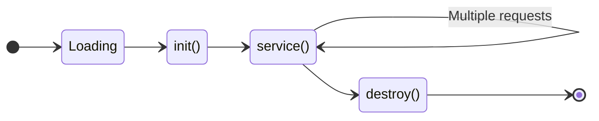
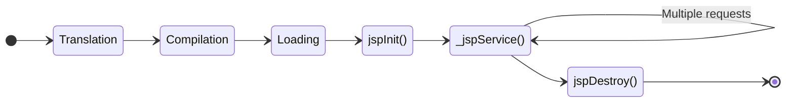
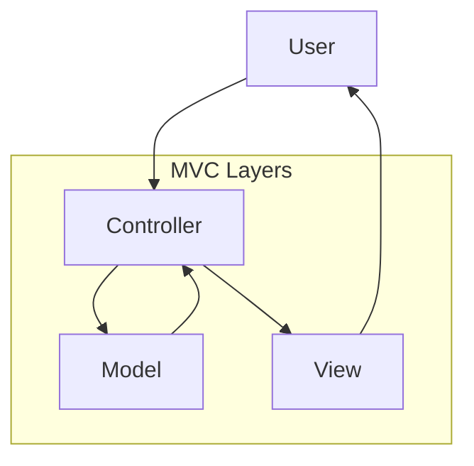

## Question 1(a) [3 marks]

**Explain the difference between AWT and Swing.**

**Answer**:

| Feature | AWT | Swing |
|---------|-----|-------|
| **Platform** | Platform dependent | Platform independent |
| **Components** | Heavy weight | Light weight |
| **Look & Feel** | Native OS look | Pluggable look & feel |
| **Performance** | Faster | Slower than AWT |

**Key Points:**

- **Heavy vs Light**: AWT uses native OS components, Swing uses pure Java
- **Appearance**: AWT follows OS style, Swing offers consistent look across platforms
- **Features**: Swing provides more advanced components like JTable, JTree

**Mnemonic:** "Swing Provides Lightweight Components"

---

## Question 1(b) [4 marks]

**Explain Mouse Motion Listener with example.**

**Answer**:

MouseMotionListener interface handles mouse movement events in Java Swing applications.

**Table: Mouse Motion Events**

| Method | Purpose |
|--------|---------|
| **mouseDragged()** | Called when mouse is dragged |
| **mouseMoved()** | Called when mouse is moved |

**Code Example:**

```java
import javax.swing.*;
import java.awt.event.*;

class MouseMotionExample extends JFrame implements MouseMotionListener {
    JLabel label;
    
    MouseMotionExample() {
        label = new JLabel("Move mouse here");
        add(label);
        addMouseMotionListener(this);
        setSize(400, 300);
        setVisible(true);
    }
    
    public void mouseMoved(MouseEvent e) {
        label.setText("Mouse at: " + e.getX() + ", " + e.getY());
    }
    
    public void mouseDragged(MouseEvent e) {
        label.setText("Dragging at: " + e.getX() + ", " + e.getY());
    }
}
```

**Mnemonic:** "Mouse Motion Makes Dynamic"

---

## Question 1(c) [7 marks]

**Develop a program to create checkboxes for different courses belonging to a university such that the course selected would be displayed.**

**Answer**:

```java
import javax.swing.*;
import java.awt.*;
import java.awt.event.*;

public class CourseSelection extends JFrame implements ItemListener {
    JCheckBox java, python, cpp, web;
    JTextArea display;
    
    public CourseSelection() {
        setTitle("University Course Selection");
        setLayout(new FlowLayout());
        
        // Create checkboxes
        java = new JCheckBox("Java Programming");
        python = new JCheckBox("Python Programming");
        cpp = new JCheckBox("C++ Programming");
        web = new JCheckBox("Web Development");
        
        // Add listeners
        java.addItemListener(this);
        python.addItemListener(this);
        cpp.addItemListener(this);
        web.addItemListener(this);
        
        // Display area
        display = new JTextArea(10, 30);
        display.setEditable(false);
        
        // Add components
        add(new JLabel("Select Courses:"));
        add(java); add(python); add(cpp); add(web);
        add(new JScrollPane(display));
        
        setSize(400, 300);
        setDefaultCloseOperation(JFrame.EXIT_ON_CLOSE);
        setVisible(true);
    }
    
    public void itemStateChanged(ItemEvent e) {
        String courses = "Selected Courses:\n";
        if(java.isSelected()) courses += "- Java Programming\n";
        if(python.isSelected()) courses += "- Python Programming\n";
        if(cpp.isSelected()) courses += "- C++ Programming\n";
        if(web.isSelected()) courses += "- Web Development\n";
        display.setText(courses);
    }
    
    public static void main(String[] args) {
        new CourseSelection();
    }
}
```

**Key Features:**

- **ItemListener**: Detects checkbox state changes
- **Dynamic Display**: Updates selected courses in real-time
- **Multiple Selection**: Allows selecting multiple courses

**Mnemonic:** "Check Items Listen Dynamically"

---

## Question 1(c) OR [7 marks]

**Develop a program to Implement Traffic signal (Red, Green and Yellow) by using Swing components (Using JFrame, JRadioButton, ItemListener etc.)**

**Answer**:

```java
import javax.swing.*;
import java.awt.*;
import java.awt.event.*;

public class TrafficSignal extends JFrame implements ItemListener {
    JRadioButton red, green, yellow;
    ButtonGroup group;
    JPanel signalPanel;
    
    public TrafficSignal() {
        setTitle("Traffic Signal Simulator");
        setLayout(new BorderLayout());
        
        // Create radio buttons
        red = new JRadioButton("Red");
        green = new JRadioButton("Green"); 
        yellow = new JRadioButton("Yellow");
        
        // Group radio buttons
        group = new ButtonGroup();
        group.add(red); group.add(green); group.add(yellow);
        
        // Add listeners
        red.addItemListener(this);
        green.addItemListener(this);
        yellow.addItemListener(this);
        
        // Signal display panel
        signalPanel = new JPanel() {
            public void paintComponent(Graphics g) {
                super.paintComponent(g);
                g.setColor(Color.BLACK);
                g.fillRect(50, 50, 100, 200);
                
                // Draw circles
                g.setColor(red.isSelected() ? Color.RED : Color.GRAY);
                g.fillOval(65, 65, 70, 70);
                
                g.setColor(yellow.isSelected() ? Color.YELLOW : Color.GRAY);
                g.fillOval(65, 105, 70, 70);
                
                g.setColor(green.isSelected() ? Color.GREEN : Color.GRAY);
                g.fillOval(65, 145, 70, 70);
            }
        };
        
        JPanel controlPanel = new JPanel();
        controlPanel.add(red); controlPanel.add(yellow); controlPanel.add(green);
        
        add(controlPanel, BorderLayout.SOUTH);
        add(signalPanel, BorderLayout.CENTER);
        
        setSize(300, 400);
        setDefaultCloseOperation(JFrame.EXIT_ON_CLOSE);
        setVisible(true);
    }
    
    public void itemStateChanged(ItemEvent e) {
        signalPanel.repaint();
    }
    
    public static void main(String[] args) {
        new TrafficSignal();
    }
}
```

**Diagram:**

```goat
+----------------+
|  Traffic Box   |
|   ┌─────────┐  |
|   │   RED   │  |
|   ├─────────┤  |
|   │ YELLOW  │  |
|   ├─────────┤  |
|   │  GREEN  │  |
|   └─────────┘  |
+----------------+
  [R] [Y] [G]
```

**Mnemonic:** "Radio Buttons Paint Graphics"

---

## Question 2(a) [3 marks]

**Explain JDBC type-4 driver.**

**Answer**:

**JDBC Type-4 Driver (Native Protocol Driver)**

| Feature | Description |
|---------|-------------|
| **Type** | Pure Java driver |
| **Communication** | Direct database protocol |
| **Platform** | Platform independent |
| **Performance** | Highest performance |

**Key Points:**

- **Pure Java**: No native code required
- **Direct Connection**: Communicates directly with database
- **Network Protocol**: Uses database's native network protocol
- **Best Performance**: Fastest among all driver types

**Mnemonic:** "Pure Java Direct Protocol"

---

## Question 2(b) [4 marks]

**Explain Commonly used Methods of Component class.**

**Answer**:

**Table: Component Class Methods**

| Method | Purpose |
|--------|---------|
| **add()** | Adds component to container |
| **setSize()** | Sets component dimensions |
| **setLayout()** | Sets layout manager |
| **setVisible()** | Makes component visible/invisible |
| **setBounds()** | Sets position and size |
| **getSize()** | Returns component size |

**Key Features:**

- **Layout Management**: Controls component arrangement
- **Visibility Control**: Shows/hides components
- **Size Management**: Controls component dimensions
- **Container Operations**: Manages child components

**Mnemonic:** "Add Set Get Visibility"

---

## Question 2(c) [7 marks]

**Develop a program using JDBC to display student's record (Enroll No, Name, Address, Mobile No and Email-ID) from table 'StuRec'.**

**Answer**:

```java
import java.sql.*;
import javax.swing.*;
import javax.swing.table.DefaultTableModel;

public class StudentRecordDisplay extends JFrame {
    JTable table;
    DefaultTableModel model;
    
    public StudentRecordDisplay() {
        setTitle("Student Records");
        
        // Create table model
        String[] columns = {"Enroll No", "Name", "Address", "Mobile", "Email"};
        model = new DefaultTableModel(columns, 0);
        table = new JTable(model);
        
        // Load data
        loadStudentData();
        
        add(new JScrollPane(table));
        setSize(600, 400);
        setDefaultCloseOperation(JFrame.EXIT_ON_CLOSE);
        setVisible(true);
    }
    
    private void loadStudentData() {
        try {
            // Database connection
            Class.forName("com.mysql.cj.jdbc.Driver");
            Connection con = DriverManager.getConnection(
                "jdbc:mysql://localhost:3306/university", "root", "password");
            
            // Execute query
            Statement stmt = con.createStatement();
            ResultSet rs = stmt.executeQuery("SELECT * FROM StuRec");
            
            // Add data to table
            while(rs.next()) {
                String[] row = {
                    rs.getString("enrollno"),
                    rs.getString("name"),
                    rs.getString("address"),
                    rs.getString("mobile"),
                    rs.getString("email")
                };
                model.addRow(row);
            }
            
            con.close();
        } catch(Exception e) {
            JOptionPane.showMessageDialog(this, "Error: " + e.getMessage());
        }
    }
    
    public static void main(String[] args) {
        new StudentRecordDisplay();
    }
}
```

**Database Table Structure:**

```sql
CREATE TABLE StuRec (
    enrollno VARCHAR(20) PRIMARY KEY,
    name VARCHAR(50),
    address VARCHAR(100),
    mobile VARCHAR(15),
    email VARCHAR(50)
);
```

**Mnemonic:** "Connect Query Display Records"

---

## Question 2(a) OR [3 marks]

**Write down the advantages and disadvantages of JDBC.**

**Answer**:

**Table: JDBC Advantages and Disadvantages**

| Advantages | Disadvantages |
|------------|---------------|
| **Platform Independent** | **Performance Overhead** |
| **Database Independent** | **Complex for beginners** |
| **Standard API** | **SQL dependency** |
| **Supports transactions** | **Manual resource management** |

**Key Points:**

- **Portability**: Works across different platforms and databases
- **Standardization**: Uniform API for database operations
- **Performance**: Additional layer causes overhead
- **Complexity**: Requires proper resource management

**Mnemonic:** "Platform Independent Standard Complex"

---

## Question 2(b) OR [4 marks]

**Explain Border Layout.**

**Answer**:

BorderLayout divides container into five regions: North, South, East, West, and Center.

**Diagram:**

```goat
+------------------+
|      NORTH       |
+-----+------+-----+
|WEST |CENTER| EAST|
+-----+------+-----+
|      SOUTH       |
+------------------+
```

**Table: Border Layout Regions**

| Region | Position | Behavior |
|--------|----------|----------|
| **NORTH** | Top | Preferred height, full width |
| **SOUTH** | Bottom | Preferred height, full width |
| **EAST** | Right | Preferred width, full height |
| **WEST** | Left | Preferred width, full height |
| **CENTER** | Middle | Takes remaining space |

**Code Example:**

```java
setLayout(new BorderLayout());
add(new JButton("North"), BorderLayout.NORTH);
add(new JButton("Center"), BorderLayout.CENTER);
```

**Mnemonic:** "North South East West Center"

---

## Question 2(c) OR [7 marks]

**Develop an application to store, update, fetch and delete data of Employee (NAME, AGE, SALARY and DEPARTMENT) using Hibernate CRUD operations.**

**Answer**:

**Employee Entity Class:**

```java
import javax.persistence.*;

@Entity
@Table(name = "employees")
public class Employee {
    @Id
    @GeneratedValue(strategy = GenerationType.IDENTITY)
    private int id;
    
    private String name;
    private int age;
    private double salary;
    private String department;
    
    // Constructors, getters, setters
    public Employee() {}
    
    public Employee(String name, int age, double salary, String dept) {
        this.name = name;
        this.age = age;
        this.salary = salary;
        this.department = dept;
    }
    
    // Getters and Setters
    public int getId() { return id; }
    public void setId(int id) { this.id = id; }
    
    public String getName() { return name; }
    public void setName(String name) { this.name = name; }
    
    // ... other getters/setters
}
```

**CRUD Operations Class:**

```java
import org.hibernate.*;
import org.hibernate.cfg.Configuration;

public class EmployeeCRUD {
    private SessionFactory factory;
    
    public EmployeeCRUD() {
        factory = new Configuration()
                    .configure("hibernate.cfg.xml")
                    .addAnnotatedClass(Employee.class)
                    .buildSessionFactory();
    }
    
    // CREATE
    public void saveEmployee(Employee emp) {
        Session session = factory.openSession();
        Transaction tx = session.beginTransaction();
        session.save(emp);
        tx.commit();
        session.close();
    }
    
    // READ
    public Employee getEmployee(int id) {
        Session session = factory.openSession();
        Employee emp = session.get(Employee.class, id);
        session.close();
        return emp;
    }
    
    // UPDATE
    public void updateEmployee(Employee emp) {
        Session session = factory.openSession();
        Transaction tx = session.beginTransaction();
        session.update(emp);
        tx.commit();
        session.close();
    }
    
    // DELETE
    public void deleteEmployee(int id) {
        Session session = factory.openSession();
        Transaction tx = session.beginTransaction();
        Employee emp = session.get(Employee.class, id);
        session.delete(emp);
        tx.commit();
        session.close();
    }
}
```

**Mnemonic:** "Save Get Update Delete Hibernate"

---

## Question 3(a) [3 marks]

**Explain Deployment Descriptor.**

**Answer**:

Deployment Descriptor (web.xml) is configuration file for web applications containing servlet mappings, initialization parameters, and security settings.

**Table: Deployment Descriptor Elements**

| Element | Purpose |
|---------|---------|
| **\<servlet\>** | Defines servlet configuration |
| **\<servlet-mapping\>** | Maps servlet to URL pattern |
| **\<init-param\>** | Sets initialization parameters |
| **\<welcome-file-list\>** | Default files to serve |

**Key Features:**

- **Configuration**: Central configuration for web app
- **Servlet Mapping**: URL to servlet mapping
- **Parameters**: Initialization and context parameters
- **Security**: Authentication and authorization settings

**Mnemonic:** "Web XML Configuration Mapping"

---

## Question 3(b) [4 marks]

**Explain the difference between get and post method in servlet.**

**Answer**:

**Table: GET vs POST Methods**

| Feature | GET | POST |
|---------|-----|------|
| **Data Location** | URL query string | Request body |
| **Data Size** | Limited (2048 chars) | Unlimited |
| **Security** | Less secure (visible) | More secure |
| **Caching** | Can be cached | Not cached |
| **Bookmarking** | Can bookmark | Cannot bookmark |
| **Purpose** | Retrieve data | Submit/modify data |

**Key Points:**

- **Visibility**: GET data visible in URL, POST hidden
- **Capacity**: POST can handle large data
- **Security**: POST better for sensitive data
- **Usage**: GET for fetching, POST for form submission

**Mnemonic:** "GET Visible Limited, POST Hidden Unlimited"

---

## Question 3(c) [7 marks]

**Develop a simple servlet program which maintains a counter for the number of times it has been accessed since its loading; initialize the counter using deployment descriptor.**

**Answer**:

**Servlet Code:**

```java
import java.io.*;
import javax.servlet.*;
import javax.servlet.http.*;

public class CounterServlet extends HttpServlet {
    private int counter;
    
    public void init() throws ServletException {
        String initialValue = getInitParameter("initialCount");
        counter = Integer.parseInt(initialValue);
    }
    
    protected void doGet(HttpServletRequest request, 
                        HttpServletResponse response) 
                        throws ServletException, IOException {
        
        response.setContentType("text/html");
        PrintWriter out = response.getWriter();
        
        synchronized(this) {
            counter++;
        }
        
        out.println("<html><body>");
        out.println("<h2>Page Access Counter</h2>");
        out.println("<p>This page has been accessed " + counter + " times</p>");
        out.println("<p><a href='CounterServlet'>Refresh</a></p>");
        out.println("</body></html>");
        
        out.close();
    }
}
```

**web.xml Configuration:**

```xml
<?xml version="1.0" encoding="UTF-8"?>
<web-app>
    <servlet>
        <servlet-name>CounterServlet</servlet-name>
        <servlet-class>CounterServlet</servlet-class>
        <init-param>
            <param-name>initialCount</param-name>
            <param-value>0</param-value>
        </init-param>
        <load-on-startup>1</load-on-startup>
    </servlet>
    
    <servlet-mapping>
        <servlet-name>CounterServlet</servlet-name>
        <url-pattern>/counter</url-pattern>
    </servlet-mapping>
</web-app>
```

**Key Features:**

- **Thread Safety**: Synchronized counter increment
- **Initialization**: Counter initialized from web.xml
- **Persistent**: Counter maintained across requests
- **Configuration**: Deployment descriptor setup

**Mnemonic:** "Initialize Synchronize Count Display"

---

## Question 3(a) OR [3 marks]

**Explain the life cycle of a servlet.**

**Answer**:

**Servlet Life Cycle Diagram:**



**Table: Servlet Life Cycle Methods**

| Method | Purpose | Called |
|--------|---------|--------|
| **init()** | Initialize servlet | Once at startup |
| **service()** | Handle requests | For each request |
| **destroy()** | Cleanup resources | Once at shutdown |

**Key Points:**

- **Initialization**: Called once when servlet loads
- **Service**: Handles all client requests
- **Cleanup**: Called before servlet unloads
- **Container Managed**: Web container controls lifecycle

**Mnemonic:** "Initialize Service Destroy"

---

## Question 3(b) OR [4 marks]

**Explain Servlet Config class with suitable example.**

**Answer**:

ServletConfig provides servlet-specific configuration information and initialization parameters.

**Table: ServletConfig Methods**

| Method | Purpose |
|--------|---------|
| **getInitParameter()** | Gets init parameter value |
| **getInitParameterNames()** | Gets all parameter names |
| **getServletContext()** | Gets servlet context |
| **getServletName()** | Gets servlet name |

**Example:**

```java
public class ConfigServlet extends HttpServlet {
    String databaseURL, username;
    
    public void init() throws ServletException {
        ServletConfig config = getServletConfig();
        databaseURL = config.getInitParameter("dbURL");
        username = config.getInitParameter("dbUser");
    }
    
    protected void doGet(HttpServletRequest request, 
                        HttpServletResponse response) 
                        throws ServletException, IOException {
        
        PrintWriter out = response.getWriter();
        out.println("Database URL: " + databaseURL);
        out.println("Username: " + username);
    }
}
```

**web.xml:**

```xml
<servlet>
    <servlet-name>ConfigServlet</servlet-name>
    <servlet-class>ConfigServlet</servlet-class>
    <init-param>
        <param-name>dbURL</param-name>
        <param-value>jdbc:mysql://localhost:3306/test</param-value>
    </init-param>
    <init-param>
        <param-name>dbUser</param-name>
        <param-value>root</param-value>
    </init-param>
</servlet>
```

**Mnemonic:** "Config Gets Parameters Context"

---

## Question 3(c) OR [7 marks]

**Develop a simple program, when user select the subject code, name of the subject will be displayed using servlet and mysql database.**

**Answer**:

**HTML Form (index.html):**

```html
<!DOCTYPE html>
<html>
<head>
    <title>Subject Selection</title>
</head>
<body>
    <h2>Select Subject Code</h2>
    <form action="SubjectServlet" method="get">
        <select name="subjectCode">
            <option value="">Select Subject</option>
            <option value="4351603">4351603</option>
            <option value="4351604">4351604</option>
            <option value="4351605">4351605</option>
        </select>
        <input type="submit" value="Get Subject Name">
    </form>
</body>
</html>
```

**Servlet Code:**

```java
import java.io.*;
import java.sql.*;
import javax.servlet.*;
import javax.servlet.http.*;

public class SubjectServlet extends HttpServlet {
    
    protected void doGet(HttpServletRequest request, 
                        HttpServletResponse response) 
                        throws ServletException, IOException {
        
        response.setContentType("text/html");
        PrintWriter out = response.getWriter();
        
        String subjectCode = request.getParameter("subjectCode");
        String subjectName = "";
        
        if(subjectCode != null && !subjectCode.equals("")) {
            try {
                Class.forName("com.mysql.cj.jdbc.Driver");
                Connection con = DriverManager.getConnection(
                    "jdbc:mysql://localhost:3306/university", "root", "password");
                
                PreparedStatement ps = con.prepareStatement(
                    "SELECT subject_name FROM subjects WHERE subject_code = ?");
                ps.setString(1, subjectCode);
                
                ResultSet rs = ps.executeQuery();
                if(rs.next()) {
                    subjectName = rs.getString("subject_name");
                }
                
                con.close();
            } catch(Exception e) {
                subjectName = "Error: " + e.getMessage();
            }
        }
        
        out.println("<html><body>");
        out.println("<h2>Subject Information</h2>");
        if(!subjectName.equals("")) {
            out.println("<p>Subject Code: " + subjectCode + "</p>");
            out.println("<p>Subject Name: " + subjectName + "</p>");
        } else {
            out.println("<p>Please select a subject code</p>");
        }
        out.println("<p><a href='index.html'>Back</a></p>");
        out.println("</body></html>");
    }
}
```

**Database Table:**

```sql
CREATE TABLE subjects (
    subject_code VARCHAR(10) PRIMARY KEY,
    subject_name VARCHAR(100)
);

INSERT INTO subjects VALUES 
('4351603', 'Advanced Java Programming'),
('4351604', 'Web Technology'),
('4351605', 'Database Management System');
```

**Mnemonic:** "Select Query Display Subject"

---

## Question 4(a) [3 marks]

**Explain JSP life cycle.**

**Answer**:

**JSP Life Cycle Diagram:**



**Table: JSP Life Cycle Phases**

| Phase | Description |
|-------|-------------|
| **Translation** | JSP to Servlet conversion |
| **Compilation** | Servlet to bytecode |
| **Loading** | Load servlet class |
| **Initialization** | jspInit() called |
| **Request Processing** | _jspService() handles requests |
| **Destruction** | jspDestroy() cleanup |

**Mnemonic:** "Translate Compile Load Initialize Service Destroy"

---

## Question 4(b) [4 marks]

**Compare JSP and Servlet.**

**Answer**:

**Table: JSP vs Servlet Comparison**

| Feature | JSP | Servlet |
|---------|-----|---------|
| **Code Type** | HTML with Java code | Pure Java code |
| **Development** | Easier for web designers | Better for Java developers |
| **Compilation** | Automatic | Manual |
| **Modification** | No restart needed | Restart required |
| **Performance** | Slower first request | Faster |
| **Maintenance** | Easier | More complex |

**Key Points:**

- **Ease of Use**: JSP easier for presentation layer
- **Performance**: Servlet better for business logic
- **Flexibility**: JSP better for dynamic content
- **Control**: Servlet provides more control

**Mnemonic:** "JSP Easy HTML, Servlet Pure Java"

---

## Question 4(c) [7 marks]

**Develop a JSP web application to display student monthly attendance in each subject of current semester via enrolment number.**

**Answer**:

**Input Form (attendance.html):**

```html
<!DOCTYPE html>
<html>
<head>
    <title>Student Attendance</title>
</head>
<body>
    <h2>Check Student Attendance</h2>
    <form action="attendanceCheck.jsp" method="post">
        <table>
            <tr>
                <td>Enrollment Number:</td>
                <td><input type="text" name="enrollNo" required></td>
            </tr>
            <tr>
                <td>Month:</td>
                <td>
                    <select name="month" required>
                        <option value="">Select Month</option>
                        <option value="January">January</option>
                        <option value="February">February</option>
                        <option value="March">March</option>
                    </select>
                </td>
            </tr>
            <tr>
                <td colspan="2">
                    <input type="submit" value="Check Attendance">
                </td>
            </tr>
        </table>
    </form>
</body>
</html>
```

**JSP Page (attendanceCheck.jsp):**

```jsp
<%@ page import="java.sql.*" %>
<%@ page contentType="text/html;charset=UTF-8" %>

<html>
<head>
    <title>Attendance Report</title>
    <style>
        table { border-collapse: collapse; width: 100%; }
        th, td { border: 1px solid black; padding: 8px; text-align: center; }
        th { background-color: #f2f2f2; }
    </style>
</head>
<body>
    <h2>Monthly Attendance Report</h2>
    
    <%
        String enrollNo = request.getParameter("enrollNo");
        String month = request.getParameter("month");
        
        if(enrollNo != null && month != null) {
            try {
                Class.forName("com.mysql.cj.jdbc.Driver");
                Connection con = DriverManager.getConnection(
                    "jdbc:mysql://localhost:3306/university", "root", "password");
                
                // Get student info
                PreparedStatement ps1 = con.prepareStatement(
                    "SELECT name FROM students WHERE enroll_no = ?");
                ps1.setString(1, enrollNo);
                ResultSet rs1 = ps1.executeQuery();
                
                String studentName = "";
                if(rs1.next()) {
                    studentName = rs1.getString("name");
                }
                
                out.println("<p><strong>Student:</strong> " + studentName + 
                           " (" + enrollNo + ")</p>");
                out.println("<p><strong>Month:</strong> " + month + "</p>");
                
                // Get attendance data
                PreparedStatement ps2 = con.prepareStatement(
                    "SELECT s.subject_name, a.total_classes, a.attended_classes, " +
                    "ROUND((a.attended_classes/a.total_classes)*100, 2) as percentage " +
                    "FROM attendance a JOIN subjects s ON a.subject_code = s.subject_code " +
                    "WHERE a.enroll_no = ? AND a.month = ?");
                ps2.setString(1, enrollNo);
                ps2.setString(2, month);
                ResultSet rs2 = ps2.executeQuery();
                
                out.println("<table>");
                out.println("<tr><th>Subject</th><th>Total Classes</th>" +
                           "<th>Attended</th><th>Percentage</th><th>Status</th></tr>");
                
                while(rs2.next()) {
                    String subjectName = rs2.getString("subject_name");
                    int totalClasses = rs2.getInt("total_classes");
                    int attendedClasses = rs2.getInt("attended_classes");
                    double percentage = rs2.getDouble("percentage");
                    String status = percentage >= 75 ? "Good" : "Poor";
                    String rowColor = percentage >= 75 ? "lightgreen" : "lightcoral";
                    
                    out.println("<tr style='background-color:" + rowColor + "'>");
                    out.println("<td>" + subjectName + "</td>");
                    out.println("<td>" + totalClasses + "</td>");
                    out.println("<td>" + attendedClasses + "</td>");
                    out.println("<td>" + percentage + "%</td>");
                    out.println("<td>" + status + "</td>");
                    out.println("</tr>");
                }
                
                out.println("</table>");
                con.close();
                
            } catch(Exception e) {
                out.println("<p style='color:red'>Error: " + e.getMessage() + "</p>");
            }
        }
    %>
    
    <br>
    <a href="attendance.html">Check Another Student</a>
</body>
</html>
```

**Database Tables:**

```sql
CREATE TABLE students (
    enroll_no VARCHAR(20) PRIMARY KEY,
    name VARCHAR(50)
);

CREATE TABLE subjects (
    subject_code VARCHAR(10) PRIMARY KEY,
    subject_name VARCHAR(100)
);

CREATE TABLE attendance (
    id INT AUTO_INCREMENT PRIMARY KEY,
    enroll_no VARCHAR(20),
    subject_code VARCHAR(10),
    month VARCHAR(15),
    total_classes INT,
    attended_classes INT,
    FOREIGN KEY (enroll_no) REFERENCES students(enroll_no),
    FOREIGN KEY (subject_code) REFERENCES subjects(subject_code)
);
```

**Mnemonic:** "JSP Database Query Display Table"

---

## Question 4(a) OR [3 marks]

**Explain implicit objects in JSP.**

**Answer**:

**Table: JSP Implicit Objects**

| Object | Type | Purpose |
|--------|------|---------|
| **request** | HttpServletRequest | Gets request data |
| **response** | HttpServletResponse | Sends response |
| **out** | JspWriter | Output to client |
| **session** | HttpSession | Session management |
| **application** | ServletContext | Application scope |
| **config** | ServletConfig | Servlet configuration |
| **pageContext** | PageContext | Page scope access |
| **page** | Object | Current servlet instance |
| **exception** | Throwable | Error page exception |

**Key Features:**

- **Automatic**: Available without declaration
- **Scope Access**: Different scope levels
- **Request Handling**: Input/output operations
- **Session Management**: User session tracking

**Mnemonic:** "Request Response Out Session Application"

---

## Question 4(b) OR [4 marks]

**Explain why JSP is preferred over servlet.**

**Answer**:

**Table: JSP Advantages over Servlet**

| Aspect | JSP Advantage |
|--------|---------------|
| **Development** | Easier HTML integration |
| **Maintenance** | Separates presentation from logic |
| **Compilation** | Automatic compilation |
| **Modification** | No server restart needed |
| **Design** | Web designer friendly |
| **Code Reuse** | Tag libraries and custom tags |

**Key Points:**

- **Separation of Concerns**: Clear separation of presentation and business logic
- **Rapid Development**: Faster development cycle
- **Designer Friendly**: Web designers can work with HTML-like syntax
- **Automatic Features**: Container handles compilation and lifecycle

**Mnemonic:** "Easy HTML Automatic Designer Friendly"

---

## Question 4(c) OR [7 marks]

**Develop a JSP program to display the grade of a student by accepting the marks of five subjects.**

**Answer**:

**Input Form (gradeInput.html):**

```html
<!DOCTYPE html>
<html>
<head>
    <title>Student Grade Calculator</title>
    <style>
        table { margin: auto; border-collapse: collapse; }
        td { padding: 10px; }
        input[type="number"] { width: 100px; }
        input[type="submit"] { padding: 10px 20px; }
    </style>
</head>
<body>
    <h2 style="text-align: center;">Student Grade Calculator</h2>
    <form action="gradeCalculator.jsp" method="post">
        <table border="1">
            <tr>
                <td>Student Name:</td>
                <td><input type="text" name="studentName" required></td>
            </tr>
            <tr>
                <td>Subject 1 Marks:</td>
                <td><input type="number" name="marks1" min="0" max="100" required></td>
            </tr>
            <tr>
                <td>Subject 2 Marks:</td>
                <td><input type="number" name="marks2" min="0" max="100" required></td>
            </tr>
            <tr>
                <td>Subject 3 Marks:</td>
                <td><input type="number" name="marks3" min="0" max="100" required></td>
            </tr>
            <tr>
                <td>Subject 4 Marks:</td>
                <td><input type="number" name="marks4" min="0" max="100" required></td>
            </tr>
            <tr>
                <td>Subject 5 Marks:</td>
                <td><input type="number" name="marks5" min="0" max="100" required></td>
            </tr>
            <tr>
                <td colspan="2" style="text-align: center;">
                    <input type="submit" value="Calculate Grade">
                </td>
            </tr>
        </table>
    </form>
</body>
</html>
```

**JSP Grade Calculator (gradeCalculator.jsp):**

```jsp
<%@ page contentType="text/html;charset=UTF-8" %>

<html>
<head>
    <title>Grade Result</title>
    <style>
        .result-table { 
            margin: auto; 
            border-collapse: collapse; 
            margin-top: 20px;
        }
        .result-table th, .result-table td { 
            border: 1px solid black; 
            padding: 10px; 
            text-align: center; 
        }
        .result-table th { background-color: #f2f2f2; }
        .grade-A { background-color: #90EE90; }
        .grade-B { background-color: #87CEEB; }
        .grade-C { background-color: #F0E68C; }
        .grade-D { background-color: #FFA07A; }
        .grade-F { background-color: #FFB6C1; }
    </style>
</head>
<body>
    <h2 style="text-align: center;">Grade Report</h2>
    
    <%
        String studentName = request.getParameter("studentName");
        
        // Get marks
        int marks1 = Integer.parseInt(request.getParameter("marks1"));
        int marks2 = Integer.parseInt(request.getParameter("marks2"));
        int marks3 = Integer.parseInt(request.getParameter("marks3"));
        int marks4 = Integer.parseInt(request.getParameter("marks4"));
        int marks5 = Integer.parseInt(request.getParameter("marks5"));
        
        // Calculate total and percentage
        int totalMarks = marks1 + marks2 + marks3 + marks4 + marks5;
        double percentage = totalMarks / 5.0;
        
        // Determine grade
        String grade;
        String gradeClass;
        if(percentage >= 90) {
            grade = "A+";
            gradeClass = "grade-A";
        } else if(percentage >= 80) {
            grade = "A";
            gradeClass = "grade-A";
        } else if(percentage >= 70) {
            grade = "B";
            gradeClass = "grade-B";
        } else if(percentage >= 60) {
            grade = "C";
            gradeClass = "grade-C";
        } else if(percentage >= 50) {
            grade = "D";
            gradeClass = "grade-D";
        } else {
            grade = "F";
            gradeClass = "grade-F";
        }
        
        // Determine result
        String result = percentage >= 50 ? "PASS" : "FAIL";
    %>
    
    <table class="result-table">
        <tr>
            <th colspan="2">Student Information</th>
        </tr>
        <tr>
            <td><strong>Name:</strong></td>
            <td><%= studentName %></td>
        </tr>
        <tr>
            <th colspan="2">Subject-wise Marks</th>
        </tr>
        <tr>
            <td>Subject 1</td>
            <td><%= marks1 %></td>
        </tr>
        <tr>
            <td>Subject 2</td>
            <td><%= marks2 %></td>
        </tr>
        <tr>
            <td>Subject 3</td>
            <td><%= marks3 %></td>
        </tr>
        <tr>
            <td>Subject 4</td>
            <td><%= marks4 %></td>
        </tr>
        <tr>
            <td>Subject 5</td>
            <td><%= marks5 %></td>
        </tr>
        <tr>
            <th colspan="2">Result Summary</th>
        </tr>
        <tr>
            <td><strong>Total Marks:</strong></td>
            <td><%= totalMarks %> / 500</td>
        </tr>
        <tr>
            <td><strong>Percentage:</strong></td>
            <td><%= String.format("%.2f", percentage) %>%</td>
        </tr>
        <tr class="<%= gradeClass %>">
            <td><strong>Grade:</strong></td>
            <td><%= grade %></td>
        </tr>
        <tr>
            <td><strong>Result:</strong></td>
            <td><%= result %></td>
        </tr>
    </table>
    
    <div style="text-align: center; margin-top: 20px;">
        <a href="gradeInput.html">Calculate Another Grade</a>
    </div>
</body>
</html>
```

**Grade Scale Table:**

| Percentage | Grade | Description |
|------------|-------|-------------|
| **90-100** | A+ | Excellent |
| **80-89** | A | Very Good |
| **70-79** | B | Good |
| **60-69** | C | Average |
| **50-59** | D | Below Average |
| **0-49** | F | Fail |

**Mnemonic:** "Calculate Total Percentage Grade Result"

---

## Question 5(a) [3 marks]

**Explain Aspect-oriented programming (AOP).**

**Answer**:

AOP is programming paradigm that separates cross-cutting concerns from business logic using aspects.

**Table: AOP Core Concepts**

| Concept | Description |
|---------|-------------|
| **Aspect** | Module encapsulating cross-cutting concern |
| **Join Point** | Point in program execution |
| **Pointcut** | Set of join points |
| **Advice** | Action taken at join point |
| **Weaving** | Process of applying aspects |

**Key Benefits:**

- **Separation**: Separates business logic from system services
- **Modularity**: Improves code modularity
- **Reusability**: Cross-cutting concerns are reusable
- **Maintenance**: Easier to maintain and modify

**Mnemonic:** "Aspect Join Pointcut Advice Weaving"

---

## Question 5(b) [4 marks]

**List various features of Servlet.**

**Answer**:

**Table: Servlet Features**

| Feature | Description |
|---------|-------------|
| **Platform Independent** | Runs on any server supporting Java |
| **Server Independent** | Works with different web servers |
| **Protocol Independent** | Supports HTTP, HTTPS, FTP |
| **Persistent** | Remains in memory between requests |
| **Robust** | Strong memory management |
| **Secure** | Built-in security features |
| **Portable** | Write once, run anywhere |
| **Powerful** | Full Java API access |

**Key Points:**

- **Performance**: Better performance than CGI
- **Memory Management**: Efficient memory usage
- **Multithreading**: Handles multiple requests simultaneously
- **Extensible**: Can be extended for specific protocols

**Mnemonic:** "Platform Server Protocol Persistent Robust"

---

## Question 5(c) [7 marks]

**Explain Model layer, View layer and Controller layer in details.**

**Answer**:

**MVC Architecture Diagram:**



**Table: MVC Layer Details**

| Layer | Responsibility | Components | Purpose |
|-------|---------------|------------|---------|
| **Model** | Data and business logic | Entities, DAOs, Services | Data management |
| **View** | Presentation layer | JSP, HTML, CSS | User interface |
| **Controller** | Request handling | Servlets, Actions | Flow control |

**Model Layer Details:**

- **Data Access**: Database operations and data persistence
- **Business Logic**: Core application logic and rules
- **Validation**: Data validation and integrity checks
- **Entity Classes**: Java beans representing data structures

**Example Model:**

```java
public class Student {
    private String enrollNo;
    private String name;
    private double marks;
    
    // Business logic
    public String calculateGrade() {
        if(marks >= 90) return "A";
        else if(marks >= 80) return "B";
        else if(marks >= 70) return "C";
        else return "D";
    }
}
```

**View Layer Details:**

- **Presentation**: User interface rendering
- **Display Logic**: How data is presented to user
- **User Interaction**: Forms, buttons, navigation
- **Responsive Design**: Adapts to different devices

**Controller Layer Details:**

- **Request Handling**: Processes user requests
- **Flow Control**: Determines next view to display
- **Model Coordination**: Calls appropriate model methods
- **Response Generation**: Prepares response for user

**Example Controller:**

```java
@WebServlet("/student")
public class StudentController extends HttpServlet {
    protected void doGet(HttpServletRequest request, 
                        HttpServletResponse response) {
        String action = request.getParameter("action");
        
        if("view".equals(action)) {
            // Get data from model
            Student student = studentService.getStudent(enrollNo);
            // Set in request scope
            request.setAttribute("student", student);
            // Forward to view
            RequestDispatcher rd = request.getRequestDispatcher("student.jsp");
            rd.forward(request, response);
        }
    }
}
```

**Benefits of MVC:**

- **Separation of Concerns**: Clear responsibility division
- **Maintainability**: Easier to maintain and modify
- **Testability**: Each layer can be tested independently
- **Scalability**: Supports large application development
- **Team Development**: Multiple developers can work simultaneously

**Mnemonic:** "Model Data View Present Controller Handle"

---

## Question 5(a) OR [3 marks]

**Explain Features in Spring Boot.**

**Answer**:

**Table: Spring Boot Features**

| Feature | Description |
|---------|-------------|
| **Auto Configuration** | Automatic configuration based on dependencies |
| **Starter Dependencies** | Curated set of dependencies |
| **Embedded Servers** | Built-in Tomcat, Jetty servers |
| **Production Ready** | Health checks, metrics, monitoring |
| **No XML Configuration** | Annotation-based configuration |
| **Developer Tools** | Hot reloading, automatic restart |

**Key Benefits:**

- **Rapid Development**: Quick project setup and development
- **Convention over Configuration**: Sensible defaults
- **Microservices Ready**: Easy microservices development
- **Cloud Native**: Ready for cloud deployment

**Mnemonic:** "Auto Starter Embedded Production Annotation Developer"

---

## Question 5(b) OR [4 marks]

**Write Short note on JSP scripting elements.**

**Answer**:

**Table: JSP Scripting Elements**

| Element | Syntax | Purpose | Example |
|---------|--------|---------|---------|
| **Scriptlet** | `<% %>` | Java code execution | `<% int x = 10; %>` |
| **Expression** | `<%= %>` | Output value | `<%= x + 5 %>` |
| **Declaration** | `<%! %>` | Variable/method declaration | `<%! int count = 0; %>` |
| **Directive** | `<%@ %>` | Page configuration | `<%@ page import="java.util.*" %>` |
| **Comment** | `<%-- --%>` | JSP comments | `<%-- This is comment --%>` |

**Examples:**

```jsp
<%-- JSP Comment --%>
<%@ page contentType="text/html" %>

<%! 
    // Declaration - instance variable
    private int counter = 0;
    
    // Declaration - method
    public String getMessage() {
        return "Hello JSP!";
    }
%>

<html>
<body>
    <% 
        // Scriptlet - Java code
        String name = "Student";
        counter++;
    %>
    
    <h1><%= getMessage() %></h1>
    <p>Welcome <%= name %>!</p>
    <p>Page visited <%= counter %> times</p>
</body>
</html>
```

**Key Points:**

- **Scriptlet**: Contains Java statements
- **Expression**: Evaluates and outputs result
- **Declaration**: Creates instance variables/methods
- **Directive**: Provides page-level information

**Mnemonic:** "Script Express Declare Direct Comment"

---

## Question 5(c) OR [7 marks]

**Explain Dependency injection (DI) and Plain Old Java Object (POJO) in details.**

**Answer**:

**Dependency Injection (DI):**

Dependency Injection is design pattern where objects receive their dependencies from external source rather than creating them internally.

**Table: DI Types**

| Type | Description | Example |
|------|-------------|---------|
| **Constructor Injection** | Dependencies via constructor | `public Service(Repository repo)` |
| **Setter Injection** | Dependencies via setter methods | `setRepository(Repository repo)` |
| **Field Injection** | Direct field injection | `@Autowired Repository repo` |

**DI Example:**

```java
// Without DI - Tight coupling
public class StudentService {
    private StudentRepository repo = new StudentRepository(); // Hard dependency
    
    public Student getStudent(String id) {
        return repo.findById(id);
    }
}

// With DI - Loose coupling
public class StudentService {
    private StudentRepository repo;
    
    // Constructor injection
    public StudentService(StudentRepository repo) {
        this.repo = repo;
    }
    
    public Student getStudent(String id) {
        return repo.findById(id);
    }
}
```

**Spring DI Configuration:**

```java
@Service
public class StudentService {
    @Autowired
    private StudentRepository repository;
    
    public List<Student> getAllStudents() {
        return repository.findAll();
    }
}

@Repository
public class StudentRepository {
    public List<Student> findAll() {
        // Database operations
        return studentList;
    }
}
```

**Plain Old Java Object (POJO):**

POJO is simple Java object that doesn't inherit from any specific framework classes or implement specific interfaces.

**POJO Characteristics:**

- **No inheritance**: Doesn't extend framework classes
- **No interfaces**: Doesn't implement framework interfaces
- **No annotations**: Can work without framework annotations
- **Simple**: Contains only business logic and data

**POJO Example:**

```java
// This is a POJO
public class Student {
    private String enrollNo;
    private String name;
    private int age;
    private String course;
    
    // Default constructor
    public Student() {}
    
    // Parameterized constructor
    public Student(String enrollNo, String name, int age, String course) {
        this.enrollNo = enrollNo;
        this.name = name;
        this.age = age;
        this.course = course;
    }
    
    // Getters and Setters
    public String getEnrollNo() {
        return enrollNo;
    }
    
    public void setEnrollNo(String enrollNo) {
        this.enrollNo = enrollNo;
    }
    
    public String getName() {
        return name;
    }
    
    public void setName(String name) {
        this.name = name;
    }
    
    // Business methods
    public boolean isEligibleForExam() {
        return age >= 18;
    }
    
    public String getStudentInfo() {
        return "Student: " + name + " (" + enrollNo + "), Course: " + course;
    }
}
```

**Benefits of DI:**

- **Loose Coupling**: Reduces dependencies between classes
- **Testability**: Easy to inject mock objects for testing
- **Flexibility**: Easy to change implementations
- **Maintainability**: Easier to maintain and extend code

**Benefits of POJO:**

- **Simplicity**: Easy to understand and maintain
- **Testability**: Simple to unit test
- **Portability**: Can be used across different frameworks
- **Lightweight**: No framework overhead

**DI and POJO Together:**

```java
// POJO Entity
public class Student {
    private String name;
    private String email;
    // constructors, getters, setters
}

// Service with DI
@Service
public class StudentService {
    @Autowired
    private StudentRepository repository;
    
    public Student createStudent(String name, String email) {
        Student student = new Student(); // POJO creation
        student.setName(name);
        student.setEmail(email);
        return repository.save(student);
    }
}
```

**Mnemonic:** "DI Injects Dependencies, POJO Plain Objects"
