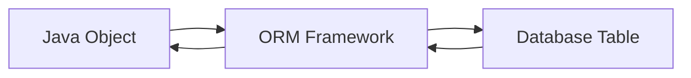
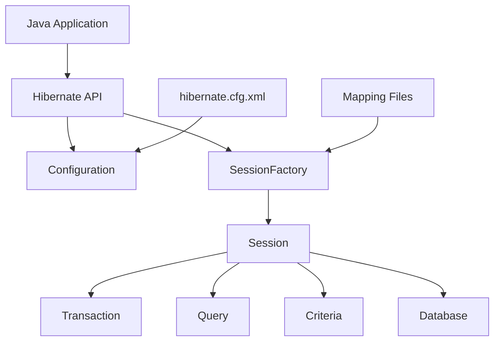
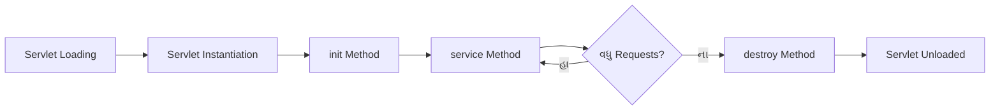
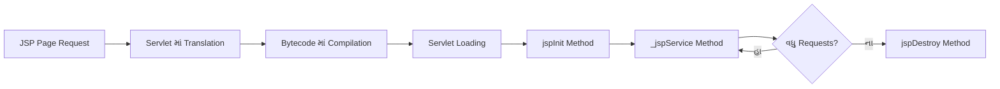
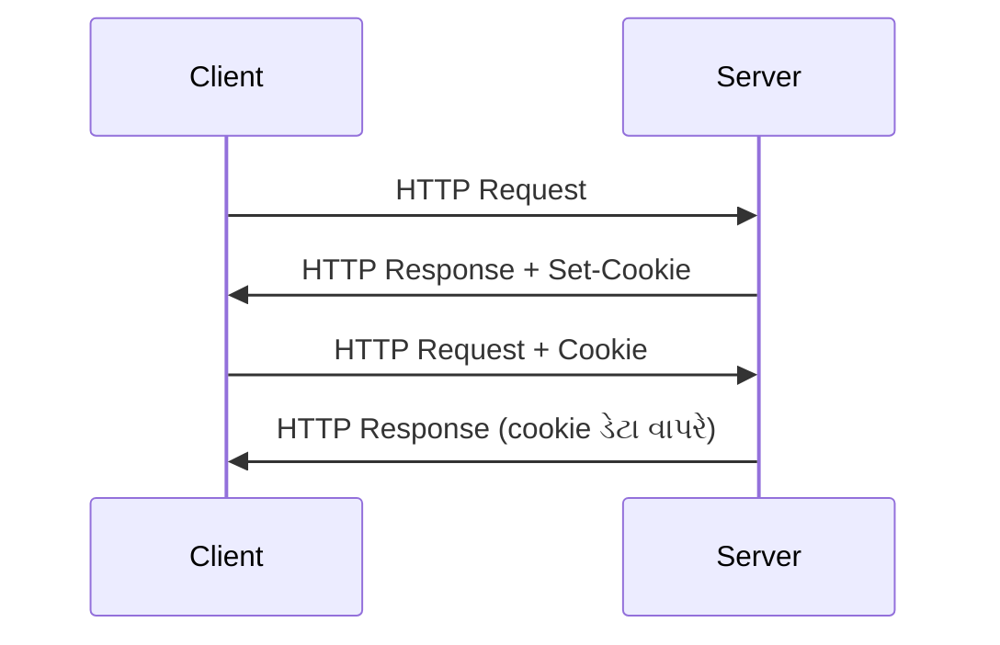
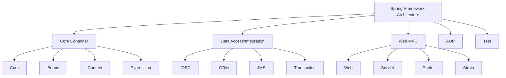
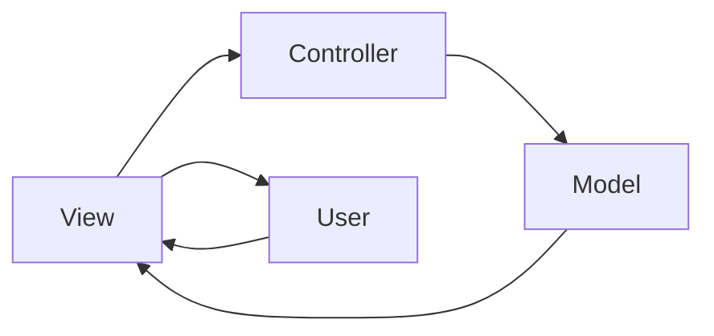
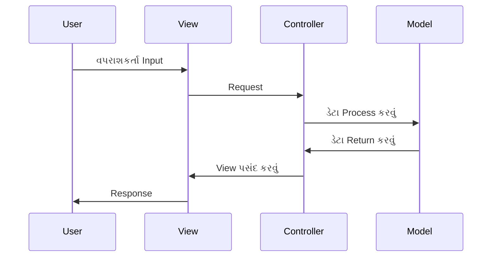

## પ્રશ્ન 1(અ) [3 માર્ક્સ]

**AWT અને Swing વચ્ચેનો તફાવત લખો.**

**જવાબ**:

**ટેબલ: AWT વિ. Swing તુલના**

| વિશેષતા | AWT | Swing |
|---------|-----|-------|
| **પ્લેટફોર્મ** | પ્લેટફોર્મ આધારિત | પ્લેટફોર્મ સ્વતંત્ર |
| **કોમ્પોનેન્ટ્સ** | હેવી વેઇટ | લાઇટ વેઇટ |
| **લુક એન્ડ ફીલ** | નેટિવ OS લુક | પ્લગેબલ લુક એન્ડ ફીલ |
| **પ્રદર્શન** | ઝડપી | AWT કરતાં ધીમું |

- **AWT**: નેટિવ OS કોમ્પોનેન્ટ્સ વાપરે છે
- **Swing**: જાવાના પોતાના કોમ્પોનેન્ટ્સ વાપરે છે
- **પ્લગેબિલિટી**: Swing કસ્ટમાઇઝેબલ UI સપોર્ટ કરે છે

**મેમરી ટ્રીક:** "Swing સ્માર્ટ છે - પ્લેટફોર્મ સ્વતંત્ર અને પ્લગેબલ"

## પ્રશ્ન 1(બ) [4 માર્ક્સ]

**વિવિધ Layout Manager ની યાદી બનાવો. Flow Layout manager ને ઉદાહરણ સાથે સમજાવો.**

**જવાબ**:

**Layout Manager ની યાદી:**

- **FlowLayout**: ડાબેથી જમણે ગોઠવણી
- **BorderLayout**: ઉત્તર, દક્ષિણ, પૂર્વ, પશ્ચિમ, કેન્દ્ર
- **GridLayout**: સમાન કદના ગ્રિડ સેલ્સ
- **CardLayout**: કોમ્પોનેન્ટ્સનો સ્ટેક
- **BoxLayout**: એક પંક્તિ અથવા કોલમ

**FlowLayout ઉદાહરણ:**

```java
import javax.swing.*;
import java.awt.*;

public class FlowExample extends JFrame {
    public FlowExample() {
        setLayout(new FlowLayout());
        add(new JButton("બટન 1"));
        add(new JButton("બટન 2"));
        add(new JButton("બટન 3"));
        setSize(300, 100);
        setVisible(true);
    }
}
```

**મેમરી ટ્રીક:** "પાણીની જેમ વહે - ડાબેથી જમણે"

## પ્રશ્ન 1(ક) [7 માર્ક્સ]

**ચેકબૉક્સનો ઉપયોગ કરીને Swing program લખો જે વપરાશકર્તાઓને વિકલ્પોની સૂચિમાંથી બહુવિધ વિકલ્પો પસંદ કરવાની મંજૂરી આપે અને પસંદ કરેલ વિકલ્પો દર્શાવે.**

**જવાબ**:

```java
import javax.swing.*;
import java.awt.*;
import java.awt.event.*;

public class CheckboxExample extends JFrame implements ItemListener {
    JCheckBox java, python, cpp;
    JTextArea display;
    
    public CheckboxExample() {
        setLayout(new FlowLayout());
        
        java = new JCheckBox("Java");
        python = new JCheckBox("Python");
        cpp = new JCheckBox("C++");
        
        java.addItemListener(this);
        python.addItemListener(this);
        cpp.addItemListener(this);
        
        display = new JTextArea(5, 20);
        
        add(java);
        add(python);
        add(cpp);
        add(new JScrollPane(display));
        
        setSize(300, 200);
        setDefaultCloseOperation(JFrame.EXIT_ON_CLOSE);
        setVisible(true);
    }
    
    public void itemStateChanged(ItemEvent e) {
        String result = "પસંદ કરેલ: ";
        if(java.isSelected()) result += "Java ";
        if(python.isSelected()) result += "Python ";
        if(cpp.isSelected()) result += "C++ ";
        display.setText(result);
    }
    
    public static void main(String[] args) {
        new CheckboxExample();
    }
}
```

**મુખ્ય વિશેષતાઓ:**

- **બહુવિધ પસંદગી**: વપરાશકર્તાઓ બહુવિધ ચેકબૉક્સ પસંદ કરી શકે
- **રીઅલ-ટાઇમ ડિસ્પ્લે**: પસંદ કરેલ આઇટમ્સ તરત જ દર્શાવે
- **ItemListener**: ચેકબૉક્સ સ્ટેટ બદલાવ હેન્ડલ કરે

**મેમરી ટ્રીક:** "બહુવિધ ચેક કરો, બધું દર્શાવો"

## પ્રશ્ન 1(ક) OR [7 માર્ક્સ]

**વિવિધ swing components ની મદદથી Java program લખો.**

**જવાબ**:

```java
import javax.swing.*;
import java.awt.*;
import java.awt.event.*;

public class SwingComponents extends JFrame implements ActionListener {
    JTextField nameField;
    JComboBox<String> cityCombo;
    JRadioButton male, female;
    JButton submit;
    JTextArea display;
    
    public SwingComponents() {
        setLayout(new FlowLayout());
        
        add(new JLabel("નામ:"));
        nameField = new JTextField(15);
        add(nameField);
        
        add(new JLabel("શહેર:"));
        cityCombo = new JComboBox<>(new String[]{"મુંબઈ", "દિલ્હી", "બેંગ્લોર"});
        add(cityCombo);
        
        ButtonGroup gender = new ButtonGroup();
        male = new JRadioButton("પુરુષ");
        female = new JRadioButton("સ્ત્રી");
        gender.add(male);
        gender.add(female);
        add(male);
        add(female);
        
        submit = new JButton("સબમિટ");
        submit.addActionListener(this);
        add(submit);
        
        display = new JTextArea(5, 25);
        add(new JScrollPane(display));
        
        setSize(400, 300);
        setDefaultCloseOperation(JFrame.EXIT_ON_CLOSE);
        setVisible(true);
    }
    
    public void actionPerformed(ActionEvent e) {
        String name = nameField.getText();
        String city = (String)cityCombo.getSelectedItem();
        String gender = male.isSelected() ? "પુરુષ" : "સ્ત્રી";
        
        display.setText("નામ: " + name + "\nશહેર: " + city + "\nલિંગ: " + gender);
    }
    
    public static void main(String[] args) {
        new SwingComponents();
    }
}
```

**વપરાયેલ કોમ્પોનેન્ટ્સ:**

- **JTextField**: ટેક્સ્ટ ઇનપુટ
- **JComboBox**: ડ્રોપડાઉન પસંદગી
- **JRadioButton**: એક પસંદગી
- **JButton**: એક્શન ટ્રિગર

**મેમરી ટ્રીક:** "ટેક્સ્ટ, કોમ્બો, રેડિયો, બટન - સંપૂર્ણ ફોર્મ"

## પ્રશ્ન 2(અ) [3 માર્ક્સ]

**ઉદાહરણ સાથે Swing controls સમજાવો.**

**જવાબ**:

**ટેબલ: સામાન્ય Swing Controls**

| Control | હેતુ | ઉદાહરણ |
|---------|-----|---------|
| **JButton** | ક્લિક એક્શન્સ | `new JButton("મને ક્લિક કરો")` |
| **JTextField** | ટેક્સ્ટ ઇનપુટ | `new JTextField(10)` |
| **JLabel** | ટેક્સ્ટ દર્શાવવું | `new JLabel("નમસ્કાર")` |
| **JCheckBox** | બહુવિધ પસંદગી | `new JCheckBox("વિકલ્પ")` |

**મૂળભૂત ઉદાહરણ:**

```java
JFrame frame = new JFrame();
JButton btn = new JButton("સબમિટ");
frame.add(btn);
frame.setSize(200, 100);
frame.setVisible(true);
```

**મેમરી ટ્રીક:** "બટન, ટેક્સ્ટ, લેબલ, ચેક - મૂળભૂત ચાર"

## પ્રશ્ન 2(બ) [4 માર્ક્સ]

**JDBC drivers ની યાદી બનાવો અને કોઈપણ બે સમજાવો.**

**જવાબ**:

**JDBC Drivers ની યાદી:**

1. **Type 1**: JDBC-ODBC Bridge
2. **Type 2**: Native API Driver
3. **Type 3**: Network Protocol Driver
4. **Type 4**: Thin Driver

**વિગતવાર સમજૂતી:**

**Type 1 - JDBC-ODBC Bridge:**

- **હેતુ**: JDBC કોલ્સને ODBC કોલ્સમાં રૂપાંતરિત કરે
- **ફાયદો**: કોઈપણ ODBC ડેટાબેસ સાથે કામ કરે
- **નુકસાન**: પ્લેટફોર્મ આધારિત, ધીમી કાર્યક્ષમતા

**Type 4 - Thin Driver:**

- **હેતુ**: શુદ્ધ Java driver, સીધો ડેટાબેસ કમ્યુનિકેશન
- **ફાયદો**: પ્લેટફોર્મ સ્વતંત્ર, શ્રેષ્ઠ કાર્યક્ષમતા
- **નુકસાન**: ડેટાબેસ વિશિષ્ટ

**મેમરી ટ્રીક:** "Bridge-Native-Network-Thin: 1-2-3-4"

## પ્રશ્ન 2(ક) [7 માર્ક્સ]

**Object Relational Mapping (ORM) સમજાવો તથા તેના ફાયદા અને tools સમજાવો.**

**જવાબ**:

**Object Relational Mapping (ORM):**
ORM એ તકનીક છે જે ઑબ્જેક્ટ-ઓરિએન્ટેડ પ્રોગ્રામિંગ કન્સેપ્ટ્સને રિલેશનલ ડેટાબેસ સ્ટ્રક્ચર સાથે મેપ કરે છે.



**ટેબલ: ORM ફાયદા**

| ફાયદો | વર્ણન |
|-------|-------|
| **ઉત્પાદકતા** | કોડિંગ સમય ઘટાડે |
| **જાળવણી** | સુધારા અને અપડેટ કરવા સરળ |
| **ડેટાબેસ સ્વતંત્રતા** | ડેટાબેસ સરળતાથી બદલી શકાય |
| **ઑબ્જેક્ટ-ઓરિએન્ટેડ** | OOP કન્સેપ્ટ્સ સાથે કામ કરે |

**લોકપ્રિય ORM Tools:**

- **Hibernate**: સૌથી લોકપ્રિય Java ORM
- **JPA**: Java Persistence API સ્ટાન્ડર્ડ
- **MyBatis**: SQL મેપિંગ ફ્રેમવર્ક
- **EclipseLink**: રેફરન્સ ઇમ્પ્લિમેન્ટેશન

**વર્કિંગ મોડલ:**

- **Objects** → **ORM** → **Tables**
- ઑટોમેટિક SQL જનરેશન
- Type-safe queries

**મેમરી ટ્રીક:** "Objects Relate Magically"

## પ્રશ્ન 2(અ) OR [3 માર્ક્સ]

**ઉદાહરણ સાથે MOUSEEVENT અને MOUSELISTENER interface સમજાવો.**

**જવાબ**:

**MouseEvent:**
જ્યારે કોમ્પોનેન્ટ્સ પર માઉસ એક્શન્સ થાય ત્યારે જનરેટ થાય છે.

**MouseListener Interface Methods:**

- **mouseClicked()**: માઉસ બટન ક્લિક
- **mousePressed()**: માઉસ બટન દબાવ્યું
- **mouseReleased()**: માઉસ બટન છોડ્યું
- **mouseEntered()**: માઉસ કોમ્પોનેન્ટમાં પ્રવેશ
- **mouseExited()**: માઉસ કોમ્પોનેન્ટમાંથી બહાર

**ઉદાહરણ:**

```java
public class MouseExample extends JFrame implements MouseListener {
    JLabel label;
    
    public MouseExample() {
        label = new JLabel("મને ક્લિક કરો!");
        label.addMouseListener(this);
        add(label);
        setSize(200, 100);
        setVisible(true);
    }
    
    public void mouseClicked(MouseEvent e) {
        label.setText("ક્લિક થયું!");
    }
    
    // અન્ય methods...
}
```

**મેમરી ટ્રીક:** "Click-Press-Release-Enter-Exit"

## પ્રશ્ન 2(બ) OR [4 માર્ક્સ]

**JDBC API ના components ની સૂચિ બનાવો અને સમજાવો.**

**જવાબ**:

**ટેબલ: JDBC API Components**

| Component | હેતુ | મુખ્ય Classes |
|-----------|-----|-------------|
| **DriverManager** | ડ્રાઇવર્સ મેનેજ કરે | `DriverManager.getConnection()` |
| **Connection** | ડેટાબેસ કનેક્શન | `Connection conn` |
| **Statement** | SQL એક્ઝિક્યુશન | `Statement stmt` |
| **ResultSet** | ક્વેરી પરિણામો | `ResultSet rs` |

**Component વિગતો:**

- **DriverManager**: ડેટાબેસ સાથે કનેક્શન સ્થાપિત કરે
- **Connection**: ડેટાબેસ સેશન રજૂ કરે
- **Statement**: SQL ક્વેરીઓ એક્ઝિક્યુટ કરે
- **ResultSet**: ક્વેરી પરિણામો સાચવે

**મૂળભૂત ઉપયોગ:**

```java
Connection conn = DriverManager.getConnection(url, user, pass);
Statement stmt = conn.createStatement();
ResultSet rs = stmt.executeQuery("SELECT * FROM users");
```

**મેમરી ટ્રીક:** "ડ્રાઇવર કનેક્ટ કરે, સ્ટેટમેન્ટ એક્ઝિક્યુટ કરે, ResultSet રિટર્ન કરે"

## પ્રશ્ન 2(ક) OR [7 માર્ક્સ]

**હાઇબર્નેટનું આર્કિટેક્ચર દોરો અને સમજાવો.**

**જવાબ**:



**આર્કિટેક્ચર કોમ્પોનેન્ટ્સ:**

**ટેબલ: Hibernate આર્કિટેક્ચર**

| Component | કાર્ય |
|-----------|------|
| **Configuration** | કોન્ફિગ ફાઇલો વાંચે |
| **SessionFactory** | Session ઑબ્જેક્ટ્સ બનાવે |
| **Session** | ડેટાબેસ ઇન્ટરફેસ |
| **Transaction** | ટ્રાન્ઝેક્શન મેનેજ કરે |
| **Query** | HQL/SQL ક્વેરીઓ |

**લેયર વર્ણન:**

- **Application Layer**: Java ઑબ્જેક્ટ્સ અને બિઝનેસ લોજિક
- **Hibernate Layer**: ORM મેપિંગ અને સેશન મેનેજમેન્ટ
- **Database Layer**: વાસ્તવિક ડેટા સ્ટોરેજ

**મુખ્ય વિશેષતાઓ:**

- **ઑટોમેટિક ટેબલ ક્રિએશન**: એન્ટિટી ક્લાસીસ આધારે
- **HQL સપોર્ટ**: ઑબ્જેક્ટ-ઓરિએન્ટેડ ક્વેરી લેંગ્વેજ
- **કેશિંગ**: પ્રથમ અને દ્વિતીય સ્તરની કેશિંગ

**મેમરી ટ્રીક:** "Config-Factory-Session-Transaction: CFST"

## પ્રશ્ન 3(અ) [3 માર્ક્સ]

**Servlet ની વિવિધ વિશેષતાઓ સમજાવો.**

**જવાબ**:

**ટેબલ: Servlet વિશેષતાઓ**

| વિશેષતા | વર્ણન |
|---------|-------|
| **પ્લેટફોર્મ સ્વતંત્ર** | JVM સાથે કોઈપણ OS પર ચાલે |
| **કાર્યક્ષમતા** | CGI કરતાં વધુ સારી |
| **મજબૂત** | JVM મેનેજ્ડ મેમરી |
| **સુરક્ષિત** | Java સિક્યોરિટી ફીચર્સ |

**મુખ્ય વિશેષતાઓ:**

- **સર્વર-સાઇડ પ્રોસેસિંગ**: ક્લાયન્ટ રિક્વેસ્ટ્સ હેન્ડલ કરે
- **પ્રોટોકોલ સ્વતંત્ર**: HTTP, FTP, SMTP સપોર્ટ
- **વિસ્તરણીય**: સરળતાથી વિસ્તૃત કરી શકાય
- **પોર્ટેબલ**: એકવાર લખો, ગમે ત્યાં ચલાવો

**મેમરી ટ્રીક:** "Platform Performance Robust Secure"

## પ્રશ્ન 3(બ) [4 માર્ક્સ]

**Servlet life cycle સમજાવો.**

**જવાબ**:



**લાઇફ સાઇકલ તબક્કાઓ:**

**ટેબલ: Servlet લાઇફ સાઇકલ**

| તબક્કો | Method | હેતુ |
|-------|--------|-----|
| **લોડિંગ** | ક્લાસ લોડિંગ | JVM servlet ક્લાસ લોડ કરે |
| **ઇન્સ્ટન્શિએશન** | Constructor | servlet ઑબ્જેક્ટ બનાવે |
| **ઇનિશિયલાઇઝેશન** | `init()` | એકવારની સેટઅપ |
| **રિક્વેસ્ટ પ્રોસેસિંગ** | `service()` | રિક્વેસ્ટ્સ હેન્ડલ કરે |
| **વિનાશ** | `destroy()` | રિસોર્સ સાફ કરે |

**Method વિગતો:**

- **init()**: servlet લોડ થાય ત્યારે એકવાર કોલ થાય
- **service()**: દરેક રિક્વેસ્ટ માટે કોલ થાય
- **destroy()**: servlet અનલોડ થાય ત્યારે કોલ થાય

**મેમરી ટ્રીક:** "Load-Create-Init-Service-Destroy"

## પ્રશ્ન 3(ક) [7 માર્ક્સ]

**Servlet માં session tracking ઉદાહરણ સાથે સમજાવો.**

**જવાબ**:

**Session Tracking પદ્ધતિઓ:**

**ટેબલ: Session Tracking તકનીકો**

| પદ્ધતિ | વર્ણન | ફાયદા/નુકસાન |
|-------|------|-------------|
| **Cookies** | ક્લાયન્ટ-સાઇડ સ્ટોરેજ | સરળ/ગોપનીયતાના મુદ્દા |
| **URL Rewriting** | session ID ઉમેરવું | સાર્વત્રિક/કદરૂપ URLs |
| **Hidden Fields** | ફોર્મ-આધારિત ટ્રેકિંગ | સરળ/ફોર્મ પર આધારિત |
| **HttpSession** | સર્વર-સાઇડ ઑબ્જેક્ટ | સુરક્ષિત/મેમરી ઉપયોગ |

**HttpSession ઉદાહરણ:**

```java
protected void doGet(HttpServletRequest request, 
                    HttpServletResponse response) {
    HttpSession session = request.getSession();
    
    // ડેટા સ્ટોર કરવું
    session.setAttribute("username", "john");
    
    // ડેટા મેળવવું
    String user = (String) session.getAttribute("username");
    
    // Session ની માહિતી
    String sessionId = session.getId();
    boolean isNew = session.isNew();
    
    PrintWriter out = response.getWriter();
    out.println("વપરાશકર્તા: " + user);
    out.println("Session ID: " + sessionId);
}
```

**Session મેનેજમેન્ટ:**

- **બનાવટ**: `request.getSession()`
- **સ્ટોરેજ**: `session.setAttribute()`
- **પુનઃપ્રાપ્તિ**: `session.getAttribute()`
- **રદ કરવું**: `session.invalidate()`

**મેમરી ટ્રીક:** "Cookies-URLs-Hidden-HttpSession: CUHS"

## પ્રશ્ન 3(અ) OR [3 માર્ક્સ]

**Servlet life cycle ની methods સમજાવો.**

**જવાબ**:

**લાઇફ સાઇકલ Methods:**

**ટેબલ: Servlet લાઇફ સાઇકલ Methods**

| Method | ક્યારે કોલ થાય | Parameters |
|--------|-------------|------------|
| **init()** | Servlet ઇનિશિયલાઇઝેશન | `ServletConfig config` |
| **service()** | દરેક રિક્વેસ્ટ | `ServletRequest req, ServletResponse res` |
| **destroy()** | Servlet cleanup | કોઈ નહીં |

**Method વિગતો:**

- **init(ServletConfig config)**: ઇનિશિયલાઇઝેશન કોડ, ડેટાબેસ કનેક્શન્સ
- **service(req, res)**: રિક્વેસ્ટ હેન્ડલિંગ, બિઝનેસ લોજિક
- **destroy()**: cleanup કોડ, કનેક્શન્સ બંધ કરવા

**ઉદાહરણ:**

```java
public void init(ServletConfig config) {
    // ડેટાબેસ કનેક્શન ઇનિશિયલાઇઝ કરો
}

public void service(ServletRequest req, ServletResponse res) {
    // રિક્વેસ્ટ હેન્ડલ કરો
}

public void destroy() {
    // કનેક્શન્સ બંધ કરો
}
```

**મેમરી ટ્રીક:** "Init-Service-Destroy: ISD"

## પ્રશ્ન 3(બ) OR [4 માર્ક્સ]

**ઉદાહરણ સાથે HTTPSERVLET class સમજાવો.**

**જવાબ**:

**HttpServlet Class:**
HTTP પ્રોટોકોલ માટે ખાસ કરીને GenericServlet ને વિસ્તૃત કરતો abstract class.

**HTTP Methods:**

**ટેબલ: HttpServlet Methods**

| Method | HTTP Verb | હેતુ |
|--------|-----------|-----|
| **doGet()** | GET | ડેટા પુનઃપ્રાપ્ત કરવું |
| **doPost()** | POST | ડેટા સબમિટ કરવું |
| **doPut()** | PUT | ડેટા અપડેટ કરવું |
| **doDelete()** | DELETE | ડેટા દૂર કરવું |

**ઉદાહરણ:**

```java
public class MyServlet extends HttpServlet {
    protected void doGet(HttpServletRequest request,
                        HttpServletResponse response) {
        response.setContentType("text/html");
        PrintWriter out = response.getWriter();
        out.println("<h1>GET Request</h1>");
    }
    
    protected void doPost(HttpServletRequest request,
                         HttpServletResponse response) {
        String name = request.getParameter("name");
        response.getWriter().println("નમસ્કાર " + name);
    }
}
```

**મુખ્ય વિશેષતાઓ:**

- **HTTP-વિશિષ્ટ**: વેબ એપ્લિકેશન માટે ડિઝાઇન કરેલ
- **Method handling**: વિવિધ HTTP verbs માટે અલગ methods
- **Request/Response**: HttpServletRequest અને HttpServletResponse

**મેમરી ટ્રીક:** "Get-Post-Put-Delete: GPPD"

## પ્રશ્ન 3(ક) OR [7 માર્ક્સ]

**GET અને POST method નો તફાવત લખો અને POST method નો ઉપયોગ કરીને Servlet બનવા માટેનો java code લખો.**

**જવાબ**:

**ટેબલ: GET વિ. POST તુલના**

| વિશેષતા | GET | POST |
|---------|-----|------|
| **ડેટા સ્થાન** | URL parameters | Request body |
| **ડેટા મર્યાદા** | મર્યાદિત (~2KB) | અમર્યાદિત |
| **સુરક્ષા** | ઓછી સુરક્ષિત | વધુ સુરક્ષિત |
| **કેશિંગ** | કેશેબલ | કેશેબલ નથી |
| **બુકમાર્કિંગ** | શક્ય | શક્ય નથી |

**POST Method Servlet ઉદાહરણ:**

```java
import javax.servlet.*;
import javax.servlet.http.*;
import java.io.*;

public class LoginServlet extends HttpServlet {
    protected void doPost(HttpServletRequest request,
                         HttpServletResponse response) 
                         throws ServletException, IOException {
        
        response.setContentType("text/html");
        PrintWriter out = response.getWriter();
        
        // ફોર્મ ડેટા મેળવવું
        String username = request.getParameter("username");
        String password = request.getParameter("password");
        
        // ઓળખપત્રો ચકાસવા
        if("admin".equals(username) && "123".equals(password)) {
            out.println("<h2>લોગિન સફળ!</h2>");
            out.println("<p>આવકાર છે " + username + "</p>");
        } else {
            out.println("<h2>લોગિન નિષ્ફળ!</h2>");
            out.println("<p>અયોગ્ય ઓળખપત્રો</p>");
        }
        
        out.close();
    }
}
```

**HTML ફોર્મ:**

```html
<form method="post" action="LoginServlet">
    વપરાશકર્તા નામ: <input type="text" name="username"><br>
    પાસવર્ડ: <input type="password" name="password"><br>
    <input type="submit" value="લોગિન">
</form>
```

**મુખ્ય તફાવતો:**

- **GET**: ડેટા URL માં, દેખાય છે, મર્યાદિત કદ
- **POST**: ડેટા body માં, છુપાયેલ, અમર્યાદિત કદ

**મેમરી ટ્રીક:** "GET મેળવે, POST સુરક્ષિત કરે"

## પ્રશ્ન 4(અ) [3 માર્ક્સ]

**JSP Implicit Objects ની યાદી બનાવો અને કોઈપણ બે સમજાવો.**

**જવાબ**:

**JSP Implicit Objects યાદી:**

1. **request** (HttpServletRequest)
2. **response** (HttpServletResponse)
3. **session** (HttpSession)
4. **application** (ServletContext)
5. **out** (JspWriter)
6. **page** (Object)
7. **pageContext** (PageContext)
8. **config** (ServletConfig)
9. **exception** (Throwable)

**વિગતવાર સમજૂતી:**

**request Object:**

- **પ્રકાર**: HttpServletRequest
- **હેતુ**: રિક્વેસ્ટ ડેટા અને parameters ને એક્સેસ કરવું
- **ઉદાહરણ**: `String name = request.getParameter("name");`

**session Object:**

- **પ્રકાર**: HttpSession
- **હેતુ**: રિક્વેસ્ટ્સ પર વપરાશકર્તા-વિશિષ્ટ ડેટા સ્ટોર કરવું
- **ઉદાહરણ**: `session.setAttribute("user", username);`

**મેમરી ટ્રીક:** "Request Response Session Application Out"

## પ્રશ્ન 4(બ) [4 માર્ક્સ]

**JSP ની વિવિધ વિશેષતાઓ સમજાવો.**

**જવાબ**:

**ટેબલ: JSP વિશેષતાઓ**

| વિશેષતા | વર્ણન | ફાયદો |
|---------|-------|-------|
| **સહેલું ડેવલપમેન્ટ** | HTML + Java | ઝડપી કોડિંગ |
| **પ્લેટફોર્મ સ્વતંત્ર** | એકવાર લખો, ગમે ત્યાં ચલાવો | પોર્ટેબિલિટી |
| **કોમ્પોનેન્ટ-આધારિત** | પુનઃઉપયોગ્ય કોમ્પોનેન્ટ્સ | જાળવણીયોગ્યતા |
| **સુરક્ષિત** | Java સિક્યોરિટી મોડલ | સુરક્ષિત એક્ઝિક્યુશન |

**મુખ્ય વિશેષતાઓ:**

- **Separation of Concerns**: ડિઝાઇન અને લોજિક અલગ
- **વિસ્તરણીય**: કસ્ટમ ટેગ્સ અને લાઇબ્રેરીઓ
- **કમ્પાઇલ્ડ**: કાર્યક્ષમતા માટે servlets માં ટ્રાન્સલેટ
- **Expression Language**: સરળ સિન્ટેક્સ

**JSP એલિમેન્ટ્સ:**

- **Directives**: `<%@ %>`
- **Declarations**: `<%! %>`
- **Expressions**: `<%= %>`
- **Scriptlets**: `<% %>`

**મેમરી ટ્રીક:** "Easy Platform Component Secure"

## પ્રશ્ન 4(ક) [7 માર્ક્સ]

**Servlet માંથી JSP કઇ રીતે કોલ થશે તે ઉદાહરણ સાથે સમજાવો.**

**જવાબ**:

**Servlet માંથી JSP કોલ કરવાની પદ્ધતિઓ:**

**ટેબલ: JSP કોલિંગ પદ્ધતિઓ**

| પદ્ધતિ | Interface | હેતુ |
|-------|-----------|-----|
| **Forward** | RequestDispatcher | કંટ્રોલ ટ્રાન્સફર કરવું |
| **Include** | RequestDispatcher | કન્ટેન્ટ ઇન્ક્લુડ કરવું |
| **Redirect** | HttpServletResponse | નવી રિક્વેસ્ટ |

**Forward ઉદાહરણ:**

**Servlet કોડ:**

```java
public class DataServlet extends HttpServlet {
    protected void doGet(HttpServletRequest request,
                        HttpServletResponse response) 
                        throws ServletException, IOException {
        
        // ડેટા પ્રોસેસ કરવું
        String username = "જોન ડો";
        int age = 25;
        
        // Attributes સેટ કરવા
        request.setAttribute("username", username);
        request.setAttribute("age", age);
        
        // JSP ને ફોરવર્ડ કરવું
        RequestDispatcher dispatcher = 
            request.getRequestDispatcher("display.jsp");
        dispatcher.forward(request, response);
    }
}
```

**JSP કોડ (display.jsp):**

```jsp
<%@ page language="java" contentType="text/html" %>
<html>
<head><title>વપરાશકર્તા માહિતી</title></head>
<body>
    <h2>વપરાશકર્તા માહિતી</h2>
    <p>નામ: <%= request.getAttribute("username") %></p>
    <p>ઉંમર: <%= request.getAttribute("age") %></p>
</body>
</html>
```

**પગલાઓ:**

1. **ડેટા પ્રોસેસ** servlet માં
2. **Attributes સેટ** કરવા request માં
3. **RequestDispatcher મેળવવું** JSP path સાથે
4. **Forward** JSP ને

**મેમરી ટ્રીક:** "Process-Set-Get-Forward: PSGF"

## પ્રશ્ન 4(અ) OR [3 માર્ક્સ]

**JSP scripting elements ની યાદી બનાવો અને સમજાવો.**

**જવાબ**:

**ટેબલ: JSP Scripting Elements**

| Element | Syntax | હેતુ | ઉદાહરણ |
|---------|--------|-----|---------|
| **Directive** | `<%@ %>` | પેજ સેટિંગ્સ | `<%@ page import="java.util.*" %>` |
| **Declaration** | `<%! %>` | methods/variables વ્યાખ્યા | `<%! int count = 0; %>` |
| **Expression** | `<%= %>` | વેલ્યુઝ આઉટપુટ | `<%= new Date() %>` |
| **Scriptlet** | `<% %>` | Java કોડ | `<% for(int i=0; i<5; i++) { %>` |

**વિગતવાર સમજૂતી:**

**Directives:**

- **Page directive**: પેકેજીઝ ઇમ્પોર્ટ, કન્ટેન્ટ ટાઇપ સેટ કરવા
- **Include directive**: અન્ય ફાઇલો ઇન્ક્લુડ કરવા
- **Taglib directive**: કસ્ટમ ટેગ લાઇબ્રેરીઓ

**Declarations:**

- Instance variables અને methods વ્યાખ્યાયિત કરવા
- servlet class ના ભાગ બને છે

**મેમરી ટ્રીક:** "Direct Declare Express Script"

## પ્રશ્ન 4(બ) OR [4 માર્ક્સ]

**JSP life cycle સમજાવો.**

**જવાબ**:



**લાઇફ સાઇકલ તબક્કાઓ:**

**ટેબલ: JSP લાઇફ સાઇકલ**

| તબક્કો | Method | હેતુ |
|-------|--------|-----|
| **Translation** | - | JSP થી Java servlet |
| **Compilation** | - | Java થી bytecode |
| **Initialization** | `jspInit()` | રિસોર્સ સેટઅપ |
| **Request Processing** | `_jspService()` | રિક્વેસ્ટ હેન્ડલ કરવા |
| **Destruction** | `jspDestroy()` | Cleanup |

**મુખ્ય મુદ્દાઓ:**

- **Translation**: JSP engine JSP ને servlet માં કન્વર્ટ કરે
- **Compilation**: Java compiler .class ફાઇલ બનાવે
- **Execution**: Servlet container કમ્પાઇલ થયેલ servlet એક્ઝિક્યુટ કરે

**મેમરી ટ્રીક:** "Translate-Compile-Init-Service-Destroy"

## પ્રશ્ન 4(ક) OR [7 માર્ક્સ]

**Cookie શું છે? ઉદાહરણ સાથે cookie નું working સમજાવો.**

**જવાબ**:

**Cookie વ્યાખ્યા:**
Cookie એ વેબ બ્રાઉઝર દ્વારા ક્લાયન્ટના કમ્પ્યુટર પર સ્ટોર કરવામાં આવતા ડેટાનો નાનો ભાગ છે.

**Cookie Working Process:**



**ટેબલ: Cookie Attributes**

| Attribute | હેતુ | ઉદાહરણ |
|-----------|-----|---------|
| **Name** | Cookie identifier | `username` |
| **Value** | Cookie ડેટા | `john123` |
| **Domain** | વેલિડ ડોમેન | `.example.com` |
| **Path** | વેલિડ પાથ | `/shop/` |
| **Max-Age** | એક્સપાયરી ટાઇમ | `3600` સેકંડ |

**Cookie ઉદાહરણ:**

**Cookie બનાવવું (Servlet):**

```java
public class SetCookieServlet extends HttpServlet {
    protected void doGet(HttpServletRequest request,
                        HttpServletResponse response) {
        
        // Cookie બનાવવી
        Cookie userCookie = new Cookie("username", "john123");
        userCookie.setMaxAge(60 * 60 * 24); // 1 દિવસ
        userCookie.setPath("/");
        
        // Response માં ઉમેરવી
        response.addCookie(userCookie);
        
        response.getWriter().println("Cookie સફળતાપૂર્વક સેટ થઈ!");
    }
}
```

**Cookie વાંચવી (Servlet):**

```java
public class GetCookieServlet extends HttpServlet {
    protected void doGet(HttpServletRequest request,
                        HttpServletResponse response) {
        
        Cookie[] cookies = request.getCookies();
        String username = null;
        
        if(cookies != null) {
            for(Cookie cookie : cookies) {
                if("username".equals(cookie.getName())) {
                    username = cookie.getValue();
                    break;
                }
            }
        }
        
        response.getWriter().println("પાછા આવવા બદલ આભાર, " + username);
    }
}
```

**Cookie ફાયદા:**

- **વપરાશકર્તા વ્યક્તિકરણ**: પસંદગીઓ યાદ રાખવી
- **Session tracking**: state જાળવવા
- **Analytics**: વપરાશકર્તા વર્તન ટ્રેક કરવું

**મેમરી ટ્રીક:** "Create-Set-Add-Read: CSAR"

## પ્રશ્ન 5(અ) [3 માર્ક્સ]

**JSP અને Servlet વચ્ચેનો તફાવત લખો.**

**જવાબ**:

**ટેબલ: JSP વિ. Servlet તુલના**

| વિશેષતા | JSP | Servlet |
|---------|-----|---------|
| **ડેવલપમેન્ટ** | HTML + Java | શુદ્ધ Java |
| **કમ્પાઇલેશન** | ઑટોમેટિક | મેન્યુઅલ |
| **જાળવણી** | સરળ | વધુ જટિલ |
| **કાર્યક્ષમતા** | ધીમી (પ્રથમ રિક્વેસ્ટ) | ઝડપી |
| **હેતુ** | Presentation layer | Business logic |

**મુખ્ય તફાવતો:**

- **JSP**: presentation માટે સારી, વેબ ડિઝાઇનર્સ માટે સરળ
- **Servlet**: business logic માટે સારી, વધુ કંટ્રોલ
- **કોડિંગ**: JSP HTML અને Java મિક્સ કરે, Servlet શુદ્ધ Java
- **કમ્પાઇલેશન**: JSP ઑટો-કમ્પાઇલ, Servlet મેન્યુઅલ કમ્પાઇલેશન જરૂરી

**મેમરી ટ્રીક:** "JSP Presentation માટે, Servlet Logic માટે"

## પ્રશ્ન 5(બ) [4 માર્ક્સ]

**Spring Boot શું છે? અને તેના ફાયદા સમજાવો.**

**જવાબ**:

**Spring Boot વ્યાખ્યા:**
Spring Boot એ ફ્રેમવર્ક છે જે ઑટો-કોન્ફિગરેશન અને embedded servers પ્રદાન કરીને Spring-આધારિત એપ્લિકેશનોનું ડેવલપમેન્ટ સરળ બનાવે છે.

**ટેબલ: Spring Boot ફાયદા**

| ફાયદો | વર્ણન |
|-------|-------|
| **ઑટો કોન્ફિગરેશન** | Spring એપ્લિકેશનો ઑટોમેટિક કોન્ફિગર કરે |
| **Embedded Servers** | બિલ્ટ-ઇન Tomcat, Jetty સપોર્ટ |
| **Starter Dependencies** | પ્રી-કોન્ફિગર્ડ dependency સેટ્સ |
| **Production Ready** | Health checks, metrics, monitoring |

**મુખ્ય વિશેષતાઓ:**

- **ઝડપી ડેવલપમેન્ટ**: ન્યૂનતમ કોન્ફિગરેશન જરૂરી
- **Microservices**: microservice આર્કિટેક્ચર માટે પરફેક્ટ
- **XML નહીં**: Convention over configuration
- **Cloud Ready**: cloud platforms પર સરળ deployment

**ઉદાહરણ:**

```java
@SpringBootApplication
public class MyApplication {
    public static void main(String[] args) {
        SpringApplication.run(MyApplication.class, args);
    }
}
```

**મેમરી ટ્રીક:** "Auto Embedded Starter Production"

## પ્રશ્ન 5(ક) [7 માર્ક્સ]

**Spring framework નું આર્કિટેક્ચર સમજાવો.**

**જવાબ**:



**આર્કિટેક્ચર લેયર્સ:**

**ટેબલ: Spring Framework Modules**

| Module | Components | હેતુ |
|--------|------------|-----|
| **Core Container** | Core, Beans, Context | IoC અને DI |
| **Data Access** | JDBC, ORM, JMS | ડેટાબેસ ઓપરેશન્સ |
| **Web MVC** | Web, Servlet, MVC | વેબ એપ્લિકેશન્સ |
| **AOP** | Aspects, Weaving | Cross-cutting concerns |

**મુખ્ય કન્સેપ્ટ્સ:**

- **IoC (Inversion of Control)**: ફ્રેમવર્ક ઑબ્જેક્ટ બનાવટ કંટ્રોલ કરે
- **DI (Dependency Injection)**: Dependencies ઑટોમેટિક inject થાય
- **AOP (Aspect-Oriented Programming)**: Modular cross-cutting concerns
- **MVC**: Model-View-Controller પેટર્ન

**Spring Container:**

- **BeanFactory**: મૂળભૂત container
- **ApplicationContext**: વધારાની ફીચર્સ સાથે એડવાન્સ container

**કોન્ફિગરેશન પદ્ધતિઓ:**

- **XML Configuration**: પરંપરાગત અભિગમ
- **Annotation Configuration**: આધુનિક અભિગમ
- **Java Configuration**: Type-safe કોન્ફિગરેશન

**મેમરી ટ્રીક:** "Core Data Web AOP Test"

## પ્રશ્ન 5(અ) OR [3 માર્ક્સ]

**Servlet ની સરખામણીમાં JSP ના ફાયદા લખો.**

**જવાબ**:

**ટેબલ: Servlet પર JSP ના ફાયદા**

| ફાયદો | JSP | Servlet મર્યાદા |
|-------|-----|----------------|
| **સહેલું ડેવલપમેન્ટ** | HTML + Java ટેગ્સ | Java માં જટિલ HTML |
| **ઑટોમેટિક કમ્પાઇલેશન** | ઑટો-કમ્પાઇલ્ડ | મેન્યુઅલ કમ્પાઇલેશન |
| **ડિઝાઇનર ફ્રેન્ડલી** | વેબ ડિઝાઇનર્સ કામ કરી શકે | Java જ્ઞાન જરૂરી |
| **જાળવણી** | સુધારવા સરળ | કોડ બદલાવ માટે recompilation |

**મુખ્ય ફાયદા:**

- **ડિઝાઇન અને લોજિકનું વિભાજન**: HTML અને Java અલગ
- **ઝડપી ડેવલપમેન્ટ**: ઝડપી prototyping અને development
- **ઓછો કોડ**: out.println() statements ની જરૂર નહીં
- **બિલ્ટ-ઇન ઑબ્જેક્ટ્સ**: Implicit objects તરત મળે

**ઉદાહરણ તુલના:**

**JSP કોડ:**

```jsp
<html>
<body>
    <h1>આવકાર છે <%= request.getParameter("name") %></h1>
</body>
</html>
```

**Servlet કોડ:**

```java
out.println("<html>");
out.println("<body>");
out.println("<h1>આવકાર છે " + request.getParameter("name") + "</h1>");
out.println("</body>");
out.println("</html>");
```

**મેમરી ટ્રીક:** "Easy Auto Designer Maintenance"

## પ્રશ્ન 5(બ) OR [4 માર્ક્સ]

**Spring Boot ના ફાયદા સમજાવો.**

**જવાબ**:

**ટેબલ: Spring Boot ફાયદા**

| ફાયદો | વર્ણન | લાભ |
|-------|-------|-----|
| **ઑટો કોન્ફિગરેશન** | Classpath આધારે ઑટોમેટિક સેટઅપ | ઘટેલ કોન્ફિગરેશન |
| **Embedded Server** | બિલ્ટ-ઇન Tomcat/Jetty | બાહ્ય deployment નહીં |
| **Starter POMs** | પ્રી-કોન્ફિગર્ડ dependencies | સરળ dependency management |
| **Actuator** | Production monitoring | Health checks અને metrics |

**વિગતવાર ફાયદા:**

**1. ઑટો કોન્ફિગરેશન:**

- Dependencies આધારે Spring application ઑટોમેટિક કોન્ફિગર કરે
- Boilerplate configuration કોડ ઘટાડે
- Convention over configuration અભિગમ

**2. Embedded Servers:**

- બાહ્ય application servers ની જરૂર નહીં
- `java -jar` સાથે applications સરળતાથી ચલાવી શકાય
- સરળ deployment પ્રક્રિયા

**3. Starter Dependencies:**

- પ્રી-કોન્ફિગર્ડ dependency સેટ્સ
- Version compatibility મેનેજ થાય
- ઝડપી પ્રોજેક્ટ સેટઅપ

**4. Production ફીચર્સ:**

- Health endpoints
- Metrics collection
- Application monitoring

**ઉદાહરણ:**

```java
@SpringBootApplication
@RestController
public class HelloApp {
    @GetMapping("/hello")
    public String hello() {
        return "નમસ્કાર Spring Boot!";
    }
    
    public static void main(String[] args) {
        SpringApplication.run(HelloApp.class, args);
    }
}
```

**મેમરી ટ્રીક:** "Auto Embedded Starter Production"

## પ્રશ્ન 5(ક) OR [7 માર્ક્સ]

**MVC આર્કિટેક્ચર સમજાવો.**

**જવાબ**:

**MVC (Model-View-Controller) આર્કિટેક્ચર:**



**MVC કોમ્પોનેન્ટ્સ:**

**ટેબલ: MVC કોમ્પોનેન્ટ્સ**

| Component | જવાબદારી | ઉદાહરણ |
|-----------|----------|---------|
| **Model** | ડેટા અને બિઝનેસ લોજિક | Entity classes, DAOs |
| **View** | વપરાશકર્તા ઇન્ટરફેસ | JSP, HTML, Templates |
| **Controller** | રિક્વેસ્ટ હેન્ડલિંગ | Servlets, Spring Controllers |

**વિગતવાર સમજૂતી:**

**Model:**

- ડેટા અને બિઝનેસ લોજિક રજૂ કરે
- ડેટાબેસ ઓપરેશન્સ
- ડેટા વેલિડેશન
- બિઝનેસ નિયમોનું અમલીકરણ

**View:**

- Presentation layer
- વપરાશકર્તા ઇન્ટરફેસ કોમ્પોનેન્ટ્સ
- વપરાશકર્તાઓને ડેટા દર્શાવવું
- વપરાશકર્તા ઇનપુટ એકત્રિત કરવું

**Controller:**

- વપરાશકર્તા રિક્વેસ્ટ્સ હેન્ડલ કરે
- Model અને View વચ્ચે સંકલન
- વપરાશકર્તા ઇનપુટ પ્રોસેસ કરવું
- યોગ્ય View પસંદ કરવું

**MVC ફ્લો:**



**Spring MVC ઉદાહરણ:**

**Controller:**

```java
@Controller
public class StudentController {
    @Autowired
    private StudentService studentService;
    
    @GetMapping("/students")
    public ModelAndView getStudents() {
        List<Student> students = studentService.getAllStudents();
        ModelAndView mv = new ModelAndView("students");
        mv.addObject("studentList", students);
        return mv;
    }
}
```

**Model:**

```java
@Entity
public class Student {
    @Id
    private int id;
    private String name;
    private String email;
    
    // getters અને setters
}
```

**View (JSP):**

```jsp
<html>
<body>
    <h2>વિદ્યાર્થી યાદી</h2>
    <c:forEach items="${studentList}" var="student">
        <p>${student.name} - ${student.email}</p>
    </c:forEach>
</body>
</html>
```

**MVC ફાયદા:**

- **Separation of Concerns**: જવાબદારીઓનું સ્પષ્ટ વિભાજન
- **જાળવણીયોગ્યતા**: જાળવવા અને સુધારવા સરળ
- **પુનઃઉપયોગિતા**: કોમ્પોનેન્ટ્સ પુનઃઉપયોગ કરી શકાય
- **ટેસ્ટેબિલિટી**: દરેક કોમ્પોનેન્ટ સ્વતંત્ર રીતે ટેસ્ટ કરી શકાય
- **સમાંતર ડેવલપમેન્ટ**: વિવિધ ટીમો વિવિધ કોમ્પોનેન્ટ્સ પર કામ કરી શકે

**વેબ એપ્લિકેશન્સમાં MVC:**

- **Model**: ડેટાબેસ entities, બિઝનેસ લોજિક
- **View**: JSP pages, HTML templates
- **Controller**: Servlets, Spring controllers

**વપરાયેલ ડિઝાઇન પેટર્ન્સ:**

- **Front Controller**: રિક્વેસ્ટ્સ માટે એક પ્રવેશ બિંદુ
- **Observer Pattern**: Model View ને ફેરફારોની જાણ આપે
- **Strategy Pattern**: સમાન Model માટે વિવિધ Views

**મેમરી ટ્રીક:** "Model ડેટા મેનેજ કરે, View ડેટા દર્શાવે, Controller ફ્લો કંટ્રોલ કરે"
