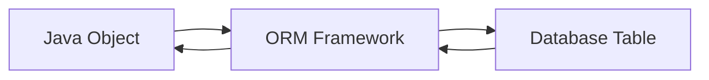
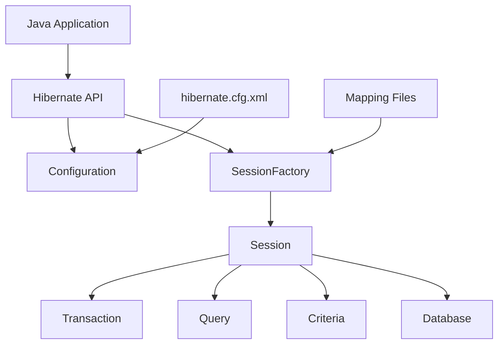
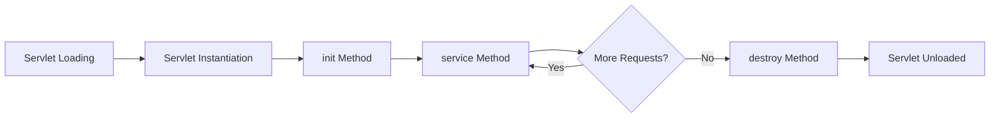
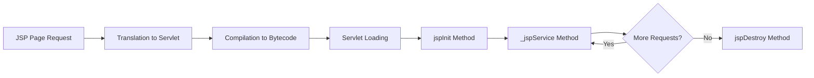
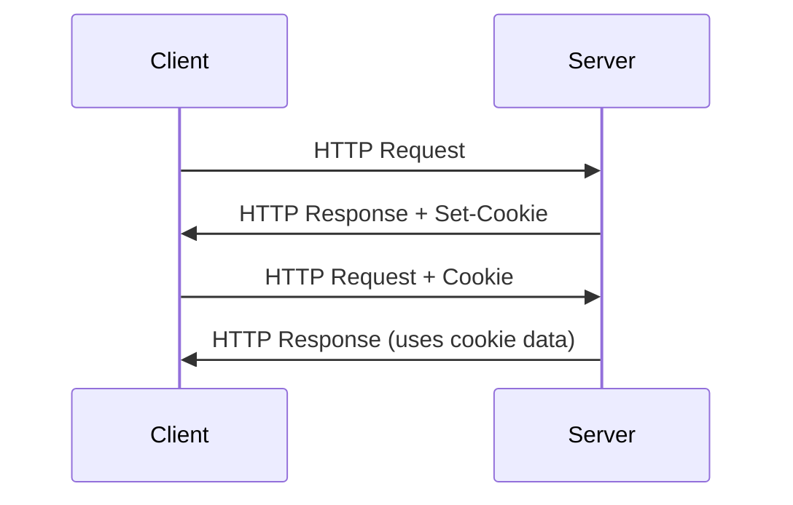
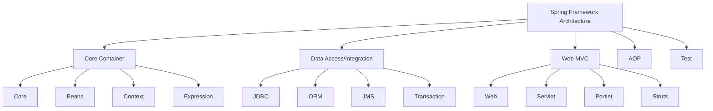
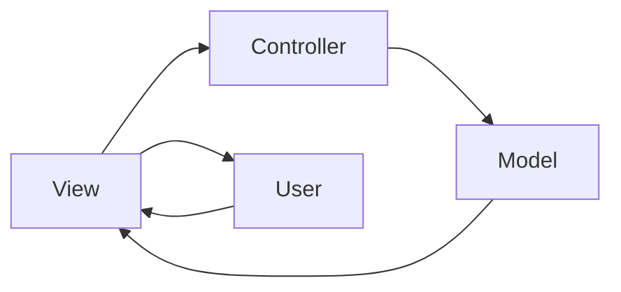
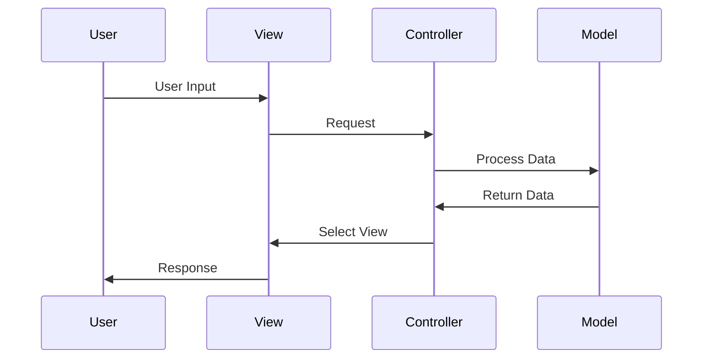

## Question 1(a) [3 marks]

**Write a difference between AWT and Swing.**

**Answer**:

**Table: AWT vs Swing Comparison**

| Feature | AWT | Swing |
|---------|-----|-------|
| **Platform** | Platform dependent | Platform independent |
| **Components** | Heavy weight | Light weight |
| **Look and Feel** | Native OS look | Pluggable look and feel |
| **Performance** | Faster | Slower than AWT |

- **AWT**: Uses native OS components
- **Swing**: Uses Java's own components
- **Pluggability**: Swing supports customizable UI

**Mnemonic:** "Swing is Smart - Platform Independent and Pluggable"

## Question 1(b) [4 marks]

**List out various Layout Managers. Explain Flow Layout manager with example.**

**Answer**:

**Layout Managers List:**

- **FlowLayout**: Left to right arrangement
- **BorderLayout**: North, South, East, West, Center
- **GridLayout**: Equal sized grid cells
- **CardLayout**: Stack of components
- **BoxLayout**: Single row or column

**FlowLayout Example:**

```java
import javax.swing.*;
import java.awt.*;

public class FlowExample extends JFrame {
    public FlowExample() {
        setLayout(new FlowLayout());
        add(new JButton("Button 1"));
        add(new JButton("Button 2"));
        add(new JButton("Button 3"));
        setSize(300, 100);
        setVisible(true);
    }
}
```

**Mnemonic:** "Flow Like Water - Left to Right"

## Question 1(c) [7 marks]

**Create a Swing program using checkbox that allows users to select multiple items from a list of options. Display the selected items.**

**Answer**:

```java
import javax.swing.*;
import java.awt.*;
import java.awt.event.*;

public class CheckboxExample extends JFrame implements ItemListener {
    JCheckBox java, python, cpp;
    JTextArea display;
    
    public CheckboxExample() {
        setLayout(new FlowLayout());
        
        java = new JCheckBox("Java");
        python = new JCheckBox("Python");
        cpp = new JCheckBox("C++");
        
        java.addItemListener(this);
        python.addItemListener(this);
        cpp.addItemListener(this);
        
        display = new JTextArea(5, 20);
        
        add(java);
        add(python);
        add(cpp);
        add(new JScrollPane(display));
        
        setSize(300, 200);
        setDefaultCloseOperation(JFrame.EXIT_ON_CLOSE);
        setVisible(true);
    }
    
    public void itemStateChanged(ItemEvent e) {
        String result = "Selected: ";
        if(java.isSelected()) result += "Java ";
        if(python.isSelected()) result += "Python ";
        if(cpp.isSelected()) result += "C++ ";
        display.setText(result);
    }
    
    public static void main(String[] args) {
        new CheckboxExample();
    }
}
```

**Key Features:**

- **Multiple Selection**: Users can select multiple checkboxes
- **Real-time Display**: Shows selected items immediately
- **ItemListener**: Handles checkbox state changes

**Mnemonic:** "Check Multiple, Display All"

## Question 1(c) OR [7 marks]

**Develop a Java program using various swing components.**

**Answer**:

```java
import javax.swing.*;
import java.awt.*;
import java.awt.event.*;

public class SwingComponents extends JFrame implements ActionListener {
    JTextField nameField;
    JComboBox<String> cityCombo;
    JRadioButton male, female;
    JButton submit;
    JTextArea display;
    
    public SwingComponents() {
        setLayout(new FlowLayout());
        
        add(new JLabel("Name:"));
        nameField = new JTextField(15);
        add(nameField);
        
        add(new JLabel("City:"));
        cityCombo = new JComboBox<>(new String[]{"Mumbai", "Delhi", "Bangalore"});
        add(cityCombo);
        
        ButtonGroup gender = new ButtonGroup();
        male = new JRadioButton("Male");
        female = new JRadioButton("Female");
        gender.add(male);
        gender.add(female);
        add(male);
        add(female);
        
        submit = new JButton("Submit");
        submit.addActionListener(this);
        add(submit);
        
        display = new JTextArea(5, 25);
        add(new JScrollPane(display));
        
        setSize(400, 300);
        setDefaultCloseOperation(JFrame.EXIT_ON_CLOSE);
        setVisible(true);
    }
    
    public void actionPerformed(ActionEvent e) {
        String name = nameField.getText();
        String city = (String)cityCombo.getSelectedItem();
        String gender = male.isSelected() ? "Male" : "Female";
        
        display.setText("Name: " + name + "\nCity: " + city + "\nGender: " + gender);
    }
    
    public static void main(String[] args) {
        new SwingComponents();
    }
}
```

**Components Used:**

- **JTextField**: Text input
- **JComboBox**: Dropdown selection
- **JRadioButton**: Single selection
- **JButton**: Action trigger

**Mnemonic:** "Text, Combo, Radio, Button - Complete Form"

## Question 2(a) [3 marks]

**Explain Swing controls with example.**

**Answer**:

**Table: Common Swing Controls**

| Control | Purpose | Example |
|---------|---------|---------|
| **JButton** | Click actions | `new JButton("Click Me")` |
| **JTextField** | Text input | `new JTextField(10)` |
| **JLabel** | Display text | `new JLabel("Hello")` |
| **JCheckBox** | Multiple selection | `new JCheckBox("Option")` |

**Basic Example:**

```java
JFrame frame = new JFrame();
JButton btn = new JButton("Submit");
frame.add(btn);
frame.setSize(200, 100);
frame.setVisible(true);
```

**Mnemonic:** "Button, Text, Label, Check - Basic Four"

## Question 2(b) [4 marks]

**List JDBC drivers and explain any two.**

**Answer**:

**JDBC Drivers List:**

1. **Type 1**: JDBC-ODBC Bridge
2. **Type 2**: Native API Driver
3. **Type 3**: Network Protocol Driver
4. **Type 4**: Thin Driver

**Detailed Explanation:**

**Type 1 - JDBC-ODBC Bridge:**

- **Purpose**: Converts JDBC calls to ODBC calls
- **Advantage**: Works with any ODBC database
- **Disadvantage**: Platform dependent, slower performance

**Type 4 - Thin Driver:**

- **Purpose**: Pure Java driver, direct database communication
- **Advantage**: Platform independent, best performance
- **Disadvantage**: Database specific

**Mnemonic:** "Bridge-Native-Network-Thin: 1-2-3-4"

## Question 2(c) [7 marks]

**Explain Object Relational Mapping (ORM) with its advantages and tools.**

**Answer**:

**Object Relational Mapping (ORM):**
ORM is a technique that maps object-oriented programming concepts to relational database structures.



**Table: ORM Advantages**

| Advantage | Description |
|-----------|-------------|
| **Productivity** | Reduces coding time |
| **Maintainability** | Easy to modify and update |
| **Database Independence** | Switch databases easily |
| **Object-Oriented** | Works with OOP concepts |

**Popular ORM Tools:**

- **Hibernate**: Most popular Java ORM
- **JPA**: Java Persistence API standard
- **MyBatis**: SQL mapping framework
- **EclipseLink**: Reference implementation

**Working Model:**

- **Objects** → **ORM** → **Tables**
- Automatic SQL generation
- Type-safe queries

**Mnemonic:** "Objects Relate Magically"

## Question 2(a) OR [3 marks]

**Describe MOUSEEVENT and MOUSELISTENER interface with example.**

**Answer**:

**MouseEvent:**
Generated when mouse actions occur on components.

**MouseListener Interface Methods:**

- **mouseClicked()**: Mouse button clicked
- **mousePressed()**: Mouse button pressed
- **mouseReleased()**: Mouse button released
- **mouseEntered()**: Mouse enters component
- **mouseExited()**: Mouse exits component

**Example:**

```java
public class MouseExample extends JFrame implements MouseListener {
    JLabel label;
    
    public MouseExample() {
        label = new JLabel("Click me!");
        label.addMouseListener(this);
        add(label);
        setSize(200, 100);
        setVisible(true);
    }
    
    public void mouseClicked(MouseEvent e) {
        label.setText("Clicked!");
    }
    
    // Other methods...
}
```

**Mnemonic:** "Click-Press-Release-Enter-Exit"

## Question 2(b) OR [4 marks]

**List and explain the components of the JDBC API.**

**Answer**:

**Table: JDBC API Components**

| Component | Purpose | Key Classes |
|-----------|---------|-------------|
| **DriverManager** | Manages drivers | `DriverManager.getConnection()` |
| **Connection** | Database connection | `Connection conn` |
| **Statement** | SQL execution | `Statement stmt` |
| **ResultSet** | Query results | `ResultSet rs` |

**Component Details:**

- **DriverManager**: Establishes connection with database
- **Connection**: Represents database session
- **Statement**: Executes SQL queries
- **ResultSet**: Holds query results

**Basic Usage:**

```java
Connection conn = DriverManager.getConnection(url, user, pass);
Statement stmt = conn.createStatement();
ResultSet rs = stmt.executeQuery("SELECT * FROM users");
```

**Mnemonic:** "Driver Connects, Statement Executes, ResultSet Returns"

## Question 2(c) OR [7 marks]

**Draw and explain the architecture of Hibernate.**

**Answer**:



**Architecture Components:**

**Table: Hibernate Architecture**

| Component | Function |
|-----------|----------|
| **Configuration** | Reads config files |
| **SessionFactory** | Creates Session objects |
| **Session** | Interface to database |
| **Transaction** | Manages transactions |
| **Query** | HQL/SQL queries |

**Layer Description:**

- **Application Layer**: Java objects and business logic
- **Hibernate Layer**: ORM mapping and session management
- **Database Layer**: Actual data storage

**Key Features:**

- **Automatic table creation**: Based on entity classes
- **HQL support**: Object-oriented query language
- **Caching**: First and second level caching

**Mnemonic:** "Config-Factory-Session-Transaction: CFST"

## Question 3(a) [3 marks]

**Describe various features of Servlet.**

**Answer**:

**Table: Servlet Features**

| Feature | Description |
|---------|-------------|
| **Platform Independent** | Runs on any OS with JVM |
| **Performance** | Better than CGI |
| **Robust** | JVM managed memory |
| **Secure** | Java security features |

**Key Features:**

- **Server-side processing**: Handles client requests
- **Protocol independent**: HTTP, FTP, SMTP support
- **Extensible**: Can be extended easily
- **Portable**: Write once, run anywhere

**Mnemonic:** "Platform Performance Robust Secure"

## Question 3(b) [4 marks]

**Explain Servlet life cycle.**

**Answer**:



**Life Cycle Stages:**

**Table: Servlet Life Cycle**

| Stage | Method | Purpose |
|-------|--------|---------|
| **Loading** | Class loading | JVM loads servlet class |
| **Instantiation** | Constructor | Creates servlet object |
| **Initialization** | `init()` | One-time setup |
| **Request Processing** | `service()` | Handles requests |
| **Destruction** | `destroy()` | Cleanup resources |

**Method Details:**

- **init()**: Called once when servlet loads
- **service()**: Called for each request
- **destroy()**: Called when servlet unloads

**Mnemonic:** "Load-Create-Init-Service-Destroy"

## Question 3(c) [7 marks]

**Explain the session tracking in Servlet with example.**

**Answer**:

**Session Tracking Methods:**

**Table: Session Tracking Techniques**

| Method | Description | Pros/Cons |
|--------|-------------|-----------|
| **Cookies** | Client-side storage | Easy/Privacy issues |
| **URL Rewriting** | Append session ID | Universal/Ugly URLs |
| **Hidden Fields** | Form-based tracking | Simple/Form dependent |
| **HttpSession** | Server-side object | Secure/Memory usage |

**HttpSession Example:**

```java
protected void doGet(HttpServletRequest request, 
                    HttpServletResponse response) {
    HttpSession session = request.getSession();
    
    // Store data
    session.setAttribute("username", "john");
    
    // Retrieve data
    String user = (String) session.getAttribute("username");
    
    // Session info
    String sessionId = session.getId();
    boolean isNew = session.isNew();
    
    PrintWriter out = response.getWriter();
    out.println("User: " + user);
    out.println("Session ID: " + sessionId);
}
```

**Session Management:**

- **Creation**: `request.getSession()`
- **Storage**: `session.setAttribute()`
- **Retrieval**: `session.getAttribute()`
- **Invalidation**: `session.invalidate()`

**Mnemonic:** "Cookies-URLs-Hidden-HttpSession: CUHS"

## Question 3(a) OR [3 marks]

**Explain methods of Servlet life cycle.**

**Answer**:

**Life Cycle Methods:**

**Table: Servlet Life Cycle Methods**

| Method | Called When | Parameters |
|--------|-------------|------------|
| **init()** | Servlet initialization | `ServletConfig config` |
| **service()** | Each request | `ServletRequest req, ServletResponse res` |
| **destroy()** | Servlet cleanup | None |

**Method Details:**

- **init(ServletConfig config)**: Initialization code, database connections
- **service(req, res)**: Request handling, business logic
- **destroy()**: Cleanup code, close resources

**Example:**

```java
public void init(ServletConfig config) {
    // Initialize database connection
}

public void service(ServletRequest req, ServletResponse res) {
    // Handle request
}

public void destroy() {
    // Close connections
}
```

**Mnemonic:** "Init-Service-Destroy: ISD"

## Question 3(b) OR [4 marks]

**Describe HTTPSERVLET class with example.**

**Answer**:

**HttpServlet Class:**
Abstract class extending GenericServlet, specifically for HTTP protocol.

**HTTP Methods:**

**Table: HttpServlet Methods**

| Method | HTTP Verb | Purpose |
|--------|-----------|---------|
| **doGet()** | GET | Retrieve data |
| **doPost()** | POST | Submit data |
| **doPut()** | PUT | Update data |
| **doDelete()** | DELETE | Remove data |

**Example:**

```java
public class MyServlet extends HttpServlet {
    protected void doGet(HttpServletRequest request,
                        HttpServletResponse response) {
        response.setContentType("text/html");
        PrintWriter out = response.getWriter();
        out.println("<h1>GET Request</h1>");
    }
    
    protected void doPost(HttpServletRequest request,
                         HttpServletResponse response) {
        String name = request.getParameter("name");
        response.getWriter().println("Hello " + name);
    }
}
```

**Key Features:**

- **HTTP-specific**: Designed for web applications
- **Method handling**: Separate methods for different HTTP verbs
- **Request/Response**: HttpServletRequest and HttpServletResponse

**Mnemonic:** "Get-Post-Put-Delete: GPPD"

## Question 3(c) OR [7 marks]

**Differentiate GET and POST methods and write a java code to develop Servlet using POST method.**

**Answer**:

**Table: GET vs POST Comparison**

| Feature | GET | POST |
|---------|-----|------|
| **Data Location** | URL parameters | Request body |
| **Data Limit** | Limited (~2KB) | Unlimited |
| **Security** | Less secure | More secure |
| **Caching** | Cacheable | Not cacheable |
| **Bookmarking** | Possible | Not possible |

**POST Method Servlet Example:**

```java
import javax.servlet.*;
import javax.servlet.http.*;
import java.io.*;

public class LoginServlet extends HttpServlet {
    protected void doPost(HttpServletRequest request,
                         HttpServletResponse response) 
                         throws ServletException, IOException {
        
        response.setContentType("text/html");
        PrintWriter out = response.getWriter();
        
        // Get form data
        String username = request.getParameter("username");
        String password = request.getParameter("password");
        
        // Validate credentials
        if("admin".equals(username) && "123".equals(password)) {
            out.println("<h2>Login Successful!</h2>");
            out.println("<p>Welcome " + username + "</p>");
        } else {
            out.println("<h2>Login Failed!</h2>");
            out.println("<p>Invalid credentials</p>");
        }
        
        out.close();
    }
}
```

**HTML Form:**

```html
<form method="post" action="LoginServlet">
    Username: <input type="text" name="username"><br>
    Password: <input type="password" name="password"><br>
    <input type="submit" value="Login">
</form>
```

**Key Differences:**

- **GET**: Data in URL, visible, limited size
- **POST**: Data in body, hidden, unlimited size

**Mnemonic:** "GET Grabs, POST Protects"

## Question 4(a) [3 marks]

**List JSP Implicit Objects and explain any two.**

**Answer**:

**JSP Implicit Objects List:**

1. **request** (HttpServletRequest)
2. **response** (HttpServletResponse)
3. **session** (HttpSession)
4. **application** (ServletContext)
5. **out** (JspWriter)
6. **page** (Object)
7. **pageContext** (PageContext)
8. **config** (ServletConfig)
9. **exception** (Throwable)

**Detailed Explanation:**

**request Object:**

- **Type**: HttpServletRequest
- **Purpose**: Access request data and parameters
- **Example**: `String name = request.getParameter("name");`

**session Object:**

- **Type**: HttpSession
- **Purpose**: Store user-specific data across requests
- **Example**: `session.setAttribute("user", username);`

**Mnemonic:** "Request Response Session Application Out"

## Question 4(b) [4 marks]

**Explain features of JSP.**

**Answer**:

**Table: JSP Features**

| Feature | Description | Benefit |
|---------|-------------|---------|
| **Easy Development** | HTML + Java | Faster coding |
| **Platform Independent** | Write once, run anywhere | Portability |
| **Component-based** | Reusable components | Maintainability |
| **Secure** | Java security model | Safe execution |

**Key Features:**

- **Separation of Concerns**: Design and logic separated
- **Extensible**: Custom tags and libraries
- **Compiled**: Translated to servlets for performance
- **Expression Language**: Simplified syntax

**JSP Elements:**

- **Directives**: `<%@ %>`
- **Declarations**: `<%! %>`
- **Expressions**: `<%= %>`
- **Scriptlets**: `<% %>`

**Mnemonic:** "Easy Platform Component Secure"

## Question 4(c) [7 marks]

**Describe how to call JSP from servlet with example.**

**Answer**:

**Methods to Call JSP from Servlet:**

**Table: JSP Calling Methods**

| Method | Interface | Purpose |
|--------|-----------|---------|
| **Forward** | RequestDispatcher | Transfer control |
| **Include** | RequestDispatcher | Include content |
| **Redirect** | HttpServletResponse | New request |

**Forward Example:**

**Servlet Code:**

```java
public class DataServlet extends HttpServlet {
    protected void doGet(HttpServletRequest request,
                        HttpServletResponse response) 
                        throws ServletException, IOException {
        
        // Process data
        String username = "John Doe";
        int age = 25;
        
        // Set attributes
        request.setAttribute("username", username);
        request.setAttribute("age", age);
        
        // Forward to JSP
        RequestDispatcher dispatcher = 
            request.getRequestDispatcher("display.jsp");
        dispatcher.forward(request, response);
    }
}
```

**JSP Code (display.jsp):**

```jsp
<%@ page language="java" contentType="text/html" %>
<html>
<head><title>User Info</title></head>
<body>
    <h2>User Information</h2>
    <p>Name: <%= request.getAttribute("username") %></p>
    <p>Age: <%= request.getAttribute("age") %></p>
</body>
</html>
```

**Steps:**

1. **Process data** in servlet
2. **Set attributes** in request
3. **Get RequestDispatcher** with JSP path
4. **Forward** to JSP

**Mnemonic:** "Process-Set-Get-Forward: PSGF"

## Question 4(a) OR [3 marks]

**List and explain JSP scripting elements.**

**Answer**:

**Table: JSP Scripting Elements**

| Element | Syntax | Purpose | Example |
|---------|--------|---------|---------|
| **Directive** | `<%@ %>` | Page settings | `<%@ page import="java.util.*" %>` |
| **Declaration** | `<%! %>` | Define methods/variables | `<%! int count = 0; %>` |
| **Expression** | `<%= %>` | Output values | `<%= new Date() %>` |
| **Scriptlet** | `<% %>` | Java code | `<% for(int i=0; i<5; i++) { %>` |

**Detailed Explanation:**

**Directives:**

- **Page directive**: Import packages, set content type
- **Include directive**: Include other files
- **Taglib directive**: Custom tag libraries

**Declarations:**

- Define instance variables and methods
- Become part of servlet class

**Mnemonic:** "Direct Declare Express Script"

## Question 4(b) OR [4 marks]

**Explain JSP life cycle.**

**Answer**:



**Life Cycle Phases:**

**Table: JSP Life Cycle**

| Phase | Method | Purpose |
|-------|--------|---------|
| **Translation** | - | JSP to Java servlet |
| **Compilation** | - | Java to bytecode |
| **Initialization** | `jspInit()` | Setup resources |
| **Request Processing** | `_jspService()` | Handle requests |
| **Destruction** | `jspDestroy()` | Cleanup |

**Key Points:**

- **Translation**: JSP engine converts JSP to servlet
- **Compilation**: Java compiler creates .class file
- **Execution**: Servlet container executes compiled servlet

**Mnemonic:** "Translate-Compile-Init-Service-Destroy"

## Question 4(c) OR [7 marks]

**Define cookie. Explain working of cookie with example.**

**Answer**:

**Cookie Definition:**
A cookie is a small piece of data stored on the client's computer by the web browser while browsing a website.

**Cookie Working Process:**



**Table: Cookie Attributes**

| Attribute | Purpose | Example |
|-----------|---------|---------|
| **Name** | Cookie identifier | `username` |
| **Value** | Cookie data | `john123` |
| **Domain** | Valid domain | `.example.com` |
| **Path** | Valid path | `/shop/` |
| **Max-Age** | Expiry time | `3600` seconds |

**Cookie Example:**

**Creating Cookie (Servlet):**

```java
public class SetCookieServlet extends HttpServlet {
    protected void doGet(HttpServletRequest request,
                        HttpServletResponse response) {
        
        // Create cookie
        Cookie userCookie = new Cookie("username", "john123");
        userCookie.setMaxAge(60 * 60 * 24); // 1 day
        userCookie.setPath("/");
        
        // Add to response
        response.addCookie(userCookie);
        
        response.getWriter().println("Cookie set successfully!");
    }
}
```

**Reading Cookie (Servlet):**

```java
public class GetCookieServlet extends HttpServlet {
    protected void doGet(HttpServletRequest request,
                        HttpServletResponse response) {
        
        Cookie[] cookies = request.getCookies();
        String username = null;
        
        if(cookies != null) {
            for(Cookie cookie : cookies) {
                if("username".equals(cookie.getName())) {
                    username = cookie.getValue();
                    break;
                }
            }
        }
        
        response.getWriter().println("Welcome back, " + username);
    }
}
```

**Cookie Benefits:**

- **User personalization**: Remember preferences
- **Session tracking**: Maintain state
- **Analytics**: Track user behavior

**Mnemonic:** "Create-Set-Add-Read: CSAR"

## Question 5(a) [3 marks]

**Write difference between JSP and Servlet.**

**Answer**:

**Table: JSP vs Servlet Comparison**

| Feature | JSP | Servlet |
|---------|-----|---------|
| **Development** | HTML + Java | Pure Java |
| **Compilation** | Automatic | Manual |
| **Maintenance** | Easier | More complex |
| **Performance** | Slower (first request) | Faster |
| **Purpose** | Presentation layer | Business logic |

**Key Differences:**

- **JSP**: Better for presentation, easier for web designers
- **Servlet**: Better for business logic, more control
- **Coding**: JSP mixes HTML and Java, Servlet is pure Java
- **Compilation**: JSP auto-compiles, Servlet needs manual compilation

**Mnemonic:** "JSP for Presentation, Servlet for Logic"

## Question 5(b) [4 marks]

**Define Spring Boot and explain its advantages.**

**Answer**:

**Spring Boot Definition:**
Spring Boot is a framework that simplifies the development of Spring-based applications by providing auto-configuration and embedded servers.

**Table: Spring Boot Advantages**

| Advantage | Description |
|-----------|-------------|
| **Auto Configuration** | Automatically configures Spring applications |
| **Embedded Servers** | Built-in Tomcat, Jetty support |
| **Starter Dependencies** | Pre-configured dependency sets |
| **Production Ready** | Health checks, metrics, monitoring |

**Key Features:**

- **Rapid Development**: Minimal configuration required
- **Microservices**: Perfect for microservice architecture
- **No XML**: Convention over configuration
- **Cloud Ready**: Easy deployment to cloud platforms

**Example:**

```java
@SpringBootApplication
public class MyApplication {
    public static void main(String[] args) {
        SpringApplication.run(MyApplication.class, args);
    }
}
```

**Mnemonic:** "Auto Embedded Starter Production"

## Question 5(c) [7 marks]

**Explain the architecture of Spring framework.**

**Answer**:



**Architecture Layers:**

**Table: Spring Framework Modules**

| Module | Components | Purpose |
|--------|------------|---------|
| **Core Container** | Core, Beans, Context | IoC and DI |
| **Data Access** | JDBC, ORM, JMS | Database operations |
| **Web MVC** | Web, Servlet, MVC | Web applications |
| **AOP** | Aspects, Weaving | Cross-cutting concerns |

**Core Concepts:**

- **IoC (Inversion of Control)**: Framework controls object creation
- **DI (Dependency Injection)**: Dependencies injected automatically
- **AOP (Aspect-Oriented Programming)**: Modular cross-cutting concerns
- **MVC**: Model-View-Controller pattern

**Spring Container:**

- **BeanFactory**: Basic container
- **ApplicationContext**: Advanced container with additional features

**Configuration Methods:**

- **XML Configuration**: Traditional approach
- **Annotation Configuration**: Modern approach
- **Java Configuration**: Type-safe configuration

**Mnemonic:** "Core Data Web AOP Test"

## Question 5(a) OR [3 marks]

**Write advantages of JSP over Servlet.**

**Answer**:

**Table: JSP Advantages over Servlet**

| Advantage | JSP | Servlet Limitation |
|-----------|-----|-------------------|
| **Easy Development** | HTML + Java tags | Complex HTML in Java |
| **Automatic Compilation** | Auto-compiled | Manual compilation |
| **Designer Friendly** | Web designers can work | Java knowledge required |
| **Maintenance** | Easier to modify | Code changes need recompilation |

**Key Advantages:**

- **Separation of Design and Logic**: HTML and Java separated
- **Rapid Development**: Faster prototyping and development
- **Less Code**: No need for out.println() statements
- **Built-in Objects**: Implicit objects readily available

**Example Comparison:**

**JSP Code:**

```jsp
<html>
<body>
    <h1>Welcome <%= request.getParameter("name") %></h1>
</body>
</html>
```

**Servlet Code:**

```java
out.println("<html>");
out.println("<body>");
out.println("<h1>Welcome " + request.getParameter("name") + "</h1>");
out.println("</body>");
out.println("</html>");
```

**Mnemonic:** "Easy Auto Designer Maintenance"

## Question 5(b) OR [4 marks]

**Explain the advantages of Spring Boot.**

**Answer**:

**Table: Spring Boot Advantages**

| Advantage | Description | Benefit |
|-----------|-------------|---------|
| **Auto Configuration** | Automatic setup based on classpath | Reduced configuration |
| **Embedded Server** | Built-in Tomcat/Jetty | No external deployment |
| **Starter POMs** | Pre-configured dependencies | Simplified dependency management |
| **Actuator** | Production monitoring | Health checks and metrics |

**Detailed Advantages:**

**1. Auto Configuration:**

- Automatically configures Spring application based on dependencies
- Reduces boilerplate configuration code
- Convention over configuration approach

**2. Embedded Servers:**

- No need for external application servers
- Easy to run applications with `java -jar`
- Simplified deployment process

**3. Starter Dependencies:**

- Pre-configured dependency sets
- Version compatibility managed
- Quick project setup

**4. Production Features:**

- Health endpoints
- Metrics collection
- Application monitoring

**Example:**

```java
@SpringBootApplication
@RestController
public class HelloApp {
    @GetMapping("/hello")
    public String hello() {
        return "Hello Spring Boot!";
    }
    
    public static void main(String[] args) {
        SpringApplication.run(HelloApp.class, args);
    }
}
```

**Mnemonic:** "Auto Embedded Starter Production"

## Question 5(c) OR [7 marks]

**Explain MVC architecture.**

**Answer**:

**MVC (Model-View-Controller) Architecture:**



**MVC Components:**

**Table: MVC Components**

| Component | Responsibility | Example |
|-----------|---------------|---------|
| **Model** | Data and business logic | Entity classes, DAOs |
| **View** | User interface | JSP, HTML, Templates |
| **Controller** | Request handling | Servlets, Spring Controllers |

**Detailed Explanation:**

**Model:**

- Represents data and business logic
- Database operations
- Data validation
- Business rules implementation

**View:**

- Presentation layer
- User interface components
- Display data to users
- Collect user input

**Controller:**

- Handles user requests
- Coordinates between Model and View
- Process user input
- Select appropriate View

**MVC Flow:**



**Spring MVC Example:**

**Controller:**

```java
@Controller
public class StudentController {
    @Autowired
    private StudentService studentService;
    
    @GetMapping("/students")
    public ModelAndView getStudents() {
        List<Student> students = studentService.getAllStudents();
        ModelAndView mv = new ModelAndView("students");
        mv.addObject("studentList", students);
        return mv;
    }
}
```

**Model:**

```java
@Entity
public class Student {
    @Id
    private int id;
    private String name;
    private String email;
    
    // getters and setters
}
```

**View (JSP):**

```jsp
<html>
<body>
    <h2>Student List</h2>
    <c:forEach items="${studentList}" var="student">
        <p>${student.name} - ${student.email}</p>
    </c:forEach>
</body>
</html>
```

**MVC Advantages:**

- **Separation of Concerns**: Clear separation of responsibilities
- **Maintainability**: Easy to maintain and modify
- **Reusability**: Components can be reused
- **Testability**: Each component can be tested independently
- **Parallel Development**: Different teams can work on different components

**MVC in Web Applications:**

- **Model**: Database entities, business logic
- **View**: JSP pages, HTML templates
- **Controller**: Servlets, Spring controllers

**Design Patterns Used:**

- **Front Controller**: Single entry point for requests
- **Observer Pattern**: Model notifies View of changes
- **Strategy Pattern**: Different Views for same Model

**Mnemonic:** "Model manages data, View shows data, Controller controls flow"
