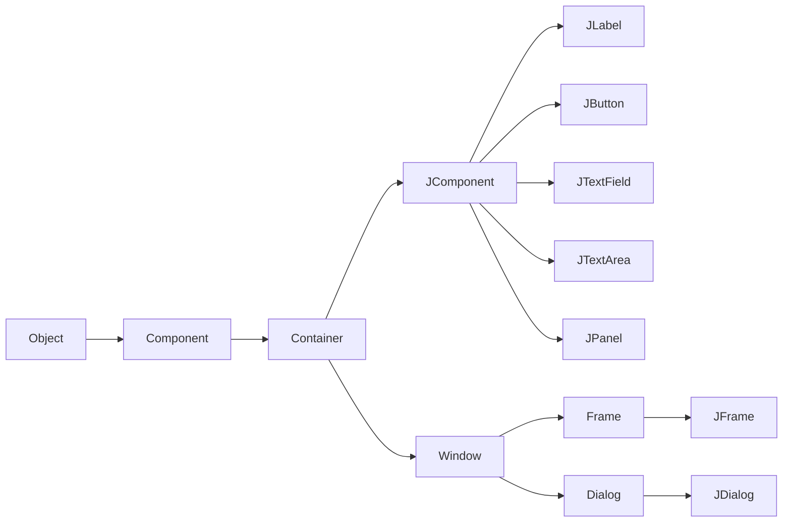
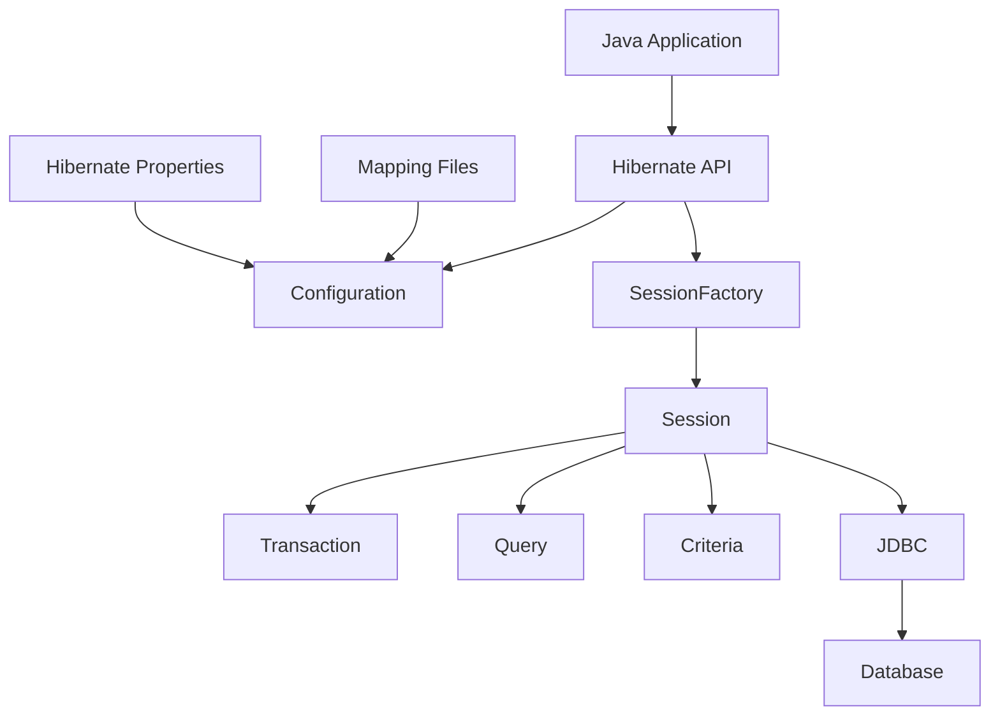
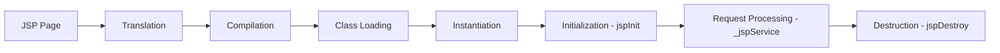
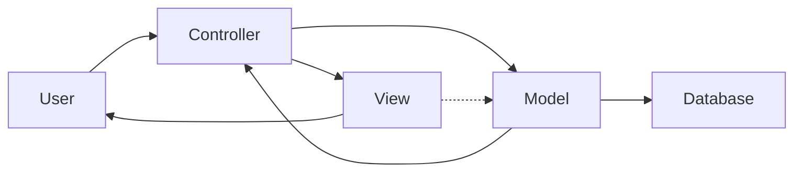
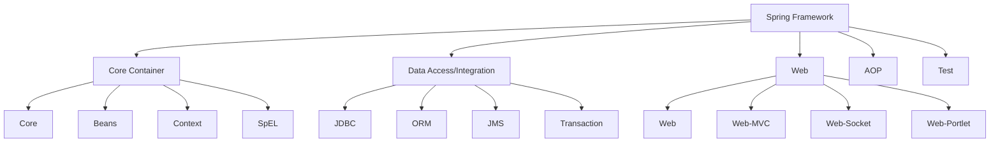

## પ્રશ્ન 1(અ) [3 ગુણ]

**સ્વિંગ ક્લાસ હાયરાર્કી દોરો અને સમજાવો.**

**જવાબ**:

**ડાયાગ્રામ:**



- **Component**: તમામ GUI કોમ્પોનન્ટ્સ માટે બેઝ ક્લાસ
- **Container**: અન્ય કોમ્પોનન્ટ્સ ધરાવી શકે તેવા કોમ્પોનન્ટ્સ
- **JComponent**: તમામ સ્વિંગ કોમ્પોનન્ટ્સ માટે બેઝ ક્લાસ

**મેમરી ટ્રીક:** "ઓબ્જેક્ટ કન્ટેનર કોમ્પોનન્ટ જોઈન્ટ"

---

## પ્રશ્ન 1(બ) [4 ગુણ]

**વિવિધ લેઆઉટ મેનેજરોની યાદી બનાવો. ફ્લો લેઆઉટ મેનેજરને ઉદાહરણ સાથે સમજાવો.**

**જવાબ**:

**લેઆઉટ મેનેજરોનું ટેબલ:**

| લેઆઉટ મેનેજર | વર્ણન |
|----------------|--------|
| FlowLayout | કોમ્પોનન્ટ્સને ડાબેથી જમણે ગોઠવે છે |
| BorderLayout | પાંચ વિસ્તારો: ઉત્તર, દક્ષિણ, પૂર્વ, પશ્ચિમ, કેન્દ્ર |
| GridLayout | સમાન કદના લંબચોરસ ગ્રિડ |
| CardLayout | કોમ્પોનન્ટ્સનો સ્ટેક |
| BoxLayout | એકલ પંક્તિ અથવા કૉલમ |

**FlowLayout ઉદાહરણ:**

```java
JFrame frame = new JFrame();
frame.setLayout(new FlowLayout());
frame.add(new JButton("Button1"));
frame.add(new JButton("Button2"));
frame.setSize(300, 100);
frame.setVisible(true);
```

- **ડિફૉલ્ટ એલાઇનમેન્ટ**: કોમ્પોનન્ટ્સ ડાબેથી જમણે વહે છે
- **રેપિંગ**: જરૂર પડે તો કોમ્પોનન્ટ્સ આગલી લાઇનમાં જાય છે

**મેમરી ટ્રીક:** "ફ્લો ડાબે જમણે જાય"

---

## પ્રશ્ન 1(ક) [7 ગુણ]

**કાઉન્ટર એપ્લિકેશન માટે જાવા સ્વિંગ પ્રોગ્રામ વિકસાવો જેમાં લેબલમાં પ્રદર્શિત 0 ની પ્રારંભિક ગણતરી સાથે "વધારો" અને "ઘટાડો" બટન હોય. જ્યારે "વધારો" પર ક્લિક કરવામાં આવે છે, ત્યારે ગણતરી 1 થી વધે છે, અને જ્યારે "ઘટાડો" ક્લિક કરવામાં આવે છે, ત્યારે ગણતરી 1 થી ઓછી થાય છે. જ્યારે કાઉન્ટર 0 થી નીચે જાય ત્યારે message dialog પ્રદર્શિત થવો જોઈએ.**

**જવાબ**:

**કોડ:**

```java
import javax.swing.*;
import java.awt.*;
import java.awt.event.*;

public class CounterApp extends JFrame implements ActionListener {
    private int count = 0;
    private JLabel countLabel;
    private JButton incButton, decButton;
    
    public CounterApp() {
        setTitle("કાઉન્ટર એપ્લિકેશન");
        setLayout(new FlowLayout());
        
        countLabel = new JLabel("ગણતરી: " + count);
        incButton = new JButton("વધારો");
        decButton = new JButton("ઘટાડો");
        
        incButton.addActionListener(this);
        decButton.addActionListener(this);
        
        add(countLabel);
        add(incButton);
        add(decButton);
        
        setSize(250, 100);
        setDefaultCloseOperation(JFrame.EXIT_ON_CLOSE);
        setVisible(true);
    }
    
    public void actionPerformed(ActionEvent e) {
        if(e.getSource() == incButton) {
            count++;
        } else if(e.getSource() == decButton) {
            count--;
            if(count < 0) {
                JOptionPane.showMessageDialog(this, "કાઉન્ટર શૂન્ય થી નીચે!");
            }
        }
        countLabel.setText("ગણતરી: " + count);
    }
    
    public static void main(String[] args) {
        new CounterApp();
    }
}
```

- **ઇવેન્ટ હેન્ડલિંગ**: ActionListener ઇન્ટરફેસ અમલીકરણ
- **ડાયલોગ ડિસ્પ્લે**: નેગેટિવ કાઉન્ટર ચેતવણી માટે JOptionPane
- **લેબલ અપડેટ**: રીઅલ-ટાઇમ કાઉન્ટ ડિસ્પ્લે

**મેમરી ટ્રીક:** "વધારો ઘટાડો ડાયલોગ બનાવે"

---

## પ્રશ્ન 1(ક) અથવા [7 ગુણ]

**"File" મેનૂમાં મેનૂ આઈટમ્સ "New", "Open" અને "Exit" ધરાવતી સ્વિંગ એપ્લિકેશન બનાવો. જ્યારે વપરાશકર્તા "Exit" ક્લિક કરે છે, ત્યારે એપ્લિકેશન બંધ થવી જોઈએ. ફાઇલ મેનૂ આઈટમ્સ માટે કીબોર્ડ શૉર્ટકટ્સ ઉમેરો. "Help" મેનૂમાં મેનુ આઈટમ "About" પણ ઉમેરો. જ્યારે 'About' ક્લિક કરવામાં આવે ત્યારે એપ્લિકેશન વિશેની માહિતી પ્રદર્શિત કરવા માટે message dialog દેખાવું જોઈએ.**

**જવાબ**:

**કોડ:**

```java
import javax.swing.*;
import java.awt.event.*;

public class MenuApp extends JFrame implements ActionListener {
    
    public MenuApp() {
        setTitle("મેનૂ એપ્લિકેશન");
        
        JMenuBar menuBar = new JMenuBar();
        
        JMenu fileMenu = new JMenu("File");
        JMenuItem newItem = new JMenuItem("New");
        JMenuItem openItem = new JMenuItem("Open");
        JMenuItem exitItem = new JMenuItem("Exit");
        
        newItem.setAccelerator(KeyStroke.getKeyStroke(KeyEvent.VK_N, ActionEvent.CTRL_MASK));
        openItem.setAccelerator(KeyStroke.getKeyStroke(KeyEvent.VK_O, ActionEvent.CTRL_MASK));
        exitItem.setAccelerator(KeyStroke.getKeyStroke(KeyEvent.VK_X, ActionEvent.CTRL_MASK));
        
        newItem.addActionListener(this);
        openItem.addActionListener(this);
        exitItem.addActionListener(this);
        
        fileMenu.add(newItem);
        fileMenu.add(openItem);
        fileMenu.addSeparator();
        fileMenu.add(exitItem);
        
        JMenu helpMenu = new JMenu("Help");
        JMenuItem aboutItem = new JMenuItem("About");
        aboutItem.addActionListener(this);
        helpMenu.add(aboutItem);
        
        menuBar.add(fileMenu);
        menuBar.add(helpMenu);
        
        setJMenuBar(menuBar);
        setSize(400, 300);
        setDefaultCloseOperation(JFrame.EXIT_ON_CLOSE);
        setVisible(true);
    }
    
    public void actionPerformed(ActionEvent e) {
        String command = e.getActionCommand();
        
        if(command.equals("Exit")) {
            System.exit(0);
        } else if(command.equals("About")) {
            JOptionPane.showMessageDialog(this, 
                "મેનૂ એપ્લિકેશન v1.0\nશૉર્ટકટ્સ સાથે સ્વિંગ મેનૂ દર્શાવે છે");
        }
    }
    
    public static void main(String[] args) {
        new MenuApp();
    }
}
```

- **કીબોર્ડ શૉર્ટકટ્સ**: Ctrl+N, Ctrl+O, Ctrl+X એક્સેલેરેટર્સ
- **મેનૂ સ્ટ્રક્ચર**: સેપેરેટર્સ સાથે File અને Help મેનૂ
- **About ડાયલોગ**: પ્રોગ્રામ વર્ણન ડિસ્પ્લે

**મેમરી ટ્રીક:** "મેનૂને શૉર્ટકટની જરૂર હંમેશા"

---

## પ્રશ્ન 2(અ) [3 ગુણ]

**JDBC ડ્રાઇવરના પ્રકારની યાદી બનાવો. પ્રકાર-4 ડ્રાઈવર સમજાવો.**

**જવાબ**:

**JDBC ડ્રાઇવર્સનું ટેબલ:**

| પ્રકાર | નામ | વર્ણન |
|--------|-----|--------|
| Type-1 | JDBC-ODBC Bridge | ODBC ડ્રાઇવરનો ઉપયોગ કરે છે |
| Type-2 | Native-API Driver | ડેટાબેસની મૂળ લાઇબ્રેરીઓ વાપરે છે |
| Type-3 | Network Protocol Driver | મિડલવેર સર્વર વાપરે છે |
| Type-4 | Thin Driver | શુદ્ધ જાવા ડ્રાઇવર |

**Type-4 ડ્રાઇવરની વિશેષતાઓ:**

- **શુદ્ધ જાવા**: કોઈ મૂળ કોડની જરૂર નથી
- **સીધો સંદેશાવ્યવહાર**: ડેટાબેસ સાથે સીધું જોડાણ
- **પ્લેટફોર્મ સ્વતંત્ર**: JVM સાથે કોઈપણ OS પર કામ કરે છે

**મેમરી ટ્રીક:** "ટાઇપ ચાર: શુદ્ધ જાવા દ્વાર"

---

## પ્રશ્ન 2(બ) [4 ગુણ]

**જાવા ફાઉન્ડેશન ક્લાસ (JFC) ની વિશેષતાઓ સમજાવો.**

**જવાબ**:

**JFC કોમ્પોનન્ટ્સ:**

- **સ્વિંગ**: અદ્યતન GUI કોમ્પોનન્ટ્સ
- **AWT**: મૂળભૂત GUI ટૂલકિટ
- **Accessibility**: અક્ષમ વપરાશકર્તાઓ માટે સપોર્ટ
- **2D ગ્રાફિક્સ**: વિસ્તૃત ડ્રોઇંગ ક્ષમતાઓ
- **Drag and Drop**: ફાઇલ ટ્રાન્સફર સપોર્ટ

**મુખ્ય વિશેષતાઓ:**

- **Pluggable Look and Feel**: UI દેખાવ બદલી શકાય છે
- **લાઇટવેઇટ કોમ્પોનન્ટ્સ**: બેહતર કાર્યક્ષમતા
- **MVC આર્કિટેકચર**: ચિંતાઓનું વિભાજન
- **ઇવેન્ટ હેન્ડલિંગ**: મજબૂત ઇવેન્ટ સિસ્ટમ

**મેમરી ટ્રીક:** "જાવા ફાઉન્ડેશન સ્વિંગ બનાવે"

---

## પ્રશ્ન 2(ક) [7 ગુણ]

**હાઇબરનેટનું આર્કિટેકચર દોરો અને સમજાવો.**

**જવાબ**:

**ડાયાગ્રામ:**



**આર્કિટેકચર કોમ્પોનન્ટ્સ:**

- **Configuration**: મેપિંગ ફાઇલો અને પ્રોપર્ટીઝ વાંચે છે
- **SessionFactory**: Session ઓબ્જેક્ટ્સ માટે ફેક્ટરી
- **Session**: એપ્લિકેશન અને ડેટાબેસ વચ્ચે ઇન્ટરફેસ
- **Transaction**: ડેટાબેસ ટ્રાન્ઝેક્શનને દર્શાવે છે
- **Query/Criteria**: ડેટાબેસ ક્વેરીઝ માટે

**હાઇબરનેટના ફાયદા:**

- **Object-Relational Mapping**: જાવા ઓબ્જેક્ટ્સને ડેટાબેસ ટેબલ સાથે મેપ કરે છે
- **આપોઆપ SQL જનરેશન**: મેન્યુઅલ SQL લખવાની જરૂર નથી
- **કેશિંગ**: પ્રથમ-સ્તર અને બીજા-સ્તરની કેશિંગ
- **લેઝી લોડિંગ**: જરૂર પડે ત્યારે જ ડેટા લોડ કરે છે

**મેમરી ટ્રીક:** "સેશન કન્ફિગરેશન ફેક્ટરીઓ આપોઆપ"

---

## પ્રશ્ન 2(અ) અથવા [3 ગુણ]

**JDBC API ના ઘટકો સમજાવો.**

**જવાબ**:

**JDBC API કોમ્પોનન્ટ્સ:**

- **DriverManager**: ડેટાબેસ ડ્રાઇવર્સનું સંચાલન કરે છે
- **Connection**: ડેટાબેસ કનેક્શનને દર્શાવે છે
- **Statement**: SQL ક્વેરીઝ એક્ઝિક્યૂટ કરે છે
- **ResultSet**: ક્વેરી પરિણામો ધરાવે છે
- **SQLException**: SQL એરર્સનું સંચાલન કરે છે

**કોમ્પોનન્ટ ફંક્શન્સ:**

- **ડ્રાઇવર રજિસ્ટ્રેશન**: DriverManager.registerDriver()
- **કનેક્શન સ્થાપના**: DriverManager.getConnection()
- **ક્વેરી એક્ઝિક્યૂશન**: Statement.executeQuery()

**મેમરી ટ્રીક:** "ડ્રાઇવર્સ કનેક્ટ સ્ટેટમેન્ટ રિઝલ્ટ આપે"

---

## પ્રશ્ન 2(બ) અથવા [4 ગુણ]

**કોઈપણ બે સ્વિંગ નિયંત્રણોને ઉદાહરણ સાથે સમજાવો.**

**જવાબ**:

**JButton કન્ટ્રોલ:**

```java
JButton button = new JButton("મને ક્લિક કરો");
button.addActionListener(new ActionListener() {
    public void actionPerformed(ActionEvent e) {
        System.out.println("બટન ક્લિક થયું!");
    }
});
```

**JTextField કન્ટ્રોલ:**

```java
JTextField textField = new JTextField(20);
textField.setText("અહીં ટેક્સ્ટ લખો");
String text = textField.getText();
```

**વિશેષતાઓ:**

- **JButton**: ક્લિક કરવામાં આવે ત્યારે ક્રિયાઓ ટ્રિગર કરે છે
- **JTextField**: સિંગલ-લાઇન ટેક્સ્ટ ઇનપુટ ફીલ્ડ
- **ઇવેન્ટ હેન્ડલિંગ**: બંને ActionListener સાથે કામ કરે છે

**મેમરી ટ્રીક:** "બટન ટેક્સ્ટ ફીલ્ડ ઇવેન્ટ હેન્ડલ કરે"

---

## પ્રશ્ન 2(ક) અથવા [7 ગુણ]

**Prepared સ્ટેટમેન્ટનો ઉપયોગ કરીને 'info' ડેટાબેઝના 'student' ટેબલમાં એનરોલમેન્ટ_નંબર, નામ અને ઉમરનો ડેટા દાખલ કરવા JDBC નો ઉપયોગ કરીને Java પ્રોગ્રામ લખો.**

**જવાબ**:

**કોડ:**

```java
import java.sql.*;

public class StudentInsert {
    public static void main(String[] args) {
        String url = "jdbc:mysql://localhost:3306/info";
        String username = "root";
        String password = "password";
        
        try {
            Class.forName("com.mysql.cj.jdbc.Driver");
            Connection conn = DriverManager.getConnection(url, username, password);
            
            String sql = "INSERT INTO student (enrollment_number, name, age) VALUES (?, ?, ?)";
            PreparedStatement pstmt = conn.prepareStatement(sql);
            
            pstmt.setString(1, "21IT001");
            pstmt.setString(2, "જ્યોતિ પટેલ");
            pstmt.setInt(3, 20);
            
            int rowsAffected = pstmt.executeUpdate();
            System.out.println("દાખલ થયેલી પંક્તિઓ: " + rowsAffected);
            
            pstmt.close();
            conn.close();
        } catch(Exception e) {
            System.out.println("ત્રુટિ: " + e.getMessage());
        }
    }
}
```

**મુખ્ય કોમ્પોનન્ટ્સ:**

- **PreparedStatement**: SQL injection અટકાવે છે
- **પેરામીટર બાઇન્ડિંગ**: ? પ્લેસહોલ્ડર્સનો ઉપયોગ
- **કનેક્શન મેનેજમેન્ટ**: યોગ્ય રિસોર્સ ક્લીનઅપ
- **એક્સેપ્શન હેન્ડલિંગ**: ડેટાબેસ એરર્સ માટે try-catch

**મેમરી ટ્રીક:** "તૈયાર સ્ટેટમેન્ટ સમસ્યાઓ અટકાવે"

---

## પ્રશ્ન 3(અ) [3 ગુણ]

**સર્વલેટની વિવિધ વિશેષતાઓ સમજાવો.**

**જવાબ**:

**સર્વલેટની વિશેષતાઓ:**

- **પ્લેટફોર્મ સ્વતંત્ર**: જાવા સાથે કોઈપણ OS પર ચાલે છે
- **સર્વર-સાઇડ પ્રોસેસિંગ**: વેબ સર્વર પર એક્ઝિક્યૂટ થાય છે
- **પ્રોટોકોલ સ્વતંત્ર**: માત્ર HTTP સુધી મર્યાદિત નથી
- **વિસ્તૃત**: વિશિષ્ટ જરૂરિયાતો માટે વિસ્તૃત કરી શકાય છે
- **મજબૂત**: બિલ્ટ-ઇન એક્સેપ્શન હેન્ડલિંગ

**વધારાની વિશેષતાઓ:**

- **મલ્ટિથ્રેડિંગ**: એકસાથે ઘણી વિનંતીઓ હેન્ડલ કરે છે
- **પોર્ટેબલ**: એકવાર લખો, ગમે ત્યાં ચલાવો
- **સુરક્ષિત**: જાવાની સુરક્ષા વિશેષતાઓ

**મેમરી ટ્રીક:** "સર્વલેટ પ્રોટોકોલ પોર્ટેબલી પ્રોસેસ કરે"

---

## પ્રશ્ન 3(બ) [4 ગુણ]

**સર્વલેટની life cycle સમજાવો.**

**જવાબ**:

**સર્વલેટ લાઇફ સાઇકલ તબક્કાઓ:**

| તબક્કો | મેથડ | વર્ણન |
|--------|------|--------|
| લોડિંગ | - | કન્ટેનર દ્વારા સર્વલેટ ક્લાસ લોડ થાય છે |
| ઇન્સ્ટેન્શિએશન | - | સર્વલેટ ઓબ્જેક્ટ બનાવવામાં આવે છે |
| પ્રારંભિકીકરણ | init() | સર્વલેટ શરૂ થાય ત્યારે એકવાર કૉલ થાય છે |
| સેવા | service() | દરેક ક્લાયન્ટ વિનંતી હેન્ડલ કરે છે |
| વિનાશ | destroy() | સર્વલેટ દૂર કરવા પહેલાં કૉલ થાય છે |

**લાઇફ સાઇકલ ફ્લો:**

1. **કન્ટેનર લોડ કરે છે** સર્વલેટ ક્લાસ
2. **ઇન્સ્ટન્સ બનાવે છે** સર્વલેટનું
3. **init() કૉલ કરે છે** એકવાર
4. **service() કૉલ કરે છે** દરેક વિનંતી માટે
5. **destroy() કૉલ કરે છે** દૂર કરવા પહેલાં

**મેમરી ટ્રીક:** "લોડ ઇન્સ્ટન્સ પ્રારંભ સેવા વિનાશ"

---

## પ્રશ્ન 3(ક) [7 ગુણ]

**session શું છે? જરૂરી HTML ફાઇલો સહિત HttpSession ઑબ્જેક્ટનો ઉપયોગ કરીને session manage કેવી રીતે કરી શકાય તે દશાવતો Java servlet પ્રોગ્રામ લખો.**

**જવાબ**:

**સેશનની વ્યાખ્યા:**
સેશન એ બહુવિધ HTTP વિનંતીઓમાં વપરાશકર્તા-વિશિષ્ટ ડેટા સંગ્રહિત કરવાની રીત છે. તે ક્લાયન્ટ અને સર્વર વચ્ચે સ્થિતિ જાળવે છે.

**સર્વલેટ કોડ:**

```java
import java.io.*;
import javax.servlet.*;
import javax.servlet.http.*;

public class SessionServlet extends HttpServlet {
    protected void doGet(HttpServletRequest request, HttpServletResponse response) 
            throws ServletException, IOException {
        
        response.setContentType("text/html; charset=UTF-8");
        PrintWriter out = response.getWriter();
        
        HttpSession session = request.getSession(true);
        String name = request.getParameter("name");
        
        if(name != null) {
            session.setAttribute("username", name);
        }
        
        String username = (String)session.getAttribute("username");
        Integer visitCount = (Integer)session.getAttribute("visitCount");
        
        if(visitCount == null) {
            visitCount = 1;
        } else {
            visitCount++;
        }
        session.setAttribute("visitCount", visitCount);
        
        out.println("<html><body>");
        out.println("<h2>સેશન ડેમો</h2>");
        if(username != null) {
            out.println("<p>આવકાર " + username + "!</p>");
        }
        out.println("<p>મુલાકાત ગણતરી: " + visitCount + "</p>");
        out.println("<p>સેશન ID: " + session.getId() + "</p>");
        out.println("<a href='index.html'>ફોર્મ પર પાછા જાઓ</a>");
        out.println("</body></html>");
    }
}
```

**HTML ફાઇલ (index.html):**

```html
<!DOCTYPE html>
<html>
<head>
    <title>સેશન ડેમો</title>
    <meta charset="UTF-8">
</head>
<body>
    <h2>તમારું નામ દાખલ કરો</h2>
    <form action="SessionServlet" method="get">
        નામ: <input type="text" name="name" required>
        <input type="submit" value="સબમિટ">
    </form>
</body>
</html>
```

**સેશન મેનેજમેન્ટ વિશેષતાઓ:**

- **getAttribute/setAttribute**: સેશન ડેટા સંગ્રહિત અને પુનઃપ્રાપ્ત કરો
- **સેશન ID**: દરેક સેશન માટે અનન્ય ઓળખકર્તા
- **આપોઆપ બનાવટ**: જરૂર પડે ત્યારે સેશન બનાવવામાં આવે છે

**મેમરી ટ્રીક:** "સેશન સ્થિતિ સુરક્ષિત સંગ્રહિત કરે"

---

## પ્રશ્ન 3(અ) અથવા [3 ગુણ]

**servlet માં web.xml ફાઇલ સમજાવો.**

**જવાબ**:

**web.xml હેતુ:**
Web.xml ડિપ્લોયમેન્ટ ડિસ્ક્રિપ્ટર ફાઇલ છે જે સર્વલેટ મેપિંગ, પેરામીટર્સ અને અન્ય વેબ એપ્લિકેશન સેટિંગ્સ કોન્ફિગર કરે છે.

**મુખ્ય એલિમેન્ટ્સ:**

- **servlet**: સર્વલેટ કોન્ફિગરેશન વ્યાખ્યાયિત કરે છે
- **servlet-mapping**: URL પેટર્ન સર્વલેટ સાથે મેપ કરે છે
- **init-param**: સર્વલેટ પ્રારંભિકીકરણ પેરામીટર્સ
- **welcome-file-list**: ડિફોલ્ટ પૃષ્ઠો

**ઉદાહરણ કોન્ફિગરેશન:**

```xml
<servlet>
    <servlet-name>MyServlet</servlet-name>
    <servlet-class>com.example.MyServlet</servlet-class>
</servlet>
<servlet-mapping>
    <servlet-name>MyServlet</servlet-name>
    <url-pattern>/myservlet</url-pattern>
</servlet-mapping>
```

**મેમરી ટ્રીક:** "વેબ XML સર્વલેટ મેપ કરે"

---

## પ્રશ્ન 3(બ) અથવા [4 ગુણ]

**સર્વલેટ્સના ફાયદા અને ગેરફાયદા સમજાવો.**

**જવાબ**:

**ફાયદા:**

- **પ્લેટફોર્મ સ્વતંત્ર**: જાવા-આધારિત પોર્ટેબિલિટી
- **પ્રદર્શન**: CGI સ્ક્રિપ્ટ્સ કરતાં ઝડપી
- **મજબૂત**: એક્સેપ્શન હેન્ડલિંગ અને મેમરી મેનેજમેન્ટ
- **સુરક્ષિત**: જાવાની સુરક્ષા વિશેષતાઓ
- **વિસ્તૃત**: વિસ્તૃત અને કસ્ટમાઇઝ કરી શકાય છે

**ગેરફાયદા:**

- **જાવા જ્ઞાન જરૂરી**: જાવા પ્રોગ્રામિંગ કુશળતાની જરૂર
- **પ્રેઝન્ટેશન મિશ્રણ**: HTML જાવા કોડ સાથે મિક્સ
- **ડિબગિંગ જટિલતા**: સર્વર-સાઇડ ડિબગિંગ પડકારો
- **મર્યાદિત ડિઝાઇન વિભાજન**: તર્ક અને પ્રેઝન્ટેશન એકસાથે

**સરખામણી ટેબલ:**

| પાસું | ફાયદો | ગેરફાયદો |
|------|-------|----------|
| પ્રદર્શન | ઝડપી એક્ઝિક્યૂશન | - |
| વિકાસ | - | જટિલ ડિબગિંગ |
| પોર્ટેબિલિટી | પ્લેટફોર્મ સ્વતંત્ર | - |
| કોડ મિશ્રણ | - | જાવામાં HTML |

**મેમરી ટ્રીક:** "પ્રદર્શન પોર્ટેબિલિટી સમસ્યાઓ પ્રસ્તુત કરે"

---

## પ્રશ્ન 3(ક) અથવા [7 ગુણ]

**'info' ડેટાબેઝના "student" tableમાંથી ચોક્કસ એન્ટ્રી કાઢી નાખવા માટે જાવા સર્વલેટ પ્રોગ્રામ લખો. સર્વલેટે HTML ફોર્મમાંથી વિદ્યાર્થી ID ઇનપુટ સ્વીકારવું જોઈએ અને ડેટાબેઝમાંથી અનુરૂપ રેકોર્ડ કાઢી નાખવો જોઈએ.**

**જવાબ**:

**સર્વલેટ કોડ:**

```java
import java.io.*;
import java.sql.*;
import javax.servlet.*;
import javax.servlet.http.*;

public class DeleteStudentServlet extends HttpServlet {
    protected void doPost(HttpServletRequest request, HttpServletResponse response) 
            throws ServletException, IOException {
        
        response.setContentType("text/html; charset=UTF-8");
        PrintWriter out = response.getWriter();
        
        String studentId = request.getParameter("studentId");
        
        try {
            Class.forName("com.mysql.cj.jdbc.Driver");
            Connection conn = DriverManager.getConnection(
                "jdbc:mysql://localhost:3306/info", "root", "password");
            
            String sql = "DELETE FROM student WHERE id = ?";
            PreparedStatement pstmt = conn.prepareStatement(sql);
            pstmt.setString(1, studentId);
            
            int rowsDeleted = pstmt.executeUpdate();
            
            out.println("<html><body>");
            out.println("<h2>વિદ્યાર્થી કાઢી નાખવાનું પરિણામ</h2>");
            
            if(rowsDeleted > 0) {
                out.println("<p>ID " + studentId + " ધરાવતો વિદ્યાર્થી સફળતાપૂર્વક કાઢી નાખવામાં આવ્યો!</p>");
            } else {
                out.println("<p>ID " + studentId + " સાથે કોઈ વિદ્યાર્થી મળ્યો નથી</p>");
            }
            
            out.println("<a href='delete.html'>બીજો વિદ્યાર્થી કાઢી નાખો</a>");
            out.println("</body></html>");
            
            pstmt.close();
            conn.close();
            
        } catch(Exception e) {
            out.println("<p>ત્રુટિ: " + e.getMessage() + "</p>");
        }
    }
}
```

**HTML ફોર્મ (delete.html):**

```html
<!DOCTYPE html>
<html>
<head>
    <title>વિદ્યાર્થી કાઢી નાખો</title>
    <meta charset="UTF-8">
</head>
<body>
    <h2>વિદ્યાર્થીનો રેકોર્ડ કાઢી નાખો</h2>
    <form action="DeleteStudentServlet" method="post">
        વિદ્યાર્થી ID: <input type="text" name="studentId" required>
        <input type="submit" value="વિદ્યાર્થી કાઢી નાખો">
    </form>
</body>
</html>
```

**મુખ્ય વિશેષતાઓ:**

- **SQL DELETE ઓપરેશન**: ડેટાબેઝમાંથી રેકોર્ડ દૂર કરે છે
- **PreparedStatement**: SQL injection હુમલાઓ અટકાવે છે
- **એરર હેન્ડલિંગ**: ડેટાબેઝ એક્સેપ્શન્સ માટે try-catch
- **વપરાશકર્તા પ્રતિસાદ**: સફળતા/નિષ્ફળતા સંદેશાઓ

**મેમરી ટ્રીક:** "ડેટાબેઝ ડેટા ડાયનેમિકલી ડિલીટ કરો"

---

## પ્રશ્ન 4(અ) [3 ગુણ]

**JSP અને સર્વલેટ વચ્ચેનો તફાવત સમજાવો.**

**જવાબ**:

**JSP vs સર્વલેટ સરખામણી:**

| પાસું | JSP | સર્વલેટ |
|------|-----|---------|
| **કોડ સ્ટ્રક્ચર** | જાવા કોડ સાથે HTML | HTML આઉટપુટ સાથે જાવા |
| **વિકાસ** | વેબ ડિઝાઇનરો માટે સરળ | જાવા ડેવલપર્સ માટે બેહતર |
| **કમ્પાઇલેશન** | આપોઆપ સર્વલેટમાં કમ્પાઇલ | મેન્યુઅલ કમ્પાઇલેશન જરૂરી |
| **જાળવણી** | જાળવવા માટે સરળ | વધુ જટિલ જાળવણી |
| **પ્રદર્શન** | પ્રથમ વિનંતી ધીમી | ઝડપી એક્ઝિક્યૂશન |

**મુખ્ય તફાવતો:**

- **JSP**: એમ્બેડેડ જાવા સાથે પ્રેઝન્ટેશન-કેન્દ્રિત
- **સર્વલેટ**: HTML જનરેશન સાથે તર્ક-કેન્દ્રિત
- **ઉપયોગ**: UI માટે JSP, બિઝનેસ લોજિક માટે સર્વલેટ

**મેમરી ટ્રીક:** "JSP પ્રસ્તુત કરે, સર્વલેટ સેવા આપે"

---

## પ્રશ્ન 4(બ) [4 ગુણ]

**JSPની life cycle સમજાવો.**

**જવાબ**:

**JSP લાઇફ સાઇકલ તબક્કાઓ:**



**તબક્કાઓનું વર્ણન:**

- **ભાષાંતર**: JSP સર્વલેટ સોર્સ કોડમાં રૂપાંતરિત થાય છે
- **કમ્પાઇલેશન**: સર્વલેટ સોર્સ બાઇટકોડમાં કમ્પાઇલ થાય છે
- **લોડિંગ**: સર્વલેટ ક્લાસ મેમરીમાં લોડ થાય છે
- **ઇન્સ્ટેન્શિએશન**: સર્વલેટ ઓબ્જેક્ટ બનાવવામાં આવે છે
- **પ્રારંભિકીકરણ**: jspInit() મેથડ એકવાર કૉલ થાય છે
- **સેવા**: _jspService() દરેક વિનંતી હેન્ડલ કરે છે
- **વિનાશ**: દૂર કરવા પહેલાં jspDestroy() કૉલ થાય છે

**મેમરી ટ્રીક:** "ભાષાંતર કમ્પાઇલ લોડિંગ ઇન્સ્ટન્સ પ્રારંભ સેવા વિનાશ"

---

## પ્રશ્ન 4(ક) [7 ગુણ]

**એક JSP પ્રોગ્રામ બનાવો જે એક સરળ કેલ્ક્યુલેટર તરીકે કાર્ય કરે. પ્રોગ્રામમાં HTML ફોર્મ હોવું જોઈએ જેમાં બે ટેક્સ્ટબોક્સ નંબરો ઇનપુટ કરવા માટે તથા વપરાશકર્તાઓ ઑપરેશન (ઉમેર, બાદબાકી, ગુણાકાર અથવા ભાગાકાર) પસંદ કરવા માટે ડ્રોપડાઉન મેનૂ હોય. જ્યારે વપરાશકર્તા ફોર્મ સબમિટ કરે છે, ત્યારે દાખલ કરેલ નંબરો અને પસંદ કરેલ કામગીરી આગલા પૃષ્ઠ પર મોકલવી જોઈએ. આગલા પૃષ્ઠ પર, વપરાશકર્તાએ પસંદ કરેલા ઓપરેશનના આધારે પરિણામની ગણતરી કરવી જોઈએ અને તેને પ્રદર્શિત કરવી જોઈએ.**

**જવાબ**:

**HTML ફોર્મ (calculator.html):**

```html
<!DOCTYPE html>
<html>
<head>
    <title>સરળ કેલ્ક્યુલેટર</title>
    <meta charset="UTF-8">
</head>
<body>
    <h2>સરળ કેલ્ક્યુલેટર</h2>
    <form action="calculate.jsp" method="post">
        <table>
            <tr>
                <td>પ્રથમ નંબર:</td>
                <td><input type="number" name="num1" required></td>
            </tr>
            <tr>
                <td>બીજો નંબર:</td>
                <td><input type="number" name="num2" required></td>
            </tr>
            <tr>
                <td>ઓપરેશન:</td>
                <td>
                    <select name="operation" required>
                        <option value="add">ઉમેરો (+)</option>
                        <option value="subtract">બાદબાકી (-)</option>
                        <option value="multiply">ગુણાકાર (×)</option>
                        <option value="divide">ભાગાકાર (÷)</option>
                    </select>
                </td>
            </tr>
            <tr>
                <td colspan="2">
                    <input type="submit" value="ગણતરી કરો">
                    <input type="reset" value="સાફ કરો">
                </td>
            </tr>
        </table>
    </form>
</body>
</html>
```

**JSP કેલ્ક્યુલેટર (calculate.jsp):**

```jsp
<%@ page language="java" contentType="text/html; charset=UTF-8" pageEncoding="UTF-8"%>
<!DOCTYPE html>
<html>
<head>
    <title>કેલ્ક્યુલેટર પરિણામ</title>
    <meta charset="UTF-8">
</head>
<body>
    <h2>કેલ્ક્યુલેટર પરિણામ</h2>
    
    <%
        String num1Str = request.getParameter("num1");
        String num2Str = request.getParameter("num2");
        String operation = request.getParameter("operation");
        
        double num1 = Double.parseDouble(num1Str);
        double num2 = Double.parseDouble(num2Str);
        double result = 0;
        String operationSymbol = "";
        boolean validOperation = true;
        
        switch(operation) {
            case "add":
                result = num1 + num2;
                operationSymbol = "+";
                break;
            case "subtract":
                result = num1 - num2;
                operationSymbol = "-";
                break;
            case "multiply":
                result = num1 * num2;
                operationSymbol = "×";
                break;
            case "divide":
                if(num2 != 0) {
                    result = num1 / num2;
                    operationSymbol = "÷";
                } else {
                    validOperation = false;
                }
                break;
            default:
                validOperation = false;
        }
    %>
    
    <div style="border: 1px solid #ccc; padding: 20px; width: 300px;">
        <h3>ગણતરીની વિગતો:</h3>
        <p><strong>પ્રથમ નંબર:</strong> <%= num1 %></p>
        <p><strong>બીજો નંબર:</strong> <%= num2 %></p>
        <p><strong>ઓપરેશન:</strong> <%= operationSymbol %></p>
        
        <% if(validOperation) { %>
            <p><strong>પરિણામ:</strong> <%= num1 %> <%= operationSymbol %> <%= num2 %> = <span style="color: blue; font-size: 18px;"><%= result %></span></p>
        <% } else { %>
            <p style="color: red;"><strong>ત્રુટિ:</strong> શૂન્ય દ્વારા ભાગાકારની મંજૂરી નથી!</p>
        <% } %>
    </div>
    
    <br>
    <a href="calculator.html">← કેલ્ક્યુલેટર પર પાછા જાઓ</a>
</body>
</html>
```

**મુખ્ય વિશેષતાઓ:**

- **ફોર્મ વેલિડેશન**: આવશ્યક ફીલ્ડ્સ અને નંબર ઇનપુટ્સ
- **ઓપરેશન પસંદગી**: ચાર મૂળભૂત ઓપરેશન્સ સાથે ડ્રોપડાઉન
- **એરર હેન્ડલિંગ**: શૂન્ય દ્વારા ભાગાકાર અટકાવવું
- **યુઝર-ફ્રેન્ડલી ડિસ્પ્લે**: ફોર્મેટેડ પરિણામ પ્રસ્તુતિ
- **નેવિગેશન**: કેલ્ક્યુલેટર ફોર્મ પર પાછા જવાની લિંક

**મેમરી ટ્રીક:** "ગણતરી ઉમેર બાદ ગુણ ભાગ"

---

## પ્રશ્ન 4(અ) અથવા [3 ગુણ]

**JSP માં પેજ ડાયરેક્ટિવ સમજાવો.**

**જવાબ**:

**પેજ ડાયરેક્ટિવનો હેતુ:**
પેજ ડાયરેક્ટિવ JSP કન્ટેનરને પેજ કોન્ફિગરેશન અને પ્રોસેસિંગ વિશે સૂચનાઓ પ્રદાન કરે છે.

**સિન્ટેક્સ:**

```jsp
<%@ page attribute="value" %>
```

**સામાન્ય એટ્રિબ્યુટ્સ:**

- **language**: સ્ક્રિપ્ટિંગ ભાષા (ડિફોલ્ટ: java)
- **contentType**: MIME ટાઇપ અને કેરેક્ટર એન્કોડિંગ
- **import**: આયાત કરવા માટે જાવા પેકેજીસ
- **session**: સેશન સક્ષમ/અક્ષમ (true/false)
- **errorPage**: એરર હેન્ડલિંગ પેજ URL

**ઉદાહરણ:**

```jsp
<%@ page language="java" 
         contentType="text/html; charset=UTF-8"
         import="java.util.*,java.sql.*"
         session="true"
         errorPage="error.jsp" %>
```

**મેમરી ટ્રીક:** "પેજ ડાયરેક્ટિવ પ્રોસેસિંગ નિર્દેશિત કરે"

---

## પ્રશ્ન 4(બ) અથવા [4 ગુણ]

**ઉદાહરણ સાથે JSP declaration ટેગ સમજાવો.**

**જવાબ**:

**JSP ડિક્લેરેશન ટેગ:**
ડિક્લેરેશન ટેગનો ઉપયોગ વેરિએબલ્સ, મેથડ્સ અને ક્લાસીસ ડિક્લેર કરવા માટે થાય છે જે સર્વલેટ ક્લાસનો ભાગ બને છે.

**સિન્ટેક્સ:**

```jsp
<%! declaration code %>
```

**ઉદાહરણ:**

```jsp
<%! 
    int counter = 0;
    
    public String getCurrentTime() {
        return new java.util.Date().toString();
    }
    
    private void logVisit() {
        System.out.println("પેજની મુલાકાત: " + getCurrentTime());
    }
%>

<html>
<body>
    <h2>ડિક્લેરેશન ટેગ ડેમો</h2>
    <%
        counter++;
        logVisit();
    %>
    <p>પેજ મુલાકાત ગણતરી: <%= counter %></p>
    <p>વર્તમાન સમય: <%= getCurrentTime() %></p>
</body>
</html>
```

**મુખ્ય મુદ્દાઓ:**

- **ક્લાસ-લેવલ સ્કોપ**: વેરિએબલ્સ ઇન્સ્ટન્સ વેરિએબલ્સ છે
- **મેથડ ડિક્લેરેશન**: મેથડ્સ અને ક્લાસીસ ડિક્લેર કરી શકાય છે
- **વિનંતીઓ વચ્ચે શેર**: મૂલ્યો વિનંતીઓ વચ્ચે ટકી રહે છે
- **થ્રેડ સેફ્ટી**: સંમિલિત એક્સેસ હેન્ડલ કરવાની જરૂર

**મેમરી ટ્રીક:** "ડિક્લેરેશન ક્લાસ ડેટા વ્યાખ્યાયિત કરે"

---

## પ્રશ્ન 4(ક) અથવા [7 ગુણ]

**કૂકી શું છે? જરૂરી HTML ફાઇલો સહિત કૂકીઝનો ઉપયોગ કરીને session manage કેવી રીતે કરી શકાય તે દશાવતો JSP પ્રોગ્રામ લખો.**

**જવાબ**:

**કૂકીની વ્યાખ્યા:**
કૂકી એ ક્લાયન્ટ-સાઇડ બ્રાઉઝરમાં સંગ્રહિત થતો નાનો ડેટા છે જે HTTP વિનંતીઓ વચ્ચે સ્થિતિ જાળવવા માટે વપરાય છે.

**HTML ફોર્મ (login.html):**

```html
<!DOCTYPE html>
<html>
<head>
    <title>કૂકીઝ સાથે લોગિન</title>
    <meta charset="UTF-8">
</head>
<body>
    <h2>વપરાશકર્તા લોગિન</h2>
    <form action="setCookie.jsp" method="post">
        <table>
            <tr>
                <td>વપરાશકર્તા નામ:</td>
                <td><input type="text" name="username" required></td>
            </tr>
            <tr>
                <td>પાસવર્ડ:</td>
                <td><input type="password" name="password" required></td>
            </tr>
            <tr>
                <td>મને યાદ રાખો:</td>
                <td><input type="checkbox" name="remember" value="yes"></td>
            </tr>
            <tr>
                <td colspan="2">
                    <input type="submit" value="લોગિન">
                </td>
            </tr>
        </table>
    </form>
</body>
</html>
```

**કૂકી સેટ કરવાનું JSP (setCookie.jsp):**

```jsp
<%@ page language="java" contentType="text/html; charset=UTF-8" %>
<!DOCTYPE html>
<html>
<head>
    <title>લોગિન સફળ</title>
    <meta charset="UTF-8">
</head>
<body>
    <%
        String username = request.getParameter("username");
        String password = request.getParameter("password");
        String remember = request.getParameter("remember");
        
        if("admin".equals(username) && "password".equals(password)) {
            if("yes".equals(remember)) {
                Cookie userCookie = new Cookie("username", username);
                Cookie loginTime = new Cookie("loginTime", String.valueOf(System.currentTimeMillis()));
                
                userCookie.setMaxAge(7 * 24 * 60 * 60); // 7 દિવસ
                loginTime.setMaxAge(7 * 24 * 60 * 60);
                
                response.addCookie(userCookie);
                response.addCookie(loginTime);
            }
    %>
            <h2>લોગિન સફળ!</h2>
            <p>આવકાર, <%= username %>!</p>
            <p>લોગિન સમય: <%= new java.util.Date() %></p>
            <a href="welcome.jsp">સ્વાગત પૃષ્ઠ પર જાઓ</a>
    <%
        } else {
    %>
            <h2>લોગિન નિષ્ફળ!</h2>
            <p style="color: red;">અમાન્ય વપરાશકર્તા નામ અથવા પાસવર્ડ!</p>
            <a href="login.html">ફરી પ્રયાસ કરો</a>
    <%
        }
    %>
</body>
</html>
```

**સ્વાગત પૃષ્ઠ JSP (welcome.jsp):**

```jsp
<%@ page language="java" contentType="text/html; charset=UTF-8" %>
<!DOCTYPE html>
<html>
<head>
    <title>સ્વાગત પૃષ્ઠ</title>
    <meta charset="UTF-8">
</head>
<body>
    <h2>સ્વાગત પૃષ્ઠ</h2>
    <%
        Cookie[] cookies = request.getCookies();
        String savedUsername = null;
        String loginTime = null;
        
        if(cookies != null) {
            for(Cookie cookie : cookies) {
                if("username".equals(cookie.getName())) {
                    savedUsername = cookie.getValue();
                } else if("loginTime".equals(cookie.getName())) {
                    loginTime = cookie.getValue();
                }
            }
        }
        
        if(savedUsername != null) {
    %>
            <p>હેલો, <%= savedUsername %>! તમે લોગિન છો.</p>
            <% if(loginTime != null) { %>
                <p>છેલ્લું લોગિન: <%= new java.util.Date(Long.parseLong(loginTime)) %></p>
            <% } %>
            <a href="logout.jsp">લોગઆઉટ</a>
    <%
        } else {
    %>
            <p>કૃપા કરીને આ પૃષ્ઠને એક્સેસ કરવા માટે <a href="login.html">લોગિન</a> કરો.</p>
    <%
        }
    %>
</body>
</html>
```

**કૂકીની વિશેષતાઓ:**

- **ક્લાયન્ટ-સાઇડ સ્ટોરેજ**: બ્રાઉઝરમાં ડેટા સંગ્રહિત થાય છે
- **દૃઢતા**: બ્રાઉઝર સેશન્સ પછી પણ ટકી શકે છે
- **આપોઆપ મોકલવું**: દરેક વિનંતી સાથે મોકલવામાં આવે છે
- **કદની મર્યાદા**: પ્રતિ કૂકી મહત્તમ 4KB

**મેમરી ટ્રીક:** "કૂકીઝ ક્લાયન્ટ કેશ બનાવે"

---

## પ્રશ્ન 5(અ) [3 ગુણ]

**Spring and Spring Boot ની સરખામણી કરો.**

**જવાબ**:

**Spring vs Spring Boot સરખામણી:**

| વિશેષતા | Spring Framework | Spring Boot |
|---------|-----------------|-------------|
| **કોન્ફિગરેશન** | XML/Annotation આધારિત | ઓટો-કોન્ફિગરેશન |
| **સેટઅપ સમય** | વધુ સમય જરૂરી | ઝડપી સેટઅપ |
| **ડિપેન્ડન્સી મેનેજમેન્ટ** | મેન્યુઅલ ડિપેન્ડન્સી | સ્ટાર્ટર ડિપેન્ડન્સીઝ |
| **એમ્બેડેડ સર્વર** | બાહ્ય સર્વર જરૂરી | બિલ્ટ-ઇન Tomcat/Jetty |
| **પ્રોડક્શન તૈયાર** | વધારાનું કોન્ફિગરેશન | તૈયાર-બનેલી વિશેષતાઓ |

**મુખ્ય તફાવતો:**

- **Spring Boot**: ડિફોલ્ટ્સ સાથે અભિપ્રાય આધારિત ફ્રેમવર્ક
- **Spring Framework**: લવચીક પરંતુ વધુ સેટઅપ જરૂરી
- **વિકાસની ઝડપ**: Spring Boot વિકસાવવામાં ઝડપી

**મેમરી ટ્રીક:** "બૂટ બેહતર શરૂઆત બનાવે"

---

## પ્રશ્ન 5(બ) [4 ગુણ]

**JSP માં તમામ implicit ઑબ્જેક્ટની સૂચિ બનાવો અને કોઈપણ બે સમજાવો.**

**જવાબ**:

**JSP Implicit ઑબ્જેક્ટ્સની યાદી:**

- **request**: HttpServletRequest ઑબ્જેક્ટ
- **response**: HttpServletResponse ઑબ્જેક્ટ
- **session**: HttpSession ઑબ્જેક્ટ
- **application**: ServletContext ઑબ્જેક્ટ
- **out**: JspWriter ઑબ્જેક્ટ
- **page**: વર્તમાન JSP પૃષ્ઠ ઇન્સ્ટન્સ
- **pageContext**: PageContext ઑબ્જેક્ટ
- **config**: ServletConfig ઑબ્જેક્ટ
- **exception**: Exception ઑબ્જેક્ટ (માત્ર એરર પૃષ્ઠો)

**વિગતવાર સમજૂતી:**

**1. request ઑબ્જેક્ટ:**

```jsp
<%
    String name = request.getParameter("name");
    String method = request.getMethod();
    String ip = request.getRemoteAddr();
%>
<p>નામ: <%= name %></p>
<p>મેથડ: <%= method %></p>
<p>IP સરનામું: <%= ip %></p>
```

**2. session ઑબ્જેક્ટ:**

```jsp
<%
    session.setAttribute("user", "admin");
    String user = (String)session.getAttribute("user");
    String sessionId = session.getId();
%>
<p>વપરાશકર્તા: <%= user %></p>
<p>સેશન ID: <%= sessionId %></p>
```

**મેમરી ટ્રીક:** "વિનંતી પ્રતિસાદ સેશન એપ્લિકેશન આઉટ"

---

## પ્રશ્ન 5(ક) [7 ગુણ]

**MVC આર્કિટેકચર સમજાવો.**

**જવાબ**:

**MVC આર્કિટેકચર ડાયાગ્રામ:**



**MVC કોમ્પોનન્ટ્સ:**

**મોડેલ લેયર:**

- **ડેટા પ્રતિનિધિત્વ**: બિઝનેસ ઑબ્જેક્ટ્સ અને ડેટા
- **બિઝનેસ લોજિક**: કોર એપ્લિકેશન કાર્યક્ષમતા
- **ડેટાબેસ ઇન્ટરેક્શન**: ડેટા એક્સેસ અને મેનિપ્યુલેશન
- **વેલિડેશન**: ડેટા અખંડતા તપાસ

**વ્યૂ લેયર:**

- **પ્રેઝન્ટેશન લોજિક**: યુઝર ઇન્ટરફેસ કોમ્પોનન્ટ્સ
- **ડેટા ડિસ્પ્લે**: વપરાશકર્તાને માહિતી બતાવે છે
- **યુઝર ઇન્ટરેક્શન**: ફોર્મ્સ, બટન્સ, મેનૂઝ
- **ટેમ્પ્લેટ્સ**: પુનઃઉપયોગ કરી શકાય તેવા UI કોમ્પોનન્ટ્સ

**કન્ટ્રોલર લેયર:**

- **વિનંતી હેન્ડલિંગ**: વપરાશકર્તાની વિનંતીઓને પ્રોસેસ કરે છે
- **ફ્લો કન્ટ્રોલ**: એપ્લિકેશન ફ્લોનું સંચાલન કરે છે
- **મોડેલ કોઓર્ડિનેશન**: મોડેલ લેયર સાથે ઇન્ટરેક્ટ કરે છે
- **વ્યૂ પસંદગી**: યોગ્ય વ્યૂ પસંદ કરે છે

**MVC ના ફાયદા:**

- **ચિંતાઓનું વિભાજન**: સ્પષ્ટ જવાબદારી વિભાજન
- **જાળવણીક્ષમતા**: સુધારવા અને વિસ્તૃત કરવા માટે સરળ
- **પુનઃઉપયોગિતા**: કોમ્પોનન્ટ્સનો પુનઃઉપયોગ કરી શકાય છે
- **ટેસ્ટેબિલિટી**: દરેક લેયરનું સ્વતંત્ર પરીક્ષણ
- **સમાંતર વિકાસ**: ટીમો એકસાથે કામ કરી શકે છે

**ઉદાહરણ ફ્લો:**

1. વપરાશકર્તા ફોર્મ સબમિટ કરે છે (View → Controller)
2. કન્ટ્રોલર ઇનપુટ વેલિડેટ કરે છે
3. કન્ટ્રોલર બિઝનેસ લોજિક માટે મોડેલ કૉલ કરે છે
4. મોડેલ ડેટાબેસ સાથે ઇન્ટરેક્ટ કરે છે
5. મોડેલ કન્ટ્રોલરને ડેટા પરત કરે છે
6. કન્ટ્રોલર વ્યૂ સિલેક્ટ કરે છે
7. વ્યૂ વપરાશકર્તાને પરિણામ દર્શાવે છે

**મેમરી ટ્રીક:** "મોડેલ વ્યૂ કન્ટ્રોલર અલગ કરે"

---

## પ્રશ્ન 5(અ) અથવા [3 ગુણ]

**ડિપેન્ડન્સી ઇન્જેક્શન સમજાવો.**

**જવાબ**:

**ડિપેન્ડન્સી ઇન્જેક્શનની વ્યાખ્યા:**
ડિપેન્ડન્સી ઇન્જેક્શન એ ડિઝાઇન પેટર્ન છે જ્યાં ઑબ્જેક્ટ પોતે ડિપેન્ડન્સીઝ બનાવવાને બદલે તેઓ પ્રદાન કરવામાં આવે છે.

**DI ના પ્રકારો:**

- **કન્સ્ટ્રક્ટર ઇન્જેક્શન**: કન્સ્ટ્રક્ટર દ્વારા ડિપેન્ડન્સીઝ પાસ કરવી
- **સેટર ઇન્જેક્શન**: સેટર મેથડ્સ દ્વારા ડિપેન્ડન્સીઝ સેટ કરવી
- **ફીલ્ડ ઇન્જેક્શન**: ફીલ્ડ્સમાં સીધી ડિપેન્ડન્સીઝ ઇન્જેક્ટ કરવી

**ઉદાહરણ:**

```java
// DI વિના
public class UserService {
    private UserRepository repository = new UserRepository();
}

// DI સાથે
public class UserService {
    private UserRepository repository;
    
    public UserService(UserRepository repository) {
        this.repository = repository;
    }
}
```

**DI ના ફાયદા:**

- **લૂઝ કપલિંગ**: ક્લાસીસ વચ્ચે ઓછી ડિપેન્ડન્સી
- **ટેસ્ટેબિલિટી**: ડિપેન્ડન્સીઝને મૉક કરવાનું સરળ
- **લવચીકતા**: ઇમ્પ્લિમેન્ટેશન બદલવાનું સરળ

**મેમરી ટ્રીક:** "ડિપેન્ડન્સી ઇન્જેક્ટ કરવી, ઇન્સ્ટન્શિએટ નહીં"

---

## પ્રશ્ન 5(બ) અથવા [4 ગુણ]

**JSTL કોર ટૅગ્સની સૂચિ બનાવો અને ઉદાહરણ સાથે કોઈપણ બે સમજાવો.**

**જવાબ**:

**JSTL કોર ટૅગ્સની યાદી:**

- **c:out**: એક્સપ્રેશન વેલ્યુ ડિસ્પ્લે કરે છે
- **c:set**: વેરિએબલ વેલ્યુ સેટ કરે છે
- **c:if**: શરતી પ્રોસેસિંગ
- **c:choose**: બહુવિધ શરતી પ્રોસેસિંગ
- **c:forEach**: લૂપ ઇટરેશન
- **c:forTokens**: ટોકન-આધારિત ઇટરેશન
- **c:import**: કન્ટેન્ટ ઇનક્લુડ કરે છે
- **c:url**: URL જનરેશન
- **c:redirect**: રીડાયરેક્ટ રિસ્પોન્સ

**વિગતવાર ઉદાહરણો:**

**1. c:forEach ટૅગ:**

```jsp
<%@ taglib uri="http://java.sun.com/jsp/jstl/core" prefix="c" %>

<c:set var="numbers" value="1,2,3,4,5" />
<ul>
<c:forEach var="num" items="${numbers}" varStatus="status">
    <li>નંબર ${status.index + 1}: ${num}</li>
</c:forEach>
</ul>
```

**2. c:if ટૅગ:**

```jsp
<c:set var="age" value="20" />
<c:if test="${age >= 18}">
    <p style="color: green;">તમે મતદાન માટે લાયક છો!</p>
</c:if>
<c:if test="${age < 18}">
    <p style="color: red;">તમે મતદાન માટે લાયક નથી!</p>
</c:if>
```

**ટૅગની વિશેષતાઓ:**

- **એક્સપ્રેશન લેંગ્વેજ**: EL સિન્ટેક્સ ${expression} નો ઉપયોગ
- **શરતી તર્ક**: જાવા if-else સ્ટેટમેન્ટ્સને બદલે છે
- **લૂપ પ્રોસેસિંગ**: કલેક્શન્સ પર ઇટરેટ કરે છે
- **સ્વચ્છ વિભાજન**: JSP માં જાવા કોડ નથી

**મેમરી ટ્રીક:** "કોર ટૅગ્સ શરતો નિયંત્રિત કરે"

---

## પ્રશ્ન 5(ક) અથવા [7 ગુણ]

**સ્પ્રિંગ ફ્રેમવર્કનું આર્કિટેકચર સમજાવો.**

**જવાબ**:

**સ્પ્રિંગ ફ્રેમવર્ક આર્કિટેકચર:**



**કોર કન્ટેનર:**

- **કોર મોડ્યુલ**: મૂળભૂત વિશેષતાઓ અને IoC કન્ટેનર
- **બીન્સ મોડ્યુલ**: બીન ફેક્ટરી અને ડિપેન્ડન્સી ઇન્જેક્શન
- **કન્ટેક્સ્ટ મોડ્યુલ**: એપ્લિકેશન કન્ટેક્સ્ટ અને આંતરરાષ્ટ્રીયકરણ
- **SpEL મોડ્યુલ**: સ્પ્રિંગ એક્સપ્રેશન લેંગ્વેજ

**ડેટા એક્સેસ/ઇન્ટિગ્રેશન:**

- **JDBC મોડ્યુલ**: ડેટાબેસ કનેક્ટિવિટી અને ટેમ્પ્લેટ્સ
- **ORM મોડ્યુલ**: Hibernate, JPA સાથે ઇન્ટિગ્રેશન
- **JMS મોડ્યુલ**: જાવા મેસેજ સર્વિસ સપોર્ટ
- **ટ્રાન્ઝેક્શન મોડ્યુલ**: ડિક્લેરેટિવ ટ્રાન્ઝેક્શન મેનેજમેન્ટ

**વેબ લેયર:**

- **વેબ મોડ્યુલ**: મૂળભૂત વેબ વિશેષતાઓ અને HTTP યુટિલિટીઝ
- **વેબ-MVC મોડ્યુલ**: મોડેલ-વ્યૂ-કન્ટ્રોલર ઇમ્પ્લિમેન્ટેશન
- **વેબ-સોકેટ મોડ્યુલ**: WebSocket સપોર્ટ
- **વેબ-પોર્ટલેટ મોડ્યુલ**: પોર્ટલેટ એપ્લિકેશન્સ

**AOP (Aspect-Oriented Programming):**

- **ક્રોસ-કટિંગ કન્સર્ન્સ**: લોગિંગ, સિક્યોરિટી, ટ્રાન્ઝેક્શન
- **પ્રોક્સી-આધારિત**: મેથડ ઇન્ટરસેપ્શન
- **ડિક્લેરેટિવ**: એનોટેશન-આધારિત કોન્ફિગરેશન

**સ્પ્રિંગ ફ્રેમવર્કના ફાયદા:**

- **લાઇટવેઇટ**: ન્યૂનતમ ઓવરહેડ
- **નોન-ઇનવેસિવ**: ફ્રેમવર્ક-વિશિષ્ટ કોડની જરૂર નથી
- **લૂઝલી કપલ્ડ**: ડિપેન્ડન્સી ઇન્જેક્શન લૂઝ કપલિંગને પ્રોત્સાહન આપે છે
- **ડિક્લેરેટિવ**: એનોટેશન્સ/XML દ્વારા કોન્ફિગરેશન
- **વ્યાપક**: સંપૂર્ણ એન્ટરપ્રાઇઝ એપ્લિકેશન ફ્રેમવર્ક

**મુખ્ય વિશેષતાઓ:**

- **IoC કન્ટેનર**: ઑબ્જેક્ટ લાઇફસાઇકલનું સંચાલન
- **AOP સપોર્ટ**: ક્રોસ-કટિંગ કન્સર્ન્સ હેન્ડલિંગ
- **ટ્રાન્ઝેક્શન મેનેજમેન્ટ**: ડિક્લેરેટિવ ટ્રાન્ઝેક્શન્સ
- **MVC ફ્રેમવર્ક**: વેબ એપ્લિકેશન ડેવલપમેન્ટ
- **ટેસ્ટિંગ સપોર્ટ**: વ્યાપક ટેસ્ટિંગ યુટિલિટીઝ

**મેમરી ટ્રીક:** "સ્પ્રિંગનું આર્કિટેકચર સંપૂર્ણ એપ્લિકેશન સપોર્ટ કરે"
