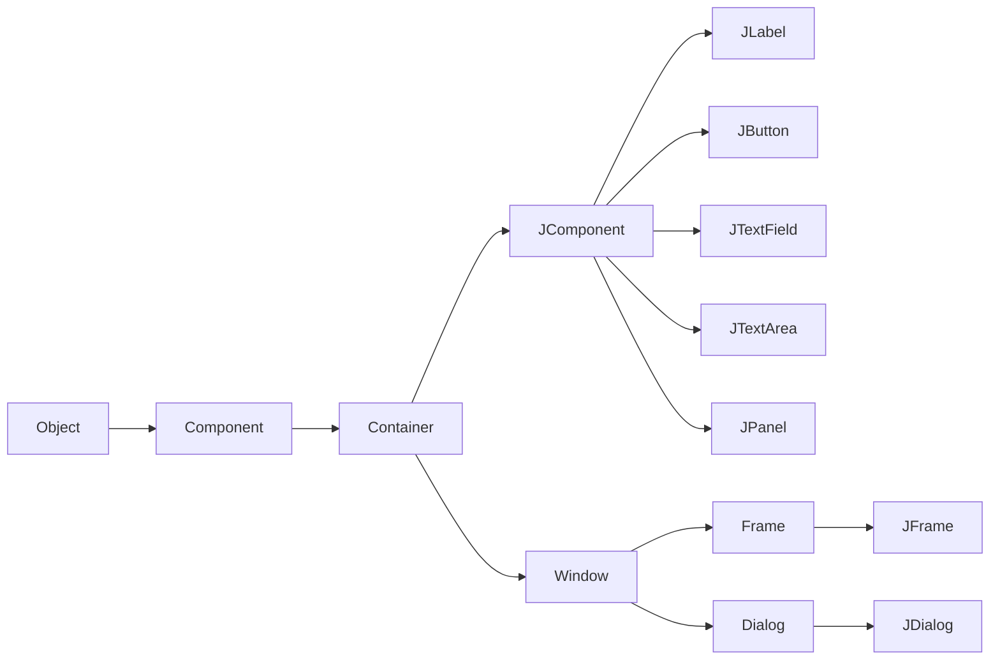
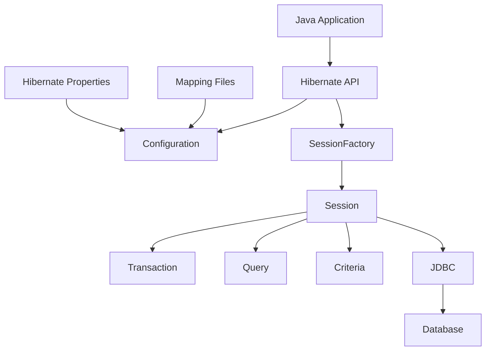
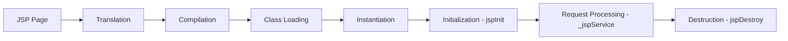
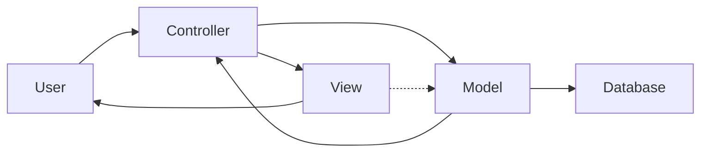
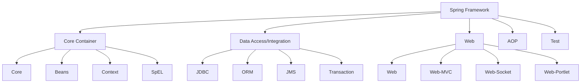

## Question 1(a) [3 marks]

**Draw and explain swing class hierarchy.**

**Answer**:

**Diagram:**



- **Component**: Base class for all GUI components
- **Container**: Components that can hold other components
- **JComponent**: Base class for all Swing components

**Mnemonic:** "Objects Contain Components Jointly"

---

## Question 1(b) [4 marks]

**List out various Layout Managers. Explain Flow Layout manager with Example.**

**Answer**:

**Table of Layout Managers:**

| Layout Manager | Description |
|----------------|-------------|
| FlowLayout | Arranges components left to right |
| BorderLayout | Five regions: North, South, East, West, Center |
| GridLayout | Equal-sized rectangular grid |
| CardLayout | Stack of components |
| BoxLayout | Single row or column |

**FlowLayout Example:**

```java
JFrame frame = new JFrame();
frame.setLayout(new FlowLayout());
frame.add(new JButton("Button1"));
frame.add(new JButton("Button2"));
frame.setSize(300, 100);
frame.setVisible(true);
```

- **Default alignment**: Components flow left to right
- **Wrapping**: Components wrap to next line when needed

**Mnemonic:** "Flow Goes Left Right"

---

## Question 1(c) [7 marks]

**Develop a Java Swing program for a counter application having "Increment" and "Decrement" buttons with initial count of 0 displayed in the label. When "Increment" is clicked, the count increases by 1, and when "Decrement" is clicked, the count decreases by 1. A message dialog should be displayed when the counter goes below 0.**

**Answer**:

**Code:**

```java
import javax.swing.*;
import java.awt.*;
import java.awt.event.*;

public class CounterApp extends JFrame implements ActionListener {
    private int count = 0;
    private JLabel countLabel;
    private JButton incButton, decButton;
    
    public CounterApp() {
        setTitle("Counter Application");
        setLayout(new FlowLayout());
        
        countLabel = new JLabel("Count: " + count);
        incButton = new JButton("Increment");
        decButton = new JButton("Decrement");
        
        incButton.addActionListener(this);
        decButton.addActionListener(this);
        
        add(countLabel);
        add(incButton);
        add(decButton);
        
        setSize(250, 100);
        setDefaultCloseOperation(JFrame.EXIT_ON_CLOSE);
        setVisible(true);
    }
    
    public void actionPerformed(ActionEvent e) {
        if(e.getSource() == incButton) {
            count++;
        } else if(e.getSource() == decButton) {
            count--;
            if(count < 0) {
                JOptionPane.showMessageDialog(this, "Counter below zero!");
            }
        }
        countLabel.setText("Count: " + count);
    }
    
    public static void main(String[] args) {
        new CounterApp();
    }
}
```

- **Event handling**: ActionListener interface implementation
- **Dialog display**: JOptionPane for negative counter warning
- **Label update**: Real-time count display

**Mnemonic:** "Increment Decrements Create Dialogs"

---

## Question 1(c) OR [7 marks]

**Create a Swing application with a menu bar containing a "File" menu having menu items "New", "Open", and "Exit". When the user clicks "Exit", the application should close. Add keyboard shortcuts for file menu items. Also add a "Help" menu having menu item "About". Display a message box which shows description of this program when 'About' is clicked.**

**Answer**:

**Code:**

```java
import javax.swing.*;
import java.awt.event.*;

public class MenuApp extends JFrame implements ActionListener {
    
    public MenuApp() {
        setTitle("Menu Application");
        
        JMenuBar menuBar = new JMenuBar();
        
        JMenu fileMenu = new JMenu("File");
        JMenuItem newItem = new JMenuItem("New");
        JMenuItem openItem = new JMenuItem("Open");
        JMenuItem exitItem = new JMenuItem("Exit");
        
        newItem.setAccelerator(KeyStroke.getKeyStroke(KeyEvent.VK_N, ActionEvent.CTRL_MASK));
        openItem.setAccelerator(KeyStroke.getKeyStroke(KeyEvent.VK_O, ActionEvent.CTRL_MASK));
        exitItem.setAccelerator(KeyStroke.getKeyStroke(KeyEvent.VK_X, ActionEvent.CTRL_MASK));
        
        newItem.addActionListener(this);
        openItem.addActionListener(this);
        exitItem.addActionListener(this);
        
        fileMenu.add(newItem);
        fileMenu.add(openItem);
        fileMenu.addSeparator();
        fileMenu.add(exitItem);
        
        JMenu helpMenu = new JMenu("Help");
        JMenuItem aboutItem = new JMenuItem("About");
        aboutItem.addActionListener(this);
        helpMenu.add(aboutItem);
        
        menuBar.add(fileMenu);
        menuBar.add(helpMenu);
        
        setJMenuBar(menuBar);
        setSize(400, 300);
        setDefaultCloseOperation(JFrame.EXIT_ON_CLOSE);
        setVisible(true);
    }
    
    public void actionPerformed(ActionEvent e) {
        String command = e.getActionCommand();
        
        if(command.equals("Exit")) {
            System.exit(0);
        } else if(command.equals("About")) {
            JOptionPane.showMessageDialog(this, 
                "Menu Application v1.0\nDemonstrates Swing menus with shortcuts");
        }
    }
    
    public static void main(String[] args) {
        new MenuApp();
    }
}
```

- **Keyboard shortcuts**: Ctrl+N, Ctrl+O, Ctrl+X accelerators
- **Menu structure**: File and Help menus with separators
- **About dialog**: Program description display

**Mnemonic:** "Menus Need Shortcuts Always"

---

## Question 2(a) [3 marks]

**List out types of JDBC Drivers. Explain Type-4 Driver.**

**Answer**:

**Table of JDBC Drivers:**

| Type | Name | Description |
|------|------|-------------|
| Type-1 | JDBC-ODBC Bridge | Uses ODBC driver |
| Type-2 | Native-API Driver | Uses database native libraries |
| Type-3 | Network Protocol Driver | Uses middleware server |
| Type-4 | Thin Driver | Pure Java driver |

**Type-4 Driver Features:**

- **Pure Java**: No native code required
- **Direct communication**: Connects directly to database
- **Platform independent**: Works on any OS with JVM

**Mnemonic:** "Type Four: Pure Java Door"

---

## Question 2(b) [4 marks]

**Explain features of Java Foundation Classes (JFC).**

**Answer**:

**JFC Components:**

- **Swing**: Advanced GUI components
- **AWT**: Basic GUI toolkit
- **Accessibility**: Support for disabled users
- **2D Graphics**: Enhanced drawing capabilities
- **Drag and Drop**: File transfer support

**Key Features:**

- **Pluggable Look and Feel**: Change UI appearance
- **Lightweight components**: Better performance
- **MVC architecture**: Separation of concerns
- **Event handling**: Robust event system

**Mnemonic:** "Java Foundation Creates Swing"

---

## Question 2(c) [7 marks]

**Draw and explain the architecture of Hibernate.**

**Answer**:

**Diagram:**



**Architecture Components:**

- **Configuration**: Reads mapping files and properties
- **SessionFactory**: Factory for Session objects
- **Session**: Interface between application and database
- **Transaction**: Represents database transaction
- **Query/Criteria**: For database queries

**Hibernate Benefits:**

- **Object-Relational Mapping**: Maps Java objects to database tables
- **Automatic SQL generation**: No manual SQL writing
- **Caching**: First-level and second-level caching
- **Lazy loading**: Load data only when needed

**Mnemonic:** "Sessions Configure Factories Automatically"

---

## Question 2(a) OR [3 marks]

**Explain the components of the JDBC API.**

**Answer**:

**JDBC API Components:**

- **DriverManager**: Manages database drivers
- **Connection**: Represents database connection
- **Statement**: Executes SQL queries
- **ResultSet**: Holds query results
- **SQLException**: Handles SQL errors

**Component Functions:**

- **Driver registration**: DriverManager.registerDriver()
- **Connection establishment**: DriverManager.getConnection()
- **Query execution**: Statement.executeQuery()

**Mnemonic:** "Drivers Connect Statements Returning Results"

---

## Question 2(b) OR [4 marks]

**Explain any two Swing controls with example.**

**Answer**:

**JButton Control:**

```java
JButton button = new JButton("Click Me");
button.addActionListener(new ActionListener() {
    public void actionPerformed(ActionEvent e) {
        System.out.println("Button clicked!");
    }
});
```

**JTextField Control:**

```java
JTextField textField = new JTextField(20);
textField.setText("Enter text here");
String text = textField.getText();
```

**Features:**

- **JButton**: Triggers actions when clicked
- **JTextField**: Single-line text input field
- **Event handling**: Both support ActionListener

**Mnemonic:** "Buttons Text Fields Handle Events"

---

## Question 2(c) OR [7 marks]

**Write a Java program using JDBC to insert enrollment_number, name and age data into the 'student' table of the 'info' database using a prepared statement.**

**Answer**:

**Code:**

```java
import java.sql.*;

public class StudentInsert {
    public static void main(String[] args) {
        String url = "jdbc:mysql://localhost:3306/info";
        String username = "root";
        String password = "password";
        
        try {
            Class.forName("com.mysql.cj.jdbc.Driver");
            Connection conn = DriverManager.getConnection(url, username, password);
            
            String sql = "INSERT INTO student (enrollment_number, name, age) VALUES (?, ?, ?)";
            PreparedStatement pstmt = conn.prepareStatement(sql);
            
            pstmt.setString(1, "21IT001");
            pstmt.setString(2, "John Doe");
            pstmt.setInt(3, 20);
            
            int rowsAffected = pstmt.executeUpdate();
            System.out.println("Rows inserted: " + rowsAffected);
            
            pstmt.close();
            conn.close();
        } catch(Exception e) {
            System.out.println("Error: " + e.getMessage());
        }
    }
}
```

**Key Components:**

- **PreparedStatement**: Prevents SQL injection
- **Parameter binding**: Using ? placeholders
- **Connection management**: Proper resource cleanup
- **Exception handling**: Try-catch for database errors

**Mnemonic:** "Prepared Statements Prevent Problems"

---

## Question 3(a) [3 marks]

**Explain various features of Servlet.**

**Answer**:

**Servlet Features:**

- **Platform independent**: Runs on any OS with Java
- **Server-side processing**: Executes on web server
- **Protocol independent**: Not limited to HTTP
- **Extensible**: Can be extended for specific needs
- **Robust**: Built-in exception handling

**Additional Features:**

- **Multithreading**: Handles multiple requests simultaneously
- **Portable**: Write once, run anywhere
- **Secure**: Java security features

**Mnemonic:** "Servlets Process Protocols Portably"

---

## Question 3(b) [4 marks]

**Explain Servlet life cycle.**

**Answer**:

**Servlet Life Cycle Stages:**

| Stage | Method | Description |
|-------|--------|-------------|
| Loading | - | Servlet class loaded by container |
| Instantiation | - | Servlet object created |
| Initialization | init() | Called once when servlet starts |
| Service | service() | Handles each client request |
| Destruction | destroy() | Called before servlet removal |

**Life Cycle Flow:**

1. **Container loads** servlet class
2. **Creates instance** of servlet
3. **Calls init()** method once
4. **Calls service()** for each request
5. **Calls destroy()** before removal

**Mnemonic:** "Load Instance Initialize Service Destroy"

---

## Question 3(c) [7 marks]

**What is session? Write a Java servlet program demonstrating how session management can be achieved using HttpSession object, including the necessary HTML files.**

**Answer**:

**Session Definition:**
Session is a way to store user-specific data across multiple HTTP requests. It maintains state between client and server.

**Servlet Code:**

```java
import java.io.*;
import javax.servlet.*;
import javax.servlet.http.*;

public class SessionServlet extends HttpServlet {
    protected void doGet(HttpServletRequest request, HttpServletResponse response) 
            throws ServletException, IOException {
        
        response.setContentType("text/html");
        PrintWriter out = response.getWriter();
        
        HttpSession session = request.getSession(true);
        String name = request.getParameter("name");
        
        if(name != null) {
            session.setAttribute("username", name);
        }
        
        String username = (String)session.getAttribute("username");
        Integer visitCount = (Integer)session.getAttribute("visitCount");
        
        if(visitCount == null) {
            visitCount = 1;
        } else {
            visitCount++;
        }
        session.setAttribute("visitCount", visitCount);
        
        out.println("<html><body>");
        out.println("<h2>Session Demo</h2>");
        if(username != null) {
            out.println("<p>Welcome " + username + "!</p>");
        }
        out.println("<p>Visit count: " + visitCount + "</p>");
        out.println("<p>Session ID: " + session.getId() + "</p>");
        out.println("<a href='index.html'>Back to form</a>");
        out.println("</body></html>");
    }
}
```

**HTML File (index.html):**

```html
<!DOCTYPE html>
<html>
<head>
    <title>Session Demo</title>
</head>
<body>
    <h2>Enter Your Name</h2>
    <form action="SessionServlet" method="get">
        Name: <input type="text" name="name" required>
        <input type="submit" value="Submit">
    </form>
</body>
</html>
```

**Session Management Features:**

- **getAttribute/setAttribute**: Store and retrieve session data
- **Session ID**: Unique identifier for each session
- **Automatic creation**: Session created when needed

**Mnemonic:** "Sessions Store State Safely"

---

## Question 3(a) OR [3 marks]

**Explain web.xml file in servlet.**

**Answer**:

**web.xml Purpose:**
Web.xml is the deployment descriptor file that configures servlet mappings, parameters, and other web application settings.

**Key Elements:**

- **servlet**: Defines servlet configuration
- **servlet-mapping**: Maps URL patterns to servlets
- **init-param**: Servlet initialization parameters
- **welcome-file-list**: Default pages

**Example Configuration:**

```xml
<servlet>
    <servlet-name>MyServlet</servlet-name>
    <servlet-class>com.example.MyServlet</servlet-class>
</servlet>
<servlet-mapping>
    <servlet-name>MyServlet</servlet-name>
    <url-pattern>/myservlet</url-pattern>
</servlet-mapping>
```

**Mnemonic:** "Web XML Maps Servlets"

---

## Question 3(b) OR [4 marks]

**Explain advantages and disadvantages of servlets.**

**Answer**:

**Advantages:**

- **Platform independent**: Java-based portability
- **Performance**: Faster than CGI scripts
- **Robust**: Exception handling and memory management
- **Secure**: Java security features
- **Extensible**: Can be extended and customized

**Disadvantages:**

- **Java knowledge required**: Need Java programming skills
- **Mixing presentation**: HTML mixed with Java code
- **Debugging complexity**: Server-side debugging challenges
- **Limited design separation**: Logic and presentation together

**Comparison Table:**

| Aspect | Advantage | Disadvantage |
|--------|-----------|--------------|
| Performance | Fast execution | - |
| Development | - | Complex debugging |
| Portability | Platform independent | - |
| Code mixing | - | HTML in Java |

**Mnemonic:** "Performance Portability Presents Problems"

---

## Question 3(c) OR [7 marks]

**Write a Java servlet program for deleting a specific entry from the "student" table of 'info' database. The servlet should accept input student ID from an HTML form and delete the corresponding record from the database.**

**Answer**:

**Servlet Code:**

```java
import java.io.*;
import java.sql.*;
import javax.servlet.*;
import javax.servlet.http.*;

public class DeleteStudentServlet extends HttpServlet {
    protected void doPost(HttpServletRequest request, HttpServletResponse response) 
            throws ServletException, IOException {
        
        response.setContentType("text/html");
        PrintWriter out = response.getWriter();
        
        String studentId = request.getParameter("studentId");
        
        try {
            Class.forName("com.mysql.cj.jdbc.Driver");
            Connection conn = DriverManager.getConnection(
                "jdbc:mysql://localhost:3306/info", "root", "password");
            
            String sql = "DELETE FROM student WHERE id = ?";
            PreparedStatement pstmt = conn.prepareStatement(sql);
            pstmt.setString(1, studentId);
            
            int rowsDeleted = pstmt.executeUpdate();
            
            out.println("<html><body>");
            out.println("<h2>Delete Student Result</h2>");
            
            if(rowsDeleted > 0) {
                out.println("<p>Student with ID " + studentId + " deleted successfully!</p>");
            } else {
                out.println("<p>No student found with ID " + studentId + "</p>");
            }
            
            out.println("<a href='delete.html'>Delete another student</a>");
            out.println("</body></html>");
            
            pstmt.close();
            conn.close();
            
        } catch(Exception e) {
            out.println("<p>Error: " + e.getMessage() + "</p>");
        }
    }
}
```

**HTML Form (delete.html):**

```html
<!DOCTYPE html>
<html>
<head>
    <title>Delete Student</title>
</head>
<body>
    <h2>Delete Student Record</h2>
    <form action="DeleteStudentServlet" method="post">
        Student ID: <input type="text" name="studentId" required>
        <input type="submit" value="Delete Student">
    </form>
</body>
</html>
```

**Key Features:**

- **SQL DELETE operation**: Removes record from database
- **PreparedStatement**: Prevents SQL injection attacks
- **Error handling**: Try-catch for database exceptions
- **User feedback**: Success/failure messages

**Mnemonic:** "Delete Database Data Dynamically"

---

## Question 4(a) [3 marks]

**Explain difference between JSP and Servlet.**

**Answer**:

**JSP vs Servlet Comparison:**

| Aspect | JSP | Servlet |
|--------|-----|---------|
| **Code structure** | HTML with Java code | Java with HTML output |
| **Development** | Easier for web designers | Better for Java developers |
| **Compilation** | Auto-compiled to servlet | Manual compilation needed |
| **Maintenance** | Easier to maintain | More complex maintenance |
| **Performance** | Slower first request | Faster execution |

**Key Differences:**

- **JSP**: Presentation-focused with embedded Java
- **Servlet**: Logic-focused with HTML generation
- **Usage**: JSP for UI, Servlet for business logic

**Mnemonic:** "JSP Presents, Servlets Serve"

---

## Question 4(b) [4 marks]

**Explain life cycle of JSP.**

**Answer**:

**JSP Life Cycle Phases:**



**Phase Descriptions:**

- **Translation**: JSP converted to servlet source code
- **Compilation**: Servlet source compiled to bytecode
- **Loading**: Servlet class loaded into memory
- **Instantiation**: Servlet object created
- **Initialization**: jspInit() method called once
- **Service**: _jspService() handles each request
- **Destruction**: jspDestroy() called before removal

**Mnemonic:** "Translation Compiles Loading Instances Initialize Service Destroy"

---

## Question 4(c) [7 marks]

**Create a JSP program that acts as a simple calculator. The program should have a HTML form with two textboxes where users can input numbers and a dropdown menu to select an operation (addition, subtraction, multiplication, or division). When the user submits the form, the entered numbers and the chosen operation should be sent to the next page. On the next page, the program should calculate the result based on the chosen operation and display it.**

**Answer**:

**HTML Form (calculator.html):**

```html
<!DOCTYPE html>
<html>
<head>
    <title>Simple Calculator</title>
</head>
<body>
    <h2>Simple Calculator</h2>
    <form action="calculate.jsp" method="post">
        <table>
            <tr>
                <td>First Number:</td>
                <td><input type="number" name="num1" required></td>
            </tr>
            <tr>
                <td>Second Number:</td>
                <td><input type="number" name="num2" required></td>
            </tr>
            <tr>
                <td>Operation:</td>
                <td>
                    <select name="operation" required>
                        <option value="add">Addition (+)</option>
                        <option value="subtract">Subtraction (-)</option>
                        <option value="multiply">Multiplication (×)</option>
                        <option value="divide">Division (÷)</option>
                    </select>
                </td>
            </tr>
            <tr>
                <td colspan="2">
                    <input type="submit" value="Calculate">
                    <input type="reset" value="Clear">
                </td>
            </tr>
        </table>
    </form>
</body>
</html>
```

**JSP Calculator (calculate.jsp):**

```jsp
<%@ page language="java" contentType="text/html; charset=UTF-8" pageEncoding="UTF-8"%>
<!DOCTYPE html>
<html>
<head>
    <title>Calculator Result</title>
</head>
<body>
    <h2>Calculator Result</h2>
    
    <%
        String num1Str = request.getParameter("num1");
        String num2Str = request.getParameter("num2");
        String operation = request.getParameter("operation");
        
        double num1 = Double.parseDouble(num1Str);
        double num2 = Double.parseDouble(num2Str);
        double result = 0;
        String operationSymbol = "";
        boolean validOperation = true;
        
        switch(operation) {
            case "add":
                result = num1 + num2;
                operationSymbol = "+";
                break;
            case "subtract":
                result = num1 - num2;
                operationSymbol = "-";
                break;
            case "multiply":
                result = num1 * num2;
                operationSymbol = "×";
                break;
            case "divide":
                if(num2 != 0) {
                    result = num1 / num2;
                    operationSymbol = "÷";
                } else {
                    validOperation = false;
                }
                break;
            default:
                validOperation = false;
        }
    %>
    
    <div style="border: 1px solid #ccc; padding: 20px; width: 300px;">
        <h3>Calculation Details:</h3>
        <p><strong>First Number:</strong> <%= num1 %></p>
        <p><strong>Second Number:</strong> <%= num2 %></p>
        <p><strong>Operation:</strong> <%= operationSymbol %></p>
        
        <% if(validOperation) { %>
            <p><strong>Result:</strong> <%= num1 %> <%= operationSymbol %> <%= num2 %> = <span style="color: blue; font-size: 18px;"><%= result %></span></p>
        <% } else { %>
            <p style="color: red;"><strong>Error:</strong> Division by zero is not allowed!</p>
        <% } %>
    </div>
    
    <br>
    <a href="calculator.html">← Back to Calculator</a>
</body>
</html>
```

**Key Features:**

- **Form validation**: Required fields and number inputs
- **Operation selection**: Dropdown with four basic operations
- **Error handling**: Division by zero prevention
- **User-friendly display**: Formatted result presentation
- **Navigation**: Link back to calculator form

**Mnemonic:** "Calculate Add Subtract Multiply Divide"

---

## Question 4(a) OR [3 marks]

**Explain page directive in JSP.**

**Answer**:

**Page Directive Purpose:**
Page directive provides instructions to JSP container about page configuration and processing.

**Syntax:**

```jsp
<%@ page attribute="value" %>
```

**Common Attributes:**

- **language**: Scripting language (default: java)
- **contentType**: MIME type and character encoding
- **import**: Java packages to import
- **session**: Enable/disable session (true/false)
- **errorPage**: Error handling page URL

**Example:**

```jsp
<%@ page language="java" 
         contentType="text/html; charset=UTF-8"
         import="java.util.*,java.sql.*"
         session="true"
         errorPage="error.jsp" %>
```

**Mnemonic:** "Page Directives Direct Processing"

---

## Question 4(b) OR [4 marks]

**Explain JSP declaration tag with example.**

**Answer**:

**JSP Declaration Tag:**
Declaration tag is used to declare variables, methods, and classes that become part of the servlet class.

**Syntax:**

```jsp
<%! declaration code %>
```

**Example:**

```jsp
<%! 
    int counter = 0;
    
    public String getCurrentTime() {
        return new java.util.Date().toString();
    }
    
    private void logVisit() {
        System.out.println("Page visited at: " + getCurrentTime());
    }
%>

<html>
<body>
    <h2>Declaration Tag Demo</h2>
    <%
        counter++;
        logVisit();
    %>
    <p>Page visit count: <%= counter %></p>
    <p>Current time: <%= getCurrentTime() %></p>
</body>
</html>
```

**Key Points:**

- **Class-level scope**: Variables are instance variables
- **Method declaration**: Can declare methods and classes
- **Shared across requests**: Values persist between requests
- **Thread safety**: Need to handle concurrent access

**Mnemonic:** "Declarations Define Class Data"

---

## Question 4(c) OR [7 marks]

**What is cookie? Write a JSP program demonstrating how session management can be achieved using cookies, including the necessary HTML files.**

**Answer**:

**Cookie Definition:**
Cookie is a small piece of data stored on the client-side browser to maintain state between HTTP requests.

**HTML Form (login.html):**

```html
<!DOCTYPE html>
<html>
<head>
    <title>Login with Cookies</title>
</head>
<body>
    <h2>User Login</h2>
    <form action="setCookie.jsp" method="post">
        <table>
            <tr>
                <td>Username:</td>
                <td><input type="text" name="username" required></td>
            </tr>
            <tr>
                <td>Password:</td>
                <td><input type="password" name="password" required></td>
            </tr>
            <tr>
                <td>Remember Me:</td>
                <td><input type="checkbox" name="remember" value="yes"></td>
            </tr>
            <tr>
                <td colspan="2">
                    <input type="submit" value="Login">
                </td>
            </tr>
        </table>
    </form>
</body>
</html>
```

**Set Cookie JSP (setCookie.jsp):**

```jsp
<%@ page language="java" contentType="text/html; charset=UTF-8" %>
<!DOCTYPE html>
<html>
<head>
    <title>Login Success</title>
</head>
<body>
    <%
        String username = request.getParameter("username");
        String password = request.getParameter("password");
        String remember = request.getParameter("remember");
        
        if("admin".equals(username) && "password".equals(password)) {
            if("yes".equals(remember)) {
                Cookie userCookie = new Cookie("username", username);
                Cookie loginTime = new Cookie("loginTime", String.valueOf(System.currentTimeMillis()));
                
                userCookie.setMaxAge(7 * 24 * 60 * 60); // 7 days
                loginTime.setMaxAge(7 * 24 * 60 * 60);
                
                response.addCookie(userCookie);
                response.addCookie(loginTime);
            }
    %>
            <h2>Login Successful!</h2>
            <p>Welcome, <%= username %>!</p>
            <p>Login time: <%= new java.util.Date() %></p>
            <a href="welcome.jsp">Go to Welcome Page</a>
    <%
        } else {
    %>
            <h2>Login Failed!</h2>
            <p style="color: red;">Invalid username or password!</p>
            <a href="login.html">Try Again</a>
    <%
        }
    %>
</body>
</html>
```

**Welcome Page JSP (welcome.jsp):**

```jsp
<%@ page language="java" contentType="text/html; charset=UTF-8" %>
<!DOCTYPE html>
<html>
<head>
    <title>Welcome Page</title>
</head>
<body>
    <h2>Welcome Page</h2>
    <%
        Cookie[] cookies = request.getCookies();
        String savedUsername = null;
        String loginTime = null;
        
        if(cookies != null) {
            for(Cookie cookie : cookies) {
                if("username".equals(cookie.getName())) {
                    savedUsername = cookie.getValue();
                } else if("loginTime".equals(cookie.getName())) {
                    loginTime = cookie.getValue();
                }
            }
        }
        
        if(savedUsername != null) {
    %>
            <p>Hello, <%= savedUsername %>! You are logged in.</p>
            <% if(loginTime != null) { %>
                <p>Last login: <%= new java.util.Date(Long.parseLong(loginTime)) %></p>
            <% } %>
            <a href="logout.jsp">Logout</a>
    <%
        } else {
    %>
            <p>Please <a href="login.html">login</a> to access this page.</p>
    <%
        }
    %>
</body>
</html>
```

**Cookie Features:**

- **Client-side storage**: Data stored in browser
- **Persistence**: Can survive browser sessions
- **Automatic sending**: Sent with each request
- **Size limitation**: Maximum 4KB per cookie

**Mnemonic:** "Cookies Create Client Cache"

---

## Question 5(a) [3 marks]

**Compare Spring and Spring Boot.**

**Answer**:

**Spring vs Spring Boot Comparison:**

| Feature | Spring Framework | Spring Boot |
|---------|-----------------|-------------|
| **Configuration** | XML/Annotation based | Auto-configuration |
| **Setup time** | More time required | Quick setup |
| **Dependency management** | Manual dependency | Starter dependencies |
| **Embedded server** | External server needed | Built-in Tomcat/Jetty |
| **Production ready** | Additional configuration | Ready-to-use features |

**Key Differences:**

- **Spring Boot**: Opinionated framework with defaults
- **Spring Framework**: Flexible but requires more setup
- **Development speed**: Spring Boot faster to develop

**Mnemonic:** "Boot Builds Better Beginnings"

---

## Question 5(b) [4 marks]

**List out all Implicit object in JSP and explain any two.**

**Answer**:

**JSP Implicit Objects List:**

- **request**: HttpServletRequest object
- **response**: HttpServletResponse object
- **session**: HttpSession object
- **application**: ServletContext object
- **out**: JspWriter object
- **page**: Current JSP page instance
- **pageContext**: PageContext object
- **config**: ServletConfig object
- **exception**: Exception object (error pages only)

**Detailed Explanation:**

**1. request Object:**

```jsp
<%
    String name = request.getParameter("name");
    String method = request.getMethod();
    String ip = request.getRemoteAddr();
%>
<p>Name: <%= name %></p>
<p>Method: <%= method %></p>
<p>IP Address: <%= ip %></p>
```

**2. session Object:**

```jsp
<%
    session.setAttribute("user", "admin");
    String user = (String)session.getAttribute("user");
    String sessionId = session.getId();
%>
<p>User: <%= user %></p>
<p>Session ID: <%= sessionId %></p>
```

**Mnemonic:** "Request Response Session Application Out"

---

## Question 5(c) [7 marks]

**Explain MVC architecture.**

**Answer**:

**MVC Architecture Diagram:**



**MVC Components:**

**Model Layer:**

- **Data representation**: Business objects and data
- **Business logic**: Core application functionality
- **Database interaction**: Data access and manipulation
- **Validation**: Data integrity checks

**View Layer:**

- **Presentation logic**: User interface components
- **Display data**: Shows information to user
- **User interaction**: Forms, buttons, menus
- **Templates**: Reusable UI components

**Controller Layer:**

- **Request handling**: Processes user requests
- **Flow control**: Manages application flow
- **Model coordination**: Interacts with model layer
- **View selection**: Chooses appropriate view

**MVC Benefits:**

- **Separation of concerns**: Clear responsibility division
- **Maintainability**: Easier to modify and extend
- **Reusability**: Components can be reused
- **Testability**: Each layer can be tested independently
- **Parallel development**: Teams can work simultaneously

**Example Flow:**

1. User submits form (View → Controller)
2. Controller validates input
3. Controller calls Model for business logic
4. Model interacts with database
5. Model returns data to Controller
6. Controller selects View
7. View displays result to User

**Mnemonic:** "Models View Controllers Separate"

---

## Question 5(a) OR [3 marks]

**Explain Dependency Injection.**

**Answer**:

**Dependency Injection Definition:**
Dependency Injection is a design pattern where dependencies are provided to an object rather than the object creating them itself.

**Types of DI:**

- **Constructor Injection**: Dependencies passed through constructor
- **Setter Injection**: Dependencies set through setter methods
- **Field Injection**: Dependencies injected directly into fields

**Example:**

```java
// Without DI
public class UserService {
    private UserRepository repository = new UserRepository();
}

// With DI
public class UserService {
    private UserRepository repository;
    
    public UserService(UserRepository repository) {
        this.repository = repository;
    }
}
```

**DI Benefits:**

- **Loose coupling**: Reduced dependencies between classes
- **Testability**: Easy to mock dependencies
- **Flexibility**: Easy to change implementations

**Mnemonic:** "Dependencies Injected, Not Instantiated"

---

## Question 5(b) OR [4 marks]

**List the JSTL core tags and explain any two with example.**

**Answer**:

**JSTL Core Tags List:**

- **c:out**: Display expression value
- **c:set**: Set variable value
- **c:if**: Conditional processing
- **c:choose**: Multiple conditional processing
- **c:forEach**: Loop iteration
- **c:forTokens**: Token-based iteration
- **c:import**: Include content
- **c:url**: URL generation
- **c:redirect**: Redirect response

**Detailed Examples:**

**1. c:forEach Tag:**

```jsp
<%@ taglib uri="http://java.sun.com/jsp/jstl/core" prefix="c" %>

<c:set var="numbers" value="1,2,3,4,5" />
<ul>
<c:forEach var="num" items="${numbers}" varStatus="status">
    <li>Number ${status.index + 1}: ${num}</li>
</c:forEach>
</ul>
```

**2. c:if Tag:**

```jsp
<c:set var="age" value="20" />
<c:if test="${age >= 18}">
    <p style="color: green;">You are eligible to vote!</p>
</c:if>
<c:if test="${age < 18}">
    <p style="color: red;">You are not eligible to vote!</p>
</c:if>
```

**Tag Features:**

- **Expression Language**: Uses EL syntax ${expression}
- **Conditional logic**: Replaces Java if-else statements
- **Loop processing**: Iterates over collections
- **Clean separation**: No Java code in JSP

**Mnemonic:** "Core Tags Control Conditions"

---

## Question 5(c) OR [7 marks]

**Explain the architecture of Spring framework.**

**Answer**:

**Spring Framework Architecture:**



**Core Container:**

- **Core module**: Fundamental features and IoC container
- **Beans module**: Bean factory and dependency injection
- **Context module**: Application context and internationalization
- **SpEL module**: Spring Expression Language

**Data Access/Integration:**

- **JDBC module**: Database connectivity and templates
- **ORM module**: Integration with Hibernate, JPA
- **JMS module**: Java Message Service support
- **Transaction module**: Declarative transaction management

**Web Layer:**

- **Web module**: Basic web features and HTTP utilities
- **Web-MVC module**: Model-View-Controller implementation
- **Web-Socket module**: WebSocket support
- **Web-Portlet module**: Portlet applications

**AOP (Aspect-Oriented Programming):**

- **Cross-cutting concerns**: Logging, security, transaction
- **Proxy-based**: Method interception
- **Declarative**: Annotation-based configuration

**Spring Framework Benefits:**

- **Lightweight**: Minimal overhead
- **Non-invasive**: No framework-specific code required
- **Loosely coupled**: Dependency injection promotes loose coupling
- **Declarative**: Configuration through annotations/XML
- **Comprehensive**: Complete enterprise application framework

**Key Features:**

- **IoC Container**: Manages object lifecycle
- **AOP Support**: Cross-cutting concerns handling
- **Transaction Management**: Declarative transactions
- **MVC Framework**: Web application development
- **Testing Support**: Comprehensive testing utilities

**Mnemonic:** "Spring's Architecture Supports Complete Applications"
