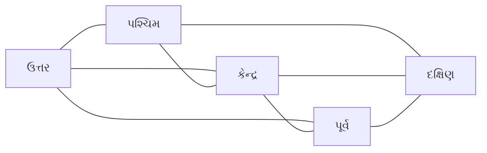
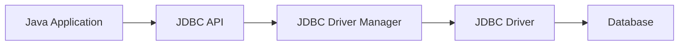
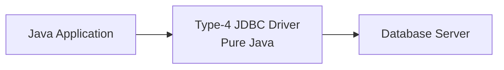
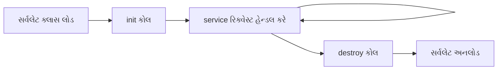
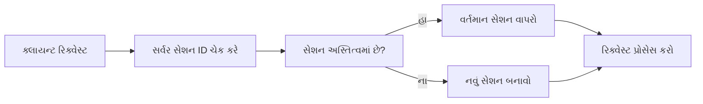
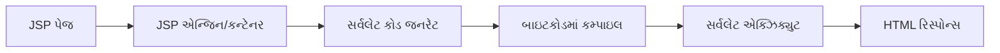
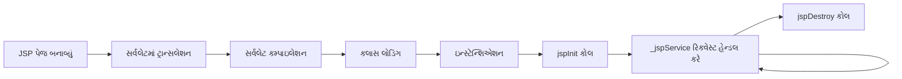
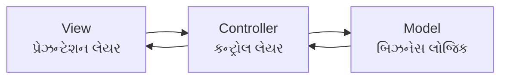
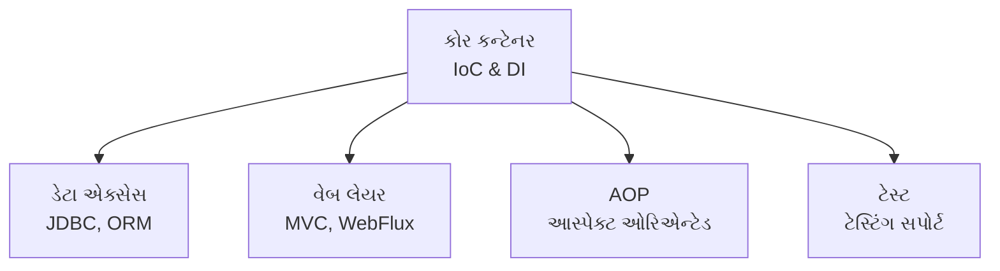

## પ્રશ્ન 1(અ) [3 ગુણ]

**તેના ઉપયોગ સાથે JFC નું વર્ણન કરો.**

**જવાબ:**

JFC (Java Foundation Classes) એ જાવામાં ડેસ્કટોપ એપ્લિકેશન બનાવવા માટેનું વ્યાપક GUI ફ્રેમવર્ક છે.

| કમ્પોનન્ટ | વર્ણન |
|-----------|-------|
| **Swing** | હળવા વજનના GUI કમ્પોનન્ટ |
| **AWT** | મૂળભૂત વિન્ડોઇંગ ટૂલકિટ |
| **Java 2D** | એડવાન્સ ગ્રાફિક્સ અને ઇમેજિંગ |
| **Accessibility** | સહાયક ટેકનોલોજી માટે સપોર્ટ |

- **મુખ્ય ઉપયોગ**: સમૃદ્ધ ડેસ્કટોપ એપ્લિકેશન બનાવવું
- **મુખ્ય ફાયદો**: પ્લેટફોર્મ સ્વતંત્રતા અને સુસંગત દેખાવ

**મેમરી ટ્રીક:** "JFC = Java's Fantastic Components"

## પ્રશ્ન 1(બ) [4 ગુણ]

**AWT અને સ્વિંગ વચ્ચેનો તફાવત સમજાવો.**

**જવાબ:**

| લક્ષણ | AWT | Swing |
|------|-----|-------|
| **કમ્પોનન્ટ** | હેવીવેઇટ (native) | લાઇટવેઇટ (શુદ્ધ જાવા) |
| **પ્લેટફોર્મ** | પ્લેટફોર્મ આધારિત | પ્લેટફોર્મ સ્વતંત્ર |
| **દેખાવ** | Native OS લુક | બદલી શકાય તેવું લુક & ફીલ |
| **પ્રદર્શન** | વધુ ઝડપી | થોડું ધીમું |

- **AWT મર્યાદા**: મર્યાદિત કમ્પોનન્ટ, પ્લેટફોર્મ-વિશિષ્ટ દેખાવ
- **Swing ફાયદો**: સમૃદ્ધ કમ્પોનન્ટ સેટ, કસ્ટમાઇઝેબલ UI

**મેમરી ટ્રીક:** "AWT = Always Weighs Too-much, Swing = Simply Works In New Generation"

## પ્રશ્ન 1(ક) [7 ગુણ]

**વિવિધ ઇવેન્ટ લિસ્નર ની યાદી બનાવો. કોઈપણ એક સમજાવો.**

**જવાબ:**

**ઇવેન્ટ લિસ્નર યાદી:**

| લિસ્નર | હેતુ |
|--------|-----|
| **ActionListener** | બટન ક્લિક, મેનુ પસંદગી |
| **MouseListener** | માઉસ ઇવેન્ટ (ક્લિક, પ્રેસ, રિલીઝ) |
| **KeyListener** | કીબોર્ડ ઇનપુટ ઇવેન્ટ |
| **WindowListener** | વિન્ડો સ્ટેટ ફેરફાર |
| **FocusListener** | કમ્પોનન્ટ ફોકસ ઇવેન્ટ |
| **ItemListener** | ચેકબોક્સ/રેડિયો બટન ફેરફાર |

**ActionListener સમજાવટ:**

- **ઇન્ટરફેસ મેથડ**: `actionPerformed(ActionEvent e)`
- **ઉપયોગ**: બટન ક્લિક અને મેનુ ક્રિયાઓ હેન્ડલ કરે
- **અમલીકરણ**: અનામિક ક્લાસ અથવા lambda expression

```java
button.addActionListener(e -> {
    System.out.println("Button clicked!");
});
```

**મેમરી ટ્રીક:** "AMKWFI Listeners = Action Mouse Key Window Focus Item"

## પ્રશ્ન 1(ક OR) [7 ગુણ]

**વિવિધ લેઆઉટ મેનેજરોની યાદી બનાવો. કોઈપણ એક સમજાવો.**

**જવાબ:**

**લેઆઉટ મેનેજર યાદી:**

| લેઆઉટ મેનેજર | હેતુ |
|-------------|-----|
| **FlowLayout** | ક્રમિક કમ્પોનન્ટ પ્લેસમેન્ટ |
| **BorderLayout** | પાંચ પ્રદેશો (ઉત્તર, દક્ષિણ, પૂર્વ, પશ્ચિમ, કેન્દ્ર) |
| **GridLayout** | ગ્રિડ-આધારિત ગોઠવણી |
| **CardLayout** | કમ્પોનન્ટનો સ્ટેક |
| **BoxLayout** | એક પંક્તિ અથવા સ્તંભ |
| **GridBagLayout** | કન્સ્ટ્રેઇન્ટ સાથે જટિલ ગ્રિડ |

**BorderLayout સમજાવટ:**

- **ડિફોલ્ટ લેઆઉટ**: JFrame અને JDialog માટે
- **પાંચ પ્રદેશો**: ઉત્તર, દક્ષિણ, પૂર્વ, પશ્ચિમ, કેન્દ્ર
- **રીસાઈઝિંગ**: કેન્દ્ર વિસ્તરે છે, અન્ય પ્રાથમિક કદ રાખે છે



**મેમરી ટ્રીક:** "FBGCBG Layouts = Flow Border Grid Card Box GridBag"

## પ્રશ્ન 2(અ) [3 ગુણ]

**ડેટાબેઝને કનેક્ટ કરવાના પગલાંની યાદી બનાવો અને સમજાવો.**

**જવાબ:**

**ડેટાબેઝ કનેક્શન પગલાં:**

| પગલું | ક્રિયા |
|------|------|
| **1. ડ્રાઇવર લોડ** | `Class.forName("driver.class")` |
| **2. કનેક્શન બનાવો** | `DriverManager.getConnection()` |
| **3. સ્ટેટમેન્ટ બનાવો** | `connection.createStatement()` |
| **4. ક્વેરી એક્ઝિક્યુટ કરો** | `statement.executeQuery()` |
| **5. પરિણામ પર પ્રોસેસ કરો** | `resultSet.next()` |
| **6. રિસોર્સ બંધ કરો** | બધા કનેક્શન બંધ કરો |

**મેમરી ટ્રીક:** "LCD EPR = Load Create Driver, Execute Process Results"

## પ્રશ્ન 2(બ) [4 ગુણ]

**3-tier આર્કિટેક્ચર ડાયાગ્રામ સાથે સમજાવો.**

**જવાબ:**

3-tier આર્કિટેક્ચર એપ્લિકેશનને બહેતર જાળવણી માટે ત્રણ લોજિકલ લેયરમાં વિભાજિત કરે છે.


| ટાયર | જવાબદારી |
|-----|---------|
| **પ્રેઝન્ટેશન** | યુઝર ઇન્ટરફેસ અને યુઝર ઇન્ટરેક્શન |
| **એપ્લિકેશન** | બિઝનેસ લોજિક અને પ્રોસેસિંગ |
| **ડેટા** | ડેટા સ્ટોરેજ અને મેનેજમેન્ટ |

- **ફાયદો**: બહેતર સ્કેલેબિલિટી અને જાળવણી
- **ઉદાહરણ**: વેબ બ્રાઉઝર → વેબ સર્વર → ડેટાબેઝ

**મેમરી ટ્રીક:** "PAD = Presentation Application Data"

## પ્રશ્ન 2(ક) [7 ગુણ]

**ઇન્ટરફેસ અને વર્ગો સાથે JDBC API નું વર્ણન કરો.**

**જવાબ:**

**JDBC API કમ્પોનન્ટ્સ:**

| પ્રકાર | કમ્પોનન્ટ | હેતુ |
|------|----------|-----|
| **ઇન્ટરફેસ** | Connection | ડેટાબેઝ કનેક્શન |
| **ઇન્ટરફેસ** | Statement | SQL એક્ઝિક્યુશન |
| **ઇન્ટરફેસ** | ResultSet | ક્વેરી પરિણામો |
| **ઇન્ટરફેસ** | PreparedStatement | પ્રીકમ્પાઇલ્ડ SQL |
| **ક્લાસ** | DriverManager | ડ્રાઇવર મેનેજમેન્ટ |
| **ક્લાસ** | SQLException | એરર હેન્ડલિંગ |

**JDBC આર્કિટેક્ચર:**



- **મુખ્ય ઇન્ટરફેસ**: Connection, Statement, ResultSet, PreparedStatement
- **મુખ્ય ક્લાસ**: કનેક્શન મેનેજમેન્ટ માટે DriverManager
- **એક્સેપ્શન હેન્ડલિંગ**: ડેટાબેઝ એરર માટે SQLException

**મેમરી ટ્રીક:** "CSRP Classes = Connection Statement ResultSet PreparedStatement"

## પ્રશ્ન 2(અ OR) [3 ગુણ]

**JDBC ના ફાયદા અને ગેરફાયદાની યાદી બનાવો.**

**જવાબ:**

**JDBC ફાયદા વિ ગેરફાયદા:**

| ફાયદા | ગેરફાયદા |
|-------|---------|
| **પ્લેટફોર્મ સ્વતંત્ર** | **પર્ફોર્મન્સ ઓવરહેડ** |
| **સ્ટાન્ડર્ડ API** | **જટિલ કન્ફિગરેશન** |
| **બહુવિધ ડેટાબેઝ સપોર્ટ** | **મર્યાદિત ORM ફીચર્સ** |

- **લાભો**: એકવાર લખો, કોઈપણ ડેટાબેઝ સાથે ગમે ત્યાં ચલાવો
- **ખામીઓ**: મેન્યુઅલ SQL અને કનેક્શન મેનેજમેન્ટની જરૂરિયાત

**મેમરી ટ્રીક:** "PSM vs PCL = Platform Standard Multiple vs Performance Complex Limited"

## પ્રશ્ન 2(બ OR) [4 ગુણ]

**2-tier આર્કિટેક્ચર ડાયાગ્રામ સાથે સમજાવો.**

**જવાબ:**

2-tier આર્કિટેક્ચર ક્લાયન્ટને ડેટાબેઝ સર્વર સાથે સીધું જોડે છે.


| ટાયર | જવાબદારી |
|-----|---------|
| **ક્લાયન્ટ** | યુઝર ઇન્ટરફેસ અને બિઝનેસ લોજિક |
| **સર્વર** | ડેટા સ્ટોરેજ અને મેનેજમેન્ટ |

- **ફાયદો**: સરળ આર્કિટેક્ચર, સીધો કમ્યુનિકેશન
- **ગેરફાયદો**: મર્યાદિત સ્કેલેબિલિટી, ટાઈટ કપલિંગ
- **ઉદાહરણ**: ડેસ્કટોપ એપ્લિકેશન સીધું ડેટાબેઝ સાથે જોડાય

**મેમરી ટ્રીક:** "CD = Client Data (direct connection)"

## પ્રશ્ન 2(ક OR) [7 ગુણ]

**JDBC ડ્રાઇવર પ્રકારોની યાદી બનાવો અને TYPE-4 સમજાવો.**

**જવાબ:**

**JDBC ડ્રાઇવર પ્રકારો:**

| પ્રકાર | નામ | વર્ણન |
|------|-----|-------|
| **Type-1** | JDBC-ODBC Bridge | ODBC ડ્રાઇવર વાપરે |
| **Type-2** | Native-API Driver | આંશિક જાવા, આંશિક native |
| **Type-3** | Network Protocol Driver | શુદ્ધ જાવા, middleware |
| **Type-4** | Native Protocol Driver | શુદ્ધ જાવા, સીધું |

**TYPE-4 ડ્રાઇવર સમજાવટ:**

- **શુદ્ધ જાવા**: સંપૂર્ણપણે જાવામાં લખાયેલું
- **સીધો કમ્યુનિકેશન**: ડેટાબેઝ સાથે સીધો વાતચીત
- **પ્લેટફોર્મ સ્વતંત્ર**: native લાઇબ્રેરીની જરૂર નથી
- **શ્રેષ્ઠ પ્રદર્શન**: બધા પ્રકારોમાં સૌથી ઝડપી
- **ઉદાહરણો**: MySQL Connector/J, PostgreSQL JDBC



**મેમરી ટ્રીક:** "ONNN Drivers = ODBC Native Network Native-pure"

## પ્રશ્ન 3(અ) [3 ગુણ]

**સર્વલેટની એપ્લિકેશન સમજાવો.**

**જવાબ:**

**સર્વલેટ એપ્લિકેશન:**

| એપ્લિકેશન | ઉપયોગ |
|----------|------|
| **વેબ ફોર્મ** | HTML ફોર્મ ડેટા પ્રોસેસ કરવું |
| **ડેટાબેઝ ઓપરેશન** | ડેટાબેઝ કનેક્ટ અને મેનિપ્યુલેટ કરવું |
| **સેશન મેનેજમેન્ટ** | યુઝર સેશન ટ્રેક કરવું |
| **ફાઈલ અપલોડ** | ફાઈલ અપલોડ હેન્ડલ કરવું |

- **મુખ્ય ઉપયોગ**: વેબ એપ્લિકેશન માટે સર્વર-સાઇડ જાવા પ્રોગ્રામ
- **સામાન્ય કાર્યો**: રિક્વેસ્ટ પ્રોસેસિંગ, રિસ્પોન્સ જનરેશન

**મેમરી ટ્રીક:** "WDSF = Web Database Session File"

## પ્રશ્ન 3(બ) [4 ગુણ]

**એપ્લેટ અને સર્વલેટ વચ્ચેનો તફાવત સમજાવો.**

**જવાબ:**

| લક્ષણ | એપ્લેટ | સર્વલેટ |
|------|-------|--------|
| **એક્ઝિક્યુશન** | ક્લાયન્ટ-સાઇડ (બ્રાઉઝર) | સર્વર-સાઇડ (વેબ સર્વર) |
| **હેતુ** | યુઝર ઇન્ટરફેસ | રિક્વેસ્ટ પ્રોસેસિંગ |
| **સિક્યોરિટી** | પ્રતિબંધિત (sandbox) | સર્વરની સંપૂર્ણ પહોંચ |
| **પ્રદર્શન** | ક્લાયન્ટ દ્વારા મર્યાદિત | સર્વર રિસોર્સ |

- **એપ્લેટ**: વેબ બ્રાઉઝરમાં ચાલે, મર્યાદિત ક્ષમતાઓ
- **સર્વલેટ**: વેબ સર્વર પર ચાલે, સંપૂર્ણ જાવા ક્ષમતાઓ

**મેમરી ટ્રીક:** "Client vs Server = એપ્લેટ vs સર્વલેટ"

## પ્રશ્ન 3(ક) [7 ગુણ]

**સર્વલેટ ની લાઈફ સાઇકલ વિગતવાર સમજાવો.**

**જવાબ:**

**સર્વલેટ લાઇફ સાઇકલ:**



| તબક્કો | મેથડ | વર્ણન |
|-------|------|-------|
| **લોડિંગ** | ક્લાસ લોડિંગ | વેબ કન્ટેનર સર્વલેટ ક્લાસ લોડ કરે |
| **ઇનિશિયલાઇઝેશન** | `init()` | એકવાર કોલ થાય, રિસોર્સ સેટઅપ |
| **સર્વિસ** | `service()` | દરેક રિક્વેસ્ટ હેન્ડલ કરે (doGet/doPost) |
| **ડિસ્ટ્રક્શન** | `destroy()` | અનલોડ કરતા પહેલા સફાઈ |

- **થ્રેડ સેફ્ટી**: બહુવિધ રિક્વેસ્ટ એકસાથે હેન્ડલ થાય
- **સિંગલ ઇન્સ્ટન્સ**: એક સર્વલેટ ઇન્સ્ટન્સ બધી રિક્વેસ્ટ હેન્ડલ કરે
- **કન્ટેનર મેનેજ્ડ**: વેબ કન્ટેનર લાઇફસાઇકલ મેનેજ કરે

**મેમરી ટ્રીક:** "LISD = Load Init Service Destroy"

## પ્રશ્ન 3(અ OR) [3 ગુણ]

**સર્વલેટ માં web.xml ફાઇલ સમજાવો.**

**જવાબ:**

**web.xml હેતુ:**

| એલિમેન્ટ | વર્ણન |
|---------|-------|
| **ડિપ્લોયમેન્ટ ડિસ્ક્રિપ્ટર** | વેબ એપ્લિકેશન માટે કન્ફિગરેશન ફાઇલ |
| **સર્વલેટ મેપિંગ** | URL પેટર્ન સર્વલેટ સાથે મેપ કરે |
| **ઇનિશિયલાઇઝેશન** | સર્વલેટ પેરામીટર અને લોડ ઓર્ડર |

- **સ્થાન**: WEB-INF ડિરેક્ટરી
- **ફોર્મેટ**: XML કન્ફિગરેશન ફાઇલ

**મેમરી ટ્રીક:** "DMI = Deployment Mapping Initialization"

## પ્રશ્ન 3(બ OR) [4 ગુણ]

**સર્વલેટની વિશેષતાની યાદી બનાવો અને સમજાવો.**

**જવાબ:**

**સર્વલેટ વિશેષતાઓ:**

| વિશેષતા | વર્ણન |
|---------|-------|
| **પ્લેટફોર્મ સ્વતંત્ર** | એકવાર લખો, ગમે ત્યાં ચલાવો |
| **સર્વર-સાઇડ** | વેબ સર્વર પર એક્ઝિક્યુટ થાય |
| **પ્રોટોકોલ સ્વતંત્ર** | HTTP, FTP વગેરે સપોર્ટ કરે |
| **પર્સિસ્ટન્ટ** | રિક્વેસ્ટ વચ્ચે મેમરીમાં રહે |
| **સિક્યોર** | બિલ્ટ-ઇન સિક્યોરિટી ફીચર્સ |

- **પ્રદર્શન**: CGI સ્ક્રિપ્ટ કરતાં બહેતર
- **સ્કેલેબિલિટી**: બહુવિધ રિક્વેસ્ટ કાર્યક્ષમતાથી સંભાળે

**મેમરી ટ્રીક:** "PSPPS = Platform Server Protocol Persistent Secure"

## પ્રશ્ન 3(ક OR) [7 ગુણ]

**સર્વલેટમાં સેશન ટ્રેકિંગ સમજાવો.**

**જવાબ:**

**સેશન ટ્રેકિંગ મેથડ:**

| મેથડ | વર્ણન |
|------|-------|
| **કુકીઝ** | બ્રાઉઝરમાં સ્ટોર થતો નાનો ડેટા |
| **URL રીરાઇટિંગ** | URL માં સેશન ID |
| **હિડન ફોર્મ ફીલ્ડ** | ફોર્મમાં સેશન ડેટા |
| **HttpSession** | સર્વર-સાઇડ સેશન ઓબ્જેક્ટ |

**HttpSession અમલીકરણ:**

```java
HttpSession session = request.getSession();
session.setAttribute("user", username);
String user = (String) session.getAttribute("user");
```



- **હેતુ**: HTTP રિક્વેસ્ટ વચ્ચે સ્ટેટ જાળવવું
- **HttpSession**: સૌથી સામાન્ય રીતે વપરાતો મેથડ

**મેમરી ટ્રીક:** "CUHH = Cookies URL Hidden HttpSession"

## પ્રશ્ન 4(અ) [3 ગુણ]

**JSP નું આર્કિટેક્ચર ડાયાગ્રામ સાથે સમજાવો.**

**જવાબ:**

**JSP આર્કિટેક્ચર:**



| કમ્પોનન્ટ | ભૂમિકા |
|----------|-------|
| **JSP એન્જિન** | JSP ને સર્વલેટમાં રૂપાંતરિત કરે |
| **વેબ કન્ટેનર** | JSP લાઇફસાઇકલ મેનેજ કરે |
| **જનરેટેડ સર્વલેટ** | વાસ્તવિક એક્ઝિક્યુશન યુનિટ |

**મેમરી ટ્રીક:** "JSP = Java Server Pages (Page to Servlet)"

## પ્રશ્ન 4(બ) [4 ગુણ]

**ઉદાહરણ સાથે JSP scripting elements સમજાવો.**

**જવાબ:**

**JSP સ્ક્રિપ્ટિંગ એલિમેન્ટ્સ:**

| એલિમેન્ટ | સિન્ટેક્સ | હેતુ |
|---------|--------|-----|
| **સ્ક્રિપ્ટલેટ** | `<% code %>` | જાવા કોડ બ્લોક |
| **એક્સ્પ્રેશન** | `<%= expression %>` | આઉટપુટ વેલ્યુ |
| **ડિક્લેરેશન** | `<%! declaration %>` | વેરિયેબલ/મેથડ |

**ઉદાહરણો:**

```jsp
<%! int count = 0; %>               <!-- ડિક્લેરેશન -->
<% count++; %>                      <!-- સ્ક્રિપ્ટલેટ -->
<%= "Count: " + count %>            <!-- એક્સ્પ્રેશન -->
```

**મેમરી ટ્રીક:** "SED = Scriptlet Expression Declaration"

## પ્રશ્ન 4(ક) [7 ગુણ]

**JSP જીવન ચક્ર સમજાવો.**

**જવાબ:**

**JSP લાઇફ સાઇકલ તબક્કા:**



| તબક્કો | વર્ણન |
|-------|-------|
| **ટ્રાન્સલેશન** | JSP સર્વલેટ સોર્સમાં કન્વર્ટ |
| **કમ્પાઇલેશન** | સર્વલેટ સોર્સ બાઇટકોડમાં કમ્પાઇલ |
| **લોડિંગ** | સર્વલેટ ક્લાસ JVM દ્વારા લોડ |
| **ઇન્સ્ટેન્શિએશન** | સર્વલેટ ઓબ્જેક્ટ બનાવ્યું |
| **ઇનિશિયલાઇઝેશન** | `jspInit()` મેથડ કોલ |
| **રિક્વેસ્ટ પ્રોસેસિંગ** | `_jspService()` રિક્વેસ્ટ હેન્ડલ કરે |
| **ડિસ્ટ્રક્શન** | `jspDestroy()` સફાઈ મેથડ |

- **કન્ટેનર મેનેજ્ડ**: વેબ કન્ટેનર સંપૂર્ણ લાઇફસાઇકલ હેન્ડલ કરે
- **ઓટોમેટિક**: ટ્રાન્સલેશન અને કમ્પાઇલેશન આપોઆપ થાય

**મેમરી ટ્રીક:** "TCLIIRD = Translation Compilation Loading Instantiation Init Request Destroy"

## પ્રશ્ન 4(અ OR) [3 ગુણ]

**JSP અને સર્વલેટ વચ્ચેનો તફાવત સમજાવો.**

**જવાબ:**

| લક્ષણ | JSP | સર્વલેટ |
|------|-----|--------|
| **કોડ સ્ટાઇલ** | HTML સાથે જાવા | શુદ્ધ જાવા કોડ |
| **ડેવલપમેન્ટ** | UI માટે સરળ | લોજિક માટે વધુ સારું |
| **કમ્પાઇલેશન** | ઓટોમેટિક | મેન્યુઅલ |
| **મોડિફિકેશન** | પુનઃકમ્પાઇલેશનની જરૂર નથી | પુનઃકમ્પાઇલેશન જરૂરી |

**મેમરી ટ્રીક:** "HTML vs Java = JSP vs સર્વલેટ"

## પ્રશ્ન 4(બ OR) [4 ગુણ]

**JSP ના ફાયદાની યાદી બનાવો અને સમજાવો.**

**જવાબ:**

**JSP ફાયદા:**

| ફાયદો | વર્ણન |
|-------|-------|
| **સરળ ડેવલપમેન્ટ** | HTML જેવું સિન્ટેક્સ જાવા સાથે |
| **ઓટોમેટિક કમ્પાઇલેશન** | મેન્યુઅલ કમ્પાઇલેશનની જરૂર નથી |
| **પ્લેટફોર્મ સ્વતંત્ર** | કોઈપણ જાવા-સક્ષમ સર્વર પર ચાલે |
| **ચિંતાઓનું વિભાજન** | ડિઝાઇન લોજિકથી અલગ |
| **પુનઃઉપયોગી કમ્પોનન્ટ** | ટેગ લાઇબ્રેરી અને બીન્સ |

- **ડેવલપર ફ્રેન્ડલી**: વેબ ડિઝાઇનર JSP સાથે સરળતાથી કામ કરી શકે
- **જાળવણી**: સર્વલેટ કરતાં મોડિફાઇ કરવું સરળ

**મેમરી ટ્રીક:** "EAPSR = Easy Automatic Platform Separation Reusable"

## પ્રશ્ન 4(ક OR) [7 ગુણ]

**કુકી શું છે? JSP પૃષ્ઠનો ઉપયોગ કરીને કુકી કેવી રીતે વાંચવી અને કાઢી નાખવી તે સમજાવો.**

**જવાબ:**

**કુકી ઓવરવ્યૂ:**
કુકી એ ક્લાયન્ટના બ્રાઉઝર પર સ્ટોર થતો નાનો ડેટા છે જે સ્ટેટ જાળવવા માટે વપરાય છે.

**કુકી ઓપરેશન:**

| ઓપરેશન | JSP કોડ |
|---------|---------|
| **બનાવવું** | `Cookie cookie = new Cookie("name", "value");` |
| **ઉમેરવું** | `response.addCookie(cookie);` |
| **વાંચવું** | `Cookie[] cookies = request.getCookies();` |
| **કાઢવું** | `cookie.setMaxAge(0);` |

**કુકી વાંચવાનું ઉદાહરણ:**

```jsp
<%
Cookie[] cookies = request.getCookies();
if (cookies != null) {
    for (Cookie cookie : cookies) {
        if ("username".equals(cookie.getName())) {
            out.println("યુઝર: " + cookie.getValue());
        }
    }
}
%>
```

**કુકી કાઢવાનું ઉદાહરણ:**

```jsp
<%
Cookie cookie = new Cookie("username", "");
cookie.setMaxAge(0);
response.addCookie(cookie);
%>
```

**મેમરી ટ્રીક:** "CARD = Create Add Read Delete"

## પ્રશ્ન 5(અ) [3 ગુણ]

**MVC આર્કિટેક્ચરનું મહત્વ સમજાવો.**

**જવાબ:**

**MVC મહત્વ:**

| લાભ | વર્ણન |
|-----|-------|
| **ચિંતાઓનું વિભાજન** | લોજિક, પ્રેઝન્ટેશન, ડેટા અલગ |
| **જાળવણીયોગ્યતા** | વ્યક્તિગત કમ્પોનન્ટ સરળતાથી મોડિફાઇ કરી શકાય |
| **ટેસ્ટેબિલિટી** | કમ્પોનન્ટ સ્વતંત્ર રીતે ટેસ્ટ કરી શકાય |

- **કોડ ઓર્ગેનાઇઝેશન**: વધુ સારી સ્ટ્રક્ચર અને ઓર્ગેનાઇઝેશન
- **ટીમ ડેવલપમેન્ટ**: બહુવિધ ડેવલપર એકસાથે કામ કરી શકે

**મેમરી ટ્રીક:** "SMT = Separation Maintainability Testability"

## પ્રશ્ન 5(બ) [4 ગુણ]

**સંક્ષિપ્તમાં આસ્પેક્ટ ઓરિએન્ટેડ પ્રોગ્રામિંગ અને ડિપેન્ડન્સી ઇન્જેક્શન સમજાવો.**

**જવાબ:**

**આસ્પેક્ટ ઓરિએન્ટેડ પ્રોગ્રામિંગ (AOP):**

| કન્સેપ્ટ | વર્ણન |
|--------|-------|
| **ક્રોસ-કટિંગ કન્સર્ન** | લોગિંગ, સિક્યોરિટી, ટ્રાન્ઝેક્શન |
| **આસ્પેક્ટ** | ક્રોસ-કટિંગ ફંક્શનાલિટીના મોડ્યુલર યુનિટ |
| **જોઇન પોઇન્ટ** | જ્યાં આસ્પેક્ટ લાગુ કરવાય |

**ડિપેન્ડન્સી ઇન્જેક્શન (DI):**

| કન્સેપ્ટ | વર્ણન |
|--------|-------|
| **ઇન્વર્સન ઓફ કન્ટ્રોલ** | ડિપેન્ડન્સી બાહ્યથી આપવામાં આવે |
| **લૂઝ કપલિંગ** | ઓબ્જેક્ટ ડિપેન્ડન્સી બનાવતા નથી |
| **કન્ફિગરેશન** | ડિપેન્ડન્સી બાહ્યથી કન્ફિગર કરાય |

**મેમરી ટ્રીક:** "AOP = Aspects Over Points, DI = Dependencies Injected"

## પ્રશ્ન 5(ક) [7 ગુણ]

**MVC આર્કિટેક્ચર સમજાવો.**

**જવાબ:**

**MVC કમ્પોનન્ટ્સ:**



| કમ્પોનન્ટ | જવાબદારી |
|----------|-----------|
| **મોડેલ** | બિઝનેસ લોજિક અને ડેટા મેનેજમેન્ટ |
| **વ્યૂ** | યુઝર ઇન્ટરફેસ અને પ્રેઝન્ટેશન |
| **કન્ટ્રોલર** | રિક્વેસ્ટ હેન્ડલિંગ અને ફ્લો કન્ટ્રોલ |

**MVC ફ્લો:**

1. **યુઝર રિક્વેસ્ટ** → કન્ટ્રોલર રિક્વેસ્ટ પ્રાપ્ત કરે
2. **કન્ટ્રોલર** → રિક્વેસ્ટ પ્રોસેસ કરે, મોડેલ કોલ કરે
3. **મોડેલ** → બિઝનેસ લોજિક પર્ફોર્મ કરે, ડેટા રિટર્ન કરે
4. **કન્ટ્રોલર** → યોગ્ય વ્યૂ સિલેક્ટ કરે
5. **વ્યૂ** → યુઝરને રિસ્પોન્સ રેન્ડર કરે

**ફાયદા:**

- **જાળવણીયોગ્યતા**: જવાબદારીઓનું સ્પષ્ટ વિભાજન
- **પુનઃઉપયોગિતા**: કમ્પોનન્ટ પુનઃવાપરી શકાય
- **ટેસ્ટેબિલિટી**: દરેક લેયર સ્વતંત્ર રીતે ટેસ્ટ કરી શકાય

**મેમરી ટ્રીક:** "MVC = Model View Controller (Business UI Control)"

## પ્રશ્ન 5(અ OR) [3 ગુણ]

**MVC આર્કિટેક્ચરના ફાયદા સમજાવો.**

**જવાબ:**

**MVC ફાયદા:**

| ફાયદો | વર્ણન |
|-------|-------|
| **કોડ પુનઃઉપયોગિતા** | કમ્પોનન્ટ વિવિધ એપ્લિકેશનમાં પુનઃવાપરી શકાય |
| **સમાંતર ડેવલપમેન્ટ** | બહુવિધ ડેવલપર વિવિધ લેયર પર કામ કરી શકે |
| **સરળ ટેસ્ટિંગ** | દરેક કમ્પોનન્ટ સ્વતંત્ર રીતે ટેસ્ટ કરાય |
| **જાળવણી** | એક લેયરમાં ફેરફાર અન્યને અસર કરતા નથી |

**મેમરી ટ્રીક:** "CPEM = Code Parallel Easy Maintenance"

## પ્રશ્ન 5(બ OR) [4 ગુણ]

**સ્પ્રિંગ અને સ્પ્રિંગ બૂટ વચ્ચેનો તફાવત સમજાવો.**

**જવાબ:**

| લક્ષણ | સ્પ્રિંગ | સ્પ્રિંગ બૂટ |
|------|--------|------------|
| **કન્ફિગરેશન** | મેન્યુઅલ XML/Java કન્ફિગ | ઓટો-કન્ફિગરેશન |
| **સેટઅપ ટાઇમ** | વધુ સેટઅપ જરૂરી | ન્યૂનતમ સેટઅપ |
| **એમ્બેડેડ સર્વર** | બાહ્ય સર્વરની જરૂર | બિલ્ટ-ઇન સર્વર |
| **ડિપેન્ડન્સી** | મેન્યુઅલ ડિપેન્ડન્સી મેનેજમેન્ટ | સ્ટાર્ટર ડિપેન્ડન્સી |

- **સ્પ્રિંગ**: કન્ફિગરેશન જરૂરી વ્યાપક ફ્રેમવર્ક
- **સ્પ્રિંગ બૂટ**: કન્ફિગરેશન ઉપર કન્વેન્શન અપ્રોચ

**મેમરી ટ્રીક:** "Manual vs Auto = સ્પ્રિંગ vs સ્પ્રિંગ બૂટ"

## પ્રશ્ન 5(ક OR) [7 ગુણ]

**સ્પ્રિંગ ફ્રેમવર્કનું આર્કિટેક્ચર સમજાવો.**

**જવાબ:**

**સ્પ્રિંગ ફ્રેમવર્ક આર્કિટેક્ચર:**



**સ્પ્રિંગ મોડ્યુલ:**

| મોડ્યુલ | હેતુ |
|--------|-----|
| **કોર કન્ટેનર** | IoC કન્ટેનર, ડિપેન્ડન્સી ઇન્જેક્શન |
| **ડેટા એક્સેસ** | JDBC, ORM, ટ્રાન્ઝેક્શન મેનેજમેન્ટ |
| **વેબ** | વેબ MVC, REST સર્વિસ |
| **AOP** | આસ્પેક્ટ-ઓરિએન્ટેડ પ્રોગ્રામિંગ |
| **સિક્યોરિટી** | ઓથેન્ટિકેશન અને ઓથોરાઇઝેશન |
| **ટેસ્ટ** | ટેસ્ટિંગ સપોર્ટ અને મોક ઓબ્જેક્ટ |

**મુખ્ય લક્ષણો:**

- **IoC કન્ટેનર**: ઓબ્જેક્ટ બનાવટ અને ડિપેન્ડન્સી મેનેજ કરે
- **AOP સપોર્ટ**: ક્રોસ-કટિંગ કન્સર્ન હેન્ડલિંગ
- **ટ્રાન્ઝેક્શન મેનેજમેન્ટ**: ડિક્લેરેટિવ ટ્રાન્ઝેક્શન સપોર્ટ
- **MVC ફ્રેમવર્ક**: વેબ એપ્લિકેશન ડેવલપમેન્ટ

**મેમરી ટ્રીક:** "CDWAST = Core Data Web AOP Security Test"
