## Question 1(a) [3 marks]

**Describe JFC with its usage.**

**Answer:**

JFC (Java Foundation Classes) is a comprehensive GUI framework for building desktop applications in Java.

| Component | Description |
|-----------|-------------|
| **Swing** | Lightweight GUI components |
| **AWT** | Basic windowing toolkit |
| **Java 2D** | Advanced graphics and imaging |
| **Accessibility** | Support for assistive technologies |

- **Primary Usage**: Creating rich desktop applications
- **Key Advantage**: Platform independence and consistent look

**Mnemonic:** "JFC = Java's Fantastic Components"

## Question 1(b) [4 marks]

**Explain Difference between AWT and Swing.**

**Answer:**

| Feature | AWT | Swing |
|---------|-----|-------|
| **Components** | Heavyweight (native) | Lightweight (pure Java) |
| **Platform** | Platform dependent | Platform independent |
| **Look & Feel** | Native OS look | Pluggable look and feel |
| **Performance** | Faster | Slightly slower |

- **AWT Limitation**: Limited components, platform-specific appearance
- **Swing Advantage**: Rich component set, customizable UI

**Mnemonic:** "AWT = Always Weighs Too-much, Swing = Simply Works In New Generation"

## Question 1(c) [7 marks]

**List out various Event Listener. Explain anyone.**

**Answer:**

**Event Listeners List:**

| Listener | Purpose |
|----------|---------|
| **ActionListener** | Button clicks, menu selections |
| **MouseListener** | Mouse events (click, press, release) |
| **KeyListener** | Keyboard input events |
| **WindowListener** | Window state changes |
| **FocusListener** | Component focus events |
| **ItemListener** | Checkbox/radio button changes |

**ActionListener Explanation:**

- **Interface Method**: `actionPerformed(ActionEvent e)`
- **Usage**: Handles button clicks and menu actions
- **Implementation**: Anonymous class or lambda expression

```java
button.addActionListener(e -> {
    System.out.println("Button clicked!");
});
```

**Mnemonic:** "AMKWFI Listeners = Action Mouse Key Window Focus Item"

## Question 1(c OR) [7 marks]

**List out various Layout Managers. Explain anyone.**

**Answer:**

**Layout Managers List:**

| Layout Manager | Purpose |
|----------------|---------|
| **FlowLayout** | Sequential component placement |
| **BorderLayout** | Five regions (North, South, East, West, Center) |
| **GridLayout** | Grid-based arrangement |
| **CardLayout** | Stack of components |
| **BoxLayout** | Single row or column |
| **GridBagLayout** | Complex grid with constraints |

**BorderLayout Explanation:**

- **Default Layout**: For JFrame and JDialog
- **Five Regions**: North, South, East, West, Center
- **Resizing**: Center expands, others stay preferred size

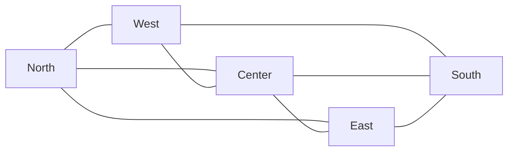

**Mnemonic:** "FBGCBG Layouts = Flow Border Grid Card Box GridBag"

## Question 2(a) [3 marks]

**List out and explain steps to connect database.**

**Answer:**

**Database Connection Steps:**

| Step | Action |
|------|--------|
| **1. Load Driver** | `Class.forName("driver.class")` |
| **2. Create Connection** | `DriverManager.getConnection()` |
| **3. Create Statement** | `connection.createStatement()` |
| **4. Execute Query** | `statement.executeQuery()` |
| **5. Process Results** | `resultSet.next()` |
| **6. Close Resources** | Close all connections |

**Mnemonic:** "LCD EPR = Load Create Driver, Execute Process Results"

## Question 2(b) [4 marks]

**Explain 3-tier architecture with diagram.**

**Answer:**

3-tier architecture separates application into three logical layers for better maintainability.

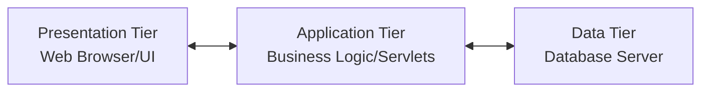

| Tier | Responsibility |
|------|----------------|
| **Presentation** | User interface and user interaction |
| **Application** | Business logic and processing |
| **Data** | Data storage and management |

- **Advantage**: Better scalability and maintainability
- **Example**: Web browser → Web server → Database

**Mnemonic:** "PAD = Presentation Application Data"

## Question 2(c) [7 marks]

**Describe JDBC API with interfaces and classes.**

**Answer:**

**JDBC API Components:**

| Type | Component | Purpose |
|------|-----------|---------|
| **Interface** | Connection | Database connection |
| **Interface** | Statement | SQL execution |
| **Interface** | ResultSet | Query results |
| **Interface** | PreparedStatement | Precompiled SQL |
| **Class** | DriverManager | Driver management |
| **Class** | SQLException | Error handling |

**JDBC Architecture:**

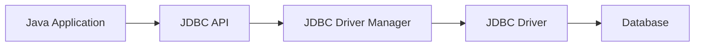

- **Core Interfaces**: Connection, Statement, ResultSet, PreparedStatement
- **Key Classes**: DriverManager for connection management
- **Exception Handling**: SQLException for database errors

**Mnemonic:** "CSRP Classes = Connection Statement ResultSet PreparedStatement"

## Question 2(a OR) [3 marks]

**List out advantages and disadvantages of JDBC.**

**Answer:**

**JDBC Advantages vs Disadvantages:**

| Advantages | Disadvantages |
|------------|---------------|
| **Platform Independent** | **Performance Overhead** |
| **Standard API** | **Complex Configuration** |
| **Multiple Database Support** | **Limited ORM Features** |

- **Benefits**: Write once, run anywhere with any database
- **Drawbacks**: Requires manual SQL and connection management

**Mnemonic:** "PSM vs PCL = Platform Standard Multiple vs Performance Complex Limited"

## Question 2(b OR) [4 marks]

**Explain 2-tier architecture with diagram.**

**Answer:**

2-tier architecture directly connects client to database server.

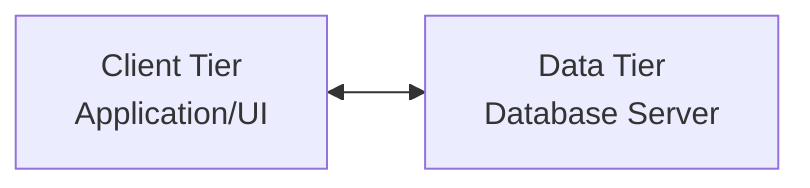

| Tier | Responsibility |
|------|----------------|
| **Client** | User interface and business logic |
| **Server** | Data storage and management |

- **Advantage**: Simple architecture, direct communication
- **Disadvantage**: Limited scalability, tight coupling
- **Example**: Desktop application connecting directly to database

**Mnemonic:** "CD = Client Data (direct connection)"

## Question 2(c OR) [7 marks]

**List out JDBC driver types and Explain TYPE-4.**

**Answer:**

**JDBC Driver Types:**

| Type | Name | Description |
|------|------|-------------|
| **Type-1** | JDBC-ODBC Bridge | Uses ODBC driver |
| **Type-2** | Native-API Driver | Part Java, part native |
| **Type-3** | Network Protocol Driver | Pure Java, middleware |
| **Type-4** | Native Protocol Driver | Pure Java, direct |

**TYPE-4 Driver Explanation:**

- **Pure Java**: Completely written in Java
- **Direct Communication**: Directly communicates with database
- **Platform Independent**: No native libraries required
- **Best Performance**: Fastest among all types
- **Examples**: MySQL Connector/J, PostgreSQL JDBC

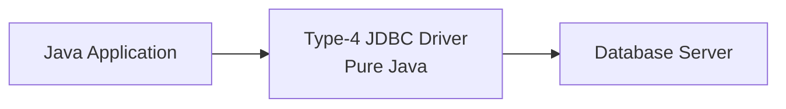

**Mnemonic:** "ONNN Drivers = ODBC Native Network Native-pure"

## Question 3(a) [3 marks]

**Explain Application of servlet.**

**Answer:**

**Servlet Applications:**

| Application | Usage |
|-------------|-------|
| **Web Forms** | Process HTML form data |
| **Database Operations** | Connect and manipulate database |
| **Session Management** | Track user sessions |
| **File Upload** | Handle file uploads |

- **Primary Use**: Server-side Java programs for web applications
- **Common Tasks**: Request processing, response generation

**Mnemonic:** "WDSF = Web Database Session File"

## Question 3(b) [4 marks]

**Explain difference between Applet and Servlet.**

**Answer:**

| Feature | Applet | Servlet |
|---------|--------|---------|
| **Execution** | Client-side (browser) | Server-side (web server) |
| **Purpose** | User interface | Request processing |
| **Security** | Restricted (sandbox) | Full server access |
| **Performance** | Limited by client | Server resources |

- **Applet**: Runs in web browser, limited capabilities
- **Servlet**: Runs on web server, full Java capabilities

**Mnemonic:** "Client vs Server = Applet vs Servlet"

## Question 3(c) [7 marks]

**Explain life cycle of a servlet in detail.**

**Answer:**

**Servlet Life Cycle:**

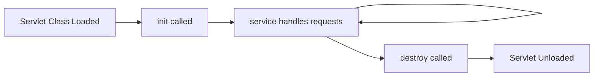

| Phase | Method | Description |
|-------|--------|-------------|
| **Loading** | Class loading | Web container loads servlet class |
| **Initialization** | `init()` | Called once, setup resources |
| **Service** | `service()` | Handles each request (doGet/doPost) |
| **Destruction** | `destroy()` | Cleanup before unloading |

- **Thread Safety**: Multiple requests handled concurrently
- **Single Instance**: One servlet instance handles all requests
- **Container Managed**: Web container manages lifecycle

**Mnemonic:** "LISD = Load Init Service Destroy"

## Question 3(a OR) [3 marks]

**Explain web.xml file in servlet.**

**Answer:**

**web.xml Purpose:**

| Element | Description |
|---------|-------------|
| **Deployment Descriptor** | Configuration file for web application |
| **Servlet Mapping** | Maps URL patterns to servlets |
| **Initialization** | Servlet parameters and load order |

- **Location**: WEB-INF directory
- **Format**: XML configuration file

**Mnemonic:** "DMI = Deployment Mapping Initialization"

## Question 3(b OR) [4 marks]

**List out and Explain feature of servlet.**

**Answer:**

**Servlet Features:**

| Feature | Description |
|---------|-------------|
| **Platform Independent** | Write once, run anywhere |
| **Server-side** | Executes on web server |
| **Protocol Independent** | Supports HTTP, FTP, etc. |
| **Persistent** | Stays in memory between requests |
| **Secure** | Built-in security features |

- **Performance**: Better than CGI scripts
- **Scalability**: Handles multiple requests efficiently

**Mnemonic:** "PSPPS = Platform Server Protocol Persistent Secure"

## Question 3(c OR) [7 marks]

**Explain session tracking in servlet.**

**Answer:**

**Session Tracking Methods:**

| Method | Description |
|--------|-------------|
| **Cookies** | Small data stored in browser |
| **URL Rewriting** | Session ID in URL |
| **Hidden Form Fields** | Session data in forms |
| **HttpSession** | Server-side session object |

**HttpSession Implementation:**

```java
HttpSession session = request.getSession();
session.setAttribute("user", username);
String user = (String) session.getAttribute("user");
```

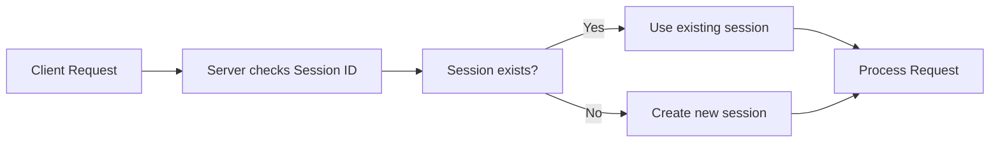

- **Purpose**: Maintain state across HTTP requests
- **HttpSession**: Most commonly used method

**Mnemonic:** "CUHH = Cookies URL Hidden HttpSession"

## Question 4(a) [3 marks]

**Explain architecture of JSP with diagram.**

**Answer:**

**JSP Architecture:**

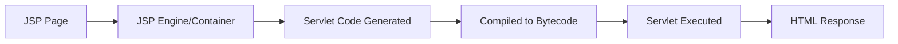

| Component | Role |
|-----------|------|
| **JSP Engine** | Translates JSP to servlet |
| **Web Container** | Manages JSP lifecycle |
| **Generated Servlet** | Actual execution unit |

**Mnemonic:** "JSP = Java Server Pages (Page to Servlet)"

## Question 4(b) [4 marks]

**Explain JSP scripting elements with example.**

**Answer:**

**JSP Scripting Elements:**

| Element | Syntax | Purpose |
|---------|--------|---------|
| **Scriptlet** | `<% code %>` | Java code block |
| **Expression** | `<%= expression %>` | Output value |
| **Declaration** | `<%! declaration %>` | Variables/methods |

**Examples:**

```jsp
<%! int count = 0; %>               <!-- Declaration -->
<% count++; %>                      <!-- Scriptlet -->
<%= "Count: " + count %>            <!-- Expression -->
```

**Mnemonic:** "SED = Scriptlet Expression Declaration"

## Question 4(c) [7 marks]

**Explain JSP life cycle.**

**Answer:**

**JSP Life Cycle Phases:**

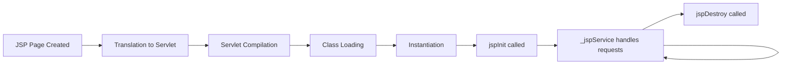

| Phase | Description |
|-------|-------------|
| **Translation** | JSP converted to servlet source |
| **Compilation** | Servlet source compiled to bytecode |
| **Loading** | Servlet class loaded by JVM |
| **Instantiation** | Servlet object created |
| **Initialization** | `jspInit()` method called |
| **Request Processing** | `_jspService()` handles requests |
| **Destruction** | `jspDestroy()` cleanup method |

- **Container Managed**: Web container handles entire lifecycle
- **Automatic**: Translation and compilation happen automatically

**Mnemonic:** "TCLIIRD = Translation Compilation Loading Instantiation Init Request Destroy"

## Question 4(a OR) [3 marks]

**Explain difference between JSP and Servlet.**

**Answer:**

| Feature | JSP | Servlet |
|---------|-----|---------|
| **Code Style** | HTML with Java | Pure Java code |
| **Development** | Easier for UI | Better for logic |
| **Compilation** | Automatic | Manual |
| **Modification** | No recompilation needed | Requires recompilation |

**Mnemonic:** "HTML vs Java = JSP vs Servlet"

## Question 4(b OR) [4 marks]

**List out and Explain advantage of JSP.**

**Answer:**

**JSP Advantages:**

| Advantage | Description |
|-----------|-------------|
| **Easy Development** | HTML-like syntax with Java |
| **Automatic Compilation** | No manual compilation needed |
| **Platform Independent** | Runs on any Java-enabled server |
| **Separation of Concerns** | Design separated from logic |
| **Reusable Components** | Tag libraries and beans |

- **Developer Friendly**: Web designers can work with JSP easily
- **Maintenance**: Easier to modify than servlets

**Mnemonic:** "EAPSR = Easy Automatic Platform Separation Reusable"

## Question 4(c OR) [7 marks]

**What is cookie? Explain how to Read and delete cookie using JSP page.**

**Answer:**

**Cookie Overview:**
Cookie is a small piece of data stored on client's browser to maintain state.

**Cookie Operations:**

| Operation | JSP Code |
|-----------|----------|
| **Create** | `Cookie cookie = new Cookie("name", "value");` |
| **Add** | `response.addCookie(cookie);` |
| **Read** | `Cookie[] cookies = request.getCookies();` |
| **Delete** | `cookie.setMaxAge(0);` |

**Reading Cookie Example:**

```jsp
<%
Cookie[] cookies = request.getCookies();
if (cookies != null) {
    for (Cookie cookie : cookies) {
        if ("username".equals(cookie.getName())) {
            out.println("User: " + cookie.getValue());
        }
    }
}
%>
```

**Deleting Cookie Example:**

```jsp
<%
Cookie cookie = new Cookie("username", "");
cookie.setMaxAge(0);
response.addCookie(cookie);
%>
```

**Mnemonic:** "CARD = Create Add Read Delete"

## Question 5(a) [3 marks]

**Explain importance of MVC architecture.**

**Answer:**

**MVC Importance:**

| Benefit | Description |
|---------|-------------|
| **Separation of Concerns** | Logic, presentation, data separated |
| **Maintainability** | Easy to modify individual components |
| **Testability** | Components can be tested independently |

- **Code Organization**: Better structure and organization
- **Team Development**: Multiple developers can work simultaneously

**Mnemonic:** "SMT = Separation Maintainability Testability"

## Question 5(b) [4 marks]

**Explain Aspect oriented programming and dependency injection in brief.**

**Answer:**

**Aspect Oriented Programming (AOP):**

| Concept | Description |
|---------|-------------|
| **Cross-cutting Concerns** | Logging, security, transactions |
| **Aspects** | Modular units of cross-cutting functionality |
| **Join Points** | Points where aspects are applied |

**Dependency Injection (DI):**

| Concept | Description |
|---------|-------------|
| **Inversion of Control** | Dependencies provided externally |
| **Loose Coupling** | Objects don't create dependencies |
| **Configuration** | Dependencies configured externally |

**Mnemonic:** "AOP = Aspects Over Points, DI = Dependencies Injected"

## Question 5(c) [7 marks]

**Explain MVC architecture.**

**Answer:**

**MVC Components:**

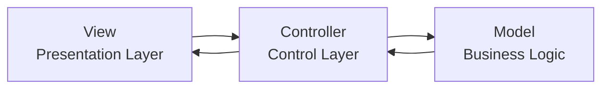

| Component | Responsibility |
|-----------|----------------|
| **Model** | Business logic and data management |
| **View** | User interface and presentation |
| **Controller** | Request handling and flow control |

**MVC Flow:**

1. **User Request** → Controller receives request
2. **Controller** → Processes request, calls Model
3. **Model** → Performs business logic, returns data
4. **Controller** → Selects appropriate View
5. **View** → Renders response to user

**Advantages:**

- **Maintainability**: Clear separation of responsibilities
- **Reusability**: Components can be reused
- **Testability**: Each layer can be tested independently

**Mnemonic:** "MVC = Model View Controller (Business UI Control)"

## Question 5(a OR) [3 marks]

**Explain advantages of MVC architecture.**

**Answer:**

**MVC Advantages:**

| Advantage | Description |
|-----------|-------------|
| **Code Reusability** | Components can be reused across applications |
| **Parallel Development** | Multiple developers work on different layers |
| **Easy Testing** | Each component tested independently |
| **Maintenance** | Changes in one layer don't affect others |

**Mnemonic:** "CPEM = Code Parallel Easy Maintenance"

## Question 5(b OR) [4 marks]

**Explain difference between spring and spring boot.**

**Answer:**

| Feature | Spring | Spring Boot |
|---------|--------|-------------|
| **Configuration** | Manual XML/Java config | Auto-configuration |
| **Setup Time** | More setup required | Minimal setup |
| **Embedded Server** | External server needed | Built-in server |
| **Dependencies** | Manual dependency management | Starter dependencies |

- **Spring**: Comprehensive framework requiring configuration
- **Spring Boot**: Convention over configuration approach

**Mnemonic:** "Manual vs Auto = Spring vs SpringBoot"

## Question 5(c OR) [7 marks]

**Explain architecture of Spring framework.**

**Answer:**

**Spring Framework Architecture:**

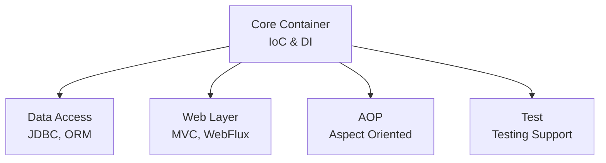

**Spring Modules:**

| Module | Purpose |
|--------|---------|
| **Core Container** | IoC container, dependency injection |
| **Data Access** | JDBC, ORM, transaction management |
| **Web** | Web MVC, REST services |
| **AOP** | Aspect-oriented programming |
| **Security** | Authentication and authorization |
| **Test** | Testing support and mock objects |

**Key Features:**

- **IoC Container**: Manages object creation and dependencies
- **AOP Support**: Cross-cutting concerns handling
- **Transaction Management**: Declarative transaction support
- **MVC Framework**: Web application development

**Mnemonic:** "CDWAST = Core Data Web AOP Security Test"
