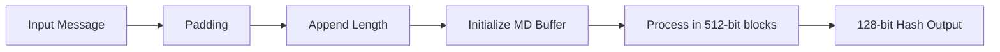
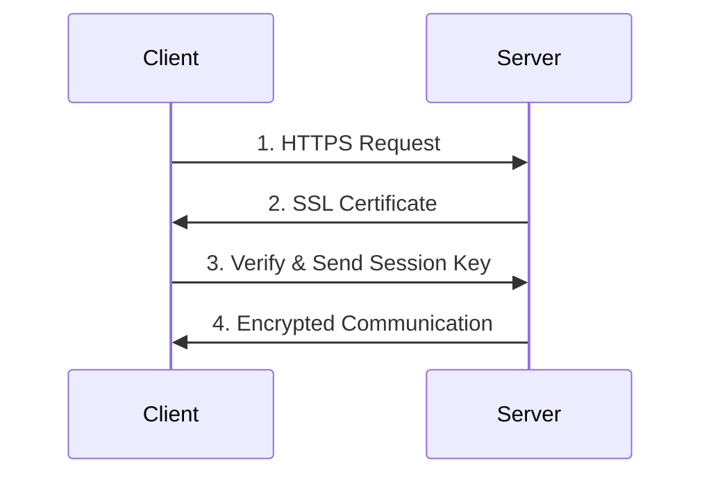
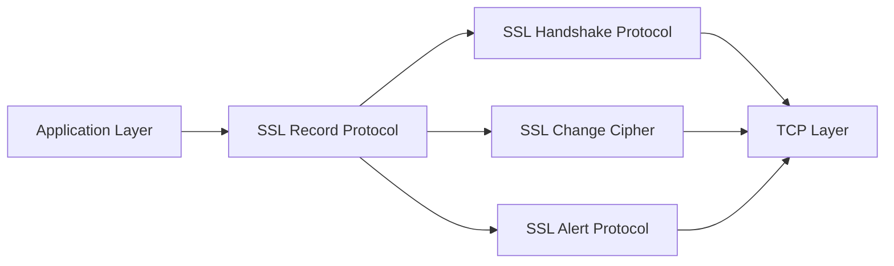
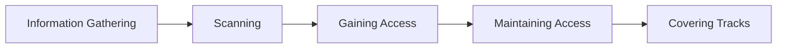
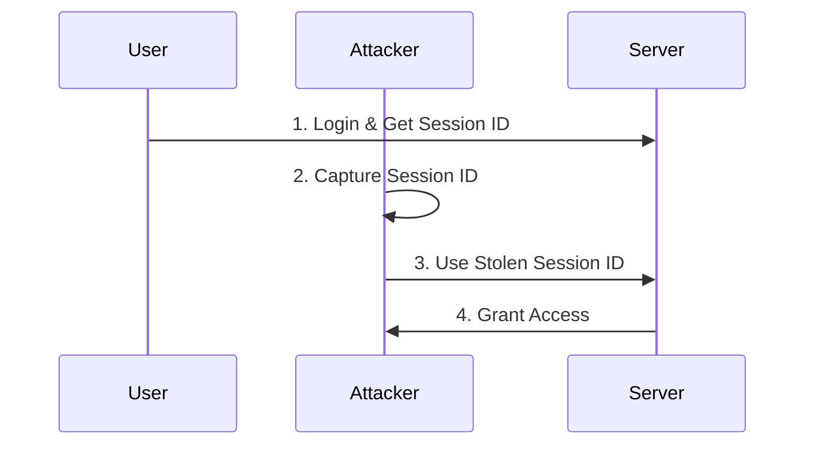
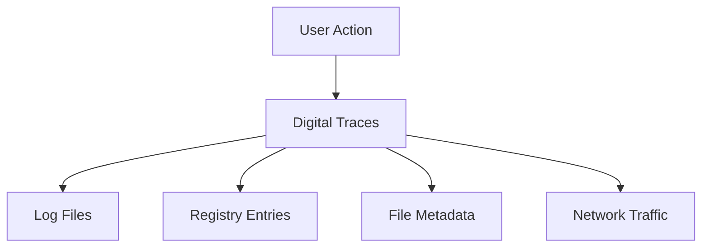
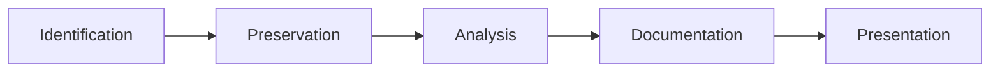

## પ્રશ્ન 1(અ) [3 ગુણ]

**ઉદાહરણ સાથે CIA ત્રિપુટીનું વર્ણન કરો.**

**જવાબ**:

**CIA ત્રિપુટી તુલના કોષ્ટક:**

| ઘટક | વ્યાખ્યા | ઉદાહરણ |
|-----------|------------|---------|
| **ગુપ્તતા (Confidentiality)** | ડેટા માત્ર અધિકૃત વપરાશકર્તાઓને જ ઉપલબ્ધ હોય | બેંક એકાઉન્ટની વિગતો માત્ર એકાઉન્ટ ધારકને જ દેખાવી જોઈએ |
| **અખંડતા (Integrity)** | ડેટા સચોટ અને અપરિવર્તિત રહે | મેડિકલ રેકોર્ડ અધિકૃતતા વિના બદલાવા જોઈએ નહીં |
| **ઉપલબ્ધતા (Availability)** | સિસ્ટમ અને ડેટા જરૂર પડે ત્યારે ઉપલબ્ધ હોય | ATM સેવાઓ ગ્રાહકો માટે 24/7 ઉપલબ્ધ હોવી જોઈએ |

**મેમરી ટ્રીક:** "ગુઆ" - ગુપ્તતા, અખંડતા, ઉપલબ્ધતા

---

## પ્રશ્ન 1(બ) [4 ગુણ]

**પબ્લિક કી અને પ્રાઇવેટ કી ક્રિપ્ટોગ્રાફી સમજાવો.**

**જવાબ**:

**મુખ્ય તફાવતો કોષ્ટક:**

| પાસું | Public Key Cryptography | Private Key Cryptography |
|--------|------------------------|-------------------------|
| **વપરાતી કી** | બે કી (public + private) | એક શેર કરેલી કી |
| **કી વિતરણ** | Public કી ખુલ્લેઆમ શેર કરી શકાય | કી ગુપ્ત રીતે શેર કરવી પડે |
| **ઝડપ** | ધીમી encryption/decryption | ઝડપી operations |
| **સુરક્ષા** | વધુ સુરક્ષિત, કી શેરિંગ સમસ્યા નથી | ઓછી સુરક્ષા કી વિતરણને કારણે |

**મુખ્ય મુદ્દાઓ:**

- **Public Key**: asymmetric encryption નો ઉપયોગ કરે છે
- **Private Key**: symmetric encryption નો ઉપયોગ કરે છે
- **Digital Signatures**: Public કી non-repudiation શક્ય બનાવે છે
- **કી મેનેજમેન્ટ**: Private કી સુરક્ષિત વિતરણની જરૂર છે

**મેમરી ટ્રીક:** "PASS" - Public Asymmetric, Symmetric Secret

---

## પ્રશ્ન 1(ક) [7 ગુણ]

**વિવિધ સિક્યુરિટી સર્વિસ અને સિક્યુરિટી મેકેનિઝમ સમજાવો.**

**જવાબ**:

**સિક્યુરિટી સર્વિસ કોષ્ટક:**

| સર્વિસ | હેતુ | મેકેનિઝમ ઉદાહરણ |
|---------|---------|------------------|
| **Authentication** | વપરાશકર્તાની ઓળખ ચકાસવી | Passwords, Biometrics |
| **Authorization** | પ્રવેશ પરવાનગીઓ નિયંત્રિત કરવી | Access Control Lists |
| **Confidentiality** | ડેટાની ગોપનીયતા સુરક્ષિત કરવી | Encryption (AES, RSA) |
| **Integrity** | ડેટાની સચોટતા સુનિશ્ચિત કરવી | Digital signatures, Hashing |
| **Non-repudiation** | ક્રિયાઓના ઇનકારને અટકાવવો | Digital certificates |
| **Availability** | સેવાની પહોંચ સુનિશ્ચિત કરવી | Firewalls, Backup systems |

**સિક્યુરિટી મેકેનિઝમ:**

- **Encryption**: plaintext ને ciphertext માં ફેરવે છે
- **Digital Signatures**: authentication અને integrity પૂરી પાડે છે
- **Access Control**: અનધિકૃત પ્રવેશ પર પ્રતિબંધ મૂકે છે
- **Audit Trails**: સિક્યુરિટી ઇવેન્ટ્સ મોનિટર અને લોગ કરે છે

**મેમરી ટ્રીક:** "ACIANA" - Authentication, Confidentiality, Integrity, Authorization, Non-repudiation, Availability

---

## પ્રશ્ન 1(ક) OR [7 ગુણ]

**MD5 હેશિંગ અલ્ગોરિધમ સમજાવો.**

**જવાબ**:

**MD5 અલ્ગોરિધમ પ્રક્રિયા:**

**MD5 લાક્ષણિકતાઓ કોષ્ટક:**

| ગુણધર્મ | મૂલ્ય |
|----------|-------|
| **હેશ સાઇઝ** | 128 bits (16 bytes) |
| **બ્લોક સાઇઝ** | 512 bits |
| **રાઉન્ડ્સ** | 64 rounds |
| **સુરક્ષા સ્થિતિ** | ક્રિપ્ટોગ્રાફિકલી ભાંગી ગયેલ |

**મુખ્ય લક્ષણો:**

- **One-way Function**: હેશથી મૂળ માં પાછા ફેરવી શકાતું નથી
- **નિશ્ચિત આઉટપુટ**: હંમેશા 128-bit હેશ ઉત્પન્ન કરે છે
- **Avalanche Effect**: નાનો ઇનપુટ ફેરફાર મોટો આઉટપુટ ફેરફાર બનાવે છે
- **Collision Vulnerable**: ઘણા ઇનપુટ્સ સમાન હેશ ઉત્પન્ન કરી શકે છે

**મેમરી ટ્રીક:** "MD5 FORB" - Message Digest 5, Fixed Output, Rounds 64, Broken security

---

## પ્રશ્ન 2(અ) [3 ગુણ]

**ફાયરવોલ શું છે? ફાયરવોલના પ્રકારોની યાદી આપો.**

**જવાબ**:

**ફાયરવોલ વ્યાખ્યા:** નેટવર્ક સિક્યુરિટી ઉપકરણ જે પૂર્વનિર્ધારિત નિયમોના આધારે આવતા/જતા ટ્રાફિકને મોનિટર અને નિયંત્રિત કરે છે.

**ફાયરવોલ પ્રકારો કોષ્ટક:**

| પ્રકાર | ઓપરેશન લેવલ | ઉદાહરણ |
|------|----------------|---------|
| **Packet Filtering** | Network Layer | iptables |
| **Stateful Inspection** | Session Layer | Cisco ASA |
| **Application Gateway** | Application Layer | Proxy servers |
| **Next-Gen Firewall** | Multiple Layers | Palo Alto |

**મેમરી ટ્રીક:** "PSAN" - Packet, Stateful, Application, Next-gen

---

## પ્રશ્ન 2(બ) [4 ગુણ]

**વ્યાખ્યાયિત કરો: HTTPS અને HTTPS ના કાર્યનું વર્ણન કરો.**

**જવાબ**:

**HTTPS વ્યાખ્યા:** HTTP Secure - SSL/TLS protocols નો ઉપયોગ કરીને HTTP નું એન્ક્રિપ્ટેડ વર્ઝન.

**HTTPS કાર્ય પ્રક્રિયા:**

**મુખ્ય ઘટકો:**

- **SSL/TLS**: એન્ક્રિપ્શન લેયર પૂરી પાડે છે
- **Digital Certificates**: સર્વર આઇડેન્ટિટી ચકાસે છે
- **Port 443**: ડિફોલ્ટ HTTPS પોર્ટ
- **End-to-end Encryption**: ટ્રાન્ઝિટમાં ડેટાની સુરક્ષા કરે છે

**મેમરી ટ્રીક:** "HTTPS SDP4" - Secure, Digital certs, Port 443

---

## પ્રશ્ન 2(ક) [7 ગુણ]

**Active attack અને passive attack ની વિગતવાર સમજૂતી આપો.**

**જવાબ**:

**હુમલા પ્રકારોની તુલના:**

| પાસું | Active Attack | Passive Attack |
|--------|---------------|----------------|
| **શોધ** | સરળતાથી શોધી શકાય છે | શોધવું મુશ્કેલ |
| **સિસ્ટમ પર અસર** | સિસ્ટમ/ડેટામાં ફેરફાર કરે છે | માત્ર ડેટાનું અવલોકન કરે છે |
| **ઉદાહરણો** | DoS, Man-in-middle | Eavesdropping, Traffic analysis |
| **અટકાવવાની રીત** | Firewalls, IDS | Encryption, Physical security |

**Active Attack પ્રકારો:**

- **Masquerade**: અધિકૃત વપરાશકર્તાની નકલ કરવી
- **Replay**: માન્ય ડેટા ટ્રાન્સમિશનને ફરીથી મોકલવું
- **Modification**: સંદેશાની સામગ્રીમાં ફેરફાર કરવો
- **Denial of Service**: કાયદેસર પ્રવેશને અટકાવવો

**Passive Attack પ્રકારો:**

- **Traffic Analysis**: કમ્યુનિકેશન પેટર્નનો અભ્યાસ
- **Eavesdropping**: કમ્યુનિકેશનની મોનિટરિંગ
- **Footprinting**: સિસ્ટમ માહિતી એકત્રિત કરવી

**મેમરી ટ્રીક:** "Active MRMD, Passive TEF" - Masquerade/Replay/Modify/DoS, Traffic/Eavesdrop/Footprint

---

## પ્રશ્ન 2(અ) OR [3 ગુણ]

**Digital signature શું છે? તેના ગુણધર્મો સમજાવો.**

**જવાબ**:

**Digital Signature:** ક્રિપ્ટોગ્રાફિક મેકેનિઝમ જે authentication, integrity, અને non-repudiation પૂરી પાડે છે.

**ગુણધર્મો કોષ્ટક:**

| ગુણધર્મ | વર્ણન |
|----------|-------------|
| **Authentication** | મોકલનારની ઓળખ ચકાસે છે |
| **Integrity** | સંદેશો અપરિવર્તિત છે તેની ખાતરી કરે છે |
| **Non-repudiation** | મોકલનારનો ઇનકાર અટકાવે છે |
| **Unforgeable** | Private કી વિના બનાવી શકાતું નથી |

**મેમરી ટ્રીક:** "AINU" - Authentication, Integrity, Non-repudiation, Unforgeable

---

## પ્રશ્ન 2(બ) OR [4 ગુણ]

**વ્યાખ્યાયિત કરો: ટ્રોજન્સ, રૂટકિટ, બેકડોર્સ, કીલોગર**

**જવાબ**:

**મેલવેર પ્રકારો કોષ્ટક:**

| પ્રકાર | વ્યાખ્યા | મુખ્ય કાર્ય |
|------|------------|------------------|
| **Trojans** | કાયદેસર સોફ્ટવેરના વેશમાં દુષ્ટ કોડ | અનધિકૃત પ્રવેશ પૂરો પાડવો |
| **Rootkit** | અન્ય મેલવેરની હાજરી છુપાવતું સોફ્ટવેર | દુષ્ટ પ્રવૃત્તિઓ છુપાવવી |
| **Backdoors** | સુરક્ષાને બાયપાસ કરતું ગુપ્ત પ્રવેશદ્વાર | દૂરસ્થ અનધિકૃત પ્રવેશ |
| **Keylogger** | વપરાશકર્તાના કીસ્ટ્રોક રેકોર્ડ કરે છે | પાસવર્ડ/સંવેદનશીલ ડેટાની ચોરી |

**મેમરી ટ્રીક:** "TRBK" - Trojans છુપાવે, Rootkits ગુપ્ત કરે, Backdoors બાયપાસ કરે, Keyloggers રેકોર્ડ કરે

---

## પ્રશ્ન 2(ક) OR [7 ગુણ]

**Secure Socket Layer સમજાવો.**

**જવાબ**:

**SSL આર્કિટેક્ચર:**

**SSL ઘટકો કોષ્ટક:**

| ઘટક | કાર્ય |
|-----------|----------|
| **Record Protocol** | મૂળભૂત સુરક્ષા સેવાઓ પૂરી પાડે છે |
| **Handshake Protocol** | સુરક્ષા પેરામીટર્સ સ્થાપિત કરે છે |
| **Change Cipher** | એન્ક્રિપ્શન ફેરફારોનો સંકેત આપે છે |
| **Alert Protocol** | એરર સ્થિતિઓ સંભાળે છે |

**SSL પ્રક્રિયા:**

- **Handshake**: સુરક્ષા પેરામીટર્સની વાતચીત
- **Authentication**: સર્વર આઇડેન્ટિટી ચકાસવી
- **Key Exchange**: સેશન કી સ્થાપિત કરવી
- **Encryption**: સુરક્ષિત ડેટા ટ્રાન્સમિશન

**મેમરી ટ્રીક:** "SSL RHCA-HAKE" - Record/Handshake/Change/Alert, Handshake/Auth/Key/Encrypt

---

## પ્રશ્ન 3(અ) [3 ગુણ]

**સાયબર ક્રાઇમ અને સાયબર ક્રિમિનલને વિગતવાર સમજાવો.**

**જવાબ**:

**વ્યાખ્યાઓ કોષ્ટક:**

| શબ્દ | વ્યાખ્યા |
|------|------------|
| **સાયબર ક્રાઇમ** | કમ્પ્યુટર/ઇન્ટરનેટનો ઉપયોગ કરીને કરાતી ગુનાહિત પ્રવૃત્તિઓ |
| **સાયબર ક્રિમિનલ** | ડિજિટલ ટેકનોલોજીનો ઉપયોગ કરીને ગુના કરતી વ્યક્તિ |

**સાયબર ક્રિમિનલ પ્રકારો:**

- **Script Kiddies**: ઊંડા જ્ઞાન વિના હાલના ટૂલ્સનો ઉપયોગ કરે છે
- **Hacktivists**: રાજકીય/સામાજિક કારણોથી પ્રેરિત
- **Organized Crime**: વ્યાવસાયિક ગુનાહિત જૂથો
- **State-sponsored**: સરકાર દ્વારા સમર્થિત હુમલાખોરો

**મેમરી ટ્રીક:** "SSHT" - Script kiddies, State-sponsored, Hacktivists, Teams organized

---

## પ્રશ્ન 3(બ) [4 ગુણ]

**સાયબર સ્ટોકિંગ અને સાયબર બુલિંગનું વિગતવાર વર્ણન કરો.**

**જવાબ**:

**તુલના કોષ્ટક:**

| પાસું | સાયબર સ્ટોકિંગ | સાયબર બુલિંગ |
|--------|----------------|----------------|
| **લક્ષ્ય** | ચોક્કસ વ્યક્તિ (મોટે ભાગે પુખ્ત) | મોટે ભાગે બાળકો/સાથીદારો |
| **અવધિ** | લાંબા ગાળાની પરેશાની | એક વખતની અથવા પુનરાવર્તિત હોઈ શકે |
| **હેતુ** | ધાક, નિયંત્રણ | અપમાન, સામાજિક બહિષ્કાર |
| **પદ્ધતિઓ** | મોનિટરિંગ, ધમકીભર્યા સંદેશાઓ | સોશિયલ મીડિયા પરેશાની, અફવાઓ ફેલાવવી |

**સામાન્ય લાક્ષણિકતાઓ:**

- **ડિજિટલ પ્લેટફોર્મ**: સોશિયલ મીડિયા, ઇમેઇલ, મેસેજિંગ એપ્સ
- **અનામી**: ગુનેગારો મોટે ભાગે ઓળખ છુપાવે છે
- **માનસિક અસર**: ભાવનાત્મક તકલીફ પહોંચાડે છે
- **કાયદેસરી પરિણામો**: સાયબર કાયદાઓનું ઉલ્લંઘન કરે છે

**મેમરી ટ્રીક:** "STAL-BULL DPAL" - Digital platforms, Psychological impact, Anonymity, Legal issues

---

## પ્રશ્ન 3(ક) [7 ગુણ]

**સાયબર ક્રાઇમમાં પ્રોપર્ટી બેઇઝ ક્લાસિફિકેશન સમજાવો.**

**જવાબ**:

**પ્રોપર્ટી-આધારિત સાયબર ક્રાઇમ વર્ગીકરણ:**

| ગુનો પ્રકાર | વર્ણન | ઉદાહરણ |
|------------|-------------|---------|
| **Credit Card Fraud** | પેમેન્ટ કાર્ડનો અનધિકૃત ઉપયોગ | ચોરાયેલા કાર્ડથી ઓનલાઇન ખરીદારી |
| **Software Piracy** | સોફ્ટવેરની ગેરકાયદેસર કોપીઇંગ/વિતરણ | કોપીરાઇટ સોફ્ટવેર ડાઉનલોડ કરવું |
| **Copyright Infringement** | બૌદ્ધિક સંપત્તિ અધિકારોનું ઉલ્લંઘન | ફિલ્મો/સંગીતની ગેરકાયદેસર શેરિંગ |
| **Trademark Violations** | રજિસ્ટર્ડ ટ્રેડમાર્કનો દુરુપયોગ | બનાવટી બ્રાન્ડ વેબસાઇટ્સ બનાવવી |

**અસર મૂલ્યાંકન:**

- **નાણાકીય નુકસાન**: સીધો નાણાકીય નુકસાન
- **બૌદ્ધિક સંપત્તિ ચોરી**: સ્પર્ધાત્મક લાભનું નુકસાન
- **બ્રાન્ડ પ્રતિષ્ઠા**: કંપનીની છબીને નુકસાન
- **કાયદેસરી ખર્ચ**: કાર્યવાહી/સંરક્ષણનો ખર્ચ

**અટકાવવાના પગલાં:**

- **Digital Rights Management**: કોપીરાઇટ સામગ્રીની સુરક્ષા
- **સુરક્ષિત પેમેન્ટ સિસ્ટમ**: છેતરપિંડી શોધ લાગુ કરવી
- **કાયદેસરી અમલીકરણ**: ઉલ્લંઘન કરનારાઓ સામે કાર્યવાહી
- **જનજાગૃતિ**: કાયદેસર સોફ્ટવેર વિશે શિક્ષિત કરવું

**મેમરી ટ્રીક:** "CSCT-FILP" - Credit/Software/Copyright/Trademark, Financial/Intellectual/Legal/Public

---

## પ્રશ્ન 3(અ) OR [3 ગુણ]

**ડેટા ડિડલિંગ સમજાવો.**

**જવાબ**:

**ડેટા ડિડલિંગ વ્યાખ્યા:** કમ્પ્યુટર સિસ્ટમમાં ઇનપુટ પહેલાં/દરમિયાન ડેટાની અનધિકૃત ફેરબદલી.

**લાક્ષણિકતાઓ કોષ્ટક:**

| પાસું | વિગતો |
|--------|---------|
| **પદ્ધતિ** | ડેટા વેલ્યુઝમાં સહેજ ફેરફાર |
| **શોધ** | શોધવું ખૂબ મુશ્કેલ |
| **લક્ષ્ય** | નાણાકીય/સંવેદનશીલ ડેટા |
| **અસર** | સંચિત નોંધપાત્ર નુકસાન |

**મેમરી ટ્રીક:** "DIDDL" - Data alteration, Input manipulation, Difficult detection, Dollar losses

---

## પ્રશ્ન 3(બ) OR [4 ગુણ]

**સાયબર સ્પાયિંગ અને સાયબર ટેરરિઝમ સમજાવો.**

**જવાબ**:

**તુલના કોષ્ટક:**

| પાસું | સાયબર સ્પાયિંગ | સાયબર ટેરરિઝમ |
|--------|--------------|-----------------|
| **હેતુ** | ગુપ્ત માહિતી એકત્રિત કરવી | ભય/અવ્યવસ્થા ફેલાવવી |
| **લક્ષ્યો** | સરકાર, કોર્પોરેશન્સ | મહત્વપૂર્ણ ઇન્ફ્રાસ્ટ્રક્ચર |
| **પદ્ધતિઓ** | ગુપ્તતા, લાંબા ગાળાની ઘૂસણખોરી | વિનાશક હુમલાઓ |
| **અસર** | માહિતીની ચોરી | ભૌતિક/આર્થિક નુકસાન |

**મુખ્ય લાક્ષણિકતાઓ:**

- **સાયબર સ્પાયિંગ**: રાજ્ય-પ્રાયોજિત, કોર્પોરેટ જાસૂસી
- **સાયબર ટેરરિઝમ**: વિચારધારાથી પ્રેરિત, વ્યાપક વિક્ષેપ
- **સામાન્ય ટૂલ્સ**: મેલવેર, સામાજિક એન્જિનિયરિંગ, ઝીરો-ડે એક્સપ્લોઇટ્સ

**મેમરી ટ્રીક:** "SPY-TER IGSD" - Intelligence/Government/Stealth/Disruption, Terror/Economic/Rapid/Damage

---

## પ્રશ્ન 3(ક) OR [7 ગુણ]

**સાયબર કાયદાના કલમ 65 અને કલમ 66 સમજાવો.**

**જવાબ**:

**IT એક્ટ 2008 કલમો:**

| કલમ | ગુનો | સજા |
|---------|---------|------------|
| **કલમ 65** | કમ્પ્યુટર સોર્સ કોડ સાથે છેડછાડ | 3 વર્ષ સુધીની જેલ અથવા ₹2 લાખ સુધીનો દંડ |
| **કલમ 66** | કમ્પ્યુટર સંબંધિત ગુનાઓ | 3 વર્ષ સુધીની જેલ અથવા ₹5 લાખ સુધીનો દંડ |

**કલમ 65 વિગતો:**

- **અવકાશ**: જાણીજોઈને કમ્પ્યુટર સોર્સ કોડ છુપાવવો, નાશ કરવો, બદલવો
- **આશય**: જ્યારે કમ્પ્યુટર સોર્સ કોડ કાયદા દ્વારા રાખવો/જાળવવો જરૂરી હોય
- **લાગુ**: આવશ્યક સોફ્ટવેર સિસ્ટમ્સની અખંડતાનું રક્ષણ કરે છે

**કલમ 66 વિગતો:**

- **કમ્પ્યુટર હેકિંગ**: કમ્પ્યુટર સિસ્ટમ્સમાં અનધિકૃત પ્રવેશ
- **ડેટા ચોરી**: બેઇમાનીથી ડેટા ડાઉનલોડ, કોપી, એક્સટ્રેક્ટ કરવું
- **સિસ્ટમ નુકસાન**: માહિતી નાશ, ડિલીટ, બદલવી
- **સેવા વિક્ષેપ**: અધિકૃત વ્યક્તિઓને પ્રવેશ ન આપવો

**મેમરી ટ્રીક:** "65-66 CDHD" - Code tampering, Damage, Hacking, Data theft

---

## પ્રશ્ન 4(અ) [3 ગુણ]

**હેકિંગ શું છે? હેકર્સના પ્રકારોની યાદી બનાવો.**

**જવાબ**:

**હેકિંગ વ્યાખ્યા:** નબળાઈઓનો ફાયદો ઉઠાવવા માટે કમ્પ્યુટર સિસ્ટમ્સ/નેટવર્ક્સમાં અનધિકૃત પ્રવેશ.

**હેકર પ્રકારો કોષ્ટક:**

| પ્રકાર | પ્રેરણા | પ્રવૃત્તિ |
|------|------------|----------|
| **White Hat** | સુરક્ષા સુધારણા | નૈતિક પેનિટ્રેશન ટેસ્ટિંગ |
| **Black Hat** | દુષ્ટ ઇરાદો | ગુનાહિત પ્રવૃત્તિઓ |
| **Grey Hat** | મિશ્ર હેતુઓ | અનધિકૃત પરંતુ બિન-દુષ્ટ |
| **Script Kiddie** | માન્યતા | હાલના ટૂલ્સનો ઉપયોગ |

**મેમરી ટ્રીક:** "WBGS Hat" - White, Black, Grey, Script kiddie

---

## પ્રશ્ન 4(બ) [4 ગુણ]

**હેકિંગની વલ્નેરેબિલિટી અને 0-દિવસની પરિભાષા સમજાવો.**

**જવાબ**:

**પરિભાષા કોષ્ટક:**

| શબ્દ | વ્યાખ્યા | જોખમ સ્તર |
|------|------------|------------|
| **Vulnerability** | શોષણ કરી શકાય તેવી સુરક્ષા નબળાઈ | મધ્યમ-ઉચ્ચ |
| **0-Day Vulnerability** | અજ્ઞાત સુરક્ષા ખામી | ગંભીર |
| **0-Day Exploit** | 0-day vulnerability માટે હુમલો કોડ | ગંભીર |
| **0-Day Attack** | 0-day નો સક્રિય શોષણ | ગંભીર |

**મુખ્ય લાક્ષણિકતાઓ:**

- **વિક્રેતાઓને અજ્ઞાત**: કોઈ પેચ ઉપલબ્ધ નથી
- **ઉચ્ચ મૂલ્ય**: ડાર્ક માર્કેટમાં વેચાય છે
- **છુપી**: શોધવું મુશ્કેલ
- **સમય-નિર્ણાયક**: જાહેર થયા પછી મૂલ્ય ઘટે છે

**મેમરી ટ્રીક:** "0-Day UHST" - Unknown, High-value, Stealthy, Time-critical

---

## પ્રશ્ન 4(ક) [7 ગુણ]

**હેકિંગના પાંચ સ્ટેપ્સ સમજાવો.**

**જવાબ**:

**હેકિંગ પ્રક્રિયા ફ્લો:**

**પાંચ સ્ટેપ્સ વિગતવાર:**

| સ્ટેપ | હેતુ | ટૂલ્સ/તકનીકો |
|------|---------|------------------|
| **1. માહિતી એકત્રીકરણ** | લક્ષ્ય માહિતી એકત્રિત કરવી | OSINT, સામાજિક એન્જિનિયરિંગ |
| **2. સ્કેનિંગ** | જીવંત સિસ્ટમ્સ, પોર્ટ્સ ઓળખવા | Nmap, પોર્ટ સ્કેનર્સ |
| **3. પ્રવેશ મેળવવો** | નબળાઈઓનો શોષણ કરવો | Metasploit, કસ્ટમ એક્સપ્લોઇટ્સ |
| **4. પ્રવેશ જાળવવો** | સતત હાજરી સ્થાપિત કરવી | બેકડોર્સ, રૂટકિટ્સ |
| **5. નિશાનો છુપાવવા** | પુરાવાઓ દૂર કરવા | લોગ ડિલીશન, ફાઇલ સફાઈ |

**દરેક સ્ટેપની વિગતો:**

- **માહિતી એકત્રીકરણ**: નિષ્ક્રિય/સક્રિય જાસૂસી
- **સ્કેનિંગ**: નેટવર્ક મેપિંગ, વલ્નેરેબિલિટી મૂલ્યાંકન
- **પ્રવેશ મેળવવો**: પાસવર્ડ હુમલાઓ, બફર ઓવરફ્લો
- **પ્રવેશ જાળવવો**: વિશેષાધિકાર વૃદ્ધિ, બેકડોર ઇન્સ્ટોલેશન
- **નિશાનો છુપાવવા**: એન્ટિ-ફોરેન્સિક્સ તકનીકો

**મેમરી ટ્રીક:** "ISGMC" - Information, Scanning, Gaining, Maintaining, Covering

---

## પ્રશ્ન 4(અ) OR [3 ગુણ]

**કાલી લિનક્સના કોઈપણ ત્રણ બેઝિક કમાન્ડ યોગ્ય ઉદાહરણ સાથે સમજાવો.**

**જવાબ**:

**કાલી લિનક્સ કમાન્ડ્સ કોષ્ટક:**

| કમાન્ડ | હેતુ | ઉદાહરણ |
|---------|---------|---------|
| **nmap** | નેટવર્ક સ્કેનિંગ | `nmap -sS 192.168.1.1` |
| **netcat** | નેટવર્ક યુટિલિટી | `nc -l -p 4444` |
| **john** | પાસવર્ડ ક્રેકિંગ | `john --wordlist=passwords.txt hashes.txt` |

**કમાન્ડ વિગતો:**

- **nmap**: લક્ષ્ય IP પર સ્ટેલ્થ SYN સ્કેન
- **netcat**: કનેક્શન માટે પોર્ટ 4444 પર સાંભળો
- **john**: પાસવર્ડ હેશ પર ડિક્શનરી એટેક

**મેમરી ટ્રીક:** "NNJ" - Nmap સ્કેન કરે, Netcat સાંભળે, John ક્રેક કરે

---

## પ્રશ્ન 4(બ) OR [4 ગુણ]

**સેશન હાઇજેકિંગનું વિગતવાર વર્ણન કરો.**

**જવાબ**:

**સેશન હાઇજેકિંગ પ્રક્રિયા:**

**પ્રકારો અને પદ્ધતિઓ:**

- **Active Hijacking**: હુમલાખોર સક્રિયપણે ભાગ લે છે
- **Passive Hijacking**: સેશન્સનું મોનિટર અને કેપ્ચર કરે છે
- **Network Level**: IP spoofing, ARP poisoning
- **Application Level**: Session ID અનુમાન, XSS

**અટકાવવાના પગલાં:**

- **HTTPS**: સેશન ડેટા એન્ક્રિપ્ટ કરવો
- **સેશન ટાઇમઆઉટ્સ**: સેશનની અવધિ મર્યાદિત કરવી
- **IP બાઇન્ડિંગ**: સેશન્સને IP એડ્રેસ સાથે બાંધવા
- **મજબૂત સેશન IDs**: અણધારી ટોકન્સનો ઉપયોગ

**મેમરી ટ્રીક:** "APNA-HSIS" - Active/Passive/Network/Application, HTTPS/Strong/IP/Session

---

## પ્રશ્ન 4(ક) OR [7 ગુણ]

**રિમોટ એડમિનિસ્ટ્રેશન ટૂલ્સ સમજાવો.**

**જવાબ**:

**RAT વ્યાખ્યા:** કમ્પ્યુટર સિસ્ટમ્સના દૂરસ્થ નિયંત્રણની મંજૂરી આપતું સોફ્ટવેર, મોટે ભાગે દુષ્ટતાથી વપરાય છે.

**RAT કાર્યક્ષમતા કોષ્ટક:**

| કાર્ય | વર્ણન | જોખમ સ્તર |
|----------|-------------|------------|
| **સ્ક્રીન કેપ્ચર** | દૂરસ્થ સ્ક્રીનશોટ લેવા | મધ્યમ |
| **કીલોગિંગ** | કીસ્ટ્રોક રેકોર્ડ કરવા | ઉચ્ચ |
| **ફાઇલ ટ્રાન્સફર** | ફાઇલ અપલોડ/ડાઉનલોડ | ઉચ્ચ |
| **કેમેરા એક્સેસ** | વેબકેમ/માઇક્રોફોન સક્રિય કરવા | ગંભીર |

**કાયદેસર વિ. દુષ્ટ ઉપયોગ:**

| પાસું | કાયદેસર | દુષ્ટ |
|--------|------------|-----------|
| **હેતુ** | IT સપોર્ટ, એડમિનિસ્ટ્રેશન | જાસૂસી, ચોરી |
| **સંમતિ** | વપરાશકર્તા જાગરૂક અને સંમત | જ્ઞાન વિના ઇન્સ્ટોલ |
| **પ્રવેશ** | માત્ર અધિકૃત કર્મચારીઓ | અનધિકૃત હુમલાખોરો |

**શોધ અને અટકાવવું:**

- **એન્ટિવાયરસ**: જાણીતા RAT સિગ્નેચર શોધવા
- **નેટવર્ક મોનિટરિંગ**: અસામાન્ય આઉટબાઉન્ડ કનેક્શન્સ
- **વપરાશકર્તા શિક્ષણ**: શંકાસ્પદ ડાઉનલોડ્સ ટાળવા
- **ફાયરવોલ નિયમો**: અનધિકૃત કનેક્શન્સ બ્લોક કરવા

**સામાન્ય RATs:**

- **TeamViewer**: કાયદેસર દૂરસ્થ પ્રવેશ
- **DarkComet**: દુષ્ટ RAT
- **Poison Ivy**: અદ્યતન સતત ધમકી ટૂલ

**મેમરી ટ્રીક:** "RAT SKFC-ANUM" - Screen/Key/File/Camera, Antivirus/Network/User/Monitoring

---

## પ્રશ્ન 5(અ) [3 ગુણ]

**મોબાઇલ ફોરેન્સિક્સ સમજાવો.**

**જવાબ**:

**મોબાઇલ ફોરેન્સિક્સ વ્યાખ્યા:** વૈજ્ઞાનિક રીતે સ્વીકૃત પદ્ધતિઓનો ઉપયોગ કરીને મોબાઇલ ઉપકરણોમાંથી ડિજિટલ પુરાવા પુનઃપ્રાપ્ત કરવાની પ્રક્રિયા.

**મુખ્ય પાસાઓ કોષ્ટક:**

| પાસું | વર્ણન |
|--------|-------------|
| **ડેટા પ્રકારો** | કોલ લોગ્સ, SMS, ફોટો, એપ ડેટા |
| **પડકારો** | એન્ક્રિપ્શન, એન્ટિ-ફોરેન્સિક્સ, OS ની વિવિધતા |
| **ટૂલ્સ** | Cellebrite, XRY, Oxygen Suite |
| **કાયદેસર** | કસ્ટડી ચેન, કોર્ટ સ્વીકાર્યતા |

**મેમરી ટ્રીક:** "DCTL" - Data types, Challenges, Tools, Legal requirements

---

## પ્રશ્ન 5(બ) [4 ગુણ]

**ડિજિટલ ફોરેન્સિક્સ શું છે? ડિજિટલ ફોરેન્સિક્સના ફાયદાઓ લખો.**

**જવાબ**:

**ડિજિટલ ફોરેન્સિક્સ વ્યાખ્યા:** કાયદેસરી કાર્યવાહી માટે પુરાવાઓ પુનઃપ્રાપ્ત અને વિશ્લેષણ કરવા માટે ડિજિટલ ઉપકરણોની વૈજ્ઞાનિક તપાસ.

**ફાયદાઓ કોષ્ટક:**

| ફાયદો | વર્ણન |
|-----------|-------------|
| **પુરાવા પુનઃપ્રાપ્તિ** | ડિલીટ/છુપાયેલ ડેટા પુનઃપ્રાપ્ત કરવો |
| **ગુના ઉકેલ** | કેસો માટે મહત્વપૂર્ણ પુરાવા પૂરા પાડવા |
| **ખર્ચ અસરકારક** | પરંપરાગત તપાસ કરતાં સસ્તું |
| **સચોટ પરિણામો** | વૈજ્ઞાનિક પદ્ધતિઓ વિશ્વસનીયતા સુનિશ્ચિત કરે છે |

**વધારાના ફાયદાઓ:**

- **સમય કાર્યક્ષમ**: મેન્યુઅલ તપાસ કરતાં ઝડપી
- **બિન-વિનાશક**: મૂળ પુરાવાઓ સાચવે છે
- **વ્યાપક**: બહુવિધ ડેટા સ્ત્રોતોનું વિશ્લેષણ કરે છે
- **કોર્ટ સ્વીકાર્ય**: કાયદેસર રીતે સ્વીકાર્ય પુરાવા

**મેમરી ટ્રીક:** "ECCA-TNCA" - Evidence/Crime/Cost/Accurate, Time/Non-destructive/Comprehensive/Admissible

---

## પ્રશ્ન 5(ક) [7 ગુણ]

**ડિજિટલ ફોરેન્સિક્સ માં લોકાર્ડના પ્રિન્સિપલ ઓફ એક્સચેન્જને વિગતવાર વર્ણન કરો.**

**જવાબ**:

**લોકાર્ડનો સિદ્ધાંત:** "દરેક સંપર્ક નિશાન છોડે છે" - વસ્તુઓ વચ્ચેની કોઈપણ ક્રિયા સામગ્રીના વિનિમયમાં પરિણમે છે.

**ડિજિટલ એપ્લિકેશન:**

**ડિજિટલ નિશાનો કોષ્ટક:**

| ક્રિયા | ડિજિટલ નિશાન | સ્થાન |
|--------|---------------|----------|
| **ફાઇલ એક્સેસ** | એક્સેસ ટાઇમસ્ટેમ્પ્સ | ફાઇલ સિસ્ટમ મેટાડેટા |
| **વેબ બ્રાઉઝિંગ** | બ્રાઉઝર હિસ્ટરી | બ્રાઉઝર ડેટાબેસ |
| **ઇમેઇલ મોકલવો** | ઇમેઇલ હેડર્સ | મેઇલ સર્વર લોગ્સ |
| **USB કનેક્શન** | ઉપકરણ રજિસ્ટ્રી | Windows રજિસ્ટ્રી |

**ફોરેન્સિક અસરો:**

- **સ્થાયિત્વ**: ડિજિટલ નિશાનો મોટે ભાગે વધુ લાંબા સમય ટકે છે
- **સચોટતા**: ચોક્કસ ટાઇમસ્ટેમ્પ્સ અને ડેટા
- **માત્રા**: મોટી માત્રામાં ટ્રેસ પુરાવા
- **પુનઃપ્રાપ્તિ**: ડિલીટ થયેલ ડેટા પુનઃપ્રાપ્ત કરી શકાય છે

**પુરાવા પ્રકારો:**

- **કાલાનુક્રમિક**: ક્રિયાઓ ક્યારે થઈ
- **અવકાશીય**: ક્રિયાઓ ક્યાં થઈ
- **સંબંધીય**: એન્ટિટી વચ્ચેના જોડાણો
- **વર્તણૂકીય**: વપરાશકર્તા પ્રવૃત્તિના પેટર્ન

**એપ્લિકેશન્સ:**

- **ગુનાહિત કેસો**: હાજરી/ક્રિયાઓ સાબિત કરવી
- **સિવિલ મુકદ્દમાઓ**: વ્યવસાયિક વિવાદો
- **આંતરિક તપાસ**: કર્મચારીઓની ગેરવર્તણૂક
- **ઘટના પ્રતિભાવ**: સુરક્ષા ભંગ વિશ્લેષણ

**મેમરી ટ્રીક:** "LOCARD PVAR-TREB" - Persistence/Volume/Accuracy/Recovery, Temporal/Relational/Evidence/Behavioral

---

## પ્રશ્ન 5(અ) OR [3 ગુણ]

**નેટવર્ક ફોરેન્સિક્સ સમજાવો.**

**જવાબ**:

**નેટવર્ક ફોરેન્સિક્સ વ્યાખ્યા:** માહિતી અને પુરાવા એકત્રિત કરવા માટે નેટવર્ક ટ્રાફિકનું મોનિટરિંગ અને વિશ્લેષણ.

**મુખ્ય ઘટકો કોષ્ટક:**

| ઘટક | કાર્ય |
|-----------|----------|
| **પેકેટ કેપ્ચર** | નેટવર્ક ટ્રાફિક રેકોર્ડ કરવો |
| **ટ્રાફિક વિશ્લેષણ** | કમ્યુનિકેશન પેટર્નનું પરીક્ષણ |
| **પ્રોટોકોલ વિશ્લેષણ** | નેટવર્ક પ્રોટોકોલ્સ ડીકોડ કરવા |
| **ટાઇમલાઇન બનાવવી** | ઘટનાઓનો ક્રમ સ્થાપિત કરવો |

**મેમરી ટ્રીક:** "PTTP" - Packet capture, Traffic analysis, Timeline, Protocol analysis

---

## પ્રશ્ન 5(બ) OR [4 ગુણ]

**ડિજિટલ ફોરેન્સિક તપાસમાં પુરાવા તરીકે CCTV શા માટે મહત્વની ભૂમિકા ભજવે છે તે સમજાવો.**

**જવાબ**:

**CCTV પુરાવાનું મૂલ્ય:**

| પાસું | મહત્વ |
|--------|------------|
| **દ્રશ્ય પુરાવો** | ઘટનાઓના સીધા પુરાવા |
| **ટાઇમસ્ટેમ્પ** | ચોક્કસ સમય સહસંબંધ |
| **સ્થાન ચકાસણી** | ઘટના સ્થળે હાજરી સાબિત કરે છે |
| **વર્તણૂક વિશ્લેષણ** | ક્રિયાઓ અને ઇરાદો દર્શાવે છે |

**ડિજિટલ ફોરેન્સિક્સ એકીકરણ:**

- **મેટાડેટા નિષ્કર્ષણ**: કેમેરા સેટિંગ્સ, ટાઇમસ્ટેમ્પ્સ
- **વીડિયો સુધારણા**: છબીની ગુણવત્તા સુધારવી
- **ફોર્મેટ વિશ્લેષણ**: કમ્પ્રેશન આર્ટિફેક્ટ્સ સમજવા
- **પ્રમાણીકરણ**: વીડિયોની અખંડતા ચકાસવી

**કાયદેસરી વિચારણાઓ:**

- **કસ્ટડી ચેન**: પુરાવાની અખંડતા જાળવવી
- **કોર્ટ સ્વીકાર્યતા**: કાયદેસર પ્રક્રિયાઓ અનુસરવી
- **ગોપનીયતા અધિકારો**: સર્વેલન્સ કાયદાઓનું સન્માન કરવું
- **તકનીકી માન્યતા**: પ્રામાણિકતા સાબિત કરવી

**મેમરી ટ્રીક:** "VTLB-MFAC" - Visual/Timestamp/Location/Behavior, Metadata/Format/Authentication/Chain

---

## પ્રશ્ન 5(ક) OR [7 ગુણ]

**ડિજિટલ ફોરેન્સિક તપાસના તબક્કાઓ સમજાવો.**

**જવાબ**:

**ડિજિટલ ફોરેન્સિક તપાસના તબક્કાઓ:**

**તબક્કાઓની વિગતો કોષ્ટક:**

| તબક્કો | પ્રવૃત્તિઓ | ટૂલ્સ/પદ્ધતિઓ |
|-------|------------|---------------|
| **ઓળખ** | સંભવિત પુરાવા સ્ત્રોતો શોધવા | પ્રારંભિક મૂલ્યાંકન, સીન સર્વે |
| **સંરક્ષણ** | ફેરફાર વિના પુરાવા સુરક્ષિત કરવા | ઇમેજિંગ, હેશ ચકાસણી |
| **વિશ્લેષણ** | સંબંધિત ડેટા માટે પુરાવાઓનું પરીક્ષણ | ફોરેન્સિક સોફ્ટવેર, મેન્યુઅલ સમીક્ષા |
| **દસ્તાવેજીકરણ** | શોધો અને પ્રક્રિયાઓ રેકોર્ડ કરવી | રિપોર્ટ્સ, સ્ક્રીનશોટ્સ, લોગ્સ |
| **રજૂઆત** | હિતધારકોને શોધો રજૂ કરવા | કોર્ટ સાક્ષ્ય, નિષ્ણાત રિપોર્ટ્સ |

**વિગતવાર પ્રવૃત્તિઓ:**

**1. ઓળખ તબક્કો:**

- **પુરાવા સ્ત્રોતો**: કમ્પ્યુટર્સ, ફોન્સ, સર્વર્સ, નેટવર્ક લોગ્સ
- **અવકાશ વ્યાખ્યા**: તપાસની સીમાઓ નક્કી કરવી
- **કાયદેસર અધિકાર**: વોરંટ/પરવાનગીઓ મેળવવી
- **પ્રારંભિક ફોટોગ્રાફી**: સીનની સ્થિતિ દસ્તાવેજીકરણ

**2. સંરક્ષણ તબક્કો:**

- **બિટ-બાય-બિટ ઇમેજિંગ**: ચોક્કસ કોપીઓ બનાવવી
- **હેશ ગણતરી**: અખંડતા ચકાસવી (MD5, SHA)
- **કસ્ટડી ચેન**: પુરાવા ટ્રેઇલ જાળવવી
- **રાઇટ પ્રોટેક્શન**: પુરાવા ફેરફાર અટકાવવો

**3. વિશ્લેષણ તબક્કો:**

- **ડેટા પુનઃપ્રાપ્તિ**: ડિલીટ થયેલી ફાઇલો પુનઃપ્રાપ્ત કરવી
- **કીવર્ડ શોધ**: સંબંધિત માહિતી શોધવી
- **ટાઇમલાઇન વિશ્લેષણ**: ઘટનાઓનું પુનર્નિર્માણ કરવું
- **પેટર્ન ઓળખ**: શંકાસ્પદ પ્રવૃત્તિઓ ઓળખવી

**4. દસ્તાવેજીકરણ તબક્કો:**

- **પદ્ધતિ રેકોર્ડિંગ**: ઉપયોગ કરેલી પ્રક્રિયાઓ દસ્તાવેજીકરણ
- **પુરાવા કેટેલોગિંગ**: બધા શોધો સૂચિબદ્ધ કરવા
- **સ્ક્રીનશોટ કેપ્ચર**: દ્રશ્ય પુરાવા દસ્તાવેજીકરણ
- **રિપોર્ટ તૈયારી**: વ્યાપક તપાસ રિપોર્ટ

**5. રજૂઆત તબક્કો:**

- **નિષ્ણાત સાક્ષ્ય**: કોર્ટમાં હાજરી
- **દ્રશ્ય સહાયતા**: ચાર્ટ્સ, આકૃતિઓ, પ્રદર્શન
- **તકનીકી અનુવાદ**: જટિલ વિભાવનાઓ સમજાવવી
- **ક્રોસ-એક્ઝામિનેશન**: બચાવ પક્ષના પ્રશ્નોના જવાબ

**ગુણવત્તા ખાતરી:**

- **પીઅર રિવ્યુ**: બીજા પરીક્ષકની ચકાસણી
- **ટૂલ માન્યતા**: સોફ્ટવેરની સચોટતા સુનિશ્ચિત કરવી
- **પ્રક્રિયા પાલન**: માનક પ્રોટોકોલ્સ અનુસરવા
- **સતત તાલીમ**: કુશળતા વર્તમાન રાખવી

**કાયદેસરી વિચારણાઓ:**

- **સ્વીકાર્યતા નિયમો**: કોર્ટના ધોરણો પૂરા કરવા
- **ગોપનીયતા સુરક્ષા**: વ્યક્તિગત અધિકારોનું સન્માન કરવું
- **આંતરરાષ્ટ્રીય કાયદો**: ક્રોસ-બોર્ડર તપાસ
- **વ્યાવસાયિક નીતિશાસ્ત્ર**: નિષ્પક્ષતા જાળવવી

**મેમરી ટ્રીક:** "IPADP-ESLR-HTVC-MSCR-ETVI" - Identification/Preservation/Analysis/Documentation/Presentation વિગતવાર પેટા-પ્રવૃત્તિઓ સાથે
